### Topic 4

####  Question 1

You have an Azure subscription that contains a Basic Azure virtual WAN named VirtualWAN1 and the virtual hubs shown in the following table.

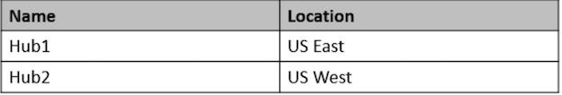

You have an ExpressRoute circuit in the US East Azure region.

You need to create an ExpressRoute association to VirtualWAN1.

What should you do first?

- [ ] A. Upgrade VirtualWAN1 to Standard.
- [ ] B. Create a gateway on Hub1.
- [ ] C. Enable the ExpressRoute premium add-on.
- [X] **D. Create a hub virtual network in US East.**   ✅

A basic Azure virtual WAN does not support express route. You have to upgrade to standard.

There are two types of Virtual WANs. one is the BASIC and the second one is STANDARD. 

BASIC supports only SITE to SITE VPN.

STANDARD supports below configs,

- ExpressRoute
- User VPN (P2S)
- VPN (site-to-site)
- Inter-hub and VNet-to-VNet transiting through the virtual hub
- Azure Firewall
- NVA in a virtual WAN

NOTE: You can upgrade from Basic to Standard, but you cannot revert from Standard back to Basic.

1. Upgrade VirtualWAN1 to Standard.
2. Create a virtual hub in the US East region and associate it with the ExpressRoute circuit.
3. Associate the virtual hub with VirtualWAN1

####  Question 2

You have an Azure subscription that contains a storage account. 

An application sometimes writes duplicate files to the storage account. 

You have a PowerShell script that identifies and deletes duplicate files in the storage account. Currently, the script is run manually after approval from the operations manager

You need to recommend a serverless solution that performs the following actions:

* ✑ Runs the script once an hour to identify whether duplicate files exist 
* ✑ Sends an email notification to the operations manager requesting approval to delete the duplicate files 
* ✑ Processes an email response from the operations manager specifying whether the deletion was approved 
* ✑ Runs the script if the deletion was approved

What should you include in the recommendation?

* A. Azure Logic Apps and Azure Event Grid 
* **B. Azure Logic Apps and Azure Functions**   ✅
* C. Azure Pipelines and Azure Service Fabric 
* D. Azure Functions and Azure Batch

You can schedule a powershell script with Azure Logic Apps

When you want to run code that performs a specific job in your logic apps, you can create your own function by using Azure Functions. 

This service helps you create Node.js, C#, and F# functions so you don't have to build a complete app or infrastructure to run code. You can also call logic apps from inside Azure functions.

#### Question 3

Your company has the infrastructure shown in the following table.

The on-premises Active Directory domain syncs with Azure Active Directory (Azure AD)

Server1 runs an application named App1 that uses LDAP queries to verify user identities in the on-premises Active Directory domain. You plan to migrate Server1 to a virtual machine in Subscription1.

A company security policy states that the virtual machines and services deployed to Subscription1 must be prevented from accessing the on- premises network.

You need to recommend a solution to ensure that App1 continues to function after the migration. The solution must meet the security policy. What should you include in the recommendation?

* A. Azure AD Application Proxy 
* B. the Active Directory Domain Services role on a virtual machine 
* C. an Azure VPN gateway 
* **D. Azure AD Domain Services (Azure AD DS)** ✅

Azure Active Directory Domain Services (Azure AD DS) provides managed domain services such as domain join, group policy, lightweight directory access protocol (LDAP), and Kerberos/NTLM authentication.

You can use Azure AD DS and sync identities needed from Azure AD to Azure AD DS to use legacy protocols like LDAP. Kerberos and NTLM

AD DS in azure on a VM would be easiest option however policy restricts access.

#### Question 4

You need to design a solution that will execute custom C# code in response to an event routed to Azure Event Grid. The solution must meet the following requirements:

* ✑ The executed code must be able to access the private IP address of a Microsoft SQL Server instance that runs on an Azure virtual machine. 
* ✑ Costs must be minimized.

What should you include in the solution?

* A. Azure Logic Apps in the Consumption plan 
* **B. Azure Functions in the Premium plan**  ✅
* C. Azure Functions in the Consumption plan 
* D. Azure Logic Apps in the integrated service environment

**Virtual connectivity is included in the Premium plan.**

Consumption plan cannot access Virtual Network Integration features. 

Virtual network integration allows your function app to access resources inside a virtual network.

**B. Azure Functions in the Premium plan**  ✅

Azure Functions in the Premium plan is the best solution to meet the requirements. With the Premium plan, you can execute custom C# code in response to an event routed to Azure Event Grid. Additionally, the Premium plan allows you to access resources in a virtual network, such as the private IP address of a SQL Server instance running on an Azure virtual machine

Azure Functions in the Consumption plan does not support virtual network integration, which is necessary for accessing the private IP address of the SQL Server instance. Azure Logic Apps in both the Consumption plan and the integrated service environment are not ideal for executing custom C# code and may not be as cost-effective as Azure Functions in the Premium plan.

#### Question 5

You have an on-premises network and an Azure subscription. The on-premises network has several branch offices. 

A branch office in Toronto contains a virtual machine named VM1 that is configured as a file server. Users access the shared files on VM1 from all the offices.

You need to recommend a solution to ensure that the users can access the shared files as quickly as possible if the Toronto branch office is inaccessible

What should you include in the recommendation?

* A. a Recovery Services vault and Windows Server Backup 
* B. Azure blob containers and Azure File Sync 
* C. a Recovery Services vault and Azure Backup 
* **D. an Azure file share and Azure File Sync** ✅

Correct Answer: D

Use Azure File Sync to centralize your organization's file shares in Azure Files, while keeping the flexibility, performance, and compatibility of an on-premises file server. Azure File Sync transforms Windows Server into a quick cache of your Azure file share.

They say "quickly as possible" so an Azure Fileshare with Azure FileSync running looks to be the quickest option to get things accessible again.

Azure file share and sync offers “offline” access if primary server is unavailable as copy is help in cloud endpoint.

#### Question 6

You have an Azure subscription named Subscription1 that is linked to a hybrid Azure Active Directory (Azure AD) tenant. 

You have an on-premises datacenter that does NOT have a VPN connection to Subscription1. The datacenter contains a computer named Server1 that has Microsoft SQL Server 2016 installed. Server is prevented from accessing the internet.

* An Azure logic app resource named LogicApp1 requires write access to a database on Server1. 
* You need to recommend a solution to provide LogicApp1 with the ability to access Server1

What should you recommend deploying on-premises and in Azure? To answer, select the appropriate options in the answer area

**Box 1: An on-premises data gateway**  ✅

For logic apps in global, multi-tenant Azure that connect to on-premises SQL Server, you need to have the on-premises data gateway installed on a local computer and a data gateway resource that's already created in Azure

**Box 2: A connection gateway resource**   ✅

**1. On-premises => c. an on-premises data gateway**

An on-premises data gateway allows you to securely access on-premises data and resources from Azure Logic Apps. In this scenario, deploying an on-premises data gateway on Server1 or another server in the datacenter will enable LogicApp1 to access the SQL Server 2016 database on Server1.

**2. Azure => a. A connection gateway resource**

In Azure, you should deploy a connection gateway resource. This gateway resource will communicate with the on-premises data gateway to provide LogicApp1 with the ability to access the SQL Server 2016 database on Server1 securely.

#### Question 7

Your company develops a web service that is deployed to an Azure virtual machine named VM1. 

The web service allows an API to access real- time data from VM1.

The current virtual machine deployment is shown in the Deployment exhibit

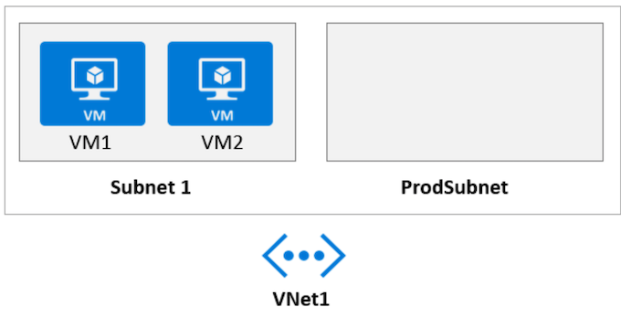

The chief technology officer (CTO) sends you the following email message: "Our developers have deployed the web service to a virtual machine named VM1.

Testing has shown that the API is accessible from VM1 and VM2. Our partners must be able to connect to the API over the Internet. Partners will use this data in applications that they develop."

You deploy an Azure API Management (APIM) service. The relevant API Management configuration is shown in the API exhibit.

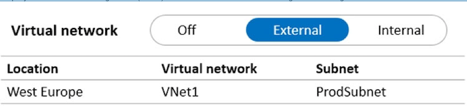

For each of the following statements, select Yes if the statement is true.

Otherwise, select No. NOTE: Each correct selection is worth one point.
 
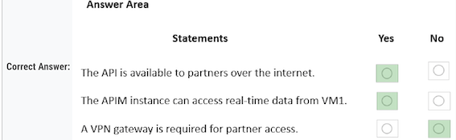

* Yes - **Because we are using an APIM, deployed to a VNET but configured to be "External"** 
* Yes - Because the APIM is deployed in the same vNET as VM1 just in a different subnet. Communication between subnets are enabled by default and there is no mention of otherwise. * No - VPN required because the APIM is accessible from the internet by virtue of it being configured as "External"

#### Question 8

Your company has an existing web app that runs on Azure virtual machines. 

You need to ensure that the app is protected from SQL injection attempts and uses a layer-7 load balancer. The solution must minimize disruptions to the code of the app. 

What should you recommend? To answer, drag the appropriate services to the correct targets. 

Each service may be used once, more than once, or not at all. 

**Box 1: Azure Application Gateway**  ✅

The Azure Application Gateway Web Application Firewall (WAF) provides protection for web applications. These protections are provided by the Open Web Application Security Project (OWASP) Core Rule Set (CRS). 

**Box 2: Web Application Firewall (WAF)**   ✅

#### Question 9

You are designing a microservices architecture that will be hosted in an Azure Kubernetes Service (AKS) cluster. Apps that will consume the microservices will be hosted on Azure virtual machines. The virtual machines and the AKS cluster will reside on the same virtual network. 

You need to design a solution to expose the microservices to the consumer apps. The solution must meet the following requirements:

* ✑ Ingress access to the microservices must be restricted to a single private IP address and protected by using mutual TLS authentication. 
* ✑ The number of incoming microservice calls must be rate-limited. 
* ✑ Costs must be minimized.

What should you include in the solution?

* A. Azure App Gateway with Azure Web Application Firewall (WAF) 
* B. Azure API Management Standard tier with a service endpoint 
* C. Azure Front Door with Azure Web Application Firewall (WAF) 
* **D. Azure API Management Premium tier with virtual network connection** ✅

**Correct Answer: D** 

One option is to deploy APIM (API Management) inside the cluster VNet. 

The AKS cluster and the applications that consume the microservices might reside within the same VNet, hence there is no reason to expose the cluster publicly as all API traffic will remain within the VNet. For these scenarios, you can deploy API Management into the cluster VNet. API Management Premium tier supports

The best option to meet the requirements you mentioned would be to use Azure API Management with a virtual network connection. This can be achieved with the Premium tier of Azure API Management. This will allow you to restrict ingress access to a single private IP address and protect it using mutual TLS authentication. Additionally, Azure API Management provides rate limiting capabilities and can be deployed within a virtual network to minimize costs. So, the correct answer is

**D. Azure API Management Premium tier with virtual network connection.**  ✅

#### Question 10

You have a .NET web service named Service1 that performs the following tasks:

* ✑ Reads and writes temporary files to the local file system. 
* ✑ Writes to the Application event log. 

You need to recommend a solution to host Service1 in Azure. The solution must meet the following requirements:

*  ✑ Minimize maintenance overhead. 
*  What should you include in the recommendation?
 
* **A. an Azure App Service web app**  ✅
* B. an Azure virtual machine scale set 
* C. an App Service Environment (ASE) 
* D. an Azure Functions app

**Azure Web App meets the requirements and is less expansive compared to VM scale sets.**

#### Question 11

You have a .NET web service named Service1 that performs the following tasks:

* ✑ Reads and writes temporary files to the local file system. 
* ✑ Writes to the Application event log. 

You need to recommend a solution to host Service1 in Azure. The solution must meet the following requirements: 

* ✑ Minimize maintenance overhead. 
* ✑ Minimize costs

What should you include in the recommendation?

* **A. an Azure App Service web app**  ✅
* B. an Azure virtual machine scale set 
* C. an App Service Environment (ASE) 
* D. an Azure Functions app

Azure App Service is a fully managed platform for building, deploying, and scaling web apps. 

By hosting Service1 as an Azure App Service web app, you can minimize maintenance overhead, as the platform takes care of the underlying infrastructure, patching, and scaling. 

Azure App Service also offers a cost-effective solution that can be scaled up or out as needed to meet the demands of your application.

While Azure Functions, virtual machine scale sets, and App Service Environments can also host web services, they may not provide the same balance of minimal maintenance overhead and cost-effectiveness as Azure App Service web apps do in this scenario.

#### Question 11

You have the Azure resources shown in the following table

You need to deploy a new Azure Firewall policy that will contain mandatory rules for all Azure Firewall deployments. 

**The new policy will be configured as a parent policy for the existing policies**. 

What is the minimum number of additional Azure Firewall policies you should create?

* A. 0 
* B. 1 
* C. 2 
* **D. 3**  ✅

* Firewall policies work across regions and subscriptions. 
* Place all your global configurations in the parent policy. 
* The parent policy is required to be in the same region as the child policy. 
* Each of the three regions must have a new parent policy

Parent policy must be in the same region as child policy!

You get this information when creating a Firewall Policy. Parent Policy drop down list only shows policies in the same region.

Existing Firewall Policies are located in different regions. To link them to a new parent policy, each region must have a new parent policy => 3 new policies.

Azure Firewall Policies can be used across regions. For example, you can create a policy in West US, and use it in East US.

**Conclusion: You can't set a Parent Policy from different region to a child in a given region**

Therefore we need 3 different region policies to be set as parents if we do not change the child's regions.

#### Question 12

Your company has an app named App1 that uses data from the on-premises Microsoft SQL Server databases shown in the following table.

App1 and the data are used on the first day of the month only. 

The data is not expected to grow more than 3 percent each year. 

The company is rewriting App1 as an Azure web app and plans to migrate all the data to Azure

You need to migrate the data to Azure SQL Database and ensure that the database is only available on the first day of each month. Which service tier should you use?

* **A. vCore-based General Purpose**   ✅
* B. DTU-based Standard 
* C. vCore-based Business Critical 
* D. DTU-based Basic

**Correct Answer: A**

Note: App1 and the data are used on the first day of the month only. 

**See Serverless compute tier below. The vCore based purchasing model.**

The term vCore refers to the Virtual Core. 

In this purchasing model of Azure SQL Database, you can choose from the provisioned compute tier and serverless compute tier.

* Provisioned compute tier: You choose the exact compute resources for the workload. 
* Serverless compute tier: Azure automatically pauses and resumes the database based on workload activity in the serverless tier. During the pause period, Azure does not charge you for the compute resources.

**Use the serverless model in vcore**

While the provisioned compute tier provides a specific amount of compute resources that are continuously provisioned independent of workload activity, the serverless compute tier auto-scales compute resources based on workload activity.

While the provisioned compute tier bills for the amount of compute provisioned at a fixed price per hour, the serverless compute tier bills for the amount of compute used, per second.

#### Question 13

You are developing a sales application that will contain several Azure cloud services and handle different components of a transaction. 

Different cloud services will process customer orders, billing, payment, inventory, and shipping.

You need to recommend a solution to enable the cloud services to asynchronously communicate transaction information by using XML messages. What should you include in the recommendation?

* A. Azure Service Fabric 
* B. Azure Data Lake 
* **C. Azure Service Bus**   ✅
* D. Azure Traffic Manager

**Asynchronous messaging options in Azure include Azure Service Bus, Event Grid, and Event Hubs.**

#### Question 14

Your company has 300 virtual machines hosted in a VMware environment. The virtual machines vary in size and have various utilization levels. You plan to move all the virtual machines to Azure.

You need to recommend how many and what size Azure virtual machines will be required to move the current workloads to Azure. The solution must minimize administrative effort.

What should you use to make the recommendation?

* A. Azure Pricing calculator 
* B. Azure Advisor 
* **C. Azure Migrate**   ✅
* D. Azure Cost Management

Correct Answer: C

**Azure Migrate provides a centralized hub to assess and migrate on-premises servers, infrastructure, applications, and data to Azure.**  ✅

It provides the following:

Unified migration platform: A single portal to start, run, and track your migration to Azure. 

Range of tools: A range of tools for assessment and migration.

The best solution to make the recommendation would be to use Azure Migrate. 

Azure Migrate provides centralized assessment and migration to Azure. It helps you to determine the best Azure resource configuration for your workloads, and provides detailed migration guidance, including sizing and performance recommendations, as well as step-by-step instructions for migrating the virtual machines to Azure. Azure Migrate automates many of the migration steps and provides a single place to manage the entire migration, helping to minimize administrative effort.

Azure Migrate: Discovery and assessment tool

The Azure Migrate: Discovery and assessment tool discovers and assesses on-premises VMware VMs, Hyper-V VMs, and physical servers for migration to Azure.

#### Question 15

You plan to provision a High Performance Computing (HPC) cluster in Azure that will use a third-party scheduler. 

You need to recommend a solution to provision and manage the HPC cluster node. 
What should you include in the recommendation?

* A. Azure Automation 
* **B. Azure CycleCloud**   ✅
* C. Azure Purview 
* D. Azure Lighthouse

Correct Answer: B

You can dynamically provision Azure HPC clusters with Azure CycleCloud.

Azure CycleCloud is the simplest way to manage HPC workloads. 

Note: Azure CycleCloud is an enterprise-friendly tool for orchestrating and managing High Performance Computing (HPC) environments on Azure. 

With CycleCloud, users can provision infrastructure for HPC systems, deploy familiar HPC schedulers, and automatically scale the infrastructure to run jobs efficiently at any scale. 

Through CycleCloud, users can create different types of file systems and mount them to the compute cluster nodes to support HPC workloads.

#### Question 16

You are designing an Azure App Service web app. 

You plan to deploy the web app to the North Europe Azure region and the West Europe Azure region.

 You need to recommend a solution for the web app. 
 
 The solution must meet the following requirements:
 
* ✑ Users must always access the web app from the North Europe region, unless the region fails. 
* ✑ The web app must be available to users if an Azure region is unavailable. 
* ✑ Deployment costs must be minimized.

What should you include in the recommendation? To answer, select the appropriate options in the answer area.

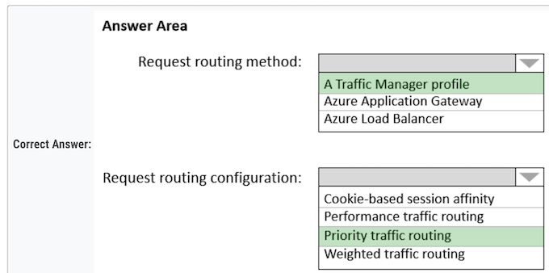

**Box 1: A Traffic Manager profile**

To support load balancing across the regions we need a Traffic Manager.

**Box 2: Priority traffic routing**

Priority traffic-routing method.

Often an organization wants to provide reliability for their services. To do so, they deploy one or more backup services in case their primary goes down. 

The 'Priority' traffic-routing method allows Azure customers to easily implement this failover pattern.

- Traffic manager as global solution with priority routing

#### Question 17

Note: This question is part of a series of questions that present the same scenario. Each question in the series contains a unique solution that might meet the stated goals. 

Some question sets might have more than one correct solution, while others might not have a correct solution. 

You plan to deploy multiple instances of an Azure web app across several Azure regions

You need to design an access solution for the app. The solution must meet the following replication requirements:

* ✑ Support rate limiting. 
* ✑ Balance requests between all instances. 
* ✑ Ensure that users can access the app in the event of a regional outage.

**Solution: You use Azure Traffic Manager to provide access to the app.**

Does this meet the goal?

* A. Yes 
* **B. No**   ✅

Azure Traffic Manager is a DNS-based traffic load balancer. This service allows you to distribute traffic to your public facing applications across the global Azure regions. 

Traffic Manager also provides your public endpoints with high availability and quick responsiveness. It does not provide rate limiting

**Note: Azure Front Door would meet the requirements**

The Azure Web Application Firewall (WAF) rate limit rule for Azure Front Door controls the number of requests allowed from clients during a one-minute duration.

**Azure Traffic Manager does not have rate limit**

**Use Azure Front Door with WAF**

**To achieve rate limiting along with load balancing and high availability, you should use Azure Front Door with the Web Application Firewall (WAF)**.

Azure Front Door is a global, scalable entry-point that uses the Microsoft global edge network to create fast, secure, and widely scalable web applications. It provides load balancing and failover across multiple regions.

By enabling the WAF on Azure Front Door, you can configure custom rate limiting rules to protect your web app from excessive traffic and potential attacks.

#### Question 18

**Solution: You use Azure Load Balancer to provide access to the app.**

Does this meet the goal?

* A. Yes 
* **B. No** ✅

**Correct Answer: B Azure Application Gateway and Azure Load Balancer do not support rate or connection limits.**

 Note: Azure Front Door would meet the requirements. The Azure Web Application Firewall (WAF) rate limit rule for Azure Front Door controls the number of requests allowed from clients during a one-minute duration
 
#### Question 19
 
Solution: You use **Azure Application Gateway** to provide access to the app.

* A. Yes 
* **B. No** ✅

Azure Application Gateway and Azure Load Balancer do not support rate or connection limits. Note: Azure Front Door would meet the requirements. 

The Azure Web Application Firewall (WAF) rate limit rule for Azure Front Door controls the number of requests allowed from clients during a one-minute duration

Azure Application Gateway is a Layer 7 load balancer that provides features like SSL termination, cookie-based session affinity, and URL-based routing. However, it operates within a single region and cannot distribute traffic across multiple regions

To meet the requirements of supporting rate limiting, balancing requests between instances across multiple regions, and ensuring app accessibility during regional outages, you should use Azure Front Door with Web Application Firewall (WAF). Azure Front Door is a global load balancer that can distribute traffic optimally to services across multiple regions, ensuring high availability in the event of a regional outage. By enabling WAF, you can configure custom rate limiting rules to control incoming traffic to your web app.

#### Question 20

Your company has two on-premises sites in New York and Los Angeles and Azure virtual networks in the East US Azure region and the West US Azure region. 

**Each on-premises site has ExpressRoute Global Reach circuits to both regions.**

You need to recommend a solution that meets the following requirements:

* ✑ Outbound traffic to the internet from workloads hosted on the virtual networks must be routed through the closest available on-premises site. 
* ✑ If an on-premises site fails, traffic from the workloads on the virtual networks to the internet must reroute automatically to the other site.

What should you include in the recommendation? To answer, select the appropriate options in the answer area.

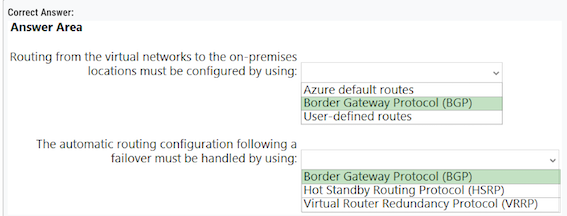

**Box 1: Border Gateway Protocol (BGP)** ✅

An on-premises network gateway can exchange routes with an Azure virtual network gateway using the border gateway protocol (BGP). 

Using BGP with an Azure virtual network gateway is dependent on the type you selected when you created the gateway. 

If the type you selected were: **ExpressRoute: You must use BGP to advertise on-premises routes to the Microsoft Edge router. You cannot create user-defined routes to force traffic to the ExpressRoute virtual network gateway if you deploy a virtual network gateway deployed as type: ExpressRoute**. 

You can use user-defined routes for forcing traffic from the Express Route to, for example, a Network Virtual Appliance.

**Box 2: Border Gateway Protocol (BGP)** ✅

Layer 3 connectivity Microsoft uses BGP, **an industry standard dynamic routing protocol, to exchange routes between your on-premises network, your instances in Azure, and Microsoft public addresses**. 

We establish multiple BGP sessions with your network for different traffic profiles. More details can be found in the ExpressRoute circuit and routing domains article.

1. Routing from the virtual networks to the on-premises location must be configured by using: b. Border Gateway Protocol (BGP) To configure routing between the Azure virtual networks and the on-premises locations, you should use Border Gateway Protocol (BGP). BGP is a dynamic routing protocol that enables automatic route updates between ExpressRoute circuits and the on-premises sites. 

2. The automatic routing configuration following a failover must be handled by using: a. Border Gateway Protocol (BGP)

BGP can also handle automatic routing configuration in the event of a failover. It can dynamically detect when a site fails and automatically reroute traffic to the other available site. This ensures that traffic from the workloads on the virtual networks to the internet is rerouted to the other on- premises site if one site fails.

#### Question 21

You are designing an application that will use Azure Linux virtual machines to analyze video files. The files will be uploaded from corporate offices that connect to Azure by using ExpressRoute.

You plan to provision an Azure Storage account to host the files. 

You need to ensure that the storage account meets the following requirements:

✑ Supports video files of up to 7 TB 
✑ Provides the highest availability possible 
✑ Ensures that storage is optimized for the large video files 
✑ Ensures that files from the on-premises network are uploaded by using ExpressRoute 

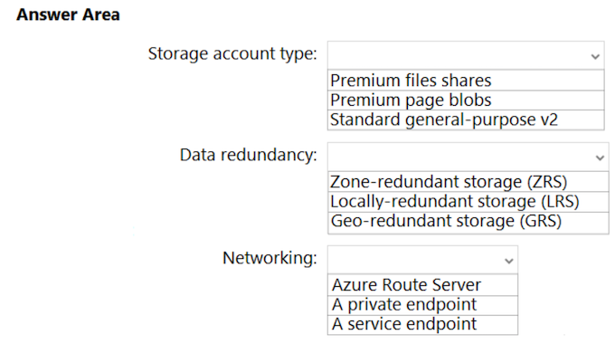

How should you configure the storage account? To answer, select the appropriate options in the answer area.

**Storage: Premium file share** ✅

* Premium file shares support files up to 100 TiB in size, 
* Premium file shares provide faster performance and lower latency than standard file shares, which would be beneficial for analyzing large video files. 
* Premium file shares can be accessed from anywhere in the world, which makes it suitable for your scenario where video files are uploaded from corporate offices that connect to Azure by using ExpressRoute

**Data Redundancy: GRS (Geo-Redundant Storage)** ✅

**GRS provides additional redundancy for data storage compared to LRS or ZRS**, with data being replicated to a secondary region, GRS provides the highest availability possible, as it maintains multiple copies of data in different regions.

**Networking: Private Endpoint** ✅

* By configuring a private endpoint for the Azure Storage account, you can ensure that files from the on-premises network are uploaded using ExpressRoute, which provides a more reliable and secure connection compared to the public internet. 
* A private endpoint also enhances security and reduces exposure to public endpoint

#### Question 22

A company plans to implement an HTTP-based API to support a web app. The web app allows customers to check the status of their orders. The API must meet the following requirements:

* ✑ Implement Azure Functions. 
* ✑ Provide public read-only operations. 
* ✑ Prevent write operations.

You need to recommend which HTTP methods and authorization level to configure.

What should you recommend? To answer, configure the appropriate options in the dialog box in the answer area.

 
**Box 1: GET only** - Get for read-only- ✅

**Box 2: Anonymous** - Anonymous for public operations.  ✅

**1. HTTP methods: b. GET only** 

As the API needs to provide public read-only operations and prevent write operations, you should use only the GET method. The GET method is used to retrieve data and is considered read-only, which meets the requirements

**2. Authorization level: b. Anonymous**

To allow public read-only access without requiring any authentication or authorization, you should set the authorization level to Anonymous. T

his will enable any user to access the API without providing a key, allowing them to check the status of their orders as required.

#### Question 23

You have an Azure subscription. 

You need to recommend a solution to provide developers with the ability to provision Azure virtual machines. The solution must meet the following requirements:

* ✑ Only allow the creation of the virtual machines in specific regions. 
* ✑ Only allow the creation of specific sizes of virtual machines

What should you include in the recommendation?

* A. Azure Resource Manager (ARM) templates 
* **B. Azure Policy**    ✅
* C. Conditional Access policies 
* D. role-based access control (RBAC)

Azure Policies allows you to specify allowed locations, and allowed VM SKUs

Allowed virtual machine size SKUs This policy enables you to specify a set of virtual machine size SKUs that your organization can deploy. 

Allowed locations This policy enables you to restrict the locations your organization can specify when deploying resources. Use to enforce your geo-compliance requirements. 

Excludes resource groups, Microsoft.AzureActiveDirectory/b2cDirectories, and resources that use the 'global' region.

#### Question 24

You have an on-premises network that uses an IP address space of 172.16.0.0/16. 

You plan to deploy 30 virtual machines to a new Azure subscription. 

You identify the following technical requirements:

* ✑ All Azure virtual machines must be placed on the same subnet named Subnet1. 
* ✑ All the Azure virtual machines must be able to communicate with all on-premises servers.
* ✑ The servers must be able to communicate between the on-premises network and Azure by using a site-to-site VPN.

You need to recommend a subnet design that meets the technical requirements. What should you include in the recommendation? 

To answer, drag the appropriate network addresses to the correct subnets. Each network address may be used once, more than once, or not at all. You may need to drag the split bar between panes or scroll to view content.

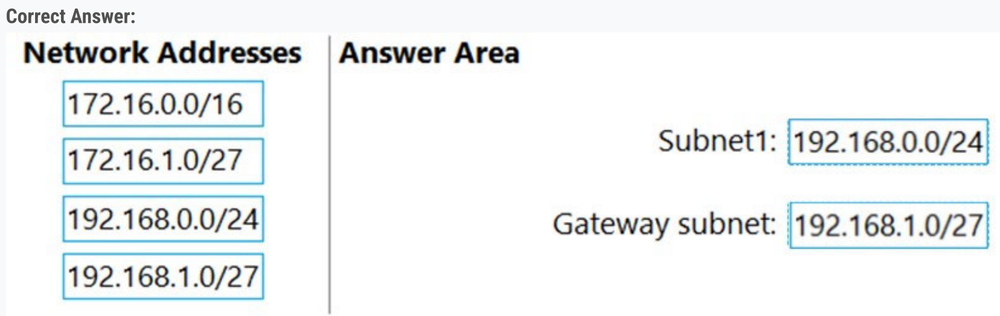

1. Cannot overlap -> 172.16.0.0/16 is out 

2. 30 machines -> 192.168.1.0/27 is 32 IPs, but Azure always uses 5 for itself, so would be too small for the machine subnet => process of elimination leads to Subnet1 = 192.168.0.0/24, Gateway Subnet = 192.168.1.0/27

* Create a virtual network 
* Create a VPN gateway Create a local network gateway Create a VPN connection
* Verify the connection
* Connect to a virtual machine 

None of the subnets of your on-premises network can over lap with the virtual network subnets that you want to connect to

#### Question 25

You have data files in Azure Blob Storage. 

You plan to transform the files and move them to Azure Data Lake Storage. 

You need to transform the data by using mapping data flow. 

Which service should you use?

* A. Azure Databricks 
* B. Azure Storage Sync 
* **C. Azure Data Factory**   ✅
* D. Azure Data Box Gateway

What are mapping data flows? 

Mapping data flows are visually designed data transformations in Azure Data Factory. 

Data flows allow data engineers to develop data transformation logic without writing code. 

**The resulting data flows are executed as activities within Azure Data Factory pipelines that use scaled out Apache Spark clusters**. 

Data flow activities can be operationalized using existing Azure Data Factory scheduling, control, flow, and monitoring capabilities.

**Azure Data Factory** is a cloud-based data integration service that allows you to create, schedule, and manage data pipelines that can move and transform data across different sources and destinations, including Azure Blob Storage and Azure Data Lake Storage. 

**Azure Databricks** is a cloud-based analytics platform that allows you to process large amounts of data using **Apache Spark**. It can also be used for
data transformation and ETL, but it requires more technical expertise and development effort than using Azure Data Factory mapping data flows. 

**Azure Storage Sync** is a service that allows you to sync on-premises file servers with Azure file shares, but it does not support data transformation. 

**Azure Data Box Gateway** is a hardware device that allows you to transfer large amounts of data to Azure, but it does not support data transformation using mapping data flow.

#### Question 26

You have an Azure subscription. You need to deploy an Azure Kubernetes Service (AKS) solution that will use Windows Server 2019 nodes. 

The solution must meet the following requirements:

* ✑ Minimize the time it takes to provision compute resources during scale-out operations. 
* ✑ Support autoscaling of Windows Server containers.

Which scaling option should you recommend?

* A. Kubernetes version 1.20.2 or newer 
* B. Virtual nodes with Virtual Kubelet ACI 
* **C. cluster autoscaler**   ✅
* D. horizontal pod autoscaler

Correct Answer: C

* Cluster autoscaler help provision new nodes (compute ressources) 

* Cluster autoscaler works on top of horizontal pod autoscaler.

Deployments can scale across AKS with no delay as cluster autoscaler deploys new nodes in your AKS cluster.

Note: AKS clusters can scale in one of two ways:

* The cluster autoscaler watches for pods that can't be scheduled on nodes because of resource constraints. The cluster then automatically increases the number of nodes. 
* The horizontal pod autoscaler uses the Metrics Server in a Kubernetes cluster to monitor the resource demand of pods. If an application needs more resources, the number of pods is automatically increased to meet the demand.

**Incorrect:**

Not D: If your application needs to rapidly scale, the horizontal pod autoscaler may schedule more pods than can be provided by the existing compute resources in the node pool. 

If configured, this scenario would then trigger the cluster autoscaler to deploy additional nodes in the node pool, **but it may take a few minutes for those nodes to successfully provision and allow the Kubernetes scheduler to run pods on them**.

#### Question 27

Your on-premises network contains a file server named Server1 that stores 500 GB of data.

You need to use Azure Data Factory to copy the data from Server1 to Azure Storage.

You add a new data factory.

What should you do next? To answer, select the appropriate options in the answer area

**Box 1: Install a self-hosted integration runtime.**

If your data store is located inside an on-premises network, an Azure virtual network, or Amazon Virtual Private Cloud, you need to configure a self-hosted integration runtime to connect to it. 

The Integration Runtime to be used to connect to the data store. You can use Azure Integration Runtime or Self-hosted Integration Runtime (if your data store is located in private network). If not specified, it uses the default Azure Integration Runtime.

**Box 2: Create a pipeline.**

You perform the Copy activity with a pipeline.

You must install the Data Factory self-hosted integration runtime on a Windows VM in your Azure virtual network.

**A Data Factory or Synapse Workspace can have one or more pipelines. A pipeline is a logical grouping of activities that together perform a task.** 

For example, a pipeline could contain a set of activities that ingest and clean log data, and then kick off a mapping data flow to analyze the log data.

**1. From Server1: b. Install a self-hosted integration runtime**   ✅

A self-hosted integration runtime needs to be installed on Server1 to enable secure communication between the on-premises network and Azure Data Factory. This runtime allows Data Factory to access and copy data from the on-premises file server to Azure Storage.

**2. From the data factory: a. Create a pipeline**   ✅

In the Azure Data Factory, create a pipeline that specifies the source (on-premises file server) and destination (Azure Storage). 

The pipeline will use the self-hosted integration runtime to establish a connection to the on-premises file server and transfer the data to Azure Storage

#### Question 28

You have an Azure subscription. You need to recommend an Azure Kubernetes Service (AKS) solution that will use Linux nodes. The solution must meet the following requirements: 

* ✑ Minimize the time it takes to provision compute resources during scale-out operations. 
* ✑ Support autoscaling of Linux containers. 
* ✑ Minimize administrative effort.

Which scaling option should you recommend?

* A. horizontal pod autoscaler 
* B. cluster autoscaler 
* **C. virtual nodes**  ✅
* D. Virtual Kubelet

To rapidly scale application workloads in an AKS cluster, you can use virtual nodes. With virtual nodes, you have quick provisioning of pods, and only pay per second for their execution time. 

You don't need to wait for Kubernetes cluster autoscaler to deploy VM compute nodes to run the additional pods. Virtual nodes are only supported with Linux pods and nodes.

* cluster autoscaler for windows  ✅
* Virtual Nodes for Linux ✅

C. virtual nodes To meet the requirements of minimizing the time it takes to provision compute resources during scale-out operations, supporting autoscaling of Linux containers, and minimizing administrative effort, you should recommend virtual nodes for the Azure Kubernetes Service (AKS) solution with Linux nodes.

Virtual nodes allow you to scale your AKS cluster quickly by offloading the additional compute resources to Azure Container Instances (ACI). 

This reduces the time it takes to provision resources during scale-out operations, as the resources can be provisioned instantly without having to wait for a new node to be created. Additionally, virtual nodes support autoscaling of Linux containers and require minimal administrative effort compared to other scaling options

#### Question 29

You are designing an order processing system in Azure that will contain the Azure resources shown in the following table.

The order processing system will have the following transaction flow

* ✑ A customer will place an order by using App1. 
* ✑ When the order is received, App1 will generate a message to check for product availability at vendor 1 and vendor 2. 
* ✑ An integration component will process the message, and then trigger either Function1 or Function2 depending on the type of order. 
* ✑ Once a vendor confirms the product availability, a status message for App1 will be generated by Function1 or Function2. 
* ✑ All the steps of the transaction will be logged to storage1

Which type of resource should you recommend for the integration component?

* A. an Azure Service Bus queue 
* **B. an Azure Data Factory pipeline**   ✅
* C. an Azure Event Grid domain 
* D. an Azure Event Hubs capture

Azure Data Factory is the platform is the cloud-based ETL and data integration service that allows you to create data-driven workflows for orchestrating data movement and transforming data at scale. Using Azure Data Factory, you can create and schedule data-driven workflows (called pipelines) that can ingest data from disparate data stores.

**Data Factory contains a series of interconnected systems that provide a complete end-to-end platform for data engineers.**

ADF pipeline can process the message and trigger the appropriate condition. On ADF, you can add a diagnostic setting to send logs to a storage account.

Other possible options would be Event grid subscription & Service bus topic
 
#### Question 30

You have 100 Microsoft SQL Server Integration Services (SSIS) packages that are configured to use 10 on-premises SQL Server databases as their destinations. 

You plan to migrate the 10 on-premises databases to Azure SQL Database. 

**You need to recommend a solution to create Azure-SQL Server Integration Services (SSIS) packages.** 

The solution must ensure that the packages can target the SQL Database instances as their destinations. 

What should you include in the recommendation?

* A. Data Migration Assistant (DMA) 
* **B. Azure Data Factory**   ✅
* C. Azure Data Catalog 
* D. SQL Server Migration Assistant (SSMA)

Migrate on-premises SSIS workloads to SSIS using ADF (Azure Data Factory).

You should include Azure Data Factory in the recommendation to create Azure-SQL Server Integration Services (SSIS) packages. 

Azure Data Factory supports running SSIS packages in the cloud using Azure-SSIS Integration Runtime, which allows you to target Azure SQL Database instances as the destinations for your SSIS packages. This enables you to continue using your existing SSIS packages while migrating your on-premises databases to Azure SQL Database

#### Question 31

You have an Azure virtual machine named VM1 that runs Windows Server 2019 and contains 500 GB of data files. 

You are designing a solution that will use Azure Data Factory to transform the data files, and then load the files to Azure Data Lake Storage. 

What should you deploy on VM1 to support the design?

* A. the On-premises data gateway 
* B. the Azure Pipelines agent 
* **C. the self-hosted integration runtime**   ✅
* D. the Azure File Sync agent

The integration runtime (IR) is the compute infrastructure that Azure Data Factory and Synapse pipelines use to provide data-integration capabilities across different network environments. 

A self-hosted integration runtime can run copy activities between a cloud data store and a data store in a private network. It also can dispatch transform activities against compute resources in an on-premises network or an Azure virtual network. The installation of a self-hosted integration runtime needs an on-premises machine or a virtual machine inside a private network

The Integration Runtime (IR) is the compute infrastructure used by Azure Data Factory and Azure Synapse pipelines to provide the following data integration capabilities across different network environments

* **Data Flow**: Execute a Data Flow in a managed Azure compute environment. 

**Data movement:** Copy data across data stores in a public or private networks (for both on-premises or virtual private networks). The service provides support for built-in connectors, format conversion, column mapping, and performant and scalable data transfer. 

* **Activity dispatch**: Dispatch and monitor transformation activities running on a variety of compute services such as Azure Databricks, Azure HDInsight, ML Studio (classic), Azure SQL Database, SQL Server, and more. SSIS package execution: Natively execute SQL Server Integration Services (SSIS) packages in a managed Azure compute environment.

#### Question 32

You have an Azure Active Directory (Azure AD) tenant that syncs with an on-premises Active Directory domain. 

Your company has a line-of-business (LOB) application that was developed internally. 

You need to implement SAML single sign-on (SSO) and enforce multi-factor authentication (MFA) when users attempt to access the application from an unknown location. 

**Which two features** should you include in the solution? Each correct answer presents part of the solution.

* A. Azure AD Privileged Identity Management (PIM) 
* B. Azure Application Gateway 
* **C. Azure AD enterprise applications**  ✅
* D. Azure AD Identity Protection 
* **E. Conditional Access policies** ✅

**C. Azure AD enterprise applications**: You need to configure the LOB application as an enterprise application in Azure AD. 

This will allow you to configure SAML-based SSO for the application, enabling users to sign in using their Azure AD credentials.

**E. Conditional Access policies**: You can create a Conditional Access policy in Azure AD to enforce MFA when users attempt to access the application from an unknown location. 

Conditional Access policies allow you to set specific conditions, such as location or device state, and apply security requirements, like MFA, when those conditions are met.

#### Question 33

You plan to automata the deployment of resources to Azure subscriptions. 

What is a difference between using Azure Blueprints and Azure Resource Manager (ARM) templates?

* A. ARM templates remain connected to the deployed resources. 
* B. Only blueprints can contain policy definitions. 
* C. Only ARM templates can contain policy definitions. 
* **D. Blueprints remain connected to the deployed resources**  ✅

With Azure Blueprints, the relationship between the blueprint definition (what should be deployed) and the blueprint assignment (what was deployed) is preserved. This connection supports improved tracking and auditing of deployments

#### Question 34

You have the resources shown in the following table

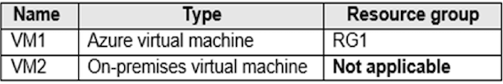

You create a new resource group in Azure named RG2. 

You need to move the virtual machines to RG2. 

What should you use to move each virtual machine? 

To answer, select the appropriate options in the answer area. NOTE: Each correct selection is worth one point

**Box 1: Azure Resource Mover -**

To move Azure VMs to another region, Microsoft now recommends using Azure Resource Mover.

**Box 2: Azure Migrate-**

**BOX one Correct. Azure Resource Mover, for moving resources between subscriptions, regions, resource group**

**BOX Two: Correct Azure migrate for moving the resource on-premises to a resource group**

#### Question 35

You plan to deploy an Azure App Service web app that will have multiple instances across multiple Azure regions. 

You need to recommend a load balancing service for the planned deployment The solution must meet the following requirements:

* ✑ Maintain access to the app in the event of a regional outage. ✑ Support Azure Web Application Firewall (WAF). 
* ✑ Support cookie-based affinity. 
* ✑ Support URL routing.

What should you include in the recommendation?

* **A. Azure Front Door** ✅
* B. Azure Traffic Manager 
* C. Azure Application Gateway 
* D. Azure Load Balancer

**Azure Front Door = Supports URL routing.**

A. Azure Front Door

Azure Front Door is the recommended load balancing service for the planned deployment as it meets all the specified requirements:

* ✓ Maintains access to the app in the event of a regional outage, as it is a global load balancer with instant failover capabilities. 
* ✓ Supports Azure Web Application Firewall (WAF) integration for security. 
* ✓ Supports cookie-based affinity for session stickiness.
* ✓ Supports URL routing for directing traffic to different backend pools based on URL patterns

**Azure Front Door works across regions and support URL routing (HTTP(S)).**

Note: HTTP(S) load-balancing services are Layer 7 load balancers that only accept HTTP(S) traffic. 

They are intended for web applications or other HTTP(S) endpoints. They include features such as SSL offload, web application firewall, path-based load balancing, and session affinity

**Incorrect: Application Gateway and Azure Load Balancer only work within one single region**

#### Question 36

You have the Azure resources shown in the following table

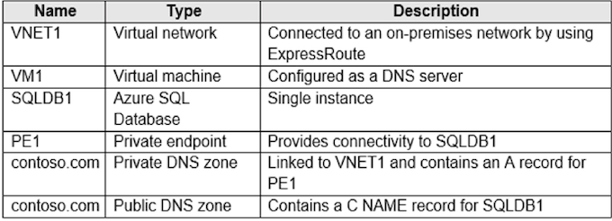

**You need to design a solution that provides on-premises network connectivity to SQLDB1 through PE1.**

How should you configure name resolution? 

**VNET default configuration is to use azure DNS.**

Box 1 should be "configure vm1 to forward contoso.com to the azure provided dns at 168.63.129.16" to convert VM1 to a DNS forwarder. ✅

**Box 2** Forward contoso.com to VM1

**Box 2: Forward contoso.com to VM1 Forward to the DNS server VM1**

Note: You can use the following options to configure your DNS settings for private endpoints:

* Use the host file (only recommended for testing). You can use the host file on a virtual machine to override the DNS. 
* Use a private DNS zone. You can use private DNS zones to override the DNS resolution for a private endpoint. A private DNS zone can be linked to your virtual network to resolve specific domains.
* Use your DNS forwarder (optional). You can use your DNS forwarder to override the DNS resolution for a private link resource. Create a DNS forwarding rule to use a private DNS zone on your DNS server hosted in a virtual network.

* In VNet1, configure a custom DNS server set to Azure provided DNS at 168.63.129.16 

* On-premises DNS configuration: Forward contoso.com to VM1

#### Question 37

You are designing a microservices architecture that will support a web application. 

The solution must meet the following requirements: 

* ✑ Deploy the solution on-premises and to Azure. Support low-latency and hyper-scale operations. 
* ✑ Allow independent upgrades to each microservice. 
* ✑ Set policies for performing automatic repairs to the microservices. 

You need to recommend a technology. What should you recommend?

* A. Azure Container Instance 
* B. Azure Logic App 
* **C. Azure Service Fabric** ✅
* D. Azure virtual machine scale set

* Azure Service Fabric enables you to create Service Fabric clusters on premises or in other clouds. 
* Azure Service Fabric is low-latency and scales up to thousands of machines.

Azure Service Fabric is the recommended technology for the microservices architecture you are designing, as it meets all the specified requirements:

* ✓ Supports deployment both on-premises and to Azure, providing a consistent platform for managing and deploying microservices. 
* ✓ Enables low-latency and hyper-scale operations, as it is designed for building scalable and reliable applications. 
* ✓ Allows independent upgrades to each microservice, as it supports versioning and rolling upgrades. 
* ✓ Provides built-in health monitoring and automatic repairs for the microservices with configurable policies

You can create clusters for Service Fabric in many environments, including Azure or on premises, on Windows Server or Linux. You can even create clusters on other public clouds. The development environment in the Service Fabric SDK is identical to the production environment, with no emulators involved. In other words, what runs on your local development cluster is what deploys to your clusters in other environments

#### Question 38

Note: This question is part of a series of questions that present the same scenario. Each question in the series contains a unique solution that might meet the stated goals. Some question sets might have more than one correct solution, while others might not have a correct solution. 

After you answer a question in this section, you will NOT be able to return to it. As a result, these questions will not appear in the review screen. 

You plan to deploy multiple instances of an Azure web app across several Azure regions. You need to design an access solution for the app. The solution must meet the following replication requirements

* ✑ Support rate limiting. 
* ✑ Balance requests between all instances. 
* ✑ Ensure that users can access the app in the event of a regional outage

Solution: You use Azure Front Door to provide access to the app

Does this meet the goal? 

* **A. Yes** ✅
* B. No

Azure Front Door meets the requirements. **The Azure Web Application Firewall (WAF) rate limit rule for Azure Front Door controls the number of requests allowed from clients during a one-minute duration**

**Azure front door + WAF**

#### Question 39

You need to recommend a solution to generate a monthly report of all the new Azure Resource Manager (ARM) resource deployments in your Azure subscription. 

What should you include in the recommendation?

* **A. Azure Activity Log**   ✅
* B. Azure Arc 
* C. Azure Analysis Services 
* D. Azure Monitor action groups

**Correct Answer: A**

Activity logs are kept for 90 days. You can query for any range of dates, as long as the starting date isn't more than 90 days in the past. Through activity logs, you can determine:

* ✑ what operations were taken on the resources in your subscription 
* ✑ who started the operation

when the operation occurred

* ✑ the status of the operation 
* ✑ the values of other properties that might help you research the operation

The Azure Monitor activity log is a platform log in Azure that provides insight into subscription-level events. The activity log includes information like when a resource is modified or a virtual machine is started.

#### Question 40

You have an Azure subscription. You need to recommend a solution to provide developers with the ability to provision Azure virtual machines. 

The solution must meet the following requirements: 

* ✑ Only allow the creation of the virtual machines in specific regions. 
* ✑ Only allow the creation of specific sizes of virtual machines.

What should you include in the recommendation?

* A. Attribute-based access control (ABAC) 
* **B. Azure Policy**   ✅
* C. Conditional Access policies 
* D. role-based access control (RBAC)

Correct Answer: **B Azure Policies allows you to specify allowed locations, and allowed VM SKUs**

#### Question 41

You are developing a sales application that will contain several Azure cloud services and handle different components of a transaction. 

Different cloud services will process customer orders, billing, payment, inventory, and shipping. 

You need to recommend a solution to enable the cloud services to asynchronously communicate transaction information by using XML messages. What should you include in the recommendation?

* A. Azure Notification Hubs 
* B. Azure Data Lake 
* **C. Azure Service Bus** ✅
* D. Azure Blob Storage

Azure Service Bus is a fully managed enterprise integration message broker. It can be used to enable communication between different services using messages, including XML messages. 

It supports asynchronous operations and decouples services, which makes it ideal for communication
between the different components mentioned in the scenario. 

The other options aren't suitable for this kind of service-to-service messaging

#### Question 42

You have 100 devices that write performance data to Azure Blob Storage. 

You plan to store and analyze the performance data in an Azure SQL database. 

You need to recommend a solution to continually copy the performance data to the Azure SQL database. 

What should you include in the recommendation?

* **A. Azure Data Factory**  ✅
* B. Data Migration Assistant (DMA) 
* C. Azure Data Box 
* D. Azure Database Migration Service

Azure Data Factory is a cloud-based data integration service that allows you to create, schedule, and manage data pipelines. It can be used to continually copy data from various sources, including Azure Blob Storage, to multiple destinations such as an Azure SQL Database. 

The other options aren't suitable for continual data copying in the scenario described

#### Question 43

You need to recommend a storage solution for the records of a mission critical application. The solution must provide a Service Level Agreement (SLA) for the latency of write operations and the throughput. 

What should you include in the recommendation?

* A. Azure Data Lake Storage Gen2 
* B. Azure Blob Storage 
* C. Azure SQL 
* **D. Azure Cosmos DB** ✅

Azure Cosmos DB is Microsoft's fast NoSQL database with open APIs for any scale. It offers turnkey global distribution across any number of Azure regions by transparently scaling and replicating your data wherever your users are. The service offers comprehensive 99.99% SLAs which covers the guarantees for throughput, consistency, availability and latency for the Azure Cosmos DB Database Accounts scoped to a single Azure region configured with any of the five Consistency Levels or Database Accounts spanning multiple Azure regions, configured with any of the four relaxed Consistency Levels. 

Azure Cosmos DB allows configuring multiple Azure regions as writable endpoints for a Database Account. In this configuration, Azure Cosmos DB offers 99.999% SLA for both read and write availability

#### Question 44

You are planning a storage solution. 

The solution must meet the following requirements: 

* ✑ Support at least 500 requests per second. 
* ✑ Support a large image, video, and audio streams. 

Which type of Azure Storage account should you provision?

* A. standard general-purpose v2 
* **B. premium block blobs**   ✅
* C. premium page blobs 
* D. premium file shares

- supports hundreds of thousands of requests per second 
- video "streaming" requires lots of small data packets to be sent in a short time interval (and thus requires high transaction rates & consistent low- latency)

**Nothing said about minimizing the solution's cost. Premium block blob it's optimized for that**

#### Question 45

You need to recommend a data storage solution that meets the following requirements:

* ✑ Ensures that applications can access the data by using a REST connection 
* ✑ Hosts 20 independent tables of varying sizes and usage patterns 
* ✑ Automatically replicates the data to a second Azure region 
* ✑ Minimizes costs

What should you recommend?

* A. an Azure SQL Database elastic pool that uses active geo-replication 
* **B. tables in an Azure Storage account that use geo-redundant storage (GRS)** ✅
* C. tables in an Azure Storage account that use read-access geo-redundant storage (RA-GRS) 
* D. an Azure SQL database that uses active geo-replication

The Table service offers structured storage in the form of tables. The Table service API is a REST API for working with tables and the data that they contain. 

Geo-redundant storage (GRS) has a lower cost than read-access geo-redundant storage (RA-GRS).

#### Question 46

You are designing a software as a service (SaaS) application that will enable Azure Active Directory (Azure AD) users to create and publish online surveys. The SaaS application will have a front-end web app and a back-end web API. The web app will rely on the web API to handle updates to customer surveys

You need to design an authorization ow for the SaaS application. The solution must meet the following requirements:

- ✑ To access the back-end web API, the web app must authenticate by using OAuth 2 bearer tokens.
- ✑ The web app must authenticate by using the identities of individual users

What should you include in the solution? To answer, select the appropriate options in the answer area.

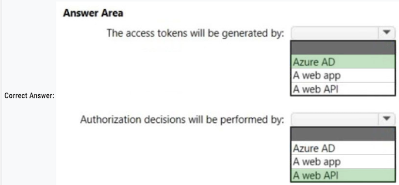

**Box 1: Azure AD -**

The Azure AD server issues tokens (access & refresh token). See step 5 below in graphic.

- OAuth 2.0 authentication with Azure Active Directory.
- The OAuth 2.0 is the industry protocol for authorization. It allows a user to grant limited access to its protected resources. Designed to work
- specically with Hypertext Transfer Protocol (HTTP), OAuth separates the role of the client from the resource owner.
- The client requests access to the resources controlled by the resource owner and hosted by the resource server (here the Azure AD server).
- The resource server issues access tokens with the approval of the resource owner. 
- The client uses the access tokens to access the protected resources hosted by the resource server

**Box 2: A web API -**

- Delegated access is used.
- The bearer token sent to the web API contains the user identity.
- The web API makes authorization decisions based on the user identity

**1. The access tokens will be generated by: a. Azure AD**

Azure AD is the identity provider and is responsible for generating access tokens in an OAuth 2.0 flow. The web app will authenticate with Azure
AD and receive an access token.

**2. Authorization decisions will be performed by: c. a web API**

The web API, as the resource server in the OAuth 2.0 flow, is responsible for making authorization decisions. It validates the access token it receives from the web app and determines what resources the authenticated user can access.

#### Question 47

You plan to create an Azure environment that will contain a root management group and 10 child management groups. Each child management
group will contain five Azure subscriptions. You plan to have between 10 and 30 resource groups in each subscription.

You need to design an Azure governance solution. The solution must meet the following requirements:

- ✑ Use Azure Blueprints to control governance across all the subscriptions and resource groups.
- ✑ Ensure that Blueprints-based configurations are consistent across all the subscriptions and resource groups.
- ✑ Minimize the number of blueprint definitions and assignments.

What should you include in the solution? To answer, select the appropriate options in the answer area.

NOTE: Each correct selection is worth one point.

- Define: **Root Management Groups**  ✅

- Assignments: **Subscriptons.**  ✅

Assigning a blueprint definition to a management group means the assignment object exists at the management group.
The deployment of artifacts still targets a subscription

#### Question 48

You are designing a virtual machine that will **run Microsoft SQL Server and contain two data disks. The first data disk will store log miles, and the second data disk will store data. Both disks are P40 managed disks**.

**You need to recommend a host caching method for each disk**. The method must provide the best overall performance for the virtual machine
while preserving the integrity of the SQL data and logs.

Which host caching method should you recommend for each disk? To answer, drag the appropriate methods to the correct disks. Each method
may be used once, more than once, or not at all. You may need to drag the split bar between panes or scroll to view content.

**Box 1: None -**

**No data disk caching for the Log files.**

Your storage caching policy varies depending on the type of SQL Server data files that are hosted on the drive.

**Box 2: ReadOnly -**

Guidelines to optimize performance for your SQL Server on Azure Virtual Machines (VMs) include:

- Set host caching to read-only for data file disks.
- Set host caching to none for log file disks.

- Enable Read-only caching for the disks hosting SQL Server data files.
- Reads from cache will be faster than the uncached reads from the data disk.
- Uncached IOPS and throughput plus Cached IOPS and throughput will yield the total possible performance available from the virtual machine within the VMs limits, but actual performance will vary based on the workload's ability to use the cache (cache hit ratio).

#### Question 49

You are designing a solution that calculates 3D geometry from height-map data.

You need to recommend a solution that meets the following requirements:

- ✑ Performs calculations in Azure.
- ✑ Ensures that each node can communicate data to every other node.
- ✑ Maximizes the number of nodes to calculate multiple scenes as fast as possible.

Minimizes the amount of effort to implement the solution.

Which two actions should you include in the recommendation? Each correct answer presents part of the solution.

NOTE: Each correct selection is worth one point.

- [ ] A. Enable parallel file systems on Azure.
- [ ] B. Create a render farm that uses virtual machines.
- [ ] C. Create a render farm that uses virtual machine scale sets.
- [x] **D. Create a render farm that uses Azure Batch.**.    ✅
- [x] **E. Enable parallel task execution on compute nodes.**.   ✅

Multi-instance tasks allow you to run an Azure Batch task on multiple compute nodes simultaneously. These tasks enable high performance
computing scenarios like Message Passing Interface (MPI) applications in Batch.

- You configure compute nodes for parallel task execution at the pool level.
- Azure Batch allows you to set task slots per node up to (4x) the number of node cores.

Azure Batch is designed for high-performance parallel computing. It's a cloud-based job scheduling service that parallelizes the processing of large
volumes of data across many virtual machines. It allows for each node to communicate data to every other node, which is a requirement in the
question

Parallel task execution enables concurrent processing of multiple tasks on a single compute node, thereby maximizing the number of nodes to
calculate multiple scenes as fast as possible. This can help to speed up processing times.

#### Question 50

You have an on-premises application that consumes data from multiple databases. The application code references database tables by using a
combination of the server, database, and table name.

You need to migrate the application data to Azure.

To which two services can you migrate the application data to achieve the goal? Each correct answer presents a complete solution.

NOTE: Each correct selection is worth one point.

- [ ] A. SQL Server Stretch Database
- [X] B. **SQL Server on an Azure virtual machine.**   ✅
- [ ] C. Azure SQL Database
- [X] D. **Azure SQL Managed Instance**.  ✅

B. SQL Server on an Azure virtual machine allows you to migrate your on-premises SQL Server databases to Azure with very minimal changes to
your application. The application code can continue to reference the database tables in the same manner as it did on-premises.

D. Azure SQL Managed Instance is a fully-managed SQL Server Database Engine hosted in Azure cloud. It provides near 100% compatibility with
the on-premises SQL Server and supports the same server, database, and table naming conventions, which suits the requirement of the application.

#### Question 51

You plan to migrate on-premises Microsoft SQL Server databases to Azure.

You need to recommend a deployment and resiliency solution that meets the following requirements:

- ✑ Supports user-initiated backups
- ✑ Supports multiple automatically replicated instances across Azure regions
- ✑ Minimizes administrative effort to implement and maintain business continuity

What should you recommend? 

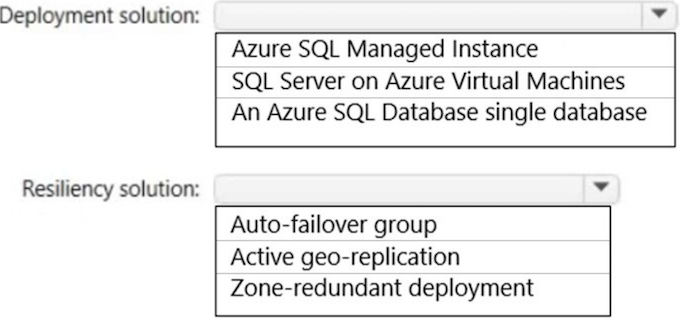

**Azure SQL Managed instances &  Auto Failover Group** ✅

- supports User Initiated Backups and minimizes administrative effort for business continuity.
- Auto failover groups

#### Question 52

You need to design a highly available Azure SQL database that meets the following requirements:

- ✑ Failover between replicas of the database must occur without any data loss.
- ✑ The database must remain available in the event of a zone outage.
- ✑ Costs must be minimized.

Which deployment option should you use?

- [ ] A. Azure SQL Managed Instance Business Critical
- [ ] B. Azure SQL Managed Instance General Purpose
- [ ] C. Azure SQL Database Business Critical
- [x] **D. Azure SQL Database Serverless**  ✅

Azure SQL Database Serverless meets the requirements and is less expensive than Azure SQL Database Business Critical.

Note: General Purpose service tier zone redundant availability

Zone-redundant configuration for the general purpose service tier is offered for both serverless and provisioned compute to replicate databases across multiple physical locations within an Azure region

This configuration utilizes Azure Availability Zones By selecting zone-redundancy, you can make your new and existing serverless and provisioned generalג purpose single databases and elastic pools resilient to a much larger set of failures, including catastrophic datacenter outages, without any changes of the application logic.

**Incorrect:**

Not A, not B: Zone-redundant configuration is not available in SQL Managed Instance.

Not C: Azure SQL Database Business Critical is more expensive than Azure SQL Database Serverless.

Note: Premium and Business Critical service tiers use the Premium availability model, which integrates compute resources (sqlservr.exe
process) and storage(locally attached SSD) on a single node. High availability is achieved by replicating both compute and storage to additional nodes creating a three to four-node cluster.

The answer priority is as follows. If it exists then choose it. If it doesn't, proceeded to the next priority. Sometimes both appear in the same
question, so make sure to select the higher priority.

1. Azure SQL Database Premium
2. Azure SQL Database Serverless
3. Azure SQL Database Business Critical

#### Question 53

You have an Azure web app that uses an Azure key vault named KeyVault1 in the West US Azure region.

You are designing a disaster recovery plan for KeyVault1.

You plan to back up the keys in KeyVault1.

You need to identify to where you can restore the backup.

What should you identify?

- [ ] A. any region worldwide
- [ ] B. the same region only
- [ ] C. KeyVault1 only
- [x] **D. the same geography only**   ✅

Using the backup and restore commands has two limitations:

* You can't back up a key vault in one geography and restore it into another geography.
* The backup command backs up all versions of each secret.

Incorrect:

Not A: Azure Key Vault does not allow you to move a key vault from one region to another. You can, however, create a key vault in the new
region, manually copy each individual key, secret, or certificate from your existing key vault to the new key vault, and then remove the original
key vault.

When you back up a key vault object, such as a secret, key, or certificate, the backup operation will download the object as an encrypted blob. 

This
blob can't be decrypted outside of Azure. To get usable data from this blob, you must restore the blob into a key vault within the same Azure
subscription and Azure geography

#### Question 54

You have an on-premises line-of-business (LOB) application that uses a Microsoft SQL Server instance as the backend.

You plan to migrate the on-premises SQL Server instance to Azure virtual machines.

You need to recommend a highly available SQL Server deployment that meets the following requirements:

**Minimizes costs**

Minimizes failover time if a single server fails

What should you include in the recommendation?

- [ ] A. an Always On availability group that has premium storage disks and a virtual network name (VNN)
- [ ] B. an Always On Failover Cluster Instance that has a virtual network name (VNN) and a standard file share
- [X] C. **an Always On availability group that has premium storage disks and a distributed network name (DNN)**  ✅
- [ ] D. an Always On Failover Cluster Instance that has a virtual network name (VNN) and a premium file share

Always On availability groups on Azure Virtual Machines are similar to Always On availability groups on-premises, and rely on the underlying
Windows Server Failover Cluster.

If you deploy your SQL Server VMs to a single subnet, you can configure a virtual network name (VNN) and an Azure Load Balancer, or a
distributed network name (DNN) to route traffic to your availability group listener.

There are some behavior differences between the functionality of the VNN listener and DNN listener that are important to note:

* Failover time: Failover time is faster when using a DNN listener since there is no need to wait for the network load balancer to detect the
failure event and change its routing

**Incorrect:**

C. an Always On availability group that has premium storage disks and a distributed network name (DNN).

The Always On Availability Group with a Distributed Network Name (DNN) would be the better choice due to the faster failover time, which aligns
with the requirement of minimizing failover time if a single server fails.

The DNN listener in this case doesn't require an Azure Load Balancer to reroute traffic, resulting in quicker failovers compared to the VNN listener.
This is a great choice when high availability and minimal failover time are prioritized

#### Question 55

Note: This question is part of a series of questions that present the same scenario. Each question in the series contains a unique solution that
might meet the stated goals. Some question sets might have more than one correct solution, while others might not have a correct solution.
After you answer a question in this section, you will NOT be able to return to it. As a result, these questions will not appear in the review screen.
Your company plans to deploy various Azure App Service instances that will use Azure SQL databases. The App Service instances will be deployed
at the same time as the Azure SQL databases.

The company has a regulatory requirement to deploy the App Service instances only to specific Azure regions. The resources for the App Service
instances must reside in the same region.

You need to recommend a solution to meet the regulatory requirement.

**Solution: You recommend creating resource groups based on locations and implementing resource locks on the resource groups.**

Does this meet the goal?

- [ ] A. Yes
- [X] B. **No**  ✅

 You should recommend using an Azure Policy initiative to enforce the location

 Note: Azure Resource Policy Definitions can be used which can be applied to a specific Resource Group with the App Service instances.
In Azure Policy, we offer several built-in policies that are available by default. For example

* Allowed Locations (Deny): Restricts the available locations for new resources. Its effect is used to enforce your geo-compliance

**B. No**

While creating resource groups based on locations can help organize resources, it does not inherently limit the regions where resources can be
deployed. 

**Resource locks protect resources from accidental deletion or modification, but they do not restrict where resources can be created**. For
enforcing location restrictions, Azure Policy with location-based policies would be a better option. These policies can be used to ensure resources
are only created in specified locations.

As an administrator, you can lock an Azure subscription, resource group, or resource to protect them from accidental user deletions and
modifications. The lock overrides any user permissions.

You can set locks that prevent either deletions or modifications. In the portal, these locks are called Delete and Read-only. In the command line,
these locks are called CanNotDelete and ReadOnly.

- CanNotDelete means authorized users can read and modify a resource, but they can't delete it.
- ReadOnly means authorized users can read a resource, but they can't delete or update it. Applying this lock is similar to restricting all authorized users to the permissions that the Reader role provides

#### Question 56

Note: This question is part of a series of questions that present the same scenario. Each question in the series contains a unique solution that
might meet the stated goals. Some question sets might have more than one correct solution, while others might not have a correct solution.

After you answer a question in this section, you will NOT be able to return to it. As a result, these questions will not appear in the review screen.
Your company plans to deploy various Azure App Service instances that will use Azure SQL databases. The App Service instances will be deployed
at the same time as the Azure SQL databases.

The company has a regulatory requirement to deploy the App Service instances only to specific Azure regions. The resources for the App Service
instances must reside in the same region.

You need to recommend a solution to meet the regulatory requirement.

**Solution: You recommend using the Regulatory compliance dashboard in Microsoft Defender for Cloud.**

Does this meet the goal?

- [ ] A. Yes
- [X] **B. No**

Instead; you should recommend using an Azure Policy initiative to enforce the location

Note: Azure Resource Policy Definitions can be used which can be applied to a specific Resource Group with the App Service instances.
In Azure Policy, we offer several built-in policies that are available by default. For example:

* Allowed Locations (Deny): Restricts the available locations for new resources.
* Its effect is used to enforce your geo-compliance

**B. No**.  ✅

The Regulatory Compliance dashboard in Microsoft Defender for Cloud helps monitor the compliance of your Azure resources with different
regulatory requirements, but it doesn't inherently restrict or control where resources can be deployed. To ensure that resources are deployed only
in specific regions, you would use Azure Policy with location-based policies.

The regulatory compliance dashboard shows the status of all the assessments within your environment for your chosen standards and regulations.
As you act on the recommendations and reduce risk factors in your environment, your compliance posture improve

#### Question 57

Note: This question is part of a series of questions that present the same scenario. Each question in the series contains a unique solution that
might meet the stated goals. Some question sets might have more than one correct solution, while others might not have a correct solution.

After you answer a question in this section, you will NOT be able to return to it. As a result, these questions will not appear in the review screen.
Your company plans to deploy various Azure App Service instances that will use Azure SQL databases. The App Service instances will be deployed
at the same time as the Azure SQL databases.

The company has a regulatory requirement to deploy the App Service instances only to specific Azure regions. The resources for the App Service
instances must reside in the same region.

You need to recommend a solution to meet the regulatory requirement.

**Solution: You recommend using an Azure Policy initiative to enforce the location.**

Does this meet the goal?

- **A. Yes**    ✅
- B. No

Azure Resource Policy Definitions can be used which can be applied to a specific Resource Group with the App Service instances.

In Azure Policy, we offer several built-in policies that are available by default. For example:

* Allowed Locations (Deny): Restricts the available locations for new resources. Its effect is used to enforce your geo-compliance
  
Azure Policy can enforce specific locations for resource deployment, ensuring that App Service instances and Azure SQL databases are deployed
only in specified regions, which aligns with the regulatory requirements of the company. This helps maintain control over where resources are
created and ensures compliance.

#### Question 58

You plan to move a web app named App1 from an on-premises datacenter to Azure.

App1 depends on a custom COM component that is installed on the host server.

You need to recommend a solution to host App1 in Azure. The solution must meet the following requirements:

- ✑ App1 must be available to users if an Azure datacenter becomes unavailable.
- ✑ Costs must be minimized.

What should you include in the recommendation?

- [ ] A. In two Azure regions, deploy a load balancer and a web app.
- [ ] B. In two Azure regions, deploy a load balancer and a virtual machine scale set.
- [X] C. **Deploy a load balancer and a virtual machine scale set across two availability zones**. ✅
- [ ] D. In two Azure regions, deploy an Azure Traffic Manager profile and a web app. 

Correct Answer: C

- Need to use a virtual machine as Azure App service does not allow COM components.
- Need two availability zones to protect against an Azure datacenter failure

**Not A, Not D: Cannot use a web app.**

Azure App Service does not allow the registration of COM components on the platform. If your app makes use of any COM components, these
need to be rewritten in managed code and deployed with the site or application.

- A -> webapp -> No COM
- B -> LB cannot be in two regions
- C -> OK
- D -> webapp -> No COM

#### Question #59

You plan to deploy an application named App1 that will run in containers on Azure Kubernetes Service (AKS) clusters. The AKS clusters will be
distributed across four Azure regions.

You need to recommend a storage solution to ensure that updated container images are replicated automatically to all the Azure regions hosting
the AKS clusters.

Which storage solution should you recommend?

- [ ] A. geo-redundant storage (GRS) accounts
- [X] C. **Deploy a load balancer and a virtual machine scale set across two availability zones**. ✅
- [X] **B. Premium SKU Azure Container Registry** 
- [ ] C. Azure Content Delivery Network (CDN)
- [ ] D. Azure Cache for Redis

Enable geo-replication for container images.

Best practice: Store your container images in Azure Container Registry and geo-replicate the registry to each AKS region.

To deploy and run your applications in AKS, you need a way to store and pull the container images. Container Registry integrates with AKS, so it
can securely store your container images or Helm charts. Container Registry supports multimaster geo-replication to automatically replicate
your images to Azure regions around the world.

Geo-replication is a feature of Premium SKU container registries.

**Note**:

When you use Container Registry geo-replication to pull images from the same region, the results are:

- Faster: You pull images from high-speed, low-latency network connections within the same Azure region.
- More reliable: If a region is unavailable, your AKS cluster pulls the images from an available container registry.
- Cheaper: There's no network egress charge between datacenters

**B. Geo-Replication is a premium SKU container registry feature.**

Azure Container Registry is a managed Docker registry service used for storing private Docker container images. It's tightly integrated with Azure
Kubernetes Service (AKS) and provides streamlined Docker image builds, storage, and retrieval.

The premium SKU of Azure Container Registry supports several advanced features, including the geo-replication of registries. Geo-replication
enables an Azure container registry to function as a single registry, serving multiple regions with multi-master regional registries. This means that
when you push an image to your registry, it is available across all geo-replicated regions, 

#### Question 60

You have an Azure Active Directory (Azure AD) tenant.

You plan to deploy Azure Cosmos DB databases that will use the SQL API.

You need to recommend a solution to provide specific Azure AD user accounts with read access to the Cosmos DB databases.

What should you include in the recommendation?

- [ ] A. shared access signatures (SAS) and Conditional Access policies
- [ ] B. certificates and Azure Key Vault
- [ ] C. master keys and Azure Information Protection policies
- [x] **D. a resource token and an Access control (IAM) role assignment**  ✅

**Correct Answer: D**

The Access control (IAM) pane in the Azure portal is used to configure role-based access control on Azure Cosmos resources. 

The roles are applied to users, groups, service principals, and managed identities in Active Directory. You can use built-in roles or custom roles for individuals and groups. The following screenshot shows Active Directory integration (RBAC) using access control (IAM) in the Azure portal:

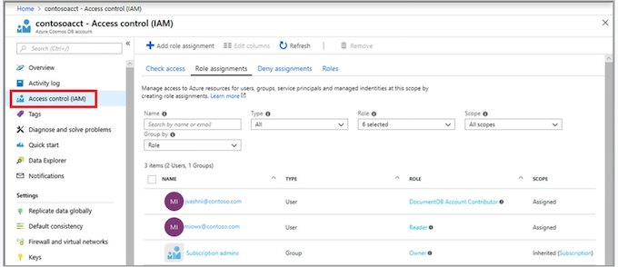

Note: To use the Azure Cosmos DB RBAC in your application, you have to update the way you initialize the Azure Cosmos DB SDK. Instead of
passing your account's primary key, you have to pass an instance of a TokenCredential class. This instance provides the Azure Cosmos DB SDK
with the context required to fetch an Azure AD (AAD) token on behalf of the identity you wish to use.

Azure Cosmos DB's SQL API provides two types of authorization: master key token and resource token. Master key tokens provide access to the all
data and all permissions. Resource tokens provide access to specific containers and permissions, and you can create these tokens with an Azure AD
user's identity.

To provide Azure AD users with access to the Azure Cosmos DB, you would assign them a specific IAM role. Azure Cosmos DB uses Azure role-
based access control (Azure RBAC) for providing specific access. Azure RBAC is an authorization system built on Azure Resource Manager that provides fine-grained access management of resources in Azure.

The combination of a resource token and an IAM role assignment would provide the necessary access control for the Azure AD user accounts to
have read access to the Cosmos DB databases.

#### Question 61

You need to recommend an Azure Storage solution that meets the following requirements:

- ✑ The storage must support 1 PB of data.
- ✑ The data must be stored in blob storage.
- ✑ The storage must support three levels of subfolders.
- ✑ The storage must support access control lists (ACLs).

What should you include in the recommendation?

- [ ] A. a premium storage account that is configured for block blobs
- [x] B. **a general purpose v2 storage account that has hierarchical namespace enabled**   ✅
- [ ] C. a premium storage account that is configured for page blobs
- [ ] D. a premium storage account that is configured for file shares and supports large file shares

**Correct Answer: B**

Default limits for Azure general-purpose v2 (GPv2)general-purpose v1 (GPv1), and Blob storage accounts include:

* Default maximum storage account capacity: 5 PiB

Blob storage supports Azure Data Lake Storage Gen2, Microsoft's enterprise big data analytics solution for the cloud. Azure Data Lake Storage
Gen2 offers a hierarchical file system as well as the advantages of Blob storage.

Incorrect:

Not D: In a Premium FileStorage account, storage size is limited to 100 TB.

B. a general purpose v2 storage account that has hierarchical namespace enabled.

GPv2 with hierarchical structure gives you the following provisions:

- The storage must support three levels of subfolders.
- The storage must support access control lists (ACLs).
- The storage must support 1 PB of data.
- The data must be stored in blob storage.

#### Question 62

You manage a database environment for a Microsoft Volume Licensing customer named Contoso, Ltd. Contoso uses License Mobility through Software
Assurance.

You need to deploy 50 databases. The solution must meet the following requirements:

- ✑ Support automatic scaling.
- ✑ Minimize Microsoft SQL Server licensing costs.

What should you include in the solution? To answer, select the appropriate options in the answer area.

**Box 1: vCore -**  ✅

You can only apply the Azure Hybrid licensing model when you choose a vCore-based purchasing model and the provisioned compute tier for
your Azure SQL Database. Azure Hybrid Benefit isn't available for service tiers under the DTU-based purchasing model or for the serverless compute tier.

**Box 2: An Azure SQL Database elastic pool**  ✅

Azure SQL Database elastic pools are a simple, cost-effective solution for managing and scaling multiple databases that have varying and
unpredictable usage demands. The databases in an elastic pool are on a single server and share a set number of resources at a set price.
Elastic pools in SQL Database enable software as a service (SaaS) developers to optimize the price performance for a group of databases
within a prescribed budget while delivering performance elasticity for each database.

VCore - With the provisioned compute, you can choose the amount of compute resources that are always provisioned for your workload. With the
serverless compute you can specify the autoscaling of the compute resources over a configurable compute range.

#### Question 63

You have an on-premises application named App1 that uses an Oracle database.

You plan to use Azure Databricks to transform and load data from App1 to an Azure Synapse Analytics instance.

**You need to ensure that the App1 data is available to Databricks**.

Which two Azure services should you include in the solution? Each correct answer presents part of the solution.

- [ ] A. Azure Data Box Gateway
- [ ] B. Azure Import/Export service
- [x] C. **Azure Data Lake Storage**.  ✅
- [ ] D. Azure Data Box Edge
- [X] E. **Azure Data Factory**.   ✅

**The correct answer should be C and E**

ADF moves data from on-prem Oracle to Data Lake storage, which makes data ready for DataBrick

**DataBricks "ETL" data to Synapse:**

- **ADF - to extract and load data to Data Lake**
- **Data Lake - as it's the only storage generally supported by Databricks**

Azure Data Lake Storage is a secure, scalable and reliable data lake that allows you to perform analytics on large amounts of data. It's a great
choice for storing large volumes of data, like what App1 might produce

Azure Data Factory is a cloud-based data integration service that allows you to create data-driven workflows for moving and transforming data at
scale. In this case, it can be used to create a pipeline to move the data from your on-premises Oracle database to Azure Data Lake Storage, making
it available for further processing with Azure Databricks. Azure Data Factory has built-in support for a wide range of data sources, including Oracle

#### Question 64

You are designing a cost-optimized solution that uses Azure Batch to run two types of jobs on Linux nodes. 

The first job type will consist of short-running tasks for a development environment. The second job type will consist of long-running Message Passing Interface (MPI) applications for a production environment that requires timely job completion. You need to recommend the pool type and node type for each job type. 

The solution must minimize compute charges and leverage Azure Hybrid Benefit whenever possible. What should you recommend? To answer, select the appropriate options in the answer area

**Box 1: User subscription and low-priority virtual machines**

The first job type will consist of short-running tasks for a development environment. Among the many ways to purchase and consume Azure resources are Azure low priority VMs and Spot VMs. 

These virtual machines are compute instances allocated from spare capacity, offered at a highly discounted rate compared to ג€on demandג€ VMs. This means they can be a great option for cost savings ג€" for the right workloads

**Box 2: Batch service and dedicate virtual machines**

The second job type will consist of long-running Message Passing Interface (MPI) applications for a production environment that requires timely job completion. 

Azure Batch Service is a cloud based job scheduling and compute management platform that enables running large-scale parallel and high performance computing applications efficiently in the cloud. Azure Batch Service provides job scheduling and in automatically scaling and managing virtual machines running those jobs.

- Low Priority VMs 
- batch service and dedicated VMs

#### Question 65

You are developing a sales application that will contain several Azure cloud services and handle different components of a transaction. Different cloud services will process customer orders, billing, payment, inventory, and shipping. 

You need to recommend a solution to enable the cloud services to asynchronously communicate transaction information by using XML messages. What should you include in the recommendation?

* A. Azure Notification Hubs 
* B. Azure Service Fabric 
* **C. Azure Queue Storage**  ✅
* D. Azure Data Lake

Queue Storage delivers asynchronous messaging between application components, whether they are running in the cloud, on the desktop, on an on-premises server, or on a mobile device. The maximum message size supported by Azure Storage Queues is 64KB while Azure Service Bus Queues support messages up to 256KB. 

This becomes an important factor especially when the message format is padded (such as XML).

**Either its Azure Queue Storage or its Azure Service Bus.**

#### Question 66

You are developing a sales application that will contain several Azure cloud services and handle different components of a transaction. Different cloud services will process customer orders, billing, payment, inventory, and shipping. 

You need to recommend a solution to enable the cloud services to asynchronously communicate transaction information by using XML messages. What should you include in the recommendation?

* A. Azure Notification Hubs 
* B. Azure Service Fabric 
* **C. Azure Queue Storage**  ✅
* D. Azure Application Gateway

Queue storage is often used to create a backlog of work to process asynchronously. A queue message must be in a format compatible with an XML request using UTF-8 encoding. 

#### Question 67

You need to design a highly available Azure SQL database that meets the following requirements:

* Failover between replicas of the database must occur without any data loss. 
* The database must remain available in the event of a zone outage. 
* Costs must be minimized.

Which deployment option should you use?

* A. Azure SQL Database Hyperscale 
* **B. Azure SQL Database Premium**   ✅
* C. Azure SQL Database Basic 
* D. Azure SQL Database Standard

Whenever zone-redundancy (availability within the same region) is required you can only choose: -General Purpose

- General Purpose 
- Premium 
- Business Critical

Basic and Standard do not support zone-redundancy:

#### Question 68

You are developing a sales application that will contain several Azure cloud services and handle different components of a transaction. Different cloud services will process customer orders, billing, payment, inventory, and shipping

You need to recommend a solution to enable the cloud services to asynchronously communicate transaction information by using XML messages.

What should you include in the recommendation?

* **A. Azure Service Bus**  ✅
* B. Azure Data Lake 
* C. Azure Traffic Manager 
* D. Azure Blob Storage

Azure Service Bus because it is a messaging service that supports asynchronous communication between different components of an application.

* It enables the exchange of messages using different protocols and message patterns, including XML messages. 
* It also supports features such as pub/sub messaging, message batching, and message ordering.

Azure Service Bus is a fully managed enterprise message broker with message queues and publish-subscribe topics (in a namespace). Service Bus is used to decouple applications and services from each other, providing the following benefits:

- Load-balancing work across competing workers 
- Safely routing and transferring data and control across service and application boundaries 
- Coordinating transactional work that requires a high-degree of reliability

#### Question 69

You need to design a highly available Azure SQL database that meets the following requirements:

* Failover between replicas of the database must occur without any data loss. 
* The database must remain available in the event of a zone outage. 
* Costs must be minimized.

Which deployment option should you use?

* A. Azure SQL Database Basic 
* B. Azure SQL Managed Instance General Purpose 
* **C. Azure SQL Database Business Critical**   ✅
* D. Azure SQL Managed Instance Business Critical

The Business Critical service tier is designed for OLTP applications with high transaction rates and low latency I/O requirements. It offers the highest resilience to failures by using several isolated replicas.

B is wrong because Azure SQL Managed Instance General Purpose does not support Zone redundancy.

**C. Azure SQL Database Business Critical**

**The Business Critical service tier is designed for applications that require low-latency responses and high transaction rates, and need the highest degree of resilience to failures.**

It supports multiple read-only replicas, and failover between replicas of the database occurs without any data loss. It is also designed to maintain availability in the event of a zone outage. 

While Azure SQL Managed Instance Business Critical also provides high availability and zero data loss, it generally costs more than Azure SQL Database Business Critical. Therefore, to minimize costs as per your requirement, Azure SQL Database Business Critical would be a better choice. 

Azure SQL Database Basic and Azure SQL Managed Instance General Purpose do not offer the same level of high availability and data resilience as the Business Critical options.

#### Question 70

You have an Azure subscription. 

You need to deploy an Azure Kubernetes Service (AKS) solution that will use Windows Server 2019 nodes. The solution must meet the following requirements: 

* Minimize the time it takes to provision compute resources during scale-out operations.
* Support autoscaling of Windows Server containers. 

Which scaling option should you recommend?

* A. horizontal pod autoscaler 
* B. Virtual nodes 
* C. Kubernetes version 1.20.2 or newer 
* **D. cluster autoscaler** ✅

**cluster autoscaler - For Windows** 

**virtual nodes - For Linux**

#### Question 71

Your company has offices in North America and Europe. 

You plan to migrate to Azure. You need to recommend a networking solution for the new Azure infrastructure. 

The solution must meet the following requirements:

* The Point-to-Site (P2S) VPN connections of mobile users must connect automatically to the closest Azure region. 
* The offices in each region must connect to their local Azure region by using an ExpressRoute circuit. 
* Transitive routing between virtual networks and on-premises networks must be supported. 
* The network traffic between virtual networks must be filtered by using FQDNs

What should you include in the recommendation?

* **A. Azure Virtual WAN with a secured virtual hub**    ✅
* B. virtual network peering and application security groups 
* C. virtual network gateways and network security groups (NSGs) 
* D. Azure Route Server and Azure Network Function Manager

The Virtual WAN meets the first 3 requirements, and the secured virtual hub has the Azure Firewall Manager, which can do the FQDN filtering.

**Option A, Azure Virtual WAN with a secured virtual hub**, 

is the best recommendation for this scenario as it allows for automatic connection of mobile users to the closest Azure region, connection of offices to their local Azure region via ExpressRoute circuits, support for transitive routing, and filtering of network traffic between virtual networks by using FQDNs.

Option B, virtual network peering and application security groups, **does not provide automatic connection of mobile users to the closest Azure region or support for transitive routing**

**Option C, virtual network gateways and network security groups (NSGs),**

does not provide automatic connection of mobile users to the closest Azure region or support for transitive routing, and filtering network traffic between virtual networks by using FQDNs is more challenging.

**Option D, Azure Route Server and Azure Network Function Manager**

does not provide automatic connection of mobile users to the closest Azure region or support for filtering network traffic between virtual networks by using FQDNs

#### Question 72

You need to design a highly available Azure SQL database that meets the following requirements:

* Failover between replicas of the database must occur without any data loss. 
* The database must remain available in the event of a zone outage. 
* Costs must be minimized.

Which deployment option should you use?

* **A. Azure SQL Database Business Critical**  ✅
* B. Azure SQL Managed Instance Business Critical 
* C. Azure SQL Database Standard 
* D. Azure SQL Managed Instance General Purpose

**C is wrong option because Azure SQL Database Standard do not have Zone-redundant availability.**

**Zone-redundant availability is available to databases in the General Purpose, Premium, Business Critical and Hyperscale service** tiers of the vCore purchasing model, and not the Basic and Standard service tiers of the DTU-based purchasing model. Zone-redundant availability ensures Recovery Point Objective (RPO) which indicates the amount of data loss is zero.

Always the answers are (in this order):

1. **Azure SQL Database Premium**
2. **Azure SQL Database Serverless**
3. **Azure SQL Database Business Critical**

If there is only one of them, select it. If there are 2 of them, remember the order, and select the option in the order showed here.

#### Question 73

You are designing a point of sale (POS) solution that will be deployed across multiple locations and will use an Azure Databricks workspace in the Standard tier. The solution will include multiple apps deployed to the on-premises network of each location.

You need to configure the authentication method that will be used by the app to access the workspace. The solution must minimize the administrative effort associated with staff turnover and credential management.

What should you configure?

* A. a managed identity 
* **B. a service principal**  ✅
* C. a personal access token

**A managed identity is a type of service principal.**

MID can be used only between Azure resources, here we have on-prem application communicating to Azure resources, then you need a service principal

#### Question 74

You have two Azure AD tenants named contoso.com and fabrikam.com. Each tenant is linked to 50 Azure subscriptions. Contoso.com contains two users named User1 and User2.

You need to meet the following requirements:

* Ensure that User1 can change the Azure AD tenant linked to specific Azure subscriptions. 
* If an Azure subscription is liked to a new Azure AD tenant, and no available Azure AD accounts have full subscription-level permissions to the subscription, elevate the access of User2 to the subscription.

**The solution must use the principle of least privilege.**

Which role should you assign to each user? To answer, select the appropriate options in the answer area.

1. Owner  ✅
2. Owner  ✅

- Sign in using an account that: Has an Owner role assignment for the subscription.

An Azure AD Service Administrator role is designed to manage user, groups and other resources within an Azure AD tenant. While they can manage the users and groups, they don't have the permission to move a subscription from one tenant to another.

**To move a subscription from one tenant to another, you need to have the "Subscription Owner" or "Global Administrator" role** within the Azure AD tenant to which you want to move the subscription.

#### Question 75

Your company has the divisions shown in the following table.

Sub1 contains an Azure App Service web app named App1. App1 uses Azure AD for single-tenant user authentication. Users from contoso.com can authenticate to App1.

You need to recommend a solution to enable users in the fabrikam.com tenant to authenticate to App1. 

What should you recommend?

* A. Configure a Conditional Access policy. 
* **B. Use Azure AD entitlement management to govern external users**.   ✅
* C. Configure the Azure AD provisioning service
* D. Configure Azure AD Identity Protection.

two possible answers

* **Use Azure AD entitlement management to govern external users**
* **Configure Supported account types in the application registration and update the sign-in endpoint**

#### Question 76

You have a multi-tier app named App1 and an Azure SQL database named SQL1. 

The backend service of App1 writes data to SQL1. 

Users use the App1 client to read the data from SQL1. 

During periods of high utilization, the users experience delays retrieving the data. You need to minimize how long it takes for data requests. What should you include in the solution?

* **A. Azure Cache for Redis**   ✅
* B. Azure Content Delivery Network (CDN) 
* C. Azure Data Factory 
* D. Azure Synapse Analytics

* A. Azure Cache for Redis - Cache the data so users can achieve them quicker
* B. Azure Content Delivery Network (CDN) - There isn't any issue with the networking 
* C. Azure Data Factory - This tool is for orchestration, not for enhancing anything existing 
* D. Azure Synapse Analytics - Also an orchestration tool with additional data warehouse capabilities, not relevant in this case

#### Question 77

You have an Azure subscription that contains the resources shown in the following table

You create peering between VNet1 and VNet2 and between VNet1 and VNet3.

The virtual machines host an HTTPS-based client/server application and are accessible only via the private IP address of each virtual machine.

You need to implement a load balancing solution for VM2 and VM3. 

The solution must ensure that if VM2 fails, requests will be routed automatically to VM3, and if VM3 fails, requests will be routed automatically to VM2.

What should you include in the solution?

* A. Azure Firewall Premium 
* B. Azure Application Gateway v2 
* C. a cross-region load balancer 
* **D. Azure Front Door Premium**  ✅

While both Front Door and Application Gateway are layer 7 (HTTP/HTTPS) load balancers, **the primary difference is that Front Door is a non-regional service whereas Application Gateway is a regional service**. 

While Front Door can load balance between your different scale units/clusters/stamp units across regions, Application Gateway allows you to load balance between your VMs/containers etc. that is within the scale unit.

**D. Azure Front Door Premium** 

Azure Front Door Premium now supports Private Link, which enables private connectivity from a virtual network to a service running in Azure. This feature can be used to connect to services across regions privately, so this should work for your use case where VM2 is in East US and VM3 is in West US. Here is how it could work:

Azure Front Door Premium could be set up with Private Link to create a private endpoint in a regional network. This network can route traffic to VM2 and VM3 through the private link over the Microsoft backbone network, without exposure to the public internet. 

When one VM fails, Azure Front Door can automatically route the traffic to the other VM, maintaining the availability of your application.

#### Question 78

You are designing an app that will include two components. The components will communicate by sending messages via a queue.

You need to recommend a solution to process the messages by using a First in, First out (FIFO) pattern.

What should you include in the recommendation?

* A. storage queues with a custom metadata setting 
* B. Azure Service Bus queues with partitioning enabled 
* **C. Azure Service Bus queues with sessions enabled** ✅
* D. storage queues with a stored access policy

**Azure Service Bus sessions enable joint and ordered handling of unbounded sequences of related messages.** 

Sessions can be used in first in, first out (FIFO) and request-response patterns. This article shows how to use sessions to implement these patterns when using Service Bus.

Azure Service Bus supports a FIFO pattern through the use of sessions. A session is a sequence of ordered messages. All messages in a session are handled in the order they arrive. This ensures that messages are processed in the order they were added to the queue. 

Options A and D are incorrect because Azure Storage queues do not natively support the First In, First Out (FIFO) pattern. There are no such features as custom metadata setting or stored access policy that can establish FIFO in Azure Storage queues. 

Option B is incorrect because while partitioning in Azure Service Bus can improve performance by spreading the load across multiple message brokers and stores, it doesn't enforce FIFO ordering across partitions. 

FIFO ordering is maintained within a partition, but not across partitions. Hence, for strict FIFO, you would not want to enable partitioning, you would want to use sessions

#### Question 79

You need to deploy an instance of SQL Server on Azure Virtual Machines. The solution must meet the following requirements

* Support 15,000 disk IOPS. 
* Support SR-IOV. 
* Minimize costs.

What should you include in the solution? To answer, select the appropriate options in the answer area

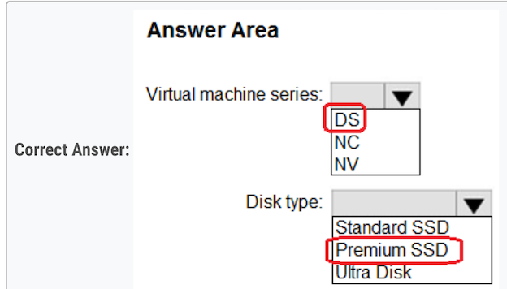

* DS= Dedicated series 
* NC=GPU-optimized 
* NV=Virtualized GPU

**1. DS**

Ideal for testing and development, small to medium databases, and low to medium traffic web servers. D-series, feature a more powerful CPU and optimal CPU-to-memory configuration, making them suitable for most production workloads.

**2. Premium SSD**

Azure Premium SSDs deliver high-performance and low-latency disk support for virtual machines (VMs) with input/output (IO)-intensive workloads. (max IOPS 20,000)

#### Question 80

You are developing an app that will use Azure Functions to process Azure Event Hubs events. Request processing is estimated to take between five and 20 minutes.

You need to recommend a hosting solution that meets the following requirements:

* Supports estimates of request processing runtimes 
* Supports event-driven autoscaling for the app 

Which hosting plan should you recommend?

* A. Dedicated 
* B. Consumption 
* C. App Service 
* **D. Premium**  ✅

The Premium plan is the best fit for this scenario. It supports both longer execution times and event-driven scaling, which are the requirements specified in the question. 

Azure Functions on a Premium plan can run for a longer period, up to 60 minutes (or indefinitely if the host.json "functionTimeout" setting is null), making it suitable for the estimated request processing times of five to 20 minutes. The Premium plan also supports event-driven autoscaling. 

The Consumption plan supports event-driven autoscaling but only allows functions to run for up to 10 minutes, so it wouldn't support the estimated request processing times of five to 20 minutes. 

The Dedicated and App Service plans can run for a longer period, but they do not support event-driven autoscaling. The Dedicated plan is also the most costly option and should be used when you need the most control over the function app environment.

#### Question 81

You need to design a highly available Azure SQL database that meets the following requirements:

- Failover between replicas of the database must occur without any data loss.
- The database must remain available in the event of a zone outage.
- Costs must be minimized.
  
Which deployment option should you use?

- [ ] A. Azure SQL Database Basic
- [x] **B. Azure SQL Database Business Critical**  ✅
- [ ] C. Azure SQL Database Standard
- [ ] D. Azure SQL Managed Instance General Purpose

Azure SQL DB Standard tier only supports LRS.

The answer is either **Azure SQL Database Premium or Azure SQL Database Business Critical** ✅

#### Question 82

You company has offices in New York City, Sydney, Paris, and Johannesburg.

**The company has an Azure subscription.**

You plan to deploy a new Azure networking solution that meets the following requirements:

- Connects to ExpressRoute circuits in the Azure regions of East US, Southeast Asia, North Europe, and South Africa
- Minimizes latency by supporting connection in three regions
- Supports Site-to-site VPN connections
- Minimizes costs

You need to identify the minimum number of Azure Virtual WAN hubs that you must deploy, and which virtual WAN SKU to use.

What should you identify? To answer, select the appropriate options in the answer area.

Deploy at least three Azure Virtual WAN hubs in order to minimize latency by supporting connections in three regions.

As for the SKU, the Basic SKU does not support ExpressRoute or site-to-site VPN connections, so you would need to use the Standard SKU to meet
all the requirements.

#### Question 83

You have an Azure Functions microservice app named App1 that is hosted in the Consumption plan. App1 uses an Azure Queue Storage trigger.

You plan to migrate App1 to an Azure Kubernetes Service (AKS) cluster

You need to prepare the AKS cluster to support App1. The solution must meet the following requirements:

- Use the same scaling mechanism as the current deployment.
- Support kubenet and Azure Container Networking Interface (CNI) networking.

Which two actions should you perform? Each correct answer presents part of the solution.

NOTE: Each correct answer is worth one point.

- [X] **A. Configure the horizontal pod autoscaler.** ✅
- [ ] B. Install Virtual Kubelet.
- [ ] C. Configure the AKS cluster autoscaler.
- [ ] D. Configure the virtual node add-on.
- [x] **E. Install Kubernetes-based Event Driven Autoscaling (KEDA).** ✅

Kubernetes uses the horizontal pod autoscaler (HPA) to monitor the resource demand and automatically scale the number of replicas. By default,
the horizontal pod autoscaler checks the Metrics API every 15 seconds for any required changes in replica count, but the Metrics API retrieves data
from the Kubelet every 60 seconds. Effectively, the HPA is updated every 60 seconds. When changes are required, the number of replicas is
increased or decreased accordingly. Horizontal pod autoscaler works with AKS clusters that have deployed the Metrics Server for Kubernetes 1.8

Kubernetes Event-driven Autoscaling (KEDA) is a single-purpose and lightweight component that strives to make application autoscaling simple
and is a CNCF Incubation project.

It applies event-driven autoscaling to scale your application to meet demand in a sustainable and cost-efficient manner with scale-to-zero.

#### Question 84

You need to recommend a solution to enable the cloud services to asynchronously communicate transaction information by using XML messages.

**Azure Queue Storage**   ✅

A. Azure Service Fabric: It's a distributed systems platform for deploying and managing microservices and containers. While it can be used to build
resilient applications, it's not a messaging system per se.

B. Azure Traffic Manager: It's a DNS-based traffic load balancer. It doesn't deal with asynchronous messaging.

C. Azure Queue Storage: This service allows you to decouple cloud components and ensure asynchronous message delivery. Messages can be
placed into a queue, where another service can pick them up and process them, which is exactly what's described in the scenario. The messages
can be in XML format or any other format that suits your needs.

D. Azure Notification Hubs: This is for sending push notifications to mobile devices. It's not designed for inter-service communication.

Therefore, the correct Answer is:

**C. Azure Queue Storage.**

#### Question 85

You have an on-premises Microsoft SQL Server 2008 instance that hosts a 50-GB database.

You need to migrate the database to an Azure SQL managed instance. The solution must minimize downtime.

What should you use?

- [ ] A. Azure Migrate
- [X] **B. Azure Data Studio**    ✅
- [ ] C. WANdisco LiveData Platform for Azure
- [ ] D. SQL Server Management Studio (SSMS)

Migration guide: **SQL Server to Azure SQL Managed Instance**

Prerequisites

To migrate your SQL Server to Azure SQL Managed Instance, make sure you have:

1. Chosen a migration method and the corresponding tools for your method.
2. **Install the Azure SQL migration extension for Azure Data Studio**.
3. Created a target Azure SQL Managed Instance
4. Configured connectivity and proper permissions to access both source and target.
5. Reviewed the SQL Server database engine features available in Azure SQL Managed Instance.

#### Question 86

You are developing a multi-tier app named App1 that will be hosted on Azure virtual machines. The peak utilization periods for App1 will be from 8
AM to 9 AM and 4 PM to 5 PM on weekdays

You need to deploy the infrastructure for App1. The solution must meet the following requirements:

- Support virtual machines deployed to four availability zones across two Azure regions.
- Minimize costs by accumulating CPU credits during periods of low utilization.

What is the minimum number of virtual networks you should deploy, and which virtual machine size should you use? To answer, select the
appropriate options in the answer area

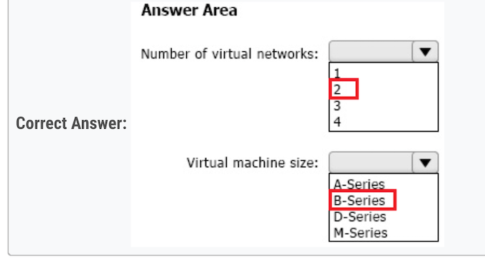

**Number of Virtual networks:  ✔ 2**   ✅

Virtual machine size  ✔ B-Series   ✅

Explanation:

Number of Virtual networks:

You need at least one virtual network per Azure region for the local resources, hence since you have two Azure regions, you'll need at least 2 virtual networks.

Virtual machine size:

The B-Series VM size is the best choice here because of the ability to bank CPU credits during periods of low utilization. The B-series are burstable
VMs that accumulate CPU credits during idle times and then consume these credits during periods of high CPU usage. This matches well with your
requirement to minimize costs by accumulating CPU credits during periods of low utilization. Other series like A-Series, D-Series, and M-Series do
not have this functionality.

#### Question 87

You have an on-premises Microsoft SQL server named SQL1 that hosts 50 databases.

You plan to migrate SQL1 to Azure SQL Managed Instance.

You need to perform an online migration of SQL1. The solution must minimize administrative effort.

What should you include in the solution?

- [ ] A. Azure Migrate
- [x] **B. Azure Database Migration Service**   ✅
- [ ] C. SQL Server Migration Assistant (SSMA)
- [ ] D. Data Migration Assistant (DMA)

B. Azure Database Migration Service

Azure Database Migration Service is a tool that helps you simplify, guide, and automate your database migration to Azure. Specifically for SQL
Server to Azure SQL Managed Instance migrations, it provides an option for offline (one-time) migrations which is suitable for your scenario.

The Data Migration Assistant (DMA) tool can be used beforehand to assess your SQL Server databases for any feature parity and compatibility
issues that could impact the database functionality in Azure SQL Managed Instance

Azure Migrate is a service that helps you assess and migrate applications, infrastructure, and data, but it doesn't specifically cater to SQL Server
migrations. SQL Server Migration Assistant (SSMA) is more suited for migrations to Azure SQL Database and does not support Azure SQL Managed
Instance.

#### Question 88

You plan to deploy an infrastructure solution that will contain the following configurations:

* External users will access the infrastructure by using Azure Front Door.
* External user access to the backend APIs hosted in Azure Kubernetes Service (AKS) will be controlled by using Azure API Management.
* External users will be authenticated by an Azure AD B2C tenant that uses OpenID Connect-based federation with a third-party identity provider.

Which function does each service provide? To answer, drag the appropriate functions to the correct services. Each function may be used once,
more than once, or not at all. You may need to drag the split bar between panes or scroll to view content.

- **Front Door --> OWASP**   ✅
- **APIM --> Validation JWT**  ✅

So, i think that right anwers are:

- Box1 - FrontDoor => Protect against OWASP Vulnerabilities   ✅
- Box2 - API Management => Validation token JWT   ✅

#### Question 89

Your company plans to deploy various Azure App Service instances that will use Azure SQL databases. The App Service instances will be deployed
at the same time as the Azure SQL databases.

The company has a regulatory requirement to deploy the App Service instances only to specific Azure regions. The resources for the App Service
instances must reside in the same region.

You need to recommend a solution to meet the regulatory requirement.

Solution: **You recommend using an Azure Policy initiative to enforce the location of resource groups.**

Does this meet the goal?

- [ ] A. Yes
- [X] B. No

"You recommend using an Azure Policy initiative to enforce the location of resource groups"

You need to enforce the location of the App Service instances, and not of resource groups.

The right answer was in the question #57: "**You recommend using an Azure Policy initiative to enforce the location"**

**Resources can be created in a region different than the RG's one**

#### Question 90

Your on-premises datacenter contains a server that runs Linux and hosts a Java app named App1. App1 has the following characteris

- App1 is an interactive app that users access by using HTTPS connections.
- The number of connections to App1 changes significantly throughout the day.
- App1 runs multiple concurrent instances.
- App1 requires major changes to run in a container.

You plan to migrate App1 to Azure.

You need to recommend a compute solution for App1. The solution must meet the following requirements:

- The solution must run multiple instances of App1.
- The number of instances must be managed automatically depending on the load.
- Administrative effort must be minimized.

What should you include in the recommendation?

- [ ] A. Azure Batch
- [X] **B. Azure App Service**  ✅
- [ ] C. Azure Kubernetes Service (AKS)
- [ ] D. Azure Virtual Machine Scale Sets

In order to minimize administrative effort, I believe Azure App Service is the right answer

#### Question 91

You have an Azure App Service web app named Webapp1 that connects to an Azure SQL database named DB1. Webapp1 and DB1 are deployed to
the East US Azure region.

You need to ensure that all the traffic between Webapp1 and DB1 is sent via a private connection.

What should you do? To answer, select the appropriate options in the answer area.

NOTE: Each correct selection is worth one point.

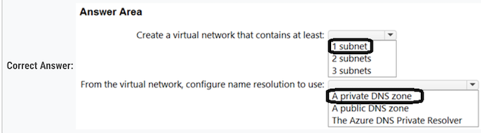

**Box 1: 2 subnets**  ✅

Create a virtual network that contains at least 2 subnets. One for the Azure App Service VNet Integration and another for the Azure Private Link

**Box 2: a private DNS zone**  ✅

Configure name resolution to use a private DNS zone. This is necessary for the web app to work with Azure DNS private zones.

#### Question 92

Your on-premises network contains an Active Directory Domain Services (AD DS) domain. The domain contains a server named Server1. Server1
contains an app named App1 that uses AD DS authentication. Remote users access App1 by using a VPN connection to the on-premises network.

You have an Azure AD tenant that syncs with the AD DS domain by using Azure AD Connect.

You need to ensure that the remote users can access App1 without using a VPN. The solution must meet the following requirements:

- • Ensure that the users authenticate by using Azure Multi-Factor Authentication (MFA).
- • Minimize administrative effort.

What should you include in the solution? To answer, select the appropriate options in the answer area.

- box1: ent app (required for MFA in conditional access)
- box2: azure ad app proxy

#### Question 93

You have an Azure subscription that contains an Azure Kubernetes Service (AKS) instance named AKS1. AKS1 hosts microservice-based APIs that
are configured to listen on non-default HTTP ports.

You plan to deploy a Standard tier Azure API Management instance named APIM1 that will make the APIs available to external users.

You need to ensure that the AKS1 APIs are accessible to APIM1. The solution must meet the following requirements:

- Implement MTLS authentication between APIM1 and AKS1.
- Minimize development effort.
- Minimize costs.

What should you do?

- [ ] A. Implement an external load balancer on AKS1.
- [ ] B. Redeploy APIM1 to the virtual network that contains AKS1.
- [ ] C. Implement an ExternalName service on AKS1.
- [X] **D. Deploy an ingress controller to AKS1.**  ✅

Ingress controller is correct answer.

There is picture describing the architecture (API Management > Ingress Controller > AKS cluster):

Mutual TLS (mTLS) authentication is natively supported by Azure API Management and can be enabled in Kubernetes by installing an Ingress
Controller. This approach simplifies the microservices as the authentication will be performed in the Ingress Controller. This solution also meets the requirements of implementing mTLS authentication between APIM1 and AKS1, minimizing development effort, and minimizing costs.

#### Question 94

You need to recommend a solution to integrate Azure Cosmos DB and Azure Synapse. The solution must meet the following requirements:

- Traffic from an Azure Synapse workspace to the Azure Cosmos DB account must be sent via the Microsoft backbone network.
- Traffic from the Azure Synapse workspace to the Azure Cosmos DB account must NOT be routed over the internet.
- Implementation effort must be minimized.

What should you include in the recommendation? To answer, select the appropriate options in the answer area.

**Box 1: Configure a dedicated managed virtual network**

provision the Azure Synapse workspace with the option to Configure a dedicated managed virtual network. This will ensure that the traffic between
Azure Synapse and Azure Cosmos DB is routed through the Microsoft backbone network and not over the internet

**Box 2: Managed private endpoints**

Configure the Azure Cosmos DB account to use Managed private endpoints. This will allow Azure Synapse to securely connect to Azure Cosmos DB using a private link