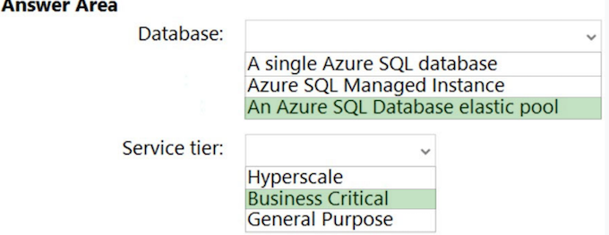
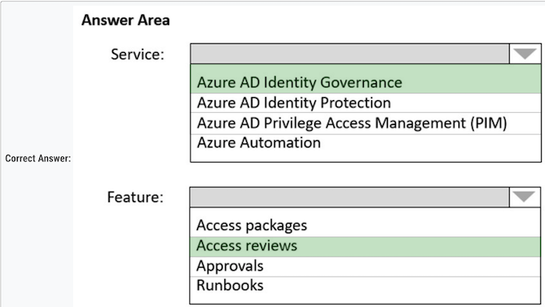

# Topic 1

### Question 1

**Overview - Litware, Inc**. is a medium-sized finance company that has a main office in Boston.

Existing Environment -

Identity Environment -

The network contains an Active Directory forest named litware.com that is linked to an Azure Active Directory (Azure AD) tenant named litware.com. All users have Azure Active Directory Premium P2 licenses.

Litware has a second Azure AD tenant named dev.litware.com that is used as a development environment. 

The litware.com tenant has a Conditional Access policy named Capolicy1. 

Capolicy1 requires that when users manage the Azure subscription for a production environment by using the Azure portal, they must connect from a hybrid Azure AD-joined device

**Azure Environment -**

Litware has 10 Azure subscriptions that are linked to the Litware.com tenant and five Azure subscriptions that are linked to the dev.litware.com tenant. All the subscriptions are in an Enterprise Agreement (EA). 

The litware.com tenant contains a custom Azure role-based access control (Azure RBAC) role named Role1 that grants the DataActions read permission to the blobs and files in Azure Storage.

**On-Premises Environment -**

The on-premises network of Litware contains the resources shown in the following table

**Network Environment -**

Litware has ExpressRoute connectivity to Azure. 

Planned Changes and Requirements

**Planned Changes -**

Litware plans to implement the following changes:

* Migrate DB1 and DB2 to Azure. 
* Migrate App1 to Azure virtual machines. 
* Migrate the external storage used by App1 to Azure Storage. 
* Deploy the Azure virtual machines that will host App1 to Azure dedicated hosts.

**Authentication and Authorization Requirements**

Litware identifies the following authentication and authorization requirements: 

Only users that manage the production environment by using the Azure portal must connect from a hybrid Azure AD-joined device and authenticate by using Azure Multi-Factor Authentication (MFA). The Network Contributor built-in RBAC role must be used to grant permissions to the network administrators for all the virtual networks in all the Azure subscriptions

To access the resources in Azure, App1 must use the managed identity of the virtual machines that will host the app. RBAC roles must be applied to management groups

**Resiliency Requirements -**

Litware identifies the following resiliency requirements: 

Once migrated to Azure, DB1 and DB2 must meet the following

Once migrated to Azure, DB1 and DB2 must meet the following requirements:

- Maintain availability if two availability zones in the local Azure region fail. 
- Fail over automatically. 
- Minimize I/O latency.

App1 must meet the following requirements:

- Be hosted in an Azure region that supports availability zones. 
- Be hosted on Azure virtual machines that support automatic scaling. 
- Maintain availability if two availability zones in the local Azure region fail

Security and Compliance Requirements

Once App1 is migrated to Azure, you must ensure that new data can be written to the app, and the modification of new and existing data is prevented for a period of three years. 

On-premises users and services must be able to access the Azure Storage account that will host the data in App1. Access to the public endpoint of the Azure Storage account that will host the App1 data must be prevented. 

All Azure SQL databases in the production environment must have Transparent Data Encryption (TDE) enabled. App1 must NOT share physical hardware with other workloads.

Business Requirements 

Litware identifies the following business requirements: 

- Minimize administrative effort. 
- Minimize costs.

You need to ensure that users managing the production environment are registered for Azure MFA and must authenticate by using Azure MFA when they sign in to the Azure portal. The solution must meet the authentication and authorization requirements.

What should you do? To answer, select the appropriate options in the answer area

**Box 1: Azure AD Identity Protection** 

Only users that manage the production environment by using the Azure portal must connect from a hybrid Azure AD-joined device and authenticate by using Azure Multi-Factor Authentication (MFA).

Note: Policy configuration -

1. Navigate to the Azure portal. 
2. Browse to Azure Active Directory > Security > Identity Protection > MFA registration policy. 
3. Under Assignments 
4. Users - Choose All users or Select individuals and groups if limiting your rollout. 
5. Optionally you can choose to exclude users from the policy. 
6. Enforce Policy - On 
7. Save

**Box 2: Grant control in capolicy1**

The litware.com tenant has a Conditional Access policy named Capolicy1. Capolicy1 requires that when users manage the Azure subscription for a production environment by using the Azure portal, they must connect from a hybrid Azure AD-joined device. 

Note: We need to configure the policy conditions for capolicy1 that prompt for MFA

* topic 5: Litware 
* topic 6: Contoso 
* topic 7: Fabrikam 
* topic 8: Litware = topic 5 
* topic 9: Fabrikam = topic 7 
* topic 10: Contoso ltd = topic 6 
* topic 11: Fabrikam = topic 7 
* topic 12: Litware = topic 5 
* topic 13: Contoso ltd = topic 6

1. To register the users for Azure MFA, use: a. Azure AD identity Protection. Azure AD Identity Protection is a tool that allows organizations to discover, investigate, and remediate identity-based risks in their environment. It can help you manage the roll-out of Multi-Factor Authentication
(MFA) registration by prompting users for registration during risk sign-in attempts. 

2. To enforce Azure MFA authentication, configure: a. Grant control in capolicy1. Grant controls are used to enforce additional requirements that a user must meet before they are granted access. You can enforce Azure MFA by setting it as a requirement in the Grant control settings of Capolicy1.

### Question 2

After you migrate App1 to Azure, you need to enforce the data modification requirements to meet the security and compliance requirements. What should you do?

* **A. Create an access policy for the blob service.**  ✅
* B. Implement Azure resource locks. 
* C. Create Azure RBAC assignments. 
* D. Modify the access level of the blob service.

Scenario: Once App1 is migrated to Azure, you must ensure that new data can be written to the app, and the modification of new and existing data is prevented for a period of three years.

As an administrator, you can lock a subscription, resource group, or resource to prevent other users in your organization from accidentally deleting or modifying critical resources. The lock overrides any permissions the user might have.

### Question 3

You plan to migrate App1 to Azure. 

You need to recommend a high-availability solution for App1. 

The solution must meet the resiliency requirements. What should you include in the recommendation? To answer, select the appropriate options in the answer area.

**Box 1: 3 -**  ✅

Need three host groups to meet the third scenario requirement below

Scenario: App1 must meet the following requirements: 

* Be hosted in an Azure region that supports availability zones. 
* Be hosted on Azure virtual machines that support automatic scaling. 
* Maintain availability if two availability zones in the local Azure region fail.

**Box 2: 3 -**  ✅

The availability setting of your host group should match your scale set

* The host group and the scale set must be using the same availability zone. 
* The fault domain count for the host group level should match the fault domain count for your scale set.

VMSS supports zone-redundant, while Dedicated Host does not. No-zone option of host group in Dedicated Host is not zone-redundant, it represents regional resource

- You must create a host group in each zone. 
- You must create a VMSS in each zone where the host group is deployed.

### Question 4

You plan to migrate App1 to Azure. 

**You need to recommend a storage solution for App1 that meets the security and compliance requirements.** 

Which type of storage should you recommend, and how should you recommend configuring the storage? To answer, select the appropriate options in the answer area.

**Box 1: Standard general-purpose v2**  ✅

* Standard general-purpose v2 supports Blob Storage. 
* Azure Storage provides data protection for Blob Storage and Azure Data Lake Storage Gen2.

Litware identifies the following security and compliance requirements:

* ✑ Once App1 is migrated to Azure, you must ensure that new data can be written to the app, and the modification of new and existing data is prevented for a period of three years. 
* ✑ On-premises users and services must be able to access the Azure Storage account that will host the data in App1. 
* ✑ Access to the public endpoint of the Azure Storage account that will host the App1 data must be prevented. All Azure SQL databases in the production environment must have Transparent Data Encryption (TDE) enabled.
* ✑ App1 must NOT share physical hardware with other workloads.

**Box 2: Hierarchical namespace -**

Scenario: Plan: Migrate App1 to Azure virtual machines

* Azure Data Lake Storage Gen2 implements an access control model that supports both Azure role-based access control (Azure RBAC) and POSIX-like access control lists (ACLs). 
* Data Lake Storage Gen2 and the Network File System (NFS) 3.0 protocol both require a storage account with a hierarchical namespace enabled

> Storage account type: " Standard general-purpose v2 " 
> 
> Configuration: " Hierarchical namespace "

### Question 5

You plan to migrate App1 to Azure. 

**You need to recommend a network connectivity solution for the Azure Storage account that will host the App1 data.**

The solution must meet the security and compliance requirements. What should you include in the recommendation?

* A. Microsoft peering for an ExpressRoute circuit 
* B. Azure public peering for an ExpressRoute circuit 
* C. a service endpoint that has a service endpoint policy 
* **D. a private endpoint**  ✅

**Correct Answer: D**

Private Endpoint securely connect to storage accounts from on-premises networks that connect to the VNet using VPN or ExpressRoutes with private-peering.

Private Endpoint also secure your storage account by configuring the storage firewall to block all connections on the public endpoint for the storage service. 

**Incorrect Answers**

* A: Microsoft peering provides access to Azure public services via public endpoints with public IP addresses, which should not be allowed. 
* B: Azure public peering has been deprecated. 
* C: By default, Service Endpoints are enabled on subnets configured in Azure virtual networks. Endpoints can't be used for traffic from your premises to Azure services.

### Question 6

**You need to implement the Azure RBAC role assignments for the Network Contributor role**. The solution must meet the authentication and authorization requirements. What is the minimum number of assignments that you must use?

* A. 1 
* **B. 2** 
* C. 5 
* D. 10 
* E. 15

Scenario: The Network Contributor built-in RBAC role must be used to grant permissions to the network administrators for all the virtual networks in all the Azure subscriptions. RBAC roles must be applied at the highest level possible

**Litware has two Azure tenants.**

One tenant with 10 subscriptions and one tenant with five subscriptions. 

We can organize the subscriptions of the two tenants in a management group each and assign users to the Network Contributor role or to Role1 at the management group level.

### Question 7

**You need to configure an Azure policy to ensure that the Azure SQL databases have Transparent Data Encryption (TDE) enabled.** The solution must meet the security and compliance requirements

Which three actions should you perform in sequence? To answer, move the appropriate actions from the list of actions to the answer area and arrange them in the correct order.

**Step 1: Create an Azure policy definition that uses the deployIfNotExists**

The first step is to define the roles that deployIfNotExists and modify needs in the policy definition to successfully deploy the content of your included template.

**Step 2: Create an Azure policy assignment** ✅

When creating an assignment using the portal, Azure Policy both generates the managed identity and grants it the roles defined in roleDefinitionIds.

**Step 3: Invoke a remediation task.** ✅

Resources that are non-compliant to a deployIfNotExists or modify policy can be put into a compliant state through Remediation. Remediation is accomplished by instructing Azure Policy to run the deployIfNotExists effect or the modify operations of the assigned policy on your existing resources and subscriptions, whether that assignment is to a management group, a subscription, a resource group, or an individual resource. During evaluation, the policy assignment with deployIfNotExists or modify effects determines if there are non-compliant resources or subscriptions. When non- compliant resources or subscriptions are found, the details are provided on the Remediation page.

* Create an Azure policy definition that uses the deployIfNotExists effect and specifies TDE as a required setting. 
* Create an Azure policy assignment and assign the policy definition to the desired scope (e.g. subscription or resource group). 
* Invoke a remediation task to automatically enforce the policy and enable TDE on existing databases that do not have it enabled.

### Question 8

**You plan to migrate DB1 and DB2 to Azure.** ✅

You need to ensure that the Azure database and the service tier meet the resiliency and business requirements

**What should you configure?** To answer, select the appropriate options in the answer area

**Box 1: An Azure SQL Database elastic pool** ✅

Scenario:

Resiliency Requirements. Once migrated to Azure, DB1 and DB2 must meet the following requirements: 

* Maintain availability if two availability zones in the local Azure region fail. 
* Fail over automatically. 
* Minimize I/O latency

Litware identifies the following business requirements:

* Minimize administrative effort. 
* Minimize costs.

**Box 2: Business Critical** ✅

> Database: "An Azure SQL Database elastic pool" 
>
> Service Tier: "Business Critical"

### Question 9

**How should the migrated databases DB1 and DB2 be implemented in Azure?**

**Box 1: SQL Managed Instance -**

Scenario: Once migrated to Azure, DB1 and DB2 must meet the following requirements:

* ✑ Maintain availability if two availability zones in the local Azure region fail. 
* ✑ Fail over automatically. 
* ✑ Minimize I/O latency.

**Box 2: Business critical -**

SQL Managed Instance is available in two service tiers:

* General purpose: Designed for applications with typical performance and I/O latency requirements. 
* Business critical: Designed for applications with low I/O latency requirements and minimal impact of underlying maintenance operations on the workload.

## Topic 2

**Overview - Contoso, Ltd. is a research company that has a main office in Montreal**

Existing Environment -

Technical Environment - 

The on-premises network contains a single Active Directory domain named contoso.com. Contoso has a single Azure subscription

Business Partnerships -

Contoso has a business partnership with Fabrikam, Inc. Fabrikam users access some Contoso applications over the internet by using Azure Active Directory (Azure AD) guest accounts.

Requirements - 

Planned Changes - Contoso plans to deploy two applications named App1 and App2 to Azure

App1 -

* App1 will be a Python web app hosted in Azure App Service that requires a Linux runtime. Users from Contoso and Fabrikam will access App1. 
* App1 will access several services that require third-party credentials and access strings. The credentials and access strings are stored in Azure Key Vault

App1 will have six instances: three in the East US Azure region and three in the West Europe Azure region. 

App1 has the following data requirements:

* Each instance will write data to a data store in the same availability zone as the instance. 
* Data written by any App1 instance must be visible to all App1 instances. App1 will only be accessible from the internet. 

App1 has the following connection requirements:

* Connections to App1 must pass through a web application firewall (WAF). 
* Connections to App1 must be active-active load balanced between instances

All connections to App1 from North America must be directed to the East US region. All other connections must be directed to the West Europe region.

Every hour, you will run a maintenance task by invoking a PowerShell script that copies files from all the App1 instances. 

The PowerShell script will run from a central location.

**App2 -**

App2 will be a .NET app hosted in App Service that requires a Windows runtime. App2 has the following file storage requirements: 

* Save files to an Azure Storage account. 
* Replicate files to an on-premises location. 
* Ensure that on-premises clients can read the files over the LAN by using the SMB protocol. 
* You need to monitor App2 to analyze how long it takes to perform different transactions within the application.

The solution must not require changes to the application code

Application Development Requirements

* Application developers will constantly develop new versions of App1 and App2. 
* The development process must meet the following requirements: A staging instance of a new application version must be deployed to the application host before the new version is used in production. 
* After testing the new version, the staging version of the application will replace the production version

The switch to the new application version from staging to production must occur without any downtime of the application.

Identity Requirements -

Contoso identifies the following requirements for managing Fabrikam access to resources:

Every month, an account manager at Fabrikam must review which Fabrikam users have access permissions to App1. 

Accounts that no longer need permissions must be removed as guests. The solution must minimize development effort.

Security Requirement - 

* All secrets used by Azure services must be stored in Azure Key Vault. 
* Services that require credentials must have the credentials tied to the service instance. The credentials must NOT be shared between services

### Question 1

You need to recommend a solution for the App1 maintenance task. 

The solution must minimize costs. What should you include in the recommendation?

* **A. an Azure logic app**  ✅
* B. an Azure function 
* C. an Azure virtual machine 
* D. an App Service WebJob

Every hour, you will run a maintenance task by invoking a PowerShell script that copies files from all the App1 instances. The PowerShell script will run from a central location.

App1 will have six instances: three in the East US Azure region and three in the West Europe Azure region. 

* You can create and manage workflows with Azure PowerShell in Azure Logic Apps. 
* You can create a Consumption logic app in multi-tenant Azure Logic Apps by using the JSON file for a logic app workflow definition. 
* You can then manage your logic app by running the cmdlets in the Az.LogicApp PowerShell module

Azure Logic App. The key here is the term "every hour" "Every hour, you will run a maintenance task by invoking a PowerShell script that copies files from all the App1 instances. 

The PowerShell script will run from a central location." In Azure Logic App, you can schedule every hour

### Question 2

You need to recommend a solution that meets the application development requirements. What should you include in the recommendation?

* A. the Azure App Configuration service 
* B. an Azure Container Registry instance 
* **C. deployment slots**     ✅
* D. Continuous Integration/Continuous Deployment (CI/CD) sources

When you deploy your web app, web app on Linux, mobile back end, or API app to Azure App Service, you can use a separate deployment slot instead of the default production slot when you're running in the Standard, Premium, or Isolated App Service plan tier. Deployment slots are live apps with their own host names.

App content and configurations elements can be swapped between two deployment slots, including the production slot. 

Deploying your application to a non-production slot has the following benefits:

* You can validate app changes in a staging deployment slot before swapping it with the production slot. 
* Deploying an app to a slot first and swapping it into production makes sure that all instances of the slot are warmed up before being swapped into production

This eliminates downtime when you deploy your app.

* After a swap, the slot with previously staged app now has the previous production app. If the changes swapped into the production slot aren't as you expect, you can perform the same swap immediately to get your "last known good site" back.

Note: Application Development Requirements

Application developers will constantly develop new versions of App1 and App2. The development process must meet the following requirements:

* A staging instance of a new application version must be deployed to the application host before the new version is used in production. 
* After testing the new version, the staging version of the application will replace the production version. 
* The switch to the new application version from staging to production must occur without any downtime of the application.

### Question 3

You need to recommend an App Service architecture that meets the requirements for App1. The solution must minimize costs. What should you recommend?

* A. one App Service Environment (ASE) per availability zone 
* B. one App Service Environment (ASE) per region
* **C. one App Service plan per region**   ✅
* D. one App Service plan per availability zone

No need for dedicated environment. So Azure Service Plan per region is enough

**C. One App Service Plan per region.** 

To be exact, the Basic App Service Plan offers up to 3 dedicated instances for your app to run.

- With Premium App Service App is enough in terms of zone redundant. It is offered in P2 and P3. 
- Comparing prices with ASE that is Isolated. ASE in zone redundant is charged with nine instances as minimum regardless of using 3 instances. So it is much expensive.

### Question 4

You need to recommend a solution to ensure that App1 can access the third-party credentials and access strings. The solution must meet the security requirements. 

What should you include in the recommendation? To answer, select the appropriate options in the answer area

**Box 1: A system-assigned managed identity** ✅

No one knows the credentials of managed identities.

Managed Identities exist in two formats:

* System assigned: in this scenario, the identity is linked to a single Azure Resource, eg a Virtual Machine, a Logic App, a Storage Account, Web App, Function, so almost anything. Next, they also live with the Azure Resource, which means they get deleted when the Azure Resource gets deleted. 
* User Assigned Managed Identity (incorrect for this question), which means that you first have to create it as a stand-alone Azure resource by itself, after which it can be linked to multiple Azure Resources.

A system-assigned managed identity: This is an identity created by Azure for the App Service instance, which is tied to the lifecycle of this service and does not require the management of credentials.

**Box 2: role assignment** ✅

A role assignment: Utilizing Azure role-based access control (RBAC), you can assign a specific role to the managed identity, like “Key Vault Secrets User”, to retrieve secrets from the Key Vault.

Role assignment. More granular than access policy

### Question 5

HOTSPOT - **What should you implement to meet the identity requirements?** To answer, select the appropriate options in the answer area.

Requirements: Identity Requirements 

**Contoso identifies the following requirements for managing Fabrikam access to resources:**

* Every month, an account manager at Fabrikam must review which Fabrikam users have access permissions to App1. Accounts that no longer need permissions must be removed as guests. 
* The solution must minimize development effort

**Box 1: Azure AD Identity Governance**  ✅

> Incorrect: Not PIM: Life Cycle Requirements must be met.

**Box 2: Access reviews**  ✅

Azure Active Directory (Azure AD) access reviews enable organizations to efficiently manage group memberships, access to enterprise applications, and role assignments. User's access can be reviewed on a regular basis to make sure only the right people have continued access

1. Azure AD Identity Governance  ✅
2. Access reviews  ✅

### Question 6

What should you implement to meet the identity requirements? To answer, select the appropriate options in the answer area. NOTE: Each correct selection is worth one point.

**Requirements: Identity Requirements**

Contoso identifies the following requirements for managing Fabrikam access to resources:

* Every month, an account manager at Fabrikam must review which Fabrikam users have access permissions to App1. Accounts that no longer need permissions must be removed as guests. 
* The solution must minimize development effort.

**Box 1: Azure AD Identity Governance** ✅

Incorrect: Not PIM: Life Cycle Requirements must be met.

**Box 2: Access reviews**  ✅

Azure Active Directory (Azure AD) access reviews enable organizations to efficiently manage group memberships, access to enterprise applications, and role assignments. User's access can be reviewed on a regular basis to make sure only the right people have continued access

### Question 7

What should you recommend to meet the monitoring requirements for App2?

* A. VM insights 
* **B. Azure Application Insights** ✅
* C. Microsoft Sentinel 
* D. Container insights

Scenario: You need to monitor App2 to analyze how long it takes to perform different transactions within the application. The solution must not require changes to the application code. 

* Can't be A -> VM Insight as it is not running on a VM. 
* Can't be C -> Microsoft sentinel which is a SIEM 
* Can't be D -> Not running in a container.

### Question 8

**You need to recommend a solution that meets the file storage requirements for App2.**

What should you deploy to the Azure subscription and the on-premises network? To answer, drag the appropriate services to the correct locations. Each service may be used once, more than once, or not at all. You may need to drag the split bar between panes or scroll to view content.

**Box 1: Azure Files -**

Scenario: App2 has the following file storage requirements:

* ✑ Save files to an Azure Storage account. 
* ✑ Replicate files to an on-premises location. 
* ✑ Ensure that on-premises clients can read the files over the LAN by using the SMB protocol.

**Box 2: Azure File Sync**

Use Azure File Sync to centralize your organization's file shares in Azure Files, while keeping the flexibility, performance, and compatibility of an on-premises file server. Azure File Sync transforms Windows Server into a quick cache of your Azure file share. You can use any protocol that's available on Windows Server to access your data locally, including SMB, NFS, and FTPS. You can have as many caches as you need across the world.

> Azure Subscription: "Azure Files  ✅
> 
> On-premises network: "Azure File Sync"  ✅

### Question 9

You need to recommend a solution that meets the data requirements for App1. 

What should you recommend deploying to each availability zone that contains an instance of App1?

* **A. an Azure Cosmos DB that uses multi-region writes** ✅
* B. an Azure Data Lake store that uses geo-zone-redundant storage (GZRS) 
* C. an Azure Storage account that uses geo-zone-redundant storage (GZRS)

Scenario: App1 has the following data requirements: 

* ✑ Each instance will write data to a data store in the same availability zone as the instance. 
* ✑ Data written by any App1 instance must be visible to all App1 instances.

Azure Cosmos DB: Each partition across all the regions is replicated. Each region contains all the data partitions of an Azure Cosmos container and can serve reads as well as serve writes when multi-region writes is enabled

**Incorrect Answers:**

B, D: GZRS protects against failures. Geo-redundant storage (with GRS or GZRS) replicates your data to another physical location in the secondary region to protect against regional outages. However, that data is available to be read only if the customer or Microsoft initiates a failover from the primary to secondary region. 

C: Active geo-replication is designed as a business continuity solution that lets you perform quick disaster recovery of individual databases in case of a regional disaster or a large scale outage. Once geo-replication is set up, you can initiate a geo-failover to a geo-secondary in a different Azure region. The geo-failover is initiated programmatically by the application or manually by the user

### Question 10

**You are evaluating whether to use Azure Traffic Manager and Azure Application Gateway to meet the connection requirements for App1. What is the minimum numbers of instances required for each service?**

To answer, select the appropriate options in the answer area.

**Box 1: 1 -** ✅

App1 will only be accessible from the internet. App1 has the following connection requirements:

* Connections to App1 must be active-active load balanced between instances. 
* All connections to App1 from North America must be directed to the East US region. 
* All other connections must be directed to the West Europe region.

App1 will have six instances: three in the East US Azure region and three in the West Europe Azure region. 

Note: Azure Traffic Manager is a DNS-based traffic load balancer. This service allows you to distribute traffic to your public facing applications across the global Azure regions.

**Box 2: 2 -** ✅

* For production workloads, run at least two gateway instances. 
* A single Application Gateway deployment can run multiple instances of the gateway. 
* Use one Application Gateway in East US Region, and one in the West Europe region

> Azure Traffic Manager: " 1 " 
>
> Azure Application Gateway: " 2 "

## Topic 3

**Overview - Fabrikam, Inc.**

is an engineering company that has offices throughout Europe. The company has a main office in London and three branch offices in Amsterdam, Berlin, and Rome.

**Existing Environment: Active Directory Environment**

The network contains two Active Directory forests named corp.fabrikam.com and rd.fabrikam.com. 

There are no trust relationships between the forests. Corp.fabrikam.com is a production forest that contains identities used for internal user and computer authentication. Rd.fabrikam.com is used by the research and development (R&D) department only. 

The R&D department is restricted to using on-premises resources only.

Existing Environment: Network Infrastructure Each office contains at least one domain controller from the corp.fabrikam.com domain. 

The main office contains all the domain controllers for the rd.fabrikam.com forest.

All the offices have a high-speed connection to the internet.

An existing application named WebApp1 is hosted in the data center of the London office. WebApp1 is used by customers to place and track orders. WebApp1 has a web tier that uses Microsoft Internet Information Services (IIS) and a database tier that runs Microsoft SQL Server 2016. The web tier and the database tier are deployed to virtual machines that run on Hyper-V.

The IT department currently uses a separate Hyper-V environment to test updates to WebApp1.

Fabrikam purchases all Microsoft licenses through a Microsoft Enterprise Agreement that includes Software Assurance. Existing Environment: **Problem Statements The use of WebApp1 is unpredictable. At peak times, users often report delays. At other times, many resources for WebApp1 are underutilized**.

**Requirements: Planned Changes -**

Fabrikam plans to move most of its production workloads to Azure during the next few years, including virtual machines that rely on Active Directory for authentication. 

As one of its first projects, the company plans to establish a hybrid identity model, facilitating an upcoming Microsoft 365 deployment. All R&D operations will remain on-premises.

Fabrikam plans to migrate the production and test instances of WebApp1 to Azure

**Requirements: Technical Requirements**

Fabrikam identifies the following technical requirements:

* Website content must be easily updated from a single point. 
* User input must be minimized when provisioning new web app instances. 
* Whenever possible, existing on-premises licenses must be used to reduce cost. 
* Users must always authenticate by using their corp.fabrikam.com UPN identity. 
* Any new deployments to Azure must be redundant in case an Azure region fails.

* Whenever possible, solutions must be deployed to Azure by using the Standard pricing tier of Azure App Service. 
* An email distribution group named IT Support must be notified of any issues relating to the directory synchronization services. 
* In the event that a link fails between Azure and the on-premises network, ensure that the virtual machines hosted in Azure can authenticate to Active Directory. 
* Directory synchronization between Azure Active Directory (Azure AD) and corp.fabrikam.com must not be affected by a link failure between Azure and the on- premises network.

**Requirements: Database Requirements**

Fabrikam identifies the following database requirements:

* Database metrics for the production instance of WebApp1 must be available for analysis so that database administrators can optimize the performance settings.
* To avoid disrupting customer access, database downtime must be minimized when databases are migrated. 
* Database backups must be retained for a minimum of seven years to meet compliance requirements.

**Requirements: Security Requirements**

Fabrikam identifies the following security requirements:

* Company information including policies, templates, and data must be inaccessible to anyone outside the company.
* Users on the on-premises network must be able to authenticate to corp.fabrikam.com if an internet link fails.
* Administrators must be able authenticate to the Azure portal by using their corp.fabrikam.com credentials. 
* All administrative access to the Azure portal must be secured by using multi-factor authentication (MFA). 
* The testing of WebApp1 updates must not be visible to anyone outside the company

Question HOTSPOT -

### Question 1

**You are evaluating the components of the migration to Azure that require you to provision an Azure Storage account.**

For each of the following statements, select

Yes if the statement is true. Otherwise, select No.

**1. SQL Migration:**

Because onprem licenses must be used, whenever possible=> BYOL. Preferred SQL Migration in this case is uploading VHD from onprem Hyper-V- VM and create a new Azure VM

2. Website content storage is more like html, css, media. I think you would need a storage account for that

3. Database metrics: For SQL Server on Azure VMs it is possible to send metrics to 3 services

* a) Log Analytics workspace in Azure Monitor
* b) Azure Event Hub 
* c) Azure Storage

1. **You must provision an Azure storage account for the SQL server database migration**: Yes. Azure Storage is often used as a staging area for migrations, including SQL Server databases.
2.  **You must provision an Azure storage account for the web site content storage**: Yes. Azure Storage can be used to store static website content such as HTML, CSS, JavaScript, and image files.
3. **You must provision an Azure storage account for the Database metric monitoring**: No. Database metrics are typically monitored using Azure Monitor and Log Analytics, not Azure Storage. 
	* However, logs and metrics could potentially be exported to Azure Storage for long-term retention or further analysis.

	
1. **SQL Migration: Y** because Database migration assistant requires a Storage Account to store the database backup files 
2. **Web app content: Y** Content needs to be updated from an easy to use single point. That's a storage account. I don't consider the available storage that's built into an App Service as easily accessible or a 'single point' 
3. **Database metrics: N** Log Analytics workspace has its own storage, it doesn't require you to link your own storage account (although it's possible)

### Question 2

What should you include in the identity management strategy to support the planned changes?

* **A. Deploy domain controllers for corp.fabrikam.com to virtual networks in Azure.**  ✅
* B. Move all the domain controllers from corp.fabrikam.com to virtual networks in Azure. 
* C. Deploy a new Azure AD tenant for the authentication of new R&D projects. 
* D. Deploy domain controllers for the rd.fabrikam.com forest to virtual networks in Azure

**Correct Answer: A**

Directory synchronization between Azure Active Directory (Azure AD) and corp.fabrikam.com must not be affected by a link failure between Azure and the on- premises network. (This requires domain controllers in Azure). 

Users on the on-premises network must be able to authenticate to corp.fabrikam.com if an Internet link fails. (This requires domain controllers on-premises).

### Question 3

**To meet the authentication requirements of Fabrikam, what should you include in the solution?**

To answer, select the appropriate options in the answer area. NOTE: Each correct selection is worth one point.

* 1=1:Single tenant creation required only due to RD restrictions implemented. 
* 2=1:Need to add custom domain due to default .onmicrosoft.com domain on tenant creation
* 3=2 Two policies requires, can't have multiple actions to block + allow on single conditional access policies. 

One required for admin MFA, second to block external access as per requirements.

### Question 4

You need to recommend a notification solution for the IT Support distribution group. 

What should you include in the recommendation?

* A. a SendGrid account with advanced reporting 
* B. an action group 
* C. Azure Network Watcher 
* **D. Azure AD Connect Health** ✅

An email distribution group named IT Support must be notified of any issues relating to the directory synchronization services.

Note: You can configure the Azure AD Connect Health service to send email notifications when alerts indicate that your identity infrastructure is not healthy. his occurs when an alert is generated, and when it is resolved.

### Question 5

You need to recommend a solution to meet the database retention requirements. What should you recommend?

* **A. Configure a long-term retention policy for the database.**  ✅
* B. Configure Azure Site Recovery. 
* C. Use automatic Azure SQL Database backups. 
* D. Configure geo-replication of the database.

**Correct Answer: A**

Scenario: Database backups must be retained for a minimum of seven years to meet compliance requirements. 

Many applications have regulatory, compliance, or other business purposes that require you to retain database backups beyond the 7-35 days provided by Azure SQL Database and Azure SQL Managed Instance automatic backups. 

By using the long-term retention (LTR) feature, you can store specified SQL Database and SQL Managed Instance full backups in Azure Blob storage with configured redundancy for up to 10 years. LTR backups can then be restored as a new database

### Question 6

You need to recommend a data storage strategy for WebApp1. 

What should you include in the recommendation?

* A. an Azure virtual machine that runs SQL Server 
* B. a fixed-size DTU Azure SQL database 
* C. an Azure SQL Database elastic pool 
* **D. a vCore-based Azure SQL database**  ✅

**Correct Answer: D**

The use of WebApp1 is unpredictable. At peak times, users often report delays. At other times, many resources for WebApp1 are underutilized. Database metrics for the production instance of WebApp1 must be available for analysis so that database administrators can optimize the performance settings.

Note: A virtual core (vCore) represents a logical CPU and offers you the option to choose between generations of hardware and the physical characteristics of the hardware (for example, the number of cores, the memory, and the storage size). The vCore-based purchasing model gives you flexibility, control, transparency of individual resource consumption, and a straightforward way to translate on-premises workload requirements to the cloud. This model optimizes price, and allows you to choose compute, memory, and storage resources based on your workload needs.

Incorrect: 

**Not C: Azure SQL Database elastic pools are a simple, cost-effective solution for managing and scaling multiple databases, not for a single database.**

**D. vCore-based SQL**

**Requirement: Use existing on-premises licenses whenever possible**

You can only apply the Azure Hybrid licensing model when you choose a vCore-based purchasing model and the provisioned compute tier for your Azure SQL Database. Azure Hybrid Benefit isn't available for service tiers under the DTU-based purchasing model or for the serverless compute tier.

### Question 7

You design a solution for the web tier of WebApp1 as shown in the exhibit.

**Box 1: Yes** - Any new deployments to Azure must be redundant in case an Azure region fails. Traffic Manager is resilient to failure, including the failure of an entire Azure region.

* (Yes) Traffic manager distributes load to two sites (redundancy). 
* (Yes) The graphic clearly shows an "Azure Web App", which is production. By default, production web apps support auto scale. 
* (No) Azure Traffic manager does automatic failover, so no manual configuration is necessary