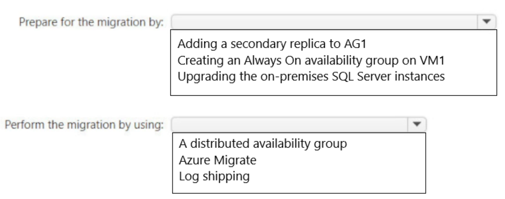
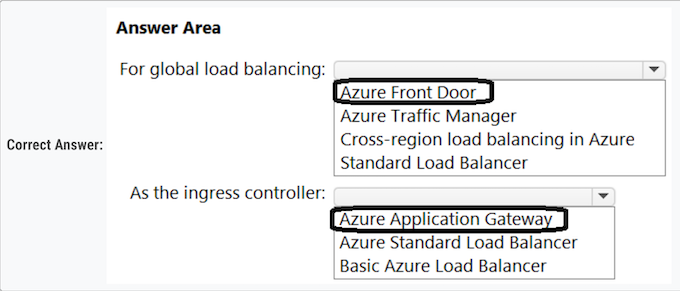
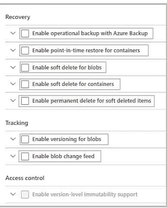

### Topic 3 - Question Set 3

#### Question 1

You have SQL Server on an Azure virtual machine. The databases are written to nightly as part of a batch process. 

You need to recommend a disaster recovery solution for the data. 

The solution must meet the following requirements: 

* ✑ Provide the ability to recover in the event of a **regional outage**. 
* ✑ Support a recovery time objective (RTO) of 15 minutes. 
* ✑ Support a recovery point objective (RPO) of 24 hours. 
* ✑ Support automated recovery. 
* ✑ Minimize costs. 

What should you include in the recommendation?

* A. Azure virtual machine availability sets 
* B. Azure Disk Backup 
* C. an Always On availability group 
* **D. Azure Site Recovery**   ✅

Replication with Azure Site Recover:

* ✑ RTO is typically less than 15 minutes. 
* ✑ RPO: One hour for application consistency and five minutes for crash consistency.

Incorrect Answers:

* B: Too slow. 
* C: Always On availability group RPO: Because replication to the secondary replica is asynchronous, there's some data loss.

Replication with Azure Site Recovery. RTO is typically less than 15 minutes. RPO: One hour for application consistency and five minutes for crash consistency.

#### Question 2

You plan to deploy the backup policy shown in the following exhibit.

Use the drop-down menus to select the answer choice that completes each statement based on the information presented in the graphic.

Use the drop-down menus to select the answer choice that completes each statement based on the information presented in the graphic.

**Answer is correct - 36 weeks and 1 day**

#### Question 3

Note: This question is part of a series of questions that present the same scenario. Each question in the series contains a unique solution that might meet the stated goals. Some question sets might have more than one correct solution, while others might not have a correct solution. After you answer a question in this section, you will NOT be able to return to it. As a result, these questions will not appear in the review screen. 

You need to deploy resources to host a stateless web app in an Azure subscription. The solution must meet the following requirements: 

* ✑ Provide access to the full .NET framework. 
* ✑ Grant administrators access to the operating system to install custom application dependencies.

Solution: You deploy two Azure virtual machines to two Azure regions, and you create an Azure Traffic Manager profile. Does this meet the goal?

* **A. Yes**   ✅
* B. No  

Provide redundancy if an Azure region fails.

Azure Traffic Manager is a DNS-based traffic load balancer that enables you to distribute traffic optimally to services across global Azure regions, while providing high availability and responsiveness

#### Question 4

You need to deploy resources to host a stateless web app in an Azure subscription. The solution must meet the following requirements:

✑ Provide access to the full .NET framework. 
✑ Provide redundancy if an Azure region fails. 
✑ Grant administrators access to the operating system to install custom application dependencies

Solution: You deploy two Azure virtual machines to two Azure regions, and you deploy an Azure Application Gateway. Does this meet the goal?

* A. Yes 
* **B. No**  ✅

App Gateway will balance the traffic between VMs deployed in the same region. 

Create an Azure Traffic Manager profile instead.

While Azure Application Gateway is a powerful tool for handling application traffic at the application layer and can assist with routing, load balancing, and other functions, it operates within a single region. It doesn't automatically provide geo-redundancy across multiple Azure regions.

For redundancy across regions, Azure Traffic Manager or Azure Front Door would be more suitable. They operate at the DNS level and are designed to route traffic across different regions for high availability and failover purposes. 

So, in this case, deploying two Azure virtual machines to two Azure regions and deploying an Azure Application Gateway would not fully meet the stated goals due to the lack of a regional failover strategy

Azure Application Gateway can load balance traffic to multiple backend servers or virtual machines, including those in different regions. However, you need to consider the following:

#### Question 5

You plan to create an Azure Storage account that will host file shares. The shares will be accessed from on-premises applications that are transaction intensive. 

You need to recommend a solution to minimize latency when accessing the file shares. 

The solution must provide the highest-level of resiliency for the selected storage tie

**Box 1: Premium** - Premium: Premium file shares are backed by solid-state drives (SSDs) and provide consistent high performance and low latency, within single- digit milliseconds for most IO operations, for IO-intensive workloads

**Incorrect Answers:**

* ✑ Hot: Hot file shares offer storage optimized for general purpose file sharing scenarios such as team shares. Hot file shares are offered on the standard storage hardware backed by HDDs. 

* ✑ Transaction optimized: Transaction optimized file shares enable transaction heavy workloads that don't need the latency offered by premium file shares.

Transaction optimized file shares are offered on the standard storage hardware backed by hard disk drives (HDDs). Transaction optimized has historically been called "standard", however this refers to the storage media type rather than the tier itself (the hot and cool are also "standard" tiers, because they are on standard storage hardware).

**Box 2: Zone-redundant storage (ZRS):**

Premium Azure file shares only support LRS and ZRS. Zone-redundant storage (ZRS): With ZRS, three copies of each file stored, however these copies are physically isolated in three distinct storage clusters in different Azure availability zones.

1. **Storage Tier**: For transaction-intensive applications, **it is recommended to use the "Premium" tier, which provides the highest performance and lowest latency**.
2. **Redundancy**: **Zone Redundant Storage (ZRS) replicates data across multiple zones within a single region, providing high availability and resiliency in case of a zone failure**. It also offers low latency access to the file shares, which is essential for transaction-intensive applications. Premium Azure file shares only support LRS and ZRS.

#### Question 6

After you answer a question in this section, you will NOT be able to return to it. As a result, these questions will not appear in the review screen. You need to deploy resources to host a stateless web app in an Azure subscription. The solution must meet the following requirements:

* ✑ Provide access to the full .NET framework. 
* ✑ Provide redundancy if an Azure region fails. 
* ✑ Grant administrators access to the operating system to install custom application dependencie

**Solution: You deploy an Azure virtual machine scale set that uses autoscaling. Does this meet the goal?**

* A. Yes 
* **B. No**  ✅

Instead, you should **deploy two Azure virtual machines to two Azure regions, and you create a Traffic Manager profile**

Note: Azure Traffic Manager is a DNS-based traffic load balancer that enables you to distribute traffic optimally to services across global Azure regions while providing high availability and responsiveness.

#### Question 7

You need to recommend an Azure Storage account configuration for two applications named Application1 and Application2. The configuration must meet the following requirements:

* ✑ Storage for Application1 must provide the highest possible transaction rates and the lowest possible latency. 
* ✑ Storage for Application2 must provide the lowest possible storage costs per GB. 
* ✑ Storage for both applications must be available in an event of datacenter failure. 
* ✑ Storage for both applications must be optimized for uploads and downloads.

What should you recommend? To answer, select the appropriate options in the answer area

**Box 1: BlobStorage with Premium Performance,** ✅

Application1 requires high transaction rates and the lowest possible latency. We need to use Premium, not Standard.

**Box 2: General purpose v2 with Standard Performance,.** ✅

General Purpose v2provides access to the latest Azure storage features, including Cool and Archive storage, with pricing optimized for the lowestGB storage prices. 

These accounts provide access to Block Blobs, Page Blobs, Files, and Queues. Recommended for most scenarios using Azure Storage.

Application 2: Blobstorage with standard performance VS General purpose V2 with standard performance - General purpose V2 is always recommended since Blobstorage with a legacy

#### Question 8

You plan to develop a new app that will store business critical data. The app must meet the following requirements:

* ✑ Prevent new data from being modified for one year. 
* ✑ Maximize data resiliency.
*  ✑ Minimize read latency

* **Box 1: Premium Block Blobs**   ✅

* **Box 2: Zone-redundant storage (ZRS)** ✅ 

* ✑ Prevent new data from being modified for one year. (Both Standard + Premium) 
* ✑ Maximize data resiliency. (ZRS) 
* ✑ Minimize read latency. (Premium)

#### Question 9

You plan to deploy 10 applications to Azure. The applications will be deployed to two Azure Kubernetes Service (AKS) clusters. Each cluster will be deployed to a separate Azure region

The application deployment must meet the following requirements:

* ✑ Ensure that the applications remain available if a single AKS cluster fails. 
* ✑ Ensure that the connection traffic over the internet is encrypted by using SSL without having to configure SSL on each container. 

Which service should you include in the recommendation?

* **A. Azure Front Door**    ✅
* B. Azure Traffic Manager 
* C. AKS ingress controller 
* D. Azure Load Balancer

Correct Answer: A  ✅

Azure Front Door supports SSL.

Azure Front Door, which focuses on global load-balancing and site acceleration, and Azure CDN Standard, which offers static content caching and acceleration.

The new Azure Front Door brings together security with CDN technology for a cloud-based CDN with threat protection and additional capabilities

Front Door is an application delivery network that provides global load balancing and site acceleration service for web applications. It offers Layer 7 capabilities for your application like SSL offload, path-based routing, fast failover, caching, etc. to improve performance and high-availability of your applications.

#### Question 10

You have an on-premises file server that stores 2 TB of data files. 

You plan to move the data files to Azure Blob Storage in the West Europe Azure region. 

You need to recommend a storage account type to store the data files and a replication solution for the storage account. The solution must meet the following requirements:

* ✑ Be available if a single Azure datacenter fails. 
* ✑ Support storage tiers.
*  ✑ Minimize cost.

What should you recommend? To answer, select the appropriate options in the answer area.

**Box 1: Standard general-purpose v2 Standard general-purpose v2 meets the requirements and minimizes the costs.**  ✅

**Box 2: Zone-redundant storage (ZRS) ZRS protects against a Datacenter failure, while minimizing the costs**.   ✅

#### Question 11

You have an Azure web app named App1 and an Azure key vault named KV1. App1 stores database connection strings in KV1. 

App1 performs the following types of requests to KV1:

✑ Get ✑ List ✑ Wrap ✑ Delete

Unwrap

✑ Backup ✑ Decrypt ✑ Encrypt

You are evaluating the continuity of service for App1. You need to identify the following if the Azure region that hosts KV1 becomes unavailable:

* ✑ To where will KV1 fail over? 
* ✑ During the failover, which request type will be unavailable?

What should you identify? To answer, select the appropriate options in the answer area

1. kv - failover to server in paired region  ✅
2. during failover, delete is unaviailable  ✅

**Box 1: A server in the paired region**

The contents of your key vault are replicated within the region and to a secondary region at least 150 miles away, but within the same geography to maintain high durability of your keys and secrets. Regions are paired for cross-region replication based on proximity and other factors.

**Box 2: Delete -**

During failover, your key vault is in read-only mode. Requests that are supported in this mode are:

List / certificates /Get / certificates /List / secrets / Get / secrets / List keys / Get (properties of) keys / Encrypt / Decrypt / Wrap / Unwrap / Verify / Sign / Backup

#### Question 12

Your company identifies the following business continuity and disaster recovery objectives for virtual machines that host sales, finance, and reporting applications in the company's on-premises data center:

* ✑ The sales application must be able to fail over to a second on-premises data center. 
* ✑ The reporting application must be able to recover point-in-time data at a daily granularity. The RTO is eight hours. 
* ✑ The finance application requires that data be retained for seven years. In the event of a disaster, the application must be able to run from Azure. The recovery time objective (RTO) is 10 minutes

You need to recommend which services meet the business continuity and disaster recovery objectives. **The solution must minimize costs**. What should you recommend for each application? To answer, drag the appropriate services to the correct applications. Each service may be used once, more than once, or not at all. You may need to drag the split bar between panes or scroll to view content

**Box 1: Azure Site Recovery -**  ✅

* Coordinates virtual-machine and physical-server replication, failover, and fullback. 
* DR solutions have low Recovery point objectives; 
* DR copy can be behind by a few seconds/minutes. DR needs only operational recovery data, which can take hours to a day. 
* Using DR data for long-term retention is not recommended because of the fine-grained data capture. 
* Disaster recovery solutions have smaller Recovery time objectives because they are more in sync with the source. 
* Remote monitor the health of machines and create customizable recovery plans.

**Box 2: Azure Site Recovery and Azure Backup**  ✅

Backup ensures that your data is safe and recoverable while Site Recovery keeps your workloads available when/if an outage occurs.

**Box 3: Azure Backup only**

Azure Backup - 

* Backs up data on-premises and in the cloud
* Have wide variability in their acceptable Recovery point objective. VM backups usually one day while database backups as low as 15 minutes. Backup data is typically retained for 30 days or less. From a compliance view, data may need to be saved for years. Backup data is ideal for archiving in such instances. 
* Because of a larger Recovery point objective, the amount of data a backup solution needs to process is usually much higher, which leads to a longer Recovery time objective.

* Sales: ASR only
* Finance: ASR and Azure Backup 
* Reporting: Azure Backup only

#### Question 13

You need to design a highly available Azure SQL database that meets the following requirements:

* ✑ Failover between replicas of the database must occur without any data loss. 
* ✑ The database must remain available in the event of a zone outage. 
* ✑ Costs must be minimized.

Which deployment option should you use?

* A. Azure SQL Managed Instance Business Critical 
* **B. Azure SQL Database Premium**  ✅
* C. Azure SQL Database Basic 
* D. Azure SQL Managed Instance General Purpose

Zone-redundant configuration is not available in SQL Managed Instance. In SQL Database this feature is only available when the Gen5 hardware is selected.

To prevent Data Loss, Premium/Business Critical is required:

The primary node constantly pushes changes to the secondary nodes in order and ensures that the data is persisted to at least one secondary replica before committing each transaction. This process guarantees that if the primary node crashes for any reason, there is always a fully synchronized node to fail over to.

**B is the correct answer.**

Zone-redundant is currently in preview for SQL Managed Instance, and is only available for the Business Critical service tier.

D - SQL Managed Instance General Purpose does not support Zone-redundant as of now. So it is out of the question.

#### Question 14

Note: This question is part of a series of questions that present the same scenario. Each question in the series contains a unique solution that might meet the stated goals. Some question sets might have more than one correct solution, while others might not have a correct solution. 

After you answer a question in this section, you will NOT be able to return to it. 

As a result, these questions will not appear in the review screen. You need to deploy resources to host a stateless web app in an Azure subscription. The solution must meet the following requirements:

* ✑ Provide access to the full .NET framework. 
* ✑ Provide redundancy if an Azure region fails. 
* ✑ Grant administrators access to the operating system to install custom application dependencies.

Solution: You deploy a web app in an Isolated App Service plan. 

Does this meet the goal?

* A. Yes 
* **B. No** ✅

Correct Answer: B

Instead: **You deploy two Azure virtual machines to two Azure regions, and you create an Azure Traffic Manager profile.** 

Note: Azure Traffic Manager is a DNS-based traffic load balancer that enables you to distribute traffic optimally to services across global Azure regions, while providing high availability and responsiveness.

You deploy two Azure virtual machines to two Azure regions, and you create an Azure Traffic Manager profile.

#### Question 15

You need to design a highly available Azure SQL database that meets the following requirements: 

* ✑ Failover between replicas of the database must occur without any data loss. 
* ✑ The database must remain available in the event of a zone outage. 
* ✑ Costs must be minimized. 

Which deployment option should you use?

* **A. Azure SQL Database Serverless**   ✅
* B. Azure SQL Database Business Critical 
* C. Azure SQL Database Basic 
* D. Azure SQL Database Standard

Zone-redundant configuration for the General Purpose service tier is offered for both serverless and provisioned compute for databases in vCore purchasing model.

**Azure Database Serverless.**

This question appears a lot of time, with differents options as answer. Always the answers are (in this order):

1. Azure SQL Database Serverless 
2. Azure SQL Database Premium 
3. Azure SQL Database Business Critical

#### Question 16

You have an on-premises Microsoft SQL Server database named SQL1.

You plan to migrate SQL1 to Azure

You need to recommend a hosting solution for SQL1. The solution must meet the following requirements:

* Support the deployment of multiple secondary, read-only replicas. 
* Support automatic replication between primary and secondary replicas. 
* Support failover between primary and secondary replicas within a 15-minute recovery time objective (RTO)

What should you include in the solution? 

To answer, select the appropriate options in the answer area. NOTE: Each correct selection is worth one point.

1. Azure SQL DB     ✅
2. Active geo-replication   ✅

- Failover groups = Only 1 replica in different region (SQL + SQL MI) 
- Geo-replication = Up to 4 replicas (same region or not) (SQL MI is not supported)

#### Question 17

You have two on-premises Microsoft SQL Server 2017 instances that host an Always On availability group named AG1. AG1 contains a single database named DB1.

You have an Azure subscription that contains a virtual machine named VM1. VM1 runs Linux and contains a SQL Server 2019 instance. 

**You need to migrate DB1 to VM1. The solution must minimize downtime on DB1.**

What should you do? To answer, select the appropriate options in the answer area

First one should be A: Prepare For the migration by: 

**A. Adding a secondary replica to AG1**  ✅

Reason: Creating an Always On availability group on VM1 would not be necessary, as you already have an availability group (AG1) in place on your on-premises SQL Server instances

By adding a secondary replica to AG1, you can provide a copy of DB1 that can be used for the migration. This will allow you to minimize downtime on DB1 by performing the migration on the secondary replica, while the primary replica remains available for use.

Perform the migration by using:

**B. Azure migrate** ✅

#### Question 18

You are building an Azure web app that will store the Personally Identifiable Information (PII) of employees. 

You need to recommend an Azure SQL. Database solution for the web app. The solution must meet the following requirements:

* Maintain availability in the event of a single datacenter outage. 
* Support the encryption of specific columns that contain PII. 
* Automatically scale up during payroll operations. 
* Minimize costs.

What should you include in the recommendations? To answer, select the appropriate options in the answer area

**1. Service tier and compute tier?**  : **b. General Purpose service tier and serverless compute tier**  ✅

The General Purpose service tier with serverless compute tier provides a cost-effective solution that meets the requirements. 

General Purpose tier supports zone-redundant configurations, which can maintain availability in the event of a single datacenter outage. The serverless compute tier automatically scales up or down based on workload, which is ideal for handling the increased load during payroll operations. 

**2. Encryption method?**  : **a. Always Encrypted**  ✅

Always Encrypted is the recommended encryption method for this scenario because it allows you to encrypt specific columns that contain PII. This ensures that sensitive data is encrypted both at rest and in transit, providing a higher level of security for PII. 

Transparent Data Encryption (TDE) encrypts the entire database at rest but does not provide column-level encryption, and Microsoft SQL Server and database encryption keys would involve additional manual configuration and management of keys.

####  Question 19

You plan to deploy an Azure Database for MySQL flexible server named Server1 to the East US Azure region. 

You need to implement a business continuity solution for Server1. 

The solution must minimize downtime in the event of a failover to a paired region. What should you do?

* A. Create a read replica. 
* B. Store the database files in Azure premium file shares. 
* **C. Implement Geo-redundant backup**.   ✅
* D. Configure native MySQL replication.

**C. Implement Geo-redundant backup.**

The Geo-redundant backup (GRB) feature in Azure Database for MySQL allows automatic backups to be stored in a different geographic region
(geography). 

In the event of a region-wide service disruption, you can restore the database from the geo-redundant backup, which helps minimize downtime. Other options do not provide business continuity in case of regional failures.

**Option A, creating a read replica, primarily helps with read-heavy workloads and not for disaster recovery.** 

Option B, storing the database files in Azure premium file shares, might **improve performance but does not specifically provide a disaster recovery solution**.

Option D, configuring native MySQL replication, isn't supported directly within Azure Database for MySQL. Instead, you would use Azure's built-in business continuity features, such as Geo-redundant backup.

####  Question 20

You have an Azure subscription that contains the resources shown in the following table

**You need to recommend a load balancing solution that will distribute incoming traffic for VMSS1 across NVA1 and NVA2.**

The solution must minimize administrative effort. What should you include in the recommendation?

* **A. Gateway Load Balancer** ✅
* B. Azure Front Door 
* C. Azure Application Gateway 
* D. Azure Traffic Manager

Gateway Load Balancer is a SKU of the Azure Load Balancer portfolio catered for high performance and high availability scenarios with third-party Network Virtual Appliances (NVAs). 

With the capabilities of Gateway Load Balancer, you can easily deploy, scale, and manage NVAs. 

Chaining a Gateway Load Balancer to your public endpoint only requires one selection.

####  Question 21

You have the Azure subscriptions shown in the following table.

Contoso.onmicrosft.com contains a user named User1.

You need to deploy a solution to protect against ransomware attacks. The solution must meet the following requirements:

- Ensure that all the resources in Sub1 are backed up by using Azure Backup.
- Require that User1 first be assigned a role for Sub2 before the user can make major changes to the backup configuration

NOTE: Each correct selection is worth one point.

####  Question 22

You have 10 on-premises servers that run Windows Server.

You need to perform daily backups of the servers to a Recovery Services vault. The solution must meet the following requirements:

- Back up all the files and folders on the servers.
- Maintain three copies of the backups in Azure.
- Minimize costs.

What should you configure? To answer, select the appropriate options in the answer area.

**Box 1: The Microsoft Azure Recovery Services (MARS) agent**

The MARS agent is a free and easy-to-use agent that can be installed on Windows servers to back up files and folders to Azure.
Volume Shadow Copy Service (VSS) is a Windows service that provides a snapshot of the server's file system, which is used to create consistent
backups. The VSS service is already installed and enabled on Windows Server by default, so it is not necessary to select it as a configuration option

**Box 2: Locally-redundant storage (LRS)**

LRS is the most cost-effective storage option for Azure Backup. It replicates data three times within a single data center in the primary region,
which provides sufficient durability for most workloads.

####  Question 23

You plan to deploy a containerized web-app that will be hosted in five Azure Kubernetes Service (AKS) clusters. Each cluster will be hosted in a
different Azure region.

You need to provide access to the app from the internet. The solution must meet the following requirements:

- Incoming HTTPS requests must be routed to the cluster that has the lowest network latency.
- HTTPS traffc to individual pods must be routed via an ingress controller.
- In the event of an AKS cluster outage, failover time must be minimized.

What should you include in the solution? To answer, select the appropriate options in the answer area.

NOTE: Each correct selection is worth one point.

**Box 1: Azure Front Door** ✅

Both Azure Front Door and Traffic Manager are global load balancer. However, recommended traffic for Azure Front Door is HTTP(S), and
recommended traffic for Traffic Manager is Non-HTTP(S).

**Box 2: Azure Application Gateway**  ✅

**The Application Gateway Ingress Controller (AGIC) is a Kubernetes application, which makes it possible for Azure Kubernetes Service (AKS)**
customers to leverage Azure's native Application Gateway L7 load-balancer to expose cloud software to the Internet.
AGIC helps eliminate the need to have another load balancer/public IP address in front of the AKS cluster and avoids multiple hops in your
datapath before requests reach the AKS cluster.

####  Question 24

You have an Azure subscription.

You create a storage account that will store documents.

You need to configure the storage account to meet the following requirements:

- Ensure that retention policies are standardized across the subscription.
- Ensure that data can be purged if the data is copied to an unauthorized location.

Which two settings should you enable? To answer, select the appropriate settings in the answer area.

the answer should be:

1. enable soft delete for blobs   ✅
2. enable versioning for blobs   ✅