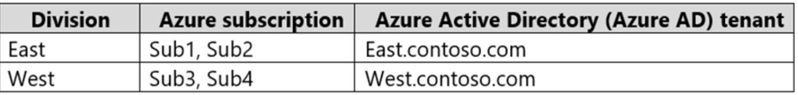
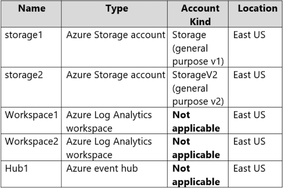
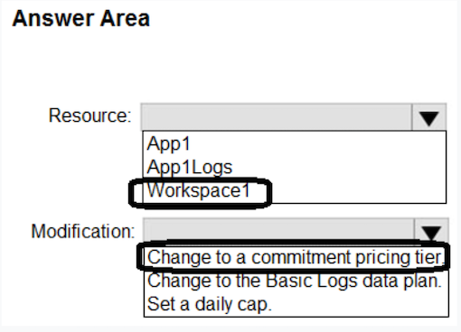

## Topic 1

#### Question 12

Your on-premises network contains a server named Server1 that runs an ASP .NET application named App1.

**You have a hybrid deployment of Azure Active Directory (Azure AD)**.

You need to recommend a solution to ensure that users sign in by **using their Azure AD account and Azure Multi-Factor Authentication (MFA) when they connect to App1 from the internet**.

**Which three features should you recommend be deployed and configured in sequence**? To answer, move the appropriate features from the list of features to the answer area and arrange them in the correct order.

**Step 1: Azure AD Application Proxy**

Start by enabling communication to Azure data centers to prepare your environment for Azure AD Application Proxy.

**Step 2: an Azure AD enterprise application**

Add an on-premises app to Azure AD.

Now that you've prepared your environment and installed a connector, you're ready to add on-premises applications to Azure AD.
1. Sign in as an administrator in the Azure portal.
2. In the left navigation panel, select Azure Active Directory.
3. Select Enterprise applications, and then select New application.

**Application Proxy is a feature of Enterprise Applications, so yeah, you would need to register an Enterprise Application before enabling an Application Proxy for it.**

1. Enterprise Application
2. Application Proxy
3. Conditional Access

#### Question 19

Your company has the divisions shown in the following table.

You plan to deploy a custom application to each subscription. The application will contain the following:

* ✑ A resource group
* ✑ An Azure web app
* ✑ Custom role assignments
* ✑ An Azure Cosmos DB account

You need to use Azure Blueprints to deploy the application to each subscription.

What is the minimum number of objects required to deploy the application? To answer, select the appropriate options in the answer area.

* **2 Mgmt Group** 
* **2 BluePrint Def** 
* **4 - Assignment for subcription**

Management groups can't span AAD tenant, so you need 2 management groups. 

**Blueprints definition can be saved within management group which, in turn, means you need 2 blueprint definitions.** 

**Blueprint assignments are at subscription level, therefore you need 4.**#### Question 20

You need to design an Azure policy that will implement the following functionality:

* For new resources, **assign tags and values that match the tags and values** of the resource group to which the resources are deployed.
* For existing resources, **identify whether the tags and values match the tags and values of the resource group that contains the resources**.
* For any non-compliant resources, trigger auto-generated remediation tasks to create missing tags and values.

**The solution must use the principle of least privilege.**·

What should you include in the design? To answer, select the appropriate options in the answer area.

* **Azure Policy effect to use:  Modify**
* **Azure Active Directory (Azure AD) object and role-based access control (RBAC) role to use for the remediation tasks: A managed identity with the Contributor role**

#### Question 21

You have an Azure subscription that contains the resources shown in the following table.

You create an Azure SQL database named DB1 that is hosted in the East US Azure region.

**To DB1, you add a diagnostic setting named Settings1. Settings1 archive SQLInsights to storage1 and sends SQLInsights to Workspace1**.

For each of the following statements, select Yes if the statement is true. Otherwise, select No

Note: This diagnostic telemetry can be streamed to one of the following Azure resources for analysis.

* **Log Analytics workspace**
* **Azure Event Hubs**
* **Azure Storage**

#### Question 23

You plan to deploy an app that will use an Azure Storage account.

You need to deploy the storage account. The storage account must meet the following requirements:

* **Store the data for multiple users**.
* Encrypt each user's data by using a separate key.
* **Encrypt all the data in the storage account by using customer-managed keys**.

What should you deploy?

* A. files in a premium file share storage account
* **B. blobs in a general purpose v2 storage account** ✅
* C. blobs in an Azure Data Lake Storage Gen2 account
* D. files in a general purpose v2 storage account

#### Question 25

You plan to deploy an application named **App1 that will run on five Azure virtual machines**. Additional virtual machines will be deployed later to run App1.

You need to recommend a solution to meet the following requirements for the virtual machines that will run App1:

* ✑ Ensure that the virtual machines **can authenticate to Azure Active Directory (Azure AD) to gain access to an Azure key vault, Azure Logic Apps instances, and an Azure SQL database**.
* ✑ **Avoid assigning new roles and permissions for Azure services when you deploy additional virtual machines**.
* ✑ Avoid storing secrets and certificates on the virtual machines.
* ✑ Minimize administrative effort for managing identities.

Which type of identity should you include in the recommendation?

* A. a system-assigned managed identity
* B. a service principal that is configured to use a certificate
* C. a service principal that is configured to use a client secret
* **D. a user-assigned managed identity**  ✅

A user-assigned managed identity:

* Can be shared.
* **The same user-assigned managed identity can be associated with more than one Azure resource**.

#### Question 28

You have an application that is used by 6,000 users to validate their vacation requests. **The application manages its own credential store.
Users must enter a username and password to access the application. The application does NOT support identity providers**.

**You plan to upgrade the application to use single sign-on (SSO) authentication by using an Azure Active Directory (Azure AD) application registration.**

Which SSO method should you use?

- [ ] A. header-based
- [ ] B. SAML
- [x] C. password-based  ✅
- [ ] D. OpenID Connect

**Password** - On-premises applications can use a password-based method for SSO. This choice works when applications are configured for
Application Proxy.

**With password-based SSO, users sign in to the application with a username and password the first time they access it.**

#### Question 29

**1. Answer is Azure Bastion**.   ✅

**2. Second is correct**   

**A conditional Access policy that has Cloud Apps assignment set to Azure Windows VM Sign-In** ✅

#### Question 31

D. **In the Azure AD tenant of Contoso, create guest accounts for the Fabnkam developers**.   ✅

#### Question 33

Your company has 20 web APIs that were developed in-house.

The company is developing 10 web apps that will use the web APIs. **The web apps and the APIs are registered in the companys Azure Active
Directory (Azure AD) tenant. The web APIs are published by using Azure API Management.**

You need to recommend a solution to block unauthorized requests originating from the web apps from reaching the web APIs. The solution must
meet the following requirements:

✑ Use Azure AD-generated claims.

Minimize configuration and management effort.

What should you include in the recommendation? To answer, select the appropriate options in the answer area.

**Box 1: Azure AD** -

**Grant permissions in Azure AD.**

**Box 2: Azure API Management**-

**Box 2: Azure API Management** - 

Configure a JWT validation policy to pre-authorize requests. Pre-authorize requests in API Management with the Validate JWT policy, by validating the access tokens of each incoming request. If a request does not have a valid token, API Management blocks it

#### Question 36 - 2 

You are developing an app that will read activity logs for an Azure subscription by using Azure Functions. 

You need to recommend an authentication solution for Azure Functions. 

The solution must minimize administrative effort. 

What should you include in the recommendation?

* A. an enterprise application in Azure AD 
* **B. system-assigned managed identities** ✅
* C. shared access signatures (SAS) 
* D. application registration in Azure AD

**System-assigned managed identities provide a way for Azure Functions to authenticate to other Azure services, such as Activity Logs, without the need for storing or managing secrets.**

Azure Functions provide a Managed Identity and since the question is about Azure Functions not about the App being developed, the correct answer is B.

#### Question 36

You have an Azure subscription that contains an Azure key vault named KV1 and a virtual machine named VM1. VM1 runs Windows Server 2022:
Azure Edition.

You plan to deploy an ASP.Net Core-based application named App1 to VM1.

You need to configure App1 to use a system-assigned managed identity to retrieve secrets from KV1. The solution must minimize development
effort.

What should you do? To answer, select the appropriate options in the answer area.

1. **Configure App1 to use OAuth 2.0:**

**Configure App1 to use Auth 2.0: Client credentials grant flows**  ✅

2. **Configure App1 to use a REST API call to retrieve an authentication token from the**

**Configure App1 to use a REST API call to retrieve an authentication token from the: Azure Instance Metadata (IMDS) endpoint**  ✅

#### Question 37

Your company has the divisions shown in the following table.

**Sub1 contains an Azure App Service web app named App1. App1 uses Azure AD for single-tenant user authentication. Users from contoso.com
can authenticate to App1**.

You need to recommend a solution to enable users in the fabrikam.com tenant to authenticate to App1.

What should you recommend?

- [ ] A. Configure Azure AD join.
- [ ] B. Configure Azure AD Identity Protection.
- [ ] C. Configure a Conditional Access policy.
- [x] D. Configure Supported account types in the application registration and update the sign-in endpoint.  ✅

It can be **Use Azure AD entitlement management to govern external users** ✅ OR **Configure Supported account types in the application registration and update the sign-in endpoint** ✅

#### Question 38

You have an Azure subscription named Sub1 that is linked to an Azure AD tenant named contoso.com.

You plan to implement two ASP .NET Core apps named App1 and App2 that will be deployed to 100 virtual machines in Sub1. Users will sign in to
App1 and App2 by using their contoso.com credentials.

- App1 requires read permissions to access the calendar of the signed-in user. 

- App2 requires write permissions to access the calendar of the signed-in user.

You need to recommend an authentication and authorization solution for the apps. The solution must meet the following requirements:

- Use the principle of least privilege.
- Minimize administrative effort.

What should you include in the recommendation? To answer, select the appropriate options in the answer area.

* **Authentication: Application registration in Azure AD**

* **Authorization: Delegated permissions**

#### Question 39

Y N Y

- Since Group 1 is assigned VM contributor to MG1, it will be able to create a new VM in RG1. 
- User 2 is not able to grant permission to Group 2 because it is just a member with contributor role. 
- **Since Group 3 has Contributor role for the Tenant Root Group, User3 can create storage account in RG2**

#### Question 42

You are designing an app that will be hosted on Azure virtual machines that run Ubuntu. **The app will use a third-party email service to send email messages to users. The third-party email service requires that the app authenticate by using an API key.**

You need to recommend an Azure Key Vault solution for storing and accessing the API key. The solution must minimize administrative effort.

What should you recommend using to store and access the key? To answer, select the appropriate options in the answer area.

* 1. Storage: c. Secret.
	* API keys are typically stored as secrets in Azure Key Vault. The key vault can store and manage secrets like API keys, passwords, or database connection strings.
* 2. Access: b. A managed service identity (MSI).

**A managed service identity (MSI) is used to give your VM access to the key vault.** 

**The advantage of using MSI is that you do not have to manage credentials yourself.**

#### Question 43

You have two app registrations named App1 and App2 in Azure AD. App1 supports role-based access control (RBAC) and includes a role named Writer.

**You need to ensure that when App2 authenticates to access App1, the tokens issued by Azure AD include the Writer role claim.**

Which blade should you use to modify each app registration? 

1. App1: B. **App roles**: This app is already configured with a custom role, which is defined under the "App Roles" section.
2. App2: C. **API Permissions**

To allow App 2 to authenticate to App1, it is necessary to assign the appropriate permissions. These can be configured under "API Permissions"

#### Question 43

You have two app registrations named App1 and App2 in Azure AD. App1 supports role-based access control (RBAC) and includes a role named Writer.

**You need to ensure that when App2 authenticates to access App1, the tokens issued by Azure AD include the Writer role claim.**

Which blade should you use to modify each app registration? 

1. App1: B. **App roles**: This app is already configured with a custom role, which is defined under the "App Roles" section.
2. App2: C. **API Permissions**

To allow App 2 to authenticate to App1, it is necessary to assign the appropriate permissions. These can be configured under "API Permissions"

#### Question 44

You have an Azure subscription.

You plan to deploy a monitoring solution that will include the following:

- Azure Monitor Network Insights
- Application Insights
- Microsoft Sentinel
- VM insights

The monitoring solution will be managed by a single team.

What is the **minimum number of Azure Monitor workspaces** required?

- [X] A. **1**  ✅

#### Question 45

**Case Study**

**Minimum number of Azure AD tenants:**

1. **1 AAD now Microsoft Entra ID**

**Minimum number of conditional access policies to create:**

2. **2 Conditional access policies** : 

	- Conditional Access Policy for Admin Access to the Azure Portal 
	- Conditional Access Policy for Testing WebApp1 Updates

#### Question 46

**Azure AD Identity Governance.** ✅

<mark>This is an updated version, in the old questions the right answers was "Access Review” , but this options is not available here</mark>

#### Question 47

You have an Azure subscription that contains 50 Azure SQL databases.

**You create an Azure Resource Manager (ARM) template named Template1 that enables Transparent Data Encryption (TDE).**

You need to create an Azure Policy definition named Policy1 that will use Template1 to enable TDE for any noncompliant Azure SQL databases.

**How should you configure Policy1?** To answer, select the appropriate options in the answer area.

NOTE: Each correct selection is worth one point.

* **Set available effects to:**

	* **Box 1: DeployIfNotExists**

* **Include in the definition:**

	* **Box 2: The role-based access control (RABC) roles required to perform the remediation task**

#### Question 49

You have an Azure subscription that contains the resources shown in the following table:

Log files from App1 are registered to App1Logs. An average of 120 GB of log data is ingested per day.

You configure an Azure Monitor alert that will be triggered if the App1 logs contain error messages.

You need to minimize the Log Analytics costs associated with App1. The solution must meet the following requirements:

- **Ensure that all the log files from App1 are ingested to App1Logs.**
- **Minimize the impact on the Azure Monitor alert**.

Which resource should you modify, and which modification should you perform? To answer, select the appropriate options in the answer area.

* Resouce: **workspace1**
* Modification: **Change to a commitment pricing tier.**