# 1 Azure DevOps Engineer Expert Certification (AZ-400) 

### Exam Guide - Response Types


There are ~50-55 Questions

You can afford to get roughly 12-14 questions wrong


**Format of Questions**

- Multiple Choice
- Multiple Answer
- Drag and Drop
- Yes and No
- 1 Lab with about 8 questions

## 1 Introduction to DevOps


DevOps is an approach that brings together software development (Dev) and IT operations (Ops) with the goal to enhance the speed and reliability of software delivery. 

**It focuses on continuous improvement, automation, and collaboration between teams that were once siloed, aiming to shorten the time from development to operation.**


The process includes frequent code versions, which allows for incremental improvements to applications and systems.


The ultimate goal of DevOps is to create a culture and environment where **building, testing, and releasing software can happen rapidly, frequently, and more reliably.**

#### Why DevOps?


DevOps eliminates the inefficiencies, miscommunications, and delays that arise from the traditional gap between development and operations teams.

It creates a collaborative culture that accelerates and improves software delivery.

**Key Challenges Addressed by DevOps:**


- Miscommunication and Collaboration Gaps: Enhances communication and collaboration, reducing misunderstandings and accelerating the release process.
- **Conflicting Goals**: Aligns the goals of Dev and Ops teams towards quick, reliable, and high-quality software delivery.
- **Manual Processes and Bottlenecks**: Advocates for automation to decrease manual effort, errors, and delays.
- **Streamlined Processes**: Automation leads to fewer errors, shorter deployment times, and improved software quality.

The Role of a DevOps Engineer:

**A DevOps engineer facilitates this collaboration and automation,** focusing on:


**Continuous Integration and Continuous Delivery (CI/CD)**: Establishing pipelines that automate code integration, testing, and deployment, ensuring rapid, reliable software releases.


**Infrastructure as Code (laC):** Managing and provisioning infrastructure through code to increase efficiency and consistency.

**Monitoring and Operations**: Implementing monitoring solutions to track application and infrastructure performance, **ensuring high availability and reliability.**

**Transition to Cloud Infrastructure**: Many organizations are transitioning to cloud infrastructure (AWS, Google Cloud, Azure) to cut costs and improve manageability, offering intuitive tools for network and security settings but necessitating knowledge of platform-specific features.

#### Tools and Technologies:


**Version Control (e.g., Git):** Essential for managing code changes and facilitating team collaboration.

**Use Agile and Lean Techniques:** For planning, sprint isolation, and capacity management.

**Containerization (e.g., Docker):** Enables scalable deployments with lightweight containers that are faster and simpler to configure than traditional virtual machines.

**Orchestration (e.g., Kubernetes):** Efficiently manages containerized applications at scale

CI/CD Tools (e.g., Jenkins, GitLab CI): Automate the software delivery process, from code integration to deployment.

**laC Tools (e.g., Terraform, Ansible):** Automate the provisioning and management of infrastructure.

**Monitoring and Logging (e.g., Prometheus):** Provides insights into application performance and operational health.

**Public and Hybrid Clouds streamline operations**, offering scalable infrastructure with laas for seamless app migration and PaaS to enhance productivity through sophisticated tools.

Examples of DevOps technologies across different DevOps stages include:

**Planning:**

Azure Boards, GitHub, Atlassian Jira

**Continuous Integration:** **Azure Repos, GitHub Repos, SonarQube**, Selenium, OWASP ZA, NuGet,

**Continuous Delivery: Azure Pipelines, GitHub Actions, Bicep, Terraform**, Jenkins, RedHat Ansible, Chef, Puppet

**Operations: Azure Monitor, Azure Automation,** Microsoft Power BI

**Collaboration and feedback: Azure DevOps Wikis, GitHub Wikis**, GitHub Discussions, Microsoft Teams,

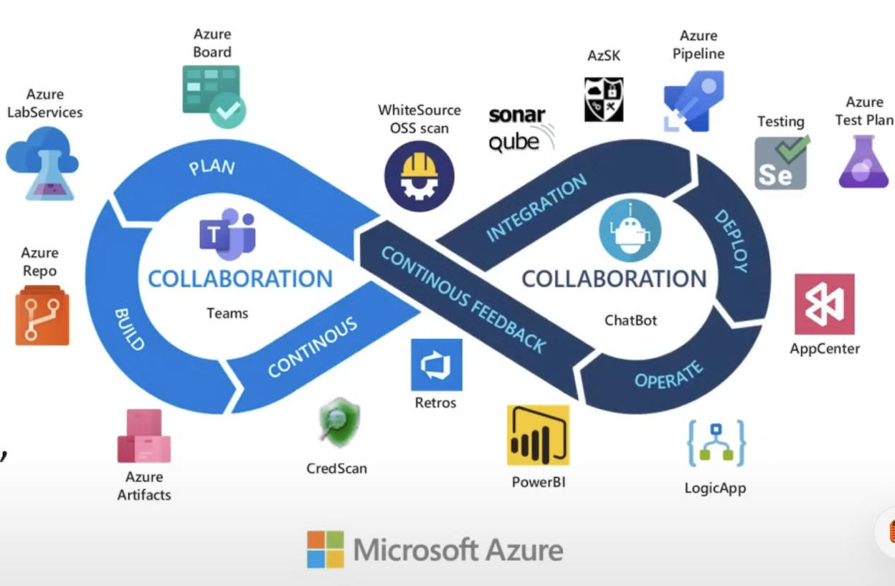

### DevOps vs Traditional IT

#### **Time**

* **DevOps teams spend one-third more time** **improving systems** to avoid tech issues than **traditional IT.**
* Less time is needed for administrative tasks because **DevOps uses more automated tools and helpful scripts**.
* This saved time allows for a **33% increase** in enhancing their tech infrastructure.
* They also have **15%** more time for learning and training, boosting their

#### Speed and data

- DevOps groups are typically **small and adaptable,** driven by creativity and speed.
- One of the main goal of DevOps is agility, aiming for swift completion of tasks.
- **Traditional IT** operations typically have less feedback data, focusing only on the immediate task.
- IT operations often have to handle unexpected downstream issues they didn't see coming.
- Cloud DevOps is more effective in **delivering business applications** due to its quick pace.
- Traditional IT must strive to keep up with the rapid changes and demands of the business world.

#### Recuperation and crunch time

DevOps teams focus on **readiness for failures** and have strategies like ongoing testing and real-time alerts.

These strategies mean they can **address issues quickly and keep systems running smoothly**.

Traditional IT may need more time to recover from setbacks because they might not have these proactive measures in place.

Fast recovery in DevOps is often helped using automated systems and flexible infrastructure setups.

**Software distribution**

- DevOps teams take roughly **37 minutes to deploy software**.
- Traditional IT operations typically need about **85 minutes for the same task.**
- This indicates DevOps teams can release software more than **twice** as quickly as traditional IT teams.

| Aspect | DevOps Advantage |
|:----|:---:|
| Product Reliability | Reduced likelihood of failure| 
| Adaptability | Enhanced flexibility and support |
| Market Responsiveness | Decreased time to market |
| Team Productivity | Greater efficiency in teams |
| Vision Clarity | More defined product vision within teams |


## 2 Agile

**Agile** is a philosophy in software development that emphasizes **incremental progress, collaboration, and flexibility**. It revolves around the idea of breaking down large projects into smaller, manageable sections called **iterations or sprints.**

Teams work in these short bursts to produce tangible results regularly, allowing for frequent reassessment and adjustment.

This approach enables a quick response to change and promotes continuous improvement, both in the product and the process used to create it.

The term "**agile methodology"** refers to the specific frameworks and practices that embody the Agile philosophy, **such as Scrum, and Kanban**.

These methodologies provide the structure and tools for teams to execute Agile principles effectively.

They include techniques for planning and tracking progress, **such as stand-up meetings, sprints, and visual boards, all designed to enhance team coordination and project transparency.**

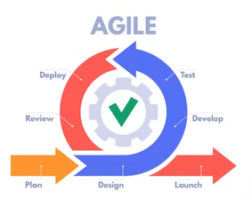

### Agile Development

**Diligent Backlog Refinement**: This means organizing the list of upcoming work, **prioritizing the most important tasks, and clarifying them**. 

Product owners are key in preparing for future sprints by providing **clear goals.**

**Integrating Early and Often:** By using Continuous Integration/Continuous Delivery (Cl/CD), teams automate their workflows, which speeds up coding, testing, and deployment. **This helps catch and fix problems early.**

**Minimizing Technical Debt**: Just like unwanted financial debt, technical debt happens when taking shortcuts, which may later require code fixes.

It's important to find a good mix of adding **new features and fixing these issues, needing careful planning and fixing these issues, needing careful planning and discipline.**


**Agile Development encompasses various methods** that follow the **Agile Manifesto's core ideas.**

It's about teams working together, managing themselves, and using practices that best suit their project's needs to gradually improve their software.

In agile development, teams aim to produce fully working and high-quality parts of the software at the end of every sprint.

This means they **<mark>must write code, test it, and make sure everything is of good quality</mark>** within each sprint's short timeframe.

The key success factors for Agile development teams:

- **Diligent backlog refinement**
- **Integrating early and often**
- **Minimizing technical debt**

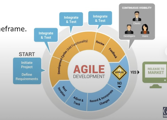

### Scrum

Scrum is an Agile framework designed for managing complex projects by breaking them down into **small, manageable tasks** completed in short phases called **sprints**.

**Key roles in Scrum:**

#### **Key roles in Scrum:**

- **Product Owner**: Guides what and why the team builds, prioritizes the **work backlog**.
- **Scrum Master**: Facilitates Scrum processes, supports team improvement, and removes obstacles.
- **Development Team**: Engineers the product, ensuring its quality.


In Scrum, a team self-manages its sprint tasks with daily stand-up meetings to ensure progress and address impediments. They track work using a **task board and a sprint burndown chart**, and at the sprint's end, they showcase their increment in a **review and identify improvements in a retrospective.**

Scrum's short, repeatable cycles facilitate continuous learning and adaptation, making it a practical framework for teams adopting Agile principles.

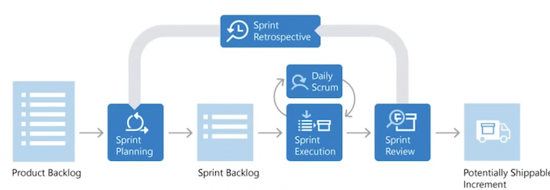

### Kanban

Kanban is an Agile methodology focused on **visualizing work, limiting work in progress, and maximizing efficiency (or flow)**.

**Kanban boards** are used to display work at **various stages of → the process using cards to represents tasks and their stages**, highlighting work in progress and facilitating team flexibility.


**Cumulative Flow Diagrams (CFDs)** visually **track a project's workflow over time**, showing task distribution across stages. **The horizontal axis represents time, and the vertical axis represents task volume, with each color marking a different work stage.**

**CFDs highlight trends, progress, and bottlenecks.**

Parallel colored areas indicate balanced workflow; bulges suggest **bottlenecks** needing attention for smooth project continuation.

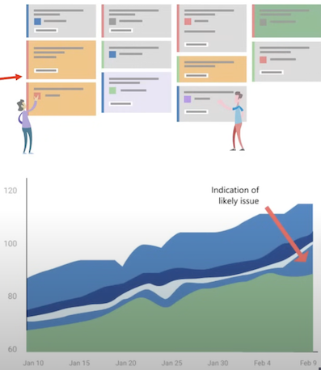

### Scrum vs Kanban

**Scrum and Kanban in Agile development**

While broadly fitting under the umbrella of Agile development, Scrum and Kanban are quite different.

- Scrum focuses on fixed **length sprints, while Kanban is a continuous flow model**.
- Scrum has **defined roles, while Kanban doesn't define any team roles**.
- Scrum uses **velocity** as a key metric, while Kanban uses **cycle time.**

Teams often blend Scrum and Kanban features to optimize their workflow.

They continuously refine their approach to find the best fit, focusing on simplicity and regular value delivery to users.


### Flow Metrics

#### Velocity

**Velocity** in Azure DevOps is a **metric that tracks the amount of work a team completes during a sprint, helping teams estimate how much work they** can handle in future sprints.

It's represented in a chart that visualizes work items completed over several sprints, offering insights into the team's work patterns, efficiency, and consistency.

By analyzing velocity, teams can adjust their planning for **better predictability and productivity.**

Consistent velocity metrics can help in identifying the impact of **process changes and guiding strategic decisions to enhance overall team performance**.

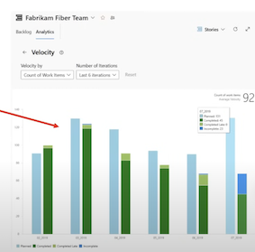

#### Sprint burn down

**Sprint burndown chart**

The sprint burndown is a graph that plots the **<mark>daily total of remaining work, typically shown in hours</mark>** 

The burndown chart provides a visual way of **showing whether the team is on track to complete all the work by the end of the sprint.**

It also helps in identifying any **bottlenecks or issues in the workflow that may need attention before the sprint’s end.**

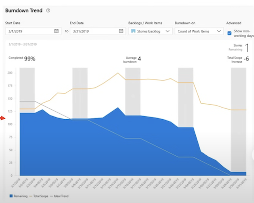

#### Lead time and Cycle time

The Lead Time and Cycle Time widgets indicate how long it takes for work to flow through your development pipeline.

- **Lead time** measures the **total time elapsed from the creation of work items to their completion**.
- **Cycle time** measures the **time it takes for your team to complete work items once they begin actively working on**

---

- The following diagram illustrates how lead time differs from cycle time.
- **Lead time** is calculated from work item creation to entering a completed state.
- **Cycle time** is calculated from first entering an In Progress or Resolved state category to entering a Completed state category.


> These measures help teams plan, spot variations in efficiency, and identify potential process issues.
The lower the lead and cycle times, the faster the throughput your team has.

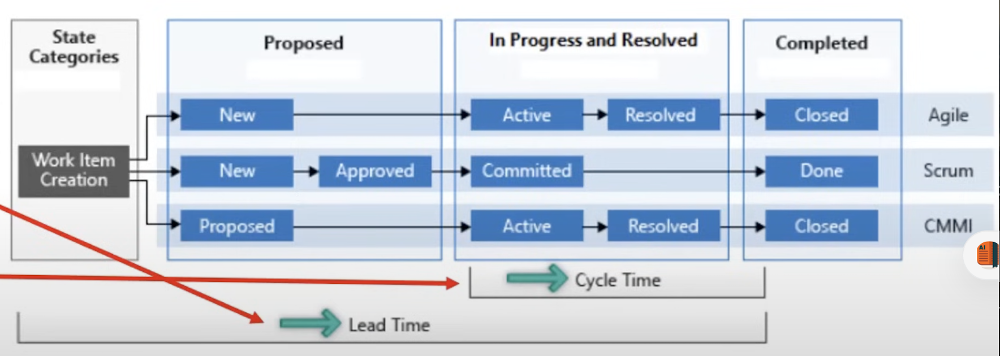


### Azure Boards

**Azure Boards** is a **web-based service designed for planning, tracking, and discussing work** throughout the development process, supporting agile methodologies for a customizable and efficient workflow.

#### **Key Hubs in Azure Boards**

Azure Boards includes several key hubs, each serving distinct project management needs:

Work Items Hub: Manage work items based on specific criteria.

* **Boards Hub**: Visualize workflow using cards, ideal for Kanban.
* **Backlogs Hub**: Plan and organize work items, including backlogs for project and portfolio management.
* **Sprints Hub**: Handle sprint-specific work items, incorporating backlogs for project and portfolio management.
* Queries Hub: Generate **custom** work item lists and perform bulk
* Delivery Plans Hub: Track cross-team deliverables and dependencies in a calendar view.
* Analytics Views Hub: Create **Power BI** reports for detailed project analysis.

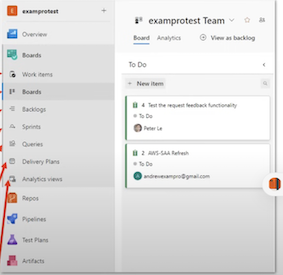

#### **Key benefits of Azure Boards**

- **Scalable Simplicity**: Easy to start with predefined work item types, scalable for growing teams.
- **Visual Tools**: Visualize progress with **Kanban boards, scrum boards**, and delivery plans.
- **Customization**: Configure **boards, taskboards, and plans, including custom fields**.
- **Built-in Communication**: Capture **real-time** communication and decisions within work item forms.
- **Cloud Storage**: Support for rich text, inline images, attachments, and comprehensive change history.
- **Efficient Search and Notifications**: Tools for quick work item searching and customizable **alerts**.
- **Dashboards and Analytics**: **Access to dashboards and Analytics service for reporting.**


**Integration and Support**

- **GitHub and Office Integration:** Connects with GitHub repositories and supports import/export with Microsoft Office.
- **Autonomous Teams Support**: Tailors to independent teams, **integrates with Microsoft Teams and Slack**, and offers a variety of marketplace extensions.

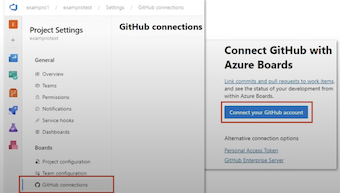

### Traceability

**Traceability allows tracking connections and dependencies** among different parts of a software system. It helps teams grasp the effects of **changes, handle risks, and comply with regulations.**


**Defining and managing requirements**

- A key part of traceability is documenting and overseeing requirements effectively.
- Azure DevOps has tools like Azure Boards for handling requirements and tracking their progress, linking requirements to related items like tasks or bugs.
- This tracking clarifies each requirement's progress and its influence on the project.

**Version control and change management**

For traceability, a solid version control system to monitor modifications to code and files is essential. Azure DevOps's Git repositories let developers manage their work efficiently.

By using branches for features or releases, you can track changes and understand their role in the project's bigger picture.

#### Building and release management

Traceability must include build and release processes. **Azure Pipelines facilitates building, testing, and deploying apps**, linking build artifacts and code changes to specific tasks, showing what changes made it into each


#### Test management and quality assurance


For software quality, traceability is crucial. Tools like **Azure Test Plans support detailed test management.** Linking test cases to requirements or user stories shows how well the testing process covers the initial needs, ensuring thorough validation.

#### Auditing and compliance

- Traceability also supports meeting standards and regulations.
- Azure DevOps's auditing features track and log changes, providing details on who changed what and when, supporting accountability and regulatory compliance.

### Custom Azure Boards dashboards

#### **Centralize with Custom Dashboards**

**Custom dashboards** in **Azure Boards** are crucial for presenting a comprehensive **overview of your project's status and key metrics**.

> By tailoring these dashboards to highlight crucial data, your team can streamline workflows and improve decision-making.

#### **Customize with Widgets**

**Widgets** are the heart of Azure Boards dashboards, presenting diverse data from progress **charts to work item queries**. Select and tailor widgets that best display the team's critical information, ensuring essential insights are readily accessible.

#### **Monitor Backlogs with Query Widgets**

Incorporate **query widgets to filter** and **display work items based on defined criteria, like outstanding tasks per team member**.

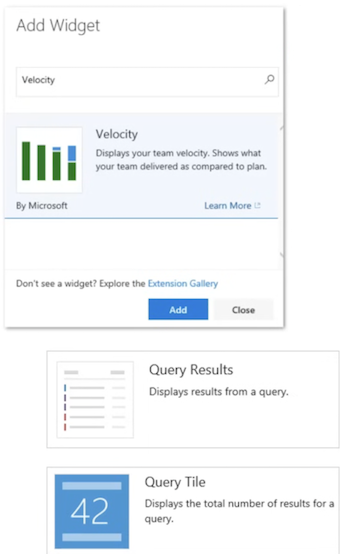

**Monitor Backlogs with Query Widgets**

**Incorporate query widgets to filter and display work items based on defined criteria, like outstanding tasks per team member.**

This enables efficient task management and helps in setting clear priorities.


### Custom Azure Boards dashboards

#### Track Progress with Burndown Charts

Use **burndown chart** widgets to graphically **track project** progress, helping to identify any delays. Regular review of these charts keeps the team's progress aligned with project goals.

#### Visualize Performance with Charts

Enrich your dashboard with charts that **convey performance metrics**, such as **bug trends or team velocity**, providing a clear picture of the team's dynamics and highlighting areas for improvement.

#### Enhance Team Engagement

**Share dashboards with your team and stakeholders** to offer a live view of the project's status, fostering a culture of transparency and collective accountability.


### Custom Azure Boards dashboards

#### Track Progress with Burndown Charts

**Use burndown chart widgets to graphically track project progress,** helping to identify any delays. Regular review of these charts keeps the team's progress aligned with project goals.

#### Visualize Performance with Charts

Enrich your dashboard with charts that **convey performance metrics, such as bug trends or team velocity**, providing a clear picture of the team's dynamics and highlighting areas for improvement.

#### Enhance Team Engagement

Share dashboards with your team and stakeholders to offer a live view of the project's status, fostering a culture of transparency and collective accountability.

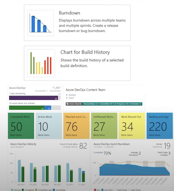

### Wikis for Documentation

**Wiki** offers a collaborative space for team members to compile and share **crucial details about a DevOps project.**

**Start with an Overview Page:** Begin by setting up an overview page. This should introduce the project, its goals, and the team working on it.

Mention the **technologies, tools, and methods your project employs, keeping it broad but informative**.

**Detail Project Requirements: Dedicate pages to outline the project's**

Break down what the project **needs to do (functional requirements) and how it should perform (non-functional requirements)**, using clear and achievable language.

Detail Project Requirements: Dedicate pages to outline the project's requirements.


Break down what the project needs to do (functional requirements) and how it should perform (non-functional requirements), using clear and achievable

**Add user stories**, what needs to be true for the project to be considered complete (**acceptance criteria**), and any other elements that rely on each **other (dependencies).**

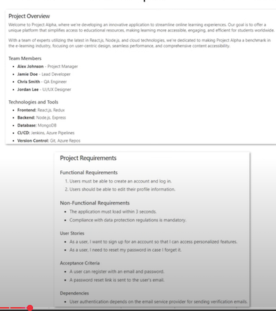

**Architecture and Design Documentation:** Use the wiki to detail the project's structure and design.

Make a separate page for each part, whether **it's a component, a larger section, or a service.**

To help visualize how these parts interact, include diagrams like **UML (Unified Modeling Language) or system architecture sketches**.

Encourage Team Input: Get your team involved in the documentation process.

**Allowing everyone to edit and update wiki pages not only promotes teamwork but also helps keep the information current.**

Make sure to use the wiki's version tracking to monitor changes and roll back if needed.

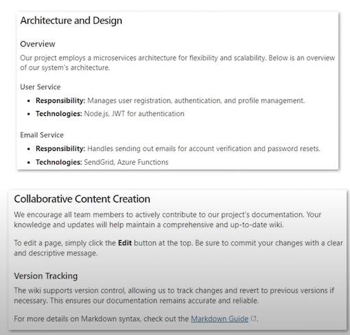

### Process Diagrams for Documentation

**Process diagrams** are **visual guides that show the steps in a process**, making it easier to see how everything connects, especially in DevOps

**Pinpoint Essential Processes:** First, identify the main processes in your DevOps project, such as **managing source code, integrating changes continuously, testing automatically, deploying, and monitoring**.

Break down these processes into smaller parts.

**Make Flowcharts or BPMN Diagrams:**

Use software like Microsoft Visio, draw.io, or lucidchart, to create diagrams that map out the process.

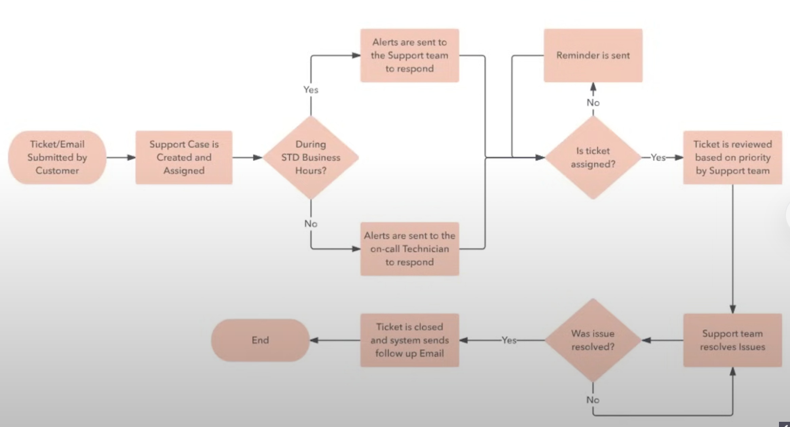

**Detail What Goes In and Comes Out: For every step in your process, note down what you need to start (inputs) and what you expect to get out of it (outputs).**

This might be **code, test results, deployment packages, or anything else relevant**. It's important to show how each step is linked to the next.


**Clarify Who Does What:** Make sure your diagrams indicate **who is responsible for each step**.

This removes confusion and makes sure everyone knows their responsibilities.

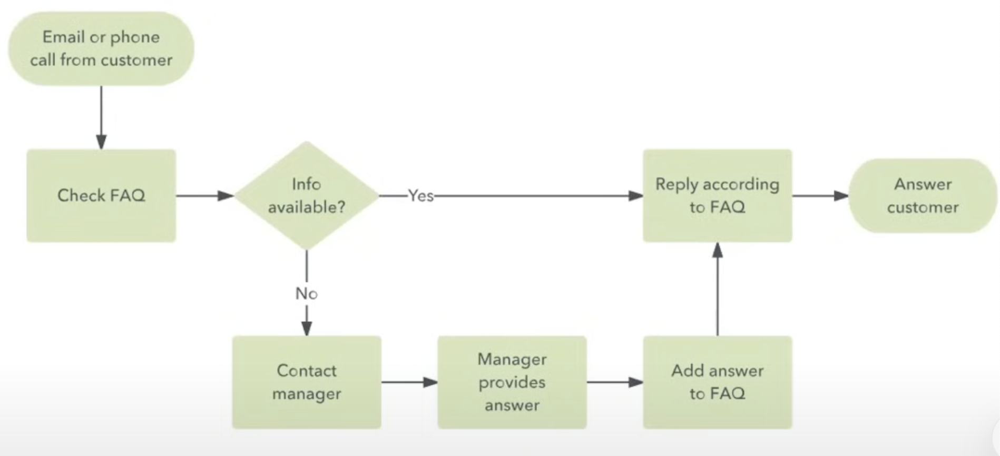

### Configure release documentation

**Release documentation** is a cornerstone for the successful deployment of software releases within Azure DevOps, **focusing on the non-code aspects that define the scope, quality, and functionality of the release.**

**Key Elements of Release Documentation**

**1 Release Notes:** These should highlight what's **new**, what **issues have been resolved**, and **any enhancements made**, as well as outline any **modifications to settings and their effects on existing features.**

**2 Installation Guides:** Provide clear, detailed instructions for the **setup process**, including a list of required **software and system prerequisites, and post-installation**

**3 Configuration Changes**: Document updates to **configuration settings**, clarifying any default settings and essential changes.

**4 Change Log**: Keep an accurate record of commits or work items in the release, using a consistent tracking method.

**5 Rollback Plan:** Have a clear, predefined plan for reverting to an earlier software version if necessary.

#### **Creating Release Documentation in Azure DevOps**

**Azure Repos**

* Store your **markdown or text files alongside your code.**
* **Version control** your documentation for consistency and traceability.

**Azure Pipelines**

* Automate the generation of **changelogs** and other documentation during the build and release processes.

**Artifacts**

Attach generated documentation to specific builds or releases as downloadable artifacts.

**Wiki**

```
# Release Notes - Version 2.1.0

## New Features:
- Feature A: Description and how to enable it.
- Feature B: Steps for configuration.

## Enhancements:
- Improved performance of X functionality.
- Enhanced security protocols for Y process.

## Configuration Changes:
- Updated default settings for Z.
- New environmental variables to set for feature A.

## Known Issues:
- Issue 1: Temporary workaround.
- Issue 2: Scheduled for fix in the next release.

## Rollback Plan:
- Steps to revert to version 2.0.3 in case of issues.

For installation guidance, please refer to the [Installation Guide](link-to-guide).
```

### API documentation

**Steps to Generate API Documentation:**

**Generate Documentation:**

* Utilize **Visual Studio** to **generate API documentation**. Access this feature via the **Build** menu.
* Use tools like **Swagger, Azure API Management, or OpenAPI** for automatic documentation generation from your codebase.

**Documenting Endpoints:**

* Clearly define and describe each **API endpoint**, detailing the purpose and functionality.
* Include information on request and response formats, as well as any **authentication** requirements.

**Selecting Formats and Styles:**

Decide on your **output** format and style, ensuring it's readable and accessible for your target

**Integration and Automation:**

Integrate documentation generation into your **continuous integration and deployment pipelines within Azure DevOps**.

```
API Documentation - Version 1.2.3

### Endpoints:

- POST /api/login
- Description: Authenticates users and returns an access token.

Request Body:
 
 ...
 "username": "user@example.com",
 "password": "password123"
 ...
 
- Response:
 
	Status: 200 0K
	{
	"token" : "eyJhbGciOiJIUzIlNiIsInR5cCI6IkpXVCJ9..."
	}


- GET /api/users
- Description: Retrieves a list of users.
- Response:

	Status: 200 0K
	[
     "id":
		{"id": "1", "name": "Jane Doe"},
		{"id": "2", "name": "John Smith"},
    ]
```


#### **API documentation**

- **Consistency**: Use a consistent format for all **API endpoints** to make the documentation easy to follow.
- **Clarity**: Ensure that descriptions are clear and concise, avoiding ambiguity.
- **Version Control**: Manage your API documentation within Azure Repos for versioning and historical tracking.
- **Regular Updates**: Keep the documentation current with every release, deprecating outdated information promptly.
- **Feedback Mechanisms**: Include a process for developers and users to provide **feedback** on the documentation for continuous improvement.

> By focusing on these elements, your API documentation will be an invaluable resource for your team and stakeholders, supporting the effective use and integration of your software's API.

#### Automate Git History documentation

With the rise of DevOps and Git's stronghold in version control, the manual slog of updating docs has given way to automation. Now, developers can create dynamic documentation straight from their Git

**Prerequisites:**

- A Git repository, hosted on platforms like GitHub or Azure Repos.
- An Azure DevOps account connected to this repository.

**Automating Documentation with Azure Pipelines:**


**Step 1: Set Up Your Pipeline**

- In Azure DevOps, select "**Pipelines**" from the project menu and click "New Pipeline".
- Pick your code repository's platform and the repository itself.
- Choose the **main branch** as the source for your docs.
- Tailor your pipeline settings— pick the right agent and decide when this pipeline should run.

**Step 2: Build the Code**

- Insert a **build task** into your pipeline to compile your code. E.g., NET Core, Node.js, Python, etc.
- Fine-tune this task to match your project —this might mean different commands or scripts, depending on what you're building.
- Confirm a successful build before moving on.

**Step 3: Generate the Documentation**

- Post-build, select a tool like **DocFX, tailored for .NET projects**, to parse your Git history into documentation.
- Add a new task in your pipeline for DocFX
- Set this up with the correct paths and configurations, and let it craft your docs.

```
- task: DotNetCoreCLI@2 
  inputs:
 	command: 'build' 
    projects: '**/*‚csproj' 
    arguments: '--configuration Release'
```


**Step 4: Publish Your Work**

- Once your documentation is ready, pick a spot to publish it. This could be Azure Blob Storage, an FTP server, or Azure Pipelines' own artifact storage.
- Add a publishing task to the pipeline and configure it with the necessary details.
- Deploy this task and see your documentation go live.

**Step 5: Make It Automatic**


- To really put your feet up, configure triggers in Azure Pipelines to run your documentation job on autopilot.
- You can set these to activate on new commits, merges, or even on a schedule.
- Once set, your documentation updates as your code does— no extra input needed.

### What are Webhooks?

**How Webhooks Work**

**Event Occurs**: A specific event triggers the webhook.

This event could be an **update, a deletion, or some activity like a user action or system event**.


**HTTP Request:** The source site makes an **HTTP request** to the webhook's URL. This request can be a** POST (most common), GET, or any other HTTP method, depending on what was configured.**

**Action Taken:** The server that receives the webhook does something with the information,** like updating a database, notifying users, or initiating other workflows.**

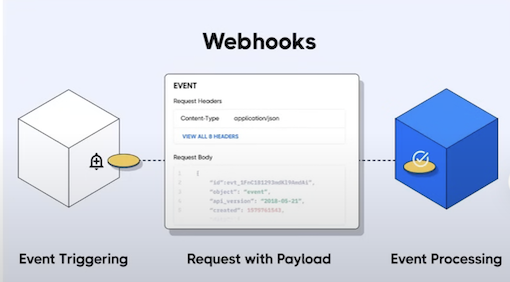

#### Common Uses of Webhooks

**Automating Workflows:** Webhooks can automatically update a testing server, deploy applications, or update a backup.

**Notifications**: They can **notify** other systems or services in real-time when events happen.

For example, if someone posts a comment on a blog, a webhook could automatically tweet the comment or send an email.

**Integrations:** Many services offer webhooks to integrate with other services without requiring a custom interface.

For example, PayPal uses webhooks to notify your accounting software when you receive a payment.

**Advantages of Webhooks**

**Efficiency:** Webhooks offer a more efficient method for receiving data than continually polling a service for updates. They push data as it becomes available, minimizing latency and reducing the amount of bandwidth used.


**Real-Time Processing:** Webhooks can facilitate real-time data processing by triggering a reaction immediately after the event

#### Configure notifications with Webhooks

Webhooks in **Azure DevOps trigger HTTP notifications to a URL for events like code updates or build completions, facilitating integration with other systems.**

**Select the Event:**

- Navigate to the 'Project Settings' and then to the 'Notifications' tab.
- Identify the event you want to

**New Subscription:**

- Click on 'New subscription' to create a new webhook.
- Select the specific event you want, such as 'Build completes.'

**Configure Action:**

Define the action that should happen when the event occurs. This typically involves sending a notification to an external service.

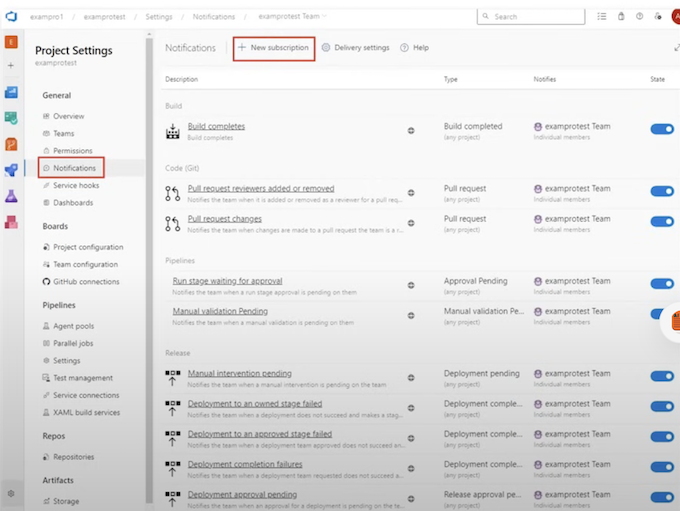

**Customize Your Webhook:**

You can customize what information you send along with the webhook. Azure DevOps allows you to send specific data related to the event.

**Authentication (if needed):**

If your endpoint requires authentication, you will need to configure the appropriate headers or payload with authentication tokens or keys.

**Test the Subscription:**

Once configured, it's crucial to **test the webhook** to ensure it works as expected. Azure DevOps typically allows you to test it through the interface.

**Monitor and Adjust:**

After setting up, monitor the notifications and ensure they're firing correctly. You might need to troubleshoot or adjust settings if you're not receiving the notifications as expected.

## Version Control Systems (VCS)


Version Control Systems (VCS) are **designed to track changes or revisions to code**.

The most popular VCS is Git.

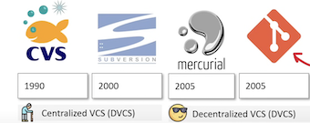

DVCS (and git specifically) became **very popular for many reasons**:

- • Full local history and complete a copy of the repo locally
- • Straightforward and efficient branching and merging
- • Better performance, Improved fault tolerance, flexible workflows, work fully offline

> Version Control normally represents revisions being represented as graph like structure. So you'll here terms like tree, trunk and branches

#### Git

Git is a distributed version control systems (DVS) created by Linus Torald 

Each change of your code (git commit) can be captured and tracked throughout the history of your project (git tree)


#### Common Git Terms

- Repository: Represents the logical container holding the codebase
- Commit: Represents a change of data in the local repository.
- Tree: Represent the entire history of a repo
- Remote: A version of your project hosted elsewhere, used for exchanging commits.
- Branches: Divergent paths of development, allowing isolated changes.
	- Main (formally known as master) the most common name for the default branch
- Clone: Creates a complete local copy of a repository, including its history.
- Checkout: Switches between different branches or commits in your repo.
- Pull: Downloads changes from a remote repository and merges them into your branch.
- Push: Uploads your local repository changes to a remote repository.
- Fetch: Downloads data from a remote repo without integrating it into your work.
- Reset: Undoes local changes, with options to unstage or revert commits.
- Merge: Combines multiple commit histories into one.
- Staging files: Prepares and organizes changes for a commit.
	- Commit: Saves your changes as a snapshot in the local repository.
- Add: Adds changes to the staging area for the next commit.

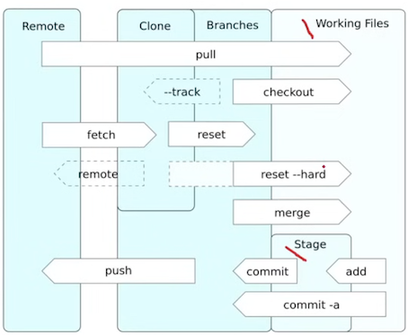

#### Version Control Services (VCS)

**Version Control Services (VCS) are fully managed cloud services that hosts your version controlled repositories.**

- These services often have additional functionality going beyond just being a remote host for you repos.
- Git is the most popular and often the only choice for VCS. Often we call these services **"git providers"**


**Github**

Owned by Microsoft. The most popular VCS offering due to ease of use and being around the longest. Github is primarly where open-source projects are hosted and offer rich functionality such as Issues Tracking, Automation pipelines and a host of other features.

**GitLab**

GitLab was an emerging competitor to Github and at the time had unique features such as a CI/CD pipeline and improve security measures.

**BitBucket**

- Owned by Atlassian. Originally hosted Mercurial, later adding Git and then sunsetting Mercurial.
- Tight integration with Atlassian's industry standard agile project management software JIRA.
- Larger organizations commonly use BitBucket because of JIRA adoption.

**SourceForge**

One of the oldest places to host your source code and was the first to free of charge to open-source projects


#### Git vs Github

| | Git | GitHub |
|:----|:---:|:---:|
| Nature| Distributed Version control system (DVCS) | Version Control as a Service (VCaaS)|
| Functionality  | Manages source code history| Provides cloud storage for Git repositories |
| Access | Local system installation | Accessed via web interface |
| Scope  | Local repository management| Online collaboration and repository hosting |
| Collaboration  | Local changes, requires manual sharing | Integrated tools for collaboration (issues, PRs) |
| Usage  | Command-line interface| Graphical interface and additional features |


#### Github Repo

**A Github Repo is your git repo that you push upstream to GitHub**

GitHub allows you access and manage your git repo with several functionality

From your Github repo page you can:

- • View different branches
- • View tags
- • View commit history
- • Explore repo's files
- • View releases
- • See codebase language breakdown
- • View the top level markdown files
	- • Readme.md
	- • Licence.md


You can perform actions such as:

- • Pinning
- • Watching
- • Forking
- • Starring
- • Cloning (downloading)

#### Git commit

A Git Commit represent incremental changes to a codebase represented with a git tree (graph) at a specific time.

A git commit contains:

- • Additions, modifications and deletions of files
- • Additions and deletions of file contents.
- **Not the whole files** themselves.

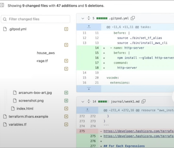

**Each Commit has a SHA hash that acts as an ID : Eg. 661a91ad3b66926c4591f9d3c73c087906945f3b**

You can use this Commit SHA to checkout specific commits.

> Git does not store the whole files in each commit but rather the state of changes.
This greatly reduces the file size. To the developer the files will appear whole

Components of Git Commit:

- **Commit Hash**: A unique SHA-1 hash identifier for the commit.
- **Author Information**: The name and email of the person who made the commit.
- **Commit Message**: A description of what changes the commit contains.
- **Timestamp**: The date and time when the commit was made.
- **Parent Commit Hash(es)**: The SHA-1 hash of the commit(s) this commit is based on.
- **Snapshot of Content**: A snapshot of the project at the time of the commit (not the actual files, but references to them).

Commit messages are often written in a tool as its more convenient to quickly add, remote files, audit changes

VS Code has that ability via the Source Control window

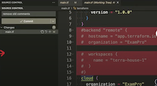

Common Git Commands you should know:

You need add or remove files to be stage changes

```
# Files to be staged
git add my-file
git add . # add all files
git rm my-other file # remove a specific file

# Commits staged changes with a message
git commit -m "Commit message"

# Automatically stages all tracked, modified files before the commit
git commit -a -m "Commit message"

# Modifies the most recent commit 
git commit --amend

# Creates an empty commit, useful as a placeholder 
git commit -m "Initial commit" --allow-empty

# Commits with a specified author.
git commit -m "Message" --author="Author Name <email@example.com>"

# checkout to a specific commit based on SHA hash
git checkout 661a91ad3b66926c4591f9d3c73c087906945{3b.
```

#### Git Branch

**A git branch is a divergence of the state of the repo.**

You can think of branches as being copies of a point in time that have been modified to be different.

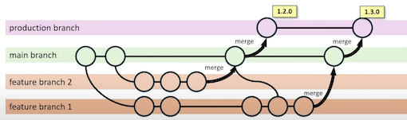

> This type of workflow is is very close to GitHub Flow

You can have branches for:

> Specific environments: eg. Staging, development, production
>
> Specific to developers: eg. andrew, bayko, cindy
>
> branches per feature: eg. payment-gateway-feature
>
> Branches per bug eg. hotfix-blank-hoempage

Common git branch commands you should know

```
#Lists all local branches git branch
#Creates a new branch git branch [branch-name]

# Checkout (switch to) a branch
git checkout [branch-name]

# Create and checkout a branch
git checkout -b [branch name]

# Deletes a branch 
git branch -d [branch-name]:

# Renames a branch
git branch -m [old-name] [new-name]

# Lists both remote and local branches
git branch
```

A common workflow for developers is to create a branch or a feature, and they need to push their branch upstream to the remote name origin.

```
git checkout -b my-new-branch

# ... makes changes to files
git add
git commit -m "my changes"
git push -u origin my-new-branch
```

#### Git Remote

A git remote represents **the reference to remote location** where a copy of the repository is hosted.

You can have multiple remote entries for your git repo.

* "origin" as a remote name almost always seen for a repo.
* It indicates the central or golden repo everyone is working from and represents the source of truth.

**The remote entries are stored in `.git/config`**

```
[remote "origin"]
	url = https://github.com/examproco/exampro.git
	fetch = +refs/heads/*:refs/remotes/origin/*
[branch "production"]
	remote = origin
	merge = refs/heads/production
[branch "main"]
	remote = origin
	merge = refs/heads/main
```

Notice remote names can be **referenced**

```
# Lists all remote repositories along with their URLs.
git remote -v
git remote add [name] [URL]
git remote remove [name]
git remote rename [old-name] [new-name]

#Pushes a branch and its commits to the specific remote. 
git push [remote-name] [branch]

# Pulls updates from a remote branch. 
git pull [remote-namel [branch]

# Fetch updates without pulling.
git fetch [remote-name]
```


#### Git Remote - Upstream and Downstream

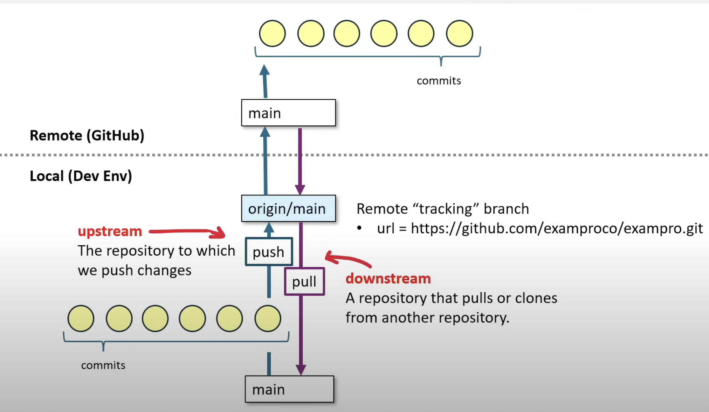

#### GitHub Flow

**GitHub Flow is a light-weight workflow** for multiple developers working on a single repository

- **Create a Branch**: For each new task or feature, create a new branch off the main branch.
- **Add Commits**: Make changes and commit them to your branch.
- **Open a Pull Request**: Start a discussion about your commits, reviewing code in the pull request.
- **Discuss and Review**: Share your pull request with teammates for feedback.
- **Deploy**: Test your changes in a production environment.
- **Merge**: Once your changes are verified, merge them into the main branch.

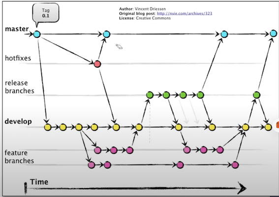


#### GitHuo CLI

**The GitHub CLI is a command line interface to interact with your GitHub Account**.

You can quickly perform common GitHub actions without leaving you developer environment

```
gh auth login
gh repo create github-examples --public
gh issue create --title "Issue title" --body "Issue body" 
gh pr review --comment -b "interesting"
```

The GitHub CLI can be installed on Windows, Linux, and macOS

```
brew install gh
```

You can quickly install the CLI for GitHub Codespaces via Features:

```
"features": {
	"ghcr.io/devcontainers/features/github-cli:1": {}
]
```

**Core commands**

gh auth / gh browse / gh codespace / gh gist / gh issue / gh org / gh pr / gh project / gh release / gh repo

**GitHub Actions commands**

gh alias / gh api / gh completion / gh config / gh extension / gh gpg-key / gh label / gh ruleset / gh search / gh secret / gh ssh-key / gh status / gh variable

**Additional commands**

gh cache / gh run / gh workflow


#### Basic Repo Navigation

Within a Github repo you'll have a **navigation bar** to the various feature of your GitHub repo:

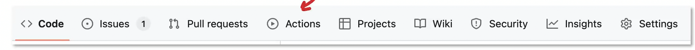

- • **Code**: The main tab where the repository's source code, files, and folders are located.
- • **Issues**: Tracks problems or ideas for the project, allowing collaboration and discussion.
- • **Pull Requests**: Used for managing contributions from other users, enabling code review and discussion before merging changes.
- • **Actions**: Manages continuous integration and continuous deployment (CI/CD) workflows.
- • **Projects**: A board for organizing and prioritizing work, similar to kanban or task management boards.
- • **Wiki**: A space for the project's documentation.
- • **Security**: Features security-related resources, including security policies and vulnerability reports.
- • **Insights**: Provides statistics and insights on the project's activity and contributions.


When you create a repo you choose a owner:

* Personal account
* An organization that you belong to

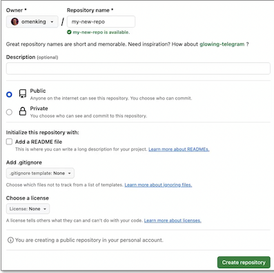

- You need to choose an available github repo name
- Names are unique based on the scope of the owner

**You repo can either be public or private**


You can quickly add a:

- Readme file
- gitignore file
- License file

Github CLI can be used to create a GitHub repo

```
gh repo create my-project --public --clone
```

#### Maintaining a repo

You can **change your repo name**, (but try not to because it can break external links and documentation pointing to a public repo)


- You can change the base branch (default branch).
- You can rename the default branch.
- "main" is the unspoken best practice for naming your base branch

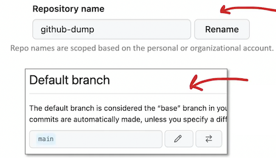


- You can **opt-in-and-out of some features for your Github Repo**
- Features will appear in the Github repo navigation bar

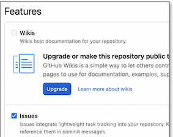

The Danger Zone contains actions you need to think twice about because they cannot be undone.


Change repo visibility

When you make a private repo private

- The code will be visible to everyone who can visit https://github.com
- Anyone can fork your repository.
- All push rulesets will be disabled.
- Your changes will be published as activity.


**Disable Branch Protection Rules**

- Branch protect rules are strict workflow rules like disallowing anyone pushing to main.
- You can disable all protections temporarily eg. For quick fixes

**Transfer ownership**

When you want someone else to be the owner of the repo.

**Archive this repository**

When the repo to be read-only.

**Delete this repository**

- When you want to delete your repo.
- Once its gone its gone, there is not trash bin you can pull it out of.

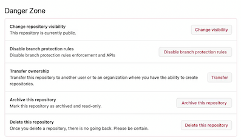


#### Repo Templates

**Github Repo Templates** is a feature for public repos that **allow other GitHub users to make a copy of the contents of the template repo** to use as starting point of their own repo.

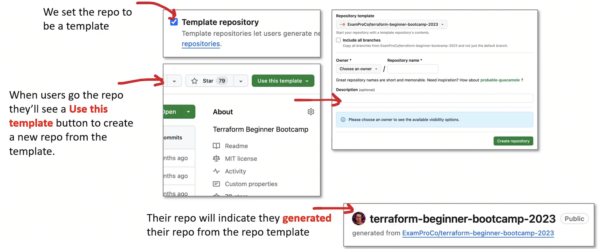

> Templates are different from cloning because it's a clean repo with no previous history.

#### Cloning a repo

You can clone a repo programmatically three different ways:

**1.HTTPS**

git clone https://github.com/omenking/terraform-beginner-bootcamp-2023.git


**2.SSH**

git clone git@github.com: omenking/terraform-beginner-bootcamp-2023.git

> Authorization is based on SSH keypair
>
>  you have to upload the Public key to your GitHub account

**3.Github CLI**

gh repo clone omenking/terraform-beginner-bootcamp-2023


> Authorization is based on the credentials when did a gh login

You can also:

- Open in GitHub Desktop which will perform the clone for you
- Download a ZIP containing the contents of the repo

#### Creating branches


Using git we can create a new branch from an existing branch.

We then want to push upstream our branch to GitHub

```
git checkout -b staging
# change files, create commits
git push -u origin staging
```

- is the short hand flag for `-set-upstream`.


- Branches can be created from Issues.

- The branch and issues will be associated/link

- Branches can be directly created within GitHub Ul.

- Branches can be created in GitHub Desktop


#### GitHub Releases

GitHub Releases allows you to create releases with release notes and linked assets such as zip source or binaries for specific platforms

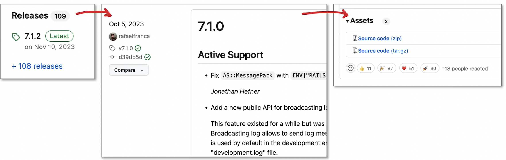

#### GitHub Packages

GitHub Packages is a platform for **hosting and managing packages, including containers and other dependencies.**


Pushing Docker container to GitHub Packages

**Supported package registry:**

- Javascript (npm package)
- Ruby (gems)
- Java (maven and gradle packages)
- Net (don't net packages)
- Docker images

```
GH_USERNAME=" andrew-wc-brown"
IMAGE NAME="hello-world"
VER="1.0.0"

# Sign-in to docker
echo $GH_TOKEN | docker login ghcr.io -u $GH_USERNAME --password-stdin

# Tag docker container
docker tag $IMAGE_NAME: $VER ghcr.io/$GH_USERNAME/$IMAGE_NAME:$VER

# Push to Docker Packages
docker push ghcr.io/$GH_USERNAME/$IMAGE_NAME:$VER
```

**GitHub Actions could be used to build and then public packages to GitHub Packages**


```
FROM alpine:latest
CMD echo "Hello World!"
```

```
docker build -t hello-world . 
docker run hello-world
```

#### Pull Requests

**A Pull Request (PR) is a formal process to put forth changes**, that can be manually or automatically reviewed before its accepted into your base (main) branch


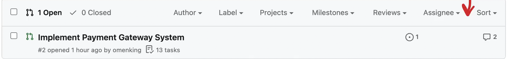

**Benefits of a Pull Request**

* **Collaborative Review**: Enhances code quality through team discussions and peer feedback.
* **Change Tracking**: Provides a record of code changes and related discussions.
* **Automated Testing**: Enables integration with tools for automated checks and tests.
* **Controlled Integration**: Manages safe and reviewed merging of code changes.
* **Open Source Friendly**: Simplifies contributions and collaboration in open-source projects.

> A pull request is not a feature of git, but a workflow. Services like GitHub can automate the Pull Request workflow

#### Creating Pull Requests


We set the:

- Base - who we are going to merge into
- Head - the changes to pull in

We can use the Github CLI to create a pull request from a branch.

```
git checkout -b cool-feature-branch 
git commit -am "Your commit message" 
git push -u origin cool-feature-branch
gh pr create --base main --head cool-feature-branch
```

**In the GitHub repo we navigation to Pull Requests**


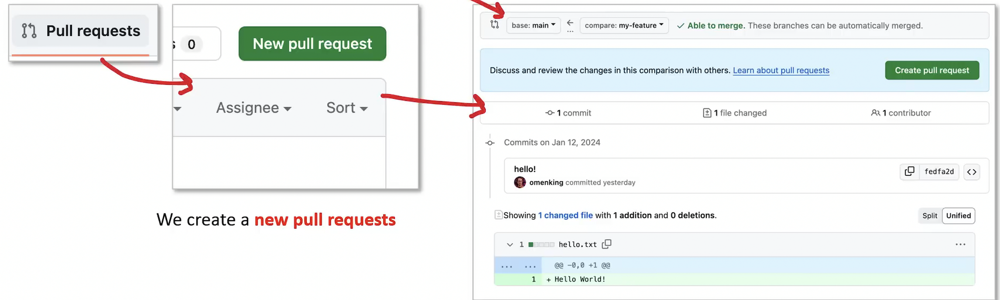

#### Pull Requests - Base and Compare

Base and Compare determines the direction of the merge for a pull request

**Base is who you want to merge into**

This is usually main branch or an environment specific branch

**Compare is what will be merged into Base**

- Compare is choosing a Head ref
- This usually a bug or feature branch

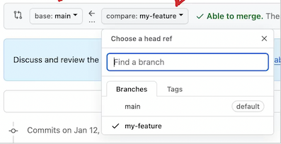

You can also compare across forks this is how a fork stays up to date, or how forks can suggest you to accept their changes.

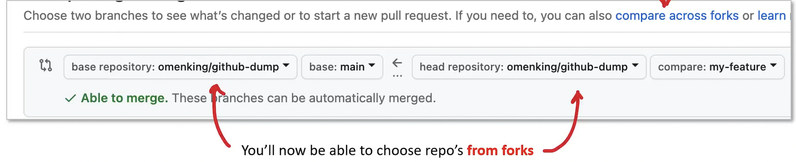

#### Draft Pull Requests

A Draft Pull Request on GitHub is a feature that allows you to open a pull request but mark it as a work-in-progress (WIP).


Use case for Draft Pull Requests

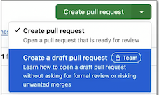

> Draft Pull Requests is a feature only for Github Organizations Teams

Use case for Draft Pull Requests

- **Indicating Work-in-Progress:** Communicates that the pull request is not ready for review or merging.
- **Preventing Premature Merging**: Ensures incomplete work is not accidentally merged.
- **Facilitating Early Feedback and Collaboration:** Allows for early sharing and discussion of code changes.
- **Continuous Integration Testing**: Enables Cl tests during the development process.
- **Transitioning to a Ready State**: Easy switch from draft to ready for final review and merging.
- **Organizing Work and Priorities**: Helps in managing and tracking ongoing work in large projects.


#### Linked Activity within a Pull Request

Supported Keywords

**close closes closed fix fixes fixed resolve resolves resolved**

> The pull request must be on the default branch.

#### Pull Request Statuses

**Open**

The default status when a pull request is created. It's open for discussion and review.

**Draft**

Indicates the pull request is a work-in-progress and not yet ready for review.

**Closed**

The pull request has been closed without being merged. This status is used when the proposed changes are no longer needed or if the branch has been rejected.

**Merged**

- The pull request's changes have been merged into the target branch.
- This status indicates a successful conclusion of the pull request process.


**Changes Requested**


This status is used during the review process when a reviewer requests changes before the pull request can be merged.

**Review Required**

- Indicates that the pull request requires a review before it can be merged.
- This status is common in repositories where reviews are a mandatory part of the workflow.

**Approved**

The pull request has been reviewed and approved for merging by the required number of reviewed


**Conflict**

Indicates that there are conflicts between the pull request's branch and the target branch that ne to be resolved before merging.

**Ready for Review**

A pull request initially marked as draft can be changed to this status once it's ready for review.


#### Codereviews with CODEOWNERS file

**CODEOWNERS Github repo specific file to define individuals or teams that are responsible for specific code in a repository**

CODEOWNER files uses **a similar syntax to .gitignore**.


When a pull request is opened that modifies any files matching a pattern in the CODEOWNERS file, GitHub a**utomatically requests a review from the specified code owners**.


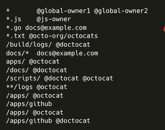

> The codeowner files goes in either the project root, github or docs directory.


#### Required Reviewers

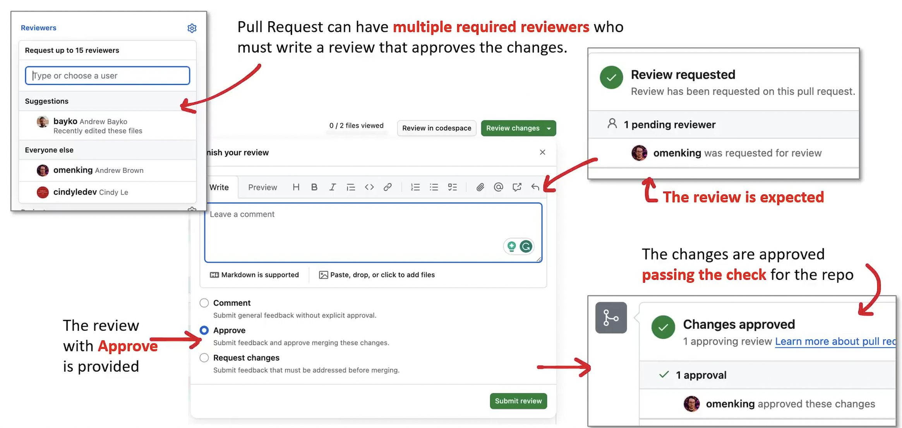

#### Pull Request Templates

Pull Request Templates are similar to Issue Templates

They will populate the pull request textarea with the specified template

You create a a file in the

**`.github/pull_request_template.md`**


Technically you can create multiple Pull Request Templates in a folder called `.github/PULL_REQUEST_TEMPLATE`

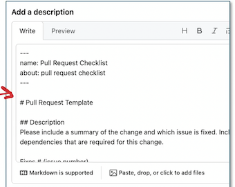


> GitHub kind-of supports multiple Pull Requests Templates but you have to assemble your own URL with a querystrings, so its not as convenient to use as multiple Issue templates.

###  Source-Control-Strategy Authentication methods

#### Authentication and credential strategies

**Credentials are specific to a user's identity.**

For example, their individual **username and password, PIN, or biometric information.**

Every user, including IT administrators, teachers, staff persons, and students has credentials.

**An authentication method is the way a user proves their identity to a system.**

For example, a user inputs their credentials in a sign-in screen or via the **Microsoft Authenticator app in which they have set up their account**.

Authentication methods can also be broken down into categories, or types, such as:

- Sign-in authentication
- Password reset authentication
- Multi-factor authentication

#### Authentication and credential strategies

**Authentication Types**

Authentication methods vary widely, from traditional to advanced:

Common Types:

- Passwords and PINs: Common but can be risky for security.
- Picture Passwords and Pattern Locks: Offer memorability and simplicity.

**Biometric Authentication:**

- Facial, Fingerprint, Retinal: Provide secure, unique user identification.


**Passwordless Authentication**

Emphasizes security and convenience by eliminating traditional passwords, removing the hassle of memorization and mitigating threats like phishing.

Microsoft's Methods:

- **Windows Hello for Business**: Uses biometrics/PIN for secure sign-ins and SSO.
- **Microsoft Authenticator App**: Enables phone verification with notifications and biometrics/PIN.
- **FIDO2 Security Key**: Allows password-free logins with external/internal keys.

#### Password Reset Authentication

**Self-Service Password Reset (SSPR) with Microsoft Entra ID** lets users **change their own passwords** without help desk assistance, cutting down on support costs and improving security and efficiency.

Key Features:

- **Self-Service:** Users can change or reset their passwords without administrator or help desk assistance.
- **Security Enhancement**: SSPR improves organizational security by allowing users to promptly address account lockouts or compromises.

**Compliance with Password Policies:**

SSPR enforces Microsoft Entra password policies regarding complexity, length, expiration, and character use, ensuring standardized security measures across the board.

#### Authentication and credential strategies

**Multi-factor Authentication (MFA)**

MFA is a security measure that requires **more than one piece of evidence to confirm your identity** when logging into an account, like a code from your **phone** in addition to your password.


**MFA Methods:**

- **SMS Text Message**: A code sent to the user's phone.
- **Phone Voice Call**: Answering a call to confirm identity.
- **Microsoft Authenticator App**: A code or biometric verification through the app.
- **OAUTH Hardware Token**: Using a physical token for authentication.

##### **Set Up Auth for External Services**

- Outh is a protocol for authorization that lets users give third-party services like GitHub or Jenkins permission to use their information without sharing their login details.
- It ensures secure connections, making authentication and permissions straightforward.


#####  **Use Personal Access Tokens**

**Personal Access Tokens (PATs)** provide a way for users to **create special tokens to access DevOps tools**. They're especially handy for command-line interactions or scripts needing direct access to these services.

##### Apply Role-Based Access Control

**Role-Based Access Control (RBAC)** sets up detailed **access rules based on users' roles and what they're allowed to do**. It makes sure people have just the right access they need for their work, keeping sensitive information secure.


#### Git LFS

- **Git LFS (Large File Storage) is an open-source extension for Git that helps handle large files more efficiently.**
- It does this by using small text pointers in your Git repository to represent the large files, while keeping the real file content stored elsewhere. This method keeps your repository from getting too large and slowing down.

**Install Git LFS**

- Install: Go to the Git LFS website, download, and install it.
- Configure: Use the command **`git Ifs install`** to set up Git LFS on your

**Setting Up Git LFS in Your Repository**

- Track Large Files: Decide which file types to manage as large files. E.g., **Use git Ifs track "*.mp4" for MP4 files**
- Add Attributes File: **Add the .gitattributes file to your repo with `git add .gitattributes`**

**Commit and Push: Save the changes with `git commit -m "Configure Git LFS”`` and update the remote repository using `git push`.**

Managing Large Files

**Add Files: Run `git add. or git add ‹filename>` to stage large files.**

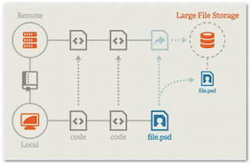

Commit and Push: Use `git commit -m "Add large file”`` and `git push` to commit and send files to the repo

#### Git-fat

**git-fat** is another tool for managing large files in Git repositories. It's a Python script that keeps large files separate from your Git repository, while maintaining references to those files within the repository.

**Setting Up git-fat**

- **Install Python**: Make sure Python is installed on your system.
- **Install git-fat**: Install git-fat using pip with pip install

**Initializing git-fat in Your Repository:**

- Initialize git-fat: Run `git-fat init` in the root of your repository.
- Track Files: Define large file types in a `.gitfat` file. For example, to track mp4 files, you might add `*.mp4` to the file.
- **Commit gitfat: Add the `.gitfat` file to your repo with `git add .gitfat` and then commit it using `git commit -m "Initialize git-fat and track large files”`**


**Managing Large Files with git-fat:**

- Add Large Files: Use `git fat add < file >` to stage large files for git-fat.
- Commit and Push: Commit with `git commit -m "Add large file”`` and upload with `git push`

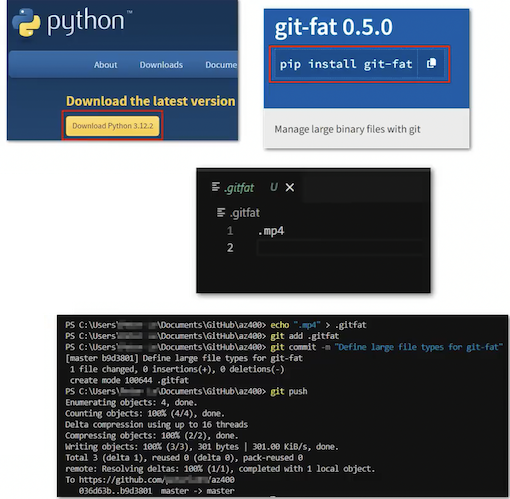

#### Git Scalar

Git Scalar is an extension that helps Git efficiently manage large repositories, addressing the slowness and space issues associated with downloading a repository's entire history and files.

Git Scalar solves this by **allowing you to download only the files you need. It works well with Git LFS**

**Configure Git Scalar for a Specific Path**

- **Install Git LFS:** Install **Git LFS** by following the steps provided in its official documentation.
- **Scalar Initialize Git LFS in Your Repository**: In your repository's directory, run **git Ifs install**

Create and Configure gitattributes File: In the root directory of your repository, create a `.gitattributes` file.

To enable Git Scalar for files under the `my/large/files/directory`, add the following line to `.gitattributes: my/large/files/* filter=Ifs diff=Ifs merge=Ifs -text`

This configuration tells Git LFS to manage files in my/large/files/, using Git Scalar for efficient handling.

**Commit and Push the .gitattributes File:**

Commit the gitattributes file to your repository with: `git add gitattributes`

Then `git commit -m "Configure Git LFS and Git Scalar for specific`

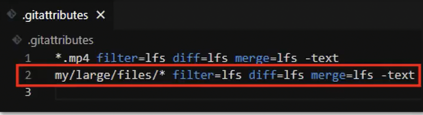

Push the changes to your remote repository: git push

#### Git submodule add

**Cross-Repository Sharing with Git:**

Sharing code across different repositories is common for **reusing code, modularization, or separating components of an application**. Git facilitates this with the following method:

**Submodules:**

**Git submodules let you integrate a separate Git repository within another repository's directory structure.**

It's especially handy for incorporating a particular version of an external library or for **sharing common libraries across various projects.**

**To add a submodule:**

**`git submodule add < repository-url> <path>  <path>`**

**<repository-url>: The Git URL of the repository you want to add.**

**<path>: The directory path within your main project where the submodule will be placed.**

Example: `git submodule add https://github.com/example/lib.git externals/lib`

Advantages of Submodules:

Manage shared code by referencing specific commits, and keeps the main project separate from external dependencies.

> Using Git submodules necessitates managing updates individually and maintaining consistency across projects that share them.

#### Git subtree

**Git subtree is a tool that helps you include code from one repository into a specific folder of another repository.**

**It's a simpler alternative to submodules, which is another way to incorporate external code but can be a bit complex to handle.**

With Git subtree, you can both bring in **external code and send updates back to the original code source if needed.**

To add a subtree, you use a command that looks like this: 

**`git subtree add --prefix=folder-name repository-url commit-or-branch`**

- `--prefix=folder-name` is where you specify the folder in your main project where you want to add the external code.
- `repository-url` is the web address of the external code you're adding.
- `commit-or-branch` is the specific version of the external code you want to use, which can be a commit ID or a branch name.

> Git subtree streamlines project workflow by integrating external code directly, ensuring it's immediately accessible upon cloning without additional steps.

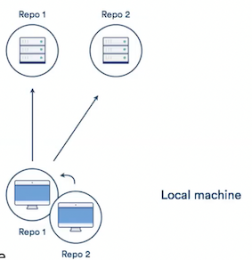

## Workflow Hooks

**Workflow hooks** are essential tools in the Microsoft DevOps ecosystem, designed to **automate and refine development workflows, leading to better efficiency and productivity**

Workflow hooks act as triggers for executing actions or scripts at **specific points** in a DevOps workflow, crucial for maintaining **code quality, automated testing, deployment, and integrating external services into the process.**

In the context of **build and release cycles**, workflow hooks are particularly valuable.

They enable developers to automate tasks like **unit testing, documentation compilation, or deployment** to testing environments with each new build or release, streamlining these processes.

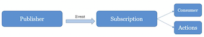

### Workflow Hooks with Azure DevOps

Azure DevOps stands out in offering comprehensive tools and services for managing the DevOps lifecycle, including implementing workflow hooks through service hooks.

These service hooks allow for connecting your **DevOps pipeline** with **external services or initiating custom actions in response to various events, such as new build completions, work item updates, or pull requests**.

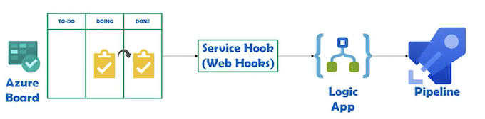

**Other Tools and Services for Workflow Hooks**

Besides Azure DevOps, Microsoft offers other tools and services for implementing workflow hooks, including **GitHub Actions, Azure Logic Apps, and Azure Functions.**

The key to leveraging workflow hooks effectively is to identify the crucial events and actions within your workflow and use the appropriate tools for implementation.


### Workflow Hooks with Azure DevOps

**Create a service hook in Azure DevOps for automating actions such as notifications after a successful build**

- **Access Project Settings**: Open your project in Azure DevOps and navigate to **'Project Settings'** at the bottom of the project sidebar.
- **Open Service Hooks:** In the 'General' section, find and click on `'Service Hooks’`.
- **Create Subscription:** Initiate the creation process by clicking the `'+ Create subscription’`` button.
- **Select Notification Service**: Pick the service for notifications, like **Microsoft Teams or Slack,** and set the event trigger to `'Build completed’` 
- **Set Trigger Filters:** Customize the trigger filters by setting the build status to `’succeeded'``.
- **Configure Action Details:** Specify the notification message and destination, such as the **recipient channel in Slack or an email address**.
- **Finalize and Test:** Save the service hook with the 'Finish' button and conduct a test to confirm it operates after a build is successful.

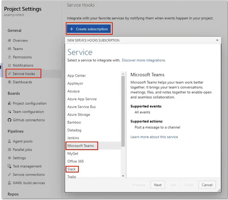

### Branch strategy

**Trunk-based development (TBD) employs a single, central branch known as the "trunk" or "master,"** ocusing on frequent, small updates for continuous integration and stability.

**Steps to Implement TBD:**

1. Establish the Trunk: Define a **single branch (the "trunk")** as the central code path.
2. Direct Commits: Encourage team members to commit small changes directly to the trunk frequently.
3. Continuous Integration: Perform builds and tests on the trunk often to catch issues early.
4. Automate Deployment: Set up automatic deployment to streamline updates.

Here's an example of how you can create a trunk branch using Git:

- git branch trunk 
- git checkout trunk

Feature branches enable developers to work independently on **new features or fixes,** 

**keeping changes separate from the main code until they're ready to merge**. This approach allows for focused development and testing of specific functionalities without disruption.

Steps to Use Feature Branches:

1. **Create Feature Branch: Initiate a new branch for each feature or fix**.
2. **Naming Conventions**: Assign descriptive names reflecting each branch's purpose.
3. **Stay Updated: Merge updates from the main branch periodically**.
4. **Thorough Testing**: Conduct extensive tests before merging back to the main branch.

Here's an example of how you can create and switch to a feature branch using Git: 

- git branch feature/new-feature

- git checkout feature/new-feature

**Release branches help prepare and stabilize a codebase for a new release, focusing on bug fixes and final adjustments.** They are created from the main branch, enabling ongoing development while ensuring the upcoming release is thoroughly tested and polished.

Steps for Managing Release Branches:

1. **Create a Release Branch: Start a branch from the main branch for new releases.**
2. **Focused Adjustments**: Make all necessary tweaks and bug fixes on this branch.
3. **Ensure Stability**: Test thoroughly and maintain continuous integration.
4. **Final Merge:** Merge the release branch back into the main branch once ready.

Here's an example of how you can create a release branch using Git: 

- git branch release/release-1.0
- git checkout release/release-1.0

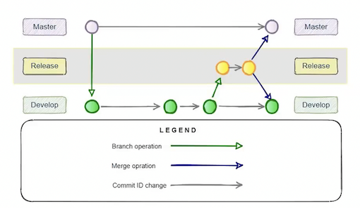

#### Branch policies

**Branch policies** in Microsoft DevOps Solutions are **rules that govern how code is contributed to a repository**.

They enforce certain **conditions that must be met for pull requests to be merged**, ensuring that code is reviewed, tested, and linked to relevant project tasks.

**Key Branch Policies to Implement**

**Require Approving Reviews:** Mandate that each **pull request receives at least one approving review** from designated reviewers before it can be completed. This guarantees that all code changes are scrutinized by another developer, promoting better code quality and reducing the risk of errors.

**Link Work Items: Ensure that every pull request is associated with a corresponding work item.**

This linkage provides traceability and accountability, making it easier to track why changes were made and ensuring they align with the project's goals.

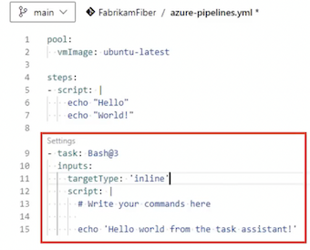


**Build Validation**: Configure this policy to require that changes in a pull request successfully **pass automated builds and tests**. This helps to identify any compilation issues or test failures early, preventing problematic code from reaching the production


#### Branch policies

Additional Branch Policies for Enhanced Workflow

- **Enforce Minimum Review Time**: Ensure pull requests remain **open for a set period** to prevent rushed reviews and promote thorough evaluations.
- **Require Task Completion: Require the completion of specific tasks**, such as addressing code comments or updating documentation, before merging.
- **Automate Code Formatting and Style Checks: Use linters or similar tools** to automatically enforce coding standards and reduce manual review efforts.

**Benefits of Using Branch Policies**

- **Improved Code Quality**: Automated checks and mandatory reviews help **minimize bugs and errors.**
- **Better Team Collaboration:** Mandatory reviews and work item links foster collaboration and keep team goals aligned.
- **Efficient Workflow Management**: Automating parts of the review process speeds up development while maintaining high quality.

#### Branch protection

Branch protections provide an additional layer of security by enforcing rules on branch manipulation, preventing accidental modifications or unauthorized changes.

**Key Branch Protections to Implement**

**Require a Minimum Number of Reviewers:** Set branches to require **a specific number of reviewers for all changes**. This ensures multiple evaluations of the code, which facilitates collaboration and reduces the risk of defects.

**Restrict Who Can Push to the Branch: Limit direct push access to protected branches,** allowing only authorized individuals or teams to make changes. This control helps prevent unauthorized modifications and maintains code integrity.

**Enforce Merge Checks: Specify criteria that must be met before merging a pull request.**

These include build validation, work item linking, and branch permissions compliance, to ensure only approved changes merge.


#### Branch protection

Pull Request Workflow with Branch Policies and Protections

**Create a Feature Branch**: Developers branch off the main branch to work on new features or fixes.

**Implement Changes and Create a Pull Request:** Developers commit changes to their branch and open a pull request to merge them into the main branch.

**Assign Reviewers and Await Feedback**: Reviewers inspect the code, provide feedback, and approve. Branch policies ensure pull requests need the required approvals to proceed.

**Address Feedback and Iterate**: Developers respond to feedback, update their code, and trigger the build validation process. Reviewers reassess the updated changes.

**Complete the Pull Request:** After securing approvals and passing merge checks like work item linkage and build validation, the pull request is completed, and changes are merged.


## Azure Pipelines

### Azure Pipelines

**Azure Pipelines is a cloud service that automates the Cl/CD pipeline for software development**, offering support for multiple languages, platforms, and cloud environments, and integrating with a wide range of tools and services.


- Automation for CI/CD: Azure Pipelines provides a fully featured continuous integration (CI) and continuous delivery (CD) service for applications.
- Platform and Language Agnostic: Supports any language, platform, and cloud. Integrates with Azure, AWS, and GCP.
- Extensibility: Offers integration with popular tools and services in the software development ecosystem.


- Supports Open Source and Private Projects: Available for projects hosted on GitHub and other platforms.
- Rich Integration: Integrates with GitHub Checks and offers extensive reporting capabilities.
- Parallel Jobs and Environments: Allows running multiple jobs in parallel and deploying to multiple environments including Kubernetes, VMs, and Azure services.

**Define Your Pipeline**

YAML Syntax: Azure Pipelines uses YAML syntax to define build, test, and deployment tasks.

Step-by-Step Process: The documentation guides through the process of setting up your first pipeline, including initiating builds, packaging applications, and deploying.

Key Concepts

- Pipelines: A complete CI/CD pipeline defined by stages, jobs, steps, and tasks.
- Stages: A way to organize jobs, typically used to separate build, test, and deploy processes.
- Jobs and Steps: Jobs group steps, which are individual tasks like scripts or Azure Pipeline tasks.


#### Azure Pipelines

**Supported Languages and Frameworks**

- **Wide Language Support**: Works with any language including NET, Java, JavaScript, Node.js, Python, PHP, Ruby, C/C++, and more.
- **Framework and Platform Support**: Supports Windows, Linux, and macOS builds. Can deploy to various platforms including Azure, Kubernetes, VMs, and on-premises servers.

**Extensibility**

- **Marketplace Extensions**: A rich marketplace of extensions to extend the functionality of Azure Pipelines.
- **Custom Tasks**: Developers can create custom tasks to meet unique requirements.


**Pricing**

**Free Tiers Available**: Offers free CI/CD minutes to projects, with additional minutes available for purchase. Pricing varies based on parallel job needs and cloud providers


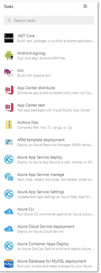

### GitHub repos with Azure Pipelines

Integrating GitHub repositories with Azure Pipelines can significantly **enhance the automation of build and release processes** within a DevOps workflow.

#### **Step 1: Create a New Project in Azure DevOps**

**Create Project: Click the "New project" button**. Provide the necessary details for your project such as name and description, and then click on the "Create" button to finalize the project creation.


####  **Step 2: Connect Your GitHub Repository to Azure Pipelines**

**Access Pipelines:** In your new Azure DevOps project, navigate to the "Pipelines" section.

**Initialize Pipeline:** Click on the "New pipeline" button.

**Select Source:** Choose GitHub as the source for your pipeline. You will need to authenticate and authorize Azure Pipelines to interact with your GitHub account.

**Configure Pipeline**: Select the specific branch or repository to build and deploy.

**Activate**: After setting your configuration, click "Save and run" to save the settings and trigger the initial build.


####  Step 3: Build and Deploy Your Application

**Build Configuration:** Azure Pipelines will execute the build of your application according to the directives specified in your pipeline configuration file (usually a YAML file). This may include tasks like **compiling code, running tests, and packaging artifacts.**

**Release Tasks:** Post-build, configure the pipeline to deploy your application to various environments, such as staging or production. This can involve deploying to services like **Azure App Service or Azure Kubernetes Service.**

Deployment Customization: Utilize features like **environment variables, secrets, and approvals** to tailor and secure your deployment process.


### GitHub repos with Azure Pipelines

Benefits of Integrating GitHub with Azure Pipelines

**Continuous Integration (CI):** Ensures that any changes in the connected GitHub repository **trigger automatic builds**, keeping your application updated and validated after every commit.


**Code Visibility**: Enhances traceability by linking GitHub pull requests and commits directly to their respective build and release pipelines.


Artifact Management: Facilitates management and storage of build artifacts in Azure Pipelines or with external services such as **Azure Artifacts and Docker registries**.


**Continuous Delivery (CD)**: Automates the **deployment process** across different environments, minimizing manual intervention and promoting consistent releases.


**Release Approvals**: Implements **controls and checks** through configurable approvals before promoting builds to production environments.

### Configure permissions in source control repo


Managing access and security through permissions is critical in a DevOps environment to ensure that team members have appropriate access for their roles.

**Configuring Repository-Level Permissions**

1. **Access Project**: In Azure DevOps, navigate to your project and go to the "**Repos**" section.
2. **Repository Settings**: Select your repository and click on the **"Settings" tab, then "Repositories" in the submenu**.
3. **Modify Security**: Choose the repository you want to adjust and click on the "Security" tab on the right.
4. **Manage Access**: Add users or groups to the pre-defined security groups ("Contributors," "Readers,"
"Administrators") or create new ones.
5. **Set Permissions: Use the "Add"** button to grant the appropriate permissions like "Read," "Contribute," and "Administer" to selected users or groups.


#### Branch-Level Permissions Configuration

1. **Repository Access**: Open your repository in Azure DevOps.
2. **Branches: Go to the "Branches"** tab and choose the branch you need to configure.
3. **Security Settings**: Click on "Security" to manage permissions for that branch.
4. **Define Permissions**: Assign permissions to groups or users, overriding repository-level permissions if necessary.


**Configuring File-Level Permissions**


1. **Locate File**: Within the repository, navigate to the specific file you want to manage.
2. **File Permissions**: Click the three-dot icon next to the file and choose "Manage permissions."
3. **Control Access**: Add groups or users and set the desired access levels just as you would at the repository or branch level.


## Tags in source control repo

**Tags** in Git serve as reference points to specific commits, making it **easier to manage and track different versions of code in a repository**.

**Step 1: Repository Access**

Log into Azure DevOps or another Microsoft DevOps Solutions platform. Verify you have the required repository permissions.

**Step 2: Navigate to the Repository**

**After logging in, locate the "Repositories" or "Source Control" tab on your dashboard**.

This section contains all the repositories you have access to within the platform.

**Step 3: Create a Tag**

Identify the commit in the repository that you wish to tag. Tags are useful for marking releases or important points in the project’s history.


Tags in Git serve as reference points to specific commits, making it easier to manage and track different versions of code in a repository.


Step 3: Create a Tag

Identify the commit in the repository that you wish to tag. Tags are useful for marking releases or important points in the project's history.

1. Select the desired commit from the commit history.
2. Look for an option labeled **"Create tag" or "Add tag,”** usually available in the commit's context menu.


Step 4: Provide Tag Details In the tag creation dialog:

1. Enter the Tag name: a unique identifier for the tag.
2. Provide a Description: a brief note about what this tag represents.
3. Add any Annotations or other metadata if necessary.

Step 5: Save the Tag

Confirm the details and save the tag. This action attaches the tag to your specified commit, marking it for future reference.


Step 6: View and Manage Tags

After creating a tag, you can view and manage it through the repository interface:

1. Access the "**Tags**" section where all configured tags are listed.
2. Here, you can rename, delete, or reassign tags to different commits if required.

### Recover data using Git commands


Git is vital for version control and teamwork, but sometimes mistakes occur, **leading to data loss or overwrites.**

It's important to know how to **restore data using Git commands in these situations**.

**Examining Commit History**

Check Git Log: Use the command **git log to see a list of recent commits made in the repository**.

This log includes the **commit hash, author, date, and the commit message**. To find a specific commit or to filter the log by author, date, or content, you can use:


- git log --author="username"
- git log --since="2023-04-01"
- git log --grep="keyword"

This helps in locating the exact commit hash of the changes you wish to restore.


Revert a Specific Commit

Use **`git revert COMMIT_HASH` to undo the changes made in a specific commit**

while preserving the history of changes. This command creates a new commit that reverses the changes introduced by the specified commit.

It's a safe way to undo changes, as it doesn't alter the existing history. For example:

```
git revert 1a2b3c4d
```

### Recover data using Git commands

**Recovering Deleted Commits**

Use **Reflog** to Recover Lost Commits: If you've accidentally deleted or lost commits, git reflog can be a lifesaver.

It shows a log of where your **HEAD** and branch references have been, which includes deleted or orphaned commits. You can find the commit hash of a lost commit and recover it by creating a new branch from it:

```
git reflog

git branch restore-branch COMMIT_HASH
```

This restores the deleted commit in a new branch called restore-branch, allowing you to access the previously lost changes

**Restoring Deleted Files**

Restore Deleted Files: If you've deleted a file and want to recover it from history, use:

```
git checkout COMMIT_HASH -- FILE_PATH
```

This command restores the file as it existed at the specified commit. It's useful for quickly recovering lost work without affecting other changes in the repository.


### Purge data from source control

To optimize your source control system within Microsoft DevOps environments, **regular purging of unnecessary data is crucial. This helps in improving system performance and reducing clutter.**

#### **Prerequisite Checks**

- **Communicate with Team**: Ensure all team members are informed of the purge to avoid any disruption.
- **Backup Data**: Confirm that backups are in place for all critical data.
- **Data Replication Check**: Ensure essential data is replicated to alternative repositories or backup systems.


#### Azure DevOps REST API for Data Purging

- Automate with API: Use the **Azure DevOps REST API** for API automated data deletion tasks.
- **Delete Files/Folders/Branches: Modify the DELETE API** call as needed to target and remove specific items from the repository.

#### Manual Git Garbage

**Collection Trigger Garbage Collection**: Run **git gc** in your local repository to start manual garbage collection.

**Non-Production Timing**: Perform this operation when it won't interfere with development activities.


#### Git History Compression

**Access Repository Settings:** In Azure DevOps, go to the repository settings to find Git configuration options.

**Enable Compression**: Check the option for "**Compress Git History**" to optimize storage.


#### Removing Unnecessary Branches

**Local Branch Deletion: Use `git branch -d branch-name` to remove branches from your local machine.**

**Azure DevOps Branch Removal:** Use the Azure DevOps web interface to locate and delete old or unused branches.


#### Implementing Data Retention Policies

**Define Policies: Set up rules** for how long data should be retained in Azure DevOps.

**Automate Purging:** Configure automatic removal of aged data to streamline repository maintenance.


### Dependency scanning

**Dependency scanning helps you track and manage the libraries and packages your codebase depends on.**

This ensures that your applications use the appropriate versions of these **dependencies**, minimizing the risk of compatibility problems.

**Select a Dependency Scanning Tool**

Select from various tools like OWASP Dependency-Check or Retire.js, which help identify vulnerabilities and outdated libraries in your project's dependencies.


**Configure the Pipeline**

* Integrate your selected dependency scanning tool into

* Azure Pipelines by setting up a task to run the scan before the build or deployment phases to identify vulnerabilities at the earliest.

**Analyze the Results**

Post scan, analyze the results to identify and prioritize vulnerabilities or outdated dependencies highlighted in the scan report. Address these issues to maintain the health and security of your application.


#### Detection Process

Each change in the dependency graph or after code build initiates **a new snapshot** of your components.

* Vulnerable components are logged and displayed as alerts in the Advanced Security tab, based on advisories from the GitHub Advisory Database.
* These logs detail **the severity, component, vulnerability title, and CVE.**


**Managing Alerts**

* The Advanced Security tab serves as a central hub for viewing and managing dependency alerts.
* It allows filtering **by branch, pipeline, and severity, and provides remediation steps**.

> Alerts for dependency scans on **PR branches aren't shown,** and any name changes to pipelines or branches might **take up to a day** to reflect in the results.


### Security scanning

There are many security scanning tools available, **like SonarQube and Microsoft Defender for Cloud**.

These tools analyze your codebase for **security flaws, coding standards violations, and potential vulnerabilities.**
Choose the tool that meets your project's requirements.


**SonarQube is an open-source platform for continuous inspection of code quality.**

> It performs automatic reviews to detect bugs, vulnerabilities, and code smells in your code.

**Microsoft Defender for Cloud (formerly Microsoft Defender ATP), offers security management and advanced threat protection services** across hybrid cloud workloads.


Set Up Your Pipeline: Incorporate the security scanning tool by adding the required tasks into your pipeline configuration.


For example, **in Azure Pipelines, you can add a task that triggers the security scan during the build phase, automating the security audit**.


**Evaluate Scan Results: After the security scan is finished, review the tool's report.**

It will highlight security gaps and code quality concerns.

**Address these items promptly,** giving priority to the most critical issues to fortify your codebase's security posture.


### Code coverage

**Code coverage measures the percentage of your codebase tested by automated tests,** revealing how much **code is exercised** during testing to ensure quality and detect uncovered areas.


**Select a Code Coverage Tool**

Select a tool like **JaCoCo for Java or Cobertura for NET**, ensuring it integrates well with your tech stack and test frameworks.


**Configure the Pipeline**

Incorporate your chosen tool into the pipeline to collect code coverage metrics during tests.

For example, using Azure Pipelines, you can use a publish code coverage task to generate reports in popular formats **like Cobertura or JaCoCo.**


**Analyze Code Coverage Results**

Review the coverage report post-analysis to identify and improve areas with low test coverage, enhancing your code's robustness.


**Accessing Coverage Artifacts:** Published code coverage artifacts can be viewed in the pipeline run summary under the **Summary tab**, offering a snapshot of test coverage for each build.

**Quality Metrics Enforcement**


**Code Quality Assurance:** Leverage code coverage metrics to continuously elevate your project's quality and verify the extent of testing for new code.

**Pull Request Integration**: Implement coverage data within pull requests to ensure thorough testing and pre-emptively fill testing voids before integration.


**Setting Code Coverage Policies** 

Full vs. Diff Coverage


* **Full Coverage: Measures the total codebase's test coverage**, ensuring overall quality.
* **Diff Coverage: Focuses on the code changes in pull requests**, ensuring new or altered lines are tested.


### Quality gates

**A quality gate acts as a benchmark for code quality** that must be met prior to release and ideally before **the code is committed to source control**.

It ensures that only code that meets **established standards progresses** through the development pipeline.

#### **Features of Quality Gates:**

* **Automated Code Analysis: Tools like SonarQube** are integrated into **Azure Pipelines** to perform static code analysis, identifying potential issues such as code smells, vulnerabilities, and bugs.
* **Performance Metrics**: Code quality metrics, including code coverage, complexity, and maintainability index, are assessed.
* **Compliance Checks**: Gates ensure the code complies with **security standards** and governance policies before proceeding in the pipeline.


#### Best Practices for Implementing Quality Gates:

**Customization**: Customize gate criteria to align with project demands and application type.

**Threshold Setting:** Set clear **thresholds** for code coverage to define **pass/fail conditions** for the gate, such as minimum code coverage percentage.

**Feedback Loop:** Establish immediate feedback systems for developers upon gate failure for prompt issue resolution.

#### Integrating Quality Gates with Azure Pipelines

**Pipeline Configuration:** Integrate quality checks in your CI/CD flow to control code progression using established metrics.

**Action on Failure: Define actions** for when code fails to meet the quality gate's criteria, which may include halting the pipeline, triggering alerts, or creating tasks for remediation.


**Visibility and Reporting:** Increase transparency through dashboards or reports showing gate outcomes for ongoing codebase **health monitoring.**


### Security gates

**Security gates** are established to verify that **code complies with security protocols** and is **free of vulnerabilities** before being pushed to production.


#### Static Application Security Testing (SAST):

Integrate a SAST tool like **SonarQube and WhiteSource Bolt** into the build process to scan for security flaws.

> This proactive approach detects issues early, reducing the risk of vulnerabilities reaching the production environment.

#### Dynamic Application Security Testing (DAST):

Conduct **DAST** regularly on live applications to find security weaknesses.

Use tools like **Azure Web Application Firewall (WAF)** to guard against common threats like **XSS and SQL injection.**


### Governance gates

**Governance gates** are checkpoints to confirm that **both code and deployment procedures are in line with company policies and industry regulations**.

#### Policy Definition and Enforcement:

* Identify and set governance policies required by your organization.
* Apply these policies using tools such as Azure Policy to automatically enforce them throughout the development cycle.


### Automated Compliance Verification:

* Build automated compliance checks into your CI/CD pipeline with **Azure DevOps Compliance or similar tools.**
* Automating these checks ensures ongoing adherence to governance standards without manual oversight.

## What are pipelines

In DevOps, a pipeline is a **key framework that structures the software delivery process through automated steps**. 


It ensures each phase of the software lifecycle, from integration to deployment, is optimized for quick development, reliable releases, and scalability.

**It encompasses several components and features:**

#### Components of DevOps Pipelines:

1. **Source Code Repository**: The starting point where **code** is stored and version-controlled.
2. **Build Server**: Automates the compilation, building, and preliminary testing of code.
3. **Test Server: Runs various tests (unit, integration, etc.)** to ensure code quality.
4. **Deployment Server**: Manages the deployment of code to various **environments (staging, production)**.
5. **Feedback and Monitoring:** Tools that provide feedback on deployment success and monitor application performance in production.


#### Features of DevOps Pipelines:

1. Automation: Every stage from code commit to production is automated, minimizing manual tasks and errors.
2. **Continuous Integration and Deployment (CI/CD)**: Ensures that changes to software are automatically tested and deployed, improving speed and quality.
3. Modularity: Each component functions independently but collaboratively, allowing for easier troubleshooting and updates.


#### Benefits of DevOps Pipelines:


1. **Increased Efficiency**: Automation reduces the delivery cycles, enabling faster releases.
2. **Improved Reliability**: Continuous integration and testing diminish the chances of defects in production.
3. **Better Scalability**: Pipelines support scalable operations and management practices as organizational needs grow.


#### Automated tests into pipelines

Automated testing plays a vital role in ensuring the quality and reliability of software products.
By incorporating automated tests into the pipeline, you can detect issues early in the development cycle, streamline the release process, and achieve faster time-to-market.


#### **Key Steps for Integration**

1. **Define Test Strategy**: Outline what types of **tests (unit, integration, Ul)** will be automated and set the coverage criteria.
2. **Create Test Infrastructure:** Use Azure DevOps for provisioning resources like VMs or containers, or utilize **Azure Test Plans** for executing tests.
3. **Choose a Test Framework**: Depending on your tech stack, select an appropriate framework **like MSTest, NUnit, or Unit.**
4. Write Automated Tests: Develop tests that address various functional and integration aspects of your application.
	* For example, in a shopping cart application, you could write a test to ensure items are added correctly:

	


### Automated tests into pipelines


**Version Control:** Manage your test scripts and codebase in a Git repository, using **Azure DevOps for integrations like Pull Requests and reviews.**

**Configure Cl Pipeline: Set up a CI pipeline in Azure Pipelines t**o automatically run tests upon commits, helping identify issues early.

**Incorporate Test Reporting:** Utilize Azure DevOps for detailed test reporting and tracking over time.


**Implement CD Pipeline:** After passing tests in CI, deploy your application across different environments using a CD pipeline.


#### Testing strategies


Unit tests focus on validating the functionality of individual methods or classes in isolation, identifying bugs, and ensuring code behaves as intended.


Microsoft DevOps Solutions supports **MSTest, NUnit, and Unit for these tests**.

**Unit tests are narrowly focused, while local tests** can be broader or refer to the environment in which a variety of tests are performed.

Using **NUnit**, consider a test for a service that retrieves a list of items.

The test verifies that the list is not empty and contains the expected number of items.


**Integration tests assess the interaction between two or more components of the application** to ensure they work together as expected. These are important for catching issues that unit tests might miss.


**Using NUnit,** an integration test could check the interaction between two services where one service uses
data provided by another.


**Load tests evaluate the performance of the system under a significant load,** which could be simulated users or transactions. They help to identify the capacity limits and scalability of the application.

In a **load test** scenario in Azure DevOps, you could simulate multiple users accessing a service to test its performance and capacity.


```
steps:
- task: LoadTest@1 
  inputs:
	testPlan: 'High Demand Scenario'
	userLoad: 100
	duration:
```

### UI Testing

**UI testing** is critical in Microsoft DevOps for ensuring that the **user interface of applications functions correctly and meets desired requirements**.

This testing confirms the UI's **functionality and behavior,** identifying early issues with user interactions, layout, responsiveness, and data management.


**Bug Detection:** Regular Ul testing identifies bugs and errors early, improving user experience quality.


**Verification**: This testing confirms that the Ul meets functional requirements and performs as expected under various conditions.


#### **Microsoft Test Manager (MTM)**

**Microsoft Test Manager supports extensive UI testing** with capabilities tailored for managing **test cases and tracking their execution.**


**Setting Up:** Begin by creating a new test plan and suite in MTM.

**Test Cases**: Add UI test cases to your suite.

**Execution and Analysis**: Use MTM's Test Runner to performed tests and review results, including screenshots and videos

#### **Visual Studio Coded UI Tests**

Visual Studio Coded Ul Tests provide a code-centric approach to Ul testing, suitable for automation using C# or Visual Basic. NET.


* Create a Test Project: Start a new project and add a Coded UI Test.
* Record and Enhance: Interact with your application's Ul to record actions, then add validation statements.
* Execution: Run your tests locally or integrate them into your DevOps pipeline for continuous testing.


#### Selenium WebDriver with C#

Selenium WebDriver is an open-source framework ideal for automating web browsers and conducting cross-**platform UI**


* **Setup**: Install Selenium WebDriver via the NuGet package in your Visual Studio solution.
* **Create and Configure**: Start a new C# test project and set up Selenium WebDriver.
*** Develop and Run Tests**: Write test methods to interact with the Ul and execute them locally or within your DevOps pipeline.


### GitHub Actions

#### Introduction to GitHub Actions


Go GitHub Actions is a **CI/CD pipeline directly integrated with your GitHub repository.**

Github Actions allows you to automate:

* • Running test suites
* • Building images
* • Compiling static sites
* • Deploying code to servers
* • and more...


GitHub Actions files are defined as YAML files located in the `.github/workflow `folder in your repo.


You can multiple workflows in repo triggered by different events.


When you run GitHub Actions you'll get a history of workflow runs where it will indicate if it was success a failure, and how long it took to run.


Github has a repo of example workflows you can use to get you started

https://github.com/actions/starter-workflows


#### Different Types of GitHub Actions

Event Triggers causes a GitHub Action to run.

The on attribute specifies the event trigger to be used:

> Github Actions has 35+ event triggers

Examples of common GitHub Actions that could be triggered:

* **Pushes**: Trigger an action on any push to the repository.
* **Pull Requests:** Run actions when pull requests are opened, updated, or merged.
* **Issues**: Execute actions based on issue activities, like creation or labeling.
* **Releases**: Automate workflows when a new release is published.
* **Scheduled Events**: Schedule actions to run at specific times.
* **Manual Triggers**: Allow manual triggering of actions through the GitHub Ul.


```
name: Labeler
on:
	- pull_request_target
jobs:
	label:
		runs-o****n: ubuntu-latest permissions:
		contents: read pull-requests: write
	steps:
	- uses: actions/labeler@v5
```


### What is Package Management


**Package Management** refers to a systematic approach to **handling the installation, upgrade, configuration,** and removal of software packages within a computer system.

It simplifies the process of managing software applications and their dependencies, ensuring consistency and efficiency across the development lifecycle and system maintenance.

**Core Functions and Benefits**

**Automated Handling:** Automates the management of software applications, reducing time and effort for installation, upgrades, and removal.

**Consistency Across Environments**: Ensures uniform software management across various environments, boosting efficiency and reliability.

**Dependency and Configuration Management**: Automates management of dependencies and configurations, ensuring compatibility and availability for stable performance.

**Scalability:** Facilitates software management across multiple systems, easing updates and rollbacks.


### Package feeds

#### What Are Package Feeds?

A package feed is a **repository hosting software packages** (libraries, frameworks, modules) along with associated metadata.

It supports dependency management and various application scenarios through package versioning and organization.

#### Types of Package Feeds:

**Public Feeds:** Hosted by **third-party providers (e.g., NuGet.org**, npmjs.com) and accessible to the broader development community.

**Private Feeds:** Internal repositories **managed by organizations** to store proprietary packages and control team access.


**Designing a Package Feed: Key Considerations**

* **Storage**: Select from local file systems, network-attached storage (NAS), or cloud-based services.
* **Organizational Structure:** Categorize packages by type, purpose, or technology.
* **Versioning**: Implement a versioning strategy, typically **semantic versioning (major.minor.patch)**.
* **Access Control**: Set up authentication and authorization mechanisms for private feed security.


Implementing a Package Feed: Tools and Platforms


**Azure Artifacts:** A fully managed Microsoft Azure service supporting NuGet, npm, Maven, and Python packages. It simplifies the creation, publication, and management of package feeds.

**GitHub Packages:** Supports various package formats, integrates with GitHub repositories, and allows direct package publishing, ideal for open-source projects.

**Package Management Tools:** Tools like **NuGet, npm, and Maven** that offer capabilities to create and host **feeds with command-line or IDE integration.**


#### Key Components

* **Package:** A bundle **containing software or libraries**, along with metadata that includes information like version, dependencies, and configuration details.
* **Repository**: A centralized **storage location where packages are hosted,** allowing users to search, download, and install packages.
* **Package Manager: The tool that interfaces with repositories to manage the installation,** upgrading, and removal of packages based on dependencies and version requirements.

**Tools and Examples**

Linux Package Managers:

* dpkg (Debian, Ubuntu)
* RPM (Red Hat, Fedora)


**Language-Specific Managers:**

npm for JavaScript
pip for Python
Maven for Java


#### Package feeds

**Using Upstream Sources**

**Functionality:**


Upstream sources extend the range of available packages by linking additional feeds, whether public, private, or both.

In Azure Artifacts, upstream sources can include other Azure feeds, package registries, or public feeds. This ensures that the latest package versions are always available.


**Configuration:**

Configurable via the **Azure DevOps portal or Azure CLI**, allowing **Azure Artifacts** to search upstream sources for packages not present locally.

#### Dependency management

Dependency management automates the handling of software dependencies to **ensure projects run smoothly with all necessary external libraries, frameworks, and modules.**


Key Components

* **Dependencies**: Required external software components.
* **Version Specification**: Defines compatible dependency versions.
* **Dependency Graph**: Shows relationships among dependencies.
* **Package Repository:** Central hub for dependencies.
* **Dependency Resolver**: Automates dependency resolution.


**Benefits**

* **Streamlined Development**: Automates environment setup by managing dependencies.
* **Consistent Builds**: Ensures uniform dependency versions across all development stages.
* **Reduced Conflicts**: Manages compatibility to prevent software component conflicts.
* **Efficient Upgrades**: Manages dependency versions for easy updates.


Implementation

* **Configuration Files**: Specify dependencies using files like **package.json or pom.xml**.
* **Version Locking**: Uses lock files to maintain consistent dependency versions.
* A**utomated Tooling**: Tools like npm, Maven, and pip automate dependency management tasks.

#### Dependency vs Package management


### Azure Artifacts

**Azure Artifacts** is a component of Azure DevOps Services focused on package management and collaboration. It supports sharing, versioning, and integrating packages into CI/CD

**Package Management**

**Supports Multiple Package Formats**: Manages **NuGet, npm, Maven, Python, and Universal Packages.**

**Version Control:** Offers tools for managing package versions and dependencies effectively.

**Integration and Collaboration**

* **CI/CD Integration**: Integrates with Azure DevOps pipelines for streamlined package creation and deployment 

* **Shared Feeds**: Allows package sharing within teams or the entire organization, supporting collaboration.


**Access Control and Security**

* **Access Control**: Offers settings to control package access, maintaining security within projects.
* **Secure Ho****sting:** Provides a secure environment for hosting and accessing packages.


**1. Getting Started with Azure Artifacts**

An Azure subscription is required to use Azure Artifacts.

**2. Creating a Feed**

* Navigate to your Azure DevOps **organization or project.**
* Select "Artifacts" from the top right menu, then "**Create Feed"**.
* Enter the required information (like name and visibility options) and create the feed.


#### **Date-Based Versioning**

Uses the format **YYYY.MM.DD** to reflect release dates, offering a clear timeline of updates.


* **Consistency**: Maintain a standardized date format.
* **Major Changes**: Mark significant updates in the version name, e.g., 2022.01.14-alpha.
* **Combination with SemVer**: Enhance detail by combining with semantic versioning,
	* e.g., 2022.01.14-alpha.1.2.3.

	
Sequential Versioning: **Assigns a unique sequential number to each version of a pipeline artifact, starting with version 1.**

* Each update increments the version number progressively (e.g., 1.1, 1.2, 1.3, etc.).
* It's straightforward and clearly indicates the chronological order of changes.

### Implement an Agency infrastructure


Designing and implementing an agent infrastructure is crucial for a successful DevOps solution.
Key considerations include **cost, tool selection, licenses, connectivity, and maintainability.**


**Cost Considerations:**

* **Azure Pipelines Agents:** Hosted by Microsoft, cost-effective, billed based on parallel pipelines.
* **Self-Hosted Agents**: More control but additional costs for hardware, maintenance, and scalability.


**Tool Selection:**

**Azure Pipelines:** Automates build, test, and deployment across platforms, supports arious languages, containerization with Docker.

**Visual Studio Team Services (VSTS)**: Predecessor of Azure DevOps, integrates with Azure Pipelines, features source control, work item management, and project planning.


**Licenses:**

* **Azure Pipelines**: Free tier with limited concurrent pipelines and duration;
paid tier for more scalability.
* **Self-Hosted Agents**: Requires licenses for the underlying operating system (e.g., Windows Server or Azure VMs).


**Connectivity:**

* **Azure Pipelines Agents:** Secure internet communication using HTTPS, fetches source code, executes tasks, and reports results.
* **Self-Hosted Agents:** Network access to resources like source control repositories, artifact feeds, and target environments within your infrastructure.

**Maintainability:**

* Azure Pipelines Agents: Automatically updated by Microsoft, no manual effort required.
* Self-Hosted Agents: Regular updates needed for compatibility, with guidance provided by Microsoft.


### Pipeline Trigger Rules


Pipeline trigger rules define conditions under which a pipeline is automatically triggered, optimizing resource usage and reducing unnecessary builds and deployments.

Microsoft DevOps Solutions offer flexibility in designing **custom trigger rules.**

Here are key scenarios:

**Branch-Based Trigger:**

Trigger a pipeline only when changes are made to a specific branch.

```
trigger:
	branches:
		include:
			- main
```

> This triggers the pipeline for changes in the "main" branch.

**Path-Based Trigger:**

Trigger a pipeline when changes occur within specific file paths.


```
trigger: 
	paths:
		include:
			- src/*
```

> This triggers the pipeline for changes in the "src" directory.

**Schedule-Based Trigger:**

Run pipelines at **scheduled intervals**, regardless of code changes.

```
trigger:
	schedules:
		- cron: "0 0 * * *"
```

#### Pipeline Trigger Rules


**Implementing Pipeline Trigger Rules:**

1. Navigate to your project in Azure DevOps.
2. Open the YAML file that defines your pipeline.
3. Locate the "**trigger**" section within the YAML file.
Define the desired trigger rules based on the scenarios above or any custom rule.
5. Save the YAML file.

**Benefits of Pipeline Trigger Rules:**


* **Reduced Resource Consumption**: Minimizes unnecessary usage, leading to cost savings and efficient resource utilization.
* **Improved Efficiency:** Ensures actions are performed at the right time, streamlining development and deployment processes.
* **Enhanced Control**: Provides developers with control over pipeline execution, improving management and coordination of development efforts.


### Types of pipelines

#### **Classic Pipelines**

**Classic pipelines** provide a **graphical interface for creating and configuring pipelines** using a drag-and-drop approach.

This simplifies defining the stages of your pipeline, such as build, test, and deployment.

**Steps to Create a Classic Pipeline**

1. Select "Pipelines" from the left-side menu.
2. Click "New pipeline" to start.
3. Choose the repository where your source code is located.
4. Select a pipeline template based on your application type (e.g., ASP.NET, Node.js, Java).
5. Customize the pipeline stages, tasks, and configurations.
	* Add tasks like building the code, running tests, and deploying the application.

	


#### YAML pipelines

YAML pipelines offer a flexible, code-centric approach to defining pipelines. Pipeline configurations are defined as code in YAML files, which can be version controlled along with your source code for easier collaboration and consistency across environments.


Creating a YAML Pipeline

1. Select the "Pipelines" option from the left-side menu.
2. Click on the "New pipeline" button.
3. Choose the repository where your source code is located.
4. Select the "YAMI" option when prompted to choose the style.
5. Create a YAML file in your repository to define your pipeline configuration. The YAML file should contain stages, jobs, and tasks as per your requirements. For example:
6. Save the YAML file in your repository and commit the changes.
7. Azure DevOps will automatically detect the YAML file and create the pipeline based on the configuration defined in the YAML file.
8. Save and run the pipeline to see it in action.

```
trigger:
  branches:
    include:
    - master

pool:
  vmImage: 'ubuntu-latest'

steps:
  - script: echo Hello, World!
    displayName: 'Print Hello, World!'
```

### Monitoring pipeline health

The failure rate of your pipeline indicates the **number of failed builds or deployments over a specific period**. 

Monitoring the failure rate helps you identify potential bottlenecks or issues in your pipeline. Azure Monitor can be used for this purpose.


**Azure Monitor provides** comprehensive monitoring for Azure resources, including pipelines.
It collects data on pipeline failures and allows you to set up alerts based on specific failure thresholds. These alerts help you address issues proactively, maintaining pipeline health.

**Configuration**

* Enable **metrics and diagnostic logs**.
* Metrics include success rate, average duration, and failure rate.
* Diagnostic logs capture detailed information about pipeline runs, including errors and warnings.

```
az pipelines runs list --project project_name --definition-name pipeline_name --status Failed --query
"reverse sort_by@, &startTime) | [0:10]-{BuildId:id, BuildNumber:buildNumber, Status: result,
StartTime:startTime}" --output table
```

#### Duration Monitoring

Monitoring the duration of your pipeline is crucial. Longer durations indicate performance issues that can impact overall efficiency.

Azure DevOps provides built-in capabilities for this.

Azure Pipelines allows tracking the duration of individual pipeline runs, identifying outliers, and analyzing performance trends over time.

* **Use the Azure Pipelines REST API to retrieve the duration of pipeline runs**.
* Custom scripts or PowerShell can automate monitoring and reporting.


```
GET https://dev.azure.com/{organization}/{project}/_apis/build/builds/{buildId}?api-version=6.0
```

**Flaky Tests Monitoring**

Flaky tests produce inconsistent results, leading to false positives or false negatives.

Monitoring and addressing flaky tests is essential for pipeline reliability.

Azure DevOps supports various test frameworks and provides tools to **detect and monitor flaky tests**. 

**Azure Test Plans can manage test cases, track executions, and identify flaky tests.**


* Group test cases in test suites.
* Schedule test runs and capture results.
* Analyze results to identify and mark flaky tests.
* Built-in reporting visualizes trends and tracks improvements over time.


```
[TestCategory( "Flaky")]
public void MyFlakyTest()
{
// Test code here
}
```

## Introduction to ACI

**Azure Container Instances (ACls)** allow you to **launch containers** without the need to worry about configuring or managing the underlying virtual machine

Azure Container Instances is designed for isolated containers:

- Simple applications
- Task automation
- Build jobs

---

- Containers can be provisioned **within seconds** where VMs can take several minutes
- Containers are **billed per second** where VMs are billed per hour (greater savings)
- Containers have **granular and custom sizing of CPUs, Memory and GPUs** where VMs sizes are predetermined
- ACI can deploy both **Windows and Linux containers**
- You can **persist storage** with Azure Files for your ACI containers
- ACis are accessed via a fully qualified domain name (FQDN) e.g. customlabel.azureregion.azurecontainer.io.

Azure provides Quickstart images to start launching example applications, but you can also source containers from:

- Azure Container Registry
- Docker Hub
- Privately Hosted Container Registry


### Introduction to ACI


Container Groups are collection of containers that get scheduled on the same host machine.

The containers in a container group share:

- lifecycle
- Resources
- local network
- storage volumes

> Container Groups are similar to a Kubernetes pod


Multi-container groups **currently support only Linux** containers.


There are two ways to deploy a multi-container group:

- **Resource Manager Template (ARM template)** - when you need to deploy additional Azure service resources
- **YAML File** — when your deployment includes only container instances.

### Container Restart Policies

**A container restart policy** specifies what a container should do when their process has completed.

Azure Container Instances has 3 restart-policy options:


- **Always (default) Containers are always restarted**. Suited for long running tasks e.g., web-servers
- **Never Containers** **do no restart once they've completed their execution**. Suited for one off tasks. e.g., batch jobs, scheduled tasks.
- OnFailure Containers will only **restart if they stop due to an error** or unexpected termination


### Container Environment Variables

**Environment variables are key-value pairs** that can be used to configure and manage the behavior of applications running inside containers.

Environment variables (Env Vars) allow you to pass **configuration details** to your containers.

Environment variables can be set via & the Azure Portal, CLI or PowerShell


**Secured Environment Variables**

- Secured Environment Variables
- By default, Environment Variables are stored in plaintext.
- If you need to secure your environment variables, you can use the `--secure-environment-variables` flag

```
# 1️⃣ 先在本地设置 Stripe 密钥（示例）
export STRIPE_SECRET_KEY="sk_live_xxxxxxxxxxxxxxxxx"

# 2️⃣ 创建 Azure Container Instance
az container create \
  --resource-group aci-resource-group \
  --name aci-demo-secure \
  --image exampro/rails:backend \
  --ip-address Public \
  --location eastus \
  --secure-environment-variables \
    STRIPE_SECRET_KEY=$STRIPE_SECRET_KEY
```

## Self-hosted agents

**Self-hosted agents** in Azure DevOps allow you to **customize the agent environment to meet specific needs.**


Unlike Microsoft-hosted agents, self-hosted agents run on your infrastructure, giving you more control over the environment and the tools installed on the agents.

Use Cases:

* **Custom Environments**: For specialized software or configurations not available in Microsoft-hosted agents.
* **Sensitive Data:** Suitable for projects with stringent data security requirements, keeping data within your network.
* **Resource-Intensive Builds**: Useful when builds require significant computational resources or specific hardware setups.


Benefits:

* **Customization**: Tailor the environment to specific project needs (E.g., unique tools and dependencies)
* **Cost Efficiency:** Reduce costs by utilizing existing infrastructure.
* **Consistent Configurations**: Ensure consistent setups across agents through templates or containerization.
* **Scalability**: Scale based on workload by provisioning new agents

### Configuring self-hosted agents with VM templates

Create a virtual machine with the necessary agent software, save it as a template, and use the template to provision additional agents for consistent and simplified

1. **Create and Configure a VM**: Set up a virtual machine with the necessary operating system and dependencies. Install and configure the Azure DevOps agent software.
2. **Create a VM Template**: Capture the VM as a template, including the agent software and its configuration.
3. **Provision New Agents**: Use the template to quickly provision new agents, ensuring each new VM has the same configuration and is ready to connect to Azure DevOps.


### Managing Self-Hosted Agents with Containerization

Containerization involves creating Docker images that include the necessary agent software and dependencies, offering a flexible and scalable solution for managing self-hosted agents.


1. **Create a Container Image:** Develop a Docker image with the required agent software and dependencies, including configuration details.
2. **Push to a Container Registry**: Store the container image in a registry like Azure Container Registry or Docker Hub.
3. **Deploy and Scale Containers**: Use container orchestration tools (e.g., Docker Compose, Kubernetes) to deploy and manage agent containers, scaling up or down based on workload demands.


### Blue-green deployment

A successful deployment strategy is crucial for efficient software delivery and minimizing user impact.

Microsoft DevOps Solutions offers various deployment patterns and strategies for continuous delivery and high availability.


**Blue-green deployment is a technique that reduces risk and downtime by running two identical environments.**

* These environments are called **blue and green.**
* Only one of the environments is live, with the live environment serving all production traffic.


In blue-green deployment, **"blue" is live, and "green" is set up for the new release.** Deploy and test the new version in green without affecting blue.

After testing, switch traffic to green, making it live.

This minimizes downtime and allows for quick rollback to blue if issues arise, enhancing reliability and user experience.


### Canary Release

A canary release is a strategy where a new version **is deployed to a small subset of users or infrastructure first**

This helps identify unforeseen issues under real conditions with limited impact.


By monitoring the initial deployment's performance, teams can decide whether to **expand, halt, or roll back the update based on real-world feedback**. This phased approach ensures a safer and more controlled rollout, minimizing risks associated with new

To execute a canary release:

* **Feature toggles:** Selective feature activation.
* **Traffic routing:** Manage user access to the new version
* **Deployment slots**: Version management.


These techniques **enable a gradual and monitored rollout**, allowing for adjustments based on user feedback and system performance. This method enhances application stability and user experience by addressing potential issues before a full-scale deployment.


### Ring Deployment


Ring deployment is a strategy **where users or infrastructure components are divided into multiple groups**, called rings. Each ring receives updates sequentially, starting with the **smallest group and gradually expanding to the entire user base**.

This allows for iterative releases, starting with an internal ring and progressively reaching a wider audience. This controlled rollout facilitates early feedback from different user groups or components.


For example, in a three-group production setup:


* **Canaries**: Voluntarily test new features as soon as they are available.-
* **Early adopters**: Voluntarily preview releases, which are more refined than canary versions.
* **Users**: Receive the final product after it has passed through canaries and early adopters.

This approach ensures a safer, step-by-step rollout of new features or updates.


## Progressive Exposure

Progressive exposure is a deployment technique that **gradually increases the number of users exposed to a new release.**


Initially, a small percentage of user traffic is directed to the new release while its performance and behavior are monitored.


If the new release performs well without issues, the traffic is gradually increased. This approach helps identify potential issues early and minimizes user impact if problems arise.


**Continuous Integration:**

**Code Check-in**: Developers check in code.

**Auto-trigger：** CI pipeline triggers automatically.

**Build Artifact**: Code is built, generating an artifact.


**Continuous Deployment:**

* Build Version 1: Approved and deployed to Ring 1 (User Set 1) for **initial testing.**
* Build Version 2: Approved and deployed to Ring 2 (User Set 2) for **early adopters.**
* Build Version 3: Approved and deployed to Ring 3 (All Users).


Production Environment:

* Ring 1: Canaries test new features.
* Ring 2: Early adopters preview refined releases.
* Ring 3: All users receive the final product.


### Feature flags

Feature flags are **conditional statements** that let you control which features or functions are **visible and available in your application**.

* Using **feature flags**, you can enable or disable features dynamically without redeploying the application.
* This allows for testing new features, gradual rollouts, or quick deactivation if issues arise.
* Feature flags also offer the flexibility to target specific user groups for testing or rolling out features.


* **New Feature:** A new feature is introduced.
* **Feature Flags:** Toggle switches control the visibility of the feature.
	* **Enabled**: The feature is enabled for specific customer groups.
	* **Disabled**: The feature remains off for other customer groups.
* **Customers**: Different customer groups experience the feature based on the feature flag settings.


> **This allows controlled, targeted rollouts and quick adjustments of feature availability without redeployment**.


## A/B Testing

**A/B testing** is a method to compare **two versions of a feature or user interface to see which one performs better.** Users are divided into **two or more groups**, each group experiencing a different version.

Data on user behavior, engagement, and other metrics are collected. This approach helps make data-driven decisions and optimize feature usability before a full rollout to all

* **User Groups**: Users are divided into two groups.
* **Version A and B: **Each group is shown a different version of a feature or user interface (A and B).
* **Performance Comparison**: User behavior and performance metrics are collected and compared
* **Results**: The graph shows which version (A or B) performs better based on the collected data.


This helps in making informed decisions about which version to implement for all users.


## Introduction to Azure App Service

**Azure App Service is an HTTP-based platform** for web apps, RESTful APIs, and mobile backend services.

You can choose your programming language in Python, Java, or any other language, and run it in either a Windows or Linux environment.

It is a Platform as Service, **so it's the Heroku equivalent for Azure.**
* 

Azure App Service takes care of the following underlying infrastructure:

* OS and language security patches
* Load balancing
* Auto-scaling
* Infrastructure management


Azure App Service makes it easy to implement common Integrations and features such as:

* Azure DevOps (For deployments)
* GitHub and Docker Hub
* Package Management
* Easy to setup staging environments
* Custom Domains
* Attaching TLS/SSL Certificates


When you create your app, you have to choose a unique name, since it becomes a fully qualified domain


You pay based on an Azure App Service Plan:

* Shared Tier - Free, Shared (Linux not supported)
* Dedicated Tier - Basic, Standard, Premium, PremiumV2, PremiumV3
* Isolated Tier


You can also deploy single or multi-container Docker applications.


### Azure App Service - Runtimes

What is a Runtime Environment?

* A "Runtime Environment" refers to the software and settings needed for a program to run in a defined way at runtime.
* A runtime generally means what programming language and libraries and framework you are using.


A runtime for Azure App Services will be a pre-defined container that has your programming language and commonly used library for that language installed.


With Azure App Services you choose a runtime.

* NET
* .NET Core
* Java
* Ruby
* Node.js
* PHP
* Python


Azure App Services will have generally multiple latest

.NET versions of a programming language e.g., Ruby 2.6, 2.7


Its common for a cloud provider to stop supporting older Node.js versions, so you keep current and forces customer to keep

PHP good security practices by having latest patches.

## Azure App Service - Custom Container

Azure App Service gives you the flexibility to use **custom containers for both Windows and Linux**.

The reason you may opt for a custom container is to use a **distinct** runtime that isn't natively supported or to incorporate specific packages and software.


**Design Your Container:**

Begin by creating a Docker container tailored to your needs on your local machine.

**Push to Azure:**

* Once your container is ready, push it to the Azure Container Registry.
* This centralized repository ensures that your container is easily accessible within Azure.


**Deploy and Go Live:**

* Deploy your container image directly to the **Azure App Service**.
* Once deployed, Azure takes care of scaling, maintenance, and updates.


### Azure App Service - Deployment Slots

**Deployments Slots allow you to create different environments** of your web-application associated to a different hostname. This is useful when you require a testing, staging, or QA environment alongside your production setup.


**Deployment Slots let you swiftly replicate** your production setting for various purposes, ensuring consistent testing environments.


**You can also Swap environments. This is useful for executing Blue/Green deployments.**

By using Swap, you can promote your staging environment to production with ease.

**You can promote our staging to production by swapping,** if something goes wrong you could swap them back. This capability ensures **minimal downtime** and enhances the user experience since you can introduce changes in a controlled manner, rolling them back if necessary.


## Azure App Service - App Service Environment

**App Service Environment (ASE)** is an Azure App Service feature that provides a **fully isolated and dedicated environment** for securely running App Service apps at high scale


This allow you to host:

* • Windows and Linux web apps
* • Docker containers
* • Mobile apps
* • Functions


App Service environments (ASEs) are appropriate for application workloads that require:

* Very high scale
* Isolation and secure network access.
* High memory utilization


Customers can create multiple ASEs within a single Azure region or across multiple Azure regions **making ASEs ideal for horizontally scaling stateless application tiers in support of high requests per second (RPS) workloads.**


* ASE comes with its own pricing tier (Isolated Tier)
* ASEs can be used to configure security architecture
* Apps running on ASEs can have their access gated by upstream devices, such as web application firewalls (WAFs)
* App Service Environments can be deployed into Availability Zones (AZ) using zone


There are 2 deployment types for an App Service environment (ASE):

1. External ASE
2. ILB ASE


* **External ASE exposes the ASE-hosted apps on an internet-accessible IP address.**


* If the VNet is connected to your on-premises network, apps in your ASE also have access to resources there without additional configuration.
* Because the ASE is within the VNet, it can also access resources within the VNet without any additional configuration.
* **ILB ASE exposes** the ASE-hosted apps on an IP address inside your VNet. The internal endpoint is an **internal load balancer (ILB)**


### Azure App Service - Deployment

**What is Deployment?**

The action of pushing changes or updates from a local environment or repository into a remote environment.

**Azure App Services provides many ways to deploy your applications:**

* Run from Package
* Deploy ZIP or WAR (Uses Kudu)
* Deploy via FTP
* Deploy via cloud sync (Dropbox or One Drive)
* Deploy continuously (GitHub, BitBucket, and Azure Repos) using Kudu and Azure Pipelines Deploy using a custom container CI/CD pipeline (Deploy for Docker Hub or Azure Container Registry)
* Deploy from local Git (Kudu build server)
* Deploy using GitHub Actions
* Deploy using GitHub Actions containers
* Deploy with template (ARM templates)


**Run from a package** is when the files in the package **are not copied to the wwwroot directory**.

Instead, the ZIP package itself gets **mounted** directly as the **read-only wwwroot directory**.


All other deployment methods in App Service have deployed to the following directory:

* (Windows) D: home site \wwwroot
* **(Linux) /home/site/wwwroot**


Kudu is the engine behind git deployments in Azure App Service.
It's an open-source project that can also run outside of Azure

Since the same directory is used by your app at runtime, **it's possible for deployment to fail** because of **file lock conflicts**, and for the app to behave unpredictably because some of the files are not yet updated.


#### Azure App Service - Deployment


**ZIP and WAR file deployment uses the same Kudu service** that powers continuous integration-based deployments.

Kudu supports the following functionality for ZIP file deployment:

* Deletion of files left over from a previous deployment
* Option to turn on the default build process, which includes package restore
* Deployment customization, including running deployment scripts
* Deployment logs
* A file size limit of 2048 MB


You can deploy using

* Azure CLI
* Azure APl via REST (cURL)
* Azure Portal

```
# Azure CLI
az webapp deployment source config-zip --resource-group <group-name> --name <app-name> --src clouddrive/<filename>.zip

curl -X POST -u <deployment_user> --data-binary @"<zip_file_path»" https://<app_name>.scm.azurewebsites.net/api/zipdeploy

# Azure PowerShell
Publish-AzWebapp -ResourceGroupName <group-name> -Name <app-name> -ArchivePath <zip-file-path>
```

#### Azure App Service - Deployment - FTP

You can use (File Transfer Protocol) FTP protocol to upload files.

**You will need your own FTP client. You just drag and upload your files.**

**Go to the Deployment Center**


> Get the FTP credentials for your FTP client

### Azure App Service - Deployment Dropbox or OneDrive

You can use Dropbox or OneDrive to deploy using a cloud sync.


You go to Deployment Center, configure for Dropbox or OneDrive.

When you turn on Sync it will create a folder in your drop cloud drive:

* • OneDrive: Apps\Azure Web Apps
* • Dropbox: Apps\Azure


This will sync with your **/home/site/wwwroot,** so you just update files in that folder.


#### Azure App Service Plan

**Azure App Service Plan** determines the region (Datacenter) of the physical server where your web application will be hosted and defines the **amount of storage, RAM, and CPU** your application will use. It offers several **pricing tiers:**

Shared Tiers

**There are 2 shared: Free, Shared**

**Free Tier provides:**

* • 1 GB of disk space
* • Up to 10 apps on a single shared instance
* • No SLA for availability
* • Each app has a compute quota of 60 minutes per day


**Shared Tier provides**

* Up to 100 apps on a single shared instance
* No SLA for availability
* Each app has a compute quota of 240 minutes per day

> Shared Tier does not support Linux-based instances


**Dedicated Tiers**

Basic, Standard, Premium, PremiumV2, PremiumV3

Basic

* More disk space
* Unlimited apps
* 3 levels in this tier that offer varying


### Azure App Service Plan


Azure App Service Plan determines the region (Datacenter) of the physical server where your web application will be hosted and defines the amount of storage, RAM, and CPU your application will use. It offers several pricing tiers:

Dedicated Tiers

**Basic, Standard, Premium, PremiumV2, PremiumV3**

Basic

* More disk space
* Unlimited apps
* 3 levels in this tier that offer varying amounts of compute power, memory, and disk storage

Standard

* Scale out to three dedicated instances
* SLA of 99.95% availability
*  3 levels in this tier that offer varying amounts of compute power, memory, and disk storage


Premium

* Scale to 10 dedicated instances
* Availability SLA of 99.95%
* multiple levels of hardware


**Isolated Tier**

* Dedicated Azure virtual network
* Full network and compute isolation
* Scale out to 100 instances
* Availability SLA of 99.95%


## What is Infrastructure as Code?

### The Problem with Manual Configuration

Manually configuring your cloud infrastructure allows you easily start using new service offerings to quickly prototype architectures however it comes with many downsides:

* • Its easy to mis-configure a service though human error
* • Its hard to manage the expected state of configuration for compliance
* • Its hard to transfer configuration knowledge to other team members


### Infrastructure as Code (IaC)


You write a configuration script to **automate creating, updating or destroying** cloud infrastructure.

* IaC is a blueprint of your infrastructure.
* Iac allows you to easily **share, version or inventory your cloud infrastructure**.


### Azure Automation State Configuration


**Azure Automation State Configuration lets you define and enforce the desired state of your Azure VMs**, ensuring consistency across multiple machines. You can specify configuration details such as installed software, Windows features, registry settings, and file contents.

**Configuration Definition**
SimpleConfig: The configuration name targeting the node "MyVM.

**File Creation: Ensures a file named hello.txt with the content "Hello, Azure!"
exists in C:\ (Ensure = "Present").**


By applying this configuration, you ensure that any VM assigned to the "MyVM" node will have the hello.txt file with the specified content.


This helps maintain a consistent and desired state across your Azure VMs.


从图片中显示的代码来看，这是一个 PowerShell Desired State Configuration (DSC) 配置文件，其中存在一些语法错误和不完整的地方。以下是完整的代码内容：

```powershell
Configuration SimpleConfig
{
    Import-DScResource -ModuleName PSDestredStateConfiguration

    Node "MyVM"
    {
    # Ensure a file exists with specific content
    File MyFile
    {
    DestinationPath = "C:\hello.txt"
    Contents = "Hello, Azure!"
    Ensure = "Present"
    }
    }

    # Apply the configuration
    SimpleConfig
}
```

**注意：**  
1. 代码中的 `Import-DScResource` 模块名称 `PSDestredStateConfiguration` 可能有拼写错误，正确的模块名应该是 `PSDesiredStateConfiguration`。  
2. 最后一行 `SimpleConfig` 是用来调用配置的，但在完整脚本中，通常需要在定义配置后调用它来生成 MOF 文件。  
3. 代码中的缩进不一致，且缺少配置块的闭合括号。


### Introduction to Azure Resource Manager

Azure Resource Manager (ARM) is a service that allows you to manage Azure resources.

Azure Resource Manager is a collection of services in the Azure Portal, **so you can't simply type in "Azure Resource Manager"**


It is a management layer that allows you to:

* Create, Update, Delete Resources
* Apply Management features e.g., Access Controls, Locks, Tags
* Write Infrastructure as Code (laC) via JSON templates.


We will be examining the following key components that form the Azure Resource Manager (ARM) layer:

* Subscriptions
* Resource Tags
* Management Groups 
* Access Control (IAM)
* Resource Groups
* Role-Based Access Controls (RBAC)
* Resource Providers 
* Azure Policies
* Resource Locks
* ARM Templates
* Azure Blueprints


### **Azure Resource Manager - Use Case**


Think of Azure Resource Manager (ARM) as a "**gatekeeper**".

**All requests flow through ARM, and it decides whether that request can be performed on a resource**E.g., creation, updating, and deletion of a virtual machine

ARM uses **Azure's RBAC** to determine whether a user has the necessary permissions to carry out a request.

When a request is made, ARM checks the user's assigned roles and the permissions associated with those roles.

If the user has the necessary permissions, **the request is allowed; otherwise, it is denied.**


#### Azure Resource Manager - Scope

**What is scope?**

Scope is a boundary of control for azure resources. It is a way to govern your resource by placing resources

* within a logical grouping
* and applying logical restrictions in the form of rules.


### ARM Templates

**What is Infrastructure As Code? (IaC)**

**The process of managing and provisioning computer data** centers (e.g., Azure) through machine-readable **definition files (e.g., JSON files)** rather than physical hardware configuration or interactive configuration tools.

You write a script that will setup cloud services for you.


IaCs can either be:

* **Declarative** - You describe your desired outcome, and the system figures out how to achieve it.
* **Imperative** - You provide specific instructions, detailing exactly how to reach the desired state.


**ARM templates are JSON files** that define azure resources you want to provision and azure services you want to configure.


With ARM templates you can:

* **ARM templates are declarative**. (You just outline your desired setup, and the system takes care of the rest)
* Build, remove, or share entire architectures in minutes
* Reduce configuration mistakes
* Know exactly what you have defined for a stack to establish an architecture baseline for compliance

## Introduction to Azure Key Vault

### Introduction to Azure Key Vault

**Azure Key Vault helps you safeguard cryptographic keys and other secrets used by cloud apps and services.**

Azure Key Vault focuses on three things:

**Certificate Management**

Easily provision, manage, and deploy public and private SSL certificates for use with Azure and internal connected resources.

**Key Management**

Create and control the encryption keys used to encrypt your data

**Secrets Management**

Store and tightly control access to tokens, passwords, certificates, API keys, and other secrets

> Certificates contain key pair (key and secret). This is not to be confused with Key Management and Secrets Management

### HSM and FIPS

**An HSM is a Hardware Security Module.**

Its a piece of hardware designed to store encryption keys.

**Federal Information Processing Standard (FIPS)**

US and Canadian government standard that specifies the security requirements for cryptographic modules that protect sensitive information.

HSM's that are multi-tenant are **FIPS 140-2 Level 2 Compliant (multiple customers virtually isolated on an HSM)**

HSM's that are single-tenant are **FIPS 140-2 Level 3 Compliant (single customer on a dedicated HSM)**


A Vault stores secrets and keys, that can be safeguarded by software or FIPS 140-2 Level 2 validated HSMs

Azure Key Vaults provides two types of containers:

* Vaults - supports, software and HSM backed keys
* HSM pools — only supports HSM backed keys

To activate your HSM, you will need to:

* provide a minimum of three RSA key-pairs (up to a maximum of 10)
* specify the minimum number of keys required to decrypt the security domain (called a quorum)

> You do not choose the container on creation; you just choose between Standard and Premium.
> 
> When you choose Premium and create enough RSA key pairs you will begin to use HSM pools.

### Azure Key Vault - Key Vault API

Azure Key Vault Rest API is used for programmatically managing Azure Key Vault resources, allowing you to perform operations such as:


* Create a key or secret
* Import a key or secret
* Revoke a key or secret
* Delete a key or secret
* Authorize user or apps to access its keys or secrets
* Monitor and manage key usage

Azure Key Vault Rest API supports three different types of **authentication**:
Secret


* **Managed Identities** — Identity managed by Azure AD (recommended as best practice)
* **Service Principal and Certificate **— Uses a certificate for authentication
* **Service Principal and Secret** - User identity and secret key

### Azure Key Vault - Recovery Options


### Azure Key Vault - Pricing

Azure has two pricing tiers:

* Standard
* Premium (Allows for both software and HSM-protected keys)


### Azure Key Vault - Double Encryption

**Storage Accounts - Infrastructure Encryption**


* By default, Azure encrypts storage account data at rest.
* **Infrastructure encryption adds a second layer of encryption to your storage account's data**


Double encryption is where two or more independent layers of encryption are enabled to protect against compromises of any one layer of encryption.

This strategy ensures that even if one encryption layer is compromised, the data remains protected by the other.


Microsoft has a two layered approach each for **Data At-Rest and Data In-Transit**

**Data-at-Rest**

1. Disk encryption using customer-managed keys
2. Infrastructure encryption using platform-managed keys

**Data-in-Transit**

1. Transit encryption using Transport Layer Security (TLS) 1.2
2. Additional layer of encryption provided at the infrastructure layer


### Azure Key Vault - Keys

When creating a key, there are three options:

* **Generate** - Azure will generate the key
* **Import** - Import an existing RSA key
* **Restore Backup** - Restore a key from backup

For keys generated by Azure, you can use either RSA or EC.

**RSA (Rivest-Shamir-Adleman):  2048,3072,4096**

**EC (Elliptic-curve cryptography):  P-256, P-384,P-521,P-256K**


When you have a Premium Vault, you'll key options for HSM:


**Microsoft Managed Key (MMK) are keys managed by Microsoft.** They do not appear in your vault and in most cases are used by default for many azure services.

Customer Managed Key (CMK) are keys you create in Azure Key Vault.

You need to select a key from a vault for various

* Sometimes "customer managed" means that the customer has imported cryptographic material.
* Generated or imported keys are considered CMK in Azure.

In order to use a key, an Azure service needs an identity (within Azure AD) **for permission to access the key from the vault**

* Infrastructure encryption is sometimes an option.
* By default, Azure encrypts storage account data at rest.
* **Infrastructure encryption adds a second layer of encryption to your storage account's data**.


### Azure Key Vault - Secrets

**Azure Key Vault Secrets provides secure storage of generic secrets such as passwords and database connection strings.**

* Key Vault APls accept and return secret values as strings
* Internally, Key Vault stores and manages secrets:

As sequences of octets (8-bit bytes),

Each secret with a maximum size of 25k bytes

* Key Vault service doesn't provide semantics for secrets

accepts the data, encrypts it, stores it, and returns a secret identifier ("id").

> For highly sensitive data, clients should consider additional layers of protection for data. For example, encrypting your data using a separate protection key before storing it in the Key Vault.

**Key Vault also supports a contentType field for secrets**

* Clients may specify the content type of a secret to assist in interpreting the secret data when it's retrieved
* maximum length of this field is 255 characters


Every secret stored in your Key Vault is encrypted.

**Key Vault encrypts secrets at rest with a hierarchy of encryption keys**

* • All keys in that hierarchy are protected by modules that are FIPS 140-2 compliant
* • The encryption leaf key is unique to each Key Vault, while the root key is unique to the entire security world.
* • Protection level may vary between regions
* • E.g., China uses FIPS 140-2 Level 1, and all other regions use Level 2 or higher


**Secret Attributes**

* exp — expiration time, after which the secret data should not be retrieved
* Nbf - **not before (default value is now the time before which the secret data should not be retrieved**
* enabled — whether the secret data can be retrieved, (default true)


There are also read-only attributes for created and update


In order to access secrets within your application code, you can would use the Azure SDK e.g., NET example

```
az keyvault secret show [--id]
				[--name ]
				[--subscription] 
				[--vault-name]
				[--version]
```

```
using Azure.Identity;
using Azure.Security.KeyVault.Secrets;
using Azure.Core;

SecretClientOptions options = new SecretClientOptions()
{
    Retry = {
        Delay = TimeSpan.FromSeconds(2),
        MaxDelay = TimeSpan.FromSeconds(16),
        MaxRetries = 5,
        Mode = RetryMode.Exponential
    }
};

var uri = new Uri("https://<your-unique-key-vault-name>.vault.azure.net/");
var creds = new DefaultAzureCredential();
var client = new SecretClient(uri, creds, options);

KeyVaultSecret secret = client.GetSecret("<mySecret>");

string secretValue = secret.Value;
```

### Encrypted Secrets

**Encrypted Secrets are variables that allow you to pass sensitive information to your GitHub Actions Workflow**

> Secrets are accessed via the secrets context eg. ${{secrets.MY_SECRET}}

**Organization-Level Secrets**

* you can use access policies to control which repositories can use organization secrets share secrets between multiple repositories
* Updating organization secrets propagates changes to all shared repos.

**Repository-level Secrets**
Secrets that are shared across all environments for a repo.

**Environment-level Secrets**

You can enable required reviewers to control access to the secrets


* Secret names can only contain alphanumeric characters and underscores no spaces allowed eg. Hello_world123
* Names must not start with GITHUB_prefix 
* Names must not start with numbers
* Names are case-insensitive


### Encrypted Secrets - Accessing Secrets


### Encrypted Secrets - Settings Secrets

Settings Secrets at the **Repository-level**

```
# set a secret and prompt for secret value
gh secret set SECRET_NAME
sets a
secrets and sets values from a text file
gh secret set SECRET_NAME < secret. txt
```

Settings Secrets at the **Environment-level**

```
# set a secret and prompt for secret value
gh secret set --env ENV_NAME SECRET_NAME
# get list of secrets for an env
gh secret list --env ENV_NAME
```


Settings Secrets at the **Organization-level**

```
# login with admin:org scope to managed org secrets
gh auth login --scopes "admin:org"

# set a secret only for private repos and prompt for secret alue
gh secret set --org ORG_NAME SECRET_NAME

# set a secret for public, private and internal repos
gh secret set --org ORG_NAME SECRET_NAME --visibility all

# set a secret for specific repos
gh secret set --org ORG_NAME SECRET_NAME --repos REPO-NAME-1, REPO-NAME-2

# list secrets for the org
gh secret list --org ORG_NAME
```

### `GITHUB_TOKEN` Secret

At the start of each workflow job, GitHub automatically creates a unique GITHUB_TOKEN secret to use in your workflow. You can use the GITHUB_TOKEN to authenticate in the workflow job.

> When you enable GitHub Actions, GitHub installs a GitHub App on your repository.
The GITHUB_TOKEN secret is a GitHub App installation access token.


Example of Using GITHUB_TOKEN using the `REST_API`

```
name: Create issue on commit

on: [push]

jobs:
  create_issue:
    runs-on: ubuntu-latest
    permissions:
      issues: write
    steps:
      - name: Create issue using REST API
        run: |
          curl --request POST \
            --url https://api.github.com/repos/${{ github.repository }}/issues \
            --header 'authorization: Bearer ${{ secrets.GITHUB_TOKEN }}' \
            --header 'content-type: application/json' \
            --data '{
              "title": "Automated issue for commit: ${{ github.sha }}",
              "body": "Automatically created by the GitHub Action workflow **${{ github.workflow }}**. \n\n The commit hash was: _${{ github.sha }}_."
            }' \
            --fail
```

## Introduction to Azure Monitor

Azure Monitor comprehensive solution **for collecting, analyzing, and acting on telemetry from your cloud and on-premises environments**

Key Features:

- **Visual Dashboards**: A visual representation of your data.
- **Smart Alerts**: Intelligent notifications based on specific conditions.
- **Automated Actions**: Set automation based on certain triggers.
- **Log Monitoring**: Track and analyze event logs.

Many Azure services by default are already sending telemetry data to Azure Monitor


### The Pillars of Observability

**What is Observability?**

The ability to measure and understand how internal systems work in order to answer questions regarding performance, tolerance, security and faults with a system / application.

To obtain observability you need to use **Metrics, Logs and Traces.**

You have to use them together, using them in isolate does not gain you observability

**Metrics**

A number that is measured over period of time e.g., If we measured the CPU usage and aggerated it over a period of time we could have an **Average CPU metric**

**Logs**

A text file where each line contains event data about what happened at a certain time.

**Traces**

A history of request that is travels through multiple Apps/services so we can pinpoint performance or failure.


### Anatomy of Azure Monitor

The sources of common monitoring data to populate datastores Order by (Highest to Lowest)

**The functions that Azure monitor can perform**


### Azure Monitor - Sources

**Application Code:** Performance and functionality of application and code. 

Performance traces, application logs, and user telemetry.

You need to install **Instrumentation Package** to collect data for Application Insights

**Metrics** descriptive data regarding your application's performance, operation, and custom metrics.


- Send application data to **Azure Storage** for archiving.
- Details of **availability test stored**
- Debug snapshot data that is captured for a subset of exceptions is stored in Azure Storage.

**Log Analytics Agent** is installed for comprehensive monitoring.

**Dependency Agent** collects discovered data about processes running on the virtual machine and external process dependencies.

Agents can be installed on the OS for VMs running in Azure, On-premises or other cloud providers.


Resource Logs provide insights into the internal operation of an Azure resource and are automatically created. However, you must create a diagnostic setting to specify a destination for each resource.


**Azure subscription:** Telemetry related to the health and operation of your Azure subscription


**Azure Service Health** provides information about the health of the Azure services in your subscription that your application and resources rely on.


### Azure Monitor - Sources

Telemetry related to your Azure tenant is collected from **tenant-wide services such as Azure Active Directory**.


For resources that cannot be monitored using the other data sources, write this data to either Metrics or Logs using an **Azure Monitor API**


This will allow you to collect log data from any **REST client** and store it in Log Analytics and the Azure Monitor metrics database.

**Azure Monitor Logs**

- collects numeric data from monitored resources into a **time series database.**
- **Data Consolidation**: Logs can be pulled from diverse sources such as platform logs from Azure services, log and performance data from agents on virtual machines, and usage and performance data from applications.
- **Workspaces**: All these logs are organized into workspaces, providing a centralized repository for in-depth analysis.
- **Query Language:** Azure Monitor Logs offers a sophisticated query language, which can quickly analyze millions of records.
- **Log Analytics**: You can interactively work with log queries and their results using Log Analytics


#### Data retention and archive policies

In Azure Monitor Logs, you can control how long your log data stays stored.

By default, in the Azure portal, you can set this retention time anywhere **from 30 to 730 days for the whole workspace**.

You can also specify different storage durations for certain tables within your workspace, letting you manage different types of data as needed.


This gives you the flexibility to meet any **business or regulatory rules about data storage**.


To tweak these retention settings, you have to be on the **paid tier of Azure Monitor Logs**.


#### To set retention and archive policy by table:

1. Navigate to the Azure portal and go to the Log Analytics workspace where the data is stored.
2. Under the "Settings" section, select "Usage and estimated costs".
3. Then, select "Data Retention".
4. In the data retention blade, you can modify the retention period for each table. By default, it is set to 31 days, but you can extend it up to 730 days.


5. For archiving data, you can use **Azure Data Explorer**, which lets you retain data beyond the 2-year limit, and gives you a highly-scalable analytics service.


## Log Analytics

**Log Analytics is a tool in the Azure portal used to edit and run log queries with data in Azure Monitor Logs.**


* Log Analytics processes data from various sources and transforms it into actionable insights.
* It ingests data from **Azure Monitor, Windows, and Linux agents, Azure services,** and other sources. 
* Once the data is collected, you can use **Log Analytics query language to retrieve**, consolidate, and analyze the data.


**Benefits**

1. **Centralized Log Management**: Collect and analyze data from multiple sources, both on-premises and in the cloud, in a centralized location.
2. **Powerful Analytic**s: Utilize the Kusto Query Language (KQL) to run advanced analytics on large amounts of fast-streaming data in real time.
3. **Custom Dashboards**: Create custom dashboards and visualizations to display real-time
data and trends.
4. **Integration**: Seamless integration with other Azure services and Microsoft solutions, such as Power Bl and Azure Automation.
5. **Alerting**: Set up alerts based on specific criteria to proactively identify and respond to potential issues before they affect your users.


Log Analytics workspace is a unique environment for Azure Monitor log data


### Log Analytics agent

The Log Analytics agent is a lightweight agent that can be installed on **Windows and Linux** machines to collect and send log data to **Azure Monitor.**

It provides a way to centralize logs from various sources and enables the analysis of the data using tools **like Azure Monitor Logs, Azure Dashboards, and Azure Monitor Workbooks**.


The agent can collect logs from various sources, including **Windows event logs, custom logs, performance counters, and Syslog.**


It supports both agent-based and agentless data collection and can be configured to collect data from on-premises and cloud-based environments.


The Log Analytics agent is set up to monitor certain **Windows event logs** like Security, System, or Application logs

The data from these logs is then gathered and sent to **Log Analytics** for analysis using queries and visualizations.


The Log Analytics agent is set up to monitor **Syslog** servers or network devices.


It collects data from these sources and sends it to Log Analytics, allowing for detailed analysis and troubleshooting.


**Both methods for collecting log data allow for centralized management and analysis of log data from multiple sources, which can help to improve visibility and streamline troubleshooting and issue resolution.**


## Application Insights

**Application Insights is an Application Performance Management (APM)** service
It is a sub-service of Azure Monitor.

### **What is an APM?**

Monitoring and management of **performance and availability** of software apps. APM strives to detect and diagnose complex application performance problems to maintain an expected level of service.

**Why use Application Insights?**

Automatic Detection of Performance Anomalies: **Application Insights automatically identifies performance anomalies in your system**.


* **Powerful Analytics Tools**: It comes with robust analytics tools to help you diagnose issues and understand what users do with your app.
* **Continuous Improvement**: It is designed to help you continuously improve performance and usability of your applications.
* **Platform Agnostic**: It works for apps on NET, Node.js, Java, and Python, hosted on-premises, hybrid, or any public cloud.
* **DevOps Integration**: It can be integrated into your DevOps process.
* **Mobile App Monitoring**: It can monitor and analyze telemetry from mobile apps by integrating with Visual Studio App Center.

To use Application Insights, **you need to instrument your application.**

This involves installing the **instrument package (SDK), or enabling Application
Insights using the Application Insights Agents, where supported**.


* Apps can be instrumented from anywhere
* When you set up Application Insights monitoring for your web app, you create an Application Insights resource in Microsoft Azure You open this resource in the Azure portal to see and analyze the telemetry collected from your app.
* The resource is identified by an instrumentation key (ikey)


#### What does Application Insights Monitor?

* Request rates, response times, and failure rates 
* Dependency rates, response times, and failure rates 
* Exceptions
* Page views and load performance
* AJAX calls
* User and session counts
* Performance counters
* Host diagnostics
* Diagnostic trace logs
* Custom events and metrics

#### Where do I see my telemetry?

* Smart detection and manual alerts
* Application map
* Profiler
* Usage Analysis
* Diagnostic search for instance data
* Metrics Explorer for aggerated data
* Dashboards
* Live Metrics Stream
* Analytics
* Visual Studio
* Snapshot debugger
* Power BI
* REST API
* Continuous Export

### Application Insights - Instrumentation

You Instrument your application by adding the Azure Application Insights SDK and implementing traces.

In the case of a **Node.js application**, you can install the Azure Application Insights SDK using **npm (Node Package Manager) with the following command:**

```
npm install applicationinsights --save
```

```
let appInsights = require("applicationinsights");

// 配置要收集的内容
appInsights.setup("<instrumentation_key>")  // 设置 Application Insights 工具密钥
    .setAutoDependencyCorrelation(true)      // 启用自动依赖项关联
    .setAutoCollectRequests(true)            // 自动收集 HTTP 请求
    .setAutoCollectPerformance(true, true)   // 自动收集性能指标（第二个参数是实时指标）
    .setAutoCollectExceptions(true)          // 自动收集异常
    .setAutoCollectDependencies(true)        // 自动收集依赖项（数据库调用等）
    .setAutoCollectConsole(true)             // 自动收集控制台日志
    .setUseDiskRetryCaching(true)            // 使用磁盘重试缓存
    .setSendLiveMetrics(false)               // 禁用实时指标发送
    .setDistributedTracingMode(
        appInsights.DistributedTracingModes.AI  // 设置分布式跟踪模式为 AI 模式
    )
    .start();                                 // 启动 Application Insights
```


**Azure supports the following languages:  NET, Java, Python, Node.js, JavaScript**

```
// 1. 跟踪自定义事件 - 用于记录业务相关事件
client.trackEvent({
    name: "my custom event",  // 事件名称
    properties: {customProperty: "custom property value"}  // 自定义属性
});

// 2. 跟踪异常 - 记录已处理的异常
client.trackException({
    exception: new Error("handled exceptions can be logged with this method")  // Error对象
});

// 3. 跟踪自定义指标 - 记录数值型指标
client.trackMetric({
    name: "custom metric",  // 指标名称
    value: 3  // 指标值
});

// 4. 跟踪跟踪消息 - 用于调试和诊断（代码中有语法错误）
client.trackTrace({  // 注意：应该是()而不是{}，应该是client.trackTrace({
    message: "trace message"  // 跟踪消息内容
});

// 5. 跟踪依赖项调用 - 记录外部依赖的调用情况
client.trackDependency({
    target: "http://dbname",           // 依赖目标
    name: "select customers proc",     // 依赖项名称
    data: "SELECT * FROM Customers",   // 命令/查询文本
    duration: 231,                     // 调用持续时间(毫秒)
    resultCode: 0,                     // 结果代码
    success: true,                     // 是否成功
    dependencyTypeName: "ZSQL"         // 依赖类型
});

// 6. 跟踪HTTP请求 - 记录服务器处理的请求
client.trackRequest({
    name: "GET /customers",            // 请求名称
    url: "http://myserver/customers",  // 请求URL
    duration: 309,                     // 处理时间(毫秒)
    resultCode: 200,                   // HTTP状态码
    success: true                      // 是否成功
});
```

### Application Insights - Auto Instrumentation

Auto-instrumentation allows you to enable application monitoring with

Application Insights without changing your code.


## Microsoft Sentinel

**Microsoft Sentinel** is a scalable, cloud-native:


**Security information event management (SIEM)**


collecting and analyzing security-related data

**Security orchestration automated response (SOAR)**

collection of tools that enable an organization to define, standardize, measure, and automate responses to security events.


Microsoft Sentinel delivers intelligent security analytics and threat intelligence across the enterprise, providing a single solution for:

**Alert detection**

Microsoft Sentinel delivers intelligent security analytics and threat intelligence across the enterprise, providing a single solution

* Alert detection
* Threat visibility
* Proactive hunting


### Microsoft Sentinel - Data Sources


Microsoft Sentinel comes with several connectors for Microsoft solutions:

* Microsoft 365 Defender
* Office 365
* Azure AD (Microsoft Entra ID)
* Microsoft Defender for Identity
* Microsoft Defender for Cloud Apps


Use common event formats:

* Syslog
* REST-API
* Windows Event Logs
* Common Event Format (CEF)
* Trusted Automated eXchange of Indicator Information (TAXII)


### Microsoft Sentinel - Azure Monitor Workbooks


From Microsoft Sentinel you can create Azure Monitor Workbooks


**Workbooks provide a flexible canvas for data analysis** and the creation of rich visual reports within the Azure portal.


They allow you to tap into multiple data sources from across Azure and combine them into unified interactive experiences


It tells a story about the performance and availability about your applications and services.


Workbooks are temporary workspaces to define a document-like format with visualization intertwined
to help investigate and discuss performance.

### Microsoft Sentinel - Analytics

Microsoft Sentinel uses analytics to correlate alerts into incidents


**Incidents** are groups of related alerts that together create an actionable possible-threat that you can investigate and resolve


### Microsoft Sentinel - Investigation

**Microsoft Sentinel has deep investigation tools** that help you to understand the scope and find the root cause of a potential security threat.


You can choose an entity on the interactive graph to ask interesting questions for a specific entity, and drill down into that entity and its connections to get to the root cause of the threat.


### Microsoft Sentinel - Hunting


Microsoft Sentinel's powerful **hunting search-and-query tools,** based on the **MITRE framework**, enable you to proactively hunt for security threats across your organization's data sources, before an alert is triggered.

After you discover which hunting query provides high-value insights into possible attacks, you can also create custom detection rules based on your query, and surface those insights as alerts to your security incident responders.


While hunting, you can create **bookmarks** for interesting events, enabling you to return to them later, share them with others, and group them with other correlating events to create a compelling incident for investigation.


### Microsoft Sentinel - Pricing


Microsoft Sentinel has **two different pricing models**


**Capacity Reservations:**


Billed a fixed fee based on the selected tier, enabling a predictable total cost for Microsoft Sentinel.


**Pay-As-You-Go:**


Billed per gigabyte (GB) for the volume of data ingested for analysis in Microsoft Sentinel and stored in the Azure Monitor Log Analytics workspace.


### Kusto and Kusto Query Language (KSL)

**Azure Monitor Logs is based on Azure Data Explorer, and log queries are written using the same Kusto query language (KQL)**


KQL can be used in:


* Log Analytics
*  Log alert rules
* Workbooks
*  Azure Dashboards
* Logic Apps
* PowerShell
* Azure Monitor Logs API


**Kusto is based on relational database management systems, and supports entities such as databases, tables, and columns.**


Some query operators include

* calculated columns
* searching and filtering on rows group by-aggregates
* join functions


Kusto queries execute in the context of some **Kusto database that is attached to a Kusto cluster**.


```
StormEvents                     // 1. 从 StormEvents 表开始查询
| where EventType == 'Flood'    // 2. 筛选事件类型为 "洪水"
  and State == 'WASHINGTON'     //   且州名为 "华盛顿州"
| sort by DamageProperty desc   // 3. 按财产损失金额降序排列（从高到低）
| take 5                        // 4. 只取前 5 条记录
| project StartTime, EndTime,   // 5. 选择要显示的字段
         State, 
         EventType, 
         DamageProperty, 
         EpisodeNarrative
```

### Kusto Entities      

Kusto is generally composed of the following entities: **Clusters, Databases, Tables, Columns, Functions**


