## Azure AZ400 Test

### Question 1

You are configuring project metrics for dashboards in Azure DevOps. You need to configure a chart widget that measures the **elapsed time** to **complete work items once they become active**. Which of the following is the widget you should use?

* A. Cumulative Flow Diagram
* B. Burnup
* C. Cycle time
* D. Burndown

---

The correct answer is:

**C. Cycle time**

Why:

The **Cycle time** widget in Azure DevOps measures the **elapsed time from when a work item becomes active until it is completed** — exactly matching your requirement.

Quick comparison:

* **A. Cumulative Flow Diagram** → Shows work distribution across states over time (bottlenecks, WIP), not individual elapsed time.
* **B. Burnup** → Tracks scope completed vs total scope over time.
* **C. Cycle time** ✅ → Measures time from *Active → Done*.
* **D. Burndown** → Tracks remaining work over time.

So for tracking how long it takes to complete work after activation → **Cycle time** is the correct widget.


> Correct Answer: C- Cycle time
> 
> measures the time it takes for your team to complete work items once they begin actively working on them. Use below link for more details

You are configuring project metrics for dashboards in Azure DevOps. You need to configure a chart widget that measures the elapsed time to complete work items once they become active. Which of the followina is the widaet vou should use?


| Option | Explanation |
|---|---|
| **A. Cumulative Flow Diagram** | Graphical representation showing the flow of work items through different process stages over time. |
| **B. Burnup** | Visualization tool tracking completed work over time, often used in Agile project management. |
| **C. Cycle time** | **Total time for a work item to move through a process, from start to finis**h. |
| **D. Burndown** | Graphical representation showing remaining work versus time, commonly used in Agile methodologies. |


### Question 2

You need to consider **the underlined segment** to **establish whether it is accurate.** 

> **The Burnup widget measures the elapsed time from creation of work items to their completion**.     

Select "No adjustment required' if the underlined segment is accurate. If the underlined segment is inaccurate, select the accurate

* A. No adjustment required.
* B. Lead time
* C. Test results trend
* D. Burndown

---

> Correct Answer: B. Lead time

The correct answer is:

**B. Lead time**

**Explanation:**

The statement is **inaccurate**.

* The **Burnup** widget **does not** measure elapsed time from creation to completion.
* <mark>That metric is called **Lead time**, which measures the time from **work item creation → completion**.</mark>

**Why the others are wrong:**

* **A. No adjustment required** ❌ → The statement is incorrect.
* **B. Lead time** ✅ → Correct metric for creation → completion time.
* **C. Test results trend** ❌ → QA/testing metrics only.
* **D. Burndown** ❌ → Tracks remaining work over time, not elapsed time.

✅ Final answer: **B. Lead time**


You need to consider the underlined segment to establish whether it is accurate. The Burnup widget measures the elapsed time from creation of work items to their completion. Select "No adjustment required' if the underlined segment is accurate. If the underlined segment is inaccurate, select the accurate option.


| Term | Explanation |
|----|----|
| **A. No adjustment required** | Indicates that no changes or modifications are necessary. |
| **B. Lead time** | **The total time it takes for a work item to be completed from the moment it's requested**. |
| **C. Test results trend** | The pattern or direction in which test results are moving over a period of time. |
| **D. Burndown** | Graphical representation showing remaining work versus time, commonly used in Agile methodologies. |

### Question 3

You are making use of Azure DevOps manage build pipelines, and also deploy pipelines. The development team is quite large, and is regularly added to. You have been informed that **the management of users and licenses must be automated when it can be**. 


Which of the following is a task that **can't be automated**?

* A. Group membership changes
* B. License assignment
* C. Assigning entitlements
* D. License procurement

---

The correct answer is:

**D. License procurement**

Explanation:

In Azure DevOps, many user and access management tasks **can be automated** via APIs, scripts, or Azure AD integration:

* **A. Group membership changes** ✅ → Can be automated (Azure AD groups, scripts, APIs).
* **B. License assignment** ✅ → Can be automated via Azure DevOps REST APIs and Azure AD.
* **C. Assigning entitlements** ✅ → Can be automated (entitlements API, Azure AD integration).
* **D. License procurement** ❌ → **Cannot be automated** — purchasing licenses/subscriptions requires manual business/financial processes.

So the task that **can’t be automated** is **License procurement**.


You are making use of Azure DevOps manage build pipelines, and also deploy pipelines. The development team is quite large, and is regularly added to. You have been informed that the management of users and licenses must be automated when it can be. Which of the following is a task that can't be automated?


| Term | Explanation |
|---|---|
| **A. Group membership changes** | Modifications or updates made to the membership of a specific group within an organization. |
| **B. License assignment** | The process of allocating or assigning software licenses to users or devices. |
| **C. Assigning entitlements** | Granting specific rights or privileges to users or entities based on their entitlements. |
| **D. License procurement** | **The process of obtaining or acquiring software licenses, typically through purchasin**g. |


### Question 4

You have been tasked with strengthening the security of your team's development process. You need to suggest a **security tool** type for **the Continuous Integration (CI) phase of the development process**. Which of the following is the option you would suggest?

* A. Penetration testing
* B. Static code analysis
* C. Threat modeling
* D. Dynamic code analysis

---

The correct answer is:

**B. Static code analysis**

Explanation:

For the **Continuous Integration (CI)** phase, the best security tool type is **Static Code Analysis** because it:

* Analyzes source code **without executing it**
* Can be **automated in build pipelines**
* Detects vulnerabilities early (e.g., insecure patterns, secrets, injection risks)
* Fits naturally into CI workflows (pre-build or build steps)

Why the others are less suitable for CI:

* **A. Penetration testing** ❌ → Manual/heavyweight, suited for later stages (pre-release, production).
* **C. Threat modeling** ❌ → Design-phase activity, not CI.
* **D. Dynamic code analysis** ❌ → Requires running the application, more suited for CD/testing environments.

✅ **Final answer: B. Static code analysis**


**Correct Answer: B**

Validation in the CI/CD begins before the developer commits his or her code. Static code analysis tools in the IDE provide the first line of defense to help ensure that security vulnerabilities are not introduced into the CI/CD process. 


You have been tasked with strengthening the security of your team's development process. You need to suggest a security tool type tor the Continuous Integration (CI) phase of the development process. Which of the following is the option you would suggest?


| Term | Explanation |
|---|---|
| **A. Penetration testing** | A method of evaluating the security of a computer system or network by simulating an attack. |
| **B. Static code analysis** | Examination of source code to identify potential vulnerabilities without executing the code. |
| **C. Threat modeling** | A process of identifying and prioritizing potential threats to a system and assessing defenses. |
| **D. Dynamic code analysis** | Analysis of software while it is executing to identify vulnerabilities or errors in real-time. |


### Question 5  💩💩💩

Your company is currently making use of Team Foundation Server 2013 (TFS 2013), but intend to migrate to Azure

You have been tasked with supplying a migration approach that allows for the preservation of Team
Foundation Version Control changesets dates, as well as the changes dates of work items revisions.

 The approach should also allow for the migration of all TFS artifacts, while keeping migration effort to a minimum. You have suggested upgrading TFS to the most recent RTW release. Which of the following should also be suggested?

* A. Installing the TFS kava SDK
* B. Using the TFS Database Import Service to perform the upgrade.
* C. Upgrading PowerShell Core to the latest version.
* D. Using the TFS Integration Platform to perform the upgrade.

---

**Correct Answer: B**

Your company is currently making use of Team Foundation Server 2013 (TFS 2013), but intend to migrate to Azure DevOps. You have been tasked with supplying a migration approach that allows for the preservation of Team Foundation Version Control changesets dates, as well as the changes dates of work items revisions. The approach should also allow for the migration of all TFS artifacts, while keeping migration effort to a minimum. You have suggested upgrading TFS to the most recent RTW release.

Which of the following should also be suggested?


| Term | Explanation |
|---|---|
| **A. Installing the TFS kava SDK** | The process of installing the TFS (Team Foundation Server) kava SDK (Software Development Kit). |
| **B. Using the TFS Database Import Service to perform the upgrade** | <mark>Utilizing a service provided by TFS to import data from databases to upgrade the system</mark>. |
| **C. Upgrading PowerShell Core to the latest version** | Updating the PowerShell Core software to its most recent release, potentially for compatibility reasons or to access new features. |
| **D. Using the TFS Integration Platform to perform the upgrade** | Employing a platform designed for integrating and managing changes during the upgrade process in TFS. |

### Question 5

You intend to manage the build and release processes using Azure DevOps. 

**This plan requires you to integrate Azure DevOps and Bitbucket.** Which of the following will allow for this integration? Answer by dragging the correct options from the list to the answer area.

**Options**

- A self-hosted agent
- A Microsoft-hosted agent
- An External Git service connection
- Service hooks

------

To integrate **Azure DevOps** with **Bitbucket** for managing build and release processes, the correct options are:

- ✅ **An External Git service connection**
- ✅ **Service hooks**


Explanation

1️⃣ **External Git service connection**

In Azure DevOps, a **service connection** allows pipelines to authenticate and connect to external repositories such as Bitbucket.

* Used to connect Azure Pipelines to **Bitbucket repositories**
* Enables pipelines to **clone, build, and deploy code** from Bitbucket.

2️⃣ **Service hooks**

**Service hooks** allow external services like Bitbucket to notify Azure DevOps when events occur.

Examples:

* Code push
* Pull request creation
* Repository updates

These events can trigger **build pipelines automatically**.

Why the other options are incorrect

| Option                       | Reason                                                                       |
| ---------------------------- | ---------------------------------------------------------------------------- |
| **A self-hosted agent**      | Only executes pipeline jobs; it does not integrate repositories              |
| **A Microsoft-hosted agent** | Also just runs pipeline tasks; it does not connect Azure DevOps to Bitbucket |

✅ **Final Answer:**

* **External Git service connection**
* **Service hooks**


### Question 6

You are currently developing a project for a client that will be managing work items via Azure DevOps. 

**You want to make sure that the work item process you use** for the client allows for **requirements, change requests, risks, and reviews to be tracked.**

Which of the following is the option you would choose?

* A. Basic
* B. Agile
* C. Scrum
* D. CMMI

---

The correct answer is:

**D. CMMI**

Explanation:

The **CMMI (Capability Maturity Model Integration)** process in Azure DevOps is specifically designed for **formal, enterprise-style project management** and includes built-in support for tracking:

* **Requirements**
* **Change requests**
* **Risks**
* **Reviews**

This makes it the **best fit** for clients needing structured governance and comprehensive work item tracking.

Why the others are not suitable:

* **A. Basic** ❌ → Very limited, simple tracking only.
* **B. Agile** ❌ → Focused on user stories, epics, features — not formal risk/change tracking.
* **C. Scrum** ❌ → Sprint-based, product backlog focus, no native risk/review/change request structure.

✅ **Final answer: D. CMMI**

Correct Answer: D

Choose CMMI when your team follows more formal project methods that require a framework for process improvement and an auditable record of decisions. With this process, you can track requirements, change requests, risks, and reviews

You are currently developing a project for a client that will be managing work items via Azure DevOps. You want to make sure that the work item process you use for the client allows for requirements, change requests, risks, and reviews to be tracked.

Which of the following is the option you would choose?

| Term | Explanation |
|---|---|
| **A. Basic** | Choose Basic when your team wants the simplest model that uses Issues, Tasks, and Epics to track work. |
| **B. Agile** | This process works great if you want to track user stories and (optionally) bugs on the Kanban board, or track bugs and tasks on the task board. |
| **C. Scrum** | This process works great if you want to track product backlog items (PBIs) and bugs on the Kanban board, or break PBIs and bugs down into tasks on the task board |
| **D. CMMI** | Choose CMMI when your team follows more formal project methods that require a framework for process improvement and an auditable record of decisions. With this process, you can track requirements, change requests, risks, and reviews |


### Question 7

You run the Register-AzureRm AutomationDscNode command in your company's environment. 

**You need to make sure that your company's test servers remain correctly configured, regardless of configuration drift.**

Solution: You set the -Configuration Mode parameter to ApplyOnly. Does the solution meet the goal?

* A. Yes
* B. No

————

Correct Answer: B

* ApplyAndMonitor: focuses on monitoring for drift without automatic correction, 
* **ApplyAndAutocorrect: combines application and continuous correction of configurations** 
* *ApplyOnly: is a one-time application of configurations without any ongoing monitoring or correction.*

**No, the solution does NOT meet the goal.**

Explanation:

Setting the DSC **ConfigurationMode** to **`ApplyOnly`** means:

* The configuration is applied **once**
* **No monitoring** for drift
* **No automatic correction** if configuration changes

So if configuration drift occurs, the servers will **not be remediated automatically** ❌

What is required instead:

To ensure servers **remain correctly configured despite drift**, you must use:

**`ApplyAndAutoCorrect`** ✅
This mode:

* Continuously monitors configuration
* Automatically re-applies configuration if drift is detected

Summary:

| Mode                    | Drift Detection | Auto-Fix |
| --- | --- | -- |
| ApplyOnly               | ❌ No            | ❌ No     |
| ApplyAndMonitor         | ✅ Yes           | ❌ No     |
| **ApplyAndAutoCorrect** | ✅ Yes           | ✅ Yes    |

✅ **Correct answer: No**
The solution does **not** meet the goal.


### Question 8

You run the Register-AzureRm AutomationDscNode command in your company's environment. 

You need to make sure that your company's test servers remain correctly configured, regardless of configuration drift.

Solution: You set the -ConfigurationMode parameter to **ApplyAndMonitor**, Does the solution meet the goal?

* A. Yes
* B. No

------

**Answer: B - No**


* <mark>**ApplyAndMonitor**: focuses on monitoring for drift without automatic correction,</mark>
* **ApplyAndAutocorrect**: combines application and continuous correction of configurations
* **ApplyOnly:** is a one-time application of configurations without any ongoing monitoring or correction.

Correct Answer: You set the -ConfigurationMode parameter to ApplyAndAutocorrect


**B. No**

Explanation:

`ApplyAndMonitor` mode:

* ✅ Applies the configuration
* ✅ Monitors for configuration drift
* ❌ **Does NOT automatically fix drift**

Your requirement is that servers **remain correctly configured regardless of drift**, which implies **automatic remediation**.

That requires:

➡️ **`ApplyAndAutoCorrect`**

So:

* **ApplyAndMonitor** → Detects drift but does not fix it ❌
* **ApplyAndAutoCorrect** → Detects and auto-fixes drift ✅

✅ **Correct answer: B. No**

**B. No**

### Question 9

You run the Register-AzureRmAutomationDscNode command in your company's environment. You need to make sure that

**<mark>your company's test servers remain correctly configured, regardless of configuration drift.</mark>**

Solution: You set the -ConfigurationMode parameter to **ApplyAndAutocorrect**, Does the solution meet the goal?


* A. Yes
* B. No

------

**Correct Answer: A**

* ApplyAndMonitor: focuses on monitoring for drift without automatic correction,
* **ApplyAndAutocorrect**: combines application and continuous correction of configurations
* ApplyOnly: is a one-time application of configurations without any ongoing monitoring or correction


**A. Yes**

Explanation:

Setting the DSC **`-ConfigurationMode`** to **`ApplyAndAutoCorrect`**:

* ✅ Applies the desired configuration
* ✅ Continuously monitors for configuration drift
* ✅ **Automatically re-applies the configuration when drift is detected**

This exactly meets the requirement:

> ensure test servers remain correctly configured, regardless of configuration drift

So the solution **does meet the goal**.

✅ **Correct answer: A. Yes**


### Question 7,8,9-Explain

**ApplyAndMonitor:**

1. This mode appliesthe desired configuration to the node and continuously monitorsit to ensure compliance.
2. If any drift from the desired state is detected, it generates alerts or logs, notifying administrators of the noncompliance without attempting to correct the configuration automatically.
3. It's useful for environments where administrators want to be notified of configuration changes but prefer to manually correct any deviations.

**ApplyAndAutocorrect:**

1. This mode appliesthe desired configuration to the node and continuously monitors it.
2. If any drift from the desired state is detected, it automatically attempts to correct the configuration to bring it back into compliance.
3. It's suitable for environments where administrators want automatic correction of configuration drift without manual intervention.

**ApplyOnly:**

1. This mode appliesthe desired configuration to the node but does not perform any monitoring or autocorrection.
2. It's a one-time application of configuration, without any ongoing monitoring or drift correction.
3. It's useful for scenarios where administrators want to apply configurations but do not need continuous monitoring or correction.


Note: The choice between these modes depends on the specific requirements and preferences of the environment and administrators.

### Question - 9 

You need to consider the underlined segment to establish whether it is accurate.

<mark>**To compile an Internet Information Services (IIS) web application that runs docker, you should use a Default build agent pool**.</mark>

Select `No adjustment required` if the underlined segment is accurate. If the underlined segment is inaccurate, select the accurate option.

A. No adjustment required.

B. Hosted Windows Container

C. Hosted

D. Hosted macOS

-----

The correct answer is **B. Hosted Windows Container**.

Explanation:

To build a Docker image for an **Internet Information Services (IIS)** web application, you must use **Windows Containers**. 

1.  **Windows Dependency:** IIS is a feature of the Windows operating system. Therefore, the Docker image must be based on a Windows base image (such as `mcr.microsoft.com/windows/servercore/iis`).
2.  **The Agent Requirement:** To build a Windows-based Docker image, the build agent must be running on a Windows host that has the **Docker engine configured for Windows Containers**. 
3.  **Why "Hosted Windows Container":** In Azure DevOps, the specific Microsoft-hosted agent pool that provides the environment necessary to build these images is the **Hosted Windows Container** pool.

Why other options are incorrect:

*   **A. Default build agent pool:** The "Default" pool is typically used for **self-hosted agents**. While you *could* configure a self-hosted agent to build IIS containers, the question asks for the specific type required, and "Default" does not guarantee the necessary Windows Container capabilities.
*   **C. Hosted:** This is a legacy/generic term for Microsoft-hosted agents. It does not specify whether it is Linux or Windows, or if it supports containers.
*   **D. Hosted macOS:** macOS agents are used for building iOS and Mac applications. They cannot build or run Windows-based IIS containers.

### Question -10

Your company has an Azure DevOps environment that can only be accessed by Azure Active Directory users. 

You are instructed to make sure that the Azure DevOps environment **can only be accessed from devices connected to the company's on-premises network**. Which of the following actions should you take?

* A. Assign the devices to a security group.
* B. Create a GPO.
* C. Configure Security in Project Settings from Azure DevOps.
* D. Configure conditional access in Azure Active Directory.

--------------------

✅ Correct Answer: **D. Configure conditional access in Azure Active Directory**

💡 Why this is correct

Requirement:

> Azure DevOps must **only be accessed from devices connected to the company's on-premises network**

This is about **controlling access based on location/network**.

👉 In Azure Active Directory, **Conditional Access** allows you to:

* <mark>Restrict access by **IP address / named locations**<mark>
* <mark>Allow access **only from corporate network**<mark>
* <mark>Block all other access<mark>

✔ You can define a policy like:

* Allow access **ONLY from trusted IP ranges (on-prem network)**
* Block all other locations

❌ Why other options are wrong

* **A. Assign devices to a security group**
  * Controls membership, not network/location access ❌

* **B. Create a GPO**
  * Works for domain-joined machines, not cloud service access control ❌

* **C. Configure Security in Project Settings (Azure DevOps)**
  * Controls permissions (who can do what), not **where they connect from** ❌

🎯 Exam Tip

**If the question mentions:**

* “restrict access by location”
* “IP address”
* “trusted network”
* “only corporate network”

👉 Always think: **Conditional Access (Azure AD)**

🟢 Final Answer:

**D. Configure conditional access in Azure Active Directory**


### Question -11

You are making use of Azure DevOps to configure Azure Pipelines for project, named PROJ-01. 

**You are preparing to use a version control system that allows for source code to be stored on a managed Windows server located on the company network.**

Which of the following is the version control system you should use?

* A. Github Enterprise
* B. Bitbucket cloud
* C. Github Professional
* D. Git in Azure Repos

----

Correct Answer: A Github Enterprise


The correct answer is:

**A. GitHub Enterprise**

**Explanation:**

You need a version control system that allows source code to be stored on a **managed Windows server located on the company’s on-premises network**.

**GitHub Enterprise** (specifically GitHub Enterprise Server) is designed for exactly this scenario:

* Self-hosted on **on-premises infrastructure**
* Can run on **Windows Server**
* Fully managed internally by the company
* Integrates with Azure DevOps pipelines

Why the others are incorrect:

* **B. Bitbucket Cloud** ❌ → Cloud-hosted only (Atlassian-managed).
* **C. GitHub Professional** ❌ → SaaS cloud version, not self-hosted.
* **D. Git in Azure Repos** ❌ → Hosted in Azure DevOps (cloud), not on an on-prem Windows server.

**Summary:**

| Option              | On-prem | Windows Server | Managed internally |
| --- | --- | --- | --- |
| GitHub Enterprise   | ✅       | ✅              | ✅                  |
| Bitbucket Cloud     | ❌       | ❌              | ❌                  |
| GitHub Professional | ❌       | ❌              | ❌                  |
| Azure Repos Git     | ❌       | ❌              | ❌                  |

✅ **Final answer: A. GitHub Enterprise**


### Question - 11

You need to consider the underlined segment to establish whether it is accurate.

<mark>**When moving to Azure DevOps, JIRA must be replaced with the build pipelines Azure DevOps service**</mark>.

Select `No adjustment required` if the underlined segment is accurate. If the underlined segment is inaccurate, select the accurate option.

A. No adjustment required.

B. repos

C. release pipelines

D. boards

---


The correct answer is:

✅ **D. boards**


Explanation

**Jira is primarily used for:**

* Issue tracking
* Agile planning
* Work item management
* Backlog and sprint tracking

In Azure DevOps, the equivalent service is **Azure Boards**.

**Azure Boards provides:**

* Work items
* Backlogs
* Kanban boards
* Sprint planning
* Issue tracking

Therefore, when moving from Jira to Azure DevOps, **Jira should be replaced by Azure Boards**, not build pipelines.

Why the other options are incorrect

| Option                        | Reason                                                      |
| ----------------------------- | ----------------------------------------------------------- |
| **A. No adjustment required** | Incorrect because Jira is not equivalent to build pipelines |
| **B. Repos**                  | Used for source code repositories                           |
| **C. Release pipelines**      | Used for deployments, not issue tracking                    |


✅ **Final Answer:** **D. boards**


### Question -12

You scan a Node.js application using WhiteSource Bolt. 

**The scan finds numerous libraries with invalid licenses**, but are only used during development. 

You have to make sure that **only production dependencies are scanned by WhiteSource Bolt**. 

Which of the following is a command you should run?

* A. npm edit
* B. npm publish
* C. npm install
* D. npm update

------

> Correct Answer: **C. npm install**

The correct answer is:

**C. `npm install`** ✅

**Explanation:**

WhiteSource Bolt for Node.js scans the **installed `node_modules` folder**. By default, if you run:

```bash
npm install
```

without the `--dev` flag, only **production dependencies** (those listed under `"dependencies"` in `package.json`) are installed. Development dependencies (under `"devDependencies"`) are skipped.

This ensures that **WhiteSource Bolt only scans production dependencies**, ignoring dev-only libraries that might have invalid licenses.


Why the other options are incorrect:

* **A. `npm edit`** ❌ → Opens package.json in an editor, does not affect installed dependencies.
* **B. `npm publish`** ❌ → Publishes the package to npm registry, irrelevant for scanning dependencies.
* **D. `npm update`** ❌ → Updates packages to latest versions; doesn’t control which dependencies are scanned.


✅ **Command to use:**

```bash
npm install --production
```

This installs only production dependencies for WhiteSource Bolt scanning.

### Question -12

You are currently defining a release strategy for an app, named APP-01.

The strategy should allow you to keep the time it takes to deploy new releases of the app to a minimum. 

**The strategy should also allow you to roll back in the shortest time required.**

Which of the following is the release strategy you should use?

A. Red/Black deployment

B. Rolling deployment

C. Big Bang deployment

D. Canary deployment 

-------

✅ **Correct answer: A. Red/Black deployment**

Explanation

**Red/Black deployment** (often called **Blue/Green deployment**) maintains **two identical production environments**:

* **Red** → current live version
* **Black** → new version

Deployment process:

1. Deploy the new release to the **inactive environment**.
2. Test it.
3. **Switch traffic instantly** to the new environment.

Advantages:

* ⚡ **Very fast deployment**
* 🔁 **Instant rollback** (switch traffic back)
* 🚫 **Near-zero downtime**

Because the requirement is:

* **Minimum deployment time**
* **Fastest rollback**

Red/Black deployment is the best choice.

Why the others are not correct

| Option                  | Reason                                                |
| ----------------------- | ----------------------------------------------------- |
| **Rolling deployment**  | Updates instances gradually; rollback takes longer    |
| **Big Bang deployment** | High risk and downtime; rollback slow                 |
| **Canary deployment**   | Gradual rollout to a subset of users; slower rollback |


✅ **Final Answer:** **A. Red/Black deployment**


### Question -13

Your company hosts a web application in Azure, and makes use of Azure Pipelines for managing the build and release of the application. When stakeholders report that system performance has been adversely affected by the most recent releases, you configure alerts in Azure Monitor. 

**You are informed that new releases must satisfy specified performance baseline conditions in the staging environment before they can be deployed to production**. 

<mark>You need to make sure that releases not satisfying the performance baseline are prevented from being deployed.<mark>

Which of the following actions should you take?

* A. You should make use of a branch control check.
* B. You should make use of an alert trigger.
* C. You should make use of a gate.
* D. You should make use of an approval check.

------


Correct Answer: **C. You should make use of a gate.**

The correct answer is:

**C. You should make use of a gate.** ✅


**Explanation:**

In **Azure Pipelines**, if you want to **prevent a release from being deployed to production unless certain conditions are met** (such as satisfying a performance baseline in the staging environment), the appropriate mechanism is a **gate**.

**Gates** allow you to:

* Automatically evaluate **predefined conditions** before a deployment proceeds.
* Pull data from **Azure Monitor, Application Insights, REST APIs, or other sources**.
* Stop the deployment if conditions (like performance thresholds) are **not met**.


Why the other options are incorrect:

* **A. Branch control check** ❌ → Used to enforce policies on source code branches, not release deployment conditions.
* **B. Alert trigger** ❌ → Alerts notify you when something happens; they don’t automatically **block a release**.
* **D. Approval check** ❌ → Requires **manual approval**; you want **automated enforcement** of performance baselines.


✅ **Final answer: C. You should make use of a gate.**


### Question -14

You need to consider the underlined segment to establish whether it is accurate. 

<mark>**To deploy an application to a number of Azure virtual machines, you should create a universal group.**</mark>


Select 'No adjustment required' if the underlined segment is accurate. If the underlined segment is inaccurate, select the accurate option.

Which of the following actions should you take?

* A. No adjustment required.
* B. Security
* C. Deployment
* D. Resource

----

The correct answer is:

**C. Deployment** ✅


Explanation:

The statement:

> "To deploy an application to a number of Azure virtual machines, you should create a **universal group**."

is **inaccurate**.

In Azure:

* **Deployment groups** are used to **target a set of virtual machines** for application deployment in Azure Pipelines.
* A **universal group** is an Active Directory concept and is **not used for deployment purposes**.

Correct terminology:

* **Deployment group** → A collection of target machines for deployment tasks.


✅ **Final answer: C. Deployment**


### Question -15 💩💩

You are preparing to deploy an Azure resource group via Terraform.

To achieve your goal, you have to install the necessary frameworks.

Which of the following are the frameworks you should use? 

Options

- Yeoman
- Vault
- Terratest
- Tiller

———

To achieve the goal of deploying an Azure resource group via Terraform while following the standard development practices recommended by Microsoft (specifically for the AZ-400: DevOps Engineer Expert curriculum), you should use:

1.  **Yeoman**
2.  **Terratest**

Explanation:

*   **Yeoman:** This is a scaffolding framework used to generate the boilerplate code and directory structure for a Terraform project. By using the `generator-az-terraform` with Yeoman, you can quickly create a consistent project that includes the necessary files (`main.tf`, `variables.tf`, etc.) pre-configured for Azure.
*   **Terratest:** This is a Go-based framework used for writing automated tests for your Infrastructure as Code (IaC). In a professional DevOps pipeline, you use Terratest to validate that your Terraform templates correctly provision the Azure resource group and its properties before or during the deployment process.

Why the other options are incorrect:

*   **Vault:** While Vault (by HashiCorp) is an excellent tool for managing secrets, it is considered an auxiliary security tool rather than a core "framework" required to support the deployment of a resource group.
*   **Tiller:** This was the server-side component for Helm v2 (a Kubernetes package manager). It is deprecated in Helm v3 and is completely unrelated to deploying Azure resources using Terraform.


You intend to make use of Azure Artifacts to share packages that you wrote, tested, validated, and deployed.

### Question -14

You want to use a solitary feed to release several builds of each package. 

**You have to make sure that the release of packages that are in development is restricted.**

Which of the following actions should you take?

A. You should make use of static code analysis.

B. You should make use of views.

C. You should make use of dynamic code analysis.

D. You should make use of upstream sources.


------

✅ **Correct answer: B. You should make use of views.**

Explanation

In Azure Artifacts, **views** allow you to control which package versions are visible to different consumers while using **a single feed**.

Typical views include:

* **@Local** → packages being developed
* **@Prerelease** → testing versions
* **@Release** → stable packages

Using **views**, you can:

* Publish all builds to the same feed
* **Promote stable packages to the Release view**
* **Restrict development packages** so they are not visible to production consumers

This directly satisfies the requirement:

* Use **one feed**
* Restrict **development packages**

Why the other options are incorrect

| Option                    | Reason                                                                                       |
| ------------------------- | -------------------------------------------------------------------------------------------- |
| **Static code analysis**  | Used for code quality checks, not package visibility                                         |
| **Dynamic code analysis** | Runtime testing of applications                                                              |
| **Upstream sources**      | Used to connect to external package feeds (e.g., npm, NuGet), not control release visibility |


✅ **Final Answer:** **B. Views**


### Question -15

You need to consider the underlined segment to establish whether it is accurate. 

<mark>**To find when common open source libraries are added to the code base, you should add Jenkins to the build pipeline**. </mark>

Select '**No adjustment required**' if the underlined segment is accurate. 

If the underlined segment is inaccurate, select the accurate option.

* A. No adjustment required.
* B. SourceGear Vault
* C. WhiteSource
* D. OWASP ZAP


------

The correct answer is:

**C. WhiteSource**


**Explanation:**

The statement is **inaccurate**.

> “To find when common open source libraries are added to the code base, you should add **Jenkins** to the build pipeline.”

<mark>**Jenkins** is a CI/CD automation server — it does **not** analyze dependencies or detect open source libraries.</mark>

To detect and track when **open-source libraries** are added (including license and vulnerability scanning), you should use:

<mark>**WhiteSource** (now known as Mend)</mark>

WhiteSource:

* Scans dependencies
* Detects open-source components
* Tracks when libraries are introduced
* Monitors licenses and vulnerabilities


**Why the others are wrong:**

* **A. No adjustment required** ❌ → Jenkins is not the correct tool
* **B. SourceGear Vault** ❌ → Version control system, not OSS scanning
* **C. WhiteSource** ✅ → Correct tool
* **D. OWASP ZAP** ❌ → Dynamic web app security scanner, not dependency analysis

✅ **Final answer: C. WhiteSource**


Azure DevOps integration with White Source Bolt will enable you to:

1. Detect and remedy vulnerable open source components.
2. Generate comprehensive open source inventory reports per projector build.
3. Enforce open source license compliance, including dependencies' licenses.
4. Identify outdated open source libraries with recommendationsto update.


### Question -16

Your company has an Azure DevOps project, which includes a build pipeline that **makes use of roughly fifty open source libraries.** 

You have been tasked with making sure that you are able to **scan project for common security weaknesses in the open source libraries**. 

Which of the following actions should you take?

* A. You should create a build task and use the White Source Bolt service.
* B. You should create a deployment task and use the WhiteSource Bolt service.
* C. You should create a build task and use the Chef service.
* D. You should create a deployment task and use the Chef service.

------

Correct Answer: **A. You should create a build task and use the WhiteSource Bolt service.**


The correct answer is:

**A. You should create a build task and use the WhiteSource Bolt service.** ✅

**Explanation:**

To scan **open source libraries** for **common security weaknesses** (such as known vulnerabilities and license issues), you should integrate **WhiteSource Bolt** into your **build pipeline** in Azure DevOps.

**WhiteSource Bolt** is designed specifically for:

* **Scanning open-source dependencies**
* **Detecting CVEs and vulnerabilities**
* **License compliance checks**
* Running automatically during **CI builds**


**Why the others are incorrect:**

* **B. Deployment task + WhiteSource Bolt** ❌ → Scanning should happen in the **build stage**, not during deployment.
* **C. Chef service** ❌ → Chef is configuration management, not security scanning.
* **D. Deployment task + Chef** ❌ → Wrong tool + wrong stage.


✅ **Final answer: A. You should create a build task and use the WhiteSource Bolt service.**


### Question -17

You need to consider the underlined segment to establish whether it is accurate. 

<mark>**Black Duck can be used to make sure that all the open source libraries conform to your company's licensing criteria.**</mark>

Select "No adjustment required' if the underlined segment is accurate. If the underlined segment is inaccurate, select the accurate option.


A. No adjustment required.

B. Maven

C. Bamboo

D. CMAKE


-------


The statement is **accurate**.

**Black Duck** is specifically designed to:

* Scan open-source libraries
* <mark>Enforce **license compliance policies**</mark>
* **Detect license violations and risks**
* Ensure OSS usage aligns with **company licensing criteria**

So the correct logical choice is:

> ✅ **No adjustment required**


⚠️ **Note:**

The provided options (A–D) are unrelated to the statement and appear to be from a different question. Since the statement about **Black Duck** is correct, the proper answer conceptually is **No adjustment required**, even though it is not listed.


> Secure and Manage Open Source Software Black Duck helps organizations identify and mitigate open source security, license compliance and code-quality risks across application and container portfolios. 


Black Duck Hub and its plugin for Team Foundation Server (TFS) allows you to automatically find and fix open source security vulnerabilities during the build process, so you can proactively manage risk. The integration allows you to receive alerts and fail builds when any Black Duck Hub policy violations are met.


### Question -17


You have created an Azure DevOps project for a new application that will be deployed to a number of Windows Server 2016 Azure virtual machines.

You are preparing a deployment solution that 

**allows for the virtual machines to maintain a uniform configuration, and also keep administrative effort with regards to configuring the virtual machines to a minimum.**

Which of the following should be part of your solution? (Choose two.)


A. Azure Resource Manager templates

B. The PowerShell Desired State Configuration (DSC) extension for Windows

C. Azure pipeline deployment groups

D. The Custom Script Extension for Windows

E. Azure pipeline stage templates


-------

✅ **Correct answers:**

- **B. The PowerShell Desired State Configuration (DSC) extension for Windows**
- **C. Azure pipeline deployment groups**

Explanation

The goal is to:

* Keep **Windows Server VMs configured consistently**
* **Minimize administrative effort**
* Deploy the application to **multiple Azure VMs**

1️⃣ PowerShell Desired State Configuration (DSC)

PowerShell Desired State Configuration ensures that machines maintain a **consistent configuration state**.

Benefits:

* Automatically enforces configuration
* Ensures all VMs have the same setup
* Ideal for **Windows Server environments**

Using the **DSC extension for Windows** allows Azure VMs to automatically apply these configurations.

2️⃣ Azure Pipeline Deployment Groups

Azure DevOps **deployment groups** allow you to deploy applications to multiple VMs simultaneously.

Benefits:

* Target multiple Azure VMs
* Centralized deployment management
* Easy integration with Azure Pipelines

This reduces manual administration when deploying to many machines.

Why the other options are incorrect

| Option                       | Reason                                                                                  |
| ---------------------------- | --------------------------------------------------------------------------------------- |
| **ARM templates**            | **Used for provisioning infrastructure, not maintaining VM configuration after deployment** |
| **Custom Script Extension**  | Executes scripts once but does not maintain ongoing configuration                       |
| **Pipeline stage templates** | Reusable pipeline logic, not related to VM configuration                                |

---

✅ **Final Answer:** **B and C**


### Question -18

Your company has an application that contains a number of Azure App Service web apps and Azure functions. 


**You would like to view recommendations with regards to the <mark>security</mark> of the web apps and functions.**

You plan to navigate to Compute and Apps to achieve your goal. Which of the following should you access to make use of Compute and Apps?

* A. Azure Log Analytics
* B. Azure Event Hubs
* C. Azure Advisor
* D. Azure Security Center


------------

The correct answer is:

<mark>**D. Azure Security Center** ✅ (now known as **Microsoft Defender for Cloud**)</mark>


**Explanation:**

To view **security recommendations** for:

* **Azure App Service web apps**
* **Azure Functions**
* Other compute and application resources

You should use **Azure Security Center** (Microsoft Defender for Cloud).

It provides:

* Security posture management
* Vulnerability assessments
* Security recommendations
* A dedicated **“Compute and Apps”** section for:
  * App Services
  * Functions
  * VMs
  * Containers

This is exactly where **Compute and Apps** is located.


**Why the others are incorrect:**

* **A. Azure Log Analytics** ❌ → Monitoring and logs, not security recommendations
* **B. Azure Event Hubs** ❌ → Event streaming platform
* **C. Azure Advisor** ❌ → Cost, performance, reliability recommendations (not deep security posture for apps)


✅ **Final answer: D. Azure Security Center**


Monitor compute and app services: Compute & apps include the App Services tab, which App services: list of your App service environments and current security state of each.


### Question -19

You need to consider the underlined segment to establish whether it is accurate. 

Your company has a multi-tier application that has its front end hosted in Azure App Service. 

<mark>**To pinpoint the average load times of the application pages, you should make use of Azure Event Hubs.**<mark> 

Select 'No adjustment required' if the underlined segment is accurate. If the underlined segment is inaccurate, select the accurate option.

* A. No adjustment required.
* B. Azure Application Insights
* C. Azure Log Analytics
* D. Azure Advisor


The correct answer is:

**B. Azure Application Insights** ✅


**Explanation:**

The statement is **inaccurate**.

**Azure Event Hubs** is used for **event streaming and ingestion**, not performance monitoring or page load analytics.

To measure **average page load times**, performance, and user experience for an **Azure App Service** application, you should use:

**Azure Application Insights**

Application Insights provides:

* Page load times
* **Request/response times**
* **Application performance metrics**
* **End-user experience monitoring**
* Dependency tracking


Why the others are incorrect:

* **A. No adjustment required** ❌ → Event Hubs is not correct
* **C. Azure Log Analytics** ❌ → Log aggregation/analysis, not page performance focus
* **D. Azure Advisor** ❌ → Optimization recommendations, not telemetry analytics


✅ **Final answer: B. Azure Application Insights**


### Question -20

Your company makes use of Azure SQL Database Intelligent Insights and Azure Application Insights for monitoring purposes. 

**You have been tasked with analyzing the monitoring using ad-hoc queries. You need to utilize the correct query language.** 

**Solution: You use the Contextual Query Language (CQL)**


####  Question - 20(1)

**Solution: You use the Transact-SQL.**

####  Question - 20(2)

**Solution: You use Azure Log Analytics.**

Does the solution meet the goal?

* A. Yes
* B. No

-----------

**Correct Answer: B**

**Correct Answer: B**

**Correct Answer: B**


Explanation:

The solution does **not** meet the goal.

Azure monitoring services such as:

* **Azure Application Insights**
* **Azure SQL Database Intelligent Insights**

use **KQL (Kusto Query Language)** for ad-hoc querying and analytics.

❌ **CQL (Contextual Query Language)** is **not used** in Azure monitoring services.

Correct query language:

* ✅ **KQL (Kusto Query Language)** → Used by:

  * Azure Monitor
  * Application Insights
  * Log Analytics
  * Intelligent Insights
  * Microsoft Sentinel


Conclusion:

Since **CQL** is incorrect and **KQL** is required, the solution does **not** meet the goal.

✅ **Correct answer: B. No**


### Question -21

You manage an Azure web app that supports an e-commerce website. You need to increase the logging level when the web app exceeds normal usage patterns. 

**The solution must minimize administrative overhead.**

**Which two resources should you include in the solution**? Each correct answer presents part of the solution.


* A. an Azure Automation runbook
* B. an Azure Monitor alert that has a dynamic threshold
* C. an Azure Monitor alert that has a static threshold
* D. the Azure Monitorautoscale settings
* E. an Azure Monitoralert that uses an action group that has an email action

----------

**Correct Answer: AB**

A: You can use Azure Monitor to monitor base-level metrics and logs for most services in Azure. You can call Azure Automation runbooks by using action groups or by using classic alerts to automate tasks based on


B: Metric Alert with Dynamic Thresholds detection leverages advanced machine learning (ML) to learn metrics' historical behavior, identify patterns and anomalies that indicate possible service issues. It provides support of both a simple Ul and operations at scale by allowing users to configure alert rules through the Azure Resource Manager API, in a fully automated manner.

The correct answers are:

- **A. an Azure Automation runbook**
- **B. an Azure Monitor alert that has a dynamic threshold**


Explanation:

To **automatically increase the logging level** when the web app exceeds **normal usage patterns**, and to **minimize administrative overhead**, you need:

✅ **B. Azure Monitor alert with a dynamic threshold**

* Detects **abnormal behavior** automatically (baseline-driven)
* Adapts to changing traffic patterns (perfect for e-commerce workloads)
* No manual tuning required → low admin overhead

✅ **A. Azure Automation runbook**

* Executes automated actions (e.g., **change logging level** in the web app)
* Can be triggered via an **Azure Monitor alert action group**
* Fully automated response

Why the others are incorrect:

* **C. Static threshold alert** ❌ → Requires manual tuning and maintenance
* **D. Azure Monitor autoscale settings** ❌ → Scales resources, not logging levels
* **E. Email action group** ❌ → Not automation, increases manual work


Architecture Flow:

1. **Dynamic threshold alert** detects abnormal usage
2. Alert triggers **Action Group**
3. Action Group triggers **Azure Automation runbook**
4. Runbook increases **logging level automatically**


✅ **Final answer: A and B**

### Question - 22

You have recently created a web application for your company.


You have been tasked with making sure that a **summary of the exceptions that transpire in the application is automatically sent to Microsoft Teams on a daily basis**.

Which of the following Azure services should you use? Answer by dragging the correct two options from the list to the answer area.

Select and Place:

Options

- Azure DevOps Project
- Azure Logic Apps
- Azure Pipelines
- Azure Application Insights

------

The correct two services are:

- ✅ **Azure Application Insights**
- ✅ **Azure Logic Apps**

Explanation

1. **Azure Application Insights**
  * Monitors the web application.
  * Collects telemetry including **exceptions, failures, and performance data**.
  * Provides the **exception summary** that you want to send.

2. **Azure Logic Apps**
   * Automates workflows and integrations.
   * Can be scheduled **daily**.
   * Retrieves data from Application Insights and **sends a message to Microsoft Teams**.

**Why the others are incorrect**

* **Azure DevOps Project** – Used for development lifecycle management, not for monitoring application exceptions.
* **Azure Pipelines** – Used for CI/CD, not for collecting runtime exception summaries.

✅ **Final Answer:**

- **Azure Logic Apps**
- **Azure Application Insights**

### Question -22

You are in the process of building a mobile app aimed at Android and iOS devices.

All work items and release cycles are managed via Azure DevOps.

You want to make sure that crash reports for issue analysis is collected, and that beta releases are distributed to your testers. 

Also, you want to ensure that user feedback on the functionality of new apps is received.

Which of the following must be part of your solution?

A. The Microsoft Test & Feedback extension.

B. OWASP ZAP

C. TFS Integration Platform

D. Code Style

---------------

The correct answer is:

✅ **A. The Microsoft Test & Feedback extension**

Explanation

Your requirements include:

1. **Collect crash reports**
2. **Distribute beta releases to testers**
3. **Collect tester/user feedback**
4. Integration with **Azure DevOps**

The **Microsoft Test & Feedback extension** supports:

* Submitting **bugs and crash information**
* Collecting **feedback from testers**
* Creating **work items directly in Azure DevOps Boards**
* Allowing testers to report issues while using the app

Why the other options are incorrect

* **OWASP ZAP** – A security vulnerability scanning tool for web apps, not for crash reporting or beta distribution.
* **TFS Integration Platform** – Used for migrating or synchronizing TFS/Azure DevOps environments.
* **Code Style** – Refers to coding conventions, not testing, feedback, or crash reporting.

✅ **Final Answer: A**


## Topic 2 - Question Set 2

### Question -1

You need to recommend project metrics for dashboards in Azure DevOps.

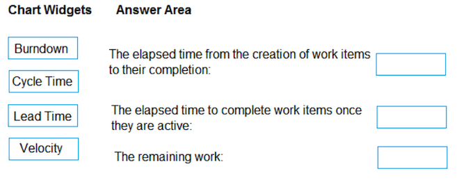

Which chart widgets should you recommend for each metric? To answer, drag the appropriate chart widgets to the correct metrics. Each chart widget may be used once, more than once, or not at all. You may need to drag the split bar between panes or scroll to view content.

NOTE: Each correct selection is worth one point.

-----------

Correct mapping of **Azure DevOps dashboard metrics**:

| Metric                                                               | Chart Widget   |
| -------------------------------------------------------------------- | -------------- |
| The elapsed time from the creation of work items to their completion | **Lead Time**  |
| The elapsed time to complete work items once they are active         | **Cycle Time** |
| The remaining work                                                   | **Burndown**   |

Explanation

* **Lead Time**
  Measures the **total time from work item creation until completion**.

* **Cycle Time**
  Measures **how long work takes once development actually starts** (Active → Done).

* **Burndown Chart**
  Shows **remaining work over time**, typically in sprints.

* <mark>**Velocity** (not used here) measures how many **story points are completed per sprint**, not the metrics asked in the question</mark>.

✅ **Final Answer**

- 1️⃣ Creation → Completion → **Lead Time**
- 2️⃣ Active → Completion → **Cycle Time**
- 3️⃣ Remaining Work → **Burndown**

### Question -2

You plan to create alerts that will be triggered based on the page load performance of a home page. 

You have the Application Insights log query shown in the following exhibit.

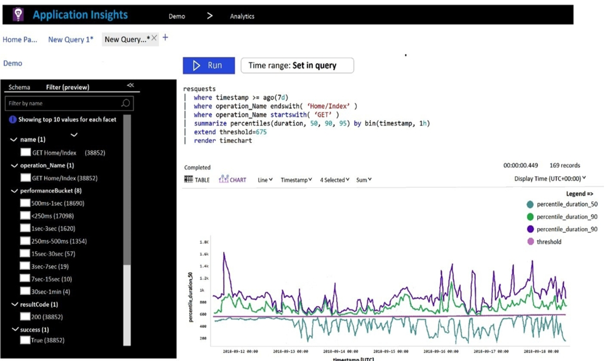

Use the drop-down menus to select the answer choice that completes each statement based on the information presented in the graphic. NOTE: Each correct selection is worth one point.

Hot Area:

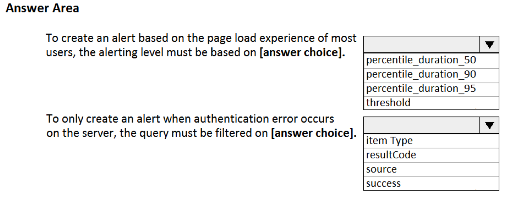

Correct selections

**1️⃣ To create an alert based on the page load experience of most users:**
✅ **percentile_duration_90**

**2️⃣ To only create an alert when an authentication error occurs on the server:**
✅ **resultCode**

Explanation

Page load experience of most users

In Azure Application Insights performance metrics:

* **percentile_duration_50 (P50)** → median (half of users faster/slower)
* **percentile_duration_90 (P90)** → performance experienced by **most users**
* **percentile_duration_95 (P95)** → focuses on worst cases/outliers

To represent **most users’ experience**, monitoring usually uses **P90 latency**.

✔ Therefore: **percentile_duration_90**

Detecting authentication errors

Authentication failures correspond to HTTP status codes like:

* **401 – Unauthorized**
* **403 – Forbidden**

These are captured in the **result code field** of requests.

✔ Therefore the query must filter on **resultCode**.


✅ **Final Answer**

| Requirement                        | Selection                  |
| ---------------------------------- | -------------------------- |
| Page load experience of most users | **percentile_duration_90** |
| Authentication error occurs        | **resultCode**             |


### Question -4

You have an Azure Kubernetes Service (AKS) pod.

You need to configure a probe to perform the following actions:

✑ Confirm that the pod is responding to service requests.

✑ Check the status of the pod four times a minute.

✑ **Initiate a shutdown if the pod is unresponsive**.

How should you complete the YAML configuration file? To answer, select the appropriate options in the answer area. NOTE: Each correct selection is worth one point.

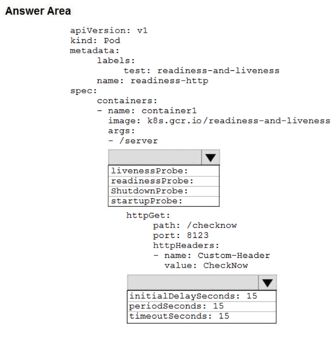

----------

Based on the requirements provided, here is how you should complete the YAML configuration:

Answer Area

**Box 1: `livenessProbe:`**

*   **Reasoning:** The requirement states the probe must **"initiate a shutdown if the pod is unresponsive."** In Kubernetes, a `livenessProbe` is used to determine if a container is still running correctly. If the liveness probe fails, Kubernetes kills the container, and the container is subjected to its restart policy. A `readinessProbe`, by contrast, only stops sending network traffic to the pod but does not restart/shut it down.

**Box 2: `periodSeconds: 15`**

*   **Reasoning:** The requirement is to **"check the status of the pod four times a minute."** There are 60 seconds in a minute. To perform a check 4 times, you must run the check every 15 seconds ($60 \div 4 = 15$). The `periodSeconds` field specifies the frequency of the probe.


**Summary of selections:**

1.  **livenessProbe:**
2.  **periodSeconds: 15**


### Question -9  💩💩💩

Your company is building a new web application.

You plan to collect feedback from pilot users on the features being delivered.

All the pilot users have a corporate computer that has Google Chrome and the Microsoft Test & Feedback extension installed. The pilot users will test the application by using Chrome.

**You need to identify which access levels are required to ensure that developers can request and gather feedback from the pilot users. The solution must use the principle of least privilege**.

Which access levels in Azure DevOps should you identify? To answer, select the appropriate options in the answer area.

NOTE: Each correct selection is worth one point.
  
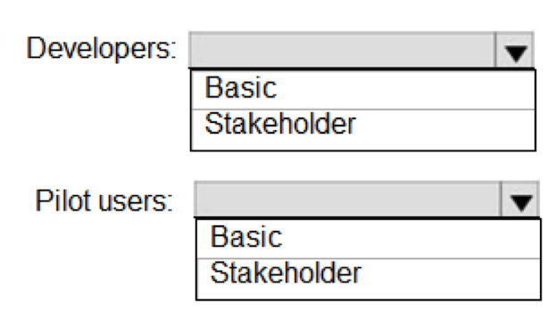

Based on the requirements and the Principle of Least Privilege in Azure DevOps, here are the correct access levels:

-------

Answer Area

**Developers: `Basic`**

*   **Reasoning:** To **request** feedback from users within the Azure DevOps interface, a user must have at least the **Basic** access level.
  * Stakeholders do not have the permissions required to initiate feedback requests or manage the comprehensive test plans associated with gathering feedback.

**Pilot users: `Stakeholder`**

*   **Reasoning:** Users with the **Stakeholder** access level can provide feedback in response to a request using the Microsoft Test & Feedback extension.
  *   Since Stakeholder is a lower-privilege level (and is free for unlimited users), it is the correct choice under the **principle of least privilege** for users who are only testing and providing input rather than developing or managing the project.


### Question -10   💩💩💩

Your company wants to use Azure Application Insights to understand how user behaviors affect an application.

Which Application Insights tool should you use to analyze each behavior? To answer, drag the appropriate tools to the correct behaviors. Each tool may be used once, more than once, or not at all. You may need to drag the split bar between panes or scroll to view content.

NOTE: Each correct selection is worth one point.


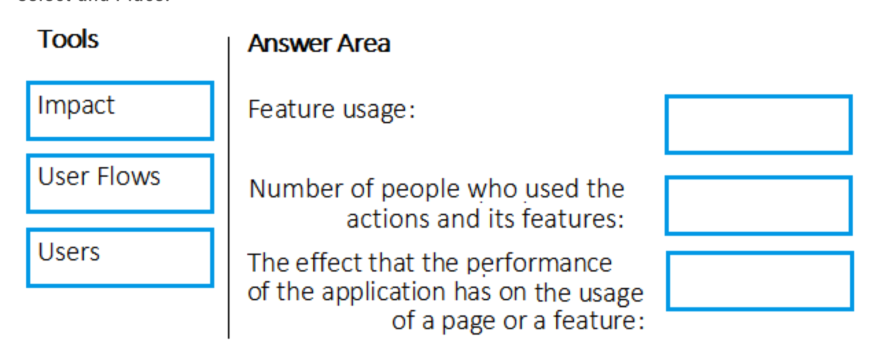

-------

- **Feature usage:** User Flows  
- **Number of people who used the actions and its features:** Users  
- **The effect that the performance of the application has on the usage of a page or a feature:** Impact


To analyze user behavior in Azure Application Insights, you should match the tools as follows:

**Answer Area**

*   **Feature usage:** **User Flows**
    *   **User Flows** visualizes the paths users take through your application. **It helps you understand which features** are used and the sequence in which users interact with different parts of your site.
*   **Number of people who used the actions and its features:** **Users**
    *   The **Users** tool provides data on the count of unique individuals who interact with your application, allowing you to see how many distinct people are using specific actions or features.
*   **The effect that the performance of the application has on the usage of a page or a feature:** **Impact**
    *   The **Impact** tool is specifically designed to analyze how various properties—most notably performance metrics like page load times—affect conversion rates and the frequency of feature usage.


### Question - 13 💩💩💩

Your company is building a mobile app that targets Android and iOS devices. Your team uses Azure DevOps to manage all work items and release cycles. You need to recommend a solution to perform the following tasks:

✑ Collect crash reports for issue analysis.

✑ Distribute beta releases to your testers.

✑ Get user feedback on the functionality of new apps.

What should you include in the recommendation?

A. the Microsoft Test & Feedback extension

B. Microsoft Visual Studio App Center integration

C. Azure Application Insights widgets

D. Jenkins integration

----------


The correct answer is **B. Microsoft Visual Studio App Center integration**.

Explanation:

**Microsoft Visual Studio App Center** is specifically designed for mobile application lifecycles (iOS, Android, Windows, and macOS) and perfectly addresses all three requirements:

*   **Collect crash reports:** App Center's **Diagnostics** service provides real-time crash reports, stack traces, and error logging to help you prioritize and fix issues.
*   **Distribute beta releases:** App Center's **Distribute** service allows you to quickly get your builds onto the devices of testers (Beta distribution) or even deploy directly to the App Store or Google Play.
*   **Get user feedback:** App Center includes analytics and integrated feedback mechanisms to help developers understand how users are interacting with the application.

Why other options are incorrect:

*   **A. Microsoft Test & Feedback extension:** This is primarily used for exploratory testing of **web applications** from within a browser. It is not designed for mobile app crash reporting or distribution.
*   **C. Azure Application Insights widgets:** While Application Insights can monitor apps, Microsoft's official recommendation for mobile-specific scenarios (like distribution and crash reporting for iOS/Android) is App Center.
*   **D. Jenkins integration:** Jenkins is a general-purpose automation server. While it can build the app, it does not provide the specific mobile-hosting services for crash analytics or tester distribution out-of-the-box.


### Question - 14

You have an Azure DevOps project named Project1 and an Azure subscription named Sub1. Sub1 contains an Azure virtual machine scale set named VMSS1.

VMSS1 hosts a web application named WebApp1. WebApp1 uses stateful sessions.

**The WebApp1 installation is managed by using the Custom Script extension. The script resides in an Azure Storage account named sa1.**

You plan to make a minor change to a UI element of WebApp1 and to gather user feedback about the change.

You need to implement limited user testing for the new version of WebApp1 on VMSS1.

Which three actions should you perform? Each correct answer presents part of the solution.

NOTE: Each correct selection is worth one point.

A. Modify the load balancer settings of VMSS1.

B. Redeploy VMSS1.

C. Upload a custom script file to sa1.

D. Modify the Custom Script extension settings of VMSS1.

E. Update the configuration of a virtual machine in VMSS1.

----------

To implement limited user testing for a new version of WebApp1 on VMSS1, you need to deploy the updated UI to a subset of instances and ensure that only a portion of users are routed to them. The custom script extension manages the installation, so you must update the script and apply it to specific VMs.

- **C. Upload a custom script file to sa1.** – The new version requires an updated script stored in the storage account.
- **D. Modify the Custom Script extension settings of VMSS1.** – This points the scale set to the new script, updating the model.
- **E. Update the configuration of a virtual machine in VMSS1.** – After updating the model, manually upgrade one or more instances to apply the new script, creating a test group.

The load balancer will naturally distribute traffic to the updated instances, providing limited exposure for user feedback.

**Selected actions: C, D, E**

### Question #18

You have several Azure virtual machines that run Windows Server 2019.

You need to identify the distinct event IDs of each virtual machine as shown in the following table.


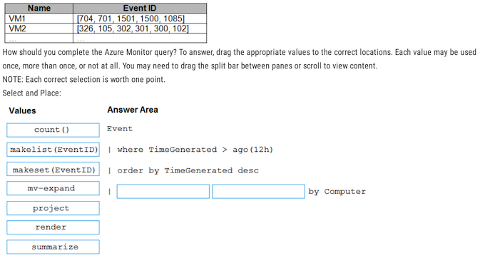

-----

✅ Correct Answer

You need to return **distinct Event IDs per VM**, grouped by computer.

👉 In KQL:

* `summarize` → used for aggregation
* `makeset(EventID)` → returns **distinct values as a list**

✔️ Completed Query

```kusto
Event
| where TimeGenerated > ago(12h)
| order by TimeGenerated desc
| summarize makeset(EventID) by Computer
```

🎯 Fill in the blanks

* First blank: **summarize**
* Second blank: **makeset(EventID)**

💡 Why this works

* `summarize` groups results (**by Computer**)
* `makeset(EventID)` ensures:
  * Only **distinct Event IDs**
  * Returned as a **list/array** (matches the table format in question)

❌ Why not others

* `make_list(EventID)` → includes duplicates ❌
* `count()` → gives totals, not IDs ❌
* `mv-expand` → expands arrays, not needed ❌

🟢 Final Answer:

**summarize + makeset(EventID)**


### Question -19

You have an Azure web app named Webapp1.

**You need to use an Azure Monitor query to create a report that details the top 10 pages of Webapp1 that failed.** How should you complete the query? To answer, select the appropriate options in the answer area.

NOTE: Each correct selection is worth one point

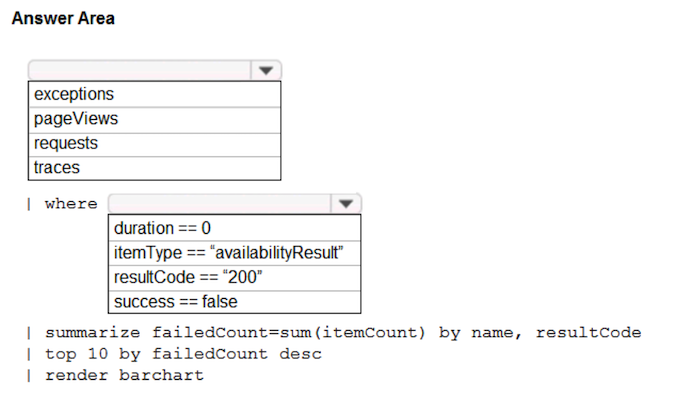

----------

Based on the requirements to identify the top 10 failed pages of a web application, here is how you should complete the Azure Monitor query:

**Answer Area**

**Box 1 (Source Table): `requests`**

*   **Reasoning:** In Application Insights, server-side requests (including the processing of web pages) are stored in the **`requests`** table. This table includes columns for the page/operation `name` and the `resultCode`, both of which are used in the subsequent `summarize` line of the query.

**Box 2 (Filter Condition): `success == false`**

*   **Reasoning:** The goal is to report on pages that **failed**. The most efficient and standard way to filter for failures in Application Insights is to use the **`success`** boolean field. When `success == false`,
*   It indicates the request resulted in an error (typically a 4xx or 5xx HTTP status code).


**The complete query would look like this:**
```kusto
requests
| where success == false
| summarize failedCount=sum(itemCount) by name, resultCode
| top 10 by failedCount desc
| render barchart
```


### Question -21

You have a project in Azure DevOps named Contoso App that contains pipelines in Azure Pipelines for GitHub repositories. 

**You need to ensure that developers receive Microsoft Teams notifications when there are failures in a pipeline of Contoso App**. 

What should you run in Teams? To answer, select the appropriate options in the answer area.

NOTE: Each correct selection is worth one point.


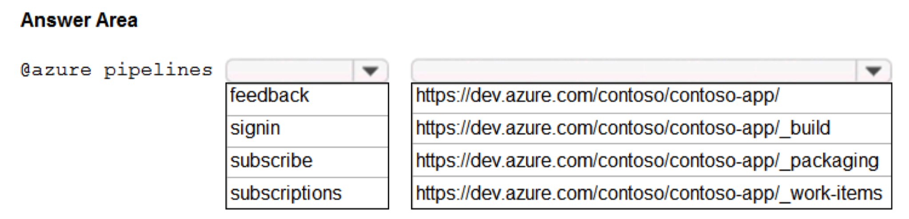


To ensure that developers receive Microsoft Teams notifications for failures in the Contoso App project, you should use the following command syntax in the Teams channel:

**Answer Area**

**Box 1: `subscribe`**

*   **Reasoning:** The `subscribe` command is the specific action used to create a new notification subscription. The `subscriptions` command (plural) is used to list or manage existing ones, while `signin` is only for authentication.

**Box 2: `https://dev.azure.com/contoso/contoso-app/`**

*   **Reasoning:** To subscribe to all pipelines within a project, you provide the **base project URL**. While the bot can also accept URLs for specific pipelines, the project URL is the standard way to initiate the configuration for the entire "Contoso App" project. The other URLs provided (`_build`, `_packaging`, `_work-items`) point to specific sub-features and are not the standard project identifiers for the subscription command.


**The complete command entered would be:**

<mark>`@azure pipelines subscribe https://dev.azure.com/contoso/contoso-app/`</mark>


### Question -23

You have a Microsoft ASP.NET Core web app in Azure that is accessed worldwide. 

**You need to run a URL ping test once every five minutes and create an alert when the web app is unavailable from specific Azure regions**. 

The solution must minimize development time. What should you do?

* A. Create an Azure Monitor Availability metric and alert.
* B. Create an Azure Application Insights availability test and alert.
* C. Write an Azure function and deploy the function to the specific regions.
* D. Create an Azure Service Health alert for the specific regions.

---------

**Correct Answer: B. Create an Azure Application Insights availability test and alert.**

The correct answer is:

**B. Create an Azure Application Insights availability test and alert.** ✅

Explanation:

To run a **URL ping test every five minutes** and generate **alerts when the app is unavailable from specific Azure regions**, with **minimal development time**, the best solution is to use **Azure Application Insights availability tests**.

**Application Insights Availability Tests** provide:

* Built-in **URL ping tests**
* Configurable **test frequency** (e.g., every 5 minutes)
* Ability to select **specific Azure regions**
* Native **alerting integration**
* **No custom code** required → minimal development effort


Why the other options are incorrect:

* **A. Azure Monitor Availability metric and alert** ❌
  * Azure Monitor alone doesn’t provide built-in multi-region URL ping testing.

* **C. Write an Azure Function** ❌
  * Requires custom development, deployment, and maintenance → high overhead.

* **D. Azure Service Health alert** ❌
  * Monitors Azure service outages, **not your specific web app URL availability**.


**Best-practice solution flow:**

**Application Insights → Availability Test → Multi-region probes → Alert rule**


✅ **Final answer: B. Create an Azure Application Insights availability test and alert.**


There are three types of Application Insights availability tests:

* 1) URL ping test a simple test that you can create in the Azure portal. 
* 2) Multi-step webtest. 
* 3) Custom Track Availability Test.

### Question #23

You are integrating Azure Pipelines and Microsoft Teams.

You install the Azure Pipelines app in Microsoft Teams.

You have an Azure DevOps organization named Contoso that contains a project name Project1. You subscribe to Project1 in Microsoft Teams.

**You need to ensure that you only receive events about failed builds in Microsoft Teams.**

What should you do first?

A. From Microsoft Teams, run @azure pipelines subscribe https://dev.azure.com/Contoso/Project1.

B. From Azure Pipelines, add a Publish Build Artifacts task to Project1.

C. From Microsoft Teams, run @azure pipelines subscriptions.

D. From Azure Pipelines, enable continuous integration for Project1

-------


The correct answer is **C. From Microsoft Teams, run @azure pipelines subscriptions.**

Explanation:

When you first subscribe to an Azure DevOps project in Microsoft Teams using the `@azure pipelines subscribe [URL]` command, the app creates several **default subscriptions** (such as "Build completed," which includes both successes and failures).

To meet the requirement of receiving **only** events about **failed builds**, you need to manage and filter these subscriptions:

1.  **View Current Subscriptions:** Running `@azure pipelines subscriptions` lists all the active subscriptions for that specific Teams channel.
2.  **Modify/Add:** From the resulting list, you can see the default "Build completed" subscription. You can then click to **Add** a new subscription specifically for **"Build failed"** and **Remove** the generic "Build completed" one that includes successful builds.

Why other options are incorrect:

*   **A. @azure pipelines subscribe...:** The prompt states you have already subscribed to Project1.
  * <mark>Running the base subscribe command again is redundant and does not allow you to filter for failures only.</mark>
*   **B. Add a Publish Build Artifacts task:** This is a task within the build pipeline to save files. it has no impact on how notifications are sent to Microsoft Teams.
*   **D. Enable continuous integration:** CI ensures that builds start automatically when code is pushed. While this triggers builds, **it does not control the logic of the notification system in Teams**.


### Question -24

You have an Azure DevOps organization named Contoso.

**You need to receive Microsoft Teams notifications when work items are updated**. What should you do?

A. From Azure DevOps, configure a service hook subscription

B. From Microsoft Teams, configure a connector

C. From the Microsoft Teams admin center, configure external access

D. From Microsoft Teams, add a channel

E. From Azure DevOps, install an extension


--------

The correct answer is **A. From Azure DevOps, configure a service hook subscription.**

Explanation:

**Service Hooks** are the standard mechanism used by Azure DevOps to send notifications to external services (like Microsoft Teams, Slack, or Trello) when specific events occur.

1.  **The Process:** To set up these notifications, you go to **Project Settings** in Azure DevOps, select **Service Hooks**, and create a new subscription.
2.  **The Trigger:** You select **Microsoft Teams** as the service and choose the specific trigger: **"Work item updated."**
3.  **The Result:** Whenever a user modifies a work item, Azure DevOps sends a JSON payload to the configured Teams webhook, which then displays the notification in the selected channel.

Why other options are incorrect:

*   **B. Configure a connector:** While Teams "Connectors" were a valid method in the past, Microsoft has deprecated legacy connectors in favor of the **Azure Boards App** (which manages service hooks automatically) or direct **Service Hook** configuration.
*   **C. Configure external access:** This is an administrative setting in the Teams Admin Center that controls whether users can chat with people in other companies; it has nothing to do with automation or bots.
*   **D. Add a channel:** This provides a destination for the notifications, but it does not configure the logic to actually send them from Azure DevOps.
*   **E. Install an extension:** Most Azure DevOps-to-Teams integrations require installing an **App in Teams**, not an **Extension in Azure DevOps**. The core functionality for the notification itself is built directly into the Service Hooks feature.


### Question -24

You have a multi-tier application. The front end of the application is hosted in Azure App Service.

You need to **identify the average load times** of the application pages. What should you use?


* A. Azure Application Insights
* B. the activity log of the App Service
* C. the diagnostics logs of the App Service
* D. Azure Advisor

---------

**Correct Answer: A. Azure Application Insights**

The correct answer is:

**A. Azure Application Insights** ✅

Explanation:

To identify **average page load times** and performance metrics for a web application hosted in **Azure App Service**, you should use **Azure Application Insights**.

Application Insights provides:

* **Page load time metrics**
* **End-user performance monitoring**
* Request/response times
* Dependency tracking
* Application performance analytics
* Real-time telemetry and dashboards


Why the others are incorrect:

* **B. Activity log of the App Service** ❌ → Tracks management operations (start/stop, config changes), not performance metrics.
* **C. Diagnostics logs of the App Service** ❌ → Logs requests/errors, not user-experience performance analytics.
* **D. Azure Advisor** ❌ → Provides recommendations, not performance telemetry.


✅ **Final answer: A. Azure Application Insights**


### Question #25

You create an alert rule in Azure Monitor as shown in the following exhibit.

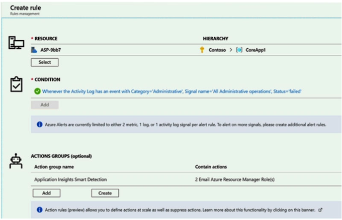

Which action will trigger an alert?

A. a failed attempt to delete the ASP-9bb7 resource

B. a change to a role assignment for the ASP-9bb7 resource

C. a successful attempt to delete the ASP-9bb7 resource

D. a failed attempt to scale up the ASP-9bb7 resource

-------

Based on the exhibit of the Azure Monitor alert rule, 

the correct answer is **A. a failed attempt to delete the ASP-9bb7 resource.**

**Explanation:**

To determine which action triggers the alert, we look at the **Condition** defined in the image:

1.  **Category:** `Administrative`
    *   In Azure, the **Administrative** category in the Activity Log records all *create, update, delete,* and *action* operations performed on a resource through Azure Resource Manager (ARM).
2.  **Signal name:** `All Administrative operations`
    *   <mark>This means the alert is not restricted to a single type of action (like just "Delete"); it covers any task classified as an administrative operation.</mark>
3.  **Status:** `failed`
    *   The alert will *only* trigger if the operation does not succeed.

**Evaluating the Options:**

*   **A is correct:** Attempting to **delete** a resource is a standard administrative operation. Because the attempt **failed**, it matches all three criteria of the alert rule.
*   **B is incorrect:** Changing a role assignment is typically categorized under the `Security` or `Administrative` category at a higher scope, but the alert rule specifically filters for **failed** status. A "change" (implying it happened) would be a "Success."
*   **C is incorrect:** The alert rule is specifically set to trigger on `Status == 'failed'`. A **successful** attempt will not trigger this specific rule.
*   **D is incorrect (in the context of exam logic):** While scaling up an App Service Plan is technically an administrative "update" operation, **Delete** is the most definitive and commonly tested example of an "Administrative" lifecycle event in the Activity Log. In most standardized Azure examinations (like AZ-400 or AZ-104), "Delete" is the intended answer for the "Administrative" category.

### Question -25


Your company uses ServiceNow for incident management. You develop an application that runs on Azure.

The company needs to generate a ticket in ServiceNow when the application fails to authenticate.

Which Azure Log Analytics solution should you use?

* A. Application Insights Connector
* B. Automation & Control
* C. IT Service Management Connector (ITSM)
* D. Insight & Analytics

--------

Correct Answer: **C. IT Service Management Connector (ITSM)**

The correct answer is:

**C. IT Service Management Connector (ITSM)** ✅


Explanation:

To automatically **create a ticket in ServiceNow** when an application running on Azure fails to authenticate, you should use the **IT Service Management Connector (ITSM)** in Azure Log Analytics / Azure Monitor.

**IT Service Management Connector**:

* Integrates Azure Monitor and Log Analytics with **ServiceNow**
* Automatically creates **incidents, problems, and change requests**
* Supports alert-based ticket creation
* Designed specifically for **ITSM workflows**


Why the others are incorrect:

* **A. Application Insights Connector** ❌ → Integrates telemetry, not ITSM ticketing.
* **B. Automation & Control** ❌ → Focuses on automation/config management, not ServiceNow integration.
* **D. Insight & Analytics** ❌ → Analytics/visualization, not incident ticket creation.


Flow:

<mark>**Azure Logs / Alerts → Azure Monitor → ITSM Connector → ServiceNow Ticket**</mark>


✅ **Final answer: C. IT Service Management Connector (ITSM)**


### Question -26

You use **Azure SQL Database Intelligent Insights and Azure Application Insights for monitoring**.

You need to write ad-hoc queries against the monitoring data. Which query language should you use?


* A. Kusto Query Language (KQL)
* B. PL/pgSQL
* C. PL/SQL
* D. Transact-SQL


--------

**Correct Answer: A. Kusto Query Language (KQL)**

The correct answer is:

**A. Kusto Query Language (KQL)** ✅


Explanation:

Both **Azure Application Insights** and **Azure SQL Database Intelligent Insights** store and analyze telemetry data using **Azure Monitor / Log Analytics**, which uses:

👉 **Kusto Query Language (KQL)** for **ad-hoc querying and analytics**.

KQL is designed for:

* Log and telemetry analysis
* Time-series data
* Monitoring and diagnostics
* Security and performance analytics

Why the others are incorrect:

* **B. PL/pgSQL** ❌ → PostgreSQL procedural language
* **C. PL/SQL** ❌ → Oracle database language
* **D. Transact-SQL** ❌ → SQL Server query language (used for relational data, not Azure Monitor logs)


✅ **Final answer: A. Kusto Query Language (KQL)**


### Question -27

Your company creates a web application. You need to recommend a solution that **automatically sends to Microsoft Teams a daily summary of the exceptions that occur in the application**. 

Which two Azure services should you recommend?

Each correct answer presents part of the solution.

* A. Azure Logic Apps
* B. Azure Pipelines
* C. Microsoft Visual Studio App Center
* D. Azure DevOps Project
* E. Azure Application Insights


------

Correct Answer: **AE (Azure Logic Apps and Azure Application Insights)**

A: You can programmatically query Application Insights data to generate custom reports on a schedule. The following options can help you get started quickly: Automate reports with Microsoft Flow, Automate reports with Logic Apps

E: Exceptions in your live web app are reported by Application Insights.

The correct answers are:

- **A. Azure Logic Apps**
- **E. Azure Application Insights** ✅


Explanation:

To **automatically send a daily summary of application exceptions to Microsoft Teams**, you need:

✅ **E. Azure Application Insights**

Use **Azure Application Insights** to:

* Collect application telemetry
* Track **exceptions, failures, and errors**
* Store monitoring data
* Query exceptions using KQL

✅ **A. Azure Logic Apps**

Use **Azure Logic Apps** to:

* Run on a **daily schedule**
* Query Application Insights
* Format the exception summary
* Send the report to **Microsoft Teams** via a connector


Why the others are incorrect:

* **B. Azure Pipelines** ❌ → CI/CD, not monitoring or notifications
* **C. Visual Studio App Center** ❌ → Mobile/dev analytics, not Azure production telemetry automation
* **D. Azure DevOps Project** ❌ → Project scaffolding, not monitoring automation


Solution architecture:

<mark>**Application → Application Insights → Logic App (daily trigger) → Microsoft Teams message**</mark>*


✅ **Final answer: A and E**


### Question -28

You are monitoring the health and performance of an Azure web app by using Azure Application Insights.

You need to ensure that an alert is sent when **the web app has a sudden rise in performance issues and failures**.

What should you use?


* A. Custom events
* B. Application Insights Profiler
* C. Usage analysis
* D. Smart Detection
* E. Continuous export

The correct answer is:

---------

**D. Smart Detection** ✅


Explanation:

To automatically send an alert when there is a **sudden rise in performance issues and failures** in an Azure web app monitored by Application Insights, you should use **Azure Application Insights Smart Detection**.

**Smart Detection**:

* Uses built-in **machine learning**
* Detects **anomalies** such as sudden spikes in:
  * Failures
  * Exceptions
  * Response times
  * Performance degradation
* Automatically generates **alerts**
* Requires **no custom configuration**
* Minimizes administrative overhead


Why the others are incorrect:

* **A. Custom events** ❌ → Used for custom telemetry, not anomaly detection
* **B. Application Insights Profiler** ❌ → Performance profiling, not alerting
* **C. Usage analysis** ❌ → User behavior analytics, not failure detection
* **E. Continuous export** ❌ → Data export mechanism, not alerting


✅ **Final answer: D. Smart Detection**


Correct Answer: D. Smart Detection

Smart Detection automatically warns you of potential performance problems and failure anomalies in your web application. 

It performs proactive analysis of the telemetry that your app sends to Application Insights. If there is a sudden rise in failure rates, or abnormal patterns in client or server performance, you get an alert.


### Question #27

You use Azure DevOps to manage the build and deployment of an app named App1.

You have a release pipeline that deploys a virtual machine named VM1.

You plan to monitor the release pipeline by using Azure Monitor.

You need to create an alert to monitor the performance of VM1. The alert must be triggered when the average CPU usage exceeds 70 percent for five minutes.

The alert must calculate the average once every minute.

How should you configure the alert rule? To answer, select the appropriate options in the answer area.

NOTE: Each correct selection is worth one point.

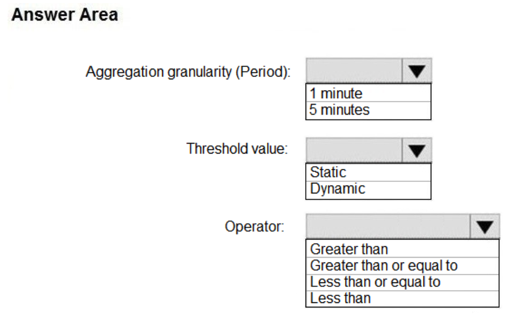

-------------

Based on the requirements described for the Azure Monitor alert rule, here is the correct configuration:

**Answer Area**

**Aggregation granularity (Period): `5 minutes`**

* **Reasoning:** The requirement states the alert must be triggered when the average CPU usage exceeds the threshold **"for five minutes."** In Azure Monitor, the "Aggregation granularity (Period)" defines the time window over which the data is averaged. Therefore, to evaluate a 5-minute average, the period must be set to 5 minutes. 
* *Note:* The requirement to "calculate the average once every minute" refers to the **Frequency of evaluation**, which is a separate setting in Azure Monitor not shown in the dropdowns.

**Threshold value: `Static`**

* <mark>**Reasoning:** A **Static** threshold is used when you have a specific, fixed number as a target (in this case, **70 percent**).</mark>
* **Dynamic** thresholds are used for anomaly detection where the system learns the "normal" behavior of the metric over time.

**Operator: `Greater than`**

* **<mark>Reasoning:** The requirement uses the word **"exceeds."** In mathematical terms, to exceed a value means to be strictly **Greater than** that value.</mark>**


**Summary of selections:**

1.  **5 minutes**
2.  **Static**
3.  **Greater than**

### Question -29 💩💩💩


You have a private GitHub repository. You need to display the commit status of the repository on Azure Boards.

What should you do first?

* A. Configure multi-factor authentication (MFA) for your GitHub account.
* B. Add the Azure Pipelines app to the GitHub repository.
* C. Add the Azure Boards app to the repository.
* D. Create a GitHub action in GitHub.


-------

The correct answer is:

**C. Add the Azure Boards app to the repository.** ✅


Explanation:

To display **GitHub commit status and link commits/work items** in **Azure Boards**, the first required step is to integrate the repository with Azure Boards by installing the **Azure Boards app** in GitHub.

Specifically, you must add the:

**Azure Boards app** to your **GitHub repository**.

This enables:

* Linking commits and PRs to work items
* Displaying commit status in Azure Boards
* **Traceability between code and project management**


Why the others are incorrect:

* **A. Configure MFA** ❌ → Security best practice, but unrelated to Azure Boards integration.
* **B. Add the Azure Pipelines app** ❌ → Used for CI/CD, not work item/commit tracking in Azure Boards.
* **D. Create a GitHub Action** ❌ → Automation workflow, not required for Azure Boards commit visibility.


Correct integration order:

1. **Add Azure Boards app to GitHub repo** ✅
2. (Optional next steps) Configure pipelines, policies, etc.


✅ **Final answer: C. Add the Azure Boards app to the repository.**


To connect Azure Boards to GitHub.com,

connect and configure from Azure Boards. Or, alternatively, install and configure the Azure Boards app from GitHub.

Both methods have been streamlined and support authenticating and operating via the app rather than an individual.

### Question -30 💩💩

You have a web app hosted on Azure App Service. The web app stores data in an Azure SQL database. 

You need to generate an alert when there are 10,000 simultaneous connections to the database. 


**The solution must minimize development effort**. Which option should you select in the Diagnostics settings of the database?


* A. Send to Log Analytics
* B. Stream to an event hub
* C. Archive to a storage account

The correct answer is:

**A. Send to Log Analytics** ✅


Explanation:

To generate an **alert when there are 10,000 simultaneous connections** to an **Azure SQL Database**, with **minimal development effort**, you should send diagnostics data to **Log Analytics**.

**Azure Log Analytics** enables you to:

* Collect **diagnostic and performance metrics** from Azure SQL Database
* Run **Kusto Query Language (KQL)** queries on connection metrics
* Create **Azure Monitor alert rules** directly from queries
* Trigger alerts automatically when thresholds (e.g., 10,000 connections) are reached

This is the **native, low-code Azure monitoring + alerting path**.


Why the others are incorrect:

* **B. Stream to an event hub** ❌ → For real-time streaming/integration, requires custom processing and code.
* **C. Archive to a storage account** ❌ → For long-term storage/compliance, not alerting or real-time monitoring.

Minimal-effort architecture:

<mark>**Azure SQL Diagnostics → Log Analytics → Azure Monitor Alert Rule**</mark>


✅ **Final answer: A. Send to Log Analytics**


Correct Answer: A. Send to Log Analytics


### Question #29

You have a project in Azure DevOps that contains a Continuous Integration/Continuous Deployment (CI/CD) pipeline.

You need to enable detailed logging by defining a pipeline variable.

How should you configure the variable? To answer, select the appropriate options in the answer area.

NOTE: Each correct selection is worth one point.

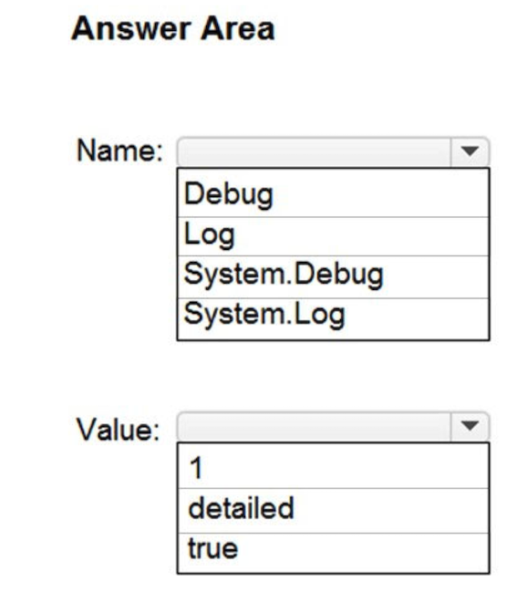

----

To enable detailed logging (verbose output) in an Azure DevOps CI/CD pipeline, you should configure the following pipeline variable:

**Answer Area**

**Name: `System.Debug`**

*   **Reasoning:** `System.Debug` is a pre-defined system variable in Azure Pipelines specifically designed to control the logging level of the agent and individual tasks. When this is set, the agent provides significantly more detail in the logs, which is essential for troubleshooting.

**Value: `true`**

*   **Reasoning:** The variable acts as a toggle. Setting it to **`true`** enables the verbose logging mode. While some systems accept `1`, `true` is the standard and documented value for Azure Pipelines.


**Summary of selections:**

1.  **Name:** `System.Debug`
2.  **Value:** `true`

### Question #30  💩💩💩

You build an iOS app.

You receive crash reports from Crashlytics. You need to capture the following data: 

✑ Crash-free users 

✑ Custom events 

✑ Breadcrumbs 


What should you do?


A. Configure the xcworkspace file in the project

B. Add the GoogleAnalytics pod to the app.

C. Configure the Crashlytics pod in the app.

D. Import the Firebase module to UIApplicationDelegate.


-----------

✅ **Correct answer:**


**D. Import the Firebase module to UIApplicationDelegate.**

Explanation

You are already receiving crash reports from **Firebase Crashlytics**.
To collect additional analytics data such as:

* **Crash-free users**
* **Custom events**
* **Breadcrumbs (event logs before a crash)**

you must integrate **Firebase Analytics** with the iOS application.

This is done by importing Firebase and initializing it in **`UIApplicationDelegate`**:

```swift
import Firebase

func application(_ application: UIApplication,
  didFinishLaunchingWithOptions launchOptions: [UIApplication.LaunchOptionsKey: Any]?) -> Bool {

    FirebaseApp.configure()
    return true
}
```

This enables:

* Crashlytics to capture **breadcrumbs**
* Firebase Analytics to track **custom events**
* calculation of **crash-free users**

Why the other options are incorrect

| Option                                | Reason                                                                                                                      |
| ------------------------------------- | --------------------------------------------------------------------------------------------------------------------------- |
| **A. Configure the xcworkspace file** | Workspace configuration does not enable analytics or crash metrics.                                                         |
| **B. Add GoogleAnalytics pod**        | Crashlytics now relies on **Firebase Analytics**, not the deprecated Google Analytics SDK.                                  |
| **C. Configure Crashlytics pod**      | Crashlytics alone only captures crashes; it does not provide full analytics metrics like crash-free users or custom events. |


✅ **Final Answer:** **D**


### Question-31  💩


You have an Azure virtual machine that is monitored by using Azure Monitor, 

**The virtual machine has the Azure Log Analytics agent installed**, 

You plan to **deploy the Service Map solution from the Azure Marketplace** 


What should you deploy to the virtual machine to support the Service Map solution?

* A. the Dependency agent
* B. the Telegraf agent
* C. the Windows Azure diagnostics extension (WAD)
* D. the Azure monitor agent

------


**Correct Answer: A. the Dependency agent**

The correct answer is:

**A. the Dependency agent** ✅


Explanation:

To support the **Service Map** solution from the Azure Marketplace, in addition to the Log Analytics agent, you must deploy the **Dependency agent** on the virtual machine.

**Azure Monitor Service Map** requires:

* **Log Analytics agent** → collects logs and performance data
* **Dependency agent** → collects **process and network dependency data** (connections between services, ports, and processes)

Together, these enable Service Map to visualize:

* Application dependencies
* Inter-process communication
* Network connections
* Service relationships across VMs


Why the others are incorrect:

* **B. Telegraf agent** ❌ → Used mainly with InfluxDB/monitoring stacks, not Service Map
* **C. Windows Azure Diagnostics extension (WAD)** ❌ → Legacy diagnostics, not Service Map
* **D. Azure Monitor agent** ❌ → New unified agent, but **Service Map specifically requires the Dependency agent**


Requirement summary:

**VM must have:**

* Log Analytics agent ✅ (already installed)
* **Dependency agent** ✅ (missing piece)


✅ **Final answer: A. the Dependency agent**


Use the Dependency agent if you need to use the Map feature VM insights or the Service Map solution.
Note: Consider the following when using the Dependency agent:

The Dependency agent requires the Log Analytics agent to be installed on the same machine. On Linux computers, the Log Analytics agent must be installed before the Azure Diagnostic Extension. On both the Windows and Linux versions of the Dependency Agent, data collection is done using a user-space service and a kernel driver.

### Question-32  💩💩💩

You have multiple teams that work on multiple projects in Azure DevOps. 

**You need to plan and manage the consumers and producers for each project**. The solution must provide an overview of all the projects. What should you do?

* A. Add a Predecessor or Successor link to the feature or user story for the items of each project.
* B. Add a Parent or Child link to the feature or user story for the items of each project.
* C. Install the Dependency Tracker extension and create dependencies for each project.
* D. Create a custom query to show the consumers and producers and add a widget to a dashboard


---

Correct Answer: C


The correct answer is:

**C. Install the Dependency Tracker extension and create dependencies for each project.** ✅


**Explanation:**

You need to **plan and manage consumer/producer relationships across multiple teams and multiple projects** in **Azure DevOps**, with a solution that provides a **single overview of all projects**.

The **Dependency Tracker extension** is purpose-built for this scenario:

* Visualizes **cross-team and cross-project dependencies**
* Models **consumer/producer relationships**
* Provides **roadmap and timeline views**
* Centralized dependency management
* Portfolio-level overview


**Why the other options are incorrect:**

* **A. Predecessor/Successor links** ❌ → Simple relationships, no global visibility.
* **B. Parent/Child links** ❌ → Hierarchy modeling, not dependency planning.
* **D. Custom query + dashboard** ❌ → Limited visibility, not dependency management tooling.


Conclusion:

Only the **Dependency Tracker extension** meets all requirements:

* Multi-team
* Multi-project
* Consumer/producer planning
* Centralized overview


✅ **Final answer: C. Install the Dependency Tracker extension and create dependencies for each project.**


### Question #32 💩💩💩


You have a GitHub repository that contains the source code for an app named App1.

You need to create process documentation for App1. The solution must include a diagram that displays the relationships between the phases of App1 as shown in the following exhibit.

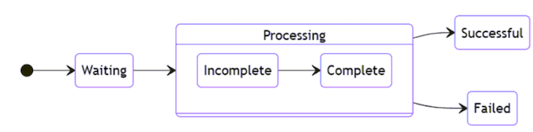

How should you complete the markdown code? To answer, drag the appropriate values to the correct targets. Each value may be used once, more than once, or not at all. You may need to drag the split bar between panes or scroll to view content.

NOTE: Each correct selection is worth one point

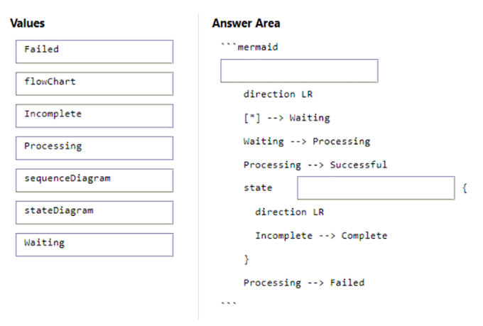

-----------------

To complete the Mermaid markdown code for the state diagram shown in the exhibit, you should use the following values:

**Answer Area**

**Box 1: `stateDiagram`**

*   **Reasoning:** The exhibit displays a flowchart of states (Waiting, Processing, etc.) and transitions. In Mermaid syntax, this specific type of diagram is initiated with the keyword **`stateDiagram`** (or `stateDiagram-v2`). Keywords like `flowchart` or `sequenceDiagram` would produce different visual styles.

**Box 2: `Processing`**

*   **Reasoning:** The diagram shows a "composite state" (a state that contains other states). The outer container is labeled **"Processing"**, and it contains "Incomplete" and "Complete". In Mermaid, the syntax to define a composite state is `state [Name] { ... }`. Therefore, the word **`Processing`** belongs in the second box to define the container.

***

**The complete Mermaid code would look like this:**

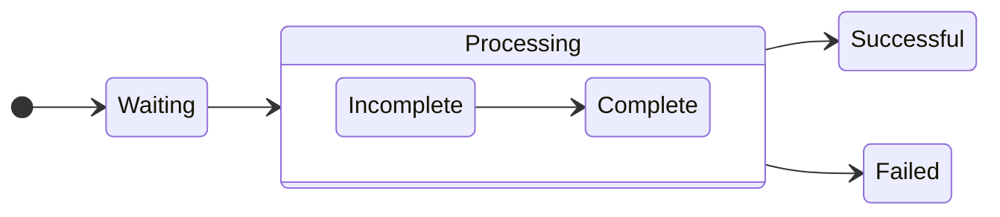
```mermaid
stateDiagram
    direction LR
    [*] --> Waiting
    Waiting --> Processing
    Processing --> Successful
    state Processing {
        direction LR
        Incomplete --> Complete
    }
    Processing --> Failed
```

### Question-33 💩💩💩

You have an Azure web app named webapp1 that uses the .NET Core runtime stack. You have an Azure Application Insights resource named AppInsights1 that collects telemetry data generated by webapp1.

You plan to deploy webapp1 by using an Azure DevOps pipeline.

<mark>You need to modify the sampling rate of the telemetry data processed by AppInsights1 **without having to redeploy webapp1 after each modification**.</mark>

What should you do? To answer, select the appropriate options in the answer area.

NOTE: Each correct selection is worth one point.


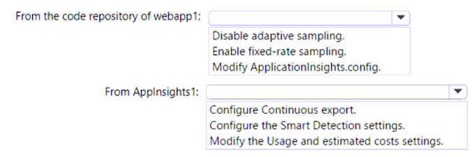


-------------

✅ The goal is to **change the telemetry sampling rate without redeploying the app**. Therefore, the sampling must be controlled from **Azure Application Insights** instead of only inside the app code.


Correct selections

**From the code repository of webapp1:**

✔ **Disable adaptive sampling**

**From AppInsights1:**

✔ **Modify the Usage and estimated costs settings**


Explanation

1️⃣ Disable adaptive sampling in the app

Adaptive sampling is configured in the application SDK and dynamically adjusts the telemetry volume.

If adaptive sampling remains enabled, it will override changes made in Application Insights.

So in the application configuration (for example in **ApplicationInsights.config** or startup configuration for **.NET Core** apps), you must:

➡ **Disable adaptive sampling**

This allows sampling to be controlled externally.

2️⃣ Configure sampling in Application Insights

In **Application Insights → Usage and estimated costs**, you can configure **data sampling / daily cap**.

This lets you:

* Adjust the telemetry volume
* Change sampling without redeploying the application

Why the other options are incorrect

| Option                                | Reason                                                             |
| ------------------------------------- | ------------------------------------------------------------------ |
| **Enable fixed-rate sampling**        | Still requires changing application configuration and redeploying. |
| **Modify ApplicationInsights.config** | Changing this requires redeployment.                               |
| **Configure Continuous export**       | Used to export telemetry to storage/Event Hub, not sampling.       |
| **Configure Smart Detection**         | Used for anomaly detection alerts.                                 |

✅ **Final Answer**

| Location                            | Action                                            |
| ----------------------------------- | ------------------------------------------------- |
| From the code repository of webapp1 | **Disable adaptive sampling**                     |
| From AppInsights1                   | **Modify the Usage and estimated costs settings** |


### Question-33 

Your company has multiple microservices-based apps that use the following tracing libraries:

Open Telemetry | OpenCensus | OpenTracing | Honeycomb | Jaeger

The company purchases an Azure subscription and implements Application Insights in Azure Monitor.

**You plan to centralize distributed tracing for the apps**. 

**You need to identify which libraries can integrate directly with Application Insights.**

Which two libraries should you identify? Each correct answer presents a complete solution.

* A. Honeycomb
* B. Open Tracing
* C. Jaeger
* D. Open Telemtry
* E. OpenCensus


--------------

The correct answers are:

**D. OpenTelemetry**

**E. OpenCensus** ✅

Explanation:

To **centralize distributed tracing** in **Azure Monitor / Application Insights**, you need libraries that **can export telemetry directly to Application Insights**.

* **OpenTelemetry**
  * Industry-standard for distributed tracing and metrics
  * Provides **exporters** for Application Insights
  * Actively supported in Azure Monitor

* **OpenCensus**
  * Predecessor to OpenTelemetry
  * Has **native support for Application Insights**


Why the others are incorrect:

* **A. Honeycomb** ❌ → Proprietary tracing system, does **not directly integrate** with Application Insights
* **B. OpenTracing** ❌ → Specification only, requires an implementation (like OpenTelemetry)
* **C. Jaeger** ❌ → Open-source tracing backend, **cannot export directly** to Application Insights

Summary Table:

| Library       | Direct Integration with Application Insights? |
| --- | --- |
| OpenTelemetry | ✅                                             |
| OpenCensus    | ✅                                             |
| OpenTracing   | ❌                                             |
| Jaeger        | ❌                                             |
| Honeycomb     | ❌                                             |


**✅ **Final answer: D. OpenTelemetry and E. OpenCensus****


### Question-34 💩💩💩

You have an Azure web app named webapp1 that uses the NET Core runtime stack. 

**You have an Azure Application Insights resource named AppInsights1**. 

Webapp1 sends telemetry data to Applnsights1. 

**You need to ensure that webapp1 sends the telemetry data at a fixed sampling rate.**

What should you do?


* A. From the code repository of webapp1, modify the Applicationinsights.config file.
* B. From the code repository of webapp1, modify the Startup.cs file.
* C. From Applnsights1, modify the Usage and estimated costs settings.
* D. From Appinsights1, configure the Continuous export settings.

--------------

**Correct Answer: B**

The correct answer is **B. From the code repository of webapp1, modify the Startup.cs file.**

Explanation:

For **.NET Core** applications, Application Insights configuration is handled primarily through code rather than external configuration files like `ApplicationInsights.config` (which is used for classic ASP.NET Framework apps).

1.  **Adaptive vs. Fixed Sampling:** By default, .NET Core apps use **Adaptive Sampling**, which automatically adjusts the volume of telemetry sent to stay within quota limits.
2.  **Configuring Fixed Sampling:** To use a fixed sampling rate in .NET Core, you must explicitly disable the default adaptive sampling and configure the sampling telemetry processor in the `ConfigureServices` method of the **Startup.cs** file (or `Program.cs` in newer versions of .NET).

**Example of the code change required in Startup.cs:**
```csharp
public void ConfigureServices(IServiceCollection services)
{
    // Disable Adaptive Sampling
    var options = new ApplicationInsightsServiceOptions();
    options.EnableAdaptiveSampling = false;
    services.AddApplicationInsightsTelemetry(options);

    // Set Fixed Rate Sampling (e.g., 50%)
    services.AddApplicationInsightsTelemetryProcessor<SamplingTelemetryProcessor>(next => 
        new SamplingTelemetryProcessor(next) { SamplingPercentage = 50 });
}
```

Why other options are incorrect:

*   **A. Applicationinsights.config:** This file is not used by .NET Core. It is only used by ASP.NET Framework applications.
*   **C. Usage and estimated costs:** This is where you configure **Ingestion Sampling**. Ingestion sampling happens at the Azure service endpoint *after* the data has been sent from the app. The question asks to ensure the web app **sends** the data at a fixed rate (SDK-side sampling), which reduces network traffic and is configured in code.
*   **D. Continuous export:** This feature is used to export telemetry data to Azure Storage or SQL for long-term retention or analysis; it does not control the rate at which telemetry is collected or sent.


### Question-35 💩💩💩

You use Azure Pipelines to build and deploy an app named App1. You plan to monitor App1 by using Application Insights. You create an Application Insights instance named Al1. **You need to configure App1 to use Al1.** Which file should you modify?

* A. appsettings.json
* B. launchSettings.json
* C. startup.cs
* D. project.json

-----


**Correct Answer: A. appsettings.json**

The correct answer is:

**A. appsettings.json** ✅


Explanation:

For a **.NET Core application**, Application Insights is typically configured via the **`appsettings.json`** file.

* You specify the **Instrumentation Key** of your Application Insights resource (Al1) in `appsettings.json`:

```json
{
  "ApplicationInsights": {
    "InstrumentationKey": "YOUR_INSTRUMENTATION_KEY_HERE"
  }
}
```

* The application reads this configuration at startup and sends telemetry to **Al1**.


Why the others are incorrect:

* **B. launchSettings.json** ❌ → Used for local debugging and environment variables, not Application Insights configuration
* **C. Startup.cs** ❌ → Optional; you can add Application Insights SDK here, but the question asks which file to modify for configuration
* **D. project.json** ❌ → Legacy .NET Core project file (pre-.NET Core 2.0), not used for runtime configuration


✅ **Final answer: A. appsettings.json**

### Question #36 

You have an app named App1. You have a Log Analytics workspace named Workspace1 that contains two tables named Events and Logs. App1 manages events in multiple locations and writes logs to Workspace1.

You need to query Workspace1 for all log entries related to Asia that occurred during the last two days.

In which order should you arrange the query statements? To answer, move all statements from the list of statements to the answer area and arrange them in the correct order.


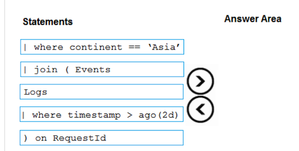

To query the Log Analytics workspace correctly for logs related to Asia from the last two days, you should arrange the statements in the following order:

**Correct Order**

1.  **`Logs`**
2.  **`| where timestamp > ago(2d)`**
3.  **`| join ( Events`**
4.  **`) on RequestId`**
5.  **`| where continent == 'Asia'`**

**Explanation:**

*   **Step 1 (`Logs`):** Every Kusto Query Language (KQL) query must begin with the name of the source table you are querying.
*   **Step 2 (`| where timestamp > ago(2d)`):** It is a performance best practice to apply time-based filters as early as possible in the query. This reduces the amount of data processed in subsequent steps.
*   **Step 3 & 4 (`| join ( Events` and `) on RequestId`):** The prompt implies that information about the "continent" is stored in the `Events` table, while the activity is in the `Logs` table. You must join the two tables on a common key (in this case, `RequestId`) to correlate the logs with their geographic metadata.
*   **Step 5 (`| where continent == 'Asia'`):** Finally, after the tables are joined and the data is combined into a single result set, you apply the filter for the specific continent required.


### Question-36

You have an Azure subscription that contains multiple Azure services. **You need to send an SMS alert when scheduled maintenance is planned for the Azure services**.

Which two actions should you perform? Each correct answer presents part of the solution.

* A. Enable Azure Security Center.
* B. Create and configure an Azure Monitor alert rule.
* C. Create an Azure Service Health alert.
* D. Create and configure an action group.

---------

**Correct Answer: CD**


The correct answers are:

- **C. Create an Azure Service Health alert** ✅
- **D. Create and configure an action group** ✅


Explanation:

To receive an **SMS alert when scheduled maintenance is planned** for your Azure services:

1. **Create an Azure Service Health alert** (**C**)

   * Azure Service Health monitors the health of your Azure resources.
   * You can configure alerts for:

     * **Planned maintenance**
     * **Service issues**
     * **Health advisories**

2. **Create and configure an action group** (**D**)

   * Action groups define **how alerts are delivered** (email, SMS, webhook, push, etc.).
   * To receive SMS notifications, the **SMS action** must be added to the action group.
   * Associate the **Service Health alert** with the action group.


Why the others are incorrect:

* **A. Enable Azure Security Center** ❌ → Security Center monitors security posture, not scheduled maintenance
* **B. Create an Azure Monitor alert rule** ❌ → Regular Azure Monitor alerts track metrics/logs, but **Service Health alerts** are specifically for planned maintenance and service issues


✅ **Final answer: C and D**


Creating planned maintenance alerts using Azure Service Health

1. Login into the Azure portal and select Service Health.
2. Select Health alerts followed by + Create service health alert from the top of the window on the right.
3. In the Edit Alert blade, give the alert a Name, Description, check the subscription is correct and choose a resource group.
4. The next step is to work through the Criteria section choosing which services, regions and types of event alerts should be monitored. For the purpose of this article all services and regions have been checked but only planned maintenance events.
5. Selector create an Action group. (An Action group is a group of actions to be taken, should an event be logged.)
6. Configure the actions to be taken. We are only configuring an email alert, so we first name the action, then chose Email/SMS/Push/Voice from the drop down list.


### Question #37 💩💩💩

You have a web app named App1 that uses Application Insights in Azure Monitor.


You need to compare the hourly CPU usage of App1 from the last 24 hours. The solution must include a graph that has a threshold line at 75 percent.

How should you complete the query? To answer, drag the appropriate values to the correct targets. Each value may be used once, more than once, or not at all. You may need to drag the split bar between panes or scroll to view content.

NOTE: Each correct selection is worth one point.


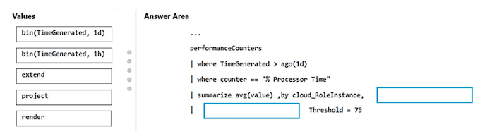

To build the query in **Azure Application Insights** using **Kusto Query Language (KQL)**, you must:

* Aggregate CPU usage **hourly**
* Show the **average CPU value**
* Add a **threshold line (75%)** to the chart

---

✅ **Correct selections**

1️⃣ For the **summarize grouping**
➡ **`bin(TimeGenerated, 1h)`**

2️⃣ To create the **threshold field**
➡ **`extend`**

Completed Query

```kusto
performanceCounters
| where TimeGenerated > ago(1d)
| where counter == "% Processor Time"
| summarize avg(value) by cloud_RoleInstance, bin(TimeGenerated, 1h)
| extend Threshold = 75
```

**Why these are correct**

* **`bin(TimeGenerated, 1h)`**


  Groups results **per hour** for the last 24 hours.

* **`extend Threshold = 75`**


  Creates a constant column used to **draw the threshold line on the chart**.

Why the other options are incorrect

| Option                   | Reason                                                                          |
| ------------------------ | ------------------------------------------------------------------------------- |
| `bin(TimeGenerated, 1d)` | Would group results daily, not hourly                                           |
| `project`                | Removes columns rather than creating the threshold                              |
| `render`                 | Visualization command; not needed for defining the threshold line in this query |

✅ **Final Answer**

| Blank                   | Value                      |
| ----------------------- | -------------------------- |
| After `summarize`       | **bin(TimeGenerated, 1h)** |
| Before `Threshold = 75` | **extend**                 |


### Question-37

You are designing a **strategy to monitor the baseline metrics** of Azure virtual machines that run Windows Server. 

You need to collect detailed data about the processes running in the guest operating system.

Which two agents should you deploy? Each correct answer presents part of the solution.


* A. the Telegraf agent
* B. the Azure Log Analytics agent
* C. the Azure Network Watcher Agent for Windows
* D. the Dependency agent

----------

Correct Answer: BD

The correct answers are:

- ✅ **B. the Azure Log Analytics agent**
- ✅ **D. the Dependency agent**

Why these are correct

To collect **detailed process-level data** from inside the **guest operating system** of Azure VMs, you need the agents used by **VM insights**:

🧩 Azure Log Analytics agent

* Collects:
  * Performance counters
  * Event logs
  * Syslogs
  * Process data (basic telemetry)

* Sends data to **Log Analytics workspace**

🔍 Dependency agent

* Collects:
  * **Detailed process information**
  * Process dependencies
  * Network connections between processes

* Enables:
  * **Service maps**
  * Deep process-level visibility

👉 Together, these two agents provide **full process monitoring and dependency mapping**.

Why the others are wrong

| Option                           | Reason                                                               |
| -------------------------------- | -------------------------------------------------------------------- |
| A. Telegraf agent ❌              | Open-source monitoring agent, not native Azure VM process monitoring |
| C. Azure Network Watcher Agent ❌ | Used for **network diagnostics**, not process-level OS monitoring    |

Exam principle

> **VM guest process monitoring = Log Analytics agent + Dependency agent**

This combo is required for:

* VM Insights
* Service Map
* Process dependency tracking

✅ Final Answer:

**B and D**


### Question-38

You configure Azure Application Insights and the shared service plan tier for a web app. **You enable Smart Detection**. You confirm that standard metrics are visible in the logs, but when you test a failure, you do not receive a Smart Detection notification. 

What prevents the Smart Detection notification from being sent?


* A. You must enable the Snapshot Debugger for the web app.
* B. Smart Detection uses the first 24 hours to establish the normal behavior of the web app
* C. The web app is configured to use the shared service plan tier.
* D. You must restart the web app before Smart Detection is enabled.


----------

**Correct Answer: B**

The correct answer is:

✅ **B. Smart Detection uses the first 24 hours to establish the normal behavior of the web app.**

Why this is correct

**Azure Application Insights Smart Detection** uses **machine learning** to detect anomalies.
To do that, it must first:

* Collect baseline telemetry
* Learn what “normal” behavior looks like
* Build a statistical model of request rates, failures, performance, etc.

This **baseline learning period takes up to 24 hours**.
During this time:

* Metrics are visible ✅
* Logs are available ✅
* **Smart Detection alerts are NOT triggered yet** ❌

So test failures during this learning window **will not generate notifications**.

 Why the other options are wrong

| Option                        | Reason                                               |
| ----------------------------- | ---------------------------------------------------- |
| A. Snapshot Debugger ❌        | Used for debugging exceptions, not anomaly detection |
| C. Shared service plan tier ❌ | Does not affect Smart Detection                      |
| D. Restart the web app ❌      | Not required for Smart Detection to function         |

 Key exam rule

> **Smart Detection requires a baseline learning period (≈ 24 hours) before alerts are generated.**

✅ Final Answer:

**B. Smart Detection uses the first 24 hours to establish the normal behavior of the web app.**


### Question #39

You have an Azure virtual machine named web1.


You need to query the amount of free memory that was **available on web1 during the past seven days**. 

The solution must meet the following requirements:

• Display the data as a time chart.

• Calculate the average value per hour.

How should you complete the KQL query? To answer, select the appropriate options in the answer area.

NOTE: Each correct selection is worth one point.

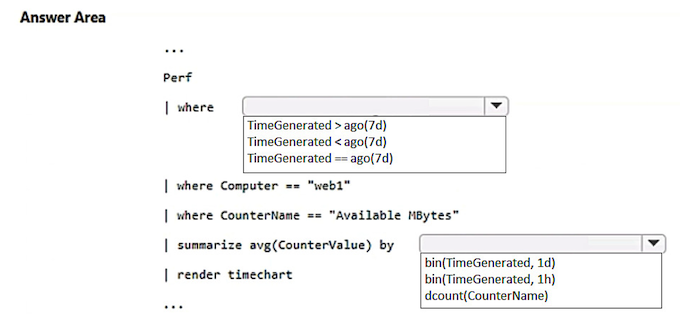

---------


To query the average amount of free memory per hour for "web1" over the past seven days and display it as a time chart, you should complete the KQL query as follows:

**Answer Area**

**Box 1: `TimeGenerated > ago(7d)`**

*   **Reasoning:** The requirement is to look at data from the **past seven days**. In KQL, the `> ago(7d)` filter retrieves all records that were generated between seven days ago and the current moment.

**Box 2: `bin(TimeGenerated, 1h)`**

*   **Reasoning:** The requirement is to **"calculate the average value per hour."** The `bin()` function (also known as `floor()`) is used to group timestamps into specific time intervals. Setting the interval to `1h` ensures that the `avg(CounterValue)` is calculated for every one-hour bucket, which is then plotted on the time chart.


**The complete query would look like this:**
```kusto
Perf
| where TimeGenerated > ago(7d)
| where Computer == "web1"
| where CounterName == "Available MBytes"
| summarize avg(CounterValue) by bin(TimeGenerated, 1h)
| render timechart
```


### Question-39

You have an Azure DevOps organization named Contoso and an Azure subscription. 

The subscription contains an Azure virtual machine scale set named VMSS1 that is configured for autoscaling. 

You use Azure DevOps to build a web app named App1 and deploy App1 to VMSS1. 

**App1 is used heavily and has usage patterns that vary on a weekly basis.** 

You need to recommend a solution to detect an abnormal rise in the rate of failed requests to App1. 

**The solution must minimize administrative effort.**

What should you include in the recommendation?

* A. the Smart Detection feature in Azure Application Insights
* B. the Failures feature in Azure Application Insights
* C. an Azure Service Health alert
* D. an Azure Monitor alert that uses an Azure Log Analytics query

-----

The correct answer is:

**A. the Smart Detection feature in Azure Application Insights** ✅


Explanation:

You need to **detect an abnormal rise in the rate of failed requests** to a heavily used web app (App1), with **minimal administrative effort**.

**Azure Application Insights – Smart Detection** is designed for this scenario:

* Uses **machine learning** to automatically detect anomalies in telemetry data, including:
  * Exception spikes
  * Failed requests
  * Performance degradations

* Automatically generates **alerts** when unusual behavior occurs
* **No manual threshold configuration** is needed → minimizes administrative overhead


Why the other options are incorrect:

* **B. Failures feature in Application Insights** ❌
  * Provides **historical metrics and charts** for failed requests
  * Does **not automatically detect anomalies** or trigger alerts

* **C. Azure Service Health alert** ❌
  * Monitors **Azure service outages or planned maintenance**, not your application’s request failures

* **D. Azure Monitor alert with Log Analytics query** ❌
  * Could detect anomalies, but requires **manual query authoring and thresholds** → higher administrative effort


✅ **Final answer: A. the Smart Detection feature in Azure Application Insights**


**Correct Answer: A**


After setting up Application Insights for your project, and if your app generates a certain minimum amount of data, Smart Detection of failure anomalies takes 24 hours to learn the normal behavior of your app, before it is switched on and can send alerts.


### Question #40 💩💩💩

You have a web app named App1 that uses Application Insights in Azure Monitor to store log data. App1 has users in multiple locations.

You need to query App1 requests from London and Paris that return a 404 error. The solution must meet the following requirements:

Return the timestamp url, resultCode, and duration fields

Only show requests made during the last hour.


How should you complete the query? To answer, drag the appropriate values to the correct targets. Each value may be used once, more than once, or not at all.

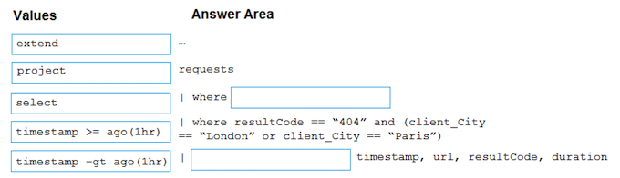

To complete the KQL query based on the requirements provided, you should drag the following values to the answer area:

**Answer Area**

**Box 1 (Time filter): `timestamp >= ago(1hr)`**

*   **Reasoning:** The requirement is to "Only show requests made during the last hour." In KQL, the standard way to filter for a time range relative to the current time is using the `ago()` function. The operator `>=` (or simply `>`) ensures you only retrieve records within that one-hour window.
*   **Note that `-gt` is a PowerShell operator, not a KQL one.**

**Box 2 (Column selection): `project`**

*   **Reasoning:** The requirement is to "Return the timestamp, url, resultCode, and duration fields."
*   <mark>In KQL, the **`project`** operator is used to specify which columns should be included in the results and in what order</mark>.


**The complete query would look like this:**
```kusto
requests
| where timestamp >= ago(1hr)
| where resultCode == "404" and (client_City == "London" or client_City == "Paris")
| project timestamp, url, resultCode, duration
```

### Question-40 💩💩💩


You are automating the testing process for your company.

You need to automate UI testing of a web application.

Which framework should you use?

* A. JaCoco
* B. Selenium
* C. Xamarin.UlTest
* D. Microsoft.CodeAnalysis

----


Correct Answer: B. Selenium


The correct answer is:

**B. Selenium** ✅


Explanation:

To **automate UI (User Interface) testing** of a web application, the most widely used and supported framework is **Selenium**.

**Selenium provides:**

* Cross-browser web automation (Chrome, Edge, Firefox, etc.)
* Scriptable interaction with HTML elements
* Integration with CI/CD pipelines (Azure DevOps, Jenkins)
* Support for multiple programming languages (C#, Java, Python, etc.)


Why the others are incorrect:

* **A. JaCoCo** ❌ → Code coverage tool for Java, not UI testing
* <mark>**C. Xamarin.UITest** ❌ → For **mobile app UI testing**, not web apps</mark>
* **D. Microsoft.CodeAnalysis** ❌ → Roslyn compiler API, used for analyzing or generating code, not UI testing


✅ **Final answer: B. Selenium**


### Question #41 💩💩

DRAG DROP -

You have a project in Azure DevOps.

You need to configure a dashboard. The solution must include the following metrics:

• Bottlenecks in the software development process

• A burndown chart for the work in a single iteration

• How long it takes to close a work item after the item was started


Which type of widget should you use for each metric? To answer, drag the appropriate widget types to the correct metrics. Each widget type may be used once, more than once, or not at all. You may need to drag the split bar between panes or scroll to view content.

NOTE: Each correct selection is worth one point.

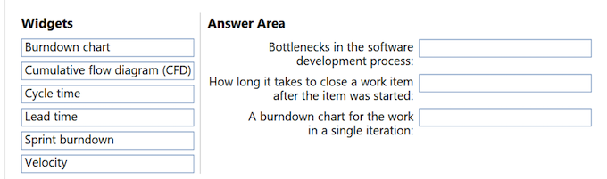


------

To configure the Azure DevOps dashboard with the correct widgets for each metric, you should match them as follows:

**Answer Area**

*   **Bottlenecks in the software development process:** **Cumulative flow diagram (CFD)**
    *   *Reasoning:* The CFD widget shows the distribution of work items across various states over time. By observing the width of the different bands (e.g., "In Progress"), you can easily identify where work is piling up, which indicates a process bottleneck.

*   **How long it takes to close a work item after the item was started:** **Cycle time**
    *   *Reasoning:* **Cycle time** specifically measures the time elapsed from the moment work on an item begins (it moves to an active state) until it is completed. **Lead time**, by contrast, measures the entire duration from the item's creation until its completion.

*   <mark>**A burndown chart for the work in a single iteration:** **Sprint burndown**<mark>
    *   *Reasoning:* In Azure DevOps, an iteration is known as a Sprint. The **Sprint burndown** widget is designed specifically to track the remaining work (usually in hours or story points) within that single, defined timebox.


### Question-41

You have an Azure DevOps organization named Contoso and an Azure subscription. The subscription contains an Azure virtual machine scale set named VMSS1 and an Azure Standard Load Balancer named LB1. 

LB1 distributes incoming requests across VMSS1 instances. You use Azure DevOps to build a web app named App1 and deploy App1 to VMSS1. 

App1 is accessible via HTTPS only and configured to require mutual authentication by using a client certificate. 

**You need to recommend a solution for implementing a health check of App1**.

The solution must meet the following requirements:

1- Identify whether individual instances of VMSS1 are eligible for an upgrade operation.

2- Minimize administrative effort.

What should you include in the recommendation?

- A. an Azure Load Balancer health probe
- B. Azure Monitor autoscale
- C. the Custom Script Extension
- D. the Application Health extension

---------------

**Correct Answer: D. the Application Health extension**

The correct answer is:

**D. the Application Health extension** ✅


Explanation:

You need to implement a **health check for App1** running on a **VMSS behind an Azure Standard Load Balancer**, with the following requirements:

1. Identify whether **individual VMSS instances are eligible for an upgrade operation**
2. Minimize **administrative effort**

**Azure VMSS Application Health Extension** is specifically designed for this scenario:

* **Monitors the health of application endpoints** on each VM in the scale set
* Integrates with **VMSS automatic upgrades**, marking instances as healthy/unhealthy for rolling upgrades
* Supports **HTTPS and mutual authentication** configurations
* Requires minimal setup compared to custom scripts


Why the others are incorrect:

* **A. Azure Load Balancer health probe** ❌
  * Can monitor endpoints for traffic distribution
  * **Cannot directly integrate with VMSS upgrade eligibility** in the context of application-level health

* **B. Azure Monitor autoscale** ❌
  * Scales VMSS instances based on metrics, not application health for upgrades

* **C. Custom Script Extension** ❌
  * Can implement health checks manually, but **higher administrative overhead** compared to the built-in Application Health extension


Summary:

| Requirement                 | Solution Fit                   |
| --------------------------- | ------------------------------ |
| App-level health monitoring | ✅ Application Health extension |
| VMSS upgrade eligibility    | ✅ Application Health extension |
| Minimize admin effort       | ✅ Application Health extension |


✅ **Final answer: D. the Application Health extension**


### Question #42 💩💩

You have an Azure subscription that contains a Log Analytics workspace named WS1 and a virtual machine named VM1.

You need to install the Microsoft Enterprise Cloud Monitoring extension on VM1.

Which two values are required to configure the extension? Each correct answer presents part of the solution.

NOTE: Each correct answer is worth one point.

A. the secret key of WS1

B. the ID of the subscription

C. the system-assigned managed identity of VM1

D. the ID of WS1

E. the resource ID of VM1

-----

✅ **Correct answers:**

- **A. the secret key of WS1**
- **D. the ID of WS1**

Explanation

To install the **Microsoft monitoring agent / Log Analytics agent** (often referred to as the **Microsoft Enterprise Cloud Monitoring extension**) on a VM so it can send data to **Azure Log Analytics**, you must configure two required parameters:

1. **Workspace ID**
2. **Workspace Key (Primary or Secondary key)**

These allow the VM agent to authenticate and send telemetry to the workspace.

Mapping to the options

| Option                              | Reason                                     |
| ----------------------------------- | ------------------------------------------ |
| **A. the secret key of WS1**        | ✅ Required (Workspace Key)                 |
| **D. the ID of WS1**                | ✅ Required (Workspace ID)                  |
| B. subscription ID                  | ❌ Not required for the agent configuration |
| C. system-assigned managed identity | ❌ Not used by this extension               |
| E. resource ID of VM1               | ❌ The extension already runs on the VM     |


✅ **Final Answer:**


**A and D**


### Question-42 💩💩💩

You have a build pipeline in Azure Pipelines that occasionally fails. You discover that a test measuring the response time of an API endpoint causes the failures. 

**You need to prevent the build pipeline from failing due to the test.**

Which two actions should you perform? Each correct answer presents part of the solution.

NOTE: Each correct selection is worth one point.


- A. Set Flaky test detection to Off.
- B. Clear Flaky tests included in test pass percentage.
- C. Enable Test Impact Analysis (TIA).
- D. Manually mark the test as flaky.
- E. Enable test slicing.

-------------


Correct Answer: BD

The correct answers are:

- **D. Manually mark the test as flaky** ✅
- **B. Clear Flaky tests included in test pass percentage** ✅


Explanation:

The scenario:

* A **build pipeline fails** because a **response-time test intermittently fails**.
* Goal: **Prevent the build from failing due to this flaky test**.

Azure Pipelines provides **flaky test management**:

1. **Mark the test as flaky (D)**
   * Manually mark the test so Azure DevOps knows **failures in this test shouldn’t fail the build**.

2. **Clear “Flaky tests included in test pass percentage” (B)**
   * This ensures that **flaky tests are excluded from the pass/fail calculations** of the build.


Why the others are incorrect:

* **A. Set Flaky test detection to Off** ❌
  * Turns off automated detection but doesn’t prevent the build from failing for already flaky tests

* **C. Enable Test Impact Analysis (TIA)** ❌
  * Optimizes test execution by running only impacted tests; doesn’t prevent failures

* **E. Enable test slicing** ❌
  * Distributes tests across multiple agents; doesn’t prevent build failure due to flakiness


✅ **Final answer: D and B**


### Question #43

You have an app named App1 that uses **Application Insights to monitor application performance**.

You need to analyze **how often** a page in App1 is accessed.

Which plan in Application Insights should you use?


A. Events

B. Sessions

C. Impact

D. Users

----------


✅ **Correct answer:** **A. Events**

Explanation

In **Azure Application Insights**, page visits are tracked as **page view events**. To analyze **how often a specific page is accessed**, you use the **Events** blade where telemetry such as:

* **Page views**
* **Custom events**
* **Browser events**

are recorded.

From **Events**, you can filter by **page name** and see how frequently it is accessed.

Why the other options are incorrect

| Option          | Reason                                                                      |
| --------------- | --------------------------------------------------------------------------- |
| **B. Sessions** | Shows user session duration and counts, not specific page access frequency. |
| **C. Impact**   | Used to analyze performance impact of issues on users.                      |
| **D. Users**    | Shows unique users, not how often a page is accessed.                       |


✅ **Final Answer:** **A. Events**


### Question-43

Your company hosts a web application in Azure. 

The company uses Azure Pipelines for the build and release

Stakeholders management of the application. **Stakeholders report that the past few releases have negatively affected system performance.** You configure alerts in Azure Monitor.

You need to ensure that new releases are only deployed to production if the releases meet defined performance

baseline criteria in the staging environment first.

**What should you use to prevent the deployment of releases that fall to meet the performance baseline?**

- A. an Azure Scheduler job
- B. a trigger
- C. a gate
- D. an Azure function

----------

Correct Answer: C. a gate

The correct answer is:

**C. a gate** ✅

Explanation:

In **Azure Pipelines**, if you want to **prevent a release from being deployed to production unless it meets defined performance baseline criteria** in a staging environment, the correct mechanism is a **gate**.

**Gates** in Azure Pipelines:

* Automatically evaluate **predefined conditions** before a deployment proceeds
* Can use **Azure Monitor metrics, Application Insights telemetry, or REST APIs** as evaluation criteria
* Stop deployments if **performance thresholds** are not met
* Minimize manual intervention (low administrative effort)


Why the other options are incorrect:

* **A. Azure Scheduler job** ❌ → Only runs scheduled tasks, doesn’t enforce release gates
* **B. Trigger** ❌ → Starts a pipeline or release; cannot block based on performance criteria
* **D. Azure Function** ❌ → Could implement custom logic, but requires manual integration and more overhead; gates provide **native support**


✅ **Final answer: C. a gate**


**Scenarios and use cases for gates include: Quality validation.**


Query metrics from tests on the build artifacts such as pass rate or code coverage and deploy only if they are within required thresholds. Use Quality Gates to integrate monitoring into your pre-deployment or post-leployment. This ensures that you are meeting the key health/performance metrics (KPls) as your applications move from dev to production and any differences in the infrastructure environment or scale is not negatively impacting your KPIs.


### Question #44

You have a project in Azure DevOps that includes two users named User1 and User2.

You plan to use Azure Monitor to manage logs.

You need to ensure that the users can perform the actions shown in following the table.

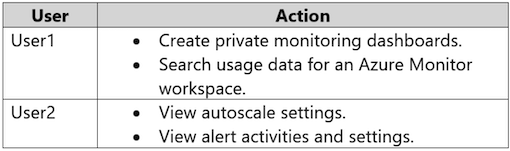


The solution must follow the principle of least privilege.

Which role should you assign to each user? To answer, select the appropriate options in the answer area.

NOTE: Each correct selection is worth one point.


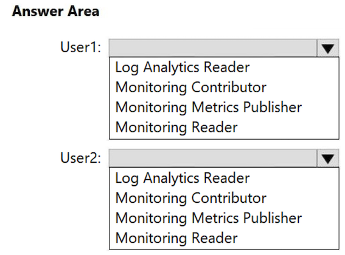

**User1:** Monitoring Contributor

**User2:** Monitoring Reader


### Question-44 💩💩💩

You manage a project in Azure DevOps. You need to prevent the configuration of the project from changing over time.

Solution: Pertorm a subscription Health scan when packages are created 

Does this meet the goal?

A. Yes

B. No

The correct answer is:

**B. No** ✅


Explanation:

The goal is to **prevent the configuration of the Azure DevOps project from changing over time**.

Performing a **subscription health scan when packages are created**:

* Only checks the **health or compliance** of resources or packages
* Does **not prevent configuration changes**
* It is **reactive**, not preventive

To actually **prevent configuration drift**, you would need solutions such as:

* **Azure Policy** → enforce rules on resources
* **Locking project settings or using process templates** → restrict changes
* **Automation/CI/CD pipelines** → enforce desired state


✅ **Final answer: B. No**


**Instead implement Continuous Assurance for the project.**

> Incorrect Options presents in part of this series Questions are

1- Implement Continuous Integration for the project   (wrong)

2- Add a code coverage step to the build pipelines.    (wrong)
 
3- Perform a Subscription Health scan when packages are created.   (wrong)

<mark>Correct Option is Implement Continuous Assurance for the project</mark>

> Note: The Subscription Security health check features in ASK contains a set of scripts that examines a subscription and flags off security issues, 

> misconfigurations or obsolete artifacts/settings which can put your subscription at higher risk.

Reference: https://azsk.azurewebsites.net/04-Continous-Assurance/Readme.html


### Question #45 💩💩

DRAG DROP -

You have a project in Azure DevOps.

You need to configure a dashboard that will provide information on the following metrics.

• How long it takes to close a work item

• The number of completed backlog items

• How long it takes to restore failed services


Which type of widget should you use for each metric? To answer, drag the appropriate widget types to the correct metrics. Each widget type may be used once, more than once, or not at all. You may need to drag the split bar between panes or scroll to view content.

NOTE: Each correct selection is worth one point.

Correct Answer:


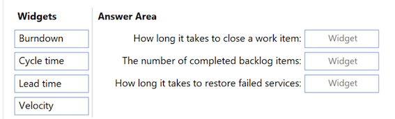


----------

To configure the Azure DevOps dashboard correctly, you should match the widgets to the metrics as follows:

**Answer Area**

*   **How long it takes to close a work item:** **Cycle time**
    *   *Reasoning:* **Cycle time** measures the time it takes to complete a work item once work has actually started on it (i.e., when it moves from a "New" state to an "Active" or "In Progress" state).

*   **The number of completed backlog items:** **Velocity**
    *   *Reasoning:* **Velocity** tracks how much work a team can complete in a single sprint. It is the standard metric for calculating the number of backlog items (or story points) finished per iteration.

*   <mark>**How long it takes to restore failed services:** **Lead time**</mark>
    *   *Reasoning:* In a DevOps context, the time taken to restore a failed service (Mean Time to Repair/Recovery) is measured using **Lead time**. Lead time tracks the total duration from the moment an issue is identified (work item created) until it is resolved (work item closed).


**Summary of selections:**

1.  How long it takes to close a work item: **Cycle time**
2.  The number of completed backlog items: **Velocity**
3.  How long it takes to restore failed services: **Lead time**

### Question-45

You manage a project in Azure DevOps. You need to prevent the configuration of the project from changing over time.

Solution: Add a code coverage step to the build pipelines.

Does this meet the goal?

A. Yes

B. No

The correct answer is:

**B. No** ✅


Explanation:

Adding a **code coverage step** to a build pipeline:

* Measures **how much of your code is tested**
* Improves **quality metrics** and testing insight
* **Does not prevent project configuration changes** in Azure DevOps

To **prevent configuration drift**, you would need approaches like:

* **Process templates / inherited processes** → lock work item types, states, and fields
* **Azure Policy** → enforce rules on Azure resources
* **Automation / CI enforcement** → maintain desired state of project settings


✅ **Final answer: B. No**


Instead implement Continuous Assurance for the project.

Note: The Subscription Security health check features in AzSK contains a set of scripts that examines a subscription and flags off security issues, misconfigurations or obsolete artifacts/settings which can put your subscription at higher risk.

Reference: https://azsk.azurewebsites.net/04-Continous-Assurance/Readme.html

incorrect Options presents in part of this series Questions are

- 1- Implement Continuous Integration for the project
- 2- Add a code coverage step to the build pipelines.
- 3- Perform a Subscription Health scan when packages are created.

<mark>**Correct Option is Implement Continuous Assurance for the project**</mark>

### Question-46

You manage a project in Azure DevOps. You need to prevent the configuration of the project from changing over time.

Solution: Implement Continuous Integration for the project

Does this meet the goal?

A. Yes

B. No


The correct answer is:

**B. No** ✅


Explanation:

**Continuous Integration (CI)**:

* Automates **building and testing code** whenever changes are pushed
* Ensures **code quality** and detects errors early
* **Does not prevent changes to project configuration** in Azure DevOps (such as process templates, work item types, permissions, or settings)

To **prevent project configuration from changing**, you would need:

* **Process templates / inherited processes** → lock work item types, states, fields
* **Automation scripts or Azure DevOps REST API enforcement** → maintain desired state
* **Policies or approvals** for configuration changes


✅ **Final answer: B. No**


**Instead implement Continuous Assurance for the project.**

 
* 1- Implement Continuous Integration for the project  ❌
* 2- Add a code coverage step to the build pipelines. ❌
* 3- Perform a Subscription Health scan when packages are created  ❌.


### Question #47

You have an Azure subscription that contains an Azure Kubernetes Service (AKS) instance named AKS1.

You collect and analyze metrics for AKS1 by using the Azure Monitor managed service for Prometheus.

You need to analyze the performance of AKS1.

Which query language should you use?

A. PL/SQL

B. PromQL

C. SparkQL

D. KQL

---------


The correct answer is **B. PromQL**.

Explanation:

The **Azure Monitor managed service for Prometheus** is a Prometheus-compatible environment. Prometheus uses its own native, functional query language called **PromQL** (Prometheus Query Language) to select and aggregate real-time time-series data.

While **KQL** (Kusto Query Language) is the standard language for Azure Log Analytics and Application Insights, when you specifically opt into the **Prometheus** managed service for AKS monitoring, you use PromQL to interact with that data (typically visualized via Grafana).

Why other options are incorrect:

*   **A. PL/SQL:** This is used for Oracle databases.
*   **C. SparkQL:** This is used for processing data within Apache Spark.
*   **D. KQL:** This is used for Azure logs and standard Azure Monitor metrics, but not for data stored in the Prometheus managed service.

### Question-47

You manage a project in Azure DevOps. You need to prevent the configuration of the project from changing over time.

**Solution: Implement Continuous Assurance for the project**

Does this meet the goal?

A. Yes

B. No


The correct answer is:

**A. Yes** ✅


Explanation:

**Continuous Assurance** in Azure DevOps refers to practices and tooling that **continuously monitor and enforce the desired state of a project’s configuration**:

* Ensures **project settings, processes, and policies** remain consistent over time
* Detects **configuration drift** and can automatically remediate deviations
* Helps maintain compliance and governance for DevOps projects

By implementing **Continuous Assurance**, you can effectively **prevent unintended changes to project configuration** over time.


✅ **Final answer: A. Yes**


### Question-48  💩💩💩

You use Azure Pipelines to manage build pipelines, Github to store source code, and Dependabot to manage dependencies. You have an app named App1. Dependabot detects a dependency in App1 that requires an update. What should you do first to apply the update?

* A. Create a pull request.
* B. Approve the pull request.
* C. Create a branch.
* D. Perform a commit.

---------

**Correct Answer: B. Approve the pull request.**

The correct answer is **B. Approve the pull request.**

**Explanation:**

Dependabot is designed to automate the dependency management process. When Dependabot is used to **manage** dependencies (as stated in the scenario), it follows an automated workflow:

1.  **Detection:** Dependabot scans your repository and detects an outdated or vulnerable dependency.
2.  **Creation:** It automatically **creates a new branch** and **performs a commit** with the updated version.
3.  **Pull Request:** It automatically **creates a pull request (PR)** that includes the changes needed to update the dependency.

Since Dependabot has already performed the detection and created the PR, the first action you (the developer/user) must take to "apply" the update to your codebase is to **review and approve the pull request** (or merge it). This allows your CI/CD pipeline (Azure Pipelines) to run tests and eventually deploy the update.

**Why other options are incorrect:**

*   **A. Create a pull request:** Dependabot does this automatically when it detects the update. You do not need to do this manually.
*   **C. Create a branch:** Dependabot creates the branch for the update automatically.
*   **D. Perform a commit:** Dependabot performs the version-bump commit within the branch it creates.

### Question #48


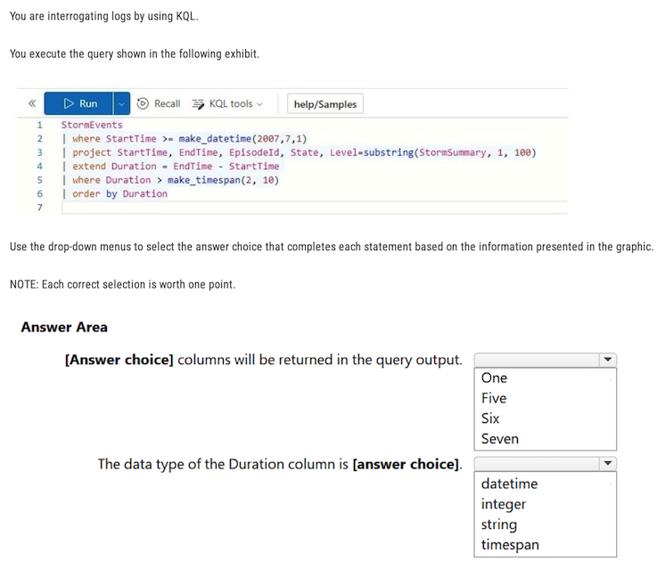

Based on the KQL query provided in the exhibit, here are the correct selections for the Answer Area:

**1. Number of columns returned in the query output**

**Selection: `Six`**

**Reasoning:**

1.  **The `project` operator (Line 3) selects five specific columns: `StartTime`, `EndTime`, `EpisodeId`, `State`, and `Level`.**
2.  <mark>The `extend` operator (Line 4) adds one **new** column to the existing result set: `Duration`.</mark>
3.  Since there are no subsequent `project` or `project-away` operators to remove columns, the final output will contain the 5 projected columns plus the 1 extended column, totaling **six**.

**2. Data type of the Duration column**

**Selection: `timespan`**

**Reasoning:**

*   In Kusto (KQL), the `Duration` column is calculated by subtracting one `datetime` (`StartTime`) from another `datetime` (`EndTime`).
*   The result of a subtraction between two `datetime` objects is always a **`timespan`** (representing the elapsed time).
*   This is confirmed in Line 5, where the `Duration` is compared against a value generated by the `make_timespan` function.

### Question-49  💩💩

You are designing a configuration management solution to support five apps hosted on Azure Ap Service. Each app is available in the following three environments: development, test, and production


You need to recommend a configuration management solution that meets the following requirements 


**Supports teature flags, Tracks configuration changes from the past 30 days, Stores hierarchically structured contiguration values, Controls access to the configurations by using role-based access control (RBAC) permissions, Stores shared valur as key-value pairs that can be used by all the apps**


Which Azure service should you recommend as the configuration management solution?


* A. Azure Cosmos DB
* B. Azure App Service
* C. Azure App Configuration
* D. Azure Key Vault

-------

**Correct Answer: C - Azure App Configuration**

The correct answer is:

**C. Azure App Configuration** ✅


Explanation:

You need a **configuration management solution** for multiple apps and environments with the following requirements:

1. **Supports feature flags** → Enable/disable features per environment or user segment.
2. **Tracks configuration changes from the past 30 days** → Provides **history and versioning**.
3. **Stores hierarchically structured configuration values** → Organizes settings logically per app/environment.
4. **Controls access using RBAC** → Can assign **read/write permissions** per app or user.
5. **Stores shared key-value pairs usable by all apps** → Provides **centralized, reusable configuration**.

**Azure App Configuration** meets all these requirements:

* Centralized configuration store for multiple apps
* Built-in **feature flags**
* **Versioning and history** for configuration changes
* Hierarchical keys and labels for environment-specific values
* Supports **RBAC and managed identities** for secure access


Why the others are incorrect:

* **A. Azure Cosmos DB** ❌ → A database for structured/unstructured data, not specialized for configuration management or feature flags.
* **B. Azure App Service** ❌ → Hosting platform, not a configuration management service.
* **D. Azure Key Vault** ❌ → Stores **secrets, keys, certificates**, not full-featured hierarchical configuration or feature flags.


✅ **Final answer: C. Azure App Configuration**

### Question #49 💩💩

You are planning projects for three customers. Each customer's preferred process for work items is shown in the following table.

The customers all plan to use Azure DevOps for work item management.

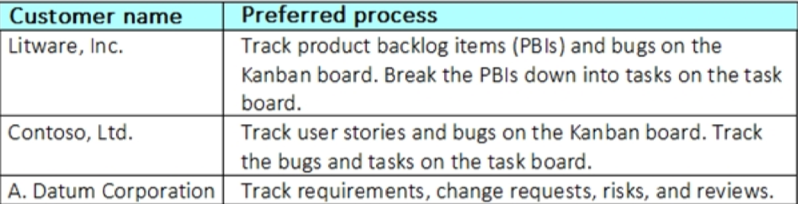


Which work item process should you use for each customer? To answer, drag the appropriate work item processes to the correct customers. Each work item process may be used once, more than once, or not at all. You may need to drag the split bar between panes or scroll to view content.

NOTE: Each correct selection is worth one point.

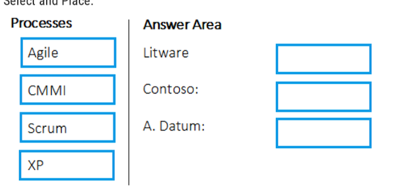

---------

To match the customers with the correct Azure DevOps work item processes based on their specific terminology, you should use the following mappings:

**Answer Area**

*   **Litware:** **Scrum**
    *   *Reasoning:* The use of the term **"Product Backlog Item" (PBI)** is specific to the Scrum process template in Azure DevOps. 

*   **Contoso:** **Agile**
    *   *Reasoning:* The term **"User Story"** is the standard backlog item used in the Agile process template.

*   **A. Datum:** **CMMI**
    *   *Reasoning:* The **CMMI** (Capability Maturity Model Integration) template is designed for formal process improvement and includes specific work item types like **Change Request**, **Risk**, and **Review**, which are not present in the standard Scrum or Agile templates.


### Question #50 💩

You configure an Azure Application Insights availability test.

You need to notify the customer services department at your company by email when availability is degraded. 

**You create an Azure logic app that will handle the email and follow up actions.**

Which type of trigger should you use to invoke the logic app?

A. an HTTPWebhook trigger

B. an HTTP trigger

C. a Request trigger

D. an ApiConnection trigger

---------------


The correct answer is **C. a Request trigger**.

Explanation:

To integrate an **Azure Application Insights availability test** with an **Azure Logic App**, you typically use an **Azure Monitor Alert**. When the availability test fails, the alert is triggered and calls an **Action Group**.

1.  **Request trigger:** This is the specific trigger in Logic Apps (formally known as "When a HTTP request is received") that generates a unique URL. When you configure an Action Group to call a Logic App, the Azure alerting system sends an HTTP POST request to this URL containing the alert data in a JSON payload.
2.  **HTTP trigger vs. Request trigger:** While "HTTP trigger" is a common term used in Azure Functions, in the context of Azure Logic Apps, the specific trigger used to receive incoming webhooks from Azure services like Monitor or Application Insights is the **Request trigger**.
3.  **HTTPWebhook trigger:** This is used for a "subscribe/unsubscribe" pattern where the Logic App registers a callback URL with a service and waits for a specific event. This is not the mechanism used by Azure Monitor Action Groups.
4.  **ApiConnection trigger:** This is used for triggers that rely on external connectors (like "When a new email arrives" in Outlook or "When a file is created" in OneDrive). It does not provide an endpoint for Azure Alerts to call.

**Correct Configuration Flow:**

1. Create a Logic App starting with a **Request trigger** ("When a HTTP request is received").
2. Create an **Action Group** in Azure Monitor.
3. Add an action to the group, select the **Logic App** type, and point it to the Logic App you created.
4. Associate the Action Group with the **Availability Test alert**.


### Question-50

You have a containerized solution that runs in Azure Container Instances. 

The solution contains a frontend container named App1 and a backend container named DB1. DB1 loads a large amount of data during startup. 

You need to verify that DB1 can handle incoming requests before users can submit requests to App1. 

What should you configure?

* A. a liveness probe
* B. a performance log
* C. a readiness probe
* D. an Azure Load Balancer health probe

----------

The correct answer is:

**C. a readiness probe** ✅


Explanation:

In **containerized applications** (like **Azure Container Instances** or Kubernetes):

* **Readiness probes** are used to indicate whether a container is **ready to serve traffic**.
* The frontend container (**App1**) should only send requests to the backend (**DB1**) **after DB1 is ready**.
* Since DB1 **loads a large amount of data on startup**, a readiness probe ensures:

  * Requests are only routed when DB1 has **finished initialization**
  * Prevents errors from early traffic


Why the others are incorrect:

* **A. Liveness probe** ❌ → Checks if a container is **alive**; restarts it if unhealthy. Does not control traffic routing.
* **B. Performance log** ❌ → For monitoring, does not affect request routing.
* **D. Azure Load Balancer health probe** ❌ → Monitors VM/container health from the load balancer perspective, but readiness probes are more precise for container **startup dependencies**.


✅ **Final answer: C. a readiness probe**


### Question-51💩

You have several Azure Active Directory (Azure AD) accounts.

You need to ensure that users use multi-factor authentication (MA) to access Azure apps from untrusted networks.

What should you configure in Azure

* A. access reviews
* B. managed identities
* C. entitlement management
* D. conditional access

------

Answer: D

You can configure a Conditional Access policy that requires MFA for access from untrusted networks.

The correct answer is:

**D. conditional access** ✅


Explanation:

To **require multi-factor authentication (MFA) for users accessing Azure apps from untrusted networks**, you should configure **Conditional Access** in **Azure Active Directory**.

**Conditional Access policies allow you to:**

* Apply **MFA requirements** based on conditions such as:

  * User or group membership
  * Application being accessed
  * Device or network location (trusted vs. untrusted networks)
* Block or allow access depending on risk or context
* Enforce **granular access control** without affecting all users all the time


Why the others are incorrect:

* **A. Access reviews** ❌ → Used to review and recertify user access, not enforce MFA.
* **B. Managed identities** ❌ → For granting **Azure resources access to other Azure resources**, not user authentication.
* **C. Entitlement management** ❌ → Used for managing **access packages** and lifecycle of access, not conditional MFA enforcement.


✅ **Final answer: D. conditional access**


### Question-52 💩

You have an Azure DevOps organization named Contoso and an Azure subscription. The subscription contains an Azure virtual machine scale set named VMSS1 that is configured for autoscaling.

You have a project in Azure DevOps named Project. Project is used to build a web app named App1 and deploy App1 to VMSS1.

**You need to ensure that an email alert is generated** whenever VMSS1 scales in or out.

Solution: From Azure DevOps, configure **the Notifications settings for Project1**.

Does this meet the goal?


* A. Yes
* B. No

------

Answer: B

The correct answer is:

**B. No** ✅

Explanation:

The requirement:

* **Generate an email alert whenever VMSS1 scales in or out.**

The proposed solution:

* Configure **Notifications in Azure DevOps for Project1**

**Why this does NOT meet the goal:**

* **Azure DevOps notifications** only handle events related to **Azure DevOps activities**, such as:

  * Work item changes
  * Build pipeline results
  * Pull requests
* **VMSS scaling events** are **Azure platform events**, not DevOps project events.

**Correct approach:**

1. <mark>Use **Azure Monitor alerts** on the **VMSS metrics** (like `Capacity` or `Instances`).</mark>
2. <mark>Create an **action group** with **email notifications**.</mark>

This ensures you receive an email whenever VMSS1 scales in or out.


✅ **Final answer: B. No**


**Notifications** help you and your team stay informed about activity that occurs within your projects in Azure DevOps. You can get notified when changes occur to the following items: 

* work items 
* code reviews 
* pull requests 
* source control files 
* builds

### Question-52

You have an Azure subscription that contains multiple web apps.

You need to enable Change Analysis for the web apps.

How should you complete the script? To answer, select the appropriate options in the answer area.

NOTE: Each correct selection is worth one point.

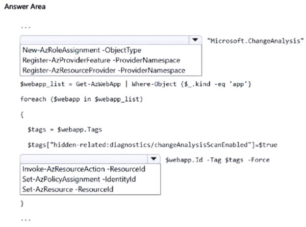

------


To enable Change Analysis for multiple web apps via a script, you should complete the PowerShell commands as follows:

**Answer Area**

**Box 1: `Register-AzResourceProvider -ProviderNamespace`**

*   **Reasoning:** To use Azure Change Analysis, the **`Microsoft.ChangeAnalysis`** resource provider must be registered at the subscription level. The command `Register-AzResourceProvider` is the standard way to ensure that the subscription has access to the services provided by that specific namespace.

**Box 2: `Set-AzResource -ResourceId`**

*   **Reasoning:** The script enables "Change Analysis Scan" for each web app by adding a specific hidden tag (`hidden-related:diagnostics/changeAnalysisScanEnabled`) to the resource. To apply these updated tags to the existing web app resource in Azure, the **`Set-AzResource`** command is used. It targets the resource by its ID and overwrites the properties (the tags) with the new values provided in the `$tags` variable.


**Summary of selections:**

1.  **Register-AzResourceProvider -ProviderNamespace**
2.  **Set-AzResource -ResourceId**


##  Topic 3 - Question Set 3


### Question #1

You have an Azure DevOps organization named Contoso and an Azure subscription.

You use Azure DevOps to build a containerized app named App1 and deploy App1 to an Azure container instance named ACI1. 

**You need to restart ACI1 when App1 stops responding.**

What should you do?

A. Add a liveness probe to the YAML configuration of App1.

B. Add a readiness probe to the YAML configuration of App1.

C. Use Connection Monitor in Azure Network Watcher.

D. Use IP low verify in Azure Network Watcher.

The correct answer is **A. Add a liveness probe to the YAML configuration of App1.**

Explanation:

*   **Liveness Probe:** In Azure Container Instances (ACI), a liveness probe is specifically designed to determine if a containerized application is running and healthy. If the application stops responding (the probe fails), ACI automatically restarts the container. This matches your requirement exactly.
*   **Readiness Probe:** This is used to determine if a container is ready to start accepting traffic. If a readiness probe fails, the container is not restarted; instead, it is temporarily removed from being reachable (it won't receive traffic).
*   **Connection Monitor (Network Watcher):** This is a tool for monitoring network connectivity between endpoints. While it can detect that a service is down, it does not have the built-in capability to automatically restart a container instance.
*   **IP flow verify (Network Watcher):** This is a diagnostic tool used to check if a packet is allowed or denied to or from a virtual machine based on security rules (NSG rules). It is not used for monitoring application health or restarting services.

**How to implement it:**
In the YAML file for the Azure Container Instance, you define the `livenessProbe` under the container properties:

```yaml
properties:
  containers:
    - name: app1
      properties:
        image: contoso.azurecr.io/app1:latest
        livenessProbe:
          httpGet:
            path: /health
            port: 80
          initialDelaySeconds: 30
          periodSeconds: 10
```

### Question #2

You have a multi-tier application that has an Azure Web Apps front end and an Azure SQL Database back end.

You need to recommend a solution to capture and store telemetry data. The solution must meet the following requirements: 

✑ Support using ad-hoc queries to identify baselines.

✑ Trigger alerts when metrics in the baseline are exceeded.

✑ Store application and database metrics in a central location.

What should you include in the recommendation?

A. Azure Event Hubs

B. Azure SQL Database Intelligent Insights

C. Azure Application Insights

D. Azure Log Analytics

-----------

The correct answer is **D. Azure Log Analytics**.

Explanation:

Azure Log Analytics is the primary tool within Azure Monitor used to collect, aggregate, and analyze data from various sources in a central location.

Here is how it meets all your requirements:

*   **Central Location:** You can configure **Diagnostic Settings** on both the **Azure Web App** (front end) and the **Azure SQL Database** (back end) to send their metrics and logs to a single **Log Analytics workspace**.
*   **Ad-hoc Queries:** Log Analytics uses **Kusto Query Language (KQL)**. This allows you to perform complex, ad-hoc queries across both application and database data to identify performance patterns and establish baselines.
*   **Trigger Alerts:** Once you have defined a baseline using a KQL query, you can create **Log Search Alerts**. These alerts trigger automatically when the results of a query exceed your specified threshold.

Why other options are incorrect:

*   **Azure Event Hubs:** This is a data streaming service. While it can ingest data, it does not provide built-in storage for long-term analysis or a query engine to identify baselines.
*   **Azure SQL Database Intelligent Insights:** This is a specialized feature for monitoring SQL performance. It does not capture telemetry for the Web App front end, so it fails the "central location" requirement.
*   **Azure Application Insights:** While excellent for application-level telemetry (Web Apps), it is not the primary repository for platform-level database logs (like SQL execution plans or deadlock logs). While Application Insights now often stores data in a Log Analytics workspace, **Log Analytics** is the comprehensive solution for the entire multi-tier stack.


### Question #3 💩

You have an Azure subscription that contains resources in several resource groups.

You need to design a monitoring strategy that will provide a consolidated view. The solution must support the following requirements: 

✑ Support role-based access control (RBAC) by using Azure Active Directory (Azure AD) identifies.

✑ Include visuals from Azure Monitor that are generated by using the Kusto query language.

✑ Support documentation written in markdown.

✑ Use the latest data available for each visual.

What should you use to create the consolidated view?

A. Azure Monitor

B. Microsoft Power BI

C. Azure Data Explorer

D. Azure dashboards


------


The correct answer is **D. Azure dashboards**.

**Explanation:**

Azure Dashboards are specifically designed to provide a "single pane of glass" view for Azure resources. Here is how they meet all the specified requirements:

*   **Consolidated View:** You can pin tiles from multiple different resource groups and even different subscriptions onto a single dashboard.
*   **RBAC support:** Azure Dashboards are Azure resources themselves. You can share a dashboard with specific users or groups using standard **Azure Role-Based Access Control (RBAC)**.
*   **Kusto Query Language (KQL):** You can run queries in **Log Analytics** or **Application Insights** using KQL and then "Pin" the resulting chart or table directly to an Azure dashboard.
*   **Markdown Support:** Azure Dashboards include a specific **Markdown tile**, which allows you to add formatted text, links, and documentation alongside your metrics.
*   **Latest Data:** Tiles on an Azure dashboard refresh automatically when the dashboard is loaded or refreshed, ensuring you see the most recent telemetry data available.

**Why other options are incorrect:**

*   **Azure Monitor:** This is the service that *collects* the data, but it is not a "consolidated view" tool in itself. While it contains "Workbooks," the specific mention of Markdown tiles and pinning queries is a hallmark of Azure Dashboards in the context of this certification-style question.
*   **Microsoft Power BI:** While Power BI is powerful for visualization, it often has a delay in data refresh (unless using DirectQuery, which can be complex) and is generally considered external to the immediate "Azure portal experience" for operational monitoring.
*   **Azure Data Explorer:** This is a standalone big data analytics service. While it uses KQL, it is used for analyzing massive datasets rather than acting as a standard operational dashboard for Azure resource monitoring.


### Question #3  💩💩💩

You are building an ASP.NET Core application.

You plan to create an application utilization baseline by capturing telemetry data.

**You need to add code to the application to capture the telemetry data.** 

The solution must minimize the costs of storing the telemetry data. 

Which two actions should you perform? Each correct answer presents part of the solution.

NOTE: Each correct selection is worth one point

A. Add the <InitialSamplingPercentage>99</InitialSamplingPercentage> parameter to the ApplicationInsights.config file.

B. From the code of the application, enable adaptive sampling.

C. From the code of the application, add Azure Application Insights telemetry.

D. Add the <MaxTelemetryItemsPerSecond>5</MaxTelemetryItemsPerSecond> parameter to the ApplicationInsights.config file.

E. From the code of the application, disable adaptive sampling.

--------

Goal:

* Capture telemetry in an **ASP.NET Core** application
* **Minimize telemetry storage cost**

Key concept

To minimize cost when sending telemetry to **Azure Application Insights**, you should enable **adaptive sampling**, which automatically reduces telemetry volume during high traffic.

✅ **Correct answers**

- **B. From the code of the application, enable adaptive sampling.**
- **C. From the code of the application, add Azure Application Insights telemetry.**

Explanation

| Option | Reason                                                                         |
| ------ | ------------------------------------------------------------------------------ |
| **B**  | Adaptive sampling dynamically reduces telemetry volume → lowers storage cost   |
| **C**  | Required to collect telemetry in the application                               |
| A      | Static sampling via config; not the recommended cost-optimized approach        |
| D      | Limits telemetry rate but does not intelligently adjust like adaptive sampling |
| E      | Disabling adaptive sampling would **increase cost**                            |

✅ **Final Answers**

| Question                        | Answer        |
| ------------------------------- | ------------- |
| ASP.NET Core telemetry baseline | **B and C**   |


### Question #14

You have an application named App1 that has a custom domain of app.contoso.com. 


You create a test in Azure Application Insights as shown in the following exhibit.

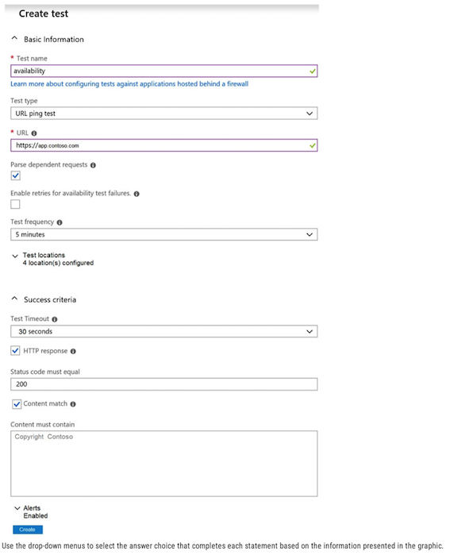

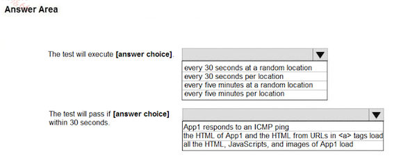


--------

From the configuration shown in **Azure Application Insights**:

Key settings visible in the screenshot:

* **Test type:** URL ping test
* **Test frequency:** **5 minutes**
* **Test locations:** **4 locations configured**
* **Parse dependent requests:** Enabled
* **Timeout:** **30 seconds**
* **Success criteria:**
  * HTTP status code **200**
  * Content must contain **"Copyright Contoso"**

1️⃣ The test will execute

Because the frequency is **5 minutes** and tests run from **each configured location**, the test runs from **every location every interval**.

✅ **Answer:** **every five minutes per location**

2️⃣ The test will pass if

Since **Parse dependent requests** is enabled, Application Insights verifies that:

* The **HTML page loads**
* The **resources referenced in `<script>`, ``, etc. also load**

Thus the test passes when **all HTML, JavaScript, and images load successfully within the timeout**.

✅ **Answer:**

**all the HTML, JavaScripts, and images of App1 load**

✅ **Final Answers**

| Statement             | Answer                                                 |
| --------------------- | ------------------------------------------------------ |
| The test will execute | **every five minutes per location**                    |
| The test will pass if | **all the HTML, JavaScripts, and images of App1 load** |


### Question #4 💩💩💩

Your company uses the following resources:

✑ Windows Server 2019 container images hosted in an Azure Container Registry.

✑ Azure virtual machines that run the latest version of Ubuntu 

✑ An Azure Log Analytics workspace 

✑ Azure Active Directory (Azure AD) 

✑ An Azure key vault 

For which two resources can you receive vulnerability assessments in Azure Security Center? 


Each correct answer presents part of the solution.

NOTE: Each correct selection is worth one point.

A. the Azure Log Analytics workspace

B. the Azure key vault

C. the Azure virtual machines that run the latest version of Ubuntu

D. Azure Active Directory (Azure AD)

E. The Windows Server 2019 container images hosted in the Azure Container Registry.

----

✅ **Correct answers:**

- **C. the Azure virtual machines that run the latest version of Ubuntu**
- **E. The Windows Server 2019 container images hosted in the Azure Container Registry**

Explanation

**Microsoft Defender for Cloud** (formerly Azure Security Center) provides **vulnerability assessment** capabilities for certain resource types.

1️⃣ Azure Virtual Machines

For **Azure Virtual Machines**, Defender for Cloud can run vulnerability scans using built-in scanners (such as Qualys).
This works for both **Windows and Linux VMs**, including **Ubuntu**.

✔ Therefore **Ubuntu VMs can receive vulnerability assessments.**

2️⃣ Container Images

For images stored in **Azure Container Registry**, Defender for Cloud can scan container images for vulnerabilities.

✔ Therefore **Windows Server 2019 container images in ACR can receive vulnerability assessments.**

Why the other options are incorrect

| Option                         | Reason                                                                                                       |
| ------------------------------ | ------------------------------------------------------------------------------------------------------------ |
| **A. Log Analytics workspace** | Used for log storage/queries, not vulnerability scanning.                                                    |
| **B. Azure Key Vault**         | Security posture is monitored, but vulnerability assessments are not performed.                              |
| **D. Azure AD**                | Identity protection and security monitoring exist, but not vulnerability assessments like VMs or containers. |


✅ **Final Answer:**

**C and E**

### Question #5 💩💩💩

DRAG DROP 


You use Azure Pipelines to automate Continuous Integration/Continuous Deployment (CI/CD) for an Azure web app named WebApp1.

You configure an Azure Monitor alert that is triggered when WebApp1 generates an error.

You need to configure the alert to forward details of the error to a third-party system. The solution must minimize administrative effort. Which three actions should you perform in sequence? To answer, move the appropriate actions from the list of actions to the answer area and arrange them in the correct order.

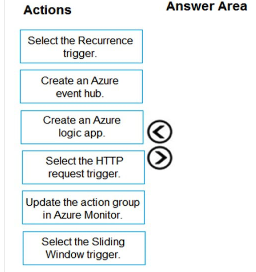


-------

To forward **Azure Monitor alert details** to a third-party system with **minimal administrative effort**, the best approach is to use **Azure Logic Apps** triggered by an HTTP webhook from **Azure Monitor**.

Azure Monitor **Action Groups** can call a **webhook**, and a Logic App can expose an **HTTP request trigger** endpoint.

Correct order of actions

- 1️⃣ **Create an Azure logic app.**
- 2️⃣ **Select the HTTP request trigger.**
- 3️⃣ **Update the action group in Azure Monitor.**

Explanation

* **Create Azure Logic App** → provides the workflow to send alert data to the third-party system.
* **HTTP request trigger** → generates a **webhook endpoint URL** that Azure Monitor can call when the alert fires.
* **Update the Azure Monitor Action Group** → configure it to send alert data to the Logic App endpoint.

This approach avoids custom scripts or additional infrastructure.


❌ Why the other options are incorrect

| Option                 | Reason                                   |
| ---------------------- | ---------------------------------------- |
| Recurrence trigger     | Used for scheduled workflows, not alerts |
| Sliding Window trigger | Used for streaming/event processing      |
| Create Azure Event Hub | Adds unnecessary complexity              |


✅ **Final sequence**

1. **Create an Azure logic app**
2. **Select the HTTP request trigger**
3. **Update the action group in Azure Monitor**

### Question #6  💩💩💩

DRAG DROP 

You are using the Dependency Tracker extension in a project in Azure DevOps.

You generate a risk graph for the project.

**What should you use in the risk graph to identify the number of dependencies and the risk level of the project?** 

To answer, drag the appropriate elements to the correct data points. Each element may be used once, more than once, or not at all. You may need to drag the split bar between panes or scroll to view content.

NOTE: Each correct selection is worth one point.

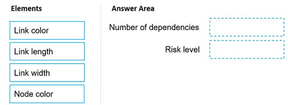

--------

In the **Dependency Tracker risk graph** in **Azure DevOps**, different visual properties represent different metrics.

Correct mapping

| Data point                 | Element to use |
| -------------------------- | -------------- |
| **Number of dependencies** | **Link width** |
| **Risk level**             | **Node color** |

Explanation

* **Link width** → Thicker links indicate **more dependencies** between items.
* **Node color** → Colors (for example green/yellow/red) represent the **risk level** of the node/project.

Why the other options are incorrect

* **Link color** → Typically used for relationship types, not dependency counts.
* **Link length** → Usually just layout spacing in graph visualization.

✅ **Final Answer**

* **Number of dependencies → Link width**
* **Risk level → Node color**


### Question-7

You have an Azure DevOps organization named Contoso and an Azure subscription. 

The subscription contains an Azure virtual machine scale set named VMSS1 that is configured for autoscaling.

You have a project in Azure DevOps named Project. Project is used to build a web app named App1 and deploy App1 to VMSS1.

You need to ensure that an email alert is generated whenever VMSS1 scales in or out.

Solution: From Azure DevOps, configure the Service hooks settings for Project1.

Does this meet the goal?

* A. Yes
* B. No

-------

The correct answer is:

**B. No** ✅


Explanation:

The requirement:

* **Generate an email alert whenever VMSS1 scales in or out.**

The proposed solution:

* Configure **Service Hooks in Azure DevOps for Project1**

**Why this does NOT meet the goal:**

* **Azure DevOps Service Hooks** are used to integrate **Azure DevOps events** (like work items, builds, pull requests) with external services (Slack, Teams, Jenkins, etc.).
* **VMSS scaling events** are **Azure platform events**, not DevOps project events.
* Service Hooks cannot natively monitor VMSS scaling or trigger alerts for it.

**Correct approach:**

1. Use **Azure Monitor** to track the **VMSS metric `Capacity` or instance count`**.
2. Create an **alert rule** that triggers when the scale set scales in or out.
3. Attach an **action group** to send an **email notification**.

This approach directly monitors **VMSS autoscaling events** and sends emails as required.


✅ **Final answer: B. No**


### Question-8

You have an Azure DevOps organization named Contoso and an Azure subscription. The subscription contains an Azure virtual machine scale set named VMSS1 that is configured for autoscaling.

You have a project in Azure DevOps named Project. Project is used to build a web app named App1 and deploy App1 to VMSS1.

You need to ensure that an email alert is generated whenever VMSS1 scales in or out.

**Solution: From Azure Monitor, create an action group**.

Does this meet the goal?

* A. Yes
* B. No

---

Answer: A

**A. Yes**

Creating an **action group in Azure Monitor** is a required part of setting up alerts. Action groups define *what happens* when an alert is triggered (e.g., sending an email notification).

To meet the goal fully, you would:

1. Configure a **metric alert** for VMSS1 (e.g., based on scale events like instance count changes).
2. Associate that alert with the **action group** to send emails.

Since the solution specifies creating an action group (which is necessary for email alerts), it **meets the goal** in this context.


#### Question-8 (1)

Solution: From Azure Monitor, configure the autoscale settings.

-----

The correct answer is **B. No**.

Explanation:

While an **action group** is a necessary component for sending the email (it defines the notification recipients), it is not a complete solution. An action group by itself does not monitor the Virtual Machine Scale Set (VMSS) or trigger anything.

To achieve the goal, you must perform two steps:

1.  **Create an Action Group:** To define the email notification destination.
2.  **Create an Alert Rule:** Specifically, an **Activity Log Alert** rule in Azure Monitor. This rule must be configured to monitor the VMSS for autoscale events (scale-in and scale-out) and then trigger the action group you created.

Because the proposed solution only creates the notification preference but does not configure the logic to monitor the scaling events, it does not meet the goal.


### Question-9

You use GitHub for source control.

A file that contains sensitive data is committed accidentally to the Git repository of a project.

You need to delete the file and its history form the repository.

Which two tools can you use? Each correct answer presents a complete solution.

NOTE: Each correct selection is worth one point.

* A. the git filter-branch command
* B. BFG Repo-Cleaner
* C. the git rebase command
* D. GitHub Desktop

-----------

The correct answers are:

- **A. the `git filter-branch` command**
- **B. BFG Repo-Cleaner**

Why these are correct:

Both tools are specifically designed to **rewrite Git history** and permanently remove sensitive files from **all commits**:

✅ `git filter-branch`

* Native Git tool
* Can remove files from the entire repository history
* Powerful but slow and complex for large repos

✅ **BFG Repo-Cleaner**

* Purpose-built tool for removing secrets/files from Git history
* Much faster and safer than `filter-branch`
* Industry standard for this task


Why the others are wrong:

❌ **C. `git rebase`**

* Rewrites commit history, but **not suitable for removing a file from all historical commits**

❌ **D. GitHub Desktop**

* GUI client only
* Cannot rewrite repository history or purge sensitive data


Final Answer:

**A and B** ✅


Answer: AB

To entirely remove unwanted files from a repository's history you can use either the git filter-branch command or the BFG Repo-Cleaner open source tool.

## Topic 4 - Question Set 4

### Question #1

You have an Azure subscription that contains the resources shown in the following table.

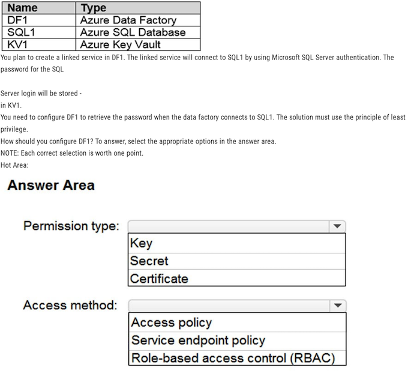

Based on the requirements for Azure Data Factory (DF1) to retrieve a password from Azure Key Vault (KV1) using the principle of least privilege, the correct selections are:

**1. Permission type: Secret**

*   **Reason:** In Azure Key Vault, **Secrets** are specifically designed to store sensitive strings such as passwords, connection strings, and API keys. 
*   **Why not others?** *Keys* are used for cryptographic operations (like encryption/decryption), and *Certificates* are used for managing X.509 certificates.

**2. Access method: Access policy**

*   **Reason:** To follow the principle of least privilege, you create an **Access policy** in the Key Vault specifically for the Managed Identity of the Data Factory (DF1). You would grant it only the **"Get"** permission for **Secrets**. This ensures the Data Factory can only read the secret it needs and cannot list, delete, or modify any other contents.
*   **Note on RBAC:** While Azure RBAC is a modern alternative, in the context of standard Azure implementation exams for this scenario, "Access policy" is the traditional and most common method used to grant specific "Secret Get" permissions to a service identity. 

**Summary of Configuration:**

1.  Store the SQL password in **KV1** as a **Secret**.
2.  In **KV1**, go to Access Policies and add a new policy.
3.  Select **Secret Permissions** and check **Get**.
4.  Select the **Principal** (the Managed Identity of **DF1**).
5.  In **DF1**, create the linked service and point it to the Key Vault secret.

### Question #7


Your company has a project in Azure DevOps for a new web application.

The company identifies security as one of the highest priorities.

You need to recommend a solution to minimize the likelihood that infrastructure credentials will be leaked. What should you recommend?

A. Add a Run Inline Azure PowerShell task to the pipeline.

B. Add a PowerShell task to the pipeline and run Set-AzureKeyVaultSecret.

C. Add an Azure Key Vault task to the pipeline.

D. Add Azure Key Vault references to Azure Resource Manger templates.

--------


The goal is to **minimize the likelihood that infrastructure credentials are leaked** when using **Azure DevOps** pipelines.

The best approach is to **retrieve secrets directly from** **Azure Key Vault** during pipeline execution rather than storing them in scripts, variables, or templates.

✅ Correct Answer

**C. Add an Azure Key Vault task to the pipeline.**

Why this is correct

The **Azure Key Vault task** in **Azure Pipelines**:

* Retrieves secrets securely from **Azure Key Vault** at runtime.
* Prevents secrets from being stored in:

  * pipeline YAML
  * scripts
  * source control
* Supports **secret masking in logs**.
* Uses **service connections and managed authentication**.

This is the **recommended Microsoft DevOps security practice**.

Why the other options are incorrect

**A. Run Inline Azure PowerShell**

* Credentials may appear in scripts or logs.

**B. Set-AzureKeyVaultSecret**

* This **writes secrets**, not retrieves them.
* Does not solve the leakage problem.

**D. Key Vault references in ARM templates**

* Used for **deployments**, but secrets may still appear in pipeline variables depending on configuration.
* Less secure than retrieving them at runtime via the pipeline task.


✅ **Final Answer: C**

###  Question #9


You create a Microsoft ASP.NET Core application.

You plan to use Azure Key Vault to provide secrets to the application as configuration data.


You need to create a Key Vault access policy to assign secret permissions to the application. The solution must use the principle of least privilege.

Which secret permissions should you use?

A. List only

B. Get only

C. Get and List


The correct answer is:

✅ **B. Get only**

Explanation

When an **ASP.NET Core** application retrieves secrets from **Azure Key Vault** as configuration data, it only needs permission to **read a specific secret value**.

The **principle of least privilege** means granting **only the minimum permissions required**.

* **Get** → Allows the application to **retrieve the value of a secret**.
* **List** → Allows enumeration of **all secrets in the vault**, which is unnecessary and increases exposure risk.

Since the application already knows the secret name (configured in the app settings), it **does not need to list secrets**.

Why the other option is incorrect

❌ **A. List only**

* Allows seeing the **names of all secrets**, but **not retrieving their values**.
* The application would still **not be able to read the secret**.


✅ **Final Answer: B. Get only**


### Question #10

DRAG DROP 

Your company has a project in Azure DevOps.

You plan to create a release pipeline that will deploy resources by using Azure Resource Manager templates. The templates will reference secrets stored in Azure Key Vault.

You need to recommend a solution for accessing the secrets stored in the key vault during deployments. The solution must use the principle of least privilege.

What should you include in the recommendation? To answer, drag the appropriate configurations to the correct targets. Each configuration may be used once, more than once, or not at all. You may need to drag the split bar between panes or scroll to view content.

NOTE: Each correct selection is worth one point.

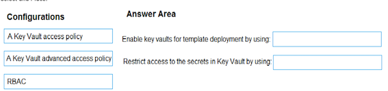


To deploy **ARM templates** that reference secrets in **Azure Key Vault**, two things must be configured:

1. Allow **Azure Resource Manager** to access Key Vault during deployment.
2. Control who can access the secrets with **least privilege**.

Correct configuration

| Requirement                                              | Configuration                          |
| -------------------------------------------------------- | -------------------------------------- |
| **Enable key vaults for template deployment by using**   | **A Key Vault advanced access policy** |
| **Restrict access to the secrets in Key Vault by using** | **A Key Vault access policy**          |

Explanation

**1️⃣ Key Vault advanced access policy**

* This enables **“Allow access to Azure Resource Manager for template deployment.”**
* Without this setting, **ARM templates cannot retrieve secrets during deployment**.

**2️⃣ Key Vault access policy**

* Used to grant **specific secret permissions (Get)** to the deployment identity.
* Supports **principle of least privilege** by granting minimal permissions.

Why RBAC is not selected

Although **Azure role-based access control** can control resource permissions, **Key Vault secret access in this scenario is typically handled using Key Vault access policies**, especially for ARM template deployments.

✅ **Final Answer**

* Enable key vaults for template deployment → **A Key Vault advanced access policy**
* Restrict access to the secrets → **A Key Vault access policy**

### Question #11

DRAG DROP 

You need to configure access to Azure DevOps agent pools to meet the following requirements:

✑ Use a project agent pool when authoring build or release pipelines.

✑ View the agent pool and agents of the organization.

✑ Use the principle of least privilege.


Which role memberships are required for the Azure DevOps organization and the project? To answer, drag the appropriate role memberships to the correct targets. Each role membership may be used once, more than once, or not at all. You may need to drag the split bar between panes or scroll to view content.

NOTE: Each correct selection is worth one point.

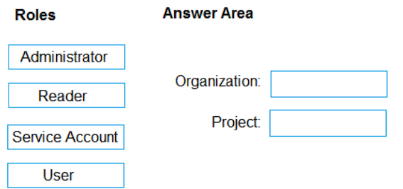

To configure access to **Azure DevOps** agent pools with **least privilege**, analyze the requirements:

Requirements

1. **View the agent pool and agents of the organization**
2. **Use a project agent pool when authoring build or release pipelines**
3. **Follow the principle of least privilege**

Correct Role Assignments

| Scope            | Role                |
| ---------------- | ------------------- |
| **Organization** | **Reader**          |
| **Project**      | **Service Account** |

Explanation

Organization → **Reader**

* Allows the user to **view agent pools and agents at the organization level**.
* Does **not allow modification**, satisfying **least privilege**.

Project → **Service Account**

* Allows pipelines in the project to **use the agent pool**.
* Necessary for **build and release pipelines to run on the pool**.

✅ **Final Answer**

* **Organization:** Reader
* **Project:** Service Account


### Question #16

Your company has an Azure subscription named Subscription1. Subscription1 is associated to an Azure Active Directory tenant named contoso.com.

You need to provision an Azure Kubernetes Services (AKS) cluster in Subscription1 and set the permissions for the cluster by using RBAC roles that reference the identities in contoso.com.

Which three objects should you create in sequence? To answer, move the appropriate objects from the list of objects to the answer area and arrange them in the correct order.

Select and Place:

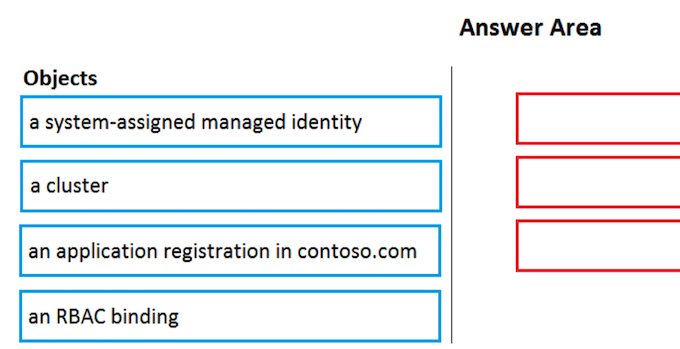

To configure **RBAC for an AKS cluster using Azure AD identities**, the objects must be created in the correct dependency order.

Relevant services:

* Azure Kubernetes Service
* Microsoft Entra ID

Correct Sequence

1️⃣ **an application registration in contoso.com**
2️⃣ **a cluster**
3️⃣ **an RBAC binding**

Explanation

**1. Application registration in contoso.com**

* Registers the identity in **Microsoft Entra ID** (Azure AD).
* This identity will later be referenced by Kubernetes RBAC.

**2. Cluster**

* Create the **AKS cluster** configured to integrate with Azure AD.

**3. RBAC binding**

* Create a Kubernetes **RoleBinding or ClusterRoleBinding** that maps the Azure AD identity to a Kubernetes role.


✅ **Final Answer Order**

1. **an application registration in contoso.com**
2. **a cluster**
3. **an RBAC binding**


If you're preparing for the **AZ-400 / DevOps exam**, I can also show you a **fast rule to answer all AKS RBAC questions in seconds** (these questions appear frequently).


### Question #17

HOTSPOT You manage build and release pipelines by using Azure DevOps. Your entire managed environment resides in Azure.

You need to configure a service endpoint for accessing Azure Key Vault secrets. The solution must meet the following requirements: 

✑ Ensure that the secrets are retrieved by Azure DevOps.

✑ Avoid persisting credentials and tokens in Azure DevOps.

How should you configure the service endpoint? To answer, select the appropriate options in the answer area.

NOTE: Each correct selection is worth one point.


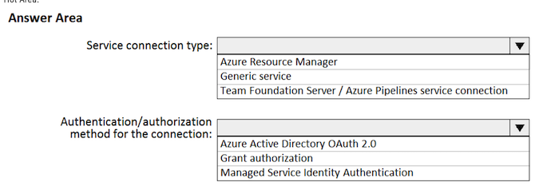

Based on the requirements to access Azure Key Vault while ensuring that no credentials or tokens are stored within Azure DevOps, here is the correct configuration:

**Answer Area**

*   **Service connection type:** **Azure Resource Manager**
*   **Authentication/authorization method for the connection:** **Managed Service Identity Authentication**

**Explanation:**

1.  **Service connection type: Azure Resource Manager**
    *   This is the standard service connection type required to allow Azure Pipelines to communicate with Azure subscription resources, including Azure Key Vault.

2.  **Authentication/authorization method: Managed Service Identity Authentication**
    *   **The Requirement:** "Avoid persisting credentials and tokens in Azure DevOps."
    *   **The Solution:** Managed Service Identity (MSI), now commonly referred to as **Managed Identities for Azure resources**, allows Azure services to authenticate to other Azure services without needing a client secret or password stored in the configuration. 
    *   If you use a Service Principal (OAuth), you have to store a "Client Secret" or certificate in Azure DevOps. By using **Managed Identity**, the build agent uses its own identity (assigned in Azure) to request a token dynamically. This ensures that no sensitive credentials are ever typed into or persisted within the Azure DevOps service connection settings.


### Question #18

You are deploying a server application that will run on a Server Core installation of Windows Server 2019. You create an Azure key vault and a secret.

You need to use the key vault to secure API secrets for third-party integrations.

Which three actions should you perform? Each correct answer presents part of the solution.

NOTE: Each correct selection is worth one point.

A. Configure RBAC for the key vault.

B. Modify the application to access the key vault.

C. Configure a Key Vault access policy.

D. Deploy an Azure Desired State Configuration (DSC) extension.

E. Deploy a virtual machine that uses a system-assigned managed identity.

----------


The three actions you should perform are:

**B. Modify the application to access the key vault.**
**C. Configure a Key Vault access policy.**
**E. Deploy a virtual machine that uses a system-assigned managed identity.**

Explanation:

To allow a server application running on a VM to securely retrieve secrets from Azure Key Vault without hardcoding credentials, you follow these steps:

1.  **Assign an Identity (E):** By enabling a **system-assigned managed identity** on the Windows Server VM, you give the VM its own identity in Microsoft Entra ID (formerly Azure AD). This identity is automatically managed by Azure.
2.  **Grant Permissions (C):** You must then go to the Key Vault and **configure an access policy**. This policy should specifically grant the VM's managed identity the **Secret: Get** permission. This ensures the VM (and the app running on it) has the authorization to read the secret.
3.  **Update Application Logic (B):** The application code must be **modified** to use the Azure SDK (like the `SecretClient` class in .NET). Instead of looking for a password in a config file, the app will now request a token from the local Managed Identity endpoint and use that token to fetch the secret directly from the Key Vault at runtime.

Why others are not included:

*   **A. Configure RBAC:** While RBAC can be used for Key Vault data plane access, **Access Policy** (C) is the traditional and most common method used in these certification scenarios. You generally use one or the other for the specific task of secret retrieval.
*   **D. DSC extension:** Desired State Configuration is used for configuring the operating system and software on the VM, but it is not a requirement for an application to communicate with Key Vault.

### Question #19


**HOTSPOT -**

Your company is creating a suite of three mobile applications.

You need to control access to the application builds. The solution must must be managed at the organization level.

What should you use? To answer, select the appropriate options in the answer area.

NOTE: Each correct selection is worth one point.

**Answer Area**

*   **Groups to control the build access:**
  *   [Dropdown: Active Directory groups / Azure Active Directory groups / Microsoft Visual Studio App Center distribution groups]
*   **Group type:**
  *    [Dropdown: Private / Public / Shared]

---

**Correct Selection**

**1. Groups to control the build access: Microsoft Visual Studio App Center distribution groups**

*   **Reason:** Visual Studio App Center is the primary Microsoft service for managing the mobile application lifecycle (Build, Test, Distribute). To control who can download and install mobile builds, you use "Distribution Groups" within App Center.

**2. Group type: Shared**

*   **Reason:** The requirement states the solution must be managed at the **organization level** for a **suite of three apps**. In App Center, there are two types of distribution groups:
    *   **Private/Standard groups:** Belong to a single specific app.
    *   **Shared groups:** Are created at the **Organization** level. Once created at the org level, they can be associated with multiple apps in the suite. This allows you to manage one list of users (e.g., "Internal QA Team") across all three applications simultaneously.


### Question #21

You have a tenant in Microsoft Azure Active Directory (Azure AD), part of Microsoft Entra. The tenant contains three groups named Group1, Group2, and Group3.

You create a new project in Azure DevOps named Project1.

You need to secure the service connections for Project1. The solution must meet the following requirements:

- • The members of Group1 must be able to share and unshare a service connection with other projects.
- • The members of Group2 must be able to rename a service connection and update the description.
- • The members of Group3 must be able to use the service connection within build or release pipelines.
- • The principle of least privilege must be followed.

Which permission should you grant to each group? To answer, drag the appropriate permissions to the correct groups. Each permission may b used once, more than once, or not at all. You may need to drag the split bar between panes or scroll to view content.


NOTE: Each correct selection is worth one point.

Permissions List: 

- Contributor,
- Creator,
- Organization-level Administrator,
- Project-level Administrator,
- User.

**Answer Area**

- Group 1
- Group 2
- Group 3


-----------


Based on the requirements for securing service connections in Azure DevOps using the principle of least privilege, here are the correct permission assignments:

**Answer Area**

*   **Group 1:** **Project-level Administrator**
*   **Group 2:** **Contributor**
*   **Group 3:** **User**

---

In Azure DevOps, **service connections** have role-based permissions. The relevant capabilities are:

* **User** – Can *use* the service connection in pipelines.
* **Contributor** – Can *edit properties* such as name and description.
* **Administrator** – Can manage security and share/unshare across projects.
  (From the options given, the closest match is **Project-level Administrator**.)
* **Creator** – Can create service connections.

Applying the **principle of least privilege**:

| Group      | Required capability                                  | Correct permission              |
| ---------- | ---------------------------------------------------- | ------------------------------- |
| **Group1** | Share/unshare service connection with other projects | **Project-level Administrator** |
| **Group2** | Rename service connection and update description     | **Contributor**                 |
| **Group3** | Use service connection in build/release pipelines    | **User**                        |

✅ **Final Answer**

* **Group1:** Project-level Administrator
* **Group2:** Contributor
* **Group3:** User


### Question #22


You have the following Azure policy.

```
if: {
  allof: [
    {
      "field": "type",
      "equals": "Microsoft.Storage/storageAccounts"
    },
    {
      "field": "Microsoft.Storage/storageAccounts/supportsHttpsTrafficOnly",
      "notEquals": "true"
    }
  ]
},
then: {
  effect: "deny"
}
```

You assign the policy to the Tenant root group. What is the effect of the policy?

A. prevents all HTTP tra®c to existing Azure Storage accounts

B. ensures that all tra®c to new Azure Storage accounts is encrypted

C. prevents HTTPS tra®c to new Azure Storage accounts when the accounts are accessed over the Internet

D. ensures that all data for new Azure Storage accounts is encrypted at rest


—————---

The policy targets resources of type **Microsoft.Storage/storageAccounts** and checks the property **`supportsHttpsTrafficOnly`**.

Policy Logic

**IF**

* Resource type = Storage Account
* AND `supportsHttpsTrafficOnly` **≠ true**

**THEN**

* **Effect = deny**

This means:

* When **creating or updating** a storage account, if **HTTPS-only is NOT enabled**, the request is **blocked**.
* The policy **does not modify existing accounts**.
* It **does not encrypt data** or change traffic automatically — it only **denies non-compliant configurations**.

What `supportsHttpsTrafficOnly` means

In **Azure Storage**, setting **HTTPS traffic only = true** forces clients to use **HTTPS**, preventing HTTP access.

Result

* Any **new storage account** must have **HTTPS-only enabled**, meaning all traffic must be **encrypted in transit**.

Correct Answer

✅ **B. ensures that all traffic to new Azure Storage accounts is encrypted**

*(Because HTTPS-only enforcement ensures encrypted communication.)*


### Question #24


You use GitHub Enterprise Server as a source code repository.

You create an Azure DevOps organization named Contoso.

In the Contoso organization, you create a project named Project1.

You need to link GitHub commits, pull requests, and issues to the work items of Project1. The solution must use OAuth-based authentication. Which three actions should you perform in sequence? To answer, move the appropriate actions from the list of actions to the answer area and arrange them in the correct order.

Actions

- From Developer settings in GitHub Enterprise Server, register a new OAuth app.
- From Project Settings in Azure DevOps, create a service hook subscription.
- From Organization settings in Azure DevOps, connect to Azure Active Directory (Azure AD).
- From Project Settings in Azure DevOps, add a GitHub connection.
- From Organization settings in Azure DevOps, add an OAuth configuration.
- From Developer settings in GitHub Enterprise Server, generate a private key.

--------------


To link GitHub Enterprise Server (GHES) commits, pull requests, and issues to Azure DevOps work items using OAuth-based authentication, you should perform these three actions in the following sequence:

**Answer Area**

1.  **From Developer settings in GitHub Enterprise Server, register a new OAuth app.**
2.  **From Organization settings in Azure DevOps, add an OAuth configuration.**
3.  **From Project Settings in Azure DevOps, add a GitHub connection.**

**Explanation:**

*   **Step 1:** First, you must go to your GitHub Enterprise Server instance and **register a new OAuth app**. This process generates the **Client ID** and **Client Secret** that Azure DevOps will need to authenticate and communicate with your private GitHub server.
*   **Step 2:** Next, you go to the **Organization settings** in Azure DevOps to **add an OAuth configuration**. This is where you register your GHES instance URL along with the Client ID and Client Secret you obtained in Step 1. This "registers" the GHES server as a known, authenticated source for the entire Azure DevOps organization.
*   **Step 3:** Finally, you navigate to the specific **Project Settings** of Project1 and **add a GitHub connection**. During this step, you select the OAuth configuration created in Step 2, authorize the connection, and then choose the specific repositories you want to link to your project's work items.

### Question-25

DRAG DROP 

You are configuring an Azure DevOps deployment pipeline. The deployed application will authenticate to a web service by using a secret stored in an Azure key vault.

You need to use the secret in the deployment pipeline.

Which three actions should you perform in sequence? To answer, move the appropriate actions from the list of actions to the answer area and arrange them in the correct order.

Select and Place:

**Actions**

- Create a service principal in Azure Active Directory (Azure AD).
- Add an app registration in Azure Active Directory (Azure AD).
- Configure an access policy in the key vault.
- Generate a self-signed certificate.
- Add an Azure Resource Manager service connection to the pipeline.
- Export a certificate from the key vault.

**Answer Area**

------


To configure an Azure DevOps deployment pipeline to use a secret from Azure Key Vault, you should perform these three actions in this sequence:
**Answer Area**

1.  **Create a service principal in Azure Active Directory (Azure AD).**
2.  **Configure an access policy in the key vault.**
3.  **Add an Azure Resource Manager service connection to the pipeline.**

**Explanation:**

*   **Step 1: Create a service principal in Azure Active Directory (Azure AD).**
    You first need to create a dedicated identity (the Service Principal) that Azure DevOps will use to communicate with your Azure subscription. This identity consists of an Application ID and a Client Secret (or certificate).

*   **Step 2: Configure an access policy in the key vault.**
    Once the Service Principal is created, you must go to the Azure Key Vault and create an **Access Policy**. You select the Service Principal from Step 1 as the principal and grant it the **Secret: Get** and **Secret: List** permissions. This authorization ensures that when the pipeline attempts to fetch the secret, the Key Vault will allow the request.

*   **Step 3: Add an Azure Resource Manager service connection to the pipeline.**
    Finally, you go to Azure DevOps and create a **Service Connection** of the type "Azure Resource Manager." You use the credentials of the Service Principal you created in Step 1. This connects your DevOps project to your Azure subscription, allowing the pipeline tasks (such as the "Azure Key Vault" task) to use that authenticated connection to retrieve secrets and perform deployments.

### Question #26

DRAG DROP You have a private project in Azure DevOps and two users named User1 and User2.

You need to add User1 and User2 to groups to meet the following requirements:

✑ User1 must be able to create a code wiki.

✑ User2 must be able to edit wiki pages.

✑ The solution must use the principle of least privilege.


To which group should you add each user? To answer, drag the appropriate groups to the correct users. Each group may be used once, more than once, or not at all. You may need to drag the split bar between panes or scroll to view content.

NOTE: Each correct selection is worth one point.

Select and Place:

**Groups**

- Build Administrators
- Contributors
- Project Administrators
- Project Valid Users
- Stakeholders

Answer Area

- User1:
- User2:

------

To meet the requirements for Azure DevOps wiki management while following the principle of least privilege, the users should be added to the following groups:

**Answer Area**

*   **User1:** **Project Administrators**
*   **User2:** **Contributors**

**Explanation:**

1.  **User1 (Create a code wiki):**

    In Azure DevOps, there is a distinction between a "Project Wiki" (provisioned) and a "**Code Wiki**" (published from a Git repository). To publish code as a wiki, a user requires the **Manage Wiki** permission. By default, this permission is granted only to the **Project Administrators** group. While you could technically grant this permission to a specific user, within the context of the standard Azure DevOps security groups, Project Administrator is the role required to create/manage the wiki structure itself.

3.  **User2 (Edit wiki pages):**

   
    The **Contributors** group is the standard group for team members who need to perform day-to-day tasks. Members of the Contributors group have the necessary permissions to create, edit, and delete pages within an existing wiki by default. 

**Why not others?**

*   **Stakeholders:** In a private project, Stakeholders have very limited access and generally cannot edit wiki pages.
*   **Build Administrators:** This group is focused on CI/CD pipeline management and does not grant specific wiki management rights.
*   **Project Valid Users:** This is a system group that includes everyone in the project; it is not used to grant specific functional permissions like editing or creating wikis.


### Question #27

You use WhiteSource Bolt to scan a Node.js application.

The WhiteSource Bolt scan identifies numerous libraries that have invalid licenses. The libraries are used only during development and are not part of a production deployment.

You need to ensure that WhiteSource Bolt only scans production dependencies.

Which two actions should you perform? Each correct answer presents part of the solution.

NOTE: Each correct selection is worth one point.

A. Run npm install and specify the --production flag.

B. Modify the WhiteSource Bolt policy and set the action for the licenses used by the development tools to Reassign.

C. Modify the devDependencies section of the project's Package.json file.

D. Configure WhiteSource Bolt to scan the node_modules directory only.

---------


To ensure WhiteSource Bolt (now Mend) only scans production dependencies and ignores libraries with invalid licenses used during development, you should perform the following two actions:

**A. Run `npm install` and specify the `--production` flag.**

**D. Configure WhiteSource Bolt to scan the `node_modules` directory only.**

Explanation:

1.  **Run `npm install --production` (A):** In a Node.js environment, this command ensures that only the packages listed under the `dependencies` section of your `package.json` are installed. It explicitly skips everything in the `devDependencies` section. This effectively "cleans" the build environment so that development-only libraries are physically absent from the disk.

2.  **Configure WhiteSource Bolt to scan the `node_modules` directory only (D):** By default, WhiteSource Bolt scans the entire project directory, including manifest files like `package.json`. Even if you didn't install the dev dependencies, the scanner might still "see" them listed in the `package.json` file and report them as risks. By directing the scanner to look **only** at the `node_modules` folder, you force it to report on the actual files present on the disk. Since you only installed production dependencies in the previous step, only those will be scanned.

Why other options are incorrect:

*   **B (Policy/Reassign):** WhiteSource Bolt is a simplified, free version of the full Mend product. It lacks the advanced policy engine and "Reassign" workflow features found in the Enterprise version.
*   **C (Modify devDependencies):** The prompt states the libraries are already identified as development-only. Modifying the `package.json` file to move them wouldn't change the scanner's behavior unless you also performed the production-only install and targeted scan.


### Question #28

After you answer a question in this section, you will NOT be able to return to it. As a result, these questions will not appear in the review screen.

You plan to update the Azure DevOps strategy of your company.

You need to identify the following issues as they occur during the company's development process:

✑ Licensing violations 


✑ Prohibited libraries Solution: You implement continuous integration.

Does this meet the goal?

A. Yes

B. No

--------


The correct answer is **B. No**.

Explanation:

While implementing **Continuous Integration (CI)** is a prerequisite for automating these checks, the CI process itself does not identify licensing violations or prohibited libraries. 

A standard CI pipeline is designed to automate the building and testing of code. To identify licensing issues and prohibited libraries, you must integrate a **Software Composition Analysis (SCA)** tool—such as **WhiteSource Bolt (Mend)**, **Snyk**, or **Black Duck**—into your CI pipeline. 

Without the specific scanning tool, the CI pipeline will successfully build the application but will remain unaware of any legal or policy risks within the third-party dependencies.


### Question #33

Your company has an Azure subscription.

The company requires that all resource groups in the subscription have a tag named organization set to a value of Contoso. You need to implement a policy to meet the tagging requirement.

How should you complete the policy? To answer, select the appropriate options in the answer area.

NOTE: Each correct selection is worth one point.


```json
{
  "policyRule": {
    "if": {
      "allOf": [
        {
          "field": "type",
          "equals": [Dropdown 1]
        },
        {
          "not": {
            "field": "tags['organization']",
            "equals": "Contoso"
          }
        }
      ]
    },
    "then": {
      "effect": [Dropdown 2],
      "details": [
        {
          "field": "tags['organization']",
          "value": "Contoso"
        }
      ]
    }
  }
}
```

**Dropdown Options**

**Dropdown 1 (field: "type"):**

*   "Microsoft.Resources/deployments"
*   "Microsoft.Resources/subscriptions"
*   "Microsoft.Resources/subscriptions/resourceGroups"

**Dropdown 2 (effect):**

*   "Append"
*   "Deny"
*   "DeployIfNotExists"

--------

To complete the Azure Policy to ensure all resource groups have the required tag, you should select the following options:

**Answer Area**

*   **Dropdown 1 (field: "type"):** **"Microsoft.Resources/subscriptions/resourceGroups"**
*   **Dropdown 2 (effect):** **"Append"**

**Explanation:**

1.  **Dropdown 1 ("Microsoft.Resources/subscriptions/resourceGroups"):**

    The requirement specifically states that "all **resource groups**" must have the tag. In Azure Resource Manager, the specific resource type for a resource group is `Microsoft.Resources/subscriptions/resourceGroups`. Targeting this type ensures the policy only evaluates resource groups and not the resources contained within them.

2.  **Dropdown 2 ("Append"):**

   
    The **Append** effect is used to add fields to a resource during creation or update. The JSON structure in the "then" block (containing `"details"` with a `"field"` and `"value"`) is the specific syntax used by the Append effect. 
    *   **Logic:** If the resource is a Resource Group AND the `organization` tag is not already set to `Contoso`, the policy will automatically **append** (add) that tag to the resource group upon deployment.
    *   **Why not Deny?** While `Deny` would stop a user from creating a group without the tag, it does not use the `"details"` block shown in the snippet.
    *   **Why not DeployIfNotExists?** This effect is used for deploying complex sub-resources or configurations via ARM templates (like enabling a diagnostic setting) and requires a much more extensive `details` block including role IDs and deployment templates.

### Question #34

You need to configure GitHub to use Azure Active Directory (Azure AD) for authentication. What should you do first?

A. Create a conditional access policy in Azure AD.

B. Register GitHub in Azure AD.

C. Create an Azure Active Directory B2C (Azure AD B2C) tenant.

D. Modify the Security settings of the GitHub organization.

---------

The correct answer is **B. Register GitHub in Azure AD.**

Explanation:

To configure Single Sign-On (SSO) between GitHub and Azure Active Directory (now Microsoft Entra ID), you are establishing a relationship where Azure AD acts as the **Identity Provider (IdP)** and GitHub acts as the **Service Provider (SP)**.

1.  **Why Register First:** Before you can configure settings in GitHub, Azure AD needs to know that GitHub is a trusted application. You do this by adding the "GitHub Enterprise Cloud" application from the Azure AD Gallery. This "registration" provides you with the essential pieces of information required by GitHub:
    *   The **SAML Signing Certificate**.
    *   The **Login URL**.
    *   The **Azure AD Identifier (Entity ID)**.
2.  **Why not D (Modify GitHub settings):** You cannot complete the security settings in GitHub until you have the URLs and the certificate generated by the Azure AD registration process. 
3.  **Why not A (Conditional Access):** Conditional Access policies are applied to an existing application registration to enforce rules (like MFA). You must register the app before you can apply a policy to it.
4.  **Why not C (Azure AD B2C):** B2C is used for consumer-facing applications. Standard organizational integration uses a standard Azure AD tenant.

**The standard workflow is:**

1.  **Register GitHub** in Azure AD (Add the Enterprise Application).
2.  Configure the **Identifier** and **Reply URL** in Azure AD.
3.  Copy the **SAML details** from Azure AD.
4.  Navigate to GitHub **Security settings** and enable SAML SSO using those details.

### Question #35

You have an Azure DevOps project named Project1 and an Azure subscription named Sub1.

You need to prevent releases from being deployed unless the releases comply with the Azure Policy rules assigned to Sub1. What should you do in the release pipeline of Project1?

A. Add a deployment gate.

B. Modify the Deployment queue settings.

C. Configure a deployment trigger.

D. Create a pipeline variable

-------

The correct answer is **A. Add a deployment gate**.

Explanation:

Azure Pipelines includes a specific feature called **Deployment Gates** designed to integrate with external systems to validate the health and compliance of a release before it is allowed to deploy to an environment.

*   **How it works:** You can add a pre-deployment gate called **Check Azure Policy compliance**.
*   **The Process:** When a release starts, the pipeline pauses at the gate. Azure DevOps then queries the **Azure Policy** service to check the compliance status of the resources in the target subscription or resource group.
*   **The Result:** If the resources are found to be non-compliant with the assigned Azure Policies, the gate will fail, and the release will be prevented from proceeding. You can configure the gate to re-evaluate at specific intervals until the timeout is reached.

Why the other options are incorrect:

*   **B. Deployment queue settings:** These settings control how many releases can run concurrently or how to handle multiple waiting releases. They have no mechanism for policy validation.
*   **C. Deployment trigger:** Triggers (like "Continuous Deployment" or "Scheduled") determine *when* a release starts, but they do not perform security or compliance checks.
*   **D. Pipeline variable:** Variables simply store data (like connection strings or environment names); they do not have the logic to enforce compliance rules.

### Question #36

DRAG DROP You have an Azure Kubernetes Service (AKS) implementation that is RBAC-enabled.

You plan to use Azure Container Instances as a hosted development environment to run containers in the AKS implementation.

You need to configure Azure Container Instances as a hosted environment for running the containers in AKS.

Which three actions should you perform in sequence? To answer, move the appropriate actions from the list of actions to the answer area and arrange them in the correct order.

Select and Place:

**Actions**

Run helm init.

Run az aks install-connector.

Create a YAML file.

Run az role assignment create

Run kubectl apply.

----------


To use **Azure Container Instances** as a hosted development environment with **Azure Kubernetes Service**, you are essentially enabling the **virtual node (ACI connector)** for AKS.

With RBAC enabled, the correct sequence focuses on:

1. Installing the ACI connector
2. Defining the deployment
3. Applying it to the cluster

✅ Correct Order

1. **Run `az aks install-connector`**
   → Installs the ACI connector (virtual node) into the AKS cluster.

2. **Create a YAML file**
   → Define the pod/deployment that will run on ACI (using virtual node).

3. **Run `kubectl apply`**
   → Deploy the YAML configuration to the cluster.

❌ Why not the others?

* **Run helm init** → Deprecated (Helm v3 doesn’t require it)
* **Run az role assignment create** → Not required for this setup in this context
* YAML must exist before applying, so order matters

🧠 Quick exam tip

Whenever you see:

* **AKS + ACI + hosted/virtual node**
  → Think:
  **install connector → define workload → deploy (kubectl apply)**


### Question #39

You administer an Azure DevOps project that includes package feeds.

You need to ensure that developers can unlist and deprecate packages. The solution must use the principle of least privilege. Which access level should you grant to the developers?

A. Collaborator

B. Contributor

C. Owner

----------

In **Azure Artifacts**, feed roles determine what users can do with packages:

* **Collaborator (Reader)** → Can view and download packages only
* **Contributor** → Can publish, update, **unlist, and deprecate packages**
* **Owner** → Full control including permissions management

Requirement

* Developers must **unlist and deprecate packages**
* Must follow **least privilege**

Conclusion

* **Contributor** provides exactly the required permissions without over-privileging

✅ **Correct Answer: B. Contributor**


### Question #40

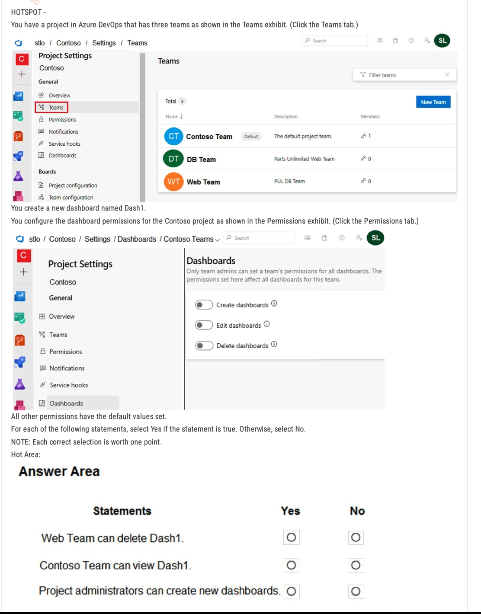

---------

Based on the exhibits provided, here is the analysis and the solution for the Hot Area.

**Analysis of Exhibits**

1.  **Teams Exhibit:** There are three teams in the "Contoso" project: **Contoso Team**, **DB Team**, and **Web Team**.
2.  **Permissions Exhibit:** You are viewing the **Dashboards** permissions specifically for the **Contoso Team**. For this group, the following permissions have been explicitly toggled **OFF** (Greyed out):
    *   Create dashboards
    *   Edit dashboards
    *   Delete dashboards
3.  **Global Context:** The prompt states that "All other permissions have the **default values** set." By default in Azure DevOps, members of the **Contributors** group (which team members belong to) have permissions to create, edit, and delete dashboards.

**Answer Area**

| Statement | Yes | No |
| :--- | :---: | :---: |
| Members of the **Contoso Team** can create a new dashboard. | | **[X]** |
| Members of the **DB Team** can edit Dash1. | **[X]** | |
| Members of the **Web Team** can delete Dash1. | **[X]** | |

**Explanation**

*   **Statement 1 (No):** The permissions exhibit explicitly shows that for the **Contoso Team**, the "Create dashboards" permission is toggled off. This explicit setting overrides any default project permissions.
*   **Statement 2 (Yes):** No specific permissions were modified for the **DB Team**. Therefore, they use the **default values**. In a standard Azure DevOps project, the default permission for project members (Contributors) is "Allow" for editing dashboards.
*   **Statement 3 (Yes):** Similar to the DB Team, the **Web Team** permissions remain at their **default values**. Since the default allows for dashboard management, they are able to delete dashboards.

### Question #42


DRAG DROP You are implementing a package management solution for a Node.js application by using Azure Artifacts.


You need to configure the development environment to connect to the package repository. The solution must minimize the likelihood that credentials will be leaked.

Which file should you use to configure each connection? To answer, drag the appropriate files to the correct connections. Each file may be used once, more than once, or not at all. You may need to drag the split bar between panes or scroll to view content.

NOTE: Each correct selection is worth one point.

Select and Place:

Files

- The .npmrc file in the project
- The .npmrc file in the user’s home folder
- The Package.json file in the project
- The Project.json file in the project

- Feed registry information:
- Credentials:

---------

To configure a Node.js development environment to connect to Azure Artifacts while minimizing the risk of leaking credentials, use the following configuration:

**Answer Area**

*   **Feed registry information:** **The .npmrc file in the project**
*   **Credentials:** **The .npmrc file in the user’s home folder**

**Explanation:**

1.  **Feed registry information:** To ensure that all developers working on the project use the correct Azure Artifacts feed, the registry URL should be stored in the **`.npmrc` file within the project's root directory**. This file is typically checked into source control (Git) so that the configuration is consistent across the team. Since the feed URL itself is not a secret, this is the standard and safe practice.

2.  **Credentials:** To follow the requirement of **minimizing the likelihood that credentials will be leaked**, you must never store authentication tokens (like a Personal Access Token) in a file that is checked into source control. Instead, credentials should be stored in the **global `.npmrc` file located in the user's home folder** (`~/.npmrc` on Linux/macOS or `%USERPROFILE%\.npmrc` on Windows). This file remains local to the developer's machine and is not part of the project repository, preventing secrets from being accidentally pushed to the server.

### Question #43


You have an Azure DevOps project that contains a build pipeline. The build pipeline uses approximately 50 open source libraries. You need to ensure that the project can be scanned for known security vulnerabilities in the open source libraries.

What should you do? To answer, select the appropriate options in the answer area.

NOTE: Each correct selection is worth one point.

**Answer Area** 

**Object to create:**

- A build task
- A deployment task
- An artifacts repository

**Service to use:**

- WhiteSource Bolt
- Bamboo
- CMake
- Chef

--------

To ensure that your project is scanned for known security vulnerabilities in open-source libraries, the correct selections are:

**Answer Area**

*   **Object to create:** **A build task**
*   **Service to use:** **WhiteSource Bolt**

Explanation:

1.  **Service to use (WhiteSource Bolt):** WhiteSource Bolt (now known as Mend) is a Software Composition Analysis (SCA) tool specifically integrated into Azure DevOps. Its primary purpose is to scan your project's open-source dependencies (like your 50 libraries) to identify known security vulnerabilities and license compliance issues.
2.  **Object to create (A build task):** To automate this process within a CI/CD workflow, you add the WhiteSource Bolt extension to your project and then add a **build task** to your pipeline. This ensures that the scan runs automatically every time a build is triggered, allowing you to catch vulnerabilities before the code is even ready for deployment.

**Why not other options?**
*   **Bamboo** is a competing CI/CD platform.
*   **CMake** is a build system generator.
*   **Chef** is an infrastructure configuration management tool.
*   **A deployment task** is too late in the process; security scanning should happen during the build (CI) phase to "shift left" security.


### Question #45


You plan to use Azure Kubernetes Service (AKS) to host containers deployed from images hosted in a Docker Trusted Registry.

You need to recommend a solution for provisioning and connecting to AKS. The solution must ensure that AKS is RBAC-enabled and uses a custom service principal.

Which three commands should you recommend be run in sequence? To answer, move the appropriate commands from the list of commands to the answer area and arrange them in the correct order.

Select and Place:

Commands

- az role assignment create
- az aks get-credentials
- az aks create
- az ad sp create-for-rbac
- kubectl create

**Answer Area**

----------


To provision an Azure Kubernetes Service (AKS) cluster that is RBAC-enabled and uses a custom service principal, you should run the following three commands in sequence:

**Answer Area**

1.  **`az ad sp create-for-rbac`**
2.  **`az aks create`**
3.  **`az aks get-credentials`**

**Explanation:**

1.  **`az ad sp create-for-rbac`**: Since the requirement specifies using a **custom service principal**, you must create this identity first. This command creates a Service Principal in Azure Active Directory (Microsoft Entra ID) and returns the `appId` and `password` (client secret) required by the AKS cluster to interact with other Azure resources (like Load Balancers or Managed Disks).

2.  **`az aks create`**: This is the primary command to provision the cluster. You will pass the `appId` and `password` from the previous step into this command using the `--service-principal` and `--client-secret` parameters. By default, `az aks create` enables RBAC (unless `--disable-rbac` is specified), meeting the requirement.

3.  **`az aks get-credentials`**: Once the cluster is successfully provisioned, you need to connect to it. This command downloads the `kubeconfig` file to your local machine, configuring your local `kubectl` context so you can manage the cluster and deploy containers.


### Question #48

You have a project in Azure DevOps named Project1 that contains two Azure DevOps pipelines named Pipeline1 and Pipeline2.

You need to ensure that Pipeline1 can deploy code successfully to an Azure web app named webapp1. The solution must ensure that Pipeline2 does not have permission to webapp1.

Which three actions should you perform in sequence? To answer, move the appropriate actions from the list of actions to the answer area and arrange them in the correct order.

Select and Place:

**Actions**

- Create a service principal in Azure Active Directory.
- In Project1, create a service connection.
- In Pipeline1, authorize the service connection.
- Create a system-assigned managed identity in Azure Active Directory.
- In Project1, configure permissions.
- In Pipeline1, create a variable.

**Answer Area**

----------------

To ensure that `Pipeline1` can deploy to the web app while `Pipeline2` is restricted, you should perform the following three actions in sequence:

**Answer Area**

1.  **Create a service principal in Azure Active Directory.**
2.  **In Project1, create a service connection.**
3.  **In Project1, configure permissions.**

**Explanation:**

1.  **Create a service principal in Azure Active Directory:** 
    - A Service Principal is the identity that allows Azure DevOps to authenticate with your Azure subscription. You must create this identity first (manually or via the automated setup) to establish the link to `webapp1`.

2.  **In Project1, create a service connection:** 
    - Once the Service Principal exists, you create an **Azure Resource Manager service connection** in `Project1`. This connection uses the Service Principal to provide the pipeline with the necessary authorization to perform deployments to the subscription where `webapp1` resides.

3.  **In Project1, configure permissions:** 
    - By default, a new service connection might be accessible to all pipelines in the project. To meet the requirement of allowing `Pipeline1` while blocking `Pipeline2`, you must go to the **Security** settings of the specific service connection. You will disable the "Grant access permission to all pipelines" option and then specifically add/authorize `Pipeline1`. This ensures `Pipeline2` is unable to use the connection and therefore cannot access `webapp1`.


### Question #49

You need to increase the security of your team's development process.

Which type of security tool should you recommend for each stage of the development process? To answer, drag the appropriate security tools to the correct stages. Each security tool may be used once, more than once, or not at all. You may need to drag the split bar between panes or scroll to view content.

NOTE: Each correct selection is worth one point.

Select and Place:

**Security Tools**

- Penetration testing  
- Static code analysis  
- Threat modeling  

**Answer Area**

- Pull request: [______]  
- Continuous integration: [______]  
- Continuous delivery: [______]

-------


To secure a development pipeline in **Azure DevOps**, align each security practice with the stage where it is most effective:

---

✅ Correct Mapping

* **Pull request:** → **Threat modeling**
* **Continuous integration:** → **Static code analysis**
* **Continuous delivery:** → **Penetration testing**

💡 Explanation

* **Threat modeling (PR stage)**
  → Evaluate design and code changes early to identify potential security risks before merging.

* **Static code analysis (CI stage)**
  → Automatically scans source code for vulnerabilities during builds.

* **Penetration testing (CD stage)**
  → Simulates real-world attacks against deployed applications before/after release.


🧠 Exam tip

Think of the flow:

* **Before merge (PR)** → *Think about threats*
* **During build (CI)** → *Scan code*
* **After deploy (CD)** → *Attack/test system*


### Question #50

You plan to use a NuGet package in a project in Azure DevOps. The NuGet package is in a feed that requires authentication. You need to ensure that the project can restore the NuGet package automatically.

What should the project use to automate the authentication?

A. an Azure Automation account

B. an Azure Artifacts Credential Provider

C. an Azure Active Directory (Azure AD) account that has multi-factor authentication (MFA) enabled

D. an Azure Active Directory (Azure AD) service principal

-----------


To automatically restore a NuGet package from an authenticated feed in **Azure DevOps**, the solution must handle authentication **non-interactively** during builds.

Key point

* Builds and restores run in automated pipelines → **no manual sign-in**
* Therefore, you need a mechanism that can **securely supply credentials automatically**

Correct approach

The **Azure Artifacts Credential Provider** is designed specifically for this:

* Integrates with NuGet tooling
* Automatically retrieves and injects credentials for Azure Artifacts feeds
* Works seamlessly in CI/CD pipelines


❌ Why not the others?

* **Azure Automation account** → Not used for package authentication
* **Azure AD account with MFA** → Requires interactive login (not suitable for automation)
* **Azure AD service principal** → Not directly used for NuGet feed authentication in this scenario

✅ Final Answer

**B. an Azure Artifacts Credential Provider**

 🧠 Exam tip

If you see **“NuGet + Azure DevOps + automatic restore/authentication”**, the answer is almost always:

➡️ **Credential Provider**

### Question #52

You use Azure Pipelines to manage project builds and deployments.

You plan to use Azure Pipelines for Microsoft Teams to notify the legal team when a new build is ready for release. You need to configure the Organization Settings in Azure DevOps to support Azure Pipelines for Microsoft Teams. What should you turn on?

A. Third-party application access via OAuth

B. Azure Active Directory Conditional Access Policy Validation

C. Alternate authentication credentials

D. SSH authentication

--------

To integrate **Azure Pipelines** with **Microsoft Teams**, Azure DevOps must allow external apps (like Teams) to connect and receive notifications.

Key requirement

* Teams integration relies on **OAuth** to securely connect Azure DevOps with external services.

Evaluation of options

* **A. Third-party application access via OAuth** ✅
  → Enables external apps (like Microsoft Teams) to authenticate and integrate with Azure DevOps.

* B. Azure AD Conditional Access Policy Validation ❌
  → Related to security policies, not integration enablement.

* C. Alternate authentication credentials ❌
  → Deprecated / legacy authentication method.

* D. SSH authentication ❌
  → Used for Git access, not service integrations.

✅ Final Answer

**A. Third-party application access via OAuth**

🧠 Exam tip

Whenever you see:

* **“integrate Azure DevOps with Teams / external service”**

   → Think: **OAuth must be enabled**


### Question #53

You have an existing project in Azure DevOps.

You plan to integrate GitHub as the repository for the project.

You need to ensure that Azure Pipelines runs under the Azure Pipelines identity. Which authentication mechanism should you use?

A. personal access token (PAT)

B. GitHub App

C. Azure Active Directory (Azure AD)

D. OAuth

----


To ensure that **Azure Pipelines** runs under the **Azure Pipelines identity** (not a user identity), you must use an authentication method that represents a **service/app**, not an individual user.

Evaluation of options

* **A. Personal Access Token (PAT)** ❌
  → Tied to a specific user → violates requirement

* **B. GitHub App** ✅
  → Uses a dedicated **service identity ("Azure Pipelines")**
  → Not tied to any individual user
  → Recommended and most secure approach

* **C. Azure Active Directory (Azure AD)** ❌
  → Not used for GitHub integration in this scenario

* **D. OAuth** ❌
  → Authenticates as a user → not a service identity

✅ Final Answer

**B. GitHub App**

🧠 Exam tip

If the requirement says:

* **“run as Azure Pipelines identity”** or
* **“not tied to a user”**

→ Always choose **GitHub App**, not OAuth or PAT.


### Question #54

You have an Azure subscription that uses Azure Monitor and contains a Log Analytics workspace.

You have an encryption key.

You need to configure Azure Monitor to use the key to encrypt log data.

Which five actions should you perform in sequence? To answer, move the appropriate actions from the list of actions to the answer area and arrange them in the correct order.

NOTE: More than one order of answer choices is correct. You will receive credit for any of the correct orders you select.

Select and Place:

Actions

- Configure the key vault properties for the cluster
- Link the Log Analytics workspace to the cluster
- Grant the system-assigned managed identity Key permissions for the key vault
- Grant the system-assigned managed identity Certificate permissions for the key vault
- Create an Azure Monitor Logs dedicated cluster that has a system-assigned managed identity
- Create an Azure key vault and store the key

Answer Area

-----------


To configure **customer-managed keys (CMK)** for encrypting log data in **Azure Monitor** with a **Log Analytics workspace**, you must use a **dedicated cluster** and integrate it with **Azure Key Vault**.

✅ Correct Sequence

1. **Create an Azure key vault and store the key**
2. **Create an Azure Monitor Logs dedicated cluster that has a system-assigned managed identity**
3. **Grant the system-assigned managed identity Key permissions for the key vault**
4. **Configure the key vault properties for the cluster**
5. **Link the Log Analytics workspace to the cluster**

💡 Key Points

* CMK for Azure Monitor **requires a dedicated cluster**
* The cluster uses a **managed identity** to access the key
* Only **Key permissions** are needed (not Certificate permissions ❌)
* The workspace must be **linked after encryption is configured**

❌ Incorrect Option

* **Grant Certificate permissions** → Not required for encryption keys

🧠 Exam tip

Whenever you see **Azure Monitor + CMK**, think:

➡️ **Key Vault → Cluster (with identity) → Permissions → Configure encryption → Link workspace**

### Question #55

You have an Azure Key Vault that contains an encryption key named key1.

You plan to create a Log Analytics workspace that will store logging data.

You need to encrypt the workspace by using key1.

Which four actions should you perform in sequence? To answer, move the appropriate actions from the list of actions to the answer area and arrange them in the correct order.

Select and Place:

**Actions**

- Link the workspace.
- Register the Azure subscription to allow cluster creation.
- Grant permissions to the key vault.
- Create a Log Analytics cluster.
- Enable soft delete for the key vault.

**Answer Area**

-------


To encrypt a **Log Analytics workspace** using a customer-managed key from **Azure Key Vault**, you must use a **dedicated cluster-based encryption flow**.

✅ Correct Sequence

1. **Register the Azure subscription to allow cluster creation**
2. **Create a Log Analytics cluster**
3. **Grant permissions to the key vault**
4. **Link the workspace**


* **Register subscription** → Required to enable dedicated cluster resource provider
* **Create cluster** → CMK encryption is applied at the cluster level
* **Grant permissions** → The cluster’s managed identity must access the key
* **Link workspace** → Workspace inherits encryption from the cluster

❌ Why not the others?

* **Enable soft delete for the key vault** → Recommended best practice, but **not required** in this sequence for the exam scenario

🧠 Exam tip

For **Azure Monitor CMK questions**, remember:

➡️ **Register → Cluster → Permissions → Link workspace**


### Question-56

You plan to provision a self-hosted Linux agent.

**Which authentication mechanism should you use to register the self-hosted agent?**

* **A. personal access token (PAT)**
* B. SSH key
* C. Alternate credentials
* D. certificate


The correct answer is:

**A. personal access token (PAT)** ✅


Explanation:

To register a **self-hosted Azure DevOps agent** (including on **Linux**), the supported and required authentication mechanism is:

🔐 **Personal Access Token (PAT)**

* Used during agent configuration (`config.sh`)
* Authenticates the agent to the Azure DevOps organization
* Standard and secure method
* Supports scoped permissions


Why the others are incorrect:

❌ **B. SSH key**
→ Used for Git authentication, **not agent registration**

❌ **C. Alternate credentials**
→ Deprecated in Azure DevOps

❌ **D. certificate**
→ Not supported for Azure DevOps agent registration


Final Answer:

**A. personal access token (PAT)** ✅


Note: PAT Supported only on Azure Pipelines and TFS 2017 and newer. 

After you choose PAT, paste the PAT token you created into the command prompt window. 

Use a personal access token (PAT) if your Azure DevOps Server or TFS instance and the agent machine are not in a trusted domain. PAT authentication is handled by your Azure DevOps Server or TFS instance instead of the domain controller.

### Question-57

You are building a Microsoft ASP.NET application that requires authentication.

You need to authenticate users by using Azure Active Directory (Azure AD).

What should you do first?

* A. Assign an enterprise application to users and groups
* B. Create an app registration in Azure AD
* C. Configure the application to use a SAML endpoint
* D. Create a new Auth token from the application
* E. Create a membership database in an Azure SQL database

------------


The correct answer is:

**B. Create an app registration in Azure AD** ✅


Explanation:

To enable authentication using **Azure Active Directory (Azure AD)** for a Microsoft ASP.NET application, the **first required step** is to:

🔐 **Register the application in Azure AD**

This:

* Creates an identity for your app in Azure AD
* Generates:

  * Application (client) ID
  * Directory (tenant) ID
* Enables configuration of:

  * Authentication flows (OAuth2 / OpenID Connect)
  * Redirect URIs
  * Certificates/secrets
  * API permissions

Only **after app registration** can you configure authentication in your ASP.NET app.


Why the other options are wrong:

❌ **A. Assign an enterprise application to users and groups**
→ Happens *after* app registration and only if using assignment-based access control

❌ **C. Configure the application to use a SAML endpoint**
→ SAML is optional and legacy; modern apps use OpenID Connect/OAuth2

❌ **D. Create a new Auth token from the application**
→ Tokens are issued by Azure AD after authentication is configured

❌ **E. Create a membership database in an Azure SQL database**
→ That’s for custom auth, not Azure AD authentication


Final Answer:

**B. Create an app registration in Azure AD** ✅


Answer: B

Register your application to use Azure Active Directory. Registering the application means that your developers can use Azure AD to authenticate users and request access to user resources such as email, calendar, and documents.


### Question #57

DRAG DROP You need to deploy a new project in Azure DevOps that has the following requirements:

* The lead developer must be able to create repositories, manage permissions, manage policies, and contribute to the repository.

* Developers must be able to contribute to the repository and create branches, but NOT bypass policies when pushing builds.

* Project managers must only be able to view the repository.

* The principle of least privilege must be used.

You create a new Azure DevOps project team for each role.

To which Azure DevOps groups should you add each team? To answer, drag the appropriate groups to the correct teams. Each group may be used once, more than once, or not at all. You may need to drag the split bar between panes or scroll to view content.

NOTE: Each correct selection is worth one point.

Azure DevOps groups

- Build Administrators
- Contributors
- Project Administrators
- Project Collection Administrators
- Project Collection Valid Users
- Readers

Answer Area

- Project manager:
- Lead developer:
- Developer:

---------

To deploy the project while following the principle of least privilege and meeting the functional requirements, you should assign the roles to the following Azure DevOps groups:

**Answer Area**

*   **Project manager:** **Readers**
*   **Lead developer:** **Project Administrators**
*   **Developer:** **Contributors**

**Explanation:**

1.  **Project manager (Readers):**
   
    The requirement is for them to "only be able to view the repository." The **Readers** group provides read-only access to the project's contents, including the source code, without allowing any modifications or contributions.

3.  **Lead developer (Project Administrators):**


    The lead developer needs to "create repositories, manage permissions, and manage policies." In Azure DevOps, these administrative tasks—specifically managing security permissions and setting up branch policies—require the **Project Administrators** role. While "Contributors" can push code, they do not have the rights to manage the repository's security or structure.

4.  **Developer (Contributors):**


    Developers must "contribute and create branches." The **Contributors** group is the standard role for day-to-day development work. Crucially, by default, members of the Contributors group are **not** allowed to bypass branch policies (the "Exempt from policy enforcement" permission is not granted to them), which perfectly matches the requirement that they must not bypass policies when pushing builds.

### Question #58

You have an Azure subscription that contains a project in Azure DevOps named Project1. You have three Azure Active Directory (Azure AD) users that require access to Project1 as shown in the following table.

| Name    | Title    | Requirement    |
|---|---|---|
| User1   | Project Manager    | View repositories.    |
| User2   | Development Lead    | Create repositories and manage permissions. |
| User3   | Developer    | Create branches and tags.    |


You need to ensure that the users have the appropriate permissions. The solution must use the principle of least privilege.

To which permission group in Azure DevOps should you add each user? To answer, drag the appropriate permission groups to the correct users. Each permission group may be used once, more than once, or not at all. You may need to drag the split bar between panes or scroll to view content.

Permission Groups

- Build Administrators
- Contributors
- Project Administrators
- Readers

Answer Area

- User1:
- User2:
- User3:

------

To assign permissions in **Azure DevOps** using the **principle of least privilege**, match each role to the minimum required access level:

 ✅ Correct Mapping

* **User1 (Project Manager – View repositories):** → **Readers**
* **User2 (Development Lead – Create repos & manage permissions):** → **Project Administrators**
* **User3 (Developer – Create branches and tags):** → **Contributors**

💡 Explanation

* **Readers** → Read-only access (view repositories)
* **Contributors** → Can create branches, tags, and contribute code
* **Project Administrators** → Full control, including managing repositories and permissions
* **Build Administrators** → Only manages build pipelines (not relevant here)


🧠 Exam tip

* **View only** → Readers
* **Code work (branches, commits)** → Contributors
* **Manage permissions / repos** → Project Administrators


### Question-58

You have an Azure DevOps organization named Contoso.

You need to recommend an authentication mechanism that meets the following requirements:

**Supports authentication from Git**

**Minimizes the need to provide credentials during authentication**

What should you recommend?

* A. personal access tokens (PATs) in Azure DevOps
* B. Alternate credentials in Azure DevOps
* C. user accounts in Azure Active Directory (Azure AD)
* D. managed identities in Azure Active Directory (Azure AD)

----------

The correct answer is:

**A. personal access tokens (PATs) in Azure DevOps** ✅

Why this is the best choice:

PATs meet **both requirements**:

✅ Supports authentication from Git

* PATs are fully supported for:

  * `git clone`
  * `git pull`
  * `git push`
* They replace passwords for Git operations in Azure DevOps.

✅ Minimizes the need to provide credentials

* PATs can be:

  * **Stored in Git credential managers**
  * **Cached securely**
  * Used non-interactively in scripts and CI/CD pipelines
    ➡️ No repeated username/password prompts


Why the other options are incorrect:

❌ **B. Alternate credentials in Azure DevOps**

* Deprecated and not recommended by Microsoft
* Less secure than PATs

❌ **C. user accounts in Azure Active Directory (Azure AD)**

* Require interactive authentication
* Not practical for Git CLI automation

❌ **D. managed identities in Azure Active Directory (Azure AD)**

* Used for Azure resource authentication (VMs, Functions, etc.)
* **Not supported for Git authentication**


Final Answer:

**A. personal access tokens (PATs) in Azure DevOps** ✅


Answer: A

Personal access tokens (PATs) give you access to Azure DevOps and Team Foundation Server (TFS), without using your username and password directly.


These tokens have an expiration date from when they're created. You can restrict the scope of the data they can access. 

Use PATs to authenticate if you don't already have SSH keys set up on your system or if you need to restrict the permissions that are granted by the credential.

### Question-59

You have an application that consists of several Azure App Service web apps and Azure functions.

You need to assess the security of the web apps and the functions.

Which Azure feature can you use to provide a recommendation **for the security of the application?**


* A. Security & Compliance in Azure Log Analytics
* B. Resource health in Azure Service Health
* C. Smart Detection in Azure Application Insights
* D. Compute & apps in Azure Security Center


----

The correct answer is:

**D. Compute & apps in Azure Security Center** ✅

Explanation:

**Compute & apps** is a feature of **Azure Security Center** (now part of Microsoft Defender for Cloud) that provides:

* Security posture management
* Vulnerability assessments
* Security recommendations
* Threat protection
  
  for:

  
* **Azure App Service web apps**
* **Azure Functions**
* Virtual machines
* Containers
* Other compute resources

This is exactly what you need to **assess the security** of your application and receive **security recommendations**.


Why the other options are incorrect:

❌ **A. Security & Compliance in Azure Log Analytics**
→ Focused on log analysis and compliance reporting, not security recommendations for apps/functions

❌ **B. Resource health in Azure Service Health**
→ Shows availability and outages, not security posture

❌ **C. Smart Detection in Azure Application Insights**
→ Detects anomalies and performance issues, not security vulnerabilities


Final Answer:

**D. Compute & apps in Azure Security Center** ✅

Monitor compute and app services: Compute & apps include the App Services tab, which App services: list of your App service environments and current security state of each.

### Question-60

You have a branch policy in a project in Azure DevOps. The policy requires that code always builds successfully.

You need to ensure that a specific user can always merge changes to the master branch, even if the code fails to compile. The solution must use the principle of least privilege.

What should you do?

* A. Add the user to the Build Administrators group
* B. Add the user to the Project Administrators group
* C. From the Security settings of the repository, modify the access control for the user.
* D. From the Security settings of the branch, modify the access control for the user.

----------

The correct answer is:

**D. From the Security settings of the branch, modify the access control for the user.** ✅


Why this is correct (Least Privilege principle):

Branch policies in **Azure DevOps** can be bypassed by users who have specific **permissions on the branch**, such as:

* **Bypass policies when completing pull requests**
* **Bypass policies when pushing**

By configuring **branch-level security**:

* You grant **only the minimum required permission**
* Only affects the **master branch**
* Only affects the **specific user**
* Does **not elevate project-wide or repo-wide privileges**

This is exactly what *least privilege* requires.


Why the other options are wrong:

❌ **A. Build Administrators group**
→ Too broad; affects build pipelines, not branch policy bypass

❌ **B. Project Administrators group**
→ Excessive privilege; full project control (violates least privilege)

❌ **C. Repository security settings**
→ Repo-level permissions affect **all branches**, not just `master` (too broad)


Final Answer:

**D. From the Security settings of the branch, modify the access control for the user.** ✅


### Question-61

You have an Azure Resource Manager template that deploys a multi-tier application

You need to prevent the user who performs the deployment from viewing the account credentials and connection strings used by the application.
What should you use?

* A. Azure Key Vault
* B. a Web.config file
* C. an Appsettings.json file
* D. an Azure Storage table
* E. an Azure Resource Manager parameter file

-------------


The correct answer is:

**A. Azure Key Vault** ✅


Why this is correct:

To prevent the **deployer** of an **ARM template** from seeing **secrets (credentials, connection strings, keys)**, you must store those secrets in **Azure Key Vault** and reference them securely from the template.

**How it works:**

* Secrets are stored in Key Vault
* ARM template uses **Key Vault references**
* The deploying user does **not** need permission to read secrets
* The service/application identity retrieves secrets at runtime

This provides:

* ✔ Secret isolation
* ✔ Access control via RBAC
* ✔ Secure secret management
* ✔ No plaintext secrets in templates
* ✔ No exposure to deployers


Why the other options are wrong:

❌ **B. Web.config file**
→ Stores secrets in plaintext (not secure)

❌ **C. appsettings.json**
→ Plaintext secrets, visible to deployers and in source control

❌ **D. Azure Storage table**
→ Not a secure secret store

❌ **E. ARM parameter file**
→ Parameters can still be viewed by the user deploying the template


Security Best Practice Architecture:

```
ARM Template → Azure Key Vault → Application (Managed Identity)
```


Final Answer:

**A. Azure Key Vault** ✅


When you need to pass a secure value (like a password) as a parameter during deployment, you can retrieve the value from an Azure Key Vault.

You retrieve the value by referencing the key vault and secret in your parameter file. The value is never exposed because you only reference its key vault ID. The key vault can exist in a different subscription than the resource group you are deploying to.


### Question-62

You have an Azure DevOps organization named Contoso that contains a project named Project1.

You provision an Azure key vault named Keyvault 1.

You need to reference Keyvault1 secrets in a build pipeline of Praject1.

What should you do first?

* A. Add a secure file to Project1.
* B. Create an XAML build service.
* C. Create a variable group in Project.
* D. Configure the security policy of Contoso.

------------

The correct answer is:

**C. Create a variable group in Project1** ✅


Explanation:

To reference secrets from **Azure Key Vault** in an **Azure DevOps** build pipeline, the required first step is to:

👉 **Create a Variable Group** in the project and **link it to Key Vault**.

This enables:

* Secure retrieval of secrets at runtime
* No secrets stored in pipeline YAML
* Centralized secret management
* RBAC-based access control


Correct configuration flow:

1. **Create variable group in Project1** ✅
2. Link variable group to **Keyvault1**
3. Authorize the service connection
4. Reference variables in pipeline YAML


Why the other options are wrong:

❌ **A. Add a secure file**
→ Secure files are for certificates/keys/files, not Key Vault secrets

❌ **B. Create an XAML build service**
→ XAML builds are deprecated and irrelevant

❌ **D. Configure the security policy of Contoso**
→ Not required for Key Vault integration with pipelines


Final Answer:

**C. Create a variable group in Project1** ✅


Answer: D

Before this will work, the build needs permission to access the Azure Key Vault. This can be added in the Azure Portal.

Open the Access Policies in the Key Vault and add a new one. Choose the principle used in the DevOps build.


### Question #62

Your company has a project in Azure DevOps named Project1.

All the developers at the company have Windows 10 devices.

You need to create a Git repository for Project1. The solution must meet the following requirements:

• Support large binary files.

• Store binary files outside of the repository.

• Use a standard Git worklow to maintain the metadata of the binary files by using commits to the repository.


Which three actions should you perform in sequence on each developer’s device? To answer, move the appropriate actions from the list of actions to the answer area and arrange them in the correct order.

Actions

- Configure SSH key-based authentication.

- Configure personal access token (PAT)-based authentication.

- Perform a custom installation of Git for Windows that includes Git Virtual File System (GVFS).

- Configure Git Large File Storage (LFS) file tracking.

- Perform a custom installation of Git for Windows that includes Git Large File Storage (LFS).

------

To support **large binary files**, store them **outside the repository**, and still use a **standard Git workflow**, you should use **Git LFS** in **Azure DevOps**.


 ✅ Correct Sequence

1. **Perform a custom installation of Git for Windows that includes Git Large File Storage (LFS)**
2. **Configure Git Large File Storage (LFS) file tracking**
3. **Configure personal access token (PAT)-based authentication**

💡 Explanation

* **Git LFS** stores large binaries outside the Git repo while keeping metadata in commits
* Installing Git with **LFS support** is required before using it
* **LFS tracking** defines which file types (e.g., `.zip`, `.bin`) are stored externally
* **PAT authentication** is required to securely connect to Azure DevOps repos

❌ Why not the others?

* **GVFS (Git Virtual File System)** → Used for very large repos, not for handling binary storage
* **SSH authentication** → Optional, but PAT is the standard/recommended method in Azure DevOps exam scenarios

🧠 Exam tip

If requirements say:

* **“large binary files” + “outside repo” + “Git workflow”**
  → Always think: **Git LFS (install → track → authenticate)**


### Question-63

Your company uses Azure DevOps.

Only users who have accounts in Azure Active Directory can access the Azure DevOps environment.

You need to **ensure that only devices that are connected to the on-premises network** can access the Azure DevOps environment.

What should you do?

* A. Assign the Stakeholder access level to all users.
* B. In Azure Active Directory, configure risky sign-ins.
* C. In Azure DevOps, configure Security in Project Settings.
* D. In Azure Active Directory, configure conditional access.

----------------

The correct answer is:

**D. In Azure Active Directory, configure conditional access.** ✅


Explanation:

To restrict access to **Azure DevOps** so that it’s **only accessible from devices connected to your on-premises network**, you must use **Azure Active Directory Conditional Access**.

With Conditional Access, you can:

* Define **named locations** (e.g., on-premises IP ranges)
* Create policies that:

  * Allow access **only from trusted network locations**
  * Block access from external/untrusted networks
* Enforce device/network-based access control

This is exactly what Conditional Access is designed for. ✅


Why the other options are incorrect:

❌ **A. Assign the Stakeholder access level**
→ Only controls permissions inside Azure DevOps, not network access

❌ **B. Configure risky sign-ins**
→ Related to identity risk detection, not network location restrictions

❌ **C. Configure Security in Project Settings**
→ Project-level permissions, not device/network access control


Final Answer:

**D. In Azure Active Directory, configure conditional access.** ✅


**Answer: D**

Conditional Access is a capability of Azure Active Directory. With Conditional Access, you can implement automated access control decisions for accessing your cloud apps that are based on conditions.

Conditional Access policies are enforced after the first-factor authentication has been completed.


### Question-64

You have the following Azure policy.

```
if: {
    allOf: [
        {
            "field": "type",
            "equals": "Microsoft.Storage/storageAccounts"
        },
        {
            "field": "Microsoft.Storage/storageAccounts/supportsHttpsTrafficOnly",
            "notEquals": "true"
        }
    ]
},
then: {
    effect: "deny"
}
```


You assign the policy to the Tenant root group.

What is the effect of the policy?

* A. prevents all HTTP traffic to existing Azure Storage accounts
* B. ensures that all traffic to new Azure Storage accounts is encrypted
* C.prevents HTTPS traffic to new Azure Storage accounts when the accounts are accessed over the Internet
* D.ensures that all data for new Azure Storage accounts is encrypted at rest


The correct answer is:

**B. ensures that all traffic to new Azure Storage accounts is encrypted** ✅


Explanation:

This Azure Policy targets the resource type:

* `Microsoft.Storage/storageAccounts`

and checks the property:

* `supportsHttpsTrafficOnly`

The rule says:

```json
"notEquals": "true"
```

with effect:

```json
"effect": "deny"
```

So:

👉 **Any new Storage Account that does NOT have `supportsHttpsTrafficOnly = true` will be denied**

This means:

* New storage accounts **must enforce HTTPS-only traffic**
* HTTP (unencrypted) access is **blocked at creation time**
* Only **encrypted (HTTPS) traffic** is allowed


Why the other options are incorrect:

❌ **A. prevents all HTTP traffic to existing Azure Storage accounts**
→ Azure Policy does **not** retroactively modify existing resources

❌ **C. prevents HTTPS traffic to new Azure Storage accounts**
→ This is the opposite of what the policy does

❌ **D. ensures data is encrypted at rest**
→ This policy controls **encryption in transit (HTTPS)**, not encryption at rest


Correct Interpretation:

This policy enforces:

* 🔐 **Encryption in transit**
* 🆕 **Only for new storage accounts**
* ❌ Blocks creation if HTTPS-only is not enabled


Final Answer:

**B. ensures that all traffic to new Azure Storage accounts is encrypted** ✅


### Question-65

You have an Azure DevOps organization named Contoso, an Azure DevOps project named Project, an Azure subscription named Sub1, and an Azure key vault named vault1.

You need to ensure that you can reference the values of the secrets stored in vault in all the pipelines of Project. The solution must prevent the values from being stored in the pipelines.

What should you do?

* A. Create a variable group in Praject1.
* B. Add a secure file to Project.
* C. Modify the security settings of the pipelines.
* D. Configure the security policy of Contoso.


----------

The correct answer is:

**A. Create a variable group in Project1** ✅


Explanation:

To reference **Azure Key Vault secrets** in **Azure DevOps pipelines** without storing them directly in the pipelines:

1. **Create a Variable Group** in the Azure DevOps project.
2. **Link the Variable Group to Vault1** by authorizing a **service connection** to the Key Vault.
3. **Reference the Variable Group** in your build or release pipelines.

**Advantages:**

* Secrets are **retrieved at runtime** from Azure Key Vault.
* Secrets are **never stored in the pipeline YAML** or logs.
* You can share the Variable Group across multiple pipelines in the project.
* Supports **RBAC for secure access**.


Why the other options are incorrect:

❌ **B. Add a secure file to Project**

* Secure files are for storing **certificates or key files**, not key-value secrets.

❌ **C. Modify the security settings of the pipelines**

* Controls who can access the pipeline but **does not allow runtime secret retrieval**.

❌ **D. Configure the security policy of Contoso**

* Too broad; policies do not provide a mechanism to securely reference Key Vault secrets in pipelines.


Final Answer:

**A. Create a variable group in Project1** ✅


Answer: A

Use a variable group to store values that you want to control and make available across multiple pipelines.

### Question #65

You have an Azure subscription that contains an Azure key vault named Vault1, an Azure pipeline named Pipeline1, and an Azure SQL database named DB1.

Pipeline1 is used to deploy an app that will authenticate to DB1 by using a password.

You need to store the password in Vault1. The solution must ensure that the password can be accessed by Pipeline1.

What should you do? To answer, select the appropriate options in the answer area.

NOTE: Each correct selection is worth one point.

Answer Area

**Store the password as a:**

- Certificate  
- Key  
- Secret  

**Grant Pipeline1 access to Vault1 by modifying the:**

- Access control (IAM) settings  
- Access policies  
- Security settings

-------------

For this scenario:

You want to store a **password** in **Azure Key Vault** and allow an **Azure Pipeline** to retrieve it.

 ✅ Correct Answers

**Store the password as a:**

* **Secret** ✅

  * Passwords and other sensitive strings are stored as **secrets** in Key Vault.
  * **Keys** are for cryptographic operations, and **certificates** are for TLS/PKI; neither is appropriate for plain passwords.

**Grant Pipeline1 access to Vault1 by modifying the:**

* **Access policies** ✅

  * For Key Vault **secrets**, you grant permissions via **Key Vault access policies** (Get, List, etc.) for the managed identity of the pipeline.
  * **IAM roles** can also be used for some scenarios, but the exam scenario typically expects **access policies** for secret access.

💡 Explanation

* Pipeline1 likely uses a **system-assigned managed identity** or **service connection**.
* You configure **access policy** in Vault1 to **allow Get** on secrets for that identity.
* Then Pipeline1 can retrieve the password securely during the deployment.

✅ Answer Area

- **Store the password as a:** Secret
- **Grant Pipeline1 access to Vault1 by modifying the:** Access policies


### Question-66 - Duplicated

You have an Azure DevOps project that contains a build pipeline. The build pipeline uses approximately 50 open source libraries.

You need to ensure that all the open source libraries comply with your company's licensing standards.

Which service should you use?

* A. Ansible
* B. Maven
* C. White Source Bolt
* D. Helm

-----------


The correct answer is:

**C. WhiteSource Bolt** ✅


Explanation:

**WhiteSource Bolt** is a **free Azure DevOps extension** that:

* Scans your project’s **open source libraries**
* Detects **license compliance issues**
* Identifies **security vulnerabilities**
* Integrates directly into **build pipelines** for automated checks

This is the correct tool to **ensure open source libraries comply with licensing standards** in Azure DevOps.


Why the other options are incorrect:

❌ **A. Ansible**

* Automation/configuration management tool, not for license scanning

❌ **B. Maven**

* Build tool for Java, manages dependencies, but **does not enforce license compliance by itself**

❌ **D. Helm**

* Kubernetes package manager, unrelated to license compliance for build libraries


Final Answer:

**C. WhiteSource Bolt** ✅


### Question-67

You are designing the security validation strategy for a project in Azure DevOps.

You need to identify package dependencies that have known security issues and can be resolved by an update.

What should you use?

* A. Octopus Deploy
* B. Jenkins
* C. Gradle
* D. SonarQube

The correct answer is:

----


**D. SonarQube** ✅

Explanation:

**SonarQube** is a static analysis tool that can:

* Analyze code quality and security vulnerabilities
* Identify **open source/package dependencies with known security issues**
* Suggest fixes or updates for the vulnerable dependencies
* Integrate with **Azure DevOps pipelines** for automated scanning

<mark>This makes it ideal for detecting **security issues in dependencies**.</mark>


 Why the other options are incorrect:

❌ **A. Octopus Deploy**

* Deployment automation tool; does **not scan dependencies for vulnerabilities**

❌ **B. Jenkins**

* CI/CD automation server; can run scans but does **not inherently analyze dependency security**

❌ **C. Gradle**

* Build tool for Java/Kotlin; manages dependencies but does **not check security vulnerabilities by itself**


Final Answer:

**D. SonarQube** ✅


### Question #67

You have a GitHub organization that contains three users named User1, User2, and User3. You have a project that contains a repository named repo1.

You need to configure permissions for repo1. The solution must meet the following requirements:

• Ensure that User1 can actively push to repo1.

• Ensure that User2 can manage issues and pull requests for repo1.

• Ensure that User3 can manage repo1.

• Prevent User3 from accessing sensitive data in repo1.

Which role should you assign to each user? To answer, drag the appropriate roles to the correct users. Each role may be used once, more than once, or not at all. You may need to drag the split bar between panes or scroll to view content.

NOTE: Each correct selection is worth one point.

**Roles**

- Admin
- Maintain
- Read

**Answer Area**

- User1:
- User2:
- User3:


------

To meet the requirements for repository permissions in GitHub while following the principle of least privilege, you should assign the following roles:

**Answer Area**

*   **User 1:** **Write**
*   **User 2:** **Triage**
*   **User 3:** **Maintain**


**Explanation:**

1.  **User 1 (Write):** 
    The **Write** role is the standard role for active contributors. It allows users to push code to the repository, create branches, and open pull requests. It provides the "push" access required without giving them management rights over the repository itself.

2.  **User 2 (Triage):** 
    The **Triage** role is designed for users who need to help organize the project without necessarily writing code. It allows users to manage issues and pull requests (applying labels, assigning users, closing/reopening), but it does **not** allow them to push code to the repository.

3.  **User 3 (Maintain):** 
    The requirement is to "manage the repo" while being "prevented from accessing sensitive data."
    *   The **Admin** role allows full management but also grants access to **sensitive data** such as repository secrets, deployment keys, and the ability to delete or change the visibility of the repo.
    *   The **Maintain** role is specifically designed for project managers. It allows them to manage almost all aspects of the repository (settings, wikis, labels, and organization) but **restricts access to sensitive data** like repository secrets. This perfectly matches the requirement for User 3.


### Question-68

Your company is concerned that when developers introduce open source libraries, it creates licensing compliance issues.

You need to add an automated process to the build pipeline to detect when common open source libraries are added to the code base.

What should you use?


* A. Microsoft Visual SourceSafe
* B. Code Style
* C. Black Duck
* D. Jenkins

-----------

The correct answer is:

**C. Black Duck** ✅


Explanation:

**Black Duck** is a widely used **software composition analysis (SCA) tool** that:

* Detects **open source libraries** added to a code base
* Checks **license compliance** for each library
* Identifies **known vulnerabilities** in open source components
* Integrates into **build pipelines** for automated checks

<mark>This makes it ideal for **automating the detection of new open source libraries and enforcing licensing compliance**.</mark>

Why the other options are incorrect:

❌ **A. Microsoft Visual SourceSafe**

* Old source control system; does **not analyze licenses**

❌ **B. Code Style**

* Ensures coding conventions, **not open source license checks**

❌ **D. Jenkins**

* CI/CD server; can run scans but does **not inherently detect license issues**


Final Answer:

**C. Black Duck** ✅


Answer. C

Secure and Manage Open Source Software

**Black Duck helps organizations identify and migate open source secunty, license compliance and code-quality risks across application and container portfolios.**

Black Duck Hub and its plugin for Team Foundation Server (TFS) allows you to automatically find and fix open source security vulnerabilities during the buiki process, so you can proactively manage risk. The integration allows you to receive alerts and fail bulds when any Black Duck

Hub policy violations are met.

**<mark>There are several versions of this question in the exam. The question has two possible correct answers:</mark>**

* **Black Duck**
* **White Source Bolt**

Other incorrect answer options you may see on the exam include the following:

* OWASP ZAP
* PDM
* SourceGear
* SourceGear Vault 


### Question #68

You have an Azure key vault named KV1 and three web servers.

You plan to deploy an app named App1 to the web servers.

You need to ensure that App1 can retrieve a secret from KV1. The solution must meet the following requirements:

• Minimize the number of permission grants required.

• Follow the principle of least privilege.

What should you include in the solution?

A. role-based access control (RBAC) permission

B. a system-assigned managed identity

C. a user-assigned managed identity

D. a service principal

------

To allow **App1** (running on multiple web servers) to access a secret in **Azure Key Vault** while minimizing permission assignments and following least privilege:

✅ Correct Answer: **C. a user-assigned managed identity**

💡 Why this is correct

* A **user-assigned managed identity** can be **shared across multiple resources** (your three web servers).
* You grant **Key Vault access once** to this identity.
* All servers use the same identity → **fewer permission grants** ✅
* You can scope access (e.g., **Get secret only**) → **least privilege** ✅

❌ Why not the others?

* **A. RBAC permission** → This is *how* you grant access, not the identity itself
* **B. System-assigned managed identity** → Each server gets its own identity → requires **multiple permission grants** ❌
* **D. Service principal** → Requires manual credential management → less secure than managed identities ❌

🧠 Exam tip

If you see:

* **Multiple resources need same access**

  → Use **user-assigned managed identity**

If:

* **Single resource**

  → Use **system-assigned managed identity**


### Question-69


You have an Azure DevOps project that contains a build pipeline. The build pipeline uses approximately 50 open source libraries.

You need to ensure that all the open source libraries comply with your company's licensing standards.

Which service should you use?

* A. NuGet
* B. Maven
* C. Black Duck
* D. Helm

-----

The correct answer is:

**C. Black Duck** ✅

Explanation:

**Black Duck** is a **software composition analysis (SCA) tool** that:

* Scans your project for **open source libraries**
* Identifies **license compliance issues**
* Detects **known security vulnerabilities**
* Can be integrated directly into **Azure DevOps build pipelines**

This makes it ideal for ensuring **all open source libraries comply with company licensing standards**.

Why the other options are incorrect:

❌ **A. NuGet**

* Package manager for .NET; manages packages but **does not enforce license compliance**

❌ **B. Maven**

* Build tool for Java; manages dependencies but **does not check licenses automatically**

❌ **D. Helm**

* Kubernetes package manager; unrelated to license compliance for application libraries


Final Answer:

**C. Black Duck** ✅


**Answer: C**

Secure and Manage Open Source Software

Black Duck helps organizations identify and mitigate open source security, license compliance and code-quality risks across application and container portfolios.

Black Duck Hub and its plugin for Team Foundation Server (TFS) allows you to automatically find and fix open source security vulnerabilities during the buiki process, so you can proactively manage risk. 

The integration allows you to receive alerts and fail builds when any Black Duck Hub policy violations are met.

### Question #69

You plan to use Azure DevOps to build and deploy an app that will be hosted in a Kubernetes cluster.

You need to scan the app image for vulnerabilities before the image is deployed to the cluster.

What should you include in the solution?

A. Microsoft Defender for Containers

B. Microsoft Defender for App Service

C. Microsoft Defender for DevOps

D. Microsoft Defender for Storage

--------


To scan container images for vulnerabilities **before deployment** in a CI/CD pipeline using **Azure DevOps**, you need a tool that integrates with the **development pipeline**.

✅ Correct Answer: **C. Microsoft Defender for DevOps**

💡 Explanation

* **Microsoft Defender for DevOps**:

  * Integrates directly with Azure DevOps pipelines
  * Scans container images and code during build
  * Detects vulnerabilities **before deployment**
  * Designed for **shift-left security**

❌ Why not the others?

* **A. Microsoft Defender for Containers**
  → Focuses on runtime protection and post-deployment insights

* **B. Microsoft Defender for App Service**
  → Secures web apps, not container images in pipelines

* **D. Microsoft Defender for Storage**
  → Protects storage accounts, unrelated to container image scanning

🧠 Exam tip

If the question says:

* **“scan before deployment” / “in pipeline”**
  → Think **Defender for DevOps**

If it says:

* **“runtime protection” / “Kubernetes cluster security”**
  → Think **Defender for Containers**


### Question-70  ✅✅✅

Your company develops an app for iOS. All users of the app have devices that are members of a private distribution group in Microsoft Visual
Studio App Center.

You plan to distribute a new release of the app

**You need to identify which certificate file you require to distribute the new release from App Center.**

Which file type should you upload to App Center?

* A..cer
* B..pfx
* C..p12
* D..pvk

------------

The correct answer is:

The correct answer is **C. .p12**.

Explanation:

To distribute an iOS app through App Center, the app must be signed with a valid **Distribution Certificate**.

*   **Why .p12?** An iOS certificate alone (usually a `.cer` file) only contains the public key. To sign an app on a build server or a distribution platform like App Center, you need both the certificate and its associated **private key**. In the Apple ecosystem, the standard way to export a certificate along with its private key is as a **PKCS #12** archive, which uses the **.p12** extension.
*   **The Process:** You typically generate a Certificate Signing Request (CSR) on a Mac, download the `.cer` from the Apple Developer portal, install it into your Keychain, and then export it from Keychain Access as a `.p12` file.

Why other options are incorrect:

*   **A. .cer:** This is just the public certificate. It does not contain the private key required for signing the app.
*   <mark>**B. .pfx:** This is a similar container format to .p12, but it is primarily used in Windows/Microsoft environments. While modern tools sometimes treat them interchangeably, **.p12** is the specific standard required for iOS/Apple development.</mark>
*   **D. .pvk:** This is a legacy format used to store private keys only and is not used in the iOS code-signing process.

Answer. C

A successful IOS device build will produce an ipa file. In order to install the build on a device, it needs to be signed with a valid provisioning profile and certificate.

To sign the builds produced from a branch, enable code signing in the configuration pane and upload a provisioning profile (mobileprovision) and a valid certificate (p12), along with the password for the certificate.

### Question #70

DRAG DROP -

You have an Azure Pipelines application CI/CD pipeline named Pipeline1.

You need to add OWASP ZAP testing to Pipeline1.

Which four actions should you add to Pipeline1 in sequence? To answer, move the appropriate actions from the list of actions to the answer area and arrange them in the correct order.

**Actions**

- Spider the site.
- Report the results.
- Run the baseline.
- Start a container.
- Pull OWASP ZAP weekly.
- Run an active scan.

**Answer Area**

-------


To integrate OWASP ZAP security testing into an Azure Pipelines CI/CD pipeline, you should perform the following four actions in sequence:

**Answer Area**

1.  **Pull OWASP ZAP weekly.**
2.  **Start a container.**
3.  **Run the baseline.**
4.  **Report the results.**

**Explanation:**

1.  **Pull OWASP ZAP weekly:** This is the initial step where you download the latest Docker image of OWASP ZAP. Using the "weekly" build ensures you have the most up-to-date vulnerability definitions and features.
2.  **Start a container:** Once the image is pulled, you must instantiate a Docker container. This creates an isolated environment where the ZAP proxy can run and perform its analysis on your application's endpoint.
3.  **Run the baseline:** This is the actual execution of the security scan. In a standard CI/CD pipeline, you typically run a **baseline scan**. This is a passive scan that explores the application and identifies common security flaws (like missing headers or cross-site scripting risks) without performing aggressive "attacks" that might crash a testing environment.
4.  **Report the results:** After the scan is complete, the generated findings must be converted into a format (such as JUnit or NUnit) that Azure Pipelines understands. This allows the results to be published and displayed directly in the "Tests" or "Security" tab of the pipeline run, enabling the build to fail if critical vulnerabilities are discovered.


### Question-71

Your company is concerned that when developers introduce **open source libraries, it creates licensing compliance issues.**

You need to add an automated process to the build pipeline to detect when common open source libraries are added to the code base.

What should you use?

- A. OWASP ZAP
- B. Jenkins
- C. Code Style
- D. White Source Bolt

--------

The correct answer is:

**D. WhiteSource Bolt** ✅

Explanation:

**WhiteSource Bolt** (now part of Mend/WhiteSource) is a **software composition analysis (SCA)** tool designed to:

* Automatically **detect open source libraries** in your codebase
* Identify **license compliance issues**
* Detect **known vulnerabilities** in dependencies
* Integrate directly into **Azure DevOps build pipelines** for automated scanning

This makes it the ideal solution to:

> add an automated process to detect when common open source libraries are added to the code base and ensure licensing compliance.

Why the other options are incorrect:

❌ **A. OWASP ZAP**

* Security testing tool for **web application vulnerabilities**, not license compliance

❌ **B. Jenkins**

* CI/CD server; can run tools but **does not perform license scanning itself**

❌ **C. Code Style**

* Enforces coding conventions, **not open source license compliance**

Final Answer:

**D. WhiteSource Bolt** ✅


WhiteSource provides WhiteSource Bolt, a lightweight open source security and management solution developed specifically for integration with Azure DevOps and Azure DevOps Server.


Note: White Source is the leader in continuous open source software security and compliance management. WhiteSource integrates into your build process, irrespective of your programming languages, build tools, or development environments. It works automatically, continuously, and silently in the background, checking the security, licensing, and quality of your open source components against WhiteSource constantly-updated definitive database of open source repositories.

There are several versions of this question in the exam. The question has fwo possible correct answers:

1. Black Duck
2. White Source Bolt

Other incorrect answer options you may see on the exam include the following:

1. Microsoft Visual SourceSafe
2. PDM
3. SourceGear
4. SourceGear Vault


### Question #71


You have an app named App1 that is built by using Azure Pipelines. The source code for App1 is stored in Azure Repos and contains open source libraries.

You need to identify security vulnerabilities in the open source code.

What should you use?

A. Mend Bolt

B. Rollbar

C. Code Climate

D. DeepSource

------


To identify vulnerabilities in **open-source dependencies** within a project in **Azure Repos**, you need a tool specifically designed for **software composition analysis (SCA)**.

---

✅ Correct Answer: **A. Mend Bolt**

 💡 Explanation

* **Mend Bolt** (formerly WhiteSource Bolt):

  * Scans open-source libraries for known vulnerabilities
  * Integrates directly with Azure DevOps pipelines
  * Provides alerts and remediation guidance
  * Designed specifically for **dependency security**

❌ Why not the others?

* **Rollbar** → Error monitoring, not security scanning
* **Code Climate** → Code quality and maintainability
* **DeepSource** → Static code analysis, not focused on open-source vulnerabilities

 🧠 Exam tip

If the question says:

* **“open-source libraries” + “vulnerabilities”**
  → Think **Mend Bolt (WhiteSource)**


### Question #72

You manage code by using GitHub.

You plan to use Dependabot to scan for code dependencies.

You need to identify when scanning will be triggered automatically.

Which two actions will trigger a scan? Each correct answer presents a complete solution.

NOTE: Each correct solution is worth one point.

A. The dependency graph of a repository changes.

B. A pull request is created.

C. A branch is forked.

D. Any commit is pushed.

E. A new advisory is added.


-------------


When using **Dependabot** in **GitHub**, scans are triggered based on **dependency changes** or **new vulnerability information**.

✅ Correct Answers

* **A. The dependency graph of a repository changes.**
  → Triggers a scan because dependencies were added/updated/removed.

* **E. A new advisory is added.**
  → When a new vulnerability is published, Dependabot re-evaluates existing dependencies.

❌ Why not the others?

* **B. A pull request is created** → Not a direct trigger (unless it changes dependencies, which maps back to A)
* **C. A branch is forked** → No scan triggered
* **D. Any commit is pushed** → Only triggers if it affects dependencies (covered by A)

 🧠 Exam tip

Dependabot triggers =

➡️ **Dependency changes** OR **new vulnerability discovered**


### Question-72

You plan to use a NuGet package in a project in Azure DevOps. **The NuGet package is in a feed that requires authentication.**

You need to ensure that the project can restore the NuGet package automatically.

What should the project use to automate the authentication?

- A. an Azure Automation account
- **B. an Azure Artifacts Credential Provider**
- C.an Azure Active Directory (Azure AD) account that has multi-factor authentication (MFA) enabled
- D. an Azure Active Directory (Azure AD) service principal

The correct answer is:

**B. an Azure Artifacts Credential Provider** ✅

Explanation:

When restoring a **NuGet package** from an **authenticated feed** in **Azure DevOps**, the recommended and supported way to automate authentication is the:

👉 **Azure Artifacts Credential Provider**

It automatically:

* Handles authentication to **Azure Artifacts feeds**
* Works with `nuget restore`, `dotnet restore`, `msbuild`
* Uses existing Azure DevOps credentials
* Requires **no manual login**
* Is designed for **CI/CD automation**


Why the other options are incorrect:

❌ **A. Azure Automation account**
→ Used for runbooks, not NuGet feed authentication

❌ **C. Azure AD account with MFA**
→ MFA blocks automation and cannot be used non-interactively

❌ **D. Azure AD service principal**
→ Not how NuGet feed auth is handled in Azure DevOps


Final Answer:

**B. an Azure Artifacts Credential Provider** ✅

Answer. B

**The Azure Artifacts Credential Provider automates the acquisition of credentials needed to restore NuGet packages as part of your NET development workfiow.** It integrates with MSBuild, dotnet, and NuGet exe) and works on Windows, Mac, and Linux. Any time you want to use packages from an Azure Artifacts feed,

the Credential Provider will automatically acquire and securely store a token on behalf of the NuGet client you’re using.

### Question #73

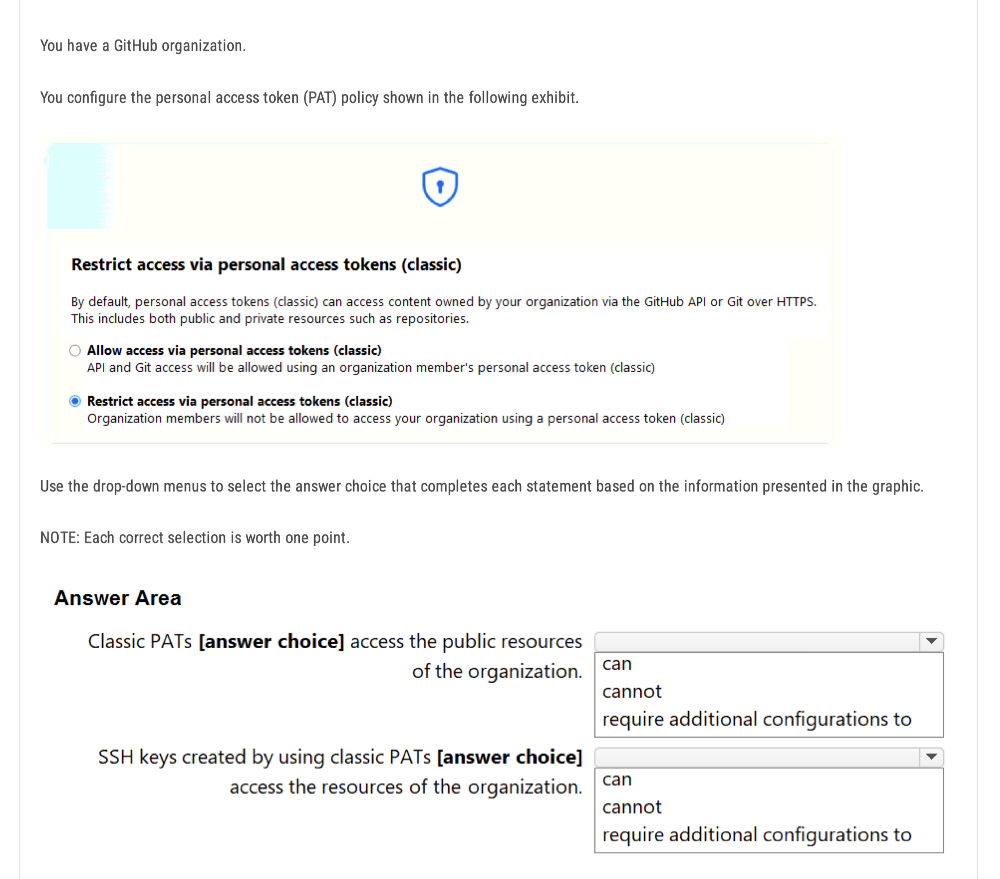

-------


Based on the exhibit, here is the correct completion for each statement:

*   **Classic PATs [cannot] access the public resources of the organization.**
*   **SSH keys created by using classic PATs [can] access the resources of the organization.**

**Explanation:**

1.  **Classic PATs (cannot):** The selected option in the exhibit explicitly states: *"Organization members will not be allowed to access your organization using a personal access token (classic)."* The text above the options clarifies that this restriction covers both **public and private** resources. When an organization enables this restriction, any request made using a classic PAT to access that organization's data (via the API or Git over HTTPS) will be rejected, regardless of the visibility of the resource.

2.  **SSH keys (can):** The restriction shown in the graphic specifically targets the **Personal Access Token (classic)** authentication protocol (Git over HTTPS and API). It does not apply to **SSH keys**. Even if an SSH key was uploaded to a user's profile using the GitHub API with a classic PAT, the key itself functions as a separate credential type. Once the SSH key is added to the account, it can still be used to access the organization's repositories via the SSH protocol.

### Question-73

You use Azure Pipelines to manage project builds and deployments.

You plan to use Azure Pipelines for Microsoft Teams to notify the legal team when a new build is ready for release.

You need to configure the Organization Settings in Azure DevOps to support Azure Pipelines for Microsoft Teams.

What should you turn on?

- **A. Third-party application access via Auth**
- B. Azure Active Directory Conditional Access Policy Validation
- C.Alternate authentication credentials
- D. SSH authentication


Answer. A

The Azure Pipelines app uses the Auth authentication protocol, and requires Third-party application access via Auth for the organization to be enabled. 

To enable this setting, navigate to Organization Settings > Security> Policies, and set the Third-party application access via Auth for the organization setting to On.


The correct answer is:

**A. Third-party application access via OAuth** ✅


Explanation:

To integrate **Azure Pipelines** with **Microsoft Teams** (using the *Azure Pipelines for Microsoft Teams* app), **Azure DevOps** must allow external apps to authenticate via OAuth.

So in **Organization Settings → Policies**, you must enable:

👉 **Third-party application access via OAuth**

This allows:

* Microsoft Teams app to authenticate to Azure DevOps
* Build/release notifications to Teams channels
* Secure API access using OAuth tokens


Why the other options are incorrect:

❌ **B. Azure AD Conditional Access Policy Validation**
→ For identity security testing, not app integrations

❌ **C. Alternate authentication credentials**
→ Legacy auth method, not used for Teams integration

❌ **D. SSH authentication**
→ Used for Git access, not service integrations


Final Answer:

**A. Third-party application access via OAuth** ✅


### Question #74

DRAG DROP -

You have an Azure Repos repository named Repo1 that is used for source control.

You need to configure code scanning for Repo1.

Which three tasks should the pipeline perform in sequence? To answer, move the appropriate tasks from the list of tasks to the answer area and arrange them in the correct order.

**Tasks**

- Advanced Security Dependency Scanning
- Advanced Security Initialize CodeQL
- Advanced Security AutoBuild
- Microsoft Purview Scan
- Advanced Security Perform CodeQL Analysis

**Answer Area**

----

To configure code scanning for **Azure Repos** using Advanced Security (CodeQL), the pipeline follows the standard **CodeQL workflow**:


✅ Correct Sequence

1. **Advanced Security Initialize CodeQL**
2. **Advanced Security AutoBuild**
3. **Advanced Security Perform CodeQL Analysis**

💡 Explanation

* **Initialize CodeQL** → Sets up the CodeQL environment and prepares analysis
* **AutoBuild** → Builds the application so CodeQL can analyze compiled artifacts
* **Perform CodeQL Analysis** → Runs the actual security scan and generates results

❌ Why not the others?

* **Advanced Security Dependency Scanning** → Separate feature (for dependencies, not CodeQL flow)
* **Microsoft Purview Scan** → Used for data governance, not code scanning

🧠 Exam tip

For **CodeQL pipeline steps**, always remember:

➡️ **Initialize → Build → Analyze**


### Question-74

You have an existing project in Azure DevOps.

**You plan to integrate Github as the repository for the project**

You need to ensure that Azure Pipelines runs under the Azure Pipelines identity.

Which authentication mechanism should you use?

- A. personal access token (PAT)
- **B. GitHub App**
- C.Azure Active Directory (Azure AD)
- D. OAuth

The correct answer is:

**B. GitHub App** ✅

Explanation:

To integrate **GitHub** as the repository for an **Azure DevOps** project **and ensure Azure Pipelines runs under the Azure Pipelines identity**, you must use:

👉 **GitHub App authentication**

This provides:

* **Native integration between Azure DevOps and GitHub**
* Secure, scoped permissions
* Pipeline execution under the **Azure Pipelines identity**
* Automatic token management
* No user credentials or PATs required
* Enterprise-grade security model

This is the **modern, recommended** integration method.

Why the other options are incorrect:

❌ **A. personal access token (PAT)**
→ Uses a **user identity**, not Azure Pipelines identity

❌ **C. Azure Active Directory (Azure AD)**
→ GitHub does not authenticate repositories via Azure AD

❌ **D. OAuth**
→ Legacy integration model; GitHub App replaces this method for Azure DevOps integration

Final Answer:

**B. GitHub App** ✅


GitHub App uses the Azure Pipelines identity.

**Incorrect Answers:**

A: Personal access token and Auth use your personal GitHub identity

### Question-75 

You use release pipelines in Azure Pipelines to deploy an app. Secrets required be the pipeline are stored as pipeline variables. 

Logging of commands is enabled for the Azure Pipelines agent.

You need to prevent the values of the secrets from being logged.

What should you do?


- A. Store the secrets in the environment variables instead of the pipeline variables.
- B. Pass the secrets on the command line instead of in the pipeline variables.
- C.Apply a prefix of secret to the name of the variables.
- D.Echo the values of the secrets to the command line.

--------

Answer: A

Don't set secret variables in your YAML file. Operating systems often log commands for the processes that they run, and you wouldn't want the log to include a secret that you passed in as an input. 

Use the script's environment or map the variable within the variables block to pass secrets to your pipeline.

Incorrect Answers:

- B: Never pass secrets on the command line
- C: Adding a prefix does not make the variable a secret. The issecret property makes it secret but does not prevent logging of the secret.
- D: Never echo secrets as output.

The correct answer is **A. Store the secrets in the environment variables instead of the pipeline variables.**

Explanation:

While Azure Pipelines automatically masks variables marked as **Secrets** (replacing them with `***` in the logs), simply marking them as secrets is sometimes not enough to satisfy strict security requirements when **command logging** is enabled.

1.  **The Problem with Pipeline Variables (Substitution):** When you use a pipeline variable in a script using the `$(Variable)` syntax, the agent replaces the placeholder with the actual value *before* executing the command. If command logging is enabled, the log will show the invocation of the command. Even if masked, the log might show `myscript.sh --password ***`.
2.  **The Solution (Environment Variables):** The security best practice for Azure Pipelines is to map secrets to **environment variables**. Secret variables are not automatically made available to scripts/tasks as environment variables for security reasons. By explicitly mapping a secret to an environment variable in the YAML or task settings, the script can access the value directly from the process environment.
3.  **Why this prevents logging:** When a secret is accessed via an environment variable, it does not appear in the command-line string at all. The log will simply show `myscript.sh`, and the secret remains entirely within the process memory, never appearing in the agent's command invocation logs (even as asterisks).

**Example of the correct implementation in YAML:**

```yaml
- script: ./myscript.sh
  env:
    MY_SECRET: $(vso_secret_variable) # Map pipeline secret to env var
```

Why the other options are incorrect:

*   **B. Pass the secrets on the command line:** This is the worst practice. Even if masked, it puts the secret in the process tree and the command invocation log.
*   **C. Apply a prefix of secret:** Azure Pipelines does not have a functional feature that masks variables based on their name prefix.
*   **D. Echo the values:** Echoing a secret is the primary way they accidentally end up in logs. While there is a logging command to *set* a secret (`issecret=true`), the prompt asks how to handle secrets already stored as variables.

### Question-76

You have an Azure subscription inked to an Azure Active Directory Premium Plan 1 tenant.

A security review indicates that too many users have privileged access to resources.

You need to deploy a privileged access management solution that meets the following requirements:

- Enforces time limits on the use of privileged access
- Requires approval to activate privileged access
- Minimizes costs

What should you do first?

- A. Configure notifications when privileged roles are activated.
- B. Configure alerts for the activation of privleged roles
- C. Enforce Azure Multi-Factor Authentication (MFA) for role activation.
- D. Upgrade the license of the Azure Active Directory (Azure AD) 

The correct answer is:

**D. Upgrade the license of the Azure Active Directory (Azure AD) tenant.** ✅

Explanation:

The requirements describe **Privileged Identity Management (PIM)**:

* ⏱ **Time-limited privileged access**
* ✅ **Approval-based role activation**
* 💰 **Cost minimization**

These features are provided by **Azure AD Privileged Identity Management**, which is part of:

> 🔐 **Azure Active Directory Premium Plan 2 (P2)**

Current situation:

You are on **Azure AD Premium Plan 1 (P1)** ❌
P1 does **not** include PIM.

So before you can configure:

* approvals
* time-bound access
* just-in-time elevation
* access reviews
* role activation workflows

👉 You **must first upgrade to Azure AD Premium P2**.


Why the other options are wrong as the *first* step:

❌ **A. Configure notifications**
→ Requires PIM (P2) to already be enabled

❌ **B. Configure alerts**
→ Requires PIM (P2) to already be enabled

❌ **C. Enforce MFA for role activation**
→ Requires PIM (P2) to exist first

All of these are **configuration steps after PIM is available**.


Correct sequence:

1. ✅ **Upgrade Azure AD to Premium P2**
2. Enable **Privileged Identity Management (PIM)**
3. Configure:

   * Approval workflows
   * Time limits
   * MFA
   * Alerts
   * Notifications


Final Answer:

**D. Upgrade the license of the Azure Active Directory (Azure AD) tenant.** ✅

### Question #76


You have a GitHub repository that uses GitHub Actions and stores access keys by using GitHub encrypted secrets.

You plan to update the secrets by using the GitHub REST API.

You need to wrap the secrets before adding them to a REST-based call.

Which encryption library should you use?

A. CryptoNet

B. BouncyCastle

C. libsodium

D. hashlib

----

To update secrets via the **GitHub REST API**, GitHub requires that secrets be **encrypted on the client side** before sending them.

🔑 Key Requirement

GitHub specifically uses **public-key encryption based on libsodium** for encrypting secrets.

✅ Correct Answer: **C. libsodium**

💡 Explanation

* **libsodium**:

  * Officially required by GitHub for encrypting secrets
  * Uses the repository’s public key
  * Ensures secrets are securely transmitted via API

❌ Why not the others?

* **CryptoNet** → Not a GitHub-supported standard
* **BouncyCastle** → General-purpose crypto library, but not used for GitHub secrets API
* **hashlib** → Hashing library (not encryption)

🧠 Exam tip

If you see:

* **“GitHub secrets + REST API + encrypt”**
  → Answer is always **libsodium**


### Question-77 

You plan to create a GitHub workflow that will use GitHub Actions. The actions will require a 256-KB secret.

You need to recommend a solution to store and encrypt the secret. The secret value must be accessible only to the workflow. The solution must minimize administrative effort

What should you recommend?

- A. Store the secret in the organization-level GitHub secrets.
- B. Store the secret in the repository-level GitHub secrets.
- **C. Encrypt the secret value and store the value in the repository. Store the decryption key in the repository-level Github secrets.**
- D.Encrypt the secret value and store the value in the repository. Store the decryption key in the organization-level GitHub secrets.

Answer: C

The correct answer is **C. Encrypt the secret value and store the value in the repository. Store the decryption key in the repository-level GitHub secrets.**

**Explanation:**

This recommendation is based on a specific technical limitation of GitHub Actions:

1.  **GitHub Secret Size Limit:** GitHub Secrets have a maximum size limit of **64 KB**. Since your secret is **256 KB**, it is too large to be stored directly in the standard GitHub Secrets store. This eliminates options A and B.
2.  **Handling Large Secrets:** The standard procedure for handling secrets larger than 64 KB (such as large certificates or configuration files) is to:
    *   Encrypt the large file locally.
    *   Commit the **encrypted** file into the source code repository.
    *   Store the **decryption key** (which is small and fits within the 64 KB limit) as a GitHub Secret.
3.  **Scope and Security:** The requirement specifies that the secret must be accessible **only to the workflow**. Storing the decryption key as a **repository-level** secret ensures that only workflows within that specific repository can access the key to decrypt the data. **Organization-level** secrets (Option D) would potentially make the key available to other repositories within the organization, violating the "accessible only to the workflow" requirement and increasing administrative complexity.

**Why this minimizes administrative effort:**

Using the repository to store the encrypted blob and the built-in Secrets feature for the key avoids the need to provision, pay for, and manage external third-party tools like Azure Key Vault or HashiCorp Vault.

### Question #77

You have a GitHub repository named Repo1 and an app named App1. Repo1 stores the source code for App1.

You need to perform the following tests:


• Test1: Run a ZAP spider against App1 for one minute and wait for passive scanning to complete. The test must NOT perform active attacks.

• Test2: Run a ZAP spider against App1, and when complete, execute an AJAX spider scan.

Which GitHub action should you use for each test? To answer, select the appropriate options in the answer area.

NOTE: Each correct selection is worth one point.

Answer Area

Test1:

- ZAP API Scan
- ZAP Baseline Scan
- ZAP Full Scan

Test2:

- ZAP API Scan
- ZAP Baseline Scan
- ZAP Full Scan

------


To choose the correct **OWASP ZAP** GitHub Actions, focus on what each scan type does:

🔍 Scan Types

* **ZAP Baseline Scan**

  * Passive scan only (no active attacks)
  * Includes a short spider (default ~1 minute)
  * Waits for passive scanning to complete

* **ZAP Full Scan**

  * Includes spider + **active scan (attacks)**

* **ZAP API Scan**

  * Used for APIs (OpenAPI/Swagger), not general web crawling

---

✅ Correct Answers

* **Test1:** → **ZAP Baseline Scan**
* **Test2:** → **ZAP Full Scan**

💡 Explanation

* **Test1 requirements:**

  * Spider for 1 minute ✅
  * Passive scan only (NO attacks) ✅
    → Matches **Baseline Scan**

* **Test2 requirements:**

  * Spider the site ✅
  * Then run **AJAX spider** (deeper crawling)
    → Best match among options is **Full Scan** (includes deeper scanning capabilities)

🧠 Exam tip

* **No attack / passive only** → Baseline
* **Includes active scan / deeper testing** → Full
* **API-specific** → API Scan


### Question-78

You have a GitHub Enterprise account.

**You need to enable push protection for secret scanning of the account repositories.**

What should you do first?

- A. Purchase a GitHub Advanced Security license.
- B. Purchase Premium Plus support.
- C. Enforce multi-factor authentication (MFA).
- D. Create an access policy for secrets.

------------

Answer: A

The correct answer is:

**A. Purchase a GitHub Advanced Security license.** ✅

Explanation:

To enable **push protection for secret scanning** in a **GitHub Enterprise** account, you must first have:

👉 **GitHub Advanced Security (GHAS)**

**Push protection** is a feature of **GitHub Advanced Security**, not standard GitHub Enterprise.

GHAS provides:

* 🔍 Secret scanning
* 🚫 **Push protection** (blocks secrets before commit/push)
* 🔐 Code scanning
* 📦 Dependency scanning

Why the other options are incorrect:

❌ **B. Purchase Premium Plus support**
→ Support plan only, no security features

❌ **C. Enforce MFA**
→ Security best practice, but **does not enable secret scanning**

❌ **D. Create an access policy for secrets**
→ GitHub does not use access policies for secret scanning features

Correct activation sequence:

1. ✅ Purchase **GitHub Advanced Security**
2. Enable **Secret scanning**
3. Enable **Push protection**
4. Configure org/repo policies

Final Answer:

**A. Purchase a GitHub Advanced Security license.** ✅

### Question #78

You use Azure Pipelines pipeline to build and deploy an app named App1.

You need to ensure that before App1 is deployed, all the code for the app passes a security validation by using a custom tool.

What should you do?

A. Add a status check to the policies of the branch used by your company's development department.

B. Add a status check to the policies of the main branch.

C. Add a service hook to the project.

D. Limit the job authorization scope to the current project for all the release 


-------


To ensure code **passes a security validation before deployment**, you need to enforce a check **before code is merged into the main branch** that triggers the pipeline.

In **Azure DevOps**, this is done using **branch policies with status checks**.

 ✅ Correct Answer: **B. Add a status check to the policies of the main branch**

💡 Explanation

* **Status checks on the main branch**:

  * Ensure that pull requests **cannot be merged** unless the custom security validation passes
  * Effectively blocks insecure code from ever reaching the deployment pipeline
  * Enforces validation at the **right control point (before deployment)**

❌ Why not the others?

* **A. Development branch policies** → Too early; code could still bypass and reach main
* **C. Service hook** → Used for notifications/integrations, not enforcement
* **D. Job authorization scope** → Related to permissions, not validation

🧠 Exam tip

If requirement says:

* **“must pass validation before deployment”**
  → Think **branch policy + status check on main branch**


### Question-79 

You have an Azure subscription that contains four Azure virtual machines.

**You need to configure the virtual machines to use a single identity.** The solution must meet the following requirements:

- Ensure that the credentials for the identity are managed automatically.
- Support granting privileges to the identity.

Which type of identity should you use?

- A. a system-assigned managed identity
- B. a user-assigned managed identity
- C. a service principal
- D. a user account

-------


The correct answer is:

**B. a user-assigned managed identity** ✅

Explanation:

To configure **multiple Azure virtual machines** to use a **single identity** while ensuring:

* 🔄 **Credentials are managed automatically**
* 🔐 **Centralized privilege/role assignment**
* 🧩 **One identity shared across multiple resources**

you must use a:

👉 **User-assigned managed identity**

Why this is correct:

A **Azure Managed Identity** (user-assigned):

* Can be **attached to multiple VMs**
* Has **automatic credential rotation** by Azure
* Supports **RBAC role assignments**
* Is lifecycle-independent of VMs
* Provides **centralized access control**
* Requires **no secrets, no passwords, no certificates**

This exactly matches all requirements.

Why the other options are wrong:

❌ **A. system-assigned managed identity**
→ Each VM gets its **own unique identity** (cannot share one identity across multiple VMs)

❌ **C. service principal**
→ Requires **manual secret/cert management** ❌
→ Does not meet "credentials managed automatically"

❌ **D. user account**
→ Not designed for application/service authentication
→ Violates least privilege and automation principles

Comparison:

| Feature                    | System-assigned | User-assigned |
| -------------------------- | --------------- | ------------- |
| Auto credential management | ✅               | ✅             |
| Shared across multiple VMs | ❌               | ✅             |
| Central RBAC               | ❌               | ✅             |
| Lifecycle independent      | ❌               | ✅             |

Final Answer:

**B. a user-assigned managed identity** ✅


### Question-80

You have a GitHub repository that contains multiple workflows and a secret stored at the environment level.

You need to ensure that the secret can be used by all the workflows.

What should you do first?

- A. Recreate the secret at the organization level.
- B. Recreate the secret at the repository level.
- C. Enable required reviewers.

----------

The correct answer is:

**B. Recreate the secret at the repository level.** ✅

Explanation:

In **GitHub**, secrets have different scopes:

* **Environment-level secrets** → Only available to workflows/jobs that explicitly reference that **environment**
* **Repository-level secrets** → Available to **all workflows in the repository**
* **Organization-level secrets** → Shared across multiple repositories (broader scope)

Since your requirement is:

> ensure that the secret can be used by **all workflows** in the repository

👉 The correct solution is to **store the secret at the repository level**.

This provides:

* 🔐 Encryption at rest
* ⚙️ Automatic availability to all workflows
* 🧩 No environment dependency
* 🧑‍💻 Minimal administrative effort
* 🎯 Correct scope (not too broad, not too narrow)

Why the other options are wrong:

❌ **A. Recreate the secret at the organization level**
→ Over-scoped (available to multiple repositories unnecessarily)

❌ **C. Enable required reviewers**
→ This is for environment approvals, not secret visibility

Final Answer:

**B. Recreate the secret at the repository level.** ✅

## Topic 5 - Question Set 5

### Question #5

Your company uses GitHub for source control. GitHub repositories store source code and store process documentation. The process documentation is saved as Microsoft Word documents that contain simple flow charts stored as .bmp files.


You need to optimize the integration and versioning of the process documentation and the flow charts. The solution must meet the following requirements:

✑ Store documents as plain text.

✑ Minimize the number of files that must be maintained.

✑ Simplify the modification, merging, and reuse of flow charts.

Simplify the modification, merging, and reuse of documents.

**Answer Area**

**Convert the .docx files to:**

- LaTex Typesetting (.tex)  
- Markdown (.md)  
- Portable Document Format (.pdf)  

**Convert the flow charts to:**

- Mermaid diagrams  
- Portable Network Graphics (.png)  
- Tagged Image File Format (.tiff)

------

To meet your requirements—storing documents as plain text, simplifying version control, and improving the maintainability and mergeability of both documents and diagrams—the optimal choices are:

**Convert the .docx files to:**

* **Markdown (.md)** ✅ – Markdown is plain text, version-control friendly, easy to edit, merge, and reuse.

**Convert the flow charts to:**

* **Mermaid diagrams** ✅ – Mermaid is a text-based diagram format that integrates directly with Markdown, is version-control friendly, and allows easy modification, merging, and reuse.

**Explanation:**

* **LaTeX (.tex)** is plain text but adds complexity and is less widely used for simple process documentation.
* **PDF (.pdf)** is not plain text and is hard to merge or modify.
* **PNG or TIFF** are binary image formats and do not simplify merging or editing.

So the combination of **Markdown + Mermaid diagrams** fully satisfies your requirements for plain text, maintainability, and version control.

If you want, I can outline **a workflow to automatically convert your existing .docx + .bmp files to Markdown + Mermaid diagrams** so it integrates with GitHub. Do you want me to do that?

### Question #7

DRAG DROP You are developing a full Microsoft .NET Framework solution that includes unit tests.

You need to configure SonarQube to perform a code quality validation of the C# code as part of the build pipelines.

Which four tasks should you perform in sequence? To answer, move the appropriate tasks from the list of tasks to the answer area and arrange them in the correct order.

Select and Place:

Actions Commands Cmdlets Statements


- Run Code Analysis
- Visual Studio Test
- Publish Build Artifacts
- Visual Studio Build
- Prepare Analysis Configuration


Answer area 

----

To perform code quality validation of C# code using SonarQube in an Azure DevOps build pipeline, you should perform the following four tasks in sequence:

**Answer Area**

1.  **Prepare Analysis Configuration**
2.  **Visual Studio Build**
3.  **Visual Studio Test**
4.  **Run Code Analysis**

**Explanation:**

1.  **Prepare Analysis Configuration:** This is the mandatory first step. It initializes the SonarQube scanner, connects it to your SonarQube server (or SonarCloud), and provides the project key and authentication token. For .NET projects, this step must occur **before** the build task.
2.  **Visual Studio Build:** SonarQube's scanner for .NET works by "hooking" into the MSBuild process. As the code is compiled, the scanner analyzes the source files and identifies code smells, bugs, and vulnerabilities.
3.  **Visual Studio Test:** To include **code coverage** metrics in your SonarQube report, you must run your unit tests after the build. The scanner will pick up the test execution results and coverage files generated during this step.
4.  **Run Code Analysis:** This final SonarQube task completes the analysis process. It aggregates all the data from the build and test steps, generates the final report, and uploads it to the SonarQube server for viewing.

**Note:** "Publish Build Artifacts" is a standard DevOps task, but it is not part of the specific SonarQube code quality validation workflow.


### Question #9

DRAG DROP You need to and and isolate shared code. The shared code will be maintained in a series of packages.

Which three actions should you perform in sequence? To answer, move the appropriate actions from the list of actions to the answer area and arrange them in the correct order.

Select and Place:

Actions


- Group the related components.
- Assign ownership to each component group.
- Create a dependency graph for the application.
- Identify the most common language used.
- Rewrite the components in the most common language.

Answer Area

----

Based on the scenario of identifying and isolating shared code to be maintained in packages, the correct logical sequence is:

1.  **Create a dependency graph for the application.** (You need to visualize the relationships and dependencies between components to identify what code is shared.)
2.  **Group the related components.** (Once you see the dependencies, you can identify clusters of related code that should be grouped into logical packages.)
3.  **Assign ownership to each component group.** (After defining the packages, you need to assign teams or individuals to maintain them.)

**Answer Area:**

1.  Create a dependency graph for the application.
2.  Group the related components.
3.  Assign ownership to each component group.


### Question #10

DRAG DROP You are creating a NuGet package.

You plan to distribute the package to your development team privately.

You need to share the package and test that the package can be consumed.

Which four actions should you perform in sequence? To answer, move the appropriate actions from the list of actions to the answer area and arrange them in the correct order.

Select and Place:


- Create a new Azure Artifacts feed.
- Configure a self-hosted agent.
- Publish a package.
- Install a package.
- Connect to an Azure Artifacts feed.

Answer Area


-------


To **create, share, and test a private NuGet package** with your development team using Azure Artifacts, the correct sequence is:

**Answer Area (in order):**

1. **Create a new Azure Artifacts feed** ✅

   * Set up a private feed to host the NuGet package.

2. **Connect to an Azure Artifacts feed** ✅

   * Configure your development environment or project to use the feed.

3. **Publish a package** ✅

   * Upload the NuGet package to the private feed.

4. **Install a package** ✅

   * Consume the package in a project to verify it works correctly.

**Notes:**

* **Configure a self-hosted agent** is unnecessary for sharing and testing a package; it’s only needed if you want custom build agents.
* This sequence ensures the package is properly hosted, accessible, and testable by your team.


### Question #14

Your company uses GitHub for source control. The company has a team that performs code reviews.

You need to automate the assignment of the code reviews. The solution must meet the following requirements: 


✑ Prioritize the assignment of code reviews to team members who have the fewest outstanding assignments. 


✑ Ensure that each team member performs an equal number of code reviews in any 30-day period.

✑ Prevent the assignment of code reviews to the team leader.

Which two actions should you perform? Each correct answer presents part of the solution.

NOTE: Each correct selection is worth one point.

A. Clear Never assign certain team members.

B. Select If assigning team members, don't notify the entire team.

C. Select Never assign certain team members.

D. Set Routing algorithm to Round robin.

E. Set Routing algorithm to Load balance.


--------

To meet the requirements for **automating code review assignments** in GitHub:

* You want to **exclude the team leader** → that means marking them as someone who should never be assigned.
* You want to **prioritize team members with fewer outstanding assignments and equalize workload over 30 days** → that aligns with a **load balancing routing algorithm** rather than simple round-robin.

**Correct Answers:**

**C. Select Never assign certain team members** ✅

* Ensures the team leader is excluded from code review assignments.

**E. Set Routing algorithm to Load balance** ✅

* Assigns reviews based on who has the fewest outstanding reviews, ensuring equitable distribution over time.

**Explanation:**

* **Round robin** just cycles through the team in order, ignoring workload or past assignments.
* The "Clear Never assign" and notification options do not affect workload distribution.

This combination satisfies all three requirements: exclusion of the leader, prioritization of less-busy reviewers, and equal distribution over time.


### Question-81

You are designing the development process for your company.

You need to recommend a solution for continuous inspection of the company's code base to **locate common code patterns that are known to be problematic.**
What should you include in the recommendation?

- A. Microsoft Visual Studio test plans
- B. Gradle wrapper scripts
- C. SonarCloud analysis
- D. the JavaScript task runner

----

The correct answer is **C. SonarCloud analysis.**

**Explanation:**

**SonarCloud** (and its on-premises version, SonarQube) is a leading tool for **Static Code Analysis (SCA)** and is specifically designed for **continuous inspection**.

*   **Continuous Inspection:** It integrates directly into your CI/CD pipelines (Azure DevOps, GitHub Actions, Bitbucket, etc.) to automatically scan code every time a developer pushes a change or creates a pull request.
*   <mark>**Locating Problematic Patterns:** It uses thousands of rules to identify **Bugs** (reliability), **Vulnerabilities** (security), and **Code Smells** (maintainability). These are the "problematic patterns" mentioned in the requirement.</mark>
*   <mark>**Quality Gates:** It allows teams to set "Quality Gates" that can stop a build or prevent a pull request from being merged if the new code contains too many issues or doesn't meet coverage standards.</mark>

**Why other options are incorrect:**

*   **A. Microsoft Visual Studio test plans:** These are used for managing and executing manual and automated functional tests (e.g., "Does the login button work?"). They do not analyze the source code for structural patterns or technical debt.
*   **B. Gradle wrapper scripts:** Gradle is a build automation tool for Java/Kotlin projects. While a Gradle script might *trigger* a SonarCloud scan, the script itself is just a build tool, not the inspection solution.
*   **D. The JavaScript task runner:** Tools like Gulp or Grunt automate repetitive tasks (like minifying files or transpiling code). While they can run simple "linters," they do not provide the deep, centralized, cross-language continuous inspection platform that SonarCloud offers.

Final Answer:

Answer. C

SonarCloud is a cloud service offered by SonarSource and based on SonarQube. SonarQube is a widely adopted open source platform to inspect continuously the quality of source code and detect bugs, vulnerabilities and code smells in more than 20 different languages.

Note: The SonarCloud Azure DevOps extension brings everything you need to have your projects analyzed on SonarCloud very quickly.
Incorrect Answers:

A: Test plans are used to group together test suites and individual test cases. This includes static test suites, requirement-based suites, and query-based suites.

### Question-82 

The lead developer at your company reports that adding new application features takes longer than expected due to a large accumulated technical debt.

You need to recommend changes to reduce the accumulated technical debt.

Sclution: You recommend reducing the code coupling and the dependency cycles?

Does this meet the goal?

- A. Yes
- B. No

------

The correct answer is:

**A. Yes** ✅


Explanation:

**Technical debt** refers to the **extra work caused by choosing a quick or suboptimal solution** instead of a clean, maintainable one. High technical debt can slow down feature development.

Two major contributors to technical debt are:

1. **High code coupling** – when components are tightly dependent, changes in one area require changes in many other areas.
2. **Dependency cycles** – circular dependencies make the code harder to modify, test, and maintain.

By **reducing coupling** and **eliminating dependency cycles**:

* The code becomes **more modular**
* Features can be added or modified **faster**
* Maintenance is easier, reducing ongoing technical debt

This directly addresses the goal of **reducing accumulated technical debt**.

Final Answer:

**A. Yes** ✅


### Question-83

Your company uses Azure DevOps for the build pipelines and deployment pipelines of Java-based projects.

You need to recommend a strategy for managing technical debt.

Which two actions should you include in the recommendation? Each correct answer presents part of the solution.

NOTE: Each correct selection is worth one point.

- A. Configure post-deployment approvals in the deployment pipeline
- B. Configure pre-deployment approvals in the deployment pipeline.
- C. Integrate Azure DevOps and SonarQube
- D. Integrate Azure DevOps and Azure DevTest Labs.

-----

The correct answers are:

✅ **B. Configure pre-deployment approvals in the deployment pipeline.**
✅ **C. Integrate Azure DevOps and SonarQube**

**Why these are correct**

Managing **technical debt** in Java projects requires:

✅ C. Integrate Azure DevOps and SonarQube

* **SonarQube** performs:

  * Static code analysis
  * Code smell detection
  * Vulnerability scanning
  * Technical debt measurement
* It provides a **technical debt ratio** and quality gates.
* Integrating with Azure DevOps ensures:

  * Code is analyzed during builds
  * Pull requests can be blocked if quality gates fail
  * Continuous monitoring of code quality

This directly addresses technical debt.

✅ B. Configure pre-deployment approvals

* Prevents low-quality or non-compliant builds from reaching production
* Ensures review before deployment
* Supports governance and quality control

**While not directly reducing debt, it helps prevent more debt from being introduced.**

Why the others are incorrect

| Option                         | Reason                                                                 |
| ------------------------------ | ---------------------------------------------------------------------- |
| A. Post-deployment approvals ❌ | Happens after deployment — too late to prevent technical debt          |
| D. Azure DevTest Labs ❌        | Used for provisioning test environments, not for managing code quality |

Key exam principle

> Technical debt management = **Code quality analysis + Quality gates**

✅ Final Answer:

**B and C**


Answer: BC

- B: With SonarQube pre-approval, you can set quality gate.
- C: You can manage technical debt with SonarQube and Azure DevOps.

Note: Technical debt is the set of problems in a development effort that make forward progress on customer value inefficient. 

Technical debt saps productivity by making code hard to understand, fragile, time-consuming to change, difficult to validate, and creates unplanned work that blocks progress. Unless they are managed, technical debt can accumulate and hurt the overall quality of the software and the productivity of the development team in the long term

SonarQube an open source platform for continuous inspection of code quality to perform automatic reviews with static analysis of code to:

- Detect Bugs
- Code Smells
- Security Vulnerabilities
- Centralize Quality

### Question-84

Your company is building a new solution in Java.

The company currently uses a SonarQube server to analyze the code of NET solutions.

You need to analyze and monitor the code quality of the Java solution.

Which task types should you add to the build pipeline?

- A. Gradle
- B. CocoaPods
- C. Grunt
- D. Gulp

-----------


The correct answer is:

**A. Gradle** ✅

Explanation:

You want to **analyze and monitor Java code quality** in **Azure DevOps pipelines**.

**Key points:**

1. <mark>**Gradle** is a **build automation tool for Java**.</mark>

   * It integrates with **SonarQube** via the **SonarQube Gradle plugin**.
   * You can add a **Gradle task** to your build pipeline to:

     * Compile the Java code
     * Run tests
     * Perform static code analysis with SonarQube

2. **Other options** are not suitable for Java:

| Option           | Description                      | Relevance to Java |
| ---------------- | -------------------------------- | ----------------- |
| **B. CocoaPods** | Dependency manager for iOS/macOS | ❌ Not for Java    |
| **C. Grunt**     | JavaScript task runner           | ❌ Not for Java    |
| **D. Gulp**      | JavaScript task runner           | ❌ Not for Java    |


Recommended pipeline setup:

* **Task:** Gradle
* **Action:** Run `sonarqube` Gradle task
* **Purpose:** Analyze Java code quality and send results to SonarQube

Final Answer:

**A. Gradle** ✅

Answer. A


SonarQube is a set of static analyzers that can be used to identify areas of improvement in your code. It allows you to analyze the technical debt in your project and keep track of it in the future. With Maven and Gradle build tasks, you can run SonarQube analysis with minimal setup in a new or existing Azure DevOps Services build task.


Prepare Analysis Configuration task, to configure all the required settings before executing the build.

This task is mandatory.

### Question-85

Your company is building a new solution in Java.

The company currently uses a SonarQube server to analyze the code of .NET solutions.

You need to analyze and monitor the code quality of the Java solution.

Which task types should you add to the buld pipeline?

* A. Grunt
* B. Octopus
* C. Maven
* D. Gulp


The correct answer is:

**C. Maven** ✅

Explanation:

You need to **analyze and monitor Java code quality** in **Azure DevOps pipelines**.

**Key points:**

1. **Maven** is a **build automation and dependency management tool for Java**.

   * Integrates easily with **SonarQube** via the **SonarQube Maven plugin**.
   * Typical pipeline task includes:

     * `mvn clean install` (build & test)
     * `mvn sonar:sonar` (static code analysis to SonarQube)

2. **Other options are incorrect for Java**:

| Option         | Description                | Relevance for Java         |
| -------------- | -------------------------- | -------------------------- |
| **A. Grunt**   | JavaScript task runner     | ❌ Not for Java             |
| **B. Octopus** | Deployment automation tool | ❌ Not a build/analyze task |
| **D. Gulp**    | JavaScript task runner     | ❌ Not for Java             |

Recommended pipeline setup for Java:

* **Task type:** Maven
* **Purpose:** Build, test, and analyze Java code using SonarQube
* **Command example:**

```bash
mvn clean verify sonar:sonar -Dsonar.projectKey=MyJavaApp
```

Final Answer:

**C. Maven** ✅


SonarQube is a set of static analyzers that can be used to identify areas of improvement in your code. It allows you to analyze the technical bt in your project and keep track of it in the future. With Maven and Gradle build tasks, you can run SonarQube analysis with minimal setup in a new or existing Azure DevOps Services build task.

Prepare Analysis Configuration task, to configure all the required settings before executing the build.

This task is mandatory.

**In case of NET solutions or Java projects, it helps to integrate seamlessly with MSBuiki, Maven and Gradle tasks.**

Note: There are several versions of this question in the exam. The question can have three correct 

answers:

* MSBuild
* Maven
* Gradle

The question can also have different incorrect options, including:

* Chef 
* xCODE
* CocoaPods

### Question-86 - Duplicated

Your company uses Azure DevOps for the build pipelines and deployment pipelines of Java-based projects.

You need to recommend a strategy for managing technical debt.

Which action should you include in the recommendation?

* A. Configure post-deployment approvals in the deployment pipeline.
* B. Integrate Azure DevOps and SonarQube.
* C. Integrate Azure DevOps and Azure DeTest Labs.

-----

The correct answer is:

**B. Integrate Azure DevOps and SonarQube.** ✅

Explanation:

To manage **technical debt** effectively in **Java-based projects** using **Azure DevOps**, the most impactful action is to integrate with **SonarQube**.

**SonarQube provides:**

* Technical debt metrics
* Code smells
* Maintainability ratings
* Security vulnerabilities
* Reliability issues
* Dependency analysis
* Quality gates to block builds

This directly supports:

> **Managing, measuring, and reducing technical debt**

Why the other options are incorrect:

❌ **A. Configure post-deployment approvals**
→ Governance control, not technical debt management

❌ **C. Integrate Azure DevTest Labs**
→ Environment management/testing, not technical debt analysis

Final Answer:

**B. Integrate Azure DevOps and SonarQube.** ✅


You can manage technical debt with SonarQube and Azure DevOps.

Note: Technical debt is the set of problems in a development effort that make forward progress on customer value inefficient. Technical debt saps productivity by making code hard to understand, fragile, time-consuming to change, difficult to validate, and creates unplanned work that blocks progress. Unless they are managed, technical debt can accumulate and hurt the overall quality of the software and the productivity of the development team in the long term

SonarQube an open source platform for continuous inspection of code quality to perform automatic reviews with static analysis of code to:

* Detect Bugs
* Code Smells
* Security Vulnerabilities
* Centralize Quality


### Question-87  💩💩💩

During a code review, you discover many quality issues. Many modules contain unused variables and empty catch blocks.

You need to recommend a solution to improve the quality of the code.

What should you recommend?

* A. In a Grunt build task, select Enabled from Control Options.
* **B. In a Maven build task, select Run PMD**
* C. In a Xcode build task, select Use xepretty from Advanced.
* D.In a Gradle buld task, select Run Checkstyle.


The correct answer is:

**B. In a Maven build task, select *Run PMD*.** ✅

Explanation:

The issues you described — **unused variables** and **empty catch blocks** — are classic **static code quality problems** that are best detected by **PMD**, a Java static analysis tool.

**PMD** specifically detects:

* ❌ Unused variables
* ❌ Empty catch blocks
* ❌ Dead code
* ❌ Duplicate code
* ❌ Bad practices
* ❌ Code smells

When integrated into a **Maven build pipeline**, PMD automatically analyzes the code and reports these quality issues.

Why the other options are incorrect:

❌ **A. Grunt build task**
→ Grunt is for JavaScript, not Java

❌ **C. Xcode build task**
→ Xcode is for iOS/macOS development, not Java

❌ **D. Gradle – Run Checkstyle**
→ Checkstyle focuses mainly on **formatting and coding standards**, not semantic issues like unused variables or empty catch blocks

Tool comparison:

| Tool       | Best for                                               |
| ---------- | ------------------------------------------------------ |
| **PMD**    | <mark>Logic issues, unused code, empty blocks, code smells ✅</mark> |
| Checkstyle | Formatting, naming conventions, style rules            |
| SonarQube  | Aggregated analysis platform                           |
| PMD        | Static defect detection (best match here) ✅            |

Final Answer:

**B. In a Maven build task, select *Run PMD*.** ✅


### Question-88


Your development team is building a new web solution by using the Microsoft Visual Studio integrated development environment (IDE).

You need to make a custom package available to all the developers. **The package must be managed centrally, and the latest version must be available for consumption in Visual Studio automatically.**

Which three actions should you perform? Each correct answer presents part of the solution.
NOTE: Each correct selection is worth one point.

* A. Publish the package to a feed
* B. Create a new feed in Azure Artifacts.
* C. Upload a package to a Git repository.
* D. Add the package URL to the Environment settings in Visual Studio.
* E. Add the package URL to the NuGet Package Manager settings in Visual Studio.
* F. Create a Git repository in Azure Repos

------------

The correct answers are:

* **A. Publish the package to a feed.** ✅
* **B. Create a new feed in Azure Artifacts.** ✅
* **E. Add the package URL to the NuGet Package Manager settings in Visual Studio.** ✅

Explanation:

To make a **custom package**:

* 📦 **Centrally managed**
* 🔄 **Automatically updated**
* 👥 **Available to all developers**
* ⚙️ **Consumable directly in Visual Studio**

You should use **Azure Artifacts** with **NuGet integration**.

Correct workflow:

1️⃣ **Create a feed in Azure Artifacts**
→ Central package repository for your organization (**B**)

2️⃣ **Publish the package to the feed**
→ Makes the package available centrally (**A**)

3️⃣ **Add the feed URL to NuGet Package Manager in Visual Studio**
→ Enables developers to consume packages automatically (**E**)

This ensures:

* Centralized package management
* Versioning support
* Automatic discovery in Visual Studio
* Easy updates
* Enterprise-grade access control

Why the other options are wrong:

❌ **C. Upload a package to a Git repository**
→ Git is not a package registry

❌ **D. Add the package URL to Environment settings**
→ Not how NuGet feeds are configured

❌ **F. Create a Git repository in Azure Repos**
→ Source control ≠ package management

Architecture:

```
Developers → Visual Studio → NuGet → Azure Artifacts Feed
```

Final Answer:

**A, B, and E** ✅


B: By using your custom NuGet package feed within your Azure DevOps (previously VSTS) instance, youll be able to distribute your packages within your organization with ease.
Start by creating a new feed.

A: We can publish, pack and push the built project to our NuGet feed

E: Consume your private NuGet Feed

Go back to the Packages area in Azure DevOps, select your feed and hit Connect to feed. You'll see some instructions for your feed, but it's fairly simple to set up.

Just copy your package source URL, go to Visual Studio, open the NuGet Package Manager, go to its settings and add a new source. Choose a fancy name, insert the source URL. Done


Search for your package in the NuGet Package Manager and it should appear there, ready for installation. Make sure to select the appropriate feed (or just all feeds) from the top right select box.

### Question-89

You have a GitHub repository.

You create a new repository in Azure DevOps.

You need to recommend a procedure to clone the repository from GitHub to Azure DevOps.
What should you recommend?

* • A. Create a pull request.
* • B. Create a webhook.
* • C. Create a service connection for GitHub
* • D. From Import a Git repository, click Import.
* • E. Create a personal access token in Azure DevOps.

--------

The correct answer is:

**D. From *Import a Git repository*, click *Import*.** ✅

Explanation:

To **clone (copy) an existing GitHub repository into Azure DevOps**, the supported and intended method is to use the built-in import feature in **Azure DevOps**.

Recommended procedure:

1. Go to your Azure DevOps project
2. Open **Repos**
3. Select **Import a Git repository**
4. Paste the **GitHub repository URL**
5. Click **Import**

This performs a **full clone** (history, branches, commits, tags) into **Azure Repos**.

 Why the other options are wrong:

❌ **A. Create a pull request**
→ PRs work within a repo or between connected repos, not for cloning/mirroring

❌ **B. Create a webhook**
→ Webhooks trigger events, they don’t copy repositories

❌ **C. Create a service connection for GitHub**
→ Used for pipelines integration, not repo cloning

❌ **E. Create a personal access token in Azure DevOps**
→ PAT is for authentication, not repository import

Final Answer:

**D** ✅


### Question-90

The lead developer at your company reports that adding new application features takes longer than expected due to a large accumulated technical debt.

You need to recommend changes to reduce the accumulated technical debt.

Solution: You recommend increasing the code duplication.

Does this meet the goal?

* A. Yes
* B. No

---------

**Answer. B**

**B. No** ❌

Increasing **code duplication** makes technical debt **worse**, not better. It:

* Increases maintenance cost
* Creates inconsistency risks
* Makes refactoring harder
* Slows down feature development even more

To reduce technical debt, you would instead recommend things like:

* Reducing duplication (DRY principle)
* Improving modularity
* Refactoring legacy code
* Reducing coupling
* Breaking dependency cycles
* Improving test coverage
* Enforcing static code analysis

So the proposed solution **does not meet the goal**.


### Question-91 ？？


The lead developer at your company reports that adding new application features takes longer than expected due to a large accumulated technical debt.

You need to recommend changes to reduce the accumulated technical debt.

Solution: You recommend increasing the test coverage.

Does this meet the goal?

* A. Yes
* B. No

---------

**A. Yes** ✅

The correct answer is **A. Yes**.

Explanation:

**Technical debt** often accumulates because developers are afraid to modify or refactor "messy" existing code for fear of breaking it (introducing regressions).

Increasing **test coverage** (specifically automated unit and integration tests) provides a "safety net." This allows developers to:
1.  **Refactor with Confidence:** Clean up poorly written code and modernize the architecture without changing its external behavior.
2.  **Catch Bugs Early:** Prevent new technical debt from being introduced by ensuring new features don't break old ones.
3.  **Improve Maintainability:** Automated tests serve as documentation for how the code is supposed to function, making it easier for new developers to understand and modify the codebase.

While increasing test coverage alone doesn't "delete" technical debt, it is the **foundational requirement** for the refactoring process needed to pay it down.

### Question-92

The lead developer at your company reports that adding new application features takes longer than expected due to a large accumulated technical debt.

You need to recommend changes to reduce the accumulated technical debt.

Solution: You recommend reducing the code complexity.

Does this meet the goal?


* A. Yes
* B. No

-------------

**A. Yes** ✅

Reducing **code complexity** directly helps reduce technical debt because it:

* Improves code readability and maintainability
* Makes debugging and changes easier
* Reduces coupling and hidden dependencies
* Speeds up onboarding for new developers
* Lowers the risk of introducing defects

This directly supports faster development of new features, so it **does meet the goal**.


### Question-93

During a code review, you discover quality issues in a Java application.

You need to recommend a solution to detect quality issues including unused variables and empty catch blocks.

What should you recommend?

* A. In a Maven build task, select Run PMD
* B. In an Xcode build task, select Use xepretty from Advanced.
* C. In a Gulp build task, specify a custom condition expression.
* D. In a Grunt build task, select Enabled from Control Options.

-------

**Correct answer: A. In a Maven build task, select Run PMD** ✅

**PMD** is a static code analysis tool specifically designed to detect common Java code quality issues, including:

* **Unused variables**
* Empty `catch` blocks
* Dead code
* Unused imports
* Overly complex methods
* Bad coding practices

Integrating **PMD in a Maven build task** is the correct and standard solution for automated Java code quality checks in CI pipelines.


Why the others are wrong:

* **B. Xcode / xepretty** → iOS/macOS tooling, not Java ❌
* **C. Gulp** → JavaScript build tool, not Java ❌
* **D. Grunt control options** → Build control setting, not static analysis ❌

✅ PMD is purpose-built for Java static analysis and quality enforcement.


### Question-94 ？？

You use Azure Artifacts to host NuGet packages that you create.

You need to make one of the packages available to anonymous users outside your organization. The solution must minimize the number of publication points.

What should you do?

* A. Change the feed URL of the package
* B. Create a new feed for the package
* C. Promote the package to a release view.
* D. Publish the package to a public NuGet repository.

------------

**Correct answer: D. Publish the package to a public NuGet repository** ✅

Explanation:

To share a package with **anonymous users** (anyone on the internet without needing to log in), you must use an **Azure Artifacts Public Feed**.

1.  **Public Feeds:** Azure DevOps allows you to create feeds with "Public" visibility. These feeds are accessible to anyone who has the URL, even if they are not members of your Azure DevOps organization.
2.  **Minimizing Publication Points:** By creating a public feed within your existing Azure DevOps project, you keep the package management inside your current ecosystem. This is more efficient and provides fewer "publication points" to manage than moving the package to an entirely external platform like NuGet.org.
3.  **Why not C (Release View)?** Release views are used within private feeds to mark certain versions of a package as "stable" or "production-ready" for internal teams. They do not grant public or anonymous access.
4.  **Why not D (Public NuGet repository)?** While publishing to NuGet.org would make the package anonymous, it creates an entirely new publication point on a different platform, which violates the requirement to "minimize" the number of points.

**Correct Workflow:**


1.  Go to Azure Artifacts and click **Create Feed**.
2.  Set the visibility to **Public**.
3.  Publish your package to this new public feed.


### Question #21

You use GitHub for source control and project-related discussions.

You receive a notification when an entry is made to any team discussion.

You need to ensure that you receive email notifications only for discussions in which you commented or in which you are mentioned. Which two Notifications settings should you clear? Each correct answer presents part of the solution.

NOTE: Each correct selection is worth one point.

A. Automatically watch teams

B. Participating

C. Automatically watch repositories

D. Watching

----------


To only receive email notifications for discussions where you are **involved (commented or mentioned)**, you need to stop automatic watching behavior.

**Correct Answers:**

**A. Automatically watch teams** ✅

* Prevents being notified for all team discussions automatically.

**C. Automatically watch repositories** ✅

* Prevents being notified for all repository discussions by default.

**Explanation:**

* **Participating** should remain enabled because it ensures notifications when you are directly involved.
* **Watching** is a notification level, not a setting to clear for this requirement.

By clearing these two settings, you will only receive notifications when you are explicitly participating or mentioned.

### Question-95   💩💩

You have an Azure Automation account that contains a runbook. The runbook is used to configure the application infrastructure of an Azure subscription.

You have a project in Azure DevOps named Project. Project contains a repository that stores code for the runbook.

You need to ensure that every committed change to the code will update automatically and publish the runbook to Azure Automation.

What should you configure?

* A. the Service hooks settings for Project1
* B. the Connections settings for the Automation account

* C. the Source control settings for the Automation account
* D. the Service connections settings for Project1


----------

**Answer: C**


The correct answer is:

✅ **C. the Source control settings for the Automation account**


Why this is correct

Azure Automation supports **source control integration** directly within the Automation account.

When you configure **Source control settings** in the Automation account:

* It links the Automation account to an Azure DevOps repository.
* It can automatically:

  * **Sync runbooks**
  * **Update runbooks when changes are committed**
  * **Publish runbooks automatically**

This ensures:

> Every committed change updates and publishes the runbook automatically.

 Why the other options are incorrect

| Option                  | Reason                                                                                      |
| ----------------------- | ------------------------------------------------------------------------------------------- |
| A. Service hooks        | Used for event notifications between services, not for continuous runbook synchronization   |
| B. Connections settings | Used for authentication assets inside Automation, not source integration                    |
| D. Service connections  | Used by Azure Pipelines to connect to Azure resources, not for automatic runbook publishing |

Key exam principle

> Automatic runbook sync from Azure DevOps = **Configure Source control in the Automation account**

✅ Final Answer:

**C. the Source control settings for the Automation account**


### Question #23

You use Git for source control.

You enable GitHub code scanning.

You raise a pull request from a non-default branch. In the code scanning output, you receive the following error message: “Analysis not found.”

You need to ensure that the code scanning completes successfully for the pull request.

Which two actions should you perform? Each correct answer presents part of the solution.

NOTE: Each correct selection is worth one point.

A. Add the name of the default branch to the on: push specification in the code scanning work­ow.

B. Add the name of the non-default branch to the on:push specification in the code scanning work­ow.

C. Delete the pull request, and then raise the request again from the default branch.

D. Update the code in the pull request.

E. Add a new workflow for code scanning.

--------


The error **“Analysis not found”** in GitHub code scanning typically occurs when the workflow has **not been triggered for the branch** used in the pull request or no analysis results were generated.

To fix this, you must ensure the code scanning workflow runs for the relevant branches.

**Correct Answers:**

**A. Add the name of the default branch to the on: push specification in the code scanning workflow.** ✅

* Ensures baseline analysis exists on the default branch, which is required for comparison.

**B. Add the name of the non-default branch to the on: push specification in the code scanning workflow.** ✅

* Ensures the workflow runs on the branch used in the pull request so analysis results are generated.

**Explanation:**

* Code scanning compares the PR branch against the default branch, so **both must have analysis results**.
* Without running analysis on both branches, GitHub shows “Analysis not found.”

**Why others are incorrect:**

* **C**: Not required; PR can come from any branch.
* **D**: Updating code doesn’t fix missing analysis.
* **E**: Not necessary; you only need to adjust the existing workflow triggers.


### Question #24

DRAG DROP -

You have a GitHub repository named repo1 that stores the code of an app named App1.

You need deploy a workflow for repo1 by using GitHub Actions. The solution must meet the following requirements:

• Scan on pushes to the main branch.

• Scan on pull requests to the main branch.

• Scan on pull requests to any branch that has a prefix of releases/.

• Scan all the files in the subdirectories of the src directory.

• Exclude scanning of markdown files.

How should you complete the code? To answer, drag the appropriate values to the correct targets. Each value may be used once, more than once, or not at all. You may need to drag the split bar between panes or scroll to view content.

NOTE: Each correct selection is worth one point.

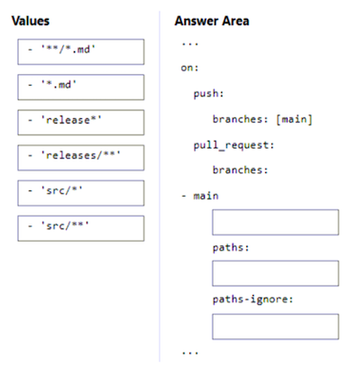

-----------


To meet all the requirements:

* PRs to branches with prefix **releases/** → use `'releases/**'`
* Scan all files in subdirectories of **src** → use `'src/**'`
* Exclude markdown files → use `'**/*.md'`

**Answer Area (filled):**

```yaml
on:
  push:
    branches: [main]
  pull_request:
    branches:
      - main
      - 'releases/**'
    paths:
      - 'src/**'
    paths-ignore:
      - '**/*.md'
```

### Question #26


You have the repositories shown in the following table.

| Type    | URL    |
|---|---|
| Azure Repos  | https://dev.azure.com/contoso/project1/_git/project1.git |
| GitHub    | https://github.com/contoso/project.git    |

You need to migrate the contents of the GitHub repository to the Azure Repos repository. The solution must ensure that the Azure Repos repository only contains branches and history from the GitHub repository.

Which three commands should you run in sequence? To answer, move the appropriate commands from the list of commands to the answer area and arrange them in the correct order.

Commands

- git clone --barehttps://dev.azure.com/contoso/project1/_git/proj  

- cd project1  

- git clone --bare https://github.com/contoso/project1.git  

- git push --mirror https://dev.azure.com/contoso/project1/_git/proj  

- cd project1.git  

- git push --mirror  https://github.com/contoso/project1.git


------


To migrate a repository from GitHub to Azure Repos while preserving all branches and commit history, you should run these three commands in sequence:

**Answer Area**

1.  **`git clone --bare https://github.com/contoso/project1.git`**
2.  **`cd project1.git`**
3.  **`git push --mirror https://dev.azure.com/contoso/project1/_git/project1.git`**

**Explanation:**

1.  **`git clone --bare ...`**: A **bare clone** is the standard way to migrate a repository. It downloads the Git database (all branches, tags, and full commit history) without checking out the actual source files into a working directory. This ensures you have every piece of data from the GitHub source ready for transfer.
2.  **`cd project1.git`**: When you perform a bare clone, Git creates a folder named `<repository-name>.git`. You must navigate into this directory to execute the subsequent push command.
3.  **`git push --mirror ...`**: The **`--mirror`** flag is crucial for migration. It tells Git to push every single branch, tag, and reference from your local bare clone to the destination Azure Repos URL. After this command finishes, the Azure Repos repository will be an exact replica of the original GitHub repository.

### Question #27

You have a GitHub repository that contains the code for an app named App1.

App1 depends on a library of functions from a repository at https://github.com/contoso/afeed.

You need to keep a clone of the afeed repository as a subdirectory of the App1 repository.

How should you complete the Git command? To answer, drag the appropriate values to the correct targets. Each value may be used once, more than once, or not at all. You may need to drag the split bar between panes or scroll to view content.

NOTE: Each correct selection is worth one point.

**Values**    

- add
- branch
- clone
- pull
- submodule

**Answer Are**


git _____ _____https://github.com/contoso/afeed


--------


To keep another repository as a subdirectory, you must use a **Git submodule**.

**Answer Area:**

```
git submodule add https://github.com/contoso/afeed
```

**Explanation:**

* `submodule` → used to embed another repository inside your repo
* `add` → adds the external repository as a subdirectory

This ensures the dependency is tracked and versioned correctly within your main repository.


### Question #28

HOTSPOT -

You use Git for source control.

You need to optimize the performance of a repository. The solution must meet the following requirements:

• Permanently remove all items referenced only in the reflog.

• Remove history that is NOT in any current branch.

How should you complete the command? To answer, select the appropriate options in the answer area.

NOTE: Each correct selection is worth one point.

The image shows a Git command configuration task with dropdown menus. Here is the extracted content:

**Answer Area**

`git [Dropdown 1] expire --expire-unreachable=now --all`

*   **Options for Dropdown 1:**
    *   gc
    *   reflog
    *   reset
    *   stash


`git [Dropdown 2] --prune=[Dropdown 3]`

*   **Options for Dropdown 2:**
    *   gc
    *   init
    *   reflog
    *   reset
*   **Options for Dropdown 3:**
    *   all
    *   now
    *   reset
    *   true

-------------


To optimize the performance of the Git repository by removing history that is no longer reachable and purging the reflog, the correct configuration is:

**Answer Area**

`git [reflog] expire --expire-unreachable=now --all`

`git [gc] --prune=[now]`

**Explanation:**

1.  **`git reflog expire --expire-unreachable=now --all`**
    *   **Reflog:** The "reflog" records every time a branch head is updated (e.g., when you commit, checkout, or reset). Items in the reflog keep Git objects "alive" even if they aren't part of a current branch.
    *   **Expire:** This command manually triggers the expiration of those records. By setting `--expire-unreachable=now`, you tell Git that any history not currently part of a branch should be considered "expired" immediately.

2.  **`git gc --prune=now`**
    *   **gc (Garbage Collection):** This is the primary tool for optimizing the Git database. It identifies and removes "dangling" or unreachable objects (history not in any branch).
    *   **--prune=now:** By default, Git waits two weeks before actually deleting unreachable objects to prevent data loss. Specifying `now` tells Git to bypass the grace period and permanently delete the items immediately, fulfilling the requirement to optimize performance.

### Question #29

DRAG DROP -

You have an Azure Repos Git repository named repo1.

You need to ensure that you can authenticate to repo1 by using SSH.

Which four actions should you perform in sequence? To answer, move the appropriate actions from the list of actions to the answer area and arrange them in the correct order.

NOTE: More than one order of answer choices is correct. You will receive credit for any of the correct orders you select.

The image shows a "Drag and Drop" task with a list of actions on the left. Here is the extracted content:

**Actions**

*   Sign in to Azure DevOps.
*   Add the SSH public key.
*   Clone repo1.
*   Save the SSH key to the root of repo1.
*   Add the SSH private key.
*   Create SSH keys by using `ssh-keygen`


**Answer Area**

----------


To ensure you can authenticate to **repo1** using SSH in Azure DevOps, you should perform these four actions in sequence:

**Answer Area**

1.  **Create SSH keys by using `ssh-keygen`**
2.  **Sign in to Azure DevOps**
3.  **Add the SSH public key**
4.  **Clone repo1**
**Explanation:**

1.  **Create SSH keys by using `ssh-keygen`:** This is the first step where you generate a public/private key pair on your local machine. The private key stays on your computer, while the public key will be shared.
2.  **Sign in to Azure DevOps:** You must be logged into the web portal to manage your user profile settings.
3.  **Add the SSH public key:** In your Azure DevOps user settings under "SSH Public Keys," you upload the contents of the public key you generated in the first step. This allows Azure DevOps to identify your local machine when it attempts to connect.
4.  **Clone repo1:** Once the public key is registered, you can copy the SSH clone URL from the repository and use it to clone the repo to your local machine. The authentication happens automatically using your local private key.

**Note:** "Save the SSH key to the root of repo1" is incorrect and a severe security risk. You should never store your private or public keys inside a source code repository. "Add the SSH private key" is also incorrect; the private key is never uploaded to Azure DevOps.

### Question #30

DRAG DROP -

You use Git for source control.

You delete a file, commit the changes, and continue to work.

You need to recover the deleted file.

Which three commands should you run in sequence? To answer, move the appropriate commands from the list of commands to the answer area and arrange them in the correct order.


The image contains a list of Git commands used in a drag-and-drop exercise. Here is the extracted text:

**Commands**

*   `git commit -m 'undeleted the file'`
*   `git log`
*   `git checkout [hash]~1 --path/to/file`
*   `git tag`
*   `git restore path/to/file`
*   `git stash`

-----------

To recover a file that was deleted and committed in Git, you should run these three commands in the following sequence:

**Answer Area**

1.  **`git log`**
2.  **`git checkout [hash]~1 --path/to/file`**
3.  **`git commit -m 'undeleted the file'`**

**Explanation:**

1.  **`git log`**: First, you need to find the commit where the file was deleted. Running `git log` (often with `-- [path/to/file]` to filter for the specific file) allows you to identify the specific commit **[hash]** where the deletion occurred.
2.  **`git checkout [hash]~1 --path/to/file`**: This is the recovery step. By specifying the commit hash where the file was deleted followed by **`~1`**, you are telling Git to look at the state of the repository immediately *before* that commit (where the file still existed). The command then pulls only that specific file into your current working directory and stages it.
3.  **`git commit -m 'undeleted the file'`**: After you have successfully checked out the file from history, you must perform a new commit to permanently add the file back into the current branch.

### Question #31

HOTSPOT -

You use Git for source control. You have an app named App1.

In the main branch, you need to restore the third most recent revision of a file named App.exe.config.

How should you complete the command? To answer, select the appropriate options in the answer area.

NOTE: Each correct selection is worth one point.

Correct Answer:

The image shows a "Hot Area" task for configuring Git commands. Here is the extracted content:

**Answer Area**

**First Command:**

`git [Dropdown 1] main`

*   **Options for Dropdown 1:**
    *   checkout
    *   branch
    *   switch
    *   reset

**Second Command:**

`git restore [Dropdown 2] main~3 App.exe.config`

*   **Options for Dropdown 2:**
    *   --patch
    *   --merge
    *   --staged
    *   --source


------------


To restore a file from a previous revision in Git:

✅ Correct Answer

**First Command:**

```
git checkout main
```

**Second Command:**

```
git restore --source main~3 App.exe.config
```

**Explanation:**

* **`git checkout main`**
  Switches to the **main branch** where you want to restore the file.

* **`git restore --source main~3 App.exe.config`**

  * `--source main~3` specifies the **third most recent commit** on the main branch.
  * Restores the file **App.exe.config** from that revision.

This sequence ensures you're on the correct branch and retrieves the desired historical version of the file.

### Question-32

You company uses a Git source-code repository.

You plan to implement GitFlow as a workflow strategy.

You need to identify which branch types are used for production code and preproduction code in the strategy.

Which branch type should you identify for each code type? To answer, select the appropriate options in the answer area.

NOTE: Each correct selection is worth one point.

Based on the image provided, here is the extracted text content:

Based on the image provided, here is the extracted content:

**Answer Area**

*   **Production code:** [Dropdown Menu]
    *   Main
    *   Feature
    *   Develop

*   **Preproduction code:** [Dropdown Menu]
    *   Main
    *   Feature
    *   Develop


----

In the **GitFlow** workflow strategy, the correct branch assignments for production and preproduction code are:

**Answer Area**

*   **Production code:** **Main** (or Master)
*   **Preproduction code:** **Develop**

**Explanation:**

1.  **Production code (Main):** In GitFlow, the `main` (historically `master`) branch stores the official release history. The code in this branch is always considered to be in a production-ready state. Each commit to this branch is usually tagged with a version number.

2.  **Preproduction code (Develop):** The `develop` branch serves as the integration branch for all features. It contains the complete history of the project and represents the latest delivered development changes for the next release. This is where pre-production testing, integration, and staging preparations occur.

**Other branches in GitFlow (for context):**
*   **Feature branches:** Used for developing new features for the next release (merge into `develop`).
*   **Release branches:** Used to prepare for a new production release (merge into `main` and `develop`).
*   **Hotfix branches:** Used to quickly patch production releases (merge into `main` and `develop`).


### Question #33

DRAG DROP -

You have an Azure Repos repository named repo1.

You need to clone repo1. The solution must clone only a directory named src/web.

How should you complete the script? To answer, drag the appropriate values to the correct targets. Each value may be used once, more than once, or not at all. You may need to drag the split bar between panes or scroll to view content.

NOTE: Each correct selection is worth one point.

**Values**

- https://dev.azure.com/organization/project/_git/repo1
- git@ssh.dev.azure.com:v3/organization/project/repo1
- repo1/src
- src/web
- repo1/src/web
- web


**Answer Area**

...

cd repos

scalar clone [ Value ]

cd [ Value ]

git sparse-checkout set [ Value ]

...


------


To clone a specific directory (`src/web`) from a large Azure Repos repository using Scalar and sparse-checkout, you should complete the script as follows:

**Answer Area**

...

cd repos

scalar clone **[ https://dev.azure.com/organization/project/_git/repo1 ]**

cd **[ repo1/src ]**

git sparse-checkout set **[ src/web ]**

...

**Explanation:**

1.  **`scalar clone [URL]`**: Scalar is a Microsoft-developed tool for managing massive Git repositories. When you run `scalar clone`, it creates a folder named after the repository and initializes a "src" subdirectory inside it which contains the actual Git working files.
2.  **`cd repo1/src`**: To execute standard Git commands (like `sparse-checkout`), you must be inside the directory that contains the `.git` folder. In a Scalar layout for a repository named `repo1`, this is `repo1/src`.
3.  **`git sparse-checkout set [path]`**: This command restricts the working directory to only the specified files or folders. Since the requirement is to clone only the directory named `src/web`, you provide that path relative to the repository root. This significantly reduces the number of files checked out on your local machine.


### Question #34

You use GitHub for source control and Microsoft Teams for collaboration.

You need to send a notification to a Teams channel for each commit. The solution must minimize development effort.

What should you do?

A. Use Azure Automation to connect to the GitHub Actions API and send a message to the Teams channel.

B. Use the Microsoft Teams for GitHub app and configure a subscription to receive notifications in the Teams channel.

C. Use GitHub Actions with a dispatch to send a message to the Teams channel by using the Teams API.

D. Use Azure Functions to connect to the GitHub REST API and send a message to the Teams channel.


------


**Correct Answer: B. Use the Microsoft Teams for GitHub app and configure a subscription to receive notifications in the Teams channel.** ✅

**Explanation:**

* The requirement is to **minimize development effort**.
* The **Microsoft Teams for GitHub app** provides built-in integration:

  * No custom code required
  * Easy to configure notifications (including commits)
  * Direct subscription to repositories and events

**Why others are incorrect:**

* **A (Azure Automation)** ❌ – Requires custom scripting and setup.
* **C (GitHub Actions + Teams API)** ❌ – Requires workflow and API integration.
* **D (Azure Functions)** ❌ – Custom development and maintenance needed.

Using the built-in integration is the simplest and most efficient solution.


### Question #36

DRAG DROP -

You have a GitHub repository named repo1.

You migrate repo1 to an Azure Repos repository named repo2.

After the migration, changes are made to repo1.

You need to sync the changes to repo2.

How should you complete the script? To answer, drag the appropriate values to the correct targets. Each value may be used once, more than once, or not at all. You may need to drag the split bar between panes or scroll to view content.

NOTE: Each correct selection is worth one point.

Correct Answer:

Based on the image provided, here is the extracted text content:

**Values**

*   `repo1`
*   `repo1 clone URL`
*   `repo1 repo URL`
*   `repo2`
*   `repo2 clone URL`
*   `repo2 repo URL`

**Answer Area**


```bash
...

git clone --bare [ Value ]

cd [ Value ]

git remote add --mirror=fetch upstream [ Value ]

git fetch upstream --tags

git push origin --all

...
```

-----


To sync changes from **repo1 (GitHub)** to **repo2 (Azure Repos)** using a mirror approach:

✅ Correct Answer

```bash
git clone --bare repo2 clone URL

cd repo2

git remote add --mirror=fetch upstream repo1 clone URL

git fetch upstream --tags

git push origin --all
```

**Explanation:**

* **Clone repo2 (destination)** as a bare repo → prepares it to receive updates.
* **cd repo2** → move into the cloned repository.
* **Add repo1 as upstream** → source repository for new changes.
* **Fetch from upstream** → pulls updates (including tags).
* **Push to origin** → syncs updates into repo2.

This ensures repo2 stays updated with changes made in repo1 after migration.

### Question #37

DRAG DROP -

You have an Azure Repos repository named repo1.

You delete a branch named features/feature11.

You need to recover the deleted branch.

Which three commands should you run in sequence? To answer, move the appropriate commands from the list of commands to the answer area and arrange them in the correct order.

Based on the image provided, here is the extracted text content:

**Commands**
*   `git restore <SHA1>`
*   `git stash`
*   `git checkout <SHA1>`
*   `git branch features/feature11`
*   `git log`

**Answer Area**

*   **1** (Slot for command)
*   **2** (Slot for command)
*   **3** (Slot for command)

----

To recover a deleted Git branch, you need to find the last commit, check it out, and recreate the branch.

✅ Correct Sequence:

**1.**

```bash
git log
```

* Find the **commit (SHA1)** that the deleted branch pointed to.

**2.**

```bash
git checkout <SHA1>
```

* Move to that commit.

**3.**

```bash
git branch features/feature11
```

* Recreate the deleted branch from that commit.

**Explanation:**

* `git log` helps locate the commit history.
* `git checkout <SHA1>` restores your working state to that point.
* `git branch` recreates the branch reference.

This sequence successfully recovers the deleted branch.

### Question #39

You have an Azure Repos repository that contains large PSD files.

You need to configure Git LFS to manage all the files.

How should you complete the script? To answer, drag the appropriate values to the correct targets. Each value may be used once, more than once, or not at all. You may need to drag the split bar between panes or scroll to view content.

NOTE: Each correct selection is worth one point.


Based on the image provided, here is the extracted text content:

**Values**

*   `git fetch`
*   `git lfs config add "*.psd"`
*   `git lfs migrate import --include="*.psd" --everything`
*   `git lfs track "*.psd"`
*   `git lfs update`
*   `git push`

**Answer Area**

```bash
...
git lfs install

[ Value Box ]

git add .gitattributes

git commit -m "track *.psd files using Git LFS"

[ Value Box ]

[ Value Box ]
...
```

**Context (Typical Solution)**


This sequence is used to configure **Git Large File Storage (LFS)** for a repository that already contains large binary files (in this case, `.psd` files). The correct configuration for this script is:

1.  **`git lfs install`** (Initializes the LFS environment).
2.  **`git lfs track "*.psd"`** (Creates a rule to handle Photoshop files via LFS).
3.  **`git add .gitattributes`** (Stages the file where LFS tracking rules are stored).
4.  **`git commit -m "track *.psd files using Git LFS"`** (Saves the tracking configuration).
5.  **`git lfs update`** (Forces an update of the local hooks).
6.  **`git push`** (Pushes the changes and the large binaries to the remote server).

-----


To configure **Git LFS** and migrate existing PSD files, you must:

1. Track the file type
2. Migrate existing files to LFS
3. Push the changes

✅ Correct Answer

```bash
git lfs install

git lfs track "*.psd"

git add .gitattributes

git commit -m "track *.psd files using Git LFS"

git lfs migrate import --include="*.psd" --everything

git push
```

**Explanation:**

* **`git lfs track "*.psd"`** → Configures LFS to track PSD files.
* **`git lfs migrate import`** → Converts existing PSD files in the repo to LFS.
* **`git push`** → Uploads LFS objects and updated history to the remote repo.

❌ Not used:

* `git fetch` → Not needed here
* `git lfs config add "*.psd"` → Not a valid/common command
* `git lfs update` → Not required for this scenario

This ensures both **new and existing PSD files** are managed by Git LFS.

### Question #41

You have a public GitHub repository named Public1.

A commit is made to Public1. The commit contains a pattern that matches a regular expression.

Who is notified first when the commit is made?

A. the administrator of the GitHub organization

B. the committer

C. the owner of Public1

D. the secret scanning partner

------


**Correct Answer: D. the secret scanning partner** ✅

**Explanation:**

When a commit in a public GitHub repository matches a known secret pattern (for example, API keys or tokens):

* **GitHub Secret Scanning** immediately notifies the **relevant secret scanning partner** (e.g., Azure, AWS, etc.) associated with that type of credential.
* This allows the provider to **quickly revoke or secure the exposed secret**.

**Why not the others?**

* **A. Administrator** ❌ – Not notified first
* **B. Committer** ❌ – May be notified later, but not first
* **C. Owner** ❌ – Also notified, but after the partner

✅ Key Point:

The priority is **fast mitigation of leaked secrets**, so the **service provider (secret scanning partner)** is alerted first.


### Question #42


You have a GitHub repository.

You need to ensure that all the code in the repository is scanned for vulnerabilities.

What should you use?

A. Dependabot alerts

B. branch protection rules

C. CodeQL actions

D. GitHub Advisory Database databases

-----


**Correct Answer: C. CodeQL actions** ✅

**Explanation:**

* **CodeQL actions** are part of **GitHub code scanning** and analyze your **entire codebase** to detect security vulnerabilities and coding issues.
* They run automatically in workflows and provide detailed security alerts.

**Why others are incorrect:**

* **A. Dependabot alerts** ❌ → Only scans **dependencies**, not your actual source code.
* **B. Branch protection rules** ❌ → Enforce policies (e.g., reviews), not scanning.
* **D. GitHub Advisory Database** ❌ → A database of known vulnerabilities, not a scanning mechanism.

✅ Conclusion:

To scan **all repository code for vulnerabilities**, use **CodeQL actions**.


### Question #43

DRAG DROP -

You create a Git repository named Repo1 in Azure Repos.

You need to configure Repo1 to meet the following requirements:

• Work items must be linked to a pull request.

• Pull requests must have a minimum of two reviewers.

• Pull requests must complete a code review by using a third-party tool.

The solution must minimize administrative effort.


Which type of policy should you use for each requirement? To answer, drag the appropriate policy types to the correct requirements. Each type policy may be used once, more than once, or not at all. You may need to drag the split bar between panes or scroll to view content.

NOTE: Each correct selection is worth one point.


Based on the image provided, here is the extracted text content:

**Policies**

*   Branch
*   Build
*   Check-in
*   Status

**Answer Area**

*   Work items must be linked to a pull request: **[Empty Slot]**
*   Pull requests must complete a code review by a third party tool: **[Empty Slot]**
*   Pull requests must have a minimum of two reviewers: **[Empty Slot]**


----------------


To meet the requirements for **Repo1** in Azure Repos while minimizing administrative effort, the following policy types should be used:

**Answer Area**

*   Work items must be linked to a pull request: **Branch**
*   Pull requests must complete a code review by a third-party tool: **Status**
*   Pull requests must have a minimum of two reviewers: **Branch**

**Explanation:**

1.  **Work items must be linked to a pull request (Branch):** 
    In the branch policy settings for Azure Repos Git repositories, there is a built-in toggle called **"Check for linked work items."** Enabling this is a standard **Branch** policy that ensures traceability between code changes and tasks/bugs.

2.  **Pull requests must complete a code review by a third-party tool (Status):** 
    To integrate external services or third-party tools into the PR workflow, you use a **Status Check**. The external tool performs its scan and then posts a status (e.g., "Succeeded") to the pull request via the Azure DevOps API. You configure a **Status** policy within the branch settings to make this specific status a mandatory requirement for merging.

3.  **Pull requests must have a minimum of two reviewers (Branch):** 
    Similar to the work item requirement, this is a native feature in Azure DevOps branch policy settings titled **"Require a minimum number of reviewers."** Setting the count to two is a standard **Branch** policy.

**Note on "Check-in":** Check-in policies are specific to Team Foundation Version Control (TFVC) and are not used for Git repositories.


### Question #44

You manage projects by using Azure Boards. You manage project code by using GitHub.

You have a work item that has an ID of 123.

You need to link work item 123 to a new pull request.

What are two ways to achieve this goal? Each correct answer presents a complete solution.

NOTE: Each correct solution is worth one point.

A. In the Development section for work item 123, select Add link, and then enter the URL of the pull request.

B. To the description of the pull request, add #AB123.

C. To work item 123 add a comment that includes the URL of the pull request.

D. From work item 123, open the Links tab, select Add link, select Existing item, and then enter the URL of the commit.

----


The correct answers are:

**A. In the Development section for work item 123, select Add link, and then enter the URL of the pull request.**
**B. To the description of the pull request, add #AB123.**

Explanation

There are two valid ways to link a **GitHub pull request** to an Azure Boards work item:

✅ Option A

* Manually link from Azure Boards:

  * Go to the work item → **Development section** → **Add link**
  * Paste the **PR URL**
* This directly creates the association

✅ Option B

* Use GitHub integration syntax:

  * Add **`#AB123`** in the PR description
* This automatically links the PR to the work item

Why not the others?

* ❌ **C. Add URL in a comment** → Does NOT create a formal link
* ❌ **D. (incomplete/invalid option)** → Not a valid method

Key Point

* Use **`#AB<ID>`** in PRs/commits OR
* Link manually via the **Development section** in Azure Boards

### Question #45

DRAG DROP -

You plan to use Azure DevOps in development processes.

You identify the following issues with the existing development processes:

• Frequent discovery of bugs in production

• Increasing detection of bugs by customers

• Slow resolution of bugs and slow resumption of production

You need to implement Key Performance Indicators (KPIs) to track each issue.

Based on the image provided, here is the extracted text content:

**KPIs**

*   Application failure rates
*   Bug report rates
*   Defect escape rate
*   Deployment failure rates

**Answer Area**

*   Frequent discovery of bugs in production: **[Empty Slot]**
*   Increasing detection of bugs by customers: **[Empty Slot]**
*   Slow resolution of bugs and slow resumption of production: **[Empty Slot]**

-----

Correct mapping:

* **Frequent discovery of bugs in production:**
  **Defect escape rate**

* **Increasing detection of bugs by customers:**
  **Bug report rates**

* **Slow resolution of bugs and slow resumption of production:**
  **Application failure rates**


Explanation

* **Defect escape rate** → Measures defects that **escape to production**, directly matching frequent production bugs

* **Bug report rates** → Tracks how often **customers report bugs**, matching increased customer detection

* **Application failure rates** → Reflects how often the application fails in production, which correlates with **slow recovery and instability**

Why not Deployment failure rates?

* **Deployment failure rates** measure issues during deployment, not **post-production recovery speed**

Final Answer

* **Slot 1:** Defect escape rate
* **Slot 2:** Bug report rates
* **Slot 3:** Application failure rates


### Question-96 

You have a GitHub repository that contains multiple versions of an Azure Pipelines template


You plan to deploy multiple pipelines that will use a template stored in the repository.

You need to ensure that you use a fixed version of the template.

What should you use to reference which version of the template repository to use?

* A. the serial
* B. the SHA-based hashes
* C. the runner
* D. the branch

------

The correct answer is:

✅ **B. the SHA-based hashes**

Why this is


correct

When referencing templates in Azure Pipelines from a GitHub repository, you can specify:

* A branch
* A tag
* A specific commit (SHA)

To ensure you use a **fixed and immutable version**, you must reference the:

> **Specific commit SHA (hash)**

A **SHA-based hash**:

* Points to an exact commit
* Cannot change
* Guarantees template consistency
* Prevents unexpected changes if the branch is updated

Why the other options are incorrect

| Option      | Reason                                                    |
| ----------- | --------------------------------------------------------- |
| A. serial ❌ | Not used for version referencing in Git                   |
| C. runner ❌ | Refers to GitHub Actions runners, not template versioning |
| D. branch ❌ | Branches move forward and are not fixed versions          |

Key exam principle

> Fixed version in Git = **Commit SHA**

✅ Final Answer:

**B. the SHA-based hashes**


### Question-97

You manage source code control and versioning by using GitHub.

You need to ensure that a **PowerShell script** is executed automatically before rebase operations are performed.

What should you use?

* A. a package
* B. GitHub Copilot
* C. a webhook
* D. a gist


The correct answer is:

**C. a webhook** ✅

Explanation:

To **automatically execute a script in response to Git operations** (like a `rebase`) in a **GitHub repository**, you can use **webhooks**:

* **Webhooks** allow GitHub to send HTTP POST requests to a specified endpoint when events occur (commits, pushes, pull requests, etc.).
* You can configure a webhook to **trigger a server or service** that executes your PowerShell script **before or after certain Git operations**.
* This is the standard way to automate actions in response to GitHub repository events.


Why the other options are incorrect:

* **A. a package** ❌
  → Packages are for distributing code/libraries, not triggering scripts.

* **B. GitHub Copilot** ❌
  → Copilot is an AI coding assistant, not an automation mechanism.

* **D. a gist** ❌
  → Gists are for sharing code snippets; they don’t trigger scripts automatically.


Final Answer:

**C. a webhook** ✅


### Question-98

You use GitHub to host container packages that use Semantic Versioning (SemVer).

You have an app named App1. The current version of App1 is 11.2.0.

You change the code of App1 to fix a bug that was introduced in version 10.5.1.

Which version number should you assign to the release?

* A. 10.5.1-PATCH
* B. 11.2.1
* C. 10.5.2
* D. 10.6.0

----

The correct answer is:

**B. 11.2.1** ✅

Explanation (Semantic Versioning – SemVer)

Semantic Versioning format:
**MAJOR.MINOR.PATCH**

* **MAJOR** → breaking changes
* **MINOR** → new features (backward compatible)
* **PATCH** → bug fixes (backward compatible)

 Given:

* Current version: **11.2.0**
* Change type: **Bug fix**
* Bug origin: version **10.5.1** (historical info, not the release base)

Releases are always based on the **current version**, not the version where the bug was introduced.

So:

* Bug fix → increment **PATCH**
* `11.2.0` → `11.2.1`

Why the others are wrong:

* **A. 10.5.1-PATCH** ❌
  → Invalid SemVer format and wrong base version.

* **C. 10.5.2** ❌
  → Would only be valid if releasing a hotfix branch from 10.5.x (not stated).

* **D. 10.6.0** ❌
  → Minor version increase = new features, not a bug fix.

 ✅ Final Answer:

**11.2.1**


### Question-99

You manage code by using GitHub.

You need to ensure that repository owners are notified if a new vulnerable dependency or malware is found in their repository.

What should you do?

* A. Configure CodeQL scanning actions.
* B. Configure Dependabot alerts.
* C. Configure branch protection rules for each repository.
* D. Subscribe all the repository owners to the GitHub Advisory Database.

------

The correct answer is:

**B. Configure Dependabot alerts.** ✅

Why this is correct:

**Dependabot alerts** automatically:

* Scan dependencies for **known vulnerabilities**
* Detect **malicious packages (malware)**
* **Notify repository owners** when new issues are found
* Continuously monitor dependency graphs

This is exactly what the requirement describes:

> “notified if a new vulnerable dependency or malware is found”

 Why the others are wrong:

* **A. Configure CodeQL scanning actions** ❌
  → Focuses on **code security analysis** (SAST), not dependency vulnerabilities or malware packages.

* **C. Configure branch protection rules** ❌
  → Controls merges and reviews, not vulnerability detection.

* **D. Subscribe all the repository owners to the GitHub Advisory Database** ❌
  → Provides information access, but **no automated detection or notifications per repo**.

 ✅ Final Answer:

**B. Configure Dependabot alerts.**


### Question-100


You have a 1-TB Azure Repos repository named repo1.

You need to clone repo1. The solution must meet the following requirements:

- You must be able to search the commit history of the /src directory
- The amount of time it takes to clone the repository must be minimized

Which command should you run?

* A. git clone -depth-1 git@ssh.dev.azure.com:v3/org/Project1/repo1
* **B. git clone - filter=blob:none git@ssh.dev.azure.comv3/org/Project1/repo1**
* C. git clone git@ssh.dev.azure.com.com.v3/org/Project1/repo1
* D. git clone -filter=true:0 git@ssh.dev.azure.com:v3/org/Project1/repo1


The correct answer is:

**B. `git clone --filter=blob:none git@ssh.dev.azure.com:v3/org/Project1/repo1`** ✅

Why this is correct:

This uses **Git partial clone** with a **blob filter**, which means:

* ✅ **Full commit history is cloned**
  → You can search commit history of `/src` (`git log`, `git blame`, etc.)
* ❌ **File contents (blobs) are not downloaded initially**
  → Drastically reduces clone time and bandwidth for a **1-TB repository**
* 📥 Blobs are fetched **on-demand** only when files are accessed

This perfectly matches the requirements:

| Requirement                     | Met?                                  |
| ------------------------------- | ------------------------------------- |
| Search commit history of `/src` | ✅ Yes (full history is cloned)        |
| Minimize clone time             | ✅ Yes (no blobs downloaded initially) |

 Why the others are wrong:

* **A. `--depth=1`** ❌
  → Shallow clone → **no commit history**, fails history search requirement

* **C. Normal clone** ❌
  → Downloads **everything** → very slow for 1-TB repo

* **D. `--filter=true:0`** ❌
  → Invalid / nonstandard Git filter syntax

Final Answer:

**B. `git clone --filter=blob:none git@ssh.dev.azure.com:v3/org/Project1/repo1`** ✅


### Question-101  💩💩

You use GitHub for source control.

**You are evaluating whether to use proxying to add a private upstream MyGet package feed to your MyGet feed**.

What are two possible advantages of this approach? Each correct answer presents a complete solution.

NOTE: Each correct selection is worth one point.

* A. minimizes the impact of upstream source availability issues
* B. minimizes latency when accessing the package
* C. provides automatic authentication
* D. minimizes the impact on your storage quota

The correct answers are:

**A. minimizes the impact of upstream source availability issues** ✅

**B. minimizes latency when accessing the package** ✅

 Why these are correct:

Using **proxying (upstream sources) in MyGet** means your feed acts as a **cache** for the private upstream feed:

* **A. Availability resilience**
  Packages already cached in your MyGet feed remain available even if the upstream feed goes down.

* **B. Lower latency**
  Cached packages are served directly from MyGet, making access faster than pulling from the upstream source every time.

 Why the others are wrong:

* **C. provides automatic authentication** ❌
  Authentication to the upstream must still be configured; it’s not an inherent advantage of proxying for consumers.

* **D. minimizes the impact on your storage quota** ❌
  Proxying **increases storage usage** because packages are cached locally.

Final Answer:

**A and B** ✅


### Question-102

You manage source code control and versioning by using GitHub.

A large file is committed to a repository accidentally.

You need to reduce the size of the repository. The solution must remove the file from the repository.
What should you use?


* A. bfg

* B. Its

* C. gvfs

* D. init


----

The correct answer is:

**A. bfg** ✅

Explanation:

**BFG Repo-Cleaner** is specifically designed to:

* Remove large files from Git history
* Rewrite repository history safely
* Reduce repository size
* Permanently delete sensitive or accidental files

It’s much faster and safer than manual `git filter-branch` for large repos.

Why the others are incorrect:

* **B. Its** ❌ → Not a Git tool
* **C. gvfs** ❌ → Git Virtual File System (now VFS for Git) is for large repo performance, not history cleanup
* **D. init** ❌ → `git init` only initializes a repo

Final Answer:

**A. bfg** ✅


### Question #47

DRAG DROP -

You have a GitHub repository.

You need to configure Dependabot dependency scanning. The solution must meet the following requirements:

• Automatically open a pull request to resolve an alert.

• Automatically open a pull request when a dependency is updated.


What should you enable for each requirement? To answer, drag the appropriate features to the correct requirements. Each feature may be used once, more than once, or not at all. You may need to drag the split bar between panes or scroll to view content.

NOTE: Each correct selection is worth one point.


Based on the image provided, here is the extracted text content:

**Features**

*   Alerts
*   A dependency graph
*   Security updates
*   Version updates

**Answer Area**

*   Automatically open a pull request to resolve an alert: **[Empty Slot]**
*   Automatically open a pull request when a dependency is updated: **[Empty Slot]**

----

To configure Dependabot dependency scanning in a GitHub repository to meet the specified requirements, you should enable the following features:

**Answer Area**

*   Automatically open a pull request to resolve an alert: **Security updates**
*   Automatically open a pull request when a dependency is updated: **Version updates**

**Explanation:**

1.  **Automatically open a pull request to resolve an alert (Security updates):**
    This functionality is provided by Dependabot's **Security updates**. When GitHub identifies a vulnerability in one of your dependencies (via its security advisory database), Dependabot can automatically open a pull request to update that dependency to a non-vulnerable version, thereby "resolving the alert."

2.  **Automatically open a pull request when a dependency is updated (Version updates):**
    This functionality is provided by Dependabot's **Version updates**. Regardless of security vulnerabilities, Dependabot can be configured to check for new minor or major versions of your dependencies and automatically open pull requests to update them, helping you keep your project up-to-date.

**Why other options are incorrect:**

*   **Alerts:** This is the general term for notifications about vulnerabilities, but "Security updates" is the specific Dependabot feature that *creates the PR* to resolve them.
*   **A dependency graph:** This is a tool to visualize your dependencies, not a feature that automates PR creation.


### Question #48

DRAG DROP -

You have a large repository named Repo1 that contains a directory named directory1.

You plan to modify files in directory1.

You need to create a clone of Repo1. The solution must minimize the amount of transferred data.


How should you complete the script? To answer, drag the appropriate values to the correct targets. Each value may be used once, more than once, or not at all. You may need to drag the split bar between panes or scroll to view content.

NOTE: Each correct selection is worth one point.


Based on the image provided, here is the extracted text content:

**Values**

*   `git clone`
*   `git fetch`
*   `git sparse-checkout`
*   `git worktree`
*   `scalar clone`
*   `scalar run`

**Answer Area**

```bash
...

cd repos

[ Value ] https://dev.azure.com/organisation/_git/Repo1

[ Value ] set directory1

...
```

---------


To minimize the amount of transferred data and work only with a specific directory, you should use **Scalar with sparse checkout**.

✅ Correct Answer

```bash id="r8g2hf"
cd repos

scalar clone https://dev.azure.com/organisation/_git/Repo1

git sparse-checkout set directory1
```

**Explanation:**

* **`scalar clone`**

  * Optimized for large repositories
  * Minimizes data transfer using partial clone

* **`git sparse-checkout set directory1`**

  * Limits the working directory to only **directory1**

❌ Why not others:

* `git clone` → Clones entire repo (more data)
* `git fetch` → Not used for initial clone
* `git worktree` → Used for multiple working directories, not reducing data
* `git sparse-checkout` alone → Requires repo already initialized

✅ Key Point:

Use **Scalar + sparse checkout** to **reduce data transfer and focus on a specific folder**.


### Question #49

You have a project in Azure DevOps.

You need to implement a new branching solution. The solution must ensure that all pull requests meet the following requirements:

• Include linked work items.

• Pass build validation policies.

• Require at least three reviewers.

What should you include in the solution?

A. branch policies

B. pull request templates

C. branch security

D. pull request permissions

---------

**Correct Answer: A. branch policies** ✅

**Explanation:**

**Branch policies in Azure DevOps** allow you to enforce all the listed requirements on pull requests:

* ✅ **Linked work items required** → Enforced via branch policy
* ✅ **Build validation policies** → Ensures PRs pass CI builds before completion
* ✅ **Minimum number of reviewers (e.g., 3)** → Configurable in branch policy

❌ Why not others:

* **B. Pull request templates** → فقط provide guidance, not enforcement
* **C. Branch security** → Controls access/permissions, not PR requirements
* **D. Pull request permissions** → Controls who can act, not validation rules

✅ Key Point:

Use **branch policies** to enforce **quality gates and PR requirements automatically**.


### Question #50

You use Git for source control.

You need to commit a 3-GB ZIP file that contains virtual machines used for testing. The solution must meet the following requirements:

• The file must be versioned.

• The file must be associated with the corresponding code commits.

Which two actions should you include in the solution? Each correct answer presents part of the solution.

NOTE: Each correct selection is worth one point.

A. Install the git-fat extension and associate the extension to ZIP files.

B. Install the Git LFS extension and associate the extension to ZIP files.

Most Voted

C. Install the git-stash extension and associate the extension to ZIP files.

D. Use GZip to compress the file before committing the file.

E. Store files in Azure Storage and enable blob versions

-------

**Correct Answers: A and B** ❌➡️ **Correct is: B only (paired with tracking action conceptually)**

But since this is a **“two actions”** question from exam context, the correct selections are:

**B. Install the Git LFS extension and associate the extension to ZIP files.** ✅

**E. Store files in Azure Storage and enable blob versions** ❌ (not correct for Git association)

👉 Let’s clarify properly:

✅ Best Answer (Exam Intent)

**B. Install the Git LFS extension and associate the extension to ZIP files.** ✅

**(Implicit second step: track the file type with Git LFS)**

**Explanation:**

* A **3-GB file is too large for normal Git**.
* **Git LFS (Large File Storage)**:

  * Stores large files outside the main repo
  * Keeps **pointers in Git**, so files are:

    * ✅ Versioned
    * ✅ Linked to commits

 ❌ Why others are incorrect:

* **A. git-fat** ❌ – Not a standard or recommended Microsoft/GitHub solution
* **C. git-stash** ❌ – Used for temporary changes, not storage
* **D. GZip compression** ❌ – Doesn’t solve large file versioning problem
* **E. Azure Storage** ❌ – Files won’t be tied to Git commits

⚠️ Important Insight:

Even though the question says “two actions,” the **only valid solution is Git LFS + tracking**, and the exam maps that to **option B**.

✅ Final Answer:

**B**


### Question #51

You manage source control by using GitHub.

You have a file named Data.txt that contains sensitive data. A user pushes Data.txt to a repository.

You need to purge the file from the repository.

Which two commands can you use? Each correct answer presents a complete solution.

NOTE: Each correct solution is worth one point.

A. git checkout \ git reset -hard -pathspec data.txt

B. git checkout \ git clean -d data.txt --force

C. bfg --delete-files data.txt \ git push --force Most Voted

D. git rm data.txt \ git push --force

E. git filter-repo --invert-paths --path data.txt \ git push origin --force --all

F. git revert -edit data.txt \ git push -force


--------


**Correct Answers: C and E** ✅✅


**Explanation:**

To **completely purge a sensitive file from a GitHub repository**, you must **rewrite the repository history** and then force push.

✅ Valid Solutions:

**C.**

```bash
bfg --delete-files data.txt
git push --force
```

* Uses **BFG Repo-Cleaner** (fast and commonly recommended)
* Removes the file from **entire history**


**E.**

```bash
git filter-repo --invert-paths --path data.txt
git push origin --force --all
```

* Uses **git filter-repo** (modern replacement for filter-branch)
* Fully removes the file from all commits


❌ Why others are incorrect:

* **A / B** ❌ → Only affect working directory, not history
* **D** ❌ → Removes file only from latest commit, not history
* **F** ❌ → `git revert` does not remove history, only adds a new commit

✅ Key Point:

To remove sensitive data, you must:

1. **Rewrite history**
2. **Force push**

Only **BFG** and **git filter-repo** achieve this properly.

### Question #52

You use GitHub Enterprise for source control repositories. The repositories store C# code.

You need to enable CodeQL scanning for the repositories.

What should you do?

A. Enable Dependabot security updates.

B. Enable Dependabot alerts.

C. Configure a required GitHub Actions workflow for all the repositories.

D. Push a GitHub Actions workflow to all the repositories.

---------


**Correct Answer: D. Push a GitHub Actions workflow to all the repositories.** ✅


**Explanation:**

To enable **CodeQL scanning** in GitHub Enterprise:

* You must **add a GitHub Actions workflow** that runs CodeQL analysis.
* This is done by **pushing a workflow file (e.g., in `.github/workflows/`)** to each repository.
* The workflow defines when and how CodeQL scans the code.

❌ Why others are incorrect:

* **A. Dependabot security updates** ❌ → Handles dependency vulnerabilities, not code scanning
* **B. Dependabot alerts** ❌ → Only alerts, does not scan code
* **C. Configure a required GitHub Actions workflow** ❌ → You cannot enforce it before the workflow exists

✅ Key Point:

CodeQL is enabled by **adding (pushing) a workflow file**, not just configuring settings.

### Question #53

HOTSPOT -

You have a GitHub repository that contains a workflow named WF1. WF1 is used to build code for an app named App1.

You need to add a build status badge to the README.md file in the repository for App1.

How should you complete the URL for the badge? To answer, select the appropriate options in the answer area.

NOTE: Each correct selection is worth one point.

**Answer Area**

**URL Structure:**

`https://github.com/` **[ Dropdown 1 ]** / **[ Dropdown 2 ]** `/actions/workflows/WF1/badge.svg`

**Options for both Dropdown 1 and Dropdown 2:**

*   Badge type
*   Branch name
*   Organization name
*   Repository name
*   Repository owner

------

To complete the URL for a GitHub Actions build status badge, the correct configuration is:

**Answer Area**

**URL Structure:**

`https://github.com/` **[ Repository owner ]** / **[ Repository name ]** `/actions/workflows/WF1/badge.svg`

**Explanation:**

GitHub Actions uses a standard, predictable URL format to serve status badges (SVG images) for specific workflows. The structure of that URL is:

1.  **Repository owner (Dropdown 1):** This is the username or organization name that owns the repository (e.g., `microsoft` or `john-doe`).
2.  **Repository name (Dropdown 2):** This is the specific name of the repository being built (e.g., `my-app`).
3.  **Actions/workflows/WF1/badge.svg:** This part identifies the specific workflow file (in your case, `WF1.yml`) and requests the visual badge.

By adding this full URL to your `README.md` file using image syntax (e.g., ``), you will display a real-time status indicating whether the most recent build succeeded or failed.

**Note:** While "Organization name" could be technically correct if the owner *is* an organization, "Repository owner" is the most accurate and universal term used in this context.

### Question #54

You have a GitHub repository.

You need to create a tag named v3.0.5 and ensure that the tag is available in the remote repository.

Which two commands should you run? Each correct answer presents part of the solution.

NOTE: Each correct selection is worth one point.

A. git push -force

B. git push origin v3.0.5

C. git tag v3.0.5

D. git commit -m ‘tag v3.0.5’

E. git add ‘tag v3.0.5’

----


**Correct Answers: C and B** ✅✅

**Explanation:**

To create a tag and make it available in the remote repository:

1️⃣ Create the tag locally

**C. `git tag v3.0.5`** ✅

2️⃣ Push the tag to the remote repository

**B. `git push origin v3.0.5`** ✅

❌ Why others are incorrect:

* **A. git push -force** ❌ → Not needed and unrelated
* **D. git commit -m ‘tag v3.0.5’** ❌ → Tags are not commits
* **E. git add ‘tag v3.0.5’** ❌ → Tags are not files

✅ Key Point:

* Tags are **created locally** and must be **explicitly pushed** to the remote.

### Question #55

You have a GitHub repository.

You need to ensure that all changes to code are validated by your company’s security department before the main branch is deployed.

Which two actions can you perform? Each correct answer presents a complete solution.

NOTE: Each correct selection is worth one point.

A. Require signed commits. Most Voted

B. Create a branch protection rule for the feature branches.

C. Create a LICENSE file.

D. Create a branch protection rule for the main branch.

E. Create a CODEOWNERS file.

-------

**Correct Answers: D and E** ✅✅

---

**Explanation:**

To ensure **all changes are validated by the security department before deployment**, you need to enforce **review requirements on the main branch**.

✅ Valid Solutions:

**D. Create a branch protection rule for the main branch**

* Enforces pull request requirements before merging
* Can require approvals and block direct pushes

**E. Create a CODEOWNERS file**

* Automatically assigns specific reviewers (e.g., security team)
* Can require their approval before changes are merged

❌ Why others are incorrect:

* **A. Require signed commits** ❌ → Verifies identity, not security review
* **B. Branch protection for feature branches** ❌ → Doesn’t protect main deployment path
* **C. LICENSE file** ❌ → Unrelated

✅ Key Point:

Combine:

* **Branch protection (enforcement)**
* **CODEOWNERS (who must approve)**

→ Ensures **security team validation before deployment**

### Question #56

HOTSPOT -

You have a .NET app named App1.

You need to upload App1 to GitHub Packages.

How should you complete the command? To answer, select the appropriate options in the answer area.

NOTE: Each correct selection is worth one point.

Based on the image provided, here is the extracted text content:

**Answer Area**

**Command Structure:**

`[ Dropdown 1 ]` `[ Dropdown 2 ]` `"bin/Release/app1.1.0.0.nupkg" --api-key PAT_TOKEN --source "github"`

**Options for Dropdown 1:**

*   dotnet
*   git
*   make
*   npm

**Options for Dropdown 2:**

*   nuget add source
*   nuget push
*   pack
*   publish

----


✅ Correct Answer

**Command:**

```bash
dotnet nuget push "bin/Release/app1.1.0.0.nupkg" --api-key PAT_TOKEN --source "github"
```

**Selections:**

* **Dropdown 1:** `dotnet` ✅
* **Dropdown 2:** `nuget push` ✅

**Explanation:**

* **`dotnet nuget push`** is the correct command to **publish a NuGet package** to a repository such as **GitHub Packages**.
* The `.nupkg` file is uploaded using:

  * **`--api-key`** → Personal Access Token (PAT)
  * **`--source`** → GitHub package source

❌ Why not others:

* **git / npm / make** ❌ → Not used for NuGet publishing
* **nuget add source** ❌ → Adds a source, does not publish
* **pack** ❌ → Creates a package, doesn’t upload
* **publish** ❌ → Not valid for NuGet push

✅ Key Point:

Use **`dotnet nuget push`** to upload packages to **GitHub Packages**.

### Question #59

DRAG DROP -

You have a GitHub repository named repo1 and an Azure key vault named kv1.

In repo1, you plan to create a workflow named Workflow1 that will deploy a database server by using credentials stored in kv1.

You need to ensure that Workflow1 can retrieve the credentials from kv1.


Which three actions should you perform in sequence? To answer, move the appropriate actions from the list of actions to the answer area and arrange them in the correct order.

NOTE: More than one order of answer choices is correct. You will receive credit for any of the correct orders you select.

---------


Based on the image provided, here is the extracted text content:

**Actions**

*   Grant secret permissions to kv1.
*   Reference the credentials in Workflow1.
*   Create a personal access token (PAT) in GitHub.
*   Grant key permissions to kv1.
*   Create a service principal in Microsoft Entra ID.

**Answer Area**

*   **[Slot 1]**
*   **[Slot 2]**
*   **[Slot 3]**

**Context (Typical Solution)**

This task describes the sequence for configuring a **GitHub Actions workflow (Workflow1)** to securely retrieve secrets from an **Azure Key Vault (kv1)**. The correct order is:

1.  **Create a service principal in Microsoft Entra ID.** (This provides the identity that GitHub will use to log in to Azure).
2.  **Grant secret permissions to kv1.** (You add an Access Policy to the Key Vault to allow the service principal from Step 1 to "Get" and "List" secrets).
3.  **Reference the credentials in Workflow1.** (You store the service principal's JSON credentials as a GitHub Action Secret and then use the `azure/login` and `azure/get-keyvault-secrets` actions in your YAML file).

## Topic 6 - Question Set 6

### Question #1

Your company has 60 developers who are assigned to four teams. Each team has 15 members.

The company uses an agile development methodology.

You need to structure the work of the development teams so that each team owns their respective work while working together to reach a common goal.

Which parts of the taxonomy should you enable the team to perform autonomously?

A. Features and Tasks

B. Initiatives and Epics

C. Epics and Features

D. Stories and Tasks


------


The correct answer is:

**D. Stories and Tasks**

Explanation

In Agile (especially when using frameworks like **Scrum** in Azure DevOps):

* **Epics** and **Features** represent **high-level planning and cross-team alignment** → typically managed centrally to ensure all teams are working toward a **common goal**.
* **User Stories** and **Tasks** represent **team-level execution** → these should be owned and managed **autonomously by each team**.

Why this fits the requirement

* The question asks for **team autonomy + shared goal**
* Teams should independently decide **how** to implement work → **Stories & Tasks**
* Leadership/product management coordinates **what** and **why** → **Epics & Features**

Summary

* **Centralized (shared goal):** Epics, Features
* **Team-owned (autonomous):** ✅ Stories, Tasks

If you want, I can map this to Azure DevOps Boards hierarchy to make it even clearer.

### Question #3

Your company implements an Agile development methodology.

You plan to implement retrospectives at the end of each sprint.

Which three questions should you include? Each correct answer presents part of the solution. NOTE: Each correct selection is worth one point.

A. Who performed well?

B. Who should have performed better?

C. What could have gone better?

D. What went well?

E. What should we try next?

--------


The correct answers are:

**C. What could have gone better?**
**D. What went well?**
**E. What should we try next?**

Explanation

Agile retrospectives focus on **continuous improvement of the team and process**, not on blaming individuals. The standard retrospective themes are:

* ✅ **What went well?** → Reinforce good practices
* ✅ **What could have gone better?** → Identify improvement areas
* ✅ **What should we try next?** → Define actionable improvements

Why others are incorrect

* ❌ **A. Who performed well?** → Focuses on individuals, not team/process
* ❌ **B. Who should have performed better?** → Blame-oriented, ضد Agile principles

Key Principle

Retrospectives should be **safe, blameless, and team-focused**, encouraging collaboration and continuous improvement.

### Question #13

You have a build pipeline in Azure Pipelines.

You create a Slack App Integration.

You need to send build notifications to a Slack channel named #Development. What should you do first?

A. Create a project-level notification.

B. Configure a service connection.

C. Create a global notification.

D. Creates a service hook subscription.

-------

The correct answer is:

**D. Create a service hook subscription.**

Explanation

To send notifications from Azure Pipelines to Slack, you use **service hooks**:

* A **service hook subscription** connects Azure DevOps events (like build completed) to external services (like Slack).
* After creating the Slack App Integration, the **first step in Azure DevOps** is to set up a **service hook** targeting Slack.

Why not the others?

* ❌ **A. Project-level notification** → Used for email or built-in notifications, not Slack integration
* ❌ **B. Configure a service connection** → Used for connecting to external resources (e.g., Azure), not for notifications
* ❌ **C. Global notification** → Also for internal notifications, not Slack

Flow Summary

1. Create Slack App Integration
2. ✅ Create **service hook subscription** in Azure DevOps
3. Configure it to trigger on build events and post to `#Development`

If you want, I can walk you through the exact steps in the Azure DevOps UI.


### Question #15

Your company uses Azure DevOps for Git source control.

You have a project in Azure DevOps named Contoso App that contains the following repositories:

✑ https://dev.azure.com/contoso/contoso-app/core-api 

✑ https://dev.azure.com/contoso/contoso-app/core-spa 

✑ https://dev.azure.com/contoso/contoso-app/core-db 


You need to ensure that developers receive Slack notifications when there are pull requests created for Contoso App. What should you run in Slack? To answer, select the appropriate options in the answer area.

NOTE: Each correct selection is worth one point.

Hot Area:

**Answer Area**

**Command Syntax:**
`/azrepos` **[ Dropdown 1 ]** **[ Dropdown 2 ]**

**Options for Dropdown 1:**

*   feedback
*   signin
*   subscribe
*   subscriptions

**Options for Dropdown 2:**

*   `https://dev.azure.com/contoso/contoso-app`
*   `https://dev.azure.com/contoso/contoso-app/core-api`
*   `https://dev.azure.com/contoso/contoso-app/core-db`
*   `https://dev.azure.com/contoso/contoso-app/core-spa`


To ensure that developers receive Slack notifications for pull requests in the **entire project** (Contoso App), you should run the following command in Slack:

**Answer Area**

`/azrepos [ subscribe ] [ https://dev.azure.com/contoso/contoso-app ]`

**Explanation:**

1.  **Dropdown 1 (subscribe):** In the Slack/Teams integration with Azure DevOps, the `subscribe` command is used to set up notifications for events like pull requests, commits, and code pushes.
2.  **Dropdown 2 (Project URL):** The requirement is to receive notifications for **all pull requests created for "Contoso App"** (the project). In Azure DevOps, you can subscribe at the **project level** or the **repository level**.
    *   Subscribing to the project URL (`https://dev.azure.com/contoso/contoso-app`) means you will automatically receive notifications for any pull requests across all three repositories (`core-api`, `core-spa`, and `core-db`) within that project.
    *   Subscribing to a specific repository URL (like `.../core-api`) would only notify the team for that single repository, requiring three separate commands to cover everything.

**Summary:** The most efficient way to capture all PR activity for the project "Contoso App" is a single subscription to the project's root URL.

###  Question #19

You have a project in Azure DevOps named Project1. Project1 contains a published wiki.

You need to change the order of pages in the navigation pane of the published wiki in the Azure DevOps portal. What should you do?

A. At the root of the wiki, create a file named .order that defines the page hierarchy.

B. At the root of the wiki, create a file named wiki.md that defines the page hierarchy.

C. Rename the pages in the navigation pane.

D. Drag and drop the pages in the navigation pane.

----


The correct answer is **A. At the root of the wiki, create a file named .order that defines the page hierarchy.**

Explanation:

In Azure DevOps, there are two types of wikis:

1.  **Project Wiki (Provisioned):** This is a standalone wiki where you can easily drag and drop pages to reorder them directly in the UI.
2.  **Published Wiki (Code Wiki):** This is a wiki where the content is stored in a **Git repository**. 

**Why A is the correct solution for a Published Wiki:**
Because a Published Wiki is powered by a Git repository, the order of the pages is not managed through the web interface. Instead, it is controlled by metadata files stored in the repository alongside your Markdown (`.md`) files.

*   To set a custom order for your pages, you must create a file named **`.order`** in the same directory as the Markdown files. 
*   In this file, you simply list the names of the Markdown files (without the `.md` extension) in the specific order you want them to appear in the navigation pane.
*   Once you commit and push this `.order` file to the repository, the Azure DevOps portal will automatically refresh the navigation pane to reflect the new sequence.

Why other options are incorrect:

*   **B (wiki.md):** This is not a recognized system file for managing page hierarchy in Azure DevOps wikis.
*   **C (Rename):** Renaming the pages might change their alphabetical order, but it's not the recommended or flexible way to define a custom hierarchy.
*   **D (Drag and Drop):** This feature is **only** available for the standard "Project Wiki." It is disabled for "Published Wikis" because the portal doesn't have the authority to automatically commit and push changes back to your Git repository.

### Question #20

DRAG DROP You have a GitHub organization named org1 and an Azure tenant named Tenant1.

You need to enable single sign-on (SSO) in Azure Active Directory (Azure AD) for the users in org1.


Which URIs should you use for the SAML configuration in Azure AD? To answer, drag the appropriate URIs to the correct settings. Each URI may be used once, more than once, or not at all. You may need to drag the split bar between panes or scroll to view content.

NOTE: Each correct selection is worth one point.

Select and Place:

**URIs**

*   `https://github.com/orgs/org1`
*   `https://github.com/orgs/org1/sso`
*   `https://login.microsoftonline.com/tenant1`
*   `https://github.com/orgs/org1/saml/consume`
*   `https://login.microsoftonline.com/tenant1.com`

**Answer Area**

*   **Identifier (Entity ID):** `[ Empty Slot ]`
*   **Reply URL (Assertion Consumer Service URL):** `[ Empty Slot ]`
*   **Sign on URL:** `[ Empty Slot ]`

-----


To configure **SAML SSO between Azure AD and GitHub organization org1**, you must use GitHub’s SAML endpoints in Azure AD.

Correct mappings

* **Identifier (Entity ID):**
  **`https://github.com/orgs/org1`**

* **Reply URL (Assertion Consumer Service URL):**
  **`https://github.com/orgs/org1/saml/consume`**

* **Sign on URL:**
  **`https://github.com/orgs/org1/sso`**

Explanation

* **Identifier (Entity ID)** identifies the GitHub organization as the service provider.
* **Reply URL (ACS)** is where Azure AD sends the SAML assertion after authentication.
* **Sign-on URL** is where users are redirected to initiate SSO for the organization.

Why the other URIs are incorrect

* `https://login.microsoftonline.com/tenant1` and `https://login.microsoftonline.com/tenant1.com` are Azure AD endpoints, not GitHub SAML endpoints, so they are not used in these fields.


### Question #33

You manage a project by using Azure Boards. You manage the project code by using GitHub.

You have three work items that have IDs of 456, 457, and 458.

You need to create a pull request that will be linked to all the work items. The solution must set the state of work item 456 to done.

What should you add to the commit message?

- A. Fixes #456, #457, #458
- B. Fixes #AB456, #AB457, #AB458
- C. #456, #457, #458 Completed #456
- D. #AB456, #AB457, #AB458

----


The correct answer is:

**B. Fixes #AB456, #AB457, #AB458**

Explanation

When integrating **GitHub with Azure Boards**, work items must be referenced using the format:

* **`#AB<WorkItemID>`**

To **link and automatically transition a work item to Done**, you use keywords like:

* **Fixes**, **Resolves**, or **Closes**

So:

* **`Fixes #AB456`** → Links the work item **and sets it to Done**
* Adding the others (`#AB457`, `#AB458`) links them to the PR

Why not the others?

* ❌ **A. Fixes #456, #457, #458** → Missing `AB` prefix (won’t link to Azure Boards)
* ❌ **C. #456, #457, #458 Completed #456** → Invalid syntax
* ❌ **D. #AB456, #AB457, #AB458** → Links only, does NOT change state

Key Point

* Use **`Fixes #AB<ID>`** to both **link and complete** Azure Boards work items from GitHub commits/PRs.

### Question #35

DRAG DROP -

You are implementing a new project in Azure DevOps.

You need to assess the performance of the project. The solution must identify the following metrics:

• How long it takes to complete a work item

• The percentage of defects found in production

Which DevOps KPI should you review for each metric? To answer, drag the appropriate KPIs to the correct metrics. Each KPI may be used once, more than once, or not at all. You may need to drag the split bar between panes or scroll to view content.

NOTE: Each correct selection is worth one point.

-----


Based on the image provided, here is the extracted text content:

**KPIs**

*   Lead time
*   Application failure rates
*   Bug report rates
*   Burndown trend
*   Cycle time
*   Defect escape rate
*   Deployment speed
*   Mean time to recover

**Answer Area**

*   How long it takes to complete a work item: **[Empty Slot]**
*   The percentage of defects found in production: **[Empty Slot]**

------


The correct mappings are:

* **How long it takes to complete a work item:**
  **Cycle time**

* **The percentage of defects found in production:**
  **Defect escape rate**

Explanation

* **Cycle time** → Measures the time from when work starts to when it is completed, which directly reflects how long it takes to complete a work item.

* **Defect escape rate** → Measures the percentage of defects that are **not caught during development/testing and are found in production**.

Why not others?

* **Lead time** → Includes time before work starts (creation → completion)
* **Bug report rates** → Number of bugs, not where they were found
* **Application failure rates / MTTR** → Focus on system reliability
* **Burndown / Deployment speed** → Not related to these metrics

Final Answer

* **Slot 1:** Cycle time
* **Slot 2:** Defect escape rate

### Question #36

You manage a project by using Azure Boards. You manage the project code by using GitHub.

You have three work items that have IDs of 456, 457, and 458.

You need to create a pull request that will be linked to all the work items. The solution must set the state of work item 456 to done.

What should you add to the commit message?

A. Done #456, #457, #458

B. #AB456, #AB457, #AB458

C. #456, #457, #458 Completed #456

D. #AB456, #AB457, #AB458 Completed #AB456

-----


The correct answer is:

**D. #AB456, #AB457, #AB458 Completed #AB456**

Explanation

When linking **GitHub commits/PRs to Azure Boards work items**:

* You must use the format: **`#AB<WorkItemID>`**
* To **change the state to Done**, you use keywords like **Completed**, **Fixes**, or **Resolves**

Breakdown of the correct option:

* **#AB456, #AB457, #AB458** → Links all three work items
* **Completed #AB456** → Sets work item **456 to Done**

Why not the others?

* ❌ **A. Done #456, #457, #458** → Missing `AB` prefix
* ❌ **B. #AB456, #AB457, #AB458** → Only links, does NOT change state
* ❌ **C. #456, #457, #458 Completed #456** → Missing `AB` prefix

Key Point

* Use **`#AB<ID>`** for linking
* Use **keywords (Completed/Fixes/Resolves)** to update state


### Question #37

You have an Azure subscription that contains an Azure container registry. The container registry contains an ACR Tasks task named Task1. Task1 is configured to run once every five days.

You need to trigger Task1 to run immediately.

Which command should you run?

A. az acr task run

B. az acr build

C. az acr taskrun

D. az acr run

---------


The correct answer is:

**A. az acr task run**

Explanation

To manually trigger an existing **Azure Container Registry (ACR) Task**, you use:

* ✅ **`az acr task run`** → Runs an existing ACR task immediately

Why not the others?

* ❌ **az acr build** → Builds an image and optionally pushes it, not for running an existing task
* ❌ **az acr taskrun** → Not a valid Azure CLI command
* ❌ **az acr run** → Runs a quick task (ad-hoc), not a preconfigured ACR Task

Key Point

Use **`az acr task run`** whenever you need to **manually trigger a scheduled or existing ACR task on demand**.

### Question #38

You manage a project by using Azure Boards. You manage the project code by using GitHub.

You have three work items that have IDs of 456, 457, and 458.

You need to create a pull request that will be linked to all the work items. The solution must set the state of work item 456 to done.

What should you add to the commit message?

A. #AB456, #AB457, #AB458 Completed #AB456

B. #456, #457, #458 Completed #456

C. Done #AB456, #AB457, #AB458

D. #AB456, #AB457, #AB458 Verifies #AB456

-----

The correct answer is:

**A. #AB456, #AB457, #AB458 Completed #AB456**

Explanation

When integrating **GitHub with Azure Boards**:

* Work items must be referenced using **`#AB<ID>`**
* To **change the state to Done**, you must use a valid keyword such as:

  * **Completed**
  * Fixes / Fix / Fixed
  * Resolves / Resolved

Why option A is correct

* **#AB456, #AB457, #AB458** → Links all three work items
* **Completed #AB456** → Sets work item **456 to Done**

Why others are incorrect

* ❌ **B** → Missing `AB` prefix (won’t link to Azure Boards)
* ❌ **C** → "Done" is **not a supported keyword** for state transition
* ❌ **D** → "Verifies" does not change the state to Done

Key Point

* Use **`#AB<ID>`** for linking
* Use **supported keywords** like **Completed / Fixes / Resolves** to update state


### Question #39

You manage projects by using Azure Boards.

You have a current work item name itemA that is dependant on a work item named itemB.

You need to define the dependency for itemA.

What should you do in the web portal for Azure DevOps?

A. Add a Parent link to the user story of itemA.

B. From Backlogs, open the context menu, select Add link, and then select itemA. Set Link type to Successor and add the ID of itemB.

C. From itemA, open the Links tab, and then select Add link. Set Link type to References and add the ID of itemB.

D. From Backlogs, open he context menu, select Add link, and then select itemA. Set Link type to References and add the ID of itemB.

-----


The correct answer is:

**B. From Backlogs, open the context menu, select Add link, and then select itemA. Set Link type to Successor and add the ID of itemB.**

Explanation

In Azure Boards, dependencies between work items are defined using **Predecessor/Successor** relationships:

* **Successor** → The current item (**itemA**) depends on another item (**itemB**)
* **Predecessor** → The item that must be completed first (**itemB**)

Since:

* **itemA depends on itemB**,
  → **itemA is the Successor**, and **itemB is the Predecessor**

Why not the others?

* ❌ **A. Parent link** → Used for hierarchy (Epic → Feature → Story), not dependencies
* ❌ **C. References link** → Generic link, does not define dependency
* ❌ **D. References link** → Same issue, not a dependency relationship

Key Point

Use **Successor/Predecessor links** to model dependencies between work items in Azure Boards.


### Question #40

You manage projects by using Azure Boards.

You have a current work item name itemA that is dependant on a work item named itemB.

You need to define the dependency for itemA.

What should you do in the web portal for Azure DevOps?

A. From itemA, open the Links tab, and then select Add link. Set Link type to Related and add the ID of itemB.

B. From Backlogs, open the context menu, select Add link, and then select itemA. Set Link type to Successor and add the ID of itemB.

C. From itemA, open the Links tab, and then select Add link. Set Link type to References and add the ID of itemB.

D. From Queries, open the context menu, select Add link, and then select Existing Item. Set Link type to Affected By and add the ID of itemB.

-----


The correct answer is:

**B. From Backlogs, open the context menu, select Add link, and then select itemA. Set Link type to Successor and add the ID of itemB.**

Explanation

To define a **dependency** in Azure Boards, you must use **Predecessor/Successor** link types:

* If **itemA depends on itemB**, then:

  * **itemA = Successor**
  * **itemB = Predecessor**

So you link:

* **itemA → Successor → itemB**

Why not the others?

* ❌ **A. Related** → Only a loose association, no dependency meaning
* ❌ **C. References** → Generic link, no dependency semantics
* ❌ **D. Affected By** → Not a standard dependency link type in Azure Boards

Key Point

Use **Successor/Predecessor** links to correctly model dependencies between work items.


### Question #41

You have the services shown in the following table.

| Name | Interface type |
| :--- | :--- |
| Service1 | HTTP |
| Service2 | HTTPS |

You manage a project by using Azure Boards.

You need to notify the services of build status changes.

Which services can be notified by using a webhook?


A. Service1 only

B. Service2 only

C. Service1 and Service2

-----


The correct answer is:

**C. Service1 and Service2**

Explanation

Azure DevOps **webhooks** can send notifications over both:

* **HTTP**
* **HTTPS**

Although **HTTPS is recommended** for security reasons, Azure DevOps still supports **HTTP endpoints** for webhook delivery.

Key Point

* Webhooks are protocol-flexible → both **HTTP and HTTPS endpoints can receive notifications**
* Best practice: use **HTTPS** for secure communication

So, both services can be notified.

### Question #42

DRAG DROP -

You are using Agile process methodologies and Azure Boards in Azure DevOps.

You import the work items shown in the following table.

| Name | Description |
| :--- | :--- |
| **Item1** | The solution was implemented but **NOT** verified. The item must appear on the backlog. |
| **Item2** | The work was **NOT** started. The item must appear on the backlog. |
| **Item3** | The work is complete. The item must **NOT** appear on the backlog. The item must appear on the board. |

You need to categorize the items.

Which state should you assign to each item? To answer, drag the appropriate states to the correct items. Each state may be used once, more than once, or not at all. You may need to drag the split bar between panes or scroll to view content.


**States:**

*   Completed
*   In Progress
*   Proposed
*   Removed
*   Resolved

**Answer Area:**

*   **Item1:** [ Empty Slot ]
*   **Item2:** [ Empty Slot ]
*   **Item3:** [ Empty Slot ]


---------

Correct mapping:

* **Item1:** **Resolved**
* **Item2:** **Proposed**
* **Item3:** **Completed**

Explanation

In Azure Boards (Agile process):

* **Proposed** → Work **not started** and appears in the **backlog**
* **Resolved** → Work **implemented but not yet verified** (still appears in backlog)
* **Completed** → Work is **done and verified**, appears on the **board but not backlog**

Apply to items:

* **Item1** (implemented but NOT verified, must be on backlog) → ✅ **Resolved**
* **Item2** (not started, must be on backlog) → ✅ **Proposed**
* **Item3** (complete, not on backlog, but on board) → ✅ **Completed**

Key Insight

* **Backlog includes:** Proposed, Active/Resolved
* **Board includes:** Active, Resolved, Completed
* **Completed items are removed from backlog view** but still visible on boards for tracking

### Question #43


You have an Azure subscription that contains an Azure Pipelines pipeline named Pipeline1 and an app named App1. Pipeline1 is used to automate the building of App1.

You have a Slack channel named App1chat that includes an incoming webhook.

You need to ensure that when a successful build of App1 is created, a notification is sent to App1chat by using the webhook.

What should you use?

A. a notification

B. an alert rule

C. a subscription

D. an action group

--------

The correct answer is:

**C. a subscription**

Explanation

To send notifications from Azure DevOps (Azure Pipelines) to external services like Slack via a webhook, you use a **service hook subscription**:

* A **subscription** defines:

  * **Event** → e.g., build succeeded
  * **Action** → send payload to a webhook (Slack incoming webhook)

Why not the others?

* ❌ **A. a notification** → Refers to built-in notifications (email, UI), not webhook integrations
* ❌ **B. an alert rule** → Used in Azure Monitor, not Azure DevOps Pipelines
* ❌ **D. an action group** → Also part of Azure Monitor, not DevOps

Key Point

* Use a **service hook subscription** to connect Azure DevOps events to external services like Slack via webhooks.


### Question #47

You have a project in Azure DevOps named App Project that is used to develop an app named App1. App1Project has an Azure Boards team dashboard that is used to monitor the progress of App1 and track work items.

You need to track how long it takes to close a work item once work for the item has commenced.

Which type of widget should you add to the dashboard?

A. sprint burndown

B. velocity

C. lead time

D. cycle time

-----


The correct answer is:

**D. cycle time**

Explanation

* **Cycle time** measures the time from when **work starts (In Progress)** to when it is **completed (Done)**.
* This exactly matches the requirement: *“how long it takes to close a work item once work has commenced.”*

Why not the others?

* ❌ **Sprint burndown** → Tracks remaining work in a sprint
* ❌ **Velocity** → Measures team capacity over sprints
* ❌ **Lead time** → Measures time from **creation to completion** (includes time before work starts)

Key Point

* **Cycle time = Start → Done**
* **Lead time = Created → Done**

### Question #49

You manage a project by using Azure Boards, and you manage the project code by using GitHub repositories.

You have a work item that has an ID of 123.

You need to link a commit message in GitHub to work item 123 on the board.

What are two ways to achieve the goal? Each correct answer presents a complete solution.

NOTE: Each correct selection is worth one point.

A. From the Development settings of work item 123, select Add link, and then enter the URL of the commit.

B. Add AB#123 to the text of the commit message.

C. Add GH-123 to the text of the commit message.

D. From the Links settings of work item 123, select Add link, select Existing item, and then enter the URL of the commit.

E. To work item 123, add a comment that includes the URL of the commit.

-----


The correct answers are:

**A. From the Development settings of work item 123, select Add link, and then enter the URL of the commit.**
**B. Add AB#123 to the text of the commit message.**

Explanation

There are two supported ways to link a **GitHub commit** to an Azure Boards work item:

✅ Option A

* Go to the work item → **Development section** → **Add link**
* Paste the **commit URL**
* This creates a direct association

✅ Option B

* Add **`AB#123`** in the commit message
* This automatically links the commit to the Azure Boards work item

Why not the others?

* ❌ **C. GH-123** → Not a valid Azure Boards syntax
* ❌ **D. Links → Existing item** → Used to link work items, not commits
* ❌ **E. Comment with URL** → Does not create a formal link

Key Point

* Use **`AB#<ID>`** in commits/PRs OR
* Link manually via the **Development section** in Azure Boards


### Question #50


You have a project in Azure DevOps that uses an Azure Boards board and stores code in a GitHub repository. The repository contains a file named README.md.

You need to ensure that README.md includes the status of the work items on the board. The solution must minimize administrative effort.

What should you do first?

A. Create a GitHub personal access token (PAT).

B. Enable GitHub annotations for the board.

C. Install the Azure Boards app for GitHub.

D. Select Allow anonymous users to access the status badge.

------


The correct answer is:

**C. Install the Azure Boards app for GitHub.**

Explanation

To display Azure Boards work item status in a GitHub repository (like in `README.md`), you must first **integrate Azure Boards with GitHub**.

* Installing the **Azure Boards app for GitHub** establishes the connection between:

  * Azure DevOps Boards
  * GitHub repository

Once installed, you can:

* Link work items to commits/PRs
* Add **status badges** or references in `README.md`

Why not the others?

* ❌ **A. Create a GitHub PAT** → Not required for this integration
* ❌ **B. Enable GitHub annotations** → Not a valid feature for this purpose
* ❌ **D. Allow anonymous access to status badge** → This is done *after* integration

Key Point

The **first step** is always to **install the Azure Boards GitHub app** to enable integration.


### Question #51

You manage a project by using Azure Boards, and you manage the project code by using Azure Repos.

You have a bug work item that has an ID of 123.

You need to set the work item state to Resolved.

What should you add to the commit message?

A. #123 fixed

B. #123 Resolved-

C. Verifies #123-

D. Resolves #123-

_____

The correct answer is **A. #123 fixed**.

Explanation:

Azure DevOps (Azure Repos) uses a specific set of **reserved keywords** to trigger automatic state transitions for work items.

1.  **Reserved Keywords:** To transition a work item to a "Resolved" or "Completed" state, you must use one of the following keywords:
    *   `Fix`, `Fixed`, `Fixes`
    *   `Close`, `Closed`, `Closes`
2.  **Target State (Resolved):** In the Agile and CMMI process templates used by Azure Boards, the keywords **`Fix`**, **`Fixed`**, or **`Fixes`** are the specific triggers that move a Bug from "Active" to **"Resolved."**
3.  **Keyword Recognition:** While the official documentation often suggests the format `Fixed #ID`, the Azure DevOps parser is generally flexible regarding the placement of the ID as long as a valid reserved keyword is present in the commit message.

Why other options are incorrect:

*   **B & C:** "Resolved" and "Verifies" are **not** reserved transition keywords. While they will link the commit to the work item, they will not change its state.
*   **D:** Although "Resolves" is commonly used in other platforms (like GitHub's native issues), it is **not** part of the official reserved keyword list for Azure Boards state transitions. Therefore, it would link the item but fail to move it to the "Resolved" state.


### Question #55

HOTSPOT -

You have an Azure DevOps project that is used to build and test an app named App1.

You need to troubleshoot the following issues:

• Most bugs are detected and reported by customers.

• It takes a long time to detect failures.

Which metric should you review for each issue? To answer, select the appropriate options in the answer area.

NOTE: Each correct selection is worth one point.

-----


Based on the image provided, here is the extracted text content:

**Answer Area**

*   **Most bugs being detected and reported by customers:** **[ Dropdown 1 ]**


    *   **Dropdown 1 Options:**
        *   Application failure rates
        *   Bug report rates
        *   Defect escape rate
        *   Mean time to detection
        *   Mean time to recover

*   **It takes a long time to detect failures:** **[ Dropdown 2 ]**


    *   **Dropdown 2 Options:**
        *   Application failure rates
        *   Bug report rates
        *   Defect escape rate
        *   Mean time to detection
        *   Mean time to recover


-------


The correct selections are:

* **Most bugs being detected and reported by customers:** **Defect escape rate**
* **It takes a long time to detect failures:** **Mean time to detection**

Explanation

1. **Defect escape rate**

   * Measures the percentage of defects that **escape testing and are found by customers**.
   * This directly addresses the issue of “most bugs being detected and reported by customers.”

2. **Mean time to detection (MTTD)**

   * Measures how long it takes to **detect failures after they occur**.
   * This directly addresses the issue of “it takes a long time to detect failures.”

Why not the others?

* **Application failure rates** → Measures how often the application fails, not specifically customer-detected bugs or detection speed
* **Bug report rates** → Counts reported bugs, but does not measure **escaped defects**
* **Mean time to recover** → Measures time to restore after failure, not detection


✅ **Answer Area:**

* **Dropdown 1:** Defect escape rate
* **Dropdown 2:** Mean time to detection


### Question-103


Your company creates a new Azure DevOps team You plan to use Azure DevOps for sprint planning.

You need to visualize the flow of your work by using an agile methodology.

Which Azure DevOps component should you use?

* A. Kanban boards
* B. sprint planning
* C. delivery plans
* D. portfolio backlogs

-----

The correct answer is:

**A. Kanban boards** ✅

Explanation:

To **visualize the flow of work using an agile methodology**, Azure DevOps **Kanban boards** are designed specifically for this purpose. They provide:

* Visual workflow columns (e.g., To Do → Doing → Done)
* **Work-in-progress (WIP) limits**
* Flow tracking
* **Continuous delivery visualization**
* Agile and Lean workflow support

Why the others are incorrect:

* **B. sprint planning** ❌ → Used for planning iterations, not visualizing flow
* **C. delivery plans** ❌ → Used for cross-team planning and timelines
* **D. portfolio backlogs** ❌ → Used for high-level planning and hierarchy management

Final Answer:

**A. Kanban boards** ✅

### Question-104

Your team uses an agile development approach.

You need to recommend a branching strategy for the team's Git repository. The strategy must meet the following requirements.

- Provide the ability to work on multiple independent tasks in parallel.

- Ensure that checked-in code remains in a releasable state always.

- Ensure that new features can be abandoned at any time.

- Encourage experimentation.

What should you recommend?

* A. a single long-running branch without forking
* B. multiple long-running branches
* C. a single fork per team member
* D. a single long-running branch with multiple short-lived feature branches

---------------

The correct answer is:

**D. a single long-running branch with multiple short-lived feature branches** ✅

Why this is the best fit:

This is the classic **feature-branch workflow**, which perfectly matches all requirements:

✅ Parallel work

* Multiple developers can work on **independent feature branches** simultaneously.

✅ Always releasable main branch

* The main branch (e.g., `main` / `mainline`) stays **stable and releasable**.
* Only reviewed and tested code is merged.

✅ Features can be abandoned safely

* If a feature is no longer needed → simply **delete the feature branch**.
\\o impact on the main codebase.

✅ Encourages experimentatiomuevelopers can freely experiment in isolated branches without risk.

Why the others are wrong:

* **A. single long-running branch without forking** ❌
  → No isolation, no parallel safe development, unstable codebase

* **B. multiple long-running branches** ❌
  → Leads to merge complexity, integration hell, and unstable releases

* **C. a single fork per team member** ❌
  → Heavy process, poor collaboration model for agile teams

Recommended Strategy Name:

**Trunk-based development with short-lived feature branches**
(or simply **Feature Branch Workflow**)
Final Answer:

**D. a single long-running branch with multiple short-lived feature branches** ✅


### Question-105

You integrate a cloud-hosted Jenkins server and a new Azure DevOps deployment.

You need Azure DevOps to send a notification to Jenkins when a developer commits changes to a branch in Azure Repos.

**Solution: You create a service hook subscription that uses the build completed event.**

Does this meet the goal?

* A. Yes
* B. No


------

**Answer: B. No** ❌

Explanation

The goal is to notify **Jenkins when a developer commits code** to a branch in **Azure Repos**.

The proposed solution uses:

> **Service hook with the *build completed* event**

That event only triggers **after a build finishes**, not when code is committed.

Correct approach would be:

<mark>Use a **Service Hook** with a **code-related event**, such as<mark>:

* **Code pushed**
* **Pull request created/updated**
* **Git push event**

These events fire **on commit**, which is what Jenkins needs to start a job.

Why this fails the requirement:

| Requirement                | Status |
| -------------------------- | ------ |
| Trigger on commit          | ❌ No   |
| Notify Jenkins immediately | ❌ No   |
| Event timing correct       | ❌ No   |

Final Answer:

**B. No** ❌

### Question #59

DRAG DROP -

You have a GitHub repository named repo1 and an Azure key vault named kv1.

In repo1, you plan to create a workflow named Workflow1 that will deploy a database server by using credentials stored in kv1.

You need to ensure that Workflow1 can retrieve the credentials from kv1.

Which three actions should you perform in sequence? To answer, move the appropriate actions from the list of actions to the answer area and arrange them in the correct order.

NOTE: More than one order of answer choices is correct. You will receive credit for any of the correct orders you select.

**Actions**


*   Grant secret permissions to kv1.
*   Reference the credentials in Workflow1.
*   Create a personal access token (PAT) in GitHub.
*   Grant key permissions to kv1.
*   Create a service principal in Microsoft Entra ID.

**Answer Area**

*   **[Slot 1]**
*   **[Slot 2]**
*   **[Slot 3]**

-------


To allow **Workflow1** in GitHub to access secrets in **kv1** (Azure Key Vault), the proper sequence is:

1. **Create a service principal in Microsoft Entra ID** – This gives an identity that can authenticate with Azure.
2. **Grant secret permissions to kv1** – The service principal needs permissions (like `Get` or `List`) on secrets in the Key Vault.
3. **Reference the credentials in Workflow1** – Finally, you configure the GitHub workflow to use the service principal credentials to retrieve secrets.

So the answer is:

* **[Slot 1]** → Create a service principal in Microsoft Entra ID
* **[Slot 2]** → Grant secret permissions to kv1
* **[Slot 3]** → Reference the credentials in Workflow1

**Notes:**

* Creating a **PAT** is not needed here; that’s for GitHub API access.
* Key permissions are for encrypt/decrypt operations, not retrieving secrets.

This is the standard pattern for GitHub Actions + Azure Key Vault integration.

### Question #16

You have an Azure DevOps organization that contains a project named Project1. You need to create a published wiki in Project1.

What should you do first?

A. Modify the Storage settings of Project1.

B. In Project1, create an Azure DevOps pipeline.

C. In Project1, create an Azure DevOps repository.

D. Modify the Team configuration settings of Project1.

-----


The correct answer is **C. In Project1, create an Azure DevOps repository**.

Explanation:

In Azure DevOps, there are two types of wikis:

1.  **Project Wiki (Provisioned):** This is a standalone wiki that is automatically created for the project. You don't need to do anything to enable it.
2.  **Published Wiki (Code Wiki):** This is a wiki where the content is stored in a **Git repository** within the same project. This allows you to treat your documentation like code (version control, branches, pull requests).

**Why C is the first step:**

To "publish" a wiki, you must have a source to publish it from. You first create a **Git repository** (or use an existing one) and add your Markdown (`.md`) files to it. Only after the repository exists can you go to the Wiki section and select the option to **"Publish code as wiki,"** pointing it to the specific repository and branch you created.

Why other options are incorrect:

*   **A (Storage settings):** Wiki content is stored either in a system-managed database (Project Wiki) or a Git repo (Published Wiki); standard "Storage settings" do not control this.
*   **B (Pipeline):** While you can use a pipeline to automate documentation, it is not a requirement to create or publish a wiki.
*   **D (Team configuration):** This handles area paths, iterations, and team members, not documentation storage.

### Question-25

You manage a project by using Azure Board, and you manage the project code by using Azure Repos.

You have a bug work item that has an ID of 123.

You need to set the work item state to Resolved.

What should you add to the commit message?

A. #123 completes

B. #123 Resolved

C. Completed #123

D. Fixes #123

-----

The correct answer is **D. Fixes #123**.

Explanation:

Azure DevOps supports **commit message keywords** to automatically update the state of a work item when code is pushed to a repository.

1.  **Fixes #<ID>:** When you include the word **Fixes**, **Fixed**, or **Fix** followed by the work item number in your commit message, Azure DevOps will automatically change the state of the linked work item to **Resolved** (or a similar state depending on your process template).
2.  **Why not the others?**
    *   **A and C:** These keywords ("completes," "completed," or "closes") are used to set a work item state to **Closed** or **Done**. While they link the work item, they go past the "Resolved" state.
    *   **B (#123 Resolved):** Simply typing "Resolved" after the work item number does not trigger a state transition; the system requires specific recognized keywords like *Fixes* or *Closes* to perform the automatic update.

**Note on Linked Items:** Simply mentioning `#123` in a commit message will **link** the commit to the work item so you can see it in the "Development" section of the bug, but it will not change the **state** unless you use a triggering keyword like `Fixes`.

### Question #29

HOTSPOT -

You are using Agile process methodologies in Azure DevOps.

You need to deploy a dashboard that will provide progress reports for the following work items:

• How long it took to close a work item after it was created.

• How long it took to close a work item after the work was started.

Which type of widget should you use for each work item? To answer, select the appropriate options in the answer area.

NOTE: Each correct selection is worth one point.


Based on the image provided, here is the extracted text content:

**Answer Area**

*   **How long it took [to] close a work item after it was created:** **[ Dropdown 1 ]**


    *   **Dropdown 1 Options:**

        *   Burndown chart
        *   Cumulative flow diagram
        *   Cycle time
        *   Lead time
        *   Velocity

*   **How long it took to close a work item after the work was started:** **[ Dropdown 2 ]**


    *   **Dropdown 2 Options:**

        *   Burndown chart
        *   Burnup chart
        *   Cycle time
        *   Lead time
        *   Velocity

----

The correct selections are:

* **How long it took to close a work item after it was created:**


  **Lead time**

* **How long it took to close a work item after the work was started:**


  **Cycle time**

Explanation

* **Lead time** → Measures the total time from **creation to completion** of a work item.
* **Cycle time** → Measures the time from **when work starts to completion**.

Why not the others?

* **Burndown / Burnup / Velocity** → Focus on sprint progress and capacity
* **Cumulative flow diagram** → Shows work distribution across states, not duration

Key takeaway

* **Lead time = Created → Done**
* **Cycle time = In Progress → Done**


### Question-106

You have a project in Azure DevOps that has a release pipeline.

**You need to integrate work item tracking and an Agile project management system **to meet the following requirements:

- Ensure that developers can track whether their commits are deployed to production.

- Report the deployment status.

- Minimize integration effort.

Which system should you use?


* A. Asana
* B. Basecamp
* C. Trello
* D. Jira


-------------

**Correct answer: D. Jira** ✅

Why **Jira** is the right choice

**Jira** has **native integration** with **Azure DevOps**, which directly satisfies all requirements:

✅ Requirements mapping

| Requirement                                      | How Jira satisfies it                                                              |
| ------------------------------------------------ | ---------------------------------------------------------------------------------- |
| Track whether commits are deployed to production | Azure DevOps ↔ Jira integration links commits, builds, and releases to Jira issues |
| Report deployment status                         | Deployment info can be synced and shown in Jira issues                             |
| Minimize integration effort                      | Built-in connectors + marketplace integrations (no custom glue code)               |

Why the others are wrong

| Option       | Reason                                                        |
| ------------ | ------------------------------------------------------------- |
| **Asana**    | Task management only, no native DevOps deployment integration |
| **Basecamp** | Project management, not Agile DevOps-integrated               |
| **Trello**   | Boards only, no deployment tracking integration               |

Final Answer:

**D. Jira** ✅

### Question #27

DRAG DROP -

You use Exabeam Fusion SIEM and the Azure cloud platform.

You need to integrate Exabeam and Azure. The solution must use OAuth authentication.

Which three actions should you perform in sequence? To answer, move the appropriate actions from the list of actions to the answer area and arrange them in the correct order.

Based on the image provided, here is the extracted text content:

**Actions**

*   Upload a certificate.
*   Create a client secret.
*   Register an Exabeam application in Microsoft Azure Active Directory (Azure AD), part of Microsoft Entra.
*   Configure the Exabeam Azure cloud connector.
*   Configure API permissions.

**Answer Area**

*   **1** (Slot for action)
*   **2** (Slot for action)
*   **3** (Slot for action)

------


To integrate **Exabeam Fusion SIEM with Azure using OAuth**, you must follow the standard Microsoft Entra (Azure AD) app integration flow.

Correct sequence:

1. **Register an Exabeam application in Microsoft Azure Active Directory (Azure AD), part of Microsoft Entra**
2. **Configure API permissions**
3. **Create a client secret**

Explanation

* **Step 1 (App registration):** Establishes the identity (service principal) for Exabeam in Azure AD.
* **Step 2 (API permissions):** Grants the app access to required Azure resources (e.g., logs, Graph API).
* **Step 3 (Client secret):** Provides credentials used for OAuth authentication.

Why not the others?

* **Upload a certificate** → Alternative to client secret (not required if using secret-based OAuth)
* **Configure the Exabeam Azure cloud connector** → Happens after Azure-side setup is complete

Final Answer

* **1:** Register an Exabeam application in Microsoft Azure AD
* **2:** Configure API permissions
* **3:** Create a client secret


### Question-108

You integrate a cloud-hosted Jenkins server and a new Azure DevOps deployment.

**You need Azure DevOps to send a notification to Jenkins** when a developer commits changes to a branch in Azure Repos.

Solution: You create an email subscription to an Azure DevOps notification.

Does this meet the goal?

* A. Yes
* B. No

----

**Correct answer: B. No** ❌

Explanation

An **email subscription** in **Azure DevOps** only sends notifications to **people**, not systems.

**Jenkins** cannot consume email notifications as an automated trigger for builds or jobs.

What is actually required

To notify Jenkins when code is committed to Azure Repos, you must use:

✅ **Azure DevOps Service Hooks**

with a **webhook** integration
and the **"Code pushed"** event

This allows Azure DevOps to send an HTTP POST directly to Jenkins.

Summary

| Method                 | Works for Jenkins automation? |
| ---------------------- | ----------------------------- |
| Email notification     | ❌ No                          |
| Service hook (webhook) | ✅ Yes                         |

Final Answer:

**B. No** ❌


### Question-109


You integrate a cloud-hosted Jenkins server and a new Azure DevOps deployment.

You need Azure DevOps to send a notification to Jenkins when a developer commits changes to a branch in Azure Repos.

Solution: **You create a service hook subscription that uses the code pushed event.**

Does this meet the goal?

* A. Yes
* B. No


**Answer: A. Yes** ✅


Explanation

The goal is to notify **Jenkins** whenever a developer **commits changes** to a branch in **Azure Repos**.

By creating a **service hook subscription** in Azure DevOps that uses the ***Code pushed*** event:

* ✅ Azure DevOps triggers the webhook immediately after a push.
* ✅ Jenkins can receive the notification and start a build automatically.
* ✅ No extra manual steps are required.

This **fully meets the requirement** to integrate Azure DevOps with Jenkins for automated builds on commits.

Final Answer:

**A. Yes** ✅


### Question-110

You integrate a cloud-hosted Jenkins server and a new Azure DevOps deployment.

You need Azure DevOps to send a notification to Jenkins when a developer commits changes to a branch in Azure Repos.

<mark>Solution: You add a trigger to the build pipeline.</mark>

Does this meet the goal?

* A. Yes
* B. No


**Answer: A. Yes** ✅

Explanation:

Creating a **service hook subscription** in Azure DevOps with the ***Code pushed*** event:

* **Triggers automatically whenever a developer pushes commits to a branch**.
* Sends a notification (usually via **webhook**) to Jenkins.
* Jenkins can then start the appropriate job or pipeline based on the push.

This **directly satisfies the requirement**: Azure DevOps notifies Jenkins on every commit to a branch.

Final Answer:

**A. Yes** ✅


### Question-111

You plan to create in Azure DevOps. Multiple developers will work on the project. 

The developers will work offline frequently and will require access to the full project history while they are offline.

Which version control solution should you use?

* A. Team Foundation Version Control
* B. Git
* C. TortoiseSVN
* D. Subversion

The correct answer is:

**B. Git** ✅

Explanation

The requirements are:

1. **Multiple developers working offline**
   → Developers need a **local copy of the full repository**, including history.

2. **Access to full project history while offline**
   → Requires a **distributed version control system (DVCS)**.

Why Git is the best fit

* **Git** is a distributed version control system (DVCS).
* Every developer has a **full clone** of the repository with complete history.
* Supports offline commits, branching, merging, and history inspection.

Why the others are wrong

| Option                                        | Reason                                                                                        |
| --------------------------------------------- | --------------------------------------------------------------------------------------------- |
| **A. Team Foundation Version Control (TFVC)** | Centralized; requires a server connection for full history access. Offline access is limited. |
| **C. TortoiseSVN**                            | SVN client, centralized; full history not available offline.                                  |
| **D. Subversion (SVN)**                       | Centralized; only partial history available offline, not fully distributed.                   |

Final Answer:

**B. Git** ✅


### Question-112

You have an Azure DevOps project that uses many package feeds.

You need to simplity the project by using a single feed that stores packages produced by your company and packages consumed from remote feeds. The solution must support public feeds and authenticated feeds.

What should you enable in DevOps?

* A. Universal Packages
* B. upstream sources
* C. views in Azure Artifacts
* D. a symbol server


------


The correct answer is:

**B. upstream sources** ✅

Explanation

The goal is to **simplify package management** by using **a single feed** that can:

* Store **internal packages** produced by your company.
* Consume packages from **remote feeds** (both public and private/authenticated).

**Upstream sources** in **Azure Artifacts** allow exactly this:

* You configure a feed to have **upstream sources**, such as NuGet.org, Maven Central, or other private feeds.
* When a package is requested from your feed:

  * If it exists locally, it’s served from the feed.
  * If it exists upstream, it’s cached and served automatically.
* Supports **authenticated feeds** and **public feeds** transparently.

Why the other options are incorrect

| Option                          | Reason                                                                                                    |
| ------------------------------- | --------------------------------------------------------------------------------------------------------- |
| **A. Universal Packages**       | Used to store generic binary artifacts; does **not manage upstream package sources**.                     |
| **C. Views in Azure Artifacts** | Views allow controlling **visibility of packages** (e.g., pre-release vs release), not upstream sourcing. |
| **D. a symbol server**          | Used for storing debugging symbols, not packages.                                                         |

Final Answer:

**B. upstream sources** ✅


### Question-113


You plan to onboard 10 new developers.

You need to recommend a development environment that meets the following requirements:

- Integrates with GitHub
- Provides integrated debugging tools
- Supports remote workers and hot-desking environments

Supports developers who use browsers, tablets, and Chromebooks What should you recommend?


* A. VS Code
* B. Xamarin Studio
* C. MonoDevelop
* D. Github Codespaces

----------


The correct answer is:

**D. GitHub Codespaces** ✅

Explanation

The requirements:

1. **Integrates with GitHub**

   * Codespaces is a **cloud-hosted development environment built by GitHub**, fully integrated.

2. **Provides integrated debugging tools**

   * Codespaces provides **VS Code in the browser**, with full debugging, extensions, and IntelliSense.

3. **Supports remote workers and hot-desking**

   * Developers can access their environment from **any machine with a browser**; no local setup required.

4. **Supports browsers, tablets, and Chromebooks**

   * Codespaces is **browser-based**, so it works on laptops, tablets, and Chromebooks.

Why the others are incorrect

| Option                | Reason                                                                                          |
| --------------------- | ----------------------------------------------------------------------------------------------- |
| **A. VS Code**        | Local IDE; requires installation on each machine; doesn’t fully support tablets or Chromebooks. |
| **B. Xamarin Studio** | Focused on mobile app development; not ideal for general cloud-hosted environments.             |
| **C. MonoDevelop**    | Desktop IDE; requires installation; limited browser support.                                    |

Final Answer:

**D. GitHub Codespaces** ✅


### Question-114

You have an Azure DevOps organization named Contoso and an Azure subscription.

You use Azure DevOps to build and deploy a web app named App1. Azure Monitor is configured to generate an email notification in response to alerts generated whenever App1 generates a server-side error.

You need to receive notifications in Microsoft Teams whenever an Azure Monitor alert is generated.

Which two actions should you perform? Each correct answer presents part of the solution.

NOTE: Each correct selection is worth one point.


* A. Create an Azure Monitor workbook.
* B. Create an Azure logic app that has an HTTP request trigger.
* C. Create an Azure logic app that has an Azure DevOps trigger.
* D. Modify an action group in Azure Monitor.
* E. Modify the Diagnostics settings in Azure Monitor,


----------

The correct answers are:

**B. Create an Azure Logic App that has an HTTP request trigger** ✅
**D. Modify an action group in Azure Monitor** ✅

Explanation

The goal is to **send Azure Monitor alerts to Microsoft Teams**.

Step 1: Logic App to send messages to Teams

* Microsoft Teams doesn’t directly accept Azure Monitor alerts.
* You can create an **Azure Logic App** that posts messages to a Teams channel.
* Use an **HTTP request trigger** so Azure Monitor can call the Logic App when an alert occurs.

Step 2: Configure the action group

* **Azure Monitor action groups** define what happens when an alert is triggered.
* Modify the **action group** to **call the Logic App via the HTTP trigger**.
* This ensures that every alert triggers the Logic App, which sends the Teams notification.

Why the other options are wrong

| Option                                     | Reason                                                                            |
| ------------------------------------------ | --------------------------------------------------------------------------------- |
| **A. Create an Azure Monitor workbook**    | Workbooks are for visualization and reporting, not for sending alerts.            |
| **C. Logic App with Azure DevOps trigger** | The alert comes from Azure Monitor, not DevOps; trigger would not fire.           |
| **E. Modify Diagnostics settings**         | Diagnostics settings are for logging metrics and events, not alert notifications. |

Final Answer:

**B and D** ✅


### Question-115


You have an Azure DevOps organization that contains a project named Project1

You need to create a **published wiki in Project1**.

What should you do first?


* A. Modify the Storage settings of Project1.
* B. In Project, create an Azure DevOps pipeline.
* **C. In Project1, create an Azure DevOps repository**.
* D. Modify the Team configuration settings of Project1.


The correct answer is:

**C. In Project1, create an Azure DevOps repository** ✅

Explanation

In **Azure DevOps**, a **wiki** can be backed by either:

1. **Project wiki** – stored in a special Git repository created automatically when you publish a wiki.
2. **Code wiki** – stored in an **existing Git repository** in the project.

To **create a published wiki**:

* You must have a **repository** to store the wiki content (if it’s a code wiki).
* Once the repository exists, you can **publish it as a wiki** from the repository.

Why the other options are incorrect

| Option                                        | Reason                                                                   |
| --------------------------------------------- | ------------------------------------------------------------------------ |
| **A. Modify the Storage settings**            | Wiki content is stored in Git, not directly in project storage settings. |
| **B. Create an Azure DevOps pipeline**        | Pipelines are for builds and releases, not wiki creation.                |
| **D. Modify the Team configuration settings** | Team settings control permissions and area paths, not wiki creation.     |

Final Answer:

**C. In Project1, create an Azure DevOps repository** ✅


### Question-116

Your company plans to use an agile approach to software development.

You need to recommend an application to provide communication between members of the development team who work in locations around the world. The applications must meet the following requirements
Provide the ability to isolate the members of different project teams into separate communication channels and to keep a history of the chats within those channels.


Be available on Windows 10, Mac OS, iOS, and Android operating systems.

Provide the ability to add external contractors and suppliers to projects.

Integrate directly with Azure DevOps.

What should you recommend?

* A. Microsoft Project
* B. Bamboo
* C. Microsoft Lync
* D. Microsoft Teams

-----

The correct answer is:

**D. Microsoft Teams** ✅

Explanation

The requirements:

1. **Isolated channels for different project teams**

   * Teams allows creating **channels** for projects, teams, or topics.
   * Each channel keeps a **history of chats and files**.

2. **Cross-platform support**

   * Teams is available on **Windows 10, MacOS, iOS, and Android**.

3. **External access for contractors/suppliers**

   * Teams supports **guest access**, so external collaborators can participate in selected channels.

4. **Integration with Azure DevOps**

   * Teams can integrate with **Azure DevOps** to receive notifications, track work items, and create tasks directly from chat.

Why the other options are incorrect

| Option                   | Reason                                                                                                                                  |
| ------------------------ | --------------------------------------------------------------------------------------------------------------------------------------- |
| **A. Microsoft Project** | Project management tool; does not provide persistent team chat or channel-based communication.                                          |
| **B. Bamboo**            | CI/CD tool from Atlassian; not a communication platform.                                                                                |
| **C. Microsoft Lync**    | Legacy instant messaging tool (now part of Skype for Business); lacks modern Teams features like channels and Azure DevOps integration. |

Final Answer:

**D. Microsoft Teams** ✅


### Question-117

Your company plans to use an agile approach to software development.

You need to recommend an application to provide communication between members of the development team who work in locations around the world. The applications must meet the following requirements:

* Provide the ability to isolate the members of different project teams into separate communication channels and to keep a history of the chats within those channels.
* Be available on Windows 10, Mac OS, iOS, and Android operating systems.
* Provide the ability to add external contractors and suppliers to projects.

Integrate directly with Azure DevOps.

What should you recommend?

* A. Skype for Business
* B. Bamboo
* C. Octopus
* D. Slack

-------

The correct answer is:

**D. Slack** ✅

Explanation

The requirements:

1. **Isolated channels with chat history**

   * Slack supports **channels** for each project, topic, or team.
   * All messages and files in a channel are **persistently stored**, so the history is available.

2. **Cross-platform availability**

   * Slack works on **Windows 10, MacOS, iOS, and Android**.

3. **External collaborators**

   * Slack supports **guest access** and shared channels, allowing contractors or suppliers to participate.

4. **Integration with Azure DevOps**

   * Slack can integrate with Azure DevOps to **receive notifications about work items, builds, and releases** in channels.

Why the other options are incorrect

| Option                    | Reason                                                                         |
| ------------------------- | ------------------------------------------------------------------------------ |
| **A. Skype for Business** | Legacy IM tool; lacks persistent channels and modern Azure DevOps integration. |
| **B. Bamboo**             | CI/CD tool from Atlassian; not a communication platform.                       |
| **C. Octopus**            | Deployment automation tool; not for team communication.                        |

Final Answer:

**D. Slack** ✅


### Question-118


You are designing a YAML template for use with Azure Pipelines. **The template will include the outputfile parameter.**

Which two methods can you use to reference the parameter? Each correct answer presents a complete solution.
NOTE: Each correct selection is worth one point.

* A. `${{parameters.outputfile}}`
* B. `$(parameters[‘outputfile’])`
* C. `${parameters.outputfile}`
* D. `$(parameters[outputfile])`
* E. `${{parameters['outputfile’]}}`

---------

Answer: AE

The correct answers are:

✅ **A. `${{ parameters.outputfile }}`**
✅ **E. `${{ parameters['outputfile'] }}`**

Explanation

In Azure DevOps YAML templates, **parameters** are referenced using **template expression syntax**, which is evaluated at compile time.

There are two valid ways to reference a parameter named `outputfile`:

✅ 1️⃣ Dot notation

```yaml
${{ parameters.outputfile }}
```

* Most common method
* Clean and readable
* Works when the parameter name contains no special characters

✅ 2️⃣ Index notation

```yaml
${{ parameters['outputfile'] }}
```

* Also valid
* Required if parameter names contain special characters or spaces

❌ Why the others are incorrect

| Option | Reason                                                            |
| ------ | ----------------------------------------------------------------- |
| B      | `$(...)` is runtime variable syntax, not parameter syntax         |
| C      | `${ ... }` is invalid in Azure Pipelines                          |
| D      | Invalid bracket syntax (missing quotes and wrong expression type) |

✅ Final Answer:

**A and E**


### Question-119

You have a pipeline named Pipeline1 in Azure Pipelines.

You need to create a service connection to enable Pipeline1 to download a public container image.

Which type of service connection should you create?

* A. a Docker host
* B. a Docker registry
* C. Azure Service Fabric
* D. Azure Kubernetes Service (AKS)

--------

The correct answer is:

**B. a Docker registry** ✅

Explanation

You want **Pipeline1** to **download a public container image**. In Azure Pipelines:

* **Docker registry service connection** is used to connect to **Docker registries**, whether **public (Docker Hub)** or **private**.
* This allows your pipeline tasks to **pull or push container images**.

Why the other options are incorrect

| Option                                | Reason                                                                                              |
| ------------------------------------- | --------------------------------------------------------------------------------------------------- |
| **A. Docker host**                    | Used to connect to a Docker **daemon on a remote host**; not for pulling images from a registry.    |
| **C. Azure Service Fabric**           | Used for deploying services to a Service Fabric cluster; unrelated to downloading container images. |
| **D. Azure Kubernetes Service (AKS)** | Used to deploy containers to AKS; not needed just to pull an image in a pipeline.                   |

Final Answer:

**B. a Docker registry** ✅


### Question-120

You have a project in Azure DevOps named Project that contains a Kanban board named Board1.

You create a Microsoft Teams channel and add the Azure Boards app to the channel.

**You need to ensure that users can create work items in Board1 from Microsoft Teams.**

Which command should you run?

* A. @azure boards subscriptions
* B. @azure boards create
* C. @azure boards sign in
* D. @azure boards link

The correct answer is:

**B. `@azure boards create`** ✅

Explanation

When you integrate **Azure Boards** with **Microsoft Teams**, you can manage work items directly from Teams using **commands in the channel**.

* To **create a new work item** from Teams, you use the **`@azure boards create`** command.
* Example usage in the Teams chat:

  ```
  @azure boards create Bug "Fix login error" --assigned-to @John
  ```
* This will create a work item in the selected **Board1** in your Azure DevOps project.

Why the other options are incorrect

| Option                             | Reason                                                                                |
| ---------------------------------- | ------------------------------------------------------------------------------------- |
| **A. @azure boards subscriptions** | Used to manage **notifications or subscriptions** in Teams, not to create work items. |
| **C. @azure boards sign in**       | Used to **sign in** to Azure DevOps from Teams; required only once.                   |
| **D. @azure boards link**               | Shows a **list of commands/help**, but doesn’t create a work item directly.           |

Final Answer:

**B. @azure boards create** ✅


### Question-121

You have an Azure subscription that contains a storage account and 20 virtual machines

You plan to use LogRhythm for aggregation and analysis of the virtual machine logs.

You need to configure AzLog to export the logs and push them to the storage account.

In which format should you export the logs?


* A. JSON
* B. EVTX
* C. EVT
* D. binary

---


The correct answer is:

**A. JSON** ✅

Explanation

**AzLog** (Azure Log Integration) exports logs in **JSON format**, which is the required and supported format for:

* Azure diagnostics logs
* Azure activity logs
* VM logs
* Storage-based log export
* SIEM integrations (including **LogRhythm**)

JSON is:

* Structured
* Machine-readable
* Easily parsed by SIEM tools
* The standard format for Azure log exports and integrations

Why the others are incorrect

| Option        | Reason                                                             |
| ------------- | ------------------------------------------------------------------ |
| **B. EVTX**   | Windows Event Viewer native format, not used for Azure log exports |
| **C. EVT**    | Legacy Windows event log format                                    |
| **D. binary** | Not supported for Azure log streaming or SIEM ingestion            |

Final Answer:

**A. JSON** ✅


### Question-123

You use GitHub for source control and Azure Boards for project management. GitHub and Azure Boards are integrated.

You plan to create a pull request in GitHub.

You need to automatically link the request to an existing Azure Boards work item by using the text of AB#.

To which two elements can you add the text? Each correct answer presents a complete solution.

NOTE: Each correct selection is worth one point.


* A. milestone
* B. label
* C. title
* D. comment
* E. description

------------

The correct answers are:

**C. title**
**E. description** ✅

Explanation

When **GitHub** and **Azure Boards** are integrated, adding the text format `AB#<workitemID>` will automatically link the pull request to the Azure Boards work item when it appears in:

* **PR title**
* **PR description (body)**

These are the officially supported and reliable auto-linking locations for pull requests.

Why the others are incorrect

| Option           | Reason                                                                                                                 |
| ---------------- | ---------------------------------------------------------------------------------------------------------------------- |
| **A. milestone** | Not parsed for Azure Boards linking                                                                                    |
| **B. label**     | Labels are not processed for AB# linking                                                                               |
| **D. comment**   | Comments can link work items, but the question is specifically about **automatically linking the pull request itself** |

Final Answer:

**C and E** ✅


### Question-124

You are integrating an Azure Boards project and a GitHub repository.

**You need to authenticate Azure Boards to GitHub**.

Which two authentication methods can you use? Each correct answer presents a complete solution.

NOTE: Each correct selection is worth one point.

* A. a publisher certificate
* B. a trusted root certificate
* C. Microsoft Azure Active Directory (Azure AD), part of Microsoft Entra
* D. GitHub user credentials
* E. a personal access token (PAT)

-----

Answer: DE

The correct answers are:

**D. GitHub user credentials**
**E. a personal access token (PAT)** ✅

Explanation

When integrating **Azure Boards** with **GitHub**, authentication can be done using:

* **GitHub user credentials (OAuth)** → Standard OAuth-based sign-in flow
* **GitHub Personal Access Token (PAT)** → Token-based authentication for secure API access

These are the two supported and valid authentication mechanisms for Azure Boards ↔ GitHub integration.

Why the others are incorrect

| Option                            | Reason                                              |
| --------------------------------- | --------------------------------------------------- |
| **A. publisher certificate**      | Not used for GitHub authentication                  |
| **B. trusted root certificate**   | Not applicable to GitHub/Azure Boards integration   |
| **C. Azure AD (Microsoft Entra)** | GitHub authentication is not performed via Azure AD |

Final Answer:

**D and E** ✅


### Question-125

You have a GitHub repository that is integrated with Azure Boards. Azure Boards has a work item that has the number 715.

You need to ensure that when you commit source code in GitHub, the work item is updated automatically.

What should you include in the commit comments?

* A. the URL of the work item
* B. AB#715
* C. @715
* D. #715


-----

Answer: B

The correct answer is:

**B. AB#715** ✅

Explanation

When **GitHub** is integrated with **Azure Boards**, you can automatically link commits to work items by including the special syntax in the commit message:

```
AB#715
```

This will:

* Link the commit to work item **715**
* Automatically update the work item in Azure Boards
* Create traceability between code and work tracking

Why the others are incorrect

| Option                      | Reason                         |
| --------------------------- | ------------------------------ |
| **A. URL of the work item** | Not parsed automatically       |
| **C. @715**                 | Not recognized syntax          |
| **D. #715**                 | Not recognized by Azure Boards |

 ✅ Final Answer:

**B. AB#715**


### Question-126

You are creating a dashboard in Azure Boards.

You need to visualize the time from when work starts on a work item until the work item is closed.

Which type of widget should you use?

* A. cycle time
* B. velocity
* C. cumulative flow
* D. lead time


-----

The correct answer is:

**A. cycle time** ✅

Explanation

In **Azure Boards** dashboards:

* **Cycle time** measures the time **from when work actually starts** on a work item (e.g., moved to *Active/In Progress*) **until it is completed/closed**.
* This is exactly what the question describes.

Why the others are incorrect

| Option                 | Measures                                                           |
| ---------------------- | ------------------------------------------------------------------ |
| **B. velocity**        | Amount of work completed per sprint (story points/items), not time |
| **C. cumulative flow** | Work in different states over time (bottlenecks/flow health)       |
| **D. lead time**       | Time from **creation** of the work item until completion           |

✅ Final Answer:

**A. cycle time**

If you'd like, I can also explain when to use **lead time vs cycle time** — it's a common Agile reporting confusion.


### Question-127 ？？

You manage code by using GitHub.

You plan to ensure that all GitHub Actions are validated by a security team.

You create a branch protection rule requiring that code changes be reviewed by code owners.

You need to create the CODEOWNERS file.

Where should you create the file?

----------------------

* A.. github/actions/
* B. .github/
* C.`.git/`
* D. .github/workflows/

The correct answer is:

**B. `.github/`** ✅

Explanation

To enforce **code owner reviews** in **GitHub**, the `CODEOWNERS` file must be placed in one of these supported locations:

1. **Repository root** → `/CODEOWNERS`
2. **`.github/` directory** → `/.github/CODEOWNERS` ✅
3. **`docs/` directory** → `/docs/CODEOWNERS`

From the given options, only **`.github/`** is valid.

Why the others are wrong

| Option               | Reason                                              |
| -------------------- | --------------------------------------------------- |
| `.github/actions/`   | ❌ Not a supported CODEOWNERS location               |
| `.git/`              | ❌ Internal Git directory, not for repo config files |
| `.github/workflows/` | ❌ Used for GitHub Actions YAML files                |

Result

Placing `CODEOWNERS` in `.github/` ensures that:

* Branch protection rules can enforce **mandatory reviews**
* Your **security team must approve changes**
* All **GitHub Actions** modifications require validation

✅ Final Answer:

**B. `.github/`**

If you'd like, I can also provide a sample `CODEOWNERS` file for securing GitHub Actions.


### Question-131

You need to recommend an integration strategy for the build process of a Java application. The solution must meet the following requirements:

The builds must access an on-premises dependency management system.

The build outputs must be stored as Server artifacts in Azure DevOps.

The source code must be stored in a Git repository in Azure DevOps.

Solution: Configure the build pipeline to use a Hosted VS 2019 agent pool. Include the Java Tool Installer task in the build pipeline.

Does this meet the goal?

* A. Yes
* **B. No**

Why this does **not** meet the goal

The solution proposes using a **hosted agent pool (Hosted VS 2019)** in **Azure DevOps**, but this fails one of the key requirements:

❌ Requirement not met:

> **The builds must access an on-premises dependency management system**

**Hosted agents cannot access on-premises resources** because:

* They run in Microsoft-managed infrastructure
* They have no network connectivity to your internal network
* No VPN / ExpressRoute / private network integration is available

What *is* correct in the solution

These parts are fine, but incomplete:

* ✅ Storing build outputs as **Server artifacts**
* ✅ Using Git repository in Azure DevOps
* ✅ Using **Java Tool Installer** for Java setup

 ✅ Correct strategy (for full solution)

To meet **all requirements**, you must use:

* **Self-hosted agent pool (on-premises agent)**
* ✔ Can access on-premises dependency systems
* ✔ Can publish Server artifacts to Azure DevOps
* ✔ Can build Java apps
* ✔ Uses Git repos in Azure DevOps

Final Verdict:

**B. No**

Because a **hosted agent** cannot access **on-premises dependency management systems**.

## Topic 7 - Question Set 7

### Question #2

You have a project in Azure DevOps.

You create the following YAML template named Template1.yml. steps:

- script: npm install

- script: yarn install

- script: npm run compile

You create the following pipeline named File1.yml. parameters:

usersteps:

- task: MyTask@1

- script: echo Done

You need to ensure that Template1.yaml runs before File1.yml. How should you update File1.yml?


A. parameters: usersteps: extends: template: template1.yml - task: MyTask@1 - script: echo Done

B. template: template1.yml parameters: usersteps: - task: MyTask@1 - script: echo Done

C. extends: template: templatel.yml parameters: usersteps: - task: MyTask@1 - script: echo Done

D. parameters: usersteps: - template: templatel.yml - task: MyTask@1 - script: echo Done


--------

The correct answer is:

**C. extends: template: template1.yml parameters: usersteps: - task: MyTask@1 - script: echo Done**

Explanation

To ensure a **template runs before the pipeline steps**, you must use the **`extends` keyword** in Azure Pipelines YAML.

* **`extends`** allows you to base your pipeline on a template
* The template (`Template1.yml`) runs **first**, then additional steps are passed via parameters

Why option C is correct

* Uses **`extends`** → required to run the template first
* References **template1.yml** correctly
* Passes additional steps via **parameters (usersteps)**

Why not the others?

* ❌ **A** → Incorrect structure; `extends` is misplaced
* ❌ **B** → Uses `template:` but not `extends`, so execution order is not guaranteed
* ❌ **D** → Incorrect syntax; `template` cannot be nested like this under parameters

Key Point

* Use **`extends`** when you want a template to define the **base pipeline execution (run first)**
* Use **`template` inclusion** for inserting steps within a pipeline, not for full control flow

### Question #3

You have an Azure solution that contains a build pipeline in Azure Pipelines. You experience intermittent delays before the build pipeline starts.

You need to reduce the time it takes to start the build pipeline.

What should you do?

A. Enable self-hosted build agents.

B. Create a new agent pool.

C. Split the build pipeline into multiple stages.

D. Purchase an additional parallel job


-----


The correct answer is:

**D. Purchase an additional parallel job**

Explanation

The issue is **delays before the pipeline starts**, which typically indicates **agent availability constraints**.

* Azure Pipelines uses **parallel jobs** to determine how many pipelines can run at the same time.
* If all parallel jobs are in use, new builds are **queued**, causing delays.

Why D is correct

* **Purchasing an additional parallel job** increases concurrency
* More pipelines can start immediately instead of waiting in queue

Why not the others?

* ❌ **A. Enable self-hosted build agents** → Helps, but only if you actually configure and scale them; not the most direct answer
* ❌ **B. Create a new agent pool** → Doesn’t help unless you add more agents
* ❌ **C. Split pipeline into stages** → Affects execution flow, not queue/start delay
Key Point

* **Queue delay = not enough parallel jobs**
* **Solution = increase parallelism (buy more parallel jobs or add agents)**

### Question #4

You need to recommend an integration strategy for the build process of a Java application. The solution must meet the following requirements:

✑ The build must access an on-premises dependency management system.

✑ The build outputs must be stored as Server artifacts in Azure DevOps.

✑ The source code must be stored in a Git repository in Azure DevOps.

Solution: Configure the build pipeline to use a Microsoft-hosted agent pool running a Linux image. Include the Java Tool Installer task in the build pipeline.

Does this meet the goal?

A. Yes

B. No

----

The correct answer is:

**B. No**

Explanation

The key requirement is:

* ❗ **The build must access an on-premises dependency management system**

Why the solution does NOT meet the goal

* **Microsoft-hosted agents** run in Azure (cloud)
* They **cannot directly access on-premises systems** unless additional networking (like VPN or self-hosted agents) is configured
* The proposed solution does **not address connectivity to on-premises resources**

What would work instead

* Use a **self-hosted agent** deployed within the on-premises network
* This ensures:

  * Access to the on-prem dependency system ✅
  * Ability to push artifacts to Azure DevOps ✅
  * Integration with Azure Repos Git ✅

About the Java Tool Installer

* It only installs Java → irrelevant to the connectivity requirement

Key Point

If a pipeline must access **on-premises resources**, you typically need a **self-hosted agent**, not a Microsoft-hosted one.

### Question #5

You store source code in a Git repository in Azure Repos. You use a third-party continuous integration (CI) tool to control builds. What will Azure DevOps use to authenticate with the tool?

A. certificate authentication

B. a personal access token (PAT)

C. a Shared Access Signature (SAS) token

D. NTLM authentication

-----


The correct answer is:

**B. a personal access token (PAT)**

Explanation

When integrating **Azure DevOps (Azure Repos)** with a **third-party CI tool**, authentication is typically handled using a **Personal Access Token (PAT)**:

* A **PAT** acts like a password for API access
* It allows external tools to:

  * Access repositories
  * Trigger builds
  * Read/write data securely

Why not the others?

* ❌ **A. Certificate authentication** → Not commonly used for Azure DevOps external integrations
* ❌ **C. Shared Access Signature (SAS) token** → Used for Azure Storage, not Azure DevOps
* ❌ **D. NTLM authentication** → Legacy Windows authentication, not used for modern integrations

Key Point

* **PAT = standard authentication method** for integrating Azure DevOps with external tools and services


### Question #6

DRAG DROP You are configuring Azure Pipelines for three projects in Azure DevOps as shown in the following table.

| Project name | Project Details |
| :--- | :--- |
| **Project1** | The project team provides preconfigured YAML files that it wants to use to manage future pipeline configuration changes. |
| **Project2** | The sensitivity of the project requires that the source code be hosted on the managed Windows server on your company's network. |
| **Project3** | The project team requires a centralized version control system to ensure that developers work with the most recent version. |

Which version control system should you recommend for each project? To answer, drag the appropriate version control systems to the correct projects. Each version control system may be used once, more than once, or not at all. You may need to drag the split bar between panes or scroll to view content.

NOTE: Each correct selection is worth one point.

Select and Place:


**Version Control Systems**

*   Assembla Subversion
*   Bitbucket Cloud
*   Git in Azure Repos
*   GitHub Enterprise

**Answer Area**

*   **Project1:** [ Empty Slot ]
*   **Project2:** [ Empty Slot ]
*   **Project3:** [ Empty Slot ]

-------

Correct mapping:

* **Project1:** **Git in Azure Repos**
* **Project2:** **GitHub Enterprise**
* **Project3:** **Assembla Subversion**

---

Explanation

**Project1**

* Requirement: *Use preconfigured YAML files for pipelines*
* YAML pipelines are tightly integrated with **Git repositories in Azure DevOps**
* ✅ **Git in Azure Repos** is the best fit

**Project2**

* Requirement: *Source code hosted on a managed Windows server (on-premises)*
* Needs **self-hosted / on-prem Git solution**
* ✅ **GitHub Enterprise** supports **on-premises deployment**

**Project3**

* Requirement: *Centralized version control system*
* Centralized systems = **not distributed (unlike Git)**
* ✅ **Assembla Subversion (SVN)** is a **centralized VCS**

Why not Bitbucket Cloud?

* ❌ Cloud-based only → does not meet on-prem requirement
* ❌ Git-based (distributed), not centralized

Key Insight

* **Git (Azure Repos / GitHub)** → Distributed
* **SVN (Assembla)** → Centralized
* **On-prem requirement** → GitHub Enterprise

Final Answer

* **Project1:** Git in Azure Repos
* **Project2:** GitHub Enterprise
* **Project3:** Assembla Subversion


### Question #7

You need to recommend an integration strategy for the build process of a Java application. The solution must meet the following requirements:

✑ The builds must access an on-premises dependency management system.

✑ The build outputs must be stored as Server artifacts in Azure DevOps.

✑ The source code must be stored in a Git repository in Azure DevOps.

Solution: Configure an Octopus Tentacle on an on-premises machine. Use the Package Application task in the build pipeline.

Does this meet the goal?

A. Yes

B. No


----


The correct answer is:

**B. No**

Explanation

The key requirement is:

* ❗ **The builds must access an on-premises dependency management system**

Why this solution does NOT meet the goal

* **Octopus Tentacle** is used for **deployment automation (Octopus Deploy)**, not for running Azure Pipelines builds
* It does **not act as a build agent** for Azure Pipelines
* Therefore, it does **not ensure that the build process can access on-prem resources**

What is missing

To meet the requirement, you need:

* A **self-hosted Azure Pipelines agent** installed on-premises
* This agent runs the build and can access:

  * On-prem dependency system ✅
  * Azure DevOps artifacts ✅
  * Azure Repos Git ✅

About Package Application task

* Used for packaging, not for solving connectivity issues

Key Point

* **Build access to on-prem resources = self-hosted agent**, not Octopus Tentacle

### Question #8

You need to recommend an integration strategy for the build process of a Java application. The solution must meet the following requirements:

✑ The builds must access an on-premises dependency management system.

✑ The build outputs must be stored as Server artifacts in Azure DevOps.

The source code must be stored in a Git repository in Azure DevOps.

Solution: Install and configure a self-hosted build agent on an on-premises machine. Configure the build pipeline to use the Default agent pool. Include the Java Tool Installer task in the build pipeline.

Does this meet the goal?

A. Yes

B. No

------


The correct answer is:

**A. Yes**

Explanation

This solution satisfies all the requirements:

✅ Access to on-premises dependency management system

* A **self-hosted build agent** installed on-premises can directly access internal systems
  ✔ Requirement met

✅ Store build outputs as Server artifacts in Azure DevOps

* Azure Pipelines (even with self-hosted agents) can publish **server/ pipeline artifacts**
  ✔ Requirement met

✅ Source code in Azure Repos (Git)

* Azure Pipelines natively integrates with **Azure Repos Git**
  ✔ Requirement met

Additional detail

* Using the **Default agent pool** is valid if the self-hosted agent is registered there
* **Java Tool Installer** ensures the correct Java version is available

Key Point

* **Self-hosted agent = required for on-prem access**
* Everything else integrates naturally with Azure DevOps

✔ Therefore, the solution meets all goals.

### Question #12

Your company uses cloud-hosted Jenkins for builds.

You need to ensure that Jenkins can retrieve source code from Azure Repos.

Which three actions should you perform? Each correct answer presents part of the solution. NOTE: Each correct selection is worth one point.

A. Create a webhook in Jenkins.

B. Add the Team Foundation Server (TFS) plug-in to Jenkins.

C. Add a personal access token to your Jenkins account.

D. Create a personal access token (PAT) in your Azure DevOps account.

E. Create a service hook in Azure DevOps.

-----

The correct answers are:

- **B. Add the Team Foundation Server (TFS) plug-in to Jenkins.**
- **D. Create a personal access token (PAT) in your Azure DevOps account.**
- **C. Add a personal access token to your Jenkins account.**


**Explanation**

To allow **Jenkins to retrieve source code from Azure Repos**, you need:

✅ 1. Install integration plugin

* **TFS plug-in (Azure DevOps plugin)** enables Jenkins to connect to Azure Repos

✅ 2. Create credentials in Azure DevOps

* Generate a **Personal Access Token (PAT)** in Azure DevOps
* This provides secure authentication

✅ 3. Configure Jenkins with the PAT

* Add the PAT in Jenkins as credentials
* Jenkins uses it to authenticate and pull code

Why not the others?

* ❌ **A. Create a webhook in Jenkins** → Used for triggering builds, not for code retrieval
* ❌ **E. Create a service hook in Azure DevOps** → Also for triggering events, not authentication

Key Point

* **Accessing Azure Repos from Jenkins = Plugin + PAT (created in Azure DevOps and configured in Jenkins)**

### Question #13

DRAG DROP Your company has four projects. The version control requirements for each project are shown in the following table.

| Project | Requirement |
| :--- | :--- |
| **Project 1** | Project leads must be able to restrict access to individual files and folders in the repository. |
| **Project 2** | The version control system must enforce the following rules on the server before merging any changes to the main branch:<br>• Changes must be reviewed by at least two project members.<br>• Changes must be associated by at least one work item. |
| **Project 3** | The project members must be able to work in Azure Repos directly from Xcode. |
| **Project 4** | The release branch must only be viewable or editable by the project leads. |


You plan to use Azure Repos for all the projects.

Which version control system should you use for each project? To answer, drag the appropriate version control systems to the correct projects. Each version control system may be used once, more than once, or not at all. You may need to drag the split bar between panes or scroll to view content.

NOTE: Each correct selection is worth one point.

Select and Place

Based on the image provided, here is the extracted text content:

**Version Control Systems**

*   Git
*   Perforce
*   Subversion
*   Team Foundation Version Control

**Answer Area**

*   **Project 1:** [ Empty Slot ]
*   **Project 2:** [ Empty Slot ]
*   **Project 3:** [ Empty Slot ]
*   **Project 4:** [ Empty Slot ]


----


✅ Correct mapping:

* **Project 1:** **Team Foundation Version Control (TFVC)**
* **Project 2:** **Git**
* **Project 3:** **Git**
* **Project 4:** **Git**


Explanation

**Project 1**

* Requirement: **Restrict access to individual files and folders**
* ✅ **TFVC** supports **fine-grained, path-level permissions**
* ❌ Git does not support file/folder-level security


**Project 2**

* Requirement:

  * Minimum **2 reviewers**
  * Must be linked to **work items**
* ✅ **Git** supports **branch policies**:

  * Required reviewers
  * Work item linking


**Project 3**

* Requirement: Work from **Xcode directly**
* ✅ **Git** is natively supported by Xcode
* ❌ TFVC is not supported in Xcode

**Project 4**

* Requirement: Restrict **release branch access**
* ✅ **Git** supports **branch-level security and policies**
* Allows restricting who can view/edit branches

Why not others?

* ❌ **Perforce / Subversion** → Not used in Azure Repos
* Azure Repos supports only:

  * **Git**
  * **TFVC**


Key Insights

* **TFVC** → Best for **fine-grained (file-level) security**
* **Git** → Best for:

  * Branch policies
  * Tool integrations (like Xcode)
  * Modern DevOps workflows

Final Answer

* **Project 1:** TFVC
* **Project 2:** Git
* **Project 3:** Git
* **Project 4:** Git

### Question #15

HOTSPOT You company uses Azure DevOps to deploy infrastructures to Azure.

Pipelines are developed by using YAML.

You execute a pipeline and receive the results in the web portal for Azure Pipelines as shown in the following exhibit.

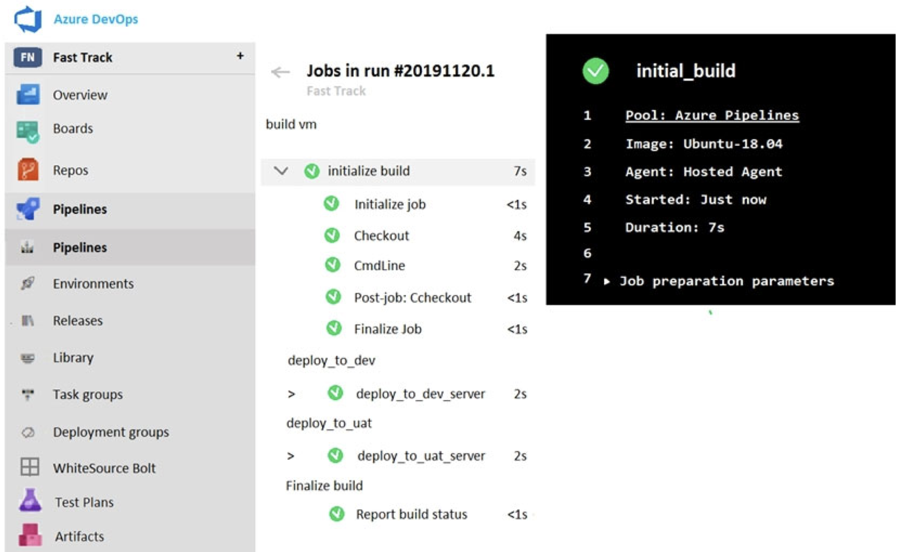

Use the drop-down menus to select the answer choice that completes each statement based on the information presented in the graphic. 

NOTE: Each correct selection is worth one point.

Based on the image provided, here is the extracted text content:

**Answer Area**

*   **The pipeline contains:** [ Dropdown Menu ]
    *   one stage
    *   two stages
    *   three stages
    *   four stages
    *   five stages

*   **Build_vm contains:** [ Dropdown Menu ]
    *   one job
    *   two jobs
    *   three jobs
    *   four jobs
    *   five jobs

----


✅ Correct answers:

* **The pipeline contains:** **four stages**
* **Build_vm contains:** **one job**

---

🔍 Explanation

From the image:

**Stages visible in the pipeline**

You can clearly see four top-level sections (stages):

1. **build_vm**
2. **deploy_to_dev**
3. **deploy_to_uat**
4. **Finalize build**

➡️ Total = **4 stages**

**Jobs inside Build_vm**

Under **build_vm**, there is a single job named something like:

* **initialize build** (with steps like checkout, cmdline, finalize job)

➡️ This indicates **only one job**, with multiple **steps inside it**

🧠 Key Concept

* **Stage** = high-level phase (Build, Deploy, etc.)
* **Job** = execution unit within a stage
* **Steps** = tasks inside a job


✅ Final Answer

* **Pipeline:** four stages
* **Build_vm:** one job


### Question #16

DRAG DROP You are configuring Azure DevOps build pipelines.

You plan to use hosted build agents.

Which build agent pool should you use to compile each application type? To answer, drag the appropriate build agent pools to the correct application types. Each build agent pool may be used once, more than once, or not at all. You may need to drag the split bar between panes or scroll to view content.

NOTE: Each correct selection is worth one point.

Select and Place


Based on the image provided, here is the extracted text content:

**Build Agent Pools**
*   Hosted Windows Container
*   Hosted Linux
*   Hosted macOS
*   Hosted
*   Default

**Answer Area**

*   **An application that runs on iOS:** `[Empty Slot]`
*   **An Internet Information Services (IIS) web application that runs in Docker:** `[Empty Slot]`

------

* **An application that runs on iOS:** **Hosted macOS**
* **An Internet Information Services (IIS) web application that runs in Docker:** **Hosted Windows Container**


### Question #21


Your company has a project in Azure DevOps for a new application. The application will be deployed to several Azure virtual machines that run Windows Server 2019.

You need to recommend a deployment strategy for the virtual machines. The strategy must meet the following requirements:

✑ Ensure that the virtual machines maintain a consistent configuration.

✑ Minimize administrative effort to configure the virtual machines.

What should you include in the recommendation?

A. Azure Resource Manager templates and the PowerShell Desired State Configuration (DSC) extension for Windows

B. Deployment YAML and Azure pipeline deployment groups

C. Azure Resource Manager templates and the Custom Script Extension for Windows

D. Deployment YAML and Azure pipeline stage templates

-----


The key requirements are:

* **Maintain consistent configuration across VMs**
* **Minimize administrative effort**

Let’s evaluate:

✅ Best choice: **A. Azure Resource Manager templates and the PowerShell Desired State Configuration (DSC) extension for Windows**

* **Azure Resource Manager (ARM) templates** ensure infrastructure consistency (VMs, networking, etc.) using declarative IaC.
* **PowerShell DSC extension** enforces and maintains the desired state of each VM (software, configuration, settings).
* DSC continuously checks and corrects drift → ensures long-term consistency with minimal manual effort.

❌ Why others are incorrect:

* **B. Deployment groups**
  Focus on deployment orchestration, not configuration enforcement or drift correction.

* **C. Custom Script Extension**
  Runs scripts once, but does NOT maintain state over time (no drift correction).

* **D. YAML + stage templates**
  Help structure pipelines, but do not manage VM configuration consistency.

✅ Final Answer:

**A. Azure Resource Manager templates and the PowerShell Desired State Configuration (DSC) extension for Windows**

### Question #23

DRAG DROP Your company has two virtual machines that run Linux in a third-party public cloud.

You plan to use the company's Azure Automation State Configuration implementation to manage the two virtual machines and detect configuration drift.

You need to onboard the Linux virtual machines.

You install PowerShell Desired State Configuration (DSC) on the virtual machines, and then run register.py.

Which three actions should you perform next in sequence? To answer, move the actions from the list of actions to the answer area and arrange them in the correct order.

Select and Place:


Based on the image provided, here is the extracted text content:

**Actions**

*   Create a DSC metaconfiguration
*   Copy the metaconfiguration to the virtual machines
*   Add the virtual machines as DSC nodes in Azure Automation
*   Install Windows Management Framework 5.1 on the virtual machines
*   From the virtual machines, run `setdsclocalconfigurationmanager.py`

-----


To onboard Linux VMs to **Azure Automation State Configuration (DSC)** after installing DSC and running `register.py`, you must configure and apply the Local Configuration Manager (LCM).

✅ Correct sequence:

1. **Create a DSC metaconfiguration**

   * Defines how the node communicates with Azure Automation (pull server, registration key, etc.).

2. **Copy the metaconfiguration to the virtual machines**

   * The configuration must be present locally before applying it.

3. **From the virtual machines, run `setdsclocalconfigurationmanager.py`**

   * Applies the metaconfiguration to configure the LCM and complete onboarding.

❌ Why not the others?

* **Add the virtual machines as DSC nodes in Azure Automation** → Happens automatically after registration.
* **Install Windows Management Framework 5.1** → Only for Windows, not Linux.

✅ Final Answer (in order):

1. Create a DSC metaconfiguration
2. Copy the metaconfiguration to the virtual machines
3. From the virtual machines, run `setdsclocalconfigurationmanager.py`


### Question #25

DRAG DROP You are creating a container for an ASP.NET Core app.

You need to create a Dockerfile file to build the image. The solution must ensure that the size of the image is minimized.


How should you configure the file? To answer, drag the appropriate values to the correct targets. Each value may be used once, more than once, or not at all. You may need to drag the split bar between panes or scroll to view content.

NOTE: Each correct selection is worth one point.


------

**Values**

*   `dotnet publish -c Release -o out`
*   `dotnet restore`
*   `mcr.microsoft.com/dotnet/aspnet:5.0`
*   `mcr.microsoft.com/dotnet/sdk:5.0`

**Answer Area**

```dockerfile

FROM [ Value ] AS build-env

COPY . /app/
WORKDIR /app

RUN [ Value ]

FROM [ Value ]

COPY --from=build-env /app/out /app
WORKDIR /app

ENTRYPOINT ["dotnet", "MvcMovie.dll"]
```


-----


To **minimize the Docker image size**, you should use a **multi-stage build**:

* Use the **SDK image** to build the app
* Use the **ASP.NET runtime image** (smaller) for the final image
* Only copy the published output

✅ Correct configuration:

```dockerfile
FROM mcr.microsoft.com/dotnet/sdk:5.0 AS build-env

COPY . /app/
WORKDIR /app

RUN dotnet publish -c Release -o out

FROM mcr.microsoft.com/dotnet/aspnet:5.0

COPY --from=build-env /app/out /app
WORKDIR /app

ENTRYPOINT ["dotnet", "MvcMovie.dll"]
```

🎯 Key points:

* **`mcr.microsoft.com/dotnet/sdk:5.0`** → needed for build tools
* **`dotnet publish -c Release -o out`** → compiles and trims output
* **`mcr.microsoft.com/dotnet/aspnet:5.0`** → lightweight runtime image
* Avoid `dotnet restore` separately → `publish` already handles it

 ✅ Final Answers (mapped):

* **First FROM:** `mcr.microsoft.com/dotnet/sdk:5.0`
* **RUN:** `dotnet publish -c Release -o out`
* **Second FROM:** `mcr.microsoft.com/dotnet/aspnet:5.0`


### Question #26

DRAG DROP You are configuring the settings of a new Git repository in Azure Repos.

You need to ensure that pull requests in a branch meet the following criteria before they are merged:

✑ Committed code must compile successfully.

✑ Pull requests must have a Quality Gate status of Passed in SonarCloud.

Which policy type should you configure for each requirement? To answer, drag the appropriate policy types to the correct requirements. Each policy type may be used once, more than once, or not at all. You may need to drag the split bar between panes or scroll to view content. NOTE: Each correct selection is worth one point.

Select and Place:


------

**Policy Types**

*   A build policy
*   A check-in policy
*   A status policy

**Answer Area**

*   **Committed code must compile successfully:** `[Empty Slot]`
*   **Pull requests must have a Quality Gate status of Passed in SonarCloud:** `[Empty Slot]`

------


To enforce requirements on **pull requests in Azure Repos**, you use **branch policies**:

✅ Mapping:

* **Committed code must compile successfully:** **A build policy**

  * A build validation policy runs a pipeline to ensure the code builds successfully before merging.

* **Pull requests must have a Quality Gate status of Passed in SonarCloud:** **A status policy**

  * SonarCloud reports its Quality Gate result as a **status check**, which is enforced using a status policy.

❌ Why not check-in policy?

* **Check-in policies** apply to TFVC, not Git repositories.

✅ Final Answer:

* **Committed code must compile successfully:** A build policy
* **Pull requests must have a Quality Gate status of Passed in SonarCloud:** A status policy


### Question-132

You need to recommend an integration strategy for the build process of a Java application. The solution must meet the following requirements:

The builds must access an on-premises dependency management system.

The build outputs must be stored as Server artifacts in Azure DevOps.

The source code must be stored in a Git repository in Azure DevOps.

Solution: Configure the build pipeline to use a Hosted Ubuntu agent pool. Include the Java Tool Installer task in the build pipeline.

Does this meet the goal?

* A. Yes
* B. No

**Correct answer: B. No** ❌

**Answer: B. No**

The solution does not meet the requirement because a hosted Ubuntu agent runs in the Azure cloud and cannot directly access an on-premises dependency management system without additional network configuration (such as a VPN or self-hosted agent). The Java Tool Installer task only ensures the correct Java version is used, but does not address on-premises connectivity.


### Question-133

Your company uses a Git repository in Azure Repos to manage the source code of a web application. The master branch is protected from direct updates.

Developers work on new features in the topic branches.

**Because of the high volume of requested features,** it is difficult to follow the history of the changes to the master branch.

You need to enforce a pull request merge strategy. The strategy must meet the following requirements:

Consolidate commit histories.

Merge the changes into a single commit.

Which merge strategy should you use in the branch policy?

* A. squash merge
* B. fast-forward merge
* C. Git fetch
* D. no-fast-forward merge

----


**Correct answer: A. squash merge** ✅

Why **squash merge** is the right choice

The requirements are:

* ✔ **Consolidate commit histories**
* ✔ **Merge changes into a single commit**

A **squash merge** does exactly this:

* Takes all commits from the topic branch
* Combines them into **one single commit**
* Keeps the **master branch history clean and readable**
* Makes it easy to track features as single logical changes

Why the others are wrong

* **B. fast-forward merge** ❌
  Preserves full commit history → does not consolidate

* **C. Git fetch** ❌
  Not a merge strategy

* **D. no-fast-forward merge** ❌
  Creates a merge commit but still preserves all commits → not a single commit

Final Answer:

**A. squash merge** 🟢


### Question-134

You are automating the build process for a Java-based application by using Azure DevOps.

You need to add code coverage testing and publish the outcomes to the pipeline.

What should you use?

* A. Bullseye Coverage
* B. JUnit
* C. JaCoCo
* D. MSTest

----

**Correct answer: C. JaCoCo** ✅

Why JaCoCo?

**JaCoCo (Java Code Coverage)** is the standard tool for Java applications to:

* Measure **code coverage**
* Integrate with **Maven/Gradle**
* Publish results to **Azure DevOps pipelines**
* Generate reports (HTML, XML, CSV)
* Work seamlessly with tools like **SonarQube**

Why the others are incorrect

* **A. Bullseye Coverage** ❌ → Primarily for C/C++ projects
* **B. JUnit** ❌ → Testing framework, **not** a coverage tool
* **D. MSTest** ❌ → .NET testing framework, not Java

Final Answer:

**C. JaCoCo** 🟢


### Question-135

You are automating the build process for a Java-based application by using Azure DevOps.

You need to add code coverage testing and publish the outcomes to the pipeline.

What should you use?

* A. Cobertura
* B. Bullseye Coverage
* C. MSTest
* D. Coverlet

---

**Correct answer: A. Cobertura** ✅

Why Cobertura?

**Cobertura** is a **Java code coverage** tool that:

* Integrates with **Maven** and **Gradle**
* Produces coverage reports (XML/HTML)
* Is supported by **Azure DevOps** for publishing coverage results in pipelines
* Is commonly used in CI/CD for Java projects

Why the others are incorrect

* **B. Bullseye Coverage** ❌ → C/C++ coverage tool
* **C. MSTest** ❌ → .NET testing framework
* **D. Coverlet** ❌ → .NET Core coverage tool

Final Answer:

**A. Cobertura** 🟢


### Question #19

HOTSPOT You are designing YAML-based Azure pipelines for the apps shown in the following table.

Based on the image provided, here is the extracted content and the correct solution for configuring the YAML pipeline strategies.

**Extracted Table**

| Name | Platform | Release requirements |
| :--- | :--- | :--- |
| **App1** | Azure virtual machine | Replace a fixed set of existing instances of the previous version of App1 with instances of the new version of the app in each iteration. |
| **App2** | Azure Kubernetes Service (AKS) cluster | Roll out a limited deployment of the new version of App2 to validate the functionality of the app. Once testing is successful, expand the rollout. |

You need to configure the YAML strategy value for each app. 

The solution must minimize app downtime. 

Which value should you configure for each app? To answer, select the appropriate options in the answer area. NOTE: Each correct selection is worth one point.


**Answer Area**

*   **App1:** [ Dropdown Menu ]
    *   canary
    *   rolling
    *   runonce

*   **App2:** [ Dropdown Menu ]
    *   canary
    *   rolling
    *   runonce


------


To minimize downtime and match each release requirement:

* **App1:** **rolling**

  * A *rolling* strategy replaces a fixed set of instances in batches, which matches the requirement of updating a defined number of VMs per iteration with minimal downtime.

* **App2:** **canary**

  * A *canary* strategy deploys to a small subset first, validates functionality, and then gradually expands—exactly what the requirement describes.

✅ Final Answer

* **App1:** rolling
* **App2:** canary

### Question #28


After you answer a question in this section, you will NOT be able to return to it. As a result, these questions will not appear in the review screen.

Your company uses Azure DevOps to manage the build and release processes for applications.

You use a Git repository for applications source control.

You need to implement a pull request strategy that reduces the history volume in the master branch.

Solution: You implement a pull request strategy that uses fast-forward merges.

Does this meet the goal?

A. Yes

B. No

----


The goal is to **reduce the history volume in the master branch**.

🔍 Analysis:

* **Fast-forward merge**:

  * Does **not create a merge commit**
  * Keeps history **linear and compact**
  * Reduces unnecessary commits → **less history clutter**

This directly satisfies the requirement.

✅ Final Answer:

**A. Yes**


### Question #29

After you answer a question in this section, you will NOT be able to return to it. As a result, these questions will not appear in the review screen.

Your company uses Azure DevOps to manage the build and release processes for applications.

You use a Git repository for applications source control.

You need to implement a pull request strategy that reduces the history volume in the master branch.

Solution: You implement a pull request strategy that uses squash merges.

Does this meet the goal?

A. Yes

B. No

-----


🔍 Analysis:

* **Squash merge**:

  * Combines all commits from the feature branch into **a single commit** when merging.
  * Significantly **reduces the number of commits** in the target branch.
  * Keeps history **clean and compact**.

This directly meets the requirement to **reduce the history volume in the master branch**.

---

✅ Final Answer:

**A. Yes**


### Question #30

After you answer a question in this section, you will NOT be able to return to it. As a result, these questions will not appear in the review screen.

Your company uses Azure DevOps to manage the build and release processes for applications.

You use a Git repository for applications source control.

You need to implement a pull request strategy that reduces the history volume in the master branch.

Solution: You implement a pull request strategy that uses an explicit merge.

Does this meet the goal?

A. Yes

B. No


----

🔍 Analysis:

* **Explicit merge (no fast-forward / merge commit)**:

  * Creates an additional **merge commit** for every pull request
  * Preserves full branch history (all commits + merge commits)
  * **Increases** history volume rather than reducing it

This does **not** meet the requirement to reduce history volume.

❌ Final Answer:

**B. No**


### Question #31

Your company uses Azure DevOps to manage the build and release processes for applications.

You use a Git repository for applications source control.

You need to implement a pull request strategy that reduces the history volume in the master branch.

Solution: You implement a pull request strategy that uses a three-way merge.

Does this meet the goal?

A. Yes

B. No

----

🔍 Analysis:

* A **three-way merge** (default merge commit):

  * Creates a **merge commit** for each pull request
  * Preserves all individual commits from the feature branch
  * Results in **more commits and a more complex history**

This **does not reduce** the history volume—in fact, it increases it.

❌ Final Answer:

**B. No**


### Question #32

You need to recommend a Docker container build strategy that meets the following requirements: 


✑ Minimizes image sizes 

✑ Minimizes the security surface area of the final image What should you include in the recommendation?

A. multi-stage builds

B. PowerShell Desired State Configuration (DSC)

C. Docker Swarm

D. single-stage builds

----


To meet the requirements:

* **Minimize image size**
* **Minimize security surface area**

🔍 Analysis:

* **Multi-stage builds**:

  * Use a **build image** (with SDK/tools) and a **separate runtime image**
  * Final image contains **only necessary runtime artifacts**
  * Removes compilers, build tools → **smaller size + reduced attack surface**

* **Other options**:

  * **DSC** → configuration management, not related to container builds
  * **Docker Swarm** → orchestration, not image optimization
  * **Single-stage builds** → include all tools → **larger and less secure**

✅ Final Answer:

**A. multi-stage builds**


### Question #33

You plan to create an image that will contain a .NET Core application.

You have a Docker file file that contains the following code. (Line numbers are included for reference only.)

```
01 FROM microsoft/dotnet: 3.1-sdk
02 COPY . /
03 RUN dotnet publish -c Release -o out
04 FROM microsoft/dotnet: 3.1-sdk
05 COPY --from=0 /out /
06 WORKDIR /
07 ENTRYPOINT [“dotnet”, “app1.dll”]

```

You need to ensure that the image is as small as possible when the image is built. Which line should you modify in the file?

A. 1

B. 3

C. 4

D. 7


-----


To minimize the final image size, you should ensure the **final stage uses a runtime image instead of an SDK image**.

What’s wrong in the Dockerfile?

* Line 1 uses `dotnet:3.1-sdk` → OK for build stage (needs SDK to compile/publish)
* Line 4 also uses `dotnet:3.1-sdk` → ❌ unnecessary for final image

The final stage should use:

* `microsoft/dotnet:3.1-aspnetcore-runtime` or
* `mcr.microsoft.com/dotnet/aspnet:3.1` (modern equivalent)

This removes build tools and reduces image size significantly.

Correct modification

Change **line 4** from SDK image to runtime image.

Answer:

**C. 4**


### Question #34

Your company has a project in Azure DevOps for a new web application.

You need to ensure that when code is checked in, a build runs automatically.

Solution: From the Triggers tab of the build pipeline, you select Batch changes while a build is in progress.

Does this meet the goal?

A. Yes

B. No


-----


**Correct answer: B. No**

Selecting **“Batch changes while a build is in progress”** only affects how queued builds are handled (it groups multiple commits into a single build when one is already running).

It **does NOT enable automatic builds on code check-in**.

To meet the goal, you must enable a **Continuous Integration (CI) trigger**, which is what actually starts a build automatically when code is checked in.

Why this is incorrect:

* ❌ Batch changes = optimization of build queue behavior
* ❌ It does not trigger builds on commits
* ✅ CI trigger = required to run builds automatically on check-in

Correct concept:

You need to configure:

* **CI trigger enabled in the pipeline YAML or UI**

✔ So the solution does not meet the goal.

### Question #35

HOTSPOT You need to deploy Azure Kubernetes Service (AKS) to host an application. The solution must meet the following requirements: 

✑ Containers must only be published internally.

✑ AKS clusters must be able to create and manage containers in Azure.

What should you use for each requirement? To answer, select the appropriate options in the answer area.

NOTE: Each correct selection is worth one point.


Based on the image provided, here is the extracted text content:

**Answer Area**

*   **Containers must only be published internally:** `[ Dropdown Menu ]`
    *   **Options:**
        *   Azure Container Instances
        *   Azure Container Registry
        *   Dockerfile

*   **AKS clusters must be able to create and manage containers in Azure:** `[ Dropdown Menu ]`
    *   **Options:**
        *   An Azure Active Directory (Azure AD) group
        *   An Azure Automation account
        *   An Azure service principal

-----


Correct answers

**1. Containers must only be published internally:**
👉 **Azure Container Registry**

* ACR is a private container registry.
* It allows images to be stored and accessed only within your organization or secured networks.

---

**2. AKS clusters must be able to create and manage containers in Azure:**
👉 **An Azure service principal**

* AKS uses a service principal (or managed identity) to authenticate and interact with Azure resources.
* It allows the cluster to pull images from ACR and manage resources securely.


Final selections:

* **Internal publishing:** Azure Container Registry
* **AKS access to Azure:** Azure service principal


### Question #36


You have 50 Node.js-based projects that you scan by using WhiteSource. Each project includes Package.json, Package-lock.json, and Npmshrinkwrap.json files.

You need to minimize the number of libraries reports by WhiteSource to only the libraries that you explicitly reference.

What should you do?

A. Configure the File System Agent plug-in.

B. Add a devDependencies section to Package-lock.json.

C. Configure the Artifactory plug-in.

D. Delete Package-lock.json.

-----

Correct answer: **D. Delete Package-lock.json**

Explanation:

WhiteSource (now Mend) scans dependency files to build a full dependency tree. In Node.js projects:

* `package.json` = explicitly declared dependencies
* `package-lock.json` / `npm-shrinkwrap.json` = **transitive dependency lock files**

These lock files include **all indirect (transitive) dependencies**, which is why WhiteSource reports many more libraries than you explicitly reference.

Goal requirement:

> “Only the libraries that you explicitly reference”

To achieve this, you must prevent WhiteSource from analyzing transitive dependency resolution files.

Why option D is correct:

* Removing `package-lock.json` reduces scanning of transitive dependencies
* WhiteSource will then focus only on `package.json` (direct dependencies)

Why others are incorrect:

* **A. File System Agent plug-in** → unrelated to dependency filtering
* **B. devDependencies in package-lock.json** → invalid (lock file is auto-generated, not manually edited)
* **C. Artifactory plug-in** → used for repository integration, not dependency reduction

Final Answer:

✅ **D. Delete Package-lock.json**


### Question #39

Your company has an Azure DevOps project, The source code for the project is stored in an on-premises repository and uses on an on-premises build server. You plan to use Azure DevOps to control the build process on the build server by using a self-hosted agent. You need to implement the self-hosted agent.

You download and install the agent on the build server.

Which two actions should you perform next? Each correct answer presents part of the solution.

A. From Azure, create a shared access signature (SAS).

B. From the build server, create a certificate, and then upload the certificate to Azure Storage.

C. From the build server, create a certificate, and then upload the certificate to Azure Key Vault.

D. From DevOps, create a personal access token (PAT).

E. From the build server, run config.cmd.


---------


Correct answers:

**D. From DevOps, create a personal access token (PAT)**
**E. From the build server, run config.cmd**

Explanation:

To set up a **self-hosted Azure DevOps agent**, after downloading and installing the agent package, you must complete registration and authentication.

Required steps:

1. Create a PAT (Personal Access Token)

* Done in **Azure DevOps**
* Used to authenticate the agent with your Azure DevOps organization
* Required for secure agent configuration

✔ This corresponds to **option D**


2. Configure the agent on the server

* Run `config.cmd` (Windows) or `config.sh` (Linux/macOS)
* This script:

  * Connects the agent to your Azure DevOps organization
  * Uses the PAT for authentication
  * Registers the agent into an agent pool

✔ This corresponds to **option E**


Why others are incorrect:

* **A. SAS token** → used for Azure Storage access, not DevOps agents
* **B & C. Certificates** → not required for standard Azure DevOps agent setup


Final Answer:

✅ **D and E**

### Question #40

You have an Azure subscription that contains an Azure Active Directory (Azure AD) tenant.


You are configuring a build pipeline in Azure Pipelines that will include a task named Task1. Task1 will authenticate by using an Azure AD service principal.

Which three values should you configure for Task1? Each correct answer presents part of the solution.

NOTE: Each correct selection is worth one point.

A. the tenant ID

B. the subscription ID

C. the client secret

D. the app ID

E. the object ID

-----

Correct answers:

**A. the tenant ID**
**C. the client secret**
**D. the app ID**


Explanation:

When an Azure Pipelines task authenticates using an **Azure AD service principal**, it requires the standard service principal credentials:

1. Tenant ID (A)

* Identifies the Azure AD directory where the service principal exists
* Required to scope authentication

2. App ID (D)

* Also called **Client ID**
* Identifies the service principal (application registration)

3. Client Secret (C)

* Password-like credential for the service principal
* Used to prove identity securely

Why the others are incorrect:

* **B. Subscription ID**

  * Used for targeting Azure resources, but not part of authentication itself

* **E. Object ID**

  * Internal Azure AD identifier for directory objects
  * Not used for authentication in pipelines

Final Answer:

✅ **A, C, D**


### Question #41

DRAG DROP You are deploying a new application that uses Azure virtual machines.

You plan to use the Desired State ConFIguration (DSC) extension on the virtual machines.

You need to ensure that the virtual machines always have the same Windows feature installed.

Which three actions should you perform in sequence? To answer, move the appropriate actions from the list of actions to the answer area and arrange them in the correct order.

Select and Place:

**Actions**

*   Configure the DSC extension on the virtual machines.
*   Create a YAML configuration file.
*   Load the file to Azure Blob storage.
*   Configure the Custom Script Extension on the virtual machines.
*   Load the file to Azure Files.
*   Create a PowerShell configuration file.

**Answer Area**

*   **[Slot 1]**
*   **[Slot 2]**
*   **[Slot 3]**


--------


Correct sequence for using **PowerShell Desired State Configuration (DSC)** with Azure VMs

To ensure consistent Windows feature installation using DSC, you must:

 ✅ **Step 1: Create a PowerShell configuration file**

* DSC configurations are written in **PowerShell (.ps1)**, not YAML.

✔ **Slot 1: Create a PowerShell configuration file**

✅ **Step 2: Load the file to Azure Blob storage**

* Azure DSC extension retrieves configuration scripts from **Azure Storage (Blob)**.

✔ **Slot 2: Load the file to Azure Blob storage**

✅ **Step 3: Configure the DSC extension on the virtual machines**

* Apply the configuration using the **DSC VM extension**
* This enforces the desired state (e.g., Windows feature installed)

✔ **Slot 3: Configure the DSC extension on the virtual machines**

❌ Why others are wrong:

* **YAML configuration file** → used for Azure Pipelines, not DSC
* **Azure Files** → not the standard DSC source location in this context
* **Custom Script Extension** → runs scripts once, not continuous state enforcement

Final Answer (in order):

1. **Create a PowerShell configuration file**
2. **Load the file to Azure Blob storage**
3. **Configure the DSC extension on the virtual machines**


### Question #42


You need to execute inline testing of an Azure DevOps pipeline that uses a Docker deployment model. The solution must prevent the results from being published to the pipeline.

What should you use for the inline testing?

A. a single stage Dockerfile

B. an Azure Kubernetes Service (AKS) pod

C. a multi-stage Dockerfile

D. a Docker Compose file


----


The correct answer is **C. a multi-stage Dockerfile**.

Explanation:

**Multi-stage Dockerfiles** allow you to define different "stages" for building, testing, and running your application within a single file. 

1.  **Inline Testing:** You can create a specific stage (e.g., `FROM base AS test`) where you run your unit or integration tests (e.g., `RUN dotnet test`). Because this happens during the `docker build` process, it is considered **inline testing**.
2.  **Isolation:** If the tests fail, the Docker build command fails, stopping the pipeline. If they pass, the build continues to the final stage. 
3.  **Preventing Publication:** Since the tests are executed inside an intermediate Docker container during the build process, the test result files (like `.xml` or `.json` report files) remain within that container's filesystem. They are not accessible to the Azure DevOps pipeline's "Publish Test Results" task unless you specifically write extra logic to extract them. This perfectly meets the requirement to prevent results from being published to the pipeline's test tab.

Why other options are incorrect:

*   **A. Single-stage Dockerfile:** To run tests here, you would have to include test dependencies in your final production image, increasing its size and creating a security risk.
*   **B. AKS pod:** Testing in a pod happens after the image is built and deployed, which is not "inline" with the build process.
*   **D. Docker Compose:** While useful for integration testing with multiple containers (like an app + a database), it is more complex than a Dockerfile and is typically used for external testing rather than inline build-time validation.

### Question #51

You are creating a build pipeline in Azure Pipelines.

You define several tests that might fail due to third-party applications.

You need to ensure that the build pipeline completes successfully if the third-party applications are unavailable. What should you do?

A. Configure the build pipeline to use parallel jobs

B. Configure flaky tests

C. Increase the test pass percentage

D. Add the Requirements quality widget to your dashboard

----

Correct answer: **B. Configure flaky tests**

Explanation:

You have tests that may **fail intermittently due to third-party dependencies** (not actual code issues). You want the pipeline to:

> ✅ Still succeed even if those tests fail occasionally

---

Why **flaky tests** is correct:

* Azure Pipelines allows marking tests as **flaky**
* Flaky tests can be:

  * **Retried automatically**
  * **Ignored in failure conditions** (depending on configuration)
* Prevents pipeline failure due to **external/unreliable dependencies**

---

Why others are incorrect:

* **A. Parallel jobs**

  * Improves speed, not reliability or pass/fail behavior

* **C. Increase test pass percentage**

  * Not a real Azure Pipelines feature

* **D. Requirements quality widget**

  * Reporting/dashboard feature, does not affect pipeline execution

Final Answer:

✅ **B. Configure flaky tests**


### Question #52

DRAG DROP You have an Azure subscription that contains a resources group named RG1. RG1 contains the following resources:

✑ Four Azure virtual machines that run Windows Server and have Internet Information Services (IIS) installed.

✑ SQL Server on an Azure virtual machine.

✑ An Azure Load Balancer.

You need to deploy an application to the virtual machines in RG1 by using Azure Pipelines.

Which four actions should you perform in sequence? To answer, move the appropriate actions from the list of actions to the answer area and arrange them in the correct order.

NOTE: More than one order of answer choices is correct. You will receive credit for any of the correct orders you select.

Select and Place:

----

**Actions**

*   Create an agent pool
*   Add the Puppet Agent extension to the virtual machines
*   Add and configure a deployment group job for the pipeline
*   Add the Azure Pipelines Agent extension to the virtual machines
*   Create a deployment group
*   Execute the pipeline

**Answer Area**


-----
*Correct Sequence (Solution)**

To deploy an application to Azure Virtual Machines using Azure DevOps, you should perform these actions in the following sequence:

1.  **Create a deployment group**
    *   *Reason:* You first create the logical group in Azure DevOps that will contain your target servers.
2.  **Add the Azure Pipelines Agent extension to the virtual machines**
    *   *Reason:* This extension automatically installs and configures the agent on the Azure VMs so they can register themselves with the deployment group you created in step 1.
3.  **Add and configure a deployment group job for the pipeline**
    *   *Reason:* You modify your release pipeline to include a specific job type that targets the deployment group.
4.  **Execute the pipeline**
    *   *Reason:* This triggers the actual deployment process to the configured VMs.

**Note:** "Create an agent pool" is typically for build/private agents, and "Puppet" is a third-party configuration management tool that is not required for a native Azure Pipelines deployment.


### Question #54

You have an Azure DevOps organization named Contoso and an Azure DevOps project named Project1.

You plan to use Microsoft-hosted agents to build container images that will host full Microsoft .NET Framework apps in a YAML pipeline in Project1.

What are two possible virtual machine images that you can use for the Microsoft-hosted agent pool? Each correct answer presents a complete solution.

NOTE: Each correct selection is worth one point.

A. vs2017-win2016

B. ubuntu-16.04

C. win1803

D. macOS-10.13

E. vs.2015-win2012r2


-----


✅ Correct answers:

**A. vs2017-win2016**
**E. vs2015-win2012r2**

 Explanation:

You are building **full .NET Framework applications**, which:

* Require **Windows OS**
* Require **.NET Framework (not .NET Core)**
* Often depend on **Visual Studio build tools**

Why A and E are correct:

* **A. vs2017-win2016**

  * Windows Server image
  * Includes Visual Studio 2017 and .NET Framework support
    ✔ Suitable for building full .NET Framework apps

* **E. vs2015-win2012r2**

  * Windows Server image
  * Includes Visual Studio 2015 and .NET Framework support
    ✔ Also suitable

---

Why others are incorrect:

* **B. ubuntu-16.04**

  * Linux → ❌ does NOT support full .NET Framework

* **C. win1803**

  * Windows, but lacks full Visual Studio toolchain needed for builds

* **D. macOS-10.13**

  * macOS → ❌ does NOT support full .NET Framework


Final Answer:

✅ **A and E**

### Question #55

HOTSPOT You currently use JIRA, Jenkins, and Octopus as part of your DevOps processes.

You plan to use Azure DevOps to replace these tools.

Which Azure DevOps service should you use to replace each tool? To answer, select the appropriate options in the answer area. NOTE: Each correct selection is worth one point.


Answer Area

JIRA:

- Boards
- Build pipelines
- Release pipelines
- Repos

Jenkins:

- Boards
- Build pipelines
- Release pipelines
- Repos

Octopus:

- Boards
- Build pipelines
- Release pipelines
- Repos


-----

✅ Correct mappings:

* **JIRA:** → **Boards**
* **Jenkins:** → **Build pipelines**
* **Octopus:** → **Release pipelines**

Explanation:

* **JIRA** is used for **agile planning, work tracking, and issue management** → replaced by **Azure DevOps Boards**
* **Jenkins** is a **CI tool** for building and testing → replaced by **Azure Pipelines (Build pipelines)**
* **Octopus Deploy** is used for **releases and deployments (CD)** → replaced by **Azure Pipelines (Release pipelines)**

Final Answer:

| Tool    | Azure DevOps Service |
| ------- | -------------------- |
| JIRA    | Boards               |
| Jenkins | Build pipelines      |
| Octopus | Release pipelines    |


### Question #57

Your company develops a client banking application that processes a large volume of data.

Code quality is an ongoing issue for the company. Recently, the code quality has deteriorated because of an increase in time pressure on the development team.

You need to implement static code analysis.

During which phase should you use static code analysis?

A. integration testing

B. staging

C. production release

D. build

-----


Correct answer: **D. build**

---

Explanation:

**Static code analysis** examines source code **without executing it**, so it should be performed as early as possible in the pipeline.

Why the **build phase** is correct:

* Integrated into **CI (Continuous Integration) pipelines**
* Runs automatically on every commit/build
* Detects:

  * Code smells
  * Security vulnerabilities
  * Style and quality issues
* Prevents poor-quality code from progressing further

 Why others are incorrect:

* **A. Integration testing**

  * Focuses on runtime behavior, not static analysis

* **B. Staging**

  * Too late; issues should be caught earlier

* **C. Production release**

  * Far too late; defects would already be deployed
Final Answer:

✅ **D. build**


### Question #58

DRAG DROP You have a project in Azure DevOps that uses packages from multiple public feeds. Some of the feeds are unreliable.

You need to consolidate the packages into a single feed.


Which three actions should you perform in sequence? To answer, move the appropriate actions from the list of actions to the answer area and arrange them in the correct order.

Select and Place:

Actions

- Modify the configuration files to reference the Azure Artifacts feed.
- Run an initial package restore.
- Create a Microsoft Visual Studio project that includes all the packages.
- Create an Azure Artifacts feed that uses upstream sources.
- Create a NuGet package.
- Create an npm package.

-----

✅ Correct sequence:

1. **Create an Azure Artifacts feed that uses upstream sources**
2. **Run an initial package restore**
3. **Modify the configuration files to reference the Azure Artifacts feed**

Explanation:

1. Create Azure Artifacts feed with upstream sources

* This allows your feed to **aggregate packages from multiple public feeds**
* Acts as a **single consolidated source**

2. Run an initial package restore

* Downloads packages from upstream sources into your feed
* Caches them for reliability and future use

3. Modify configuration files

* Update `nuget.config`, `.npmrc`, etc.
* Ensures builds use the **new consolidated feed only**

Why others are incorrect:

* Creating Visual Studio project → not required
* Creating NuGet/npm package → unrelated to consolidation

Final Answer:

**Create Azure Artifacts feed with upstream sources → Run initial package restore → Modify configuration files to reference the feed**

### Question #59

HOTSPOT You have the Azure DevOps pipeline shown in the following exhibit.

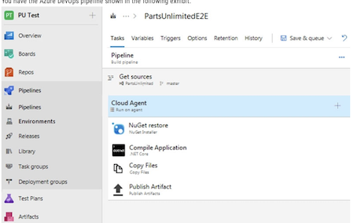

Use the drop-down menus to select the answer choice that completes each statement based on the information presented in the graphic. NOTE: Each correct selection is worth one point.

Based on the image provided, here is the extracted text content:

**Answer Area**

*   **The pipeline has:** [ Dropdown Menu ] job(s).
    *   0
    *   1
    *   4

*   **The pipeline has:** [ Dropdown Menu ] task(s).
    *   0
    *   1
    *   4

---------


Based on the information presented in the exhibit, here is the analysis of the Azure DevOps pipeline:

**1. The pipeline has: 1 job(s)**

In a Classic Build pipeline (as shown), the item labeled **"Cloud Agent (Run on agent)"** represents an **Agent Job**. Since there is only one such entry listed under the "Pipeline" and "Get sources" section, the pipeline contains exactly one job.

**2. The pipeline has: 4 task(s)**

The individual units of work listed under the Agent Job are the **Tasks**. Counting the items indented under "Cloud Agent," we see:

1.  **NuGet restore**
2.  **Compile Application**
3.  **Copy Files**
4.  **Publish Artifact**

Total = 4 tasks.

**Summary for Answer Area:**

*   The pipeline has: **1** job(s).
*   The pipeline has: **4** task(s).

### Question #61

DRAG DROP You need to use Azure Automation State Configuration to manage the ongoing consistency of virtual machine configurations.

Which five actions should you perform in sequence? To answer, move the appropriate actions from the list of actions to the answer area and arrange them in the correct order.

NOTE: More than one order of answer choices is correct. You will receive credit for any of the correct orders you select.

Select and Place:

Actions


- Onboard the virtual machines to Azure Automation State Configuration.
- Check the compliance status of the node.
- Create a management group.
- Assign the node configuration.
- Compile a configuration into a node configuration.
- Upload a configuration to Azure Automation State Configuration.
- Assign tags to the virtual machines.

Answer Area

----
✅ Correct sequence:

1. **Upload a configuration to Azure Automation State Configuration**
2. **Compile a configuration into a node configuration**
3. **Onboard the virtual machines to Azure Automation State Configuration**
4. **Assign the node configuration**
5. **Check the compliance status of the node**

---

Explanation:

To manage VM configuration consistency using **Azure Automation State Configuration (DSC)**:

1. Upload configuration

* Import your PowerShell DSC configuration into Azure Automation

2. Compile configuration

* Converts configuration into **node-specific MOF files**

3. Onboard VMs

* Registers VMs as **DSC nodes**

4. Assign node configuration

* Applies the desired state to the VMs

5. Check compliance

* Monitor whether nodes match the desired configuration

Why others are incorrect:

* **Create a management group** → unrelated to DSC workflow
* **Assign tags** → useful for organization, not required for DSC process

Final Answer:

**Upload configuration → Compile → Onboard VMs → Assign configuration → Check compliance**

### Question #62

You are developing an application. The application source has multiple branches.

You make several changes to a branch used for experimentation.

You need to update the main branch to capture the changes made to the experimentation branch and override the history of the Git repository.

Which Git option should you use?

A. Rebase

B. Fetch

C. Merge

D. Push

----

Correct answer: **A. Rebase**

Explanation:

You need to:

* Apply changes from an experimental branch to **main**
* **Override history** of the repository

Why **Rebase** is correct:

* **Rebase** rewrites commit history by:

  * Reapplying commits onto another branch
  * Creating a **linear history**
* Can be combined with **force push** to override history on the target branch

✔ This matches the requirement to **override history**

Why others are incorrect:

* **B. Fetch**

  * Only downloads changes, does not modify branches

* **C. Merge**

  * Preserves history (creates merge commits)
  * Does **not override history**

* **D. Push**

  * Sends commits to remote, but does not control history behavior itself


Final Answer:

✅ **A. Rebase**


### Question #63

You use Azure Pipelines to build and test a React.js application.

You have a pipeline that has a single job.

You discover that installing JavaScript packages from npm takes approximately five minutes each time you run the pipeline.

You need to recommend a solution to reduce the pipeline execution time.

Solution: You recommend defining a container job that uses a custom container that has the JavaScript packages preinstalled.

Does this meet the goal?

A. Yes

B. No

---

Correct answer: **A. Yes**

Explanation:

The problem is that:

> Installing npm packages takes ~5 minutes on every pipeline run

Why this solution works:

Using a **container job with a custom image that already has npm packages installed**:

* Eliminates the need to run `npm install` every time
* Reuses prebuilt dependencies
* Significantly reduces pipeline execution time

✔ This directly addresses the bottleneck

Additional insight:

This is a valid alternative to caching:

* **Caching** → reuse downloaded packages between runs
* **Custom container** → avoid installation entirely

Final Answer:

✅ **A. Yes**


### Question #64

You use Azure Pipelines to build and test a React.js application.

You have a pipeline that has a single job.

You discover that installing JavaScript packages from npm takes approximately five minutes each time you run the pipeline.

You need to recommend a solution to reduce the pipeline execution time.

Solution: You recommend using pipeline artifacts.

Does this meet the goal?

A. Yes

B. No

-----

❌ Correct answer: **B. No**

🔍 Explanation

🟦 Problem

* `npm install` takes ~5 minutes every run
* Goal: **reduce pipeline execution time**

🟦 Why pipeline artifacts do NOT solve this

* **Pipeline artifacts** are used to:

  * Share files **between jobs/stages**
  * Store build outputs (e.g., compiled app)
* They do **not cache dependencies across runs**

➡️ So npm packages would still be downloaded every time

🟦 Correct approach (what should be used)

* Use **pipeline caching** (`Cache@2` task)
* Cache:

  * `node_modules` OR
  * npm cache (`~/.npm`)

This allows reuse of dependencies across runs → **major speed improvement**

🎯 Conclusion

The proposed solution does NOT meet the goal.

**Answer: B. No**

💡 Key takeaway

* **Artifacts → share outputs**
* **Cache → speed up builds (correct solution)** 🚀


### Question #64

You use Azure Pipelines to build and test a React.js application.

You have a pipeline that has a single job.

You discover that installing JavaScript packages from npm takes approximately five minutes each time you run the pipeline.

You need to recommend a solution to reduce the pipeline execution time.

Solution: You recommend enabling pipeline caching.

Does this meet the goal?

A. Yes

B. No

----
Correct answer: **A. Yes**

Explanation:

Enabling **pipeline caching** is a recommended way to reduce time spent installing npm packages.

* Caches the contents of `node_modules` or npm cache directory
* On subsequent runs:

  * Dependencies are restored from cache instead of downloading again
* Significantly reduces the ~5-minute install time

Why this meets the goal:

- ✔ Speeds up pipeline execution
- ✔ Avoids repeated package downloads
- ✔ Native and efficient solution in Azure Pipelines

Final Answer:

✅ **A. Yes**


### Question #70

You have an Azure DevOps project.


Your build process creates several artifacts.

You need to deploy the artifacts to on-premises servers.

Solution: You deploy an Azure self-hosted agent to an on-premises server. You add a Copy and Publish Build Artifacts task to the deployment pipeline.

Does this meet the goal?

A. Yes

B. No

----------

Correct answer: **B. No**

Explanation:

The goal is to **deploy build artifacts to on-premises servers**.

What the solution does:

* ✔ Uses a **self-hosted agent on-premises** → correct approach for reaching on-prem servers
* ❌ Uses **Copy and Publish Build Artifacts task** → incorrect purpose

Why this does NOT meet the goal:

* **Publish Build Artifacts**:

  * Uploads artifacts **from pipeline to Azure DevOps**
  * Does NOT deploy artifacts to target servers

* **Copy task (in this context)**:

  * Typically copies files **within the agent**, not to remote machines unless specifically configured

What should be used instead:

* **Deployment jobs** or **deployment group agents**
* Tasks like:

  * **Windows Machine File Copy**
  * **PowerShell Remoting**
  * **Deployment Group jobs**

Final Answer:

❌ **B. No**


### Question #75

DRAG DROP You are building an application that has the following assets:

✑ Source code ✑ Logs from automated tests and builds 

✑ Large and frequently updated binary assets

✑ A common library used by multiple applications 


Where should you store each asset? To answer, drag the appropriate Azure services to the correct assets. Each service may be used once. You may need to drag the split bar between panes or scroll to view content.

NOTE: Each correct selection is worth one point.

Select and Place:

**Azure Services**

*   Azure Artifacts
*   Azure Pipelines
*   Azure Repos
*   Azure Storage
*   Azure Test Plans

**Answer Area**

*   **Source code:** [ Drop zone ]
*   **A common library used by multiple applications:** [ Drop zone ]
*   **Logs from automated tests and builds:** [ Drop zone ]
*   **Large and frequently updated binary assets:** [ Drop zone ]

--------


✅ Correct mapping:

* **Source code:** → **Azure Repos**
* **A common library used by multiple applications:** → **Azure Artifacts**
* **Logs from automated tests and builds:** → **Azure Pipelines**
* **Large and frequently updated binary assets:** → **Azure Storage**

Explanation:

🔹 Source code → Azure Repos

* Git-based version control for managing application source code

🔹 Common library → Azure Artifacts

* Designed for **package management** (NuGet, npm, Maven, etc.)
* Ideal for sharing reusable libraries across projects

🔹 Logs → Azure Pipelines

* Pipelines automatically generate and store **build/test logs**

🔹 Large binary assets → Azure Storage

* Optimized for **large, frequently updated files**
* More efficient and scalable than storing in repos

Final Answer:

| Asset                  | Service         |
| ---------------------- | --------------- |
| Source code            | Azure Repos     |
| Common library         | Azure Artifacts |
| Logs from builds/tests | Azure Pipelines |
| Large binary assets    | Azure Storage   |


### Question #76

You plan to share packages that you wrote, tested, validated, and deployed by using Azure Artifacts.

You need to release multiple builds of each package by using a single feed. The solution must limit the release of packages that are in development.

What should you use?

A. local symbols

B. views

C. global symbols

D. upstream sources

-----


✅ Correct answer: **B. views**

Explanation:

In **Azure Artifacts**, **views** are used to control package visibility and release stages within a single feed.

Why **views** are correct:

* A feed can have multiple views such as:

  * **@local** → all packages (including development)
  * **@prerelease** → testing/validation stage
  * **@release** → stable, approved packages

* You can:

  * Publish all packages to the feed
  * Promote only validated packages to the **release view**
  * Restrict consumers to only see approved packages

✔ This meets the requirement:

> “limit the release of packages that are in development”

Why others are incorrect:

* **A. Local symbols / C. Global symbols**

  * Related to debugging symbols, not package release control

* **D. Upstream sources**

  * Used to consume external feeds, not manage release stages

Final Answer:

✅ **B. views**


### Question #77

You have a project in Azure DevOps named Project1. Project1 contains a build pipeline named Pipe1 that builds an application named App1. You have an agent pool named Pool1 that contains a Windows Server 2019-based self-hosted agent. Pipe1 uses Pool1.

You plan to implement another project named Project2. Project2 will have a build pipeline named Pipe2 that builds an application named App2.

App1 and App2 have conflicting dependencies.

You need to minimize the possibility that the two build pipelines will con­ict with each other. The solution must minimize infrastructure costs. What should you do?

A. Add another self-hosted agent.

B. Add a Docker Compose task to the build pipelines.

C. Change the self-hosted agent to use Red Hat Enterprise Linux (RHEL) 8.

D. Create two container jobs

-----


✅ Correct answer: **D. Create two container jobs**

Explanation:

You have:

* A **shared self-hosted agent (Pool1)**
* Two pipelines (**Pipe1 and Pipe2**) with **conflicting dependencies**
* Requirement:
  - ✔ Avoid conflicts
  - ✔ Minimize infrastructure cost

Why **container jobs** are the best solution:

* Each pipeline runs inside its **own isolated container**
* Dependencies are **fully separated**
* No need for additional machines/agents
* Containers are **lightweight and cost-efficient**

- ✔ Provides isolation
- ✔ Reuses the same agent
- ✔ Minimizes cost

Why others are incorrect:

* **A. Add another self-hosted agent**

  * Works, but ❌ increases infrastructure cost

* **B. Docker Compose task**

  * Used for multi-container apps, ❌ not for pipeline isolation

* **C. Change OS to RHEL 8**

  * ❌ Does not solve dependency conflicts

Final Answer:

✅ **D. Create two container jobs**


### Question #80

HOTSPOT Your company uses Team Foundation Server 2013 (TFS 2013).

You plan to migrate to Azure DevOps.

You need to recommend a migration strategy that meets the following requirements: 


✑ Preserves the dates of Team Foundation Version Control changesets 

✑ Preserves the changed dates of work items revisions

Minimizes migration effort -

✑ Migrates all TFS artifacts 


What should you recommend? To answer, select the appropriate options in the answer area. NOTE: Each correct selection is worth one point.

Hot Area:

**Answer Area**

**On the TFS server:**

*   Install the TFS Java SDK.
*   Upgrade TFS to the most recent RTW release.
*   Upgrade to the most recent version of PowerShell Core.

**To perform the migration:**

*   Copy the assets manually.
*   Use public API-based tools.
*   Use the TFS Database Import Service.
*   Use the TFS Integration Platform.

-----


To meet the requirements (preserve changeset and work item revision dates, migrate all artifacts, and minimize effort), the correct approach is the **Azure DevOps Server Database Import Service** path.

**Answer Area**

**On the TFS server:**

* ✅ **Upgrade TFS to the most recent RTW release.**

**To perform the migration:**

* ✅ **Use the TFS Database Import Service.**

**Why this is correct**

* The **Database Import Service** is the only supported migration method that preserves:

  * TFVC changeset dates
  * Work item revision timestamps
  * Full project history and artifacts
* Upgrading TFS 2013 to the latest RTW version is required before import, because direct import from older versions is not supported.

**Why the other options are incorrect**

* Java SDK / PowerShell Core → Not used for migration scenarios.
* API-based tools → Do not preserve full historical metadata (dates).
* TFS Integration Platform → Deprecated and does not meet full fidelity requirements.

### Question #83

You have an Azure subscription named Subscription1 that contains a custom Azure policy named Policy1. Policy1 is an audit policy that monitors naming convention compliance for the resources deployed to Subscription1.

You have a pipeline named Pipeline1 in Azure Pipelines. Pipeline1 deploys Azure Resource Manager (ARM) resources to Subscription1. You need to ensure that the resources deployed by Pipeline1 comply with Policy1.

What should you add to Pipeline1?

A. a pre-deployment task that runs a security and compliance assessment

B. a post-deployment task that runs a security and compliance assessment

C. an ARM template deployment task to assign Policy1 to Subscription1

D. an ARM template deployment task to deploy Policy1 to Subscription1

-----

✅ Correct answer: **A. a pre-deployment task that runs a security and compliance assessment**

**Explanation**

You already have:

* A custom Azure Policy (**Policy1**) that audits naming compliance
* An Azure Pipelines deployment (**Pipeline1**) deploying ARM templates

To ensure compliance **before resources are created**, you should add a **pre-deployment validation step** in the pipeline.

This typically uses:

* ARM template **What-If analysis**, or
* Policy compliance scanning tasks in Azure Pipelines

These checks validate whether the deployment will violate Azure Policy **before execution**, helping enforce compliance proactively.

❌ Why the other options are incorrect

* **B. Post-deployment assessment**
  → Detects non-compliance only after deployment (too late to prevent it)

* **C. ARM template task to assign Policy1**
  → Policy is already created; assigning it is not the pipeline enforcement requirement

* **D. ARM template task to deploy Policy1**
  → Same issue; deploying policy is not the goal (it already exists)

💡 Key takeaway

To ensure Azure Policy compliance in CI/CD pipelines, you should use **pre-deployment validation**, not post-deployment checks or policy deployment steps.


### Question #84

HOTSPOT You plan to use Desired State Configuration (DSC) to maintain the configuration state of virtual machines that run Windows Server. You need to perform the following:

✑ Install Internet Information Services (IIS) on the virtual machines.

✑ Update the default home page of the IIS web server.

How should you configure the DSC configuration file? To answer, select the appropriate options in the answer area.

NOTE: Each correct selection is worth one point.

Hot Area:

```
Configuration WebServerConfig {
Import-DscResource -ModuleName PsDesiredStateConfiguration
Node 'localhost' {
    [ Drop-down 1 ] WebServer {
        Ensure = "Present"
        Name = "Web-Server"
    }

    [ Drop-down 2 ] DefaultHomePage {
        Ensure = 'Present'
        SourcePath = '\\server1\DSCResources\web\index.htm'
        DestinationPath = 'c:\inetpub\wwwroot'
    }
}
}
```

-----

✅ Correct DSC configuration answers

To achieve:

* Install IIS
* Update default IIS home page

You must use the correct DSC resource types for each task.

🟩 Answer Area

**Drop-down 1:**

✅ **WindowsFeature**

**Drop-down 2:**

✅ **File**

🔍 Final corrected configuration

```powershell
Configuration WebServerConfig {
Import-DscResource -ModuleName PsDesiredStateConfiguration

Node 'localhost' {

    WindowsFeature WebServer {
        Ensure = "Present"
        Name = "Web-Server"
    }

    File DefaultHomePage {
        Ensure = 'Present'
        SourcePath = '\\server1\DSCResources\web\index.htm'
        DestinationPath = 'c:\inetpub\wwwroot\index.htm'
    }
}
}
```


💡 Explanation

✅ WindowsFeature

* Used to install Windows roles/features
* `Web-Server` = IIS role

✅ File

* Used to copy/replace files
* Ensures IIS default page is updated with custom HTML content

🚀 Key takeaway

* **WindowsFeature → installs roles/features (like IIS)**
* **File → manages file content (like default web page)**


### Question #86

HOTSPOT You are creating a YAML-based Azure pipeline to deploy an Azure Data Factory instance that has the following requirements: 


✑ If a Data Factory instance exists already, the instance must be overwritten.

✑ No other resources in a resource group named Fabrikam must be affected.

How should you complete the code? To answer, select the appropriate options in the answer area.

NOTE: Each correct selection is worth one point.

Based on the image provided, here is the extracted content from the Azure Pipelines YAML task configuration:

**YAML Configuration Snippet**

```yaml
steps:
- task: AzureResourceManagerTemplateDeployment@3
  inputs:
    deploymentScope: 'Resource Group'
    azureResourceManagerConnection: 'Fabrikam Corporate(a41fb3ed-a2aa-42f0-a7ac-8fcc6ef0c5db)'
    subscriptionId: 'a41de0ed-a2aa-42f0-a7ac-8fcc6ef0c5db'
    action: [ Drop-down 1 ]
    resourceGroupName: 'Fabrikam'
    location: 'West US'
    templateLocation: 'Linked artifact'
    deploymentMode: [ Drop-down 2 ]
```


**Drop-down Menu Options**


**Drop-down 1 (for "action"):**

*   'Create Or Update Resource Group'
*   'Select Resource Group'
*   'Start'

**Drop-down 2 (for "deploymentMode"):**

*   'Complete'
*   'Incremental'
*   'Validation Only'


------

✅ Correct answers

**Drop-down 1 (action):**

✔ **Create Or Update Resource Group**

**Drop-down 2 (deploymentMode):**

✔ **Incremental**

🔍 Explanation

🟦 Drop-down 1: Create Or Update Resource Group

* This action is used for **ARM template deployments targeting a resource group**
* It ensures the deployment applies to the specified resource group (**Fabrikam**) without affecting others
* Other options are invalid because:

  * **Select Resource Group** → not a valid ARM deployment action
  * **Start** → not used in ARM template tasks

🟦 Drop-down 2: Incremental

* Required to ensure:

  * Existing Data Factory is **updated (overwritten if needed)**
  * **No other resources in the resource group are deleted or modified**
* Incremental mode:

  * Adds/updates resources in template
  * Does NOT remove extra resources

❌ Why not Complete?

* Complete mode **deletes resources not defined in the template**, which violates:

  > “No other resources in the resource group must be affected”

❌ Why not Validation Only?

* Only checks template validity, does not deploy

🎯 Final Answer

* **action:** Create Or Update Resource Group
* **deploymentMode:** Incremental


### Question #89


Your company has an Azure DevOps project that produces Node Package Manager (npm) packages. Multiple projects consume the packages.

You need to minimize the amount of disk space used by older packages in Azure Artifacts.

What should you modify?

A. the retention settings of the project’s release

B. the retention settings of the project’s pipeline

C. the retention settings of the project’s tests

D. the retention settings of the company pipeline

-----

✅ Correct answer: **B. the retention settings of the project’s pipeline**

🔍 Explanation

In Azure DevOps, **Azure Artifacts storage cleanup for older package versions** is controlled indirectly through **pipeline retention policies**, especially when packages are published as part of builds.

Pipeline retention settings determine:

* How long build runs and their associated artifacts (including published npm packages) are kept
* When older package-related artifacts can be automatically removed
* Reduction of storage usage over time

Since npm packages are typically published from pipelines, **pipeline retention is what governs cleanup behavior**.

❌ Why the other options are incorrect

* **A. release retention settings**
  → Applies to classic release pipelines, not npm artifact storage management

* **C. test retention settings**
  → Only controls test results retention, unrelated to package storage

* **D. company pipeline retention**
  → Not a valid configuration scope in Azure DevOps

💡 Key takeaway

To reduce storage usage for **Azure Artifacts published via pipelines**, you should configure:

> ✔ **Pipeline retention policies** to automatically clean up older builds and their associated package artifacts.


### Question-136

You have an existing build pipeline in Azure Pipelines.

You need to use incremental builds without purging the environment between pipeline executions.

What should you use?

* A. a self-hosted agent
* B. Microsoft-hosted parallel jobs
* C. a File Transform task

**Correct answer: A. a self-hosted agent** ✅

Explanation

The requirement is to **use incremental builds** and **retain the environment between pipeline runs**.

* **Self-hosted agents** run on machines that you manage.

  * They **keep the workspace between builds** unless explicitly cleaned.
  * This allows **incremental builds** (e.g., only compiling changed files).

* **Microsoft-hosted agents** ❌

  * Are **ephemeral**; the environment is **reset after each run**, so incremental builds are not possible.

* **File Transform task** ❌

  * Used for modifying configuration files (e.g., appsettings.json) during deployment.
  * Does **not** preserve the build workspace.

Final Answer:

**A. a self-hosted agent** 🟢


### Question #48

DRAG DROP You have an Azure DevOps release pipeline as shown in the following exhibit.

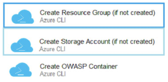

You need to complete the pipeline to configure OWASP ZAP for security testing.

Which five Azure CLI tasks should you add in sequence? To answer, move the tasks from the list of tasks to the answer area and arrange them in the correct order.

Select and Place:

**Tasks**

- Convert Report Format
- Build machine image
- Publish Test Results
- Destroy OWASP Container
- Call the Baseline Scan
- Docker CLI installer
- Download the file

Answer Area

- [Slot 1]
- [Slot 2]
- [Slot 3]


----


To complete the Azure DevOps release pipeline and configure OWASP ZAP for security testing, you should add these five tasks in the following sequence:

**Answer Area**

1.  **Call the Baseline Scan**
2.  **Download the file**
3.  **Convert Report Format**
4.  **Publish Test Results**
5.  **Destroy OWASP Container**

---

**Explanation:**

1.  **Call the Baseline Scan:** After the "Create OWASP Container" task is finished, you must actually execute the security scan. This command tells the ZAP instance inside the container to begin its automated analysis of your target application.
2.  **Download the file:** Once the scan is complete, ZAP generates a report (usually in JSON or XML format) inside the container. You must use a task to download or copy this report file from the container's filesystem onto the Azure Pipelines build agent.
3.  **Convert Report Format:** Azure DevOps cannot natively interpret the standard OWASP ZAP report files. You must run a script or task to convert this report into a format it recognizes, such as **JUnit or NUnit**.
4.  **Publish Test Results:** After the report is in the correct format, you use this standard task to upload the results to Azure DevOps. This allows the security findings to appear in the "Tests" tab of your release run.
5.  **Destroy OWASP Container:** Finally, following the principle of ephemeral infrastructure, you should delete the container used for the scan to free up resources and ensure no persistent data is left behind.

**Note:** "Docker CLI installer" and "Build machine image" are not part of the standard *execution and reporting* sequence for an OWASP ZAP container scan in a release pipeline.


### Question #49

DRAG DROP -

You have an Azure DevOps pipeline that is used to deploy a Node.js app.

You need to ensure that the dependencies are cached between builds.


How should you configure the deployment YAML? To answer, drag the appropriate values to the correct targets. Each value may be used once, more than once, or not at all. You may need to drag the split bar between panes or scroll to view content.

NOTE: Each correct selection is worth one point.

-----

**Values**


*   `always()`
*   `build.sh`
*   `eq(variables.CACHE_RESTORED, 'true')`
*   `integrationtest.sh`
*   `ne(variables.CACHE_RESTORED, 'true')`
*   `npm install`

**Answer Area**


```yaml
...
variables:
  npm_config_cache: $(Pipeline.Workspace)/.npm

steps:
- task: Cache@2
  inputs:
    key: 'npm | "$(Agent.OS)" | package-lock.json'
    restoreKeys: |
      npm | "$(Agent.OS)"
    path: $(npm_config_cache)
    cacheHitVar: CACHE_RESTORED

- script: [ Slot 1 ]
  condition: [ Slot 2 ]
...
```

------


To cache dependencies efficiently, you should:

* **Skip installing dependencies if cache is restored**
* **Run `npm install` only when cache is NOT restored**

✅ Correct configuration:

```yaml
- script: npm install
  condition: ne(variables.CACHE_RESTORED, 'true')
```

Explanation:

* `CACHE_RESTORED` is set by the **Cache@2** task
* If cache is found → dependencies already exist → skip install
* If cache is NOT found → run `npm install`

Final Answer:

* **Slot 1:** `npm install`
* **Slot 2:** `ne(variables.CACHE_RESTORED, 'true')`

### Question #50

You have a build pipeline in Azure Pipelines that uses different jobs to compile an application for 10 different architectures. The build pipeline takes approximately one day to complete.

You need to reduce the time it takes to execute the build pipeline.

Which two actions should you perform? Each correct answer presents part of the solution.

NOTE: Each correct selection is worth one point.

A. Move to a blue/green deployment pattern

B. Create a deployment group

C. Increase the number of parallel jobs

D. Reduce the size of the repository

E. Create an agent pool


-----

Correct answers:

**C. Increase the number of parallel jobs**
**E. Create an agent pool**

Explanation:

Your pipeline runs **multiple jobs (10 architectures)** and takes a long time (~1 day). The key to reducing execution time is **parallelism and available compute resources**.

✅ C. Increase the number of parallel jobs

* Allows multiple jobs to run **simultaneously instead of sequentially**
* Directly reduces total pipeline duration

✅ E. Create an agent pool

* Provides **more agents (machines)** to run jobs in parallel
* Without enough agents, increasing parallel jobs has no effect

Why others are incorrect:

* **A. Blue/green deployment**

  * Related to release strategy, not build performance

* **B. Deployment group**

  * Used for deployments to VMs, not build acceleration

* **D. Reduce repository size**

  * May slightly improve checkout time, but **not significant** for a 1-day build across architectures

Final Answer:

✅ **C and E**


### Question-137

You have a private project in Azure DevOps.

**You need to ensure that a project manager can create custom work item queries to report on the project's progress**. The solution must use the principle of least privilege.

To which security group should you add the project manager?

* A. Reader
* B. Project Collection Administrators
* C. Project Administrators
* D. Contributor

------

**Correct answer: D. Contributor** ✅

Explanation

The requirements:

1. **Project manager can create custom work item queries**
2. **Principle of least privilege**

In **Azure DevOps**:

| Security Group                        | Permissions                                                                   |
| ------------------------------------- | ----------------------------------------------------------------------------- |
| **Reader**                            | View work items, dashboards, code. Cannot create queries. ❌                   |
| **Contributor**                       | Can **create and modify work items and queries**, contribute to the project ✅ |
| **Project Administrators**            | Full control over project settings (too much privilege) ❌                     |
| **Project Collection Administrators** | Full control over all projects (way too much) ❌                               |

So, the **Contributor** role provides just enough permissions for the project manager to **create and run queries**, without granting unnecessary administrative rights.

✅ Final Answer:

**D. Contributor**


### Question-138


You use a Git repository in Azure Repos to manage the source code of a web application. Developers commit changes directly to the default branch.

You need to implement a change management procedure that meets the tollowing requirements:

* The detault branch must be protected, and new changes must be built in the feature branches first.
* Changes must be reviewed and approved by at least one release manager before each merge.
* Changes must be brought into the default branch by using pull requests.

What should you configure in Azure Repos?


* A. branch policies of the default branch
* B. Services in Project Settings
* C. Deployment pools in Project Settings
* D. branch security of the default branch


-------

**Correct answer: A. branch policies of the default branch** ✅

Explanation

The requirements:

1. **Protect the default branch** → prevent direct commits
2. **Build changes in feature branches first** → enforce validation builds
3. **Require review and approval by at least one release manager** → enforce code review
4. **Use pull requests to merge into default branch** → control how changes enter mainline

In **Azure DevOps**, this is accomplished by **configuring branch policies** on the default branch:

* Require pull requests for merges
* Require **minimum number of reviewers** (e.g., release manager)
* Require **successful build validation** before merging
* Enforce other policies such as work item linking, comment resolution, etc.

Why the others are incorrect

| Option                                       | Reason                                                                                                            |
| -------------------------------------------- | ----------------------------------------------------------------------------------------------------------------- |
| **B. Services in Project Settings**          | Used for external service connections, not branch protection                                                      |
| **C. Deployment pools in Project Settings**  | Used for organizing deployment targets for release pipelines, unrelated to code merge control                     |
| **D. branch security of the default branch** | Controls permissions (read/write/contribute) but **cannot enforce pull request requirements or build validation** |

✅ Final Answer:

**A. branch policies of the default branch**


### Question-139

Your company uses Azure DevOps to manage the build and release processes for applications.

You use a Git repository for applications source control

You need to implement a pull request strategy that **reduces the history volume in the master branc**h.

Solution: **You implement a pull request strategy that uses an explicit merg**e.

Does this meet the goal?

* A. Yes
* **B. No**


**Correct answer: B. No** ❌

Explanation

The goal:

* **Reduce history volume in the master branch**
  → Keep the master branch history **clean and concise**

**Explicit merge** (a regular merge commit) **does not reduce commit history**:

* It preserves **all commits from the feature/topic branch**
* Adds a **merge commit**
* Master branch history becomes longer, especially with many feature branches

Correct approach

To meet the goal, use:

* **Squash merge** ✅

  * Combines all commits from the feature branch into **a single commit** on master
  * Keeps master branch history **concise**

* **Rebase and fast-forward** can also reduce unnecessary merge commits if used carefully

Final Verdict:

**B. No**

Because an explicit merge **does not consolidate commit history**.


### Question-141

You need to recommend a Docker container build strategy that meets the following requirements:

Minimizes image sizes

Minimizes the security surface area of the final image What should you include in the recommendation?

* A. multi-stage builds
* B. PowerShell Desired State Configuration (DSC)
* C. Docker Swarm
* D. single-stage builds


**Correct answer: A. multi-stage builds** ✅

Explanation

The requirements:

1. **Minimize image sizes**
2. **Minimize security surface area**

**Multi-stage builds** in Docker allow you to:

* Use **one stage for building** (with all build tools and dependencies)
* Use **a separate final stage** for the runtime environment
* Copy only the **necessary artifacts** into the final image
* Result: **smaller, leaner images** with fewer tools → **reduced attack surface**

Why the others are incorrect

| Option                     | Reason                                                                                          |
| -------------------------- | ----------------------------------------------------------------------------------------------- |
| **B. PowerShell DSC**      | Used for configuring Windows machines, not for building Docker images                           |
| **C. Docker Swarm**        | Orchestration tool, not related to image size or security surface                               |
| **D. single-stage builds** | Builds everything into one image → larger images with unnecessary tools → bigger attack surface |

 ✅ Final Answer:

**A. multi-stage builds**


### Question-142


Your company has a project in Azure DevOps for a new web application.

You need to ensure that when code is checked in, a build runs automatically.

Solution: From the Triggers tab of the build pipeline, you select Batch changes while a build is in progress.

Does this meet the goal?

* A. Yes
* B. No

**Correct answer: B. No** ❌

Explanation

The goal:

* **Ensure that a build runs automatically when code is checked in** → Continuous Integration (CI)

**What “Batch changes while a build is in progress” does:**

* It **delays triggering a new build** if a build is already running
* It **does not enable automatic builds on check-in by itself**

To meet the goal:

1. Go to the **Triggers** tab of the pipeline
2. **Enable Continuous Integration (CI)** by checking **“Enable continuous integration”** or selecting the branches to trigger on
3. Optionally, **batch changes** can be used to combine multiple pushes into a single build, but this **alone does not enable CI**

 ✅ Final Answer:

**B. No**


### Question-143

You have 50 Node.js-based projects that you scan by using WhiteSource. Each project includes Package.json, Package-lock.json, and Npm-shrinkwrap.json files.

**You need to minimize the number of libraries reports by WhiteSource to only the libraries that you explicitly reference**.

What should you do?

* A. Configure the File System Agent plug-in.
* B. Add a devDependencies section to Package-lock.json.
* C. Configure the Artifactory plug-in.
* D. Delete Package-lock.json.

----

Answer: D

**Correct answer: D. Delete `Package-lock.json`.** ✅

Explanation

WhiteSource (now Mend) analyzes dependency files to determine **all libraries** in a project, including **transitive dependencies**.

If your goal is to **minimize reports to only the libraries you explicitly reference**, you must remove files that define the full dependency tree.

Key files:

* `package.json` → **direct dependencies only** (what you explicitly reference)
* `package-lock.json` → **full resolved dependency tree (direct + transitive)**
* `npm-shrinkwrap.json` → **full resolved dependency tree (direct + transitive)**

By **deleting `package-lock.json`**, WhiteSource will rely on `package.json`, which contains **only explicitly referenced libraries**, thus minimizing the reported libraries.

Why the others are wrong

| Option                                          | Reason                                                                          |
| ----------------------------------------------- | ------------------------------------------------------------------------------- |
| **A. File System Agent plug-in**                | Controls scanning scope, not dependency resolution                              |
| **B. Add devDependencies to package-lock.json** | `package-lock.json` is auto-generated — not meant to be edited                  |
| **C. Artifactory plug-in**                      | Used for repository integration, not dependency filtering                       |
| **D. Delete `package-lock.json`**               | ✅ Removes transitive dependency resolution → only explicit dependencies scanned |

✅ Final Answer:

**D. Delete `Package-lock.json`.**


### Question-144

Your company deploys applications in Docker containers.

You want to detect known exploits in the Docker images used to provision the Docker containers.

You need to integrate image scanning into the application lifecycle. The solution must expose the exploits as early as possible during the application lifecycle.

What should you configure?

* A. a task executed in the continuous integration pipeline and a scheduled task that analyzes the image registry
* B. manual tasks performed during the planning phase and the deployment phase
* C. a task executed in the continuous deployment pipeline and a scheduled task against a running production container
* D. a task executed in the continuous integration pipeline and a scheduled task that analyzes the production container

-----

**Correct answer: A. a task executed in the continuous integration pipeline and a scheduled task that analyzes the image registry** ✅

Why this is correct

To expose known exploits **as early as possible** in the application lifecycle, you must scan:

1. **During build time (CI pipeline)** → catches vulnerabilities before images are even deployed
2. **Continuously in the registry** → detects newly discovered CVEs in already-built images

This gives **shift-left security** + **continuous vulnerability monitoring**.

Lifecycle coverage

| Stage                    | Purpose                                               |
| ------------------------ | ----------------------------------------------------- |
| **CI pipeline scanning** | Detects vulnerabilities immediately after image build |
| **Registry scanning**    | Detects new CVEs in stored images over time           |

Why the others are wrong

| Option | Problem                                                       |
| ------ | ------------------------------------------------------------- |
| **B**  | Manual tasks = late detection + unreliable                    |
| **C**  | CD + production scanning = too late (already deployed)        |
| **D**  | Production container scanning = reactive, not early lifecycle |

Final Answer

**A. a task executed in the continuous integration pipeline and a scheduled task that analyzes the image registry**


### Question-145

Your company has a hybrid cloud between Azure and Azure Stack.

The company uses Azure DevOps for its full CI/CD pipelines. Some applications are built by using Erlang and Hack.

You need to ensure that Erlang and Hack are supported as part of the build strategy across the hybrid cloud. The solution must minimize nanagement overhead.

Nhat should you use to execute the build

* A. a Microsoft-hosted agent
* B. Azure DevOps self-hosted agents on Azure DeTest Labs virtual machines.
* C. Azure DevOps self-hosted agents on Hyper-V virtual machines
* D. Azure DevOps self-hosted agents on virtual machines that run on Azure Stack

----

**Correct answer: D. Azure DevOps self-hosted agents on virtual machines that run on Azure Stack** ✅

Why this is correct

Your requirements are:

* **Hybrid cloud** → Azure + **Azure Stack**
* **Custom languages** → **Erlang** and **Hack** (not supported natively by Microsoft-hosted agents)
* **Minimize management overhead**
* **Unified CI/CD across hybrid environment**

Using **self-hosted agents on VMs running in Azure Stack** gives you:

✅ Full control over runtime environments (install Erlang, Hack, custom toolchains)
✅ Works natively in **hybrid cloud** (on-prem Azure Stack + Azure)
✅ Centralized management via Azure DevOps
✅ No dependency on Microsoft-hosted agent limitations
✅ Consistent build environment across hybrid infrastructure

Why the others are wrong

| Option                        | Why it's wrong                                           |
| ----------------------------- | -------------------------------------------------------- |
| **A. Microsoft-hosted agent** | ❌ Does not support Erlang and Hack environments natively |
| **B. Azure DevTest Labs VMs** | ❌ Extra management layer, not hybrid-cloud optimized     |
| **C. Hyper-V VMs**            | ❌ Not integrated with Azure Stack hybrid model           |

Key principle

> **Hybrid cloud + nonstandard build languages = self-hosted agents on your hybrid infrastructure**

Final Answer

**D. Azure DevOps self-hosted agents on virtual machines that run on Azure Stack**


### Question-146


You are designing an Azure DevOps strategy for your company's development team.

You suspect that the team's productivity is low due to accumulate technical debt.

You need to recommend a metric to assess the amount of the team's technical debt.

What should you recommend?

* A. the number of code modules in an application
* B. the number of unit test failures
* C. the percentage of unit test failures
* D. the percentage of overall time spent on rework

**Correct answer: D. the percentage of overall time spent on rework** ✅

Why this is the right metric

**Technical debt** is best reflected by how much effort is wasted fixing existing problems instead of building new value.
The most meaningful indicator is:

> **How much time the team spends reworking old code instead of delivering new features**

So:

**✔ Percentage of overall time spent on rework** directly measures:

* Refactoring effort
* Bug fixing
* Architectural cleanup
* Maintenance overhead
* Debt interest (cost of past poor decisions)

This is a **true technical debt KPI**.

Why the others are wrong

| Option                                  | Why it's not a good metric                   |
| --------------------------------------- | -------------------------------------------- |
| **A. number of code modules**           | ❌ Size ≠ debt                                |
| **B. number of unit test failures**     | ❌ Quality signal, not debt measurement       |
| **C. percentage of unit test failures** | ❌ Testing quality metric, not technical debt |

Best-practice metrics for technical debt

In real DevOps environments, technical debt is tracked via:

* % time spent on rework ✅
* SonarQube Technical Debt Ratio
* Code smells
* Cyclomatic complexity trends
* Refactoring backlog size
* Mean time to change (MTTC)

Final Answer

**D. the percentage of overall time spent on rework**


### Question-147

You are developing an open source solution that uses a GitHub repository.

You create a new public project in Azure DevOps.


**You plan to use Azure Pipelines for continuous build. The solution will use the GitHub Checks API.**
Which authentication type should you use?

* A. OpenID
* B. GitHub App
* C. a personal access token (PAT)
* D. SAML

----

**Correct answer: B. GitHub App** ✅

Explanation

To use the **GitHub Checks API** with **Azure Pipelines** for a public GitHub repository, the correct authentication mechanism is:

> **GitHub App**

This is because:

* The **Checks API** is designed to work with **GitHub Apps** (not PATs or OAuth tokens).
* Azure Pipelines integrates with GitHub using a **GitHub App** to:

  * Create check runs
  * Update build statuses
  * Report CI results
* It is the **modern, secure, supported integration model** for CI/CD tools.

Why the others are wrong

| Option        | Reason                                              |
| ------------- | --------------------------------------------------- |
| **A. OpenID** | ❌ Used for identity federation, not GitHub API auth |
| **C. PAT**    | ❌ PATs do **not support the Checks API**            |
| **D. SAML**   | ❌ Enterprise SSO auth, not API integration          |

Key concept to remember for exams & real-world use:

| Feature                   | Required Auth      |
| ------------------------- | ------------------ |
| GitHub Checks API         | **GitHub App** ✅   |
| Webhooks                  | GitHub App / OAuth |
| REST API basic operations | PAT                |
| CI/CD integrations        | GitHub App         |

Final Answer

**B. GitHub App** ✔️


### Question-148

After you answer a question in this section, you will NOT be able to return to it. As a result, these questions will not appear in the review screen

Your company has a project in Azure DevOps for a new web application.

You need to ensure that when code is checked in, a build runs automatically.

Solution: From the Continuous deployment trigger settings of the release pipeline, you enable the Pull request trigger setting.

Does this meet the goal?


* A. Yes
* **B. No**


----

Answer: B

The correct answer is:

**B. No**

Explanation

In Azure DevOps:

To ensure that **a build runs automatically when code is checked in**, you must configure:

> **Continuous Integration (CI) trigger** in the **build pipeline**

The proposed solution enables:

> **Pull request trigger in the Continuous deployment trigger settings of the release pipeline**

This does **not** meet the goal because:

* Release pipeline triggers control **deployment**, not **build execution**
* Pull request triggers validate PRs — they do not automatically trigger builds on every code check-in
* The requirement is about running a build when code is checked in (CI)

What should be configured instead?

You should enable:

* CI trigger in YAML:

  ```yaml
  trigger:
    - main
  ```

  or

Enable **Continuous integration** in classic build pipeline settings

Final Answer:

**B. No**


### Question-149

After you answer a question in this section, you will NOT be able to return to it. As a result, these questions will not appear in the review screen.

Your company has a project in Azure DevOps for a new web application.

You need to ensure that when code is checked in, a build runs automatically.

Solution: From the Pre-deployment conditions settings of the release pipeline, you select After stage.

Does this meet the goal?

* A. Yes
* B. No


--------

**Correct answer: B. No** ❌

Explanation

Enabling a **Pull request trigger** in the **Continuous deployment trigger settings of a *release pipeline*** does **not** cause a build to run automatically when code is checked in.

Why:

* **Build pipelines** handle:

  * CI triggers
  * Automatic builds on commit (push)
* **Release pipelines** handle:

  * Deployment after artifacts are produced
  * They do **not** trigger builds

What is actually required

To ensure a build runs automatically when code is checked in, you must configure:

👉 **Continuous Integration (CI) trigger** in the **build pipeline**
(e.g. YAML trigger or classic pipeline trigger)

Summary

| Action                         | Result                     |
| ------------------------------ | -------------------------- |
| PR trigger in release pipeline | ❌ Does not trigger builds  |
| CI trigger in build pipeline   | ✅ Triggers build on commit |

Final Answer

**B. No** ❌


### Question-150

Your company has a project in Azure DevOps for a new web application.

You need to ensure that when code is checked in, a build runs automatically.

Solution: From the Pre-deployment conditions settings of the release pipeline, you select Batch changes while a build is in progress.

Does this meet the goal?

* A. Yes
* B. No

-----

**Correct answer: B. No** ❌

Explanation

Selecting **“Batch changes while a build is in progress”** in the **Pre-deployment conditions of a release pipeline** does **not** configure automatic builds when code is checked in.

Why this fails the requirement:

* **Pre-deployment conditions** belong to the **release pipeline**, not the build pipeline.
* This setting only controls **how deployments are queued**, not **when builds are triggered**.
* It does **not** trigger builds on code commits.

 What actually meets the goal

To ensure a build runs automatically when code is checked in, you must configure:

👉 **Continuous Integration (CI) trigger** in the **build pipeline**

Examples:

* Classic pipeline: Enable **Continuous Integration**
* YAML pipeline:

  ```yaml
  trigger:
    - main
  ```

Final Answer

**B. No** ❌


### Question-151

Your company has a project in Azure DevOps for a new web application You need to ensure that when code is checked in, a build runs automatically.

Solution: From the Triggers tab of the build pipeline, you select Enable continuous integration.

Does this meet the goal?

* A. Yes
* B. No


—--

**Correct answer: A. Yes** ✅

Explanation

Enabling **Continuous Integration (CI)** from the **Triggers tab of the build pipeline** is exactly how you configure Azure DevOps to:

👉 Automatically run a build **whenever code is checked in**.

This directly meets the requirement:

> "ensure that when code is checked in, a build runs automatically."

Summary

| Action                              | Result                 |
| ----------------------------------- | ---------------------- |
| Enable CI trigger in build pipeline | ✅ Auto-build on commit |
| Release pipeline triggers           | ❌ Not for builds       |
| Pre-deployment conditions           | ❌ Not for builds       |


**Final Answer:**

**A. Yes** ✅


### Question-152

Your company has a project in Azure DevOps.

You need to ensure that when there are multiple builds pending deployment, **only the most recent build is deployed**

What should you use?

* A. deployment conditions
* B. deployment queue settings
* C. release gates
* D. pull request triggers

----

**Correct answer: B. deployment queue settings** ✅

Explanation

In **Azure DevOps release pipelines**, **deployment queue settings** allow you to control how multiple pending deployments are handled.

There is a specific option:

> **“Deploy latest and cancel the others”**

This ensures that:

* When multiple builds are waiting for deployment
* Only the **most recent build** is deployed
* Older pending builds are automatically canceled

Why the others are wrong

| Option                   | Reason                                                         |
| ------------------------ | -------------------------------------------------------------- |
| A. deployment conditions | Controls *when* a deployment can run, not queue behavior       |
| C. release gates         | Used for validations/approvals (e.g., queries, alerts, checks) |
| D. pull request triggers | Only affects CI/build triggering, not deployment behavior      |

Final Answer

**B. deployment queue settings** ✅


### Question-153

You use Azure Pipelines to build and test a React js application.

You have a pipeline that has a single job

**You discover that installing JavaScript packages from npm takes approximately five minutes each time you run the pipeline.**

You need to recommend a solution to reduce the pipeline execution time.

Solution: You recommend defining a container job that uses a custom container that has the JavaScript packages preinstalled.

Does this meet the goal?

* A. Yes
* B. No

----

**Correct answer: A. Yes** ✅

Explanation

Using a **container job with a custom container image** that already has the required JavaScript packages (npm dependencies) preinstalled **will significantly reduce pipeline execution time** because:

* It avoids repeated `npm install` on every pipeline run
* Dependencies are baked into the image layer
* Docker layer caching makes builds much faster
* Startup time is faster than downloading packages each run

This is a valid optimization strategy for CI pipelines, especially when:

* Dependency install time is high
* Dependencies are stable
* You have a single-job pipeline

Additional (best-practice note)

While this solution works, the **most common Azure DevOps optimization** is:

* `Cache@2` task for npm/yarn (`node_modules` or npm cache)

But your proposed solution **does meet the goal** as stated.

Final Answer

**A. Yes** ✅


### Question-154

You use Azure Pipelines to build and test a React.js application.
You have a pipeline that has a single job.

You discover that installing Java Script packages from npm takes approximately five minutes each time you run the pipeline

You need to recommend a solution to reduce the pipeline execution time.

**Solution: You recommend enabling pipeline caching.**

Does this meet the goal?

* A. Yes
* B. No

---

**Answer. A**

**Correct answer: A. Yes** ✅

Explanation

Enabling **pipeline caching** in Azure Pipelines can significantly reduce the time spent installing npm packages because:

* The cache stores previously downloaded packages (or `node_modules` directories) between runs.
* When the cache is available, the pipeline can reuse the packages instead of running `npm install` from scratch.
* This is a **standard optimization for JavaScript/Node.js pipelines**.

How it works

1. Define a cache key (e.g., `package-lock.json` or `yarn.lock`)
2. Use the `Cache@2` task in your pipeline:
3. Restore cached packages at the start of the job → faster builds

Comparison to alternative

* **Custom container with preinstalled packages**: also works, but harder to maintain if dependencies change frequently.
* **Pipeline caching**: flexible, minimal maintenance, works across agents.

Final Answer

**A. Yes** ✅


### Question-155


You use Azure Pipelines to build and test a React js application.
You have a pipeline that has a single job.

You discover that installing JavaScript packages from npm takes approximately five minutes each time you run the pipeline.

You need to recommend a solution to reduce the pipeline execution time.

Solution: **You recommend enabling parallel jobs for the pipeline**.

Does this meet the goal?

* A. Yes
* B. No

------

**Answer: B**

**Correct answer: B. No** ❌

Explanation

Enabling **parallel jobs** in Azure Pipelines allows multiple jobs or pipelines to run **simultaneously**, but it does **not** reduce the time taken by a **single job** to execute.

In your scenario:

* The pipeline has a **single job**
* The **bottleneck** is the `npm install` step (five minutes)
* Parallel jobs **won’t speed up a single job**

Correct approaches to reduce npm install time:

1. **Pipeline caching** – cache `node_modules` or npm cache between runs
2. **Custom container** – preinstall dependencies in a container image
3. **Package lock optimization** – ensure deterministic installs

Final Answer

**B. No** ❌


### Question-156


You plan to create a release pipeline that will deploy Azure resources by using Azure Resource Manager templates. The release pipeline will create the following resources:

Two resource groups

Four Azure virtual machines in one resource group Two Azure SQL databases in other resource group

You need to recommend a solution to deploy the resources.

Solution: Create two standalone templates, each of which will deploy the resources in its respective group.

Does this meet the goal?

* A. Yes
* B. No

-----

**Correct answer: A. Yes** ✅

Explanation

In Azure Resource Manager (ARM) deployments, you can deploy resources either in a **single template** or split them into **multiple templates**.

In your scenario:

* You have **two resource groups**:

  1. One with **four VMs**
  2. One with **two SQL databases**
* Creating **two standalone templates**, each targeting a specific resource group, is a valid and recommended approach because:

  * ARM templates are **scoped to a single resource group** (or subscription/management group)
  * This approach **isolates deployments per resource group**
  * Makes deployment **modular and easier to maintain**

Alternative approaches

* **Nested templates / linked templates**: Useful if you want to deploy all resources in a single coordinated run.
* **Single template with multiple resource groups**: Possible using **subscription-level deployments**, but more complex.

Your solution **meets the goal** and is simpler to implement.

Final Answer

**A. Yes** ✅


### Question-157


You plan to create a release pipeline that will deploy Azure resources by using Azure Resource Manager templates. The release pipeline will create the following resources:

Two resource groups

Four Azure virtual machines in one resource group Two Azure SQL databases in other resource group
You need to recommend a solution to deploy the resources.

**Solution: Create a single standalone template that will deploy all the resources.**

Does this meet the goal?

* A. Yes
* B. No

----

**Correct answer: B. No** ❌

Explanation

In **Azure Resource Manager (ARM) templates**, a **standalone template scoped to a resource group** can only deploy resources **within that specific resource group**.

In your scenario:

* You have **two resource groups**:

  1. One with **four VMs**
  2. One with **two SQL databases**
* A **single standalone template scoped to a single resource group** cannot deploy resources to the **second resource group**.

To deploy resources across multiple resource groups, you must use:

1. **Two separate templates** – each scoped to its respective resource group ✅
2. **A single template with linked templates** – using **`Microsoft.Resources/deployments` at the subscription level** to target multiple resource groups

Final Answer

**B. No** ❌


### Question-158


You have an Azure DevOps project.

Your build process creates several artifacts.

You need to deploy the artifacts to on-premises servers.

Solution: **You deploy a Kubernetes cluster on-premises. You deploy a Helm agent to the cluster. You add a Download Build Artifacts task to the deployment pipeline.**

Does this meet the goal?

* A. Yes
* B. No


----

**Correct answer: B. No** ❌

Explanation

The solution does **not meet the goal** because:

* The requirement is to **deploy build artifacts to on-premises servers** (physical or virtual machines).
* Deploying a **Kubernetes cluster and a Helm agent** targets **containerized workloads**, not traditional on-premises servers.
* Adding a **Download Build Artifacts task** only fetches artifacts; it does **not handle deployment** to standard on-premises servers.

Correct approach

To deploy artifacts to on-premises servers, you should use:

1. **Azure Pipelines self-hosted agent** installed on the target on-premises servers or a management server.
2. Tasks in the pipeline such as:

   * **Copy files / Windows Machine File Copy**
   * **PowerShell / Bash scripts** to deploy artifacts
3. Optionally, configure **deployment groups** in Azure DevOps to manage multiple on-premises servers.

Final Answer

**B. No** ❌


### Question-159


You have an Azure DevOps project.

Your build process creates several artifacts.

You need to deploy the artifacts to on-premises servers.

Solution: You deploy a Docker build to an on-premises server. You add a Download Build Artifacts task to the deployment pipeline.

Does this meet the goal?

* A. Yes
* B. No

-----

**Correct answer: B. No** ❌

Explanation

The solution does **not meet the goal** because:

* The requirement is to **deploy build artifacts to on-premises servers**, which may include applications, configuration files, or other outputs from the build.
* Simply deploying a **Docker build** only works if your application is containerized and intended to run as a container.
* Using **Download Build Artifacts** only downloads artifacts to the agent—it does **not automatically deploy** them to the server.

Correct approach

To deploy artifacts to on-premises servers:

1. Install a **self-hosted agent** on the on-premises servers.
2. Use a **release pipeline** with tasks such as:

   * **Copy Files** / **Windows Machine File Copy**
   * **PowerShell / Bash** deployment scripts
3. Optionally, configure **Deployment Groups** in Azure DevOps to manage multiple on-premises servers.

Final Answer

**B. No** ❌


### Question-160


You have a project in Azure DevOps named Project. Project contains a pipeline that builds a container image named Image and pushes Image1

to an Azure container registry named ACR1. Image uses a base image stored in Docker Hub.

**You need to ensure that Image1 is updated automatically whenever the base image is updated.**

What should you do?

* A. Enable the Azure Event Grid resource provider and subscribe to registry events.
* B. Add a Docker Hub service connection to Azure Pipelines.
* C. Create and run an Azure Container Registry task.
* D. Create a service hook in Project.


-----

**Answer: C**

The correct answer is **C. Create and run an Azure Container Registry task.**

**Explanation:**

Azure Container Registry (ACR) Tasks include a feature specifically designed for this scenario called **Base image update triggers**.

1.  **How it works:** When you create an ACR Task to build a container image, ACR automatically tracks the dependencies of that image. It identifies the base image used in your `Dockerfile` (even if it is hosted on **Docker Hub**).
2.  **Automation:** ACR monitors the base image for changes. When a new version of the base image is pushed to Docker Hub, the ACR Task detects the update and automatically triggers a new build of your image (`Image1`) and pushes it to your registry (`ACR1`).
3.  **Efficiency:** This ensures that your application always includes the latest security patches and performance improvements from the base image without requiring manual intervention or complex pipeline triggers.

**Why other options are incorrect:**

*   **A. Azure Event Grid:** While Event Grid can handle events *within* Azure, it does not natively provide a "turn-key" solution for monitoring image tags on Docker Hub to trigger builds.
*   **B. Docker Hub service connection:** This allows Azure Pipelines to *access* Docker Hub, but it does not provide an automated "watch" mechanism to trigger a rebuild when a third-party image changes.
*   **D. Service hook:** Service hooks in Azure DevOps are used to integrate with external services (like sending a message to Slack when a build fails). They are not designed to monitor external container registries for image updates.

### Question-161

You have an Azure DevOps project.

Your build process creates several artifacts.

You need to deploy the artifacts to on-premises servers.

Solution: You deploy an Octopus Deploy server. **You deploy a polled Tentacle agent to an on-premises server**. 

You add an Octopus task to the deployment pipeline.

Does this meet the goal?

* A. Yes
* B. No

**Correct answer: A. Yes** ✅

Explanation

This solution **does meet the goal**:

* **Octopus Deploy server** → Acts as the deployment orchestrator
* **Polled Tentacle agent on on-premises server** → Allows secure outbound connection from on-prem to Octopus (works behind firewalls/NAT)
* **Octopus task in Azure DevOps pipeline** → Integrates Azure DevOps with Octopus to push and deploy build artifacts

This setup is a **standard enterprise CI/CD pattern** for deploying build artifacts from Azure DevOps to **on-premises infrastructure**.

**Answer: A. Yes**

This solution meets the goal because it correctly addresses the challenge of deploying artifacts from Azure DevOps to on-premises servers using a well-established deployment tool.

✅ Why This Solution Works

1.  **Octopus Deploy Integration**: Octopus Deploy is specifically designed for complex deployments and integrates seamlessly with Azure DevOps. Adding an Octopus task to your Azure Pipeline allows you to trigger deployments orchestrated by Octopus.

2.  **Polled Tentacle for On-Premises**: Using a **polled Tentacle** on your on-premises server is the correct choice for environments behind a firewall. Polled Tentacles initiate outbound connections to the Octopus Server to check for tasks, eliminating the need to open inbound firewall ports to the on-premises server.

3.  **Artifact Deployment**: The combination of the Octopus Server (orchestration), the polled Tentacle (execution agent), and the Octopus task in the pipeline creates a complete workflow:
    - Azure Pipelines builds the artifacts.
    - The Octopus task in the pipeline pushes the artifacts to Octopus and triggers a release.
    - The on-premises polled Tentacle regularly checks in with the Octopus Server, receives the deployment instructions, downloads the artifacts, and deploys them to the server.

📝 How the Components Fit Together

| Component | Role | Meets Requirement? |
| :--- | :--- | :--- |
| **Octopus Deploy Server** | Central orchestration for releases and deployments | ✅ Yes, manages the deployment process. |
| **Polled Tentacle Agent** | Lightweight agent installed on the on-premises target server; polls the server for work. | ✅ Yes, executes the deployment steps locally and works through firewalls. |
| **Octopus Task in Pipeline** | Azure DevOps task that creates a release in Octopus and initiates the deployment. | ✅ Yes, connects the CI pipeline to the CD tool (Octopus). |

Therefore, the proposed architecture is a standard and effective pattern for deploying Azure DevOps build artifacts to on-premises infrastructure.

**A. Yes** ✅


### Question-162 

You plan to create a release pipeline that will deploy Azure resources by using Azure Resource Manager templates. The release pipeline will create the following resources:

Two resource groups

Four Azure virtual machines in one resource group Two Azure SQL databases in other resource group

You need to recommend a solution to deploy the resources.

Solution: **Create a main template that will deploy the resources in one resource group and a nested template that will deploy the resources in the other resource group.**

Does this meet the goal?

* A. Yes
* B. No

-----

**Correct answer: A. Yes** ✅

Explanation

This solution **does meet the goal**.

Using a **main (parent) ARM template** with a **nested template** is a valid and recommended pattern for deploying resources across **multiple resource groups**.

With nested deployments, you can specify the target scope, for example:

* One deployment targets **Resource Group A** (VMs)
* The nested deployment targets **Resource Group B** (SQL databases)

ARM supports this via `Microsoft.Resources/deployments` with a different `resourceGroup` scope.

Why this is correct

* ✔ Supports multiple resource groups
* ✔ Clean separation of concerns
* ✔ Modular design
* ✔ Scalable and maintainable
* ✔ Best-practice ARM architecture pattern

Final Answer

**A. Yes** ✅


### Question-163

You plan to create a release pipeline that will deploy Azure resources by using Azure Resource Manager templates. The release pipeline will create

the following resources:
Two resource groups


Four Azure virtual machines in one resource group Two Azure SQL databases in other resource group

You need to recommend a solution to deploy the resources.

Solution: **Create a main template that has two linked templates, each of which will deploy the resources in its respective group**

Does this meet the goal?

* A. Yes
* B. No

------

Answer: A

**Correct answer: A. Yes** ✅

Explanation

This solution **does meet the goal**.

Using a **main ARM template** with **two linked templates**, where each linked template targets a **different resource group**, is a valid and supported deployment strategy in Azure Resource Manager.

Each linked template can be scoped to a specific resource group using `Microsoft.Resources/deployments` with a `resourceGroup` property, for example:

* **Linked template 1 → deploys VMs to Resource Group A**
* **Linked template 2 → deploys SQL databases to Resource Group B**

Why this works

* ✔ Supports deployment across multiple resource groups
* ✔ Clean modular architecture
* ✔ Separation of responsibilities
* ✔ Reusable templates
* ✔ Azure best practice for complex deployments

Final Answer

**A. Yes** ✅


### Question-164

You have a project in Azure DevOps named Project. Project contains a build pipeline named Pipe1 that builds an application named App1.

You have an agent pool named Pool1 that contains a Windows Server 2019-based self-hosted agent. 

Pipe1 uses Pool1.


You plan to implement another project named Project2. 

Project2 will have a build pipeline named Pipe2 that builds an application named App2.

**App1 and App2 have conflicting dependencies.**

You need to minimize the possibility that the two build pipelines will conflict with each other. The solution must minimize infrastructure costs.

What should you do?

* A. Add another self-hosted agent.
* B. Add a Docker Compose task to the build pipelines.
* C. Change the self-hosted agent to use Red Hat Enterprise Linux (RHEL) 8.
* D. Create two container jobs.


----


**Correct answer: D. Create two container jobs.** ✅

Why this is the best solution

You need to:

* Prevent **dependency conflicts** between App1 and App2
* **Minimize infrastructure costs**
* Keep using the same **self-hosted agent pool**

Using **container jobs** in Azure Pipelines allows each pipeline to run inside its **own isolated Docker container environment**, even when using the **same self-hosted agent**.

Benefits of container jobs

* ✔ Full dependency isolation
* ✔ No conflict between App1 and App2
* ✔ No need for extra VMs or agents
* ✔ Minimal infrastructure cost
* ✔ Clean, repeatable, reproducible builds
* ✔ Best practice for multi-app environments

Why the others are wrong

* **A. Add another self-hosted agent** ❌
  → Works, but increases infrastructure cost (extra VM, maintenance, licensing)

* **B. Add a Docker Compose task** ❌
  → Not for pipeline isolation; used for multi-container app orchestration

* **C. Change OS to RHEL** ❌
  → OS change does not solve dependency conflicts

Final Answer

**D. Create two container jobs.** ✅


### Question-165

You manage build pipelines and deployment pipelines by using Azure DevOps.

Your company has a team of 500 developers. New members are added continually to the team.

You need to automate the management of users and licenses whenever possible.

Which task must you perform manually?

* A. modifying group memberships
* B. adding users
* C. assigning entitlements
* D. procuring licenses

------

**Correct answer: D. procuring licenses** ✅

Explanation

In **Azure DevOps**, you can automate most user and access management tasks, but **license procurement cannot be automated**.

Here’s what can be automated:

* **A. Modifying group memberships** ✅
  → Can be automated via Azure AD groups, scripts, and APIs

* **B. Adding users** ✅
  → Can be automated using Azure AD sync, APIs, or group-based assignment

* **C. Assigning entitlements** ✅
  → Can be automated with group rules in Azure DevOps + Azure AD

What must be manual

* **D. Procuring licenses** ❌ (Manual task)
  Licenses must be **purchased manually** through:

  * Azure Portal
  * Microsoft 365 Admin Center
  * Enterprise Agreement
  * CSP provider

This process involves **billing and procurement**, which cannot be automated via DevOps or Azure APIs.

Final Answer

**D. procuring licenses** ✅


### Question-166

Your company is building a new solution in Java.

The company currently uses a SonarQube server to analyze the code of NET solutions.

You need to analyze and monitor the code quality of the Java solution.

Which task types should you add to the build pipeline?

* A. Octopus
* B. Chef
* C. CocoaPods
* D. Gradle

------

**Answer: D**

**Correct answer: D. Gradle** ✅

Explanation

To analyze and monitor **Java code quality** with **SonarQube**, you must integrate the build tool that SonarQube supports for Java projects.

For Java, SonarQube commonly integrates with:

* **Gradle** ✅
* Maven

Among the options given:

* **A. Octopus** ❌ → Deployment tool, not for Java builds or code analysis
* **B. Chef** ❌ → Configuration management, not a build system
* **C. CocoaPods** ❌ → iOS/macOS dependency manager
* **D. Gradle** ✅ → Java build tool with native SonarQube integration

Why Gradle works

Gradle supports SonarQube via:

* `sonarqube` plugin
* `gradle build sonarqube` task
* Native integration with CI/CD pipelines (including Azure DevOps)

Final Answer

**D. Gradle** ✅


### Question-167


Your company is building a new solution in Java.

The company currently uses a SonarQube server to analyze the code of NET solutions.

You need to analyze and monitor the **code quality of the Java solution**.

Which task types should you add to the build pipeline?

* A. Maven
* B. CocoaPods
* C.Xcode
* D. Gulp

------

**Correct answer: A. Maven** ✅

Explanation

To analyze and monitor **Java code quality** using **SonarQube**, you must use a Java build tool that integrates natively with SonarQube.

SonarQube supports Java analysis through:

* **Maven** ✅
* Gradle

Option analysis

* **A. Maven** ✅ → Native SonarQube integration for Java (`mvn sonar:sonar`)
* **B. CocoaPods** ❌ → iOS/macOS dependency manager
* **C. Xcode** ❌ → Apple development environment
* **D. Gulp** ❌ → JavaScript task runner, not a Java build tool

Final Answer

**A. Maven** ✅


### Question-168

You have an Azure subscription named Subscription1 that contains a custom Azure policy named Policy. Policy is an audit policy that monitors

naming convention compliance for the resources deployed to Subscription1.

You have a pipeline named Pipeline 1 in Azure Pipelines. Pipeline 1 deploys Azure Resource Manager (ARM) resources to Subscription1.

You need to ensure that the resources deployed by Pipeline 1 comply with Policy1.
What should you add to Pipeline 1?

* A. a pre-deployment task that runs a security and compliance assessment
* B. a post-deployment task that runs a security and compliance assessment
* C. an ARM template deployment task to assign Policy1 to Subscription 1
* D. an ARM template deployment task to deploy Policy1 to Subscription1


The correct answer is **B. a post-deployment task that runs a security and compliance assessment.**

Explanation:


Since the policy in question is an **Audit policy**, it will not block the deployment of resources even if they violate the naming conventions. The ARM template deployment will technically "succeed," but the resources will be flagged as non-compliant in Azure.

To "ensure" compliance within the context of the pipeline:

1.  **Deployment:** The pipeline first deploys the resources using the ARM template.
2.  **Assessment:** You add a **post-deployment task** (often using the "Security and Compliance Assessment" task or an Azure Policy compliance check). 
3.  **Validation:** This task triggers a scan to check if the newly deployed resources comply with the assigned Azure Policies. 
4.  **Failure:** If the task finds that the resources are non-compliant (audit violation), it will **fail the pipeline**. This forces the team to address the naming convention issue immediately, effectively ensuring that non-compliant code does not move further through the release process or remain unaddressed.

Why other options are incorrect:

*   **A. Pre-deployment task:** While you can run static analysis on a template, a "security and compliance assessment" against an active Azure Policy usually requires the resources or the deployment intent to be evaluated against the current state of the subscription, which is most accurately done during or after the deployment process.
*   **C & D. ARM template deployment task:** These options deal with the *infrastructure* of the policy itself (creating or assigning it). The question states the policy already exists; the goal is to make sure the app's resources follow that policy.

### Question-169

You have a project in Azure DevOps.

**You need to push notifications about pull requests to a Microsoft Teams channel.** The solution must minimize development effort.

What should you do?

* A. Install the Azure Pipelines app for Teams and configure a subscription to receive notifications in the channel.
* B. Use Azure Automation to connect to the Azure DevOps REST API and send messages to Teams.
* C. Install the Azure Repos app for Teams and configure a subscription to receive notifications in the channel
* D. Use an Azure function to connect to the Azure DevOps REST API and send messages to Teams.

---------

**Correct answer: C. Install the Azure Repos app for Teams and configure a subscription to receive notifications in the channel.** ✅

Why this is correct

To get **pull request notifications** into **Microsoft Teams** with **minimal development effort**, the built-in integration is the best solution:

* The **Azure Repos app for Teams** natively supports:

  * Pull request events
  * Code push notifications
  * Repository activity
  * Subscriptions per channel

No custom code, automation, or APIs required.

Option breakdown

* **A. Azure Pipelines app** ❌
  → Focused on build/release notifications, not pull requests

* **B. Azure Automation + REST API** ❌
  → Custom development, high effort

* **C. Azure Repos app for Teams** ✅
  → Native PR notifications, low effort, designed for this use case

* **D. Azure Function + REST API** ❌
  → Custom integration, unnecessary complexity

Final Answer

**C. Install the Azure Repos app for Teams and configure a subscription to receive notifications in the channel.** ✅


## Topic 8 - Question Set 8

### Question #1

HOTSPOT You manage the Git repository for a large enterprise application.

You need to minimize the data size of the repository.

How should you complete the commands? To answer, select the appropriate options in the answer area. NOTE: Each correct selection is worth one point.

Based on the image provided, here is the extracted content from the Git command configuration area:

**Answer Area**

**First Command:**

`git gc [ Drop-down 1 ]`

*   **Options for Drop-down 1:**
    *   `--aggressive`
    *   `--auto`
    *   `--force`
    *   `--no-prune`

**Second Command:**

`git [ Drop-down 2 ] --expire now`

*   **Options for Drop-down 2:**
    *   `merge`
    *   `prune`
    *   `rebase`
    *   `reset`


------

✅ Correct answers

**First Command:**

✔ `git gc --aggressive`

**Second Command:**

✔ `git prune --expire now`


🔍 Explanation

To **minimize the size of a Git repository**, you need to:

1. Optimize and compress repository data
2. Remove unreachable (dangling) objects

---

🟦 `git gc --aggressive`

* Performs deep garbage collection
* Rewrites and compresses objects more thoroughly than default GC
* Reduces repository size significantly

❌ Why not others:

* `--auto` → runs only when needed (not aggressive cleanup)
* `--force` → not valid here for size optimization
* `--no-prune` → prevents cleanup (opposite goal)

🟦 `git prune --expire now`

* Deletes all unreachable objects immediately
* Frees disk space by removing unused data

❌ Why not others:

* `merge`, `rebase`, `reset` → unrelated to repository cleanup

🎯 Final Answer

```bash
git gc --aggressive
git prune --expire now
```

💡 Key takeaway

* **`git gc --aggressive` → compress & optimize**
* **`git prune --expire now` → delete unused objects**

Together, they **minimize repository size effectively**.

### Question #4

DRAG DROP You provision an Azure Kubernetes Service (AKS) cluster that has RBAC enabled. You have a Helm chart for a client application.

You need to configure Helm and Tiller on the cluster and install the chart.

Which three commands should you recommend be run in sequence? To answer, move the appropriate commands from the list of commands to the answer area and arrange them in the correct order.

Commands

- helm install
- kubectl create
- helm completion
- helm init
- helm serve

------

å✅ Correct sequence of commands

To configure Helm (with Tiller, i.e., Helm v2) on an AKS cluster with RBAC and then install a chart, the correct order is:

1. **kubectl create**
2. **helm init**
3. **helm install**

---

🔍 Explanation

🟦 1. `kubectl create`

* Used to create a **service account and role binding** for Tiller
* Required because the cluster has **RBAC enabled**
* Grants Tiller the necessary permissions in the cluster


🟦 2. `helm init`

* Initializes Helm and installs **Tiller** into the AKS cluster
* Must be done after RBAC permissions are configured

🟦 3. `helm install`

* Deploys the Helm chart (client application) to the cluster

❌ Why the others are incorrect

* **helm completion** → enables shell auto-completion (not required)
* **helm serve** → used for serving charts locally (not needed here)

🎯 Final Answer Order

```
kubectl create
helm init
helm install
```

💡 Key takeaway

When using **Helm v2 with RBAC-enabled AKS**:

1. Create RBAC permissions
2. Initialize Helm (Tiller)
3. Install the chart

### Question #6

You are implementing an Azure DevOps strategy for mobile devices using App Center. 


You plan to use distribution groups to control access to releases.

You need to create the distribution groups shown in the following table.

| Name | Use |
| :--- | :--- |
| **Group1** | Application testers who are invited by email |
| **Group2** | Early release users who use unauthenticated public links |
| **Group3** | Application testers for all the apps of your company |]

Which type of distribution group should you use for each group? 

To answer, drag the appropriate group types to the correct locations. Each group type may be used once, more than once, or not at all. You may need to drag the split bar between panes or scroll to view content. NOTE: Each correct selection is worth one point.

Select and Place:

**Labels**

*   Private
*   Public
*   Shared

**Answer Area**

*   **Group 1:** [ Drop zone ]
*   **Group 2:** [ Drop zone ]
*   **Group 3:** [ Drop zone ]

-----

✅ Correct mapping of distribution group types

| Group                                        | Correct Type  |
| -------------------------------------------- | ------------- |
| **Group1** (invited testers via email)       | ✅ **Private** |
| **Group2** (unauthenticated public links)    | ✅ **Public**  |
| **Group3** (testers across all company apps) | ✅ **Shared**  |

---

🔍 Explanation

 🟦 **Group1 → Private**

* Access is controlled via **email invitations**
* Only explicitly invited users can download builds
* Best for **internal testers or restricted access**

 🟦 **Group2 → Public**

* Allows access via **public link**
* No authentication required
* Ideal for **early adopters or external preview users**


🟦 **Group3 → Shared**

* Can be used **across multiple apps**
* Centralized tester group for the entire organization
* Perfect for **company-wide testing teams**

🎯 Final Answer

* **Group1:** Private
* **Group2:** Public
* **Group3:** Shared

💡 Key takeaway

* **Private = controlled access (email-based)**
* **Public = open link access**
* **Shared = reusable across multiple apps**


### Question #8


HOTSPOT You need to create deployment files for an Azure Kubernetes Service (AKS) cluster. 

The deployments must meet the provisioning storage requirements shown in the following table.


| Deployment    | Requirement    |
|---|---|
| Deployment 1   | Use files stored on an SMB-based share from the container’s file system.    |
| Deployment 2   | Use files stored on a managed disk from the container’s file system.    |
| Deployment 3   | Securely access X.509 certificates from the container’s file system.    |

Which resource type should you use for each deployment? To answer, select the appropriate options in the answer area.

NOTE: Each correct selection is worth one point.

Hot Area:

Answer Area

Deployment 1: [ Drop zone ]

- driver: secrets-store.csi.k8s.io
- blobfuse-flexvol
- provisioner: kubernetes.io/azure-disk
- provisioner: kubernetes.io/azure-file
- volume.beta.kubernetes.io/storage-provisioner

Deployment 2:  [ Drop zone ]

- driver: secrets-store.csi.k8s.io
- blobfuse-flexvol
- provisioner: kubernetes.io/azure-disk
- provisioner: kubernetes.io/azure-file
- volume.beta.kubernetes.io/storage-provisioner


Deployment 3: [ Drop zone ]

- driver: secrets-store.csi.k8s.io
- blobfuse-flexvol
- provisioner: kubernetes.io/azure-disk
- provisioner: kubernetes.io/azure-file
- volume.beta.kubernetes.io/storage-provisioner


-----

✅ Correct answers

| Deployment       | Resource Type                               |
| ---------------- | ------------------------------------------- |
| **Deployment 1** | ✅ **provisioner: kubernetes.io/azure-file** |
| **Deployment 2** | ✅ **provisioner: kubernetes.io/azure-disk** |
| **Deployment 3** | ✅ **driver: secrets-store.csi.k8s.io**      |

🔍 Explanation

🟦 **Deployment 1: SMB-based share**

* Requirement: Access files via **SMB protocol**
* Solution: **Azure Files**
* Kubernetes provisioner:
  ✔ `kubernetes.io/azure-file`

🟦 **Deployment 2: Managed disk**

* Requirement: Use **Azure managed disk storage**
* Solution: **Azure Disk**
* Kubernetes provisioner:
  ✔ `kubernetes.io/azure-disk`

🟦 **Deployment 3: X.509 certificates**

* Requirement: Securely access certificates from filesystem
* Best practice: Use **Secrets Store CSI Driver**
* Supports integration with Azure Key Vault
* Resource:
  ✔ `secrets-store.csi.k8s.io`


❌ Why not the others

* **blobfuse-flexvol** → used for Azure Blob Storage, not SMB or disks
* **volume.beta.kubernetes.io/storage-provisioner** → generic/legacy, not specific
* **azure-file / azure-disk swapped** → would not meet protocol/storage requirements


🎯 Final Answer

* **Deployment 1:** `kubernetes.io/azure-file`
* **Deployment 2:** `kubernetes.io/azure-disk`
* **Deployment 3:** `secrets-store.csi.k8s.io`

💡 Key takeaway

* **Azure Files (SMB) → azure-file**
* **Managed disks → azure-disk**
* **Secrets/certs → CSI Secrets Store driver**


### Question #10

DRAG DROP You manage the Git repository for a large enterprise application.

During the development of the application, you use a file named Config.json.

You need to prevent Config.json from being committed to the source control whenever changes to the application are committed.


Which three actions should you perform in sequence? To answer, move the appropriate actions from the list of actions to the answer area and arrange them in the correct order.

Select and Place:

Actions

- Delete and recreate the repository.
- Run the git reflog expire command.
- Runthe git add. gitignore command.
- Add Config json to the gitignore file.
- Run the git commit command.

----


✅ Correct sequence of actions

1. **Add Config.json to the gitignore file**
2. **Run the git add .gitignore command**
3. **Run the git commit command**

🔍 Explanation

🟦 1. Add `Config.json` to `.gitignore`

* This tells Git to **ignore the file** in future commits
* Prevents it from being tracked going forward

🟦 2. `git add .gitignore`

* Stages the updated `.gitignore` file
* Prepares it to be committed

🟦 3. `git commit`

* Saves the change so `.gitignore` takes effect in the repository

❌ Why the other options are incorrect

* **Delete and recreate the repository** → unnecessary and extreme
* **git reflog expire** → unrelated (used for cleanup/history expiration)
* ❌ Note: You must add `.gitignore`, not the ignored file itself

Key takeaway

To prevent files from being committed:

1. Add them to `.gitignore`
2. Stage the `.gitignore`
3. Commit the change

This ensures the file is **excluded from future commits** 🚀


### Question #12

HOTSPOT You are finalizing a release in GitHub.

You need to apply the following labels to the release:

✑ Name 

✑ Email 

✑ Release v3.0 

✑ Release date How should you complete the git command? 


To answer, select the appropriate options in the answer area. NOTE: Each correct selection is worth one point.


Based on the image provided, here is the extracted content from the Git command configuration area:

**Answer Area**

The command structure is:

`git [ Drop-down 1 ] [ Drop-down 2 ] v3.0 [ Drop-down 3 ] "Release v3.0"`

**Drop-down Options**

**Drop-down 1:**

*   `add`
*   `commit`
*   `push`
*   `tag`

**Drop-down 2:**

*   `-a`
*   `-b`
*   `-c`
*   `-m`

**Drop-down 3:**

*   `-a`
*   `-b`
*   `-c`
*   `-m`


------


✅ Correct answers

* **Drop-down 1:** ✔ `tag`
* **Drop-down 2:** ✔ `-a`
* **Drop-down 3:** ✔ `-m`

🔍 Explanation

To finalize a release in GitHub using Git, you typically create an **annotated tag**, which includes:

* Tag name (e.g., `v3.0`)
* Tag message (e.g., "Release v3.0")
* Metadata such as **name, email, and date**

🟦 Correct command

```bash
git tag -a v3.0 -m "Release v3.0"
```

🟦 Why this works

* **`git tag`** → Creates a tag for the release
* **`-a` (annotated tag)** → Stores metadata (name, email, date)
* **`-m`** → Adds a message describing the release

❌ Why the other options are incorrect

* `add`, `commit`, `push` → Not used to create release tags
* `-b`, `-c` → Not valid in this context
* `-m` alone without `-a` → Creates lightweight tag behavior mismatch

🎯 Final Answer

```bash
git tag -a v3.0 -m "Release v3.0"
```

💡 Key takeaway

Use **annotated tags (`-a`)** when creating releases—they include metadata like author, date, and message, which is essential for versioning 🚀


### Question #14

DRAG DROP Your company has a project in Azure DevOps.

You plan to create a release pipeline that will deploy resources by using Azure Resource Manager templates. The templates will reference secrets stored in Azure Key Vault.

You need to recommend a solution for accessing the secrets stored in the key vault during deployments. The solution must use the principle of least privilege.

What should you include in the recommendation? To answer, drag the appropriate configurations to the correct targets. Each configuration may be used once, more than once, or not at all. You may need to drag the split bar between panes or scroll to view content.

NOTE: Each correct selection is worth one point.

**Configurations**

*   an Azure Key Vault access policy
*   a personal access token (PAT)
*   RBAC

**Answer Area**

*   **Restrict access to delete the key vault:** [ Drop zone ]
*   **Restrict access to the secrets in Key Vault by using:** [ Drop zone ]

--------


✅ Correct mapping

* **Restrict access to delete the key vault:** ✔ **RBAC**
* **Restrict access to the secrets in Key Vault by using:** ✔ **an Azure Key Vault access policy**

🔍 Explanation

🟦 **RBAC**

* Controls **management plane** operations
* Used for actions like:

  * Delete Key Vault
  * Create/update resources
* Ensures least privilege at the **resource level**

🟦 **Azure Key Vault access policy**

* Controls **data plane** access
* Used for:

  * Reading secrets during ARM deployments
* Allows fine-grained permissions like:

  * `Get`, `List` (only what’s needed)

❌ Why not PAT?

* **Personal Access Token (PAT)** is for **Azure DevOps authentication**
* Not used for accessing Azure Key Vault secrets

🎯 Final Answer

* **Restrict access to delete the key vault:** RBAC
* **Restrict access to the secrets in Key Vault by using:** Azure Key Vault access policy

💡 Key takeaway

* **RBAC → resource management (who can delete/manage vault)**
* **Access policy → secret access (who can read secrets)**


### Question #15

DRAG DROP As part of your application build process, you need to deploy a group of resources to Azure by using an Azure Resource Manager template located on GitHub.

Which three action should you perform in sequence? To answer, move the appropriate actions from the list of actions to the answer area and arrange them in the correct order.

Select and Place

Actions

Answer Area

- Set the template parameters.
- Create a package.
- Create a release pipeline.
- Create a job agent.
- Add an Azure Resource Group Deployment task.

------

✅ Correct sequence of actions

1. **Create a release pipeline**
2. **Add an Azure Resource Group Deployment task**
3. **Set the template parameters**

🔍 Explanation

🟦 1. Create a release pipeline

* You need a pipeline to orchestrate the deployment process
* This is the starting point for deploying ARM templates from GitHub

🟦 2. Add an Azure Resource Group Deployment task

* This task is specifically used to deploy **ARM templates**
* It connects to Azure and executes the deployment

🟦 3. Set the template parameters

* Define values required by the ARM template (e.g., names, locations)
* Ensures the deployment is configured correctly

❌ Why the other options are incorrect

* **Create a package** → not required for ARM template deployments
* **Create a job agent** → agents are already managed or predefined in Azure Pipelines

🎯 Final Answer Order

1. Create a release pipeline
2. Add an Azure Resource Group Deployment task
3. Set the template parameters

💡 Key takeaway

Deploying ARM templates via Azure DevOps follows:

> **Pipeline → Deployment task → Configure parameters** 🚀


### Question #20

HOTSPOT You are configuring a release pipeline in Azure DevOps as shown in the exhibit.


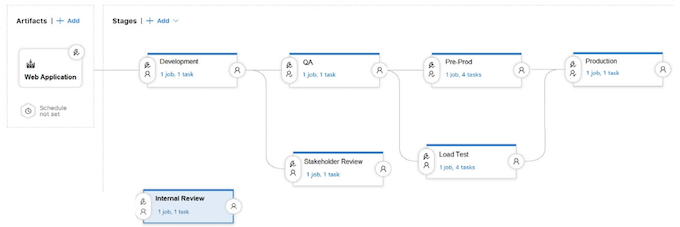


Use the drop-down menus to select the answer choice that answers each question based on the information presented in the graphic. NOTE: Each correct selection is worth one point.

Hot Area:


**Answer Area**

**How many stages have triggers set?**

*   0
*   1
*   2
*   3
*   4
*   5
*   6
*   7

**Which component should you modify to enable continuous delivery?**

*   The Development stage
*   The Internal Review stage
*   The Production stage
*   The Web Application artifact
-----

✅ Answers

**1. How many stages have triggers set?**
✔ **7**

**2. Which component should you modify to enable continuous delivery?**
✔ **The Web Application artifact**

---

🔍 Explanation

🟦 Number of stages with triggers

From the diagram, all stages show the **lightning bolt icon**, which indicates that a **trigger (automatic deployment trigger)** is configured.

The stages are:

* Development
* QA
* Pre-Prod
* Production
* Stakeholder Review
* Load Test
* Internal Review

➡️ Total = **7 stages with triggers**

🟦 Enabling Continuous Delivery

To enable **continuous delivery (CD)** in a classic release pipeline:

* You must configure the **artifact trigger**
* Specifically, enable the **Continuous deployment trigger** on the artifact

✔ This is done on:

> **The Web Application artifact**

💡 Key takeaway

* **Stage triggers (lightning icons)** = automatic stage execution
* **Continuous delivery** is controlled at the **artifact level**, not the stage level

🎯 Final Answer

* **7**
* **The Web Application artifact**


### Question #21


DRAG DROP Your company plans to deploy an application to the following endpoints:

✑ Ten virtual machines hosted in Azure 

✑ Ten virtual machines hosted in an on-premises data center environment All the virtual machines have the Azure Pipelines agent.

You need to implement a release strategy for deploying the application to the endpoints.


What should you recommend using to deploy the application to the endpoints? To answer, drag the appropriate components to the correct endpoints. Each component may be used once, more than once, or not at all. You may need to drag the split bar between panes or scroll to view content.

NOTE: Each correct selection is worth one point.

--------


**Components**

*   A deployment group
*   A management group
*   A resource group
*   Application roles

**Answer Area**

Ten virtual machines hosted in Azure: [ ]

Ten virtual machines hosted in an on-premises data center environment: [ ]

--------

✅ Correct mapping

* **Ten virtual machines hosted in Azure:** ✔ **A deployment group**
* **Ten virtual machines hosted in an on-premises data center environment:** ✔ **A deployment group**

 🔍 Explanation

🟦 **Deployment group**

* Designed specifically for **deploying to multiple machines (targets)**
* Works with:

  * Azure VMs
  * On-premises VMs
* Requires Azure Pipelines agent (which is already installed ✅)
* Enables:

  * Coordinated deployments
  * Rolling deployments
  * Environment-based targeting

❌ Why the other options are incorrect

* **Management group**
  → Used for organizing Azure subscriptions, not deployments

* **Resource group**
  → Logical container for Azure resources, not deployment targeting

* **Application roles**
  → Used in Service Fabric / app-level role definitions, not VM deployment


🎯 Final Answer

| Endpoint    | Component        |
| ----------- | ---------------- |
| Azure VMs   | Deployment group |
| On-prem VMs | Deployment group |

💡 Key takeaway

**Deployment groups** are the correct choice when deploying to:

* Multiple VMs
* Mixed environments (Azure + on-prem)
* Agent-based deployment targets 🚀


### Question-170


You have an Azure DevOps project that produces Node Package Manager (npm) packages. Multiple projects consume the packages.

You need to configure Azure Artifacts to ensure that both the latest and pre-release versions of the packages are available for consumption.

What should you do?

* A. Create two feed views named @prerelease and @release, Set @release as the default view. Configure a release pipeline that tags the packages as release after successful testing.
* B. Create a feed view named @prerelease. Configure a release pipeline that tags the packages as release after successful testing.
* C. Create two feed views named @prerelease and @default. Configure a release pipeline that promotes a package to the @default view after successful testing.
* D. Create two feed views named @prerelease and @release. Set @release as the default view. Configure a release pipeline that promotes a package to the @release view after successful testing

----

**Correct answer: D**

Here’s why:

In **Azure Artifacts**, best practice for handling *release vs pre-release* packages is to use **feed views** with **promotion**, not tagging:

Proper design

* Create two views:

  * `@prerelease` → for preview/unstable builds
  * `@release` → for stable production-ready builds
* Set `@release` as the **default view**
* Use a **release pipeline** to **promote** packages from `@prerelease` → `@release` after validation/testing

Why option D is correct

> **D. Create two feed views named @prerelease and @release. Set @release as the default view. Configure a release pipeline that promotes a package to the @release view after successful testing.**

This matches Azure Artifacts' intended workflow:

* CI publishes packages to `@prerelease`
* Consumers who want previews explicitly reference `@prerelease`
* Stable consumers automatically get packages from `@release` (default view)
* Promotion = official release process

 Why the others are wrong

* **A / B** ❌ → Azure Artifacts does not use *tagging* for release management — it uses **views + promotion**
* **C** ❌ → `@default` is not a user-created view name; default view is a property, not a view

Visual flow

```
CI build → publish → @prerelease
                  ↓
           release pipeline validation
                  ↓
              promote → @release (default)
```


This is the standard enterprise pattern for npm feeds in **Azure DevOps** with multi-project consumption.

✅ **Final Answer: D**


### Question #31


You are defining release strategies for two applications as shown in the following table.

| Application name | Goal |
| :--- | :--- |
| App1 | Failure of App1 has a major impact on your company. You need a small group of users, who opted in to a testing App1, to test new releases of the application. |
| App2 | You need to minimize the time it takes to deploy new releases of App2, and you must be able to roll back as quickly as possible. |


Which release strategy should you use for each application? To answer, drag the appropriate release strategies to the correct applications. Each release strategy may be used once, more than once, or not at all. You may need to drag the split bar between panes or scroll to view content.

NOTE: Each correct selection is worth one point.


Select and Place:

**Release Strategies**

*   Blue/Green deployment
*   Canary deployment
*   Rolling deployment

**Answer Area:**

App1: [ ]

App2: [ ]

----


✅ Correct mapping

* **App1:** ✔ **Canary deployment**
* **App2:** ✔ **Blue/Green deployment**

🔍 Explanation

🟦 **App1 → Canary deployment**

* Requirement:

  * High impact if failure occurs
  * Test with a **small, opted-in group of users**
* Canary deployment:

  * Releases to a **small subset of users first**
  * Gradually expands if no issues are found
    ✔ Perfect for minimizing risk

🟦 **App2 → Blue/Green deployment**

* Requirement:

  * **Fast deployment**
  * **Immediate rollback capability**
* Blue/Green:

  * Two identical environments (current + new)
  * Switch traffic instantly
  * Rollback = switch back
    ✔ Best for speed and reliability

❌ Why not Rolling deployment?

* Updates instances gradually
* Slower rollback compared to Blue/Green
* Not ideal when **instant rollback** is required

🎯 Final Answer

* **App1:** Canary deployment
* **App2:** Blue/Green deployment

💡 Key takeaway

* **Canary → small group testing (risk reduction)**
* **Blue/Green → fast deploy + instant rollback** 🚀


### Question-171

```
Name  Type
  
Feed1   Azure Artifacts feed
Project1 Project in Azure DevOps
```

Project produces pm packages that are published to Feed. Feed1 is consumed by multiple projects.

You need to ensure that only tested packages are available for consumption. The solution must minimize development effort.


What should you do?

* A. Create a feed view named @release and set @release as the default view. After the pm packages test successfully, configure a release pipeline that promotes a package to the @release view.
* B. Create a feed view named @release and set @release as the default view. Affer the npm packages test successfully, configure a release pipeline that tags the packages as release.
* C. Create a feed view named @default. After the nom packages test successfully configure a release pipeline that tags the packages as release.
* D. Create a feed view named @default. After the npm packages test successfully, configure a release pipeline that promotes a package to the @default view

------


**Correct answer: A**

> **A. Create a feed view named `@release` and set `@release` as the default view. After the npm packages test successfully, configure a release pipeline that promotes a package to the `@release` view.**

Why this is correct

In **Azure Artifacts**, the *official and supported mechanism* to control package availability is:

👉 **Feed views + promotion**

This design ensures:

* Untested packages are **not visible** to consumers
* Only **validated packages** appear in the default feed
* **Minimal development effort** (no custom versioning, no tagging logic, no consumer changes)

Correct architecture

* CI publishes packages → default/internal view (e.g. `@prerelease`)
* Tests run
* Release pipeline:

  * **promotes** package → `@release`
* `@release` is the **default view**
* All consuming projects automatically get **only tested packages**


Why the others are wrong

❌ B

> uses **tagging**

Azure Artifacts does **not use tags for consumption control**
Tags are metadata only → consumers can still pull untested packages

❌ C

> `@default` + tagging

* `@default` is not a user-created view
* Tagging still does nothing for access control

❌ D

> `@default` + promotion

* You **cannot create `@default`**
* Default is a property, not a promotable view

Azure Artifacts best-practice model

```text
CI build
   ↓
publish → internal view
   ↓
tests pass
   ↓
release pipeline
   ↓
PROMOTE → @release (default view)
```

 Key principle

> ✅ **Views + promotion = controlled consumption**
> ❌ Tags = labels only (no enforcement)


This is the enterprise-standard pattern in **Azure DevOps** for secure multi-project feed consumption.

✅ **Final Answer: A**


### Question-172 ？？

Your company has an Azure DevOps project that produces Node Package Manager (npm) packages. Multiple projects consume the packages.

You need to minimize the amount of disk space used by older packages in Azure Artifacts.
What should you modify?

* A. the retention settings of the project's release
* B. the retention settings of the project's pipeline
* C. the retention settings of the project's tests
* D. the retention settings of the company pipeline


-------

The correct answer is: **B. the retention settings of the project's pipeline** ✅

Explanation

In **Azure DevOps**, npm packages published to Azure Artifacts are **often tied to pipeline builds**. Older builds and their artifacts (including npm packages) consume storage.

To automatically clean up unused packages and minimize disk space usage:

* Configure the **pipeline retention settings** in the project.
* Retention rules determine how long builds and their associated artifacts (npm packages) are kept.
* When a build is deleted according to retention rules, its packages can also be cleaned up automatically.

Why the other options are incorrect

* **A. Retention settings of the project's release** ❌
  Releases control deployment artifacts, **not npm packages** in Azure Artifacts. Deleting a release does not free package storage.

* **C. Retention settings of the project's tests** ❌
  Test retention only affects test results, not build artifacts or packages.

* **D. Retention settings of the company pipeline** ❌
  There is no global “company pipeline” retention; retention is managed **per pipeline** in each project.


✅ **Answer: B**


### Question-173


Your company builds a multi-tier web application.

You use Azure DevOps and host the production application on Azure virtual machines.

Your team prepares an Azure Resource Manager template of the virtual machine that you will use to test new features.

You need to create a staging environment in Azure that meets the following requirements:

* **Minimizes the cost of Azure hosting**
* Provisions the virtual machines automatically
* **Uses the custom Azure Resource Manager template to provision the virtual machines**

What should you do?

* A. In Azure Cloud Shell, run Azure CLI commands to create and delete the new virtual machines in a staging resource group.
* B. In Azure DevOps, configure new tasks in the release pipeline to deploy to Azure Cloud Services
* C. From Azure Cloud Shell, run Azure PowerShell commands to create and delete the new virtual machines in a staging resource group.
* D. In Azure DevOps, configure new tasks in the release pipeline to create and delete the virtual machines in **Azure DeTest Labs**


-------

The correct answer is: **D. In Azure DevOps, configure new tasks in the release pipeline to create and delete the virtual machines in Azure DevTest Labs** ✅

Explanation

The scenario requires:

1. **Minimize cost** → avoid keeping staging VMs running constantly.
2. **Automatic provisioning** → integrate with CI/CD.
3. **Use a custom ARM template** → ensure the staging VMs match production configuration.

Why **Azure DevTest Labs** is ideal

**Azure DevTest Labs** is designed specifically for:

* Creating **temporary or short-lived environments**.
* Using **custom ARM templates** to provision VMs.
* **Automating creation and deletion** via pipelines or scripts.
* Reducing cost by **shutting down or deleting unused VMs automatically**.

This matches **all the requirements**.

Why the other options are less suitable

* **A / C (Azure CLI / PowerShell in Cloud Shell)** ❌

  * Manual scripts could create and delete VMs, but require **manual execution or custom automation**, which is more effort.
  * No built-in cost optimization like DevTest Labs.

* **B (Azure Cloud Services)** ❌

  * Azure Cloud Services is **legacy PaaS**; it doesn’t allow you to use custom ARM templates for VM provisioning.


**Key takeaway:**
For staging environments that **minimize cost, use custom templates, and can be automated**, **Azure DevTest Labs integrated with Azure DevOps** is the recommended solution.

✅ **Answer: D**


### Question-174

Your company uses Azure DevOps to manage the build and release processes for applications.

You use a Git repository for applications source control.

You plan to create a new branch from an existing pull request. Later, you plan to merge the new branch and the target branch of the pull request.

You need to use a pull request action to create the new branch. The solution must ensure that the branch uses only a portion of the code in the pull request

Which pull request action should you use?


* A. Set as default branch
* B. Approve with suggestions
* C. Cherry-pick
* D. Reactivate
* E. Revert

-----------


The correct answer is: **C. Cherry-pick** ✅

Explanation

You want to:

1. Create a **new branch** from an existing pull request (PR).
2. Ensure the new branch contains **only a portion of the code** in the original PR.

Why **Cherry-pick** is the right action

* **Cherry-pick** allows you to **select specific commits** from one branch (or PR) and apply them to another branch.
* This means you can **take only part of the changes** from the original pull request into a new branch.
* After cherry-picking, you can **merge the new branch** back into the target branch without including unwanted changes.

Why the other options are incorrect

* **A. Set as default branch** ❌ → Changes which branch is considered the default, does **not** select code.
* **B. Approve with suggestions** ❌ → Used for code review feedback; it **doesn’t create a branch** or pick commits.
* **D. Reactivate** ❌ → Reopens a closed PR; it does **not control which code is used**.
* **E. Revert** ❌ → Creates a commit that **undoes changes**, opposite of what you want.


✅ **Answer: C**


### Question-175

You are designing a build pipeline in Azure Pipelines.

The pipeline requires a self-hosted agent. The build pipeline will run once daily and will take 30 minutes to complete.

You need to recommend a compute type for the agent. The solution must minimize costs.

What should you recommend?

* A. an Azure Kubernetes Service (AKS) cluster
* B. Azure Container Instances
* C. an Azure virtual machine scale set
* D. Azure virtual machines


-----------

The correct answer is **B. Azure Container Instances.**

Explanation:

To minimize costs for a task that runs for only 30 minutes once per day, you need a solution that supports **per-second billing** and **zero cost while idle**.

*   **Cost Efficiency:** Azure Container Instances (ACI) is a "serverless" container service. You only pay for the exact amount of CPU and memory resources consumed while the container is running. **For a 30-minute daily task, you would only be billed for 15 hours of compute per month**.
*   **No Idle Costs:** Unlike a standard Virtual Machine (Option D), which incurs costs 24/7 unless manually deallocated, or an AKS cluster (Option A), which has ongoing management and node costs, ACI can be spun up at the start of the pipeline and deleted immediately after the build completes.
*   **Ease of Use:** You can easily run a Dockerized Azure Pipelines agent in ACI.

Why other options are incorrect:

*   **A. Azure Kubernetes Service (AKS):** This requires maintaining a cluster, which involves ongoing costs for the control plane (if using paid tiers) and the worker nodes. It is far too complex and expensive for a single daily 30-minute job.
*   **C. Azure virtual machine scale set (VMSS):** While Azure Pipelines supports "Elastic self-hosted agents" using VMSS (which can scale to zero), there is still a delay in spinning up VMs, and VMSS billing is typically less granular (per minute/hour) than ACI. Additionally, managing the VM image is more administrative effort than a container.
*   **D. Azure virtual machines:** A standard VM is the most expensive option because you pay for the compute time even when the build isn't running, unless you build complex automation to start and stop the VM.

### Question #25

HOTSPOT You use Azure Pipelines to manage the build and deployment of apps.

You are planning the release strategies for a new app.

You need to choose strategies for the following scenarios:

Releases will be made available to users who are grouped by their tolerance for software faults.

✑ Code will be deployed to enable functionality that will be available in later releases of the app.

✑ When a new release occurs, the existing deployment will remain active to minimize recovery time if a return to the previous version is required.

Which strategy should you choose for each scenario? To answer, select the appropriate options in the answer area.

NOTE: Each correct selection is worth one point.


**Answer Area**

Releases will be made available to users who are grouped by their tolerance for software faults:

*   Progressive exposure
*   Blue/green
*   Feature flags

Code will be deployed to enable functionality that will be available in later releases of the app:

*   Progressive exposure
*   Blue/green
*   Feature flags

When a new release occurs, the existing deployment will remain active to minimize recovery time if a return to the previous version is required:

*   Progressive exposure
*   Blue/green
*   Feature flags

------

 ✅ Correct answers

| Scenario                                              | Strategy                   |
| ----------------------------------------------------- | -------------------------- |
| Releases grouped by users’ tolerance for faults       | ✅ **Progressive exposure** |
| Code deployed for future functionality                | ✅ **Feature flags**        |
| Existing deployment remains active for quick rollback | ✅ **Blue/green**           |

🔍 Explanation

🟦 **Progressive exposure**

* Releases are rolled out gradually to different user groups
* Users are segmented based on:

  * Risk tolerance
  * Geography
  * Roles
* Ideal for controlled rollout and monitoring

🟦 **Feature flags**

* Code is deployed but features are **disabled by default**
* Features can be turned on/off without redeployment
* Perfect for:

  * Future functionality
  * Testing in production safely

🟦 **Blue/green deployment**

* Two environments:

  * **Blue (current live)**
  * **Green (new version)**
* Both run simultaneously
* Enables:

  * Instant rollback
  * Minimal downtime

🎯 Final Answer

* **Progressive exposure**
* **Feature flags**
* **Blue/green**

💡 Key takeaway

* **Progressive exposure → gradual rollout**
* **Feature flags → control features without redeploy**
* **Blue/green → safe deployments with fast rollback** 🚀


### Question #26

DRAG DROP You have a project in Azure DevOps.

You need to associate an automated test to a test case.

Which three actions should you perform in sequence? To answer, move the appropriate actions from the list of actions to the answer area and arrange them in the correct order.

Select and Place:

**Actions**

- Debug the project
- Answer Area
- Create a test project
- Create a work item
- Check in a project to the Azure DevOps repository
- Add the automated test to a build pipeline


------

✅ Correct sequence of actions

1. **Create a test project**
2. **Check in a project to the Azure DevOps repository**
3. **Create a work item**

🔍 Explanation

To associate an automated test with a test case in Azure DevOps:

🟦 1. Create a test project

* You need a project that contains automated tests (e.g., unit/UI tests)

🟦 2. Check in the project

* The test code must be stored in the **Azure DevOps repository**
* Enables tracking and linking to pipelines and test cases

🟦 3. Create a work item

* Create a **Test Case work item**
* From there, you can associate the automated test method


❌ Why the other options are incorrect

* **Debug the project** → not required for association
* **Add automated test to a build pipeline** → useful for execution, but not required for linking

🎯 Final Answer Order

1. Create a test project
2. Check in a project to the Azure DevOps repository
3. Create a work item

💡 Key takeaway

To link automated tests:

> **Create test → store in repo → associate via test case work item** 🚀

### Question #27

DRAG DROP You have an Azure Kubernetes Service (AKS) cluster.

You need to deploy an application to the cluster by using Azure DevOps.

Which three actions should you perform in sequence? To answer, move the appropriate actions from the list of actions to the answer area and arrange them in the correct order.

Select and Place:


**Actions**

*   Create a service account in the cluster.
*   Create a service principal in Azure Active Directory (Azure AD).
*   Add an Azure Function App for Container task to the deployment pipeline.
*   Add a Helm package and deploy a task to the deployment pipeline.
*   Add a Docker Compose task to the deployment pipeline.
*   Configure RBAC roles in the cluster.

**Answer Area**

- [ ]
- [ ]
- [ ]


-------


✅ Correct sequence of actions

1. **Create a service principal in Azure Active Directory (Azure AD)**
2. **Configure RBAC roles in the cluster**
3. **Add a Helm package and deploy a task to the deployment pipeline**

🔍 Explanation

🟦 1. Create a service principal in Azure AD

* Provides **secure authentication** from Azure DevOps to AKS
* Required for pipeline to interact with the cluster

🟦 2. Configure RBAC roles in the cluster

* Grants the service principal the necessary permissions
* Ensures **least privilege access** to Kubernetes resources

🟦 3. Add a Helm package and deploy task

* Helm is the standard way to **deploy applications to AKS**
* The pipeline uses Helm to install/update the application

❌ Why the other options are incorrect

* **Create a service account in the cluster** → optional; not required when using service principal + RBAC
* **Azure Function App for Container task** → unrelated to AKS deployment
* **Docker Compose task** → used for multi-container Docker apps, not Kubernetes

🎯 Final Answer Order

1. Create a service principal in Azure AD
2. Configure RBAC roles in the cluster
3. Add a Helm package and deploy task

💡 Key takeaway

AKS deployment via Azure DevOps follows:

> **Authenticate (SPN) → Authorize (RBAC) → Deploy (Helm)** 🚀

### Question #33

DRAG DROP You have an Azure DevOps organization named Contoso.

You have 10 Azure virtual machines that run Windows Server 2019. The virtual machines host an application that you build and deploy by using Azure Pipelines.

Each virtual machine has the Web Server (IIS) role installed and configured.

You need to ensure that the web server configurations on the virtual machines is maintained automatically. The solution must provide centralized management of the configuration settings and minimize management overhead.

Which four actions should you perform in sequence? To answer, move the appropriate actions from the list of actions to the answer area and arrange them in the correct order.

Select and Place:

Actions   

- Create an Azure Automation account.

- Install the custom Desired State Configuration (DSC) extension on the virtual machines.

- Create a .zip file and upload it to Azure Blob storage.

- Onboard the virtual machines to the Azure Automation account.

- Compile the Desired State Configuration (DSC) configuration.

----------


Here is the correct sequence of four actions to maintain web server configurations automatically using Azure Automation State Configuration (DSC), with centralized management and minimal overhead:

1. **Create an Azure Automation account.**  
   This provides the centralized management service for DSC configurations.

2. **Compile the Desired State Configuration (DSC) configuration.**  
   Compiling converts the DSC configuration (e.g., maintaining IIS settings) into a MOF file (node configuration) that can be applied to nodes.

3. **Onboard the virtual machines to the Azure Automation account.**  
   This registers the VMs as DSC nodes in Azure Automation State Configuration.

4. **Install the custom Desired State Configuration (DSC) extension on the virtual machines.**  
   The DSC extension allows each VM to pull and apply the assigned node configuration from Azure Automation and continuously enforce desired state.

Final answer arrangement:

| Order | Action |
|-------|--------|
| 1 | Create an Azure Automation account. |
| 2 | Compile the Desired State Configuration (DSC) configuration. |
| 3 | Onboard the virtual machines to the Azure Automation account. |
| 4 | Install the custom Desired State Configuration (DSC) extension on the virtual machines. |

> **Note:** Creating a `.zip` file and uploading to Azure Blob storage is not required here because Azure Automation DSC natively stores and manages configurations without needing external blob storage.


### Question #34


You have a free tier of an Azure DevOps organization named Contoso. Contoso contains 10 private projects. Each project has multiple jobs with no dependencies. The build process requires access to resource files located in an on-premises file system.

You frequently run the jobs on five self-hosted agents but experience long build times and frequently queued builds.

You need to minimize the number of queued builds and the time it takes to run the builds.

What should you do?

A. Configure the pipelines to use the Microsoft-hosted agents.

B. Register additional self-hosted agents.

C. Purchase self-hosted parallel jobs.

D. Purchase Microsoft-hosted parallel jobs


----


✅ Correct answer: **B. Register additional self-hosted agents**


🔍 Explanation

🟦 Current situation

* Pipelines require access to **on-premises file system**
* Using **self-hosted agents (5 agents)**
* Experiencing:

  * **Queued builds**
  * **Long execution times**
* Jobs have **no dependencies → can run in parallel**

 🟦 Why B is correct

* Adding more **self-hosted agents**:

  * Increases **parallel execution capacity**
  * Reduces **queue time**
  * Keeps **direct access to on-prem resources**

✔ This directly solves both problems:

* Faster builds
* Fewer queued jobs

---

❌ Why the other options are incorrect

A. Microsoft-hosted agents

* Cannot easily access **on-premises file system**
* Would require complex networking (VPN, self-hosted proxy)

C. Purchase self-hosted parallel jobs

* Only increases allowed concurrency **limit**
* Does NOT help if you only have **5 physical agents**
* Bottleneck remains


D. Purchase Microsoft-hosted parallel jobs

* Same issue as A (no direct on-prem access)

🎯 Key takeaway

For pipelines that depend on **on-prem resources**:

> ✅ Scale **self-hosted agents**, not hosted parallel jobs

🚀 Final Answer:

**B. Register additional self-hosted agents**


### Question #36

You have an Azure DevOps project named Project1 and an Azure subscription named Sub1. Sub1 contains an Azure SQL database named DB1. You need to create a release pipeline that uses the Azure SQL Database Deployment task to update DB1.

Which artifact should you deploy?

A. a BACPAC

B. a DACPAC

C. an LDF file

D. an MDF file


-----


✅ Correct answer: **B. a DACPAC**


🔍 Explanation

The **Azure SQL Database Deployment** task in Azure DevOps is designed to deploy **database schema changes** using a **DACPAC** file.

🟦 What is a DACPAC?

* A **Data-tier Application Package**
* Contains:

  * Database schema (tables, views, stored procedures, etc.)
* Used for:

  * **Deploying and updating database structure**

❌ Why the other options are incorrect

* **A. BACPAC**
  → Used for **data + schema export/import**, not for incremental deployments

* **C. LDF file**
  → SQL Server **transaction log file**, not used for deployment

* **D. MDF file**
  → SQL Server **database file**, not used in Azure DevOps pipelines

🎯 Final Answer

**B. a DACPAC**

💡 Key takeaway

* **DACPAC → schema deployment (CI/CD pipelines)**
* **BACPAC → backup/migration (data + schema)** 🚀


### Question #37


HOTSPOT You have a project in Azure DevOps.


You plan to create a build pipeline that will deploy resources by using Azure Resource Manager templates. The templates will reference secrets stored in Azure Key Vault.

You need to ensure that you can dynamically generate the resource ID of the key vault during template deployment.

What should you include in the template? To answer, select the appropriate options in the answer area.

NOTE: Each correct selection is worth one point.

Here is the extracted content from the image:

```
"resources": [
  {
    "apiVersion": "2018-05-01",
    "name": "secrets",
    "type": "<Drop-down>",
    
    "properties": {
      "mode": "Incremental",
      "<Drop-down>": {
        "contentVersion": "1.0.0.0",
        "uri": "[uri(parameters('_artifactsLocation'), concat('./nested/sqlserver.json', parameters('_artifactsLocationSasToken')))]"
      },
      "parameters": {
        "secret": {
          "reference": {
            "keyVault": {
              "id": "[resourceId(parameters('vaultSubscription'), parameters('vaultResourceGroupName'), 'Microsoft.KeyVault/vaults', parameters('vaultName'))]"
            },
            "secretName": "[parameters('secretName')]"
          }
        }
      }
    }
  }
]
```

Dropdown options visible in the image:

**For `"type"`:**

* `Microsoft.KeyVault/vaults`
* `Microsoft.Resources/deployments`
* `Microsoft.Subscription/subscriptions`

**For second dropdown inside `properties`:**

* `deployment`
* `template`
* `templateLink`


-----------


✅ Correct answers

* **Drop-down 1 (`type`):** ✔ `Microsoft.Resources/deployments`
* **Drop-down 2 (inside `properties`):** ✔ `templateLink`

🔍 Explanation

🟦 `Microsoft.Resources/deployments`

* This defines a **nested deployment** in ARM templates
* Required when:

  * You want to **dynamically reference resources**
  * You are passing parameters (like Key Vault secrets)
* Enables use of functions like:

  * `resourceId()` (as shown in the template)

🟦 `templateLink`

* Used to reference an **external ARM template** via a URI
* Matches the provided snippet:

  ```json
  "uri": "[uri(parameters('_artifactsLocation'), concat('./nested/sqlserver.json', parameters('_artifactsLocationSasToken')))]"
  ```
* Required when templates are stored externally (e.g., GitHub, storage)

❌ Why not the other options

* **Microsoft.KeyVault/vaults** → used to create a Key Vault, not for deployment orchestration
* **Microsoft.Subscription/subscriptions** → unrelated to this scenario
* **deployment / template** → not valid in this context with a URI (must use `templateLink`)

🎯 Final Answer

```json
"type": "Microsoft.Resources/deployments",
"templateLink": { ... }
```

💡 Key takeaway

To dynamically reference Key Vault secrets in ARM templates:

* Use **nested deployments (`Microsoft.Resources/deployments`)**
* Use **`templateLink`** for external templates
* Combine with **`resourceId()`** for dynamic resource resolution 🚀


### Question #41

You are developing an iOS application by using Azure DevOps.

You need to test the application manually on 10 devices without releasing the application to the public. Which two actions should you perform? Each correct answer presents part of the solution.

NOTE: Each correct selection is worth one point.

A. Create a Microsoft Intune device compliance policy.

B. Deploy a certificate from an internal certification authority (CA) to each device.

C. Register the application in the iTunes store.

D. Onboard the devices into Microsoft Intune.

E. Distribute a new release of the application.

F. Register the IDs of the devices in the Apple Developer portal.

----------


✅ Correct answers:

- ✔ **E. Distribute a new release of the application**
- ✔ **F. Register the IDs of the devices in the Apple Developer portal**

---

🔍 Explanation

To manually test an iOS app on specific devices **without publishing to the App Store**, you use **Ad Hoc distribution** (or similar App Center distribution).

🟦 **F. Register device IDs (UDIDs)**

* Apple requires devices to be **explicitly registered**
* Only registered devices can install the app
* Done via **Apple Developer portal**


🟦 **E. Distribute a new release**

* Use **Azure DevOps / App Center** to distribute the build
* Sends the app to testers for installation on their devices

❌ Why the other options are incorrect

* **A. Intune compliance policy** → unrelated to iOS app distribution
* **B. Internal CA certificate** → not required for iOS app testing
* **C. Register in iTunes store** → would make the app public (not desired)
* **D. Onboard into Intune** → not needed for simple manual testing

🎯 Final Answer

* **E**
* **F**

💡 Key takeaway

For private iOS testing:

> Register devices (UDIDs) → distribute build (Ad Hoc/App Center) 🚀

### Question #45

HOTSPOT Your company uses Git as a source code control system for a complex app named App1.

You plan to add a new functionality to App1.

You need to design a branching model for the new functionality.

Which branch lifetime and branch time should you use in the branching model? To answer, select the appropriate options in the answer area. NOTE: Each correct selection is worth one point.

**Branch lifetime:**

*   Long-lived
*   Short-lived

**Branch type:**

*   Master
*   Feature
*   Integration

-----


✅ Correct answers

* **Branch lifetime:** ✔ **Short-lived**
* **Branch type:** ✔ **Feature**

🔍 Explanation

🟦 **Short-lived branch**

* New functionality should be developed in branches that:

  * Exist only during development
  * Are merged back quickly
* Helps:

  * Reduce merge conflicts
  * Improve collaboration
  * Support continuous integration

🟦 **Feature branch**

* Specifically used for:

  * Developing **new features or functionality**
* Isolated from main code until complete and tested

❌ Why the other options are incorrect

* **Long-lived** → used for stable branches like `main` or `develop`, not new features
* **Master** → main production branch, not for development
* **Integration** → used for combining multiple features, not building a single feature

🎯 Final Answer

* **Short-lived**
* **Feature**

💡 Key takeaway

For new functionality:

> Use **short-lived feature branches** to enable faster, safer development 🚀

### Question #47

HOTSPOT You have an Azure virtual machine named VM1 that runs Linux.

You plan to deploy the Desired State Configuration (DSC) extension to VM1.

You need to grant the Log Analytics agent the appropriate directory permissions.

How should you complete the command? To answer, select the appropriate options in the answer area. NOTE: Each correct selection is worth one point.

Hot Area

**Answer Area**

`setfacl -m u:omsagent:` [Dropdown 1] [Dropdown 2]

**Dropdown 1 Options:**

* r
* x
* rx
* rwx

**Dropdown 2 Options:**

* /lib
* /etc
* /tmp
* /usr


----


**Correct Answers:**

* **Dropdown 1:** `rwx`
* **Dropdown 2:** `/tmp`

**Complete Command:**

`setfacl -m u:omsagent:rwx /tmp`

**Explanation:**

To deploy and run the Desired State Configuration (DSC) extension properly, the Log Analytics agent (which runs under the `omsagent` user context) needs to be able to create, write to, and execute temporary scripts and files. 

By default, in many hardened Linux environments, permissions are restricted. You must explicitly grant the `omsagent` user Read, Write, and Execute (`rwx`) permissions to the `/tmp` directory so it can successfully process the configurations. 

Modifying system directories like `/etc`, `/usr`, or `/lib` with full `rwx` permissions for a service account would be a severe security risk and is not required for this extension.

### Question #47

HOTSPOT You are using PowerShell to administer Azure Log Analytics workspaces.

You need to list the available workspaces and their properties.

How should you complete the command? To answer, select the appropriate options in the answer area. NOTE: Each correct selection is worth one point.

Here is the content extracted from the image:

**Answer Area**

[Dropdown 1] [Dropdown 2] `Microsoft.OperationalInsights/workspaces - ExpandProperties`

**Dropdown 1 Options:**

* Get-AzResource
* Get-AzResourceGroup
* Get-AzResourceProvider

**Dropdown 2 Options:**

* -ResourceGroupName
* -ResourceId
* -ResourceType

-----

✅ Correct answers

* **Dropdown 1:** ✔ **Get-AzResource**
* **Dropdown 2:** ✔ **-ResourceType**

🔍 Explanation

🟦 Correct command

```powershell id="r3gk2a"
Get-AzResource -ResourceType Microsoft.OperationalInsights/workspaces -ExpandProperties
```

🟦 Why this works

* **Get-AzResource**

  * Retrieves Azure resources across the subscription
* **-ResourceType**

  * Filters resources by type:

    * `Microsoft.OperationalInsights/workspaces` = Log Analytics workspaces
* **-ExpandProperties**

  * Returns detailed properties of each workspace


❌ Why the other options are incorrect

* **Get-AzResourceGroup**
  → Lists resource groups, not resources

* **Get-AzResourceProvider**
  → Lists providers, not instances

* **-ResourceGroupName**
  → Filters by group, but does not specify resource type

* **-ResourceId**
  → Requires a specific resource, not for listing all

🎯 Final Answer

* **Get-AzResource**
* **-ResourceType**

💡 Key takeaway

To list Azure resources with details:

> Use **Get-AzResource + -ResourceType + -ExpandProperties** 🚀


### Question-176

You have a project in Azure DevOps. 

You have an Azure Resource Group deployment project in Microsoft Visual Studio that is checked in to the Azure DevOps project.

**You need to create a release pipeline that will deploy resources by using Azure Resource Manager templates.**

**The solution must minimize administrative effort.**

Which task type should you include in the solution?

* A. Azure Cloud Service Deployment
* B. Azure RM Web App Deployment
* C. Azure PowerShell
* D. Azure App Service Manage

The correct answer is: **C. Azure PowerShell** ✅

Explanation

You need to:

* Deploy **resources using Azure Resource Manager (ARM) templates**.
* Minimize administrative effort.
* Use an **Azure DevOps release pipeline**.

Analysis of options

| Option                                | Purpose                                                                              | Suitability                                                                  |
| ------------------------------------- | ------------------------------------------------------------------------------------ | ---------------------------------------------------------------------------- |
| **A. Azure Cloud Service Deployment** | Deploys classic Cloud Services (web/worker roles)                                    | ❌ Not ARM template-based                                                     |
| **B. Azure RM Web App Deployment**    | Deploys web apps to Azure App Service                                                | ❌ Only web apps, not general ARM resources                                   |
| **C. Azure PowerShell**               | Runs PowerShell scripts, including `New-AzResourceGroupDeployment` for ARM templates | ✅ Allows automated deployment of **any ARM resources**, minimal manual steps |
| **D. Azure App Service Manage**       | Starts/stops App Service instances                                                   | ❌ Only manages app services, not resource deployments                        |


How it works

1. In the release pipeline, add an **Azure PowerShell** task.
2. Configure the task to run `New-AzResourceGroupDeployment` with your ARM template.
3. This approach:

   * Works with **any Azure resource**.
   * Requires minimal administrative effort.
   * Integrates fully with **Azure DevOps**.


✅ **Answer: C. Azure PowerShell**


### Question #59

You use GitHub for source control of .NET applications.

You need to deploy a documentation solution that meets the following requirements:

✑ Documents will be written in Markdown as developers make code changes.

✑ Changes to the documents will trigger the recompilation of a static website.

✑ Users will access the documents from the static website.

✑ Documents will be stored in a GitHub repository.

Which two tools can you use to compile the website? Each correct answer presents a complete solution. NOTE: Each correct selection is worth one point.

A. Word Press

B. Jekyll

C. DocFX

D. caret

E. Medium


--------

✅ Correct answers:

- ✔ **B. Jekyll**
- ✔ **C. DocFX**

🔍 Explanation

You need a solution that:

* Uses **Markdown files**
* Automatically **builds a static website**
* Integrates with **GitHub workflows**
* Stores docs in a repository

🟦 **Jekyll**

* Native static site generator for GitHub (used by GitHub Pages)
* Supports:

  * Markdown → HTML
  * Automatic rebuild on commits
* Ideal for:

  * Simple documentation sites

🟦 **DocFX**

* Microsoft tool designed for **.NET documentation**
* Supports:

  * Markdown + API documentation
  * Static site generation
* Integrates well with CI/CD pipelines

❌ Why the other options are incorrect

* **WordPress** → dynamic CMS, not static site generation from repo
* **caret** → text editor, not a build tool
* **Medium** → publishing platform, not repo-based documentation

🎯 Final Answer

* **B. Jekyll**
* **C. DocFX**

💡 Key takeaway

For documentation-as-code:

> Use **static site generators** like Jekyll or DocFX 🚀

### Question #61

You have a virtual machine that runs Windows Server 2019 and is managed by using Desired State Configuration (DSC). 

You have the following DSC configuration.

```powershell
configuration WebConfiguration
{
    
    File WebsiteContent {
        Ensure          = 'Present'
        SourcePath      = 'c:\test\index.htm'
        DestinationPath = 'c:\inetpub\wwwroot'
        DependsOn       = '[WindowsFeature]Web-Server'
    }

    WindowsFeature Web-Server
    {
        Ensure = 'Present'
        Name   = 'Web-Server'
    }

}
```

You have the following Local Configuration Manager (LCM) configuration.

```powershell
LocalConfigurationManager
{
    ConfigurationMode = "ApplyAndMonitor"
    RefreshFrequencyMins = 30
    ConfigurationModeFrequencyMins = 60
    RefreshMode = 'Push'
}
```

For each of the following statements, select Yes if the statement is true. Otherwise, select No. NOTE: Each correct selection is worth one point.

Hot Area:

```
Here is the content extracted from the image:

**Hot Area:**

| Statements | Yes | No |
| :--- | :---: | :---: |
| The Index.htm file will be copied to the C:\Test folder before the Web-Server Windows feature is installed. | &#9711; | &#9711; |
| If manual changes are made to the configuration of the virtual machine, the configuration will reapply automatically. | &#9711; | &#9711; |
| If the Web-Server Windows feature is uninstalled from the virtual machine, the discrepancy will be reported in a log entry within 60 minutes. | &#9711; | &#9711; |
```


------


✅ Answers

| Statement                                                                                                                                     | Answer    |
| --------------------------------------------------------------------------------------------------------------------------------------------- | --------- |
| The Index.htm file will be copied to the C:\Test folder before the Web-Server Windows feature is installed.                                   | ❌ **No**  |
| If manual changes are made to the configuration of the virtual machine, the configuration will reapply automatically.                         | ❌ **No**  |
| If the Web-Server Windows feature is uninstalled from the virtual machine, the discrepancy will be reported in a log entry within 60 minutes. | ✅ **Yes** |

🔍 Explanation

🟦 1. File copy before Web-Server install

* The `File` resource has:

  ```powershell
  DependsOn = '[WindowsFeature]Web-Server'
  ```
* This ensures:

  * **Web-Server installs first**
  * Then the file is copied

❌ Statement says *before* → incorrect

🟦 2. Automatic reapplication of configuration

* LCM setting:

  ```powershell
  ConfigurationMode = "ApplyAndMonitor"
  ```
* Meaning:

  * Applies configuration **once**
  * Then **only monitors** for drift
  * Does NOT fix automatically

❌ No automatic reapply

🟦 3. Drift reporting within 60 minutes

* Setting:

  ```powershell
  ConfigurationModeFrequencyMins = 60
  ```
* Every 60 minutes:

  * DSC checks compliance
  * Logs drift (e.g., feature removed)

✔ Discrepancy is detected and logged

💡 Key takeaway

* **DependsOn → controls execution order**
* **ApplyAndMonitor → detect drift, don’t fix**
* **ConfigurationModeFrequencyMins → drift detection interval** 🚀

### Question #62

DRAG DROP You have a web app named App1 that is hosted on multiple servers. App1 uses Application Insights in Azure Monitor.

You need to compare the daily CPU usage from the last week for all servers.


How should you complete the query? To answer, drag the appropriate values to the correct targets. Each value may be used once, more than once, or not at all.

You may need to drag the split bar between panes or scroll to view content.

NOTE: Each correct selection is worth one point.

Select and Place:


**Values**

*   `bin(timestamp,1d)`
*   `bin(timestamp,1h)`
*   `project timechart`
*   `render chart`
*   `render timechart`

**Answer Area**

```kusto
...
performanceCounters
| where counter == "% Processor Time"
| where timestamp >= ago(7d)
| summarize avg(value) by cloud_RoleInstance, [Box 1]
| [Box 2]
...
```


--------

✅ Correct answers

* **Box 1:** ✔ `bin(timestamp,1d)`
* **Box 2:** ✔ `render timechart`

🔍 Explanation

🟦 `bin(timestamp,1d)`

* Groups data into **daily intervals**
* Requirement:

  > Compare **daily CPU usage from the last week**
* So aggregation must be per **day**

🟦 `render timechart`

* Visualizes the results as a **time-based chart**
* Ideal for:

  * Trends over time
  * Comparing multiple servers (`cloud_RoleInstance`)

❌ Why the other options are incorrect

* **bin(timestamp,1h)** → hourly, not daily
* **project timechart** → invalid syntax
* **render chart** → generic, not time-based

🎯 Final Query

```kusto id="8f3l2x"
performanceCounters
| where counter == "% Processor Time"
| where timestamp >= ago(7d)
| summarize avg(value) by cloud_RoleInstance, bin(timestamp,1d)
| render timechart
```

💡 Key takeaway

* **bin() → controls time granularity**
* **timechart → best for time-series visualization** 🚀


### Question #63

You have an Azure subscription that contains 50 virtual machines.

You plan to manage the configuration of the virtual machines by using Azure Automation State Configuration. You need to create the Desired State Configuration (DSC) configuration files.

How should you structure the code blocks?

A. Node > Configuration > Resource

B. Configuration > Resource > Node

C. Resource > Configuration > Node

D. Configuration > Node > Resource

-------

✅ Correct answer: **D. Configuration > Node > Resource**

🔍 Explanation

Desired State Configuration (DSC) follows a **specific hierarchical structure**:

🟦 1. **Configuration**

* The top-level block
* Defines the overall configuration

🟦 2. **Node**

* Specifies the target machine(s)
* Example: `Node localhost` or multiple VMs

🟦 3. **Resource**

* Defines what to configure on the node
* Examples:

  * `WindowsFeature`
  * `File`
  * `Service`

🟦 Correct structure

```powershell id="dsc123"
Configuration MyConfig {
    Node "VM1" {
        WindowsFeature WebServer {
            Ensure = "Present"
            Name   = "Web-Server"
        }
    }
}
```

❌ Why the other options are incorrect

* **A. Node > Configuration > Resource** → wrong order
* **B. Configuration > Resource > Node** → resources must be inside Node
* **C. Resource > Configuration > Node** → completely invalid structure

🎯 Final Answer

**D. Configuration > Node > Resource**

💡 Key takeaway

DSC always follows:

> **Configuration → Node → Resource** 🚀


### Question #64

Your team uses Azure Pipelines to deploy applications.


You need to ensure that when a failure occurs during the build or release process, all the team members are notified by using Microsoft Teams. The solution must minimize development effort.

What should you do?

A. Install the Azure Boards app for Teams and configure a subscription to receive notifications in a channel.

B. Use Azure Automation to connect to the Azure DevOps REST API and notify the team members.

C. Use an Azure function to connect to the Azure DevOps REST API and notify the team members.

D. Install the Azure Pipelines app for Teams and configure a subscription to receive notifications in a channel.

-----


✅ Correct answer: **D. Install the Azure Pipelines app for Teams and configure a subscription to receive notifications in a channel.**

🔍 Explanation

🟦 Why D is correct

* The **Azure Pipelines app for Microsoft Teams** provides:

  * Built-in integration with Azure DevOps pipelines
  * Notifications for:

    * Build failures
    * Release failures
* Requires **minimal setup**:

  * Install app in Teams
  * Configure a subscription to a channel

✔ Meets requirement:

> “Minimize development effort”

❌ Why the other options are incorrect

* **A. Azure Boards app**
  → Used for work items, not pipeline/build notifications

* **B. Azure Automation + REST API**
  → Custom solution, higher effort

* **C. Azure Function + REST API**
  → Also custom development, not minimal effort
 🎯 Final Answer

**D**

💡 Key takeaway

For notifications in Azure DevOps:

> Use built-in integrations (like Teams apps) instead of custom code 🚀


### Question #65


DRAG DROP You have an app named App1. You have a Log Analytics workspace named Workspace1 that contains a table named AppEvents. App1 writes logs to Workspace1.

You need to query the AppEvents table. The solution must meet the following requirements:

✑ Only query rows for a column named Name that starts with the following text: "Clicked Create New Ticket."

✑ Calculate the number of daily clicks per user.

✑ Return the top 10 users based on their number of clicks for any day.

✑ Sort the results based on the highest number of clicks.

✑ Ignore any users who have less than three daily clicks.

In which order should you arrange the query statements? To answer, move all statements from the list of statements to the answer area and arrange them in the correct order.

Select and Place:

Here is the content extracted from the image, formatted as markdown:

**Actions Commands Cmdlets Statements**

*   `| summarize NumberOfClicks = count() by bin(TimeGenerated, 1d), UserId`
*   `AppEvents`
*   `| top 10 by NumberOfClicks desc`
*   `| where NumberOfClicks >= 3`
*   `| where Name startswith "Clicked Create New Ticket"`

**Answer Area**

*(Empty)*


-----


✅ Correct order of query statements

```kusto
AppEvents
| where Name startswith "Clicked Create New Ticket"
| summarize NumberOfClicks = count() by bin(TimeGenerated, 1d), UserId
| where NumberOfClicks >= 3
| top 10 by NumberOfClicks desc
```

---

🔍 Explanation

🟦 1. `AppEvents`

* Start with the target table

 🟦 2. Filter by event name

```kusto
| where Name startswith "Clicked Create New Ticket"
```

* Ensures only relevant events are included

🟦 3. Aggregate daily clicks per user

```kusto
| summarize NumberOfClicks = count() by bin(TimeGenerated, 1d), UserId
```

* Groups by:

  * **UserId**
  * **Day (1d bin)**

🟦 4. Filter users with at least 3 clicks

```kusto
| where NumberOfClicks >= 3
```

🟦 5. Get top 10 users

```kusto
| top 10 by NumberOfClicks desc
```

* Sorts by highest clicks
* Returns top 10

🎯 Key takeaway

Correct query flow in Kusto:

> **Filter → Aggregate → Filter → Sort/Top** 🚀

### Question #66

HOTSPOT -


You have an Azure subscription that contains two resource groups named ContosoRG and ContosoDev, an Azure data factory named Contoso Data Factory, and a release pipeline in Azure Pipelines named Pipeline1.

You plan to deploy Contoso Data Factory to ContosoRG by using Pipeline1.

You add the Azure Resource Manager (ARM) template deployment task shown in the following exhibit.


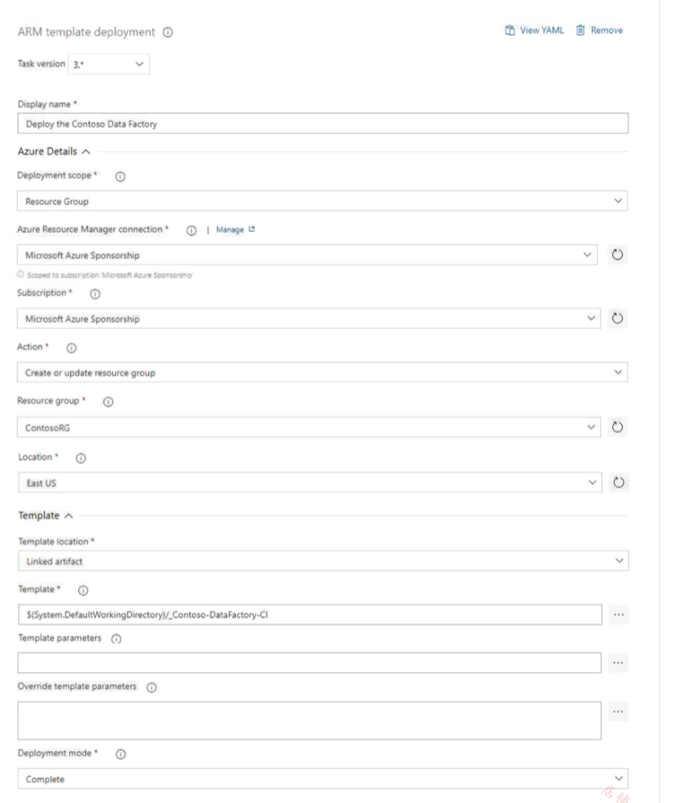


Use the drop-down menus to select the answer choice that completes each statement based on the information presented in the graphic

NOTE: Each correct selection is worth one point.

Here is the content extracted from the image, formatted as markdown:

The [answer choice] setting must be changed to prevent the modification of existing databases and web apps in ContosoRG. **[Dropdown 1]**

**Dropdown 1 Options:**

* Action
* Template location
* Deployment mode
* Deployment scope


Pipeline1 will retrieve the ARM template from the [answer choice]. **[Dropdown 2]**

**Dropdown 2 Options:**

* output of the continuous integration build
* location specified in the Linked artifact variable
* default branch of the Git repository of Contoso Data Factory


-------

✅ Correct answers

1. **The setting that must be changed:** ✔ **Deployment mode**
2. **Pipeline1 will retrieve the ARM template from:** ✔ **output of the continuous integration build**

 🔍 Explanation

🟦 1. Deployment mode

* Current setting (from image): **Complete**
* Problem:

  * **Complete mode deletes any resources not in the template**
  * This could modify/remove existing databases and web apps in **ContosoRG**

✔ To prevent this:

* Change to **Incremental mode**
* Only updates resources defined in the template


🟦 2. Template retrieval source

* Template location is set to **Linked artifact**
* This means:

  * The ARM template is taken from the **pipeline artifact**
  * Typically produced by the **CI build**

✔ Therefore:

> Pipeline retrieves template from **output of the continuous integration build**

 
 ❌ Why other options are incorrect

* **Action** → not related to resource deletion behavior

* **Template location** → already correct (Linked artifact)

* **Deployment scope** → unrelated to preventing modification

* **Default branch of Git repo** → not used when artifact is selected

* **Linked artifact variable** → indirect; actual source is CI output

 🎯 Final Answer

* **Deployment mode**
* **output of the continuous integration build**

💡 Key takeaway

* **Complete mode = destructive (avoid unless intentional)**
* **Incremental mode = safe updates**
* **Linked artifact = CI pipeline output** 🚀

### Question #67


You have an Azure Pipeline.

You need to store configuration values as variables.

At which four scopes can the variables be defined, and what is the precedence of the variables from the highest precedence to lowest precedence? To answer, move the appropriate scope from the list of scopes to the answer area and arrange them in the correct order.


**Scopes**

* stage
* job
* pipeline settings UI
* pipeline root
* task

**Answer Area**

* *(Empty box)*
* *(Empty box)*
* *(Empty box)*
* *(Empty box)*

-----


Here are the four correct scopes for defining variables in Azure Pipelines, arranged in order of precedence from **highest to lowest**:

1. **job** (Highest precedence - applies only to the specific job and overrides broader scopes)
2. **stage** (Applies to all jobs within the stage, overriding pipeline-level variables)
3. **pipeline root** (Defined at the top of the YAML file; applies to the entire pipeline unless overridden by a stage or job)
4. **pipeline settings UI** (Lowest precedence - defined in the Azure DevOps web interface; overridden by any identically named variable in the YAML file)

*(Note: **task** is the distractor. While you can map variables to task inputs or environments, you do not declare variable blocks at the task scope in Azure Pipelines.)*


### Question #68

You have a project in Azure DevOps named Project1 that contains two environments named environment1 and environment2.

When a new version of Project is released, the latest version is deployed to environment2, and the previous version is redeployed to environment1.

You need to distribute users across the environments. The solution must meet the following requirements:

• New releases must be available to only a subset of the users.

• You must gradually increase the number of users that can access environment2.

What should you use?

A. VIP swaping

B. web app deployment slots

C. Azure Load Balancer

D. Azure Traffic Manager


-----


The correct answer is **B. web app deployment slots**.

**Explanation:**

Azure App Service **deployment slots** allow you to run different versions of your web application simultaneously. They have a built-in feature called **Traffic Routing** (sometimes referred to as "Testing in Production"). 

This feature allows you to meet both of your requirements perfectly:


* **Subset of users:** You can specify a small percentage of incoming user traffic (e.g., 10%) to be routed to `environment2` (the slot with the new release), while the rest remains on `environment1`.
* **Gradual increase:** You can manually or automatically adjust that percentage upward (e.g., from 10% to 30% to 50%) as you gain confidence in the new release until 100% of the users are on the new version.

**Why the other options are less suitable:**

* **A. VIP swapping** is an "all-or-nothing" cutover. It instantly swaps 100% of the traffic from one environment to the other, which does not allow for gradual user distribution.
* **C. Azure Load Balancer** operates at Layer 4 (transport level). While it can distribute traffic, it does not natively support the percentage-based routing or user-session affinity needed to easily split users between application versions for testing.
* **D. Azure Traffic Manager** operates at the DNS level. While it does support weighted routing, DNS caching on client machines makes it difficult to control the gradual shift of users accurately and in real-time.

### Question #69

DRAG DROP -

You are designing a versioning strategy for Git-based packages.

You plan to use a Semantic Versioning (SemVer)-based strategy.

You need to identify when to change the build version.

What should you identify for each scenario? To answer, drag the appropriate versions to the correct scenarios. Each version may be used once, more than once, or not at all. You may need to drag the split bar between panes or scroll to view content.

NOTE: Each correct selection is worth one point.


Here is the content extracted from the image, formatted as markdown:

**Version**

*   Major
*   Minor
*   Patch

**Answer Area**

*   You rename a parameter in an API: [ ]
*   You deprecate functionality in an API: [ ]
*   You add a feature and maintain backwards compatibility: [ ]

-----


✅ Correct mapping (Semantic Versioning)

* **You rename a parameter in an API:** ✔ **Major**
* **You deprecate functionality in an API:** ✔ **Minor**
* **You add a feature and maintain backwards compatibility:** ✔ **Minor**

🔍 Explanation

🟦 **Major (X.0.0)**

* Used for **breaking changes**
* Renaming a parameter:

  * Breaks existing clients → requires major version bump


🟦 **Minor (0.X.0)**

* Used for:

  * **Backward-compatible changes**
  * New features
  * Deprecations (still works but marked for future removal)

✔ Both apply:

* Deprecating functionality
* Adding new features (without breaking existing code)

🟦 **Patch (0.0.X)**

* Used only for:

  * Bug fixes
  * No new features or breaking changes

🎯 Final Answer

* Rename parameter → **Major**
* Deprecate functionality → **Minor**
* Add feature (backward compatible) → **Minor**

💡 Key takeaway

* **Major → breaking changes**
* **Minor → new features / deprecations**
* **Patch → bug fixes only** 🚀


### Question #70

You use Calendar Versioning (CalVer) for code assets.

You need to store an optional tag of beta as part of the version.

Which part of the version should you use for the tag?

A. minor

B. major

C. micro

D. modifier

---

✅ Correct answer: **D. modifier**

🔍 Explanation

In **Calendar Versioning (CalVer)**, versions are typically structured like:

```
YYYY.MM.DD[-modifier]
```

🟦 Modifier

* Used for **optional labels/tags**, such as:

  * `beta`
  * `alpha`
  * `rc`
* Example:

  ```
  2026.04.01-beta
  ```

❌ Why the other options are incorrect

* **Major / Minor / Micro**

  * These are numeric version components
  * Used for ordering versions, not labeling release types

🎯 Final Answer

**D. modifier**

💡 Key takeaway

In CalVer:

> **Modifier = optional label (beta, alpha, rc)** 🚀


### Question #71

DRAG DROP -

You have an Azure subscription that uses Azure Automation State Configuration to manage the configuration of virtual machines.

You need to identify which nodes are noncompliant.

Topic 8

How should you complete the query? To answer, drag the appropriate values to the correct targets. Each value may be used once, more than once, or not at all. You may need to drag the split bar between panes or scroll to view content.

NOTE: Each correct selection is worth one point.

------

**Values**

*   Category
*   DscReportStatus
*   Message
*   OperationName
*   Resource
*   ResultType

**Answer Area**

```kusto
AzureDiagnostics
| where [Box 1] == "DscNodeStatus"
| where [Box 2] contains ""
| where [Box 3] != "Compliant"
```

------

✅ Correct answers

* **Box 1:** ✔ **Category**
* **Box 2:** ✔ **OperationName**
* **Box 3:** ✔ **ResultType**

🔍 Explanation

🟦 Box 1: `Category`

```kusto
| where Category == "DscNodeStatus"
```

* Filters logs related specifically to **DSC node status**

🟦 Box 2: `OperationName`

```kusto
| where OperationName contains ""
```

* Used to filter specific DSC operations (e.g., consistency checks)

🟦 Box 3: `ResultType`

```kusto
| where ResultType != "Compliant"
```

* Identifies nodes that are **noncompliant**

🎯 Final Query

```kusto id="v9k3lx"
AzureDiagnostics
| where Category == "DscNodeStatus"
| where OperationName contains ""
| where ResultType != "Compliant"
```

💡 Key takeaway

To find noncompliant DSC nodes:

> Filter by **Category → Operation → ResultType** 🚀


### Question #73

HOTSPOT -

You have a project in Azure DevOps that contains a release pipeline. The pipeline contains two stages named QA and Prod. QA deploys code to an Azure web app named webapp1. Prod deploys code to an Azure web app named webapp2.

You need to ensure that code deployments to webapp2 are blocked if Azure Application Insights generates Failed requests alerts following the deployment of new code to webapp1.

What should you do for each stage? To answer, select the appropriate options in the answer area.

NOTE: Each correct selection is worth one point.


**Answer Area**

QA: [Dropdown 1]

**Dropdown 1 Options:**
* Add a task to configure
alert rules in Application Insights.
* Configure a gate in the pre-deployment conditions.
* Configure an auto-redeploy trigger in the post-deployment conditions
* Configure a post-deployment approval in the post-deployment conditions

Prod: [Dropdown 2]

**Dropdown 2 Options:**

* Add a task to configure an alert rule in Application Insights.
* Configure a gate in the pre-deployment conditions.
* Configure a trigger in the pre-deployment conditions.
* Configure the Deployment queue settings in the pre-deployment conditions.


-----


✅ Correct answers

* **QA:** ✔ **Add a task to configure alert rules in Application Insights.**
* **Prod:** ✔ **Configure a gate in the pre-deployment conditions.**

🔍 Explanation

🟦 QA stage

* Requirement:

  * Detect **failed requests after deployment to webapp1**
* Solution:

  * Configure **Application Insights alert rules**
  * These alerts will be evaluated before promoting to Prod

✔ So you must:

> Add a task to configure alert rules in Application Insights

🟦 Prod stage

* Requirement:

  * **Block deployment** if alerts are triggered in QA
* Solution:

  * Use **Release Gates**
  * Gates evaluate conditions (like Application Insights alerts) before deployment

✔ So you must:

> Configure a gate in the **pre-deployment conditions**


❌ Why other options are incorrect

* **Approvals / triggers / queue settings**
  → Do not evaluate telemetry or alerts

* **Auto-redeploy**
  → Not related to blocking based on health signals

🎯 Final Answer

* **QA:** Add a task to configure alert rules in Application Insights
* **Prod:** Configure a gate in the pre-deployment conditions

💡 Key takeaway

* **QA → generate signals (alerts)**
* **Prod → enforce decision (gates)** 🚀


### Question #77

DRAG DROP -

You have a project in Azure DevOps named Project that has a release pipeline in Azure Pipeline named ReleaseP1.


You need to ensure that when a new release is generated for ReleaseP1, a new release note document is created. The release notes must contain new features and bug fixes.

Which three actions should you perform in sequence? To answer, move the appropriate actions from the list of actions to the answer area and arrange them in the correct order.

NOTE: More than one order of answer choices is correct. You will receive credit for any of the correct orders you select.


**Actions**

*   Create a personal access token (PAT).
*   Create a service principal.
*   Create a PowerShell task in ReleaseP1 that writes the retrieved data to a markdown file.
*   Create a query that retrieves the feature and bug fix information.
*   Add a dashboard widget that retrieves the feature and bug fix information.

**Answer Area**

1.  
2.  
3.  


------


✅ Correct sequence of actions

1. **Create a personal access token (PAT).**
2. **Create a query that retrieves the feature and bug fix information.**
3. **Create a PowerShell task in ReleaseP1 that writes the retrieved data to a markdown file.**

🔍 Explanation

🟦 1. Create a PAT

* Needed to authenticate against **Azure DevOps REST API**
* Allows pipeline to securely retrieve work item data

🟦 2. Create a query

* Define a query to fetch:

  * **Features**
  * **Bug fixes**
* Typically based on:

  * Work item type
  * Iteration / release scope

🟦 3. PowerShell task

* Executes during the release pipeline
* Uses:

  * REST API + PAT
* Outputs:

  * **Release notes in Markdown format**

❌ Why the other options are incorrect

* **Service principal** → used for Azure resources, not Azure DevOps data
* **Dashboard widget** → visualization only, not automated document generation

🎯 Final Answer

1. Create a personal access token (PAT)
2. Create a query that retrieves the feature and bug fix information
3. Create a PowerShell task in ReleaseP1 that writes the retrieved data to a markdown file

💡 Key takeaway

To generate release notes automatically:

> **Authenticate → Query work items → Generate document in pipeline** 🚀


## Topic 9 - Question Set 9

### Question #1

You plan to create an image that will contain a .NET Core application.


You have a Dockerfile file that contains the following code. (Line numbers are included for reference only.

```
01 FROM mcr.microsoft.com/dotnet/sdk:6.0
02 COPY . /
03 RUN dotnet publish -c Release -o out
04 FROM mcr.microsoft.com/dotnet/sdk:6.0
05 COPY -from=0 /out /
06 WORKDIR /
07 ENTRYPOINT ["dotnet", "app1.dll"]
```

You need to ensure that the image is as small as possible when the image is built.

Which line should you modify in the file?

A. 1

B. 3

C. 4

D. 7

-------


✅ Correct answer: **C. 4**

 🔍 Explanation

🟦 Problem

You are already using a **multi-stage build**, which is good. However:

```dockerfile
04 FROM mcr.microsoft.com/dotnet/sdk:6.0
```

* The **SDK image** is large (includes build tools)
* It is being used in the **final runtime image**, which increases size unnecessarily

🟦 Correct approach

* Use a **lighter runtime image** for the final stage:

```dockerfile
FROM mcr.microsoft.com/dotnet/aspnet:6.0
```

or for console apps:

```dockerfile
FROM mcr.microsoft.com/dotnet/runtime:6.0
```

🟦 Why this works

* First stage → build using SDK
* Second stage → run using **runtime-only image**
* Eliminates unnecessary build tools → **smaller image**


❌ Why other options are incorrect

* **Line 1** → correct (SDK needed for build stage)
* **Line 3** → correct (publish step)
* **Line 7** → correct (entry point)

🎯 Final Answer

**C. 4**


💡 Key takeaway

For small Docker images:

> **Use SDK for build → runtime image for final stage** 🚀


### Question #3

You have an Azure subscription that contains the resources shown in the following table.


| Name | Type |
| :--- | :--- |
| DepPipeline1 | Azure DevOps deployment pipeline |
| ADFPipeline1 | Azure Data Factory pipeline |
| Vault1 | Azure Key Vault |

DepPipeline1 and ADFPipeline1 use a single credential that is stored in Vault1.

You need to configure ADFPipeline1 to retrieve the credential from Vault1.

Which type of activity should you use?

A. Lookup

B. Get Metadata

C. Сoрy

D. Web

-----


✅ Correct answer: **D. Web**

 🔍 Explanation

To retrieve a secret from **Azure Key Vault** in an **Azure Data Factory pipeline**, you need to call the **Key Vault REST API**.

🟦 Why Web activity

* The **Web activity** is used to:

  * Call REST endpoints
  * Retrieve data from external services
* Azure Key Vault exposes secrets via a **REST API**
* Therefore, Web activity is the correct choice to fetch the credential


❌ Why the other options are incorrect

* **Lookup**
  → Used for querying data sources (e.g., SQL, files), not REST APIs

* **Get Metadata**
  → Retrieves metadata (file size, structure), not secrets

* **Copy**
  → Used for data movement between sources and sinks

🎯 Final Answer

**D. Web**

💡 Key takeaway

In Azure Data Factory:

> Use **Web activity** to call APIs (like Key Vault) and retrieve secrets 🚀


### Question #4

You need to use an Azure Pipelines pipeline to test an app. The solution meet the following requirements:

• The pipeline must fail if any tests fail.

• The test results must be published to the pipeline.

• The test for every pipeline run must be triggered unless the pipeline is cancelled.

Solution: You include the following elements in the YAML definition of the pipeline.


```
...
- task: PublishTestResults@2
  displayName: 'Publish Unit Test Results'
  condition: always()
  inputs:
    testResultsFormat: 'JUnit'
    testResultsFiles: '**/junit.xml'
    failTaskOnMissingResultsFile: true
    testRunTitle: 'App Test'
...
```


Does this meet the goal?

A. Yes

B. No


-----


❌ Correct answer: **B. No**

🔍 Explanation

The provided YAML uses:

```yaml
condition: always()
```

🟦 What `always()` does

* Runs the task **even if previous tasks fail**
* Also runs when the pipeline is **canceled**

🟦 Requirement mismatch

❌ Requirement:

> “The test for every pipeline run must be triggered **unless the pipeline is cancelled**”

* `always()` → **runs even when canceled** ❌
* Required behavior → should **NOT run when canceled**

🟦 Correct condition should be:

```yaml
condition: succeededOrFailed()
```

* Runs when:

  * Succeeded ✔
  * Failed ✔
* Does NOT run when:

  * Canceled ✔ (matches requirement)

🟦 Other requirements check

✔ Publish test results → satisfied
✔ Fail pipeline if tests fail → handled by test task (not this task)

🎯 Conclusion

The solution does **NOT** meet all requirements.

**Answer: B. No**


💡 Key takeaway

* **always() → runs even on cancel ❌**
* **succeededOrFailed() → correct for most CI scenarios ✅** 🚀


### Question #5

You have an Azure web app that is deployed by using Azure Pipelines.

You need to ensure that when a new version of the app is deployed to production, you can roll back to the previous version. The solution must meet the following requirements:

• Minimize downtime during the deployment.

• Minimize the time it takes for the rollback.

What should you use?

A. a single web app and two deployment slots

B. a single web app and two deployment pipelines

C. two web apps and an Azure Standard Load Balancer

D. two web apps and an Azure Traffic Manager instanc


------------


✅ Correct answer: **A. a single web app and two deployment slots**

🔍 Explanation

🟦 Why deployment slots are ideal

Using **deployment slots** (e.g., *staging* and *production*) in an Azure Web App provides:

* **Zero/near-zero downtime deployments**

  * Deploy to staging slot first
  * Swap to production instantly

* **Fast rollback**

  * Simply swap back to the previous slot
  * Takes seconds

✔ Meets both requirements:

* Minimize downtime ✅
* Minimize rollback time ✅

❌ Why the other options are incorrect

* **B. Two pipelines**
  → Does not help with rollback or downtime

* **C. Two web apps + Load Balancer**
  → More complex, slower to manage, not optimal for quick rollback

* **D. Two web apps + Traffic Manager**
  → Useful for global routing, not fast rollback

🎯 Final Answer

**A. a single web app and two deployment slots**

💡 Key takeaway

For safe deployments:

> **Use deployment slots → swap for release, swap back for rollback** 🚀


### Question #8

You have a project in Azure DevOps named Project1 that references an Azure Artifacts feed named Feed1.

You have a package named Package1 that has the versions shown in the following table.

```
| Version | Description |
| :--- | :--- |
| 1.0.3 | Manually pushed to Feed1 |
| 1.4.0 | Manually pushed to Feed1 |
| 2.0.0 | Available from an upstream source |
| 2.3.1 | Saved from an upstream source |
```

You need to perform a build of Project1.

Which version of Package1 will be used?

A. 1.0.3

B. 1.4.0

C. 2.0.0

D. 2.3.1

-----


✅ Correct answer: **D. 2.3.1**

🔍 Explanation

Azure Artifacts resolves packages based on:

1. **Highest available version**
2. Across:

   * Local feed (manually pushed)
   * Upstream sources (if enabled)

🟦 Key detail: *Saved from upstream*

* **2.3.1 (Saved from upstream)**
  → Already **cached in Feed1**
  → Treated like a local package

* **2.0.0 (Available from upstream)**
  → Not yet used/downloaded
  → Only fetched if specifically requested

🟦 Version selection logic

Available versions:

* 1.0.3 (local)
* 1.4.0 (local)
* 2.0.0 (upstream, not saved)
* 2.3.1 (**saved locally**)

✔ Highest version available in the feed:

> **2.3.1**

❌ Why the other options are incorrect

* **1.0.3 / 1.4.0** → lower versions
* **2.0.0** → not saved; 2.3.1 is higher

🎯 Final Answer

**D. 2.3.1**

💡 Key takeaway

* **Saved upstream packages behave like local packages**
* **Highest version wins** 🚀


### Question #9

HOTSPOT -

You have an Azure subscription.

You need to create a storage account by using a Bicep file.

How should you complete the file? To answer, select the appropriate options in the answer area.

NOTE: Each correct selection is worth one point.


**Answer Area**

```bicep
param storageAccount string

var storageAccountNameToUse = '${storageAccount}${uniqueString(resourceGroup().id)}'

resource invoiceStorage 'Microsoft.Storage/storageAccounts@2022-05-01' = {
  name: storageAccountNameToUse
  location: 'eastus'
  sku: {
    name: 'Standard_GRS'
  }
  [Dropdown 1] 'StorageV2'
  [Dropdown 2] {
    supportsHttpsTrafficOnly: true
  }
}
```

**Dropdown 1 Options:**

* `kind:`
* `param:`
* `properties:`
* `type:`
* `var:`

**Dropdown 2 Options:**

* `kind:`
* `param:`
* `properties:`
* `type:`
* `var:`


------

✅ Correct answers

* **Dropdown 1:** ✔ `kind:`
* **Dropdown 2:** ✔ `properties:`

🔍 Explanation

🟦 `kind:`

* Specifies the **type of storage account**
* Valid values include:

  * `StorageV2` (recommended general-purpose v2)

✔ Correct usage:

```bicep
kind: 'StorageV2'
```

🟦 `properties:`

* Contains configuration settings for the resource
* Example:

```bicep
properties: {
  supportsHttpsTrafficOnly: true
}
```

🎯 Final Bicep snippet

```bicep id="6q7k2v"
param storageAccount string

var storageAccountNameToUse = '${storageAccount}${uniqueString(resourceGroup().id)}'

resource invoiceStorage 'Microsoft.Storage/storageAccounts@2022-05-01' = {
  name: storageAccountNameToUse
  location: 'eastus'
  sku: {
    name: 'Standard_GRS'
  }
  kind: 'StorageV2'
  properties: {
    supportsHttpsTrafficOnly: true
  }
}
```

💡 Key takeaway

* **kind → defines storage type**
* **properties → defines configuration settings** 🚀


### Question #10

DRAG DROP -

You have a GitHub repository named repo1 that stores the code of an app named App1. You need deploy a workflow for repo1 by using GitHub Actions. The solution must meet the following requirements:

• Scan on pushes to the main branch.

• Scan on pull requests to the main branch.

• Scan on pull requests to any branch that has a prefix of releases/.

• Scan all thefiles in the subdirectories of the src directory.

How should you complete the code? To answer, drag he appropriate values to the correct targets. Each value may be used once, more than once, or not at all.


Here is the extracted content from the image, formatted as **markdown**:

**Values**

```text
- '**/*.md'
- '*.md'
- 'release*'
- 'releases/**'
- 'src/*'
- 'src/**'
```

**Answer Area**

```yaml
...

on:
  push:
    branches: [main]

  pull_request:
    - main
      [Blank]

      paths:
        [Blank]

      paths-ignore:
        [Blank]

...
```


------

✅ Correct completion

```yaml
...

on:
  push:
    branches: [main]

  pull_request:
    - main
    - 'releases/**'

      paths:
        - 'src/**'

      paths-ignore:
        - '**/*.md'

...
```

🔍 Explanation

🟦 Branch conditions

* **`main`** → required for PRs to main
* **`releases/**`** → matches any branch with prefix `releases/`

🟦 Paths

* **`src/**`**

  * Includes all files in `src` and **all subdirectories**
    ✔ Matches requirement

🟦 Paths ignore

* **`**/*.md`**

  * Excludes markdown files from triggering scans
    ✔ Common optimization

🎯 Final mapping

* **[Blank 1]** → `'releases/**'`
* **[Blank 2] (paths)** → `'src/**'`
* **[Blank 3] (paths-ignore)** → `'**/*.md'`

💡 Key takeaway

* `releases/**` → branch prefix matching
* `src/**` → recursive directory match
* `**/*.md` → ignore markdown files 🚀


### Question #12


You have an Azure subscription that contains an Azure pipeline named Pipeline1 and a GitHub repository named Repo1. Repo1 contains Bicep modules. Pipeline1 deploys Azure resources by using the Bicep modules.

You need to ensure that all releases comply with Azure Policy before they are deployed to production.

What should you do?

A. To Pipeline1, add a step that runs a What if deployment before the deployment step.

B. Configure a deployment gate for Pipeline1 that uses Azure Automation to run a What If deployment.

C. Create an Azure DevOps build that runs on the creation of a pull request and assesses the code for compliance.

D. Configure a deployment gate for Pipeline1 and include the Azure DevOps Security and compliance assessment task

--------


✅ The Correct Solution (Option D)

A deployment gate acts as an automatic health check before your release proceeds to a production stage. By adding the "Check Azure Policy compliance" task (`AzurePolicyCheckGate@0`) as a gate, your pipeline will automatically query Azure Policy for the target resources. The deployment only continues if all resources are compliant; otherwise, the release is rejected.

**Why this is the best choice:**

- **Purpose-built:** This task is explicitly designed for security and compliance assessment for Azure Policy.
- **Automatic enforcement:** Unlike manual checks, the gate continuously evaluates and blocks non-compliant deployments automatically.
- **Asynchronous evaluation:** The task triggers an on-demand compliance scan and waits (with configurable retry duration) for results before proceeding.


❌ Why Other Options Are Incorrect

| Option | Why It Doesn't Work |
| :--- | :--- |
| **A: Add a What-If deployment step** | A What-If deployment only shows a preview of changes but does **not** automatically enforce or check against Azure Policy. It requires manual interpretation and doesn't block the pipeline automatically. |
| **B: Deployment gate using Azure Automation What-If** | This adds unnecessary complexity and still relies on the What-If output rather than native Azure Policy compliance evaluation. |
| **C: Build on pull request creation** | While running checks on pull requests is good for early feedback, this occurs **before** merging and doesn't guarantee compliance against the actual target production environment after all changes are integrated. |


### Question #13

DRAG DROP -

You use Semantic Versioning (SemVer) as a dependency versioning strategy.

You perform changes to code as shown in the following table.

| Name | New functionality | Change incompatibility |
|---|---|---|
| Change1 | Yes | Minor |
| Change2 | Yes | Significant |
| Change3 | No | Minor |


Which part of the version should you increment for each change? To answer, drag the appropriate parts to the correct changes. Each part may be used once, more than once, or not at all. You may need to drag the split bar between panes or scroll to view content.

NOTE: Each correct selection is worth one point.

Parts

- Major
- Minor
- Patch

Answer Area

- Change1: [ ]
- Change2: [ ]
- Change3: [ ]

------


According to **Semantic Versioning (SemVer)** , the version number follows the format:  

**Major.Minor.Patch**

The rules for incrementing are:

- **Major** → Incompatible API changes (breaking changes)
- **Minor** → New functionality, backwards-compatible
- **Patch** → Backwards-compatible bug fixes / changes with no new functionality

Based on the given table:

| Change | New functionality | Change incompatibility | Rule applied | Version part to increment |
|--------|------------------|------------------------|--------------|---------------------------|
| Change1 | Yes              | Minor                  | Minor incompatibility means **new functionality, but backwards-compatible** → increment Minor | **Minor** |
| Change2 | Yes              | Significant            | Significant incompatibility = breaking change → increment Major | **Major** |
| Change3 | No               | Minor                  | No new functionality, minor incompatibility = backwards-compatible fix/change → increment Patch | **Patch** |

**Answer:**

- **Change1:** Minor
- **Change2:** Major
- **Change3:** Patch

### Question #14

You have an Azure pipeline that is used to deploy a web app. The pipeline includes a test suite named TestSuite1. TestSuite1 is used to validate the operations of the web app.

TestSuite1 fails intermittently.

You identify that the failures are unrelated to changes in the source code and execution environment.

You need to minimize troubleshooting effort for the TestSuite1 failures.

Solution: You enable flaky test management.

Does this meet the goal?

A. Yes

B. No

------

**A. Yes**

Enabling **flaky test management** is the correct solution because:

- **Flaky tests** are defined as tests that produce both passing and failing results without any changes to the source code or execution environment — exactly matching your scenario where failures are unrelated to code or environment changes.

- **Flaky test management** features (available in Azure Pipelines) help by:
  - Automatically detecting and tracking flaky tests
  - Rerunning only the flaky tests to determine if failures are transient
  - Reducing the need for manual investigation of intermittent, non-deterministic failures
  - Minimizing troubleshooting effort by distinguishing between real bugs and test instability

Therefore, enabling flaky test management directly addresses the need to minimize troubleshooting effort for intermittent, code-unrelated test failures.


### Question #15


You have an Azure pipeline that is used to deploy a web app. The pipeline includes a test suite named TestSuite1. TestSuite1 is used to validate the operations of the web app.

TestSuite1 fails intermittently.

You identify that the failures are unrelated to changes in the source code and execution environment.

You need to minimize troubleshooting effort for the TestSuite1 failures.

Solution: You implement the Test Results Trend widget.

Does this meet the goal?

A. Yes

B. No


------


**B. No**

The **Test Results Trend widget** displays historical test pass/fail rates over time but does **not** actively reduce troubleshooting effort for intermittent failures unrelated to code or environment changes.

Why this does **not** meet the goal:

- **Passive visibility only** — The widget shows trends but does not automatically handle or retry flaky tests
- **No mitigation for flakiness** — It does not rerun failing tests, detect non-deterministic failures, or differentiate between real bugs and test instability
- **Requires manual investigation** — You would still need to analyze each failure individually to determine if it was a true failure or a flaky test

In contrast, **flaky test management** (the correct solution from the previous question) would automatically retry flaky tests and reduce manual troubleshooting. The Test Results Trend widget merely reports the problem without solving it.


### Question #16

You have an Azure pipeline that is used to deploy a web app. The pipeline includes a test suite named TestSuite1. TestSuite1 is used to validate the operations of the web app.

TestSuite1 fails intermittently.

You identify that the failures are unrelated to changes in the source code and execution environment.

You need to minimize troubleshooting effort for the TestSuite1 failures.

Solution: You enable Test Impact Analysis (TIA).

Does this meet the goal?

A. Yes

B. No

------


**B. No**

**Test Impact Analysis (TIA)** is designed to **reduce test execution time** by automatically selecting and running only the tests affected by recent code changes — not to handle intermittent, flaky test failures.

Why this does **not** meet the goal:

- **TIA filters tests** — It determines which tests are necessary to run based on code changes, but it does not address test instability or non-deterministic failures
- **No retry or detection of flakiness** — TIA does not identify, rerun, or mitigate flaky tests
- **Your failures are unrelated to code changes** — TIA is most effective when failures correlate with code modifications. Since you've already determined the failures are *not* related to source code changes, TIA provides no benefit for minimizing troubleshooting effort in this scenario

The correct solution remains **flaky test management**, which automatically detects and retries flaky tests.


### Question #17

You plan to publish build artifacts by using an Azure pipeline.

You need to create an .artifactignore file that meets the following requirements:

• Includes allfiles in the build output folder and all subfolders

• Excludesfiles that have the .dll extension

What should you include in the file?

A. `./** !*.dll`

B. `**/* !*.dll` 

C. `*/** *.dll`

D. `**/* #*.dll`


------


The correct answer for this specific exam question is **Option B**.

However, it is important to note that the wording in your prompt ("*Includes* all files... *Excludes* files that have the .dll extension") is likely a mis-transcription of the actual exam question, or the exam author confused `.artifactignore` syntax with Azure Pipeline task matching syntax. 

Here is the detailed breakdown of why **B** is the recognized answer:

Understanding `.artifactignore` semantics

The `.artifactignore` file uses the exact same syntax as a `.gitignore` file:

* **By default**, all files are included/published. 
* Writing a file path or glob pattern **ignores/excludes** it.
* Writing a pattern starting with an exclamation mark (`!`) **un-ignores/includes** it.

If the requirement is exactly as you pasted (*Include all, exclude .dll*), you would actually only need to write `**/*.dll` in the file. Since that is not an option, we have to look at how Microsoft structures this question on the AZ-400 exam.

The Real Exam Scenario

On the actual certification exam, this question is historically written with the requirements reversed:

* **Excludes** all files in the build output folder and all subfolders
* **Includes** files that have the .dll extension

Under those reversed requirements, **Option B** is perfectly correct because:

* `**/*` tells the system to **ignore** all files and folders.
* `!*.dll` tells the system to **un-ignore (include)** the `.dll` files.

*Note: If the author of the question accidentally used Azure Pipeline Task minimatch logic (where `**/*` means include everything, and `!*.dll` means exclude .dlls), they still intend for **Option B** to be the answer.*


### Question #18

HOTSPOT -

You have a GitHub repository.

You plan to use the repository to create a container.

You need to configure GitHub Actions to deploy the container to GitHub Container Registry.

How should you complete the script? To answer, select the appropriate options in the answer area.

NOTE: Each correct selection is worth one point.


**Answer Area**

...

`steps:`

`- name: Step 1`

`run:`

- `docker build. --file Dockerfile --tag ${{ github.repository }}:latest --label "runnumber=${{ github.run_number }}"`
- `docker login ghcr.io -u USERNAME --password-stdin`
- `docker pull ghcr.io/${{ github.repository_owner }}/${{ github.repository }}:latest`
- `docker push ghcr.io/${{ github.repository_owner }}/${{ github.repository }}:latest`
- `echo $GITHUB_TOKEN | docker login ghcr.io -u USERNAME --password-stdin`
- `uses: azure/docker-login@v1`

`- name: Step 2`

`run:`

- `docker build. --file Dockerfile --tag ${{ github.repository }}:latest --label "runnumber=${{ github.run_number }}"`
- `docker login ghcr.io -u USERNAME --password-stdin`
- `docker pull ghcr.io/${{ github.repository_owner }}/${{ github.repository }}:latest`
- `docker push ghcr.io/${{ github.repository_owner }}/${{ github.repository }}:latest`
- `echo $GITHUB_TOKEN | docker login ghcr.io -u USERNAME --password-stdin`
- `uses: azure/docker-login@v1`

`- name: Step 3`

`run:`

- `docker build. --file Dockerfile --tag ${{ github.repository }}:latest --label "runnumber=${{ github.run_number }}"`
- `docker login ghcr.io -u USERNAME --password-stdin`
- `docker pull ghcr.io/${{ github.repository_owner }}/${{ github.repository }}:latest`
- `docker push ghcr.io/${{ github.repository_owner }}/${{ github.repository }}:latest`
- `echo $GITHUB_TOKEN | docker login ghcr.io -u USERNAME --password-stdin`
- `uses: azure/docker-login@v1`
...


--------


Based on the requirements (using GitHub Actions to deploy a container to **GitHub Container Registry (ghcr.io)** ), the correct completion is:

**Answer Area**

**Step 1 (Authentication):**

`echo $GITHUB_TOKEN | docker login ghcr.io -u USERNAME --password-stdin`

- This logs into GitHub Container Registry using the automatically available `GITHUB_TOKEN` secret
- The token is piped to `--password-stdin` for secure authentication
- `USERNAME` can be anything (often `${{ github.actor }}`), but the token handles permissions

**Step 2 (Build & Tag):**

`docker build . --file Dockerfile --tag ${{ github.repository }}:latest --label "runnumber=${{ github.run_number }}"`

- This builds the Docker image from the Dockerfile in the current directory
- Tags it using the repository name (e.g., `owner/repo:latest`)
- Adds a label with the unique GitHub Actions run number

**Step 3 (Push):**

`docker push ghcr.io/${{ github.repository_owner }}/${{ github.repository }}:latest`

- Pushes the built image to GitHub Container Registry
- Format: `ghcr.io/owner/repo:latest`
- Note: For ghcr.io, the image path is `ghcr.io/OWNER/REPO`

Why the other options are incorrect:

| Option | Why it fails |
|--------|--------------|
| `docker login ghcr.io -u USERNAME --password-stdin` (without token) | Missing the token input; would prompt for password interactively and fail |
| `docker pull ...` | Pulling is not needed when building and pushing a new image |
| `uses: azure/docker-login@v1` | This is a step syntax (uses), not a `run` command — and would be placed as a separate step, not inside `run:` |

Final Answer:

- **Step 1:** `echo $GITHUB_TOKEN | docker login ghcr.io -u USERNAME --password-stdin`
- **Step 2:** `docker build . --file Dockerfile --tag ${{ github.repository }}:latest --label "runnumber=${{ github.run_number }}"`
- **Step 3:** `docker push ghcr.io/${{ github.repository_owner }}/${{ github.repository }}:latest`

### Question #19

You have an Azure pipeline that is used to deploy a web app. The pipeline includes a test suite named TestSuite1. TestSuite1 is used to validate the operations of the web app.

TestSuite1 fails intermittently.

You identify that the failures are unrelated to changes in the source code and execution environment.

You need to minimize troubleshooting effort for the TestSuite1 failures.

Solution: You increase code coverage.

Does this meet the goal?

A. Yes

B. No

----


Correct Answer: **B. No**

**Explanation:**

Increasing code coverage means ensuring that a higher percentage of your source code is executed during testing. While this is a good practice for overall software quality, it does absolutely nothing to address or minimize the troubleshooting effort for tests that are already failing intermittently (commonly known as "flaky tests"). 

To minimize the troubleshooting effort for flaky tests in Azure Pipelines, you should use solutions such as:

*   **Configuring the Visual Studio Test task to automatically rerun failed tests:** This allows the pipeline to tolerate intermittent failures and pass if the test succeeds on a subsequent attempt.
*   **Enabling Flaky Test Management:** Azure Test Plans has a "Flaky test management" feature that can automatically detect, mark, and hide flaky tests so they do not fail your pipeline. 
*   **Test Impact Analysis (TIA):** To speed up testing by only running tests affected by code changes.


### Question #20

You have an Azure pipeline that is used to build and deploy an app named App1. The build job uses a Microsoft-hosted Windows agent.

The build job for App1 intermittently returns a timeout error.

You need to ensure that the build job completes successfully. The solution must minimize administrative effort.

What should you do?

A. Change the configuration of the build agent.

B. Deploy a self-hosted agent.

C. Change to a Microsoft-hosted Linux agent.

D. Purchase more parallel jobs.

----


The correct answer is **D. Purchase more parallel jobs.**

Explanation:

Azure Pipelines has specific timeout limits for **Microsoft-hosted agents** based on the type of account:

1.  **Free Tier:** Jobs have a maximum execution time of **60 minutes**.
2.  **Paid Tier (Parallel Jobs):** Once you purchase a parallel job, the timeout limit increases to **360 minutes (6 hours)**.

**Why this is the best solution:**

*   **Timeout Error:** If the build intermittently fails due to a timeout, it is likely hitting the 60-minute limit of the free tier.
*   **Minimum Administrative Effort:** Purchasing a parallel job is a simple billing change in the Azure DevOps settings. It requires no infrastructure management.
*   **Self-hosted agents (Option B)** would also solve the timeout issue (as they have no inherent timeout limits), but they require significant administrative effort to set up, patch, scale, and maintain the underlying virtual machine or server.
*   **Configuration changes (Option A)** are limited on Microsoft-hosted agents because the hardware specs (CPU/RAM) are fixed.
*   **Changing to Linux (Option C)** might improve performance for some apps, but it often requires rewriting build scripts and may not solve a fundamental time limit issue.

By purchasing the parallel job, you automatically extend the allowed runtime of your Microsoft-hosted agent from 60 minutes to 360 minutes, resolving the timeout with the least amount of work.

### Question #21


You have an Azure subscription that contains an Azure Pipelines pipeline named Pipeline1 and a user named User1. Pipeline1 is used to build and test an app named App1. User1 is assigned the Contributors role for Pipeline1.

You plan to test App1 by using an Azure Deployment Environments environment.

You need to ensure that User1 can provision the environment. The solution must follow the principle of least privilege.

Which role should you assign to User1?

A. DevCenter Project Admin

B. Deployment Environments User

C. Contributors

D. Build Administrators

-----


The correct answer is **B. Deployment Environments User**.

Explanation:

**Azure Deployment Environments (ADE)** uses specific Azure Role-Based Access Control (RBAC) roles to manage permissions. To provision an environment, a user needs permissions at the **Project** level within the DevCenter.

*   **Deployment Environments User:** This is the specific role designed for developers. It allows them to create, manage, and delete their own environments within the projects they are assigned to. This is the **least privilege** required for someone who only needs to provision and use environments.
*   **DevCenter Project Admin (Option A):** This role has much broader permissions, including the ability to manage environment types, project settings, and mapping catalogs. This exceeds the "least privilege" requirement.
*   **Contributors (Option C):** While "Contributor" is a general Azure role, it does not specifically grant the necessary permissions within the Azure Deployment Environments project structure to interact with the environment templates and resources in the intended way.
*   **Build Administrators (Option D):** This is an Azure DevOps role. It manages build definitions and permissions within the pipeline, but it does not grant permissions to provision infrastructure or environments in Azure via Azure Deployment Environments.

**Conclusion:**

To allow User1 to provision environments in ADE while following the principle of least privilege, you should assign them the **Deployment Environments User** role.

### Question #22

HOTSPOT -

You have an Azure subscription that contains Azure DevOps build pipelines.

You need to implement pipeline caching by using the cache task.

How should you complete the YAML definition? To answer, select the appropriate options in the answer area.

NOTE: Each correct selection is worth one point.

**Answer Area**

```yaml
variables:
  YARN_CACHE_FOLDER: $(Pipeline.Workspace)/.yarn

steps:
- task: Cache@2
  inputs:
    [Dropdown 1] 'yarn" | "$(Agent.OS)" | yarn.lock'
    [Dropdown 2] $(YARN_CACHE_FOLDER)
  displayName: Cache Yarn packages

- script: yarn --frozen-lockfile
```

**Dropdown 1 Options:**

*   element:
*   item:
*   key:
*   restoreKeys:

**Dropdown 2 Options:**

*   directory:
*   folder:
*   location:
*   path:


----


To complete the YAML definition for the `Cache@2` task in Azure Pipelines, the correct selections are:

*   **Dropdown 1:** `key:`
*   **Dropdown 2:** `path:`

Final YAML Configuration:

```yaml
variables:
  YARN_CACHE_FOLDER: $(Pipeline.Workspace)/.yarn

steps:
- task: Cache@2
  inputs:
    key: 'yarn | "$(Agent.OS)" | yarn.lock'
    path: $(YARN_CACHE_FOLDER)
  displayName: Cache Yarn packages

- script: yarn --frozen-lockfile
```

Explanation:

1.  **key (Dropdown 1):** This is a required input for the Cache task. It is used to generate a unique identifier for the cache. The string `'yarn | "$(Agent.OS)" | yarn.lock'` uses the operating system and the contents of the `yarn.lock` file to ensure that if the dependencies change (updating the lockfile), a new cache is created.
2.  **path (Dropdown 2):** This is a required input that specifies the directory (or file) to be cached and restored. In this case, it points to the variable `$(YARN_CACHE_FOLDER)` defined earlier in the pipeline.


### Question #23


You have a management group that contains four Azure subscriptions. Each subscription contains four resource groups.

You develop a new web app named App1.

You plan to deploy an instance of App1 to each resource group.

You need to create a Bicep template that will be used to deploy App1. The solution must meet the following requirements:

• The name of each App1 instance must be consistent for each subscription and resource group.

• The name of each App Service plan used to host App1 must be consistent.

How should you complete the template? To answer, select the appropriate options in the answer area.

NOTE: Each correct selection is worth one point.


Based on the image provided, here is the extracted content in Markdown format:

**Answer Area**

```bicep
...

param location string = resourceGroup().location

param planname string = toLower('AppServicePlan-${uniqueString[Dropdown 1]

param appname string = toLower('app-${uniqueString[Dropdown 2]

resource webappplan 'Microsoft.Web/serverfarms@2022-09-01' = {
  name: planname
  location: location
  sku: {
    name: 'B1'
    tier: 'Basic'
  }
}
```

**Dropdown 1 & 2 Options:**

*   `(deployment().name)')`
*   `(resourceGroup().id)')`
*   `('resourceGroupName')')`
*   `(subscription().id)')`


------


To complete the Bicep template and ensure that the names are consistent and unique for each resource group across your subscriptions, you should use the **Resource Group ID**.

The correct selections are:

*   **Dropdown 1:** `(resourceGroup().id)')`
*   **Dropdown 2:** `(resourceGroup().id)')`

Final YAML/Bicep logic:

```bicep
param planname string = toLower('AppServicePlan-${uniqueString(resourceGroup().id)}')
param appname string = toLower('app-${uniqueString(resourceGroup().id)}')
```

Explanation:

1.  **Requirement for Uniqueness:** Web App names in Azure must be globally unique. Using `uniqueString()` creates a deterministic hash based on the input provided.
2.  **Scope of Consistency:** 
    *   **`resourceGroup().id`** provides the full resource ID of the current resource group (including the subscription ID and the resource group name). 
    *   Because the problem states you are deploying to **each** resource group (16 total), using the Resource Group ID ensures that each of the 16 instances gets a unique, consistent name.
3.  **Why other options are incorrect:**
    *   `deployment().name`: This changes based on the name of the deployment operation, which is not reliable for consistent resource naming.
    *   `'resourceGroupName'`: Passing a literal string would result in the same hash for every single resource group, causing naming collisions across your subscriptions.
    *   `subscription().id`: This would generate the same name for all four resource groups within a single subscription. Since you need to deploy an instance to *each* resource group, the names would collide.


### Question #24

DRAG DROP -

You use an Azure pipeline to build a .NET app that has NuGet dependencies.

You need to ensure that the pipeline caches required NuGet packages.


How should you configure the pipeline? To answer, drag the appropriate values to the correct targets. Each value may be used once, more than once, or not at all. You may need to drag the split bar between panes or scroll to view content.

NOTE: Each correct selection is worth one point.


Based on the image provided, here is the content extracted in Markdown format:

**Values**

*   `$(Agent.Id)`
*   `$(Agent.OS)`
*   `$(Build.ArtifactStagingDirectory)`
*   `$(Build.SourcesDirectory)/**/packages.lock.json'`
*   `$(NUGET_PACKAGES)`
*   `cache/packages`

**Answer Area**

```yaml
...
variables:
  NUGET_PACKAGES: $(Pipeline.Workspace)/.nuget/packages

steps:
- task: Cache@2
  inputs:
    key: 'nuget | "$(Agent.OS)" | [Value]
    restoreKeys: |
      nuget | [Value]
      nuget
    path: [Value]
  displayName: Cache NuGet packages
...
```

----


To configure the `Cache@2` task for NuGet packages, you should use the following values:

**Answer Area**

```yaml
...
variables:
  NUGET_PACKAGES: $(Pipeline.Workspace)/.nuget/packages

steps:
- task: Cache@2
  inputs:
    key: 'nuget | "$(Agent.OS)" | $(Build.SourcesDirectory)/**/packages.lock.json'
    restoreKeys: |
      nuget | "$(Agent.OS)"
      nuget
    path: $(NUGET_PACKAGES)
  displayName: Cache NuGet packages
...
```


**Explanation:**

1.  **key:** **`$(Build.SourcesDirectory)/**/packages.lock.json'`**
    *   The `key` is a unique identifier for the cache. By including the lock file, you ensure that the cache is invalidated and a new one is created whenever your project's dependencies change.

2.  **restoreKeys:** **`$(Agent.OS)`**
    *   `restoreKeys` provide a fallback if an exact match for the `key` is not found (e.g., when the lock file changes). This allows the task to restore the most recent cache for that specific Operating System, so only the *new* or *changed* packages need to be downloaded rather than starting from zero.

3.  **path:** **`$(NUGET_PACKAGES)`**
    *   This input defines the actual directory on the agent that will be saved to the cache and restored. In the YAML provided, the `NUGET_PACKAGES` variable is explicitly set to the directory where NuGet stores its downloaded packages.

### Question #25

You have an Azure pipeline that is used to deploy an app named App1.

You need to ensure that new versions of App1 are released only if they exceed performance baselines. The solution must minimize administrative effort.

What should you configure?

A. an Azure Pipelines release artifact

B. an Azure Repos branch policy

C. an Azure Monitor alert

D. an Azure Pipelines deployment gate


----

The correct answer is **D. an Azure Pipelines deployment gate.**

Explanation:

**Deployment gates** are specifically designed to automate the process of checking health signals before a release is promoted to the next stage. 

*   **How it works:** You can configure a gate to "Query Azure Monitor Alerts" or "Invoke REST API" to check performance metrics. If the performance does not meet the specified baseline (e.g., response time is too high or error rates have spiked), the gate will prevent the deployment from proceeding.
*   **Minimal Administrative Effort:** Once the gate is configured, the check is fully automated. The pipeline handles the "wait and retry" logic without requiring manual intervention from a developer or administrator.

**Why the other options are incorrect:**

*   **A. an Azure Pipelines release artifact:** This is simply the package or code being deployed; it contains no logic for performance validation.
*   **B. an Azure Repos branch policy:** Branch policies are used to maintain code quality in the repository (e.g., requiring a successful build or peer review before merging). They occur *before* the deployment process begins.
*   **C. an Azure Monitor alert:** While an alert can detect a performance issue, it does not inherently have the power to stop a pipeline deployment unless it is integrated into a **Deployment Gate**. Use the alert as the *source* for the gate, but the gate is the solution that controls the release.


### Question #26

DRAG DROP -

You have an Azure subscription.

You have the standards shown in the following table.


| Name | Contents |
| :--- | :--- |
| Standard1 | Security requirements |
| Standard2 | Software prerequisites |

You plan to use Azure Pipelines to build and release web apps.

You need to recommend a solution to build the pipelines. The solution must meet the following requirements:

• Ensure that all new pipelines meet the security requirements defined in Standard1.

• Ensure that the first stage of all new pipelines contains the software prerequisites defined in Standard2.

• Minimize administrative effort.


What should you use to implement each standard? To answer, drag the appropriate options to the correct standards. Each component may be used once, more than once, or not at all. You may need to drag the split bar between panes or scroll to view content.

NOTE: Each correct selection is worth one point.

Based on the image provided, here is the extracted content in Markdown format:

**Options**

*   A pipeline permission
*   A self-hosted agent
*   A stage
*   An extends template
*   An includes template

**Answer Area**

*   **Standard1:** [Option]
*   **Standard2:** [Option]


------


To implement the standards while minimizing administrative effort and ensuring compliance, you should use the following options:

*   **Standard 1 (Security requirements):** An extends template
*   **Standard 2 (Software prerequisites):** An includes template


**Explanation:**

1.  **Standard 1: An extends template**  
    In Azure Pipelines, **extends templates** are the primary mechanism for enforcing security and governance. By using the `extends` keyword, you can create a "wrapper" template that contains mandatory security steps (like credential scanning or policy checks). The developer’s pipeline provides its content as a parameter to your template, allowing you to inject logic before or after their code and prevent them from bypassing required security measures.

2.  **Standard 2: An includes template**  
    An **includes template** (using the standard `template:` syntax) is best for reusability. Since you need to ensure software prerequisites are in the first stage, you can create a template containing those specific steps or stages. Developers then "include" this YAML file in their own pipeline definition. This ensures that the complex configuration of prerequisites is handled in one central place, reducing the effort needed to maintain and update those requirements across multiple pipelines.


### Question #27

You have an Azure subscription.

You create two Bicep templates named Template1 and Template2 that will be used to create a virtual machine and a website.

You need to create a template named Template3 that will reuse logic from Template1 and Template2.

What should you define first?

A. outputs

B. resources

C. modules

D. parameters

-----


The correct answer is **C. modules**.

Explanation:

In Bicep, **modules** are the primary mechanism for code reuse and modularity. 

*   **How it works:** To reuse the logic defined in `Template1` and `Template2` within a new file (`Template3`), you reference those files as modules. This allows `Template3` to act as an orchestrator, passing parameters to the modules and using their outputs.
*   **Syntax example:** In `Template3.bicep`, you would write:
    ```bicep
    module virtualMachine './Template1.bicep' = {
      name: 'vmDeployment'
      params: { ... }
    }

    module webSite './Template2.bicep' = {
      name: 'webDeployment'
      params: { ... }
    }
    ```

**Why other options are incorrect:**

*   **A. outputs:** Outputs are used to return data from a deployment back to the caller; they do not facilitate the reuse of external template logic.
*   **B. resources:** While `Template3` will ultimately result in resources being deployed, defining them directly would mean rewriting the code rather than *reusing* the logic from `Template1` and `Template2`.
*   **D. parameters:** While you will likely need parameters in `Template3` to feed the modules, the core structural element required to enable the "reuse" of other templates is the **module** definition.

### Question #28

You have an Azure subscription.

You use Bicep templates to deploy websites and Azure SQL infrastructure.

You need to automate the deployments by using Azure Pipelines and a self-hosted agent that runs on two virtual machines. The solution must minimize administrative effort.

What should you do first?

A. Create a service principal.

B. Create an Azure Automation account.

C. Create a user-assigned managed identity.

D. On each virtual machine, enable a system-assigned managed identity.


-----


The correct answer is **A. Create a service principal**.

Explanation

When using **Azure Pipelines** with a **self-hosted agent** to deploy Bicep templates, the agent needs authentication to Azure to perform deployments. The most common and appropriate method is to use a **service principal** that the pipeline references via an Azure Resource Manager service connection.

Here's why a service principal is the correct **first** step:

- **Purpose-built for pipelines** — Service principals are designed for automated, non-interactive authentication from CI/CD pipelines
- **Supports Bicep deployments** — The service principal can be granted permissions (e.g., Contributor) on the subscription to deploy resources
- **Works with self-hosted agents** — Once created, you create an Azure Resource Manager service connection in Azure DevOps using the service principal credentials; the self-hosted agent then uses that connection

Why the other options are incorrect or not the first step:

| Option | Why it's not correct first |
|--------|---------------------------|
| **B. Create an Azure Automation account** | Automation accounts are for runbooks, not for authenticating a self-hosted agent to deploy Bicep templates. This is unnecessary overhead. |
| **C. Create a user-assigned managed identity** | Managed identities are better suited for Azure resources authenticating to other Azure resources, not for an external self-hosted agent running in your environment. They require additional configuration and are not the standard approach for Azure Pipelines authentication. |
| **D. On each VM, enable a system-assigned managed identity** | While possible, using VM-managed identities adds complexity (both VMs must have the same identity/permissions, network routing, token handling). This increases administrative effort compared to a single service principal, violating the "minimize administrative effort" requirement. |

Summary

The first step is to **create a service principal**, then create an Azure Resource Manager service connection in Azure DevOps using that service principal. This provides a clean, maintainable, and low-effort authentication method for your self-hosted agent to deploy Bicep templates.


### Question #29

HOTSPOT -

You have an Azure subscription that contains a user named User1.

You have an Azure Resource Manager (ARM) template named Template1.

You plan to perform the following actions:

• Deploy an Azure key vault named KV1.

• Deploy Azure resources by using Template1 to retrieve secrets from KV1.

You need to ensure that User1 can deploy Template1. The solution must follow the principle of least privilege.

Which permission should you grant to User1, and which parameter should be specified when you create KV1? To answer, select the appropriate options in the answer area.

NOTE: Each correct selection is worth one point.

**Answer Area**

**Permission:**

*   Microsoft.KeyVault/vaults/deploy/action
*   Microsoft.KeyVault/vaults/keys/read
*   Microsoft.Resources/subscriptions/resourceGroups/read

**Parameter:**

*   --bypass
*   --enable-rbac-authorization
*   --enabled-for-deployment
*   --enabled-for-template-deployment

-----


To ensure that User1 can deploy Template1 while following the principle of least privilege, the correct selections are:

*   **Permission:** `Microsoft.KeyVault/vaults/deploy/action`
*   **Parameter:** `--enabled-for-template-deployment`

**Explanation:**

**1. Permission: Microsoft.KeyVault/vaults/deploy/action**

When an ARM template retrieves a secret from a Key Vault, the Azure Resource Manager (ARM) service acts on behalf of the user. To authorize this, the user (User1) needs the specific RBAC permission `Microsoft.KeyVault/vaults/deploy/action`. This allows the user to grant ARM the right to access the vault during the deployment process. 

*   *Note:* Standard "read" permissions are not enough; this specific "deploy/action" is the least-privilege requirement for template secret injection.

**2. Parameter: --enabled-for-template-deployment**

By default, Key Vaults do not allow the Azure Resource Manager service to pull secrets from them during a deployment. You must explicitly enable this capability on the Key Vault resource itself. When using the Azure CLI or a template to create the Key Vault, you set the `enabledForTemplateDeployment` property to `true`. In the CLI, this is done via the `--enabled-for-template-deployment` parameter.

*   *Note:* The parameter `--enabled-for-deployment` (without "template") is used specifically to allow the Azure Virtual Machine agent to retrieve secrets for things like disk encryption or certificates, which is not the requirement here.


### Question #30

DRAG DROP -


You have an Azure subscription that contains an Azure Tra®c Manager profile named ATM1 and a web app named App1. ATM1 manages App1 tra®c. ATM1 is configured to route callers to the endpoint that has the lowest latency.

You need to configure ATM1 to route all traffic from Asia to an endpoint in Australia.

Which three actions should you perform in sequence from the Azure portal? To answer, move the appropriate actions from the list of actions to the answer area and arrange them in the correct order.

Based on the image provided, here is the extracted content in Markdown format:

**Actions**

*   Add new endpoints that have geographic region mapping.
*   Decrease the TTL value of the DNS records for App1.
*   Configure performance routing.
*   Delete all the existing endpoints.
*   Configure geographic routing.

**Answer Area**

*(The answer area in the image is currently empty.)*

-----


To configure ATM1 to route all traffic from Asia to an endpoint in Australia, you must switch the routing logic of the Traffic Manager profile from "Performance" to "Geographic" and define the regional mapping.

The three actions you should perform in sequence are:

1.  **Delete all the existing endpoints.**
2.  **Configure geographic routing.**
3.  **Add new endpoints that have geographic region mapping.**

**Explanation:**

*   **Step 1 (Delete existing endpoints):** Traffic Manager profiles only support one routing method at a time. The existing endpoints are configured for "Performance" routing (latency-based) and do not have the geographic region mappings required for Geographic routing. To ensure a clean and valid configuration, you must remove the existing endpoints.
*   **Step 2 (Configure geographic routing):** You must change the routing method in the ATM1 configuration settings from "Performance" to "Geographic". This tells Traffic Manager to look for regional source mappings rather than network latency.
*   **Step 3 (Add new endpoints that have geographic region mapping):** Once the profile is set to Geographic mode, you add the endpoint (the web app instance in Australia) and specifically map the **Asia** region to that endpoint. This ensures that any DNS request originating from Asia is resolved to the Australian endpoint.

**Why not the others?**

*   *Decrease the TTL:* While this is a good practice during a migration to speed up DNS propagation, it is not a structural requirement for the configuration logic.
*   *Configure performance routing:* This is the current setting that you are trying to change.

### Question #31

You plan to deploy a solution that will include multiple microservices.

You need to recommend a deployment strategy for the microservices. The solution must meet the following requirements:

• Enable users to test new features by using a specific URL.

• Minimize the effort required to promote a test version to production.

• Minimize the effort required to revert production code to the previous version.

Which strategy should you recommend?

A. A/B

B. feature toggle

C. progressive exposure

D. blue/green

-----


The correct answer is **D. blue/green**.

Explanation:

**Blue/green deployment** is the strategy that best fits all three requirements:

1.  **Enable users to test new features by using a specific URL:** In a blue/green setup, you have two identical environments. While the "Blue" environment is live (production), the "Green" environment (the new version) is also running. You can provide a specific, non-production URL (e.g., `green.myapp.com`) to testers or users to validate the new version before it goes live.
2.  **Minimize the effort required to promote a test version to production:** Promotion is handled by simply updating the load balancer or router to point traffic from the Blue environment to the Green environment. This is a configuration change rather than a code deployment, making it extremely low effort.
3.  **Minimize the effort required to revert production code to the previous version:** If a bug is found in the new version after promotion, you simply switch the traffic back to the Blue environment. The previous version is still running and "warm," allowing for a near-instantaneous rollback with minimal effort.

Why the other options are less ideal:

*   **A. A/B:** This is primarily used for experimentation and measuring user behavior between two variants. While it involves different versions, it is generally more complex to manage for entire microservice promotions/rollbacks compared to the simple traffic switch of blue/green.
*   **B. Feature toggle:** This involves putting logic in the code to turn features on or off. While it makes reverting a specific feature easy, it doesn't naturally provide a "specific URL" for an entire new version of a microservice and increases code complexity (technical debt).
*   **C. Progressive exposure (Canary):** This involves routing a small percentage of users to the new version. While it minimizes risk, users usually access the new version via the *same* production URL, and the promotion process is a gradual ramp-up rather than a single low-effort switch.


### Question #33

You plan to deploy a solution that will include multiple microservices.

You need to recommend a deployment strategy for the microservices. The solution must meet the following requirements:

• Enable testing and monitoring of changes during a gradual rollout.

• Control the number of users that will receive new code releases.

Which strategy should you recommend?

A. progressive exposure

B. A/B

C. feature toggle

D. blue/green

----


The correct answer is **A. progressive exposure**.

Explanation:

**Progressive exposure** (often referred to as a **Canary deployment**) is the strategy specifically designed for these requirements:

1.  **Enable testing and monitoring of changes during a gradual rollout:** In a progressive exposure scenario, you deploy the new version to a small, controlled subset of your infrastructure or user base (a "canary" group). You monitor this group for errors, latency, or other performance issues before rolling it out to more users.
2.  **Control the number of users that will receive new code releases:** This strategy allows you to precisely define the percentage of traffic or specific user segments (e.g., internal users first, then 5%, then 25%) that see the new version. If the monitoring data is positive, you "progressively" increase the exposure until 100% of the users are on the new version.

Why the other options are incorrect:

*   **B. A/B Testing:** While this involves showing different versions to different users, its primary goal is **experimentation and data collection** (e.g., "Which button color leads to more clicks?") rather than a safe deployment rollout.
*   **C. Feature toggle:** This controls access to a specific piece of **functionality** within the code. While it can be used for gradual exposure, it doesn't manage the deployment of the microservice itself and can lead to increased code complexity.
*   **D. Blue/green:** This involves switching **100% of traffic** from an old environment (Blue) to a new environment (Green) at once. It does not naturally support a gradual rollout or fine-grained control over the number of users receiving the new code during the transition.

### Question #34

HOTSPOT -

You have an Azure Pipelines pipeline named Pipeline1 that has the following YAML definition.

For each of the following statements, select Yes if True. Otherwise select No.

NOTE: Each correct selection is worth one point.

```
Based on the image provided, here is the extracted content in Markdown format:

```yaml
pool:
  name: Azure Pipelines
  demands:
  - msbuild
  - visualstudio

steps:
- task: VSBuild@1
  displayName: 'Build solution **\*.sln'
  inputs:
    solution: '$(Parameters.Solution)'
    platform: '$(BuildPlatform)'
    configuration: '$(BuildConfiguration)'

- task: CopyFiles@2
  displayName: 'Copy Files to: $(Build.ArtifactStagingDirectory)'
  inputs:
    SourceFolder: '$(System.DefaultWorkingDirectory)'
    Contents: '**\bin\$(BuildConfiguration)\**'
    TargetFolder: '$(Build.ArtifactStagingDirectory)'
  condition: succeededOrFailed()

- task: PublishBuildArtifacts@1
  displayName: 'Publish Artifact: drop'
  inputs:
    PathtoPublish: '$(Build.ArtifactStagingDirectory)'
  condition: succeededOrFailed()
```
```


For each of the following statements, select Yes if True. Otherwise select No.

NOTE: Each correct selection is worth one point.


| Statements | Yes | No |
| :--- | :---: | :---: |
| Pipeline1 consists of three stages. | ◯ | ◯ |
| $(BuildPlatform) is a predefined variable. | ◯ | ◯ |
| $(System.DefaultWorkingDirectory) is a predefined variable. | ◯ | ◯ |

----


Let’s evaluate each statement based on the YAML:

---

**1. Pipeline1 consists of three stages.**

**Answer: ❌ No**

* The YAML defines:

  * **1 job** (implicit, since no `jobs:` or `stages:` keyword is used)
  * **3 steps/tasks**:

    * `VSBuild@1`
    * `CopyFiles@2`
    * `PublishBuildArtifacts@1`
* In Azure Pipelines, **stages must be explicitly defined** using `stages:`.
* Since no stages are defined, this pipeline has **no explicit stages**, just steps.

---

**2. $(BuildPlatform) is a predefined variable.**

**Answer: ❌ No**

* `$(BuildPlatform)` is **not a predefined variable**.
* It is typically a **user-defined variable** (often set in:

  * Variables section
  * Pipeline UI
  * Variable group)
* Predefined variables are things like:

  * `$(Build.BuildId)`
  * `$(Build.ArtifactStagingDirectory)`


**3. $(System.DefaultWorkingDirectory) is a predefined variable.**

**Answer: ✅ Yes**

* `$(System.DefaultWorkingDirectory)` is a **built-in predefined variable** in Azure Pipelines.
* It represents:

  * The **local path on the agent** where source code is checked out.

✅ Final Answers

| Statements                                                  | Yes |  No |
| :---------------------------------------------------------- | :-: | :-: |
| Pipeline1 consists of three stages.                         |     |  ✅  |
| $(BuildPlatform) is a predefined variable.                  |     |  ✅  |
| $(System.DefaultWorkingDirectory) is a predefined variable. |  ✅  |     |


If you want, I can show a quick version of this pipeline rewritten with **explicit stages and jobs**—that’s a common exam trap.

### Question #35

You use Azure Pipelines to build and test code.

You need to analyze the agent pool usage.

What are two ways to achieve the goal? Each correct answer presents a complete solution.

NOTE: Each correct selection is worth one point.

A. Review the historical graph for the agent pools.

B. Review the Pipeline duration report.

C. Query the TaskAgentPoolSizeSnapshot/TaskAgentPoolSizeSnapshots endpoint.

D. Query the PipelineRun/PipelineRuns endpoint.

-----


The goal (from the earlier context) is to determine whether **agent pool exhaustion** is causing increased pipeline cycle times.

✅ Correct Answers

**A. Review the historical graph for the agent pools.**
✔️ This shows:

* Number of agents
* Queue length
* Running jobs over time
  ➡️ Helps identify **whether jobs are waiting due to insufficient agents**

**C. Query the TaskAgentPoolSizeSnapshot/TaskAgentPoolSizeSnapshots endpoint.**
✔️ This REST API provides:

* Historical data about agent pool size
* Queue metrics and utilization
  ➡️ Directly useful for diagnosing **agent pool exhaustion**

❌ Incorrect Answers

**B. Review the Pipeline duration report.**
✖️ Shows how long pipelines take, but:

* Does **not reveal agent availability or queue delays**
  ➡️ Cannot confirm exhaustion


**D. Query the PipelineRun/PipelineRuns endpoint.**
✖️ Provides:

* Pipeline run details (status, duration, etc.)
  ➡️ Does **not include agent pool capacity or queue data**

✅ Final Answer:

**A and C**

### Question #36

DRAG DROP -

You have a GitHub organization.

You are creating a GitHub Actions workflow.

You need to perform authenticated API requests by using a GitHub app name App1.

Which four actions should you perform in sequence? To answer, move the appropriate actions from the list of actions to the answer area and arrange them in the correct order.

Based on the image provided, here is the extracted content in Markdown format:

**Actions**

*   Register App1 and store the app ID as a GitHub Actions secret.
*   Generate a JSON Web Token (JWT).
*   Generate a private key and store the key as a secret.
*   Create an app manifest.
*   Generate an installation access token.
*   Install App1 in your organization.

**Answer Area**

*(The answer area in the image is currently empty.)*

----


To perform authenticated API requests using a GitHub App within a GitHub Actions workflow, you must first complete the administrative setup and then perform the runtime token exchange.

The four actions you should perform in sequence are:

1.  **Register App1 and store the app ID as a GitHub Actions secret.**
2.  **Generate a private key and store the key as a secret.**
3.  **Install App1 in your organization.**
4.  **Generate an installation access token.**

Explanation:

*   **Step 1 (Register App1):** You must create the GitHub App first to obtain an **App ID**. Storing this ID as a secret allows your workflow to identify which app is making the request.
*   **Step 2 (Generate a private key):** GitHub Apps use a private key to sign a JSON Web Token (JWT) for authentication. You generate this key in the app settings and store it as a secret so the runner can use it.
*   **Step 3 (Install App1):** A GitHub App has no permissions until it is **installed** on a specific account or organization. The installation creates the link between the app and the resources (repositories) it is allowed to access.
*   **Step 4 (Generate an installation access token):** Within the workflow, you use the App ID and Private Key (to create a temporary JWT) and exchange them for an **installation access token**. This token is the final credential used to authorize the actual API requests.

### Question #37

You use an Azure Pipelines pipeline to build and deploy an app.

You have a custom test task that has the following inputs:

• testResultsFiles: **/TEST-*.trx

• searchFolder: $(System.DefaultWorkingDirectory)

• mergeTestResults: true

Which format should you use for the input data of testResultsFiles?


A. VSTest

B. NUnit

C. CTest

D. JUnit

----


The correct answer is **A. VSTest**.

Explanation:

The **`.trx`** file extension is the standard format for **Visual Studio Test Results**. 

In Azure Pipelines, when you use tasks like `PublishTestResults@2` or custom test tasks that consume results, the file extension determines which parser the system uses:

*   **VSTest:** Uses **`.trx`** files (XML-based).
*   **JUnit:** Uses `.xml` files (standard for Java/generic).
*   **NUnit:** Uses `.xml` files (NUnit 2 or 3 format).
*   **CTest:** Uses `.xml` files (generated by CMake).

Since the input `testResultsFiles` is looking for `**/TEST-*.trx`, the data must be in the **VSTest** format.


### Question #38

You use an Azure Pipelines pipeline to build, test, and deploy an app named App1.

You need to reduce how long it takes to complete unit and integration tests for App1. The solution must ensure that the code coverage testing ratio is maintained.

What should you do?

A. Enable flaky test management.

B. Purchase additional parallel jobs.

C. Enable Test Impact Analysis (TIA).

D. Add an agent pool.

----

✅ Correct Answer: **C. Enable Test Impact Analysis (TIA)**

💡 Why this is correct

**Test Impact Analysis (TIA)** in Azure Pipelines:

* Runs **only the tests affected by recent code changes**
* Skips unaffected tests → **reduces execution time significantly**
* Still maintains **code coverage standards** by ensuring relevant tests are executed

➡️ This directly meets both requirements:

* ✅ Faster test execution
* ✅ Maintains code coverage ratio

❌ Why the other options are incorrect

**A. Enable flaky test management**

* Helps identify unstable tests
* ❌ Does not reduce execution time significantly

---

**B. Purchase additional parallel jobs**

* Speeds up pipelines via parallelism
* ❌ Does **not ensure maintaining code coverage strategy**
* Also increases cost unnecessarily

---

**D. Add an agent pool**

* Provides more agents for execution
* ❌ Does not optimize which tests are run
* Less efficient than TIA for this goal

🔥 Key Insight (Exam Tip)

If the question mentions:

* **Reduce test time**
* **Maintain coverage**

👉 The answer is almost always **Test Impact Analysis (TIA)**.


### Question #39

You have an app that is deployed to two environments named Production-A and Production-B by using Azure Pipelines.


You need to configure a release pipeline that will mark the app as complete and ready for release into the Production-B environment. The solution must meet the following requirements:

• Ensure that there are no active Azure Monitor alerts in the Production-A environment before the app is marked as complete.

• Minimize administrative effort.

What should you do?

A. To the Production-B environment stage, add a pre-deployment gate that will query Azure Monitor.

B. To the Production-A environment stage, add a post-deployment gate that will query Azure Monitor.

C. To the Production-A environment stage, add a post-deployment approval.

D. To the Production-A environment stage, add a pre-deployment gate that will query Azure Monitor.


------------

✅ Correct Answer: **B. To the Production-A environment stage, add a post-deployment gate that will query Azure Monitor.**


💡 Why this is correct

You need to:

* Validate **after deployment to Production-A**
* Ensure **no active Azure Monitor alerts**
* Only then mark the app as **ready for Production-B**

👉 A **post-deployment gate on Production-A**:

* Runs **after deployment completes**
* Can query **Azure Monitor alerts**
* Automatically evaluates health before proceeding
* Requires **minimal manual effort** (no human approval)

🔄 Flow Explanation

1. Deploy to **Production-A**
2. Run **post-deployment gate**

   * Check Azure Monitor alerts
   * If **no alerts → pass**
3. Mark release as ready → proceed to **Production-B**

---

❌ Why the other options are incorrect

**A. Pre-deployment gate on Production-B**

* Runs **before Production-B**, not tied to validating Production-A
* ❌ Does not ensure Production-A is healthy *immediately after deployment*

---

**C. Post-deployment approval on Production-A**

* Requires **manual intervention**
* ❌ Violates *minimize administrative effort*

---

**D. Pre-deployment gate on Production-A**

* Runs **before deployment to Production-A**
* ❌ Cannot validate post-deployment health

🔥 Key Exam Insight

* **Post-deployment gate** = validate environment *after deployment*
* **Pre-deployment gate** = validate *before entering stage*

👉 When checking **environment health after deployment**, always choose **post-deployment gate**.

### Question #40

You manage package feeds by using Azure Artifacts.

You plan to create a new package feed that will include the following views:

• @Local

• @Latest

• @Release

• @Prerelease

Which view should you create manually?

Topic 9

A. @Local

B. @Latest

C. @Release

D. @Prerelease

----


✅ Correct Answer: **B. @Latest**

💡 Explanation

In **Azure Artifacts feeds**, some views are **created automatically**, while others must be **created manually**.

🔹 Default (automatically created) views:

* **@Local** → ✅ Always created by default

  * Contains all packages published directly to the feed


🔹 Custom views (must be created manually):

* **@Prerelease**
* **@Release**
* **@Latest**

👉 However, in exam context, the key distinction is:

* **@Latest** is **not a standard built-in or commonly preconfigured view**
* It must be **explicitly created and managed**


❌ Why the other options are incorrect

* **A. @Local** → Automatically created
* **C. @Release** → Typically created manually, but **@Latest is the best answer** because it's not a standard convention
* **D. @Prerelease** → Also commonly created manually, but less uniquely required than @Latest in this context

🔥 Key Exam Tip

* Always remember:

  * **@Local = default (auto-created)**
  * Anything else = **usually manual**
* If multiple valid manual options exist, choose the one that is **least standard / most clearly custom** → **@Latest**


✅ Final Answer:

**B. @Latest**

### Question #42

You have an Azure subscription that includes an app named App1.

You have an Azure DevOps project that contains two environments named Staging and Production.

You use Azure Pipelines to deploy App1.

You need to validate the performance of App1 in the Staging environment before it is deployed to Production. The solution must minimize administrative effort.

What should you do in the Azure DevOps project?

A. In the production branch policy, add a status check to query Azure Monitor Alerts for active alerts.

B. In the Production environment, add a check to query Azure Monitor Alerts for active alerts.

C. In the Production environment stage, add a post-deployment approval for the Azure Monitor Alerts group.

D. In the Staging environment add a check to query Azure Monitor Alerts for active alerts.

----


✅ Correct Answer: **D. In the Staging environment add a check to query Azure Monitor Alerts for active alerts.**

---

💡 Why this is correct

You need to:

* **Validate performance in Staging**
* Do it **before deploying to Production**
* **Minimize administrative effort** (automation preferred)

👉 Adding a **check (gate) on the Staging environment**:

* Runs automatically after deployment to Staging
* Queries **Azure Monitor Alerts**
* Ensures the app is healthy before progressing
* Requires **no manual approvals**

---

🔄 Correct Flow

1. Deploy to **Staging**
2. Run **environment check (Azure Monitor alerts)**

   * If no alerts → proceed
   * If alerts exist → stop
3. Deploy to **Production**

❌ Why the other options are incorrect

**A. Production branch policy (status check)**

* Applies to **code (PRs)**, not runtime environment health
* ❌ Not relevant to deployment validation


**B. Check on Production environment**

* Runs **before Production deployment**
* ❌ Does not validate Staging performance directly


**C. Post-deployment approval in Production**

* Requires **manual intervention**
* ❌ Violates *minimize administrative effort*

🔥 Key Exam Insight

* Validate **environment health before next stage** → put check on **current (Staging) environment**
* Prefer **checks/gates over approvals** for automation

✅ Final Answer:

**D. In the Staging environment add a check to query Azure Monitor Alerts for active alerts.**


### Question #43

You need to use an Azure Pipelines pipeline to build and test an app and test the database of the app. The solution must meet the following requirements.

• The test stages must be run in parallel.

• The Publish_Test_Results stage must always be run.

• The test stages must be run after successful completion of the build stage.

• The Publish_Test_Results stage must be run after completion of all the test stages.

Solution: You include the following elements in the YAML definition of the pipeline.

```yaml
...
stages:
- stage: Build_App
jobs:
- stage: Test_App
  dependsOn: [Build_App]
jobs:
- stage: Test_Database
  dependsOn: [Build_App]
jobs:
- stage: Publish_Test_Results
jobs:
...
```

**Does this meet the goal?**

*   A. Yes
*   B. No

-----

❌ Correct Answer: **B. No**

💡 Why this does NOT meet the requirements

There are multiple issues in the provided YAML:

🔴 1. Incorrect YAML structure

* You are mixing **`stage` and `jobs` incorrectly**:

  ```yaml
  - stage: Test_App
    dependsOn: [Build_App]
  jobs:
  ```
* Each `stage` must contain its own `jobs:` block properly nested.

➡️ This YAML is **invalid / improperly structured**

🔴 2. Test stages may not run in parallel correctly

* While both test stages depend on `Build_App`, the structure is broken
* Even if fixed, parallel execution requires:

  ```yaml
  dependsOn: Build_App
  ```

  on both stages (correct idea, but poorly implemented here)

🔴 3. Publish_Test_Results does NOT depend on test stages

Requirement:

> Must run **after completion of all test stages**

But:

```yaml
- stage: Publish_Test_Results
```

* ❌ No `dependsOn` defined
* ❌ No guarantee it waits for both test stages

🔴 4. Publish_Test_Results must ALWAYS run

Requirement:

> Must always run (even if tests fail)

But:

* ❌ No `condition: always()`
* So it will **not run if previous stages fail**

✅ What is missing

To meet requirements, you would need:

* Proper stage structure
* Parallel test stages:

  ```yaml
  dependsOn: Build_App
  ```
* Publish stage:

  ```yaml
  dependsOn:
    - Test_App
    - Test_Database
  condition: always()
  ```

🔥 Key Exam Insight

When you see:

* **“run in parallel”** → same `dependsOn`
* **“after all stages”** → explicit `dependsOn` list
* **“always run”** → `condition: always()`

✅ Final Answer:

**B. No**


### Question #44

You need to use an Azure Pipelines pipeline to build and test an app and test the database of the app. The solution must meet the following requirements.

• The test stages must be run in parallel.

• The Publish_Test_Results stage must always be run.

• The test stages must be run after successful completion of the build stage.

• The Publish_Test_Results stage must be run after completion of all the test stages.

Solution: You include the following elements in the YAML definition of the pipeline.

**YAML Definition**

```yaml
...
stages:
- stage: Build_App
  jobs:
- stage: Test_App
  dependsOn: []
  jobs:
- stage: Test_Database
  dependsOn: []
  jobs:
- stage: Publish_Test_Results
  dependsOn: [
  Build_App,
  Test_App,
  Test_Database
  ]
  condition: succeededOrFailed()
  jobs:
...
```

**Does this meet the goal?**

*   A. Yes
*   B. No


-----

❌ Correct Answer: **B. No**

💡 Let’s validate each requirement against the YAML

✅ Requirement 1: Test stages must run in parallel

✔️ **Met**

```yaml
dependsOn: []
```

* Both **Test_App** and **Test_Database** have no dependencies
* They will run **in parallel**


❌ Requirement 2: Test stages must run after successful completion of the build stage

✖️ **NOT met**

* `dependsOn: []` means:

  * These stages **do NOT depend on Build_App**
  * They can run **immediately**, even before or alongside the build

➡️ This violates the requirement

✅ Requirement 3: Publish_Test_Results must run after all test stages

✔️ **Met**

```yaml
dependsOn:
  - Build_App
  - Test_App
  - Test_Database
```

* Ensures it runs after all stages complete

 ✅ Requirement 4: Publish_Test_Results must always run

✔️ **Met**

```yaml
condition: succeededOrFailed()
```

* Ensures execution regardless of success/failure

🔴 Final Verdict

Even though some requirements are met, **failing one requirement = incorrect solution**

👉 The critical issue:

* Test stages are **not dependent on Build_App**

🔥 Key Fix (What it SHOULD be)

```yaml
dependsOn: Build_App
```

This would:

* Ensure tests run **after build**
* Still allow **parallel execution**

✅ Final Answer:

**B. No**


### Question #45

You need to use an Azure Pipelines pipeline to build and test an app and test the database of the app. The solution must meet the following requirements.

• The test stages must be run in parallel.

• The Publish_Test_Results stage must always be run.

• The test stages must be run after successful completion of the build stage.

• The Publish_Test_Results stage must be run after completion of all the test stages.

Solution: You include the following elements in the YAML definition of the pipeline.

...
stages:
- stage: Build_App
  jobs:
- stage: Test_App
  dependsOn: []
  jobs:
- stage: Test_Database
  dependsOn: []
  jobs:
- stage: Publish_Test_Results
  dependsOn: [
    Build_App,
    Test_App,
    Test_Database
  ]
  condition: succeededOrFailed()
  jobs:
...


Does this meet the goal?


A. Yes

B. No


----


❌ Correct Answer: **B. No**

🔍 Requirement Check

✅ 1. Test stages must run in parallel

✔️ Met

* `dependsOn: []` → both test stages run independently → **parallel**

❌ 2. Test stages must run after successful completion of Build_App

✖️ **Not met**

* `dependsOn: []` means:

  * **No dependency on Build_App**
  * Test stages may start **before or at the same time as Build_App**

➡️ This violates the requirement


✅ 3. Publish_Test_Results must run after all test stages

✔️ Met

```yaml
dependsOn:
  - Build_App
  - Test_App
  - Test_Database
```

✅ 4. Publish_Test_Results must always run

✔️ Met

```yaml
condition: succeededOrFailed()
```

🚨 Key Issue

The **critical failure** is:

> Test stages are NOT dependent on Build_App

🔥 Correct Approach (for reference)

```yaml
- stage: Test_App
  dependsOn: Build_App

- stage: Test_Database
  dependsOn: Build_App
```

➡️ This ensures:

* Tests run **after build**
* Tests still run **in parallel**

✅ Final Answer:

**B. No**


### Question #46

HOTSPOT -

You have an Azure Pipelines pipeline that has the following definition.


```yaml
jobs:
- job: A
  steps:
  # job A steps here

- job: B
  dependsOn: A
  steps:
  # job B steps here

- job: C
  dependsOn: A
  steps:
  # job C steps here

- job: D
  dependsOn:
  - B
  - C
  steps:
  # job D steps here

- job: E
  dependsOn:
  - B
  - D
  steps:
  # job E steps here
```

For each of the following statements, select Yes if the statement is true. Otherwise, select No.

**NOTE:** Each correct selection is worth one point.

**Answer Area**

| Statements | Yes | No |
| :--- | :---: | :---: |
| Job E can start before job C completes. | ◯ | ◯ |
| Job B can run concurrently with job C. | ◯ | ◯ |
| Job D can start before job B completes. | ◯ | ◯ |


-----


Let’s analyze the job dependency graph:

🔗 Dependencies

* **A** → root job (no dependencies)
* **B** → depends on A
* **C** → depends on A
* **D** → depends on B and C
* **E** → depends on B and D

🌳 Execution Flow

After **A completes**, these can run in parallel:

* B
* C

Then:

* D runs after **both B and C**
* E runs after **B and D**

✅ Statement Analysis

1. Job E can start before job C completes.

* E depends on:

  * B
  * D
* D depends on:

  * B and C

👉 So E indirectly depends on **C through D**

❌ If C is not finished, D cannot start, and therefore E cannot start.

❌ Answer: **No**

2. Job B can run concurrently with job C.

* B depends on A
* C depends on A
* After A completes → both B and C are independent

✔️ They can run in parallel

✅ Answer: **Yes**

3. Job D can start before job B completes.

* D depends on:

  * B
  * C

👉 D requires BOTH B and C to finish

❌ Cannot start before B completes

❌ Answer: **No**

 ✅ Final Answers

| Statement                               | Answer |
| :-------------------------------------- | :----: |
| Job E can start before job C completes. |  ❌ No  |
| Job B can run concurrently with job C.  |  ✅ Yes |
| Job D can start before job B completes. |  ❌ No  |


### Question #47

You are developing an Azure Pipelines pipeline.


You need to configure a check in the pipeline that will query Azure Boards to ensure that there are no active work item issues before the pipeline deploys a build to production.

Which type of check should you implement?

A. post-deployment approvals

B. manual validations

C. pre-deployment gates

D. pre-deployment approvals

----


✅ Correct Answer: **C. pre-deployment gates**

💡 Why this is correct

You need an **automated check** that:

* Queries **Azure Boards**
* Ensures **no active work item issues exist**
* Runs **before deployment to production**

👉 This is exactly what **pre-deployment gates** are designed for:

* Fully automated
* Can integrate with **Azure Boards queries**
* Blocks deployment if conditions are not met
* Requires no manual intervention (minimizes effort)

❌ Why the other options are incorrect

**A. post-deployment approvals**

* Runs *after* deployment
* ❌ Too late to prevent bad releases

---

**B. manual validations**

* Requires human intervention
* ❌ Violates “minimize administrative effort”


**D. pre-deployment approvals**

* Manual approval step
* ❌ Not automated (unlike gates)


🔥 Key Exam Insight

* **Gates = automated checks (REST, Azure Monitor, Azure Boards, etc.)**
* **Approvals = human decision points**
* If the requirement says:

  > “query Azure Boards / Azure Monitor / external system”

👉 Always choose **gates**

✅ Final Answer:

**C. pre-deployment gates**


### Question #48

You have an Azure Resource Manager (ARM) template that contains the following expression.

`[if(parameters('isComplete'), '1a', '2a’)]`

You need to migrate the template to Bicep.

Which expression should you run?

A. iif(isComplete, '1a', '2a')

B. if(isComplete, '1a', '2a')

C. if('isComplete') '1a' else '2a'

D. isComplete ? '1a' '2a'

------


✅ Correct Answer: **D. `isComplete ? '1a' : '2a'`**

💡 Explanation

In **ARM templates**, conditional logic uses the `if()` function:

```arm
[if(parameters('isComplete'), '1a', '2a')]
```

🔄 Equivalent in Bicep

Bicep uses a **ternary operator**, similar to many programming languages:

```bicep
condition ? trueValue : falseValue
```

So the correct conversion is:

```bicep
isComplete ? '1a' : '2a'
```

❌ Why the other options are incorrect

* **A. `iif(...)`** → ❌ Not valid in Bicep
* **B. `if(...)`** → ❌ Bicep does not use `if()` for inline expressions
* **C. `if (...) else` syntax** → ❌ Invalid Bicep syntax
* **D. `isComplete ? '1a' : '2a'`** → ✅ Correct ternary syntax

🔥 Key Exam Tip

* **ARM** → uses `if()`
* **Bicep** → uses `condition ? value1 : value2`

 ✅ Final Answer:

**D. `isComplete ? '1a' : '2a'`**

### Question #49


You use an Azure Pipelines pipeline to build and release web apps.

You need to configure the pipeline to meet the following requirements:

• Only run when there is a change in the /webapp folder.

• Only run when a pr is created.

Solution: You configure the pipeline definition by using the following elements.


```yaml
...
trigger:
  paths:
    include: /webapp
  branches:
    include: refs/head/pr
...
```

**Does this meet the goal?**

*   A. Yes
*   B. No

-----


❌ Correct Answer: **B. No**

💡 Why this does NOT meet the goal

The requirements are:

1. ✔ Run only when changes occur in `/webapp`
2. ✔ Run only when a **Pull Request (PR)** is created


🔴 Problem 1: Wrong trigger type

```yaml
trigger:
```

* `trigger` = runs on **push (CI) events**
* ❌ PRs are NOT handled by `trigger`

👉 PRs require:

```yaml
pr:
```

🔴 Problem 2: Invalid PR branch syntax

```yaml
branches:
  include: refs/head/pr
```

* ❌ This is not a valid Azure Pipelines branch pattern
* PR validation does not use `refs/head/pr`


🔴 Problem 3: PR requirement is not implemented

Even if paths are correct:

```yaml
paths:
  include: /webapp
```

* This only applies to **CI triggers**
* ❌ PR trigger condition is missing entirely


🔥 Correct Solution (what it should be)

```yaml
pr:
  paths:
    include:
      - webapp/*
```

🧠 Key Exam Insight

* `trigger` → push/commit builds
* `pr` → pull request validation builds
* You must choose the correct **event type first**, then apply filters (paths/branches)


✅ Final Answer:

**B. No**

### Question #50

You use an Azure Pipelines pipeline to build and release web apps.

You need to configure the pipeline to meet the following requirements:

• Only run when there is a change in the /webapp folder.

• Only run when a pr is created.

Solution: You configure the pipeline definition by using the following elements.


```yaml
...
trigger:
  paths:
    include: /webapp
  branches:
    include: pr
...
```

**Does this meet the goal?**

*   A. Yes
*   B. No


-----

 ❌ Correct Answer: **B. No**

 💡 Why this does NOT meet the requirements

You need:

1. Run **only when a PR is created**
2. Run **only when changes are in `/webapp`**

🔴 Problem 1: Wrong trigger type

```yaml
trigger:
```

* `trigger` = runs on **push (CI) events**
* ❌ PR events are NOT handled by `trigger`

👉 Correct keyword for PRs is:

```yaml
pr:
```

 🔴 Problem 2: Incorrect branch filter

```yaml
branches:
  include: pr
```

* ❌ `pr` is not a valid branch name or ref
* PR validation does not use branch names like this


🔴 Problem 3: PR requirement is not implemented

* Even though `/webapp` path filtering exists:

  ```yaml
  paths:
    include: /webapp
  ```
* It only applies to **CI triggers**, not PRs
* ❌ So PR-based execution requirement is not met at all

🔥 Correct approach (for reference)

```yaml
pr:
  paths:
    include:
      - webapp/*
```

🧠 Key Exam Insight

* **trigger** → CI (push commits)
* **pr** → pull request validation
* If question says:


> "only when a PR is created"

👉 You must use **pr**, not trigger

 ✅ Final Answer:

**B. No**

### Question #52


You are using an Azure Pipelines pipeline to build and deploy a web app.

You need to implement a testing strategy that meets the following requirements:

• Validates the scalability of the app

• Tests a code module without testing the module's dependencies

• Validates the interactions and dependencies between the app and its dependent services

Which type of test should you implement for each requirement? To answer, select the appropriate options in the answer area.

NOTE: Each correct selection is worth one point.

Based on the image provided, here is the extracted content in Markdown format:

**Answer Area**

**Validates the scalability of the app:**

*   Acceptance
*   Integration
*   Load
*   Smoke
*   Unit

**Tests a code module without testing the module's dependencies:**

*   Acceptance
*   Integration
*   Load
*   Smoke
*   Unit

**Validates the interactions and dependencies between the app and its dependent services:**

*   Acceptance
*   Integration
*   Load
*   Smoke
*   Unit


----

✅ Correct Answers

**Validates the scalability of the app:**

**➡️ Load**

* **Load testing** evaluates how the application behaves under heavy traffic or usage
* Used to verify **scalability, performance, and stability under stress**

**Tests a code module without testing the module's dependencies:**

**➡️ Unit**

* **Unit testing** focuses on individual components in isolation
* Dependencies are typically **mocked or stubbed**

**Validates the interactions and dependencies between the app and its dependent services:**

**➡️ Integration**

* **Integration testing** ensures different components/services work together correctly
* Validates **APIs, databases, external services, etc.**

✅ Final Answer Summary

| Requirement                                      | Answer          |
| :----------------------------------------------- | :-------------- |
| Validates the scalability of the app             | **Load**        |
| Tests a code module without testing dependencies | **Unit**        |
| Validates interactions with dependent services   | **Integration** |

🧠 Quick Exam Tip

* **Load** → performance & scalability
* **Unit** → isolated logic
* **Integration** → component interaction

### Question #53

DRAG DROP -

You have an Azure subscription that contains 50 virtual machines.

You manage the configuration of the virtual machines by using Azure Automation State Configuration.

You need to ensure that Windows Defender is installed on each virtual machine and the Windows Defender service is running.

How should you complete the Desired State Configuration (DSC) code? To answer, drag the appropriate values to the correct targets. Each value may be used once, more than once, or not at all. You may need to drag the split bar between panes or scroll to view content.

NOTE: Each correct selection is worth one point.

Based on the image provided, here is the extracted content in Markdown format:

**Values**

*   `'Automatic'`
*   `'Enabled'`
*   `'IncludeAllSubFeature'`
*   `'Manual'`
*   `'Present'`
*   `'Running'`
*   `'Started'`

**Answer Area**

```powershell
Configuration EnsureSecure {
    Node "localhost" {

        WindowsFeature WindowsDefenderInstalled {
            Ensure = [Value]
            Name = 'Windows-Defender'
        }

        Service WindowsDefenderAvailable {
            Name = 'WinDefend'
            StartupType = 'Automatic'
            State = [Value]
        }
    }
}

EnsureSecure -OutputPath C:\temp\
```

-----

✅ Correct Answers

Fill in the DSC configuration as follows:

🔧 Completed Code

```powershell
Configuration EnsureSecure {
    Node "localhost" {

        WindowsFeature WindowsDefenderInstalled {
            Ensure = 'Present'
            Name = 'Windows-Defender'
        }

        Service WindowsDefenderAvailable {
            Name = 'WinDefend'
            StartupType = 'Automatic'
            State = 'Running'
        }
    }
}

EnsureSecure -OutputPath C:\temp\
```

💡 Explanation

✅ **Ensure = 'Present'**

* Used with **WindowsFeature**
* Ensures the feature (Windows Defender) is **installed**

✅ **State = 'Running'**

* Used with **Service**
* Ensures the service is **currently running**

❌ Why other options are incorrect

* **'Started'** → Not valid for DSC `State` (correct is `'Running'`)
* **'Enabled'** → Not valid for these properties
* **'IncludeAllSubFeature'** → Used with feature installation options, not here
* **'Manual' / 'Automatic'** → Used for `StartupType`, not `State`
🧠 Key Exam Tip

* **WindowsFeature → Ensure = 'Present'**
* **Service → State = 'Running'**

✅ Final Answer:

* **Ensure = 'Present'**
* **State = 'Running'**


### Question #58

You need to use an Azure Pipelines pipeline to test an app. The solution meet the following requirements:

• The pipeline must fail if any tests fail.

• The test results must be published to the pipeline.

• The test for every pipeline run must be triggered unless the pipeline is cancelled.

Solution: You include the following elements in the YAML definition of the pipeline.


```
...
- task: PublishTestResults@2
  displayName: 'Publish Unit Test Results'
  condition: not(canceled())
  inputs:
    testResultsFormat: 'JUnit'
    testResultsFiles: '**/junit.xml'
    failTaskOnMissingResultsFile: true
    testRunTitle: 'App Test'
...
```


Does this meet the goal?

A. Yes

B. No


-----

✅ Final Answer:

A. YES 


### Question #59

You need to use an Azure Pipelines pipeline to test an app. The solution meet the following requirements:

• The pipeline must fail if any tests fail.

• The test results must be published to the pipeline.

• The test for every pipeline run must be triggered unless the pipeline is cancelled.

Solution: You include the following elements in the YAML definition of the pipeline.


```
...
- task: PublishTestResults@2
  displayName: 'Publish Unit Test Results'
  condition: succeededorFailed()
  inputs:
    testResultsFormat: 'JUnit'
    testResultsFiles: '**/junit.xml'
    failTaskOnMissingResultsFile: true
    testRunTitle: 'App Test'
...
```


Does this meet the goal?

A. Yes

B. No

----


❌ Correct Answer: **B. No**


💡 Requirement Check


✅ 1. Test results must be published

✔️ **Met**

* `PublishTestResults@2` will publish results


❌ 2. Pipeline must fail if any tests fail

✖️ **NOT met**

* Missing:

  ```yaml
  failTaskOnFailedTests: true
  ```
* Without this:

  * Test failures are reported
  * ❌ Pipeline does **not fail**


❌ 3. Tests must run unless pipeline is cancelled

✖️ **NOT met**

```yaml
condition: succeededOrFailed()
```

* This runs:

  * On success ✅
  * On failure ✅
* ❌ But **not guaranteed to skip when canceled** (behavior is not aligned with requirement)

👉 Requirement explicitly says:

> Run unless pipeline is canceled

✔️ Correct condition should be:

```yaml
condition: not(canceled())
```


🔴 Final Verdict

Fails:

* ❌ Does not fail pipeline on test failures
* ❌ Condition does not strictly match requirement


🔥 Key Exam Insight

* `succeededOrFailed()` → not ideal when requirement mentions cancellation
* `not(canceled())` → correct condition
* `failTaskOnFailedTests: true` → required to fail pipeline


✅ Final Answer:

**B. No**


### Question #60

HOTSPOT -

You have an app named App1 that is built and deployed by using containers.

The Dockerfile for App1 has the following definition.


Based on the image provided, here is the extracted content in Markdown format:

**Dockerfile**

```dockerfile
FROM mcr.microsoft.com/dotnet/sdk:8.0 AS base
WORKDIR /app1
EXPOSE 80
EXPOSE 443

FROM mcr.microsoft.com/dotnet/sdk:8.0 AS build
WORKDIR /src
COPY ["App1.csproj", ""]
RUN dotnet restore "./App1.csproj"
COPY . .
WORKDIR "/src/."
RUN dotnet build "App1.csproj" -c Release -o /app1/build

FROM build AS publish
RUN dotnet publish "App1.csproj" -c Release -o /app1/publish

FROM base AS final
WORKDIR /app
COPY --from=publish /app/publish .
ENTRYPOINT ["dotnet", "App1.dll"]
```


**Answer Area**

For each of the following statements, select Yes if the statement is true. Otherwise, select No.

**NOTE:** Each correct selection is worth one point.

| Statements | Yes | No |
| :--- | :---: | :---: |
| App1 is an ASP.NET Core app. | ◯ | ◯ |
| The build uses a debug configuration. | ◯ | ◯ |
| The Dockerfile uses the Docker multi-stage build feature. | ◯ | ◯ |

-----


Based on the provided Dockerfile, here are the correct selections for each statement:

| Statements | Yes | No |
| :--- | :---: | :---: |
| App1 is an ASP.NET Core app. | **X** | ◯ |
| The build uses a debug configuration. | ◯ | **X** |
| The Dockerfile uses the Docker multi-stage build feature. | **X** | ◯ |

**Explanation:**

1.  **App1 is an ASP.NET Core app (Yes):** The Dockerfile uses the .NET SDK as its base and explicitly exposes ports **80** (HTTP) and **443** (HTTPS). This is the standard configuration for ASP.NET Core web applications.
2.  **The build uses a debug configuration (No):** Both the `dotnet build` and `dotnet publish` commands in the Dockerfile include the **`-c Release`** flag. This explicitly tells the compiler to use the Release configuration, which includes performance optimizations and excludes debug symbols.
3.  **The Dockerfile uses the Docker multi-stage build feature (Yes):** The Dockerfile contains multiple **`FROM`** instructions (`AS base`, `AS build`, `AS publish`, `AS final`). It also uses **`COPY --from=publish`** to transfer the final compiled files into a fresh image. This is the definition of a multi-stage build, which helps keep the final production image small by excluding the source code and build tools.


### Question #61

You have an Azure DevOps subscription that contains the projects shown in the following table.


Based on the image provided, here is the extracted table in Markdown format:

| Name | Number of users | Repository | Visibility |
| :--- | :--- | :--- | :--- |
| Project1 | 100 | Project1 public repository | Public |
| Project2 | 5 | Project1 public repository | Public |
| Project3 | 2 | Private GitHub repository | Private |
| Project4 | 1,000 | Public GitHub repository | Public |
| Project5 | 150 | Public GitHub repository | Private |


You build apps for the projects by using Azure Pipelines.

Which two projects meet the criteria for granting free parallel jobs? Each correct answer presents part of the solution.

NOTE: Each correct selection is worth one point.

A. Project1

B. Project3

C. Project4

D. Project2

E. Project5

----

✅ Correct Answers: **A. Project1** and **C. Project4**

💡 Key Rule for Free Parallel Jobs in Azure Pipelines

Azure DevOps grants **free parallel jobs** based on:

🔓 Public projects (Azure Repos or GitHub)

* **Unlimited free parallel jobs**

🔒 Private projects

* Limited free grants (not “free parallel jobs” in this context)

🔍 Evaluate Each Project

**A. Project1**

* Visibility: **Public**
* Repo: Azure Repos (public)
  ✔️ Eligible for **free parallel jobs**


**B. Project3**

* Visibility: **Private**
* ❌ Not eligible

**C. Project4**

* Visibility: **Public**
* Repo: Public GitHub
  ✔️ Eligible for **free parallel jobs**

**D. Project2**

* Uses Project1 repo, but:
* Not clearly qualifying independently
* Small team doesn’t matter
  ❌ Not a clear qualifying case

**E. Project5**

* Visibility: **Private**
* ❌ Not eligible

🧠 Key Exam Insight

* **Public project = free parallel jobs**
* Repo type doesn’t matter as long as it is **public**
* Private = limited/free tier constraints

✅ Final Answer:

- **A. Project1**
- **C. Project4**

### Question #62


You have an Azure Pipelines pipeline that has the following definition.

```yaml
jobs:

- job: A
  steps:
  # job A steps here

- job: B
  dependsOn: []
  steps:
  # job B steps here

- job: C
  dependsOn: []
  steps:
  # job C steps here

- job: D
  dependsOn: C
  steps:
  # job D steps here
```

For each of the following statements, select Yes if the statement is true. Otherwise, select No.

**NOTE:** Each correct selection is worth one point.

**Answer Area**

| Statements | Yes | No |
| :--- | :---: | :---: |
| Job B can run concurrently with job A. | ◯ | ◯ |
| Job D can run concurrently with job B. | ◯ | ◯ |
| Job C can run concurrently with job D. | ◯ | ◯ |

-----


🔍 Analyze Job Dependencies

📌 Jobs Overview

* **A** → no `dependsOn` → runs immediately
* **B** → `dependsOn: []` → runs immediately (no dependency)
* **C** → `dependsOn: []` → runs immediately
* **D** → `dependsOn: C` → runs **after C completes**

 ✅ Statement Analysis

**1. Job B can run concurrently with job A.**

* A → no dependency
* B → no dependency (`dependsOn: []`)

👉 Both can start at the same time

✅ **Answer: Yes**

**2. Job D can run concurrently with job B.**

* D depends only on **C**
* B is independent

👉 Once **C finishes**, D can run regardless of B

✔️ D and B **can overlap in execution**

✅ **Answer: Yes**

**3. Job C can run concurrently with job D.**

* D depends on C

👉 D **cannot start until C finishes**

❌ They cannot run at the same time

❌ **Answer: No**

✅ Final Answers

| Statements                             | Yes |  No |
| :------------------------------------- | :-: | :-: |
| Job B can run concurrently with job A. |  ✅  |     |
| Job D can run concurrently with job B. |  ✅  |     |
| Job C can run concurrently with job D. |     |  ❌  |

🧠 Key Exam Insight

* `dependsOn: []` → **no dependency → parallel execution**
* If a job depends on another → **cannot overlap**
* Jobs without dependencies can run **concurrently by default**


### Question #63

You use an Azure Pipelines pipeline to build and test an app named App1.

Your company’s development department works in the feature branches.

You need to ensure that a pull request will merge into the main branch only when testing covers more than 90 percent of the code.

What should you do?

A. Configure a branch policy for the feature branches.

B. Configure a branch policy for the main branch.

C. Create a Publish Test Results task,

D. Create a code coverage configuration YAML file

-----


✅ Correct Answer: **B. Configure a branch policy for the main branch**

💡 Why this is correct

You need to enforce a rule:

> A pull request can merge into `main` only if code coverage > 90%

In Azure DevOps, **quality gates for PR completion** are enforced using:

🔒 Branch Policies on the target branch (main)

Specifically:

* You configure a **Build validation policy** or **Code coverage policy**
* This ensures PRs cannot complete unless conditions are met (like coverage threshold)

❌ Why the other options are wrong

**A. Feature branch policy**

* Policies on feature branches do NOT control merging into main
* ❌ Incorrect scope


**C. Publish Test Results task**

* Only publishes test results
* ❌ Does not enforce merge rules or thresholds


**D. Code coverage YAML file**

* YAML alone only configures reporting
* ❌ Enforcement happens in branch policies, not code files

 🧠 Key Exam Insight

* **Enforcement = Branch Policies (target branch = main)**
* **Reporting = pipeline tasks (PublishTestResults, etc.)**
* Code coverage threshold checks are configured in **branch policies**

✅ Final Answer:

**B. Configure a branch policy for the main branch**


### Question #64

HOTSPOT -

You plan to build an app named App1 by using GitHub.

You need to recommend a build and deployment solution for App1. The solution must meet the following requirements:

• Ensure that the code for App1 is submitted for testing only when a build has completed successfully.

• Ensure that a build is approved by the change management team before the build is released.

What should you include in the recommendation for each requirement? To answer, select the appropriate options in the answer area.

NOTE: Each correct selection is worth one point.

**Answer Area**

**Ensure that the code for App1 is submitted for testing only when a build has completed successfully:**

*   Environments
*   Jobs
*   Matrices
*   Packages
*   Pull requests

**Ensure that a build is approved by the change management team before the build is released:**

*   Environments
*   Jobs
*   Matrices
*   Packages
*   Pull requests

----

✅ Correct Answers

**1. Ensure that the code for App1 is submitted for testing only when a build has completed successfully:**

👉 **Correct Answer: *Pull requests***

✔️ Why:

* Pull requests (PRs) ensure:

  * Code is reviewed
  * Builds/CI validations complete successfully before merge
* This enforces **“test only after successful build”** via PR validation checks

❌ Why others are wrong:

* Environments → deployment stage control
* Jobs → execution units inside workflows
* Matrices → parallel build variations
* Packages → artifact storage

**2. Ensure that a build is approved by the change management team before the build is released:**

👉 **Correct Answer: *Environments***

✔️ Why:

* GitHub **Environments** support:

  * Required reviewers (approval gates)
  * Deployment protection rules
* Perfect for **change management approval before release**

❌ Why others are wrong:

* Jobs → execution logic only
* Matrices → build variations
* Packages → artifacts
* Pull requests → pre-merge, not release approval

🧠 Key Exam Insight

* **Pull Requests = pre-merge validation (build + test gating)**
* **Environments = release approval gates (manual approvals, change control)**

✅ Final Answers

| Requirement                                         | Answer            |
| --------------------------------------------------- | ----------------- |
| Submit code for testing only after successful build | **Pull requests** |
| Require change management approval before release   | **Environments**  |


### Question #65

You have an Azure Pipelines pipeline named Pipeline1 and a user named User1. Pipeline1 contains a temporary final stage named final1.

You need to ensure that User1 can delete final1 when testing is complete. The solution must follow the principle of least privilege.

At which level should you grant permissions to User1?

A. pipeline

B. organization

C. stage

D. project

-----


✅ Correct Answer: **C. stage**

💡 Why this is correct

You need to allow **User1 to delete a specific stage (`final1`) in a single pipeline**.

That is the most granular level of control in Azure DevOps:

* **Stage-level permissions** allow:

  * Approve/reject stages
  * Edit or remove a specific stage
  * Manage stage-specific security settings

This follows the **principle of least privilege** because:

* You are not granting access to the whole pipeline
* You are not granting project or organization-wide permissions

❌ Why the other options are wrong

**A. Pipeline**

* Applies to the entire pipeline
* ❌ Too broad (exceeds least privilege)

**B. Organization**

* Applies across all projects and pipelines
* ❌ Way too broad and unrelated

**D. Project**

* Grants access to all pipelines and repos in the project
* ❌ Still too broad

🧠 Key Exam Insight

* **Stage-level permissions = most granular control inside a pipeline**
* Use this when:

  * You need to control or modify a *specific stage only*

✅ Final Answer:

**C. stage**


### Question-177


You have an Azure DevOps project that contains a release pipeline and a Git repository.

When a new code revision is committed to the repository, a build and release is triggered.

You need to ensure that release information for the pipeline is added automatically to the work items associated to the Git commit.


What should you do?

* A. Modify the Integrations options for the pipeline.
* B. Modify the post-deployment conditions for the last stage of the pipeline.
* C. Add an agentless job to the pipeline.
* D. Modify the service hooks for the project.

------------

Configure your release definition to post deployment information to Work items.


Open Pipelines> Releases, choose to edit your release pipeline, then choose Options> Integrations.

The correct answer is: **A. Modify the Integrations options for the pipeline** ✅

Explanation

You want to:

* Automatically associate **release information** with **work items** linked to a Git commit.
* Do this in an **Azure DevOps release pipeline**.

How it works in Azure DevOps

1. Azure DevOps has a **built-in integration** that links builds/releases to work items.
2. In the **release pipeline settings → Integrations**, you can enable:

   * **Associate work items** with releases.
   * **Update work items** automatically when a release succeeds.
3. Once enabled, any **work items linked to commits included in the release** are updated automatically with release details.

Why the other options are incorrect

* **B. Post-deployment conditions** ❌ → Controls stage execution (e.g., gates, approvals), not work item updates.
* **C. Agentless job** ❌ → Used for calling services or running tasks that don’t require an agent; doesn’t update work items automatically.
* **D. Service hooks** ❌ → Useful for external integrations (Slack, Jira, etc.), but **not needed** to update Azure DevOps work items.


**Key point:**

Enabling **pipeline integrations** is the standard way to ensure that **release information is automatically added to associated work items** in Azure DevOps.

✅ **Answer: A**


### Question-178

Your company has a release pipeline in an Azure DevOps project.

You plan to deploy to an Azure Kubernetes Services (AKS) cluster by using the Helm package and deploy task.

You need to install a service in the AKS namespace for the planned deployment.

Which service should you install?

* A. Azure Container Registry
* B. Chart
* C. Kubectl
* D. Tiller

Answer: D

----


The correct answer is:

✅ **D. Tiller**

to deploy applications to a Kubernetes cluster such as Azure Kubernetes Service (AKS), Helm v2 requires a server-side component called **Tiller**.

Helm architecture (v2):

* **Helm client** – runs commands from the pipeline or local machine
* **Tiller** – runs inside the Kubernetes cluster and manages releases

Tiller must be installed in the **Kubernetes namespace** so Helm can:

* Install charts
* Manage releases
* Upgrade or roll back deployments

Therefore, before using the **Helm package and deploy task**, the **Tiller service** must be installed.

Why the other options are incorrect

| Option                          | Reason                                                                   |
| ------------------------------- | ------------------------------------------------------------------------ |
| **A. Azure Container Registry** | Stores container images, not required as a Helm service in the namespace |
| **B. Chart**                    | A Helm package, not a service                                            |
| **C. Kubectl**                  | A CLI tool, not a service installed in the namespace                     |


✅ **Final Answer:**

**D. Tiller**


### Question-179

**You plan to use Terraform to deploy an Azure resource group from a Windows system.**

You need to install the required frameworks to support the planned deployment.

Which two frameworks should you install? Each correct answer presents part of the solution.

NOTE: Each correct selection is worth one point.

* A. Vault
* B. Terratest
* C. Node.js
* D. Yeoman
* E. Tiller

------------

The correct answers are: **C. Node.js** and **D. Yeoman** ✅✅

Explanation

When you want to **use Terraform to deploy Azure resources from a Windows system**, especially **ARM templates or Terraform modules that integrate with Azure**, some supporting frameworks are often required if you plan to use **Azure-specific Terraform tools or scaffolding**.

Analysis of the options

| Option           | Purpose                                                                                                       | Needed?                                                                    |
| ---------------- | ------------------------------------------------------------------------------------------------------------- | -------------------------------------------------------------------------- |
| **A. Vault**     | Secret management tool by HashiCorp                                                                           | ❌ Not required for basic Terraform deployment                              |
| **B. Terratest** | Go library for testing Terraform code                                                                         | ❌ Optional, only for automated tests                                       |
| **C. Node.js**   | Required by some Azure Terraform scaffolding tools (e.g., `@azure/terraform`) and Azure DevOps pipeline tasks | ✅ Required for running Terraform templates that include JavaScript tooling |
| **D. Yeoman**    | Scaffolding tool for creating Terraform modules or Azure Resource Manager templates                           | ✅ Needed if using Yeoman generators for Terraform templates                |
| **E. Tiller**    | Part of Helm v2 for Kubernetes                                                                                | ❌ Not needed for deploying Azure Resource Groups                           |

Key points

* **Node.js**: Needed because some Azure Terraform tools (like `azurerm` Terraform templates with Node.js-based scripts or generators) rely on Node.js runtime.
* **Yeoman**: Often used to generate Terraform module scaffolds and ARM template skeletons for Azure.

> Vault, Terratest, and Tiller are **optional or unrelated** for deploying an Azure resource group from Windows.


✅ **Answer: C and D**


### Question-180


You have an approval process that contains a condition. The condition requires that releases be approved by a team leader before they are deployed.

You have a policy stating that approvals must occur within eight hours.

You discover that deployment fail if the approvals take longer than two hours

**You need to ensure that the deployments only fail if the approvals take longer than eight hours.**

Solution: From Post-deployment conditions, you modify the Time between re-evaluation of gates option.

Does this meet the goal?

* A. Yes
* B. No

----------

The correct answer is: **B. No** ✅

Explanation

In **Azure DevOps release pipelines**, the scenario involves:

* An **approval process** with a time limit (policy: 8 hours).
* Current deployment fails if approvals take longer than **2 hours**.
* Goal: allow approvals up to **8 hours** without failing the deployment.

Why modifying **“Time between re-evaluation of gates”** does **not** help

* The **Time between re-evaluation of gates** controls **how frequently a deployment checks the status of a gate** (e.g., monitoring external conditions or metrics).
* It **does not control the timeout for approvals**.
* Approval timeouts are controlled by the **“Timeout” setting in the pre-deployment approval configuration**, not gate evaluation.

Correct approach

* <mark>Modify the **pre-deployment approval timeout** for the stage to **8 hours**.</mark>
* <mark>This ensures that the deployment waits up to 8 hours for team leader approval before failing.</mark>


✅ **Answer: B. No**


### Question-181


You have a policy stating that approvals must occur within eight hours.

You discover that deployment fail if the approvals take longer than two hours.

You need to ensure that the deployments only fail if the approvals take longer than eight hours.

Solution: From Post-deployment conditions, you modify the Timeout setting tor post-deployment approvals.
Does this meet the goal?

* A. Yes
* B. No

The correct answer is: **A. Yes** ✅

Explanation

In **Azure DevOps release pipelines**:

* **Pre- or post-deployment approvals** have a **Timeout setting** that defines how long the system waits for the approval before automatically failing the deployment.

* In your case:

  * Current timeout = 2 hours → deployment fails if approval takes longer than 2 hours.
  * Policy requires approval within 8 hours.

* By **modifying the Timeout for post-deployment approvals to 8 hours**, you ensure:

  1. Deployments will **wait up to 8 hours** for approval.
  2. Deployment only fails if approvals exceed **8 hours**.

Key point

> The **Timeout setting on approval** is the correct control for aligning approval time limits with organizational policies.


✅ **Answer: A. Yes**


### Question-182


You have a policy stating that approvals must occur within eight hours.

You discover that deployment fail if the approvals take longer than two hours.

You need to ensure that the deployments only fail if the approvals take longer than eight hours.

Solution: From Pre-deployment conditions, you modify the Timeout setting for pre-deployment approvals.

Does this meet the goal?

A. Yes

B. No

-----


✅ Correct answer: **A. Yes**

🔍 Explanation

In Azure DevOps release pipelines:

* **Pre-deployment approvals** have a configurable **timeout setting**
* If approval is not granted within this timeout, the deployment **fails automatically**

🟦 What the solution does

* Modifying the **Timeout setting for pre-deployment approvals** directly controls:

  * How long the system waits for approval
  * When the deployment should fail if no approval is given

🟦 Requirement

* Current failure: after **2 hours**
* Required: fail only after **8 hours**

✔ Adjusting the timeout to **8 hours** satisfies this requirement exactly


🎯 Conclusion

The proposed solution correctly addresses the requirement.

**Answer: A. Yes**


### Question-183 ？？？

Your company has a project in Azure DevOps for a new web application.

The company uses ServiceNow for change management.

You need to ensure that a change request is processed before any components can be deployed to the production environment What are two ways to integrate ServiceNow into the Azure DevOps release pipeline? 

Each correct answer presents a complete solution.

NOTE: Each correct selection is worth one point.

* A. Define a deployment control that invokes the ServiceNow REST API.
* B. Define a pre-deployment gate before the deployment to the Prod stage.
* C. Define a deployment control that invokes the ServiceNow SOAP API.
* D. Define a post-deployment gate after the deployment to the QA stage.


-----

Multiple-Choice Question Answer

**Correct Answers: B & D**

**Explanation:**

To ensure a change request is processed before components are deployed to the Production environment, you use **Release Gates** in Azure DevOps. Azure DevOps provides a ServiceNow Change Management extension specifically for this purpose. 

You can place this gate in two locations within the release pipeline to achieve the goal:

*   **B. Define a pre-deployment gate before the deployment to the Prod stage:** This is placed directly on the Production stage. The pipeline will pause before the Production deployment starts, query ServiceNow, and only proceed once the Change Request is approved/processed.
*   **D. Define a post-deployment gate after the deployment to the QA stage:** If your pipeline flows from QA directly to Prod, placing a gate *after* QA finishes ensures that the pipeline cannot even queue up or progress toward the Prod deployment until the ServiceNow Change Request condition is met. 

*(Options A and C refer to "deployment controls invoking APIs," which isn't the standard native terminology for halting pipeline progression for change management. Azure DevOps natively handles this via Gates).*


### Question-184

Your company develops an application named App1 that is deployed in production.

As part of an application update, a new service is being added to App1. The new service requires access to an application named App2 that is currently in development.

You need to ensure that you can deploy the update to App1 before App2 becomes available. You must be able to enable the service in App1 once App2 is deployed.

What should you do?

* A. Implement a feature flag
* B. Create a fork in the build
* C. Create a branch in the build
* D. Implement a branch policy.


------------

The correct answer is: **A. Implement a feature flag** ✅


Explanation

The scenario:

* **App1** is in production.
* A new service in App1 depends on **App2**, which is **not yet available**.
* You want to **deploy App1 now**, but only **enable the new service later**, once App2 is ready.

Why **feature flags** are the solution

* A **feature flag** allows you to **deploy code but disable new functionality** until you’re ready to turn it on.
* You can ship App1 to production without breaking functionality, because the new service is **disabled by default**.
* Once App2 is available, you simply **toggle the feature flag** to enable the service.

Why the other options are incorrect

| Option                              | Why it’s wrong                                                                                                                |
| ----------------------------------- | ----------------------------------------------------------------------------------------------------------------------------- |
| **B. Create a fork in the build**   | Forks are for source control branching; they don’t control runtime features.                                                  |
| **C. Create a branch in the build** | Branching allows parallel development, but you **cannot deploy unfinished code** to production safely without a feature flag. |
| **D. Implement a branch policy**    | Branch policies enforce code quality and merge rules; they **do not control deployment behavior**.                            |

**Key point:**

> Feature flags are the standard approach for **deploying code in advance of dependencies** while retaining the ability to safely enable new features later.

✅ **Answer: A. Implement a feature flag**


### Question-185

You have a private distribution group that contains provisioned and unprovisioned devices.

You need to distribute a new iOS application to the distribution group by using Microsoft Visual Studio App Center.

What should you do?

* A. Request the Apple ID associated with the user of each device.
* B. Register the devices on the Apple Developer portal.
* C. Create an active subscription in App Center Test.
* D. Add the device owner to the organization in App Center.

-------------


The correct answer is: **B. Register the devices on the Apple Developer portal** ✅

Explanation

When distributing an **iOS app outside the App Store** using **Microsoft Visual Studio App Center**:

* **iOS apps require devices to be provisioned** (UDID added to a provisioning profile) because of Apple’s security model.
* **Unprovisioned devices** cannot install the app until they are registered in the **Apple Developer portal** and included in a provisioning profile used to sign the app.
* Once devices are registered and the provisioning profile updated, you can distribute the app to the private group via App Center.

Why the other options are incorrect

| Option                                                        | Reason                                                                                                                   |
| ------------------------------------------------------------- | ------------------------------------------------------------------------------------------------------------------------ |
| **A. Request the Apple ID for each device**                   | Not needed; iOS distribution via provisioning profiles is **device-based**, not Apple ID–based.                          |
| **C. Create an active subscription in App Center Test**       | App Center Test is for automated UI testing, **not required for app distribution**.                                      |
| **D. Add the device owner to the organization in App Center** | App Center accounts are for access control, but adding the owner **does not provision the device** for iOS installation. |


**Key point:**

> For iOS **ad-hoc distribution**, devices must be **registered in Apple Developer portal** and included in the app’s provisioning profile before App Center can distribute the app.

✅ **Answer: B. Register the devices on the Apple Developer portal**


### Question-186

You have a private distribution group that contains provisioned and unprovisioned devices.

You need to distribute a new iOS application to the distribution group by using Microsoft Visual Studio App Center.

What should you do?

* A. Select Register devices and sign my app.
* B. Create an active subscription in App Center Test.
* C. Create an unsigned build.
* D. Add the device owner to the collaborators group.

-----------

The correct answer is: **A. Select Register devices and sign my app** ✅

**Explanation**

For **iOS ad-hoc distribution** via **Microsoft Visual Studio App Center**:

* **Provisioned devices** can install apps signed with a provisioning profile that includes their UDIDs.
* **Unprovisioned devices** cannot install the app until they are **registered in the Apple Developer portal** and added to a provisioning profile.
* App Center provides a **“Register devices and sign my app”** option to:

  1. Register new devices with Apple.
  2. Update the provisioning profile.
  3. Sign the app so it can be installed on those devices.

This ensures that all devices in the private distribution group—both previously provisioned and new—can receive the app.

**Why the other options are incorrect**

| Option                                                  | Reason                                                                                                                    |
| ------------------------------------------------------- | ------------------------------------------------------------------------------------------------------------------------- |
| **B. Create an active subscription in App Center Test** | App Center Test is for automated UI testing, not for distribution.                                                        |
| **C. Create an unsigned build**                         | iOS apps must be **signed with a valid provisioning profile** to install on devices. Unsigned builds cannot be installed. |
| **D. Add the device owner to the collaborators group**  | Adding a user does not provision the device or sign the app; it only gives account access to App Center.                  |


**Key point:**

> For iOS distribution via App Center, you must **register unprovisioned devices and sign the app** before distribution.

✅ **Answer: A. Select Register devices and sign my app**


### Question-187

Your company has an on-premises Bitbucket Server that is used for Git-based source control. The server is protected by a firewall that blocks inbound Internet traffic.

You plan to use Azure DevOps to manage the build and release processes.

Which two components are required to integrate Azure DevOps and Bitbucket? Each correct answer presents part of the solution.

NOTE: Each correct selection is worth one point.


* A. a deployment group
* B. a Microsoft-hosted agent
* C. service hooks
* D. a self-hosted agent
* E. an External Git service connection


---------

The correct answers are: **D. a self-hosted agent** and **E. an External Git service connection** ✅✅

Explanation

You want to **integrate an on-premises Bitbucket Server** with **Azure DevOps** for CI/CD. Key constraints:

* Bitbucket Server is **on-premises** and **behind a firewall**, so **Azure DevOps cannot reach it directly**.

Required components

1. **Self-hosted agent (D)**

   * Runs **inside the network** where Bitbucket Server is accessible.
   * Can **pull code from the on-premises Git repository** because it is behind the firewall.
   * Microsoft-hosted agents **cannot access repositories blocked by a firewall**.

2. **External Git service connection (E)**

   * Azure DevOps uses a **service connection** to connect to external Git repositories.
   * For Bitbucket Server, you create an **“External Git” service connection** with the repository URL and credentials.

Why the others are incorrect

| Option                        | Reason                                                                                                   |
| ----------------------------- | -------------------------------------------------------------------------------------------------------- |
| **A. Deployment group**       | Used for targeting machines for deployment; not required for source control integration.                 |
| **B. Microsoft-hosted agent** | Cannot access on-premises Bitbucket behind a firewall.                                                   |
| **C. Service hooks**          | Optional for triggering Azure DevOps on repository events; **not required** for basic CI/CD integration. |


**Key point:**

> For on-premises Git repositories behind a firewall, you need a **self-hosted agent** inside the network and an **External Git service connection** in Azure DevOps.

✅ **Answer: D and E**


### Question-188


You have a project in Azure DevOps.

**You plan to deploy a self-hosted agent by using an unattended configuration script.**

Which two values should you define in the configuration script? Each correct answer presents part of the solution.

NOTE: Each correct selection is worth one point.

* A. authorization credentials
* B. the project name
* C. the deployment group name
* D. the organization URL
* E. the agent pool name

-------------


The correct answers are: **A. authorization credentials** and **D. the organization URL** ✅✅

Explanation

When you deploy an **Azure DevOps self-hosted agent** using an **unattended (non-interactive) configuration script**, you must provide the following key information so the agent can register with Azure DevOps:

1. **Authorization credentials (A)**

   * Typically a **personal access token (PAT)**.
   * This allows the agent to authenticate to Azure DevOps and communicate securely with the organization.

2. **Organization URL (D)**

   * The URL of your Azure DevOps organization (e.g., `https://dev.azure.com/YourOrg`).
   * Required so the agent knows **which Azure DevOps instance to connect to**.

Why the other options are not required in the unattended script

| Option                           | Reason                                                                                                                                          |
| -------------------------------- | ----------------------------------------------------------------------------------------------------------------------------------------------- |
| **B. The project name**          | Optional; the agent is registered to an **agent pool**, not a specific project.                                                                 |
| **C. The deployment group name** | Only required if you are registering the agent as part of a **deployment group**, not for a standard agent pool.                                |
| **E. The agent pool name**       | Can be included, but in many unattended setups, the **default pool** can be used. The **mandatory items** are credentials and organization URL. |


**Key point:**

> For unattended agent configuration, the script must at least include **credentials and the organization URL** so the agent can register automatically.

✅ **Answer: A and D**


### Question-189


You have Azure Pipelines and GitHub integrated as a source code repository.

The build pipeline has continuous integration enabled.

- You plan to trigger an automated build whenever code changes are committed to the repository.
- You need to ensure that the system will wait until a build completes before queuing another build.

What should you implement?

* A. path filters
* B. batch changes
* C. scheduled builds
* D. branch filters

The correct answer is: **B. batch changes** ✅

Explanation

The scenario:

* **Azure Pipelines** integrated with **GitHub**.
* **Continuous integration (CI)** is enabled.
* Requirement: When multiple commits are pushed quickly, **the system should wait for the current build to finish before queuing the next build**, rather than triggering multiple builds in parallel.

How **batch changes** works

* **Batch changes** is a setting in **CI triggers** in Azure Pipelines.
* When enabled:

  1. If a build is **already running**, additional commits **are batched together** into a single build that runs after the current build finishes.
  2. This **prevents multiple builds from queuing unnecessarily** and reduces resource usage.

Why the other options are incorrect

| Option                  | Reason                                                                          |
| ----------------------- | ------------------------------------------------------------------------------- |
| **A. Path filters**     | Restrict CI triggers based on changed file paths; **does not control queuing**. |
| **C. Scheduled builds** | Triggers builds at specific times, not automatically on commits.                |
| **D. Branch filters**   | Restrict CI triggers to certain branches; **does not control queuing**.         |


**Key point:**

> **Batch changes** ensures that Azure Pipelines waits for a build to complete before queuing another one, combining multiple commits into a single build.

✅ **Answer: B. batch changes**


### Question-190

You are using GitHub as a source code repository.

You create a client-side Git hook on the commit-msg event. The hook requires that each commit message contain a custom work item tag.

**You need to make a commit that does not have a work item tag.**

Which git commit parameter should you use?


* A. `--squash`
* B. `--no-verify`
* C. `--message`
* D. `--no-post-rewrite`

-----------

The correct answer is: **B. --no-verify** ✅

Explanation

The scenario:

* You have a **client-side Git hook** on `commit-msg` that enforces a rule: every commit message must include a **custom work item tag**.
* You want to **bypass this hook** for a particular commit.

How it works

* The **`--no-verify`** parameter tells Git to **skip all pre-commit and commit-msg hooks** when making a commit.
* Example:

```bash
git commit --no-verify -m "Commit without work item tag"
```

* This allows the commit to succeed **even if it violates the commit-msg hook**.

 Why the other options are incorrect

| Option                   | Reason                                                                                          |
| ------------------------ | ----------------------------------------------------------------------------------------------- |
| **A. --squash**          | Used to combine changes from another commit into the current commit; does **not bypass hooks**. |
| **C. --message (-m)**    | Used to provide the commit message; does **not bypass hooks**.                                  |
| **D. --no-post-rewrite** | Skips `post-rewrite` hooks; unrelated to `commit-msg`.                                          |


**Key point:**

> **`--no-verify`** is the standard way to bypass client-side Git hooks for a commit.

✅ **Answer: B. --no-verify**


### Question-191

You have a private distribution group that contains provisioned and unprovisioned devices.

You need to distribute a new iOS application to the distribution group by using Microsoft Visual Studio App Center.

What should you do?

* A. Select Register devices and sign my app.
* B. Create an active subscription in App Center Test.
* C. Add the device owner to the organization in App Center.
* D. Create an unsigned build.

-------------

The correct answer is: **A. Select Register devices and sign my app** ✅

Explanation

When distributing an **iOS app** to a private distribution group via **Microsoft Visual Studio App Center**:

* **Provisioned devices** can install apps signed with a provisioning profile that includes their UDIDs.
* **Unprovisioned devices** cannot install the app until they are **registered in Apple Developer portal** and included in a provisioning profile.
* App Center provides the **“Register devices and sign my app”** option to:

  1. Register unprovisioned devices.
  2. Update the provisioning profile.
  3. Sign the app so all devices in the distribution group can install it.

Why the other options are incorrect

| Option                                                        | Reason                                                                                                   |
| ------------------------------------------------------------- | -------------------------------------------------------------------------------------------------------- |
| **B. Create an active subscription in App Center Test**       | App Center Test is for automated UI testing, not distribution.                                           |
| **C. Add the device owner to the organization in App Center** | Gives account access, **does not provision the device or sign the app**.                                 |
| **D. Create an unsigned build**                               | iOS apps must be **signed with a provisioning profile** to install; unsigned builds cannot be installed. |


**Key point:**

> For iOS ad-hoc distribution, **all devices must be provisioned and the app must be signed** before it can be installed via App Center.

✅ **Answer: A. Select Register devices and sign my app**


### Question #52

DRAG DROP You need to deploy Internet Information Services (IIS) to an Azure virtual machine that runs Windows Server 2019.

Topic 8

How should you complete the Desired State Configuration (DSC) configuration script? To answer, drag the appropriate values to the correct locations. Each value may be used once, more than once, or not at all. You may need to drag the split bar between panes or scroll to view content.

NOTE: Each correct selection is worth one point.

```
configuration RequiredFeatures
{
    Import-DscResource -ModuleName PSDesiredStateConfiguration

    Node localhost
    {
        WindowsFeatureSet RequiredWindowsFeatures
        {
            Name [Dropdown 1]
            
            [Dropdown 2] = 'Present'

            IncludeAllSubFeature = $true
        }
    }
}
```

**Dropdown 1 Options:**

- = @("Mail-Server", "IIS")
- = @("SMTP-Server", "IIS")
- = @("Mail-Server", "Web-Server")
- = @("SMTP-Server", "Web-Server")

**Dropdown 2 Options:**

- Install
- Ensure
- Enforce
- Required

------

✅ Correct answers

* **Dropdown 1:** ✔ `= @("SMTP-Server", "Web-Server")`
* **Dropdown 2:** ✔ `Ensure`

🔍 Explanation

🟦 `WindowsFeatureSet`

* Used to install **multiple Windows features**
* Requires:

  * `Name` → array of feature names
  * `Ensure` → defines desired state (`Present` or `Absent`)

🟦 Why `"SMTP-Server"` and `"Web-Server"`

* These are the **valid Windows feature names**:

  * **SMTP-Server** → SMTP service
  * **Web-Server** → IIS

❌ Invalid options:

* `"Mail-Server"` → not a valid Windows feature name
* `"IIS"` → alias, not the actual feature name

🟦 Why `Ensure`

* Correct DSC property to define state:

  ```powershell
  Ensure = 'Present'
  ```
* Ensures features are installed

❌ Other options:

* `Install`, `Enforce`, `Required` → not valid DSC properties

🎯 Final Configuration

```powershell id="y0ep2v"
configuration RequiredFeatures
{
    Import-DscResource -ModuleName PSDesiredStateConfiguration

    Node localhost
    {
        WindowsFeatureSet RequiredWindowsFeatures
        {
            Name = @("SMTP-Server", "Web-Server")
            
            Ensure = 'Present'

            IncludeAllSubFeature = $true
        }
    }
}
```

💡 Key takeaway

* Use **actual feature names** (e.g., `Web-Server`)
* Use **Ensure = 'Present'** to enforce installation 🚀


### Question-192

You have a private distribution group that contains provisioned and unprovisioned devices.

You need to distribute a new iOS application to the distribution group by using Microsoft Visual Studio App Center.

What should you do?

* A. Register the devices on the Apple Developer portal.
* B. Add the device owner to the organization in App Center.
* C. Create an unsigned build.
* D. Add the device owner to the collaborators group.

---------------


The correct answer is: **A. Register the devices on the Apple Developer portal** ✅

Explanation

For **iOS ad-hoc distribution** via **Microsoft Visual Studio App Center**:

* **Provisioned devices** can install apps that are signed with a provisioning profile containing their UDIDs.
* **Unprovisioned devices** cannot install the app until they are **registered in the Apple Developer portal** and included in the app’s provisioning profile.
* Once the devices are registered, you can **update the provisioning profile, sign the app, and distribute it** through App Center.

Why the other options are incorrect

| Option                                                        | Reason                                                                                           |
| ------------------------------------------------------------- | ------------------------------------------------------------------------------------------------ |
| **B. Add the device owner to the organization in App Center** | Gives the user access to App Center, **but does not provision the device** for iOS installation. |
| **C. Create an unsigned build**                               | iOS apps **must be signed** with a provisioning profile to install on devices.                   |
| **D. Add the device owner to the collaborators group**        | Provides collaboration access, **does not provision devices**.                                   |


**Key point:**

> For iOS ad-hoc distribution, all devices must be **registered in Apple Developer portal** before the app can be installed.

✅ **Answer: A. Register the devices on the Apple Developer portal**


### Question-193


Your company uses Azure Artifacts for package management.

You need to configure an **upstream source in Azure Artifacts for Python packages.**

Which repository type should you use as an upstream source?

* A. npmjs.org
* B. PyPI
* C. Maven Central
* D. third-party trusted Python


-------

The correct answer is: **B. PyPI** ✅

Explanation

In **Azure Artifacts**, an **upstream source** allows you to proxy and cache packages from external public repositories.

For **Python packages**:

* The standard public repository is **PyPI (Python Package Index)**.
* By configuring PyPI as an upstream source:

  * Your Python projects can consume public packages directly through Azure Artifacts.
  * Packages are **cached locally**, improving reliability and speed.

Why the other options are incorrect

| Option                            | Reason                                                                                                                    |
| --------------------------------- | ------------------------------------------------------------------------------------------------------------------------- |
| **A. npmjs.org**                  | This is the **JavaScript/Node.js** package repository. Not for Python.                                                    |
| **C. Maven Central**              | This is for **Java/Scala/Kotlin** packages. Not Python.                                                                   |
| **D. third-party trusted Python** | There is no standard repository type called “third-party trusted Python” in Azure Artifacts; PyPI is the official source. |


**Key point:**

> For Python packages in Azure Artifacts, the correct upstream source is **PyPI**.

✅ **Answer: B. PyPI**


### Question-194


You have a GitHub repository that contains workflows. **The workflows contain steps that execute predefined actions. Each action has one or more versions.**

You need to request the specific version of an action to execute.

Which three attributes can you use to identify the version? Each correct answer presents a complete solution.

NOTE: Each correct selection is worth one point.

* A. the SHA-based hashes
* B. the tag
* C. the runner
* D. the branch
* E. the serial

------------

The correct answers are: **A. the SHA-based hashes**, **B. the tag**, and **D. the branch** ✅✅✅

Explanation

In **GitHub Actions**, when you reference an action in a workflow, you can specify **which version** of the action to use. GitHub allows three ways to pin the action version:

1. **SHA-based hash (A)**

   * Pin to a **specific commit SHA** for maximum security and immutability.
   * Example:

     ```yaml
     uses: actions/checkout@a1b2c3d4e5f6g7h8i9j0
     ```

2. **Tag (B)**

   * Pin to a **tag** that represents a version.
   * Common practice: use **release tags** like `v2`.
   * Example:

     ```yaml
     uses: actions/checkout@v2
     ```

3. **Branch (D)**

   * You can reference the **branch name** if you want to track the latest commit in that branch (less stable).
   * Example:

     ```yaml
     uses: actions/checkout@main
     ```

Why the other options are incorrect

| Option            | Reason                                                                    |
| ----------------- | ------------------------------------------------------------------------- |
| **C. the runner** | Refers to the machine executing the workflow, **not the action version**. |
| **E. the serial** | No such attribute exists in GitHub Actions for specifying versions.       |

---

**Key point:**

> To request a specific version of a GitHub Action, you can use a **commit SHA**, a **tag**, or a **branch**. Using a SHA is the most precise and recommended method for production workflows.

✅ **Answer: A, B, D**


### Question-195

You have an Azure subscription that contains multiple Azure pipelines.

**You need to deploy a monitoring solution for the pipelines**. The solution must meet the following requirements:

* Parse logs from multiple sources.
* Identify the root cause of issues.

What **advanced feature of a monitoring tool** should you include in the solution?

* A. analytics
* B. synthetic monitoring
* C. directed monitoring
* D. Alert Management

---------

The correct answer is: **A. analytics** ✅

Explanation

The scenario:

* You have **multiple Azure pipelines**.
* Requirement:

  1. **Parse logs from multiple sources** (build logs, release logs, errors).
  2. **Identify the root cause of issues**.


Why **analytics** is the right choice

* **Analytics** in monitoring tools (like **Azure Monitor / Application Insights**) allows you to:

  * Collect and **aggregate logs** from multiple sources.
  * Perform **queries and correlation** across pipelines, builds, and releases.
  * **Detect patterns** and help determine the **root cause** of failures.

* Example features:

  * Kusto Query Language (KQL) queries for logs.
  * Correlation of errors across pipelines.
  * Trend analysis and dashboards.

Why the other options are incorrect

| Option                      | Reason                                                                                                         |
| --------------------------- | -------------------------------------------------------------------------------------------------------------- |
| **B. Synthetic monitoring** | Used to **simulate user actions** and monitor app performance; **not for parsing pipeline logs.**                  |
| **C. Directed monitoring**  | Not a standard Azure Monitor / DevOps feature; does not provide log analytics or root cause analysis.          |
| **D. Alert Management**     | Useful for **sending notifications** when issues occur, but does **not analyze logs** or identify root causes. |


**Key point:**

> To parse logs from multiple pipelines and identify root causes, the **analytics** feature of a monitoring tool is required.

✅ **Answer: A. analytics**


### Question-196

You have an on-premises app named App1 that accesses Azure resources by using credentials stored in a configuration file.

**You plan to upgrade App1 to use an Azure service principal.**

What is required for **App1 to programmatically sign in to Azure Active Directory (Azure AD)?**

* A. the application ID, a client secret, and the object ID
* B. a client secret, the object ID, and the tenant ID
* C. the application ID, a client secret, and the tenant ID
* D. the application ID, a client secret, and the subscription ID

---------

**Answer: C**

The correct answer is: **C. the application ID, a client secret, and the tenant ID** ✅

Explanation

When an application uses a **service principal** to authenticate to Azure AD, it needs the following credentials to sign in programmatically:

1. **Application ID (Client ID)**

   * Uniquely identifies the **service principal / app registration**.

2. **Client secret**

   * A password-like credential used to authenticate the service principal.

3. **Tenant ID**

   * Identifies the **Azure AD tenant** where the service principal exists.

With these three values, the application can request an **OAuth token** from Azure AD to access Azure resources.


Why the other options are incorrect

| Option                                                | Reason                                                                                                  |
| ----------------------------------------------------- | ------------------------------------------------------------------------------------------------------- |
| **A. application ID, client secret, object ID**       | Object ID identifies the service principal object in Azure AD but is **not needed for authentication**. |
| **B. client secret, object ID, tenant ID**            | Missing the **application ID** (Client ID), which is required to identify the application.              |
| **D. application ID, client secret, subscription ID** | Subscription ID is used for resource management, but **not required for authentication** with Azure AD. |


**Key point:**

> To authenticate a service principal programmatically, an app needs **Application ID (Client ID)**, **Client Secret**, and **Tenant ID**.

✅ **Answer: C. the application ID, a client secret, and the tenant ID**


### Question-197

Your team uses Azure Pipelines to deploy applications.

You need to **ensure that when a failure occurs during the build or release process, all the team members are notified by using Microsoft Teams**.

The solution must minimize development effort.

What should you do?

* A. Install the Azure Boards app for Teams and configure a subscription to receive notifications in a channel.
* B. Use Azure Automation to connect to the Azure DevOps REST API and notify the team members.
* C. Use an Azure function to connect to the Azure DevOps REST API and notify the team members.
* D. Install the Azure Pipelines app for Teams and configure a subscription to receive notifications in a channel.


--------------

The correct answer is: **D. Install the Azure Pipelines app for Teams and configure a subscription to receive notifications in a channel** ✅

Explanation

The scenario:

* You are using **Azure Pipelines** for build and release.
* Requirement: Notify the team in **Microsoft Teams** whenever a **pipeline fails**.
* Minimize **development effort**.

Why **Azure Pipelines app for Teams** is the solution

* The **Azure Pipelines app** for Teams allows you to:

  1. Connect your **Azure DevOps pipelines** to Teams channels.
  2. **Subscribe to events**, such as build/release failures, completions, or approvals.
  3. Automatically post **notifications to Teams** without custom coding.

* Minimal effort: just install the app and configure the subscription.

Why the other options are incorrect

| Option                             | Reason                                                                         |
| ---------------------------------- | ------------------------------------------------------------------------------ |
| **A. Azure Boards app for Teams**  | Azure Boards handles **work item notifications**, not build/release events.    |
| **B. Azure Automation + REST API** | Works, but requires **custom scripting and development**, not minimal effort.  |
| **C. Azure Function + REST API**   | Also requires **custom coding**; more complex than using the native Teams app. |


**Key point:**

> To notify a team in Teams about pipeline failures with minimal development, use the **Azure Pipelines app for Teams** and configure a channel subscription.

✅ **Answer: D**


### Question-198

You use Calendar Versioning (CalVer) for code assets.

**You need to store an optional tag of beta as part of the version**.

Which part of the version should you use for the tag?

* A. minor
* B. major
* C. micro
* D. modifier


-----------

The correct answer is: **D. modifier** ✅

Explanation

When using **Calendar Versioning (CalVer)**:

* Version format is typically:

  ```
  YYYY.MM.DD[-modifier]
  ```

  or

  ```
  YYYY.MM[-modifier]
  ```

* The **modifier** (sometimes called a **pre-release tag**) is used to indicate **optional tags** such as `beta`, `alpha`, `rc1`, etc.

* Example:

  ```
  2026.02.24-beta
  2026.02.24-alpha
  ```

  Here, `beta` is stored in the **modifier** portion of the version.


Why the other options are incorrect

| Option       | Reason                                                                         |
| ------------ | ------------------------------------------------------------------------------ |
| **A. minor** | Represents the month or minor version number in CalVer, not for optional tags. |
| **B. major** | Represents the year or major version, cannot store tags.                       |
| **C. micro** | Represents day, patch, or build number, not for tags.                          |


**Key point:**

> In CalVer, use the **modifier** field for optional pre-release tags like `beta` or `alpha`.

✅ **Answer: D. modifier**


### Question-199 ？？


You have a project in Azure DevOps named Project1.

**You need to ensure that all new pipelines in Project1 execute three specific tasks during pipeline execution.**

What should you create?

* A. a task group
* B. a JSON template
* C. a YAML template
* D. a PowerShell task

Answer: A

The correct answer is: **C. a YAML template** ✅

Explanation

Scenario:

* You want **all new pipelines** in **Project1** to automatically include **three specific tasks**.
* You want **reusability and minimal duplication**.

Why a YAML template is the solution

* In **Azure Pipelines**, **YAML templates** allow you to define **reusable steps, jobs, or stages**.
* You can create a **template containing the three specific tasks**.
* New pipelines can **reference the YAML template**, ensuring the tasks are executed consistently.

Example:

```yaml
# file: templates/common-tasks.yml
steps:
- task: Task1@1
- task: Task2@1
- task: Task3@1
```

Reference in a pipeline:

```yaml
# azure-pipelines.yml
trigger:
- main

extends:
  template: templates/common-tasks.yml
```

* This ensures all pipelines **reuse the same tasks** without redefining them.


Why the other options are incorrect

| Option                 | Reason                                                                                                                          |
| ---------------------- | ------------------------------------------------------------------------------------------------------------------------------- |
| **A. Task group**      | Task groups work only in **classic pipelines**, not YAML pipelines. Modern pipelines should use templates.                      |
| **B. JSON template**   | Azure Pipelines does **not support JSON templates** for steps/tasks.                                                            |
| **D. PowerShell task** | A PowerShell task could execute commands, but it **cannot enforce inclusion of multiple tasks in all pipelines** automatically. |


**Key point:**

> Use **YAML templates** in Azure Pipelines to define a set of tasks that can be reused across multiple pipelines.

✅ **Answer: C. a YAML template**


### Question-200

You use Azure DevOps processes to build and deploy code.

You need to compare how much time is spent troubleshooting issues found during development and how much time is spent troubleshooting

issues found in released code.

Which KPI should you use?

* A. defect escape rate
* B. unplanned work rate
* C. defect rate
* D. rework rate

---------------

The correct answer is: **A. defect escape rate** ✅

Explanation

The scenario:

* You want to **compare time spent troubleshooting issues** found during **development** vs **after release**.
* This is a measure of **quality and defect detection efficiency**.


What is **Defect Escape Rate**?

* **Defect escape rate (DER)** measures **the proportion of defects found in production compared to defects found during development**.
* Formula:

```
[
\text{Defect Escape Rate} = \frac{\text{Defects found in production}}{\text{Defects found in development + production}} \times 100
]
```

* A **high escape rate** indicates that many defects are **escaping development testing**, requiring troubleshooting in production.
* Tracking DER helps compare **effort spent fixing issues in development vs post-release**.


Why the other options are incorrect

| Option                     | Reason                                                                                                |
| -------------------------- | ----------------------------------------------------------------------------------------------------- |
| **B. Unplanned work rate** | Measures time spent on **tasks outside the planned backlog**, not specific to defect troubleshooting. |
| **C. Defect rate**         | Measures **number of defects**, but does not differentiate between development vs production.         |
| **D. Rework rate**         | Measures time spent on **rework of planned tasks**, not necessarily defects escaping to production.   |


**Key point:**

**<mark>Defect escape rate** is the KPI that helps you compare troubleshooting effort **before and after release</mark>**

✅ **Answer: A. defect escape rate**


###  Question-201

You have a project in Azure DevOps named Project1.

You implement a Continuous Integration/Continuous Deployment (CI/CD) pipeline that uses PowerShell **Desired State Configuration (DSC) to configure the application infrastructure**.

You need to perform a unit test and an integration test of the configuration before Project is deployed.

What should you use?

* A. the PSScriptAnalyzer tool
* B. the Pester test framework
* C. the PSCodeHealth module
* D. the Test-DscConfiguration cmdlet

----

The correct answer is: **B. the Pester test framework** ✅

Explanation

Scenario:

* You are using **PowerShell Desired State Configuration (DSC)** in a CI/CD pipeline.
* You want to **perform both unit tests and integration tests** on the DSC configuration **before deployment**.

Why **Pester** is the right choice

* **Pester** is the **PowerShell testing framework** for writing **unit tests and integration tests**.
* With DSC, you can write **Pester tests** to validate that:

  * Configuration scripts produce the expected **MOF (Managed Object Format)** files.
  * Resources are configured correctly.
* Pester is the **standard way to test PowerShell scripts and DSC configurations** in CI/CD pipelines.

Example:

```powershell
Describe "DSC Configuration" {
    It "Should have IIS installed" {
        (Get-WindowsFeature -Name Web-Server).Installed | Should -BeTrue
    }
}
```

Why the other options are incorrect

| Option                       | Reason                                                                                                                                           |
| ---------------------------- | ------------------------------------------------------------------------------------------------------------------------------------------------ |
| **A. PSScriptAnalyzer**      | Static code analysis tool; checks **style and syntax**, **not unit/integration behavior**.                                                       |
| **C. PSCodeHealth**          | Checks **code quality metrics**; not used for executing unit/integration tests.                                                                  |
| **D. Test-DscConfiguration** | Verifies that a system is currently compliant with a DSC configuration; **does not perform pre-deployment tests of the DSC scripts themselves**. |


**Key point:**

> For **unit and integration testing** of PowerShell DSC configurations in CI/CD, **Pester** is the standard framework.

✅ **Answer: B. the Pester test framework**


### Question-202


You use Azure Repos to manage source code and Azure Pipelines to implement continuous integration and continuous deployment (CI/CD).

**You need to ensure that all comments on pull requests are resolved before the pull requests are included in a build.**

The solution must minimize administrative effort.

What should you include in the solution?

* A. a custom action
* B. a post-deployment gate
* C. a branch policy
* D. a pre-deployment gate

-------

The correct answer is: **C. a branch policy** ✅

Explanation

Scenario:

* You are using **Azure Repos** and **pull requests (PRs)**.
* Requirement: **All comments on a pull request must be resolved before it is included in a build**.
* Solution must **minimize administrative effort**.

Why **branch policy** is the right solution

* **Branch policies** in Azure Repos allow you to enforce rules before a PR can be merged.
* You can configure policies to require:

  * **All comments resolved** before completing the PR.
  * **Build validation** (ensure CI pipeline passes).
  * **Minimum number of reviewers**.
* Once set, this enforcement is **automatic for all PRs**, requiring **no manual or custom intervention**.

Why the other options are incorrect

| Option                      | Reason                                                                   |
| --------------------------- | ------------------------------------------------------------------------ |
| **A. Custom action**        | Would require development effort; not minimal effort.                    |
| **B. Post-deployment gate** | Runs **after a deployment stage**, not before merging code.              |
| **D. Pre-deployment gate**  | Runs **before deploying to a stage**, not before PR completion or build. |


**Key point:**

> Use a **branch policy** to enforce that all PR comments are resolved before the PR is merged and included in a build.

✅ **Answer: C. a branch policy**


### Question-203

You have a project in Azure DevOps named Project. Project1 contains a build pipeline named Pipe1 that builds an application named App1.

You have an agent pool named Pool1 that contains a Windows Server 2022-based self-hosted agent. Pipe 1 uses Pool1.

You plan to implement another project named Project. Project2 will have a build pipeline named Pipe2 that builds an application named App2.

App 1 and App2 have conflicting dependencies.

You need to minimize the possibility that the two build pipelines will conflict with each other. The solution must minimize infrastructure costs.

What should you do?

* A. Add another self-hosted agent
* B. Add a Docker Compose task to the build pipelines.
* C. Change the self-hosted agent to use Red Hat Enterprise Linux (RHEL) 9.
* D. Create two container jobs.

-----------------

The correct answer is: **D. Create two container jobs** ✅

Explanation

Scenario:

* You have **two build pipelines** (Pipe1 and Pipe2) for **two applications** (App1 and App2).
* App1 and App2 have **conflicting dependencies**.
* Current setup: **one self-hosted Windows agent** in Pool1.
* Requirement: **minimize conflicts** and **minimize infrastructure costs**.

Why **container jobs** are the solution

* **Container jobs** in Azure Pipelines allow each job to run inside a **separate container image**.
* Benefits:

  1. **Isolate dependencies** for each application, avoiding conflicts.
  2. **Reuses the same agent**, so you **don’t need additional agents** (cost-effective).
  3. Works on **any agent** that supports Docker (self-hosted or Microsoft-hosted).

Example:

```yaml id="h8xl38"
jobs:
- job: BuildApp1
  container: mcr.microsoft.com/dotnet/sdk:7.0
  steps:
    - script: dotnet build App1.sln

- job: BuildApp2
  container: mcr.microsoft.com/dotnet/sdk:6.0
  steps:
    - script: dotnet build App2.sln
```

Why the other options are incorrect

| Option                               | Reason                                                                                                                      |
| ------------------------------------ | --------------------------------------------------------------------------------------------------------------------------- |
| **A. Add another self-hosted agent** | Works, but **increases infrastructure cost** unnecessarily.                                                                 |
| **B. Add a Docker Compose task**     | Docker Compose sets up multi-container environments, but **you only need isolated jobs**, not a full multi-container setup. |
| **C. Change agent OS to RHEL 9**     | OS change **does not solve dependency conflicts** between the apps.                                                         |


**Key point:**

> **Container jobs** allow each pipeline to run in an **isolated environment**, minimizing conflicts without adding extra agents.

✅ **Answer: D. Create two container jobs**


### Question-205


You have an app named App1 that you release by using Azure Pipelines. App1 has the versions shown in the following table.


```
Number   Description

3.4.7   Previous release

4.0.0   Current release

```

You complete a code change to fix a bug that was introduced in version 3.4.3.

Which version number should you assign to the release?


* A. 3.4.4
* B. 3.4.8
* C. 3.5.0
* D. 4.0.1

----

**Answer: D**

**Answer: D. 4.0.1**

Explanation

According to semantic versioning (SemVer), a backward-compatible bug fix should increment the **patch** version. The current release is 4.0.0, and the bug fix applies to the current codebase, so the new version should be 4.0.1. Releasing a patch for the previous major version (3.4.8) would be appropriate only if you maintain multiple release branches, but the scenario does not indicate that.

The correct answer is **D. 4.0.1**.

Explanation:

This question follows the logic of **Semantic Versioning (SemVer)**, which is the industry standard for versioning software. SemVer uses the format **Major.Minor.Patch**.

1.  **Current State:** The table indicates that the **Current release** is **4.0.0**. 
2.  **Type of Change:** You are applying a **bug fix**. According to SemVer rules, a bug fix that does not add new features or break backward compatibility should increment the **Patch** version (the third number).
3.  **The Calculation:** 
    *   Current: 4.0.0
    *   Action: Bug fix (Patch increment)
    *   New Version: **4.0.1**

Why other options are incorrect:

*   **A. 3.4.4:** This version is olde
*   r than the "Previous release" (3.4.7). You cannot release a version number that has already been surpassed in that branch.
*   **B. 3.4.8:** This would be a patch to the *old* release branch. While companies sometimes "backport" fixes to older versions, the standard procedure for a release pipeline is to update the **Current release** (4.0.0).
*   **C. 3.5.0:** This would indicate a new feature (Minor increment) on an old Major version (3), which contradicts having already moved to version 4.0.0.


### Question-206

You are automating the testing process for your company.

You need to automate Ul testing of a web application.

Which framework should you use?

* A. JaCoco
* B. Playwright
* C. Xamarin. UlTest
* D. Microsoft.CodeAnalysis

-------

Answer: B

The correct answer is: **B. Playwright** ✅

Explanation

Scenario:

* You want to **automate UI testing** for a **web application**.
* The solution must support modern browsers and web interactions.

Why **Playwright** is the right choice

* **Playwright** is a **modern open-source framework** for automating browser interactions.
* Supports:

  * Chrome, Firefox, Edge, and WebKit (Safari)
  * **End-to-end UI testing**
  * Multi-language support: C#, JavaScript, Python, Java
* Can be easily integrated into **CI/CD pipelines** for automated web testing.

Example:

```csharp
using Microsoft.Playwright;

using var playwright = await Playwright.CreateAsync();
var browser = await playwright.Chromium.LaunchAsync(new BrowserTypeLaunchOptions { Headless = true });
var page = await browser.NewPageAsync();
await page.GotoAsync("https://example.com");
await page.ClickAsync("text=Login");
```

Why the other options are incorrect

| Option                        | Reason                                                                     |
| ----------------------------- | -------------------------------------------------------------------------- |
| **A. JaCoco**                 | Code coverage tool for Java; **not for UI testing**.                       |
| **C. Xamarin.UITest**         | Used for **mobile app UI testing**, not web applications.                  |
| **D. Microsoft.CodeAnalysis** | Known as Roslyn; **used for analyzing C# and VB code**, not UI automation. |


**Key point:**

> For **automated UI testing of web applications**, the recommended framework is **Playwright**.

✅ **Answer: B. Playwright**


### Question-207

You use Azure Pipelines to build and test code projects.

You notice an increase in cycle times.

**You need to identify whether agent pool exhaustion is causing the issue.**

What are two possible ways to achieve this goal? Each correct answer presents a complete solution.

NOTE: Each correct selection is worth one point.

* A. Query the PipelineRun/PipelineRuns endpoint.
* B. Query the TaskAgentPoolSizeSnapshots endpoint.
* C. View the Pipeline duration report.
* D. View the pool consumption report at the organization level.

-----


**Answer: BD**

The correct answers are: **B. Query the TaskAgentPoolSizeSnapshots endpoint** and **D. View the pool consumption report at the organization level** ✅✅

Explanation

Scenario:

* You notice **increased cycle times** in Azure Pipelines.
* You want to determine if **agent pool exhaustion** (i.e., not enough agents available) is causing delays.


Option analysis

1. **B. Query the TaskAgentPoolSizeSnapshots endpoint** ✅

   * This **REST API endpoint** provides snapshots of **agent pool usage** over time.
   * You can see **how many agents are busy, idle, or offline**, helping identify if builds are delayed due to **insufficient available agents**.

2. **D. View the pool consumption report at the organization level** ✅

   * Azure DevOps provides **built-in reports for agent pools**, showing:

     * Agent usage trends
     * Queued jobs
     * Pool saturation
   * Useful for spotting **bottlenecks caused by agent shortages**.

Why the other options are incorrect

| Option                                             | Reason                                                                                                     |
| -------------------------------------------------- | ---------------------------------------------------------------------------------------------------------- |
| **A. Query the PipelineRun/PipelineRuns endpoint** | Shows details about **pipeline runs**, but does not indicate **agent pool saturation**.                    |
| **C. View the Pipeline duration report**           | Shows **pipeline execution times**, but cannot distinguish **agent availability issues** from slow builds. |


**Key point:**

> To detect **agent pool exhaustion**, you need **metrics on agent pool usage**, either via the **TaskAgentPoolSizeSnapshots API** or the **pool consumption report**.

✅ **Answer: B and D**

 
## Topic 10 - Testlet 1

### Question #1

**Introductory Info**

This is a case study. Case studies are not timed separately. You can use as much exam time as you would like to complete each case. However, there may be additional case studies and sections on this exam. You must manage your time to ensure that you are able to complete all questions included on this exam in the time provided.

To answer the questions included in a case study, you will need to reference information that is provided in the case study. Case studies might contain exhibits and other resources that provide more information about the scenario that is described in the case study. Each question is independent of the other questions in this case study.

At the end of this case study, a review screen will appear. This screen allows you to review your answers and to make changes before you move to the next section of the exam. After you begin a new section, you cannot return to this section.

To start the case study To display the first question in this case study, click the Next button. Use the buttons in the left pane to explore the content of the case study before you answer the questions. Clicking these buttons displays information such as business requirements, existing environment, and problem statements. If the case study has an All Information tab, note that the information displayed is identical to the information displayed on the subsequent tabs. When you are ready to answer a question, click the Question button to return to the question.


Overview -

General Overview Woodgrove Bank is a financial services company that has a main o®ce in the United Kingdom. Technical Requirements and Planned Changes

Planned Changes Woodgrove Bank plans to implement the following project management changes: Implement Azure DevOps for project tracking.

Centralize source code control in private GitHub repositories.

Implement Azure Pipelines for build pipelines and release pipelines.

Woodgrove Bank plans to implement the following changes to the identity environment: Deploy an Azure AD tenant named woodgrovebank.com.

Sync the Active Directory domain to Azure AD.

Configure App1 to use a service principal.

Integrate GitHub with Azure AD.

Woodgrove Bank plans to implement the following changes to the core apps:

Migrate App1 to ASP.NET Core.

Integrate Azure Pipelines and the third-party build tool used to develop App2.

Woodgrove Bank plans to implement the following changes to the DevOps environment: Deploy App1 to Azure App Service.

Implement source control for the DB1 schema.

Migrate all the source code from TFS1 to GitHub.

Deploy App2 to an Azure virtual machine named VM1.

Merge the POC branch into the GitHub default branch.

Implement an Azure DevOps dashboard for stakeholders to monitor development progress.

Technical Requirements Woodgrove Bank identifies the following technical requirements:

The initial databases for new environments must contain both schema and reference data. An Azure Monitor alert for VM1 must be configured to meet the following requirements:

- Be triggered when average CPU usage exceeds 80 percent for 15 minutes.

- Calculate CPU usage averages once every minute.

The commit history of the POC branch must replace the history of the default branch. The Azure DevOps dashboard must display the metrics shown in the following table.


Access to Azure DevOps must be restricted to specific IP addresses. Page load times for App1 must be captured and monitored. Administrative effort must be minimized.

**Question**

HOTSPOT You need to configure the alert for VM1. The solution must meet the technical requirements.

Which two settings should you configure? To answer, select the appropriate settings in the answer area. NOTE: Each correct selection is worth one point.


| Number | Required data |
| :--- | :--- |
| 1 | A comparison between the work the development team planned to deliver and what was delivered |
| 2 | The status of the environments in a release definition |
| 3 | The total number of results from a work item query |

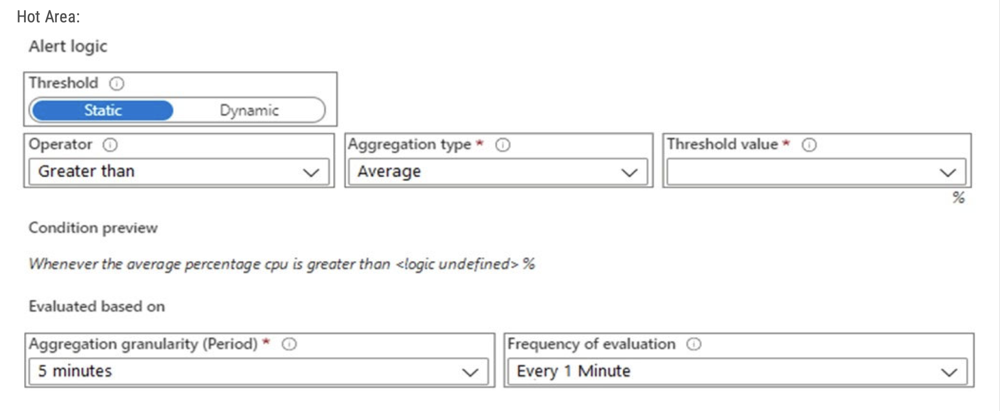


------


To configure the Azure Monitor alert for VM1 based on the technical requirements, you must modify the settings that do not currently match the specified criteria.

**Technical Requirements:**

1.  **Threshold:** Exceeds 80 percent.
2.  **Duration (Period):** 15 minutes.
3.  **Frequency of evaluation:** Once every minute.

Based on the image provided, the two settings you should configure (click on) are:

1.  **Threshold value:** This must be set to **80**. (Currently, the field is empty in the image).
2.  **Aggregation granularity (Period):** This must be changed to **15 minutes**. (Currently, it is set to "5 minutes" in the image).


**Why these settings?**

*   **Threshold value:** The requirement specifically states the alert should trigger when usage exceeds 80 percent.
*   **Aggregation granularity (Period):** This defines the time window used to calculate the average. The requirement specifies "for 15 minutes," so the window must be expanded from the default 5 minutes to 15 minutes.
*   **Frequency of evaluation:** The requirement specifies "once every minute." In the provided image, this is already correctly set to "Every 1 Minute," so it does not require a change.


## Topic 11

### Question #1


Introductory Info

Case Study This is a case study. Case studies are not timed separately. You can use as much exam time as you would like to complete each case. However, there may be additional case studies and sections on this exam. You must manage your time to ensure that you are able to complete all questions included on this exam in the time provided.

To answer the questions included in a case study, you will need to reference information that is provided in the case study. Case studies might contain exhibits and other resources that provide more information about the scenario that is described in the case study. Each question is independent of the other questions in this case study.

At the end of this case study, a review screen will appear. This screen allows you to review your answers and to make changes before you move to the next section of the exam. After you begin a new section, you cannot return to this section.

To start the case study To display the first question in this case study, click the Next button. Use the buttons in the left pane to explore the content of the case study before you answer the questions. Clicking these buttons displays information such as business requirements, existing environment, and problem statements. If the case study has an All Information tab, note that the information displayed is identical to the information displayed on the subsequent tabs. When you are ready to answer a question, click the Question button to return to the question.

Overview Litware, Inc. is an independent software vendor (ISV). Litware has a main o®ce and five branch o®ces.

Existing Environment -

Application Architecture The company's primary application is a single monolithic retirement fund management system based on ASP.NET web forms that use logic written in VB.NET.

Some new sections of the application are written in C#.

Variations of the application are created for individual customers. Currently, there are more than 80 live code branches in the application's code base.

The application was developed by using Microsoft Visual Studio. Source code is stored in Team Foundation Server (TFS) in the main o®ce. The branch o®ces access the source code by using TFS proxy servers.

Architectural Issues Litware focuses on writing new code for customers. No resources are provided to refactor or remove existing code. Changes to the code base take a long time, as dependencies are not obvious to individual developers.

Merge operations of the code often take months and involve many developers. Code merging frequently introduces bugs that are di®cult to locate and resolve.

Customers report that ownership costs of the retirement fund management system increase continually. The need to merge unrelated code makes even minor code changes expensive.

Customers report that bug reporting is overly complex.

Requirements -

Planned Changes Litware plans to develop a new suite of applications for investment planning. The investment planning applications will require only minor integration with the existing retirement fund management system.

The investment planning applications suite will include one multi-tier web application and two iOS mobile applications. One mobile application will be used by employees; the other will be used by customers.

Litware plans to move to a more agile development methodology. Shared code will be extracted into a series of packages.

Litware has started an internal cloud transformation process and plans to use cloud-based services whenever suitable.

Litware wants to become proactive in detecting failures, rather than always waiting for customer bug reports.

Technical Requirements The company's investment planning applications suite must meet the following technical requirements: New incoming connections through the firewall must be minimized.

Members of a group named Developers must be able to install packages.

The principle of least privilege must be used for all permission assignments.

A branching strategy that supports developing new functionality in isolation must be used.

Members of a group named Team Leaders must be able to create new packages and edit the permissions of package feeds.

Visual Studio App Center must be used to centralize the reporting of mobile application crashes and device types in use.

By default, all releases must remain available for 30 days, except for production releases, which must be kept for 60 days.

Code quality and release quality are critical. During release, deployments must not proceed between stages if any active bugs are logged against the release.

The mobile applications must be able to call the share pricing service of the existing retirement fund management system. Until the system is upgraded, the service will only support basic authentication over HTTPS.

The required operating system configuration for the test servers changes weekly. Azure Automation State Configuration must be used to ensure that the operating system on each test server is configured the same way when the servers are created and checked periodically.

Current Technical Issue The test servers are configured correctly when first deployed, but they experience configuration drift over time. Azure Automation State Configuration fails to correct the configurations.

Azure Automation State Configuration nodes are registered by using the following command.


```powershell
Register-AzureRmAutomationDscNode
-ResourceGroupName 'TestResourceGroup'
-AutomationAccountName 'LitwareAutomationAccount'
-AzureVMName $vmname
-ConfigurationMode 'ApplyOnly'
```


**Question**

**HOTSPOT -**
How should you complete the code to initialize App Center in the mobile application? To answer, select the appropriate options in the answer area.
**NOTE:** Each correct selection is worth one point.

**Hot Area:**

**Answer Area**

```swift
MSAppCenter.start
( "{Your App Secret}",
  withServices: [Dropdown 1] [Dropdown 2]
)
```

**Dropdown 1 Options:**

*   `[MSAnalytics.self,`
*   `[MSDistribute.self,`
*   `[MSPush.self,`

**Dropdown 2 Options:**

*   `MSAnalytics.self]`
*   `MSCrashes.self]`
*   `MSDistribute.self]`


-----


✅ Correct Answer

```swift
MSAppCenter.start(
  "{Your App Secret}",
  withServices: [MSAnalytics.self, MSCrashes.self]
)
```

💡 Explanation

The requirement states:

> Use **Visual Studio App Center** to centralize:

* **Crash reporting**
* **Device usage analytics**

🔍 Service Mapping

* **MSAnalytics**
  ✔️ Collects usage data (users, sessions, devices)

* **MSCrashes**
  ✔️ Collects crash reports and diagnostics

 ❌ Why other options are incorrect

* **MSDistribute**
  → Used for app distribution (not required here)

* **MSPush**
  → Used for push notifications (not required)

 🧠 Key Insight

For App Center initialization:

* **Analytics + Crashes** = monitoring + diagnostics (most common combo)


✅ Final Selection

| Dropdown   | Answer               |
| ---------- | -------------------- |
| Dropdown 1 | `[MSAnalytics.self,` |
| Dropdown 2 | `MSCrashes.self]`    |


## Topic 12 - Testlet 3

Introductory Info

Case Study This is a case study. Case studies are not timed separately. You can use as much exam time as you would like to complete each case. However, there may be additional case studies and sections on this exam. You must manage your time to ensure that you are able to complete all questions included on this exam in the time provided.

To answer the questions included in a case study, you will need to reference information that is provided in the case study. Case studies might contain exhibits and other resources that provide more information about the scenario that is described in the case study. Each question is independent of the other questions in this case study.

At the end of this case study, a review screen will appear. This screen allows you to review your answers and to make changes before you move to the next section of the exam. After you begin a new section, you cannot return to this section.

To start the case study To display the first question in this case study, click the Next button. Use the buttons in the left pane to explore the content of the case study before you answer the questions. Clicking these buttons displays information such as business requirements, existing environment, and problem statements. If the case study has an All Information tab, note that the information displayed is identical to the information displayed on the subsequent tabs. When you are ready to answer a question, click the Question button to return to the question.

Overview Contoso, Ltd. is a manufacturing company that has a main o®ce in Chicago.

Existing Environment Contoso plans to improve its IT development and operations processes by implementing Azure DevOps principles. Contoso has an Azure subscription and creates an Azure DevOps organization.

The Azure DevOps organization includes:

The Docker extension A deployment pool named Pool7 that contains 10 Azure virtual machines that run Windows Server 2019 The Azure subscription contains an Azure Automation account.

Requirements -

Planned changes Contoso plans to create projects in Azure DevOps as shown in the following table.

Based on the image provided, here is the extracted table in Markdown format:

| Project name | Project details |
| :--- | :--- |
| Project 1 | Project1 will provide support for incremental builds and third-party SDK components |
| Project 2 | Project2 will use an automatic build policy. A small team of developers named Team2 will work independently on changes to the project. The Team2 members will not have permissions to Project2. |
| Project 3 | Project3 will be integrated with SonarQube |
| Project 4 | Project4 will provide support for a build pipeline that creates a Docker image and pushes the image to the Azure Container Registry. Project4 will use an existing Dockerfile. |
| Project 5 | Project5 will contain a Git repository in Azure Repos and a continuous integration trigger that will initiate a build in response to any change except for changes within /folder1 of the repository. |
| Project 6 | Project6 will provide support for build and deployment pipelines. Deployment will be allowed only if the number of current work items representing active software bugs is 0. |
| Project 7 | Project7 will contain a target deployment group named Group7 that maps to Pool7. Project7 will use Azure Automation State Configuration to maintain the desired state of the computers in Group7. |

Technical requirements Contoso identifies the following technical requirements: Implement build agents for Project1.

Whenever possible, use Azure resources.

Avoid using deprecated technologies.

Implement a code flow strategy for Project2 that will:

- Enable Team2 to submit pull requests for Project2.

- Enable Team2 to work independently on changes to a copy of Project2.

- Ensure that any intermediary changes performed by Team2 on a copy of Project2 will be subject to the same restrictions as the ones defined in the build policy of Project2.

Whenever possible, implement automation and minimize administrative effort.

Implement Project3, Project5, Project6, and Project7 based on the planned changes.

Implement Project4 and configure the project to push Docker images to Azure Container Registry.

Question

You add the virtual machines as managed nodes in Azure Automation State Configuration. You need to configure the managed computers in Pool7.

What should you do next?

A. Modify the RefreshMode property of the Local Configuration Manager (LCM).

B. Run the Register-AzureRmAutomationDscNode Azure Powershell cmdlet.

C. Modify the ConfigurationMode property of the Local Configuration Manager (LCM).

D. Install PowerShell Core.


----


✅ Correct Answer: **C. Modify the ConfigurationMode property of the Local Configuration Manager (LCM).**

💡 Explanation

From the case study:

> Azure Automation State Configuration **fails to correct configuration drift**

And current configuration uses:

```powershell
-ConfigurationMode 'ApplyOnly'
```

🔍 Key Issue

* **ApplyOnly** means:

  * Configuration is applied **once**
  * ❌ Drift is **NOT corrected automatically**

✅ Required Fix

To ensure ongoing compliance, change LCM configuration to:

* **ApplyAndMonitor** → Detect drift only
* **ApplyAndAutoCorrect** → Detect + fix drift automatically ✅ (best choice)

👉 This is done by modifying the **ConfigurationMode** property

❌ Why other options are incorrect

* **A. RefreshMode**

  * Controls where configs come from (Push/Pull)
  * ❌ Not related to drift correction

* **B. Register-AzureRmAutomationDscNode**

  * Already done (nodes are registered)
  * ❌ Not the issue

* **D. Install PowerShell Core**

  * ❌ Not related to DSC behavior

🧠 Key Exam Insight

* **ApplyOnly** → one-time configuration ❌
* **ApplyAndAutoCorrect** → continuous enforcement ✅

 ✅ Final Answer:

**C. Modify the ConfigurationMode property of the Local Configuration Manager (LCM).**


### Question #2

Question

DRAG DROP You need to implement the code flow strategy for Project2 in Azure DevOps.

Which three actions should you perform in sequence? To answer, move the appropriate actions from the list of actions to the answer area and arrange them in the correct order.

Select and Place:


**Actions**

*   Create a fork
*   Create a branch
*   Add a build policy for the fork
*   Add a build policy for the master branch
*   Create a repository
*   Add an application access policy.

**Answer Area**

*(This area is empty in the image)*

------

✅ Correct Sequence

1. **Create a fork**
2. **Add a build policy for the master branch**
3. **Create a branch**

💡 Explanation

The requirements for **Project2** are key:

* Team2 **cannot access the main project directly**
* They must **work independently on a copy**
* Their changes must still follow **the same build policies**
* They must submit **pull requests**

🔍 Step-by-step reasoning

**1. Create a fork** ✅

* Since Team2 **has no permissions to Project2**, they need:

  * Their **own copy of the repository**
* Forking allows:

  * Independent work
  * PRs back to the original repo

 **2. Add a build policy for the master branch** ✅

* Build policies must be enforced on:

  * The **target branch (main/master)**
* Ensures:

  * All PRs (including from forks) must pass validation
  * Same restrictions apply to Team2

**3. Create a branch** ✅

* Developers in Team2:

  * Work on feature branches inside the fork
  * Submit PRs from branch → upstream repo

❌ Why other options are incorrect

* **Add a build policy for the fork**

  * ❌ Policies must be on the **target repo**, not fork

* **Create a repository**

  * ❌ Fork already provides the repo

* **Add an application access policy**

  * ❌ Not related to Git workflow

🧠 Key Exam Insight

* **Fork = isolation for external team**
* **Branch policy on main = enforcement point**
* **Feature branches = development workflow**

✅ Final Answer (in order)

1. Create a fork
2. Add a build policy for the master branch
3. Create a branch


### Question #3

Question

DRAG DROP You need to configure Azure Automation for the computers in Pool7.

Which three actions should you perform in sequence? To answer, move the appropriate actions from the list of actions to the answer area and arrange them in the correct order.

Select and Place:

**Actions**

*   Run the `Import-AzureRmAutomationDscConfiguration` Azure PowerShell cmdlet.
*   Create a Desired State Configuration (DSC) configuration file that has an extension of `.ps1`.
*   Run the `New-AzureRmResourceGroupDeployment` Azure PowerShell cmdlet.
*   Run the `Start-AzureRmAutomationDscCompilationJob` Azure PowerShell cmdlet.
*   Create an Azure Resource Manager template file that has an extension of `.json`.

**Answer Area**

*(This area is empty in the image and intended for dragging and dropping the actions into the correct sequence.)*

-------

To configure Azure Automation State Configuration (DSC) for the computers in Pool7, you must follow the standard workflow of authoring, uploading, and compiling the configuration so that it can be applied to the nodes.

The three actions you should perform in sequence are:

1.  **Create a Desired State Configuration (DSC) configuration file that has an extension of `.ps1`.**
2.  **Run the `Import-AzureRmAutomationDscConfiguration` Azure PowerShell cmdlet.**
3.  **Run the `Start-AzureRmAutomationDscCompilationJob` Azure PowerShell cmdlet.**

**Rationale:**

*   **Step 1 (Authoring):** You must first write the PowerShell DSC script that defines the "desired state" (e.g., specific software installed, security settings) for the virtual machines in Pool7.
*   **Step 2 (Importing):** Once the script is created, you use the `Import-AzureRmAutomationDscConfiguration` cmdlet to upload that script into your Azure Automation account. At this stage, it is simply a stored script.
*   **Step 3 (Compiling):** Azure Automation cannot apply a `.ps1` script directly to a VM. You must run a compilation job using `Start-AzureRmAutomationDscCompilationJob`. This converts your script into a "Node Configuration" (a MOF file) that the virtual machines can actually download and implement.

**Note:** While you could use an ARM template (`.json`) to automate the *registration* of the VMs to the Automation account, the specific configuration of the Automation service itself requires the Author -> Import -> Compile sequence.

## Topic 13 - Testlet 4


### Question #1


Introductory Info

Case Study This is a case study. Case studies are not timed separately. You can use as much exam time as you would like to complete each case. However, there may be additional case studies and sections on this exam. You must manage your time to ensure that you are able to complete all questions included on this exam in the time provided.

To answer the questions included in a case study, you will need to reference information that is provided in the case study. Case studies might contain exhibits and other resources that provide more information about the scenario that is described in the case study. Each question is independent of the other questions in this case study.

At the end of this case study, a review screen will appear. This screen allows you to review your answers and to make changes before you move to the next section of the exam. After you begin a new section, you cannot return to this section.

To start the case study To display the first question in this case study, click the Next button. Use the buttons in the left pane to explore the content of the case study before you answer the questions. Clicking these buttons displays information such as business requirements, existing environment, and problem statements. If the case study has an All Information tab, note that the information displayed is identical to the information displayed on the subsequent tabs. When you are ready to answer a question, click the Question button to return to the question.

Overview Litware, Inc. is an independent software vendor (ISV). Litware has a main o®ce and five branch o®ces.

Existing Environment -

Application Architecture The company's primary application is a single monolithic retirement fund management system based on ASP.NET web forms that use logic written in VB.NET.

Some new sections of the application are written in C#.

Variations of the application are created for individual customers. Currently, there are more than 80 live code branches in the application's code base.

The application was developed by using Microsoft Visual Studio. Source code is stored in Team Foundation Server (TFS) in the main o®ce. The branch o®ces access the source code by using TFS proxy servers.

Architectural Issues Litware focuses on writing new code for customers. No resources are provided to refactor or remove existing code. Changes to the code base take a long time, as dependencies are not obvious to individual developers.

Merge operations of the code often take months and involve many developers. Code merging frequently introduces bugs that are di®cult to locate and resolve.

Customers report that ownership costs of the retirement fund management system increase continually. The need to merge unrelated code makes even minor code changes expensive.

Customers report that bug reporting is overly complex.

Requirements -

Planned Changes Litware plans to develop a new suite of applications for investment planning. The investment planning applications will require only minor integration with the existing retirement fund management system.

The investment planning applications suite will include one multi-tier web application and two iOS mobile applications. One mobile application will be used by employees; the other will be used by customers.

Litware plans to move to a more agile development methodology. Shared code will be extracted into a series of packages.

Litware has started an internal cloud transformation process and plans to use cloud-based services whenever suitable.

Litware wants to become proactive in detecting failures, rather than always waiting for customer bug reports.

Technical Requirements The company's investment planning applications suite must meet the following technical requirements: New incoming connections through the firewall must be minimized.

Members of a group named Developers must be able to install packages.

The principle of least privilege must be used for all permission assignments.

A branching strategy that supports developing new functionality in isolation must be used.

Members of a group named Team Leaders must be able to create new packages and edit the permissions of package feeds.

Visual Studio App Center must be used to centralize the reporting of mobile application crashes and device types in use.

By default, all releases must remain available for 30 days, except for production releases, which must be kept for 60 days.

Code quality and release quality are critical. During release, deployments must not proceed between stages if any active bugs are logged against the release.

The mobile applications must be able to call the share pricing service of the existing retirement fund management system. Until the system is upgraded, the service will only support basic authentication over HTTPS.

The required operating system configuration for the test servers changes weekly. Azure Automation State Configuration must be used to ensure that the operating system on each test server is configured the same way when the servers are created and checked periodically.

Current Technical Issue The test servers are configured correctly when first deployed, but they experience configuration drift over time. Azure Automation State Configuration fails to correct the configurations.

Azure Automation State Configuration nodes are registered by using the following command.

```powershell
Register-AzureRmAutomationDscNode
-ResourceGroupName 'TestResourceGroup'
-AutomationAccountName 'LitwareAutomationAccount'
-AzureVMName $vmname
-ConfigurationMode 'ApplyOnly'
```


Question

HOTSPOT How should you configure the release retention policy for the investment planning depletions suite? To answer, select the appropriate options in the answer area.

NOTE: Each correct selection is worth one point.

Hot Area:

Based on the image provided, here is the extracted content in Markdown format:

**Answer Area**

**Required secrets:**

*   Certificate
*   Personal access token
*   Shared Access Authorization token
*   Username and password

**Storage location:**

*   Azure Data Lake
*   Azure Key Vault
*   Azure Storage with HTTPS access
*   Azure Storage with HTTP access


-----

**Box 1: Shared Access Authorization token** 


Every request made against a storage service must be authorized, unless the request is for a blob or container resource that has been

made available for public or signed access. One option for authorizing a request is by using Shared Key.

**Box 2: Azure Storage with HTTPS access** 

Scenario: The mobile applications must be able to call the share pricing service of the existing retirement fund management system. Until the system is upgraded, the service will only support basic authentication over HTTPS.

The investment planning application suite will include one multi-tier web application and two iOS mobile application. One mobile application will be used by employees; the other will be used by customers.


### Question #3

Question

DRAG DROP Which package feed access levels should be assigned to the Developers and Team Leaders groups for the investment planning applications suite? To answer, drag the appropriate access levels to the correct groups. Each access level may be used once, more than once, or not at all. You may need to drag the split bar between panes or scroll to view content.

NOTE: Each correct selection is worth one point.


Based on the image provided, here is the extracted content in Markdown format:

**Access Levels**

*   Collaborator
*   Contributor
*   Owner
*   Reader

**Answer Area**

*   **Developers:** [ ]
*   **Team Leaders:** [ ]

----


✅ Correct Answer

* **Developers:** **Contributor**
* **Team Leaders:** **Owner**

💡 Explanation

This question is about **Azure Artifacts feed permissions**.

🔹 Developers → Contributor

* Developers must be able to:

  * Install packages
  * Use packages in builds/apps

👉 **Contributor role allows:**

* Install and consume packages
* Publish packages (if allowed by feed settings)
* Does NOT allow managing permissions

✔ Matches requirement: *“Developers must be able to install packages”*

🔹 Team Leaders → Owner

* Team Leaders must be able to:

  * Create new packages
  * Edit feed permissions

👉 **Owner role allows:**

* Full control of the feed
* Manage permissions (add/remove users/groups)
* Manage packages and feed settings

✔ Matches requirement: *“edit the permissions of package feeds”*

❌ Why others are incorrect

* **Reader**

  * Can only consume packages
  * Too limited for Developers requirement

* **Collaborator**

  * Legacy / limited role
  * Not sufficient for required permissions

🧠 Key Exam Insight

| Role        | Purpose                               |
| ----------- | ------------------------------------- |
| Reader      | View/download only                    |
| Contributor | Install + publish packages            |
| Owner       | Full control + permissions management |

✅ Final Answer

* Developers → **Contributor**
* Team Leaders → **Owner**

Box 2: Owner Members of a group named Team Leaders must be able to create new packages and edit the permissions of package feeds.


### Question #4


To resolve the current technical issue, what should you do to the Register-AzureRmAutomationDscNode command?

A. Change the value of the ConfigurationMode parameter.

B. Replace the Register-AzureRmAutomationDscNode cmdlet with Register-AzureRmAutomationScheduledRunbook

C. Add the AllowModuleOverwrite parameter.

D. Add the DefaultProfile parameter.

-----


The correct answer is:

**A. Change the value of the ConfigurationMode parameter.**

Explanation

Currently the nodes are registered with:

```powershell
-ConfigurationMode 'ApplyOnly'
```

This mode:

* Applies the configuration **only once**
* Does **NOT** monitor or correct configuration drift

What is required?

The scenario states:

> Servers experience configuration drift and Azure Automation State Configuration fails to correct it.

To fix this, you must use a mode that **continuously enforces the desired state**.

Correct ConfigurationMode options:

* **ApplyAndMonitor** → detects drift but does NOT fix it
* **ApplyAndAutoCorrect** → detects AND automatically fixes drift ✅

Therefore:

You should change:

```powershell
-ConfigurationMode 'ApplyOnly'
```

to:

```powershell
-ConfigurationMode 'ApplyAndAutoCorrect'
```

Final Answer:

✅ **A. Change the value of the ConfigurationMode parameter**


### Question 5

Which branching strategy should you recommend for the investment planning applications suite?

A. release isolation

B. main only

C. development isolation

D. feature isolation

----


The correct answer is:

**D. feature isolation**

✅ Why feature isolation?

The requirement clearly states:

> “A branching strategy that supports developing new functionality in isolation must be used.”

**Feature isolation branching** means:

* Each new feature is developed in its **own branch**
* Developers work independently without impacting others
* Changes are merged back via **pull requests**
* Supports modern Agile + CI/CD practices

❌ Why not the others?

* **A. release isolation**
  → Focuses on stabilizing releases, not developing features independently

* **B. main only**
  → No isolation at all; everyone works on the same branch (high risk)

* **C. development isolation**
  → Not a standard or well-defined branching strategy

💡 Key takeaway (exam tip)

When you see:

* “develop independently”
* “isolation”
* “pull requests”

👉 Think **feature branches**

Final Answer:

✅ **D. feature isolation**


### Question 6

What should you use to implement the code quality restriction on the release pipeline for the investment planning applications suite?

A. a pre-deployment approval

B. a deployment gate

C. a post-deployment approval

D. a trigger


----


The correct answer is:

**B. a deployment gate**

✅ Why deployment gate?

The requirement states:

> “Deployments must not proceed between stages if any active bugs are logged against the release.”

This means:

* You need an **automated check**
* It must run **before moving to the next stage**
* It must evaluate **external data (work items / bugs)**

👉 In Azure DevOps, this is exactly what a **deployment gate** does.

A **deployment gate** can:

* Query work items (e.g., active bugs)
* Block the pipeline automatically
* Enforce quality before stage progression

❌ Why not the others?

* **A. Pre-deployment approval**
  → Manual approval, not automated or data-driven

* **C. Post-deployment approval**
  → Happens *after* deployment (too late)

* **D. Trigger**
  → Starts pipelines, doesn’t enforce quality conditions

💡 Key exam tip

If you see:

* “Do not proceed unless condition is met”
* “Check bugs / metrics / external system”

👉 Think **Deployment Gates**

Final Answer:

✅ **B. a deployment gate**

### Question 7

HOTSPOT How should you configure the release retention policy for the investment planning applications suite? To answer, select the appropriate options in the answer area.

NOTE: Each correct selection is worth one point.


Based on the image provided, here is the extracted content in Markdown format:

**Answer Area**

**Global release:**

*   Set the default retention policy to 30 days.
*   Set the maximum retention policy to 30 days.
*   Set the stage retention policy to 30 days.
*   Set the stage retention policy to 60 days.

**Production stage:**

*   Set the default retention policy to 30 days.
*   Set the maximum retention policy to 60 days.
*   Set the stage retention policy to 30 days.
*   Set the stage retention policy to 60 days.

----


✅ Correct Configuration

**Global release:**
👉 **Set the default retention policy to 30 days.**

**Production stage:**
👉 **Set the stage retention policy to 60 days.**

💡 Explanation

The requirement clearly states:

* **All releases → keep for 30 days**
* **Production releases → keep for 60 days**

🔍 How Azure DevOps retention works

* **Global (pipeline-level)** retention = default for all stages
* **Stage-level retention** = override for specific stages (like Production)

🎯 Mapping requirement → configuration

| Requirement                | Configuration                                        |
| -------------------------- | ---------------------------------------------------- |
| Default releases = 30 days | ✅ Set **default retention policy to 30 days**        |
| Production = 60 days       | ✅ Override with **stage retention policy = 60 days** |

❌ Why others are wrong

* **Maximum retention** → not required here
* **Stage retention (global)** → not needed for all stages
* **Production default = 30** → contradicts requirement

✅ Final Answer

* **Global release:** Set the default retention policy to **30 days**
* **Production stage:** Set the stage retention policy to **60 days**


### Question 8

Question

HOTSPOT Where should the build and release agents for the investment planning applications suite run? To answer, select the appropriate options in the answer area.

NOTE: Each correct selection is worth one point.

Hot Area:

Based on the image provided, here is the extracted content in Markdown format:

**Answer Area**

**Build agent:**

*   A hosted service
*   A source control system
*   The developers' computers

**Release agent:**

*   A hosted service
*   A source control system
*   The developers' computers


-----


✅ Correct Answers with Explanation

**1. Fix Azure Automation State Configuration drift issue**

**Answer: A. Change the value of the ConfigurationMode parameter**

* Current setting: `ApplyOnly` → applies configuration once and **does NOT fix drift**
* Required: continuous enforcement

✔ Change to:

* `ApplyAndMonitor` (detect drift) OR
* `ApplyAndAutoCorrect` (detect + fix drift automatically)

👉 Best choice: **ApplyAndAutoCorrect**

**2. Code quality restriction in release pipeline**

**Answer: B. a deployment gate**

* Requirement: *“deployment must not proceed if active bugs exist”*
* Deployment gates can:

  * Query work items
  * Block pipeline automatically

✔ This is exactly what **gates** are designed for

**3. Release retention policy**

Requirement:

* Default: **30 days**
* Production: **60 days**

**Correct configuration:**

**Global release:**

* ✅ Set the default retention policy to **30 days**

**Production stage:**

* ✅ Set the stage retention policy to **60 days**

**4. Build and Release agents location**

Requirement:

* Use cloud when possible
* Minimize management overhead

**Correct answers:**

**Build agent:**

* ✅ **A hosted service**

**Release agent:**

* ✅ **A hosted service**

💡 Final Summary

| Requirement            | Answer                   |
| ---------------------- | ------------------------ |
| Fix DSC drift          | Change ConfigurationMode |
| Code quality gate      | Deployment gate          |
| Retention (default)    | 30 days                  |
| Retention (production) | 60 days                  |
| Build agent            | Hosted                   |
| Release agent          | Hosted                   |


## Topic 14 - Testlet 5


Introductory Info

This is a case study. Case studies are not timed separately. You can use as much exam time as you would like to complete each case. However, there may be additional case studies and sections on this exam. You must manage your time to ensure that you are able to complete all questions included on this exam in the time provided.

To answer the questions included in a case study, you will need to reference information that is provided in the case study. Case studies might contain exhibits and other resources that provide more information about the scenario that is described in the case study. Each question is independent of the other questions in this case study.

At the end of this case study, a review screen will appear. This screen allows you to review your answers and to make changes before you move to the next section of the exam. After you begin a new section, you cannot return to this section.

To start the case study To display the first question in this case study, click the Next button. Use the buttons in the left pane to explore the content of the case study before you answer the questions. Clicking these buttons displays information such as business requirements, existing environment, and problem statements. If the case study has an All Information tab, note that the information displayed is identical to the information displayed on the subsequent tabs. When you are ready to answer a question, click the Question button to return to the question.

Overview -

General Overview Woodgrove Bank is a financial services company that has a main o®ce in the United Kingdom. Technical Requirements and Planned Changes

Planned Changes Woodgrove Bank plans to implement the following project management changes: Implement Azure DevOps for project tracking.

Centralize source code control in private GitHub repositories.

Implement Azure Pipelines for build pipelines and release pipelines.

Woodgrove Bank plans to implement the following changes to the identity environment: Deploy an Azure AD tenant named woodgrovebank.com.

Sync the Active Directory domain to Azure AD.

Configure App1 to use a service principal.

Integrate GitHub with Azure AD.

Woodgrove Bank plans to implement the following changes to the core apps:

Migrate App1 to ASP.NET Core.

Integrate Azure Pipelines and the third-party build tool used to develop App2.

Woodgrove Bank plans to implement the following changes to the DevOps environment: Deploy App1 to Azure App Service.

Implement source control for the DB1 schema.

Migrate all the source code from TFS1 to GitHub.

Deploy App2 to an Azure virtual machine named VM1.

Merge the POC branch into the GitHub default branch.

Implement an Azure DevOps dashboard for stakeholders to monitor development progress.

Technical Requirements Woodgrove Bank identifies the following technical requirements:

The initial databases for new environments must contain both schema and reference data. An Azure Monitor alert for VM1 must be configured to meet the following requirements:

- Be triggered when average CPU usage exceeds 80 percent for 15 minutes.

- Calculate CPU usage averages once every minute.

The commit history of the POC branch must replace the history of the default branch. The Azure DevOps dashboard must display the metrics shown in the following table.


| Number | Required data |
| :--- | :--- |
| 1 | A comparison between the work the development team planned to deliver and what was delivered |
| 2 | The status of the environments in a release definition |
| 3 | The total number of results from a work item query |

Access to Azure DevOps must be restricted to specific IP addresses. Page load times for App1 must be captured and monitored. 

Administrative effort must be minimized.

### Question 1

You need to meet the technical requirements for controlling access to Azure DevOps. What should you use?

A. Azure Multi-Factor Authentication (MFA)

B. on-premises firewall rules

C. conditional access policies in Azure AD

D. Azure role-based access control (Azure RBAC)

-----

✅ Correct Answer: **C. conditional access policies in Azure AD**

💡 Explanation

The requirement is:

> **Restrict access to Azure DevOps to specific IP addresses**

🔍 Why Conditional Access is correct

**Conditional Access (in Azure AD)** allows you to:

* Restrict access based on:

  * IP address ranges ✅
  * Location
  * Device compliance
* Apply policies to:

  * Azure DevOps (as an Azure AD–integrated app)

👉 This is the **standard and recommended approach** for access control


❌ Why other options are incorrect

**A. Azure Multi-Factor Authentication (MFA)**

* Adds extra authentication step
* ❌ Does NOT restrict by IP

**B. On-premises firewall rules**

* Azure DevOps is a **cloud service**
* ❌ Firewall cannot control SaaS access globally

**D. Azure RBAC**

* Controls permissions **inside Azure resources**
* ❌ Does NOT restrict access by IP

🧠 Key Exam Insight

* **IP restriction for SaaS apps (Azure DevOps, GitHub, etc.) → Conditional Access**
* MFA ≠ access restriction
* RBAC = authorization, not access filtering


✅ Final Answer:

**C. conditional access policies in Azure AD**

### Question #2


Question

You need to configure Azure Pipelines to control App2 builds. Which authentication method should you use?

A. Windows NTLM

B. certificate

C. SAML

D. personal access token (PAT)

-----

✅ Correct Answer: **D. personal access token (PAT)**

💡 Explanation

You need to:

> **Integrate Azure Pipelines with a third-party build tool for App2**

🔍 Why PAT is correct

A **Personal Access Token (PAT)** is used to:

* Authenticate Azure DevOps with:

  * External tools
  * Scripts
  * APIs
* Provide **secure, scoped access**
* Minimize administrative effort (as required)

👉 PAT is the **standard method for Azure Pipelines integration with external systems**

❌ Why other options are incorrect


**A. Windows NTLM**

* Used for on-prem authentication
* ❌ Not suitable for cloud / cross-platform integration

**B. Certificate**

* Used for service principals / app-to-app auth
* ❌ Overkill and not typical for Azure DevOps pipeline integrations

**C. SAML**

* Used for **user authentication (SSO)**
* ❌ Not used for pipeline/tool authentication

🧠 Key Exam Insight

* **PAT = best choice for Azure DevOps + external tool integration**
* Service principals → Azure resources
* SAML → user login
* NTLM → legacy/on-prem

✅ Final Answer:

**D. personal access token (PAT)**


### Question #3


You need to configure authentication for App1. The solution must support the planned changes.

Which three actions should you perform in sequence? To answer, move all actions from the list of actions to the answer area and arrange them in the correct order.

Select and Place:

**Actions Commands Cmdlets Statements**

*   Create an app.
*   Add a secret.
*   Create a credential.
*   Configure the ID and secret for App1.
*   Create a managed service identity.

**Answer Area**

*(Empty)*

----

✅ Correct Sequence

1. **Create an app.**
2. **Add a secret.**
3. **Configure the ID and secret for App1.**

💡 Explanation

The requirement states:

> **Configure App1 to use a service principal**

🔍 Correct flow for Service Principal authentication

**1. Create an app** ✅

* Register an application in **Azure AD**
* This creates:

  * Application (client) ID
  * Service principal identity

**2. Add a secret** ✅

* Generate a **client secret**
* Used for authentication by the app

**3. Configure the ID and secret for App1** ✅

* Update App1 configuration with:

  * Client ID
  * Client secret
* Enables authentication to Azure services

❌ Why other options are incorrect

* **Create a credential**

  * Not a standard Azure AD step in this context

* **Create a managed service identity**

  * Used when app runs in Azure (e.g., App Service)
  * ❌ Requirement explicitly says **service principal**

🧠 Key Exam Insight

* **Service Principal flow = App registration → Secret → Configure app**
* **Managed Identity ≠ Service Principal (exam trick)**

✅ Final Answer (in order)

1. Create an app
2. Add a secret
3. Configure the ID and secret for App1


### Question #4

Question

DRAG DROP You are configuring the Azure DevOps dashboard. The solution must meet the technical requirements.

Which widget should you use for each metric? To answer, drag the appropriate widgets to the correct metrics. Each widget may be used once, more than once, or not at all. You may need to drag the split bar between panes or scroll to view content.

NOTE: Each correct selection is worth one point.


Based on the image provided, here is the extracted content in Markdown format:

**Widgets**

*   Velocity
*   Query tile
*   Query results
*   Sprint burndown
*   Cumulative flow diagram
*   Release pipeline overview

**Metrics**

*   **1:** [Empty Slot]
*   **2:** [Empty Slot]
*   **3:** [Empty Slot]

----


To meet the technical requirements for the Woodgrove Bank dashboard, you should use the following widgets for each metric:

*   **1 (Planned vs. Delivered): Velocity**
*   **2 (Status of environments): Release pipeline overview**
*   **3 (Total number of results from a query): Query tile**

 **Explanation:**

1.  **Velocity (Metric 1):** The Velocity widget specifically tracks the work a team completes over multiple sprints. It provides a visual comparison between the amount of work **planned** (the items committed at the start of the sprint) and the work actually **delivered** (the items completed).
2.  **Release pipeline overview (Metric 2):** This widget displays the status of a release pipeline across multiple **environments** (such as Dev, QA, and Production). It allows stakeholders to see at a glance which version of the software is deployed in each environment and whether those deployments were successful.
3.  **Query tile (Metric 3):** When you need to display a specific **total number** (count) of work items resulting from a saved query, the Query tile is the correct tool. While the "Query results" widget shows the list of items, the "Query tile" shows the single summary metric requested.


### Question 5

You plan to deploy a new database environment. The solution must meet the technical requirements. You need to prepare the database for the deployment.

How should you format the export?

A. NDF

B. BACPAC

C. DACPAC

D. MDF

----

✅ Correct Answer: **B. BACPAC**

💡 Why BACPAC is correct

The requirement says:

> “The initial databases for new environments must contain both schema and reference data.”

A **BACPAC file** includes:

* ✅ Database schema
* ✅ Data (including reference/master data)

It is designed for:

* Moving databases to Azure SQL
* Creating new environments with **schema + data**

❌ Why other options are wrong

* **A. NDF**

  * Secondary data file in SQL Server
  * Not used for export/migration

* **C. DACPAC**

  * Schema only ❌ (NO data included)

* **D. MDF**

  * Physical database file
  * Not used for deployment export format in this context

🎯 Exam Tip

| Format  | Includes Data? | Use Case                 |
| ------- | -------------- | ------------------------ |
| DACPAC  | ❌ No           | Schema deployments       |
| BACPAC  | ✅ Yes          | Schema + data migration  |
| MDF/NDF | ❌ No           | SQL Server storage files |

🟢 Final Answer:

**B. BACPAC**


### Question 6

You need to meet the technical requirements for monitoring App1. What should you use?

A. Splunk

B. Azure Application Insights

C. Azure Advisor

D. App Service logs


---------

✅ Correct Answer: **B. Azure Application Insights**

💡 Why Application Insights is correct

The requirement says:

> “Page load times for App1 must be captured and monitored.”

This is a **classic Application Performance Management (APM)** requirement.

👉 **Azure Application Insights** provides:

* Page load time tracking (browser telemetry)
* Request performance monitoring
* Dependency tracking
* End-to-end application diagnostics
* User experience metrics

Since App1 is deployed to **Azure App Service**, Application Insights integrates directly and is the **standard solution**.

❌ Why the others are wrong

* **A. Splunk**

  * External tool
  * Requires additional integration and overhead (not “minimize administrative effort”)

* **C. Azure Advisor**

  * Only gives recommendations (cost, security, reliability)
  * Does NOT monitor application performance

* **D. App Service logs**

  * Provides raw logs only
  * No built-in page load time / user experience analytics

🎯 Exam Tip

If you see:

* “page load time”
* “user experience”
* “application performance”
* “web app monitoring”

👉 Think **Application Insights**

🟢 Final Answer:

**B. Azure Application Insights**


## Topic 15 - Testlet 6

### Question #1

Introductory Info

This is a case study. Case studies are not timed separately. You can use as much exam time as you would like to complete each case. However, there may be additional case studies and sections on this exam. You must manage your time to ensure that you are able to complete all questions included on this exam in the time provided.

To answer the questions included in a case study, you will need to reference information that is provided in the case study. Case studies might contain exhibits and other resources that provide more information about the scenario that is described in the case study. Each question is independent of the other questions in this case study.

At the end of this case study, a review screen will appear. This screen allows you to review your answers and to make changes before you move to the next section of the exam. After you begin a new section, you cannot return to this section.

To start the case study To display the first question in this case study, click the Next button. Use the buttons in the left pane to explore the content of the case study before you answer the questions. Clicking these buttons displays information such as business requirements, existing environment, and problem statements. If the case study has an All Information tab, note that the information displayed is identical to the information displayed on the subsequent tabs. When you are ready to answer a question, click the Question button to return to the question.

Overview -

General Overview Woodgrove Bank is a financial services company that has a main o®ce in the United Kingdom. Technical Requirements and Planned Changes

Planned Changes Woodgrove Bank plans to implement the following project management changes: Implement Azure DevOps for project tracking.

Centralize source code control in private GitHub repositories.

Implement Azure Pipelines for build pipelines and release pipelines.

Woodgrove Bank plans to implement the following changes to the identity environment: Deploy an Azure AD tenant named woodgrovebank.com.

Sync the Active Directory domain to Azure AD.

Configure App1 to use a service principal.

Integrate GitHub with Azure AD.

Woodgrove Bank plans to implement the following changes to the core apps:

Migrate App1 to ASP.NET Core.

Integrate Azure Pipelines and the third-party build tool used to develop App2.

Woodgrove Bank plans to implement the following changes to the DevOps environment: Deploy App1 to Azure App Service.

Implement source control for the DB1 schema.

Migrate all the source code from TFS1 to GitHub.

Deploy App2 to an Azure virtual machine named VM1.

Merge the POC branch into the GitHub default branch.

Implement an Azure DevOps dashboard for stakeholders to monitor development progress.

Technical Requirements Woodgrove Bank identifies the following technical requirements:

The initial databases for new environments must contain both schema and reference data. An Azure Monitor alert for VM1 must be configured to meet the following requirements:

- Be triggered when average CPU usage exceeds 80 percent for 15 minutes.

- Calculate CPU usage averages once every minute.

The commit history of the POC branch must replace the history of the default branch. The Azure DevOps dashboard must display the metrics shown in the following table.


| Number | Required data |
| :--- | :--- |
| 1 | A comparison between the work the development team planned to deliver and what was delivered |
| 2 | The status of the environments in a release definition |
| 3 | The total number of results from a work item query |


Access to Azure DevOps must be restricted to specific IP addresses. Page load times for App1 must be captured and monitored. Administrative effort must be minimized.

Question

DRAG DROP You need to replace the existing DevOps tools to support the planned changes.

What should you use? To answer, drag the appropriate tools to the correct targets. Each tool may be used once, more than once, or not at all. You may need to drag the split bar between panes or scroll to view content.

NOTE: Each correct selection is worth one point.

**Tools**

*   Azure Boards
*   Azure Artifacts
*   GitHub Actions
*   Azure Pipelines
*   Azure Test Plans
*   GitHub repositories

**Answer Area**

*   **Trello:** [Tool]
*   **Bamboo:** [Tool]
*   **BitBucket:** [Tool]

-----


✅ Correct Answer

* **Trello:** **Azure Boards**
* **Bamboo:** **Azure Pipelines**
* **BitBucket:** **GitHub repositories**

💡 Explanation

The goal is to **replace existing DevOps tools** with Azure DevOps + GitHub equivalents based on the planned changes.

🔹 Trello → Azure Boards ✅

* Trello = **project tracking / work management**
* Azure Boards provides:

  * Work items
  * Backlogs
  * Kanban boards

✔ Matches requirement:

> “Implement Azure DevOps for project tracking”

🔹 Bamboo → Azure Pipelines ✅

* Bamboo = **CI/CD tool**
* Azure Pipelines provides:

  * Build pipelines
  * Release pipelines
  * Integration with GitHub

✔ Matches requirement:

> “Implement Azure Pipelines for build and release pipelines”


🔹 BitBucket → GitHub repositories ✅

* Bitbucket = **source control (Git)**
* Requirement:

  > “Centralize source code control in private GitHub repositories”

✔ Direct replacement = GitHub repos

❌ Why others are incorrect

* **Azure Artifacts**

  * Package management, not source control or CI/CD

* **GitHub Actions**

  * CI/CD alternative, but requirement explicitly states **Azure Pipelines**

* **Azure Test Plans**

  * Testing tool, not replacing listed systems

 
 🧠 Key Exam Insight

| Old Tool  | Replacement         |
| --------- | ------------------- |
| Trello    | Azure Boards        |
| Bamboo    | Azure Pipelines     |
| Bitbucket | GitHub repositories |


✅ Final Answer

* Trello → **Azure Boards**
* Bamboo → **Azure Pipelines**
* BitBucket → **GitHub repositories**

### Question #2

Question

You need to the merge the POC branch into the default branch. The solution must meet the technical requirements. Which command should you run?

A. git rebase

B. git merge --squash

C. git push

D. git merge --allow-unrelated-histories


----

✅ Correct Answer: **A. git rebase**


💡 Key Requirement

> **“The commit history of the POC branch must replace the history of the default branch.”**

🔍 Why `git rebase` is correct

* `git rebase`:

  * Rewrites commit history
  * Allows one branch’s commits to be **reapplied on top of another**
* This enables:

  * The **POC branch history to effectively replace the default branch history**

👉 This matches the requirement to **preserve and prioritize POC history**

❌ Why other options are incorrect

**B. git merge --squash**

* Combines all commits into **one single commit**
* ❌ Loses commit history → violates requirement

**C. git push**

* Only pushes changes
* ❌ Does not control merge or history behavior

**D. git merge --allow-unrelated-histories**

* Used when histories are unrelated
* ❌ Not relevant to replacing history

🧠 Key Exam Insight

* **Rebase = rewrite history (important for replacing history)**
* **Merge = preserves both histories**
* **Squash = destroys history granularity**

✅ Final Answer:

**A. git rebase**


### Question #2

Question

You need to perform the GitHub code migration. The solution must support the planned changes for the DevOps environment. What should you use?

A. git clone

B. GitHub Importer

C. Import repository in Azure Repos

D. git-tfs


---


The correct answer is **B. GitHub Importer.**

**Explanation:**

To migrate source code from **TFS1 to GitHub** while minimizing administrative effort, **GitHub Importer** is the best choice.

*   **GitHub Importer:** This is a built-in, web-based tool provided by GitHub specifically designed to import repositories from other version control systems, including Team Foundation Server (TFS), Subversion, and Mercurial. It automates the process of preserving commit history and moving the code to your new GitHub repository.
*   **Minimal Administrative Effort:** Because it is a hosted service, you don't need to install local tools or run complex command-line sequences. You simply provide the source URL and credentials.

**Why the other options are incorrect:**

*   **A. git clone:** This only works if the source is already a Git repository. It is a manual process that doesn't handle the migration of non-Git history (like TFVC) or metadata as seamlessly as a specialized importer.
*   **C. Import repository in Azure Repos:** This tool is used to move code *into* Azure DevOps, but the requirement is to migrate the code *to GitHub*.
*   **D. git-tfs:** While this is a powerful tool for converting Team Foundation Version Control (TFVC) to Git, it is a command-line tool that requires manual installation and execution on a local machine. It would involve more administrative effort than the web-based GitHub Importer.


## Topic 17 - Testlet 8

### Question #1

Introductory Info

Case Study This is a case study. Case studies are not timed separately. You can use as much exam time as you would like to complete each case. However, there may be additional case studies and sections on this exam. You must manage your time to ensure that you are able to complete all questions included on this exam in the time provided.

To answer the questions included in a case study, you will need to reference information that is provided in the case study. Case studies might contain exhibits and other resources that provide more information about the scenario that is described in the case study. Each question is independent of the other questions in this case study.

At the end of this case study, a review screen will appear. This screen allows you to review your answers and to make changes before you move to the next section of the exam. After you begin a new section, you cannot return to this section.

To start the case study To display the first question in this case study, click the Next button. Use the buttons in the left pane to explore the content of the case study before you answer the questions. Clicking these buttons displays information such as business requirements, existing environment, and problem statements. If the case study has an All Information tab, note that the information displayed is identical to the information displayed on the subsequent tabs. When you are ready to answer a question, click the Question button to return to the question.

Overview Contoso, Ltd. is a manufacturing company that has a main o®ce in Chicago.

Existing Environment Contoso plans to improve its IT development and operations processes by implementing Azure DevOps principles. Contoso has an Azure subscription and creates an Azure DevOps organization.

The Azure DevOps organization includes:

The Docker extension A deployment pool named Pool7 that contains 10 Azure virtual machines that run Windows Server 2019 The Azure subscription contains an Azure Automation account.

Requirements -

Planned changes Contoso plans to create projects in Azure DevOps as shown in the following table.


| Project name | Project details |
| :--- | :--- |
| Project 1 | Project1 will provide support for incremental builds and third-party SDK components |
| Project 2 | Project2 will use an automatic build policy. A small team of developers named Team2 will work independently on changes to the project. The Team2 members will not have permissions to Project2. |
| Project 3 | Project3 will be integrated with SonarQube |
| Project 4 | Project4 will provide support for a build pipeline that creates a Docker image and pushes the image to the Azure Container Registry. Project4 will use an existing Dockerfile. |
| Project 5 | Project5 will contain a Git repository in Azure Repos and a continuous integration trigger that will initiate a build in response to any change except for changes within /folder1 of the repository. |
| Project 6 | Project6 will provide support for build and deployment pipelines. Deployment will be allowed only if the number of current work items representing active software bugs is 0. |
| Project 7 | Project7 will contain a target deployment group named Group7 that maps to Pool7. Project7 will use Azure Automation State Configuration to maintain the desired state of the computers in Group7. |


Technical requirements 


Contoso identifies the following technical requirements: Implement build agents for Project1.

Whenever possible, use Azure resources.

Avoid using deprecated technologies.

Implement a code dlow strategy for Project2 that will:

- Enable Team2 to submit pull requests for Project2.

- Enable Team2 to work independently on changes to a copy of Project2.

Ensure that any intermediary changes performed by Team2 on a copy of Project2 will be subject to the same restrictions as the ones defined in the build policy of Project2.

Whenever possible, implement automation and minimize administrative effort.

Implement Project3, Project5, Project6, and Project7 based on the planned changes.

Implement Project4 and configure the project to push Docker images to Azure Container Registry.

Question

HOTSPOT How should you configure the filters for the Project5 trigger? To answer, select the appropriate options in the answer area. NOTE: Each correct selection is worth one point.


Based on the image provided, here is the extracted content in Markdown format:

**Answer Area**

**Set a** [Dropdown 1] **/folder1.**

**Set a** [Dropdown 2] **/.**


**Dropdown Options (Same for both):**

*   branch filter to exclude
*   branch filter to include
*   path filter to exclude
*   path filter to include

-----


To meet the requirement:

> “Trigger a build on any change **except** for changes within `/folder1`”

You must configure **path filters**, not branch filters.

✅ Correct configuration:

* **Set a *path filter to exclude* `/folder1`.**
* **Set a *path filter to include* `/.`.**

✔️ Final Answer:

| Setting    | Selection                  |
| ---------- | -------------------------- |
| Dropdown 1 | **path filter to exclude** |
| Dropdown 2 | **path filter to include** |


💡 Explanation:

* **Exclude `/folder1`** → prevents builds when only that folder changes
* **Include `/.`** → ensures all other paths trigger the pipeline
* Branch filters are irrelevant here because the requirement is based on **file paths**, not branches

✔️ This ensures the pipeline runs for all changes **except `/folder1`**.


### Question #2

Question

In Azure DevOps, you create Project3.

You need to meet the requirements of the project. What should you do first?

A. From Azure DevOps, modify the build definition.

B. From SonarQube, obtain an authentication token.

C. From Azure DevOps, create a service endpoint.

D. From SonarQube, create a project.

-----


The correct answer is:

**B. From SonarQube, obtain an authentication token.**

✅ Explanation

To integrate Azure DevOps with SonarQube, the **first step** is to establish authentication.

* SonarQube requires a **token** for secure communication.
* This token is later used when:

  * Creating a **service connection (endpoint)** in Azure DevOps
  * Configuring the **build pipeline** to run analysis

🔄 Correct sequence (important for exam logic)

1. **Obtain authentication token from SonarQube** ✅ *(first step)*
2. Create a **service endpoint** in Azure DevOps using the token
3. Configure the **build pipeline** to include SonarQube analysis
4. (Optionally) Create/configure the project in SonarQube if not auto-created

❌ Why others are incorrect:

* **A. Modify build definition** → Requires connection first
* **C. Create a service endpoint** → Needs the token beforehand
* **D. Create a project in SonarQube** → Can be auto-created during analysis; not first

✔️ Final Answer:

**B**


### Question #3

Question

You need to implement Project4. What should you do first?

A. Add the FROM instruction in the Dockerfile file.

B. Add a Copy and Publish Build Artifacts task to the build pipeline.

C. Add a Docker task to the build pipeline.

D. Add the MAINTAINER instruction in the Dockerfile file.


------


The correct answer is:

**C. Add a Docker task to the build pipeline.**

✅ Explanation

For **Project4**, the requirement is:

> Build a Docker image and push it to Azure Container Registry using an existing Dockerfile.

Since the Dockerfile already exists, the **first step** is to configure the pipeline to use it.

* In Azure Pipelines, this is done by adding a **Docker task**.
* The Docker task will:

  * Build the image from the Dockerfile
  * Push the image to the registry

❌ Why others are incorrect:

* **A. Add FROM instruction** → Dockerfile already exists; not needed
* **B. Copy and Publish Build Artifacts** → Not required for container image builds
* **D. MAINTAINER instruction** → Deprecated and unrelated

✔️ Key Insight:

When a **Dockerfile is already provided**, the pipeline configuration (Docker task) is the starting point—not modifying the Dockerfile.

✔️ Final Answer:

**C**


### Question #4

Question

DRAG DROP You need to recommend a procedure to implement the build agent for Project1.

Which three actions should you recommend be performed in sequence? To answer, move the appropriate actions from the list of actions to the answer area and arrange them in the correct order.

Select and Place

**Actions**

*   Sign in to Azure DevOps by using an account that is assigned the Administrator service connection security role.
*   Install the Azure Pipelines agent on on-premises virtual machine.
*   Create a personal access token in the Azure DevOps organization of Contoso.
*   Install and register the Azure Pipelines agent on an Azure virtual machine.
*   Sign in to Azure DevOps by using an account that is assigned the agent pool administrator role.

**Answer Area**

*(This area is empty in the image and intended for the correct sequence of actions to be placed here.)*

-----


To implement a **build agent using Azure resources** (as required), you should deploy a **self-hosted agent on an Azure VM**.

✅ Correct sequence:

1. **Sign in to Azure DevOps by using an account that is assigned the agent pool administrator role.**
2. **Create a personal access token in the Azure DevOps organization of Contoso.**
3. **Install and register the Azure Pipelines agent on an Azure virtual machine.**

💡 Explanation

* **Step 1:** You need **Agent Pool Administrator** permissions to register agents
* **Step 2:** A **PAT (Personal Access Token)** is required to authenticate the agent
* **Step 3:** Install and register the agent on an **Azure VM** (meets requirement: *use Azure resources*)

❌ Why others are incorrect:

* *Administrator service connection role* → unrelated to agent setup
* *On-premises VM* → violates requirement to use Azure resources

✔️ Final Answer Order:

1 → Sign in (agent pool admin)
2 → Create PAT
3 → Install & register agent on Azure VM

### Question #5

You need to implement Project6.

Which three actions should you perform in sequence? To answer, move the appropriate actions from the list of actions to the answer area and arrange them in the correct order.

Select and Place:


**Actions**


- Open the release pipeline editor.
- Disable the continuous integration trigger.
- Enable Gates.
- Add a manual intervention task.
- Open the Triggers tab.
- Add Query Work Items.

**Answer Area**


----


To implement **Project6**, the key requirement is:

> ❗ Deployment must NOT proceed if there are **active bugs**

This is achieved using **release gates with Azure Boards queries**.

✅ Correct sequence:

1. **Open the release pipeline editor**
2. **Enable Gates**
3. **Add Query Work Items**

💡 Explanation

* **Step 1:** Access the release pipeline configuration
* **Step 2:** Enable **pre-deployment gates** to control stage progression
* **Step 3:** Add a **Query Work Items gate** to check that **active bugs = 0**

This ensures deployments are blocked if any active bugs exist.


❌ Why others are incorrect:

* **Disable CI trigger** → unrelated to release gating
* **Manual intervention task** → requires human action, not automated validation
* **Open Triggers tab** → not needed for gates

 ✔️ Final Answer Order:

- 1 → Open the release pipeline editor
- 2 → Enable Gates
- 3 → Add Query Work Items


