# 1 Microsoft Azure Log Analytics Workspace


## 1 Azure Log Analytics Workspace


**Log Analytics Workspace in Microsoft Azure is crucial for data ingestion from various services like Azure Monitor and Microsoft Sentinel**. 


It centralizes logs from different sources, allowing for analysis, monitoring, and visualization. Understanding log formats and data structure is essential for effective use, enabling insights and compliance over time.

**Log analytics workspace is essential for data ingestion across various Azure services, including Azure Monitor and Microsoft Defender for Cloud.** 

four keywords: **collect, analyze, monitor, and visualize**, which are crucial for effective data handling. These processes ensure meaningful insights from collected data.

### Event

* Anything which is happening digitally and documented in the form of record can be referred to an event.
* Multiple events generated by any system are referred as logs


- Events in computing are defined as occurrences that are documented as logs, which can originate from various systems, including hosts and network devices. Understanding logs is crucial for system monitoring.

* ***Windows Event Format**
* **Syslog**
* **Common Event Format**
* **JSON**
* 

### Almost every computing system generate logs

It can be host machines, network devices, security solutions and identity solutions or practically any solution that you are using.

- Endpoint logs
- Network Device logs
- Application Event logs
- IOT logs
- Security Solutions logs
- Directory Service logs
- DNS Server logs


#### Centralization of data is crucial for effectively managing various log formats within an organization. 


- Endpoints
- Security Solutions
- Directory service solution
- Asset Management Solution
- Network devices
- IDAM solutions


**A centralized repository allows for easier data ingestion, compliance, and analytics across multiple sources**


- Compliance requirements may necessitate the retention of logs for specific periods.
- Centralized storage solutions facilitate the long-term retention of logs for audit and regulatory purposes.
- Different log formats like WEF, CEF, and syslog require dedicated tables in a centralized repository to manage diverse data effectively. Each format has unique structures that need specific handling.
- After capturing data in a centralized repository, it is essential to analyze and derive insights from it.
- This analysis can lead to actionable dashboards and alerts based on defined conditions.


### **Data structure**

- Each workspace contains multiple tables that are organized into separate columns with multiple rows of data. 
- Each table is defined by a unique set of columns.
- Rows of data provided by the data source share those columns. 
- Log queries define columns of data to retrieve and provide output to different features of Azure Monitor and other services that use workspaces.


### Applications of Azure log analytics workspace

- Azure log analytics workspace is the **environment used by Azure Monitor for saving data**.
- Azure log analytics workspace is used for **data ingestion for Microsoft Sentinel as well as Microsoft Defender for Cloud**.
- Enablement of Diagnostics settings for azure resource can be **done by using Azure log analytics workspace**.
- From compliance standpoint, Log analytics workspace can be used to ingest and save data from multiple solutions for up to 7 years.


Log analytics workspace serves as a centralized repository for ingesting data across various enterprise solutions, facilitating data analysis and visualization. It supports performance monitoring, security monitoring, and diagnostics for Azure resources.

- Data ingestion can occur through agents, connectors, or collectors, ensuring comprehensive data collection from network devices and security applications. This process is crucial for data accuracy and completeness.
- Once data is ingested, it undergoes transformations to filter out unnecessary information, allowing users to visualize key insights through dashboards. Visualization helps in making data-driven decisions effectively.
- Log analytics workspace can integrate with Microsoft Sentinel to automate responses based on captured observations. This automation enhances the efficiency of security monitoring and incident response.

Azure Log Analytics Workspace serves as a centralized repository for data ingestion, enabling the use of various services like Microsoft Sentinel and Microsoft Defender for Cloud. It organizes data into tables with defined columns and rows for efficient management and retrieval.

- Data organization in Azure Log Analytics involves multiple tables with unique columns and rows, allowing for structured data management. This aids in efficient querying and reporting.
- Azure Log Analytics Workspace is crucial for Microsoft Sentinel and Defender for Cloud, which rely on it for data ingestion and functionality. This integration enhances the security monitoring capabilities.
- The retention period for data in the Log Analytics Workspace can extend up to seven years, ensuring compliance and long-term data accessibility. Users can customize retention settings for specific tables.


## 2 Microsoft Azure Log Analytics Workspace - Detail

### 2-1 How to create a log analytics workspace?


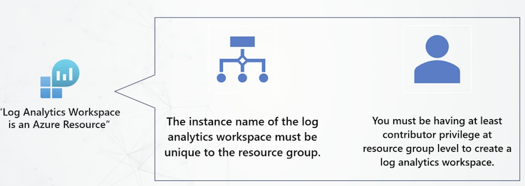

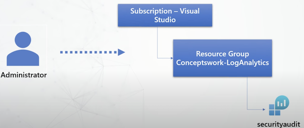


### 2-2 How to manage commitment tiers of log analytics workspace?

Cost

* ***There is no cost for creation of log analytics workspace, you will only be charged for the data which is ingested in log analytics**
* **You are also charged based on the retention period that you choose**.
* **Region selection for log analytics workspace can help you save egress cost.**


The importance of choosing the correct region during workspace creation affects egress costs and overall efficiency. This decision can significantly impact the financial aspect of your Azure resources.


### 2-3 What is Retention Period?

#### **Daily Cap**

1. Setting up daily cap for Log Analytics workspace.
2. Whenever the threshold is reached, the collection of data is stopped for the day.
3. Whenever daily cap limit is reached a warning is shown on azure portal, as well as an event is generated in operations table of the log analytics workspace.
4. Every workspace will have a reset time, which will be different for each workspace.
5. Initially, this daily cap was not affecting the collection of security data related to Microsoft sentinel and Microsoft defender for cloud.
6. Starting from September 18th ’23 these exclusions are also removed.
7. The reset hour for the workspace is shown, but it can be changed.

**Default Tables**


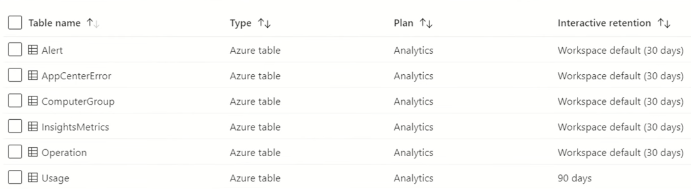

### How to define retention settings for each table?

**Data Retention**

- The time for which your data will be saved.
- For example - i**f you want to save data for 2 years then total retention period will be 2 years**.

**Table Plan**

**Basic and Analytics**

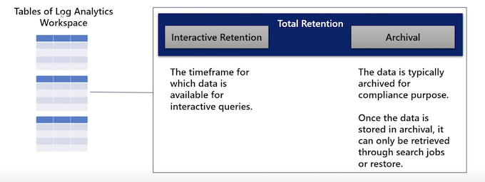

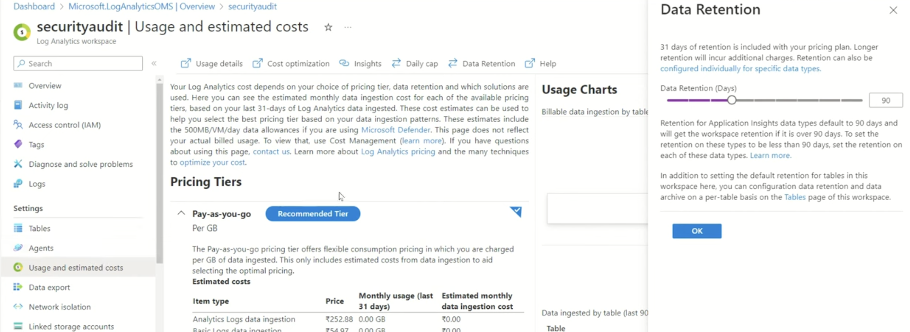

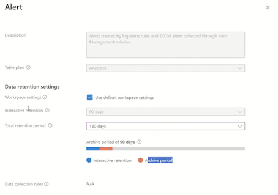

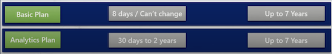

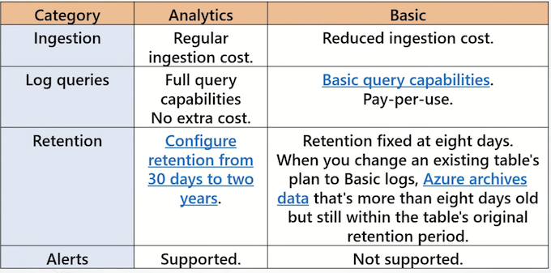

* Managing commitment tiers is crucial as it dictates the data ingestion capacity and associated costs. Proper planning is necessary to avoid unexpected charges during data usage.
* **There are no upfront costs for creating a workspace; charges apply only when data is ingested. This allows for flexible budgeting as you scale your data usage**.
* Data ingestion and retention choices in log analytics workspaces significantly impact costs and functionality. U
* hoosing the right data retention period is crucial as it directly affects the costs associated with log analytics in Azure. Different retention options come with varying price points.
* Setting a daily cap on data ingestion can help manage costs but requires careful planning to avoid disruptions in data collection. Users must be aware of their data usage patterns.
* Recent changes have removed exclusions for certain Microsoft services from the daily cap, meaning all data types are now subject to ingestion limits. This impacts how security data is managed.
* Data retention in workspaces includes two key types: **interactive retention and archival retention. The total retention period combines these two, allowing for customized settings for each table**.
* Interactive retention determines how long data is available for queries, while archival retention is for compliance and requires specific retrieval methods. Each workspace has default settings for these.
* Users can customize the retention settings for individual tables within a workspace, allowing for flexibility in data management according to specific requirements or compliance needs.
* Workspace default settings can be inherited by all tables, meaning any changes made to the retention period will automatically apply to them. This ensures consistent data management.

### How to manage schema for a specific table?

### Monitoring log analytics workspace health


- Data retention policies include interactive retention and archival periods, which can be customized for different table plans.
- Interactive retention periods vary based on the chosen table plan, with basic plans offering a fixed retention of eight days. Archival periods can extend up to seven years for basic plans.
- Analytics table plans provide more flexibility, allowing interactive retention periods from 30 days to two years. This option can significantly affect data ingestion costs and query capabilities.
- Limitations exist for basic plans, where certain KQL queries, such as the join operator, cannot be utilized. Awareness of these restrictions is important for effective data analysis.


### Portal Walkthrough


1. Customizing table schemas and managing transformations are critical for effective data management. This allows for tailored data handling and better query performance in databases.
2. Understanding the naming conventions like suffixes is essential when creating or modifying tables. These conventions help in identifying the type of tables created.
3. Editing transformations enables the removal and updating of unnecessary columns. This customization can improve data quality and query efficiency significantly.
4. Monitoring workspace health is vital for identifying and addressing issues. System notifications and console highlights provide immediate awareness of any potential problems.

**Portal Walkthrough**

Managing Table Schema

```
source 
| project-may AppDisplayare, AutomomousSystemunher, Durations, OperationVersion, ResultType


AADNonInteractiveUserSigninLogs
| where TimeGenerated › ago(30d) 
| summarize count() by Durations

```

#### Monitor Log Analytics Workspace health

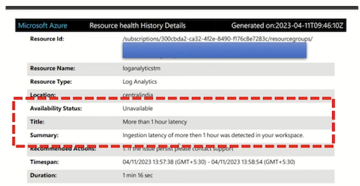


### Deleting a Workspace

Whenever a workspace is deleted, it stays in soft delete state for almost 14 days.


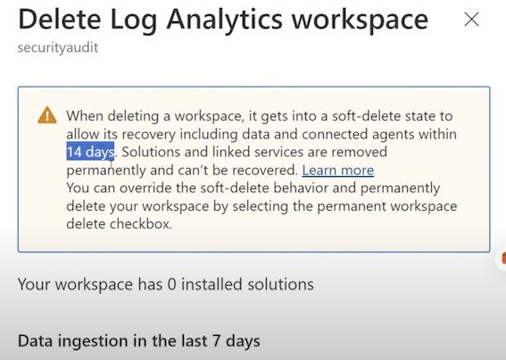


## 3 What is Azure Monitor Agent?


**Core Purpose:**  

Azure Monitor Agent (AMA) collects logs and performance data from Windows/Linux machines, ingesting into Log Analytics Workspaces for centralized monitoring. It replaces the deprecated **Legacy Microsoft Monitoring Agent (MMA)** by August 2024, requiring structured migration.  


Azure Monitor Agent is an application for capturing logs from Windows and Linux machines, sending them to Log Analytics Workspace. 

It replaces the deprecated Microsoft Monitoring Agent, offering enhanced security through managed identity and customizable data collection rules. This agent improves data ingestion efficiency and supports various data transformation needs.

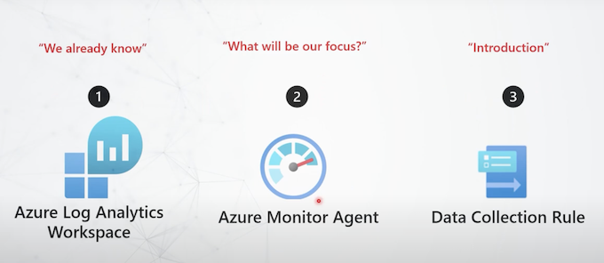

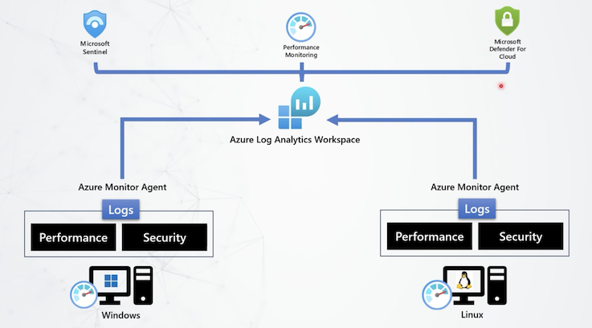


- The purpose of azure monitor agent is to collect logs from guest operating system and ingest them to log analytics workspace.
- The OS can be Windows or Linux.
- The machines can be client or servers.
- They can exist anywhere, either in Azure or on-prem or in hybrid cloud environments.

#### Key Improvements Over Legacy Agent:  

1. **Simplified Setup**:  
   - Resolves MMA’s installation complexities and workspace configuration challenges.  
   - Uses **managed identities** for authentication, eliminating manual credential handling (e.g., workspace keys) and reducing security risks.  


**Uses Workspace Id and Workspace key for enablement**

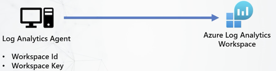


2. **Enhanced Data Collection**:  
   - **Data Collection Rules (DCRs)** define *what* to collect, *how* to transform data (e.g., filter unnecessary attributes), and *where* to send it.  
   - Enables **multihoming**: Direct different log types (e.g., security vs. performance) to separate workspaces.


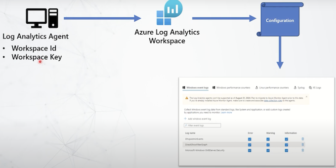

4. **Performance & Scalability**:  
   - Higher throughput for demanding scenarios (e.g., firewalls, IPS appliances).  
   - ETL (Extract-Transform-Load) pipeline pre-processes data before ingestion.

**Why you should migrate or use Azure Monitor agent?**

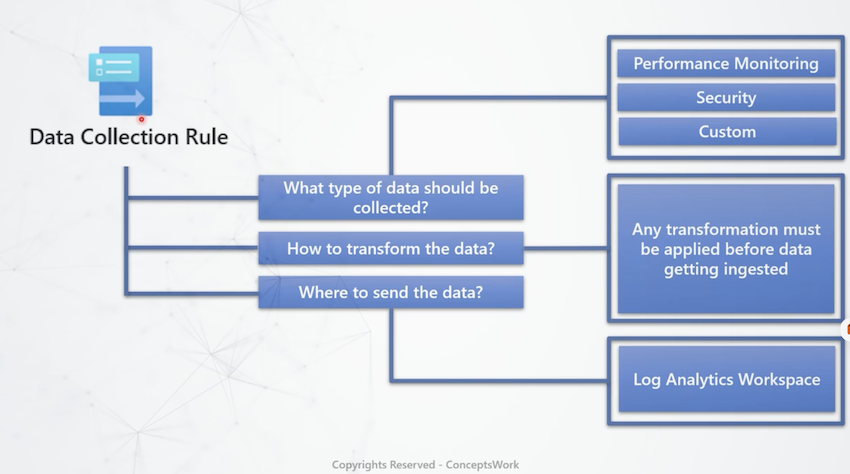

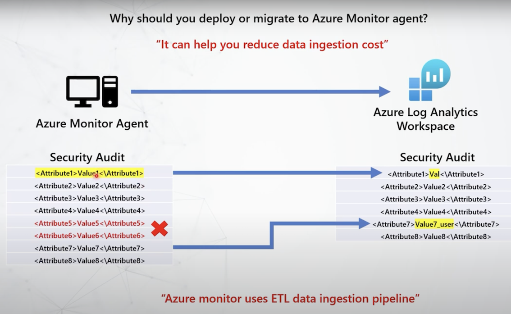

#### Critical Capabilities:  

- **Centralized Management**: Configure enterprise-wide monitoring via a unified portal.  
- **Customization**:  
  - Optimize costs by ingesting only relevant attributes.  
  - Avoid data overlap by assigning unique configurations per machine.  
- **Security**:  
  - Managed identities replace shared workspace keys, ensuring credential security.  
  - Workspace ID/key remains essential for secure agent-to-workspace communication.  

#### Migration & Best Practices:  
- **Urgent Migration**: MMA retires in August 2024; plan transition to AMA.  
- **Use DCRs**: Streamline log collection, reduce noise, and improve analysis efficiency.  

**Why It Matters**: AMA offers greater flexibility, security, and scalability than legacy solutions, enabling efficient large-scale monitoring in Azure environments.  

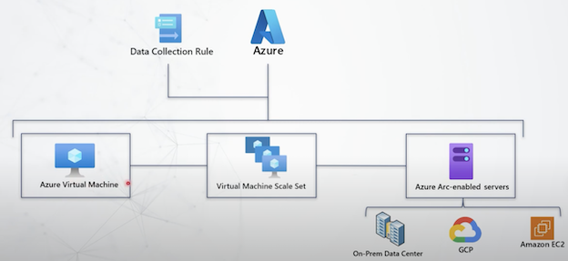

## 2 What is DCR - Data Collection Rule?

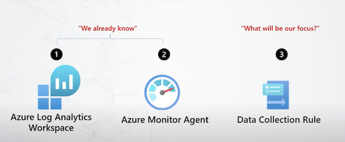

**Data Collection Rule**

Data collection rule is basically a contiguration, which lets the azure monitor agent know, 

what type of data must be captured and forwarded to data ingestion pipeline, then are here any transformation which must be applied before the data gets ingested to the workspace and where exactly the data must be ingested, precisely speaking to which table of the workspace.
          
Data collection rules can be created for Windows, Linux and other platforms as well where you might use data ingestion API of log analytics workspace.


**Data Collection Rule can only be applied to Azure VM or Azure Arc-enabled servers.**

**Which means that you must onboard your on-prem, aws or GCP virtual machines to Azure Arc before you can deploy Azure Monitor Agent.**

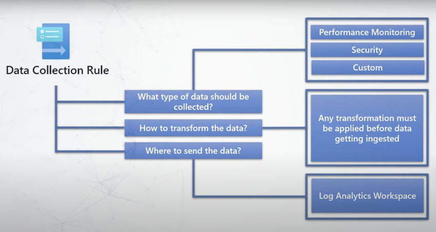

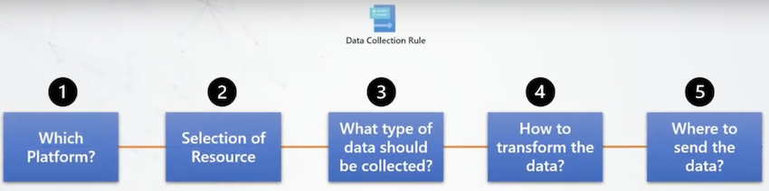

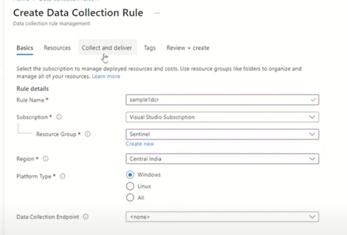

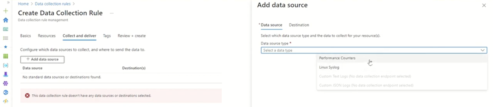


### 1 Which Platform?

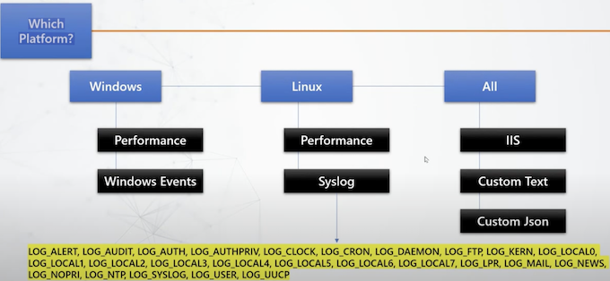

### 2 Selection of Resource

- Azure VM
- Azure Arc-enabled servers

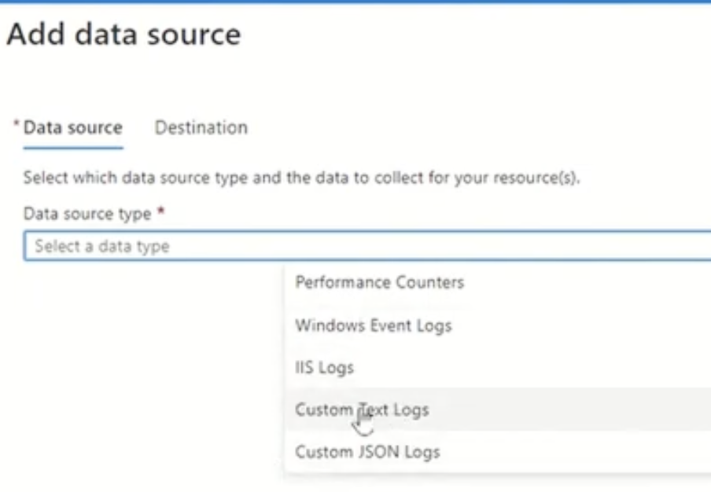


- For windows servers which are non azure, you have to onboard them to azure first as azure arc enabled servers and then you can associate them to data collection rule.
- For windows client machines a MSI package installation is required.
- For Linux machines, **only azure arc onboarded resources can be scoped to Data collection rules**.
- **Whenever any resource is added to data collection rule, AZURE MONITOR AGENT is installed automatically**.
- Azure monitor agent is deployed in the form of extensions.

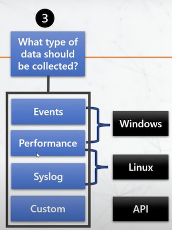

### How to transform the data?

* Table Configuration
* Custom KOL Query

> You can implement transformation at the table instance of the workspace

> As well as you can add transformation section in JSON configuration of data collection rule with the help of Azure API's

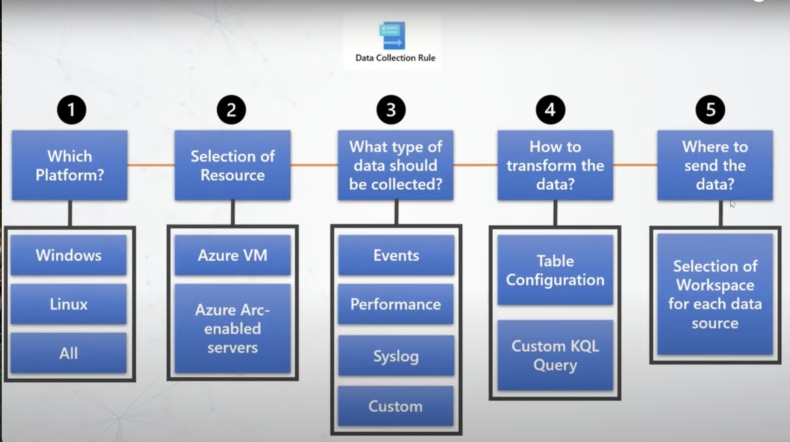