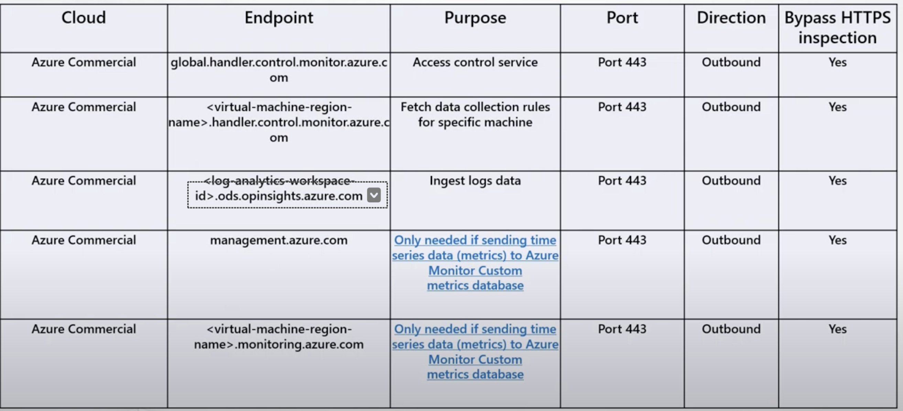
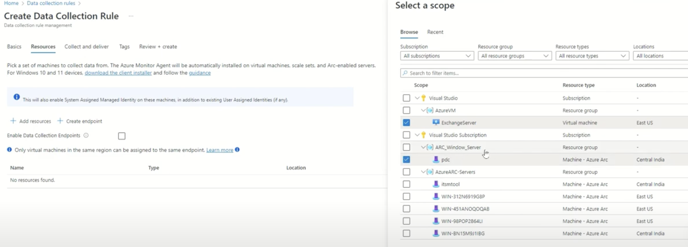
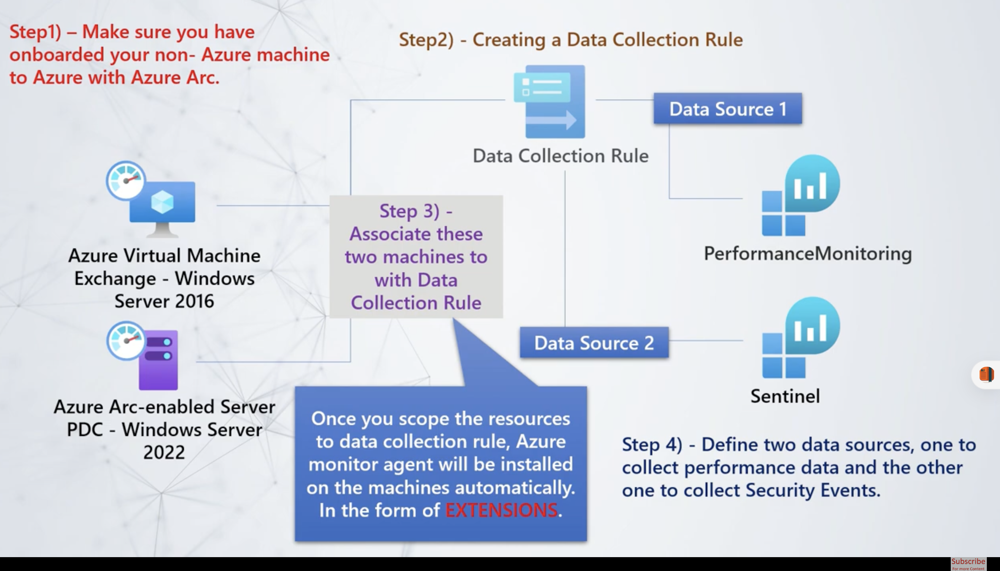
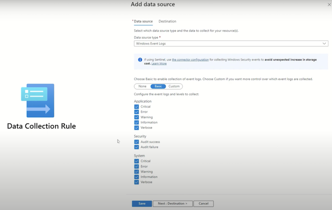
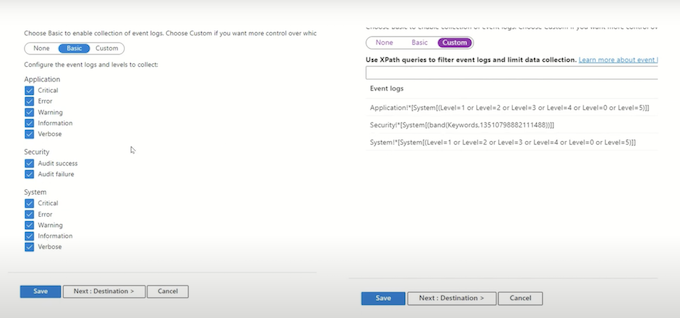
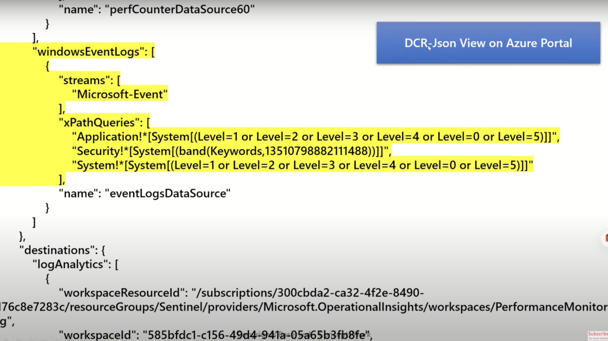
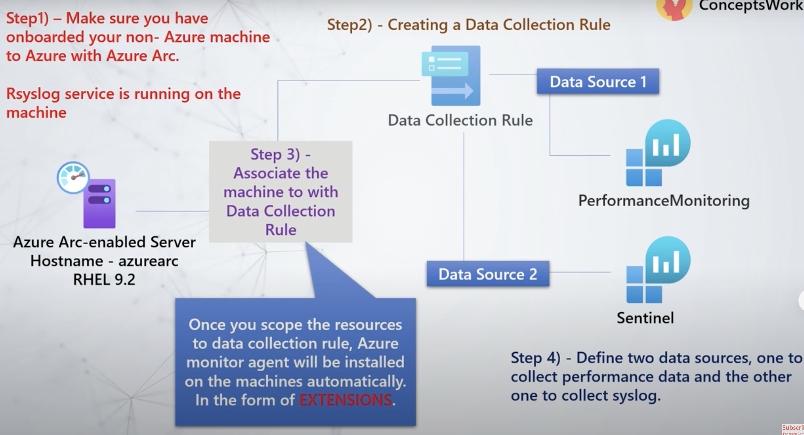
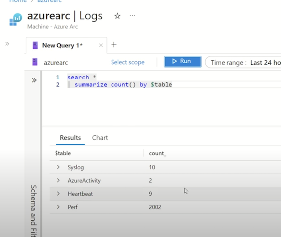

# 1 Microsoft Azure Log Analytics Workspace


## 1 Azure Log Analytics Workspace


**Log Analytics Workspace in Microsoft Azure is crucial for data ingestion from various services like Azure Monitor and Microsoft Sentinel**. 


It centralizes logs from different sources, allowing for analysis, monitoring, and visualization. Understanding log formats and data structure is essential for effective use, enabling insights and compliance over time.

**Log analytics workspace is essential for data ingestion across various Azure services, including Azure Monitor and Microsoft Defender for Cloud.** 

four keywords: **collect, analyze, monitor, and visualize**, which are crucial for effective data handling. These processes ensure meaningful insights from collected data.

### Event

* Anything which is happening digitally and documented in the form of record can be referred to an event.
* Multiple events generated by any system are referred as logs


- Events in computing are defined as occurrences that are documented as logs, which can originate from various systems, including hosts and network devices. Understanding logs is crucial for system monitoring.

* ***Windows Event Format**
* **Syslog**
* **Common Event Format**
* **JSON**
* 

### Almost every computing system generate logs

It can be host machines, network devices, security solutions and identity solutions or practically any solution that you are using.

- Endpoint logs
- Network Device logs
- Application Event logs
- IOT logs
- Security Solutions logs
- Directory Service logs
- DNS Server logs


#### Centralization of data is crucial for effectively managing various log formats within an organization. 


- Endpoints
- Security Solutions
- Directory service solution
- Asset Management Solution
- Network devices
- IDAM solutions


**A centralized repository allows for easier data ingestion, compliance, and analytics across multiple sources**


- Compliance requirements may necessitate the retention of logs for specific periods.
- Centralized storage solutions facilitate the long-term retention of logs for audit and regulatory purposes.
- Different log formats like WEF, CEF, and syslog require dedicated tables in a centralized repository to manage diverse data effectively. Each format has unique structures that need specific handling.
- After capturing data in a centralized repository, it is essential to analyze and derive insights from it.
- This analysis can lead to actionable dashboards and alerts based on defined conditions.


### **Data structure**

- Each workspace contains multiple tables that are organized into separate columns with multiple rows of data. 
- Each table is defined by a unique set of columns.
- Rows of data provided by the data source share those columns. 
- Log queries define columns of data to retrieve and provide output to different features of Azure Monitor and other services that use workspaces.


### Applications of Azure log analytics workspace

- Azure log analytics workspace is the **environment used by Azure Monitor for saving data**.
- Azure log analytics workspace is used for **data ingestion for Microsoft Sentinel as well as Microsoft Defender for Cloud**.
- Enablement of Diagnostics settings for azure resource can be **done by using Azure log analytics workspace**.
- From compliance standpoint, Log analytics workspace can be used to ingest and save data from multiple solutions for up to 7 years.


Log analytics workspace serves as a centralized repository for ingesting data across various enterprise solutions, facilitating data analysis and visualization. It supports performance monitoring, security monitoring, and diagnostics for Azure resources.

- Data ingestion can occur through agents, connectors, or collectors, ensuring comprehensive data collection from network devices and security applications. This process is crucial for data accuracy and completeness.
- Once data is ingested, it undergoes transformations to filter out unnecessary information, allowing users to visualize key insights through dashboards. Visualization helps in making data-driven decisions effectively.
- Log analytics workspace can integrate with Microsoft Sentinel to automate responses based on captured observations. This automation enhances the efficiency of security monitoring and incident response.

Azure Log Analytics Workspace serves as a centralized repository for data ingestion, enabling the use of various services like Microsoft Sentinel and Microsoft Defender for Cloud. It organizes data into tables with defined columns and rows for efficient management and retrieval.

- Data organization in Azure Log Analytics involves multiple tables with unique columns and rows, allowing for structured data management. This aids in efficient querying and reporting.
- Azure Log Analytics Workspace is crucial for Microsoft Sentinel and Defender for Cloud, which rely on it for data ingestion and functionality. This integration enhances the security monitoring capabilities.
- The retention period for data in the Log Analytics Workspace can extend up to seven years, ensuring compliance and long-term data accessibility. Users can customize retention settings for specific tables.


## 2 Microsoft Azure Log Analytics Workspace - Detail

### 2-1 How to create a log analytics workspace?


### 2-2 How to manage commitment tiers of log analytics workspace?

Cost

* ***There is no cost for creation of log analytics workspace, you will only be charged for the data which is ingested in log analytics**
* **You are also charged based on the retention period that you choose**.
* **Region selection for log analytics workspace can help you save egress cost.**


The importance of choosing the correct region during workspace creation affects egress costs and overall efficiency. This decision can significantly impact the financial aspect of your Azure resources.


### 2-3 What is Retention Period?

#### **Daily Cap**

1. Setting up daily cap for Log Analytics workspace.
2. Whenever the threshold is reached, the collection of data is stopped for the day.
3. Whenever daily cap limit is reached a warning is shown on azure portal, as well as an event is generated in operations table of the log analytics workspace.
4. Every workspace will have a reset time, which will be different for each workspace.
5. Initially, this daily cap was not affecting the collection of security data related to Microsoft sentinel and Microsoft defender for cloud.
6. Starting from September 18th ’23 these exclusions are also removed.
7. The reset hour for the workspace is shown, but it can be changed.

**Default Tables**


### How to define retention settings for each table?

**Data Retention**

- The time for which your data will be saved.
- For example - i**f you want to save data for 2 years then total retention period will be 2 years**.

**Table Plan**

**Basic and Analytics**


* Managing commitment tiers is crucial as it dictates the data ingestion capacity and associated costs. Proper planning is necessary to avoid unexpected charges during data usage.
* **There are no upfront costs for creating a workspace; charges apply only when data is ingested. This allows for flexible budgeting as you scale your data usage**.
* Data ingestion and retention choices in log analytics workspaces significantly impact costs and functionality. U
* hoosing the right data retention period is crucial as it directly affects the costs associated with log analytics in Azure. Different retention options come with varying price points.
* Setting a daily cap on data ingestion can help manage costs but requires careful planning to avoid disruptions in data collection. Users must be aware of their data usage patterns.
* Recent changes have removed exclusions for certain Microsoft services from the daily cap, meaning all data types are now subject to ingestion limits. This impacts how security data is managed.
* Data retention in workspaces includes two key types: **interactive retention and archival retention. The total retention period combines these two, allowing for customized settings for each table**.
* Interactive retention determines how long data is available for queries, while archival retention is for compliance and requires specific retrieval methods. Each workspace has default settings for these.
* Users can customize the retention settings for individual tables within a workspace, allowing for flexibility in data management according to specific requirements or compliance needs.
* Workspace default settings can be inherited by all tables, meaning any changes made to the retention period will automatically apply to them. This ensures consistent data management.

### How to manage schema for a specific table?

### Monitoring log analytics workspace health


- Data retention policies include interactive retention and archival periods, which can be customized for different table plans.
- Interactive retention periods vary based on the chosen table plan, with basic plans offering a fixed retention of eight days. Archival periods can extend up to seven years for basic plans.
- Analytics table plans provide more flexibility, allowing interactive retention periods from 30 days to two years. This option can significantly affect data ingestion costs and query capabilities.
- Limitations exist for basic plans, where certain KQL queries, such as the join operator, cannot be utilized. Awareness of these restrictions is important for effective data analysis.


### Portal Walkthrough


1. Customizing table schemas and managing transformations are critical for effective data management. This allows for tailored data handling and better query performance in databases.
2. Understanding the naming conventions like suffixes is essential when creating or modifying tables. These conventions help in identifying the type of tables created.
3. Editing transformations enables the removal and updating of unnecessary columns. This customization can improve data quality and query efficiency significantly.
4. Monitoring workspace health is vital for identifying and addressing issues. System notifications and console highlights provide immediate awareness of any potential problems.

**Portal Walkthrough**

Managing Table Schema

```
source 
| project-may AppDisplayare, AutomomousSystemunher, Durations, OperationVersion, ResultType


AADNonInteractiveUserSigninLogs
| where TimeGenerated › ago(30d) 
| summarize count() by Durations

```

#### Monitor Log Analytics Workspace health


### Deleting a Workspace

Whenever a workspace is deleted, it stays in soft delete state for almost 14 days.


## 3 What is Azure Monitor Agent?


**Core Purpose:**  

Azure Monitor Agent (AMA) collects logs and performance data from Windows/Linux machines, ingesting into Log Analytics Workspaces for centralized monitoring. It replaces the deprecated **Legacy Microsoft Monitoring Agent (MMA)** by August 2024, requiring structured migration.  


Azure Monitor Agent is an application for capturing logs from Windows and Linux machines, sending them to Log Analytics Workspace. 

It replaces the deprecated Microsoft Monitoring Agent, offering enhanced security through managed identity and customizable data collection rules. This agent improves data ingestion efficiency and supports various data transformation needs.


- The purpose of azure monitor agent is to collect logs from guest operating system and ingest them to log analytics workspace.
- The OS can be Windows or Linux.
- The machines can be client or servers.
- They can exist anywhere, either in Azure or on-prem or in hybrid cloud environments.

#### Key Improvements Over Legacy Agent:  

1. **Simplified Setup**:  
   - Resolves MMA’s installation complexities and workspace configuration challenges.  
   - Uses **managed identities** for authentication, eliminating manual credential handling (e.g., workspace keys) and reducing security risks.  


**Uses Workspace Id and Workspace key for enablement**


2. **Enhanced Data Collection**:  
   - **Data Collection Rules (DCRs)** define *what* to collect, *how* to transform data (e.g., filter unnecessary attributes), and *where* to send it.  
   - Enables **multihoming**: Direct different log types (e.g., security vs. performance) to separate workspaces.


4. **Performance & Scalability**:  
   - Higher throughput for demanding scenarios (e.g., firewalls, IPS appliances).  
   - ETL (Extract-Transform-Load) pipeline pre-processes data before ingestion.

**Why you should migrate or use Azure Monitor agent?**


#### Critical Capabilities:  

- **Centralized Management**: Configure enterprise-wide monitoring via a unified portal.  
- **Customization**:  
  - Optimize costs by ingesting only relevant attributes.  
  - Avoid data overlap by assigning unique configurations per machine.  
- **Security**:  
  - Managed identities replace shared workspace keys, ensuring credential security.  
  - Workspace ID/key remains essential for secure agent-to-workspace communication.  

#### Migration & Best Practices:  
- **Urgent Migration**: MMA retires in August 2024; plan transition to AMA.  
- **Use DCRs**: Streamline log collection, reduce noise, and improve analysis efficiency.  

**Why It Matters**: AMA offers greater flexibility, security, and scalability than legacy solutions, enabling efficient large-scale monitoring in Azure environments.  


## 4 What is DCR - Data Collection Rule?


**Data Collection Rule**

Data collection rule is basically a contiguration, which lets the azure monitor agent know, 

what type of data must be captured and forwarded to data ingestion pipeline, then are here any transformation which must be applied before the data gets ingested to the workspace and where exactly the data must be ingested, precisely speaking to which table of the workspace.
          
Data collection rules can be created for Windows, Linux and other platforms as well where you might use data ingestion API of log analytics workspace.


**Data Collection Rule can only be applied to Azure VM or Azure Arc-enabled servers.**

**Which means that you must onboard your on-prem, aws or GCP virtual machines to Azure Arc before you can deploy Azure Monitor Agent.**


### 1 Which Platform?


### 2 Selection of Resource

- Azure VM
- Azure Arc-enabled servers


- For windows servers which are non azure, you have to onboard them to azure first as azure arc enabled servers and then you can associate them to data collection rule.
- For windows client machines a MSI package installation is required.
- For Linux machines, **only azure arc onboarded resources can be scoped to Data collection rules**.
- **Whenever any resource is added to data collection rule, AZURE MONITOR AGENT is installed automatically**.
- Azure monitor agent is deployed in the form of extensions.


### How to transform the data?

* Table Configuration
* Custom KOL Query

> You can implement transformation at the table instance of the workspace

> As well as you can add transformation section in JSON configuration of data collection rule with the help of Azure API's


## 5 Deploy Azure Monitor Agent on Windows Servers | Data Collection Rule

- Installation of Azure Monitor Agent on Windows Servers.
- Supported OS and Network Requirements.
- Roles required to install Azure monitor agent.
- How to configure a DCR for default data collection?
- Where exactly DCR is saved on the machine?
- Which table is used for data ingestion in log analytics workspace?

**Azure Arc + Azure Monitor You need to make sure the URLs for both the services are whitelisted.**

### Azure Monitor - Network Requirements



### Permissions

**Monitoring Contributor**  This is required to create a DCR and create associations

**Virtual Machine Contributor**  Deploy agent extension to Azure VM

**Azure Connected Machine Resource Administrator** Deploy agent extensions to Azure Arc-enabled servers.


**Where Azure Monitor Agent can be installed?**

* Azure Virtual Machine
* Virtual Machine Scale Set
* Azure Arc-enabled servers
	* On-Prem Data Center
    * GCP
    * Amazon EC2


**Requirement**

* Windows Performance logs must be ingested to a workspace named as PerformanceMonitoring.

* Windows Event logs must be ingested to a workspace named as Sentinel.







**Instead of using workspace ids and workspace key for authentication, Azure Monitor agent uses, managed identity which is created while the machine is getting onboarded to Azure Arc.**

**"Azure Monitor Agent is deployed in the form of extensions"**


**This gives you the privilege to centrally manage them from Azure portal, likewise Installing, Updating or Removing Extensions**.

### Tables that are used to ingest data

When the Azure monitor agent is installed on the machine, the machine sends a **heartbeat** which is recorded in the Heartbeat table of the log analytics workspace.

Whenever a DCR is created to capture performance and windows event logs, the data is ingested in **perf and Event table of the** workspace.


## 6 Advanced Logging for Windows Using "Data Collection Rule” Azure Monitor Agent





```
Event
| summarize count() by EventID, EventCategory,EventLog, EventLevelName
```

**Event Viewer**

**Custom Requirement:- A specific component**

### DCR-Json View on Azure Portal



#### How exactly, we should create these xpath queries, if we have to select custom logs?

```
DNS Server!*[System[ (Level=1 or Level=2 or Level=3)]]

Microsoft-Windows-HelloForBusiness/Operational!*[System[ (Level=1 or Level=2 or Level=3)]]
```



#### Requirement

* Syslog's from Linux machine must be captured and ingested to **syslog table** of the workspace.
* All the performance counter from Linux machine must be ingested to **perf** table of the workspace.
* In this scenario, I will be using **two workspaces named as PerformanceMonitoring and Sentinel**.



### Tables that are used to ingest data

When Azure Monitor agent is installed to capture to Linux OS syslog data, **the data is ingested to syslog table and performance counter data is ingested to perf table**.


**When Azure monitor agent is installed to act as a forwarder, then the data is ingested to common security log table.
//SentinelUseCa**se

## Test 

### Part1

1. Which function type can a user modify in Azure Monitor?   **Workspace**
2. You want to tie your company's billing system into your Azure subscription to programmatically Which APls are required?  **Rate Card APl and Usage API**
3. During an application update, a number of application servers become unavailable. How might you use monitoring services to gain insight into the nature of the issue  **Use the Smart Groups functionality of Azure Alerts**.
4. Which Azure feature automatically reviews your environment for cost savings based on resource utilization  **Azure Advisor**
5. In Microsoft Defender for Cloud, which security policy applies secure settings?  **Enforce**
6. You run a usage query in the log search page that returns seven days of data on five virtual machines (VM) want to refine the results to MyVM01 and the most recent three days. How can you change the query to accomplish this?
   * **`Usage | where Computer == "MyVMO1" | where TimeGenerated › ago (3d)`**
7. What must you have to export metrics to Azure Stream Analytics?
   * **Deploy and configure an Event Hubs namespace instance**.
8. Which resource can you use Network Watcher to monitor?
   * **The network interface of an Azure virtual machine**
9. Which is a requirement to set up an Azure Security Center event dashboard?
    * S**ecurity Center's standard tier plan**
10. You manage hundreds of Azure SQL databases that are split between elastic pools and standalone instances. Manually monitoring their performance in-depth is a considerable burden. How can you simplify the monitoring tasks?
	* **Add Azure SQL Analytics to your Log Analytics workspace and configure the diagnostic settings for all of your databases to send logs and metrics to**
11. You must create a report that shows all security events over the last 20 days for a Windows virtual machine (VM) in your Azure environment. What tools should you consider
	* **Log Analytics and Power BI**
12. What is a requirement for monitoring Azure virtual machines (VMs) from a third-party tool running outside of Azure?
	* **Network security group (NSG) rules that allows the necessary traffic between the Virtual Network (VNet) and the monitoring TOOL**
13. Which query will return all errors logged in the system event log for a Linux virtual machine (VM)?
    * **`Syslog | where (SeverityLevel == "err")`**
14. Which Azure tools can you use to establish a workload baseline for an application server running on a virtua machine?
	* **Application Insights, metric charts**
15. In the subscription blade, which tool can you use to view the costs for a subscription broken down by resource?
    * **`Cost analysis`**
16. You see a recommendation to enable "Just in time VM access". What type of threat will this protect against?
    * **Brute-force login attacks on a virtual machine (VM) with a public IP**
17. You must create an activity log alert rule with a JSON template. You must design the template using the Azure Resource Manager (ARM). How will you code the template's resource type?
	* **`"resources": [ "type": "Microsoft. Insights/activityLogAlerts",`**
18. Which service should you route metric data to for App Services performance analytics?
    * **Application Insights**
19. You are creating a new visualization for an Azure Kubernetes Service node in Azure Monitor Workbooks. This node consists of a hierarchy of resources. Which type of visualization is best suited for such workloads?
    * **Trees**
20. How can you create detailed visual reports for billing data?
    * **Import the usage report into Power BI.**

### Part 2
 
1. Who is responsible for establishing a connection from the on-premises network to Azure?

**The customer only**

2. You have concerns that old, unsupported applications are running in your hybrid cloud environment. How can you use Azure Security Center recommendations to prevent this?

**Use the adaptive application controls feature and create a new application policy based on recommendations.**


3. You have an application running on load balanced virtual machines (VMs). You are intermittently experiencing failing outbound connections. Which scenario can you use to determine the root cause?

**Create a metrics chart to monitor the load balancer for source-network address translation (NAT) connection count.**

4. What do you need to create alerts for Azure SQL databases from Log Analytics?  **Azure SQL Analytics**

5. You plot a chart in Azure Monitor for a resource. The chart must display the resource's metrics for the last week.
When you visualize the chart, it's empty. Why might the data be missing?

6. **The resource did not send any metric in the defined time span.**

**Fired alerts and enabled alert count**


7. When would an alert trigger in Azure Monitor?

**If the result count of a log query is greater than 100.**

8. What will enabling diagnostic settings on a virtual machine (VM) allow you to do that is otherwise unavailable?

**Create metric alerts on guest processor thresholds**

9. You want to exclude certain types of resources that developers can create in Azure to ensure that only essential, work-related assets exist. How would you go about doing this using Azure Policy?

**`Configure the "Not allowed resource types" policy.`**


10. Which is a condition of an alert rule in the unified alerting experience?

**Signal**

11. You allocate a certain amount of money to resources with specific tags. How will you verify if you allocated the cost successfully in the Azure

Select **Cost analysis**, and select **Tag** under **Add Filter**. Choose the tag key/value that you want.

12. Which qualifies as a high severity recommendation?

**Enable network security groups on subnets**

13. You want to create a chart for your web application with two instances that shows connections by instance.
What configuration options should you use?

**Metric = Connections, Add Splitting**

14. Which section in the Azure Security Center displays security recommendations?

**Resource security hygiene**

15. How would you automatically generate and send a monthly invoice for your Azure spending to the finance department?  **Use the email invoice function.**

16. Which monitoring service is best suited for monitoring ExpressRoute connections?

**Network Performance Monitor**

17. You are an IT administrator new to an organization. You see several custom views in production that were created through View Designer. What should you


**Gradually convert the views one by one into Azure Monitor Workbooks.**

18. To control costs, you want to shut down all virtual machines (VMs) in a certain resource group after all sessions have been disconnected each night. What is the most efficient procedure you can use to accomplish


In Log Analytics, create a log search query to return session states for all VMs in the workspace created for that resource group. Create an alert rule based on the query that runs a Power Shell runbook to stop the


19. Which PowerShell command can you use deploy an Azure Resource Manager template?

New-AzResourceGroupDeployment

20. What steps should you follow to diagnose connectivity issues for a site-to-site connection between on-premises and Azure networks?

**Enable Network Watcher and use the VPN diagnostics tool.**


