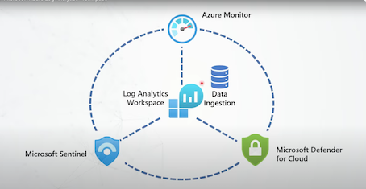
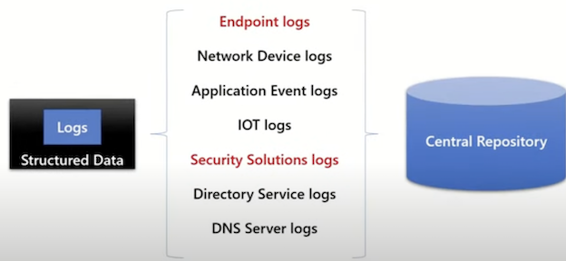
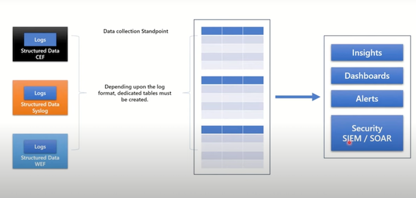
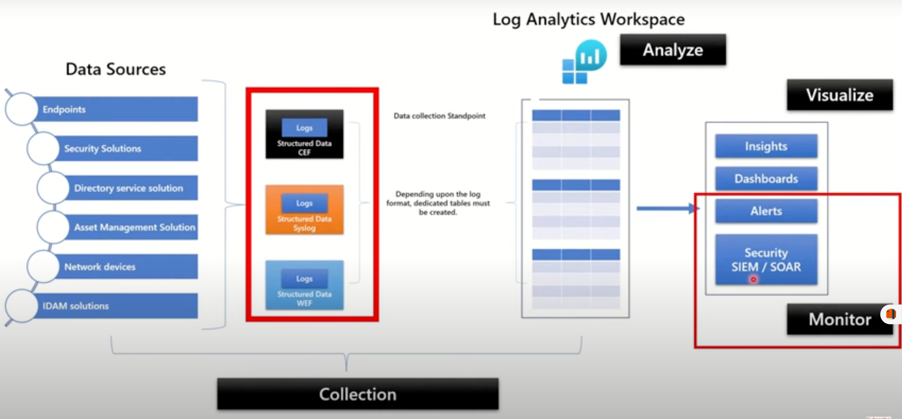
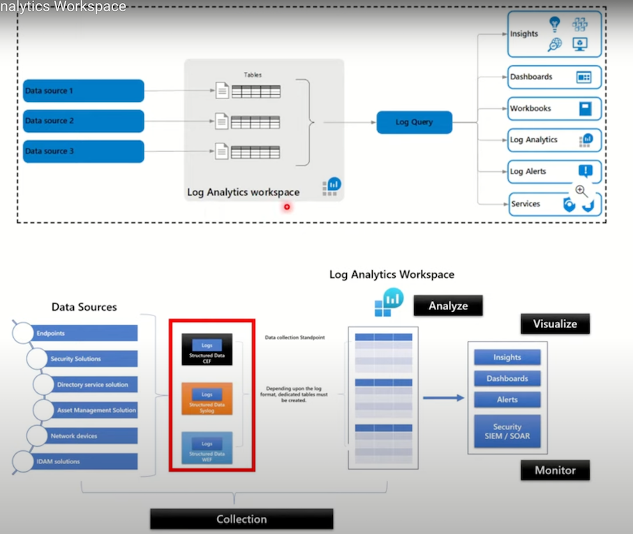

# 1 Microsoft Azure Log Analytics Workspace

## 1 Azure Log Analytics Workspace

**Log Analytics Workspace in Microsoft Azure is crucial for data ingestion from various services like Azure Monitor and Microsoft Sentinel**. 

It centralizes logs from different sources, allowing for analysis, monitoring, and visualization. Understanding log formats and data structure is essential for effective use, enabling insights and compliance over time.

**Log analytics workspace is essential for data ingestion across various Azure services, including Azure Monitor and Microsoft Defender for Cloud.** 

four keywords: **collect, analyze, monitor, and visualize**, which are crucial for effective data handling. These processes ensure meaningful insights from collected data.

### Event

* Anything which is happening digitally and documented in the form of record can be referred to an event.
* Multiple events generated by any system are referred as logs

- Events in computing are defined as occurrences that are documented as logs, which can originate from various systems, including hosts and network devices. Understanding logs is crucial for system monitoring.

* ***Windows Event Format**
* **Syslog**
* **Common Event Format**
* **JSON**
* 

### Almost every computing system generate logs

It can be host machines, network devices, security solutions and identity solutions or practically any solution that you are using.

- Endpoint logs
- Network Device logs
- Application Event logs
- IOT logs
- Security Solutions logs
- Directory Service logs
- DNS Server logs

#### Centralization of data is crucial for effectively managing various log formats within an organization. 

- Endpoints
- Security Solutions
- Directory service solution
- Asset Management Solution
- Network devices
- IDAM solutions

**A centralized repository allows for easier data ingestion, compliance, and analytics across multiple sources**

- Compliance requirements may necessitate the retention of logs for specific periods.
- Centralized storage solutions facilitate the long-term retention of logs for audit and regulatory purposes.
- Different log formats like WEF, CEF, and syslog require dedicated tables in a centralized repository to manage diverse data effectively. Each format has unique structures that need specific handling.
- After capturing data in a centralized repository, it is essential to analyze and derive insights from it.
- This analysis can lead to actionable dashboards and alerts based on defined conditions.

### **Data structure**

- Each workspace contains multiple tables that are organized into separate columns with multiple rows of data. 
- Each table is defined by a unique set of columns.
- Rows of data provided by the data source share those columns. 
- Log queries define columns of data to retrieve and provide output to different features of Azure Monitor and other services that use workspaces.

### Applications of Azure log analytics workspace

- Azure log analytics workspace is the **environment used by Azure Monitor for saving data**.
- Azure log analytics workspace is used for **data ingestion for Microsoft Sentinel as well as Microsoft Defender for Cloud**.
- Enablement of Diagnostics settings for azure resource can be **done by using Azure log analytics workspace**.
- From compliance standpoint, Log analytics workspace can be used to ingest and save data from multiple solutions for up to 7 years.

Log analytics workspace serves as a centralized repository for ingesting data across various enterprise solutions, facilitating data analysis and visualization. It supports performance monitoring, security monitoring, and diagnostics for Azure resources.

- Data ingestion can occur through agents, connectors, or collectors, ensuring comprehensive data collection from network devices and security applications. This process is crucial for data accuracy and completeness.
- Once data is ingested, it undergoes transformations to filter out unnecessary information, allowing users to visualize key insights through dashboards. Visualization helps in making data-driven decisions effectively.
- Log analytics workspace can integrate with Microsoft Sentinel to automate responses based on captured observations. This automation enhances the efficiency of security monitoring and incident response.

Azure Log Analytics Workspace serves as a centralized repository for data ingestion, enabling the use of various services like Microsoft Sentinel and Microsoft Defender for Cloud. It organizes data into tables with defined columns and rows for efficient management and retrieval.

- Data organization in Azure Log Analytics involves multiple tables with unique columns and rows, allowing for structured data management. This aids in efficient querying and reporting.
- Azure Log Analytics Workspace is crucial for Microsoft Sentinel and Defender for Cloud, which rely on it for data ingestion and functionality. This integration enhances the security monitoring capabilities.
- The retention period for data in the Log Analytics Workspace can extend up to seven years, ensuring compliance and long-term data accessibility. Users can customize retention settings for specific tables.
