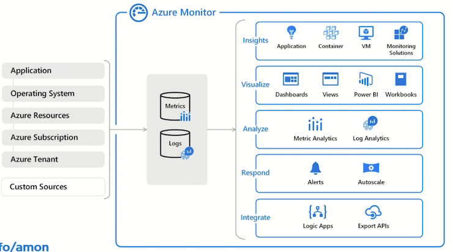
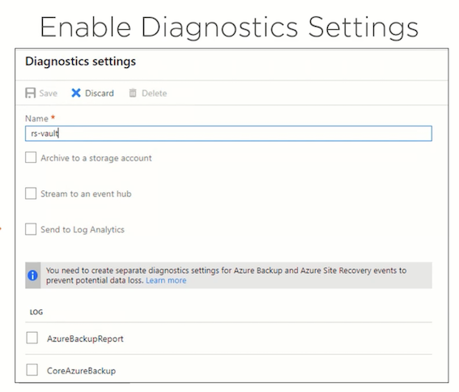
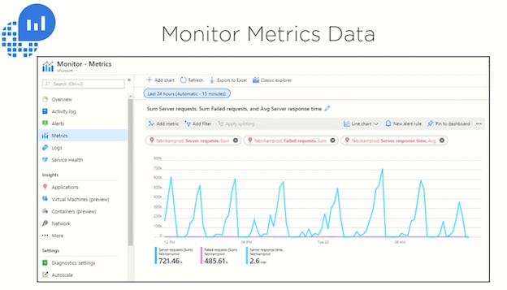

## 2 Azure Monitoring Fundamentals

### 1-1 Collecting Data with Azure Monitor

Here's a concise summary of the Azure Monitor data collection article:

1.  **Diverse Data Sources:** Azure Monitor collects data from numerous sources including:
    *   Azure resources (VMs, SQL DB, networks, etc.)
    *   Applications (custom apps, OS info from VMs)
    *   Azure Subscription (health/availability)
    *   Azure Tenant (e.g., Microsoft Entra ID)
    *   Hybrid environments (e.g., on-prem SQL with Azure agents)


3.  **Primary Data Types:**
    *   **Metrics:** Numerical time-series data for real-time/short-term performance monitoring (e.g., CPU%, disk I/O, memory pressure).
    *   **Logs:** Detailed event/activity records (e.g., security logs, application logs, Windows/Linux system logs, resource state changes).
    *   **Traces:** Data for tracking request flows in distributed applications (e.g., via Application Insights).
    *   **Changes:** Tracks modifications to Azure resources over time.

*Focus:* The article (and course) emphasizes **Metrics** (real-time performance) and **Logs** (detailed troubleshooting) as the most common and impactful data types.

4.  **Enabling Collection:**
    *   **Automatic:** Basic data collection starts immediately when an Azure resource is created.
    *   **Enhanced Setup:** Requires configuration for deeper insights:
        *   Enable diagnostic logging on resources (e.g., Azure SQL DB).
        *   Install Azure Monitor agents on VMs.
        *   Use the **Data Collector API** to send data from custom applications (web apps, functions, mobile apps).


### 1-2 Taking Action on Azure Monitor Data

#### 1. **Data Analysis Tools**

- **Metrics Explorer**: Visualizes real-time numerical data (CPU%, memory, disk I/O) via charts to track performance trends and set threshold-based alerts.
- **Log Analytics**: Performs deep investigation using **Kusto Query Language (KQL)** or a point-and-click interface. Combines logs (Windows events, Linux syslogs, errors) for troubleshooting complex issues.
- **Key Difference**:  
  - *Metrics*: Real-time resource health (automatic collection).  
  - *Logs*: Detailed event analysis (may require setup like Log Analytics workspace).

**Analytics**

**Metrics Explorer**：  Create charts, analyze trends, and identify fluctuations in metric values

**Log Analytics**： Detailed log investigation and custom queries for in-depth troubleshooting

#### **Analytics Use Cases**

**Metrics Explorer**

- Real-time performance monitoring
- Metrics like CPU, memory, disk
- Threshold-based alerts
- Quick visual overview
- Immediately collected

**Log Analytics**

- Deep analysis
- Multiple log types and sources
- Tracking event or error patterns
- Powerful KQL queries
- Requires steps to enable

---

#### 2. **Visualization Options**


- **Dashboards**: Static, high-level view of multiple resources in one place
	- Static views in Azure portal showing metrics, logs, or insights. Ideal for quick team sharing.

- **Workbooks**: A flexible tool for dynamically interacting with data
	- Interactive reports combining multiple datasets for real-time analysis and deep troubleshooting.

- **Power BI**: **Business analytics service for advanced reporting**
	- Advanced business reporting (e.g., executive dashboards), integrates external data, and automates updates.

- **Grafana**: **Open-source dashboard platform**
	- Open-source dashboards for multi-cloud monitoring (AWS/GCP) and third-party tools (Dynatrace, New Relic).

**Analytics Use Cases**

- **Dashboards**: View real-time resource health in the Azure portal
- **Workbooks**： Investigate performance trends and troubleshoot issues
- **Power BI**： Executive reports or sharing business insights outside Azure
- **Grafana**  Unified monitoring across cloud platforms and external tool

---

#### 3. **Automated Actions & Alerts**

- **Alerts**: Trigger notifications (email/SMS/webhooks) based on metric thresholds or log patterns.
- **Autoscaling**: Dynamically adjusts resources (e.g., VMs) to optimize performance/cost.
- **AIOps**: Automates anomaly detection and issue resolution.
- **Insights**: Microsoft’s pre-built monitoring experiences for key services (e.g., VMs, containers, networks).

---

#### Key Takeaways
- **Act on Data**: Tools transform raw data into actionable insights (e.g., autoscaling from CPU metrics).
- **Visualization Fit**:  
  - Dashboards → Quick health checks  
  - Workbooks → Interactive analysis  
  - Power BI/Grafana → Cross-platform or executive reporting  
- **Automation**: Alerts and AIOps enable proactive responses to issues.  
- **Start with Insights**: Microsoft-curated templates accelerate monitoring setup.  

> 💡 **Core Value**: Azure Monitor closes the loop from data collection → analysis → visualization → automated action.

### 1-4 Demo: Configuring Alerts and Notifications

#### 🔔 **Alert Creation Methods**
1. **Portal Setup (GUI):**
   - Created **Action Group** (`pstestgroup`) with email notifications.
   - Defined an alert rule (`Cpu80Percent`) for a VM (`pstest1`):
     - **Condition:** `Max CPU > 80%` over 1 minute.
     - **Severity:** Warning.
   - Enabled email notifications via the action group.

2. **CLI Method (Azure Cloud Shell):**
   - Used `az monitor metrics alert create` to create an alert for another VM (`pstest2`):
     - **Condition:** `CPU > 40%`.
     - **Severity:** Informational (level 3).

```
az monitor metrics alert create -n "Cpu40Percent" --resource-group "1-b4e6871e-playground-sandbox" --scopes $VMID --condition
"max percentage CPU > 40" --description "Virtual machine is running at or greater than 40% CPU utilization" --evaluation-frequency 1m —-window-size 1m -- severity 3
```

---

#### ⚡ **Alert Verification**
- Ran a load-generation script to trigger alerts.
- **Results:**
  - Both alerts fired: `CPU > 40%` (pstest2) and `CPU > 80%` (pstest1).
  - Email received for the 80% alert (configured via action group).
- Incident details showed:
  - CPU progression graphs.
  - Options to update incident status (New/Acknowledged/Closed).

---

####Demo: Analyzing with Azure Monitor Logs 💡 **Key Takeaways**
- **Action Groups:** Centralize notifications (email/SMS) for reuse across alerts.
- **Flexible Configuration:** Use GUI (portal) for one-off setups or CLI (`az`) for automation/scaling.
- **Real-Time Response:** Alerts provide:
  - Immediate visibility into thresholds (e.g., CPU spikes).
  - Contextual data for troubleshooting.
  - Notifications to streamline team response.
  
###  1-5 Demo: Analyzing with Azure Monitor Logs


Here's a concise summary of the Azure Monitor Logs analysis demo:

### 🔍 **Three Approaches to Log Analysis**
1. **Pre-Built Queries (Zero-Code):**
   - Accessed via **Queries Hub** (scoped to resources like VMs).
   - Example: "Heartbeat" query to verify VM connectivity (`pstest1`, `pstest2`).
   - Instantly shows key details: computer name, IP, last check-in time.

2. **Simple Mode (Point-and-Click GUI):**
   - Visually build queries using filters:
     - Start with table (e.g., `Event` for Windows logs).
     - Add filters: `Source → EventLog` → Specific computer (e.g., `pstest1`).
   - No KQL knowledge needed – ideal for quick ad-hoc analysis.

3. **KQL Mode (Advanced Custom Queries):**

   - Write Kusto Query Language scripts for deep investigation.
   - Example query:  
     ```kql
     Event | where EventLog == "Security" | where EventID == 4625
     ```
   - **Use Case**: Track failed logins (`EventID 4625`) across all VMs, revealing details like attacker account names (e.g., `fakeuser2`).

---

### 💡 **Key Workflow Insights**

- **Scope First**: Start by selecting a resource group/VM to target analysis.
- **Progress from Simple → Advanced**:  
  - Pre-built queries → GUI filtering → Custom KQL.
- **KQL Advantages**:  
  - SQL-like syntax (familiar for many users).  
  - Enables complex cross-VM correlation (e.g., security threat hunting).  
- **Unified Interface**: All approaches accessible in the same **Log Analytics** workspace.

---

### 🚀 **Getting Started Tips**
- **New Users**: Leverage pre-built queries + Simple mode to avoid syntax barriers.  
- **Security/Admin Teams**: Use KQL to audit events (e.g., failed logins, resource access).  
- **Troubleshooting**: Combine log types (application/security/system) for root-cause analysis.  

> **Demo Outcome**: From verifying VM health to investigating security events, Azure Monitor Logs adapts to user expertise—delivering value immediately. 🕵️♂️


## 2 Monitoring Microsoft Azure Resources and Workloads

### 2-1 Introducing Azure Diagnostics Monitoring

Here's a concise summary of the Azure diagnostics monitoring concepts:



#### ⚕️ **Service Health & Resource Health**

- **Purpose**: Personalized view of Azure platform issues affecting *your* resources (e.g., Microsoft-side outages).
- **Key Features**:
  - World map showing regional service status.
  - Historical issue tracking (resolved incidents).
  - Determines if problems are Azure-related (vs. your configuration).
- **Use Case**: "Sanity check" before troubleshooting internal issues.

---

#### 📊 **Two Core Monitoring Streams**
1. **Metrics**  
   - **What**: Numerical time-series data (sampled periodically).  
   - **Examples**: 
     - *Infrastructure*: VM CPU%, disk space, network I/O.  
     - *Apps*: HTTP errors, request rates.  
   - **Analysis Tools**: Metrics Explorer, dashboards, alerts.  

2. **Logs**  
   - **What**: Event-based records (discrete occurrences).  
   - **Types**:  
     - **Activity Log**: Subscription-level *control-plane* audits (e.g., "VM deleted").  
     - **Diagnostic Logs**: Resource-level *data-plane* events (e.g., VM guest OS logs).  
   - **Storage**:  
     - Metrics → Tables  
     - Logs → Blobs (e.g., IIS logs) or Log Analytics.  
   - **Analysis Tools**: Log Analytics, KQL queries.  

---

#### ⚙️ **Enabling Diagnostics**
- **Data Capture**: Send both metrics and logs to:
  - Azure Storage (tables/blobs).
  - Log Analytics workspace.
  - Event Hubs (streaming).
- **Guest OS Monitoring**: Enable for VMs to collect:
  - Performance counters (CPU/memory).
  - IIS/application logs.
  - System event logs.

---

#### 🎯 **Monitoring Goals**
1. **Break/Fix**: Rapid incident response.
2. **Optimization**: Performance tuning (e.g., scaling based on trends).
3. **Security**: Detect anomalies/breaches.
4. **Proactive Management**: Address issues before they impact users.

> **Key Insight**: Azure diagnostics provide critical visibility despite no physical access to datacenters. Start by defining *why* you need monitoring (e.g., SLA compliance, cost control).


### 2-2 Enabling Azure Diagnostics Monitoring





Here's a concise summary of the Azure diagnostic settings configuration:

#### ⚙️ **Key Configuration Features**

1. **Flexible Setup**  
   - Create **multiple diagnostic settings** per resource.  
   - Configure *most resources* directly in **Azure Monitor** (except VM guest OS diagnostics, set at VM scope).  

---

#### 📤 **Three Output Destinations**  

| **Destination**       | **Use Case**                                                                 |
|------------------------|-----------------------------------------------------------------------------|
| **Storage Account**    | Long-term archival of raw logs/metrics (blobs/tables).                      |
| **Event Hub**          | Real-time event streaming (handles millions of events); enables downstream processing (e.g., alerts, custom analytics). |
| **Log Analytics**      | Advanced querying/analysis with KQL (Microsoft's recommended standard).     |

> 💡 **Critical Note**: Outputs are **not mutually exclusive** – send data to *multiple destinations simultaneously*.

---

#### 📊 **Data Collection Options**  

- **Varies by Resource Type**:  
  - Some resources offer **both logs + metrics** (e.g., Azure SQL DB).  
  - Others provide **only metrics** (e.g., Azure Load Balancer) or **only logs** (e.g., Azure Policy).  
- **Selectable Categories**: Choose specific log types/metrics to collect (e.g., audit logs, performance counters).

---

#### 💡 **Key Takeaway**  

Azure diagnostic settings offer **centralized, customizable pipelines** to route monitoring data where it’s needed – whether for compliance (storage), real-time ops (Event Hubs), or deep analysis (Log Analytics). Always verify supported data types per resource.

### 2-3 Azure Monitor Data Sources

Here's a concise summary of Azure Monitor's data layers and capabilities:

### ⚙️ **Three Layers of Metrics Collection**

Azure Monitor Metrics Data Sources

**Platform metrics / Guest OS metrics / Application metrics / Custom metrics**


1. **Platform Metrics**  
   - Automatically collected baseline metrics (e.g., VM CPU%, network I/O).  
   - Requires **no configuration** – available out-of-the-box.  

2. **Guest OS Metrics**  
   - Enriched via **agents** (Windows/Linux VMs):  
     - Performance counters (Windows)  
     - Syslogs (Linux)  
     - Windows Event Logs  

3. **Application Metrics**  
   - Via **Application Insights** (APM):  
     - HTTP requests, dependencies, performance issues  
   - Custom metrics from application code

4. **Custom metrics**

---


| **Tool**               | **Purpose**                                                                 | **Key Features**                                  |  
|-------------------------|-----------------------------------------------------------------------------|--------------------------------------------------|  
| **Metrics Explorer**    | Visualize platform/guest metrics                                            | Multi-resource charts, baselining, alert creation |  
| **Log Analytics**       | Unify & analyze logs across resources                                       | Kusto Query Language (KQL), normalized data tables |  
| **Application Insights**| Monitor app performance (PaaS/IaaS)                                         | End-to-end transaction tracing, instrumentation  |  

> 🔍 **Log Analytics Backend**: Built on **Azure Data Explorer (ADE)** – a scalable engine for log normalization/querying.


#### Monitor Log Data

**Disparate data sources**  Log formats / VMs / Storage accounts

**Azure Data Explorer**

- Fast, highly scalable data exploration service
- Normalized data warehouse
- Kusto Query Language (KQL)

**Log Analytics**

- Based on ADE
- On-board VMs, storage accounts, diagnostic settings

#### App Insights


#### 📈 **Baselining & Proactive Monitoring**  

- **Purpose**: Establish performance norms to detect anomalies.  
- **Workflow**:  
  1. **Collect continuous metrics/logs** 
  2. **Define "normal" operational parameters (e.g., peak/valley trends)** 
  3. **Alert on deviations ** 
  4. **Trigger automated actions (e.g., scaling, notifications)**  
- **Critical Tip**: Avoid over-instrumentation – start with critical baselines.




---

#### 🔑 **Key Distinctions**  

- **Log Analytics vs. Application Insights**:  
  - *Log Analytics*: Aggregates **infrastructure/OS logs**.  
  - *App Insights*: Tracks **application-layer performance** (code-level).  
- **KQL (Kusto Query Language)**: SQL-like syntax for cross-resource log queries.  

> 💡 **Pro Tip**: Use Metrics Explorer for real-time resource health dashboards and Log Analytics/KQL for deep forensic analysis.