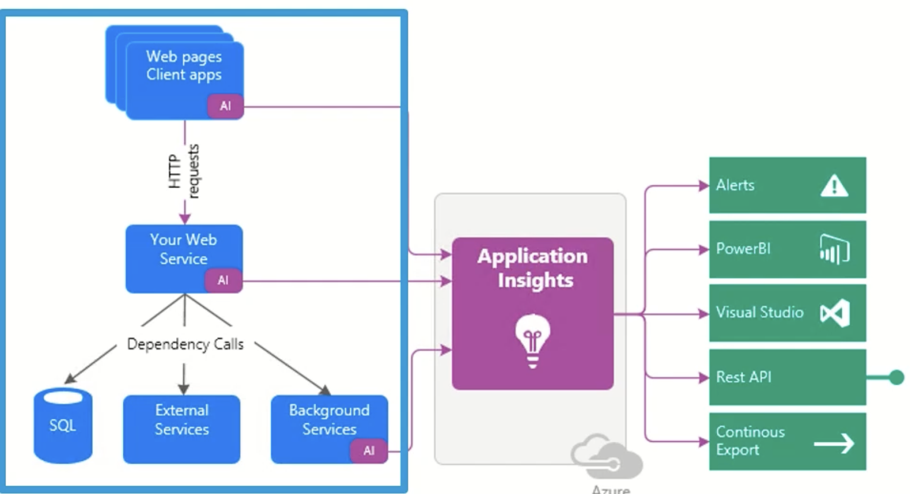

# 2 Monitoring Microsoft Azure Resources and Workloads

## 2 Azure Monitoring Fundamentals

### 1-1 Collecting Data with Azure Monitor

Here's a concise summary of the Azure Monitor data collection article:

1.  **Diverse Data Sources:** Azure Monitor collects data from numerous sources including:
    *   Azure resources (VMs, SQL DB, networks, etc.)
    *   Applications (custom apps, OS info from VMs)
    *   Azure Subscription (health/availability)
    *   Azure Tenant (e.g., Microsoft Entra ID)
    *   Hybrid environments (e.g., on-prem SQL with Azure agents)


3.  **Primary Data Types:**
    *   **Metrics:** Numerical time-series data for real-time/short-term performance monitoring (e.g., CPU%, disk I/O, memory pressure).
    *   **Logs:** Detailed event/activity records (e.g., security logs, application logs, Windows/Linux system logs, resource state changes).
    *   **Traces:** Data for tracking request flows in distributed applications (e.g., via Application Insights).
    *   **Changes:** Tracks modifications to Azure resources over time.

*Focus:* The article (and course) emphasizes **Metrics** (real-time performance) and **Logs** (detailed troubleshooting) as the most common and impactful data types.

4.  **Enabling Collection:**
    *   **Automatic:** Basic data collection starts immediately when an Azure resource is created.
    *   **Enhanced Setup:** Requires configuration for deeper insights:
        *   Enable diagnostic logging on resources (e.g., Azure SQL DB).
        *   Install Azure Monitor agents on VMs.
        *   Use the **Data Collector API** to send data from custom applications (web apps, functions, mobile apps).


### 1-2 Taking Action on Azure Monitor Data

#### 1. **Data Analysis Tools**

- **Metrics Explorer**: Visualizes real-time numerical data (CPU%, memory, disk I/O) via charts to track performance trends and set threshold-based alerts.
- **Log Analytics**: Performs deep investigation using **Kusto Query Language (KQL)** or a point-and-click interface. Combines logs (Windows events, Linux syslogs, errors) for troubleshooting complex issues.
- **Key Difference**:  
  - *Metrics*: Real-time resource health (automatic collection).  
  - *Logs*: Detailed event analysis (may require setup like Log Analytics workspace).

**Analytics**

**Metrics Explorer**：  Create charts, analyze trends, and identify fluctuations in metric values

**Log Analytics**： Detailed log investigation and custom queries for in-depth troubleshooting

#### **Analytics Use Cases**

**Metrics Explorer**

- Real-time performance monitoring
- Metrics like CPU, memory, disk
- Threshold-based alerts
- Quick visual overview
- Immediately collected

**Log Analytics**

- Deep analysis
- Multiple log types and sources
- Tracking event or error patterns
- Powerful KQL queries
- Requires steps to enable

---

#### 2. **Visualization Options**


- **Dashboards**: Static, high-level view of multiple resources in one place
	- Static views in Azure portal showing metrics, logs, or insights. Ideal for quick team sharing.

- **Workbooks**: A flexible tool for dynamically interacting with data
	- Interactive reports combining multiple datasets for real-time analysis and deep troubleshooting.

- **Power BI**: **Business analytics service for advanced reporting**
	- Advanced business reporting (e.g., executive dashboards), integrates external data, and automates updates.

- **Grafana**: **Open-source dashboard platform**
	- Open-source dashboards for multi-cloud monitoring (AWS/GCP) and third-party tools (Dynatrace, New Relic).

**Analytics Use Cases**

- **Dashboards**: View real-time resource health in the Azure portal
- **Workbooks**： Investigate performance trends and troubleshoot issues
- **Power BI**： Executive reports or sharing business insights outside Azure
- **Grafana**  Unified monitoring across cloud platforms and external tool

---

#### 3. **Automated Actions & Alerts**

- **Alerts**: Trigger notifications (email/SMS/webhooks) based on metric thresholds or log patterns.
- **Autoscaling**: Dynamically adjusts resources (e.g., VMs) to optimize performance/cost.
- **AIOps**: Automates anomaly detection and issue resolution.
- **Insights**: Microsoft’s pre-built monitoring experiences for key services (e.g., VMs, containers, networks).

---

#### Key Takeaways
- **Act on Data**: Tools transform raw data into actionable insights (e.g., autoscaling from CPU metrics).
- **Visualization Fit**:  
  - Dashboards → Quick health checks  
  - Workbooks → Interactive analysis  
  - Power BI/Grafana → Cross-platform or executive reporting  
- **Automation**: Alerts and AIOps enable proactive responses to issues.  
- **Start with Insights**: Microsoft-curated templates accelerate monitoring setup.  

> 💡 **Core Value**: Azure Monitor closes the loop from data collection → analysis → visualization → automated action.

### 1-4 Demo: Configuring Alerts and Notifications

#### 🔔 **Alert Creation Methods**
1. **Portal Setup (GUI):**
   - Created **Action Group** (`pstestgroup`) with email notifications.
   - Defined an alert rule (`Cpu80Percent`) for a VM (`pstest1`):
     - **Condition:** `Max CPU > 80%` over 1 minute.
     - **Severity:** Warning.
   - Enabled email notifications via the action group.

2. **CLI Method (Azure Cloud Shell):**
   - Used `az monitor metrics alert create` to create an alert for another VM (`pstest2`):
     - **Condition:** `CPU > 40%`.
     - **Severity:** Informational (level 3).

```
az monitor metrics alert create -n "Cpu40Percent" --resource-group "1-b4e6871e-playground-sandbox" --scopes $VMID --condition
"max percentage CPU > 40" --description "Virtual machine is running at or greater than 40% CPU utilization" --evaluation-frequency 1m —-window-size 1m -- severity 3
```

---

#### ⚡ **Alert Verification**
- Ran a load-generation script to trigger alerts.
- **Results:**
  - Both alerts fired: `CPU > 40%` (pstest2) and `CPU > 80%` (pstest1).
  - Email received for the 80% alert (configured via action group).
- Incident details showed:
  - CPU progression graphs.
  - Options to update incident status (New/Acknowledged/Closed).

---

#### Demo: Analyzing with Azure Monitor Logs 💡 **Key Takeaways**

- **Action Groups:** Centralize notifications (email/SMS) for reuse across alerts.
- **Flexible Configuration:** Use GUI (portal) for one-off setups or CLI (`az`) for automation/scaling.
- **Real-Time Response:** Alerts provide:
  - Immediate visibility into thresholds (e.g., CPU spikes).
  - Contextual data for troubleshooting.
  - Notifications to streamline team response.
  
###  1-5 Demo: Analyzing with Azure Monitor Logs


Here's a concise summary of the Azure Monitor Logs analysis demo:

### 🔍 **Three Approaches to Log Analysis**
1. **Pre-Built Queries (Zero-Code):**

   - Accessed via **Queries Hub** (scoped to resources like VMs).
   - Example: "Heartbeat" query to verify VM connectivity (`pstest1`, `pstest2`).
   - Instantly shows key details: computer name, IP, last check-in time.

3. **Simple Mode (Point-and-Click GUI):**
   - Visually build queries using filters:
     - Start with table (e.g., `Event` for Windows logs).
     - Add filters: `Source → EventLog` → Specific computer (e.g., `pstest1`).
   - No KQL knowledge needed – ideal for quick ad-hoc analysis.

4. **KQL Mode (Advanced Custom Queries):**

   - Write Kusto Query Language scripts for deep investigation.
   - Example query:  
     ```kql
     Event | where EventLog == "Security" | where EventID == 4625
     ```
   - **Use Case**: Track failed logins (`EventID 4625`) across all VMs, revealing details like attacker account names (e.g., `fakeuser2`).

---

### 💡 **Key Workflow Insights**

- **Scope First**: Start by selecting a resource group/VM to target analysis.
- **Progress from Simple → Advanced**:  
  - Pre-built queries → GUI filtering → Custom KQL.
- **KQL Advantages**:  
  - SQL-like syntax (familiar for many users).  
  - Enables complex cross-VM correlation (e.g., security threat hunting).  
- **Unified Interface**: All approaches accessible in the same **Log Analytics** workspace.

---

### 🚀 **Getting Started Tips**

- **New Users**: Leverage pre-built queries + Simple mode to avoid syntax barriers.  
- **Security/Admin Teams**: Use KQL to audit events (e.g., failed logins, resource access).  
- **Troubleshooting**: Combine log types (application/security/system) for root-cause analysis.  

> **Demo Outcome**: From verifying VM health to investigating security events, Azure Monitor Logs adapts to user expertise—delivering value immediately. 🕵️♂️


## 2 Monitoring Microsoft Azure Resources and Workloads

### 2-1 Introducing Azure Diagnostics Monitoring

Here's a concise summary of the Azure diagnostics monitoring concepts:


#### ⚕️ **Service Health & Resource Health**

- **Purpose**: Personalized view of Azure platform issues affecting *your* resources (e.g., Microsoft-side outages).
- **Key Features**:
  - World map showing regional service status.
  - Historical issue tracking (resolved incidents).
  - Determines if problems are Azure-related (vs. your configuration).
- **Use Case**: "Sanity check" before troubleshooting internal issues.

---

#### 📊 **Two Core Monitoring Streams**
1. **Metrics**

   - **What**: Numerical time-series data (sampled periodically).  
   - **Examples**: 
     - *Infrastructure*: VM CPU%, disk space, network I/O.  
     - *Apps*: HTTP errors, request rates.  
   - **Analysis Tools**: Metrics Explorer, dashboards, alerts.  

3. **Logs**

   - **What**: Event-based records (discrete occurrences).  
   - **Types**:  
     - **Activity Log**: Subscription-level *control-plane* audits (e.g., "VM deleted").  
     - **Diagnostic Logs**: Resource-level *data-plane* events (e.g., VM guest OS logs).  
   - **Storage**:  
     - Metrics → Tables  
     - Logs → Blobs (e.g., IIS logs) or Log Analytics.  
   - **Analysis Tools**: Log Analytics, KQL queries.  

---

#### ⚙️ **Enabling Diagnostics**


- **Data Capture**: Send both metrics and logs to:
  - Azure Storage (tables/blobs).
  - Log Analytics workspace.
  - Event Hubs (streaming).
- **Guest OS Monitoring**: Enable for VMs to collect:
  - Performance counters (CPU/memory).
  - IIS/application logs.
  - System event logs.

---

#### 🎯 **Monitoring Goals**


1. **Break/Fix**: Rapid incident response.
2. **Optimization**: Performance tuning (e.g., scaling based on trends).
3. **Security**: Detect anomalies/breaches.
4. **Proactive Management**: Address issues before they impact users.

> **Key Insight**: Azure diagnostics provide critical visibility despite no physical access to datacenters. Start by defining *why* you need monitoring (e.g., SLA compliance, cost control).


### 2-2 Enabling Azure Diagnostics Monitoring


Here's a concise summary of the Azure diagnostic settings configuration:

#### ⚙️ **Key Configuration Features**

1. **Flexible Setup**
   
   - Create **multiple diagnostic settings** per resource.  
   - Configure *most resources* directly in **Azure Monitor** (except VM guest OS diagnostics, set at VM scope).  

---

#### 📤 **Three Output Destinations**  

| **Destination**       | **Use Case**                                                                 |
|------------------------|-----------------------------------------------------------------------------|
| **Storage Account**    | Long-term archival of raw logs/metrics (blobs/tables).                      |
| **Event Hub**          | Real-time event streaming (handles millions of events); enables downstream processing (e.g., alerts, custom analytics). |
| **Log Analytics**      | Advanced querying/analysis with KQL (Microsoft's recommended standard).     |

> 💡 **Critical Note**: Outputs are **not mutually exclusive** – send data to *multiple destinations simultaneously*.

---

#### 📊 **Data Collection Options**  

- **Varies by Resource Type**:
  
  - Some resources offer **both logs + metrics** (e.g., Azure SQL DB).  
  - Others provide **only metrics** (e.g., Azure Load Balancer) or **only logs** (e.g., Azure Policy).

- **Selectable Categories**: Choose specific log types/metrics to collect (e.g., audit logs, performance counters).

---

#### 💡 **Key Takeaway**  

Azure diagnostic settings offer **centralized, customizable pipelines** to route monitoring data where it’s needed – whether for compliance (storage), real-time ops (Event Hubs), or deep analysis (Log Analytics). Always verify supported data types per resource.

### 2-3 Azure Monitor Data Sources

Here's a concise summary of Azure Monitor's data layers and capabilities:

### ⚙️ **Three Layers of Metrics Collection**

Azure Monitor Metrics Data Sources

**Platform metrics / Guest OS metrics / Application metrics / Custom metrics**


1. **Platform Metrics**

   - Automatically collected baseline metrics (e.g., VM CPU%, network I/O).  
   - Requires **no configuration** – available out-of-the-box.  

3. **Guest OS Metrics**

   - Enriched via **agents** (Windows/Linux VMs):  
     - Performance counters (Windows)  
     - Syslogs (Linux)  
     - Windows Event Logs  

4. **Application Metrics**

   - Via **Application Insights** (APM):  
     - HTTP requests, dependencies, performance issues  
   - Custom metrics from application code

5. **Custom metrics**

---


| **Tool**               | **Purpose**                                                                 | **Key Features**                                  |  
|-------------------------|-----------------------------------------------------------------------------|--------------------------------------------------|  
| **Metrics Explorer**    | Visualize platform/guest metrics                                            | Multi-resource charts, baselining, alert creation |  
| **Log Analytics**       | Unify & analyze logs across resources                                       | Kusto Query Language (KQL), normalized data tables |  
| **Application Insights**| Monitor app performance (PaaS/IaaS)                                         | End-to-end transaction tracing, instrumentation  |  

> 🔍 **Log Analytics Backend**: Built on **Azure Data Explorer (ADE)** – a scalable engine for log normalization/querying.


#### Monitor Log Data

**Disparate data sources**  Log formats / VMs / Storage accounts

**Azure Data Explorer**

- Fast, highly scalable data exploration service
- Normalized data warehouse
- Kusto Query Language (KQL)

**Log Analytics**

- Based on ADE
- On-board VMs, storage accounts, diagnostic settings

#### App Insights



#### 📈 **Baselining & Proactive Monitoring**  

- **Purpose**: Establish performance norms to detect anomalies.  
- **Workflow**:
  
  1. **Collect continuous metrics/logs** 
  2. **Define "normal" operational parameters (e.g., peak/valley trends)** 
  3. **Alert on deviations ** 
  4. **Trigger automated actions (e.g., scaling, notifications)**

- **Critical Tip**: Avoid over-instrumentation – start with critical baselines.


---

#### 🔑 **Key Distinctions**  

- **Log Analytics vs. Application Insights**: 

  - *Log Analytics*: Aggregates **infrastructure/OS logs**.  
  - *App Insights*: Tracks **application-layer performance** (code-level).
  
- **KQL (Kusto Query Language)**: SQL-like syntax for cross-resource log queries.  

> 💡 **Pro Tip**: Use Metrics Explorer for real-time resource health dashboards and Log Analytics/KQL for deep forensic analysis.


### 2-6 Demo: Configure Diagnostics Settings

#### ⚙️ **Enabling Diagnostics**

1. **Resource-Level Setup**
   
   - **Most Resources**: Configure via **Azure Monitor → Diagnostics settings**
     
     - *Example*: Network interface (`vm2-nic`) enabled with:  
       - Archival to storage account (`Contosodiag1`)  
       - Streaming to Event Hub (`pshub704/diagnostics`)  
       - Optional Log Analytics integration  
     - *Resource Variations*:  
       - Network interfaces → **Metrics only**  
       - NSGs → **Logs only** (network events/rule counters)  


2. **Virtual Machines (Special Case)**
   
   - Enabled via **VM blade → Diagnostics settings**  
   - Installs **Azure Diagnostics Extension** (Windows/Linux):  
     - **Windows**: Performance counters, Event Logs, IIS logs  
     - **Linux**: Syslog, disk/CPU/memory metrics  
   - Requires **running VM state** for configuration  
   - Storage account mandatory for data retention  

---

#### 📊 **Metrics Explorer Demo**

1. **Plotting Metrics**  
   - Scope: Select VM resource (`vm1`)  
   - Metric: `Percentage CPU` (host-level)  
   - Customization:  
     - Aggregation (Avg/Min/Max)  
     - Time range (default 24h → adjustable)  
     - Chart types (line/bar/area)  

2. **Persistence Options**  
   - **Pin to dashboard**: Real-time monitoring  
   - **Copy link**: Save chart configuration (avoids recreation)  

---

#### 💡 **Key Insights**

- **Automatic Baseline Metrics**: Collected for *all* resources (even without diagnostics)  
- **Agent-Dependent Data**: Richer metrics (e.g., guest OS) require extension installation  
- **Resource Differences**:  
  - VMs need per-instance configuration  
  - Non-VM resources use centralized Monitor settings  
- **Pro Tip**: Use **Chart Link Sharing** to preserve complex metric views  

> **Demo Workflow**: Enabled diagnostics → Customized VM metrics → Visualized CPU usage → Saved chart for reuse.


###  2-7 Azure Monitor Log Search


#### ⚡ **Alert Rule Components**

1. **Target Resources**  
   - Monitored Azure resources (e.g., VMs, databases)
2. **Signals**  
   - Trigger events (e.g., VM restart, CPU threshold breach)
3. **Logic/Condition**  
   - Boolean criteria defining when to fire (e.g., *"CPU > 80% for 5 minutes"*)

#### 🛠️ **Action Groups**

- **Reusable workflows** triggered by alerts
- **Actions beyond notifications**:
  - Run scripts (PowerShell/Python/C#) for auto-remediation (e.g., restart VM)
  - Integrate with ITSM tools (ServiceNow, Jira)
  - Notify via email/SMS/push/voice
  - Trigger Azure Functions or Logic Apps

#### 📊 **Monitoring & Auditing**

- Track alert states (fired/resolved)
- Audit trails for all actions
- Historical incident analysis

#### 💰 **Pricing**

- **Free tier**:  
  - 1,000 email/push notifications monthly  
- **Beyond free tier**:  
  - Low-cost per notification (check [Azure Alerts Pricing](https://azure.microsoft.com/pricing/details/monitor/))


#### 💡 **Key Value**

- **Proactive ops**: Transform monitoring → automated response  
- **Unified platform**: No need for custom notification systems  
- **Scalable**: Handles enterprise workloads with pay-as-you-go model  

> Example: Auto-restart VMs when shutdowns occur, with audit logs and SMS alerts.

###  2-8 Azure Monitor Log Search


Here's a concise summary of Azure Monitor Log Analytics capabilities:

#### 📊 **Core Functionality**

1. **Workspace Architecture**  
   - Central **Log Analytics workspace** aggregates logs from all onboarded resources  
   - Data automatically **normalized/indexed** into virtual tables with unified schema  

2. **Kusto Query Language (KQL)**  
   - SQL-like syntax with Splunk/PowerShell similarities  
   - Dynamic query editor in Azure portal with live visualization toggle (tables ↔ charts)  

---

#### 🚀 **Key Features**

- **Export & Integration**  
  - Save/share queries across teams  
  - Export to CSV/Power BI for dashboards  
  - Trigger alerts from query results  
- **Pre-Built Solutions**  
  - **Azure Marketplace solutions** (e.g., *Activity Log Analytics*)  
  - Centralized views across subscriptions  
  - Ready-made dashboards/visualizations  

---

#### 🔍 **Activity Log Analytics Example**

- **Purpose**: Unified *control-plane* auditing ("who did what when")  
- **Capabilities**:  
  - Aggregate admin logs across **multiple subscriptions**  
  - Run cross-subscription KQL queries  
  - Pre-configured dashboards for access/change analysis  


---

#### 💡 **Critical Value Propositions**

1. **Schema Normalization**  
   - Transforms disparate log formats into query-friendly tables  
2. **Unified Operations**  
   - Single pane for infrastructure/app/audit logs  
3. **Extensible Ecosystem**  
   - Marketplace solutions accelerate monitoring setup  
4. **Proactive Alerting**  
   - Convert log patterns into actionable triggers  


> **Example Workflow**: Onboard VMs → Query failed logins (KQL) → Visualize attack patterns → Automate security alerts.

### 2-9 Demo: Perform Log Searches

#### 🛠️ **Workspace Setup & Configuration**

1. **Create Workspace**:  
   - Foundation for log aggregation (e.g., `ps-workspace`).  
2. **Onboard Data Sources**:  
   - Connect VMs, storage accounts, activity logs via **Diagnostic Settings**.  
   - **Key constraint**: A VM can link to *only one* workspace at a time.  
3. **Install Log Analytics Agent**:  
   - Automatically deployed when connecting VMs → streams OS/resource data to workspace.  

---

#### 🔌 **Extending Capabilities with Solutions**

- **Azure Marketplace Solutions**:  
  - Pre-built tools (e.g., `AzureBackup`, `NetworkMonitoring`) add specialized dashboards/queries.  
  - Install via **Solutions** blade → enhances workspace functionality.  
  - *Note*: Each solution has its own pricing (check exercise files).  

---

#### 🔍 **Querying with KQL (Kusto Query Language)**

1. **Access Interfaces**:  
   - **Azure Portal**: Built-in Logs interface.  
   - **Query Playground**: Microsoft-hosted sandbox (authenticate via Azure AD).  
2. **Key Features**:  
   - **IntelliSense**: Auto-complete for tables/commands (e.g., `Perf`, `SecurityEvent`).  
   - **Cross-Table Queries**: Join data from multiple sources (e.g., `search SecurityEvent | where ...`).  
   - **Time Filters**: Use `ago()` for dynamic time ranges (e.g., `where TimeGenerated > ago(1h)`).  
3. **Query Examples**:  
   ```kql
   Perf | where TimeGenerated > ago(24h) | summarize count() by ObjectName, CounterName
   ```
   ```kql
   SecurityEvent | where EventID == 4625 // Failed logins
   ```
```
search in (SecurityEvent) "Cryptographic"
take 10

Perf | 
where TimeGenerated > ago (1h)
summarize count() by ObjectName, CounterName

// comments

SecurityEvent
| where Level == 8
| where EventID == 4672
Event
| where EventLog == "Application"
| where TimeGenerated > ago (24h)
| where RenderedDescription contains "cryptographic"
```

---

#### 📊 **Visualization & Export**

- **Dynamic Toggling**: Switch between table/chart views based on query results.  
- **Export Options**:  
  - **CSV**: For offline analysis.  
  - **Power BI**: Build live dashboards.  
  - **Alerts**: Trigger rules from query results.  
- **Saving/Sharing**: Reuse queries across teams.  

---

#### 💡 **Pro Tips**

1. **Use Sample Queries**: Built-in templates (e.g., "Computer performance") jumpstart analysis.  
2. **Leverage Schema Pane**: Explore tables/columns under **LogManagement**.  
3. **Playground Advantage**: Practice KQL safely using Microsoft’s demo data.  

> **Demo Workflow**: Created workspace → Onboarded VMs → Installed solutions → Ran KQL queries → Exported to CSV/Power BI.  

**Next Steps**: Deepen KQL skills using exercise files/Pluralsight courses.


## 3 Monitoring Your Spend in Microsoft Azure

### 3-1 Get Estimated Azure Costs Pre-deployment

#### 💰 **Cost Estimation Tools**

1. **Azure Pricing Calculator**  
   - Web-based tool on azure.com for pre-deployment cost modeling  
   - Supports most Azure services (VMs, databases, storage, etc.)

2. **In-Portal Estimates**  
   - Real-time cost displays when configuring resources:  
     - VM size selection shows **monthly estimates**  
     - Azure SQL DB tiers show pricing during setup  

3. **Programmatic Access**  
   - **Consumption API**: Track usage expenditures  
   - **Rate Card API**: Look up real-time pricing per service/region  

---

#### 🌍 **Critical Regional Factors**  

- **Price Variability**: Costs differ by region due to:  
  - Local energy/operational expenses  
  - Infrastructure availability  
- **Service Limitations**: Not all services available in every region  
- **Strategic Impact**: Region choice directly affects:  
  - Deployment costs (e.g., US West vs. Southeast Asia)  
  - Architecture decisions (e.g., geo-redundancy tradeoffs)  

---

#### 💡 **Key Recommendations**  

- **Always Specify Region**: Use region filters in pricing tools for accuracy  
- **Combine Tools**: Use calculator for planning + portal for real-time validation  
- **Monitor Post-Deployment**: Pair estimates with **Cost Management** for ongoing optimization  

> **Example**: A *D4s v3 VM* in **East US** = ~$299/month vs. **West Europe** = ~$327/month (illustrates regional variance).

### 3-2 Get Estimated Azure Costs Pre-deployment

#### 💳 **Core Cost Tracking Tools**

1. **Invoices**  
   - Detailed monthly expenditure breakdowns (for PAYG subscriptions).  
2. **Budgets & Alerts**  
   - Set spending limits (critical for **Enterprise Agreements**).  
   - Receive notifications at custom thresholds (e.g., 80% of budget consumed).  

---

#### 📊 **Deep Cost Analysis**

- **Azure Cost Analysis Tool**:  
  - Native portal interface for spend exploration.  
  - Tracks costs by service/resource group/tags.  
- **Cloudyn Integration**:  
  - Advanced visual dashboards (easier than spreadsheets).  
  - **Optimization Engine**:  
    - Identifies underutilized resources (e.g., "Downsize VM X to save $Y/year").  
    - Recommends reservations or rightsizing.  

---

#### ⚖️ **Cloudyn vs. Azure Advisor**

| **Feature**               | **Azure Advisor**         | **Cloudyn**               |  
|---------------------------|---------------------------|---------------------------|  
| **Cost Analysis Depth**   | Baseline recommendations  | Advanced optimization     |  
| **Visualization**         | Limited                   | Rich dashboards           |  
| **Use Case**              | Quick checks              | Enterprise cost governance|  

---

#### 💡 **Key Takeaways**

- **Proactive Controls**: Budgets/alerts prevent cost overruns.  
- **Visual Insights**: Cloudyn transforms raw data into actionable reports.  
- **Optimization**: Combine Advisor (quick wins) + Cloudyn (deep dives) for maximum savings.  
- **EA Focus**: Budget tracking is essential for credit-based subscriptions.  

> **Example**: Cloudyn might flag an underused $500/month VM that could be replaced with a $200/month instance → **$3,600/year saved**.

### 3-3 Demo: View Subscription and Cost Data


#### 🔐 **Access Control (IAM)**

- **Billing Permissions**:  
  - Assign `Billing Reader` role for read-only billing access  
  - Initial subscription creator = default billing admin (transferable)  
- **RBAC Principle**: Apply least privilege for cost visibility  

#### 💰 **Cost Management Tools**

1. **Budgets**  
   - Set spend thresholds (subscription/resource group level)  
   - Alert triggers via **Action Groups** (email/SMS)  
   - Reset periods: Monthly/Quarterly/Yearly  
2. **Invoices**  
   - Download/view PAYG invoices  
   - Email invoices directly from portal  

### ⚙️ **Subscription Administration**

- **Renaming/Organization**: Label subscriptions clearly  
- **Directory Transfer**:  
  - Move subscription between Azure AD tenants  
  - *Critical note*: **Doesn’t transfer billing ownership**  
- **Cancellation**: Directly from Overview blade  
- **Resource Providers**:  
  - Register/unregister services (troubleshooting API issues)  

### 🤝 **Partner & External Integrations**

- **Cloud Service Providers**: Link partner IDs for usage sharing  
- **Network Virtual Appliances**: View external billing linkages  

### 📊 **Key Workflow Highlights**

1. **Budget Creation**:  
   Scope → Amount → Alert conditions → Action group  
2. **Invoice Delegation**: Use "Access Invoice" to grant billing access  
3. **Directory Change Caveats**:  
   - Original directory can’t be deleted until billing ownership is transferred  
   - [Microsoft Docs](https://docs.microsoft.com/en-us/azure/cost-management-billing/manage/change-directory) for detailed process  

> **Pro Tip**: Combine budgets with Azure Monitor alerts for automated cost governance (e.g., auto-shutdown VMs at 90% budget utilization).

---

#### 💡 **Critical Takeaways**

- **Filter subscriptions** to reduce portal clutter  
- **Budgets = specialized cost alerts** (leverages Action Groups)  
- **Billing access ≠ subscription access** (manage via IAM)  
- Always verify **resource provider registration** for new services  
- Directory changes require **explicit billing ownership transfer**  

This setup enables granular cost control while maintaining security and operational flexibility.

### 3-4 Forecast and Optimize Your Azure Spend


#### ⚙️ **Cost Optimization via Azure Advisor**  

- **Key Recommendations**:  
  - **Resize/Shut Down** underutilized VMs  
  - **Delete idle VPN Gateways** (high-cost if unused)  
  - **Purchase Reserved VM Instances** (save 40-70% vs. pay-as-you-go)  
  - **Clean up orphaned resources**: Unattached public IPs, unused disks  
  - **Use Standard-tier snapshots** for managed disks (no premium needed for backups)  

---

### 📈 **Forecasting Tools**  

1. **Azure Cost Management**:  
   - Built-in portal tool for spend visualization  
   - Projects future costs based on current usage patterns  
   - Breaks down costs by service/resource/region  

2. **Cloudyn Integration**:
   
   - Advanced forecasting gradually merging into Azure Cost Management  
   - Provides richer dashboards and long-term trend analysis  

---

#### 💡 **Strategic Insights**  

- **Proactive Savings**:  
  - Reservations → Significant long-term discounts  
  - Resource hygiene → Eliminates "orphaned resource tax"  
- **Tier Optimization**:  
  - Match storage performance to actual needs (e.g., standard snapshots)  
- **Continuous Monitoring**:  
  - Combine Advisor recommendations with Cost Management trends  

> **Example Impact**:  
> - Resizing 5 underused VMs: **~$15k/year saved**  
> - Switching to reserved instances: **~60% cost reduction**  

#### 🔮 **Future Outlook**  


Microsoft is unifying Cloudyn’s depth with native Azure tools – expect:  

- Enhanced forecasting algorithms  
- Deeper cross-subscription insights  
- Automated optimization workflows  

**Next Step**: Implement Advisor recommendations + set budget alerts to lock in savings.


Here's a concise summary of Azure cost management layers and tools:

#### 🔍 **Cost Management Hierarchy**

1. **Management Groups**  
   - Organize subscriptions hierarchically (above subscriptions, below Azure AD tenant)  
   - Enable cross-subscription cost analysis  
   - *Best Practice*: Use even with single subscriptions for future scalability  

2. **Scope Control**  
   - Toggle between tenant/management group/subscription/resource views  

---

#### ⚙️ **Core Tools in Cost Management & Billing**

1. **Azure Advisor (Cost Tab)**  
   - **Free ML-powered optimization**:  
     - Reserved instance recommendations  
     - Underutilized resource identification  
     - Orphaned resource cleanup (e.g., unattached IPs)  

2. **Cost Analysis**  
   - **Key Features**:  
     - Views: Accumulated/Daily/Service/Resource costs  
     - **Tag-based grouping**: Critical for cross-resource-group tracking  
     - Export options: PNG/PDF/CSV  
   - **Time Frames**: Customizable (last 7 days, calendar months, etc.)  

3. **Cloudyn Transition**  
   - Native Azure tools now replace Cloudyn  
   - New Cloudyn registrations restricted to CSP partners  

---

#### 🏷️ **Strategic Importance of Tagging**

- **Cost Allocation**: Track expenses across projects/departments  
- **Analysis Use Case**:  
  ```markdown
  Cost Analysis → Group By → "Tag:ProjectX"  
  ```
- Solves limitation of resource-group-only tracking  

---

#### 📊 **Workflow Highlights**

1. **Navigate to**:  
   `Cost Management + Billing → Cost Management`  
2. **Set Scope**: Management group / Subscription  
3. **Analyze**: Use built-in views or custom tags  
4. **Optimize**: Implement Advisor recommendations  
5. **Export**: Share reports via PDF/CSV  

> **Pro Tip**: Combine daily cost alerts with tag-based dashboards for real-time budget control.

---

#### 💡 **Key Takeaways**

- **Management Groups > Subscriptions**: Foundation for enterprise cost governance  
- **Tags Are Non-Negotiable**: Essential for accurate cost attribution  
- **Advisor = Free Savings**: Automatically identifies waste  
- **Cloudyn Phase-Out**: Prioritize native Azure Cost Management tools  

This layered approach enables granular cost tracking from tenant-level down to individual resources.

### 3-5 Demo: Work with Azure Cost Analysis


#### 🔍 **Cost Management Hierarchy**

1. **Management Groups**  
   - Organize subscriptions hierarchically (above subscriptions, below Azure AD tenant)  
   - Enable cross-subscription cost analysis  
   - *Best Practice*: Use even with single subscriptions for future scalability  

2. **Scope Control**  
   - Toggle between tenant/management group/subscription/resource views  

---

#### ⚙️ **Core Tools in Cost Management & Billing**

1. **Azure Advisor (Cost Tab)**  
   - **Free ML-powered optimization**:  
     - Reserved instance recommendations  
     - Underutilized resource identification  
     - Orphaned resource cleanup (e.g., unattached IPs)  

2. **Cost Analysis**  
   - **Key Features**:  
     - Views: Accumulated/Daily/Service/Resource costs  
     - **Tag-based grouping**: Critical for cross-resource-group tracking  
     - Export options: PNG/PDF/CSV  
   - **Time Frames**: Customizable (last 7 days, calendar months, etc.)  

3. **Cloudyn Transition**  
   - Native Azure tools now replace Cloudyn  
   - New Cloudyn registrations restricted to CSP partners  

---

#### 🏷️ **Strategic Importance of Tagging**

- **Cost Allocation**: Track expenses across projects/departments  
- **Analysis Use Case**:  
  ```markdown
  Cost Analysis → Group By → "Tag:ProjectX"  
  ```
- Solves limitation of resource-group-only tracking  

---

#### 📊 **Workflow Highlights**

1. **Navigate to**:  
   `Cost Management + Billing → Cost Management`  
2. **Set Scope**: Management group / Subscription  
3. **Analyze**: Use built-in views or custom tags  
4. **Optimize**: Implement Advisor recommendations  
5. **Export**: Share reports via PDF/CSV  

> **Pro Tip**: Combine daily cost alerts with tag-based dashboards for real-time budget control.

---

#### 💡 **Key Takeaways**

- **Management Groups > Subscriptions**: Foundation for enterprise cost governance  
- **Tags Are Non-Negotiable**: Essential for accurate cost attribution  
- **Advisor = Free Savings**: Automatically identifies waste  
- **Cloudyn Phase-Out**: Prioritize native Azure Cost Management tools  

This layered approach enables granular cost tracking from tenant-level down to individual resources.

## 4 Microsoft Monitoring Azure Updates

### 4-1 Azure Cost Management

Here's a concise summary of Azure spend reporting in Cost Management:

#### 📊 **Core Reporting Tools**

1. **Cost Analysis Hub**  
   - **Views**:  
     - Accumulated spend  
     - Forecasted future costs  
     - Breakdowns by service/location/resource  
   - **Forecasting**: Predicts month-end spend based on current trends  

---

#### 🏷️ **Critical Features**

- **Tag Filtering**:  
  - Track costs across resource groups/subscriptions  
  - Essential for multi-department/project cost allocation  
- **Export & Sharing**:  
  - Generate CSV reports  
  - Share custom views with stakeholders  
- **Alerts Integration**:  
  - Trigger notifications at spending thresholds  

---

#### ⚠️ **Cloudyn Transition**

- **Deprecation Status**:  
  - Cloudyn (acquired by Microsoft) is being phased out  
  - Functionality now **natively integrated** into Azure Cost Management  
- **Action**: Use built-in tools instead of standalone Cloudyn  

---

#### ⚙️ **Workflow Summary**


#### 💡 **Key Takeaways**

1. **Forecasting > Retrospection**: Proactively manage budgets using prediction tools  
2. **Tag Discipline**: Implement consistent tagging for accurate cost attribution  
3. **Native Over Third-Party**: Rely on Azure's built-in cost tools (Cloudyn replacement)  
4. **Actionable Outputs**: Export data for finance teams/audits  

> **Pro Tip**: Combine daily cost alerts with tag-based dashboards for real-time budget control across projects.  

**Next Step**: Set up monthly forecast vs. actual reports using exported CSV data.

### 4-2 Azure Monitor Workbooks

#### 📘 **Azure Monitor Workbooks**

1. **Purpose**:  
   - Solves "metric overload" by providing curated monitoring views  
   - Combines **metrics**, **KQL queries**, and **markdown** in interactive reports  
2. **Key Features**:  
   - Predefined templates for common scenarios (e.g., VM performance, app health)  
   - Custom report creation with drag-and-drop components  
   - Real-time collaboration for teams  
3. **Value**:  
   - Replaces manual Metric Explorer configuration  
   - Contextualizes data (e.g., explanations + visuals + live queries)  

---

#### ⚖️ **Workbooks vs. Notebooks**

| **Feature**               | **Azure Monitor Workbooks**        | **Azure Notebooks**               |  
|---------------------------|-----------------------------------|-----------------------------------|  
| **Core Function**         | Monitoring dashboards             | Code execution + data science     |  
| **Technology**            | Native Azure tool                 | Hosted Jupyter Notebooks          |  
| **Components**            | Metrics + KQL + markdown          | Markdown + executable code (Python/R) |  
| **Primary Users**         | DevOps/IT Ops                     | Data scientists/ML engineers      |  
| **Hosting**               | Integrated in Azure Monitor       | `notebooks.azure.com`             |  

---

#### 💡 **Key Takeaways**

1. **Use Workbooks for**:  
   - Unified performance/health dashboards  
   - Combining live metrics with diagnostic logs  
   - Team-sharable operational reports  
2. **Use Notebooks for**:  
   - Exploratory data analysis  
   - Machine learning prototyping  
   - Code-heavy collaborations (e.g., Python/R scripts)  
3. **Innovation**: Workbooks simplify monitoring by pre-packaging critical insights (no manual metric hunting).  

> **Pro Tip**: Start with predefined Workbooks templates, then customize with organization-specific KQL queries.

### 4-2 Azure Monitor Workbooks

#### 🔍 **Core Evolution**  

- **Successor to "v1" VM Monitoring**: Replaces manual guest OS diagnostics + Metrics Explorer  
- **Unified Solution**: Integrates legacy Operations Management Suite (OMS) capabilities into Azure Monitor  

---

#### 🚀 **Key Features**  

1. **Performance Dashboard**  
   - Predefined views for critical metrics (CPU/memory/disk/network)  
   - Eliminates manual chart configuration in Metrics Explorer  
2. **Map (Service Map)**  
   - Visualizes dependencies between VMs/services  
   - Reveals:  
     - Active network connections (IPs/ports/protocols)  
     - Running processes and linked dependencies  
3. **Bulk Configuration**  
   - Auto-enable diagnostics across VMs via **Azure Policy**  
   - Centralized onboarding via Log Analytics workspace  

---

#### ⚙️ **Requirements** 

- **Log Analytics Workspace**: Mandatory foundation (future-proofs monitoring)  
- **Agents**: Automatic deployment during onboarding  
  - *Log Analytics agent* (data collection)  
  - *Dependency agent* (dependency mapping)  

---

#### 💡 **Strategic Value**  

- **Proactive Insights**: Detect bottlenecks/dependencies before outages  
- **Operational Efficiency**:  
  - Replace custom dashboards with out-of-box views  
  - Automate monitoring at scale (via policies)  
- **Unified Experience**: Accessible from:  
  - Individual VM blades  
  - Azure Monitor hub  

> **Demo Highlight**: Showcases how to replace fragmented monitoring with a single-pane solution.  

---

#### 🔄 **Migration Note**  

- **OMS Transition**: Original "Service Map" now fully integrated as the "Map" feature  
- **Adoption Incentive**: Microsoft’s recommended path for VM monitoring

### 4-3 Azure Monitor for VMs

Here's a concise summary of **Azure Monitor for VMs (Virtual Machine Insights)**:

#### 🔄 **Evolution from Legacy Monitoring**

- Replaces "v1" VM monitoring (manual guest OS diagnostics + Metrics Explorer)
- Integrates former **Operations Management Suite (OMS)** capabilities
- Requires a **Log Analytics workspace** (foundation for modern monitoring)

---

#### 🖥️ **Core Features**

1. **Performance Dashboard**  
   - Predefined views for critical metrics (CPU/memory/disk/network)  
   - Eliminates manual chart configuration  
2. **Map (Service Map)**  
   - Visualizes dependencies between VMs/services  
   - Reveals:  
     - Live network connections (IPs/ports/protocols)  
     - Running processes and dependencies  

---

#### ⚡ **Key Advantages**

- **Bulk Configuration**:  
  - Auto-enable monitoring across VMs via **Azure Policy**  
  - Centralized onboarding (portal/API/templates)  
- **Unified Access**:  
  - Available from individual VM blades *and* Azure Monitor hub  
- **Future-Proof**:  
  - Microsoft's strategic direction for VM monitoring  

---

#### ⚙️ **Deployment Workflow**


> **Demo Highlight**: Showcases seamless transition from legacy diagnostics to automated insights with dependency mapping.

---

#### 💡 **Why Adopt?**

- **Proactive Optimization**: Identify bottlenecks before outages  
- **Operational Efficiency**: Replace fragmented tools with a single pane  
- **Enterprise Scale**: Manage 1000s of VMs via policy-driven enforcement  


### 4-4 Demo: Enable Azure Monitor for VM

#### ⚙️ **Onboarding Methods**  

1. **Per-VM Enablement**:  
   - Navigate to VM → **Monitoring** → **Insights** → Enable  
   - Select **Log Analytics workspace**  
   - Automatically deploys:  
     - *Log Analytics agent* (metrics/logs)  
     - *Dependency agent* (Service Map)  

2. **Bulk Enablement**:  
   - Use **Azure Monitor hub** → **Virtual Machines**  
   - View **monitored/unmonitored VMs**  
   - Configure **workspace assignment**  
   - Leverage **Azure Policy/REST API/ARM templates** for automation  

---

#### 🔍 **Key Features Enabled**  

| **Feature**       | **Purpose**                                                                 |  
|-------------------|-----------------------------------------------------------------------------|  
| **Performance**   | Prebuilt dashboards for CPU/memory/disk/network                            |  
| **Map (Service Map)** | Visualize dependencies between VMs/services (ports/protocols/connections) |  

---

#### ⚠️ **Critical Notes**  

- **Multi-Homing Support**: VMs *can* report to **multiple workspaces** (advanced scenario)  
- **Agent Requirements**:  
  - Windows: Event logs, IIS, crash dumps  
  - Linux: Syslog data  
- **Legacy vs. Modern**:  
  - *Old method*: "Guest OS diagnostics" (storage account-based)  
  - *New standard*: **Insights** (Log Analytics-centric)  

---

#### 🚀 **Workflow Comparison**  


#### 💡 **Key Takeaways**  

1. **Centralization**: Log Analytics workspace is now the monitoring backbone  
2. **Scale Matters**: Use Azure Monitor hub for enterprise deployments (100s of VMs)  
3. **Dependency Mapping**: Service Map reveals hidden infrastructure relationships  
4. **Future-Proof**: Insights replaces legacy diagnostics (Microsoft's strategic path)  

**Pro Tip**: Start with Insights onboarding via Azure Policy to enforce monitoring standards across all VMs.


### 4-5 Demo: Integrate Azure Policy


#### ⚙️ **Azure Policy for Monitoring Automation**

1. **Purpose**:  
   - Enforce monitoring compliance at scale  
   - **Automate deployment of monitoring agents**  
   - **Enable **Azure Monitor for VMs** across environments**  

2. **Key Built-in Initiatives**:  
   - **Enable Azure Monitor for VMs**:  
     - Auto-deploys Log Analytics agent to **Windows/Linux VMs**  
   - **Enable Azure Monitor for Scale Sets**:  
     - Applies same monitoring to VM scale sets  

---

#### 🔧 **Implementation Workflow**

```mermaid
graph TD
A[Azure Policy → Definitions] --> B{Filter:}
B --> C[Category: Monitoring]
B --> D[Type: Built-in]
C --> E[Select Initiative]
E --> F[Assign to Scope]
```



1. Navigate: `Policy > Authoring > Definitions`  
2. Filter:  
   - *Category*: `Monitoring`  
   - *Type*: `Built-in`  
3. Assign initiatives to:  
   - Management groups  
   - Subscriptions  
   - Resource groups  

---

#### 📦 **Initiative Components**

| **Initiative**                     | **Policies Included**                          |  
|------------------------------------|----------------------------------------------|  
| **Enable Azure Monitor for VMs**    | - Deploy Log Analytics agent (Windows)       |  
|                                    | - Deploy Log Analytics agent (Linux)         |  
| **Enable for Scale Sets**           | - Equivalent policies for VM scale sets      |  

---

#### 💡 **Key Benefits**

- **Zero-Touch Onboarding**: Automates agent deployment  
- **Consistency**: Ensures 100% VM monitoring coverage  
- **Remediation**: Auto-fixes non-compliant resources  
- **Governance Integration**: Part of broader Azure governance framework  

> **Pro Tip**: Combine with Azure Monitor's "Insights" onboarding for end-to-end monitoring enforcement. Assign initiatives at **management group level** for enterprise-wide coverage.

### 4-6 Demo: View Azure Monitor VM Data

#### ⚙️ **Onboarding Workflow**

1. **Bulk Enablement**:  
   - From **Azure Monitor → Virtual Machines** view  
   - Identify non-monitored VMs across subscriptions/resource groups  
   - Select VMs → "Enable" → Choose existing Log Analytics workspace  
   - *Critical Note*: Avoid accidentally creating new workspaces (demo mishap)  

2. **Per-VM Method**:  
   - VM blade → **Insights** → Select workspace → Enable  
   - Auto-deploys agents (Log Analytics + Dependency agents)  

---

#### 📊 **Performance Dashboard**

- **Prebuilt Metrics Visualization**:  
  - CPU/Memory/Disk/Network charts across multiple VMs  
  - Interactive tooltips show per-VM values  
  - Aggregation options: Min/Max/Avg/Percentiles  
- **Advantage vs. Metrics Explorer**:  
  - No manual configuration required  
  - Unified view of critical metrics  

---

#### 🌐 **Service Map (Dependency Visualization)**
| **Feature**          | **Value**                                                                 |  
|----------------------|---------------------------------------------------------------------------|  
| **Connections**      | Live inbound/outbound links (IPs/ports/protocols)                        |  
| **Processes**        | Running services (e.g., 22 processes on `spot1` in demo)                 |  
| **Dependency Mapping** | Critical for migrations (identify all dependencies pre-move)             |  

*Example*:  
- `spot1` showed 11 external connections on port 443  
- Azure DNS names revealed cloud dependencies  

---

#### 🔑 **Key Insights**

1. **Scalability**:  
   - Onboard 100s of VMs via Azure Monitor hub (not just per-VM)  
2. **Migration Safety**:  
   - Service Map prevents post-move outages by exposing hidden dependencies  
3. **Hybrid Support**:  
   - Works with Azure Arc-enabled on-premises servers  
   - Includes VM scale sets  
4. **Workbook Integration**:  
   - All views are prebuilt Azure Workbooks (customizable)  

> **Pro Tip**: Use Service Map before ANY VM migration/change to audit connections. Combine with Azure Policy for auto-remediation of unmonitored resources.

### 4-8 Where You See KQL 

#### 🔍 **KQL Essentials**

1. **Origin & Purpose**:  
   - Named after explorer *Jacques Cousteau* (homophone "Kusto")  
   - Designed as a **data exploration language** for large-scale analytics  
   - Internally used by Microsoft for years before public release  

---

#### ⚙️ **Key Azure Services Using KQL**

| **Service**               | **Use Case**                                                                 |  
|---------------------------|-----------------------------------------------------------------------------|  
| **Azure Log Analytics**   | Query logs across Azure/hybrid resources (primary interface)               |  
| **Application Insights**  | Analyze application performance/traces                                     |  
| **Azure Sentinel (SIEM)** | Investigate security threats/incidents                                     |  
| **Azure Data Explorer (ADX)** | High-speed data exploration on petabyte-scale datasets                  |  

---

#### 💡 **Strategic Value**

1. **Certification & Career**:  
   - Critical for Azure certification exams  
   - High-value industry skill for cloud monitoring/security roles  
2. **Unified Language**:  
   - Single syntax across monitoring/security/data services  
3. **Performance**:  
   - Optimized for fast queries on massive datasets (billions of records)  

---

#### 🌐 **Azure Data Explorer (ADX) Notes**

- **Web-based service** (not desktop app)  
- Uses **compute clusters** for parallel query processing  
- Supports both **SQL** and **KQL** interfaces  
- Handles petabyte-scale data exploration  

> 💡 **Pro Tip**: Mastering KQL unlocks deep insights across Azure's monitoring ecosystem – prioritize learning its core operators (`where`, `summarize`, `join`, `render`).  

```
StormEvents
| limit 100
```

**Azure Data Explorer (ADX)**


