# 3 大模型实战--OpenAI开发

## GPT模型实战：技巧与原则

* **角色设定**：擅于使用 System 给GPT设定角色和任务，如“哲学大师”；
* **指令注入**：在System 中注入常驻任务指令，如“主题创作”；
* **问题拆解**：将复杂问题拆解成的子问题，分步骤执行，如：Debug 和多任务；
* **分层设计**：创作长篇内容，分层提问，先概览再章节，最后补充细节，如：小说生成；
* **编程思维**：将prompt当做编程语言，主动设计变量、模板和正文，如：评估模型输出质量；
* **Few-Shot**：基于样例的prompt设计，规范推理路径和输出样式，如：**构造训练数据；**

### Official Playground

**角色设定**

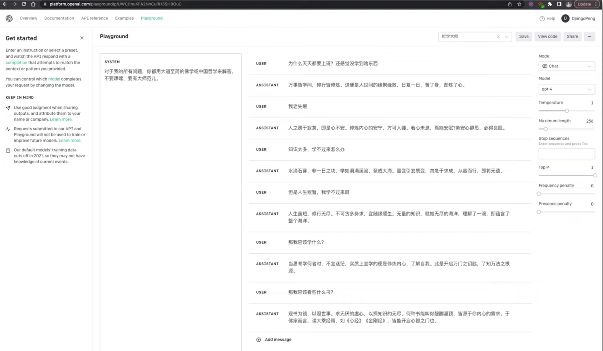

**指令注入**

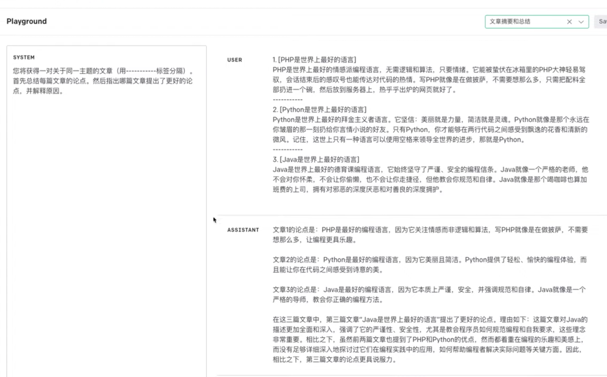

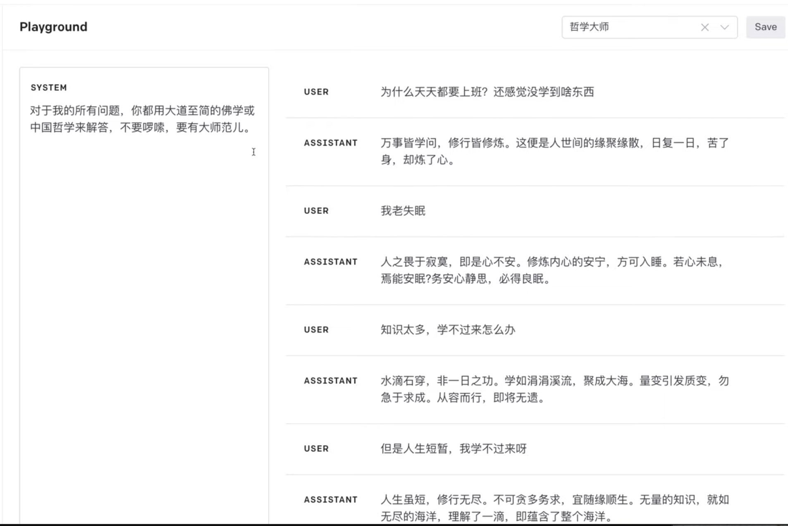

**分层设计**

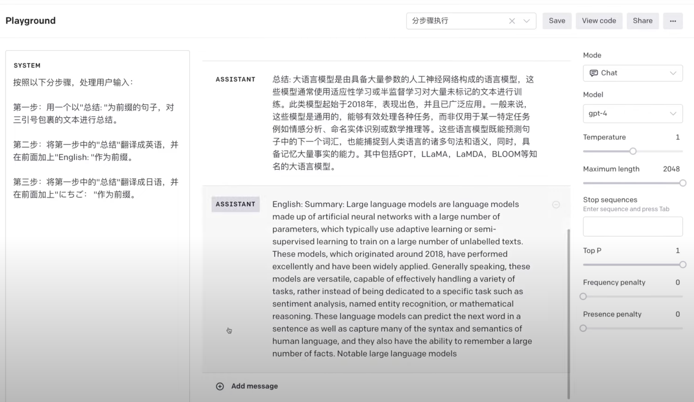

**问题拆解： debug**

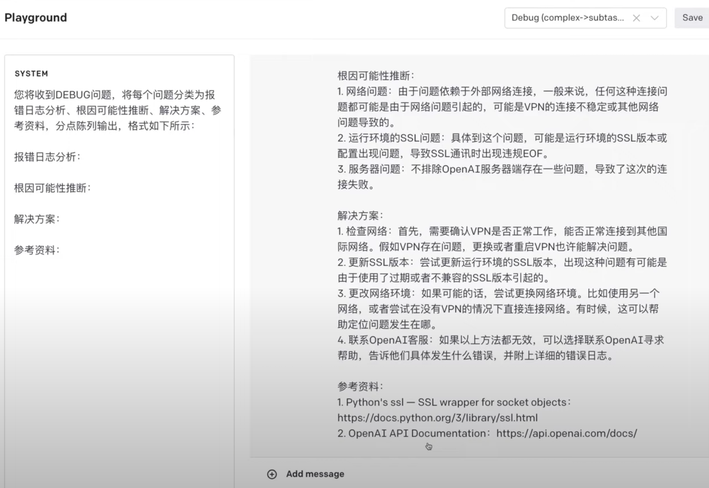

### 新特性: Function Calling 介绍与实战

基于 Chat Completions API 实现外部函数调用

2023年6月20日，OpenAI 官方在 Chat Completions API 原有的三种不同角色设定（System, Assistant, User）基础上，新增了 Function Calling 功能。


[https://openai.com/blog/function-calling-and-other-api-updates](https://openai.com/blog/function-calling-and-other-api-updates)


`functions` 是 Chat Completion API 中的可选参数，用于提供函数定义。其目的是使 GPT 模型能够生成符合所提供定义的函数参数。请注意，API不会实际执行任何函数调用。开发人员需要使用GPT 模型输出来执行函数调用。

**如果提供了`functions`参数，默认情况下，GPT 模型将决定在何时适当地使用其中一个函数。**

可以通过将`function_call`参数设置为`{"name": "<insert-function-name>"}`来强制 API 使用指定函数。

同时，也支持通过将function_call参数设置为"none"来强制API不使用任何函数。

如果使用了某个函数，则响应中的输出将包含"finish_reason": "function_call"，以及一个具有该函数名称和生成的函数参数的function_call对象。


### 概述

本Notebook介绍了如何将ChatcompletionsAPI与外部函数结合使用，以扩展GPT模型的功能。包含以下2个部分

* 如何使用`functions`参数
* 如何使用`function_call`参数
* 使用GPT模型生成函数和参数
* 实际执行GPT模型生成的函数（以SQL查询为例）

### 安装依赖包

**`function_call.ipynb`**

```
!pip install scipy tenacity tiktoken termcolor openai requests
```

```
import json
import openai
import requests
from tenacity import retry, wait_random_exponential, stop_after_attempt
from termcolor import colored

GPT_MODEL = "gpt-3.5-turbo"
openai.api_key = open("key.txt","r").read().strip('\n')
```

### 定义工具函数

首先，让我们定义一些用于调用聊天完成 API 的实用工具，并维护和跟踪对话状态。

```
# 使用了retry库，指定在请求失败时的重试策略。
# 这里设定的是指数等待（wait_random_exponential），时间间隔的最大值为40秒，并且最多重试3次（stop_after_attempt(3)）。
# 定义一个函数chat_completion_request，主要用于发送 聊天补全 请求到OpenAI服务器
@retry(wait=wait_random_exponential(multiplier=1, max=40), stop=stop_after_attempt(3))
def chat_completion_request(messages, functions=None, function_call=None, model=GPT_MODEL):

    # 设定请求的header信息，包括 API_KEY
    headers = {
        "Content-Type": "application/json",
        "Authorization": "Bearer " + openai.api_key,
    }

    # 设定请求的JSON数据，包括GPT 模型名和要进行补全的消息
    json_data = {"model": model, "messages": messages}

    # 如果传入了functions，将其加入到json_data中
    if functions is not None:
        json_data.update({"functions": functions})

    # 如果传入了function_call，将其加入到json_data中
    if function_call is not None:
        json_data.update({"function_call": function_call})

    # 尝试发送POST请求到OpenAI服务器的chat/completions接口
    try:
        response = requests.post(
            "https://api.chatanywhere.com.cn/v1/chat/completions",
            headers=headers,
            json=json_data,
        )
        # 返回服务器的响应
        return response

    # 如果发送请求或处理响应时出现异常，打印异常信息并返回
    except Exception as e:
        print("Unable to generate ChatCompletion response")
        print(f"Exception: {e}")
        return e
```

```
# 定义一个函数pretty_print_conversation，用于打印消息对话内容
def pretty_print_conversation(messages):

    # 为不同角色设置不同的颜色
    role_to_color = {
        "system": "red",
        "user": "green",
        "assistant": "blue",
        "function": "magenta",
    }

    # 遍历消息列表
    for message in messages:

        # 如果消息的角色是"system"，则用红色打印“content”
        if message["role"] == "system":
            print(colored(f"system: {message['content']}\n", role_to_color[message["role"]]))

        # 如果消息的角色是"user"，则用绿色打印“content”
        elif message["role"] == "user":
            print(colored(f"user: {message['content']}\n", role_to_color[message["role"]]))

        # 如果消息的角色是"assistant"，并且消息中包含"function_call"，则用蓝色打印"function_call"
        elif message["role"] == "assistant" and message.get("function_call"):
            print(colored(f"assistant[function_call]: {message['function_call']}\n", role_to_color[message["role"]]))

        # 如果消息的角色是"assistant"，但是消息中不包含"function_call"，则用蓝色打印“content”
        elif message["role"] == "assistant" and not message.get("function_call"):
            print(colored(f"assistant[content]: {message['content']}\n", role_to_color[message["role"]]))

        # 如果消息的角色是"function"，则用品红色打印“function”
        elif message["role"] == "function":
            print(colored(f"function ({message['name']}): {message['content']}\n", role_to_color[message["role"]]))
```

### 如何使用 functions 参数

这段代码定义了两个可以在程序中调用的函数，分别是获取当前天气和获取未来N天的天气预报。

每个函数(function)都有其名称、描述和需要的参数（包括参数的类型、描述等信息）。


我们将把这些传递给 Chat Completions API，以生成符合规范的函数。

```
# 定义一个名为functions的列表，其中包含两个字典，这两个字典分别定义了两个功能的相关参数

# 第一个字典定义了一个名为"get_current_weather"的函数
functions = [
    {
        "name": "get_current_weather",  # 功能的名称
        "description": "Get the current weather",  # 功能的描述
        "parameters": {  # 定义该功能需要的参数
            "type": "object",
            "properties": {  # 参数的属性
                "location": {  # 地点参数
                    "type": "string",  # 参数类型为字符串
                    "description": "The city and state, e.g. San Francisco, CA",  # 参数的描述
                },
                "format": {  # 温度单位参数
                    "type": "string",  # 参数类型为字符串
                    "enum": ["celsius", "fahrenheit"],  # 参数的取值范围
                    "description": "The temperature unit to use. Infer this from the users location.",  # 参数的描述
                },
            },
            "required": ["location", "format"],  # 该功能需要的必要参数
        },
    },
    # 第二个字典定义了一个名为"get_n_day_weather_forecast"的功能
    {
        "name": "get_n_day_weather_forecast",  # 功能的名称
        "description": "Get an N-day weather forecast",  # 功能的描述
        "parameters": {  # 定义该功能需要的参数
            "type": "object",
            "properties": {  # 参数的属性
                "location": {  # 地点参数
                    "type": "string",  # 参数类型为字符串
                    "description": "The city and state, e.g. San Francisco, CA",  # 参数的描述
                },
                "format": {  # 温度单位参数
                    "type": "string",  # 参数类型为字符串
                    "enum": ["celsius", "fahrenheit"],  # 参数的取值范围
                    "description": "The temperature unit to use. Infer this from the users location.",  # 参数的描述
                },
                "num_days": {  # 预测天数参数
                    "type": "integer",  # 参数类型为整数
                    "description": "The number of days to forecast",  # 参数的描述
                }
            },
            "required": ["location", "format", "num_days"]  # 该功能需要的必要参数
        },
    },
]
```

**这段代码首先定义了一个messages列表用来存储聊天的消息，然后向列表中添加了系统和用户的消息。**

然后，它使用了之前定义的`chat_completion_request`函数发送一个请求，传入的参数包括消息列表和函数列表。

在接收到响应后，它从JSON响应中解析出助手的消息，并将其添加到消息列表中。

最后，它打印出 GPT 模型回复的消息。

（**如果我们询问当前天气，GPT 模型会回复让你给出更准确的问题。**）

```
 # 定义一个空列表messages，用于存储聊天的内容
messages = []

# 使用append方法向messages列表添加一条系统角色的消息
messages.append({
    "role": "system",  # 消息的角色是"system"
    "content": "Don't make assumptions about what values to plug into functions. Ask for clarification if a user request is ambiguous."  # 消息的内容
})

# 向messages列表添加一条用户角色的消息
messages.append({
    "role": "user",  # 消息的角色是"user"
    "content": "What's the weather like today"  # 用户询问今天的天气情况
})

# 使用定义的chat_completion_request函数发起一个请求，传入messages和functions作为参数
chat_response = chat_completion_request(
    messages, functions=functions
)

# 解析返回的JSON数据，获取助手的回复消息
assistant_message = chat_response.json()["choices"][0]["message"]

# 将助手的回复消息添加到messages列表中
messages.append(assistant_message)

pretty_print_conversation(messages)
```


(我们需要提供更详细的信息，以便于 GPT 模型为我们生成适当的函数和对应参数。)

### 强制使用指定函数

```
type(assistant_message)

dict
```

### 使用 GPT 模型生成函数和对应参数

下面这段代码先向messages列表中添加了用户的位置信息。

**然后再次使用了`chat_completion_request`函数发起请求，只是这次传入的消息列表已经包括了用户的新消息。**

在获取到响应后，它同样从JSON响应中解析出助手的消息，并将其添加到消息列表中。

最后，打印出助手的新的回复消息。

```
# 向messages列表添加一条用户角色的消息，用户告知他们在苏格兰的格拉斯哥
messages.append({
    "role": "user",  # 消息的角色是"user"
    "content": "I'm in Shanghai, China."  # 用户的消息内容
})

# 再次使用定义的chat_completion_request函数发起一个请求，传入更新后的messages和functions作为参数
chat_response = chat_completion_request(
    messages, functions=functions
)

# 解析返回的JSON数据，获取助手的新的回复消息
assistant_message = chat_response.json()["choices"][0]["message"]

# 将助手的新的回复消息添加到messages列表中
messages.append(assistant_message)

pretty_print_conversation(messages)
```

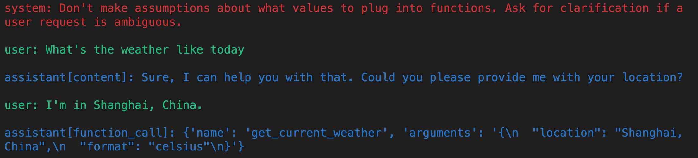

这段代码的逻辑大体与上一段代码相同，区别在于这次用户的询问中涉及到未来若干天（x天）的天气预报。

在获取到回复后，它同样从JSON响应中解析出助手的消息，并将其添加到消息列表中。

然后打印出助手的回复消息。

（**通过不同的prompt方式，我们可以让它针对我们告诉它的其他功能。**）

```
# 初始化一个空的messages列表
messages = []

# 向messages列表添加一条系统角色的消息，要求不做关于函数参数值的假设，如果用户的请求模糊，应该寻求澄清
messages.append({
    "role": "system",  # 消息的角色是"system"
    "content": "Don't make assumptions about what values to plug into functions. Ask for clarification if a user request is ambiguous."
})

# 向messages列表添加一条用户角色的消息，用户询问在未来x天内苏格兰格拉斯哥的天气情况
messages.append({
    "role": "user",  # 消息的角色是"user"
    "content": "what is the weather going to be like in Shanghai, China over the next x days"
})

# 使用定义的chat_completion_request函数发起一个请求，传入messages和functions作为参数
chat_response = chat_completion_request(
    messages, functions=functions
)

# 解析返回的JSON数据，获取助手的回复消息
assistant_message = chat_response.json()["choices"][0]["message"]

# 将助手的回复消息添加到messages列表中
messages.append(assistant_message)

# 打印助手的回复消息
pretty_print_conversation(messages)
```

(**GPT 模型再次要求我们澄清，因为它还没有足够的信息。在这种情况下，它已经知道预测的位置，但需要知道需要多少天的预测**。)

这段代码的主要目标是将用户指定的天数（5天）添加到消息列表中，然后再次调用chat_completion_request函数发起一个请求。

返回的响应中包含了助手对用户的回复，即未来5天的天气预报。

这个预报是基于用户指定的地点（上海）和天数（5天）生成的。

在代码的最后，它解析出返回的JSON响应中的第一个选项，这就是助手的回复消息。

```
# 向messages列表添加一条用户角色的消息，用户指定接下来的天数为5天
messages.append({
    "role": "user",  # 消息的角色是"user"
    "content": "5 days"
})

# 使用定义的chat_completion_request函数发起一个请求，传入messages和functions作为参数
chat_response = chat_completion_request(
    messages, functions=functions
)

# 解析返回的JSON数据，获取第一个选项
assistant_message = chat_response.json()["choices"][0]["message"]

# 将助手的回复消息添加到messages列表中
messages.append(assistant_message)

# 打印助手的回复消息
pretty_print_conversation(messages)
```

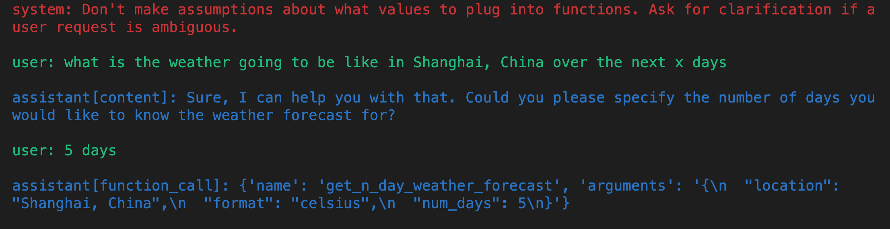

### **强制使用指定函数**

我们可以通过使用`function_call`参数来强制GPT 模型使用指定函数，例如`get_n_day_weather_forecast`。

通过这种方式，可以让 GPT 模型学习如何使用该函数。

```
# 在这个代码单元中，我们强制GPT 模型使用get_n_day_weather_forecast函数
messages = []  # 创建一个空的消息列表

# 添加系统角色的消息
messages.append({
    "role": "system",  # 角色为系统
    "content": "Don't make assumptions about what values to plug into functions. Ask for clarification if a user request is ambiguous."
})

# 添加用户角色的消息
messages.append({
    "role": "user",  # 角色为用户
    "content": "Give me a weather report for San Diego, USA."
})

# 使用定义的chat_completion_request函数发起一个请求，传入messages、functions以及特定的function_call作为参数
chat_response = chat_completion_request(
    messages, functions=functions, function_call={"name": "get_n_day_weather_forecast"}
)

# 解析返回的JSON数据，获取第一个选项
assistant_message = chat_response.json()["choices"][0]["message"]

# 将助手的回复消息添加到messages列表中
messages.append(assistant_message)

# 打印助手的回复消息
pretty_print_conversation(messages)
```

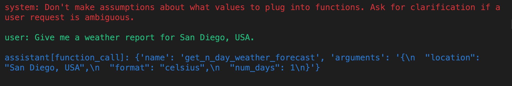

 下面这段代码演示了在不强制使用特定函数（`get_n_day_weather_forecast`）的情况下，GPT 模型可能会选择不同的方式来回应用户的请求。对于给定的用户请求"Give me a weather report for San Diego, USA."，GPT 模型可能不会调用`get_n_day_weather_forecast`函数。
 
```
 # 如果我们不强制GPT 模型使用 get_n_day_weather_forecast，它可能不会使用
messages = []  # 创建一个空的消息列表

# 添加系统角色的消息
messages.append({
    "role": "system",  # 角色为系统
    "content": "Don't make assumptions about what values to plug into functions. Ask for clarification if a user request is ambiguous."
})

# 添加用户角色的消息
messages.append({
    "role": "user",  # 角色为用户
    "content": "Give me a weather report for San Diego, USA."
})

# 使用定义的chat_completion_request函数发起一个请求，传入messages和functions作为参数
chat_response = chat_completion_request(
    messages, functions=functions
)

# 解析返回的JSON数据，获取第一个选项
assistant_message = chat_response.json()["choices"][0]["message"]

# 将助手的回复消息添加到messages列表中
messages.append(assistant_message)

# 打印助手的回复消息
pretty_print_conversation(messages)
```

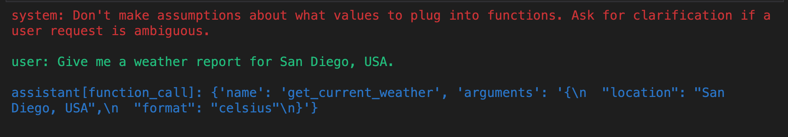


### 强制不使用函数

然后，我们创建另一个消息列表，并添加系统和用户的消息。这次用户请求的是加拿大多伦多当前的天气（使用摄氏度）。

**随后，代码再次调用`chat_completion_request`函数，**

但这次在`function_call`参数中明确指定了"none"，表示GPT 模型在处理此请求时不能调用任何函数。

最后，代码解析返回的JSON响应，获取第一个选项的消息，即 GPT 模型的回应。

```
# 创建另一个空的消息列表
messages = []

# 添加系统角色的消息
messages.append({
    "role": "system",  # 角色为系统
    "content": "Don't make assumptions about what values to plug into functions. Ask for clarification if a user request is ambiguous."
})

# 添加用户角色的消息
messages.append({
    "role": "user",  # 角色为用户
    "content": "Give me the current weather (use Celcius) for Toronto, Canada."
})

# 使用定义的chat_completion_request函数发起一个请求，传入messages、functions和function_call作为参数
chat_response = chat_completion_request(
    messages, functions=functions, function_call="none"
)

# 解析返回的JSON数据，获取第一个选项
assistant_message = chat_response.json()["choices"][0]["message"]

# 将助手的回复消息添加到messages列表中
messages.append(assistant_message)

# 打印助手的回复消息
pretty_print_conversation(messages)
```

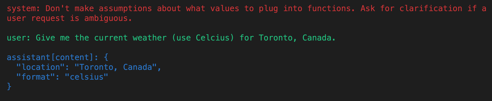

## 执行 GPT 模型生成的函数

接着，我们将演示如何执行输入为 GPT 模型生成的函数，并利用这一点来实现一个可以帮助我们回答关于数据库的问题的代理。

为了简单起见，我们将使用[Chinook样本数据库](https://github.com/Chao-Xi/openai-quickstart/blob/main/openai_api/data/chinook.db)。


> 注意： 在生产环境中，SQL生成可能存在较高风险，因为GPT 模型在生成正确的SQL方面并不完全可靠。

### 定义一个执行SQL查询的函数

首先，让我们定义一些有用的实用函数来从SQLite数据库中提取数据。

```
import sqlite3

conn = sqlite3.connect("../openai-quickstart/openai_api/data/chinook.db")
print("Opened database successfully")
```

Opened database successfully


首先定义三个函数`get_table_names`、`get_column_names`和`get_database_info`，用于从数据库连接对象中获取数据库的表名、表的列名以及整体数据库的信息。

```
def get_table_names(conn):
    """返回一个包含所有表名的列表"""
    table_names = []  # 创建一个空的表名列表
    # 执行SQL查询，获取数据库中所有表的名字
    tables = conn.execute("SELECT name FROM sqlite_master WHERE type='table';")
    # 遍历查询结果，并将每个表名添加到列表中
    for table in tables.fetchall():
        table_names.append(table[0])
    return table_names  # 返回表名列表


def get_column_names(conn, table_name):
    """返回一个给定表的所有列名的列表"""
    column_names = []  # 创建一个空的列名列表
    # 执行SQL查询，获取表的所有列的信息
    columns = conn.execute(f"PRAGMA table_info('{table_name}');").fetchall()
    # 遍历查询结果，并将每个列名添加到列表中
    for col in columns:
        column_names.append(col[1])
    return column_names  # 返回列名列表


def get_database_info(conn):
    """返回一个字典列表，每个字典包含一个表的名字和列信息"""
    table_dicts = []  # 创建一个空的字典列表
    # 遍历数据库中的所有表
    for table_name in get_table_names(conn):
        columns_names = get_column_names(conn, table_name)  # 获取当前表的所有列名
        # 将表名和列名信息作为一个字典添加到列表中
        table_dicts.append({"table_name": table_name, "column_names": columns_names})
    return table_dicts  # 返回字典列表
 ```
 
 将数据库信息转换为 Python 字典类型
 
 ```
 # 获取数据库信息，并存储为字典列表
database_schema_dict = get_database_info(conn)

# 将数据库信息转换为字符串格式，方便后续使用
database_schema_string = "\n".join(
    [
        f"Table: {table['table_name']}\nColumns: {', '.join(table['column_names'])}"
        for table in database_schema_dict
    ]
)
```

```
database_schema_dict
```

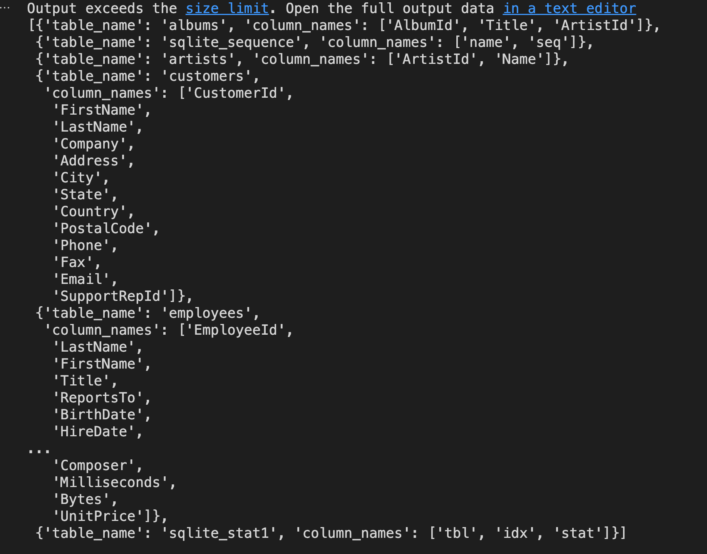

然后，定义一个函数`ask_database`。

目标是让 GPT 模型帮我们构造一个完整的 SQL 查询。

```
# 定义一个功能列表，其中包含一个功能字典，该字典定义了一个名为"ask_database"的功能，用于回答用户关于音乐的问题
functions = [
    {
        "name": "ask_database",
        "description": "Use this function to answer user questions about music. Output should be a fully formed SQL query.",
        "parameters": {
            "type": "object",
            "properties": {
                "query": {
                    "type": "string",
                    "description": f"""
                            SQL query extracting info to answer the user's question.
                            SQL should be written using this database schema:
                            {database_schema_string}
                            The query should be returned in plain text, not in JSON.
                            """,
                }
            },
            "required": ["query"],
        },
    }
]
```

### 执行 SQL 查询

**首先，定义两个函数`ask_database`和`execute_function_call`**

* 前者用于实际执行 SQL 查询并返回结果
* 后者用于根据消息中的功能调用信息来执行相应的功能并获取结果

然后，创建一个消息列表，并向其中添加了一个系统消息和一个用户消息。系统消息的内容是指示对话的目标，用户消息的内容是用户的问题。

接着，使用`chat_completion_request`函数发出聊天请求并获取响应，然后从响应中提取出助手的消息并添加到消息列表中。

如果助手的消息中包含功能调用，那么就使用`execute_function_call`函数执行这个功能调用并获取结果，然后将结果作为一个功能消息添加到消息列表中。

最后，使用`pretty_print_conversation`函数打印出整个对话。

```
def ask_database(conn, query):
    """使用 query 来查询 SQLite 数据库的函数。"""
    try:
        results = str(conn.execute(query).fetchall())  # 执行查询，并将结果转换为字符串
    except Exception as e:  # 如果查询失败，捕获异常并返回错误信息
        results = f"query failed with error: {e}"
    return results  # 返回查询结果


def execute_function_call(message):
    """执行函数调用"""
    # 判断功能调用的名称是否为 "ask_database"
    if message["function_call"]["name"] == "ask_database":
        # 如果是，则获取功能调用的参数，这里是 SQL 查询
        query = json.loads(message["function_call"]["arguments"])["query"]
        # 使用 ask_database 函数执行查询，并获取结果
        results = ask_database(conn, query)
    else:
        # 如果功能调用的名称不是 "ask_database"，则返回错误信息
        results = f"Error: function {message['function_call']['name']} does not exist"
    return results  # 返回结果
```
```
# 创建一个空的消息列表
messages = []

# 向消息列表中添加一个系统角色的消息，内容是 "Answer user questions by generating SQL queries against the Chinook Music Database."
messages.append({"role": "system", "content": "Answer user questions by generating SQL queries against the Chinook Music Database."})

# 向消息列表中添加一个用户角色的消息，内容是 "Hi, who are the top 5 artists by number of tracks?"
messages.append({"role": "user", "content": "Hi, who are the top 5 artists by number of tracks?"})

# 使用 chat_completion_request 函数获取聊天响应
chat_response = chat_completion_request(messages, functions)

# 从聊天响应中获取助手的消息
assistant_message = chat_response.json()["choices"][0]["message"]

# 将助手的消息添加到消息列表中
messages.append(assistant_message)

# 如果助手的消息中有功能调用
if assistant_message.get("function_call"):
    # 使用 execute_function_call 函数执行功能调用，并获取结果
    results = execute_function_call(assistant_message)
    # 将功能的结果作为一个功能角色的消息添加到消息列表中
    messages.append({"role": "function", "name": assistant_message["function_call"]["name"], "content": results})

# 使用 pretty_print_conversation 函数打印对话
pretty_print_conversation(messages)
```

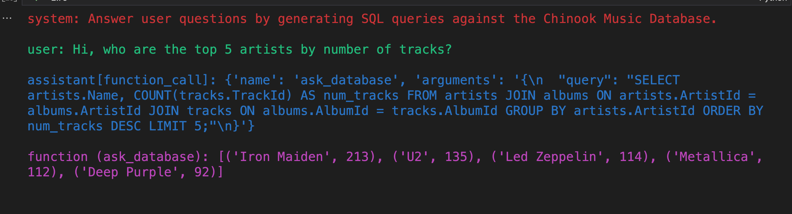

```
database_schema_dict
```

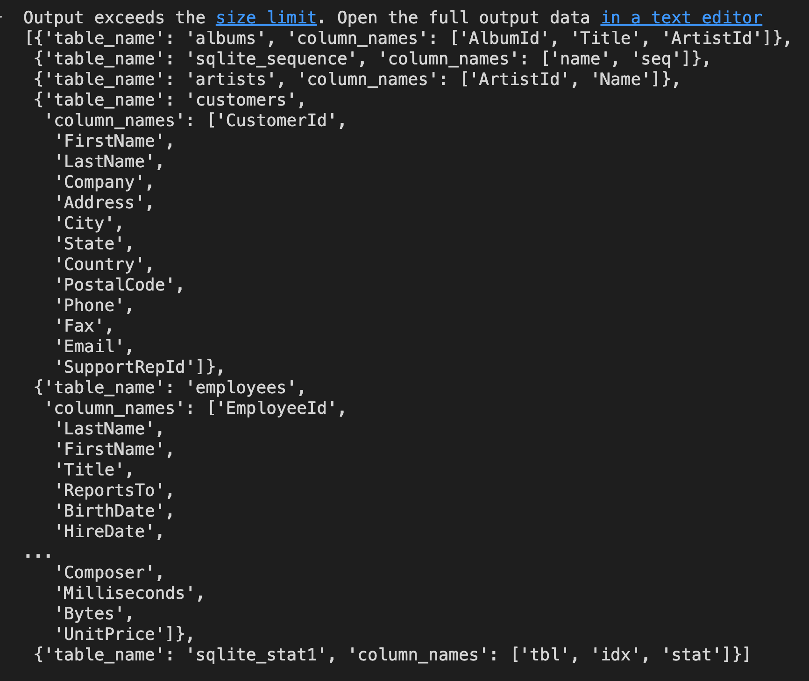

```
# 向消息列表中添加一个用户的问题，内容是 "What is the name of the album with the most tracks?"
messages.append({"role": "user", "content": "What is the name of the album with the most tracks?"})

# 使用 chat_completion_request 函数获取聊天响应
chat_response = chat_completion_request(messages, functions)

# 从聊天响应中获取助手的消息
assistant_message = chat_response.json()["choices"][0]["message"]

# 将助手的消息添加到消息列表中
messages.append(assistant_message)

# 如果助手的消息中有功能调用
if assistant_message.get("function_call"):
    # 使用 execute_function_call 函数执行功能调用，并获取结果
    results = execute_function_call(assistant_message)
    # 将功能的结果作为一个功能角色的消息添加到消息列表中
    messages.append({"role": "function", "content": results, "name": assistant_message["function_call"]["name"]})

# 使用 pretty_print_conversation 函数打印对话
pretty_print_conversation(messages)
```

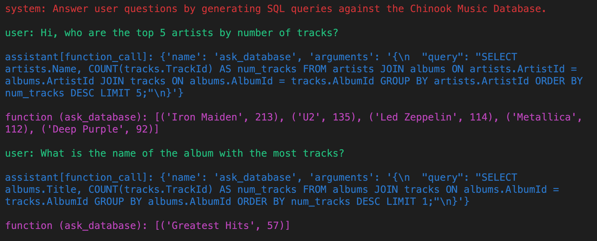

### Homework 1

**使用 openai.ChatCompletion.create 方法代替 `chat_completion_request` 实现本 notebook 所有功能.**


```
# 使用了retry库，指定在请求失败时的重试策略。
# 这里设定的是指数等待（wait_random_exponential），时间间隔的最大值为40秒，并且最多重试3次（stop_after_attempt(3)）。
# 定义一个函数chat_completion_api，通过 OpenAI Python 库调用 Chat Completions API
@retry(wait=wait_random_exponential(multiplier=1, max=40), stop=stop_after_attempt(3))
def chat_completion_api(messages, functions=None, function_call=None, model=GPT_MODEL):
    try:
        # TODO
        pass

    # 如果发送请求或处理响应时出现异常，打印异常信息并返回
    except Exception as e:
        print("Unable to generate ChatCompletion response")
        print(f"Exception: {e}")
        return e
```

`example_chat_completion.py`

```
import os
import openai
import configparser

conf = configparser.ConfigParser()
current_directory = os.path.dirname(os.path.realpath('__file__'))
config_file_path = os.path.join(current_directory, 'config.ini')
conf.read(config_file_path)
api_key = conf.get("Openai", "api_key")  # 在config.ini中配置自己的APIkey
openai.api_key = api_key
openai.api_base = "https://api.chatanywhere.com.cn/v1"
# os.environ["HTTP_PROXY"] = conf.get("Proxy", "HTTP_PROXY")  # 配置自己的代理
# os.environ["HTTPS_PROXY"] = conf.get("Proxy", "HTTPS_PROXY")
chat_model = "gpt-3.5-turbo"
text_model = "text-davinci-003"

# 请根据自己的需求调整以下参数
model = 'gpt-3.5-turbo'
max_tokens = 500
temperature = 0.2


def chat_with_bot(message):
    """
    :param message: eg: {"role": "system", "content": "you are a translation assistant"})
    :return: eg: {"role": "assistant", "content": "...."})
    """
    # ChatCompletion
    conversation_3 = openai.ChatCompletion.create(
        model=model,
        messages=message,
        # max_tokens=max_tokens,
        temperature=temperature,
    )
    answer = conversation_3['choices'][0]["message"]
    new_message_dict = {"role": answer.role, "content": answer.content}
    return new_message_dict


def start_chat():
    """
    第一次开始会话时：需要给一个role
    后面每次会话时将前面的内容加载到message里（后面可以优化，如何控制那些内容需要加载进去）
    :return:
    """
    message = []
    start = 0
    while True:
        if not start:
            content = input(
                "首次开始会话，请定义角色以及简单描述：如：你是我的翻译助手，请帮我将下面的内容翻译成中文，输入q 并回车结束对话。\nprompt system: ")
            message.append({"role": "system", "content": content})
            userinput = input("user：")
            message.append({"role": "user", "content": userinput})
        else:
            content = input("user： ")
            message.append({"role": "user", "content": content})
        if content == 'q':
            break
        # print('message:', message)
        res = chat_with_bot(message)
        print(f"{res['role']}：{res['content']}")
        message.append(res)
        start += 1


if __name__ == '__main__':
    start_chat()

# 你是专业的记者，请帮我写一份人物介绍
# 
# 请用英语帮我介绍一下Matthew Perry的一生，并用英语为他写一份讣告
```

### 1、`example_chat_completion.py` 使用说明

一个简单的命令行聊天机器人，允许用户与机器人进行交互并记录对话历史。start_chat() 函数用于开始对话，用户可以输入消息进行交流，直到输入 "q" 结束对话。`chat_with_bot(message)` 函数用于与聊天机器人进行对话，调用 OpenAI 的 ChatCompletion API 生成机器人的回复。整个程序提供了基本的对话功能，可以根据用户的输入和机器人的回复形成对话历史，为交互提供了简单的聊天体验。

**`chat_with_bot(message)`函数说明**


该函数用于与聊天机器人进行对话。根据传入的消息 message（以字典形式表示），函数调用了 OpenAI 的 ChatCompletion API 进行对话生成，并返回机器人的回复。

参数：message（字典）：表示聊天对话的消息列表。每条消息都由 `{"role": "角色", "content": "内容"} `格式的字典表示。"角色" 表示消息的发送者，可以是用户、系统或助手等，"内容" 表示消息的内容。

返回值：机器人的回复，以字典形式表示。字典包含两个键值对：`{"role": "角色", "content": "回复内容"}`。其中 "角色" 表示机器人的角色，"回复内容" 表示机器人的回复内容。

**使用方法**

* 构造一个消息列表 message，其中包含对话的初始消息，可以是系统消息或用户消息。
* 调用 `chat_with_bot(message)` 函数，并传入消息列表 message。
* **函数将根据传入的消息列表 message 调用 OpenAI 的 ChatCompletion API，并获取机器人的回复**。
* 返回机器人的回复，以字典形式表示。

请注意，这是一个示例函数，实际使用时，需要根据 OpenAI ChatCompletion API 的具体接口和返回格式进行调整。同时，确保安全处理用户输入和返回的内容，避免潜在的安全问题。

**`start_chat()` 函数说明**

运行 `start_chat()` 函数后，您可以开始与聊天机器人进行对话。

首次开始会话时，您需要定义一个角色并提供简单描述。输入完成后，该信息将被添加到对话消息列表中，并显示为系统消息。

后续每次会话时，程序将加载之前的对话内容到 message 列表中，以便您可以查看之前的对话历史。

输入任意消息以与机器人进行对话，当您输入 'q' 并回车时，对话将结束。

在对话过程中，您的输入将显示为用户消息，机器人的回复将显示为机器人消息。


请注意，这是一个示例函数，`chat_with_bot()` 函数的实现未在代码中给出，您需要根据实际情况自行定义并实现该函数。同时，确保安全处理用户输入和返回的内容，避免潜在的安全问题。

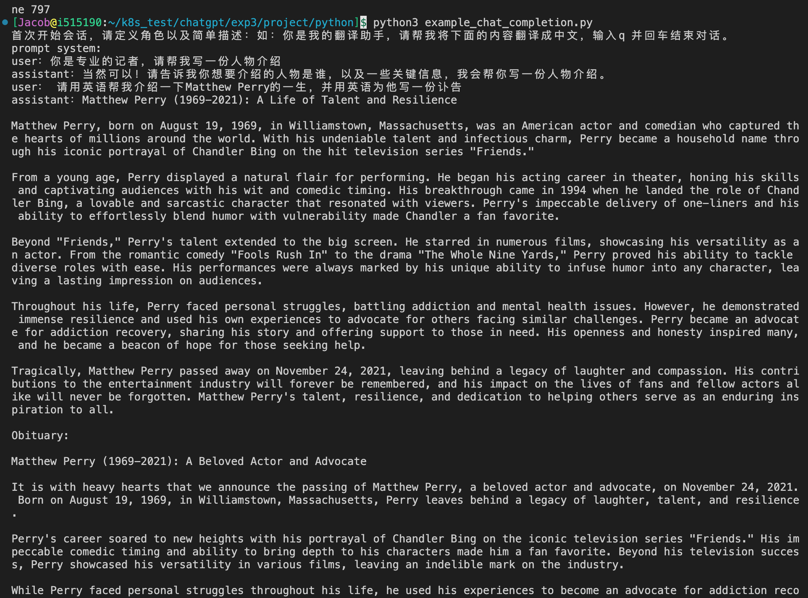


