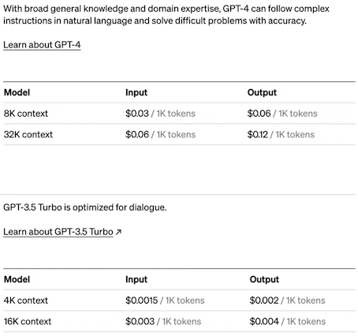
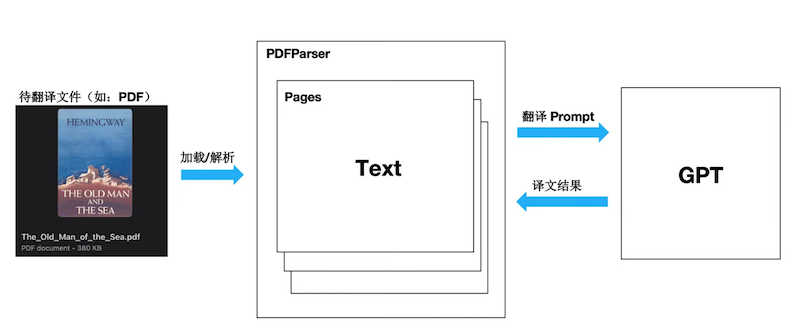
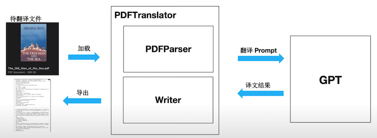
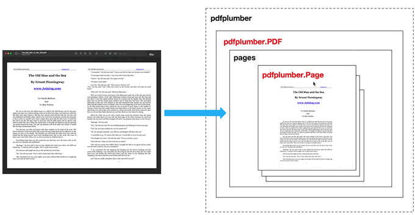
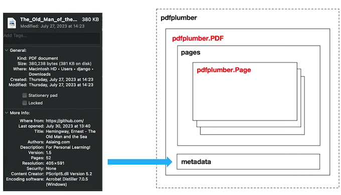
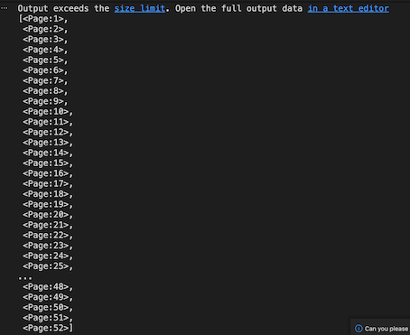
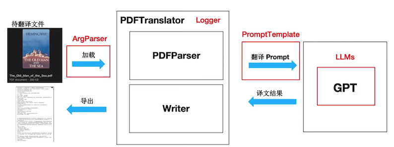

# 4 基于 ChatGPT 开发智能翻译助手


## OpenAI-Translator

### 成本分析：人力vsGPT

下表列出了不同服务类型下不同类型文件的翻译价格（仅供参考）。

参考价格基于如下情况：翻译语言组合为意大利语至英语，常规主题，标准交付周期（从项目的第二个工作日开始，以每天约2500字的进度计算）




数据安全：在线翻译需上传整个文件


### 数据安全：大模型

* GPT 服务方式：一定程度上解决了完整文件上传问题
* API调用方式：**拆分文档，无需上传整份文件**
* OpenAl 隐私协议：具有相对可靠的契约精神和法律保障
* 私有化大模型：端到端解决隐私安全问题


## OpenAl-Translator 产品定义与功能规划

### 产品规划(v1.0)

Feat List

* 支持PDF 文件格式解析
* 支持英文翻译成中文。
* 支持OpenAl 和 ChatGLM 模型
* 通过 YAML 文件或命令行参数灵活配置。
* 模块化和面向对象的设计 ，易于定制和扩展。

**设计思路**





* PDF 解析: pdfplumber (Python 开源库)





## 使用 pdfplumber 解析 PDF 文件

### 项目简介

[pdfplumber](https://github.com/jsvine/pdfplumber) 项目(基于pdfminer.six开发)，支持解析PDF文件，获取每个文本字符、矩形和线条的详细信息。此外还支持表格提取和可视化调试。

对于机器生成的PDF而言效果最佳，不适用于扫描得到的PDF。

支持：Python 3.8~3.11

本 Notebook 主要内容如下：

- 加载PDF文件
- 提取单页文本
- 提取单页表格
- 可视化调试页面
- 提取页面图像


### 加载PDF文件

要开始处理PDF，请调用`pdfplumber.open(x)`方法，其中x可以是：

* PDF 文件路径
* 作为字节加载的文件对象
* 作为字节加载的类似文件的对象

**高级加载参数**

要加载受密码保护的PDF，请传递password关键字参数，例如：`pdfplumber.open("file.pdf", password="test")`。

要设置布局分析参数到`pdfminer.six`的布局引擎中，请传递laparams关键字参数，例如：

`pdfplumber.open("file.pdf", laparams={"line_overlap": 0.7})`

### pdfplumber.PDF 类(Top-level)

`pdfplumber.PDF`类表示一个独立的PDF文件，两个主要成员变量：

| 属性 | 描述 |
|----------|-------------|
|`.metadata`| 一个由PDF的 `Info` 尾部信息中的元数据键/值对组成的字典。通常包括 "CreationDate," "ModDate," "Producer," 等等。|
|`.pages`| 包含每个已加载页面的 `pdfplumber.Page` 实例的列表。|

**一个主要成员方法：**

| 方法 | 描述 |
|--------|-------------|
|`.close()`| 默认情况下，`Page` 对象会缓存其布局和对象信息，以避免重新处理。然而，在解析大型PDF时，这些缓存的属性可能需要大量内存。你可以使用此方法来清除缓存并释放内存。（在 `<= 0.5.25` 版本中，使用 `.flush_cache()`。）|

```
pyenv local 3.9.0

$ pyenv versions
  system
* 3.9.0 (set by /Users/i515190/k8s_test/chatgpt/.python-version)

pip3 install pdfplumber
```


```
import pdfplumber

pdf = pdfplumber.open("The_Old_Man_of_the_Sea.pdf")

pdf.metadata
```

```
'CreationDate': "D:20060717205532+08'00'",
 'Subject': 'For Personal Learning!',
 'Author': 'Asiaing.com',
 'Creator': 'PScript5.dll Version 5.2',
 'Producer': 'Acrobat Distiller 7.0.5 (Windows)',
 'ModDate': "D:20060717210222+08'00'",
 'Title': 'Hemingway, Ernest - The Old Man and the Sea'}
```
 
```
pdf.pages
```



```
type(pdf.pages[0])
```

**`pdfplumber.page.Page`**

### pdfplumber.Page 类

`pdfplumber.Page` 类是 `pdfplumber` 的核心，表示PDF文件中一页单独的内容。

当我们使用 `pdfplumber` 时，大部分操作都会围绕这个类展开。

主要成员变量如下：

| 属性 | 描述 |
|----------|-------------|
|`.page_number`| 顺序页码，从第一页开始为 `1`，第二页为 `2`，以此类推。|
|`.width`| 页面的宽度。|
|`.height`| 页面的高度。|
|`.objects` / `.chars` / `.lines` / `.rects` / `.curves` / `.images`| 这些属性都是列表，每个列表包含页面上嵌入的每个此类对象的一个字典。

```
pdf = pdfplumber.open("test.pdf")

pages = pdf.pages
print(pages)
```

Output: `[<Page:1>, <Page:2>]`

```
pages[0].page_number
```

Output: 1

```
print(pages[0].width, pages[0].height)
```

Output: `595 842`

```
# 可视化第1页
pages[0].to_image()
```


```
# 可视化第2页（尝试调整分辨率和抗锯齿）
pages[1].to_image()
```


### 提取页面图像

`pdfplumber.Page`  对象没有 `extract_images` 方法，所以不能直接从 PDF 页面中提取图像。

但是，**可以通过页面操作来截取和获取图像**，`pdfplumber.Page`类相关成员变量如下：


| 属性 | 描述 |
|----------|-------------|
|`.width`| 页面的宽度。|
|`.height`| 页面的高度。|
|`.objects` / `.chars` / `.lines` / `.rects` / `.curves` / `.images`| 这些属性都是列表，每个列表包含页面上嵌入的每个此类对象的一个字典。


相关成员方法：

| 方法 | 描述 |
|--------|-------------|
|`.crop(bounding_box, relative=False, strict=True)`| 返回裁剪到边界框的页面版本，边界框应表示为4元组，值为 `(x0, top, x1, bottom)`。裁剪的页面保留至少部分在边界框内的对象。如果对象只部分在框内，其尺寸将被切割以适应边界框。如果 `relative=True`，则边界框是从页面边界框的左上角偏移计算的，而不是绝对定位。（请参见 [Issue #245](https://github.com/jsvine/pdfplumber/issues/245) 以获取视觉示例和解释。）当 `strict=True`（默认值）时，裁剪的边界框必须完全在页面的边界框内。|
|`.within_bbox(bounding_box, relative=False, strict=True)`| 类似于 `.crop`，但只保留 *完全在* 边界框内的对象。|
|`.outside_bbox(bounding_box, relative=False, strict=True)`| 类似于 `.crop` 和 `.within_bbox`，但只保留 *完全在* 边界框外的对象。|
|`.filter(test_function)`| 返回只有 `test_function(obj)` 返回 `True` 的 `.objects` 的页面版本。|

```
# 从 PageImage 中获取页面图像分辨率
pages[1].images
```
Output

```
[{'x0': 61.25348,
  'y0': 443.9213,
  'x1': 533.74648,
  'y1': 801.8948,
  'width': 472.493,
  'height': 357.97350000000006,
  'stream': <PDFStream(17): raw=1522591, {'Type': /'XObject', 'Subtype': /'Image', 'Width': 1288, 'Height': 975, 'Interpolate': True, 'ColorSpace': <PDFObjRef:18>, 'Intent': /'Perceptual', 'BitsPerComponent': 8, 'Length': 1522590, 'Filter': /'FlateDecode'}>,
  'srcsize': (1288, 975),
  'imagemask': None,
  'bits': 8,
  'colorspace': [[/'ICCBased',
    <PDFStream(19): raw=2758, {'N': 3, 'Alternate': /'DeviceRGB', 'Length': 2757, 'Filter': /'FlateDecode'}>]],
  'mcid': None,
  'tag': None,
  'object_type': 'image',
  'page_number': 2,
  'top': 40.10519999999997,
  'bottom': 398.0787,
  'doctop': 882.1052}]
```

```
img = pages[1].images[0]

bbox = (img["x0"], img["top"], img["x1"], img["bottom"])

cropped_page = pages[1].crop(bbox)

# 可视化裁剪后的第二页
cropped_page.to_image()
```


```
cropped_page.to_image(antialias=True)
```

可视化裁剪+抗锯齿


```
cropped_page.to_image(resolution=1080)
```


```
im = cropped_page.to_image(antialias=True)
im.save("pdf_image_test.png")
```

## 改进设计思路




[https://github.com/Chao-Xi/openai-quickstart/tree/main/openai-translator
](https://github.com/Chao-Xi/openai-quickstart/tree/main/openai-translator)

**核心模块**

* PDF 文档解析 (PDFParser) 模块
* 文档导出 (Writter）模块
* 大模型 （LLMs）接入模块
* 参数解析器 （ArgParser）模块
* 日志(Logger）模块
* 提示词(Prompt)模块 


```
 tree .
.
├── __init__.py
├── book
│   ├── __init__.py
│   ├── book.py
│   ├── content.py
│   └── page.py
├── main.py
├── model
│   ├── __init__.py
│   ├── glm_model.py
│   ├── model.py
│   └── openai_model.py
├── translator
│   ├── __init__.py
│   ├── exceptions.py
│   ├── pdf_parser.py
│   ├── pdf_translator.py
│   └── writer.py
└── utils
    ├── __init__.py
    ├── argument_parser.py
    ├── config_loader.py
    └── logger.py

4 directories, 19 files
```

### utils

* `__init__.py`

```
from .argument_parser import ArgumentParser
from .config_loader import ConfigLoader
from .logger import LOG
```

* **`argument_parser.py`**

* argparse

```
import argparse

class ArgumentParser:
    def __init__(self):
        self.parser = argparse.ArgumentParser(description='Translate English PDF book to Chinese.')
        self.parser.add_argument('--config', type=str, default='config.yaml', help='Configuration file with model and API settings.')
        self.parser.add_argument('--model_type', type=str, required=True, choices=['GLMModel', 'OpenAIModel'], help='The type of translation model to use. Choose between "GLMModel" and "OpenAIModel".')        
        self.parser.add_argument('--glm_model_url', type=str, help='The URL of the ChatGLM model URL.')
        self.parser.add_argument('--timeout', type=int, help='Timeout for the API request in seconds.')
        self.parser.add_argument('--openai_model', type=str, help='The model name of OpenAI Model. Required if model_type is "OpenAIModel".')
        self.parser.add_argument('--openai_api_key', type=str, help='The API key for OpenAIModel. Required if model_type is "OpenAIModel".')
        self.parser.add_argument('--book', type=str, help='PDF file to translate.')
        self.parser.add_argument('--file_format', type=str, help='The file format of translated book. Now supporting PDF and Markdown')

    def parse_arguments(self):
        args = self.parser.parse_args()
        if args.model_type == 'OpenAIModel' and not args.openai_model and not args.openai_api_key:
            self.parser.error("--openai_model and --openai_api_key is required when using OpenAIModel")
        return args

```

This code defines an ArgumentParser class that is used to parse command-line arguments. The argparse module is imported to handle command-line argument processing.

* The ArgumentParser class has an `__init__` method that sets up the parser object with a description of the program and the available arguments. The available arguments include:
* `- --config`: Specifies the path to a configuration file. Default value is 'config.yaml'.
* `- --model_type`: Specifies the type of translation model to use. Must be either 'GLMModel' or 'OpenAIModel'.
* `- --glm_model_url`: Specifies the URL of the ChatGLM model. Only used if --model_type is set to 'GLMModel'.
* `- --timeout`: Specifies the timeout for the API request in seconds.
* `- --openai_model`: Specifies the model name of the OpenAI Model. Only used if --model_type is set to 'OpenAIModel'.
* `- --openai_api_key`: Specifies the API key for the OpenAI Model. Only used if --model_type is set to 'OpenAIModel'.
* `- --book`: Specifies the PDF file to translate.
* `- --file_format`: Specifies the file format of the translated book. Currently supports PDF and Markdown.

The ArgumentParser class also has a `parse_arguments` method that calls the parser's `parse_args` method to actually parse the command-line arguments. It also performs additional validation on the arguments, specifically checking if the required arguments are provided when using the 'OpenAIModel' as the translation model.

Finally, the `parse_arguments` method returns the parsed arguments object.

**`config_loader.py`**

```
import yaml

class ConfigLoader:
    def __init__(self, config_path):
        self.config_path = config_path

    def load_config(self):
        with open(self.config_path, "r") as f:
            config = yaml.safe_load(f)
        return config
```


```
from loguru import logger
import os
import sys

LOG_FILE = "translation.log"
ROTATION_TIME = "02:00"

class Logger:
    def __init__(self, name="translation", log_dir="logs", debug=False):
        if not os.path.exists(log_dir):
            os.makedirs(log_dir)
        log_file_path = os.path.join(log_dir, LOG_FILE)

        # Remove default loguru handler
        logger.remove()

        # Add console handler with a specific log level
        level = "DEBUG" if debug else "INFO"
        logger.add(sys.stdout, level=level)
        # Add file handler with a specific log level and timed rotation
        logger.add(log_file_path, rotation=ROTATION_TIME, level="DEBUG")
        self.logger = logger

LOG = Logger(debug=True).logger

if __name__ == "__main__":
    log = Logger().logger

    log.debug("This is a debug message.")
    log.info("This is an info message.")
    log.warning("This is a warning message.")
    log.error("This is an error message.")
```

* **`logger.py`**


**This code sets up a logger using the loguru library for logging purposes.**

The Logger class is defined, which takes in optional parameters **for the name, log directory, and debug mode.** It initializes the logger by creating the log directory if it doesn't exist and setting up the log file path. The `logger.remove()` method is called to remove the default loguru handler.

Two handlers are then added to the logger. 


First, a console handler is added with a log level of "DEBUG" if debug mode is enabled, otherwise "INFO". This means that log messages with a log level of "DEBUG" and higher will be displayed on the console.

Second, a file handler is added with a log level of "DEBUG" and a timed rotation of 02:00. **This means that log messages will be written to the specified log file, and when the time reaches 02:00, the log file will be rotated**.

An instance of the Logger class is created as LOG with debug mode enabled.

In the main section of the code, another instance of the Logger class is created without debug mode. This means that only log messages with a log level of "INFO" and higher will be displayed on the console.

The logger is then used to log messages at different log levels such as debug, info, warning, and error.

### model

```
 tree .
.
├── __init__.py
├── glm_model.py
├── model.py
└── openai_model.py

0 directories, 4 files
```

* **`__init__.py`**

```
from .model import Model
from .glm_model import GLMModel
from .openai_model import OpenAIModel
```

* `openai_model.py`

```
import openai
import requests
import simplejson
import time

from model import Model
from utils import LOG

class OpenAIModel(Model):
    def __init__(self, model: str, api_key: str):
        self.model = model
        openai.api_key = api_key

    def make_request(self, prompt):
        attempts = 0
        while attempts < 3:
            try:
                if self.model == "gpt-3.5-turbo":
                    response = openai.ChatCompletion.create(
                        model=self.model,
                        messages=[
                            {"role": "user", "content": prompt}
                        ]
                    )
                    translation = response.choices[0].message['content'].strip()
                else:
                    response = openai.Completion.create(
                        model=self.model,
                        prompt=prompt,
                        max_tokens=150,
                        temperature=0
                    )
                    translation = response.choices[0].text.strip()

                return translation, True
            except openai.error.RateLimitError:
                attempts += 1
                if attempts < 3:
                    LOG.warning("Rate limit reached. Waiting for 60 seconds before retrying.")
                    time.sleep(60)
                else:
                    raise Exception("Rate limit reached. Maximum attempts exceeded.")
            except requests.exceptions.RequestException as e:
                raise Exception(f"请求异常：{e}")
            except requests.exceptions.Timeout as e:
                raise Exception(f"请求超时：{e}")
            except simplejson.errors.JSONDecodeError as e:
                raise Exception("Error: response is not valid JSON format.")
            except Exception as e:
                raise Exception(f"发生了未知错误：{e}")
        return "", False

```

This code defines a **class called OpenAIModel** that is a subclass of the Model class. The OpenAIModel class is responsible for making requests to the **OpenAI API for language translation**.

The OpenAIModel class has an **init method that takes in a model and an API key as parameters**. It sets the model and sets the API key in the openai module.

The class also has a `make_request` method that takes in a prompt and sends a request to the OpenAI API for translation. 

It handles different types of responses depending on the model being used. If the model is "gpt-3.5-turbo", it uses the `openai.ChatCompletion.create` method to send a chat completion request. Otherwise, it uses the `openai.Completion.create` method to send a completion request.

The method includes exception handling for various types of errors that may occur during the request process, **such as rate limit errors, request exceptions, timeouts, and JSON decoding errors**. 

It also includes a retry mechanism for rate limit errors, with a maximum of 3 attempts.

If the request is successful, the translated text is returned along with a boolean value indicating success. If all attempts fail, an empty string and False are returned.

The LOG variable is imported from the utils module to handle logging.

* **`glm_model.py`**

```
import requests
import simplejson

from model import Model

class GLMModel(Model):
    def __init__(self, model_url: str, timeout: int):
        self.model_url = model_url
        self.timeout = timeout

    def make_request(self, prompt):
        try:
            payload = {
                "prompt": prompt,
                "history": []
            }
            response = requests.post(self.model_url, json=payload, timeout=self.timeout)
            response.raise_for_status()
            response_dict = response.json()
            translation = response_dict["response"]
            return translation, True
        except requests.exceptions.RequestException as e:
            raise Exception(f"请求异常：{e}")
        except requests.exceptions.Timeout as e:
            raise Exception(f"请求超时：{e}")
        except simplejson.errors.JSONDecodeError as e:
            raise Exception("Error: response is not valid JSON format.")
        except Exception as e:
            raise Exception(f"发生了未知错误：{e}")
        return "", False
```

This code defines a class called **GLMModel** that is a subclass of the Model class. 

**The GLMModel class is responsible for making requests to a GLM translation model through an HTTP API.**

The GLMModel class has an init method that takes in a `model_url` (the URL of the GLM model) and a timeout (the timeout for the API request) as parameters. It sets the `model_url` and timeout as instance variables.

The class also has a `make_request` method that takes in a prompt and sends a POST request to the model_url with the prompt as JSON payload. It handles different types of responses and exceptions.

The method uses the requests module to send the request with the specified timeout. It checks if the response is successful with `raise_for_status()`. 

If successful, it parses the response JSON and extracts the translation. If any exceptions occur during the request process, they are caught and handled, including request exceptions, timeouts, JSON decoding errors, and general exceptions.

If the request is successful, the translated text is returned along with a boolean value indicating success. If an exception occurs, an empty string and False are returned along with an appropriate error message.

* **`model.py`**

```
from book import ContentType

class Model:
    def make_text_prompt(self, text: str, target_language: str) -> str:
        return f"翻译为{target_language}：{text}"

    def make_table_prompt(self, table: str, target_language: str) -> str:
        return f"翻译为{target_language}，保持间距（空格，分隔符），以表格形式返回：\n{table}"

    def translate_prompt(self, content, target_language: str) -> str:
        if content.content_type == ContentType.TEXT:
            return self.make_text_prompt(content.original, target_language)
        elif content.content_type == ContentType.TABLE:
            return self.make_table_prompt(content.get_original_as_str(), target_language)

    def make_request(self, prompt):
        raise NotImplementedError("子类必须实现 make_request 方法")
```

This code defines a base Model class that serves as a template for translation models. It contains methods for constructing translation prompts and making API requests, specific to the child classes that inherit from it.

The Model class has the following methods:

1. `make_text_prompt`: This method takes in a text string and a target language and returns a formatted translation prompt. It concatenates the target language with the text, indicating the desired translation.

2. `make_table_prompt`: This method takes in a table string and a target language and returns a formatted translation prompt for tables. It adds a description of the target language, and includes the table content.

3. `translate_prompt`: This method takes in a content object and a target language. It determines the type of content, whether it is text or a table, and calls the respective prompt creation method for that content type.

4. `make_request`: This method is a placeholder method that throws a NotImplementedError. It is intended to be overridden by child classes to implement the actual API request logic specific to their translation models.

Overall, the Model class provides basic utilities for creating translation prompts and serves as a blueprint for implementing specific translation models.

### translator

```
 tree .
.
├── __init__.py
├── exceptions.py
├── pdf_parser.py
├── pdf_translator.py
└── writer.py

0 directories, 5 files
```

* `__init__.py`

```
from .pdf_translator import PDFTranslator
```

* `pdf_parser.py`
	* pdfplumber
	* typing
	* book
	* translator.exceptions
	* utils

```
import pdfplumber
from typing import Optional
from book import Book, Page, Content, ContentType, TableContent
from translator.exceptions import PageOutOfRangeException
from utils import LOG


class PDFParser:
    def __init__(self):
        pass

    def parse_pdf(self, pdf_file_path: str, pages: Optional[int] = None) -> Book:
        book = Book(pdf_file_path)

        with pdfplumber.open(pdf_file_path) as pdf:
            if pages is not None and pages > len(pdf.pages):
                raise PageOutOfRangeException(len(pdf.pages), pages)

            if pages is None:
                pages_to_parse = pdf.pages
            else:
                pages_to_parse = pdf.pages[:pages]

            for pdf_page in pages_to_parse:
                page = Page()

                # Store the original text content
                raw_text = pdf_page.extract_text()
                tables = pdf_page.extract_tables()

                # Remove each cell's content from the original text
                for table_data in tables:
                    for row in table_data:
                        for cell in row:
                            raw_text = raw_text.replace(cell, "", 1)

                # Handling text
                if raw_text:
                    # Remove empty lines and leading/trailing whitespaces
                    raw_text_lines = raw_text.splitlines()
                    cleaned_raw_text_lines = [line.strip() for line in raw_text_lines if line.strip()]
                    cleaned_raw_text = "\n".join(cleaned_raw_text_lines)

                    text_content = Content(content_type=ContentType.TEXT, original=cleaned_raw_text)
                    page.add_content(text_content)
                    LOG.debug(f"[raw_text]\n {cleaned_raw_text}")


                # Handling tables
                if tables:
                    table = TableContent(tables)
                    page.add_content(table)
                    LOG.debug(f"[table]\n{table}")

                book.add_page(page)

        return book
```

The code defines a class PDFParser that has a method `parse_pdf` which takes a PDF file path and an optional pages parameter. It uses the pdfplumber library to open the PDF file and parse its content.

Inside the `parse_pdf` method, a Book object is created. Then, the pdfplumber library is used to open the PDF file. If the pages parameter is specified and it is greater than the total number of pages in the PDF, a PageOutOfRangeException is raised. Otherwise, if the pages parameter is not specified, all pages of the PDF are parsed.

For each page in the `pages_to_parse` list, a Page object is created. The text content of the page is extracted and stored in a variable `raw_text`. Tables are also extracted from the page using the `extract_tables` method.

Next, the code iterates through each cell in the tables and removes its content from the `raw_text` variable.

Then, the code handles the text content by removing empty lines and leading/trailing whitespaces. The cleaned text content is stored in a Content object of type ContentType.TEXT and added to the Page object.

Next, if there are any tables extracted from the page, a TableContent object is created and added to the Page object.

Finally, the Page object is added to the Book object.

After all pages have been processed, the Book object is returned.

Note: There are references to external modules and dependencies such as book, translator, and utils. The functionality of these modules is not visible in the provided code snippet, so it is not possible to fully understand the overall behavior and purpose of the code without having access to these modules.

* `pdf_translator.py`

```
from typing import Optional
from model import Model
from translator.pdf_parser import PDFParser
from translator.writer import Writer
from utils import LOG

class PDFTranslator:
    def __init__(self, model: Model):
        self.model = model
        self.pdf_parser = PDFParser()
        self.writer = Writer()

    def translate_pdf(self, pdf_file_path: str, file_format: str = 'PDF', target_language: str = '中文', output_file_path: str = None, pages: Optional[int] = None):
        self.book = self.pdf_parser.parse_pdf(pdf_file_path, pages)

        for page_idx, page in enumerate(self.book.pages):
            for content_idx, content in enumerate(page.contents):
                prompt = self.model.translate_prompt(content, target_language)
                LOG.debug(prompt)
                translation, status = self.model.make_request(prompt)
                LOG.info(translation)
                
                # Update the content in self.book.pages directly
                self.book.pages[page_idx].contents[content_idx].set_translation(translation, status)

        self.writer.save_translated_book(self.book, output_file_path, file_format)
```

* typing
* model


The code defines a class called PDFTranslator that is responsible for translating PDF files. It has an `__init__` method that takes a Model object as a parameter and **initializes the class attributes for the model, PDF parser, and writer**. 

The class has a `translate_pdf` method that takes several parameters including the path to the PDF file, the desired file format for the output, the target language for translation, the output file path, and the number of pages to translate (optional). 

Inside the `translate_pdf` method, it uses the PDF parser to parse the PDF file and store the content in the self.book attribute. 

It then iterates over each page and each content on the page, and translates the content using the model's translate_prompt method. 

The translated text and translation status are obtained by calling the model's make_request method. 
The translated content is then updated in the self.book object. 

Finally, the writer's save_translated_book method is called to save the translated content to an output file in the specified format.


* **writer.py**

```
import os
from reportlab.lib import colors, pagesizes, units
from reportlab.lib.styles import getSampleStyleSheet, ParagraphStyle
from reportlab.pdfbase import pdfmetrics
from reportlab.pdfbase.ttfonts import TTFont
from reportlab.platypus import (
    SimpleDocTemplate, Paragraph, Spacer, Table, TableStyle, PageBreak
)

from book import Book, ContentType
from utils import LOG

class Writer:
    def __init__(self):
        pass

    def save_translated_book(self, book: Book, output_file_path: str = None, file_format: str = "PDF"):
        if file_format.lower() == "pdf":
            self._save_translated_book_pdf(book, output_file_path)
        elif file_format.lower() == "markdown":
            self._save_translated_book_markdown(book, output_file_path)
        else:
            raise ValueError(f"Unsupported file format: {file_format}")

    def _save_translated_book_pdf(self, book: Book, output_file_path: str = None):
        if output_file_path is None:
            output_file_path = book.pdf_file_path.replace('.pdf', f'_translated.pdf')

        LOG.info(f"pdf_file_path: {book.pdf_file_path}")
        LOG.info(f"开始翻译: {output_file_path}")

        # Register Chinese font
        font_path = "../fonts/simsun.ttc"  # 请将此路径替换为您的字体文件路径
        pdfmetrics.registerFont(TTFont("SimSun", font_path))

        # Create a new ParagraphStyle with the SimSun font
        simsun_style = ParagraphStyle('SimSun', fontName='SimSun', fontSize=12, leading=14)

        # Create a PDF document
        doc = SimpleDocTemplate(output_file_path, pagesize=pagesizes.letter)
        styles = getSampleStyleSheet()
        story = []

        # Iterate over the pages and contents
        for page in book.pages:
            for content in page.contents:
                if content.status:
                    if content.content_type == ContentType.TEXT:
                        # Add translated text to the PDF
                        text = content.translation
                        para = Paragraph(text, simsun_style)
                        story.append(para)

                    elif content.content_type == ContentType.TABLE:
                        # Add table to the PDF
                        table = content.translation
                        table_style = TableStyle([
                            ('BACKGROUND', (0, 0), (-1, 0), colors.grey),
                            ('TEXTCOLOR', (0, 0), (-1, 0), colors.whitesmoke),
                            ('ALIGN', (0, 0), (-1, -1), 'CENTER'),
                            ('FONTNAME', (0, 0), (-1, 0), 'SimSun'),  # 更改表头字体为 "SimSun"
                            ('FONTSIZE', (0, 0), (-1, 0), 14),
                            ('BOTTOMPADDING', (0, 0), (-1, 0), 12),
                            ('BACKGROUND', (0, 1), (-1, -1), colors.beige),
                            ('FONTNAME', (0, 1), (-1, -1), 'SimSun'),  # 更改表格中的字体为 "SimSun"
                            ('GRID', (0, 0), (-1, -1), 1, colors.black)
                        ])
                        pdf_table = Table(table.values.tolist())
                        pdf_table.setStyle(table_style)
                        story.append(pdf_table)
            # Add a page break after each page except the last one
            if page != book.pages[-1]:
                story.append(PageBreak())

        # Save the translated book as a new PDF file
        doc.build(story)
        LOG.info(f"翻译完成: {output_file_path}")

    def _save_translated_book_markdown(self, book: Book, output_file_path: str = None):
        if output_file_path is None:
            output_file_path = book.pdf_file_path.replace('.pdf', f'_translated.md')

        LOG.info(f"pdf_file_path: {book.pdf_file_path}")
        LOG.info(f"开始翻译: {output_file_path}")
        with open(output_file_path, 'w', encoding='utf-8') as output_file:
            # Iterate over the pages and contents
            for page in book.pages:
                for content in page.contents:
                    if content.status:
                        if content.content_type == ContentType.TEXT:
                            # Add translated text to the Markdown file
                            text = content.translation
                            output_file.write(text + '\n\n')

                        elif content.content_type == ContentType.TABLE:
                            # Add table to the Markdown file
                            table = content.translation
                            header = '| ' + ' | '.join(str(column) for column in table.columns) + ' |' + '\n'
                            separator = '| ' + ' | '.join(['---'] * len(table.columns)) + ' |' + '\n'
                            # body = '\n'.join(['| ' + ' | '.join(row) + ' |' for row in table.values.tolist()]) + '\n\n'
                            body = '\n'.join(['| ' + ' | '.join(str(cell) for cell in row) + ' |' for row in table.values.tolist()]) + '\n\n'
                            output_file.write(header + separator + body)

                # Add a page break (horizontal rule) after each page except the last one
                if page != book.pages[-1]:
                    output_file.write('---\n\n')

        LOG.info(f"翻译完成: {output_file_path}")
```


The code defines a Writer class that can save a translated book in either PDF or Markdown format. The class has two methods: `save_translated_book_pdf()` and `save_translated_book_markdown()`. 

The `save_translated_book_pdf()` method takes a Book object, an output file path, and a file format as parameters. If the file format is "pdf", it calls the `_save_translated_book_pdf()` method to save the translated book as a PDF file. If the file format is "markdown", it calls the `_save_translated_book_markdown()` method to save the translated book as a Markdown file. 

The `_save_translated_book_pdf()` method saves the translated book as a PDF file. It registers a Chinese font, creates a ParagraphStyle with the registered font, and then creates a PDF document using the SimpleDocTemplate class from the `reportlab.platypus` module. 

It iterates over the pages and contents of the book and adds translated text and tables to the PDF using Paragraph and Table objects. It also applies styling to the table using TableStyle. After iterating over all the pages, it adds a page break after each page except the last one. Finally, it saves the PDF document as a new file.

The `_save_translated_book_markdown()` method saves the translated book as a Markdown file. It iterates over the pages and contents of the book and adds translated text and tables to the Markdown file. For tables, it creates a Markdown table with the table headers, separators, and rows. After iterating over all the pages, it adds a horizontal rule after each page except the last one. Finally, it saves the Markdown file.

Overall, the code provides a way to save a translated book in either PDF or Markdown format, depending on the specified file format.

**`main.py`**

```
import sys
import os

sys.path.append(os.path.dirname(os.path.abspath(__file__)))

from utils import ArgumentParser, ConfigLoader, LOG
from model import GLMModel, OpenAIModel
from translator import PDFTranslator

if __name__ == "__main__":
    argument_parser = ArgumentParser()
    args = argument_parser.parse_arguments()
    config_loader = ConfigLoader(args.config)

    config = config_loader.load_config()

    model_name = args.openai_model if args.openai_model else config['OpenAIModel']['model']
    api_key = args.openai_api_key if args.openai_api_key else config['OpenAIModel']['api_key']
    model = OpenAIModel(model=model_name, api_key=api_key)


    pdf_file_path = args.book if args.book else config['common']['book']
    file_format = args.file_format if args.file_format else config['common']['file_format']

    # 实例化 PDFTranslator 类，并调用 translate_pdf() 方法
    translator = PDFTranslator(model)
    translator.translate_pdf(pdf_file_path, file_format)

```


The code performs the following tasks:

1. It imports the required modules and classes.
2. It appends the path of the current file's directory to the system's search path using `sys.path.append()`.
3. It imports a few modules and classes from the appended directory.
4. It checks if the script is being run as the main module.
5. It creates an ArgumentParser object and parses the command line arguments.
6. It creates a ConfigLoader object and loads the configuration from the specified file.
7. It retrieves the model name and API key from the command line arguments or the configuration file.
8. It creates an OpenAIModel object with the retrieved model name and API key.
9. It retrieves the PDF file path and file format from the command line arguments or the configuration file.
10. It creates a PDFTranslator object with the OpenAIModel instance and translates the PDF using the `translate_pdf()` method.

Overall, the code sets up the necessary configurations and objects for translating a PDF file using an OpenAI language model.