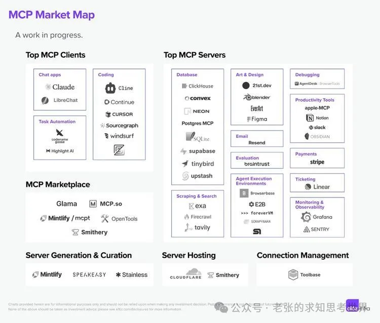
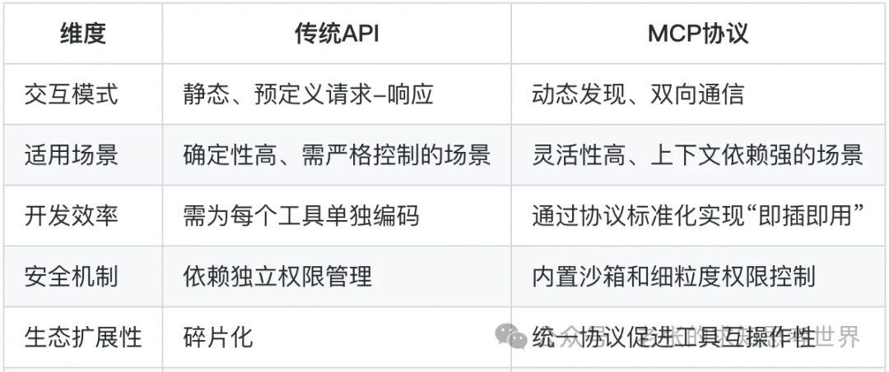
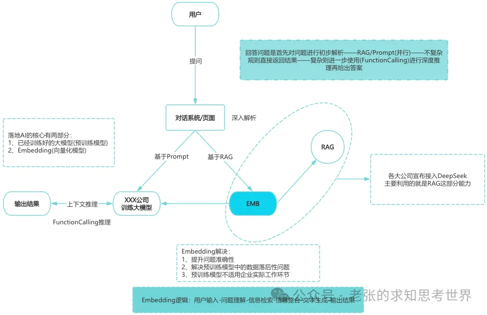

# 一口气讲清楚 AGI、RAG、AIGC、向量库、训练集、多模态、LLM、MCP、EMB

### 1、AGI：通用人工智能

AGI的全称为(Artificial General Intelligence)，即通用人工智能。指的是具备人类水平广泛认知能力的智能系统，能够在多种领域自主适应、学习并执行复杂任务，而不仅限于特定预设场景。

通俗来说，要具备AGI的能力，意味着AI工具要具备一个正常成年人的知识储备、认知、思考和解决问题能力。

简单来说，过去几年无论是ChatGPT还是其他大模型，更擅长垂直细分领域且不够深入。而今年爆火的DeepSeek R1模型，开始初步具备了模拟人类大脑进行推理和深度思考的能力雏形。

正如DeepSeek创始人梁文峰所说：语言大模型是通往AGI的必经之路，幻方要做的是AGI，当前DeepSeek R1已经初步具备了AGI的部分特征，这也是DeepSeek 如此火爆的原因之一。

前段时间关于DeepSeek比较热门的案例，比如深圳福田区的AI政务人员、某企业的AI电子签章审核人员，都是在接入DeepSeek后开始在AGI方向的尝试

**AGI的核心特征有四种，分别是**

**1-迁移学习能力**：可以将在一个领域学到的知识和技能迁移到其他领域，快速适应新的任务和挑战(还未看到明显的转折点)。

**2-自主学习能力**：能够主动从各种来源获取知识，并在不同情境中应用和调整这些知识，以适应新的任务和环境。当前仍处在初级阶段(语料、数据都需要主动投喂，且很多数据限于版权、隐私安全等条例，不够开放)。

**3-广泛的知识和技能**：不局限于特定领域，而是能够处理多样化的任务，如语言理解、逻辑推理、问题解决等(已经初步具备，且在医疗、法律等领域，已经有了超预期的落地)。

**4-理解和应对复杂情境**：能够理解复杂的人类语言、社会文化背景和情感因素，并做出合理的反应(还未出现)

### 2、RAG：检索增强生成

RAG全称为(Retrieval-Augmented Generation)，即检索增强生成，是一种结合信息检索与生成式人工智能(大模型)的技术，旨在通过整合外部知识库来提升生成内容的准确性、相关性和上下文适配性。

定义：检索外部知识(文档、数据库、实时信息)来增强生成模型输出，弥补大语言模型(LLM)的固有缺陷(知识滞后、幻觉问题)。

核心作用主要有如下四点

**1-提升准确性**：通过整合外部知识源，确保答案基于最新、权威的数据，减少错误或虚构内容（“幻觉”）。

**2-增强上下文相关性**：结合具体场景的实时信息，生成更贴合用户需求的回答。

**3-降低成本与训练效率**：无需重新训练整个模型即可更新知识，节省算力与时间成本。

**4-支持多模态数据**：可处理文本、图像、音频等多种数据，扩展应用场景

### 3、AIGC：人工智能生成内容

AIGC全称为(AI Generated Content)，即人工智能生成内容，是利用人工智能技术自动生成文本、图像、音频、视频等多种形式内容的技术。

去年各种大模型热推的文生图、文生视频、文生PPT，都是AIGC领域的能力。

比如现在很多网络小说，短剧剧本，都是利用AIGC来批量生成了，这也是去年为什么短剧这么火热，甚至被热炒的原因。

去年有段时间各家大模型公司都在推自家产品的多模态能力，其目的就是尝试将文本、图像、音频等多种模态数据结合，使生成内容更丰富、自然、真实。

技术原理：核心技术包括深度学习、自然语言处理(NLP)、生成对抗网络(GAN)、预训练大模型(如GPT)和多模态技术，基于通过学习海量数据而生成新内容。

例如，ChatGPT是基于Transformer架构，具备强大的语言理解和生成能力。

其他相关术语：PGC(专业生产内容)、UGC(用户生产内容-只是社区，比如知乎)

**AIGC的作用和价值**：

**1-提升内容生产效率**：自动生成文案、海报、PPT、剪辑视频等。AIGC可快速生成初稿或成品，大幅缩短制作周期。

**2-降低内容生成成本**：替代人工完成声音录制、图像渲染等高成本环节，降低创作门槛。

**3-激发创意与内容多样性**：因为数据样本够多，因此组合之下可能会催生出更多新颖的创意，例如通过海量数据生成人类难以想象的图像风格或故事框架。

**4-赋能多个垂直领域**：比如营销文案、营销海报、PPT创作、数据分析报告等。

**5-巨大的经济和社会价值**：内容创作领域蕴含的经济价值很大，尤其在传媒、广告、教育领域，当然自媒体领域也算。

**6-普及和降低创作门槛**：通过低门槛工具(如Stable Diffusion、剪映)，普通用户可参与专业级内容创作。

### 4、LLM：大型语言模型

**LLM的全称为(Large Language Model)，即大型语言模型**。它指的是一种基于深度学习技术的人工智能基础模型，通过大量的文本数据训练，来逐步具备理解和生成自然语言的能力。

LLM的基本定义主要有三个：**基于深度学习、处理自然语言、参数规模庞大**。其中：

**基于深度学习**：基于Transformer技术架构的神经网络，通过自注意力机制(Self-Attention)捕捉输入序列中的长距离依赖关系，实现对文本的全局理解。

**处理自然语言**：执行问答、文本生成、翻译/对话等任务，是生成式AI的形式。

**参数规模庞大**：为了能很好的理解自然语言，需要将自然语言拆分为最小粒度的参数(Tokens)，但自然语言的不同排列组合又包含多种含义，因此一个大模型通常包含几十上百亿甚至数千亿参数。

LLM是自然语言处理(NLP)领域的重要组成部分，目前我们所熟知的各个大厂推出的大模型，大多都是LLM。

LLM的训练过程，就是通过自注意力机制从海量文本数据中捕捉语言模式、研发结构和语义关联，他的核心目标是通过概率建模，预测下一个词语或序列，最终生成连贯且符合上下文的文本。

这也是为什么说大模型是一个概率预测机器，为什么会出现信息幻觉的原因

当然，因为训练数据的类型不同，大模型也有不同的能力倾向，比如金融、法律、心理、医疗等类型的数据，训练出来的大模型，其能力在对应领域的准确率更高。很多文章中提到的多模态，简单理解就是它的模型基座可以处理多种不同类型的信息

再进一步来说，像百度文库目前的AI模型所谓的自适应能力，就可以根据用户输入对其进行分析，并自动匹配对应的领域模型

**大模型的训练过程，可以简单地分为两个部分：预训练、后训练**。

* 预训练(模仿学习)赋予基础能力，**即从零到具备不错的能力，如AlphaGo的模仿学习阶段**。
* 后训练(强化学习)优化行为能力，**是从不错到卓越的过程，通过强化学习不断固化好的行为**。

在大模型领域，典型的代表性模型，大致可以分为三种：

* Llama(Meta)：开源模型，支持代码生成与科学推理。
* BERT(Google)：基于双向Transformer的模型，擅长文本分类和语义理解（如搜索引擎优化）。
* GPT系列(OpenAI)：通过生成式预训练实现多轮对话和复杂任务处理，如GPT-4支持多模态输入。

当然，大模型目前来说依然存在局限性，主要是如下几个方面：

* 信息幻觉：可能生成看似合理但事实错误的文本。
* 数据偏见：训练数据中的偏见可能导致输出歧视性内容。
* 计算成本：训练千亿级模型需消耗数千GPU小时，成本高昂。

### 5 MCP：模型上下文协议

**MCP的全称为(Model Context Protocol)，即模型上下文协议。通俗理解的话，MCP是一种抽象的技术架构设计理念**

MCP是一种开放标准协议，**旨在解决大型语言模型(LLM)与外部数据源和工具之间的通信问题，通过提供统一的接口和协议，使AI系统能够轻松地与各种外部资源进行交互，由Anthropic公司开发并开源**。

**MCP的基本定义：标准化的通信协议，用于建立AI模型与外部数据源之间的无缝连接。**

它通过定义通用接口，允许AI助手动态访问和集成外部数据源(数据库、API、文件系统)以及工具和服务(计算工具、搜索引擎)，从而扩展AI的功能并提高其效率，类似于AI领域的USB、Type-C接口。

MCP基于客户端-服务器架构，包含以下关键组件：

* **MCP Host：运行LLM的应用程序(如Claude客户端)，负责发起任务请求**。
* **MCP Client：在Host内维护与服务器的1:1连接，解析任务需求并协调资源调用**。
* **MCP Server：作为中间层，向AI Agent动态暴露可用的工具、API和数据源(如本地文件、外部数据库)，并提供安全控制和上下文管理**。
* Local/Remote Services：包括本地资源(文件系统)和远程服务(如GitHub、Google Maps API)。

工作流程中，MCP Server通过分层定义能力(如数据读取、函数调用、提示模板)，使AI Agent根据任务需求自动匹配工具，并通过Function Calling执行操作，例如查询数据库或调用API，最终生成多步骤的连贯响应。

MCP和传统的API接口相比，区别如下：

* 简化集成：通过统一接口降低AI与外部工具集成复杂性，避免碎片化问题。
* 安全性与可控性：MCP支持双向连接，确保数据安全，并提供细粒度控制。
* 灵活性与扩展性：MCP支持自主工作流的决策和编排，适用于多种跨平台场景。

我们可以将MCP当作AI技术领域的万能插座，通过MCP集成各种AI工具和数据源，不用做专门的适配工作。

### 6 EMB：数据嵌入技术

**EMB全称为(Embedding)，简单理解就是将低质量数据变为可参照利用的高质量基准数据的技术**。

**专业解释，EMB可以将高维、稀疏的离散数据(文本中的单词、图像特征或类别标签)映射到低维、稠密的连续向量空间的技术。**

EMB广泛应用于自然语言处理(NLP)、推荐系统、图像处理、计算机视觉等领域。其核心思想是通过将对象(如词语、句子、用户、物品等)映射为低维向量，捕捉对象之间的潜在语义关系和相似性，从而实现降维、特征提取和建模目标。

这些向量能够捕捉原始数据的语义信息和内在关系，便于机器学习模型进行处理和分析。下图所示EMB的作用

Embedding在自然语言处理(NLP)中的典型应用场景包括：

* **文本分类将文本转换为词向量(如Word2Vec或GloVe)**，对文档进行分类，如垃圾邮件过滤、主题分类。
* **机器翻译**：捕捉单词语义和上下文关系，从而提高神经网络机器翻译(NMT)的效果，使翻译结果更接近“人话”。
* **命名实体识别(NER)** ：通嵌入技术，模型能够更好理解文本中的实体及其关系，从而提升命名实体识别的准确性。
* **情感分析**：利用词嵌入捕捉单词的情感倾向，帮助模型判断文本的情感极性。
* **推荐系统**：生成用户和物品的向量表示，通过捕捉潜在关系提升推荐系统的准确性。
* **语义搜索**：通过将查询和文档映射到同一向量空间，实现高效的语义相似度计算。
* **文本相似性计算**：利用词嵌入捕捉单词间的语义相似性，用于句子匹配、文本相似性分析等任务。
* **迁移学习与特征提取**：高质量的词嵌入可以迁移至下游任务，无需重新学习词汇含义，从而扩展应用范围。

EMB的技术特点，概括来说主要有三点：

* **语义保留：通过训练使向量空间中的位置反映数据的内在关系(如“苹果”与“水果”存在包含关系)**。
* **通用性与迁移性：同一嵌入模型可服务于多种下游任务(如分类、聚类、推荐)**。
* **降维与特征提取：将高维稀疏数据(如独热编码的文本)压缩为低维稠密向量，减少计算复杂度**。
* **Embedding技术目前已经在AI的各个领域深入使用，是LLM的核心技术构成之一**。

### 7 向量库：Vector Database

**向量库(Vector Database)是一种专门用于存储、管理和检索向量数据的数据库系统。**

在人工智能领域，向量的定义通常指通过模型(如BERT、ResNet)将文本、图像、音频等非结构化数据转换为高维数值表示(例如由数百或数千个数值组成的序列)。这种转换称为嵌入(即前面提到的EMB)，旨在捕捉数据的语义或特征信息。

你可以理解为，向量化的过程类似于大数据领域的数据清洗，**核心有两点：统一数据格式、统一存储**。

例如：一段文本内容“可爱的猫咪”经过嵌入处理后，可能变成类似“[0.2, -1.3, 0.8, ..., 0.5]”的向量。**而向量库的核心功能就是通过数学方法快速找到与用户输入的提示词(也称之为查询向量)相似的存储于向量库中的向量**

这里的快速检索相似向量的方法，类似于传统数据库中的索引功能。

#### 1、向量库的核心特性

* 高效相似性搜索：支持近似最近邻搜索(ANN)，通过索引优化(如HNSW、IVF)实现毫秒级响应。
* 高维数据处理：可管理数百至数千维的向量，适用于图像特征、文本语义等复杂数据的存储。
* 实时性与可扩展性：支持动态插入、更新数据，并通过分布式架构横向扩展，满足大数据场景需求。
* 多模态支持：统一存储文本、图像、视频等不同模态的向量，实现跨模态检索(如用文字搜索图片)。
* 与传统数据库互补：在支持CRUD操作的基础上，强化了基于语义或特征的搜索能力，而非精确匹配。

#### 2、向量库的核心作用

* 加速AI模型应用：大模型(如DeepSeek)生成的向量需要高效检索支持，例如在问答系统中快速匹配相关知识片段。
* 处理非结构化数据：将图像、文本等非结构化数据转化为向量，使其可被计算机分析和应用。
* 语义理解与上下文关联：通过向量相似性捕捉语义关系，例如判断“苹果”在“水果”和“手机品牌”中的不同含义。
* 降低计算成本：通过预计算和索引优化，减少模型实时推理的压力。

#### 3、向量库的使用场景

假设你要在电商平台搜索男士运动鞋，上传了一张自己鞋子的照片进行搜索，下面是AI搜索并返回结果的过程：

* 向量化：平台用ResNet模型将图片转换为一个512维的向量。 
* 检索存储向量：向量库通过余弦相似度计算，快速找到商品库中特征最接近的鞋子向量。 
* 返回结果：展示相似商品，如“Nike Air Force 1”。

#### 4、向量库的主流工具选型

* 开源工具：FAISS(Meta开发，适合中小规模)、Milvus(分布式架构，支持亿级数据)。 
* 云服务工具：腾讯云VectorDB(高可用、低延迟)、Pinecone(全托管，适合快速部署)。

**工具选型的关键在于，支持的数据规模大小、数据检索时延(RT)、向量库的运维管理成本。**

### 8 训练集：Training Set

**训练集(Training Set)是机器学习中用于训练模型的数据集合，包含输入样本及对应的输出标签(特指监督学习)**

核心作用是让模型通过学习集合中的输入特征与目标变量之间的关联规律，不断调整模型本身的参数，进而做出预测(大模型是一个概率预测机器，通过解析用户输入内容，进行向量化，然后在向量库进行相似性检索，最终输出用户可能需要的答案

#### **1、训练集的核心特点**

* 代表性：必须涵盖模型可能遇到的所有场景(目前我们熟知的大模型大多是通用大模型，即全能型选手)。
* 标记准确性：监督学习的训练集标签必须正确(比如将输入样本“猫”标注为“狗”，模型就会学习错误规律，导致预测失效)。
* 充足性：样本数量需要足够多(大模型并不像人类具有联想能力，它只会死记硬背，无法幻想)。
* 相关性与均匀性：训练集数据必须与训练任务目标直接相关(人脸识别不能包含动物图片)，且数据分布需要保持均衡(金融交易训练集中，买入卖出样本比例需要接近真实情况，避免产生偏差，这也是量化交易的训练核心)。
* 复杂性：训练集需要包含边界值和脏数据(比如智能驾驶训练过程，要包含极端天气和复杂路况，不能只在无人的高速大直道训练)。

#### 2、训练集的核心作用

* 参数学习的基础：模型通过训练集调整权重参数。
* 模式发现与规律提炼：模型从数据中提取关键特征。
* 泛化能力的基石：高质量训练集使模型在面对新数据时保持高准确率。
* 过拟合与欠拟合的平衡：充足且多样的数据可以减少过拟合风险，如果数据量不足或质量差会导致欠拟合(模型没有学习到数据关联逻辑)。

#### 3、训练集的典型应用场景

我们所熟知的智能驾驶、图片分类、短视频推荐、文生内容(包含文生文、图、视频)等领域的大模型都经过了大量高质量数据的长期训练，才能具备现在的能力。

#### 4、构建数据集的注意事项

* 数据划分比例：常见比例为8:2(80%训练20%测试)，复杂的模型可以步拆分为6:2:2(60%训练20%验证20%测试)。
* 数据增强技术：通过旋转、裁剪、噪声添加等方式扩展数据集，这点比较适用于数据不足的场景。
* 避免数据泄漏：训练集与测试集需要严格隔离，否则测试数据混入训练过程，则会导致模型评估结果偏离。
* 持续迭代更新：模型部署后，需要定期用新数据更新训练集以适应环境变化(比如病毒库、垃圾邮件、专业论文)。

### 9、多模态：Multimodal

**多模态(Multimodal)指的是系统能同时处理和理解不同来源或类型的数据(文本、图像、音频、视频、传感器数据)的能力**

**多模态技术的核心目标，是通过跨模态的关联与融合，模拟人类通过多种感官(视觉、听觉、触觉等)感知世界的方式，从而实现对复杂信息的全面理解与交互**

比如人与人沟通时，会通过语言、眼神、肢体动作和表情甚至借助其他工具来尽可能让对方理解自己的想法。而多模态的目的就是希望让工具/机器具备类似的能力，综合多种输入形式作出更准确的决策。

#### 1、多模态技术的主要特点

* 跨模态理解：识别不同模态之间的关联和互补性(如图文互译：将文本“一只猫在草地上”生成图片，或反过来)。 
* 多层次数据融合：在不同特征层面进行数据融合(如自动驾驶系统融合摄像头图像、雷达信号和GPS定位数据，提升环境感知的准确性，最终实现自动加速减速和避开障碍物)。
* 端到端学习：直接从原始多模态数据中学习，无需人工设计特征提取步骤(如智能会议场景，AI可以同时进行画面(根据人脸识别发言人)和声音识别并生成会议纪要)。
* 增强鲁棒性与适应性：多模态系统在部分模态数据缺失时仍能有效运作(如智能驾驶领域，即使大雾天气也可以通过激光摄像头来进行路线规划和障碍识别，而非纯靠视觉)。
* 拟人的信息处理方式：通过整合多种感官输入，多模态AI能更自然地与用户交互(如智能家居领域)

#### 2、多模态技术的核心作用

* 提升信息理解的全面性与准确性：单一模态的信息可能不完整或存在歧义(如医疗诊断场景，结合CT影响和患者病史以及门诊录音，可以提高诊断准确性)。
* 推动通用人工智能(AGI)发展：多模态是实现AGI的必经之路。
* 优化用户体验与交互效率：支持多种输入方(语音、文字、手势)降低使用门槛。
* 创造新型应用场景：多模态技术催生了虚拟人、AIGC(生成式AI)、全屋智能等创新应用

#### 3、通俗易懂的实例说明

假设你通过手机拍摄衣橱中的衣服并提问：“明天去郊游，如何搭配”？拥有多模态能力的AI助手会这样思考并回答你

* 视觉分析：识别衣物类型(如T恤、牛仔裤)、颜色和材质。 
* 文本理解：解析“郊游”场景需求(需舒适、防晒、耐脏)。 
* 环境数据融合：结合天气预报(晴天、阴天、下雨)建议防晒帽。 
* 跨模态生成：输出图文搭配建议(如“白色T恤+卡其裤+帆布鞋”)并推荐购买链接。 

#### 4、多模态技术的应用场景

* 医疗健康：结合CT影像、患者病历和语音问诊记录生成诊断报告。
* 内容创作：输入文本生成配套图片、视频和音乐(如AI生成广告素材)。
* 智能驾驶：融合摄像头图像、雷达信号和GPS定位，实现导航与障碍物避让。
* 智能家居：通过语音指令控制灯光(听觉)、手势调节温度(视觉)、传感器检测室内环境。