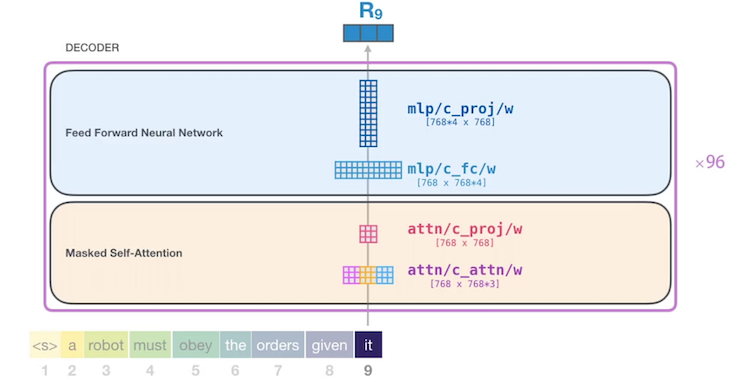
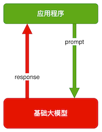
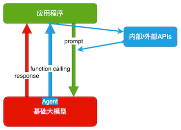
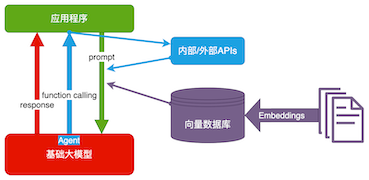
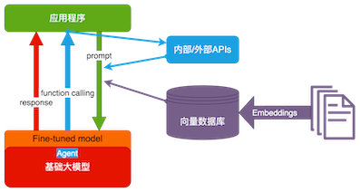

# AI 简介 

## AI的视角，怎么定义遇到的业务问题
### 知识体系


**业务问题**

1. **输入是什么**：文本、图像、语音信号.
2. **输出是什么**：标签、数值、大段文字（包括代码、指令等）
3. **量化衡量**输出的对错/好坏

### 什么是 AI？

基于机器学习、神经网络的是 AI，基于规则、搜索的不是 AI。


### 大模型能干什么？

大模型，**全称「大语言模型」，英文「Large Language Model」，缩写「LLM」**。

现在，已经不需要再演示了。每人应该都至少和下面一个大模型 AI 对话过至少 100 次。

- ChatGPT：[https://chat.openai.com/](https://chat.openai.com/)
- Bing Chat：[https://bing.com/new](https://bing.com/new)
- 文心一言：[https://yiyan.baidu.com/](https://yiyan.baidu.com/)
- 讯飞星火：[https://xinghuo.xfyun.cn/](https://xinghuo.xfyun.cn/)
- 智谱清言：[https://chatglm.cn/](https://chatglm.cn/)

## 业务问题分类


### 分类问题

**笼统的说，输出是标签。输出的标签是个有限集**。输出的标签是预先定义好的有限集。

例如：分析一段评论是正向还是负向，是典型的分类问题。输出是两个标签之一：“正向“或“负向”。

更复杂的分类，比如，输入一篇新闻，输出是"政治”、“经济”、“体育”、“娱乐”、“科技”之一(或多个标签）。


### 聚类问题

**没法提前规定有多少种标签，只能把同一类事物聚合在一起，到底能聚出多少类，是数据本身决定的**。

例如：自动收集客户经常问到的问题。（我们无法预知客户有多少问题，只能把同一个意思的问题聚合在一起）


### 回归问题

**输出是一个数值，更重要的是，评价输出好坏的标准是误差大小，而不是二元的对错**。

举例：跟据专车司机每天工作的时段、时长、跑的公里数，预估他一天的净利润

### 决策问题

输出是连续的一系列动作，每一步动作都有代价或收益，每一步的动作本身没有对错，而是要最大化最终的收益

举例：打游戏、下棋、无人驾驶、对话、量化投资

**持续互动**


### 概率密度估计

### 技术相关问题


## 复杂问题的两个视角

* 信息抽取，实体识别，内容生成本质上都是分类问题
* 在 ChatGPT 时代，上述很多问题都可以从**文本生成**的角度解决


1. 把 ChatGPT 看做是一个函数，给输入，**生成**输出
2. 任何业务问题，都可以用语言描述，成为 ChatGPT 的输入
3. 就能**生成**业务问题的结果

### 它是怎么生成结果的？


OpenAl 的接口名就叫「completion」，也证明了其只会「生成」的本质。

下面用程序演示 「生成下一个字」。你可以自己修改prompt 试试。还可以使用相同的 prompt 运行多次。

```
import openai
import os
import time
from packaging import version

from dotenv import load_dotenv, find_dotenv
_ = load_dotenv(find_dotenv())
from openai import OpenAI

os.environ['OPENAI_API_KEY'] = '*****'
os.environ['OPENAI_BASE_URL'] = 'https://api.chatanywhere.com.cn'

client = OpenAI(
    api_key=os.getenv("OPENAI_API_KEY"),
    base_url=os.getenv("OPENAI_BASE_URL")
)

prompt = "今天我很"
response = client.chat.completions.create(
    model="gpt-3.5-turbo",
    # prompt=prompt,
    messages = [{'role': 'user','content': prompt}],
    max_tokens=100,
    temperature=0,
    stream=True
)

for chunk in response:
    if  chunk.choices[0].delta.content is not None:
        print(chunk.choices[0].delta.content, end='')
    time.sleep(0.2)
```

> 开心，因为我收到了一份工作面试的邀请。这是我梦寐以求的工作，我非常期待能够得到这个机会。我会努力准备面试，希望能够表现出色，让自己成为他们的最佳选择。这份工作将会是我职业生

## 大语言模型 (LLM) GPT,Transformer



### OpenAl API初探

[https://github.com/openai/openai-python/discussions/742#async-client](https://github.com/openai/openai-python/discussions/742#async-client)

安装Python库

```
pip install --upgrade openai
```

查看可调用的模型

```
from openai import OpenAI
import openai
import os

from dotenv import load_dotenv, find_dotenv
_ = load_dotenv(find_dotenv())

os.environ['OPENAI_API_KEY'] = '**'
os.environ['OPENAI_BASE_URL'] = "api.chatanywhere.com.cn"

client = OpenAI(
    api_key = os.getenv('OPENAI_API_KEY'),
    base_url = os.getenv('OPENAI_BASE_URL')
)


print(client.models.list())
```

```
import openai
from openai import OpenAI
from openai import AsyncOpenAI
import os

from dotenv import load_dotenv, find_dotenv
_ = load_dotenv(find_dotenv())


os.environ['OPENAI_API_KEY'] = ''
os.environ['OPENAI_BASE_URL'] = 'https://api.chatanywhere.com.cn'

client = AsyncOpenAI(
    api_key=os.getenv("OPENAI_API_KEY"),
    base_url=os.getenv("OPENAI_BASE_URL")
)

# 消息格式
messages = [
    {
        "role": "system",
        "content": "你是AI助手小Ja."
    },
    {
        "role": "assistant",
        "content": "有什么可以帮到您？"
    },
    {
        "role": "user",
        "content": "你有什么名字？"
    },
]

# ChatGPT-3.5

# 调用ChatGPT-3.5
chat_completion = await client.chat.completions.create(model="gpt-3.5-turbo", messages=messages)

# 输出回复
print(chat_completion.choices[0].message.content)
```

我是一个AI助手，您可以叫我小Ja。

## 大规模模型的功能

- **舆情分析：**从公司产品的评论中，分析哪些功能/元素是用户讨论最多的，评价是正向还是负向
- **坐席质检：**检查客服/销售人员与用户的对话记录，判断是否有争吵、辱骂、不当言论，话术是否符合标准
- **故障解释：**根据系统报错信息，给出方便非技术人员阅读的故障说明
- **零代码开发/运维：**自动规划任务，生成指令，自动执行
- **生成业务逻辑：**自定义一套业务描述语言（DSL），直接让 ChatGPT 写业务逻辑代码

### 可能一切问题，都能解决，所以是 AGI

**划重点**

* 把 ChatGPT 看做是一个函数，给输入，生成输出
* 任何业务问题，都可以用语言描述，成为 ChatGPT 的输入，就能生成业务问题的结果
* 实际工作中，通常需要将业务任务拆解为若干个子任务，分别解决。**理解问题本质，对拆解任务有很大帮助**

## 大模型是怎么生成结果的？

*  **transformer**


OpenAI 的接口名就叫「completion」，也证明了其只会「生成」的本质。

下面用程序演示「生成下一个字」。你可以自己修改 prompt 试试。还可以使用相同的 prompt 运行多次。

```
from openai import AsyncOpenAI
import openai
import os

from dotenv import load_dotenv, find_dotenv
_ = load_dotenv(find_dotenv())

os.environ['OPENAI_API_KEY'] = ''
os.environ['OPENAI_BASE_URL'] = "api.chatanywhere.com.cn"

client = AsyncOpenAI(
    api_key = os.getenv('OPENAI_API_KEY'),
    base_url = os.getenv('OPENAI_BASE_URL')
)
models = client.models.list()

# print(dir(models))
# print(models.__dict__)
# print(models.__getattribute__)
print(models._model)

<class 'openai.types.model.Model'>
```
```
import openai
from openai import OpenAI
from openai import AsyncOpenAI
import os

from dotenv import load_dotenv, find_dotenv
_ = load_dotenv(find_dotenv())


os.environ['OPENAI_API_KEY'] = 'sk-***'
os.environ['OPENAI_BASE_URL'] = 'https://api.chatanywhere.com.cn'

client = AsyncOpenAI(
    api_key=os.getenv("OPENAI_API_KEY"),
    base_url=os.getenv("OPENAI_BASE_URL")
)

# 消息格式
messages = [
    {
        "role": "system",
        "content": "你是AI助手小Ja."
    },
    {
        "role": "assistant",
        "content": "有什么可以帮到您？"
    },
    {
        "role": "user",
        "content": "你有什么名字？"
    },
]

# ChatGPT-3.5

# 调用ChatGPT-3.5
chat_completion = await client.chat.completions.create(model="gpt-3.5-turbo", messages=messages)

# 输出回复
print(chat_completion.choices[0].message.content)
```

> 我是人工智能助手，大家都叫我小Ja。

```
import openai
import os
import time
from packaging import version

from dotenv import load_dotenv, find_dotenv
_ = load_dotenv(find_dotenv())
from openai import OpenAI

os.environ['OPENAI_API_KEY'] = 'sk-***'
os.environ['OPENAI_BASE_URL'] = 'https://api.chatanywhere.com.cn'

client = OpenAI(
    api_key=os.getenv("OPENAI_API_KEY"),
    base_url=os.getenv("OPENAI_BASE_URL")
)

prompt = "今天我很"
response = client.chat.completions.create(
    model="gpt-3.5-turbo",
    # prompt=prompt,
    messages = [{'role': 'user','content': prompt}],
    max_tokens=100,
    temperature=0,
    stream=True
)

for chunk in response:
    if  chunk.choices[0].delta.content is not None:
        print(chunk.choices[0].delta.content, end='')
    time.sleep(0.2)
```

> 开心。因为我收到了一份工作的面试邀请。这是我很期待的工作，我已经准备了很久。希望能够顺利通过面试，得到这份工作。


### **ChatGPT 的工作原理：**

* GPT「大模型」阅读了人类曾说过的所有的话。这就是「学习」
* 把一串 token 后面跟着的不同 token 的概率记下来。记下的就是「参数」，也叫「权重
* 当我们给它若干 token，GPT 就能算出概率最高的下一个 token 是什么。这就是「生成」
* 用生成的 token，再加上上文，就能继续生成下一个 token。以此类推，生成更多文字


### **Token 是什么？**


1. 可能是一个英文单词，也可能是半个，三分之一个。可能是一个中文词，或者一个汉字，也可能是半个汉字，甚至三分之一个汉字
2. 大模型在开训前，需要先训练一个 tokenizer 模型。它能把所有的文本，切成 token

## 用好 AI 的核心心法


OpenAI 首席科学家 Ilya Sutskever 说过：数字神经网络各和人脑的生物神经网络，在数学原理上是一样的。

1. 用「当人看」来理解 AI
2. 用「当人看」来控制 AI
3. 用「当人看」来说服用户正确看待 AI 的不足

### 大模型应用架构

大模型技术分两个部分：


1. **训练基础大模型**：全世界只需要 1000 人做这个
2. **建造大模型应用**：所有技术人都需要掌握

大模型应用技术特点：门槛低，落地难。像极了做管理


### 典型业务架构


Agent 还太超前，Copilot 值得追求。

**AI Embedded:** This typically refers to artificial intelligence that is integrated into a system, device, or application to enhance its capabilities. **For example, AI embedded in a smartphone might enable features like voice recognition, image recognition, or predictive text.**

**AI Copilot:** **An AI copilot is a concept often used in the context of human-computer interaction, particularly in software development.** It refers to an AI system that assists and collaborates with a human user to perform tasks. In the context of coding, an AI copilot might provide suggestions, code completion, or even generate code snippets based on the user's input.

**AI Agent:** An AI agent is an autonomous entity that observes its environment and takes actions to achieve certain goals. **This is often used in the context of reinforcement learning and autonomous decision-making systems. AI agents can be used in various applications such as robotics, gaming, and more**.

### 技术架构

#### 纯 Prompt

就像和一个人对话，你说一句，ta 回一句，你再说一句，ta 再回一句……




#### Agent + Function Calling

- Agent：AI 主动提要求
- Function Calling：AI 要求执行某个函数
- 场景举例：你问过年去哪玩，ta 先反问你有几天假



#### Embeddings + 向量数据库

- Embeddings：把文字转换为更易于相似度计算的编码。这种编码叫向量
- **向量数据库：把向量存起来，方便查找**
- **向量搜索：根据输入向量，找到最相似的向量**
- 场景举例：考试时，看到一道题，到书上找相关内容，再结合题目组成答案。然后，就都忘了




#### Fine-tuning




## OpenAI API 初探

### 安装 Python 库

```bash
pip install --upgrade openai
```

**发一条消息**

```
import openai
import os
import time
from packaging import version

from dotenv import load_dotenv, find_dotenv
_ = load_dotenv(find_dotenv())
from openai import OpenAI

os.environ['OPENAI_API_KEY'] = 'sk-S8nQVuuNXNcxHYNdvMbwRZYStxjKJ5iVvVf3JH67azfQrfhA'
os.environ['OPENAI_BASE_URL'] = 'https://api.chatanywhere.com.cn'

client = OpenAI(
    api_key=os.getenv("OPENAI_API_KEY"),
    base_url=os.getenv("OPENAI_BASE_URL")
)

# 消息格式
messages = [
    {
        "role": "system",
        "content": "你是AI助手小瓜.你是AGIClass的助教。这门课每周二、四上课。"
    },
    {
        "role": "user",
        "content": "你是干什么的?什么时间上课"
    },

]

# 调用ChatGPT-3.5
chat_completion = client.chat.completions.create(
    model="gpt-3.5-turbo", messages=messages)

# 输出回复
print(chat_completion.choices[0].message.content)
```

> **我是AGIClass的助教，这门课每周二、四上课。如果有关于人工智能、机器学习或者其他方面的问题，你可以随时问我**。


