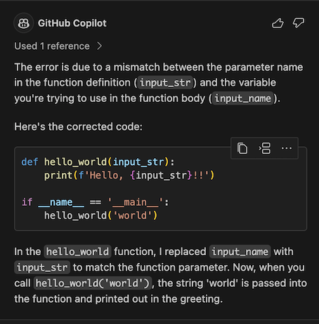

# AI 编程简介

[How to build an enterprise LLM application: Lessons from GitHub Copilot](https://github.blog/2023-09-06-how-to-build-an-enterprise-llm-application-lessons-from-github-copilot/)

**使用 AI 编程，除了解决编程问题以外，更重要是形成对 AI 的正确认知**。

比如，除了铺天盖地的对话式 AI 外，补全式的用户体验其实更好。

```
import os
from openai import OpenAI

from dotenv import load_dotenv, find_dotenv
_ = load_dotenv(find_dotenv())  # 读取本地 .env 文件，里面定义了 OPENAI_API_KEY

os.environ['OPENAI_API_KEY'] = 'sk-xxx'
os.environ['OPENAI_BASE_URL'] = 'https://api.chatanywhere.com.cn'

client = OpenAI(
    api_key=os.getenv("OPENAI_API_KEY"),
    base_url=os.getenv("OPENAI_BASE_URL")
)

response = client.chat.completions.create(
    model = "gpt-3.5-turbo",
    # model = "gpt-4",
    messages = [
        {"role":"user", "content":"tell me a joke"}
    ],
    temperature = 1
)
response_message = response.choices[0].message.content
print(response_message)
```

> Why was the math book sad?
> 
> Because it had too many problems.

```
response = client.chat.completions.create(
    model = "gpt-4",
    messages = [
        {"role":"system", "content":"你是一个精通Python语言的编程专家"},
        {"role":"user", "content":"Python有什么特点？"}
    ],
    temperature = 0
)
response_message = response.choices[0].message.content
print(response_message)
```

## 补全式编程：GitHub Copilot

### 安装

1. 首先，需要有 GitHub 账号
2. 然后，到 [https://github.com/settings/copilot](https://github.com/settings/copilot) 启用
3. 最后，安装 IDE 插件，比如
   - VSCode: [https://marketplace.visualstudio.com/items?itemName=GitHub.copilot](https://marketplace.visualstudio.com/items?itemName=GitHub.copilot)
   - PyCharm: [https://plugins.jetbrains.com/plugin/17718-github-copilot](https://plugins.jetbrains.com/plugin/17718-github-copilot)

```
import os
import openai

from dotenv import load_dotenv, find_dotenv
_ = load_dotenv(find_dotenv())  # 读取本地 .env 文件，里面定义了 OPENAI_API_KEY

os.environ['OPENAI_API_KEY'] = 'sk-xxx'
os.environ['OPENAI_BASE_URL'] = 'https://api.fe8.cn/v1'

client = openai(
    api_key=os.getenv("OPENAI_API_KEY"),
    base_url=os.getenv("OPENAI_BASE_URL")
)

# reponse = openai.Chat
```

### 使用

**Copilot**

它根据上下文，自动生成建议代码。如果觉得合适，按下 tab 就行了。比如：

**完成整个函数**


**写测试用例**


**根据注释写代码**


但这种用法不太推荐，因为注释里针对 AI 而写的 prompt，并不适合人类阅读。


**一些技巧**

1. 代码有了，补注释。会按照文档标准写注释
2. 改写当前代码，可另起一块新写，AI 补全得更准，完成后再删旧代码
3. `Cmd/Ctrl + →` 只接受一个 token

## Copilot 原理

- 最初是使用 OpenAI Codex 模型，它也是 GPT-3.5、GPT-4 的「一部分」。[现在已经完全升级，模型细节未知](https://github.blog/2023-07-28-smarter-more-efficient-coding-github-copilot-goes-beyond-codex-with-improved-ai-model/)。
- 应用层的技术就是 prompt engineering。Prompt 中包含：
  1. 光标前和光标后的代码片段
  2. 其它相关代码片段。当前文件和其它打开的 tab 里的代码被切成每个 60 行的片段，用 [Jaccard 相似度](https://zh.wikipedia.org/wiki/%E9%9B%85%E5%8D%A1%E5%B0%94%E6%8C%87%E6%95%B0)评分，取高分的
  3. 被取用的代码片段的路径。用注释的方式插入，例如：`# filepath: foo/bar.py`，或者 `// filepath: foo.bar.js`
- 在函数定义、类定义、if-else 等之后，会补全整段代码，其它时候只补全当前行

### 了解更多

- [Inside GitHub: Working with the LLMs behind GitHub Copilot](https://github.blog/2023-05-17-inside-github-working-with-the-llms-behind-github-copilot/)
- [How GitHub Copilot is getting better at understanding your code](https://github.blog/2023-05-17-how-github-copilot-is-getting-better-at-understanding-your-code/)
- [A developer’s guide to prompt engineering and LLMs](https://github.blog/2023-07-17-prompt-engineering-guide-generative-ai-llms/)

## 对话式编程

形式很简单，你发指令，AI 完成任务。效果好坏，取决于模型能力，和你的 prompt。

### GPT-4

- GPT-4 是目前地球上编程能力最强的大模型，没有之一
- 可以购买 [ChatGPT Plus](https://chat.openai.com/?model=gpt-4)，[Poe GPT-4](https://poe.com/GPT-4)，或者直接使用 API key
- 免费羊毛是 [Bing Chat](https://bing.com/new)


使用技巧：

- 所有 prompt engineering 的技巧都有效，可以把代码、错误信息直接粘贴进去
- 不只写代码，任何技术相关的问题都可以问，比自己搜索效率高很多
- 其实，太多轮次对话并不会带来性能提升，可能反倒引入不相关的东西。**开新轮次，最近 5 轮对话带足够的信息量，效果更好**


**不会写的代码问 AI：说清楚你的输入、输出、希望实现的功能，包括用什么库实现（如果知道）**


> **python函数，判断一个字符串是否包含中文**

你可以使用Python的`unicodedata`库来判断一个字符串是否包含中文。以下是一个简单的函数：

```python
import unicodedata

def contains_chinese(str):
    for char in str:
        if unicodedata.name(char).startswith('CJK UNIFIED'):
            return True
    return False

# 测试函数
print(contains_chinese('Hello, 你好'))  # 输出: True
print(contains_chinese('Hello, world!'))  # 输出: False
```

这个函数通过遍历字符串中的每个字符，使用`unicodedata.name(char)`获取字符的Unicode名称，如果名称以"CJK UNIFIED"开始，那么这个字符就是中文字符。如果字符串中有任何一个中文字符，函数就返回True，否则返回False。

> **字符串是否全部由中文字符串组成**

你可以使用Python的`unicodedata`库来判断一个字符串是否全部由中文字符组成。以下是一个简单的函数：

```python
import unicodedata

def is_all_chinese(str):
    for char in str:
        if not unicodedata.name(char).startswith('CJK UNIFIED'):
            return False
    return True

# 测试函数
print(is_all_chinese('你好'))  # 输出: True
print(is_all_chinese('Hello, 你好'))  # 输出: False
```

这个函数通过遍历字符串中的每个字符，使用`unicodedata.name(char)`获取字符的Unicode名称，如果名称不是以"CJK UNIFIED"开始，那么这个字符就不是中文字符，函数就返回False。如果字符串中的所有字符都是中文字符，函数就返回True。


**python函数，判断一个字符串是否包含中文**

你可以使用Python的`unicodedata`库来判断一个字符串是否包含中文。以下是一个简单的函数：

```python
import unicodedata

def contains_chinese(str):
    for char in str:
        if unicodedata.name(char).startswith('CJK UNIFIED'):
            return True
    return False

# 测试函数
print(contains_chinese('Hello, 你好'))  # 输出: True
print(contains_chinese('Hello, world!'))  # 输出: False
```

这个函数通过遍历字符串中的每个字符，使用`unicodedata.name(char)`获取字符的Unicode名称，如果名称以"CJK UNIFIED"开始，那么这个字符就是中文字符。如果字符串中有任何一个中文字符，函数就返回True，否则返回False。


**让 AI 帮你 Debug：把你的代码和报错信息一起贴给 GPT-4，可以让它帮你调试/修改代码**

```
my code

def hello_world(input_str):
    print(f'Hello, {input_name}!!')

if __name__ == '__main__':
    hello_world('world')

error looks like this 

Traceback (most recent call last):
  File "/Users/i515190/Devops_sap/Tech_Books/jxaibook/docs/chap2024_zh/test.py", line 5, in <module>
    hello_world('world')
  File "/Users/i515190/Devops_sap/Tech_Books/jxaibook/docs/chap2024_zh/test.py", line 2, in hello_world
    print(f'Hello, {input_name}!!')
                    ^^^^^^^^^^
NameError: name 'input_name' is not defined

Please help resolve this error
```

The error is due to a mismatch between the parameter name in the function definition (`input_str`) and the variable you're trying to use in the function body (`input_name`). 

Here's the corrected code:

```python
def hello_world(input_str):
    print(f'Hello, {input_str}!!')

if __name__ == '__main__':
    hello_world('world')
```

In the `hello_world` function, I replaced `input_name` with `input_str` to match the function parameter. Now, when you call `hello_world('world')`, the string 'world' is passed into the function and printed out in the greeting.


### GitHub Copilot chat

[目前是Preview版](https://marketplace.visualstudio.com/items?itemName=GitHub.copilot-chat)



经验：

1. 猜测背后是 gpt-3.5-turbo，比 gpt-4 效果差很多很多
2. 因为和 IDE 结合得好，所以简单任务交给它更高效
3. **各种场景都有「Ask Copilot」链接，`Cmd/Ctrl + i` 直接呼出**
4. 可以解释代码、修 bug、改进代码、写测试用例等等
5. 它会从 terminal 里取 context


Copilot chat 是 [Copilot X](https://github.com/features/preview/copilot-x) 的一部分。Copilot X 是个野心勃勃的项目，要把 AI 带到所有编程场景。

## Agent 们

前面的工具都是帮你编程，而 Agent 是完全代替你编程

#### GPT Engineer

[https://github.com/AntonOsika/gpt-engineer](https://github.com/AntonOsika/gpt-engineer)

指定您想要它构建的内容，AI 会要求澄清，然后构建它。

核心 prompts：[https://github.com/AntonOsika/gpt-engineer/tree/main/gpt_engineer/preprompts](https://github.com/AntonOsika/gpt-engineer/tree/main/gpt_engineer/preprompts)

```
vim prompt
gpt-engineer .
```


### GPT Web App Generator

主页：[https://magic-app-generator.wasp-lang.dev/](https://magic-app-generator.wasp-lang.dev/)

源代码：[https://github.com/wasp-lang/wasp/tree/wasp-ai](https://github.com/wasp-lang/wasp/tree/wasp-ai)

用 Wasp, React, Node.js 和 Prisma 生成全栈 Web 应用程序。

纯在线操作，跟着提示下载到本地执行。

核心 prompts：https://github.com/wasp-lang/wasp/blob/wasp-ai/waspc/src/Wasp/AI/GenerateNewProject/Operation.hs


### MetaGPT：多智能体元编程框架

https://github.com/geekan/MetaGPT

使 GPTs 组成软件公司，协作处理更复杂的任务。

官方说明：

1. MetaGPT 输入**一句话的老板需求**，输出**用户故事 / 竞品分析 / 需求 / 数据结构 / APIs / 文件等**
2. MetaGPT 内部包括**产品经理 / 架构师 / 项目经理 / 工程师**，它提供了一个**软件公司**的全过程与精心调配的 SOP


它不只写代码，而且写文档、画图。

 prompts：[https://github.com/geekan/MetaGPT/tree/main/metagpt/prompts](https://github.com/geekan/MetaGPT/tree/main/metagpt/prompts)
 
 
### 更多工具

1. [Bito](https://bito.ai/) - 基于 GPT-3.5 的代码补全，免费。功能更多，比如可以自建 prompt 模板。**CLI 工具值得一用**
2. [Amazon CodeWhisperer](https://aws.amazon.com/codewhisperer/) - 代码补全，免费。AWS 相关的编程能力卓越。其它凑合
3. [Cursor](https://www.cursor.so/) - AI first 的 IDE。被逼开源
4. [Tabnine](https://www.tabnine.com/) - 代码补全，个人基础版免费

### 更多开源编程大模型

1. [Code Llama](https://ai.meta.com/blog/code-llama-large-language-model-coding/) - Meta 出品，可能是开源中最强的
2. [姜子牙 Ziya-Coding-15B-v1](https://huggingface.co/IDEA-CCNL/Ziya-Coding-15B-v1) - 深圳 IDEA 研究院出品
3. [CodeFuse-CodeLlama-34B](https://huggingface.co/codefuse-ai/CodeFuse-CodeLlama-34B) - 阿里出品
4. [WizardCoder](https://github.com/nlpxucan/WizardLM) - WizardLM 出品

#### **AI 幻觉的必然性，和 AI 能力的天花板**

> 「...if a machine is expected to be infallible, it cannot also be intelligent.（如果一个机器绝对不会犯错，它就不可能是智能的。）」


拥有类人的智能，就一定和人类一样，说胡话、瞎话、错话，说有争议的话。

所以，AI 的幻觉不可完全消除，只能尽可能压制。

所以，使用者的判断力，决定了 AI 能发挥能力的上限。

AI 能力定律：

* `ext{能力落地} = \min(\text{AI 能力}, \text{使用者判断力})$`

AI 提效定律：

* `$\text{生产效率提升幅度} = \frac{\text{使用者判断力}}{\text{使用者生产力}}$`
