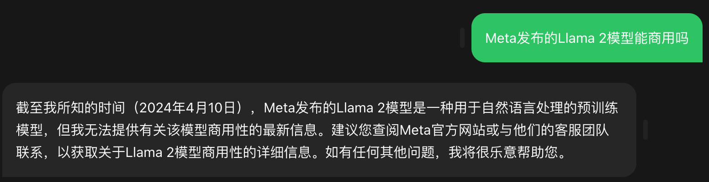
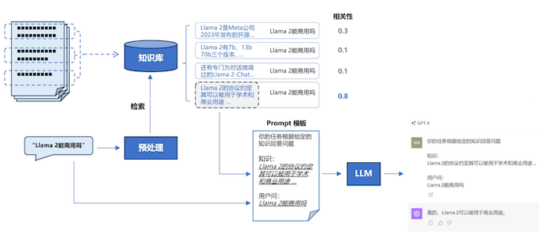
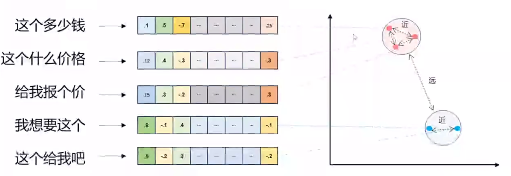

# 5 RAG和Embeddings 

## 1、什么是检索增强的生成模型（RAG）

* 1、什么是检索增强的生成模型（RAG）
* 2、OpenAI Assistant API 内置了这个能力
* 3、RAG 系统的基本搭建流程
* 4、向量检索
* 5、实战 RAG 系统的进阶知识

### 1.1、LLM 固有的局限性

1. LLM 的知识不是实时的
2. LLM 可能不知道你私有的领域/业务知识




### 1.2、检索增强生成

RAG（Retrieval Augmented Generation）顾名思义，通过**检索**的方法来增强**生成模型**的能力。



## 2、OpenAI Assistant API 内置了这个能力

```
from openai import OpenAI # 需要1.2以上版本
import os
# 加载环境变量
from dotenv import load_dotenv, find_dotenv

_ = load_dotenv(find_dotenv())  # 读取本地 .env 文件，里面定义了 OPENAI_API_KEY

client = OpenAI(
    api_key=os.getenv("OPENAI_API_KEY"),
    base_url=os.getenv("OPENAI_API_BASE")
)

os.environ['OPENAI_API_KEY'] = 'sk-'
os.environ['OPENAI_BASE_URL'] = 'https://api.chatanywhere.com.cn'

# 上传文件
file = client.files.create(
  file=open("llama2.pdf", "rb"),
  purpose='assistants'
)

# 创建 Assistant
assistant = client.beta.assistants.create(
  instructions="你是个问答机器人，你根据给定的知识回答用户问题。",
  # model="gpt-4-1106-preview",
  model="gpt-3.5-turbo",
  tools=[{"type": "retrieval"}],
  file_ids=[file.id]
)

# 创建 Thread
thread = client.beta.threads.create()

# 创建 User Message
message = client.beta.threads.messages.create(
    thread_id=thread.id,
    role="user",
    content="Llama 2有多少参数"
)

# 创建 Run 实例，同时给 Assistant 提供指令
run = client.beta.threads.runs.create(
  thread_id=thread.id,
  assistant_id=assistant.id,
  instructions="请用中文回答用户的问题。",
)

# 等待 Run 完成
while run.status != "completed":
    run = client.beta.threads.runs.retrieve(
      thread_id=thread.id,
      run_id=run.id
    )

# 获取 Run 的结果
messages = client.beta.threads.messages.list(
  thread_id=thread.id
)

# 打印结果
for turn in reversed(messages.data):
    print(f"{turn.role.upper()}: "+turn.content[0].text.value)
```


* 加载上传文件
* 环境变量
* **创建 Assistant**
* **创建 Thread**
* **创建 User Message**
* **创建 Run 实例，同时给 Assistant 提供指令**
* **等待 Run 完成**
* 获取 Run 的结果
* 打印结果


[https://platform.openai.com/docs/assistants/tools/knowledge-retrieval](https://platform.openai.com/docs/assistants/tools/knowledge-retrieval)

<b>我们为什么仍然需要了解整个实现过程？</b>

<li>如果不能使用 OpenAI，还是需要手工实现 RAG 流程</li>
<li>了解 RAG 的原理，可以指导你的产品开发（回忆 GitHub Copilot）</li>
<li>用私有知识增强 LLM 的能力，是一个通用的方法论</li>


## 3、RAG 系统的基本搭建流程

搭建过程：

1. 文档加载，并按一定条件**切割**成片段
2. 将切割的文本片段灌入**检索引擎**
3. 封装**检索接口**
4. 构建**调用流程**：Query -> 检索 -> Prompt -> LLM -> 回复  

### 3.1、文档的加载与切割

```
# 安装 pdf 解析库
!pip install pdfminer.six
```

```
from pdfminer.high_level import extract_pages
from pdfminer.layout import LTTextContainer
```

```
def extract_text_from_pdf(filename,page_numbers=None,min_line_length=1):
    '''从 PDF 文件中（按指定页码）提取文字'''
    paragraphs = []
    buffer = ''
    full_text = ''
    # 提取全部文本
    for i, page_layout in enumerate(extract_pages(filename)):
        # 如果指定了页码范围，跳过范围外的页
        if page_numbers is not None and i not in page_numbers:
            continue
        for element in page_layout:
            if isinstance(element, LTTextContainer):
                full_text += element.get_text() + '\n'
    # 按空行分隔，将文本重新组织成段落
    lines = full_text.split('\n')
    for text in lines:
        if len(text) >= min_line_length:
            buffer += (' '+text) if not text.endswith('-') else text.strip('-')
        elif buffer: 
            paragraphs.append(buffer)
            buffer = ''
    if buffer:
        paragraphs.append(buffer)
    return paragraphs
```
```
paragraphs = extract_text_from_pdf("llama2.pdf",min_line_length=10)
```

```
for para in paragraphs[:3]:
    print(para+"\n")
```

```
 Llama 2: Open Foundation and Fine-Tuned Chat Models

 Hugo Touvron∗ Louis Martin† Kevin Stone† Peter Albert Amjad Almahairi Yasmine Babaei Nikolay Bashlykov Soumya Batra Prajjwal Bhargava Shruti Bhosale Dan Bikel Lukas Blecher Cristian Canton Ferrer Moya Chen Guillem Cucurull David Esiobu Jude Fernandes Jeremy Fu Wenyin Fu Brian Fuller Cynthia Gao Vedanuj Goswami Naman Goyal Anthony Hartshorn Saghar Hosseini Rui Hou Hakan Inan Marcin Kardas Viktor Kerkez Madian Khabsa Isabel Kloumann Artem Korenev Punit Singh Koura Marie-Anne Lachaux Thibaut Lavril Jenya Lee Diana Liskovich Yinghai Lu Yuning Mao Xavier Martinet Todor Mihaylov Pushkar Mishra Igor Molybog Yixin Nie Andrew Poulton Jeremy Reizenstein Rashi Rungta Kalyan Saladi Alan Schelten Ruan Silva Eric Michael Smith Ranjan Subramanian Xiaoqing Ellen Tan Binh Tang Ross Taylor Adina Williams Jian Xiang Kuan Puxin Xu Zheng Yan Iliyan Zarov Yuchen Zhang Angela Fan Melanie Kambadur Sharan Narang Aurelien Rodriguez Robert Stojnic Sergey Edunov Thomas Scialom∗

 GenAI, Meta
```

### 3.2、检索引擎

先看一个最基础的实现

```
# 安装 ES 客户端
!pip install elasticsearch7
# 安装NLTK（文本处理方法库）
!pip install nltk
```

```
from elasticsearch7 import Elasticsearch, helpers
from nltk.stem import PorterStemmer
from nltk.tokenize import word_tokenize
from nltk.corpus import stopwords
import nltk
import re

import warnings
warnings.simplefilter("ignore") #屏蔽 ES 的一些Warnings

nltk.download('punkt') # 英文切词、词根、切句等方法
nltk.download('stopwords') # 英文停用词库
```

> True

```
def to_keywords(input_string):
    '''（英文）文本只保留关键字'''
    # 使用正则表达式替换所有非字母数字的字符为空格
    no_symbols = re.sub(r'[^a-zA-Z0-9\s]', ' ', input_string)
    word_tokens = word_tokenize(no_symbols)
    stop_words = set(stopwords.words('english'))
    ps = PorterStemmer()
    # 去停用词，取词根
    filtered_sentence = [ps.stem(w) for w in word_tokens if not w.lower() in stop_words]
    return ' '.join(filtered_sentence)
```

**将文本灌入检索引擎**
 
 [https://chao-xi.github.io/jxes7book/chap2/3ES_KB_docker/#1elastic-stack-docker](https://chao-xi.github.io/jxes7book/chap2/3ES_KB_docker/#1elastic-stack-docker)
 
http://127.0.0.1:9200/

```
{
  "name" : "es79",
  "cluster_name" : "jx",
  "cluster_uuid" : "In9RlhiCQB-Jhmq_OTBh4w",
  "version" : {
    "number" : "7.9.1",
    "build_flavor" : "default",
    "build_type" : "docker",
    "build_hash" : "083627f112ba94dffc1232e8b42b73492789ef91",
    "build_date" : "2020-09-01T21:22:21.964974Z",
    "build_snapshot" : false,
    "lucene_version" : "8.6.2",
    "minimum_wire_compatibility_version" : "6.8.0",
    "minimum_index_compatibility_version" : "6.0.0-beta1"
  },
  "tagline" : "You Know, for Search"
}
```
```
# 1. 创建Elasticsearch连接
es = Elasticsearch(
    hosts=['http://127.0.0.1:9200'],  # 服务地址与端口
    # http_auth=("elastic", "FKaB1Jpz0Rlw0l6G"), # 用户名，密码
)

# 2. 定义索引名称
index_name = "string_index"

# 3. 如果索引已存在，删除它（仅供演示，实际应用时不需要这步）
if es.indices.exists(index=index_name):
    es.indices.delete(index=index_name)

# 4. 创建索引
es.indices.create(index=index_name)

# 5. 灌库指令
actions = [
    {
        "_index": index_name,
        "_source": {
            "keywords": to_keywords(para),
            "text": para
        }
    }
    for para in paragraphs
]

# 6. 文本灌库
helpers.bulk(es, actions)
```

> (983, [])

**实现关键字检索**

```
def search(query_string, top_n=3):
    # ES 的查询语言
    search_query = {
        "match": {
            "keywords": to_keywords(query_string)
        }
    }
    res = es.search(index=index_name, query=search_query, size=top_n)
    return [hit["_source"]["text"] for hit in res["hits"]["hits"]]
```

```
results = search("how many parameters does llama 2 have?", 2)
for r in results:
    print(r+"\n")
``` 

```
 Llama 2 comes in a range of parameter sizes—7B, 13B, and 70B—as well as pretrained and fine-tuned variations.

 1. Llama 2, an updated version of Llama 1, trained on a new mix of publicly available data. We also increased the size of the pretraining corpus by 40%, doubled the context length of the model, and adopted grouped-query attention (Ainslie et al., 2023). We are releasing variants of Llama 2 with 7B, 13B, and 70B parameters. We have also trained 34B variants, which we report on in this paper but are not releasing.§
```

### 3.3、LLM 接口封装
 
```
from openai import OpenAI
import os
# 加载环境变量
from dotenv import load_dotenv, find_dotenv
_ = load_dotenv(find_dotenv())  # 读取本地 .env 文件，里面定义了 OPENAI_API_KEY

os.environ['OPENAI_API_KEY'] = 'sk-'
os.environ['OPENAI_BASE_URL'] = 'https://api.chatanywhere.com.cn'

client = OpenAI(
    api_key=os.getenv("OPENAI_API_KEY"),
    base_url=os.getenv("OPENAI_BASE_URL")
)
```
```
def get_completion(prompt, model="gpt-3.5-turbo"):
    '''封装 openai 接口'''
    messages = [{"role": "user", "content": prompt}]
    response = client.chat.completions.create(
        model=model,
        messages=messages,
        temperature=0,  # 模型输出的随机性，0 表示随机性最小
    )
    return response.choices[0].message.content
```

### 3.4、Prompt 模板

```
def build_prompt(prompt_template, **kwargs):
    '''将 Prompt 模板赋值'''
    prompt = prompt_template
    for k, v in kwargs.items(): 
        if isinstance(v,str):
            val = v
        elif isinstance(v, list) and all(isinstance(elem, str) for elem in v):
            val = '\n'.join(v)
        else:
            val = str(v)
        prompt = prompt.replace(f"__{k.upper()}__",val)
    return prompt
```

```
prompt_template = """
你是一个问答机器人。
你的任务是根据下述给定的已知信息回答用户问题。
确保你的回复完全依据下述已知信息。不要编造答案。
如果下述已知信息不足以回答用户的问题，请直接回复"我无法回答您的问题"。

已知信息:
__INFO__

用户问：
__QUERY__

请用中文回答用户问题。
"""
```

### 3.5、RAG Pipeline 初探

```
user_query="how many parameters does llama 2 have?"

# 1. 检索
search_results = search(user_query,2)

# 2. 构建 Prompt
prompt = build_prompt(prompt_template, info=search_results, query=user_query)
print("===Prompt===")
print(prompt)

# 3. 调用 LLM
response = get_completion(prompt)
#response = get_completion_ernie(prompt)
print("===回复===")
print(response)
```

```
===Prompt===

你是一个问答机器人。
你的任务是根据下述给定的已知信息回答用户问题。
确保你的回复完全依据下述已知信息。不要编造答案。
如果下述已知信息不足以回答用户的问题，请直接回复"我无法回答您的问题"。

已知信息:
 Llama 2 comes in a range of parameter sizes—7B, 13B, and 70B—as well as pretrained and fine-tuned variations.
 1. Llama 2, an updated version of Llama 1, trained on a new mix of publicly available data. We also increased the size of the pretraining corpus by 40%, doubled the context length of the model, and adopted grouped-query attention (Ainslie et al., 2023). We are releasing variants of Llama 2 with 7B, 13B, and 70B parameters. We have also trained 34B variants, which we report on in this paper but are not releasing.§

用户问：
how many parameters does llama 2 have?

请用中文回答用户问题。

===回复===
Llama 2有7B、13B和70B三种参数大小的变体。
```

### 3.6、关键字检索的局限性

同一个语义，用词不同，可能导致检索不到有效的结果

```
user_query="Does llama 2 have a chat version?"
# user_query="Does llama 2 have a conversational variant?"

search_results = search(user_query,2)

for res in search_results:
    print(res+"\n")
```


```
2. Llama 2-Chat, a fine-tuned version of Llama 2 that is optimized for dialogue use cases. We release

 Figure 20: Distribution shift for progressive versions of Llama 2-Chat, from SFT models towards RLHF.
```

```
# user_query="Does llama 2 have a chat version?"
user_query="Does llama 2 have a conversational variant?"

search_results = search(user_query,2)

for res in search_results:
    print(res+"\n")
```

```
1. Llama 2, an updated version of Llama 1, trained on a new mix of publicly available data. We also increased the size of the pretraining corpus by 40%, doubled the context length of the model, and adopted grouped-query attention (Ainslie et al., 2023). We are releasing variants of Llama 2 with 7B, 13B, and 70B parameters. We have also trained 34B variants, which we report on in this paper but are not releasing.§

 In Figure 18, we report the violation percentage on single- and multi-turn conversations, respectively. A trend across models is that multi-turn conversations are more prone to inducing unsafe responses. That said, Llama 2-Chat still performs well compared to baselines, especially on multi-turn conversations. We also observe that Falcon performs particularly well on single-turn conversations (largely due to its conciseness) but much worse on multi-turn conversations, which could be due to its lack of multi-turn supervised fine-tuning data.
```


## 4、向量检索

### 4.1、文本向量（Text Embeddings）

1. 将文本转成一组浮点数：每个下标 $i$，对应一个维度
2. 整个数组对应一个 $n$ 维空间的一个点，即**文本向量**又叫 Embeddings
3. 向量之间可以计算距离，距离远近对应**语义相似度**大小




```
[-0.0072620222344994545, -0.006227712146937847, -0.010517913848161697, 0.001511403825134039, -0.010678159072995186, 0.029252037405967712, -0.019783001393079758, 0.0053937085904181, -0.017029697075486183, -0.01215678546577692]
```

### 4.1.1、文本向量是怎么得到的

1. 构建相关（正立）与不相关（负例）的句子对儿样本
2. 训练双塔式模型，让正例间的距离小，负例间的距离大

例如：


<div class="alert alert-info">
<b>扩展阅读：https://www.sbert.net</b>
</div>


### 4.2、向量间的相似度计算


```
import numpy as np
from numpy import dot
from numpy.linalg import norm
```

```
def cos_sim(a, b):
    '''余弦距离 -- 越大越相似'''
    return dot(a, b)/(norm(a)*norm(b))

def l2(a, b):
    '''欧式距离 -- 越小越相似'''
    x = np.asarray(a)-np.asarray(b)
    return norm(x)
```

```
def get_embeddings(texts, model="text-embedding-ada-002"):
    '''封装 OpenAI 的 Embedding 模型接口 text-embedding-ada-002'''
    data = client.embeddings.create(input = texts, model=model).data
    return [x.embedding for x in data]
```
```
test_query = ["测试文本"]
vec = get_embeddings(test_query)[0]
print(vec[:10])
```
```
query = "国际争端"

# 且能支持跨语言
# query = "global conflicts"

documents = [
    "联合国就苏丹达尔富尔地区大规模暴力事件发出警告",
    "土耳其、芬兰、瑞典与北约代表将继续就瑞典“入约”问题进行谈判",
    "日本岐阜市陆上自卫队射击场内发生枪击事件 3人受伤",
    "国家游泳中心（水立方）：恢复游泳、嬉水乐园等水上项目运营",
    "我国首次在空间站开展舱外辐射生物学暴露实验",
]

query_vec = get_embeddings([query])[0]
doc_vecs = get_embeddings(documents)

print("Cosine distance:")  
print(cos_sim(query_vec, query_vec))
for vec in doc_vecs:
    print(cos_sim(query_vec, vec))

print("\nEuclidean distance:")  
print(l2(query_vec, query_vec))
for vec in doc_vecs:
    print(l2(query_vec, vec))
```

```
Cosine distance:
1.0
0.8223882670677338
0.8299506820996052
0.7982156472341975
0.7670777912968042
0.7934906412584019

Euclidean distance:
0.0
0.596006294791316
0.5831797759221408
0.6352705975574178
0.6825279906988642
0.642665330225979
```

### 4.3、向量数据库

向量数据库，是专门为向量检索设计的中间件

```
!pip install chromadb
```

```
# 为了演示方便，我们只取两页（第一章）
paragraphs = extract_text_from_pdf("llama2.pdf",page_numbers=[2,3],min_line_length=10)
```

```
import chromadb
from chromadb.config import Settings

class MyVectorDBConnector:
    def __init__(self, collection_name, embedding_fn):
        chroma_client = chromadb.Client(Settings(allow_reset=True))

        # 为了演示，实际不需要每次 reset()
        chroma_client.reset()

        # 创建一个 collection
        self.collection = chroma_client.get_or_create_collection(name="demo")
        self.embedding_fn = embedding_fn

    def add_documents(self, documents, metadata={}):
        '''向 collection 中添加文档与向量'''
        self.collection.add(
            embeddings=self.embedding_fn(documents), # 每个文档的向量
            documents=documents, # 文档的原文
            ids=[f"id{i}" for i in range(len(documents))] # 每个文档的 id
        )

    def search(self, query, top_n):
        '''检索向量数据库'''
        results = self.collection.query(
            query_embeddings=self.embedding_fn([query]),
            n_results=top_n
        )
        return results
```

* 创建一个 collection
* 向 collection 中添加文档与向量
* 检索向量数据库


```
# 创建一个向量数据库对象
vector_db = MyVectorDBConnector("demo",get_embeddings)
# 向向量数据库中添加文档
vector_db.add_documents(paragraphs)
```

```
user_query = "Llama 2有多少参数"

results = vector_db.search(user_query, 2)
```

```
for para in results['documents'][0]:
    print(para+"\n")
 ```
 
```
mix of publicly available data. We also increased the size of the pretraining corpus by 40%, doubled the context length of the model, and adopted grouped-query attention (Ainslie et al., 2023). We are releasing variants of Llama 2 with 7B, 13B, and 70B parameters. We have also trained 34B variants, which we report on in this paper but are not releasing.§

 In this work, we develop and release Llama 2, a family of pretrained and fine-tuned LLMs, Llama 2 and Llama 2-Chat, at scales up to 70B parameters. On the series of helpfulness and safety benchmarks we tested, Llama 2-Chat models generally perform better than existing open-source models. They also appear to be on par with some of the closed-source models, at least on the human evaluations we performed (see Figures 1 and 3). We have taken measures to increase the safety of these models, using safety-specific data annotation and tuning, as well as conducting red-teaming and employing iterative evaluations. Additionally, this paper contributes a thorough description of our fine-tuning methodology and approach to improving LLM safety. We hope that this openness will enable the community to reproduce fine-tuned LLMs and continue to improve the safety of those models, paving the way for more responsible development of LLMs. We also share novel observations we made during the development of Llama 2 and Llama 2-Chat, such as the emergence of tool usage and temporal organization of knowledge.
```

```
user _query = "LIama 2有对话版吗“
results = vector_db.search(user_query, 2)

for para in results['documents'][0]:
    print(para+"\n")
```
```
2. Llama 2-Chat, a fine-tuned version of Llama 2 that is optimized for dialogue use cases. We release

1. Llama 2, an updated version of Llama 1, trained on a new mix of publicly available data. We also increased the size of the pretraining corpus by 40%, doubled the context length of the model, and adopted grouped-query attention (Ainslie et al.,
2023). We are releasing variants of Llama 2 with 7B, 13B, and 70B parameters. We have also trained 34B variants, which we report on in this paper but are not releasing.
```

### 4.3.1、向量数据库服务

Server端

```sh
chroma run --path /db_path
```

Client端

```python
import chromadb
chroma_client = chromadb.HttpClient(host='localhost', port=8000)
```

### 4.3.2、主流向量数据库功能对比


- FAISS: Meta开源的向量检索引擎 https://github.com/facebookresearch/faiss
- Pinecone: 商用向量数据库，只有云服务 https://www.pinecone.io/
- Milvus: 开源向量数据库，同时有云服务 https://milvus.io/
- Weaviate: 开源向量数据库，同时有云服务 https://weaviate.io/
- Qdrant: 开源向量数据库，同时有云服务 https://qdrant.tech/
- PGVector: Postgres的开源向量检索引擎 https://github.com/pgvector/pgvector
- RediSearch: Redis的开源向量检索引擎 https://github.com/RediSearch/RediSearch
- ElasticSearch也支持向量检索 https://www.elastic.co/enterprise-search/vector-search

### 4.4、基于向量检索的 RAG

```
class RAG_Bot:
    def __init__(self, vector_db, llm_api, n_results=2):
        self.vector_db = vector_db
        self.llm_api = llm_api
        self.n_results = n_results
        
    def chat(self, user_query):
        # 1. 检索
        search_results = self.vector_db.search(user_query,self.n_results)
        
        # 2. 构建 Prompt
        prompt = build_prompt(prompt_template, info=search_results['documents'][0], query=user_query)
        
        # 3. 调用 LLM
        response = self.llm_api(prompt)
        return response
```

```
# 创建一个RAG机器人
bot = RAG_Bot(
    vector_db,
    llm_api=get_completion
)

user_query="llama 2有多少参数？"

response = bot.chat(user_query)

print(response)
```

> Llama 2有7B、13B和70B参数的变体。

### 4.5、如果想要换个模型

```
import json
import requests
import os

# 通过鉴权接口获取 access token
def get_access_token():
    """
    使用 AK，SK 生成鉴权签名（Access Token）
    :return: access_token，或是None(如果错误)
    """
    url = "https://aip.baidubce.com/oauth/2.0/token"
    params = {
        "grant_type": "client_credentials", 
        "client_id": os.getenv('ERNIE_CLIENT_ID'), 
        "client_secret": os.getenv('ERNIE_CLIENT_SECRET')
    }
    
    return str(requests.post(url, params=params).json().get("access_token"))

# 调用文心千帆 调用 BGE Embedding 接口
def get_embeddings_bge(prompts):
    url = "https://aip.baidubce.com/rpc/2.0/ai_custom/v1/wenxinworkshop/embeddings/bge_large_en?access_token=" + get_access_token()
    payload = json.dumps({
        "input": prompts
    })
    headers = {'Content-Type': 'application/json'}
    
    response = requests.request("POST", url, headers=headers, data=payload).json()
    data = response["data"]
    return [ x["embedding"] for x in data ]
    

# 调用文心4.0对话接口
def get_completion_ernie(prompt):
    
    url = "https://aip.baidubce.com/rpc/2.0/ai_custom/v1/wenxinworkshop/chat/completions_pro?access_token=" + get_access_token()
    payload = json.dumps({
        "messages": [
            {
                "role": "user",
                "content": prompt
            }
        ]
    })
    
    headers = {'Content-Type': 'application/json'}
    
    response = requests.request("POST", url, headers=headers, data=payload).json()

    return response["result"]
```

```
user_query="how many parameters does llama 2 have?"

response = new_bot.chat(user_query)

print(response)
```

```
user_query="how many parameters does llama 2 have?"

response = new_bot.chat(user_query)

print(response)
```

> Llama 2具有7B、13B和70B参数的不同变体。因此，Llama 2具有多种参数数量，具体取决于所选的变体。

## 5、实战 RAG 系统的进阶知识

### 5.1、文本分割的粒度

**缺陷**

1. 粒度太大可能导致检索不精准，粒度太小可能导致信息不全面
2. 问题的答案可能跨越两个片段

```
# 创建一个向量数据库对象
vector_db = MyVectorDBConnector("demo_text_split",get_embeddings)
# 向向量数据库中添加文档
vector_db.add_documents(paragraphs)

# 创建一个RAG机器人
bot = RAG_Bot(
    vector_db,
    llm_api=get_completion
)
```

```
user_query="llama 2可以商用吗？"
#user_query="llama 2 chat有多少参数"
search_results = vector_db.search(user_query,2)

for doc in search_results['documents'][0]:
    print(doc+"\n")

print("====回复====")
bot.chat(user_query)
```

```
 We believe that the open release of LLMs, when done safely, will be a net benefit to society. Like all LLMs, Llama 2 is a new technology that carries potential risks with use (Bender et al., 2021b; Weidinger et al., 2021; Solaiman et al., 2023). Testing conducted to date has been in English and has not — and could not — cover all scenarios. Therefore, before deploying any applications of Llama 2-Chat, developers should perform safety testing and tuning tailored to their specific applications of the model. We provide a responsible use guide¶ and code examples‖ to facilitate the safe deployment of Llama 2 and Llama 2-Chat. More details of our responsible release strategy can be found in Section 5.3.

 1. Llama 2, an updated version of Llama 1, trained on a new mix of publicly available data. We also increased the size of the pretraining corpus by 40%, doubled the context length of the model, and adopted grouped-query attention (Ainslie et al., 2023). We are releasing variants of Llama 2 with 7B, 13B, and 70B parameters. We have also trained 34B variants, which we report on in this paper but are not releasing.§

====回复====
```

```
'根据已知信息，我们相信在安全的情况下，公开发布LLM（Llama 2）将对社会产生净利益。然而，LLM是一项新技术，使用中存在潜在风险。目前的测试仅涵盖了英语，并不能覆盖所有情况。因此，在部署LLM应用之前，开发人员应根据其具体应用对模型进行安全测试和调整。我们提供了负责任的使用指南和代码示例，以促进LLM的安全部署。根据已知信息，我们无法确定LLM 2是否可以商用。'
```

```
for p in paragraphs:
    print(p+"\n")
```

**改进**: 按一定粒度，部分重叠式的切割文本，使上下文更完整

```
from nltk.tokenize import sent_tokenize
import json

def split_text(paragraphs,chunk_size=300,overlap_size=100):
    '''按指定 chunk_size 和 overlap_size 交叠割文本'''
    sentences = [s.strip() for p in paragraphs for s in sent_tokenize(p)]
    chunks = []
    i= 0
    while i < len(sentences):
        chunk = sentences[i]
        overlap = ''
        prev_len = 0
        prev = i - 1
        # 向前计算重叠部分
        while prev >= 0 and len(sentences[prev])+len(overlap) <= overlap_size:
            overlap = sentences[prev] + ' ' + overlap
            prev -= 1
        chunk = overlap+chunk
        next = i + 1
        # 向后计算当前chunk
        while next < len(sentences) and len(sentences[next])+len(chunk) <= chunk_size:
            chunk = chunk + ' ' + sentences[next]
            next += 1
        chunks.append(chunk)
        i = next
    return chunks
```


```
chunks = split_text(paragraphs,300,100)
```

```
# 创建一个向量数据库对象
vector_db = MyVectorDBConnector("demo_text_split",get_embeddings)
# 向向量数据库中添加文档
vector_db.add_documents(chunks)
# 创建一个RAG机器人
bot = RAG_Bot(
    vector_db,
    llm_api=get_completion
)
```

```
user_query="llama 2可以商用吗？"
#user_query="llama 2 chat有多少参数"

search_results = vector_db.search(user_query,2)
for doc in search_results['documents'][0]:
    print(doc+"\n")

response = bot.chat(user_query)
print("====回复====")
print(response)
```
 
```
We are releasing the following models to the general public for research and commercial use‡: 1. Llama 2, an updated version of Llama 1, trained on a new mix of publicly available data.

Llama 2-Chat, a fine-tuned version of Llama 2 that is optimized for dialogue use cases. We release variants of this model with 7B, 13B, and 70B parameters as well. We believe that the open release of LLMs, when done safely, will be a net benefit to society.

====回复====
是的，Llama 2可以商用。
```

### 5.2、检索后排序（选）

**问题**: 有时，最合适的答案不一定排在检索的最前面

```
user_query="how safe is llama 2"
search_results = vector_db.search(user_query,5)

for doc in search_results['documents'][0]:
    print(doc+"\n")

response = bot.chat(user_query)
print("====回复====")
print(response)
```

```
We believe that the open release of LLMs, when done safely, will be a net benefit to society. Like all LLMs, Llama 2 is a new technology that carries potential risks with use (Bender et al., 2021b; Weidinger et al., 2021; Solaiman et al., 2023).

We also share novel observations we made during the development of Llama 2 and Llama 2-Chat, such as the emergence of tool usage and temporal organization of knowledge. Figure 3: Safety human evaluation results for Llama 2-Chat compared to other open-source and closed source models.

In this work, we develop and release Llama 2, a family of pretrained and fine-tuned LLMs, Llama 2 and Llama 2-Chat, at scales up to 70B parameters. On the series of helpfulness and safety benchmarks we tested, Llama 2-Chat models generally perform better than existing open-source models.

Additionally, these safety evaluations are performed using content standards that are likely to be biased towards the Llama 2-Chat models. We are releasing the following models to the general public for research and commercial use‡: 1.

We provide a responsible use guide¶ and code examples‖ to facilitate the safe deployment of Llama 2 and Llama 2-Chat. More details of our responsible release strategy can be found in Section 5.3.

====回复====
根据已知信息，我们相信在安全的情况下，公开发布LLMs将对社会产生净利益。像所有的LLMs一样，Llama 2是一项新技术，在使用过程中存在潜在风险。然而，我们也分享了在开发Llama 2和Llama 2-Chat过程中所做的新观察，例如工具使用的出现和知识的时间组织。根据已知信息，我们无法直接回答Llama 2的安全性问题。
```

**方案**: 

1. 检索时过招回一部分文本
2. 通过一个排序模型对 query 和 document 重新打分排序


 
 
```
!pip install sentence_transformers
```
 
```
from sentence_transformers import CrossEncoder

model = CrossEncoder('cross-encoder/ms-marco-MiniLM-L-6-v2', max_length=512)
```

```
user_query="how safe is llama 2"

scores = model.predict([(user_query, doc) for doc in search_results['documents'][0]])
# 按得分排序
sorted_list = sorted(zip(scores,search_results['documents'][0]), key=lambda x: x[0], reverse=True)
for score, doc in sorted_list:
    print(f"{score}\t{doc}\n")
```

```
6.470587253570557	We believe that the open release of LLMs, when done safely, will be a net benefit to society. Like all LLMs, Llama 2 is a new technology that carries potential risks with use (Bender et al., 2021b; Weidinger et al., 2021; Solaiman et al., 2023).

5.383452415466309	In this work, we develop and release Llama 2, a family of pretrained and fine-tuned LLMs, Llama 2 and Llama 2-Chat, at scales up to 70B parameters. On the series of helpfulness and safety benchmarks we tested, Llama 2-Chat models generally perform better than existing open-source models.

4.709953308105469	We provide a responsible use guide¶ and code examples‖ to facilitate the safe deployment of Llama 2 and Llama 2-Chat. More details of our responsible release strategy can be found in Section 5.3.

4.543964862823486	We also share novel observations we made during the development of Llama 2 and Llama 2-Chat, such as the emergence of tool usage and temporal organization of knowledge. Figure 3: Safety human evaluation results for Llama 2-Chat compared to other open-source and closed source models.

4.033888816833496	Additionally, these safety evaluations are performed using content standards that are likely to be biased towards the Llama 2-Chat models. We are releasing the following models to the general public for research and commercial use‡: 1.
```
 
## 6、向量模型的本地部署

```
from sentence_transformers import SentenceTransformer

model = SentenceTransformer('BAAI/bge-large-zh-v1.5')
```

```
query = "国际争端"

documents = [
    "联合国就苏丹达尔富尔地区大规模暴力事件发出警告",
    "土耳其、芬兰、瑞典与北约代表将继续就瑞典“入约”问题进行谈判",
    "日本岐阜市陆上自卫队射击场内发生枪击事件 3人受伤",
    "国家游泳中心（水立方）：恢复游泳、嬉水乐园等水上项目运营",
    "我国首次在空间站开展舱外辐射生物学暴露实验",
]

query_vec = model.encode(query, normalize_embeddings=True)
doc_vecs = [
    model.encode(doc, normalize_embeddings=True)
    for doc in documents
]

print("Cosine distance:")  # 越大越相似
print(cos_sim(query_vec, query_vec))
for vec in doc_vecs:
    print(cos_sim(query_vec, vec))

```

```
Cosine distance:
1.0
0.47276446
0.38867018
0.32856295
0.31619197
0.3093862
```


<b>更多模型：https://github.com/FlagOpen/FlagEmbedding</b>


<b>划重点：</b>

<li>不是每个 Embedding 模型都对余弦距离和欧氏距离同时有效</li>
<li>哪种相似度计算有效要阅读模型的说明（通常都支持余弦距离计算）</li>


### RAG 的流程

1. 离线步骤：文档加载->切分->向量化->灌库
2. 在线步骤：问题->向量化->检索->Prompt->LLM->回复

### 我用了一个开源的RAG，不好使怎么办？

1. 检查预处理效果：文档加载是否正确，切割的是否合理
2. 测试检索效果：问题检索回来的文本片段是否包含答案
3. 测试大模型能力：给定问题和包含答案文本片段的前提下，大模型能不能正确回答问题