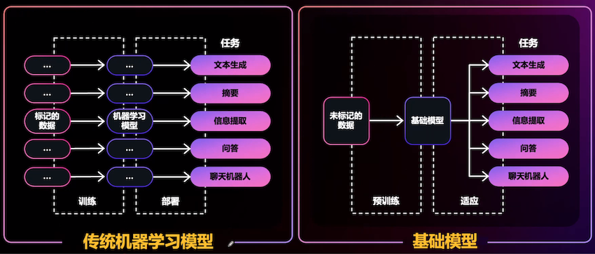
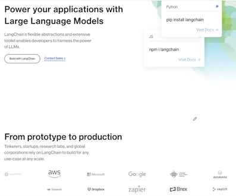
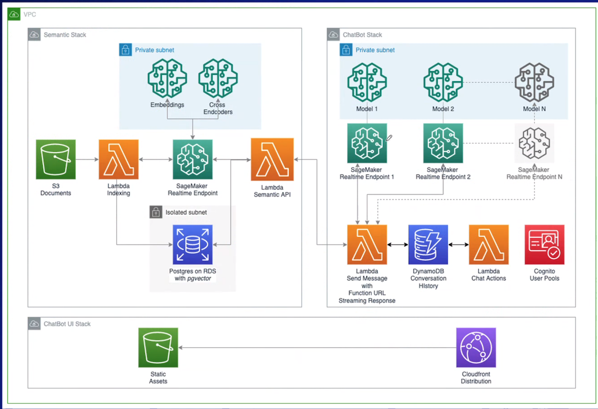
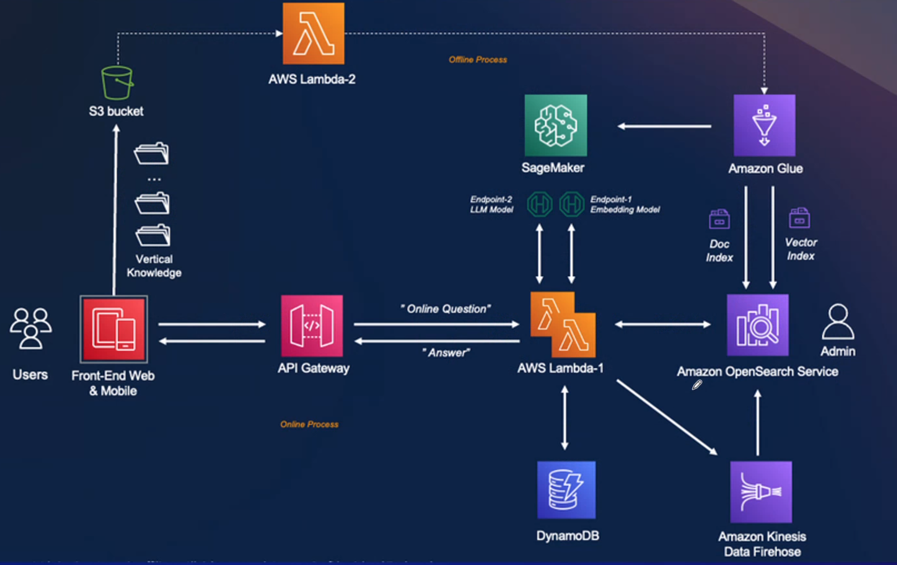

# 2 使用 LangChain搭建基于Amazon DynamoDB 的大语言模型应用

LLM-powered ChatBot with Retrieval Augmented Generation

带检索增强生成的大语言模型驱动的即天机器人

**生成式 Al 从研究走向实际应用**

* 海量数据的爆炸增长
* 可扩展算力的触手可及
* 机器学习创新

**机器学习创新AI?**

* 创作新内容和想法，包括对话、故事、图像、视频和音乐
* 由在大量数据语料库上预训练的大模型提供技术支持，这通常称为**基础模型 (FMS)**

**生成式 Al 功能和用例示例**

* 从文档提取见解
* 创建产品描述
* 创建个性化横幅
* 创建招聘启事
* 会议摘要
* 根据产品描述，创建广告
* 使用通俗易懂的英语，解释复杂的数据
* 轻松起草文档、 电子邮件或设计

**基础模型**



**生成式 Al 应用**

提示词  +  上下文  + 模型  => 输出结果

**如何快速构建生成式Al应用？**

LangChain 是一个开源框架，旨在简化基于大语言模型(M)的应用程序的创建。

作为一个LLM集成框架，LangChain 的用例与大部分LLM的用例重叠，包括文档分析和摘要、聊天机器人和代码分析等。



**LangChain 能做什么？**

**Models**

* 支持多种模型接口，比如 OpenAl HuggingFace，Al21, **<mark>Amazon SageMaker Endpoint</mark>**

**Prompts**

* Prompt 管理，支持各种内置、自定义模板

**Indexes**

* 索引构建，以用作检索器
* 海量，document loader 支持：json、CSV、PDF、PPT、YouTube、Google、Drive、Email、**Amazon S3**.

**Promot 模板示例**

```
from langchain import PromptTemplate

template = """
	I want you to act as a naming consultant for new companies.
	What is a good name for a company that makes {product}?
"""

prompt = PromptTemplate(
	input_variables=["product"],
	template=template,
)
prompt.format (product="colorful socks")

# -> I want you to act as a naming consultant for new companies.
# -> What is a good name for a company that makes colorful socks?
```

* Chains
	* LLMChain
	* 各种工具 Chain
	* LangChainHub
* Memory
	* 维护上下文
* Agents
	* 推动决策制定的实体
	*  根据用户输入决定调用哪个工具

**QA Chain 实例**


**LLM Memory**

* 对话上下文的短期记忆，用于存储对话记录和状态。
	* Amazon DynamoDB, 
	* Amazon DocumentDB,
	* Amazon ElastiCache for Redis

* [https://python.langchain.com/docs/modules/memory/integrations/dynamodb_chat_message_history](https://python.langchain.com/docs/modules/memory/integrations/dynamodb_chat_message_history)
* [https://python.langchain.com/docs/modules/memory/integrations/mongodb_chat_message_history](https://python.langchain.com/docs/modules/memory/integrations/mongodb_chat_message_history)
* [https://python.langchain.com/docs/modules/memory/integrations/redis_chat_message_history](https://python.langchain.com/docs/modules/memory/integrations/redis_chat_message_history)


### **生成式Al 应用模式一检索增强生成 (RAG)**

采用向量数据库用文本嵌入进行语意检索

最终用户的关键路径：


实现一：带检索增强生成的大语言模型驱动的聊天机器人

[https://github.com/aws-samples/aws-genai-Ilm-chatbot](https://github.com/aws-samples/aws-genai-Ilm-chatbot)



**实现二：基于Amazon OpenSearch + LLM智能问答系统**

[https://github.com/aws-samples/private-Ilm-qa-bot](https://github.com/aws-samples/private-Ilm-qa-bot)



**https://github.com/aws-samples/aws-genai-llm-chatbot**

DynamoDB 助力 GenAI 应用

* 是一个键/值和文档数据库
* 无服务器，安全，持久，高可用
* 性能可预测，任意规模的环境中提供个位数毫秒响应
* 自动化归档DynamoDB 数据到S3或者其他服务
	* DynamoDB Export S3全两导出
	* DynamoDB CDC 支持 DynamoDB Stream & Kinesis Data Stream