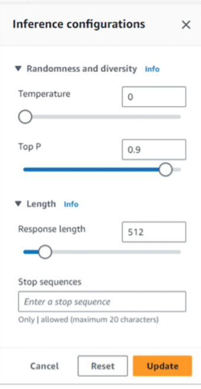
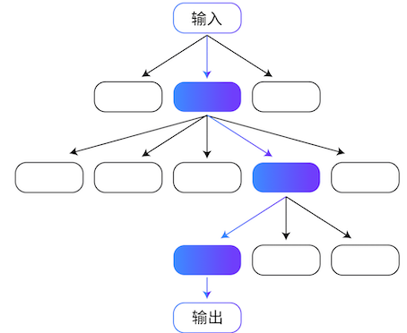
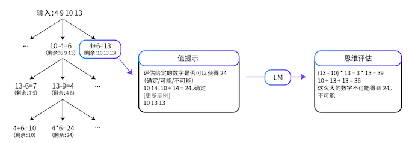
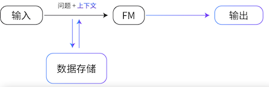
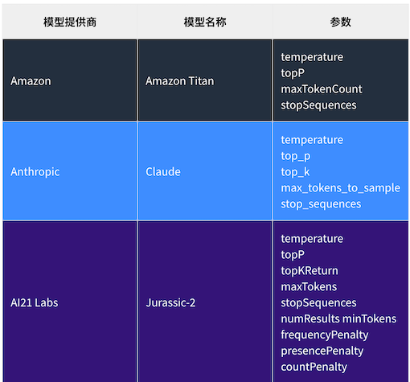

# Amazon Bedrock 简介

### 构建生成式 Al 应用充满挑战性

* 接入和管理多家基础模型
* 对基础模型进行微调并非易事
* 数据隐私和安全性
* 利用基础模型执行复杂任务
* 连接不同的数据源
* 基础设施难以管理

## Amazon Bedrock

> 使用基础模型构建和扩展生成式 A1 应用程序的便捷方法

* 通过单个 API 访问一系列主流基础模型
* 使用企业数据，将基础模型进行微调从而定制化
* 确保数据隐私安全及合规性
* 通过动态调用 APl，构建执行复杂业务任务的Agent
* 利用检索增强生成 (RAG)，通过数据扩展基础模型的力量
* 获得最佳性价比，无需管理基础设施

### Amazon Bedrock 工作原理

**Amazon Bedrock 通过无服务器方式，调用API服务来利用基础模型构建生成式Al 应用程序**

* **选择基础模型**

在Playground试用基础模型，选择满足需求的基础模型

* **直接使用或微调**

按需微调基础模型Bedrock 将自动部署基础模型进行推理

* **发送提示词**

使用 Bedrock API, 将提示发送给基础模型

* **接收响应**

在应用程序中接收模型响应

### Amazon Bedrock广泛的模型选择

**Al21labs**

* Jurassic-2 Ultra
* Jurassic-2 Mid

**ANTHROPIC**

* Claude 2
* Claude 2.1
* Claude Instant

**Meta**

* Llama 2
* Llama 2 13B
* Llama 2 70B

**stability.ai**

* Stable Diffusion XL1.0

### Anthropic Claude

**Claude 2**

旗舰版模型，专为对话、总结、问答、工作流程自动化、编码等而打造。支持复杂的对话和创意内容生成等任

**Claude Instant**

一个较小但功能仍然非常强大的模型，可以处理系列任务，包括任意对话、文本分析、摘要和文档问答。

* Tokens: 100,000
* 支持语种：多语种

### Claude 2.1 Amazon Bedrock 可用

* 200k token 上下文窗口
* Tool Use
* 幻觉率下降 50%
* System Prompt
* 更低的价格

### Cohere Command + Embed

Command基于广泛的业务应用数据进行训练，支持例如文本生成、摘要、文案写作、对话、提取和问答等多种任务。Command是Cohere旗舰模型。CommandLight在成本效益和低延迟推理方面为客户提供了无与伦比的平衡

### Embed English / Multilingual

将文本输入（单词、短语）转换为向量数字表示（Embedding）。与单词匹配相比较，Embedding会产生更相关和更符合上下文的结果。

### Amazon Bedrock自定义能力

* 微调
* 具有知识库的检索增强生成 (RAG)
* 对 Amazon Titan Text Lite  与 Express 持续预训练

### **Amazon Bedrock Knowledge Base中支持的向量数据库类型**

* Amazon OpenSearch Serverless向量引擎
* Redis Enterprise Cloud
* Pinecone
* Amazon Aurora
* MongoDB

### 如何在AmazonBedrock构建Agent

**Agents for Amazon Bedrock 加速生成式AI应用的构建**

### Guardrails for Amazon Bedrock

* 为 Amazon Bedrock 上的多种基础模型和Agent 提供保护
* 根据您的负责任Al的策略来配置有害内容过滤器
* 通过简短的自然语言描述来定义并拒绝生成被禁止的话题
* 在基础模型的回复结果中屏蔽个人隐私数据（PI)


## Amazon Bedrock 的用途

Amazon Bedrock 是一项完全托管式服务，可以提供领先的基础模型 (FM) 和一系列工具，用于快速构建和扩缩生成式 AI 应用程序。此服务还可以帮助确保隐私和安全性。

* **Amazon Bedrock 的三个主要优势是什么？**

### 1.利用 FM 进行高效构建。

* 从各种 FM 中选择

您可以选择 Amazon、AI21 Labs、Anthropic、Cohere、Meta 和 Stability AI 提供的 FM，以确定适合您使用案例的 FM。

其中包括 Amazon Titan、Jurassic-2、Claude、Command、Llama 2 和 Stable Diffusion 系列 FM，**这些 FM 支持包括文本、嵌入和多模态在内的不同模式**


* **通过单个 API 访问 FM**
* **利用完全托管式体验**
	* **利用 Amazon Bedrock 无服务器体验，无需管理基础设施。**

#### 2.安全地构建生成式 AI 应用程序


* **具有全面的数据保护和隐私保护**

通过 Amazon Bedrock，您的数据（包括提示、用于补充提示的信息、FM 响应以及自定义 FM）会保留在处理 API 调用的区域。您的数据在传输过程中通过 TLS 1.2 进行加密，处于静止状态时通过服务托管型 Amazon Key Management Service (Amazon KMS) 密钥进行加密。

**您可以将 Amazon PrivateLink 与 Amazon Bedrock 结合使用，在您的 FM 与本地部署网络之间建立专属连接，不让您的流量出现在互联网中**。

此外，还可以私下对 FM 进行自定义，保留对数据使用方式和加密方式的控制。Amazon Bedrock 会为基本 FM 模型制作一个单独的副本，并对模型的这一私有副本进行训练。


**确保生成式 AI 应用程序的安全**

为确保自定义 FM 的安全，您可以使用亚马逊云科技安全服务制定深入的安全策略。自定义 FM 使用 Amazon KMS 密钥进行加密，并以加密方式存储。

通过使用 Amazon Identity and Access Management (IAM)，您可以控制对自定义 FM 的访问，允许或拒绝访问特定 FM。您还可以控制接收推理的服务以及可以登录 Amazon Bedrock 控制台的用户。


**为监管和可审计性提供访问支持**

Amazon Bedrock 提供了全面的监控和日志记录功能，包括可用于满足监管和审计要求的工具。

您可以使用 Amazon CloudWatch 跟踪使用指标，并使用审计所需的指标构建自定义控制面板。**在将其他系统集成到生成式 AI 应用程序中时，您还可以使用 Amazon CloudTrail 监控 API 活动并排查问题**。

#### 3.使用贵组织的数据提供自定义体验。

**只需几个步骤就能私下微调 FM**

您可以针对特定任务对 FM 进行微调，而无需为大量数据添加注解。

**将 Amazon Bedrock 指向 Amazon Simple Storage Service (Amazon S3) 中的几个标记示例**。

然后，服务会为基础 FM 制作一个只有您才能访问的单独副本，并对 FM 的这一私有副本进行训练。不会使用您的任何数据来训练原始基础 FM。

### Randomness and diversity（随机性和多样性）

* **Temperature(温度）**：LLM使用概率来构建序列中的单词。对于任何给定的序列，序列中下一个单词的选项都有一个概率分布。
	* **设置的温度越接近零，模型越倾向手选择概率较高的单词。设置的温度离零越远，模型可能选择概率较低的单词。**
* **Top P**:TopP 基于潜在选择的概率总和定义截止值。
	* 如果设置的 TopP低于 1.0，模型会考虑概率最高的选项，并忽略概率最低的选项。

### Length (长度)

* Response length(响应长度）：配置在生成的响应中使用的最大令牌数。
* Stop sequences(停止序列）：停止序列是一个字符序列。如果模型遇到停止序列，则会停止生成其他令牌。不同的模型在停止序列中支持不同类型的字符，不同的最大序列长度，并可能支持定义多个停止序列




## 2 提示工程基础知识

FM 使用深度神经网络来模拟人脑功能并处理复杂的任务。您可以对 FM 进行调整，以便用于广泛的常规任务，例如文本生成、文本总结、信息提取、图像生成、聊天机器人和问答

**FM 的示例包括 Amazon Titan、Meta Llama 2、Anthropic Claude、AI21 Labs Jurassic-2 Ultra 等。**

* **自监督学习**

对于自监督学习，不需要标注示例。自监督学习利用数据内的结构自动生成标签。

**训练、微调和提示调整**

* **预训练**

在训练阶段，FM 使用自监督学习或基于人类反馈的强化学习 (RLHF, reinforcement learning from human feedback) 从大量数据集中捕获数据。FM 的算法可以学习数据集中单词的含义、上下文和关系。例如，在训练阶段，模型可能会学习 drink 是指饮料（名词），还是饮用（动词）。

此外，在预训练期间可以使用基于人类反馈的**强化学习 (RLHF, reinforcement learning from human feedback) 技术来使模型更好地适应人类偏好**。在这种方法中，人类提供关于模型结果的反馈，然后模型又使用这些信息来改变其行为。

* **微调**

虽然 FM 是通过自监督学习进行预训练的，并且具有理解信息的内在能力，但是微调 FM 基础模型可以提高性能。

**微调是有监督学习过程，涉及采用经过预训练的模型并添加特定的较小数据集。添加这些较小的数据集将修改数据的权重，以更好地适应任务。** 

有以下两种微调模型的方法：

1. **指令微调**，该方法使用关于模型应如何响应特定指令的示例。提示调整是指令微调的一种。
2. **RLHF**，该方法提供人类反馈数据，从而产生更符合人类偏好的模型。

* **提示工程**

提示充当基础模型的指令。**提示类似于微调，但您不需要提供对模型进行微调时所提供的标注样本数据。**


* **文本到文本模型**

**文本到文本模型是大语言模型 (LLM, large language model)**，这种模型经过预训练，用于处理大量文本数据和人类语言。

* **自然语言处理 (NLP, Natural language processing)**

NLP，首先要收集和准备不同来源的非结构化文本或语音数据并处理这些数据。它使用标记化、词干提取、词形还原、停用词删除、词性标注、命名实体识别、语音识别、情感分析等技术。


* **循环神经网络 (RNN, Recurrent neural network)**

RNN 使用记忆机制**来存储和应用来自先前输入的数据**。

借助这种机制，**RNN 能够有效地处理序列数据和任务**，例如自然语言处理、语音识别或机器翻译。

然而，RNN 也有局限性。它们训练起来缓慢且复杂，并且不能用于训练并行化

* **Transformer**

Transformer 是一种深度学习架构，**具有将输入文本转换为嵌入的编码器组件**。它还具有使用嵌入来发出一些输出文本的解码器组件。

**与 RNN 不同，Transformer 具有极高的并行性，这意味着在学习周期内 Transformer 不是一次处理一个文本单词，而是同时处理所有输入**。

这样一来，Transformer 可以显著缩短训练时间，但需要更多的计算能力来加快训练速度。

**Transformer 架构是 LLM 开发的关键。如今，大多数 LLM 仅包含解码器组件。**

* **文本到图像模型**

文本到图像模型接受自然语言输入，并生成与输入文本描述相匹配的高质量图像。文本到图像模型的一些示例包括 OpenAI 推出的 DALL-E

**谷歌研究大脑团队推出的 Imagen、Stability AI 推出的 Diffusion 以及 Midjourney。**


* **扩散架构**

扩散模型是一种深度学习架构系统，它通过两步过程进行学习。

**第一步称为前向扩散。利用前向扩散，系统逐渐向输入图像引入少量噪声，直到只剩下噪声**  有一个 U-Net 模型可以跟踪和预测噪声水平

**第二步是逆向扩散，对噪声图像逐步进行去噪，直到生成新图像。在训练过程中，模型获得文本馈送，并将其添加到图像向量中**。

### 2-2 大语言模型

* **大语言模型 (LLM, Large language model) 是基础模型的子集**。

LLM 在许多自然语言任务中基于数万亿个单词进行训练。LLM 可以理解、学习和生成与人类产生的文本几乎没有区别的文本。**LLM 还可以进行交互式对话、回答问题、总结对话和文档以及提供建议**。

* **LLM 可以处理大量的文本数据。**

LLM 具有广泛的能力，例如营销创意写作、总结法律文件、为金融团队准备市场研究、为医疗保健行业模拟临床试验，以及为软件开发编写代码。

* **了解 LLM 功能**

大多数 LLM 都是基于 Transformer 模型的。**它们接收输入，对数据进行编码，然后对数据进行解码以产生输出预测**。

* **神经网络层**

Transformer 模型对于自然语言处理非常有效，因为它们使用神经网络来理解人类语言的细微差别。

**神经网络是模仿人脑的计算系统**。单个 LLM 包含多个神经网络层，这些神经网络层协同工作来处理输入并生成输出

**嵌入层**

**嵌入层** 用于将输入文本转换为称为嵌入的向量表示。这一层可以捕获嵌入之间的复杂关系， 从而使模型可以理解输入文本的上下文。

**前馈层**

**前缋层**由多个互联的层组成，这些层将嵌入转换为其自身更高权重的版本。从本质上讲，这一层继续将语言置于上下文中，并帮助模型更好地理解输入文本的意图。

**注意力机制**

**使用注意力机制**，模型可以关注输入文本中最相关的部分。该机制是 Transformer模型的核心部分，可帮助模型获得最准确的输出结果。


### 基本提示技术

#### 1零样本提示

用户向 LLM 提出任务，而不给模型提供进一步示例。

使用零样本提示技术的技巧包括：

* LLM 越大，零样本提示产生有效结果的可能性就越大。
* 指令调整可以改进零样本学习。

#### 2 小样本提示

#### 3 思维链提示

思维链 (CoT, chain-of-thought) 提示通过中间推理步骤分解复杂的推理任务。您可以将零样本提示技术和小样本提示技术与 CoT 提示结合使用。 

```
根据以下信息，哪种车辆需要支付更高的首付？


车辆 A 的总成本为 40,000 USD，需要支付 30% 的首付。


车辆 B 的总成本为 50,000 USD，需要支付 20% 的首付。
（一步一步地思考）
```

```
车辆 A 的首付为
40,000 USD 的 30%，即
(30/100) * 40,000 = $12,000。

车辆 B 的首付为
50,000 USD 的 20%，即
(20/100) * 50,000 = $10,000。

我们可以看到，车辆 A 比车辆 B 需要支付更多的首付。
```

### 高级提示技术

**自洽性**

**自洽性**是一种类似于思维链提示的提示技术。然而，自洽性技术不采取明显的一步一步**路径或贪婪路径**，而是提示模型对各种推理路径进行采样

**思考以下使用 Jurassic-2 (J2) 模型的提示。第一个提示示例使用单个 CoT 提示，第二个示例使用自洽性。**

```
**提示**

问题：当我 10 岁的时候，我妹妹的年龄是我的一半。现在我 40 岁。我妹妹多大了？
答案：
```

```
当我 10 岁的时候，我妹妹 10/2 = 5 岁。

现在，我 40 岁，所以我妹妹是 40 - 5 = 35 岁。
```

#### **思维树**

思维树 (ToT, Tree of thoughts) 是另一种基于 CoT 提示技术的技术。CoT 提示按顺序对思维进行采样，但 ToT 提示遵循树分支技术。

通过 ToT 技术，LLM 可以采用细致入微的方式学习，考虑多条路径而不是一条顺序路径。



对于涉及重要初始决策、未来策略和探索多种解决方案的任务，ToT 提示是一种特别有效的方法。大多数 LLM 通过遵循标准的从左到右的标记级推理来做出决策，但通过 ToT，LLM 可以自行评估选择。

**24 点游戏**

24 点游戏是一项数学推理挑战。目标是使用四个数字和基本算术运算，包括加法 (+)、减法 (-)、乘法 (*) 和除法 (/)，得出数字 24。例如，给定输入 4、9、10 和 13，输出的解可以是 `(10 - 4) * (13 - 9) = 24`。



#### 检索增强生成 (RAG, Retrieval Augmented Generation)

**检索增强生成 (RAG, Retrieval Augmented Generation)** 是一种提示技术，它提供领域相关的数据作为上下文，以基于这些数据和提示生成响应

该技术类似于微调。然而，**RAG 不必使用一小组标注示例对 FM 进行微调，而是从大型语料库中检索一小组相关文档，并使用这些文档提供上下文来回答问题**。RAG 不会改变基础模型的权重，而微调会改变模型权重。



这种方法比常规微调更具成本效益，因为 RAG 方法不会产生对模型进行微调的成本。RAG 还解决了数据频繁更改带来的挑战，因为它会检索更新的相关信息，而不是依赖可能过时的数据集。

在 RAG 中，外部数据可以来自多个数据源，例如文档存储库、数据库或 API。**在将 RAG 用于 LLM 之前，必须准备知识库并使其保持最新**

#### 自动推理和工具使用 (ART, Automatic Reasoning and Tool-use)

与自洽性和 ToT 提示技术一样，ART 是一种基于思维链过程的提示技术。

**研究表明，对于未见过的任务，ART 的表现明显优于小样本提示和自动 CoT，并且在大多数任务中，它的表现与手动 CoT 提示相当**。使用 ART，人类还能够更高效地更新任务库中的信息，从而纠正错误并最终提高性能。


“ART：大语言模型的自动多步推理和工具使用”(ART: Automatic multi-step reasoning and tool-use for large language models)

### 特定于模型的提示技术

* **Amazon Titan FM** – Amazon Titan 基础模型 (FM) 已在大型数据集上进行预训练，这使其成为了功能强大的通用模型。可以按原样使用这些模型，也可以使用您自己的数据为特定任务进行自定义，而无需注释大量数据。
* **Anthropic Claude** – Claude 是由 Thropic 开发的 AI 聊天机器人，您可以通过开发人员控制台中的聊天功能或 API 访问它。Claude 可以处理对话、文本、总结、搜索、创意写作、编码、问答等。Claude 采用对话方式做出响应，并可以修改角色、风格和行为，以更好地适应输出需求。
*  Thropic 开发的 AI 聊天机器人，您可以通过开发人员控制台中的聊天功能或 API 访问它。Claude 可以处理对话、文本、总结、搜索、创意写作、编码、问答等。Claude 采用对话方式做出响应，并可以修改角色、风格和行为，以更好地适应输出需求。
* AI21 Jurassic-2 – Jurassic-2 经过专门训练，可以处理没有示例的纯指令提示或零样本提示。在提示中使用纯指令可能是与大语言模型交互的最自然方式




### 解决提示误用问题

* **提示注入**
	* 提示注入是一种通过使用提示中的指令来影响模型输出的技术。 
* **提示泄露**
	* 提示泄露是指生成式 AI 系统可能通过其生成的提示或示例泄露敏感或私人信息的风险。 

### 减少偏差

用于训练 AI 模型的数据可能有偏差。如果数据有偏差，AI 模型可能会重现这些偏差。**最终，您可能会得到有偏差或不公平的输出。偏差可以通过以下两种方式出现在提示工程中**。

* 一，**如果提示建立在假设的基础上，那么提示本身可能是有偏差的**。例如，如果查询假设所有软件开发人员都是男性，则可能会导致 AI 产生偏向于男性的结果。

* 二，**即使编写的提示没有偏差，AI 模型有时也会产生有偏差的结果。产生这些结果是由于训练数据中可能存在偏差**。例如，即使给出性别中立的提示，如果 AI 模型在接受训练时主要使用以男性软件开发人员为特征的数据，那么它也可能会提供假设软件开发人员是男性的响应。

以下三种技术可以帮助减少 FM 中的偏差。

* **更新提示**。提供明确指引可大规模减少意外的表现。
* **增强数据集**。提供不同类型的代词并添加不同的示例。
* **使用训练技术**。使用公平损失函数、红蓝对抗、RLHF 等技术。
	* 用概率均等来衡量公平性
	* 使用公平性准则作为模型目标

