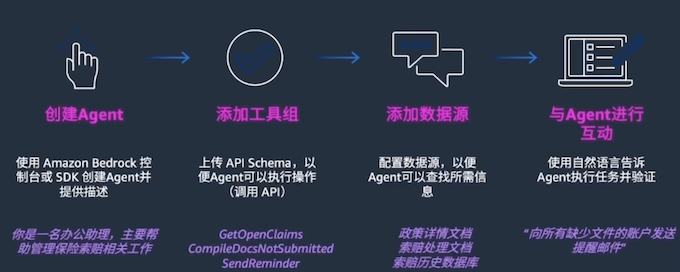
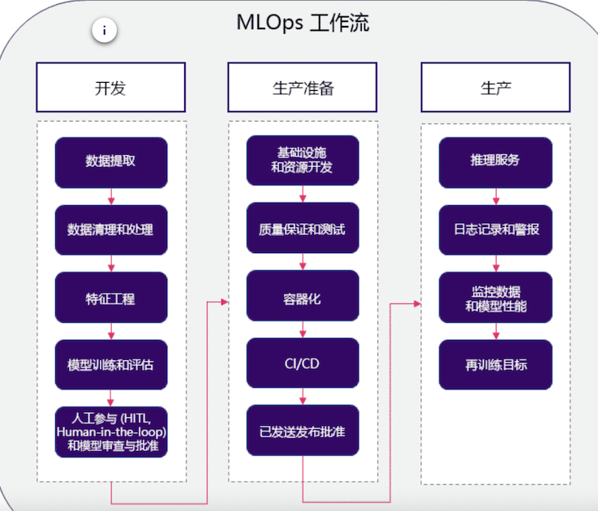
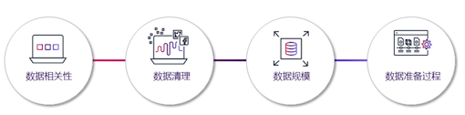

# 4 低代码机器学习

###  **有监督学习**

该流程图显示将训练数据（及其特征和标签）馈送到 ML 算法。结果产生预测模型。此外，还将新数据馈送到预测模型并产生预测结果。有监督学习使用训练数据来示教模型，以生成所需的输出。

**有监督学习问题示例**

在回归中，问题在于预测连续值。您可以使用不同的方法来了解特征（自变量）和结果（因变量）之间的关系。这些方法包括：

#### **回归**

* **线性回归**，用于在给定自变量的值的情况下，预测因变量的值。它使用拟合到数据点图的直线。
* **决策树**，用作预测模型，以得出关于一组观察结果的结论。 
* **随机森林**，是决策树的大集合。对于回归任务，将返回单个树的平均预测。 
* **神经网络回归**，是一种利用人工神经网络对连续数值进行建模和预测的技术。

#### **分类**

**在分类中，问题在于预测项目是否属于特定类别或类**。您可以使用不同的预测建模方法，对输入数据的特定示例预测类标签。这些方法包括：

* **逻辑回归**，用于根据给定的自变量数据集估计事件发生的概率。预测通常具有二元结果，例如 1 或 0、是或否、真或假、阳性或阴性。
* **支持向量机**，是具有关联学习算法的有监督学习模型，用于分析数据以进行分类和回归分析。 
* **朴素贝叶斯**，是一种基于贝叶斯定理的算法，以托马斯·贝叶斯的名字命名，它描述了事件的概率。它对给定类变量的每对特征之间的条件独立性作了朴素的假设。 

**可以使用决策树、随机森林和神经网络，它们对聚类的定义与对回归的定义相同。**

### 无监督学习

无监督学习是指在未标注的数据中学习模式的算法。

在有监督学习中，模型学习将输入映射到目标输出，例如标注为猫或鱼的图像。**无监督方法学习输入数据的简明表示，可用于数据探索或者分析或生成新数据。**

**无监督学习问题的示例**

#### 聚类

在聚类，**挑战在于将对象组织成具有相似属性的成员组（或簇）**，然后描述簇的特征。 聚类的一些方法包括：

* **K 均值聚类，这是一种基于质心的聚类算法**。这种算法会计算每个数据点与质心之间的距离，以将数据点分配到簇。 
* **主题建模方法**，用于发现假定已生成主题簇的常用主题。

#### 降维

具有大量特征的训练模型成本高昂，而且更容易过拟合。降维可最大限度地减少有代表性或有影响力的特征的数量。 

以下两种方法可用来执行降维：

* 使用特征选择来识别影响最小或无影响的特征。（您可以不考虑这些特征。) 
* 使用特征提取来获取具有同等表现力的特征（原始特征的组合）

对于降维，您可以使用主成分分析 (PCA)。这是一种将高维数据转换为低维数据，同时保留尽可能多的信息的技术。

### 强化学习

强化学习的一个示例是当计算机程序与动态环境交互以完成特定任务时。这些任务可能是操作车辆或在游戏中竞争。该程序在遍历其问题空间时接收类似于激励的输入，然后致力于实现优化。

## ML 生命周期

生成和运行典型的 ML 工作负载是一种由多个阶段组成的迭代过程。ML 流程包括以下考虑因素：

**业务目标识别 / ML 问题界定 /  数据收集 / 数据集成和准备 / 特征工程 / 模型训练 / 模型验证 / 业务评估 / 生产部署（模型部署和模型推理）**

* **项目范围：定义业务问题和目标**
* **数据准备：收集井准备所有相关数据**
* **模型开发：开发和评估模型**
* **模型部署：在数据集上运行经过训练的模型**
* **模型监控和维护**：将模型部署到生产环境中

### ML 运维和工作流

## ML 项目数据

### 数据相关性

* 有偏差的数据
* 数据中的季节性影响
* 数据随时间推移而变化
* 训练和测试子集的相关性

### 数据清理

数据集中可能会出现一整类不同的问题。例如，修复错误的格式是最关键的数据科学挑战之一。

* 异常值
* 重复值
* 缺失值
* 数据中的噪声

### 数据规模

数据量大比数据量不足更可取。例如，当需要更多数据时，可以简单地消除异常值和缺失的变量，也可以直接使用样本进行训练。

* 数据量
* 随机数据子集
* 数据表示
* 数据匹配

### 数据准备𨑬程

* 将新数据纳入流程
* 自动执行 ETL 和 ELT 流程

–
提取、转换和加载 (ETL, extract, transform, and load) 流程使用一组业务规则来处理来自多个来源的数据，然后再将其传输到中央数据存储。 

提取、加载和转换 (ELT, extract, load, and transform) 方法以当前形式加载数据，并在稍后的阶段根据使用案例和分析需求对数据进行转换。

## SageMaker Autopilot 支持以下类型的 ML 算法：

* **LightGBM**

LightGBM 是一种经优化的框架，它使用**基于树的算法和梯度提升**。该**算法使用在广度而不是深度上生长的树，并且针对速度进行了高度优化**

* **XGBoost**

XGBoost 是一种使用基于树的算法和梯度提升的框架，**其中的树在深度而不是广度上生长**。

* **极度随机树**

极度随机树是一种基于树的算法，**它在整个数据集上使用多个决策树。树在每一层随机分叉。**

**对每棵树的决策进行平均，以防止过拟合并改进预测**。与随机森林算法相比，极度随机树算法的随机性更大。

* **神经网络 torch**

神经网络 torch 是一种使用 Pytorch 实施的神经网络模型。

* **CatBoost**

**CatBoost 是一种使用基于树的算法和梯度提升的框架**。它针对处理分类变量进行了优化。

* **随机森林**

随机森林是一种基于树的算法，它对具有替换的随机数据子样本使用多个决策树。这些树在每一层被分成最优节点。

**对每棵树的决策进行平均，以防止过拟合并改进预测。**

* **线性模型**

线性模型是一种使用线性方程来模拟观测数据中两个变量之间的关系的框架。

* **神经网络 fast.ai**

神经网络 fast.ai 是一种使用 fast.ai 实施的神经网络模型。

* **SageMaker Autopilot 支持 CSV 或 Parquet 文件格式的表格数据**。对于使用逗号分隔数字字符串的列，数字、分类、文本和时间序列是可接受的数据类型。
* SageMaker Autopilot 支持三种问题类型：**回归、二元分类和多类分类**。
	* 它可以运行两种训练模式：**超参数优化 (HPO, hyperparameter optimization) 和集成**。
	* 第三种模式“自动”是一个决策点，用于决定是调用 HPO 还是集成。

* 根据所选的训练模式，SageMaker Autopilot 依赖于两组不同的算法：**HPO 模式算法和集成模式算法**。

* SageMaker Autopilot 使用数据集的交叉验证来衡量模型的质量。有多个与 SageMaker Autopilot 关联的指标：**目标指标、加权指标和模型质量指标**。

* SageMaker Autopilot 使用 SageMaker Clarify 提供的工具来帮助解释 ML 模型如何进行预测。

* 在 SageMaker Autopilot 创建模型之后，您可以通过两种方式使用模型进行预测：**实时推理和批量推理**。

## 测试

* 使用相关数据的对话式Chatbot是AmazonBedrock的常见使
用案例。
* **强化学习的一个示例是当计算机程序与动态环境交互以完成特定任务时**。这些任务可能是操作车辆或在游戏中竟争。该程序在遍历其问题空间时接收类似于激励的输入，**然后致力于实现优化**。
* **回归和分类是有监督学习模型类型。**
* **正则化是旨在减少过拟合的训练和优化技术的集合**。
* **F1分数是查准率和查全率的调和平均值**。查准率用于衡量预测为阳性的示例中实际为阳性的比例。查全率用于衡量有多少实际的阳性示例被预测为阳性。
* AmazonSageMakerDataWrangler是一款专门构建的**数据聚合和准备工具**
* 借助SageMakerDataWrangler数据选择工具，您可以快速访问 和选择各种常用数据源中的数据，例如AmazonS3、Athena、 Amazon Redshift、Amazon Lake Formation 和AmazonEMR
* SageMakerAutopilot可以运行两种训练模式：**HPO和集成**。第三种
模式“自动”是一个决策点，用于决定是调用HPO还是集成。
* **SageMakerAutopilot交叉验证过程的第一步是将数据分成k份**。
	* K折分割是一种将输入训练数据集分成多个训练数据集和验证数据集的
方法。
* 如果您的数据集大于100MB，**则SageMakerAutopilot会选择HPO
模式。否则，它会选择集成模式**。
* 在内置SageMakerDataWrangler转换器可用于您的使用案例的
情况下，**使用这些转换器**
* SageMakerDataWrangler支持两个ML实例类型系列：**M5和R5**。
* 可使用**快速模型可视化**来快速评估数据并生成每个特征的重要性
分数
* 可使用**数据质量和见解报告来获取对数据集的见解，例如缺失值
的数量和异常值的数量**
* SageMakerAutopilot提供可解释性报告，以帮助解释最佳候选模
型如何进行预测。用于文本分类的SageMakerAutopilot解释功
能使用称为集成梯度的公理归因方法
* SageMakerAutopilot会进行特征选择。默认情况下，它会选择所
有特征进行训练。

## Amazon Kendra 

### 使用 Amazon Kendra 搜索内容

* 创建 Amazon Kendra 索引。这是一个存储库，其中将包含用户将搜索的所有相关信息。
* 创建数据源。该数据源将连接到一个 S3 存储桶，该存储桶具有可供创建索引的文档。
* 安排同步，将数据源的内容放入索引中。
* 同步完成后，您便可以使用 Amazon Kendra 执行自然语言内容搜索。

### SageMaker

**SageMakerAutopilot会进行特征选择**。默认情况下，它会选择所
有特征进行训练。

借助Amazon Kendra，可以缓解当用户无法快速找到答案时，降低员
工的工作效率、与基础设施管理相关的高成本，以及与构建、管理和
训练ML模型相关的成本和时间等问题。

使用 Amazon Kendra 的优势包括获得使用自然语言编写的问题的答
案、在单个查询中跨多个数据源进行搜索，以及提高员工的工作效
率。

Amazon Kendra可以用来帮助联系中心的座席快速提供信息、在产品
目录中搜索产品信息，以及利用长期积累的组织知识。

## ML测试

1. 针对FoundationModels（FM）和TraditionalML模型的说法不正确的是？

	* A.FM模型通常同时具备完成更多任务的能力，而Traditional ML针对不同的任务往往需要不同的模型
	* B.FM支持以用自然语言作为提示词来完成生成任务，从而降低了使用门槛
	* C.FM的模态包括语言，视觉和声音等
	* **D.FM的能力更强，因此应用成本也更高 (Wrong)**

	> FM模型（例如Fine-tuning based Model）并不一定意味着应用成本更高，因为成本可能取决于多种因素，如训练时间、数据需求、硬件要求等。

2. 大语言模型的常见优化手段不包括以下哪一项
	* A.提示词优化
	* B. 微调模型
	* **C. 使用Controlnet (不包括)**
	* D. 合智能检索增强(RAG)

	>  通常，大语言模型的优化手段包括提示词优化、微调模型以及结合智能检索增强（如RAG模型）。Controlnet并不是一个通常被提及的优化手段。

3. **在Amazon Bedrock服务中提供了哪些类型的基础模型？**
	* A. 图片生成模型
	* B. 文本生成模型
	* C. 文本/图片的嵌入 (embedding）向量模型
	* **D.以上全部**
	
	> 语言模型 / 多模态模型 / 图像模型 /音频模型

4. Amazon Q 可以在哪些场景中使用？
	* A. 亚马孙天科技控制台 (Console）页面
	* B. 集成开发环境 (IDE)
	* C. Amazon Quicksight/Connect
	* **D.以上全部**

5. Amazon Bedrock 主要提供哪些功能？
	* **提供基础模型和一系列工具，用于构建和扩展生成式 Al 应用程序**

6. 关于 Amazon Bedrock 的资料安全责任，以下哪些陈述是正确的？
	* **A. AWS 负责保护运行 Amazon Bedrock 提供的所有服务的基础设施**。
	* **B.用户负责管理和加密数据，并负责对数据以及对 Amazon Bedrock 进行的 API 调用应用正确的用户访问控制**。
	* **C.用户负责自定义 FM和第三方FM 所返回结果的准确性**。
	* D.所有上述陈述。

7. **提示工程(Promptengineering）的主要目标是什么？**

	* A.调整模型的权重
	* B.优化成本函数
	* **C.指引模型的行为以达到期望的结果**
	* D.更改模型参数	

	> 提示工程是指设计和制定提示（prompt），以引导模型产生特定的输出，从而实现所需的结果。通过设计合适的提示，可以有效地引导模型产生正确的输出，提高模型的性能和可解释性。

8. 以下哪个不是有效提示中的一个元素？

	* A. 指示：这是一个给模型的任务
	* B. 上下文：这是指导模型的外部信息
	* C.输入数据：这是你想要得到响应的输入
	* **D.输入國值：对输入数据的约束**

	> 在提示工程中，有效提示的元素包括指示、上下文和输入数据。指示是指明模型任务的部分，上下文是指导模型的外部信息，输入数据是指需要模型处理的输入。输入國值并不是有效提示中的一个元素。

9. 以下哪些做法可以**帮助优化模型的回应？**

	* **A.提高问题的直接性，避免模糊性**
	* **B. 提供更多的上下文信息**
	* **C.制定特定的输出形式，如摘要、问题或诗歌**
	* D.所有以上的答案都是正确的

10. 以下哪个是避免提示注入的一个策略？
	* 	A. 将敌对提示注入到模型中。
	* 	**B. 为你的提示添加防护栏 (Guardrails)**
	* 	C.从模型中删除所有提示，
	* 	D. 增加模型的训练数据
	
11. 关于敌对提示泄露 (Prompt leaking），以下哪个描述是错误的？
	* A 这是-种风险，通过Al系统可能泄露提示或示例中的敏感或私人信息。
	* B. 如果一个系统使用私有客户数据进行训练，可能会泄露关于客户购买行为的详细信息。
	* **C.它可以被用来更好地了解用户的购买偏好，并提供更准确的产品推荐**。
	* D.这可能会侵犯用户的隐私和对系统的信任。

12. 下面哪项最能描述树状思维 (Tree of thoughts） 这个提示技术？
	* **A.以树状思维方式学习，而不是顺序逐步采样。**

13. 以下哪项描述最贴切地代表了"机器学习"的定义？
	* A.**机器学习是一种人工智能方法，它使用数据来提高一组任务的计算机性能，能够在未明确编程的情况下让机器进行预测或决策。**

14. 以下哪个选项最准确地描述了在评估是否应使用机器学习 （ML）解决业务问题时应考虑的因素？
	* C．主要在确定成功的标准，并考虑企业能否实现这些标准。这些标准应该是可实现的，可以提供直接的生产路线，并考虑可能出现的新业务流程。

15. 以下哪个选项最准确地描述了机器学习 （ML） 生命周期的步骤？
 	*  A.业务目标识别、ML问题界定、数据收集、数据集成和准备、特征工程、模型训练、模型验证、业务评估和生产部署。
 	
 	*  定义问题：明确定义需要解决的业务问题和目标。
 	*  数据收集：收集与问题相关的数据，确保数据质量和可靠性。
 	*  数据准备：对数据进行清洗、转换和特征工程，使其适合用于模型训练。
 	*  模型选择：选择适当的机器学习模型来解决问题，考虑数据特征和问题类型。
 	*  模型训练：使用训练数据来训练所选的机器学习模型。
 	*  模型评估：评估模型的性能和准确度，检查是否达到预期的业务指标。
 	*  模型调优：根据评估结果对模型进行调整和优化，提高模型的性能。
 	*  模型部署：将训练好的模型部署到生产环境中，使其可以用于实际应用中。
 	*  监控和维护：监控模型在生产环境中的表现，定期更新模型以适应新数据和变化。

16. MLOps（机器学习运维）的主要目标是什么？
	* C.自动化机器学习工作流程，确保各团队无缝协作

	> MLOps旨在通过自动化和标准化机器学习工作流程，使机器学习项目的开发、部署和维护更加高效和可靠。它促进不同团队之间的协作，提高生产效率，确保模型的可靠性和稳定性。

17. 选择最佳答案：在机器学习模型中，哪个阶段被认为是可能出现最大问题或者误差的阶段？
	* **B.数据准备和处理阶段**

18. 在构建机器学习模型时，根据要预测的结果的本质，若结果是连续的，如数量、金钱、身高和体重，那么应该优先选择哪种算法？
	 * **C.线性回归算法**

	 > 线性回归算法适用于连续数值的预测问题，它可以帮助建立输入特征与连续输出之间的线性关系，从而进行预测。逻辑回归算法通常用于分类问题，卷积神经网络通常用于图像处理等领域，决策树分类器也更适合分类问题。因此，对于连续数值的预测问题，线性回归是一个更合适的选择

