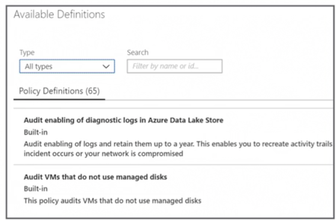
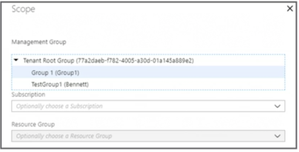
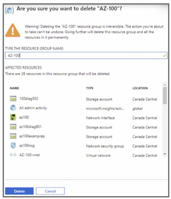
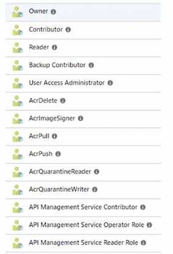

# **L1 Manage Azure Subscriptions and Resources**

## **1 The new Azure exams and certifications**

### **1-1 Az-103 Azure Administrator**


### **1-2 Exam Question Format**

* **Technical Scenario**

"You're an administor"


* **Requirments or Problem Statement**

"The virtual machine must"

* **Goal Statement**

"You must/need ..."


* **Question Statement**

"What do you need to do"


### **1-2 Exam Overview**

* 40-60 questions 

Answer all of the questions, no penalty for guessing 

* 180 minutes-150 minutes for the exam 

* Variety of question types 
	* Performance based and drag and drop 
* Case studies 


## **2 Manage Azure subscriptions**

### **2-1 Enterprise level breaking down**

* Broken down into **departments**
* Break departments down by **location**
* Break departments down by **function**

**<mark>departments** -> **accountts** -> **subscriptions** -> **Azure Resources</mark>**


### **2-2 Administrator Roles** 

* Classic (deprecated)
* **Azure role-based access control (RBAC)** 
* **Azure Active Directory (AD) (administrative roles)**

### **2-3 Role-based Access Contorl (RBAC)**

* 70 built-in roles 
* **User Access Administrator** 
* **Custom roles** 


> Exam: Should be aware of **how to create a custom role**

### **2-4 Top Three RBAC Roles**

* **<span style="color:red">Owner</span>**: Full access to all resources 

* **<span style="color:red">Contributor</span>**:  **Cannot delegate access** to other users but can create and manage resources 

* **<span style="color:red">Reader</span>**: View Azure resources only 


### **2-5 Assign RBAC Administrative Permissions**


* **Do at the subscription level.**
* Select the role (**Owner, Contributor, Reader or  70 built-in roles**)
* Assign access to Azure AD user, group, or application 
* Select user 

### **2-6 User Access Administor**

**Special account that allows you access to all the Azure resources at the `root scope`**

* **Special account** 
* Privilege at the root scope (`/`) 
* **Temporary access only (recommended)**
* Azure AD, not subscription 


**Properties** => **Access Management for Azure resources**

### **2-7 Configure Cost Center Quotas (`Exam`)**

<span style="color:red">**Subscription level** => **Usage & Quotas** => **Current usage of resources**</span>

### **2-8 Resource Tags** 

* Sort resources based on tag 
* Name and value 
	* Finance: Production; 
	* Finance: Dev 
* **Fifteen tags per resource** 
* Write access is required to apply tags to a resource 


### **2-9 Apply tags using PowerShell by simply using the command line**

**Color Formatting - HTML**

```
# Apply tags to a Resource without tags 
Set-AzureRmResourceGroup -Name RGName -Tag @{ Dept "IT"; Environment "Prod" } 

# Remove Tags from a resource group 
Set-AzureRmResourceGroup -Tag @{} -Name RGName 
```

### **2-10 Azure Policies**

* Set of rules to ensure compliancy 
* **Scan resources and provide reporting** 
* Used to ensure SLAs and corporate policies are met 
* **Applied to subscriptions and resources** 


### **2-11 Azure Policy Assignment Options**

* **Policy**: Individual polices 

* **Initiative**: Groups of individual polices 

### **2-12 Three components of policy (Policy & Initiative)**

#### **1. Policy and Initiative Definition**

**Conditions that the policy or initiative will report on and enforce if configured to do so**



#### **2.Policy and Initiative Assignment**

* Applying the initiative or policy **to a scope**
* Assignments are **inherited by all child resources**



#### **3.Policy and Initiative Parameter**

* **Reduce the number of definitions** 
* Use generic values 
* Example: locations allowed 


### **2-13 Key Points**

* Know where to enable the User Access Administrator (**Temporary access only (recommended)**)
* Understand the components of a policy 
	* **Policy**: Individual polices 
	* **Initiative**: Groups of individual polices 
	* Policy and Initiative **Definition**
	* Policy and Initiative **Assignment**
	* Policy and Initiative **Parameter**
* Know how to use tags for reporting 
	* **Fifteen tags per resource**  
* Be familiar with RBAC and how it is used to control access to Azure resources 

## **3. Analyze resource utilization**

### **3-1 Configure Diagnostic Settings on Resources**

* **Diagnostic logs** 
	* **<span style="color:blue">Tenant logs</span>** 
	* **<span style="color:blue">Resource logs/span>** 
	
* Can be **enabled via the resource** or in the **Azure Monitor** 
* Data can be 
	* **<span style="color:red">archived to a `storage account`</span>** 
	* **<span style="color:red">Streamed to an `event hub`</span>**
	* **<span style="color:red">Sent to Log Analytics</span>**


### **3-2 PowerShell** 

```
# Archive to a Storage Account 
Set-AzureRmDiagnosticSetting -ResourceId [resource id] -StorageAccountId [storage account id] -Enabled $true 

# Stream to an Event Hub 
Set-AzureRmDiagnosticSetting -ResourceId [resource id] -ServiceBusRuleId [Service Bus rule id] -Enabled $true 

# Send to Log Analytics 
Set-AzureRmDiagnosticSetting ResourceId [resource id] -WorkspaceId [resource id of the Log workspace] -Enabled $true 
```

### **3-3 Create Baseline for Resources** 

* Dynamic threshold alerts 
	* **Set in the Azure Monitor** 
	* **Limited public preview** 

* **Desired State Configuration (DSC) Ensure that your servers stay within scope**
	* Portal 
	* PowerShell 


### **3-4 DSC Configuration Script** 

```
configuration IISInstall 
{ 
	node "localhost" { 
		WindowsFeature IIS 
	{ 
		Ensure = "Present" 
		Name   = "Web-Server"
	} 
 } 
} 
```

### **3-5 Alerts** 

* **Send notification of changes in the environment** 
* Create alerts for 
	* **Metric values** 
	* **Log search queries** 
	* **Activity Log events** 
	* **Health of the Azure platform** 
	* **Website availability** 

### **3-6 Alerts rules components**

* **Target resource** — Azure resource 
* **Signal** - metrics, activity log, application insights, or a log 
* **Criteria** - combination of signal and logic 


### **3-7 Analyze Alerts and Metrics Across Subscriptions** 

* Azure Monitor
* Provide a better unified experience


### **3-8 Create Action Group (AWS SNS Subscription)**


**Action Group are used specify:**

* Notification preferences 
* Triggered by an alert
* Name 
* Action type 
* Details 

### **3-9 Action Group Types** 

* **Email/SMS/Push/Voice** 
	* SMS / 5minuttes
	* Voice / 5minuttes
	* Email 100 an hour
* **Azure Function** 
* **Logic App** 
* **Webhook** 
* **ITSM**
* **Automation Runbook** 

### **3-10 Report on Spend** 

* **Cost management and billing (preview)** 
	* Organization billing and individual billing 

* **Cost analysis**
	* Filter costs by subscription, resource, date, or tag Download Usage `Report.csv `

* **Invoices** 
	* Download invoices and view costs by service 

### **3-11 Azure Advisor** 

* **Identifies idle and underutilized resources** 
* Resizes or shuts down underutilized virtual machines 
* **Eliminates ExpressRoute circuits with a status of Not Provisioned for more than one month** 


### **3-12 Utilize Log Search Query Functions** 

* Azure Monitor 
* Provide insights based on the data 


### **3-13 Key Points**

* Know how to create a log search query 
* Know how to create an alert 
* Know how to create an action group 
* **<span style="color:blue">Understand how often notifications are sent to an action group</span>**


 
## **4 Manage resource groups**

### **4-1 Create Action Group**

* **Resource policies can be applied to the resource group** 
* Policy then only applies to the resource group, **not the entire subscription** 


###  **4-2 Resouce Lock** 

* **Controls access** 
* Prevents accidental deletion or modification of resources 
* **The lock can be applied:** 
	* **Subscription** 
	* **Resource group** 
	* **Resource** 


### **4-3 Types of Locks** 

* **<span style="color:red">`CanNotDelete`</span>** 

Read and modify but not delete a resource 

* **<span style="color:red">`ReadOnly`</span>** 

Read but not modify, delete, or update a resource Can lead to unexpected results 

>  When you use a ReadOnly lock, it can lead to unexpected results when applied to some resources because the resource itself may need additional actions to function. 


### **4-4 Lock Hierarchy** 

* **Parent-child relationship** 

	* Locks applied at the parent scope affect all resources within that scope 
	* **Most restrictive lock takes precedence** 

### **4-5 Permissions Required to Apply a Lock** 

* `Microsoft.Authorization/*` 
* `MicrosoftAuthorization/locks/*` 
* Owner 
* User Access Administrator 


### **4-6 Locks Using PowerShell** 

```
# Lock a Resource Group 
New-AzureRmResourceLock -LockName NoDelete -LockLevel CanNotDelete -LockNotes "Can not Delete Resources" -ResourceGroupName 'AZ-100' 

# View All Locks in Subscription and Resource Group 
Get-AzureRmResourceLock 
Get-AzureRmResourceLock -ResourceGroupName 'AZ-100' 

# Delete a Lock 
Remove-AzureRmResourceLock -LockName NoDelete -ResourceGroupName 'AZ-100' 
```

### **4-7 Moving Resource to Another Resource Group**


* **The location of the resource does not change** 
* **Not all resources can be moved** 
* **Resources are locked during the move** 


### **4-8 Moving Resource to Another Subscription**

* Must exist **in the same Azure Active Directory** tenant (transfer ownership or add a new Azure subscription) 
* Resource provider must be **registered for the destination subscription** 
* Check to ensure you will **not exceed subscription quotas** 


### **4-9 Permissions Required to Move Resources** 

* **Source resource group**

Microsoft.Resources/subscriptions/resourceGroups/`moveResources/action` 

* **Destination resource group** 

Microsoft.Resources/subscriptions/resourceGroups/`write`


### **4-10 Move Resources to Resource Group** 

```
# Move Resources to Another Resource Group 

Move-AzureRmResource -DestinationResourceGroupName "NewRGPS" - ResourceId "/subscriptions/81XXXXXXX/resourceGroups/MARGPS/ providers/Microsoft.Network/virtualNetworks/az100vnet" 
```

### **4-11 Remove Resource Group**

* Removes all resources in the resource group 
* **Some resources need to be manually removed before the resource group can be deleted** 



### **4-12 Remove Using PowerShell **

```
#Remove a Resource Group 
Remove-AzureRmResourceGroup -Name ResourceGroup 
```

### **4-13 Key Points** 

* Azure policies can be applied to the resource group level instead of the subscription level 
	* Policy then only applies to the resource group, **not the entire subscription** 
* Know the permissions required to move a resource group 
* Understand the relationship between resources when applying locks
* Know that applying a read-only lock may have unforeseen consequences 


## **5 Manage role-based access control**


### **5-1 RBAC Role**

* **Azure Active Directory(top level)**.
* Azure Active Directory manage **Users and Groups** and **assign our Azure Administrative Roles**. 

* **RBAC Roles(subscription level)** 

	* Each subscription contains Resource Groups and Resources. 
	* Your RBAC Roles can be assigned to any of those levels.


### **5-2 Azure AD Admin Roles vs. RBAC (difference)**

* RBAC roles provide **access management to Azure resources** 
* Azure AD roles used to **manage Azure AD resources** 
	* Manage users 
	* Assign admin roles 
	* Reset passwords 
	* Manage licenses 
	* Manage domains 

### **5-3 Type of RBAC Roles** 

* Owner 
* Contributor 
* Reader 
* User Access Administrator 
* Built-in roles
* Custom roles 



### **5-4 RBAC Required Permissions** 

* Microsoft.Authorization/roleAssignments/**write**
* Microsoft.Authorization/roleAssignments/**delete** 
	* **User Access** 
	* **Administrator Owner** 

### **5-5 Before Assigning Access**

* Who needs access to the resource? 
* What permissions do they really need? 
* What resource does access need to be granted to? 


### **5-6 RBAC Role Assignments** 

* **Security principal** 
	* Who or what needs access 

* **Role definition** 
	* Collection of permissions 

* **Scope** 
	* Boundary of the access 
	* What resource is this going to apply to


### **5-7 Security Principal (Who or what needs access)**

* User 
* Group 
* Service principal 
	* **Identity for an application** 
* **Managed identity** 
	* Cloud apps that need to authenticate to Azure AD 


### **5-8 Role definition (permissions)**

* Actions 
* Not actions 


### **5-9 Scope**

* **Management group** 
* Subscription 
* **Resource group** 
* Resource 
* **Parent-child relationship — Roles are inherited**


### **5-10 Putting it together**


