# **L2 Managing Azure storage**

## **1 Create and configure storage accounts**

### **1-1 Types of Storage Accounts**

*  **<span style="color:red">Blobs: unstructured data</span>**
* Files: shared files in the cloud or **<span style="color:red">on-premises</span>**
* Queues: **messaging** 
* Tables: **NoSQL store** 


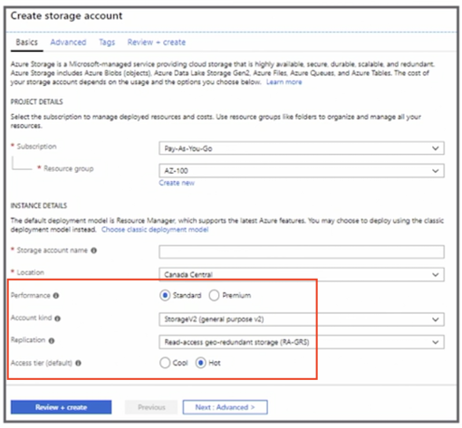

### **1-2 Types of Blob Storage** 

* **Block blobs** 
	* Test and binary data 
* **Append blobs** 
	* Append operations, such as **logging data** 
* **Page blobs** 
	* Virtual Hard Disk (VHD) files 


### **1-2 General-Purpose Storage Accounts** 

* **Standard:** 
	* **Magnetic drives**

>  This type of storage is great for test and dev and non-production environments

* **Premium storage:** 
	* Only page blobs are supported, such as virtual machine disks 99.99% SLA without requiring an availability set 

> Microsoft recommends for all virtual machines 

### **1-3 Storage Account firewall**

* **Default rule accepts all connections** 
* **<span style="color:red">Add allowed IP addresses</span>** 
* Exceptions are used for **trusted Microsoft services**, read access **to storage logging, or metrics from any network** 

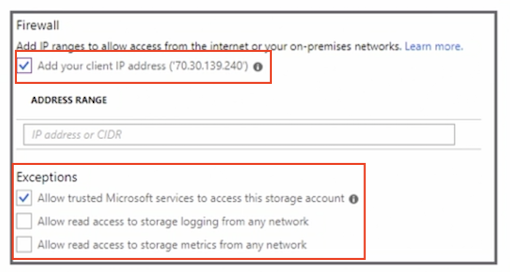


### **1-4 Configrue Network Access to storage Account**

* **<span style="color:green">Only traffic from allowed VNet can access the storage account</span>** 
* Set the default rule network access to deny to **only allow traffic from specific networks** 
* **User must have `Join Service` to a Subnet permission** (Storage 
Account Contributor role) 

> Be careful that you don't lock yourself out, and not anyone can configure these virtual networks.

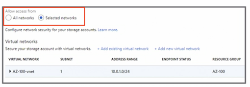

### **1-5 Generate a Shared Access Signature**

* Allow access **without sharing the account keys** 
* **Using account keys allows administrative access**
* Set permissions 
* **Set start and expiry dates** 


### **1-6 Access Keys** 

* Authenticate applications when requesting access to the storage account
* Keep the keys safe and don't share them 
* Microsoft recommends regenerating the keys regularly 
* **After regeneration, apps and resources will need to be updated** 


### **1-7 Regenerating Access Keys**

1. **Update the application to use key 2**. 
2. Regenerate key 1. 
3. **Update the application to use key 1**. 
4. Regenerate key 2. 


### **1-8 Azure Storage Explorer**

* Manage storage accounts from your local PC
* Upload and download files or folders 
* In preview, Storage Explorer via the portal storage account 


### **1-9 Azure Storage Replication**

* **Locally redundant storage (LRS)**: replication within a storage scale unit (same datacenter) 
* **Zone-redundant storage (ZRS)**: replicates data synchronously over three availability zones 
* **Geo-redundant storage (GRS)**: replication to another region 
* **Read-access georedundant storage (RA-GRS)**: replication to another region with read access 


### **1-10 Key Points** 

* Understand the different types of replication 
	* Locally redundant storage (LRS)
	* Zone-redundant storage (ZRS)
	* Geo-redundant storage (GRS)
	* Read-access georedundant storage (RA-GRS)
* Know the different types of storage  
* Know how to create a storage account 
* Know the order in which to generate keys 
* Be familiar with the new firewall and VNet services 

## **2 Import and export data to Azure**

### **2-1 Overview** 

* **Transfer large amounts of data to Azure datacenter** 
* **Import data to Azure** 
	* **Prepare physical disks and ship to the datacenter** 
* **Export data from Azure** 
	* Ship empty drives, configure blobs to export, and ship drives back 


### **2-2 Prepare the Disks** 

* Must create a journal file that contains 
	* Drive serial number, 
	* Encryption key,
	* Storage account information 
* Must enable **BitLocker** 
* Copy data 
* Prepare disk using **`WAlmportExport.exe`**


### **2-3 Create `Import into` Azure Job**

* Provide basic info, **such as a resource group or name** 
* **Upload journal files** 
* **Select Import destination** 
* Configure return shipping information 

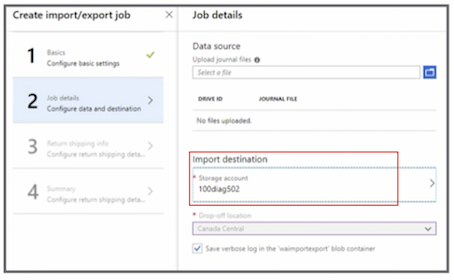

### **2-4 Create `Export into` Azure Job**

* Provide basic info, such as a source group or name 
* Select **storage account** 
* **Select blobs to export** 
* **Provide shipping details** 


### **2-5 Azure Data Box** 

* **Physical storage device** 
* Offline data transfer 
	* Data Box Disk: `<40 TB` 
	* Data Box: `40-500 TB` 
	* Data Box Heavy:` >500 TB` 

* **Online data transfer Data** 
	* Box Gateway, Data Box Edge 


### **2-6 Configure Azure Content Delivey Network (CDN) Profile**

* **Deliver high-bandwidth content quickly using distributed servers** 
* Objects are **located in the closet point-of-presence (POP) servers** 
* **Create a new CDN profile** 
* Select **pricing tier** 


### **2-7 CDN Products** 

* Premium Verizon 
* Standard Verizon 
* Standard Akamai 
* Standard Microsoft 
* Delivery of large files and media via general web delivery is **supported on Microsoft and Verizon only** 


### **2-8 Create a CDN endpoint**

* Select **origin type and hostname** 
* **Origin path for a specific directory path - storage account** 
* **Choose protocols** 
* Type of optimization 

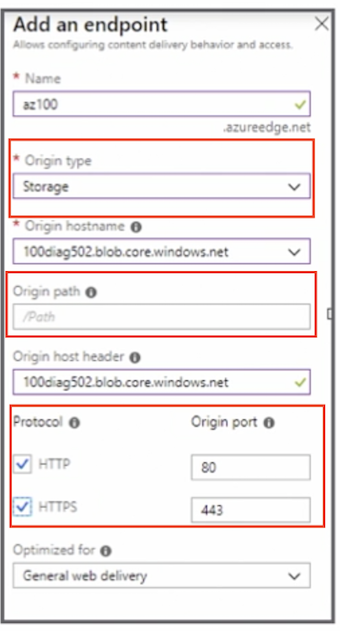

### **2-9 Registration Propagation Times** 

* Microsoft: 10 minutes 
* Standard from Akamai: 1 minute 
* Standard and Premium from Verizon: 90 minutes 

### **2-10 Key Points** 

* Know when you would need to use Import/Export service 
* Practice creating import and export jobs 
* Review the specifications of the Azure Data Box service 

## **3 Configure Azure files**


**How to configure Azure files and the Azure File Sync service.**

### **3-1 create the Azure file share**

* With Portal

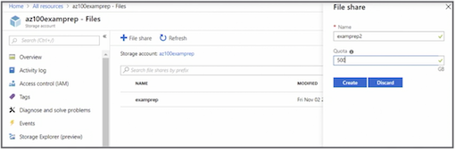

* With PowerShell

```
#Create a context (storage account name and account key) 
$storageContext New-AzureStorageContext storage-account-name> storage-account-key> 

#Create a file share 
New-AzureStorageShare logs -Context $storageContext 
```

### **3-2 Azure File Sync Service** 

* <span style=color:red>**Azure becomes the repository for shared files**</span> 
* Files can be accessed from **on-premises systems, cloud app, or systems** 
* **Supports cloud tiering** 

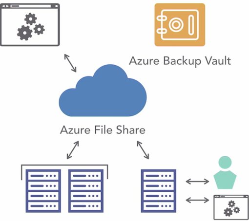


### **3-3 Steps to Create the Azure File Sync Service** 

1. Install the agent on **Windows Server 2012 R2 or Windows Server 2016** 
2. Register the server 
3. Deploy **Storage Sync in Azure** 


### **3-4 What Azure File Sync Supports** 

* Windows Server 2012 R2 or Windows Server 2016 
* New Technology File System (NTFS) volumes/compression 
* **BitLocker, Azure Information Protection (AIR), Azure Rights Management (RMS), Active Directory Rights Management Service (AD RMS)**
* **Distributed File System (DFS) with agent 1.2** 


### **3-5 What Azure File Sync Doesn't Support** 

* File systems other than Windows Server 2012 R2 or Windows Server 2016
* Sysprepped systems 
* **NTFS Encrypted File System (EFS)** 

### **3-6 Create Azure Sync Group**

* **Define the topology**


* Provide the **group name, your subscription, select the storage account and the file share**
* Add in two endpoints, 
	* The first endpoint being the **cloud endpoint, and this endpoint will point to the Azure file share**. 
	* **The second endpoint is the server endpoint**, and this will be the **path on that registered server**

	
### **3-7 Endpoints** 

* A cloud endpoint: **points to the Azure file share** 
* A server endpoint: **the path on the registered server** 


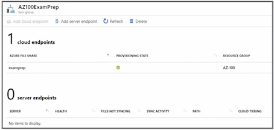

#### **Troubleshoot Azure File Sync**

* **Never remove the endpoint as the first step** 
* Ensure the agent is being installed with elevated privilege
* Move the primary domain controller (PDC) role to Windows Server 2012 R2 or late
* **Be sure to unregister servers that are no longer used** 


### **3-8 Key Points** 

* Know the troubleshooting steps to resolve a file sync issue 
* Understand what Azure File Sync doesn't support 
* Practice installing Azure File Sync, which includes several steps 
and takes time 
* Know all the steps to configure Azure File Sync 

## **4 Implement Azure backup**

### **4-1 Azure Backup (MARS) Agent** 

* **Protects** 

Files, folders, and System State Windows physical or VM servers and desktops

* **Backups are kept** 

Azure Recovery Services vault 

* **Key points** 

**<span style="color:red">No Linux support; not application aware<span>**

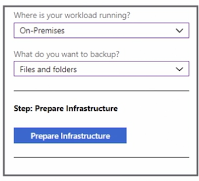

### **4-2 System Center DPM** 

* **Protects** 

Files, folders, volumes, virtual machines, **applications, workloads, application-aware snapshots (VSS), and System State** 

* **Backups are kept** 

Azure Recovery Services <span style="color:red">**vault, locally, or tape** <span>

* **Key points** 

<span style="color:blue">**Requires System Center license**</span>


### **4-3 Azure Backup Server** 

* **Protects** 

Files, folders, volumes, virtual machines, **application workloads, application-aware snapshots (VSS), and System State** 

* **Backups are kept** 

Azure Recovery Services vault or locally <span style="color:red">(no tape)</span>

* **Key points** 

**<span style="color:blue">Does not require a System Center license; does not support tape</span>**

### **4-4 Azure Virtual Machine Backup** 

* **Protects** 

Azure virtual machines (Windows and Linux), application-aware snapshots (VSS) 

* **Backups are kept** 

**<span style="color:red">Azure Recovery Services vault<span>**

* **Key points**

<span style="color:blue">**Does not require an agent; only back up once a day**</span>


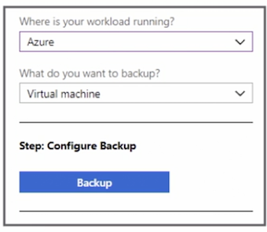


### **4-5 Perform and Review Backup operation**

* **Options will be dependent on the type of backup initiated** 
* Example of a virtual machine backup 

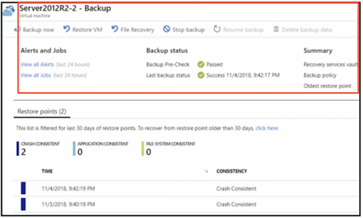

### **4-6 Create and Configure Backup Policy**

**Three policy types:** 

* Azure virtual machine, 
* Azure file share, 
* SQL Server in Azure virtual machines 

**Policy name, backup schedule**

**Set the retention range**


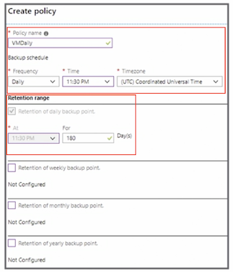

### **4-7 Configrue and Review Backup Reports**

* **Link to Diagnostics settings** 
* Archive to a storage account 
* **Select logs and retention in days** 
* Can be viewed with Power BI 
* Wait for 24 hours for the data to be available 


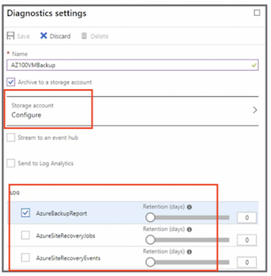


### **4-8 Perform a Restore Operation** 

* Restore procedure will be dependent on the **type of backup** 
* For example 
	* 	**Azure virtual machine backup files and the virtual machine can be restored** 

### **4-9 Additional Notes** 

* In preview, back up Azure file shares 
* In preview, **SQL Server in Azure virtual machines** 


### **4-10 Key Points** 

* Review the different backup options 
* What backup option would be the best given a specific scenario 
* Know how to create a Recovery Services vault 
* Review replication options when configuring the Recovery Services vault 