# **L3 Deploy and Manage Virtual Machines (VMs)**

## **1 Create and configure a VM for Windows and Linux**

### **1-1 Availability Sets**

* **<mark>AS is Microsoft best practice</mark>** 
* Meets SLA 
* **<mark>Virtual machine is distributed across fault and update domains</mark>**
* **Ensure one instance is always available during maintenance** 


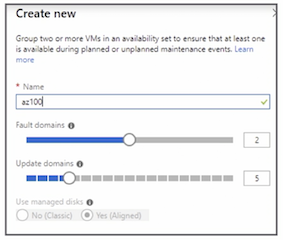

### **1-2 Availability Zones** 

* Spread the virtual machine across the separate zones within a region 
* Protects from datacenter failure 
* **<mark>Maximum of three zones per region</mark>** 
* **Not available in all regions** 

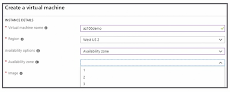

### **1-3 Virtual Machine Storage**  

* **Virtual machine has a minimum of two disks** 
	* **OS: registered as an SATA disk; C drive (C:);** 
		* max capacity is 2,048 GB 
	* **Temp: page or swap files; D drive (D:);** 
		* <span style="color:red">stores the pagefile.sys;</span> 
		* data may be lost; 
		* <span style="color:red">do not store files on this disk</span> 

* **Data disks** 

	* Registered as an SCSI disk; 
	* **max capacity is 4,095 GB to a max of 32,767 GB, depending on the virtual machine** 


### **1-4 Types of Disks** 

* **Standard HDD** 
	* Cost-effective disks 
* **Standard SSD** 
	* **Recommended for most workloads** 
	* **Workloads not requiring high IOPS** 
* Premium SSD 
	* **Use when running an S series virtual machine** 


### **1-5 Managed vs. Unmanaged Disks** 

* **Unmanaged**
	* The storage account needs to be managed 
	* **Max IOPS is 20,000 across the storage account** 
	* **Use TRIM on standard HDD to delete unused blocks to reduce spend** 

* **Managed** 
	* **The storage account is automatically managed** 
	* Microsoft recommends using managed disks 


### **1-6 Configure Inbound Port Rules**

* **By default, no traffic can access the virtual machine** 
* <span style="color:blue">**Must select public inbound ports**</span>

 


### **1-7 Configure Networking**

* Every virtual machine **must be associated to a VNet** 
* **Default subnet is automatically assigned** 
* Control access via **network security group (NSG)** **using access control lists (ACLs)** 
* Open inbound ports: **default — all inbound Internet traffic is blocked** 

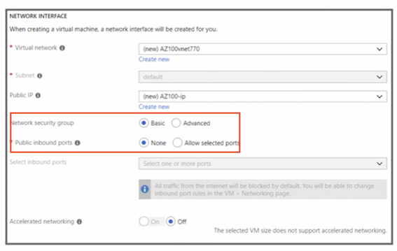


### **1-8 Configure Monitoring**

* **Enable boot diagnostics** 
* Enable OS guest diagnostics 
* A diagnostic storage account is required  

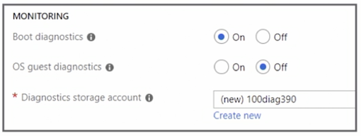

### **1-9 Configure Virtual Machine** 

* General purpose
* Compute optimized 
* Memory optimized 
* Storage optimized 
* GPU 
* **High-performance compute** 

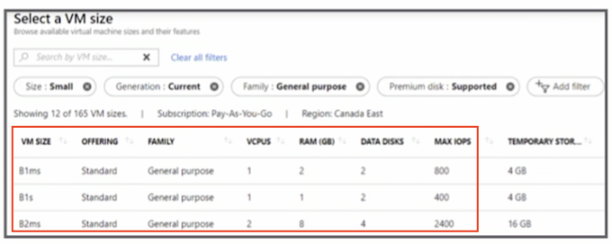

### **1-10 Scale Sets**

* **Multiple, identical, load-balanced virtual machines**
* Manage all the instances as one 
* Instances increase or decrease based on workload or schedule 

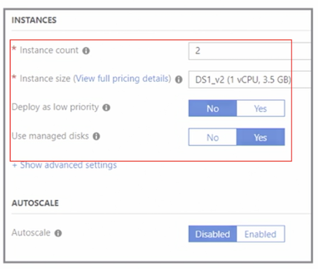

### **1-11 PowerShell** 

```
New-AzureRmVm 
	-ResourceGroupName "YourResourceGroup" 
	-Name "YourVM" 
	-Location "East US" 
	-VirtualNetworkName "YourVnet" 
	-SubnetName "YourSubnet" 
	-SecurityGroupName "YourNetworkSecurityGroup" 
	-PublicIpAddressName "YourPublicIpAddress" 
	-OpenPorts 80,3389 
```


### **1-12 Key Points** 

* Know how to create a virtual machine 
* Understand the virtual machine storage and disk options 
* Know and recommend the best virtual machine size based on the performance requirement 
* Know when and why to use scale sets 


## **2 Automate deployment of VMs**

### **2-1 Create a VM Template from Deployment**

* **Build the virtual machine**
* Review and create the tab
* Download a template for automation 

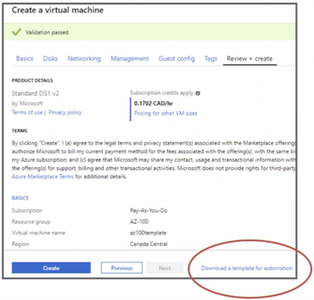

### **2-2 Create a VM Template**

* github
* Azure Template

### **2-3 Create a Template from scratch**

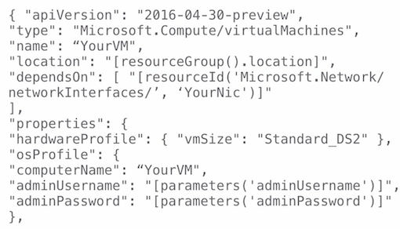

### **2-4 Basic Json Template**

```
{ 
	"$schema": "http://schema.management.azure.com/schemas/2015-01-01/deploymentTemplate.json#", 
	"contentVersion": "",
	"parameters": { }, 
	"variables": { }, 
	"functions": [ ], 
	"resources": [ ], 
	"outputs": { } 
}
```

* schema, contentVersion, parameters, variables, functions, resources, outputs

### **2-5 Configure VHD Template Windows** 

```
"imageReference": { 
	"publisher": "MicrosoftWindowsServer", 
	"offer": "WindowsServer", 
	"sku": "2016-Datacenter", 
	"version": "latest" 
}, 
```

### **2-6 Save Deployment as an ARM Template**

* Save when creating the resource 
* **Save after deployment** 
* Download, add to the library, or deploy 


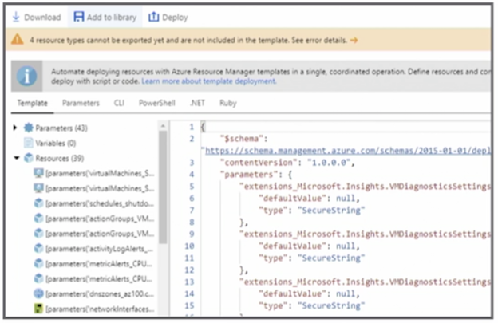


### **2-7 Modify Azure Resource Manager Template** 

* Download and modify a template from 
	* **The resource** 
	* **During creation** 

* Modify **quickstart templates** 
* Modify an existing template 

### **2-8 Deploy from the Template** 

* The portal 
* Template deployment tool 
* Visual Studio Code 
* Visual Studio 
* PowerShell 


### **2-9 Deploy Virtual Machines from a Template** 

1. Create the **resource group** 
2. Create a `template.json` file
3. Create a `parameters.json` file 
4. <mark>Create a **storage account and container**</mark> 
5. <mark>**Upload the files to the storage account**</mark>
6. Deploy the template 


### **2-10 Deploy the Template**

```
$templatePath = "https://" + $storageName + ".blob.core.windows.net/templates/Template.json" 

$parametersPath = "https://" + $storageName + ".blob.core.windows.net/templates/Parameters.json" 

New-AzureRmResourceGroupDeployment -ResourceGroupName "myResourceGroup" -Name "myDeployment" -TemplateUri $templatePath -TemplateParameterUri $parametersPath 
```

* `-ResourceGroupName`
* `-Name`
* `-TemplateUri`
* `-TemplateParameterUri`

### **2-11 Key Points** 

* Be familiar with the basic template structure 
* Know where templates can be acquired
* Know the steps to deploy a template using different methods 


## **3 Manage an Azure VM**

### **3-1 Attach a Data Disk**

* Microsoft recommends **adding disks to virtual machines** 
* **Number of disks that can be added is dependent on the virtual machine size** 
* Initialize the disk in the virtual machine
* **Use TRIM if using FIDD disks** 

> TRIM will delete the empty disk

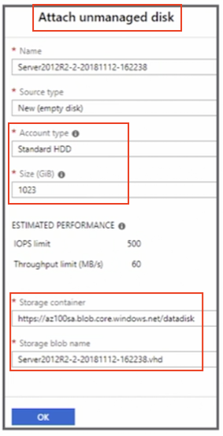

### **3-2 Attach a Data Disk Using PowerShell** 

```
$rg = 'yourResourceGroup' 
$vm = 'yourVM' 

$location = 'East US' 
$storageType = 'Premium LRS' 
$dataDisk = $vm + '_disk' 

$diskConfig = New-AzureRmDiskConfig -SkuName $storageType -Location $location -CreateOption Empty -DiskSizeGB 128 

$dataDisk1 = New-AzureRmDisk -DiskName $dataDisk -Disk $diskConfig -ResourceGroupName $rg 

$vm = Get-AzureRmVM -Name $vmName -ResourceGroupName $rg 
$vm = Add-AzureRmVMDataDisk -VM $vm -Name SdataDisk -CreateOption Attach -ManagedDiskId $dataDiskl.Id -Lun 1 

Update-AzureRmVM -VM $vm -ResourceGroupName $rg 
```

### **3-3 Add Network Interface**

* A virtual machine must have one **network interface card (NIC)** 
* **`Multiple NICs`** are available **depending on the virtual machine** 
* **The NIC must be in the same location** and **subscription as the virtual machine** 

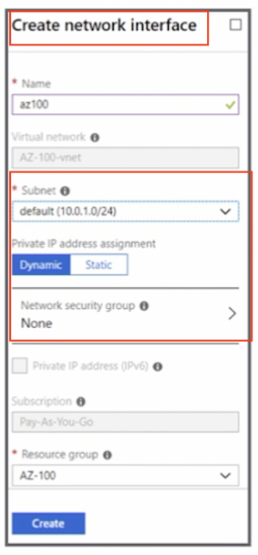

### **3-4 PowerShell Desired State Configuration**

* Ensures the virtual machine **always has the desired configuration** 
* **Provides management of the virtual machine** 
* No snowflakes (They dont become special)
* **Doesn't not require an agent**


```
configuration IISInstall 
{ 
	node "localhost" 
	{ 
		WindowsFeature IIS { 
			Ensure = "Present" 
			Name = "Web-Server" 
		} 
  } 
} 
```
> Exam: You should be familiar with the basic configuration of desired state configuration


### **3-5 Use Custom Script Extensions**

* **Postdeployment and management tasks** 
* ARM templates 
* CLI 
* PowerShell 

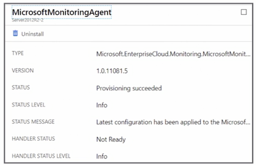

### **3-6 Change a Virtual Machine Size**

* The virtual machine may have to be deallocated 
* Select an S version for Premium Storage if already using Premium Storage 
	* For example, DS2 v2 


### **3-8 Moving Resources** 

* **Resources are locked during the move** 
	* Cannot add, update, or delete the resource while the resource is being moved 
	* Applications using the resource will still be available 

* **The location of the resource does not change** 

* **Not all resources can be moved** 

> Moving resources can be tested prior to actual move to determine if the resource can be moved

### **3-9 Subscription Requirements** 

* Different subscriptions 
	* **Must exist in the same Azure Active Directory tenant** 

* Resource provider must be <span style="color:blue">registered for the destination subscription</span> 
	* <span style="color:red">**`Microsoft.Compute` must be registered for a virtual machine** </span>


> If we were moving a virtual machine, the `Microsoft.Compute` must be registered in the destination subscription for that virtual machine


### **3-10 Permissions Required** 

* Source resource group Microsoft. 

Resources/subscriptions/resourceGroups/**`moveResources/action`**

* Destination resource group 

Microsoft.Resources/subscriptions/resourceGroups/`write` 


### **3-11 Redeploy Virtual Machines** 

* Unable to connect to the virtual machine 
* Virtual machine is shut down and is moved to a new node and restarted 
* **Dynamic IP will be updated **
* Portal or PowerShell 
* `Set-AzureRmVM -Redeploy -ResourceGroupName "ResourceGroup" -Name "VM"`

### **3-12 Key Points** 

* Understand the implications of moving resources 
* Know the requirements to move resources 
* Know why a virtual machine would need to be redeployed 
* Know why and how to attach a data disk 


## **4 Manage VM backups**

### **4-11 Configure the Virtual Machine Backup**

* **Backup can be configured from the virtual machine blade** 
* Bulk configuration can be configured from **the Recovery Services vault** 
* **Can be configured when creating the virtual machine** 

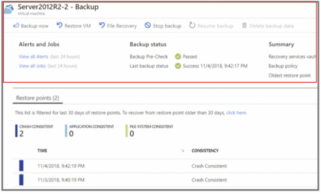

### **4-12 Create a Backup policy**

* Azure virtual machine can **<span style="color:red">only be backed up once a day</span>** 
* Frequency is **either weekly or daily** 
* Configure **additional retention points** (For weekly, monthly or yearly backup)


> There are 2 options for restoring a VMs, create a **new VM** or **replace existing virtual Machine**

### **4-13 Restore to a New Virtual Machine**

* **<span style="color:blue">Restored virtual machine will not overwrite the existing virtual machine</span>** 
* Additional customizations will require **PowerShell** 

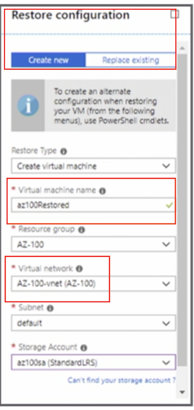

### **4-14 Restoire Disks**

> In addition to restoring the entire VM, there is also option to restore the disks only

* **Restore special network customizations** 
* New disks will be created in the selected storage account 
* Additional customizations will require **PowerShell** 

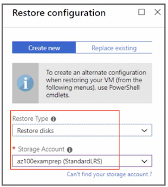

### **4-15 Replace Existing Virtual Machine**

> You really can't replace the existing virtual machine, 

* **Only option is Replace Disk(s)** 
* **Replaces the disks in the existing virtual machine** 
* The virtual machine must still exist 

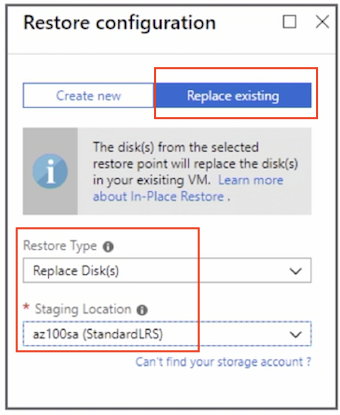

### **4-16 Restore Files from Azure Virtual Machine Backup**

* Download a script and password onto the system where the files are to be restored to a local machine or Azure virtual machine 
* The script mounts the disk 
* Copy the files that need to be restored to the local system 
* **Unmount the disks; automatically unmount after 12 hours** 


### **4-17 Key Points** 

* Know how to create a backup policy 
* Understand the limitations of the backup policy 
* Know when to restore a full virtual machine vs. disks only 
* Practice restoring virtual machines and files 

