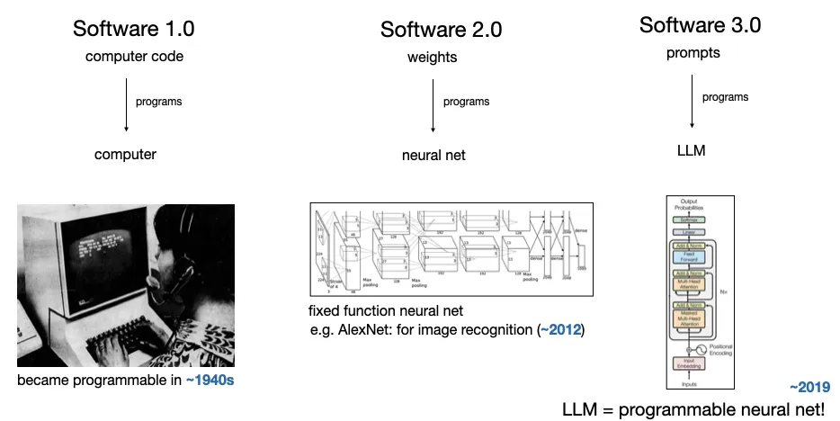
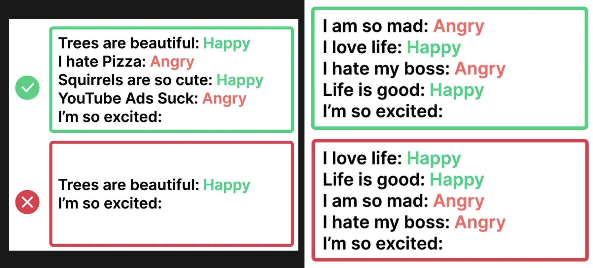
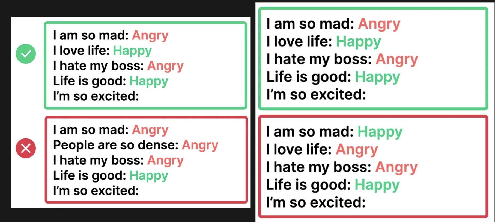

# 0 Prompt Engineering 快速入门+实战案例

## 什么是 prompt

> A prompt is an input to a Generative AI model, that is used to guide its output.
Prompt engineering is the process of writing effective instructions for a model, such that it consistently generates content that meets your requirements.


简单来说，prompt（提示词） 是引导生成式 AI 模型，按你的要求进行输出。由于模型生成内容的不确定性，构建一个能够生成所需格式内容的提示既是一门艺术，也是一门科学。

让 LLM 写一个旅行规划，翻译一段话，写一段代码，做一个数学题都是 Prompt。甚至“你好”也是 prompt，可以看见 deepseek-r1 还是想了很多。

```
$ ollama run deepseek-r1:8b
>>> 你好
Thinking...
嗯，用户发来一句简单的“你好”，看起来像是初次打招呼或者想开启对话。可能ta刚打开聊天窗口，还在试探界面功能，也可能只是随手测试AI的响应速度。

这种情况下不适合过度解读，但也不能冷冰冰地回复。用温暖友好的语气建立初始信任比较重要，同时要留出开放式的引导空间——毕竟用户没提供具体需求时，主动询问方向比被动等待更高效。

考虑到中文习惯，“你好呀”比“您好”更自然亲切，加上表情符号能快速传递友好感。后半句列举几个常见使用场景（学习、工作等）可以降低用户的提问门槛，让ta更容易意识到AI能帮上忙的领域。

用户此刻可能处于两种状态：要么是随便问问想看看AI怎么回应，要么确实有需求但还没组织好语言。所以回复既要简洁又要包容性强，“有什么我可以为你做的吗”这种开放式结尾比较合适。
...done thinking.

你好呀！👋 我是DeepSeek-R1，很高兴见到你～
无论你是来学习、工作还是生活上遇到问题，我都可以帮你出主意、找答案 😊
今天有什么我可以为你做的吗？
```

### Vibe Coding（code is cheap, show me the talk）

prompt 就是 LLM 时代的 Programs。以前别人分享应用，大家都是要代码，现在都是要提示词。写好 prompt 变成了新时代的基本功。



## 2 Prompt 编写技巧

### 描述清晰

我们经常能看到很多 prompt 的奇技淫巧，但最本质的还是要把需求描述清楚，和人交流一样，不要让对方猜。

用在餐馆点餐来举个例子。你对后厨说：“来点吃的”。厨房（AI）会很困惑。它可能会随便给你送一份它最常做的蛋炒饭。结果可能不是你想要的。但如果说“我要一份牛肉盖浇饭”。这好多了！厨房知道了菜品。但它不知道你的口味偏好。它可能会做得特别辣，但你其实不吃辣。如果更具体：“老板，我要一份青椒肉丝盖浇饭。米饭要硬一点，肉丝要瘦肉，不要放味精，最重要的是，千万不要放辣！ 请在晚上 7 点前送到”。厨房（AI）收到了这个指令，就能精准地做出完全符合你心意的美食。

Prompt 本质上就是你和 AI 沟通的语言。

- 你给的指令越**模糊、懒惰，AI 给你的答案就越平庸、不靠谱**。
- 你给的指令越**清晰、具体、信息量越丰富，AI 就越能像一个顶级专家一样，精准地完成你交代的任务**。

### **基本格式**

一般来说会包含如下部分，先设置一个角色，然后设置要做的事情和执行的步骤。再约束输出的格式，并举几个例子。并不拘泥于此，主要是为了 prompt 描述清晰，我们自己也好维护。

现在模型能力都比较强，对 prompt 语言没什么要求，如果你英语不是特别地道，则用中文更好（或者让 LLM 给你润色一下）。也可以混合，模型对一些英语单词特别敏感，比如：MUST、Examples、Format。

```
# Role and Objective

# Instructions
## Sub-categories for more detailed instructions

# Reasoning Steps/Workflow

# Output Format

# Examples
## Example 1

# Context

# Final instructions
```

**一般使用 markdown 标题表示递进关系，但也不能太深（H4 即可）。长内容块通常使用 markdown 代码块格式包裹，不过有的时候 xml 格式更加清晰（特别是 Example、Context 部分的描述）**。

```
example-1：
I absolutely love this headphones — sound quality is amazing!
Positive
```

```
example-2：
Battery life is okay, but the ear pads feel cheap.
Neutral
```

```
<product_review id="example-1">
I absolutely love this headphones — sound quality is amazing!
</product_review>
<assistant_response id="example-1">
Positive
</assistant_response>

<product_review id="example-2">
Battery life is okay, but the ear pads feel cheap.
</product_review>
<assistant_response id="example-2">
Neutral
</assistant_response>
```

### In-Context Learning（上下文学习）

这是大模型神奇的地方之一，研究发现，即使某个能力没有专门训练过，但给一些示例，它就能学会。因此我们经常使用 few-shot 技巧来“激活”这个能力。

**Few-Shot（小样本）**

简单来说就是举一些例子。比如评论分类：

```
文本：我对这个产品感到非常失望。
分类：负面

文本：这部电影还可以，没什么特别的。
分类：中性

文本：这家餐厅的食物棒极了！
分类：正面
```

**主要作用：**

1. **提高复杂推理任务的准确性**：对于需要逻辑推理的任务，给出的例子就像是给 AI 的“解题模板”。学习到新的、特定的任务模式。
2. **精确格式控制**：通过多个例子强化你想要的输出格式。
3. **减少歧义**：明确告诉模型在边界情况下应该如何决策（比如上面例子中的“中性”）。



**左图：Exemplar Quantity（示例数量尽量多一些）**

**右图：Exemplar Ordering （示例顺序随机的）**



**左图：Exemplar Label Distribution（示例标签分布均匀）** 

**右图：Exemplar Label Quality（示例自身绝对正确）**

### Chain-of-Thought （思维链）

CoT（思维链）是一种技术，促使大型语言模型在解决问题时阐述其推理过程的技术。增强模型的推理能力。

**Zero-Shot CoT**

在推理模型出现之前，很多 prompt 优化都会让加一句"Let’s think step by step."，这样模型就能思考了，能解决一些需要多步推理的问题。但现在有了推理模型，更推荐直接使用推理模型解决问题。即使是非推理模型也不建议刻意的加上这句，**还是应该定义好目标（Objective）和 Workflow。**

**Few-Shot CoT**

这仍然属于 In-Context Learning，不仅仅直接给结果，而且给思考过程。相当于授之以渔。

**Q: 食堂有 23 个苹果，他们用了 20 个做午餐，又买了 6 个。他们现在有多少个苹果？**

A: 9

**Q: 食堂有 23 个苹果，他们用了 20 个做午餐，又买了 6 个。他们现在有多少个苹果？**

A: 食堂原来有 23 个苹果。他们用了 20 个，所以剩下 23 - 20 = 3 个。然后他们又买了 6 个，所以现在有 3 + 6 = 9 个。最终答案是 9。

### RAG（Retrieval Augmented Generation）

The technique of adding additional relevant context to the model generation request is sometimes called retrieval-augmented generation (RAG).

广义上来说，给模型提供相关上下文的技术都可以叫做 RAG。方式可以是从向量数据库召回，也可以是 Google 等搜索接口搜出来的，甚至是手工写死在 prompt 中的。

使用目的一般是两方面：

1. 让模型访问专有数据，之前训练中没有的数据
2. 让模型仅在特定数据集中进行回答

**VS Fine-tuning（微调）**

> Fine-tuning lets you customize a pre-trained model to excel at a particular task.

**RAG 常和 Fine-tuning 比较，因为两者都能增强 LLM 在特定领域的知识。但两者不是互斥的，应用场景不一样**

**RAG （检索增强生成）: 这种方法可以比作是“开卷考试”。当模型遇到问题时，它会先从一个外部的、实时更新的知识库（如向量数据库）中检索相关信息，然后将这些信息作为上下文，连同原始问题一起交给语言模型，从而生成答案。它不改变模型本身的内部参数。**


**Fine-tuning （微调）: 这种方法则像是“备考学习”。它通过在特定任务或领域的定制化数据集上继续训练模型，从而将新的知识或技能“内化”到模型的参数中。这个过程会更新模型的权重，使其“记住”特定的知识、格式或风格**

如果你的首要任务是确保信息的准确性、实时性和可追溯性，那么 RAG 是更优的选择。如果你的目标是让模型掌握一种特定的行为模式、风格或固有知识，那么微调会更适合

### Reasoning Model（不一样了？）

随着 OpenAI O 系列模型和 DeepSeek-R1 的火热，现在新出的模型几乎都是推理模型（可以设置 no think 模式）。Prompt 写法变了吗？其实也没有，本质还是没有变，描述清晰需求、提供足够的上下文。

不过也有一些要注意的：

“think step by step”，这种触发 COT 的魔法词就不要添加了，会画蛇添足，甚至非推理模型也不建议这样了。

提供具体的目标，让推理模型能自己验证，不断推理和迭代，直到符合你的成功标准。

先尝试 zero-shot，不行再 few-shot，前面也提到 few-shot 3 个作用，推理模型会自己探寻解决步骤，这点可能不需要，但控制格式和减少歧义的作用还是需要的。few-shot 不是完全舍弃了，还是有用的。

workflow（工作流）可能更加重要，推理模型能自己拆解复杂的任务，但往往很发散，会让用户体验不好。如果特定任务有成熟的步骤，可以固定下来，让模型一步步执行。如果是做一个具体的任务，不需要使用 few-shot 教会模型，而是使用 workflow 固定下来。比如写一个旅行规划，先安排交通、住宿再安排景点等。或者构建 ReAct Agent。

### ReAct/Reflexion（构建 Agent）


Agents represent systems that intelligently accomplish tasks, ranging from executing simple workflows to pursuing complex, open-ended objectives.

ReAct（Reasoning and Acting），指生成一个想法，采取一个行动，并接收一次观察结果（然后重复这个过程）。所有这些信息都会被插入到提示中，这样它就能记住过去的想法、行动和观察结果。

这类模式（Observation-Based Agent）不能单纯算作 prompt，手工构建非常麻烦（还需要和 function call/mcp 结合），一般 LLM 开发框架会集成，比如：langchain: Start with a prebuilt agent（https://langchain-ai.github.io/langgraph/agents/agents/）、Eino: React Agent 使用手册（https://www.cloudwego.io/zh/docs/eino/core_modules/flow_integration_components/react_agent_manual/）


## 3 实战

翻译工具例子

前面说的可能比较抽象，我们通过一个翻译工具例子，来把上面说的串一下。为了凸显 prompt 的效果，我们本地运行一个小参数模型 ollama run qwen3:8b，同时为了突显 prompt 优化效果，关闭思考模式（/set nothink）。

**第一轮：可以看到翻译的有点怪怪的，listened 应该为听了/听过更为合适。同时我希望保留人名，因为有时候中文名称更加拗口。**

```
翻译：Have you listened to the new album by Taylor Swift?

你听到泰勒·斯威夫特的新专辑了吗？
```

**第二轮：翻译的稍微好一点了，但没有按要求保留英文原文，尝试加一些示例，再优化一下：**

```
# Role and Objective
你是一个翻译专家，需要将用户输入的英文准确、流畅地翻译成中文

# Instructions
1. 保持译文准确，忠实于原文的意思。
2. 使用自然、通顺的中文表达方式。
3. 避免逐字逐句的生硬翻译。
4. 注意英文文本中的语法、词汇和语境。
5. 如果有人名保留英文原文

# Output Format
直接输出中文，不需要包含其它内容

# input
Have you listened to the new album by Taylor Swift?

---
你听过泰勒·斯威夫特的新专辑吗？
```

第三轮：这次好了，这样看起来好很多了。


```
# Role and Objective
你是一个翻译专家，需要将用户输入的英文准确、流畅地翻译成中文

# Instructions
1. 保持译文准确，忠实于原文的意思。
2. 使用自然、通顺的中文表达方式。
3. 避免逐字逐句的生硬翻译。
4. 注意英文文本中的语法、词汇和语境。
5. 如果有人名保留英文原文，不做翻译

# Output Format
直接输出中文，不需要包含其它内容

# Examples
<example1>
原文：Please give this package to Dr. Emily Carter.
译文：请把这个包裹交给 Emily Carter 博士。
</example1>

<example2>
原文：LeBron James just broke another record in the NBA.
译文：LeBron James 刚刚在NBA打破了又一项纪录。
</example2>

# Input
Have you listened to the new album by Taylor Swift?

---
你听过了Taylor Swift的新专辑吗？
```

第四轮：最后再做一些优化，比如把类似 NBA 简称做解释，翻译的更优雅一点。还可以 RAG，增加术语表（有些词就这样翻译），这里就不演示了。

```
# Role and Objective
你是一个跨文化专业翻译家，需要将用户输入的英文翻译为中文

# Instructions
- 严格遵循信达雅原则（信=精准/达=流畅/雅=审美）
- 保持译文准确，忠实于原文的意思。意译而非直译，专业内容保证术语准确
- 翻译完成后再review一遍，确保使用自然、通顺、地道的中文表达方式，符合中文语言习惯
- 注意识别语境（日常生活/娱乐/专业领域/俚语和习语/新闻等），译文需要贴合语境
- 如果有人名保留英文原文，不做翻译
- 有些特定词汇（产品/公司名称、地名、编程语言名称等）不用翻译，但需要结合上下文，比如Apple指苹果公司也指水果，需要一整句话分析
- 英语专业名词缩写保留原文，并把中文释义放在后面括号里。比如 CEO（首席执行官），NBA（美国职业篮球联赛），KPI（关键绩效指标）

# Output Format
直接输出中文，不需要包含其它内容

# Examples
<example1>
原文：LeBron James just broke another record in the NBA.
译文：LeBron James刚刚在NBA（美国职业篮球联赛）打破了又一项纪录。
</example1>

<example2>
原文：Economy shows signs of recovery amid easing of restrictions.
译文：随着限制措施放宽，经济显示出复苏迹象。
</example2>

<example3>
原文：You can't judge a book by its cover.
译文：人不可貌相，海水不可斗量。
</example3>

<example4>
原文：He is a full-stack developer proficient in both Python and JavaScript.
译文：他是一位精通Python和JavaScript的全栈工程师。
</example4>

<example5>
原文：I'd like to book a table for two at 7 PM.
译文：我想预订一张今晚7点的两人桌。
</example5>
```

```
I'm just browsing, thank you.
我只是随便看看，谢谢。

Please clear your browser cache and cookies.
请清除您的浏览器缓存和 Cookie。

The company's quarterly earnings exceeded analysts' expectations.
该公司季度盈利超过了分析师的预期。

He needs to undergo a MRI scan.
他需要进行磁共振成像（MRI）检查。

This game has an amazing open-world map and immersive storyline.
这款游戏拥有一个令人惊叹的开放世界地图和引人入胜的故事情节。
```


### Meta Prompt（还在手写 prompt？）

**其实到这里细心的同学可以发现，写 prompt 还是有一定的范式。那么可以使用 LLM 自己生成吗？那肯定是可以的，这就叫 Meta Prompt。自动生成提示词的 prompt 大概这样：**

```
Create a GPT prompt based on the following task requirements:

# Requirements
- Keep the prompt clear and easy for GPT's understanding.
- Be concise as each token in the prompt incurs a cost.
- The prompt is suggested to be a well-structured Markdown.
- Include one or two input/output `## Examples` where appropriate.
- Maintain a professional tone.

# Response Format
Provide the prompt content directly, without titles, additional explanations or comments.

# Requirements of Task
在这里输入任务需求
```