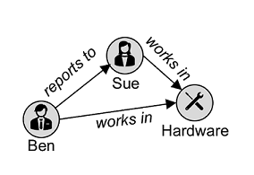
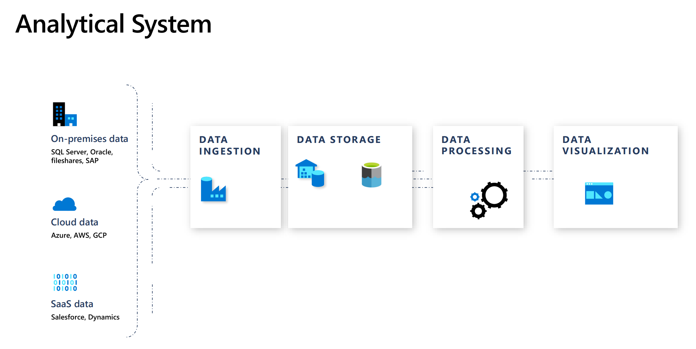

**d	Microsoft Azure Virtual Training Day:  Data Fundamentals**

## **Module 1 Explore core data**

### **Lesson 1: Explore core data concepts**

**What is data?**

Collection of facts, numbers, descriptions, objects,stored in a **structured, semi一structured, unstructured way**.

* **Structured data**

Structured data is data that adheres to a fixed schema, so all of the data has the same fields or properties. Most commonly, **the schema for structured data entities is tabular - in other words**, the data is represented in one or more tables that consist of rows to represent each instance of a data entity, and columns to represent attributes of the entity.

Structured data is often stored in a database in which multiple tables can reference one another by using key values in a relational model

* **Semi-structured data**

Semi-structured data is information that has some structure, but which allows for some variation between entity instances.

For example, while most customers may have an email address, some might have multiple email addresses, and some might have none at all.

```
// Customer 1
{
  "firstName": "Joe",
  "lastName": "Jones",
  "address":
  {
    "streetAddress": "1 Main St.",
    "city": "New York",
    "state": "NY",
    "postalCode": "10099"
  },
  "contact":
  [
    {
      "type": "home",
      "number": "555 123-1234"
    },
    {
      "type": "email",
      "address": "joe@litware.com"
    }
  ]
}
```

* **Unstructured data**

Not all data is structured or even semi-structured. For example, documents, images, audio and video data, and binary files might not have a specific structure. **This kind of data is referred to as unstructured data.**

There are two broad categories of data store in common use:

* File stores
* Databases

### **Explore file storage**

In most organizations, important data files are stored centrally in some kind of shared file storage system.

The specific file format used to store data depends on a number of factors, including:

* The type of data being stored (structured, semi-structured, or unstructured).
* The applications and services that will need to read, write, and process the data.
* The need for the data files to be readable by humans, or optimized for efficient storage and processing.

**Delimited text files**

* Data is often stored in plain text format with specific field delimiters and row terminators.
* The most common format for delimited data is comma-separated values (CSV) in which fields are separated by commas, and rows are terminated by a carriage return / new line
* **Other common formats include tab-separated values (TSV) and space-delimited (in which tabs or spaces are used to separate fields), and fixed-width data in which each field is allocated a fixed number of characters**.
* Delimited text is a good choice for structured data that needs to be accessed by a wide range of applications and services in a human-readable format.

```
FirstName,LastName,Email
Joe,Jones,joe@litware.com
Samir,Nadoy,samir@northwind.com
```

* **JavaScript Object Notation (JSON)**
* Extensible Markup Language (XML)
* Binary Large Object (BLOB)

Common types of data stored as binary include images, video, audio, and application-specific documents.

**Optimized file formats**

Some specialized file formats that **enable compression, indexing, and efficient storage and processing** have been developed.

Some common optimized file formats you might see include Avro, ORC, and Parquet:

* **Avro is a row-based format. It was created by Apache**.

  * **Each record contains a header that describes the structure of the data in the record**.
  * **This header is stored as JSON**.
  * The data is stored as binary information. An application uses the information in the header to parse the binary data and extract the fields it contains.
  * **Avro is a good format for compressing data and minimizing storage and network bandwidth requirements**.
* **ORC (Optimized Row Columnar format) organizes data into columns rather than rows**.

  * **It was developed by HortonWorks for optimizing read and write operations in Apache Hive** (Hive is a data warehouse system that supports fast data summarization and querying over large datasets).
  * **An ORC file contains stripes of data**.
  * Each stripe holds the data for a column or set of columns.
  * A stripe contains an index into the rows in the stripe, the data for each row, and a footer that holds statistical information (count, sum, max, min, and so on) for each column.
* Parquet is another columnar data format.

  * It was created by Cloudera and Twitter.
  * **A Parquet file contains `<mark>`row groups`</mark>`**.
  * **Data for each column is stored together in the same row group**.
  * Each row group contains one or more chunks of data.
  * **A Parquet file includes metadata that describes the set of rows found in each chunk**.
  * An application can use this metadata to quickly locate the correct chunk for a given set of rows, and retrieve the data in the specified columns for these rows.
  * Parquet **specializes in storing and processing nested data types efficiently**.
  * It supports very efficient compression and encoding schemes.

### **Explore databases**

* **Relational databases**

  * This use of keys to reference data entities enables a relational database to be normalized;
  * which in part means the elimination of duplicate data values so that, for example, the details of an individual customer are stored only once;
  * The tables are managed and queried using **Structured Query Language (SQL), which is based on an ANSII standard,** so it's similar across multiple database systems.
* **Non-relational databases**

  * There are four common types of Non-relational database commonly in use.
  * **Key-value databases** in which **each record consists of a unique key and an associated value**, which can be in any format.


* **Document databases**, which are a specific form of key-value database in which the value is a JSON document (which the system is optimized to parse and query)


* **Column family databases**, which store tabular data comprising rows and columns, but you can divide the columns into groups known as column-families. Each column family holds a set of columns that are logically related together.


* **Graph databases**, which store entities as nodes with links to define relationships between them.



### **Explore transactional data processing**

A transactional system records transactions that encapsulate specific events that the organization wants to track.

A transaction could be financial, such as the movement of money between accounts in a banking system, or it might be part of a retail system, tracking payments for goods and services from customers.

Transactional systems are often high-volume, sometimes handling many millions of transactions in a single day. The data being processed has to be accessible very quickly.

The work performed by transactional systems is often referred to as Online Transactional Processing (OLTP).

OLTP solutions rely on a database system in which data storage is optimized for both read and write operations in order to support transactional workloads in which data records are created, retrieved, updated, and deleted (often referred to as CRUD operations).

These operations are applied transactionally, in a way that ensures the integrity of the data stored in the database. To accomplish this, OLTP systems enforce transactions that support so-called ACID semantics:

**Atomicity  /  Consistency  / Isolation / Durability**

```
BEGIN TRANSACTION
UPDATE Account
SET Balance = Balance - 500
WHERE CustomerID=6023;
UPDATE Account
SET Balance = Balance +500
WHERE CustomerID=5558;
INSERT INTO Transfers (Fromaccount, ToAccount, TransactionAmount, TransactionDescription)
VALUES (6023,5558,500, Transfer 500 from account 6023 to account 5558)
COMMIT TRANSACTION
```

### **Explore analytical data processing**

Analytical data processing typically uses read-only (or read-mostly) systems that store vast volumes of historical data or business metrics.

**Analytics can be based on a snapshot of the data at a given point in time, or a series of snapshots**.


* Data files may be stored in a central data lake for analysis.
* An extract, transform, and load (ETL) process copies data from files and OLTP databases into a data warehouse that is optimized for read activity.
  * Commonly, **a data warehouse schema is based on fact tables that contain numeric values you want to analyze (for example, sales amounts)**, with **related dimension tables that represent the entities** by which you want to measure them (for example, customer or product),
* Data in the data warehouse **may be aggregated and loaded into an online analytical processing (OLAP) model, or cube**.
  * Aggregated numeric values (measures) from fact tables are calculated for intersections of dimensions from dimension tables.
  * For example, sales revenue might be totaled by date, customer, and product.
* The data in the data lake, data warehouse, and analytical model can be queried to produce reports, visualizations, and dashboards.

1. 数据引入和处理 – 将一个或多个事务数据存储、文件、实时流或其他源中的数据加载到数据湖或关系数据仓库。
   * 加载操作通常涉及以下操作：**提取、转换和加载 (ETL)** 或**提取、加载和转换 (ELT) **过程，在其中将清除、筛选和重构数据以进行分析。
   * 在 ETL 过程中，在加载数据到分析存储区之前转换数据，而在 ELT 过程中，将复制数据到存储区，然后再转换。 无论采用哪种方式，都将优化生成的数据结构以进行分析查询。
   * 数据处理通常由分布式系统执行，这些系统可以使用多节点群集并行处理大量数据。 数据引入包括静态数据的批处理和流式处理数据的实时处理。
2. 分析数据存储 – 用于大规模分析的数据存储包括关系“数据仓库”、基于文件系统的“数据湖”，以及合并数据仓库和数据湖功能的混合体系结构（有时称为“数据湖仓库”或“湖数据库”）
3. **分析数据模型** – 虽然数据分析人员和数据科学家可以直接在分析数据存储中使用数据，但通常会创建一个或多个数据模型，以便对数据进行预先聚合，以便更容易地生成报表、仪表板和交互式可视化效果。 通常，这些数据模型被描述为“多维数据集”，其中，数字数据值在一个或多个维度上聚合（例如，按产品和区域确定销售总额）。 该模型封装了数据值与维度实体之间的关系，以支持“向上/向下钻取”分析。
4. 数据可视化 – 数据分析师使用分析模型中的数据，直接从分析存储中创建报表、仪表板和其他可视化对象。 此外，组织中的用户（可能不是技术专业人员）可能会执行自助服务数据分析和报告。 数据的可视化效果可为企业或其他组织显示趋势、比较和关键绩效指标 (kpi)，并可采用打印报表、文档中的图形和图表、PowerPoint 的演示文稿、基于 web 的仪表板和交互式环境的形式，从而用户可在其中直观地浏览数据。

* **Data lakes** are common in large-scale data analytical processing scenarios, **where a large volume of file-based data must be collected and analyzed**.
* **Data warehouses** are an established way to store data in a **relational schema that is optimized for read operations** – primarily queries to support reporting and data visualization.

  * **The data warehouse schema may require some denormalization of data in an OLTP data source** (introducing some duplication to make queries perform faster).

> **What is a data warehouse?**
>
> A data warehouse is a relational database in which the schema is optimized for queries that read data.

An OLAP model is an aggregated type of data storage that is optimized for analytical workloads.

Data aggregations are across dimensions at different levels, enabling you to drill up/down to view aggregations at multiple hierarchical levels;

Different types of user might perform data analytical work at different stages of the overall architecture. For example:

* Data scientists might work directly with data files in a data lake to explore and model data.
* Data Analysts might query tables directly in the data warehouse to produce complex reports and visualizations.
* Business users might consume pre-aggregated data in an analytical model in the form of reports or dashboards.

### **Analytical System**



### **数据引入管道**


在 Azure 上，通过创建协调 ETL 进程的“管道”，可以最好地实施大规模数据引入。 可以使用 Azure 数据工厂创建和运行管道，如果要在统一工作区中管理数据仓库解决方案的所有组件，也可以在 Azure Synapse Analytics 中使用相同的管道引擎。'

在任一情况下，管道都由一个或多个操作数据的“活动”组成。

输入数据集提供源数据，而活动可定义为在生成输出数据集之前增量操作数据的数据流。 管道使用“链接服务”加载和处理数据 - 使你可以为工作流的每个步骤使用正确的技术。

例如，**可以使用 Azure Blob 存储链接服务来导入输入数据集，然后在 Azure Databricks 或 Azure HDInsight 上运行数据处理任务之前，使用 Azure SQL 数据库等服务运行查找相关数据值的存储过程，或使用 Azure 函数应用自定义逻辑**。 最后，可以将输出数据集保存在链接服务中，例如Azure Synapse Analytics。 管道还可以包括一些不需要链接服务的内置活动

## **数据存储**

**数据仓库**

### ***数据仓库***

是一个关系数据库，其中的数据存储在为数据分析（而非事务性工作负载）进行优化的架构中。

通常情况下，事务性存储中的数据在架构中不规范，其中的数值存储在中心的“fact”表中，这些表与一个或多个“dimension”表相关，表示可聚合数据的实体。

例如，“fact”表可能包含销售订单数据，可以按客户、产品、商店和时间维度进行聚合（使你能够轻松地找到每个商店每月的总销售收入）。

* 这类“fact”和“dimension”表架构称为“星型架构”；
* 虽然它通常通过添加与“dimension”表相关的其他表来扩展到“雪花型”架构，以表示维度层次结构（例如，product 可能与产品类别相关）。
* 如果拥有可以组织成表的结构化架构的事务性数据，且希望使用 SQL 来查询它们，则数据仓库是一种很好的选择。


### **Data Lake**

数据湖是一种文件存储，通常位于可用于高性能数据访问的分布式文件系统上。

Spark 或 Hadoop 等技术通常用于处理对存储文件的查询，并返回数据以进行报告和分析。

**这些系统通常会应用“读取模式”方法在读取数据进行分析时定义半结构化数据文件上的表格架构，而无需在存储时应用约束。**

**数据湖非常适合用于支持混合使用结构化、半结构化、甚至非结构化的数据，在将数据写入存储时无需强制执行架构即可进行分析**。

### **混合方法**

可以使用混合方法，将数据湖和数据仓库的功能组合到**“湖数据库”或“数据湖仓库”**中。

* 原始数据作为文件存储在数据湖中，关系存储层将基础文件抽象化并将其公开为表，这些表可以使用 SQL 进行查询。
* åAzure Synapse Analytics 中的 SQL 池包含“PolyBase”，这使你可以基于数据湖中的文件（和其他源）定义外部表，并使用 SQL 查询它们。
* Synapse Analytics 还支持一种“湖数据库”方法，在此方法中，可以使用数据库模板来定义数据仓库的关系架构，同时将基础数据存储在数据湖存储中 – 将存储和计算分别用于数据仓库解决方案。
* 数据湖仓库是基于 Spark 系统中的一种相对较新的方法，通过“增量湖”等技术启用；
* 这会将关系存储功能添加到 Spark，因此，可以定义表来强制执行架构和事务一致性，支持批处理加载和流式处理数据源，并提供 SQL API 进行查询。

### **用于分析存储的 Azure 服务**

**Azure Synapse Analytics 是统一的、端到端的大规模数据分析解决方案。**

它汇集了多项技术和功能，使你能够将可缩放的、**高性能基于 SQL Server 的关系数据仓库的数据完整性和可靠性与数据湖和开源 Apache Spark 的灵活性结合起来**。

它还包括使用 Azure Synapse 数据资源管理器池对日志和遥测分析的本机支持，以及用于数据引入和转换的内置数据管道。

所有 Azure Synapse Analytics 服务都可以通过名为 Azure Synapse Studio 的单个交互式用户界面来管理，其中包括创建交互式笔记本，可在其中合并 Spark 代码和 markdown 内容。 当想要在 Azure 上创建单个、统一的分析解决方案时，Synapse Analytics 是一个不错的选择。

**Azure Databricks** 是流行的 Databricks 平台的 Azure 实现。

**Databricks 是一种基于 Apache Spark 构建的综合性数据分析解决方案，提供了本机 SQL 功能，以及用于数据分析和数据科学的负载优化 Spark 群集**。

Databricks 提供了一个交互式用户界面，通过该界面可以管理系统，并且可以在交互式笔记本中查看数据。 由于在多个云平台上的常见用途，如果想要在平台上使用现有的专业知识，或者需要在多云环境中操作或支持云可移植解决方案，则可以考虑将 Azure Databricks 用作分析存储。

**Azure HDInsight** 是支持多种开源数据分析群集类型的 Azure 服务。

尽管不像 Azure Synapse Analytics 和 Azure Databricks 那样用户友好，但如果分析解决方案依赖于多个开源框架或需要将现有的基于 hadoop 的解决方案迁移到云，它可能是一个合适的选择。

### **Azure Synapse Analytics**

创建一个 Azure Synapse Analytics 工作区，并使用它来引入和分析一些数据

**预配 Azure Synapse Analytics 工作区**

* 要使用 Azure Synapse Analytics，必须在 Azure 订阅中预配一个 Azure Synapse Analytics 工作区资源。

Synapse Analytics 工作区需要在 Azure 订阅中有两个资源组；**一个用于显式创建的资源，另一个用于服务使用的受管理资源。 它还需要一个用于存储数据、脚本和其他项目的 Data Lake Storage 帐户**。

并注意它包含你的 Synapse Analytics 工作区和一个 Data Lake Storage 帐户

**1 引入数据**

**可以使用 Azure Synapse Analytics 执行的关键任务之一是定义管道，将数据从各种源传输到你的工作区（如有必要还会进行转换）以进行分析**。

**2 使用 SQL 池来分析数据**

你已将一些数据引入工作区，现在可以使用 Synapse Analytics 来查询和分析数据了。 查询数据的最常见方法之一是使用 SQL，在 Synapse Analytics 中，可以使用 SQL 池来运行 SQL 代码。

**3 使用 Spark 池来分析数据**

虽然 SQL 是用于查询结构化数据集的常见语言，但许多数据分析师发现，像 Python 这样的语言对研究和准备数据用于分析很有用。 在 Azure Synapse Analytics 中，可以在 Spark 池中运行 Python（及其其他）代码；它使用了基于 Apache Spark 的分布式数据处理引擎。

* 可使用哪些 Azure 服务创建用于**数据引入和处理的管道**？
  * **Azure Synapse Analytics 和 Azure 数据工厂**

> **Azure Synapse 和 Analytics 数据工厂都包含创建管道的功能**

* 若要实现从Azure Blob 存储读取数据的管道，必须定义哪些内容？

  * 需要为希望在管道中使用的外部服务创建链接服务。
* Azure Synapse Analytics 包含哪些开源分布式处理引擎

  * **Apache Spark**

## **Explore data roles and services**

The three key job roles that deal with data in most organizations are:

* **Database administrators** manage databases, assigning permissions to users, storing backup copies of data and restore data in the event of a failure.
* **Data engineers** manage

  * infrastructure and processes for data integration across the organization,
  * applying data cleaning routines,
  * identifying data governance rules, a
  * implementing pipelines to transfer and transform data between systems.
* **Data analysts** explore and analyze data to create visualizations and charts that enable organizations to make informed decisions.

### **Database Administrator**

* A database administrator is responsible for the **design, implementation, maintenance, and operational aspects of on-premises and cloud-based database systems**.
* They're responsible for the **overall availability and consistent performance** and optimizations of databases.
* They work with **stakeholders to implement policies**, tools, and processes for backup and recovery plans to recover following a natural disaster or human-made error.
* The database administrator is also **responsible for managing the security of the data in the database**, granting privileges over the data, granting or denying access to users as appropriate.

### **Data Engineer**

A data engineer collaborates with stakeholders to design and implement data-related workloads, including data ingestion pipelines, cleansing and transformation activities, and data stores for analytical workloads.

They use a wide range of data platform technologies, including relational and non-relational databases, file stores, and data streams.

### **Data Analyst**

A data analyst enables **businesses to maximize the value of their data assets**.

They're responsible for **exploring data to identify trends and relationships, designing and building analytical models, and enabling advanced analytics capabilities through reports and visualizations**.

A data analyst processes **raw data into relevant insights based on identified business requirements to deliver relevant insights**.

## **Identify data services**

### **Azure SQL**

Azure SQL is the collective name for a family of relational database solutions based on the Microsoft SQL Server database engine. Specific Azure SQL services include:

* **Azure SQL Database** – a fully managed platform-as-a-service (PaaS) database hosted in Azure
* **Azure SQL Managed Instance** – a hosted instance of SQL Server with automated maintenance, which allows more flexible configuration than Azure SQL DB but with more administrative responsibility for the owner.
* **Azure SQL VM** – a virtual machine with an installation of SQL Server, allowing maximum configurability with full management responsibility.

**Database administrators** typically provision and manage Azure SQL database systems to support **line of business (LOB) applications** that need to store transactional data.

**Data engineers** may use Azure SQL database systems as sources for data pipelines that perform **extract, transform, and load (ETL) operations to ingest the transactional data into an analytical system**.

**Data analysts** may query **Azure SQL databases directly to create reports**, though in large organizations the data is generally combined with data from other sources in an analytical data store to support enterprise analytics.

### **Azure Database for open-source relational databases**

Azure includes managed services for popular open-source relational database systems, including:

**Azure Database for MySQL** - a simple-to-use open-source database management system that is commonly used in Linux, Apache, MySQL, and PHP (LAMP) stack apps.

**Azure Database for MariaDB** - a newer database management system, created by the original developers of MySQL. The database engine has since been rewritten and optimized to improve performance. MariaDB offers compatibility with Oracle Database (another popular commercial database management system).

**Azure Database for PostgreSQL** - a hybrid relational-object database. You can store data in relational tables, but a PostgreSQL database also enables you to store custom data types, with their own non-relational properties.

As with Azure SQL database systems, open-source relational databases are managed by database administrators to support transactional applications, and provide a data source for data engineers building pipelines for analytical solutions and data analysts creating reports.

### **Azure Cosmos DB**

**Azure Cosmos DB is a global-scale non-relational (NoSQL) database system that supports multiple application programming interfaces (APIs),** enabling you to store and manage data as JSON documents, key-value pairs, column-families, and graphs.

In some organizations, Cosmos DB instances may be provisioned and managed by a database administrator; though often software developers manage NoSQL data storage as part of the overall application architecture.

Data engineers often need to integrate Cosmos DB data sources into enterprise analytical solutions that support modeling and reporting by data analysts.

### **Azure Storage**

Azure Storage is a core Azure service that enables you to store data in:

* **Blob containers** - scalable, cost-effective storage for binary files.
* **File shares** - network file shares such as you typically find in corporate networks.
* **Tables** - key-value storage for applications that need to read and write data values quickly.
* Data engineers use Azure Storage to host ***data lakes*** -

  * blob storage with a hierarchical namespace that enables files to be organized in folders in a distributed file system.

### **Azure Data Factory**

Azure Data Factory is an Azure service that **enables you to define and schedule data pipelines to transfer and transform data**. You can integrate your pipelines with other Azure services, enabling you to ingest data from cloud data stores, process the data using cloud-based compute, and persist the results in another data store.

Azure Data Factory is used by **data engineers** **to build extract, transform, and load (ETL) solutions that populate analytical data stores with data from transactional systems across the organization**.

### **Azure Synapse Analytics**

 Azure Synapse Analytics is a comprehensive, unified data analytics solution that provides a single service interface for **multiple analytical capabilities**, including:

* Pipelines - based on the same technology as **Azure Data Factory.**
* SQL - a highly scalable SQL database engine, optimized for data warehouse workloads.
* **Apache Spark - an open-source distributed data processing system** that supports multiple programming languages and APIs, including Java, Scala, Python, and SQL.
* **Azure Synapse Data Explorer - a high-performance data analytics solution that is optimized for real-time querying of log and telemetry data using Kusto Query Language (KQL)**.

Data engineers can use Azure Synapse Analytics to create a unified data analytics solution that combines data ingestion pipelines, data warehouse storage, and data lake storage through a single service.

Data analysts can use SQL and Spark pools through interactive notebooks to explore and analyze data, and take advantage of integration with services such as Azure Machine Learning and Microsoft Power BI to create data models and extract insights from the data.

### **Azure Databricks**

Azure Databricks is an Azure-integrated version of the popular Databricks platform, which combines the Apache Spark data processing platform with SQL database semantics and an integrated management interface to enable large-scale data analytics.

Data engineers can use existing Databricks and Spark skills to create analytical data stores in Azure Databricks.

Data Analysts can use the native notebook support in Azure Databricks to query and visualize data in an easy to use web-based interface.

### **Azure HDInsight**

Azure HDInsight is an Azure service that provides Azure-hosted clusters for popular **Apache open-source big data processing technologies, including**:

* **Apache Spark** - a distributed data processing system that supports multiple programming languages and APIs, including Java, Scala, Python, and SQL.
* **Apache Hadoop** - a distributed system that uses MapReduce jobs to process large volumes of data efficiently across multiple cluster nodes. MapReduce jobs can be written in Java or abstracted by interfaces such as Apache Hive - a SQL-based API that runs on Hadoop.
* **Apache HBase** - an open-source system for large-scale NoSQL data storage and querying.
* **Apache Kafka** - a message broker for data stream processing.
* **Apache Storm** - an open-source system for real-time data processing through a topology of spouts and bolts.

Data engineers can use Azure HDInsight to support big data analytics workloads that depend on multiple open-source technologies.

### **Azure Stream Analytics**

Azure Data Explorer is a standalone service that **offers the same high-performance querying of log and telemetry data as the Azure Synapse Data Explorer runtime in Azure Synapse Analytics**.

Data analysts can use Azure Data Explorer to query and analyze data that includes a timestamp attribute, such as is typically found in log files and Internet-of-things (IoT) telemetry data.

### **Microsoft Purview**

Microsoft Purview provides a solution for enterprise-wide data governance and discoverability. **You can use Microsoft Purview to create a map of your data and track data lineage across multiple data sources and systems, enabling you to find trustworthy data for analysis and reporting.**

Data engineers can use Microsoft Purview to enforce data governance across the enterprise and ensure the integrity of data used to support analytical workloads.

### **Microsoft Power BI**

**Microsoft Power BI is a platform for analytical data modeling and reporting that data analysts can use to create and share interactive data visualizations.**

Power BI reports can be created by using the Power BI Desktop application, and then published and delivered through web-based reports and apps in the Power BI service, as well as in the Power BI mobile app.

### Question

1.Which one of the following tasks is the responsibility of a database administrator?

* **Backing up and restoring databases**

> Database Administrators back up the database and restore it when data is lost or corrupted.

2.Which role is most likely to use Azure Data Factory to define a data pipeline for an ETL process?

* Data Engineer

> Correct. Data engineers create data pipelines.

3.Which single service would you use to implement data pipelines, SQL analytics, and Spark analytics?

* Azure Synapse Analytics

> Correct. Azure Synapse Analytics includes native support for data pipelines, SQL, and Spark.
