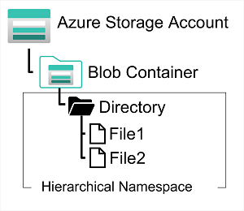
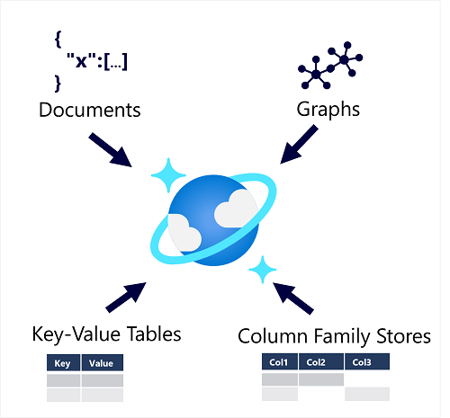

# **Non-relational data in Azure**

## **Explore Azure blob storage**

### **Explore Azure blob storage**

Azure Blob Storage is a service that enables you to store massive amounts of unstructured data as binary large objects, or blobs, in the cloud. 

Applications can read and write them by using the Azure blob storage API.


In an Azure storage account, you store blobs in containers. A container provides a convenient way of grouping related blobs together. 

**You control who can read and write blobs inside a container at the container level.**

Within a container, you can organize blobs in a hierarchy of virtual folders, similar to files in a file system on disk. 


However, by default, **these folders are simply a way of using a "/" character in a blob name to organize the blobs into namespaces**. The folders are purely virtual, and you can't perform folder-level operations to control access or perform bulk operations.

Azure Blob Storage supports three different types of blob:

* Block blobs.  
	* A block blob is handled as a set of blocks. **Each block can vary in size, up to 100 MB**. 
	* A block blob can contain up to **50,000 blocks**, **giving a maximum size of over 4.7 TB**. 
	* The block is the smallest amount of data that can be read or written as an individual unit. 
	* Block blobs are best used to store discrete, large, binary objects that change infrequently.

* **Page blobs**
	* A page blob is organized as a collection of fixed size **512-byte pages**. 
	* A page blob is optimized to support random read and write operations; 
	* you can fetch and store data for a single page if necessary. 
	* **A page blob can hold up to 8 TB of data**. 
	* Azure uses page blobs to implement virtual disk storage for virtual machines.

* **Append blobs**. 
	* An append blob is a block blob optimized to s**upport append operations**. 
	* **You can only add blocks to the end of an append blob**; 
	* updating or deleting existing blocks isn't supported. 
	* **Each block can vary in size, up to 4 MB. The maximum size of an append blob is just over 195 GB**.

Blob storage provides three access tiers, which help to balance access latency and storage cost:

* The Hot tier is the default. 
	* You use this tier for blobs that are accessed frequently. 
	* The blob data is stored on high-performance media.

* **The Cool tier** has lower performance and incurs reduced storage charges compared to the Hot tier. 
	* Use the Cool tier for data that is accessed infrequently. 
	* It's common for newly created blobs to be accessed frequently initially, but less so as time passes. 
	* In these situations, you can create the blob in the Hot tier, but migrate it to the Cool tier later. 
	* **You can migrate a blob from the Cool tier back to the Hot tier**.

* The Archive tier provides the lowest storage cost, but with increased latency. 
	* The Archive tier is intended for **historical data that mustn't be lost, but is required only rarely**. 
	* Blobs in the Archive tier are effectively stored in an offline state. 

You can create lifecycle management policies for blobs in a storage account. A lifecycle management policy can automatically move a blob from Hot to Cool, and then to the Archive tier

 A lifecycle management policy can also arrange to delete outdated blobs.

### **Explore Azure DataLake Storage Gen2**

Azure Data Lake Store (Gen1) is a separate service for hierarchical data storage for analytical data lakes, often used by so-called big data analytical solutions that work with **structured, semi-structured, and unstructured data stored in files**. 


Azure Data Lake Storage Gen2 is a newer version of this service that is integrated into Azure Storage; 

Enabling you to take advantage of the **scalability of blob storage and the cost-control of storage tiers**, combined with the hierarchical file system capabilities and compatibility with **major analytics systems of Azure Data Lake Store**.



Systems like **Hadoop** in 

**<mark>Azure HDInsight, Azure Databricks, and Azure Synapse Analytics can mount a distributed file system hosted in Azure Data Lake Store Gen2 and use it to process huge volumes of data</mark>**.

To create an **Azure Data Lake Store Gen2 files system**, you must enable the **Hierarchical Namespace option of an Azure Storage account**. 


You can do this when initially **creating the storage account, or you can upgrade an existing Azure Storage account to support Data Lake Gen2**. 

Be aware however that upgrading is a **one-way process – after upgrading a storage account to support a hierarchical namespace for blob storage**, you can’t revert it to a flat namespace.

### **Explore Azure Files**

Many on-premises systems comprising a network of in-house computers make use of file shares. 


A file share enables you to store a file on one computer, and grant access to that file to users and applications running on other computers. 

**This strategy can work well for computers in the same local area network, but doesn't scale well as the number of users increases, or if users are located at different sites.**

Azure Files is essentially a way to create cloud-based network shares, **such as you typically find in on-premises organizations to make documents and other files available to multiple users**. 


**By hosting file shares in Azure, organizations can eliminate hardware costs and maintenance overhead, and benefit from high availability and scalable cloud storage for files**.


You create Azure File storage in a storage account. 

**Azure Files enables you to share up to 100 TB of data in a single storage account.** 

This data can be distributed **across any number of file shares in the account**. 

The maximum size of a single file is 1 TB, but you can set quotas to limit the size of each share below this figure.


**Currently, Azure File Storage supports up to 2000 concurrent connections per shared file**.


After you've created a storage account, you can **upload files to Azure File Storage** using the **Azure portal, or tools such as the AzCopy utility**. 

You can also use the **Azure File Sync service to synchronize locally cached copies of shared files with the data in Azure File Storage**.

Azure File Storage offers two performance tiers. 

* The **Standard tier uses hard disk-based hardware** in a datacenter, 
* The **Premium tier uses solid-state disks**. The Premium tier offers greater throughput, but is charged at a higher rate.


Azure Files supports two common network file sharing protocols:


* **Server Message Block (SMB)** file sharing is commonly used across multiple operating systems (Windows, Linux, macOS).
* **Network File System (NFS) shares are used by some Linux and macOS versions**. 
	* To create an **NFS share, you must use a premium tier storage account and create and configure a virtual network** through which access to the share can be controlled.


### **Explore Azure Tables**

Azure Table Storage is a **NoSQL storage** solution that makes use of tables **containing key/value data items**. 

**Each item is represented by a row that contains columns for the data fields that need to be stored.**


**An Azure Table enables you to store semi-structured data.** 
 
All rows in a table must have a **unique key** (**composed of a partition key and a row key**), and when you modify data in a table, a timestamp column records the date and time the modification was made; 


**The columns in each row can vary**. 

Azure Table Storage tables have no concept of foreign keys, relationships, stored procedures, views, or other objects you might find in a relational database. 

Data in Azure Table storage is usually **denormalized**, with each row holding the entire data for a logical entity. 

The number of fields in each row can be different, depending on **the number of telephone numbers and addresses for each customer, and the details recorded for each address**. 

In a relational database, this information **would be split across multiple rows in several tables**.


Azure Table Storage splits a table into partitions. Partitioning is a mechanism for grouping related rows, based on a common property or partition key. 

**Rows that share the same partition key will be stored together**. 

Partitioning not only helps to organize data, it can also improve scalability and performance in the following ways:


* Partitions are independent from each other, and can grow or shrink as rows are added to, or removed from, a partition. A table can contain any number of partitions.

* When you search for data, you can include the partition key in the search criteria. **This helps to narrow down the volume of data to be examined**, and improves performance by **reducing the amount of I/O (input and output operations, or reads and writes) needed to locate the data.**

**The key in an Azure Table Storage table comprises two elements;** 

* The **partition key** that identifies the partition containing the row, and a **row key** that is **unique to each row in the same partition.** 
* Items in the same partition are stored in row key order.
* If an application adds a new row to a table, Azure ensures that the row is placed in the correct position in the table. 
* This scheme enables an application to quickly perform point queries that identify a single row, and range queries that fetch a contiguous block of rows in a partition.


1.What are the elements of an Azure Table storage key?

* **Partition key and row key**

> That's correct. The partition key identifies the partition in which a row is located, and the rows in each partition are stored in row key order.


2.What should you do to an existing Azure Storage account in order to support a data lake for Azure Synapse Analytics?

* **Upgrade the account to enable hierarchical namespace and create a blob container**

> That's correct. Enabling a hierarchical namespace adds support for Azure Data Lake Storage Gen 2, which can be used by Synapse Analytics.


3.Why might you use Azure File storage?

>  To share files with remote users, you create a file share using Azure File storage, and upload the file to the file share.

* **To enable users at different sites to share files**.

> You can create a file share in Azure File storage, upload files to this file share, and grant access to the file share to remote users.


## **Fundamentals of Azure Cosmos DB** 

### **Describe Azure Cosmos DB**



Azure Cosmos DB supports multiple application programming interfaces (APIs) that enable developers to use the programming semantics of many common kinds of data store to work with data in a Cosmos DB database. 


The internal data structure is abstracted, e**nabling developers to use Cosmos DB to store and query data using APIs** with which they're already familiar.

> An API is an Application Programming Interface. Database management systems (and other software frameworks) provide a set of APIs that developers can use to write programs that need to access data. 
> 
> The APIs vary for different database management systems.


Cosmos DB uses **indexes and partitioning to provide fast read and write performance and can scale to massive volumes of data**. 


You can enable **multi-region writes, adding the Azure regions of your choice to your Cosmos DB account** so that globally distributed users can each work with data in their local replica.


### **When to use Cosmos DB**

Cosmos DB is a highly scalable database management system. 

Cosmos DB automatically allocates space in a container for your **partitions, and each partition can grow up to 10 GB in size**. 

Indexes are created and maintained automatically. 

**There's virtually no administrative overhead.**

Cosmos DB is a foundational service in Azure. 


* **IoT and telematics**. 

	* These systems typically ingest large amounts of data in frequent bursts of activity. 
	* Cosmos DB can accept and store this information quickly. 
	* The data can then be used by analytics services, such as Azure Machine Learning, Azure HDInsight, and Power BI. 
	* Additionally, you can process the data in real-time using Azure Functions that are triggered as data arrives in the database.

* **Retail and marketing**. 
	* Microsoft uses Cosmos DB for its own e-commerce platforms that run as part of Windows Store and Xbox Live. 
	* It's also used in the retail industry for storing catalog data and for event sourcing in order processing pipelines.

* **Gaming.**
	*  The database tier is a crucial component of gaming applications. 
	*  Modern games perform graphical processing on mobile/console clients, but rely on the cloud to deliver customized and personalized content like in-game stats, social media integration, and high-score leaderboards.
	*  Games often require **single-millisecond latencies for reads and write** to provide an engaging in-game experience. 
	*  A game database needs to be fast and be able to handle massive spikes in request rates during new game launches and feature updates.

* **Web and mobile applications**. 
	* Azure Cosmos DB is commonly used within web and mobile applications, and is well suited for modeling social interactions, **integrating with third-party services, and for building rich personalized experiences**. 
	* **The Cosmos DB SDKs can be used to build rich iOS and Android applications **using the popular Xamarin framework.

## **Identify Azure Cosmos DB APIs**

When you provision a new Cosmos DB instance, you select the API that you want to use. 


**The choice of API depends on many factors including, the type of data to be stored, the need to support existing applications, and the API skills of the developers who will work with the data store.**


### **Core (SQL) API**

The native API in Cosmos DB manages data in JSON document format, and **despite being a NoSQL data storage solution, uses SQL syntax to work with the data**.

A SQL query for a Cosmos DB database containing customer data might look similar to this:

```
SELECT *
FROM customers c
WHERE c.id = "joe@litware.com"
```

The result of this query consists of one or more JSON documents, as shown here:


```
{
   "id": "joe@litware.com",
   "name": "Joe Jones",
   "address": {
        "street": "1 Main St.",
        "city": "Seattle"
    }
}
```


### **Table API**

**The Table API is used to work with data in key-value tables, similar to Azure Table Storage**. 


The Azure Cosmos DB Table API offers greater scalability and performance than Azure Table Storage.

**define a table named Customers like this:**


```
PartitionKey	RowKey	Name	Email
1	123	Joe Jones	joe@litware.com
1	124	Samir Nadoy	samir@northwind.com
```


You can then use the **Cosmos DB Table API through one of the language-specific SDKs to make calls to your service endpoint to retrieve data from the table**. 


For example, the following request returns the row containing the record for Samir Nadoy in the table above:

```
https://endpoint/Customers(PartitionKey='1',RowKey='124')
```

### **Cassandra API**

The Cassandra API is compatible with Apache Cassandra, which is a popular open source database that uses a column-family storage structure. 


Column families are tables, similar to those in a relational database, **with the exception that it's not mandatory for every row to have the same columns**.

```
ID	Name	Manager
1	Sue Smith	
2	Ben Chan	Sue Smith
```

**Cassandra supports a syntax based on SQL,** so a client application could retrieve the record for Ben Chan like this:

```
SELECT * FROM Employees WHERE ID = 2
```

### **Gremlin API**

**The Gremlin API is used with data in a graph structure;** in which entities are defined as vertices that **form nodes in connected graph**. Nodes are connected by edges that represent relationships, like this:


Gremlin syntax includes functions to operate on vertices and edges, enabling you to insert, update, delete, and query data in the graph. 

For example, you could use the following code to add a new employee named Alice that reports to the employee with ID 1 (Sue)

```
g.addV('employee').property('id', '3').property('firstName', 'Alice')
g.V('3').addE('reports to').to(g.V('1'))
```

The following query returns all of the employee vertices, in order of ID.

```
g.V().hasLabel('employee').order().by('id')
```

* Which API should you use to store and **query JSON documents** in Azure Cosmos DB?
	* **Core (SQL) API**

> **The core (SQL) API is designed to store and query JSON documents**.


* Which Azure Cosmos DB API should you use to work with data in which entities and their relationships to one another are represented in a graph using vertices and edges?
	* **Gremlin API**

> **The Gremlin API is used to manage a network of nodes (vertices) and the relationships between them (edges).**


*  How can you enable globally distributed users to work with their own local replica of a Cosmos DB database?
	* **Enable multi-region writes and add the regions where you have users**

> You can enable multi-region writes in the regions where you want users to work with the data.

