* SaaS software as a Service **For Customers**

A product that is run and managed by the service provider **Don't worry about how the service is maintained. It just works and remains available**.


* PaaS Platform as a Servic

Focus on the deployment and management of your apps.

**Don't worry about, provisioning, configuring or
understanding the hardware or OS.**

* **IaaS** Infrastructure as a Service.  **For Admin**

The basic building blocks for cloud IT. Provides access to networking features, computers and data storage space. 

**Don't worry about IT staff, data centers and hardware**.

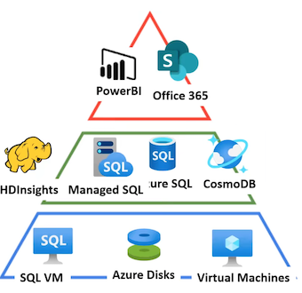

### **Azure Data Roles**

**Database Administrator**: configures and maintains a databases g. Azure Data services or SQL server.

* **Responsibilities**

	* Database management
	* Manage security, granting user access
	* Backups
	* Monitors Performance

* **Common Tools**

	* Azure Data Studio
	* SQL Server Management Studio
	* Azure Portal
	* Azure CLI

* Data Engineer: **Design and implement data tasks** related to the transfer and storage of **big data**

* **Responsibilities**

	* Database pipelines and process
	* Data ingestion storage
	* Prepare data for analytics.
	* Prepare data for analytical processing

* **Common Tools**

	* Azure Synapse Studio
	* SQL
	* Azure ClI

* **Data Analvst: Analvzes business** data to reveal important information

	* Provides insights into the data
	* Visual reporting
	* Modeling data for analysis
	* Combines data for visualization and analvsis

* **Common Tools**

	* Power BI Desktop
	* Power BI Portal
	* Power BI services
	* Power BI report bulder

	
## **Database Administrator - Common Tools**

### **Azure Data Studio**

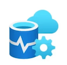


**Connect to Azure SQL, Azure SQL data warehouse, Postgres SQL and SQL Server (big data clusters, on-premise)**

* Various libraries and extensions along with automation tools.
* Graphical interface for managing on-premises and cloud-based data services.
* runs on Windows, macOS, Linux
* Possibly a replacement for SMS (still lacks some features of SSMS)


### **SQL Server Management Studio (SSMS)**


* Automation tooling for running SQL commands or common database operations
* Graphical interface for managing on-premises and cloud-based data services.
* Runs on Windows
* More mature than Azure Data Studio

### **Azure Portal and CLI**

* Manage SQL database configurations. eg create, deleting, resizing, number of cores
* Manage and provision other Azure Data Services
* Automate the creating, updating or modifying resources via Azure Resource Manager templates (IaC)


## Data Engineering - Common Tools

### **Azure Synapse Studio**


azure portal integrated to manage azure synapse, **data
ingestion (Azure data factory), management of azure synapse assets (SQL Pools/Spark Pool)**


### **Knowledge SQL**

Create create databases., tables, views, etc

### **Azure CLI**

Support operations SQL cd to connect to Microsoft server
Azure SQL data and run a talk queries and commands

### **HDInsights**

**Streaming data** via Apache Kafka or Apache Spark Applying ELT jobs via HIVE, PIG, Apache Spark

### **Azure Databricks**

**Using Apache Spark to create ELT or streaming jobs** to **dataware houses or data lakes**


## **Data Analyst Common Tools**

### **Power BI Desktop**


* A stand alone application for data visualization
* You can do data modelling
* Connect to many data sources
* Create interactive reports

### **Power BI Portal/Power BI Service**

* A web ui for creating interactive dashboards

### **Power BI Report builder**

* Create paginated reports (printable reports)


## **Data Overview**

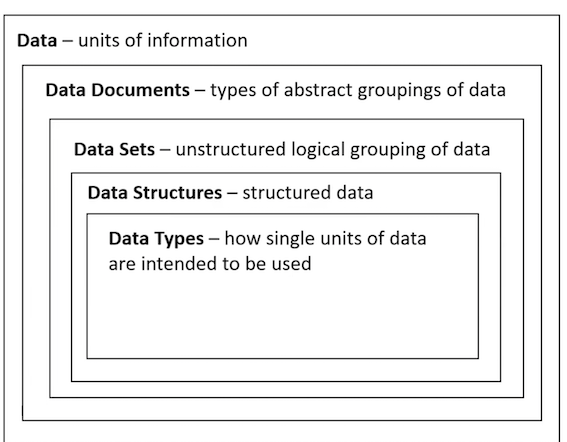

* **Batch and Streaming Data**

How do we move our data around?

* **Relational and Non Relational**

How do access, querv and search our data?

* **Data Modelling**

How do we prepare and design our data?

* **Schemas and Schemaless**

How do we structure our data for search?

* **Data Integrity and Data Corruption**

How do we trust our data?

* **Normalized and Denormlized**

How do we trade qualitv vs speed?

### **Introduction to Data**

* What is data?

Data is **units of information** that could be in the form of **numbers, text or machine code, images, videos, audio or physical** (handwriting)

### **Data Documents**

**What are data documents?**

A data document defines the **<mark>collective form in which data exists</mark>**

Common types of data documents:


* **Datasets** - a logical grouping of data 
* **Databases** - structured data that can be quickly access and searched 
* Datastores - **unstructured or semi-structured data to housing data**
* **Data warehouses** - structured or semi-structured data for creating reports and analytics
* **Notebooks** - data that is arranged in pages, designed for easy consumption

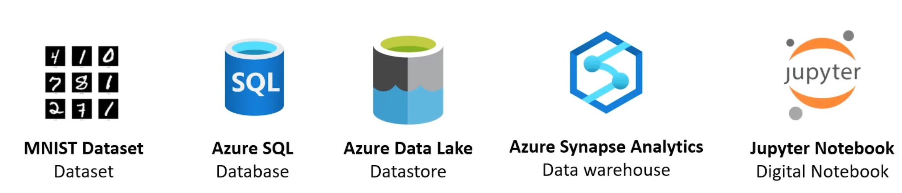

### **Data Sets**

**What is a dataset?**

A data set is a **<mark>logical grouping of units of data</mark>** that generally are closely related and/or share the same data structure.

There are publicly available data sets that are used in the

**learning of statistics, data analytics, machine learning**

* **MIST database**

Images of handwritten digits used to test classification, clustering, and image processing algorithm.

Commonly used when learning how to build computer vision ML models to translate handwriting into digital text


* **Common Objects In Context (COCO) dataset**

	* Object segmentation
	* Recognition in context
	* Superpixel stuff segmentation
	* 329K images (>200K labeled)
	* 0.5 million object instances

A dataset which contains many common images using
a JSON file (coco format) that indentify objects or
segments within an image.

**Could be useful for determine customer sentiment analysis.**


## **Data Types**

**What is a data type?**

A data type is a single unit of data that tells a compiler or interpreter (computer program) **how
data is intended to be used**.


**Numeric Data Types**: A data type involving mathematical numbers

* **Integer** - a whole number, (could be negative or positive) -100, 7, 11, 21903813091
* **Float** - a number that has a decimal e.g. 1.5, 0.0, -10.24, 9.432363535345

```
my_ int = 1
my_float = 2.2
```

**Text Data Types**: A data type that contains readable and non readable letters

* **Character** - a single letter, alphanumeric (AZ), digit (0-9), blank space, punction, special characters (`$%&* @`)
* **String** - a sequence of characters g. Words, sentences and paragraphs

```
my_char = 'a'
my_string = "We prefer to help ourselves"
```

* **Composite**: A data type that contains cells of data that can be accessed via an index or a key

* Array - a group of elements that contain the same data type, can be accessed via their index (position)
* Hash (Dictionary) - a group of elements where a key can be used retrieve a value


*Composites can be both data-types and data structures*

```
my_arr = ['live', 'long', 'and', 'prosper' ]
my_dict = {"Speed": 1, "Accuracy": 2 }
```


**Binary Data Type** - represented by a **bit or a series of bits (a byte)**, Which is either O (off) or 1 (on)

```
one_byte = int('11110000')
```

**Boolean Data Type** - A datatype that is either True or False

Some languages represents a Boolean as

* a bit as a Boolean eg. O (false ) or 1 (true)
* the first letter eg. t (true) or f (false)

```
my bool = True
```

**Enumeration (Enum Data Type)** - a group of constant

(unchangeable) variables eg. DIAMOND, SPADE, HEART, CLUBS


*Can be a data type and/or a data structure, varies on the language*

```
class Shake (Enum):
	VANILLA = 7
	CHOCOLATE = 4 
	COOKIES = 9
	MINT = 3
	
	
Shake.VANILLA
Shake.CHOCOLATE
Shake.COOKIES
Shake.MINT
```

### **Schema**

**What is a schema?**

A schema (in terms of databases) is **a formal language which describes the structure of data** (blueprint) of a database.

A schema can **define many different data structures** that serve different purposes for a database.

Different data structures (relational databases):


```
* Tables          	* Queues
* Fields				 	* Triggers
* Relationships		* types,
* Views					* Sequences
* Indexes					* materialized views
* Packages				* Synonyms
* Procedures			* database links
* Functions				* Directories
* XML schemas
```


A Ruby on Rails schema that defines the structure for a relation database

### **Schemaless**

What is a schemaless?

Schemaless is when the **<mark>primary "cell" of database can accept many types</mark>**.

This allow developers to forgo upfront data modelling

Common schemaless databases are:

* Key/Value
* Document
* Columns
	* Wide Column
* Graph


## **Query and Querying**

### **What is a query?**

A query is a request for data results (reads) or to perform operations such as inserting, updating deleting data (writes).


A query can perform maintenance operations on the data and is not always restricted to just working with the data that resides within the database.

##  **Batch vs Stream Processing**

### **Batch Processing**

* When you send batches (a collection) of data to be processed. 
* Batches are generally scheduled: eg. Every day at 1PM
* Batches are not real-time
* Batches processing is ideal for very large processing workloads
* Batch processing is more cost-effective

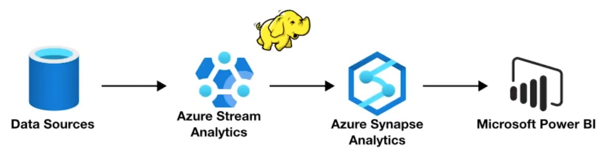

### **Stream Processing**

When vou process data as soon as it arrives:

* **Produces** will send data to a stream and
* **Consumers** will pull from the stream


* Stream processing is good for **real-time analytics or real-time processing (streaming video)**

* **Much more expensive than batch processing**


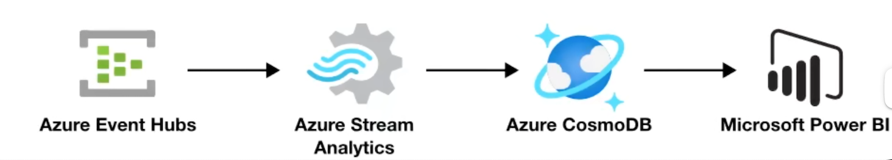


##  **Relational Data**

* **Tables**

A logical grouping of rows and columns. Think like a Excel spreadsheet

Tabular data - data that makes use of table data structures

* **Views**

Views is a result set of a stored query on data **stored in memory (a temporary or virtual table)**

* **Materialized Views**

Material Views is a result set of stored query on data stored on disk

* **Indexes**

A copy of vour data sorted by one or multiple columns for faster reads at the cost of storage

* **Constraints**

rules applied to writes, that can ensure data integrity: eg. don't allow duplicate records

* **Triggers**

a function that is trigger on specific database events

* **Primary Key**

one or multiple columns that uniquely identify a table in a row eg. Id

* **Forgien key**

a column which holds the value of primary key from another key to establish a relationship

**A relationship is when two tables have a reference to one another to join data together**

### **Relationships**

Relational databases establish relationships to other tables via **foreign keys Referencing another table's primary key**.

* One-to-one
	* A monkey has a banana

* One-to-many
	* A store has many customers

* Many-to-many
	* A project has many tasks and Tasks can belong to many projects 

* Many to Many (via Join/Junction Table)

	* A student has many classes through enrollments 
	* A class has many students through enrollments

	
### **Row-store vs Column-store**

**Row-store**

* Data is organized in rows
* Traditional relational databases are row-stores
* Good for general purpose databases
* Suited for Online transaction processing (OLTP)
* Great when needing all possible columns in a row is important
* Not the best at analytics or massive amounts of data


**Column-store**


* Data is organized into columns
	* Faster at aggerating values for analytics
* NoSQL store or SQL-Like databases
* Great for vast amount of data
* Suited for Online analytical processing (OLTP)
* Great when you only need a few colums


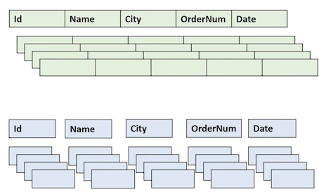

### **Indexes**

A database index <mark>is a data structure that improves the speed of reads from the database table</mark> **by storing the same or partial redundant data** organized in a more efficient logical order.

The logical ordering is commonly determined
by one ore more columns: **sort key(s)**

A common data structure of an index is a
**Balanced Tree (B-Tree)**

```
CREATE INDEX idx_address_phone
ON address (phone)
```

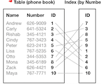

### **Normalized vs Denormalized Data**


* **Normalized**

A schema design to store **non-redundant and consistent data**

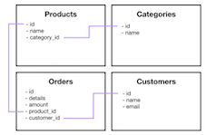

	* Data Integrity is maintained
	* Little to no redundant data
	* Many tables
	* Optimizes for storage of data

* **Denormalized**

**A schema that combines data so that accessing data (querying) is fast**

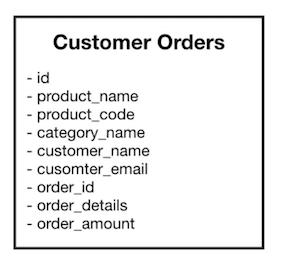


	* Data Integrity is not maintained
	* Redundant data is common
	* Fewer tables
	* Excessive data, storage is less optimal


### **Pivot lable**

A pivot table **<mark>**is a table of statistics that summarizes**</mark>** the data of a more extensive
table from a: **Database, Spreadsheet or Business intelligence (BI) tool**


* Pivot tables are a technique in **data processing**
* They arrange and rearrange (or "pivot) statistics in
* order to **draw attention to useful information**
* This leads to **finding figures and facts quickly** making them integral to data analysis.

**In Micorsoft Excel** its very easy to create Pivot Tables. Think of a pivot table as an interactive report where you can quickly aggerate (group) your data based on various factors eg.

* By Year Month, Week or Day
* Sum, Average, Mix or Max

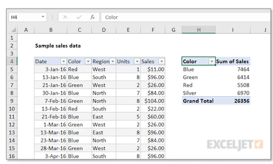

### **Strongly Consistent vs Eventually Consistent**

**What is data consistency?**


When data being kept in two different place and **whether the data exactly match or do not match**

When you have to have duplicates of your data in many places and need to keep them up-to-date to be exact matching, based on how data is transmitted and service levels cloud service providers will use these two terms:

* **Strongly Consistent**

**Every time you request data (query) you can expect
consistent data to be returned with x time (1 seconds)**


We will never return to you old data. But you will have to wait at least 2 seconds for the query to return

* **Eventually Consistent**

When you request data you may **get back inconsistent data
within 2 seconds**.

We are giving you whatever data is currently in the database, you may get new data or old data, but if you **wait a little bit longer it will generally be up to date.**


### **Synchronous vs Asynchronous**

**Synchronous and Asynchronous** can refer to mechanism for <mark>data transmission or data replication</mark>

* **Synchronous**

continuous stream of data that is synchronized by a
timer or clock (guarantee of time)

Can only access data once transfer is complete

* Guaranteed consistency of data return at time of access
* Slower access times


A company has a primary database, but thev need to have a backup database in case their primary database fails. The company cannot lose any data, so everything must be in-sync.

**The database is not going to be accessed while it is standing by to act as replacement.**

* **Asynchronous**

continuous stream of data separated by start and stop bits (no guarantee of time)

**Can access data anytime but may return older version or empty placeholder**

**Faster access times, not guarantee of consistency**


A company has a primary database, but thev want a read-replica (coov of the database) **so their data analvtics person can create computational intensive reports that do not impact the primarv database**. It does not matter if the data is exactly 1-to-1 at time of access

### **Non Relational Data**

* Types of non-relational databases: **<mark>Key/Value</mark>**
	* Each value has a kev
	* Designed to scale
	* Onlv simple lookups

* **<mark>Document</mark>**
	* Primary entity is a JSON-like data-structure called a document

* **<mark>Columnar</mark>**
	* Has a table-like structure but data is stored around columns instead of rows

	
* **<mark>Graph</mark>**
	* Data is represented with nodes and structures. Where relationships matter


Sometimes non-relational database can be both Key/Value and Document

eg. Azure Cosmo DB or Amazon DynamoDB

### **Data Sources**

**What is a data source?**

A data source is **<mark>where data originates from</mark>**

An analytics tool may be connected to various data sources to create a visualization or report

A data source could be a:

* Data lake
* Data warehouse
* Datastore
* Database
* Data requested on demand from an API
* endpoint from a web-app
* Flat files (e.g. exel spreadsheet)


**Extracting data from data sources**

A data tool like Business Intelligence (BI) software would establish a connection to multiple data
sources. A BI will extract data which could be could pull data at the time report, or could pull data on a
schedule, or data could be streamed. The mechanism for extracting data will vary per data source

A Datastore a  **<mark>repository for persistently storing and managing collections of unstructured or semi-structured data</mark>**

Data store is a very broad term, and interchangeable used with databases. 

**<mark>But generally a data store indicates working unstructured or semi-structured data</mark>**

* Flat Files (documents, spreadsheets)
* Email (an email server)
* Databases (complex data stores developed using formal
design and modeling techniques)
	* Relational Databases
	* NoSQL Databases
	* Object-Oriented Databases

* Data stores designed to be distributed across many machines
* Directory services


### **What is a Database?**

A database is a **<mark>data-store that stores semi-structured and structured data</mark>**

A database is more **<mark>complex data stores</mark>** because **<mark>it requires using formal design and modeling techniques</mark>** 

Databases can be generally categorized as either:

**<mark>Relational databases</mark>**

* Structured data that strongly represents tabular data (tables, rows and columns)
* Row-oriented or Columnar-oriented

**<mark>Non-relational databases</mark>**

* Semi-structured that may or may not distantly resemble tabular data.

Databases have a rich set of functionality:

* specialized language to query (retrieve data)
* specialized modeling strategies to optimize retrieval
for different use cases
* more fine tune control over the transformation of
the data into useful data structures or reports

Normally a databases infers someone is using a **relational row-oriented data store**

### **What is Data Warehouse?**

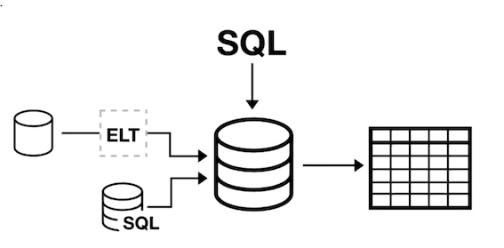

A relational datastore designed for **analytic workloads**, which is generally **column-oriented data-store**

Companies will have **<mark>terabytes and millions of rows of data,** and they need a fast way to be able to produce analytics reports

Data warehouses generally **perform aggregation**


* aggregation is grouping data eg. find a total or average
* Data warehouses are optimized around columns since they need to quickly aggerate column data

**Data warehouses are generally designed be HOT**

Hot means they can returned queries very very fast even
though they have vast amounts of data

**Data warehouses are infrequently accessed meaning they aren't intended for real-time reporting but maybe once or twice a a day or once a week to generate business and user reports.**

A data warehouse needs to consume data from a relational
databases on a regular basis.

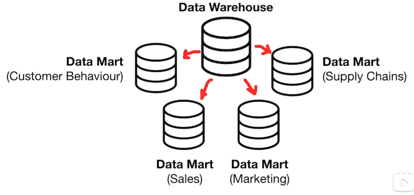


**A Data mart subset of a data warehouse**

A data mart will store **under 100 GB and has a single business focus**


**Data mart allows different teams or departments to have control over their own dataset for their specific use case**

> Data marts are generally designed be read-only.

Data marts also increase the frequency at which
data can be accessed.

The cost to query the data is much lower and so
queries can be performed multiple times a day or
even hourly.

### **What is a Data Lake?**

A **data lake is a centralized storage repository that holds a vast amount of raw data** (big data) in
either a semi-structured or unstructured format.


A data lake lets you store all your data without careful design or having to answer **questions on the future use of the data. (Hording for data scientist)**

A data lake is commonly accessed for data workloads such as:

* Visualizations (Business Intelligence)
* Real-time analytics
* Machine Learning
* On-premise data

Data lakes are great for data-scientists but
its very hard to use data lake for Bl reporting

If data lakes are not well-maintained they can
become **data-swamps (a mess of data)**

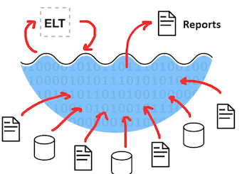


### **What is a Data Lakehouse?**

A Data Lakehouse combines the **best elements of a data lake and a data warehouse**

Data Lakehouses compared to a Data warehouse can:

* support video, audio and text files
* Support data science and ML workloads
* have support for both streaming and ELT
* Work with many open-source formats
* Data will generally reside in a data lake or blob stores

Data Lakehouses compared to a Data lakes can:

* perform BI tasks very well
* much easier to setup and maintain
* has management features to avoid a data lake becoming a data swamp
* more performant than a data lake

An example of a Data Lakehouse is **Apache Delta Lake**

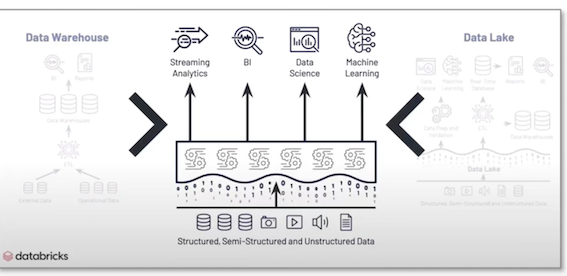

### Data Structures

What is a Data Structure?

Data that is organized in a **specific storage format**, that enable easy access and modification. A data structure can store various data types.

Data can be abstractly described to have a degree of structure:

* Unstructured - a bunch of lose data that has no organization or possibly relation
* Semi-Structured - data that can be browsed or searched (with limitations)
* Structured - data that can be easily browsed or searched

### **Data Structures - Unstructured**


**Unstructured data** is just a **<mark>bunch of loose data</mark>**, think of a junk
folder on your computer with a bunch of random files, not optimized
for search or analysis, or simply no relation between various data.

Microsoft and Azure services that store unstructured data

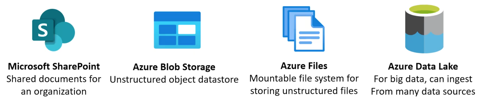

### **Data Structures - Semi-Structured**

**Semi-structured** data is (`*no schema`) data **has some form of relationship**, its easy to browse data to find related data, you can search data but there are
limitations or when you search vou will pay at a
computative or operational cost


Concrete semi-structure data structures:

**XML. JSON. AVRO. PARQUET**

**Azure and other services that store semi-structured data**

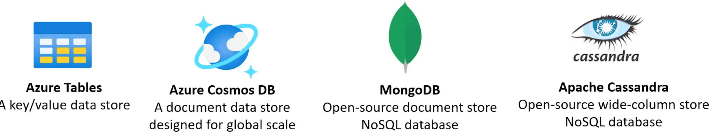

### **Semi Structured Data structure**

Semi-structured data is data that contains fields.

The fields don't have to be the same in every entity.

You only define the fields that you need on a per-entity basis.

Common semi-structured data structures:

**JavaScript Obiect Notation (JSON)**

Format used in JavaScript notation: Store data in memorv, read and write from files.

**Apache Optimized Row Columnar format (ORC)**

organizes data into columns rather than rows (columnar store data structure).

**Apache Parquet**

Another columnar data structure. A Parquet file contains row groups.

**Apache AVRO**

row-based format. Fach record contains a header that describes the structure of the data in the record

### **Semi Structured - JSON**

JSON (JavaScript Object Notation) is a lightweight data-interchange format

JSON is built on two structures

* **A collection of name/value pairs**

In other languages: realized as an object, record, struct, dictionary, hash table, keyed list, or associative array

* **An ordered list of values**

In other languages: realized as an array, vector, list, or sequence

### **Semi Structured - ORC**

**Apache ORC (Optimized Row Columnar)** a storage format of the Apache Hadoop ecosystem

* It is similar to RCFile and Parquet files and is the successor to RCFiles
* **It was developed by Facebook to supports columnar reads, predictive**
* pushdown and lazy reads
* It is more storage efficient than RCFiles (taking up 75% less space)
* **ORC only supports Hadoop's HIVE and PIG**
* ORC performs better with HIVE than Parquet files
* ORC files are organized into **stripes of data**


**The Anatomy of an ORC file**

* **File footer** stores auxiliary information


	* list of stripes in the file
	* number of rows per stripe
	* each column's data type.
	* column-level aggregates count, min, max, and sum


* **stripe footer** contains a directory of stream locations
* **Row data** is used in table scans
* **Index data** includes min and max values for each column and the row
* positions within each column
* The default stripe size is **250 MB**
* Large stripe sizes enable large, efficient reads from HDFS

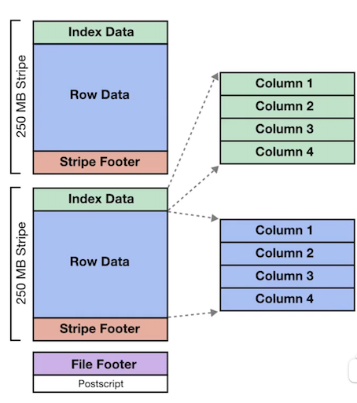

### **Semi Structured - Parquet**

Apache Parquet is a **columnar storage file format** available to **any project in the Hadoop
ecosystem (Hive, Hbase, MapReduce, Pig, Spark)**

* Parquet is built to support **very efficient compression and encoding scheme**
* uses the record shredding and assembly algorithm

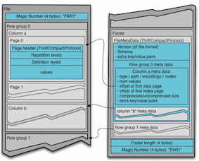

### **Semi Structured - AVRO**

Apache AVRO is a row-based format that provides:

* Rich data structures.
* A compact, fast, binary data format.
* A container file, to store persistent data.
* Remote procedure call (RPC).
* Simple integration with dynamic languages

Avro provides functionality similar to systems such as Thrift, Protocol Buffers

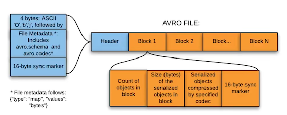

### **Data Structures - Structured**

**Structured data is** (schema) data has a relationship, its easy to browse to find related data, its easy to search data. The most common structured data is tabular data (representing row and columns)

The most common **data structure is tabular data**

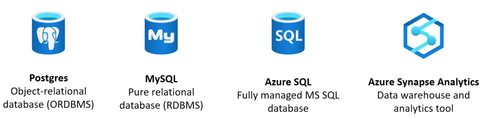


## **What is Data Mining?**

The extraction of **patterns and knowledge from large amounts of data (not the extraction of data itself)**

* Cross-industry standard process for data mining (CRISP-DM)
* defines Data Mining into 6 phases:

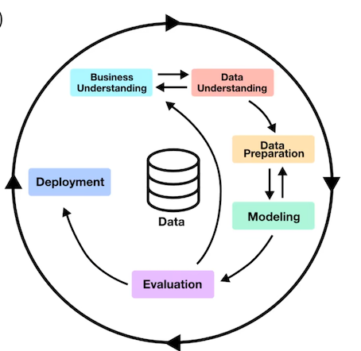

1. Business understanding
What does the business need

2. Data understanding
What data do we have, and what data do we need?

3. Data preparation
How do we organize the data for modeling?

4. Modeling
What modeling techniques should we apply?

5. Evaluation
Which data model best meets the business obiective?

6. Deployment
How do people access the data?

### Data Mining Methods

**Data Mining methods** or techniques is a way to **<mark>find valid patterns and relationships in huge data set</mark>**

* **Classification**

classify data in different classes

* **Clustering**

a division of information into groups of connected objects

* **Regression**

identify and analyze the relationship between variables because of the presence of the other factor

* **Sequential**

evaluating sequential data to discover sequential patterns

* **Association Rules**

discover a link between two or more items, finds a hidden pattern in the data set

These common **constraints** (math formulas) are used to determine significant and interesting links:

* Support - indication of how frequently the itemset appears in the dataset.
* Confidence - indication of how often the rule has been found to be true
* Lift - indication of importance compared to other items
* Conviction - indication of the strength of the rule from statistical independence

* **Outer Detection**

observation of data items in the data set, which do not match an expected pattern or expected behavior

**Prediction**

used a combination of other data mining techniques such as trends, clustering, classification to predict future data

### **What is Data Wrangling?**

**What is Data Wrangling?**


The **<mark>process of transforming and mapping data from one "raw" data form into another format</mark>** with the intent of making it more appropriate and valuable for a variety of downstream purposes such as analytics Also known as data munging

**There 6 core steps behind data wrangling:**

* **Discovery**

understand what vour data is about and keep in mind domain specific details about vour data as you move through the other steps

* **Structuring**

you need to organize your content into a structure that will be easier to work for our end results.

* **Cleaning**

remove outliers, change null values, remove duplicates,
remove special characters, standardize formatting

* **Enriching**

appending or enhancing collected data with relevant
context obtained from additional sources

* **Validating**


authenticate the reliability, quality, and safety of the data

* **Publishing**

place your data in a datastore so vou can use it downstream

### **What is Data Modeling?**

**What is a Data Model?**

an abstract model that **<mark>organizes elements of data and standardizes how they relate to one another</mark>** and to the properties of real-world entities eg. 

A data model could be a **relational database** that contains many tables.

A data model could be:

* **Conceptual**

How data is represented at the organization level abstractly without concretely defining how it work with in software
	
* eg. People, Orders, Projects, Relationships

