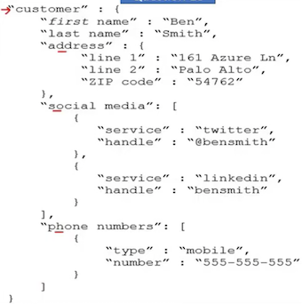
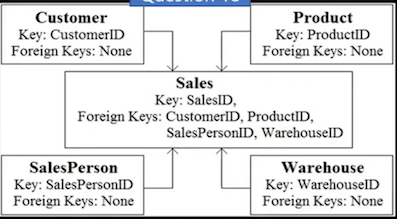
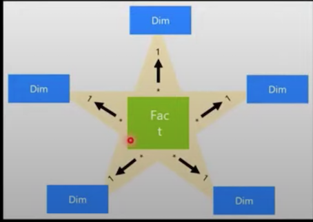

# **DP900 Real Exam**

1.**Descriptive** analytics tells you

* what is most likely to occur in the future
* **what occurred in the past**.  （V)
* which actions you can perform to affect outcomes.
* why something occurred in the past.

> The descriptive analytics tells you about what has **happened in the past**
>
> **Diagnostic analytics tells you why something is happening**
>
> **Predictive analytics tells what will happen in the
> future**,predictive is more related to examining the future, about what will be the outcomes in the future
>
> **prescriptive tells you what action should we take**
>
> **The descriptive analytics tells you more about what is happening or what occurred in the past**

**Explanation:**

* **Descriptive Analytics tells you what happened in the past**. 
* Diagnostic Analytics helps you understand **why something happened in the past.** Diagnostic analytics ask about the present. They drill down into why
something has happened and helps users diagnose issues.
* Descriptive analytics ask about the past. They want to know what has been happening to the business and how this is likely to affect future sales.

2.In batch processing,

* data is always inserted one row at a time.
* data is processed in real-time.
* **latency is expected**.  （V)
* processing can only execute serially.

> Batch processing and real time processing
>
> **Batch processing** when you process
> the data in chunks or in batches
>
> **real-time processing you process**. you're processing them as in when they are coming

3.An extract, transform and load (ETL) process
requires

* a matching schema in the data source and the data target
* a target data store powerful enough to transform data.
* **data that is fully processed before being loaded to the target data store**.
* That the data target be a relational database

> in the ETL process what more important is transforming the data before it's getting before it's getting loaded into a data store
>
> Transforming the data which means what you are already processing the data， you're filtering the data  and cleansing the data before before it's actuallv loaded into the the data store

4.An extract, (load, and transform (ELT) process requires

* a separate transformation engine.
* **a target data store powerful enough to transform data**. （V)
* data that is fully processed before being loaded to the target data store
* a data pipeline that includes a transformation engine.

> loading a big chunk of data need something **powerful process the data**

5.A relational database is appropriate for scenarios that involve a high volume of

* changes to relationships between entities
* geographically distributed writes
* **Transactional writes** （V)  （OLTP)
* writes that have varying data structures

> Explanation
> 
> **Relational databases are optimized for writes. They are optimized for consistency and availability**. Advantages of relational databases include simplicity, ease of data retrieval, data integrity, and flexibility.

6.Transcribing audio files is an example of ( ) analytics.

* **cognitive   （V)**
* descriptive
* predictive
* prescriptive

> Transcribe means converting from Audio to Text.
This is similar to Alexa, Alexa is a Cognitive
device. Cognitive is the correct answer.

7.A visualization that shows a university's current student enrollment
versus the maximum capacity is an example of  () analytics.

* cognitive
* **descriptive （V)**
* predictive
* prescriptive

8.A relational database must be used when

* a dynamic schema is required.
* data will be stored as key/value pairs.
* storing large images and videos.
* **Strong consistency guarantees are required （V)**

9.( ) natively support the analysis of relationships between entities

* Column family databases
* Document databases
* **Graph databases  （V)**
* Key-value stores

> document database no they are more suited to store the documents like json documents
>
> graph database are good for **storing relationship** or showing
> the hierarchy between the entities

10.Relational data uses ( )  to enforce relationships between different tables.

* collections
* columns
* **Keys （V)**
* partitions

11.Creating closed caption text for audio files  ( ) analytics  is an example of

* **cognitive （V)**
* descriptive
* predictive
* prescriptive

12



Customer is ( )

* a nested array
* a nested object
* **a root object**. (v)

**Address** is [answer]

* a nested array
* **a nested object(v)**
* a root object. 

Social media is [answer choice]

* **a nested array**.  (v)
* a nested object
* a root object

13

* Normalization involves eliminating relationships between database tables.     **(NO)**
* Normalizing a database reduces data redundancy.   **(YES)**
* Normalization improves data integrity.   **(YES)**

> normalization is lot of tables in a relational database and amongst those tables **we set relationship so that we are able to secure or select the data from different tables**
>
> normalization is essentially bullding the relationship between database
> tables

**Explanation**

Normalization is the process of organizing data in a database. 

**This includes creating tables and establishing relationships between those tables according to rules designed both to protect the data** and to **make the database more flexible by eliminating redundancy and inconsistent dependency**.


14

* **Batch processing can output data to a file store.   (V)**
* **Batch processing can output data to a relational database. (V)**
* **Batch processing can output data to a NoSQL database.  (V)**

> Box 1: Yes - Big data solutions often use long-running batch jobs, these jobs involve reading source files from
scalable storage (like HDFS, Azure Data Lake Store, and Azure Storage), processing them, and writing the output to new files

> batch processing can definitely output the data to **a file store relational database, no sq| and to multiple data stores or data data types**

15

* Platform as a service (PaS) database offerings in Azure require less setup and configuration effort than infrastructure as a service (laS) database offerings.  **(YES)**
* Platform as a service (PaS) database offerings in Azure provide administrators with the ability to control and update the operating system version.    **(NO)**
* All relation and non-relational platform as a service (Paas) database offerings in Azure can be paused to reduce costs.    **(NO)**

> You just cannot you cannot pause all the services to reduce cost right the important thing is that

16

* Platform as a service (PaaS) database offerings in Azure
  provide built-in high availability.    **(YES)**
* Platform as a service (PaaS) database offerings in Azure
  provide configurable scaling options.       **(YES)**
* Platform as a service (PaS) database offerings in Azure
  reduce the administrative overhead for managing hardware.   **(YES)**



The data model is a [answer choice].

* transactional model
* **star schema  (V)**
* snowflake schema

Customer is a [answer choice] table.

* fact
* **dimension (V)**
* bridge

> The Star schema， center of the schema and every other
> dimension is related to **it bodies or the related parties which are
> also known as dimensions**

> **FACT -> dimensions**



> The snowflake schema is a variation of the star schema, featuring normalization of dimension tables.


> the difference between star and snowflake is that in case snowflake have **main dimension which attahced to the fact** and also **have sub-dimensions attched main dimension**

A key/value data store is optimized for

* enforcing constraints
* **simple lookups**
* table Joins
* transactions

> Key/value stores are highly optimized for applications performing **simple lookups**, but are **less suitable if you need to query data across different key/value stores**. Key/value stores are also not optimized for querying by value.
>
> A single key/value store can be extremely scalable, as the data store can easily distribute data across multiple nodes on separate machines.

Relational data uses  ( )  to enforce **relationships between different tables**.

* collections
* columns
* **keys  (V)**
* partitions

20

* ( **Table** ) A database object that holds data
* ( **View** ) A database object whose content is defined by a query
* ( **Index** ) A database object that helps improve the speed of data retrieval

21

* ( **Image files** ) Azure Blob storage
* ( **Relationships between employees** ) Azure Cosmos DB Gremlin API
* ( **Key/value pairs** ) Azure Table storage

> Graph databases
>
> **A graph database stores two types of information, nodes and edges**. Edges specify relationships between nodes.
>
> **Nodes and edges can have properties that provide information about that node or edge, similar to columns in a table**.
>
> **Edges can also have a direction indicating the nature of the relationship.**
>
> Graph databases can efficiently perform queries **across the network of nodes and edges** and analyze the relationships between entities.

22 By default, each Azure SQL database is protected by   ( )

* a network security group (NSG).
* a server-level firewall.
* **Azure Firewall  (V)**
* Azure Front Door.

23 The massively parallel processing (MPP) engine of Azure Synapse Analytics

* **distributes processing across compute nodes  （V）**
* distributes processing across control nodes.
* redirects client connections across compute nodes.
* redirects client connections across control nodes

> control nodes are the nodes which deciding which compute nodes will actually process

24 ( ) is an object associated with a table that sorts and stores the data rows in the table based on their key values.

* **A clustered index  （V）**
* A FileTable
* A foreign key
* A stored procedure

25 Transparent Data Encryption (TDE) encrypts

* a colutin to protect data at rest and in transit.
* queries and their results in order to protect data in transit.
* **the database to protect data at rest.（V）**
* the server to protect data at rest.

> it doesn't protect the data and doesn't encrypt a column to protect
> the data at rest

26

* ( **Firewall** ) Prevent access to an Azure SQL database from another network.
* ( **Authentication** ) Support Azure Active Directory (Azure AD) sign-ins to an Azure SQL database.
* ( **Encryption** ) Ensure that sensitive data never appears as plain text in an Azure SQL database.

27

* **(Batch)** Data for a product catalog will be loaded every 12 hours to a data warehouse
* **(Streaming)** Thousands of data sets per second for online purchases will be loaded into a data warehouse real time
* **(Batch)** Updates to inventory data be loaded to a data warehouse every 1 million transactions.

28

* ( **Treemap** ) A chart of colored, nested rectangles that displays individual data points represents by the size and color of relative rectangles
* ( **Key influencer** ) A Chart that displays the **major contributions of a selected results or value**
* ( **Scatter**  ) A Chart that shows the relationship between two numericl values**


29

* ( **Diagnostic** ) Why did sales increase last month?
* （ **Prescriptive** ）How do I allocate my budget to buy different inventory items?
* （ **Descriptive**） Which people are mentioned in a company's business documents?


**Explanation**

* **Descriptive**, to answer the question: What's happening?
* **Diagnostic**, to answer the question: Why's happening?
* **Predictive**, to answer the question: What will happen?
* **Prescriptive**, to answer the question: What actions should we take?

30   **Data Factory**

* （ **Dataset** ）  A representation of data structures within data stores
* （ **Linked service** ）**The information used to connect to external resources**
* （ **Pipeline** ） A logical grouping of activities that performs a unit of work and can be scheduled

31

* ( **Germlin API** )  Graph data
* ( **MongoDB API** ) JSON documents
* ( **Table API** ) Key/value data

32 Match the Azure Data Lake Storage Gen2 terms to the appropriate levels in the hierarchy.

```
Azure Resource Group
|
|
---- (**Azure storage account**)
			|
			|
			----  (**Container**)
						|
						|
						---- Folders
								|
								----  FILES
```

> **Explanation**
> 
> **Box 1**: Azure Storage account - **Azure file shares are deployed into storage accounts, which are top-level objects that represent a shared pool of storage**.
> 
> **Box 2: Container**


33 PostgreSQL on Azure VMs:

* **Infrastructure as a service (IaaS)  (V)**
* Platform as a service (PaaS)
* Software as a service (SaaS)

Azure Database for PostgreSQL:

* Infrastructure as a service (IaaS)
* **Platform as a service (Paas) (V)**
* Software as a service (SaaS)

34  You need to create an Azure Storage account.
Data in the account must replicate **outside the Azure region** automatically. Which two types of replication can you use for the storage account? Each correct answer presents a complete Solution.

NOTE: Each correct selection is worth one point.

* A. zone-redundant storage (ZRS)
* **B. read-access geo-redundant storage (RA-GRS)**
* C. locally-redundant storage (LRS).
* **D. geo-redundant storage (GRS)**

> With GRS or GZRS, the data in the secondary region
isn't available for read or write access unless there is a failover to the secondary region. For read access to the secondary region, configure your storage account to
use read-access geo-redundant storage (RA-GRS) or
read-access geo-zone-redundant storage (RA-GZRS).

35 You have a SQL query that combines customer data and order data. The query includes calculated columns.

You need to create a database object that would allow other users to rerun the same SQL query. What should you create?

* A. an index
* **B. a view**
* C. a scalar function
* D. a table

36 What are two characteristics of real-time data processing? Each correct answer presents a complete SQLution.

* A. Data is processed periodically
* **B. Low latency is expected  （V)**
* C. High latency is acceptable
* **D. Data is processed as it is created （V)**

37 Which statement is an example of Data Manipulation Language (DML)?

* A. REVOKE
* B. DISABLE
* **D. INSERT （V)**
* D. GRANT

> Explanation
> 
> There's 3 type of Relational data SQL:
> 
> DDL (Data Definition Language) CREATE, DROP, ALTER, RENAME, COMMENT AND TRUNCATE.
> 
> DML (Data Manipulation Language) SELECT, INSERT INTO, DELETE, UPDATE.
> 
> DCL (Data Control Language) REVOKE & GRANT.
> 
> TCL (Transactional Control Language) COMMIT & ROLLBACK

38 You need to ensure that users use multi-factor authentication (MFA) when connecting to an Azure SQL database. Which type of authentication should you use?

* A. service principal authentication
* **B. Azure Active Directory Azure AD authentication （V)**
* C. SQL authentication
* D. certificate authentication

39 You need to design and model a database by using a
graphical tool that supports project-oriented offline database development. What should you use?

* **A. Microsoft SQL Server Data Tools (SSDT)  (V)**
* B. Microsoft SQL Server Management Studio (SSMS)
* C. Azure Databricks
* D. Azure Data Studio

> b, c, d are online

40 You have a transactional application that stores data in an Azure SQL managed instance.

When **should you implement a read-only database replica**?

* **A You need to generate reports without affecting the
  transactional workload (V)**.
* B You need to audit the transactional application.
* C You need to implement high availability in the event of a regional outage.
* D. You need to improve the recovery point objective (RPO).

41 You need to create an Azure resource to store data in Azure Table storage.

Which command should you run?

* A. az storage share create
* **B. az storage account create(V)**
* C. az cosmosdb create
* D. az storage container create 

> Explanation
> 
> Table is created under storage account. also URL format for Azure Table Storage is
> 
> `http://<storage account>.table.core.windows.net/<table>`

42 Which type of analysis is shown in the fourth quarter?

Your company recently reported sales from the third quarter. You have the chart below


Which type of analysis is shown in the fourth quarter?

* **A. predictive**
* B. prescriptive
* C. descriptive
* D. diagnostic

43 Relational data is stored in

* a file system as unstructured data
* a hierarchal folder structure.
* **a tabular form of rows and columns. (V)**
* comma-separated value (CSV) files.

44 Your company needs to impiement a rerational database in Azure. The solution must minimize ongoing
maintenance.

Which Azure service should you use?

* A Azure HDInsight
* **B Azure SQL Database (V)**
* C. Azure CosmosDB
* D. SQL Server on Azure virtual machines

45 What is a benefit of hosting a database on Azure SQL managed instance as compared to an Azure SQL database?

* A. built-in high availability
* **B. native support for cross-database queries and transactions （V)**
* C. system-initiated automatic backups
* D. support for encryption at rest

46 You have an e-commerce application that reads and writes data to an Azure SQL database.

Which type of processing does the application use?

* A. stream processing
* B. batch processing
* C. Online Analytical Processing (OLAP)
* **D. Online Transaction Processing (OLTP) （v)**

47 You need to store data in Azure Blob Storage for ten years as per your company needs. The data is rarely accessed.

Choose the storage tier best suited for this?

* Hot
* Cool
* **Archive (V)**

> Hot tier - An online tier optimized for storing data that is accessed or modified frequently. The Hot tier has the highest storage costs, but the lowest access costs.
>
> Cool tier - An online tier optimized for storing data that is infrequently accessed or modified. Data in the Cool tier should be stored for a **minimum of 30 days**. The Cool tier has lower storage costs and higher access costs compared to the Hot tier.
>
> Archive tier - An offline tier optimized for storing data that is rarely accessed, and that has flexible latency requirements, on the order of hours. Data in the Archive tier should be stored for a **minimum of 180 days**.

48  You need to query a table named Products in an Azure SQL database.

Which three requirements must be met to query the table from the internet? Each correct answer presents part of the SQLution. (Choose three.

NOTE: Each correct selection is worth one point.

* You must be assigned the Reader role for the resource group that contains the database.
* **You must have SELECT access to the Products table (V)**
* **You must have a user in the database (v)**
* You must be assigned the Contributor role for the resource group that contains the database.
* **Your IP address must be allowed to connect to the database (v)**

49 When can you use an Azure Resource Manager template?

* **A. to automate the creation of an inferdependent group of Azure
  resources in a repeatable way  (V)**
* B. to apply Azure policies for multi-tenant deployments
* C. to provision Azure subscriptions
* D. to control which services and feature administrators and developers can deploy from the Azure portal

> Why choose ARM templates?
>
> Declarative syntax: ARM templates allow you to create and deploy an entire Azure infrastructure declaratively.
>
> **Repeatable results**: Repeatedly deploy your infrastructure throughout the development lifecycle and have confidence your resources are deployed in a consistent manner.
>
> Orchestration: You don't have to worry about the complexities of ordering operations.

50 You are deploying a software as a service (SaaS) application that
requires a relational database for Online Transaction Processing
(OLTP).

Which Azure service should you use to support the application?

* A. Azure Cosmos DB
* B. Azure HDInsight
* **C. Azure SQL Database (V)**
* D. Azure Synapse Analytics

> azure cosmos db is NOT an OLTP
>
> hd insight is more analvtics and and analysis so this is also not oltp
>
> Azure synapse is more like a datawarehouse, synapse analytics was also known as azure was also known as azure sql data warehouse

51 You are deploying a software as a service (SaaS) application that
requires a relational database for Online Transaction Processing
(OLTP).

Which Azure service should you use to support the application?

* A. Azure Cosmos DB
* B. Azure HDInsight
* **C. Azure SQL Database (v)**
* D. Azure Synapse Analytics ;

52 You have an e-commerce application that reads and writes data to an Azure SQL database.

Which type of processing does the application use?

* A. stream processing
* B. batch processing
* C. Online Analytical Processing (OLAP)
* **D. Online Transaction Processina (OLTP)**

53 What are two benefits of platform as a service (PaaS) relational database offerings in Azure, such as Azure SQL Database? Each correct answer presents a complete solution.

NOTE: Each correct selection is worth one point.

* **A. access to the latest features**
* B. complete control over backup and restore processes
* C. in-database machine learning services
* **D. reduced administrative effort for managing the server infrastructure**

54 Which Azure Data Factory component initiates the execution of a pipeline?

* A. a control flow
* **B. a trigger （V)**
* C. a parameter
* D. an activity

> data factory in azure is a serverless integration service integration service it's fully managed and you can use it to build elt or etl
>
> Integrate all your data with Azure Data Factory - a fully managed and serverless data integration service. Visually integrate data sources with more than 90 built-in and maintenance-free connectivity apps that you can use at no extra cost.
>
> You can easily create EL and ELT processes without code in an intuitive environment, or write your own code. Then you deliver integrated data to Azure Synapse Analytics to unlock business insights.
>
> Trigger execution
>
> Triggers are another way that you can execute a pipeline run. Triggers represent a unit of processing that determines when a pipeline execution needs to be kicked off. Currently, the service supports three types of triggers:
>
> **Schedule trigger:** A trigger that invokes a pipeline on a wall-clock schedule.
>
> Tumbling window trigger: A trigger that operates on a periodic interval, while also retaining state.
>
> Event-based trigger: A trigger that responds to an event.

55 Select Yes if statement is true otherwise, select No.

* **Azure SQL Database includes a fully managed backup service  (YES)**
* **Azure SQL Database has built-in high availability  (YES)**
* **Azure SQL Database can use Azure Advanced Threat Protection (ATP) (YES)**

> **Fully managed SQL** database automates updates, establishment and backup so you can focus on software development
>
> Flexible and dynamic serverless computing and large-scale storage are quickly adapted to your changing requirements
>
> **Layers of protection**, built-in controls and intelligent threat identification protect your data
>
> Build-in AI and build-in high availability maintain the highest performance and durability with service aggrement of up-to 99.995 percent

56 When provisioning an Azure Cosmos DB account, which feature provides redundancy within an Azure region?

* A. multi-master replication
* **B. Availability Zones (V)**
* C. the strong consistency level
* D. automatic failover

57 You need to gather real-time telemetry data from a mobile application.

Which type of workload describes this scenario?

* A. Online Transaction Processing (OLTP)
* B. batch
* C. massively parallel processing (MPP)
* **D. streaming (V)**

58 What is a benefit of the Azure Cosmos DB Table API as compared to Azure Table storage?

* A. provides resiliency if an Azure region fails
* B. supports partitioning
* C. provides a higher storage capacity
* **D. supports a multi-master model (V)**

59 You need to store data by using Azure Table storage.
What should you create first?

* A. an Azure Cosmos DB instance
* **B. a storage account (V)**
* C. a blob container
* D. a table

60 What is the primary purpose of a data warehouse?

* **A. to provide answers to complex queries that rely on data from multiple sources (V)**
* B. to provide transformation services between source and target data stores
* C. to provide read-only storage of relational and non-relational historical data
* D. to provide storage for transactional line-of-business (LOB) applications

61 What is the primary purpose of a data warehouse?

* **A. to provide answers to complex queries that rely on data from multiple sources (V)**
* B. to provide transformation services between source and target data stores
* C. to provide read-only storage of relational and non-relational historical data
* D. to provide storage for transactional line-of-business (LOB) applications

62 You manage an application that stores data in a shared folder on a Windows server. You need to move the shared folder to Azure Storage.

Which type of Azure Storage should you use?

* A. queue
* B. blob
* **C. file (V)**
* D. table

63 You need to recommend a data store service that meets the following requirements

* Native SQL API access
* Configurable indexes

What should you recommend?

* A. Azure Files
* B. Azure Blob storage
* C. Azure Table storage
* **D. Azure Cosmos DB (V)**

64 You have an application that runs on Windows and requires access to a mapped drive.

Which Azure service should you use?

* **A. Azure Files (V)**
* B. Azure Blob storage
* C. Azure Cosmos DB
* D. Azure Table storage

65 Your company needs to design a database that show how changes in network traffic in one area of a network affect network traffic in other areas of the network.

Which type of data store should you use?

* **a) Graph （V)**
* b) Key/value
* C) Document
* D) columnar

66 Your company is designing a database that will contain session data for a website. The data will include notifications, personalization attributes, and
products that are added to a shopping cart.

Which type of data store will provide the lowest latency to retrieve the data?

* a) Graph
* b) Key/value
* C) Document
* **D) Columnar (V)**

> Column-family database is the low latency store type.
>
> Examples
> Recommendations
> Personalization
> Sensor data
> Telemetry
> Messaging
> Social media analytics
> Web analytics
> Activity monitoring
> Weather and other time-series data

67 What are three characteristics of an Online Transaction
Processing (OLTP) workload? Choose three!

* a) Denormalized data
* **b) Heavy writes and moderate reads (V)**
* c) Light writes and heavy reads
* **d) Schema on write (V)**
* e) Schema on read
* **f) Normalized data (V)**

68 Which two activities can be performed entirely by using the Microsoft Power Bl service **without relaying on Power BI desktop**?

* **a） A report and dashboard creation （v)**
* b) Report sharing and distribution
* c) Data modeling
* **d） Data acquisition and preparation (V)**

69 Select Yes if statement is true otherwise, select No.

* Processing salary payments once a month is an example of a batch workload   **(YES)**
* A wind turbine sends 50 sensor reading per second is streaming workload.       **(YES)**
* A home electricity meter that sends readings once a day to an energy provider is an example of streaming workload.   **(No)**


* Ingest   **Azure Data Factory**
* Store   **Azure Data Lake Storage**
* Preprocess & model   **Azure Synapse Analytics**
* OLAP   **Azure Analysis Services**
* Reporting  **Microsoft Power BI**

> factory azure data factory helps you do either etl or elt thus something that relates to data warehouse should come

71

* ( **Microsoft SQL Server Management Studio (SSMS)** )  A **graphical tool for managing SQL Server** or Azure SQL databases that supports access, configuration, management, and administration tasks.
* ( **Microsoft Visual Studio Code** )  **A lightweight source code editor** with an mssql extension that supports connections to SQL Server and a rich editing experience for T-SQL.
* ( **Azure Data Studio** ) A **lightweight editor that can run on-demand SQL queries** and view and save results as text, JSON, or Microsoft Excel files.
* (**Microsoft SQL Server Data Tools(SSDT)** )  A development tool for building Azure SQL databases, Microsoft SQL Server relational databases, SQL Server Analysis Services (SSAS) data models, SQL Server Integration Services(SISS), and SQL Server Reporting Service (SSRS) reports

72 Which scenario is an example of a streaming workload?

* A. sending transactions that are older than a month to an archive
* B. sending transactions daily from point of sale (POS) devices
* **C sending telemetry data from edge devices (V)**
* D. sending cloud infrastructure metadata every 30 minutes

73 You can query a graph database in Azure COSMOS DB

* as a JSON document by using a SQL-like language
* as a partitioned row store by using Cassandra Query Language (CQL)
* as a partitioned row store by using Language-Integrated Query (LINQ)
* **as nodes and edges by using the Gremlin Language (V)**

74


* Extract Transform Load (ETL)   Azure Data Factory
* Data warehouse  Azure Synapse Analytics

> Select & Group By clause of SQL Query
>
> Azure Regions & Azure Availability Zones
>
> Batch VS Streaming
>
> Azure Files
>
> Azure Graph

## **Section 2**

### **Graph database by example**

Let's use a sample graph to understand how **queries can be expressed in Gremlin**.

The following figure shows a business application that manages data about users, interests, and devices in the form of a graph.

### **Property graph objects**

* **Vertices/nodes** - Vertices denote discrete entities, such as a person, a place, or an event.
* **Edges/relationships** - Edges denote relationships between vertices. For example, a person might know another person, be involved in an event, and recently been at a location.
* **Properties** - Properties express information about the vertices and edges. There can be any number of properties in either vertices or edges, and they can be used to describe and filter the objects in a query. Example properties include a vertex that has name and age, or an edge, which can have a time stamp and/or a weight.
* **Label** - A label is a name or the identifier of a vertex or an edge. Labels can group multiple vertices or edges such that all the vertices/edges in a group

### **Features of Azure Cosmos DB's Gremlin API**

**Azure CosmosB is a fully managed graph database** that offers global distribution, elastic scaling of storage and throughput, automatic indexing and query, tunable consistency levels, and support for the TinkerPop standard.

* Columnar Data Store
* Batch Workloads and Streaming workloads
* OLTP and OLAP
* Azure Data Factory and Azure Synapse
* Azure COSMOS DB/Graph Database

1.Your company needs to implement a relational database in Azure. The soution must minimize ongoing maintenance. Which Azure service should you use?

* A. Azure HDlnsight
* **B. Azure SQL Database （V)**
* C. Azure Cosmos DB
* D. SQL Server on Azure virtual machines

2 Which command-line tool can you use to query Azure SQL databases?

* **A. sqlcmd (V)**
* B. bcp
* C. azdata
* D. Azure CLI

3 You have a transactional application that stores data in an Azure SQL managed instance. In which of the following circumstances would you need to implement a read-only database replica?

* **A. You need to generate reports without affecting the transactional workload (V)**
* B. You need to audit the transactional application.
* C. You need to implement high availability in the event of a regional outage.
* D You need to improve the recover point obiective (RPO)

4 What is a benefit of hosting a database on **Azure SQL managed instance as compared to an Azure SQL database**?

* A. built-in high availability
* **B. native support for cross-database queries and transactions (V)**
* C. system-initiated automatic backups
* D. support for encryption at rest

5 When you create an Azure SQL database, which account can always connect to the database?

* A. the Azure Active Directory (Azure AD) account that created the database
* B. the sa account
* **C. the server admin login account of the logical server (V)**
* D. the Azure Active Directory (Azure AD) administrator account

6 You have an Azure SQL database that you access directly
from the Internet. You recently changed your external IP address. After
changing the IP address, you can no longer access the database. You can connect to other resources in Azure.

What is a possible cause of the issue?

* A. role-based access control (RBAC)
* B. Dynamic Host Configuration Protocol (DHCP)
* C. Domain Name Service (DNS)
* **D. a database-level firewall (v)**

7 Which Azure SQL offering supports automatic database scaling and automatic pausing of the database during inactive periods?

* A. Azure SQL Database Hyperscale
* B. Azure SQL managed instance
* **C. Azure SQL Database serverless (v)**
* D. Azure SQL Database elastic pod

8 By default, each Azure SQL database is protected by

* a network security group (NSG)
* **a server-level firewall. (V)**
* Azure Firewall.
* Azure Front Door.

9 A relational database must be used when

* changes to relationships between entities
* geographically distributed writes
* **transactional writes (v)**
* writes that have varying data structures

10

* You must apply patches to Azure SQL databases regularly.   **(No)**
* You need a Microsoft 365 subscription to create an Azure
  SQL database.   **(YES)**
* You can use existing Microsoft SQL Server licenses to reduce the cost of Azure SQL databases.   **(YES)**

11 Match the security components to the appropriate scenarios.

* ( **Firewall** ) Prevent access to an Azure SQL database from another network.
* (**Authentication**)    Support Azure Active Directory (Azure AD) sign-ins to an Azure SQL database.
* (**Encryption**)   Ensure that sensitive data never appears as plain text in an Azure SQL database.

12 Your company has a reporting solution that haspaginated reports. The reports query a dimensional model in a data warehouse. Which type of processing does the reporting SQLution use?

* A. stream processing
* B. batch processing
* **C. Online Analytical Processing (OLAP) (V)**
* D. Online Transaction Processing (OLTP)

13 You have a quality assurance application that reads data from a data warehouse. Which type of processing does the application use?

* A. Online Transaction Processing (OLTP)
* B. batch processing
* C. stream processing
* **D. Online Analytical Processing (OLAP) (v)**

14 You have an e-commerce application that reads and writes data to an Azure SQL database. Which type of processing does the application use?

**D. Online Transaction Processing (OLTP) (V)**

15 What are three characteristics of an Online Transaction Processing (OLTP) workload? Each correct answer presents a complete SQLution. (Choose three.)

NOTE: Each correct selection is worth one point

* A. denormalized data
* **B. heavy writes and moderate reads (v)**
* C. light writes and heavy reads
* **D. schema on write  (V)**
* E. schema on read
* **F. normalized data  (v)**

16 In a data warehousing workload, data

* from a single source is distributed to multiple locations
* **from multiple sources is combined in a single location （V)**
* is added to a queue for multiple systems to process
* is used to train machine learning models

17 Which of the following is required for an extract, load and transform (ELT) process?

* A. a data pipeline that includes a transformation engine
* B. a separate a transformation engine
* **C. A target data store powerful enough to transform the data (v)**
* D. Data that is fully processed before being loaded to the target data store

> Explanation
> 
> Extract, transform, and load (ETL) is a data pipeline used to **collect data from various sources, transform the data according to business rules**, and **load it into a destination data store**.


18 An extract, transform, and load (ETL) process requires

* a matching schema in the data source and the data target.
* a target data store powerful enough to transform data.
* **data that is fully processed before being loaded to the target data store (V)**.
* that the data target be a relational database.

19 Your company plans to load data from a customer relationship
management (CM) system to a data warehouse by using an extract, load, and transform (ELT) process. Where does data processing occur for each stage of the ELT process? To answer, drag the appropriate locations to the correct stages. Each location may be used once, more than once, or not at all. You may need to drag the split bar between panes or scroll to view
content.

NOTE: Each correct match is worth one point.

* The data warehouse:  **(Transform)**
* The CRM system     **Extract:**
* The data warehouse   **Load**


> Box 1: Data is extracted from the CRM system.
> 
> Box 2: **Data is loaded to the data warehouse**.
> 
> Box 3: **In the ELT pipeline, the transformation occurs in the target data warehouse**.


20 What are two benefits of platform as a service (PaaS) relational database offerings in Azure, such as Azure SQL Database? Each correct answer presents a complete SQLution. NOTE: Each correct selection is worth one point.

* **A. access to the latest features （v)**
* B. complete control over backup and restore processes
* C. in-database machine learning services
* **D. reduced administrative effort for managing the server infrastructure  （V)**

21 For each of the following statements, select Yes if the statement is true. Otherwise, select No.

NOTE: Each correct selection is worth one point.

* **Platform as a service (PaaS) database offerings in Azure provide built-in high availability.       (v)**
* **Platform as a service (PaaS) database offerings in Azure provide configurable scaling options.   (V)**
* **Platform as a service (PaaS) database offerings in Azure reduce the administrative overhead for managing hardware.   (v）**

22

* If you have a platform as a service (PaaS) database in Azure, you are responsible for applying operating system updates.  **（No)**
* If you have a platform as a service (PaaS) database in Azure,
  backups are performed automatically.   **(YES)**
* If you have a platform as a service (PaaS) database in Azure,
  you are responsible for upgrading the database engine.  **(NO)**

23

* Platform as a service (PaaS) database offerings in Azure require less setup and configuration effort than infrastructure as a service (laaS) database offerings.  **(Yes)**
* Platform as a service (PaS) database offerings in Azure provide administrators with the ability to control and update the operating system version.      **(No)**
* All platform as a service (PaaS) database offerings in Azure can be paused to reduce costs.    **(No)**

24 What are two uses of data visualization? Each correct answer presents a complete solution. NOTE: Each correct selection is worth one point.

* **A. Represent trends and patterns over time (V)**
* B. Implement machine learning to predict future values
* **C. Communicate the significance of data  (v)**
* D. Consistently implement business logic across reports

25 Match the types of visualizations to the appropriatedescriptions. To answer, drag the appropriate visualization type from the column on the left to its description on the right.

Each visualization type may be used once, more than once, or not at all. NOTE: Each correct match is worth one point.

* (**Key influencer**)   A chart that displays the major contributors of a selected result or value.
* (**Scatter**) A chart that shows the relationship between two numerical values,
* (**Treemap**)  A chart of colored, nested rectangles that displays individual data points represented by the size and color of a relative rectangle.

26 For each of the following statements, select Yes if
the statement is true.

Otherwise, select No.
NOTE: Each correct selection is worth one point.

* Azure Databricks can consume data from Azure SQL Database  **（Yes)**
* Azure Databricks can consume data from Azure Event Hubs   **(Yes)**
* Azure Databricks can consume data from Azure Cosmos DB  **(Yes)**

27 At which two levels can you set the throughput for
an Azure Cosmos DB account? Each correct answer
presents a complete solution. (Choose two.)
NOTE: Each correct selection is worth one point.

* **A. database  （V)**
* B. Item
* **C. Container  (V)**
* D. SQL partition

28 What is a benefit of the Azure Cosmos DB Table API
as compared to Azure Table storage?

* A. provides resiliency if an Azure region fails
* B. supports partitioning
* C. provides a higher storage capacity
* **D. supports a multi-master model  (v)**

29 You have an Azure Cosmos DB account that uses the Core (SQL) API. Which two settings can you configure at the container level? Each correct answer presents a complete SQLution. (Choose two.)

NOTE: Each correct selection is worth one point.

* **A. the throughput  (V)**
* B. the read region
* **C. the partition key (V)**
* D. the API

30 When provisioning an Azure Cosmos DB account,
which feature provides redundancy within an Azure
region?

* A. multi-master replication
* **B. Availability Zones (v)**
* C. the strong consistency level
* D. automatic failover

31 At which level in Azure Cosmos DB can you
configure multiple write regions and read regions?

* A. database
* B. partition
* C. collection
* **D. account (V)**

32 You can query a graph database in Azure Cosmos DB

* **as a JSON document by using a SQL-like language(v)**
* as a partitioned row store by using Cassandra Query Language (CQL).
* as a partitioned row store by using Language-Integrated Query (LINQ).
* as nodes and edges by using the Gremlin language.

33

* The Azure Cosmos DB API is configured separately for each database in an Azure CosmosDB account.   **(No)**
* Partition keys are used in Azure Cosmos DB to optimize queries    **(YES)**
* Items contained in the same Azure CosmosDB logical partition can have different partition keys.   (**NO**)

34

* Azure Table storage supports multiple read replicas.  (**YES**)
* Azure Table storage supports multiple write regions. (**NO**)
* The Azure Cosmos DB Table API supports multiple read replicas.   (**YES**)
* The Azure Cosmos DB Table API supports multiple write regions.   (**YES**)

35 Match the datastore services to the appropriate
descriptions.

* (**Azure Cosmos DB**)  Enables the use of SQL queries against data stored in JSON documents
* (**Azure Files**) Enables users to access data by using the Server Message Block (SMB) version 3 protocol

36 Which two Azure services can be used to provision
Apache Spark clusters? Each correct answer presents a complete SQLution. (Choose two.)

NOTE: Each correct selection is worth one point.

* A. Azure Time Series Insights
* **B. Azure HDInsight （V)**
* **C. Azure Databricks (v)**
* D. Azure Log Analytics

### **Batch Processing:**

* long-running batch jobs to filter, aggregate and prepare the data for analysis.
* Some (high) latency is expected that measure in minutes to hours.
* Data is processed periodically.

### **Stream Processing:**

* Real time processing deals with streams of data that are captured in real-time and processed with minimal latency.
* Low latency is expected
* Data is processed as it is created (Data is processed in real time.)

37 Which scenario is an example of a streaming workload?

* A. sending transactions that are older than a month to an archive
* B. sending transactions daily from point of sale (POS) devices
* **C. sending telemetry data from edge devices （V）**
* D. sending cloud infrastructure metadata every 30 minutes

38 You need to gather real-time telemetry data from a
mobile application. Which type of workload describes this scenario?

* A. Online Transaction Processing (OLTP)
* B. batch
* C. massively parallel processing (MPP)
* **D. streaming (V)**

39

* (**Batch**) Analyzing web traffic from the past year
* (**Batch**)  Classifying images that were uploaded last month
* (**Streaming**) Tracking how many people are currently using a website

40

* (**Batch**) Data for a product catalog will be loaded every 12 hours to a data warehouse.
* (**Streaming**) Data for online purchases will be loaded to a data warehouse as the purchases occur.
* (**Batch**) Updates to inventory data will be loaded to a data warehouse every 1.000 transactions.

41

* Processing salary payments once a month is an example of a batch workload.      (**Yes**)
* A wind turbine that sends 50 sensor readings per second is an example of a streaming workload.   (**Yes**)
* A home electricity meter that sends readings once a day to an energy provider is an example of a streaming workload.    (**No**)

42 In batch processing,  **latency is expected.**

> Explanation
> 
> **Azure Batch is especially well-suited to running large-scale parallel and high-performance computing (HPC) batch jobs**. The service handles everything for you - managing and scheduling all the nodes and applications required to run your scenarios. 
> 
> And it's a free service, so you only pay for the underlying compute, storage, and networking resources that you use

43

* Batch processing can output data to a file store **(Yes)**
* Batch processing can output data to a relational database   **(Yes)**
* Batch processing can output data to a NoSQL database   **(Yes)**

44 You manage an application that stores data in a shared folder on a Windows server. You need to move the
shared folder to Azure Storage. Which of the following
service within an Azure storage account could you use
for this purpose?

* A. queue
* B. blob
* **C. file  (V)**
* D. table

45 You have an application that runs on Windows and
requires access to a mapped drive.

Which Azure service should you use?

* **A. Azure Files  (V)**
* B. Azure Blob storage
* C. Azure Cosmos DB
* D. Azure Table storage

46 Which storage SQLution supports role-based access control (RBAC) at the file and folder level?

* A. Azure Disk Storage
* **B. Azure Data Lake Storage (V)**
* C. Azure Blob storage
* D. Azure Queue storage

47 You need to store data in Azure Blob storage for sever years to meet your company's compliance
requirements. The retrieval time of the data is
unimportant. The SQLution must minimize storage
costs. Which storage tier should you use?

* **A. Archive  (V)**
* B. Hot
* C. Cool

48 To configure an Azure Storage account to support both security **at the folder level and atomic directory manipulation**,

* **enable the hierarchical namespace (V)**.
* set Account kind to BlobStorage.
* set Performance to Premium.
* set Replication to Read-access geo-redundant storage (RA-GRS).

49 When using the Azure Cosmos DB Gremlin API, the container resource type is projected as a

* **graph  (v)**.
* table.
* partition key.
* document.

50

* (**Gremlin API**) Graph data
* (**MongoDB API**) JSON documents
* (**Table API**) Key/value data

> **ETL (Extract, Transform, and Load)**
>
> **ELT (Extract, Load, and Transform)**

### **Various Tools in Azure:**

* SMS (SQL Server Management Studio)
* SSDT (SQL Server Data Tools)
* Azure Data Studio
* Visual Studio code
* MySQL Workbench

51 You need to design and model a database by using a
graphical tool that supports project-oriented offline
database development.

What should you use?

* **A. Microsoft SQL Server Data Tools (SSDT) (V)**
* B. Microsoft SQL Server Management Studio (SSMS)
* C. Azure Databricks
* D. Azure Data Studio

52 You are writing a set of SQL queries that administrators will use to troubleshoot an Azure SQL database. You need to embed documents and query results into a SQL notebook.

What should you use?

* A. Microsoft SQL Server Management Studio (SSMS)
* **B. Azure Data Studio  (V)**
* C. Azure CLI
* D. Azure PowerShell

53 A set of developers have computers that run Windows
10 and Ubuntu Desktop. They need to connect and
query an Azure SQL database from their computer. The
developers require code assistance features such as
IntelliSense. Which of the following can be used for
this requirement?

* **A. Azure Data Studio (v)**
* B. SSMS
* C. Azure Data Explorer

54 Which is not a tool to access DB?

* A. Query Editor
* B. Data Studio
* **C. Storage Explorer (v)**
* D. VS Code

55 For each of the following statements, select Yes if
the statement is true. Otherwise, select No.
NOTE: Each correct selection is worth one point.

Answer Area:

* Azure Data Studio can be used to query an Azure SQL
  database from a device that runs macOS.  **(YES)**
* Microsoft SQL Server Management Studio (SMS) enables
  users to create and use SQL notebooks.    **(NO)**
* Azure Data Studio can be used to restore a database. **(YES)**

56

* You can use Azure Data Studio to query a Microsoft SQL
  Server big data cluster.  **(YES)**
* You can use Microsoft SQL Server Management Studio
  (SSMS) to query an Azure Synapse Analytics data warehouse.   **(YES)**
* You can use MySQL Workbench to query Azure Database
  for MariaDB databases.   **(YES)**

### **Azure Data Factory:**

* **the cloud-based ET and data integration service that allows you to create data-driven workflows** for orchestrating data movement and transforming data at scale.
* **Can create and schedule data-driven workflows (called pipelines) that can ingest data from disparate data stores.**

### **Azure Data Factory components:**

* **Pipelines**: a logical grouping of activites that perform a unit of work and can be scheduled
* **Activities**: Processing step
* **Datasets**: A representation of data structure whith data stores
* **Linked services**: The information used to connect to external service
* **Data Flows**
* **Integration Runtimes** Computer Environment
* **Triggers**: Initiates the executions of a pipeline
* **Control flow** Orchestrate pipeline activites

57 Which Azure Data Factory component provides the compute environment for activities?

* A. a linked service
* **B. an integration runtime (v)**
* C. a control flow
* D. a pipeline

58 Which Azure Data Factory component initiates the
execution of a pipeline?

* A. a control flow
* **B. a trigger (V)**
* C. a parameter
* D. an activity

59 In Azure Data Factory, you can use  ()  to orchestrate pipeline activities that depend on the output of other pipeline activities.

* **a control flow (v)**
* a dataset
* a linked service
* an integration runtime

60

* Azure Databricks is an Apache Spark-based collaborative analytics platform.  **(YES)**
* Azure Analysis Services is used for transactional workloads.  **(NO)**
* Azure Data Factory orchestrates data integration workflows.   **(YES)**

> **Explanation**
> 
> Azure Databricks is an analytics platform based on Apache Spark.
> 
> Azure Databricks **can handle batch and stream processing**.
> 
> **Azure Databricks provides an interactive workspace for
exploration and data visualization**. You can run notebooks in R, Python, Scala, or SQL. and interact with the data very quickly.


61

* A pipeline is a representation of a data structure within Azure Data Factory  **(NO)**
* Azure Data Factory pipelines can execute other pipelines **(YES)**
* A processing step within an Azure Data Factory pipeline is an   activity   **(YES)**

62 Match the Azure services to the appropriate
locations in the architecture.


* **Azure Data Factory**
* **Azure Synapse Analvtics**

63

* （**Azure Data Factory**） Output data to Parquet format
* （**Azure Data Lake Storage**） Store data that is in Parquet format
* （**Azure Synapse Analytics**） Persist a tabular representation of data that is stored in Parquet format

64


* Azure Data Factory
* Azure Synapse Anayics

65

* （**Control**） Until
* （**Data movement**） Copy
* （**Data transformation**） Mapping data flow

66

* （**Dataset**） A representation of data structures within data stores
* （**Linked service**） The information used to connect to external resources
* （**Pipeline**） A logical grouping of activities that performs a unit of work and can be scheduled

### **Data Store Models:**

* Key/value stores
* Document databases
* Object storage
* Graph databases
* Column-family databases
* Time series databases

67

You need to recommend a non-relational data store that is optimized for storing and retrieving text files, videos, audio streams, and virtual disk images. The data store must store data, some metadata, and a unique ID for each file.

Which type of data store should you recommend?

* A. key/value
* B. columnar
* **C. object  (V)**
* D. document

68

Your company is designing an application that will
write a high volume of JSON data and will have an
application-defined schema.

Which type of data store should you use?

* A. columnar
* **B. key/value (V)**
* C. document
* D. graph

69

Which type of non-relational data store supports a
flexible schema, **stores data as JSON files, and stores
the all the data** for an entity in the same document?

* **A. document  (V)**
* B. columnar
* C. graph
* D. time series

70

Your company is designing a database that will contain session data for a website. The data will include notifications, personalization attributes, and products that are added to a shopping cart. Which type of data store will provide the lowest latency to retrieve the data?

* A. key/value
* B. graph
* **C. columnar (V)**
* D. document

71

Your company is designing a data store that will contain studen data. The data has the following format.


Which type of data store should you use?

* A. graph
* B. key/value
* C. object
* **D. columnar (V)**

72

Your company is designing a data store for internet-
connected temperature sensors. The collected data will
be used to analyze temperature trends.

Which type of data store should you use?

* A. relational
* **B. time series （V)**
* C. graph
* D. columnar

73 Your company needs to design a database that shows how changes in network traffic in one area of a network affect network traffic in other areas of the network.

Which type of data store should you use?

* **A. Graph （V)**
* B. Key/value
* C. document
* D. columnar

74 A key/value data store is optimized for

* enforcing constraints
* **simple lookups （V)**
* table joins
* transactions

75

* When ingesting data from Azure Data Lake Storage across Azure regions, you will incur costs for bandwidth.   **(YES)**
* You can use blob, table, and file storage in the same Azure Storage account.      **(YES)**
* You implement Azure Data Lake Storage by creating an
  Azure Storage account.      **(YES)**

### Azure Data Analytics:

* Descriptive analytics
* Diagnostics Analytics
* Predictive Analytics
* Prescriptive Analytics
* Cognitive Analytics

### Azure Synapse Analytics:

* An analytics service that brings together enterprise data warehousing and Big Data analytics
* **used Massively Parallel Processing (MPP) Engine has unlimited storage capacity**
* provide the ability to **pause and resume the Synapse pool**
* Compute is separate from storage, which enables you to scale compute independently

76 A bar chart showing year-to date sales by region is an example of which type of analytics?

* A. descriptive
* **B. diagnostic (V)**
* C. predictive
* D. prescriptive

77 I have a Car showroom and I am thinking to open a new
branch of my showroom. I want to find out where I
should open by new showroom based on sales data.
Which analytics will tell me that?

* **A. descriptive  （V)**
* B. diagnostic
* C. predictive
* D. prescriptive

78 A visualization that shows a university's current student enrollment versus the maximum capacity is an example of

* cognitive
* **descriptive**
* predictive
* prescriptive


78 You have a SQL pool in Azure Synapse Analytics that is only used actively every night for eight hours.
You need to minimize the cost of the SQL pool during
idle times. The SQLution must ensure that the data
remains intact. What should you do on the SQL pool?

* A. Scale down the data warehouse units (DWUs).
* **B. Pause the pool (V)**
* C. Create a user-defined restore point.
* D. Delete the pool

79

* Azure Synapse Analytics scales storage and compute independently **(yes)**
* Azure Synapse Analytics can be paused to reduce compute costs   **(yes)**
* An Azure Synapse Analytics data warehouse has a fixed storage capacity  **(no)**

79 

* (**Diagnostic**) Why did sales increase last month?
* (**Prescriptive**) How do I allocate my budget to buy different inventory items?
* (**Descriptive**) Which people are mentioned in a company's business documents?


### SQL Commands Categories:

* DDL - Data Definition Language
* DML - Data Manipulation Language
* DQL - Data Query Language  (SELECT
* DCL - Data Control Language  (GRANT, REVOKE)
* TCL - Transaction Control Language （COMMIT， ROLLBACK， SAVEPOINT， SET TRANSACTION）

80 Which statement is an example of Data Definition Language (DDL)?

* A. SELECT
* B. JOIN
* C. MERGE
* **D. CREATE （V)**

81 Which of the following is an example of Data Manipulation Language (DML)?   **C. INSERT**

82 You have designed a SQL query that combines customer data and order data. The query includes calculated columns. You need to persist the SQL query so that other users can use the query.

What should you create?

* A. an index
* **B. a view （V)**
* C. a scalar function
* D. a table

83  （ ）is a virtual table that contains content defined by a query.

* A heap
* A stored procedure
* **A view （V)**
* An index

84 is an object associated with a table that sorts and stores the data rows in the table based on their key values.

* **A clustered index （V)**
* A FileTable
* A foreign key
* A stored procedure

> Explanation
> 
> **Clustered indexes sort and store the data rows in the table or view based on their key values**. These are the columns included in the index definition. There can be only one clustered index per table, because the data rows themselves can be stored in only one order.

85 (**A view**)  is a virtual table that contains content defined by a query.

86 You have the following SQL query

```
INSERT INTO dbo.Products (ProductID, ProductName, Price, ProductDescription) VALUES (1, 'Clamp', 12.48, "Workbench clamp')
```

What are dbo.Products and ProductName? To answer, select the
appropriate options in the answer area.

* Dbo. Products:    **A table**
* ProductName:  **A column**

### Power BI Service:

* an online SaaS (Software as a Service) service
* Dashboards display tiles, which you can select to open reports for exploring further
* Power BI workflow are:
  1. Creating reports and dashboards
  2. Sharing reports and dashboards

### Power BI Dashboard:

* It is a single page, often called a canvas, that tells a story through visualizations.
* We can add many objects
  * a new tile by pinning a report page.
  * a visualization from a report
  * An image,
  * a text box,
  * a video,
  * Streaming Data,
  * Web content

### Power BI Dashboards versus Reports:

* Pages
* Data sources
* Drilling down in visuals
* Filtering

**Paginated reports in Power BI:**


* designed to be printed or shared.
* called paginated because they're formatted to fit well on a page
* called pixel perfect because you can control their report page layout exactly.
* advantage of paginated reports is their ability to
* print or display all the data in a table
* have their own design tool i.e., called Power BI Report Builder.

87 What should you use to build a Microsoft Power Bl paginated report?

* A. Charticulator
* B. Power BI Desktop
* C. the Power Bl service
* **D. Power BI Report Builder (V)**

88 Which two activities can be performed entirely by using the
Microsoft Power BI service? Each correct answer presents a complete SQLution. (Choose two.)

NOTE: Each correct selection is worth one point.

* **A. report and dashboard creation (v)**
* B. data modeling
* **C. report sharing and distribution (v)**
* D. data acquisition and preparation

89 You need to develop a SQLution to provide data to executives.
The SQLution must provide an interactive graphical interface,
depict various key performance indicators, and support data
exploration by using drill down.

What should you use in Microsoft Power Bl?

* A. a dashboard
* **B. a report （V)**
* C. a dataflow
* D. Microsoft Power Apps

90 Which three objects can be added to a Microsoft Power BI
dashboard? Each correct answer presents a complete SQLution.
(Choose three.)

NOTE: Each correct selection is worth one point.

* **A. a report page**
* **C. a visualization from a report**
* **E. a text box**

91 A Microsoft Power BI  (**paginated report**) enables users to create highly formatted, fixed-layout documents optimized for printing and archiving.

92

* A Microsoft Power BI dashboard is associated with a single workspace.   **（yes）**
* A Microsoft Power BI dashboard can only display visualizations from a single dataset.   **（NO）**
* A Microsoft Power BI dashboard can display visualizations from a Microsoft Excel workbook.  **（yes）**

93 You need to use Transact-SQL to query files in Azure Data Lake Storage from an Azure Synapse Analytics data warehouse.

What should you use to query the files?

* A. Azure Functions
* B. Microsoft SQL Server Integration Services (SSIS)
* **C. PolyBase (YES)**
* D. Azure Data Factory

94 Which of the following is an Azure storage SQLution that provides native support for POSIX-compliant access control lists?

* A. Azure Queue storage
* **B. Azure Data Lake Storage (v)**
* C. Azure table storage
* D. Azure Files

95

* Relational database tables contain columns and rows  **(YES)**
* Indexes in a relational database describe the data types in a table  **(no)**
* A database view is a virtual table whose content is defined by a query  **(YES)**

96 **Batch workloads**

* process data in memory, row-by-row.
* collect and process data at most once a day.
* process data as new data is received in near real-time
* **collect data and then process the data when a condition is met**

97 Your company uses both relational and non-relational data.

You need to determine which tools are suitable for each of the following tasks.

What tools should you use?

* Extract data from external sources.  (**Azure Data Factory**)
* **Maintain relational and NoSOL data in a data store**.  (**Azure Data Lake Storage**)
* Analyze relational and NoSOL data. (**Azure Synapse Analytics**)


Explanation

* You should use **Azure Data Factory to extract data from external sources**. **Azure Data Factory allows you to extract data from both relational and non-relational data stores**.
* You should **use Azure Data Lake Storage to maintain relational and NoSQL data in a data store**. You can load raw data into Azure Data Lake storage.
* **You should use Azure Synapse Analytics to analyze relational and NoSQL data**. You can analyze a high volume of structured and unstructured data with Azure Synapse Analytics.

98 Which statement is an example of Data Manipulation Language (DML)?

* A. REVOKE
* B. DISABLE
* C. CREATE
* **D. UPDATE**

> Explanation
> 
> Data Manipulation Language (DML) affect the information stored in the database. Use these statements to insert, update, and change the rows in the database.
> 
> BULK INSERT / DELETE / INSERT / SELECT / UPDATE /MERGE

99 The Azure Cosmos DB (**Core (SQL)**)  API enables the use of SELECT statements to retrieve documents from Azure Cosmos DB.

> **Explanation**
> 
> Azure Cosmos DB Core (SQL) API accounts provide support for querying items using the Structured Query Language (SQL) syntax.

100 You need to modify a view in a relational database by adding a new column. Which statement should you use?

* A. MERGE
* **B. ALTER**
* C. INSERT
* D. UPDATE

> **Explanation**
> 
> **ALTER - add/delete/modify column**
> 
> UPDATE - edit existing row
> 
> INSERT - Insert new row


101 

* Extract, transform, and load (ETL) **can reduce the transfer of sensitive data to destination systems**.  （**YES**)
* Extract, load, and transform **(ELT) transforms data** by using a compute resource *independent* of the source system and destination system.   （**NO**)
* Extract, load, and transform (ELT) minimizes the time it takes to copy large volumes of data to destination systems.   （**YES**)

> Box one is yes - You can reduce transfer sensitive data **with transformations on data source**.
> 
> Box two is No - **ELT use the compute resource from destination system. So not independent**
> 
> Box three is Yes. ELT minimizes time with transformations are going to be processed on target data destination systems.

