# 1 AI Agents入门教程之概述

大语言模型（LLMs）的爆发式发展，让AI领域迎来历史性拐点。这类系统早已颠覆自然语言处理领域，但真正的颠覆性潜能，只有当它与"自主行动力"（Agency）——即自主推理、规划与执行能力——结合时才得以释放。这正是LLM Agents（大模型智能体）诞生的意义：它们不仅理解语言，更具备思考和行动能力，正彻底重构人类与AI的协作方式。

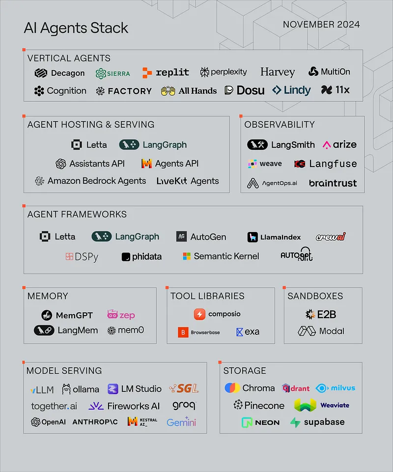

## 从 LLM 到AI Agents

大语言模型应用的形态演变速度，堪称现代应用发展史上最迅猛的演进浪潮：

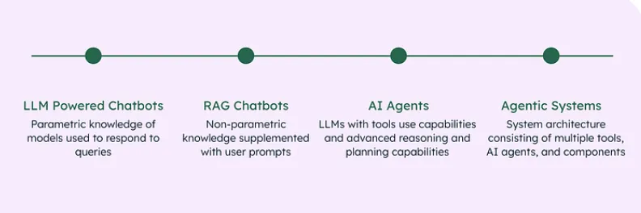

### **从传统聊天机器人到 LLM 驱动的聊天机器人**

聊天机器人并非新鲜事物：生成式AI（gen AI）时代之前，大家早就在网页上体验过它们的雏形。在生成式AI掀起革命之前，传统聊天机器人与如今由大语言模型驱动的对话智能体存在本质差异。它们往往依赖预设规则运作：

- **基于启发式的对话**： 传统的聊天机器人采用基于规则的逻辑。仅限于预定义的规则，无法管理复杂或模糊的查询。
- **预定义的回复**：答复是静态和预先确定的。一般通过检测特定关键词或短语触发。缺乏灵活性和对话深度。
- **人工接管机制**： 一般通过设置“转接人工”按钮应对无法解决的咨询，在处理复杂问题时，人工干预仍然必不可少

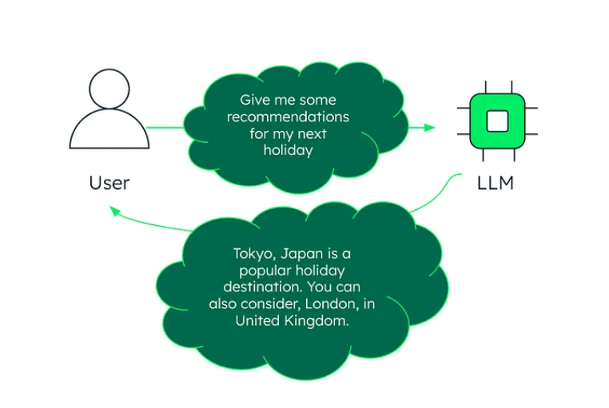

### **LLM 驱动的聊天机器人**

2022年11月30日，OpenAI推出基于GPT-3.5的ChatGPT，标志着首个主流大语言模型（LLM）应用的诞生。它虽沿用了人们熟悉的聊天机器人界面，内核却是颠覆性的技术跃迁——依托先进的大语言模型技术，通过海量互联网语料训练，首次实现了接近人类思维水平的对话能力。

GPT（生成式预训练Transformer）的核心架构源于谷歌2017年提出的Transformer模型。其革命性在于引入自注意力机制——通过动态计算输入序列中每个词汇的关联权重，不仅能解析语句表层含义，更能捕捉深层次的上下文逻辑关系，彻底改变了传统NLP的范式。

与传统聊天机器人不同，大语言模型的真正威力在于生成类人的、上下文连贯且富有创造性的文本。这种能力不仅体现在对话层面，更延展至代码生成（精准输出可执行代码）、内容创作（从营销文案到诗歌小说），以及客户服务升级（动态理解复杂需求）等场景，持续拓宽AI应用的新边界。

当然其局限性为：**难以在长时间对话中保持一致的个性化互动。此外，LLM模型最受争议的缺陷，在于可能生成逻辑连贯但事实错误的回答（幻觉）——其输出依赖概率统计与模式拟合，而非基于已验证的知识体系**。

### **从LLM 驱动的聊天机器人到RAG 聊天机器人和AI Agents**

**RAG（Retrieval-Augmented Generation，即检索增强生成）通过外部数据检索系统+大语言模型能力的深度融合，构建出新一代对话智能体。它能实时调用外部知识库（如企业文档、行业数据库），确保回答既具备LLM的创造力，又严格锚定真实场景，彻底解决“大模型幻觉”顽疾。**

**通过情境学习（In-Context Learning，如单样本/one-shot、少样本/few-shot）、思维链（Chain-of-Thought/CoT）及反应式推理（ReAct）等黑科技**  

工程师能像“AI驯兽师”般精准引导大模型的思维路径——不仅优化输出质量，更让模型展现出类人的分步推理能力，实现从“机械应答”到“逻辑推演”的进化跃迁。

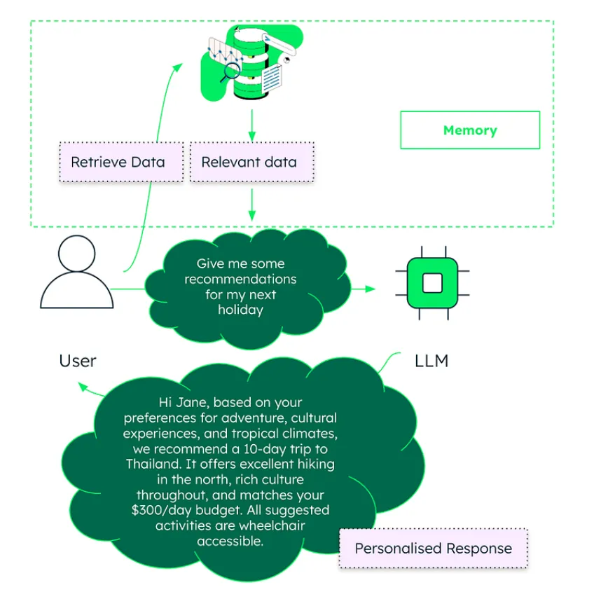

AI Agents并非简单升级版聊天机器人，**而是基于大语言模型（LLMs）的深度进化，融合了工具调用（如API接口）、多步任务拆解（Multi-Step Planning）及因果推理（Reasoning Capabilities）三大核心能力，实现从“对话应答”到“自主决策”的范式革命**。例如，它能自主调用数据分析工具生成报表、拆解复杂项目为可执行步骤，甚至模拟人类逻辑链推导商业决策——堪称数字时代的“超级执行官”。

**Agentic RAG: 将 LLM 的推理、工具使用和规划能力与语义信息检索相结合。**

使动态系统能够分解任务、执行复杂查询并利用工具解决问题。

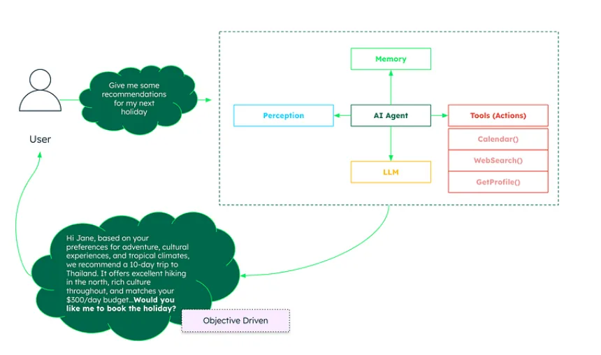

从 LLM 驱动的聊天机器人向 RAG 聊天机器人和AI Agents的演进，代表着向更智能、更自适应、更工具集成的系统的转变，这些系统能够实时解决复杂的问题。

## 3 什么是AI Agents ?

**AI 智能体（AI Agents）是一种能够通过传感器感知环境、处理信息，并通过执行器作用于环境以实现特定目标的系统。它类似于一种数字实体，具备观察、思考和执行的能力——这种运作方式与人类和周围环境的互动模式相似，但区别在于AI 智能体是通过编程以目标导向的方式运作的**。

人工智能体的核心理念建立在"理性行为"的基础上：Agent应当采取能使成功概率最大化的行动，以实现其预设目标。正是这种理性设计，使AI Agent有别于简单的响应式程序

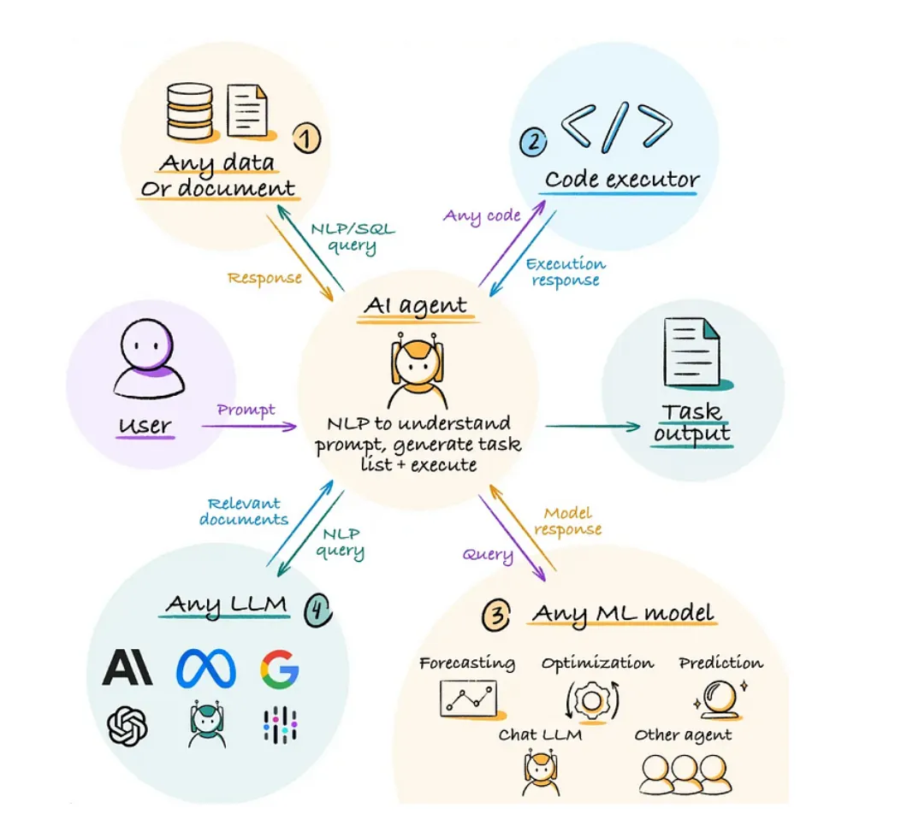

AI Agents需具备几个关键特征：

- 自主性：无需人工干预即可运行，独立做出决定。
- 反应式与主动式行为：既能应对环境变化，又能主动采取措施以确保目标实现。
- 适应性：通过处理新信息和新经验来学习和发展。
- 目标导向：努力实现预定目标或优化成果。
- 互动性：与其他代理或人类进行交流和合作。
- 持久性：持续运行，监控并应对动态环境。

## 4 AI Agents 的核心组成部分

人工智能体AI Agents的核心由以下部分组成：**感知（Perception）、推理（Reasoning）、行动（Action）、知识库（Knowledge Base）、学习（Learning）以及通信接口（Communication Interface）**。

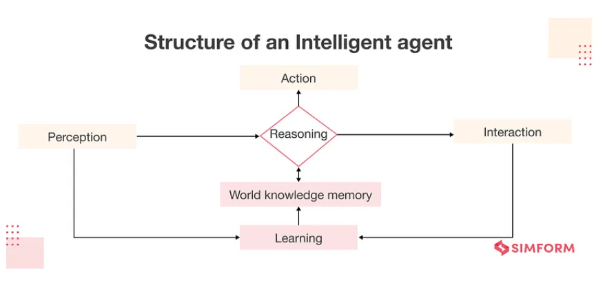

**Perception (Sensors)**

感知组件可以使Agent能够感知其所在环境，既包括物理传感器（如摄像头、麦克风），也包括数字输入源（例如数据流、用户交互行为）。

**Reasoning (Processor)**

决策中枢作为Agent的"大脑"，负责处理传感器输入信息并生成最佳行动方案。**该模块通过实现决策算法（包括基于规则系统、专家系统及神经网络等多种机制）进行智能决策，同时维护必要的内部状态数据，确保代理能够基于上下文做出精准判断并高效执行任务。**

**Action (Actuators)**

执行组件指Agent影响环境或实施行动的具体手段，既包括物理执行装置（如机械臂、扬声器），也涵盖数字操作接口（例如数据库更新指令、显示输出模块）

**Knowledge Base**

智能体用于决策的信息库，包括预先编程的知识和通过学习获得的信息。

**Learning**

**使智能体能够通过从数据和经验中学习，随时间推移逐步提升其性能**。该机制采用强化学习、监督学习和无监督学习等技术，使人工智能智能体能够随着时间的推移持续优化其表现。

**Communication Interface**

允许Agent与其他Agent、系统或人类交互。

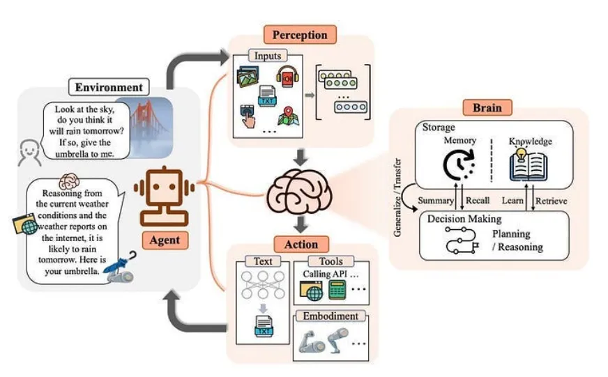

## 5 AI Agents如何与环境交互？

上述交互循环通常被称为“**感知-规划-行动”循环（Sense-Plan-Act Cycle）或“感知-行动”循环（Perception-Action Cycle）**。我们以自动驾驶汽车为例，分阶段理解这一过程：

**感知阶段**

将以下视为智能体的 "感知 "阶段： **Sensors → Processing → State Update。智能体通过传感器接收输入，处理和解释信息，根据新信息更新当前状态**。

**决策阶段**

这是智能体的 "思考 "阶段：**Current State + Goals → Evaluate Options → Select Best Action。**

智能体评估可能采取的行动，通过考虑目标和制约因素，根据现有信息选择最佳行动。

**行动阶段**

这是智能体采取行动的阶段：**Execute Action → Observe Changes → Begin New Cycle。**

智能体通过执行器执行所选动作，环境因此发生变化，Agent通过传感器观察结果，开始新的循环

这种循环不断重复，往往每秒重复多次。这种循环的强大之处在于:

- 适应性：如果出现意外情况，智能体可以在下一个感知阶段检测到，并相应调整行动。
- 学习机会：智能体可以将预测结果与实际结果进行比较，以改进未来的决策。
- 目标导向行为：每个循环都会使智能体更接近其目标，同时遵守约束条件。

## 6 AI Agents如何运作？

AI Agent可以理解人类语言（这要归功于 LLM）、推理信息、计划行动并执行任务，而不需要人类的持续输入。

**它们能解决复杂的问题，比简单的自动化工具先进得多。与基本的脚本不同，人工智能体集成到软件系统中，可以与其环境进行复杂的交互。**

那么，它们之所以不同，是因为有两大能力：**工具和规划**。

我们已经看到 ChatGPT 在处理基本数学问题时出错。这是因为它只能根据训练过的数据做出反应。

同样，如果我让你把 85 和 65 相乘，作为人类，如果你已经知道答案，或者使用一种叫做计算器的工具，你就可以直接回答，对吗？

我们对AI Agent也是如此，为他们提供工具。

第二件事是规划。以同样的数学计算为例，只有当你知道乘法或知道向计算器传递 85 和 65 以及乘法的参数时，你才能解决这个问题。这就是规划和推理过程。

比方说，**我想创建一个基于AI Agent的会议调度器，我向调度器询问："我想为我所有的学生举办一次网络研讨会"**

这将被视为人工智能体的触发器。

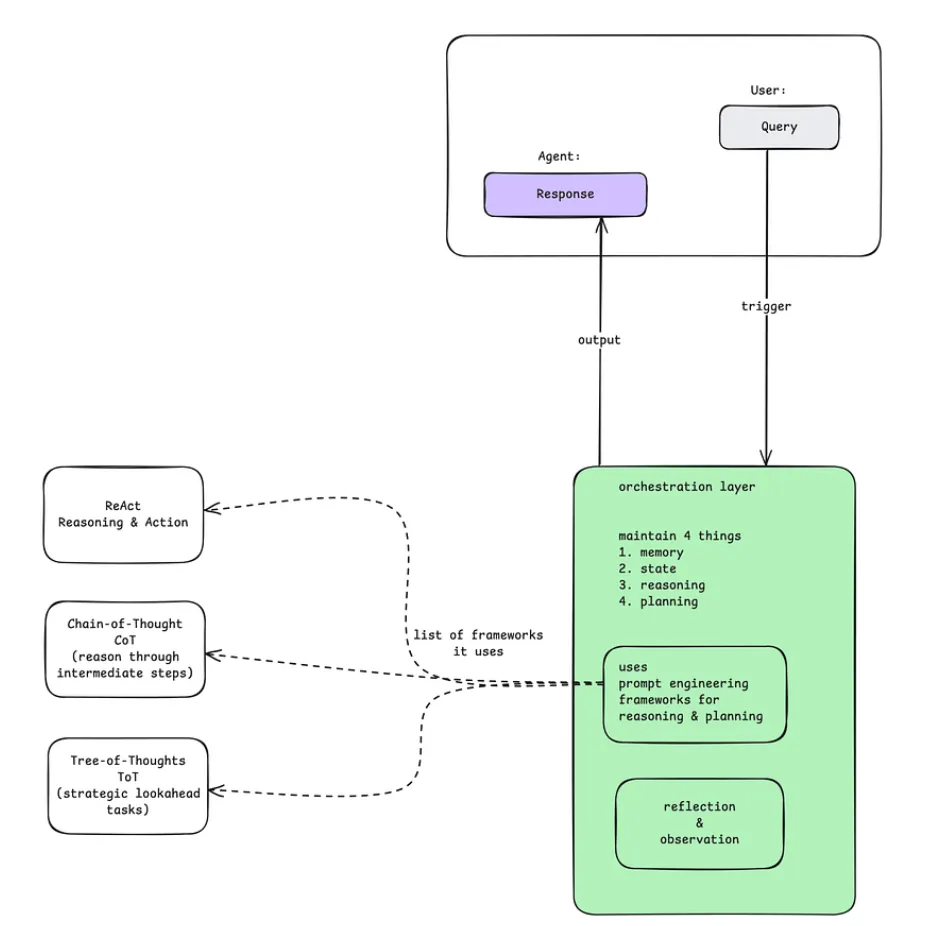

查询可以是文本、音频、视频或图像。(大家已经知道，无论数据类型是什么，都会转换成数值供机器使用）。

查询将由AI智能体的协调层（又称控制中心）处理。包括四个部分

- Memory: 保持整个互动过程的记忆。
- State: 存储整个进程的当前状态。
- Reasoning:  引导代理进行推理。
- Planning: 步骤是什么，下一步是什么？

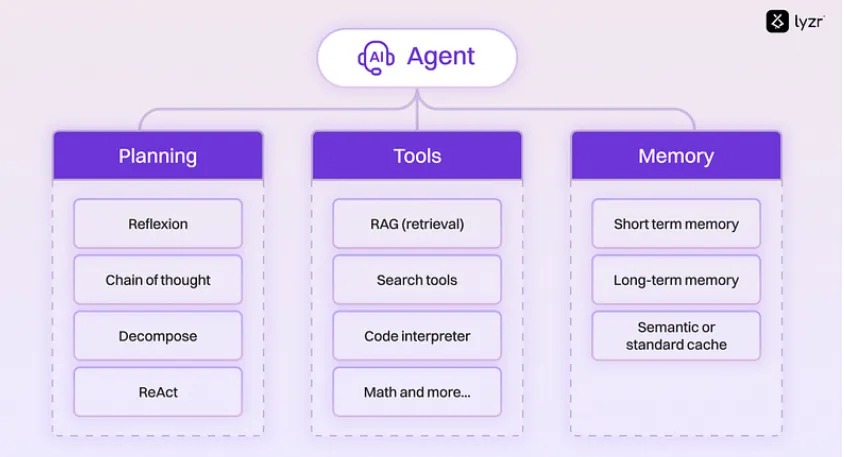

**Models （大脑）**

模型是整个智能体的集中决策者。它通常是一个人工智能模型，如大型语言模型。

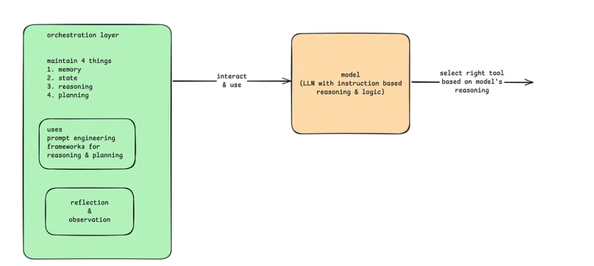

为了理解查询、制定计划和确定下一步行动，模型一般使用推理和逻辑框架，如：

- ReAct (Reason + Act) 确保采取深思熟虑的行动
- Chain-of-Thought 通过中间步骤进行思维链推理。
- 思维树探索多种路径，找到最佳解决方案

模型决定采取哪些行动，并使用特定工具执行这些行动。

**Tools （手）**

利用工具，智能体可以与外部世界互动。就像我告诉你的，计算器、应用程序接口、网络搜索、外部数据库等均可被智能体调用。

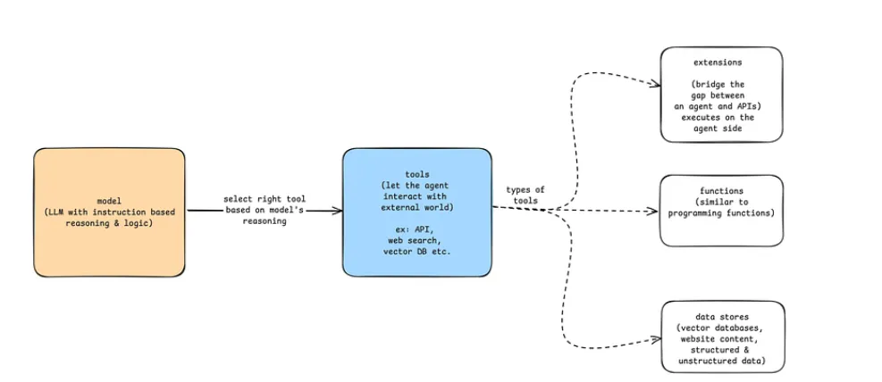

通过工具，智能体可以执行超出模型能力的操作，获取实时信息，或完成现实世界中的任务。

## 7 什么时候应该使用AI Agents?

**当我们需要一个 LLM 来确定应用程序的工作流程时，Agent是很有用的。但它们往往矫枉过正。问题是：我是否真的需要工作流程的灵活性来有效解决手头的任务？如果预先确定的工作流程经常出现问题，那就意味着你需要更多的灵活性。**

让我们举个例子：假设您正在制作一个应用程序，用于处理旅行网站上的客户请求。假设我们可以事先知道请求将属于以下2个选择中的任何一个，并为这 2 种情况分别预定义工作流程

- 想要了解有关旅行的知识吗？⇒ 让他们访问搜索栏，搜索相关的知识库
- 想与销售人员交谈？⇒ 给他们接入人工服务。

如果确定性工作流程适合所有查询，那么就把一切都编成代码！这将为大家提供一个 100% 可靠的系统，不会因为让不可预测的 LLM 介入工作流程而产生错误。为了简单和稳健起见，建议这种情形下不要使用任何Agent行为。

但是，如果无法提前确定工作流程怎么办？例如，一个用户会问："我可以周一来，但我忘带护照了，所以有可能被推迟到周三，有没有可能在周二上午带我和我的东西去冲浪，并提供取消保险？这个问题取决于很多因素，上述预定规则可能都不能满足这个要求。

> 如果预设的工作流程经常出现问题，这就意味着你需要更多的灵活性。这就是AI Agent的应用场景所在。

在上述示例中，我们可以制作一个多步骤Agent，该Agent可以访问天气 API 以获取天气预报、访问 Google 地图 API 以计算旅行距离以及访问知识库中的 RAG 系统。

直到最近，计算机程序还局限于预先确定的工作流程，试图通过堆砌 if/else 开关来处理复杂性。它们专注于极其狭窄的任务，比如 "找出此图中最短的路径"。但实际上，现实生活中的大多数任务，比如我们上面的旅行例子，并不适合预先确定的工作流程。Agent系统为此打开了现实世界任务的广阔天地！

## 8 应用领域

人工智能体是一种多功能工具，可在广泛领域内提高生产力、效率和智能。它们正越来越多地应用于日常应用和先进的、具有重大影响的领域。

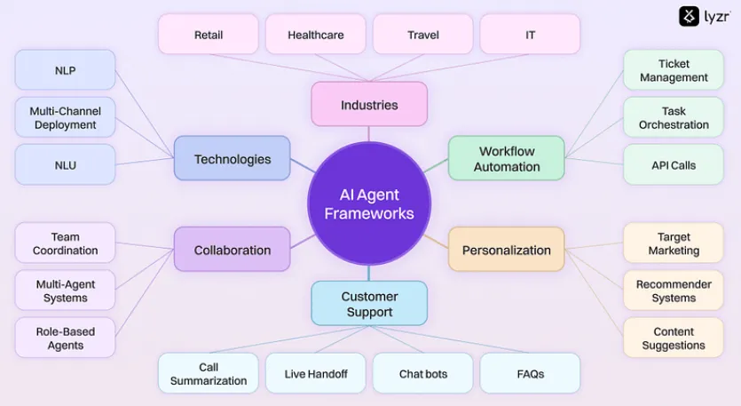
