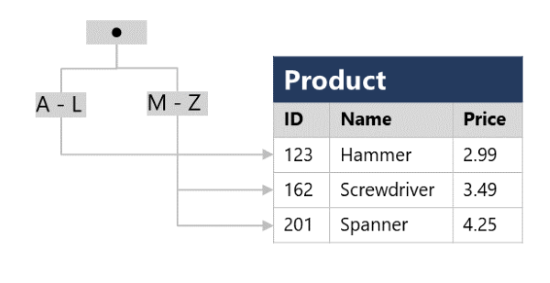

# 2 AI Agents入门教程之从零开始构建Agent

## 1 什么是Agent？

**Agent是指一种能够感知环境、做出决策并采取行动以实现特定目标的自主实体**

AI Agent的复杂程度各不相同，既有仅对刺激做出反应的简单反应式智能体，也有能够随时间推移不断学习和适应的高级智能体。常见的智能体类型包括：

* **Reactive Agents**:  直接响应环境变化，不具备内部记忆。

* **Model-Based Agents**: 利用内部世界模型进行决策的智能体。

* **Goal-Based Agents**: 以实现特定目标为基础规划行动。

* **Utility-Based Agents**: 基于效用函数评估潜在行动，以实现结果的最大化。

示例包括聊天机器人、推荐系统和自动驾驶汽车，它们各自利用不同类型的Agent，以高效且智能的方式执行任务。

智能体的核心组成部分如下：


- Models:  智能体的大脑，负责处理输入信息并做出反应。
- Tools:  智能体可根据用户请求执行的预定义功能。
- Toolbox: 智能体可使用的工具集合。
- System Prompt: 指导智能体处理用户输入并选择正确工具的指令集



Github: [https://github.com/vsingh9076/AI-Agents/tree/main/build-agent-from-scratch](https://github.com/vsingh9076/AI-Agents/tree/main/build-agent-from-scratch)

**Python 环境设置**

运行AI Agent需要安装 Python虚拟环境。请按照以下步骤设置虚拟环境：

```
python -m venv ai_agents_env
source ai_agents_env/bin/activate  # On Windows: ai_agents_env\Scripts\activate
```

安装所需的依赖项，导航至本仓库代码页面，按照requirements.txt安装所需依赖，指令如下：

```
pip install -r requirements.txt
```

**在本地设置 Ollama**

Ollama 用于高效运行和管理本地大语言模型。请按照以下步骤进行安装和配置：大家可以访问 Ollama 官方网站，下载适用于你操作系统的安装程序。

按照官网说明进行安装后，大家运行以下命令检查 Ollama 是否已正确安装：

```
ollama --version
```

拉取模型，某些Agent的实现可能需要特定的模型。您可以使用以下命令拉取模型：


```
ollama pull mistral  # Replace 'mistral' with the model needed 
```


## 2 定义Model类

定义Model类


除了 Python，我们还需要安装一些必要的库。在本教程中，我们将使用 requests、json 和 termcolor。此外，我们还将使用 dotenv 来管理环境变量。

```
pip install requests termcolor python-dotenv
```

我们首先需要一个处理用户输入的模型。我们将创建一个 OllamaModel 类，该类与本地 API 交互以生成响应。

下面是一个简单的代码实现：

```
from termcolor import colored
import os
from dotenv import load_dotenv
load_dotenv()
### Models
import requests
import json
import operator
```

```
class OllamaModel:
    def __init__(self, model, system_prompt, temperature=0, stop=None):
        """
        Initializes the OllamaModel with the given parameters.
        Parameters:
        model (str): The name of the model to use.
        system_prompt (str): The system prompt to use.
        temperature (float): The temperature setting for the model.
        stop (str): The stop token for the model.
        """
        self.model_endpoint = "http://localhost:11434/api/generate"
        self.temperature = temperature
        self.model = model
        self.system_prompt = system_prompt
        self.headers = {"Content-Type": "application/json"}
        self.stop = stop
    def generate_text(self, prompt):
        """
        Generates a response from the Ollama model based on the provided prompt.
        Parameters:
        prompt (str): The user query to generate a response for.
        Returns:
        dict: The response from the model as a dictionary.
        """
        payload = {
            "model": self.model,
            "format": "json",
            "prompt": prompt,
            "system": self.system_prompt,
            "stream": False,
            "temperature": self.temperature,
            "stop": self.stop
        }
        try:
            request_response = requests.post(
                self.model_endpoint, 
                headers=self.headers, 
                data=json.dumps(payload)
            )
            print("REQUEST RESPONSE", request_response)
            request_response_json = request_response.json()
            response = request_response_json['response']
            response_dict = json.loads(response)
            print(f"\n\nResponse from Ollama model: {response_dict}")
            return response_dict
        except requests.RequestException as e:
            response = {"error": f"Error in invoking model! {str(e)}"}
            return response
```

该类使用参数model、`system_prompt`、temperature和stop token进行初始化。其中`generate_text` 函数向模型 API 发送请求并返回响应

## 3 创建Agent所需工具

下一步是创建智能体Agent可以使用的工具。这些工具是执行特定任务的简单 Python 函数。下面是一个基本计算器和一个字符串反转器的示例

```
def basic_calculator(input_str):
    """
    Perform a numeric operation on two numbers based on the input string or dictionary.
    Parameters:
    input_str (str or dict): Either a JSON string representing a dictionary with keys 'num1', 'num2', and 'operation',
                            or a dictionary directly. Example: '{"num1": 5, "num2": 3, "operation": "add"}'
                            or {"num1": 67869, "num2": 9030393, "operation": "divide"}
    Returns:
    str: The formatted result of the operation.
    Raises:
    Exception: If an error occurs during the operation (e.g., division by zero).
    ValueError: If an unsupported operation is requested or input is invalid.
    """
    try:
        # Handle both dictionary and string inputs
        if isinstance(input_str, dict):
            input_dict = input_str
        else:
            # Clean and parse the input string
            input_str_clean = input_str.replace("'", "\"")
            input_str_clean = input_str_clean.strip().strip("\"")
            input_dict = json.loads(input_str_clean)
        
        # Validate required fields
        if not all(key in input_dict for key in ['num1', 'num2', 'operation']):
            return "Error: Input must contain 'num1', 'num2', and 'operation'"
        num1 = float(input_dict['num1'])  # Convert to float to handle decimal numbers
        num2 = float(input_dict['num2'])
        operation = input_dict['operation'].lower()  # Make case-insensitive
    except (json.JSONDecodeError, KeyError) as e:
        return "Invalid input format. Please provide valid numbers and operation."
    except ValueError as e:
        return "Error: Please provide valid numerical values."
    # Define the supported operations with error handling
    operations = {
        'add': operator.add,
        'plus': operator.add,  # Alternative word for add
        'subtract': operator.sub,
        'minus': operator.sub,  # Alternative word for subtract
        'multiply': operator.mul,
        'times': operator.mul,  # Alternative word for multiply
        'divide': operator.truediv,
        'floor_divide': operator.floordiv,
        'modulus': operator.mod,
        'power': operator.pow,
        'lt': operator.lt,
        'le': operator.le,
        'eq': operator.eq,
        'ne': operator.ne,
        'ge': operator.ge,
        'gt': operator.gt
    }
    # Check if the operation is supported
    if operation not in operations:
        return f"Unsupported operation: '{operation}'. Supported operations are: {', '.join(operations.keys())}"
    try:
        # Special handling for division by zero
        if (operation in ['divide', 'floor_divide', 'modulus']) and num2 == 0:
            return "Error: Division by zero is not allowed"
        # Perform the operation
        result = operations[operation](num1, num2)
        
        # Format result based on type
        if isinstance(result, bool):
            result_str = "True" if result else "False"
        elif isinstance(result, float):
            # Handle floating point precision
            result_str = f"{result:.6f}".rstrip('0').rstrip('.')
        else:
            result_str = str(result)
        return f"The answer is: {result_str}"
    except Exception as e:
        return f"Error during calculation: {str(e)}"
def reverse_string(input_string):
    """
    Reverse the given string.
    Parameters:
    input_string (str): The string to be reversed.
    Returns:
    str: The reversed string.
    """
    # Check if input is a string
    if not isinstance(input_string, str):
        return "Error: Input must be a string"
    
    # Reverse the string using slicing
    reversed_string = input_string[::-1]
    
    # Format the output
    result = f"The reversed string is: {reversed_string}"
    
    return result
```

这些函数旨在根据所提供的输入执行特定任务。`basic_calculator` 处理算术运算，而 `reverse_string` 则反转给定的字符串。


## 4 创建工具箱

工具箱ToolBox类存储了智能体可以使用的所有工具，并提供了每种工具的说明：

```
class ToolBox:
    def __init__(self):
        self.tools_dict = {}
    def store(self, functions_list):
        """
        Stores the literal name and docstring of each function in the list.
        Parameters:
        functions_list (list): List of function objects to store.
        Returns:
        dict: Dictionary with function names as keys and their docstrings as values.
        """
        for func in functions_list:
            self.tools_dict[func.__name__] = func.__doc__
        return self.tools_dict
    def tools(self):
        """
        Returns the dictionary created in store as a text string.
        Returns:
        str: Dictionary of stored functions and their docstrings as a text string.
        """
        tools_str = ""
        for name, doc in self.tools_dict.items():
            tools_str += f"{name}: \"{doc}\"\n"
        return tools_str.strip()
```

这个类将帮助智能体了解哪些工具可用以及每种工具的具体用途。

## 5 创建Agent类

Agent需要思考、决定使用哪种工具并执行它。下面是Agent类的代码实现：

系统提示词如下：

```
agent_system_prompt_template = """
You are an intelligent AI assistant with access to specific tools. Your responses must ALWAYS be in this JSON format:
{{
    "tool_choice": "name_of_the_tool",
    "tool_input": "inputs_to_the_tool"
}}
TOOLS AND WHEN TO USE THEM:
1. basic_calculator: Use for ANY mathematical calculations
   - Input format: {{"num1": number, "num2": number, "operation": "add/subtract/multiply/divide"}}
   - Supported operations: add/plus, subtract/minus, multiply/times, divide
   - Example inputs and outputs:
     Input: "Calculate 15 plus 7"
     Output: {{"tool_choice": "basic_calculator", "tool_input": {{"num1": 15, "num2": 7, "operation": "add"}}}}
     
     Input: "What is 100 divided by 5?"
     Output: {{"tool_choice": "basic_calculator", "tool_input": {{"num1": 100, "num2": 5, "operation": "divide"}}}}
2. reverse_string: Use for ANY request involving reversing text
   - Input format: Just the text to be reversed as a string
   - ALWAYS use this tool when user mentions "reverse", "backwards", or asks to reverse text
   - Example inputs and outputs:
     Input: "Reverse of 'Howwwww'?"
     Output: {{"tool_choice": "reverse_string", "tool_input": "Howwwww"}}
     
     Input: "What is the reverse of Python?"
     Output: {{"tool_choice": "reverse_string", "tool_input": "Python"}}
3. no tool: Use for general conversation and questions
   - Example inputs and outputs:
     Input: "Who are you?"
     Output: {{"tool_choice": "no tool", "tool_input": "I am an AI assistant that can help you with calculations, reverse text, and answer questions. I can perform mathematical operations and reverse strings. How can I help you today?"}}
     
     Input: "How are you?"
     Output: {{"tool_choice": "no tool", "tool_input": "I'm functioning well, thank you for asking! I'm here to help you with calculations, text reversal, or answer any questions you might have."}}
STRICT RULES:
1. For questions about identity, capabilities, or feelings:
   - ALWAYS use "no tool"
   - Provide a complete, friendly response
   - Mention your capabilities
2. For ANY text reversal request:
   - ALWAYS use "reverse_string"
   - Extract ONLY the text to be reversed
   - Remove quotes, "reverse of", and other extra text
3. For ANY math operations:
   - ALWAYS use "basic_calculator"
   - Extract the numbers and operation
   - Convert text numbers to digits
Here is a list of your tools along with their descriptions:
{tool_descriptions}
Remember: Your response must ALWAYS be valid JSON with "tool_choice" and "tool_input" fields.
"""
```


Agent类的代码实现如下：

```
class Agent:
    def __init__(self, tools, model_service, model_name, stop=None):
        """
        Initializes the agent with a list of tools and a model.
        Parameters:
        tools (list): List of tool functions.
        model_service (class): The model service class with a generate_text method.
        model_name (str): The name of the model to use.
        """
        self.tools = tools
        self.model_service = model_service
        self.model_name = model_name
        self.stop = stop
    def prepare_tools(self):
        """
        Stores the tools in the toolbox and returns their descriptions.
        Returns:
        str: Descriptions of the tools stored in the toolbox.
        """
        toolbox = ToolBox()
        toolbox.store(self.tools)
        tool_descriptions = toolbox.tools()
        return tool_descriptions
    def think(self, prompt):
        """
        Runs the generate_text method on the model using the system prompt template and tool descriptions.
        Parameters:
        prompt (str): The user query to generate a response for.
        Returns:
        dict: The response from the model as a dictionary.
        """
        tool_descriptions = self.prepare_tools()
        agent_system_prompt = agent_system_prompt_template.format(tool_descriptions=tool_descriptions)
        # Create an instance of the model service with the system prompt
        if self.model_service == OllamaModel:
            model_instance = self.model_service(
                model=self.model_name,
                system_prompt=agent_system_prompt,
                temperature=0,
                stop=self.stop
            )
        else:
            model_instance = self.model_service(
                model=self.model_name,
                system_prompt=agent_system_prompt,
                temperature=0
            )
        # Generate and return the response dictionary
        agent_response_dict = model_instance.generate_text(prompt)
        return agent_response_dict
    def work(self, prompt):
        """
        Parses the dictionary returned from think and executes the appropriate tool.
        Parameters:
        prompt (str): The user query to generate a response for.
        Returns:
        The response from executing the appropriate tool or the tool_input if no matching tool is found.
        """
        agent_response_dict = self.think(prompt)
        tool_choice = agent_response_dict.get("tool_choice")
        tool_input = agent_response_dict.get("tool_input")
        for tool in self.tools:
            if tool.__name__ == tool_choice:
                response = tool(tool_input)
                print(colored(response, 'cyan'))
                return
        print(colored(tool_input, 'cyan'))
        return
```

该类有三个主要方法：

- `prepare_tools`: 存储并返回工具说明。
- think: 根据用户提示决定使用哪种工具。
- work: 执行所选工具并返回结果。

## 6 运行Agent

最后，让我们将所有内容整合在一起，运行我们的Agent智能体。在脚本的main入口函数内，初始化Agent并开始接受用户输入：

```

# Example usage
if __name__ == "__main__":
    """
    Instructions for using this agent:
    
    Example queries you can try:
    1. Calculator operations:
       - "Calculate 15 plus 7"
       - "What is 100 divided by 5?"
       - "Multiply 23 and 4"
    
    2. String reversal:
       - "Reverse the word 'hello world'"
       - "Can you reverse 'Python Programming'?"
    
    3. General questions (will get direct responses):
       - "Who are you?"
       - "What can you help me with?"
    
    Ollama Commands (run these in terminal):
    - Check available models:    'ollama list'
    - Check running models:      'ps aux | grep ollama'
    - List model tags:          'curl http://localhost:11434/api/tags'
    - Pull a new model:         'ollama pull mistral'
    - Run model server:         'ollama serve'
    """
    tools = [basic_calculator, reverse_string]
    # Uncomment below to run with OpenAI
    # model_service = OpenAIModel
    # model_name = 'gpt-3.5-turbo'
    # stop = None
    # Using Ollama with llama2 model
    model_service = OllamaModel
    model_name = "llama2"  # Can be changed to other models like 'mistral', 'codellama', etc.
    stop = "<|eot_id|>"
    agent = Agent(tools=tools, model_service=model_service, model_name=model_name, stop=stop)
    print("\nWelcome to the AI Agent! Type 'exit' to quit.")
    print("You can ask me to:")
    print("1. Perform calculations (e.g., 'Calculate 15 plus 7')")
    print("2. Reverse strings (e.g., 'Reverse hello world')")
    print("3. Answer general questions\n")
    while True:
        prompt = input("Ask me anything: ")
        if prompt.lower() == "exit":
            break
        agent.work(prompt)

```