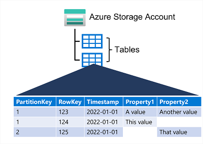

# 3 AI Agents入门教程之代理框架介绍

Agentic frameworks（代理框架）**通过使自主系统能够感知环境、动态推理并采取行动，彻底改变了人工智能领域。本节将深入探讨代理框架的核心概念**，并重点强调开源解决方案为何对现代AI发展中的创新与可扩展性至关重要。

## 什么是代理框架？

代理框架代表了人工智能系统设计方式的范式转变。与传统依赖静态、预定义工作流的AI应用不同，**代理框架引入了能够感知环境、进行推理并自主行动的动态自适应系统**。

这些框架能够将复杂任务分解为更小的子任务，由专门的代理协同处理，共同实现更广泛的目标。

通过利用大语言模型（LLMs），代理框架可以管理工作流程、做出决策并无缝集成工具，使其成为动态决策和实时问题解决等高级应用场景的理想选择

代理框架代表了人工智能系统设计方式的范式转变。与传统依赖静态、预定义工作流的AI应用不同，代理框架引入了能够感知环境、进行推理并自主行动的动态自适应系统。这些框架能够将复杂任务分解为更小的子任务，由专门的代理协同处理，共同实现更广泛的目标。通过利用大语言模型（LLMs），代理框架可以管理工作流程、做出决策并无缝集成工具，使其成为动态决策和实时问题解决等高级应用场景的理想选择

代理框架的核心功能包括：定义代理与工具的简便方法，编排机制，状态管理以及支持复杂应用的附加工具。

## 流行的代理框架

现在，让我们深入探讨当今最值得关注的AI代理框架


#### **Langchain**

LangChain作为一款稳健且适应性强的框架，大幅简化了基于大语言模型（LLMs）驱动的应用开发。得益于其丰富的工具集与抽象层，开发者能够设计出具备复杂推理、任务执行能力，并能与外部数据源及API交互的强大AI代理。

> https://www.langchain.com/

开发者在使用大语言模型（LLMs）时面临的典型挑战包括：在长对话中保持上下文连贯、整合外部信息以及协调多步骤项目流程。LangChain正是为解决这些痛点而生。得益于其模块化架构，该框架能够轻松整合多种组件，灵活适应不同应用场景的需求。

> Github链接：https://github.com/langchain-ai/langchain/tree/master/libs/langchain/langchain/agents
>
> 开发文档：https://python.langchain.com/docs/introduction/

#### LangGraph

LangGraph作为LangChain的扩展框架，能够利用大型语言模型（LLM）创建具备状态管理的多角色应用程序。该框架特别适用于构建复杂的交互式人工智能系统，支持规划、环境感知、自我反思以及多代理协作等高级功能。

> 网址：https://www.langchain.com/langgraph
>
> Github链接：https://github.com/langchain-ai/langgraph
>
> 开发文档：https://langchain-ai.github.io/langgraph/

####  CrewAI

CrewAI 是一个专为协调角色扮演型AI代理而设计的框架。它允许开发者组建由多个AI代理构成的「团队」，每个代理都具备明确的角色分工与职责，通过协作共同应对复杂任务。该框架尤其适用于构建协作式AI系统，能够有效解决需要融合多领域专业知识并进行协同配合的复合型问题。

> 网址：https://www.crewai.com/
>
> Github: https://github.com/crewAIInc/crewAI
>
> 开发文档：https://docs.crewai.com/introduction

#### Microsoft Semantic Kernel

Microsoft Semantic Kernel 旨在弥合传统软件开发与AI能力之间的鸿沟，尤其专注于将大型语言模型（LLMs）无缝集成至现有应用系统中。该框架为开发者提供工具集，使其无需全面重构现有代码基础，即可实现AI功能的灵活嵌入

该SDK凭借其轻量级设计及对多编程语言的支持，能够高度适配各类开发环境。其内置的编排器可管理复杂的多步骤AI任务，使开发者能够在应用程序中构建精密的AI驱动工作流程

> 网址：https://learn.microsoft.com/en-us/semantic-kernel/overview/
>
> Github链接：https://github.com/microsoft/semantic-kernel
>
> 开发文档：https://learn.microsoft.com/en-us/semantic-kernel

#### Microsoft AutoGen

Microsoft AutoGen 是由微软研究院开发的开源框架，专注于构建先进AI代理与多代理系统。

**该框架为创建对话式及任务完成型AI应用提供灵活而强大的工具包，强调模块化、可扩展性和易用性，使开发者能够高效构建复杂的AI系统**

> 网址：https://www.microsoft.com/en-us/research/project/autogen/
>
> Github链接：https://github.com/microsoft/autogen
>
> 开发文档：https://microsoft.github.io/autogen/stable/user-guide/agentchat-user-guide/

#### Smolagents

Smolagents是一款前沿开源框架，旨在彻底变革AI智能体的开发方式。**它为开发者提供了一套完整的工具包，用于构建具备智能协作能力的多智能体系统。该框架以灵活性和模块化为核心理念，支持创建既能独立运行、又能与人类协同工作的复杂AI系统，其模块化架构使开发者能够根据需求自由组合功能组件**。

> Github链接：https://github.com/huggingface/smolagents
>
> 开发文档：https://huggingface.co/docs/smolagents/en/index

#### AutoGPT

AutoGPT基于强大的GPT-4语言模型，能够通过语言输入执行目标导向型任务，标志着自主AI智能体领域的重大突破。这款前沿AI助手将决策能力提升至全新高度，不仅超越基础的反应式智能体，更通过整合复杂功能使其成为多领域应用的宝贵工具

> 网址：https://agpt.co/
>
> Github链接：https://github.com/Significant-Gravitas/AutoGPT
>
> 开发文档：https://docs.agpt.co/

#### Phidata

最后要介绍的AI智能体框架是Phidata。这是一款多模态智能体框架，能够开发具备协同执行能力的智能体系统。其设计整合了记忆存储、工具调用等核心组件，使智能体既能自主运行又保持行为一致性，通过模块化设计支持灵活扩展，在复杂任务处理场景中展现出强大潜力。

Phidata智能体原生支持文本、图像、音频等多模态数据处理能力，无需依赖外部工具即可实现丰富的数据交互。该框架还提供可视化交互界面（Agentic UI），便于开发者与智能体进行图形化操作。更值得关注的是，Phidata率先实现智能体驱动的检索增强生成技术（Agentic RAG），赋予智能体自主搜索知识库的能力，在信息检索与知识整合方面展现出技术前瞻性

> 网址：https://www.agno.com/
>
> Github链接：https://github.com/agno-agi/phidata
>
> 开发文档：https://docs.phidata.com/introduction

## 代理框架对比

下图以对比表格形式系统梳理了本文讨论的各类AI智能体框架的核心特性。该对比从多模态支持、自主决策能力、人机协作模式等维度切入，着重突出AutoGPT、Smolagents、Phidata等框架在实时数据处理、分布式任务协同、知识库动态检索等场景下的差异化优势，为开发者在工业自动化、智能客服、医疗诊断等垂直领域的技术选型提供可视化决策参考


## 深入了解LangGraph

LangGraph是由LangChain团队开发的一个库，旨在帮助开发者创建基于图结构的单智能体或多智能体人工智能应用。

**作为一个底层框架，LangGraph能够让开发者精确控制智能体之间的交互方式、选择使用的工具以及应用程序内部的信息流动路径**

### 什么是Graph?

假设您有一组数据，可以表示为一种图结构。在这种图中，每个数据点或实体之间都可能存在多种类型的关系（例如一对一、一对多、多对多等）。图的核心构成要素分为两类：**节点（表示数据或实体）和边（表示节点之间的连接关系）**。

这类数据的典型示例包括交通数据或社交媒体网络。在这类场景中，每个实体（如交通站点）或用户之间都可能存在复杂的关系（如交通线路连接、用户好友关系），而图结构凭借其直观的节点与边关系，能够轻松将这类数据可视化呈现

**有两种类型的图表：**

**有向图（Directed Graph）** 在有向图中，边具有方向性，表示节点间的单向流动或关系（例如：社交媒体上的关注行为，用户A关注用户B，但用户B未必关注用户A）。


**无向图（Undirected Graph）**：在无向图中，边没有方向，仅表示节点间的对称关系（例如：LinkedIn上的好友连接，用户A与用户B一旦建立联系，双方关系是平等的）。


## 关键概念

### **Graph Structures**

LangGraph的设计核心在于将应用程序的工作流程以图结构的形式呈现。其图主要由两大核心要素构成：

**Nodes：工作流的基础构建单元**。在LangGraph中，每个节点（Node）代表应用程序内的一个独立工作单元或操作。这些节点本质上是Python函数，用于封装特定任务。这些任务可涵盖多种操作，例如：与大型语言模型（LLM）直接交互以完成文本生成、摘要或其他基于语言的任务。通过连接外部工具和API来获取数据或在现实世界中执行操作。通过格式化、过滤或转换等流程处理数据。与用户互动以收集输入信息或展示处理结果。

**Edges： 引导信息流动与控制流。边在LangGraph中充当连接纽带，建立信息流动的路径并规定操作的执行顺序。**

LangGraph支持多种边类型： 

* 1）简单边（Simple Edges）：表示节点之间直接且无条件的信息流动。前一个节点的输出会作为输入传递给后续节点，形成线性执行流程。
* 2）条件边（Conditional Edges）：通过引入动态逻辑层，使工作流程能够根据特定节点运行结果进行分叉。
	* 例如，**根据用户的反馈，流程图可判定终止交互或继续调用工具。此类决策能力对于构建适应不同情境的应用程序至关重要**




### **State Management**

管理多智能体系统的核心挑战在于确保所有智能体对任务当前状态保持同步认知。LangGraph通过自动状态管理机制解决这一问题，即该库在智能体执行任务时，会自主跟踪并更新中心化状态对象。

状态对象（State Object）作为核心信息存储库，在工作流各节点间实现数据共享，可能包含以下要素：

- 对话历史：在聊天机器人场景中，状态对象存储用户与机器人的对话记录，支撑上下文感知的响应生成。
- 上下文数据：存储与当前任务相关的信息（如用户偏好、历史行为或外部数据源），为智能体决策提供依据。
- 内部变量：记录智能体运作所需的内部标识符、计数器等变量，指导其行为逻辑与决策路径。

## 上手操作LangGraph

要开始使用 LangGraph，您需要先安装它:

```
pip install -U langgraph
```

此命令将下载并安装 LangGraph 的最新版本。使用 -U 标志可确保获得最新版本。

接着，我们将使用LangGraph 中创建基本聊天机器人。首先导入必要的库：

```
from typing import Annotated
from typing_extensions import TypedDict
from langgraph.graph import StateGraph, START, END
from langgraph.graph.message import add_messages
```

接着，我们创建一个定义State对象结构的类，该类将保存需要在图中节点之间共享和更新的信息。

```
 class State(TypedDict):
     # 'messages' will store the chatbot conversation history.
     # The 'add_messages' function ensures new messages are appended to the list.
     messages: Annotated[list, add_messages]
 # Create an instance of the StateGraph, passing in the State class
 graph_builder = StateGraph(State)
```

然后，我们实例化所选择的 LLM 模型，提供任何必要的 API Key或配置参数。该 LLM 将用于驱动聊天机器人的响应

```
 #pip install -U langchain_anthropic
 from langchain_anthropic import ChatAnthropic
 llm = ChatAnthropic(model="claude-3-5-sonnet-20240620")
```

接着定义一个 Python 函数，封装聊天机器人节点的逻辑。该函数将把当前状态作为输入，并根据 LLM 的输出生成响应。

```
 def chatbot(state: State):
     # Use the LLM to generate a response based on the current conversation history.
     response = llm.invoke(state["messages"])
     # Return the updated state with the new message appended
     return {"messages": [response]}
 # Add the 'chatbot' node to the graph,
 graph_builder.add_node("chatbot", chatbot)
```

然后，我们在Graph中指定工作流程的起点和终点。

```
 # For this basic chatbot, the 'chatbot' node is both the entry and finish point
 graph_builder.add_edge(START, "chatbot")
 graph_builder.add_edge("chatbot", END)
```

编译图形，创建可运行的Graph实例。

```
graph = graph_builder.compile()
```

通过运行简单的 Python 代码，我们可以直观地看到Graph中的节点和边。


```
 from IPython.display import Image, display
 try:
     display(Image(graph.get_graph().draw_mermaid_png()))
 except Exception:
     # This requires some extra dependencies and is optional
     pass
```


最后，我们执行一个与用户交互的循环，将用户的输入送到Graph中，并显示聊天机器人的响应。

```
 while True:
     user_input = input("User: ")
     if user_input.lower() in ["quit", "exit", "q"]:
         print("Goodbye!")
         break
     # Process user input through the LangGraph
     for event in graph.stream({"messages": [("user", user_input)]}):
         for value in event.values():
             print("Assistant:", value["messages"][-1].content)

```

上述代码片段提供了 LangGraph 聊天机器人的基本结构。我们可以在此基础上扩展，加入更复杂的状态管理和不同的 LLM 模型，或连接外部工具和 API。关键是要为不同任务定义清晰的节点，并使用边来建立聊天机器人内部所需的信息流和控制流

## 结论


代理框架正在彻底改变人工智能系统的运行方式，使智能、自主的代理能够进行推理、规划和动态交互。在这篇博客中，我们探讨了代理框架的意义，调查了一些最流行的库，并比较了它们的优势。然后，我们深入研究了 LangGraph，了解了它基于图的架构、状态管理和实际应用。


随着人工智能的不断发展，LangGraph、LangChain、CrewAI 等代理框架将在塑造下一代智能应用方面发挥关键作用。无论您是在开发聊天机器人、自动化工具还是研究代理，这些框架都能为您提供创建更自适应、更高效的人工智能系统所需的组件

