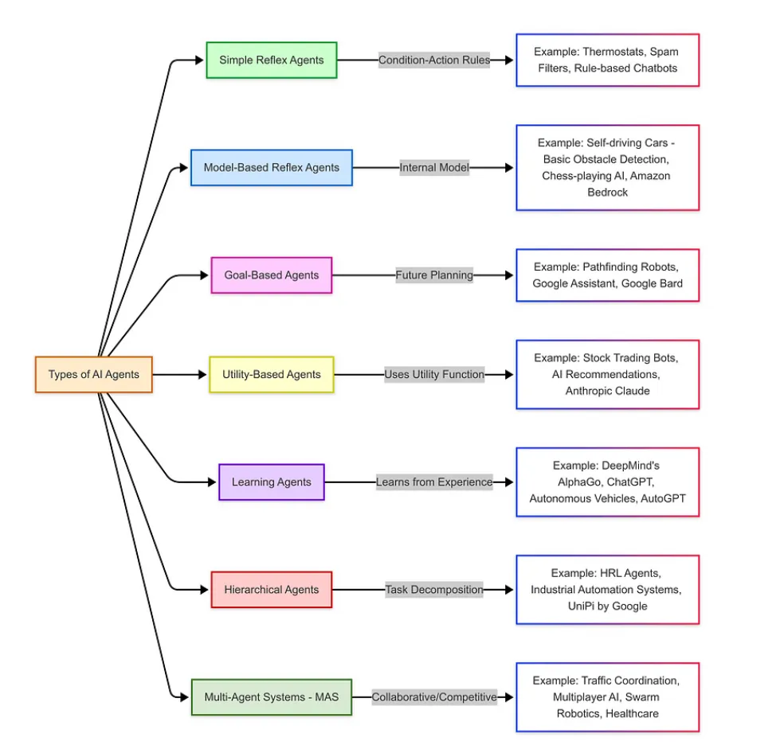
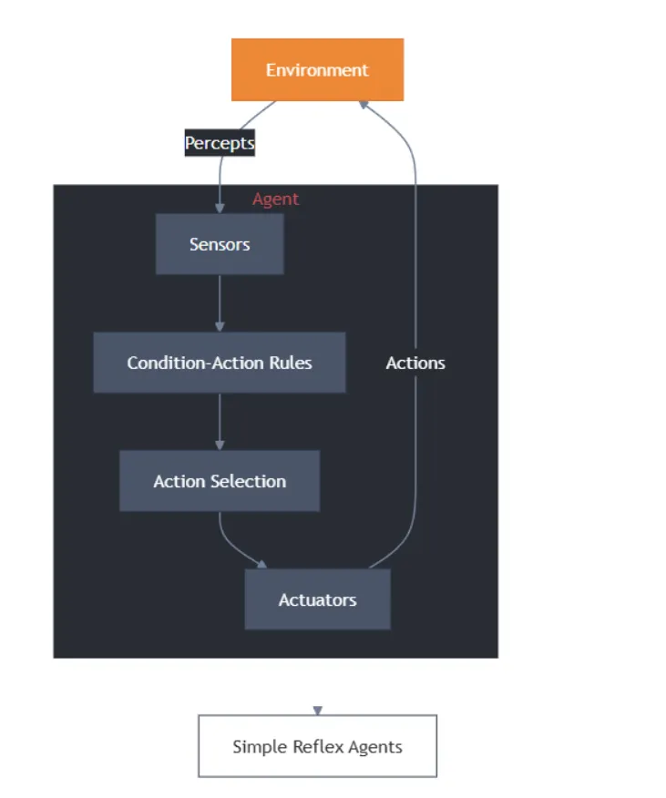
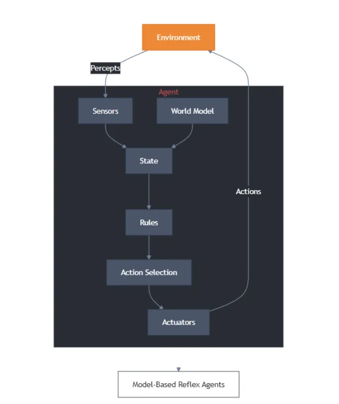

# 4 AI Agents入门教程之不同类型的智能体

## 1 Types of AI Agents

人工智能中的智能体可根据其行为对智能水平与能力表现的影响划分为不同类型，例如：**简单反射型智能体、基于模型的智能体、目标导向型智能体、效用驱动型智能体、学习型智能体、分层智能体以及多智能体系统**。



## 2 简单反射型智能体

简单反射型智能体（simple reflex agents） **仅在特定动作或条件触发时运作**。

**这类AI智能体完全依赖预设规则集进行响应，在决策过程中不考虑历史经验，因此仅适用于执行无需战略思维的简单任务。**




样例实现：

```
class SimpleReflexVacuumAgent:  
    def __init__(self):  
        self.location = "A"  
        self.actions = []  
    def perceive_and_act(self, current_location, is_dirty):  
        if is_dirty:  
            self.actions.append("Suck")  
            print(f"Cleaned {current_location}")  
        else:  
            if current_location == "A":  
                self.actions.append("MoveRight")  
                self.location = "B"  
            else:  
                self.actions.append("MoveLeft")  
                self.location = "A"  
            print(f"Moved to {self.location}")  
# Execution  
agent = SimpleReflexVacuumAgent()  
percepts = [("A", True), ("A", False), ("B", True), ("B", False)]  
for loc, dirt in percepts:  
    agent.perceive_and_act(loc, dirt)
```

上述代码构建了直接刺激-响应机制，通过环境感知数据（如房间状态监测）触发预定义的清洁行为。

运作原理：**简单反射型智能体基于条件-动作规则运作，即仅针对当前输入（感知信号）做出直接反应，不依赖历史经验**。

此类智能体适用于以下环境：

- 完全可观测性：智能体能实时获取全部环境状态参数。
- 确定性规则：环境反馈与动作结果存在明确因果关系。

这类智能体是基于规则的简单任务的理想选择，在这些任务中，决策不需要历史数据。一些常见的应用场景包括：

- **自动化客服支持**：基于规则的聊天机器人通过检测"密码重置"等关键词触发预定义流程。

- **数字温控系统**：当温度传感器检测数值低于预设阈值时，直接激活加热装置。

- **工业自动化控制**：无需复杂处理即可对直接输入做出响应的基本物联网设备。


优点总结：易于设计和实施，只需极少的计算资源。对环境变化的实时响应。在传感器输入准确、规则设计合理的情况下，可靠性极高。无需大量训练或复杂的硬件。

**局限性：场景依赖性，无法处理规则库外的异常状态。需预设完备的输入-输出映射表。**

## 4 基于模型的智能体

基于模型的反射型智能体（ model-based agents ）**通过构建环境内部状态模型，在简单反射架构基础上实现认知升级，能够应对部分可观测性挑战。此类智能体依据当前感知输入与表征不可观测环境的内部状态进行决策，其核心优势在于建立动态更新机制：**

- 环境自主演化机制：**理解环境自身变化规律**
- 行为作用反馈机制：**量化智能体动作对环境的影响**



样例实现：

```
class ModelBasedVacuumAgent:  
    def __init__(self):  
        self.model = {"A": "Unknown", "B": "Unknown"}  
        self.location = "A"  
    def update_model(self, loc, status):  
        self.model[loc] = "Clean" if status else "Dirty"  
    def decide_action(self, current_loc, is_dirty):  
        self.update_model(current_loc, is_dirty)  
        if is_dirty:  
            return "Suck"  
        elif self.model["A"] == "Clean" and self.model["B"] == "Clean":  
            return "Shutdown"  
        else:  
            return "MoveRight" if current_loc == "A" else "MoveLeft"  
# Usage  
agent = ModelBasedVacuumAgent()  
print(agent.decide_action("A", True))  # Output: Suck
```

通过维护对世界模型及资源状态的认知，智能体能够在传感器性能有限的情况下做出明智决策。

**基于模型的反射型智能体遵循“条件-动作”规则来决定特定情境下的行动，但与简单反射型智能体不同，它还会通过内部状态来追踪环境变化并优化决策过程。**

这使得智能体即便处于部分可观察的环境中，仍能有效运作。

基于模型的反射型智能体通过包含四个关键阶段的结构化流程运作：

- 感知：智能体通过传感器获取当前环境状态
- 建模：根据感知信息构建对世界理解的内部模型
- 推理：结合内部模型，运用预定义规则或启发式方法评估最优行动
- 执行：实施选定的动作

这种流程设计使智能体能系统化地应对环境变化，既保持反应速度又具备环境建模能力，有效弥补了简单反射型智能体在状态持续性处理上的缺陷。

**基于模型的反射代理广泛应用于各行各业，尤其是需要动态适应和实时决策的系统：智能库存管理以及金融交易系统。**

局限性：

- 计算资源消耗：模型构建与维护可能产生高昂的计算成本。
- 环境建模局限：模型可能无法准确反映真实环境的复杂性。
- 预测能力缺口：无法覆盖所有可能出现的潜在情境。
- 动态维护需求：需要持续更新机制以保证模型有效性。