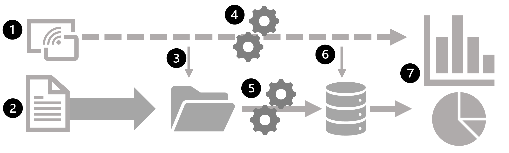

# 4 AI Agents入门教程之不同类型的智能体

## 1 Types of AI Agents

人工智能中的智能体可根据其行为对智能水平与能力表现的影响划分为不同类型，例如：**简单反射型智能体、基于模型的智能体、目标导向型智能体、效用驱动型智能体、学习型智能体、分层智能体以及多智能体系统**。


## 2 简单反射型智能体

简单反射型智能体（simple reflex agents） **仅在特定动作或条件触发时运作**。

**这类AI智能体完全依赖预设规则集进行响应，在决策过程中不考虑历史经验，因此仅适用于执行无需战略思维的简单任务。**


样例实现：

```
class SimpleReflexVacuumAgent:  
    def __init__(self):  
        self.location = "A"  
        self.actions = []  
    def perceive_and_act(self, current_location, is_dirty):  
        if is_dirty:  
            self.actions.append("Suck")  
            print(f"Cleaned {current_location}")  
        else:  
            if current_location == "A":  
                self.actions.append("MoveRight")  
                self.location = "B"  
            else:  
                self.actions.append("MoveLeft")  
                self.location = "A"  
            print(f"Moved to {self.location}")  
# Execution  
agent = SimpleReflexVacuumAgent()  
percepts = [("A", True), ("A", False), ("B", True), ("B", False)]  
for loc, dirt in percepts:  
    agent.perceive_and_act(loc, dirt)
```

上述代码构建了直接刺激-响应机制，通过环境感知数据（如房间状态监测）触发预定义的清洁行为。

运作原理：**简单反射型智能体基于条件-动作规则运作，即仅针对当前输入（感知信号）做出直接反应，不依赖历史经验**。

此类智能体适用于以下环境：

- 完全可观测性：智能体能实时获取全部环境状态参数。
- 确定性规则：环境反馈与动作结果存在明确因果关系。

这类智能体是基于规则的简单任务的理想选择，在这些任务中，决策不需要历史数据。一些常见的应用场景包括：

- **自动化客服支持**：基于规则的聊天机器人通过检测"密码重置"等关键词触发预定义流程。

- **数字温控系统**：当温度传感器检测数值低于预设阈值时，直接激活加热装置。

- **工业自动化控制**：无需复杂处理即可对直接输入做出响应的基本物联网设备。


优点总结：易于设计和实施，只需极少的计算资源。对环境变化的实时响应。在传感器输入准确、规则设计合理的情况下，可靠性极高。无需大量训练或复杂的硬件。

**局限性：场景依赖性，无法处理规则库外的异常状态。需预设完备的输入-输出映射表。**

## 4 基于模型的智能体

基于模型的反射型智能体（ model-based agents ）**通过构建环境内部状态模型，在简单反射架构基础上实现认知升级，能够应对部分可观测性挑战。此类智能体依据当前感知输入与表征不可观测环境的内部状态进行决策，其核心优势在于建立动态更新机制：**

- 环境自主演化机制：**理解环境自身变化规律**
- 行为作用反馈机制：**量化智能体动作对环境的影响**


样例实现：

```
class ModelBasedVacuumAgent:  
    def __init__(self):  
        self.model = {"A": "Unknown", "B": "Unknown"}  
        self.location = "A"  
    def update_model(self, loc, status):  
        self.model[loc] = "Clean" if status else "Dirty"  
    def decide_action(self, current_loc, is_dirty):  
        self.update_model(current_loc, is_dirty)  
        if is_dirty:  
            return "Suck"  
        elif self.model["A"] == "Clean" and self.model["B"] == "Clean":  
            return "Shutdown"  
        else:  
            return "MoveRight" if current_loc == "A" else "MoveLeft"  
# Usage  
agent = ModelBasedVacuumAgent()  
print(agent.decide_action("A", True))  # Output: Suck
```

通过维护对世界模型及资源状态的认知，智能体能够在传感器性能有限的情况下做出明智决策。

**基于模型的反射型智能体遵循“条件-动作”规则来决定特定情境下的行动，但与简单反射型智能体不同，它还会通过内部状态来追踪环境变化并优化决策过程。**

这使得智能体即便处于部分可观察的环境中，仍能有效运作。

基于模型的反射型智能体通过包含四个关键阶段的结构化流程运作：

- 感知：智能体通过传感器获取当前环境状态
- 建模：根据感知信息构建对世界理解的内部模型
- 推理：结合内部模型，运用预定义规则或启发式方法评估最优行动
- 执行：实施选定的动作

这种流程设计使智能体能系统化地应对环境变化，既保持反应速度又具备环境建模能力，有效弥补了简单反射型智能体在状态持续性处理上的缺陷。

**基于模型的反射代理广泛应用于各行各业，尤其是需要动态适应和实时决策的系统：智能库存管理以及金融交易系统。**

局限性：

- 计算资源消耗：模型构建与维护可能产生高昂的计算成本。
- 环境建模局限：模型可能无法准确反映真实环境的复杂性。
- 预测能力缺口：无法覆盖所有可能出现的潜在情境。
- 动态维护需求：需要持续更新机制以保证模型有效性。

## 5 目标导向型智能体

目标导向型智能体（Goal-based agents）是基于人工智能的系统，利用环境信息来实现特定目标。**与简单反射型或基于模型的智能体不同，这类智能体通过确定实现预期结果所需的最佳决策和行动序列来运作**。

目标导向型智能体通过搜索算法与启发式策略寻找达成目标的最优路径。凭借其结构化决策机制，这类系统尤其适用于需要战略规划与动态调整的复杂任务场景。


样例实现：

* **目标驱动行为**：目标导向型智能体运用搜索与规划算法，通过最大化目标达成度选择最优行动策略。其核心机制在于构建价值函数模型，评估每个动作对目标状态的预期效用增量。

* **目标追踪机制**：智能体通过状态空间建模，实时计算当前环境状态与目标状态的测地距离，采用动态规划方法选择能最小化该距离的动作序列。在复杂场景中，常融合图遍历算法与强化学习框架，构建概率化的状态转移模型。


```
class GoalBasedAgent:  
    def __init__(self, target):  
        self.goal = target  
        self.actions = []  
    def path_planning(self, current_state):  
        # Simplified A* pathfinding logic  
        if current_state == self.goal:  
            return "Goal achieved"  
        return "Move closer" if current_state < self.goal else "Adjust path"  
agent = GoalBasedAgent(100)  
print(agent.path_planning(75))  # Output: Move closer
```

目标导向型智能体在需要结构化规划与动态适应的任务中表现卓越，其核心应用场景包括：

**自动驾驶系统**：人工智能驱动的汽车在动态适应障碍物的同时，为安全到达目的地自主导航。

**机器人**：基于目标的机器人可以执行复杂的任务，如仓库自动化、太空探索和工业操作。

**计算机视觉与 NLP**：人工智能模型分析图像、视频和文本，以提取有意义的见解并做出相应的反应。

**优点总结：**

- 易于实现和理解。
- 高效实现特定目标。
- 根据目标完成情况轻松评估性能。
- 它可以与其他人工智能技术相结合，创建更先进的智能体。
- 它可用于各种应用，如机器人、游戏AI和自动驾驶系统

**局限性：**

- 目标固化约束
- 环境动态适应性局限
- 对变量过多的复杂任务无效
- 需要大量领域知识来确定目标

## 6 效用驱动型智能体


**基于效用的智能体（Utility-based agents） 是由人工智能驱动的决策系统，其通过效用函数（一种衡量结果有利程度的指标）来选择行动。**

与基于规则或基于目标的智能体不同，这类智能体会评估多种可能的行动，并选择预期效用最高的方案，从而确保决策更加灵活且具备更强的适应性。

在复杂和不确定的环境中，它们尤其有用，因为在这种环境中，需要对多个选项进行比较，并且必须动态地做出最佳选择。


样例实现：

- 定量决策：这类智能体通过效用函数评估行动结果，其优化方向是追求最大期望值，而非简单的二元目标达成。
- 优化逻辑：效用函数将多种因素整合为单一指标，实现性质不同结果间的可比性。

```
def utility_function(cost, time, risk):  
    return (0.5 * (1/cost)) + (0.3 * (1/time)) - (0.2 * risk)  
actions = [  
    {"cost": 200, "time": 5, "risk": 0.1},  
    {"cost": 300, "time": 3, "risk": 0.2}  
]  
best_action = max(actions, key=lambda x: utility_function(x['cost'], x['time'], x['risk']))  
print(f"Optimal action: {best_action}")
```

确定最佳行动方案时，基于效用的智能体会遵循以下结构化流程：

- 环境建模：智能体构建对周围环境的表征（从简单到高度复杂的场景均可覆盖）。
- 效用评估：基于概率分布与预定义的效用函数，计算每个可能结果的预期效用
- 决策执行：选择预期效用最高的行动，以最大化成功率。
- 持续优化：流程在每次决策节点重复执行，使智能体能动态调整以适应变化的场景。

基于效用的智能体广泛应用于以优化为重点的应用中，包括

- 资源分配：选择最有效的方式分配计算能力、带宽或资金。
- 调度与规划：根据约束条件选择最佳的任务时间安排。
- 推荐系统：通过平衡预算和旅行时间推荐最佳机票。
- 游戏AI：在基于策略的视频游戏和模拟中做出决策。

**优点总结：**

- 应对不确定性：能够在动态且不可预测的环境中做出最优决策。
- 比较性决策：评估多种选择并挑选出最佳行动方案。
- 灵活与适应性强：根据变化的输入和结果调整策略。

**局限性：**

- 需要构建精确的环境模型，否则可能导致决策失误。
- 计算成本高昂，需进行大量运算。
- 对人类而言，难以理解和验证


## 7 学习型智能体

AI学习型智能体（AI learning agent）是一种能够从过去的经验中学习并随时间推移提高其性能的智能体。

**与基于规则的系统不同，这些智能体从基本知识出发，通过机器学习技术自动调整适应。通过持续分析反馈和交互，学习型智能体会改进自身行为，使其非常适合动态和不断变化的环境。**

学习型智能体包含四个主要组成部分：

- 学习组件：负责从环境经验中学习并做出改进。
- 评判器：评估智能体的表现并提供改进反馈。
- 执行组件：根据学习组件和评判器的分析结果执行外部动作。
- 问题生成器：提出新动作以产生有信息量的经验，从而增强学习效果



样例实现：

- 自适应智能系统：学习代理通过经验提升性能，通常采用强化学习框架。
- 学习机制：Q表根据所获奖励进行更新，逐步优化动作选择

```
import numpy as np  
class QLearningAgent:  
    def __init__(self, states, actions, alpha=0.1, gamma=0.9):  
        self.q_table = np.zeros((states, actions))  
        self.alpha = alpha  
        self.gamma = gamma  
    def learn(self, state, action, reward, next_state):  
        max_future_q = np.max(self.q_table[next_state])  
        current_q = self.q_table[state, action]  
        new_q = (1 - self.alpha) * current_q + self.alpha * (reward + self.gamma * max_future_q)  
        self.q_table[state, action] = new_q  
# Initialize agent with 5 states and 4 actions  
agent = QLearningAgent(5, 4)  
agent.learn(1, 2, 10, 3)
```

AI学习型智能体的持续反馈循环：学习型智能体通过观察、学习与适应的闭环机制实现自主优化：

- 观察：智能体通过传感器或输入源从环境中收集数据。
- 学习：利用算法和统计模型分析数据，识别模式并完善知识体系。
- 行动：基于学习成果，智能体在环境中做出决策并执行动作。
- 反馈：接收奖励、惩罚或环境信号以评估其表现。
- 适应：根据反馈更新其知识库和决策流程，持续改进性能。

这一循环不断重复，使代理能够优化决策能力，并动态适应环境变化。

学习型智能体的应用场景：在需要持续改进与个性化能力的领域中，学习型智能体展现出独特优势。比如电商个性化推荐：AI驱动的推荐系统通过分析用户行为数据，持续优化定向广告投放策略。

优点总结：

- AI代理能够基于决策将想法转化为行动。
- 学习型智能代理可响应基础指令（如语音指令）执行任务。
- 与传统代理仅执行预定义操作不同，学习型代理具备随时间自主进化的能力。

局限性：

- 决策容易出现偏差或错误。
- 开发和维护成本高。
- 需要大量计算资源。
- 缺乏类似人类的直觉和创造力。


## 8 层级化智能体

**层级化智能体：指采用层级架构的AI系统，高层级智能体负责协调低层级智能体工作。**

架构特性：该架构通过任务分层机制，将复杂目标拆解为可执行的子任务，实现高效的任务管理。系统层级数量根据业务复杂度动态调整

应用场景：此类智能体广泛应用于需要多任务协调与优先级管理的领域，如机器人控制、智能制造和智能交通系统等。


样例实现：

- 分层架构：分层代理采用多抽象层次，高层处理战略决策，底层管理战术执行。
- 委托逻辑：管理者代理协调子系统协作，体现分布式责任架构。

```
class SupervisorAgent:  
    def __init__(self):  
        self.subagents = {  
            "security": SecurityAgent(),  
            "climate": ClimateAgent()  
        }  
    def coordinate(self, sensor_data):  
        if sensor_data["intruder"]:  
            self.subagents["security"].activate()  
        else:  
            self.subagents["climate"].adjust(sensor_data["temp"])  
class SecurityAgent:  
    def activate(self):  
        print("Security protocols engaged")  
class ClimateAgent:  
    def adjust(self, temp):  
        action = "Cool" if temp > 72 else "Heat"  
        print(f"Climate system: {action} activated")  
# System execution  
smart_home = SupervisorAgent()  
smart_home.coordinate({"intruder": True, "temp": 68})
```


层级化智能体的运作原理：其运作模式类比企业组织的层级化管理架构，通过多级分工实现任务高效流转。

- 战略决策层（高层代理）：制定全局性目标，规划实施路径，将任务拆解为具体子目标。
- 协同管理层（中层代理，若存在）：担任跨层级协调中枢，确保任务分派效率，监控战略与执行的匹配度。
- 执行层（基层代理）：负责子任务的具体实施，实时采集执行数据，向高层级代理反馈执行进度。


这种结构化方法可确保在复杂环境中高效执行、资源优化和可扩展性。层级化智能体是需要结构化任务执行的大型企业和公司的理想选择。


一些主要应用包括：

**典型应用场景：**

- 工业自动化：管理多工序制造流程的智能协调。
- 自主机器人：协调高层级导航规划与底层级电机控制。
- 交通系统：优化城市交通管控与物流调度网络。

**优点总结：**

- 可扩展任务管理：支持在大规模系统中处理多个相互依存任务
- 效率提升：通过任务分解机制将复杂问题拆解为可执行单元，提升系统执行效能
- 动态适应性：基于分层架构实现任务优先级动态调整与跨层级协同优化。

局限性：

- 架构复杂性：层级化的问题解决方式可能引发系统设计复杂度提升
- 环境适应性缺陷：固定层级结构在动态或不确定环境中存在适应性不足，代理系统难以自主调整决策路径或探索替代方案
- 控制流效率问题：自上而下的控制机制可能导致执行瓶颈与响应延迟。即使底层任务准备就绪，仍需等待高层级指令。

## 9 多智能体系统

**多智能体系统（MAS）的本质解析：MAS并非独立的新型AI代理类别，而是由多个智能体构成的协同网络**


**其核心特征包括：**

- 异构兼容性：可整合反射型代理、目标驱动型代理等任意类型智能体，形成协同运作的整体

- 分布式自主性：每个智能体拥有独立的目标与能力（与层级代理的集中控制模式形成对比），通过协作博弈机制实现群体目标或优化个体收益

- 涌现智能：个体间的动态交互产生超越单智能体能力的全局行为模式

**与层级代理的核心差异：**

- MAS无固定控制层级，智能体通过协商机制自主协调。

- 支持目标冲突场景下的分布式决策优化。

优点总结：

- 可扩展，适用于复杂的大规模应用。
- 提供冗余和稳健性，因为即使一个智能体出现故障，任务也能继续进行。

局限性：

智能体之间的协调可能很复杂。

## 10 跨行业的变革型应用

现在，我们对不同类型的人工智能代理有了更好的了解：


接着让我们来看看企业如何通过在各行各业整合此类自主代理来充分发挥其潜力。下表按行业分列了人工智能代理的使用案例，它们改变了企业运作和服务客户的方式。

