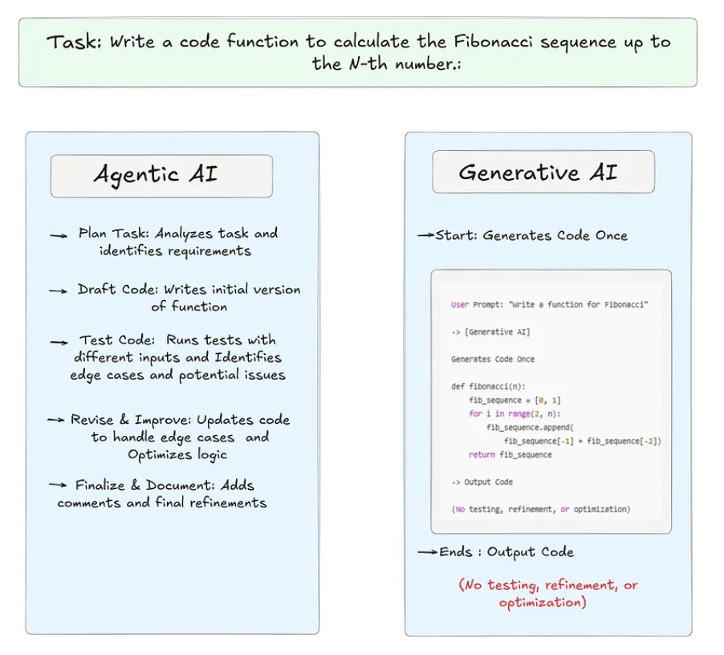
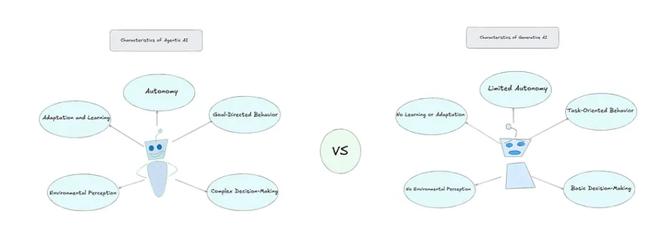
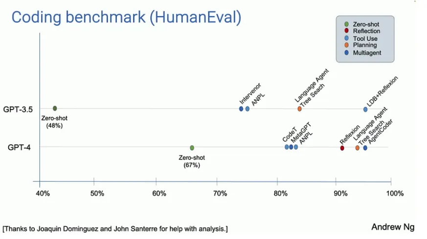

# 7 Agentic AI vs Generative AI: 区别与对比

## 什么是Generative AI?

生成式人工智能（Generative AI）是一类专注于创造新内容的人工智能技术，例如生成文本、图像、音乐甚至视频。**其工作原理是通过分析大量数据进行学习，从中理解模式、风格或结构，并基于所学知识生成原创内容。**

例如，像ChatGPT这样的生成式AI可以针对问题生成独特的文本回复，而DALL-E等图像生成模型则能根据文字描述创作图像。本质上，生成式人工智能如同数字艺术家或作家，通过学习产出具有创造性的作品。

上图中展示的代理型人工智能（Agentic AI）通过包含"思考"和"修订"阶段的迭代式、循环式工作流程运作。

**这种自适应过程包含持续的自我评估与改进，使代理型人工智能能够产出更高质量、经过优化的结果。通过多步骤的测试与优化，代理型人工智能可独立运行，从每个阶段中学习，并完成需要持续评估与调整的任务**。

此外上图中所示的生成式人工智能（Generative AI）遵循一种简单的单步骤工作流程：直接从"开始"一步到位直达"完成"阶段。这意味着AI会立即生成响应，但不会对输出内容进行二次验证或优化。

**这种线性流程仅产生符合初始指令的基础结果，既不涵盖边缘情况，也不涉及迭代测试，从而凸显了生成式人工智能在处理更复杂或需自适应任务时的局限性。**

## 对比

本部分将探讨代理型人工智能（Agentic AI）与生成式人工智能（GenAI）的独特特征，通过对比二者在智能性、自主性及决策机制三个维度的差异化实现路径展开重点分析。

### Agentic AI

- 自主性：代理型人工智能能够在无需人类持续输入的情况下独立行动。它能自主决策并执行任务，例如可以将其想象为一种无需人类操控独立运作的机器人，能根据环境变化自主决定下一步行动。
- 目标导向行为：代理型人工智能以明确目标为驱动，其行动并非随机响应外界，而是主动围绕特定目标展开。例如，自动驾驶汽车的核心目标是安全抵达目的地，从转向到刹车的每个操作都服务于这一目标。
- 适应与学习能力：代理型人工智能能从自身行动与经验中持续学习。当遇到问题或失败时，它会动态调整策略。例如，一个电影推荐AI会通过分析用户偏好不断优化推荐算法，随时间推移提供更精准的观影建议。
- 复杂决策能力：代理型人工智能的决策机制并不局限于简单选项筛选，而是通过评估多种可能性并深度权衡结果来实现。例如，控制股票交易算法的AI会分析海量历史与实时数据，预测市场趋势，并基于多维信息综合判断买入或卖出决策。
- 环境感知能力：为实现智能化决策，代理型人工智能需具备环境理解能力。这种能力通过传感器或数据输入实现，例如机器人通过摄像头识别障碍物并自主规划绕行路径，从而在动态环境中安全移动。

### Gen AI

- 有限自主性：生成式人工智能具有有限的自主性。它不会自主行动，需要人类输入才能生成响应。它会对接收到的输入进行处理，并根据学习到的模式生成输出，但无法在没有外部提示的情况下主动发起行为或独立运行。
- 任务导向行为：生成式人工智能具有任务导向性，但仅限于被动响应层面。它通过生成文本或图像等相关内容来响应具体的提示或任务，但不会主动追求长期目标或具有总体性目的。每项任务的完成都基于即时输入。
- 基础决策能力：生成式人工智能具备基础决策能力。它会根据学习到的模式选择输出内容，但不会评估多种替代方案或考虑后果。例如，在生成文本时，它会基于训练数据选择最可能出现的下一个词或短语，但无法做出复杂、多层次的决策。
- 无实时学习或适应能力：生成式人工智能不具备实时学习或适应能力。一旦完成训练，它便会基于训练期间学习到的模式运行，但不会通过新的交互改变或提升其性能，除非使用更新的数据重新训练。
- 无环境感知能力：生成式人工智能缺乏环境感知能力。它处理数据（如文本、图像），但无法感知或解读物理环境。它无法理解周围环境，仅对接收到的输入做出反应，不具备任何外部意识。

## Agentic Workflow

尽管生成式人工智能与代理式人工智能在理论上的区别清晰可见，但代理式AI的真正潜力只有在实际应用中才能充分展现。为说明其实际价值，我们通过一个案例研究，展示代理式AI如何在现实场景中超越传统的大语言模型（LLM）。

Andrew Ng 分享了一个案例研究，强调了 Agentic Workflow 在编码任务中的威力。他的团队使用 HumanEval 编码基准测试了两种方法。任务是"给定一个整数列表，返回所有偶数位置元素之和"。在第一种方法中，即 "zero-shot prompting"，只要求人工智能直接解决问题，不需要任何额外步骤。此时，GPT-3.5 的准确率为 48%，而 GPT-4 的准确率更高，为 67%。这些结果不错，但并不出众。

然而，当团队使用代理工作流（Agentic Workflow）时，GPT-3.5 的表现甚至好于 GPT-4，因为代理工作流将任务分解成更小的步骤，如理解问题、分部分编写代码、测试和修正错误。Andrew Ng 指出，在使用代理工作流时，GPT-4 也显示出更强的效果。这表明，通过采取循序渐进的方法，人工智能模型（尤其是较老的人工智能模型）可以超越使用zero-shot prompting等传统方法的更高级模型。