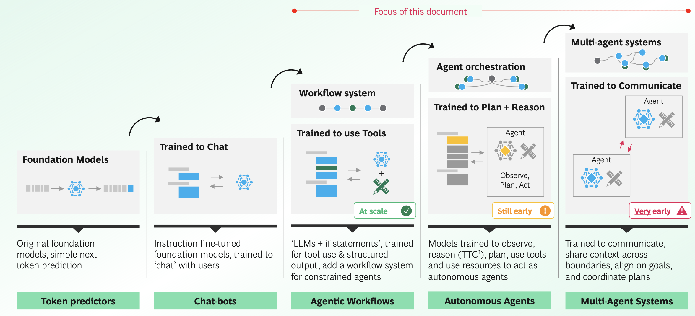
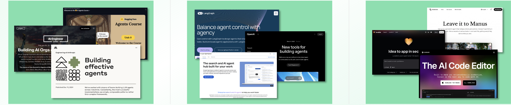
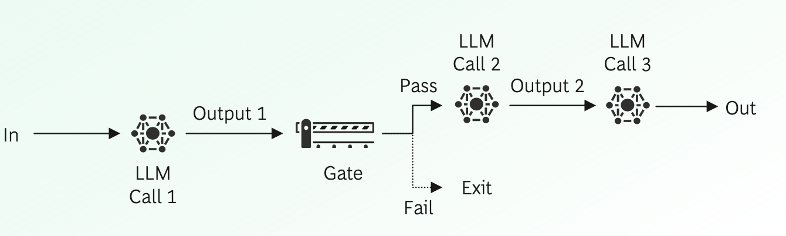
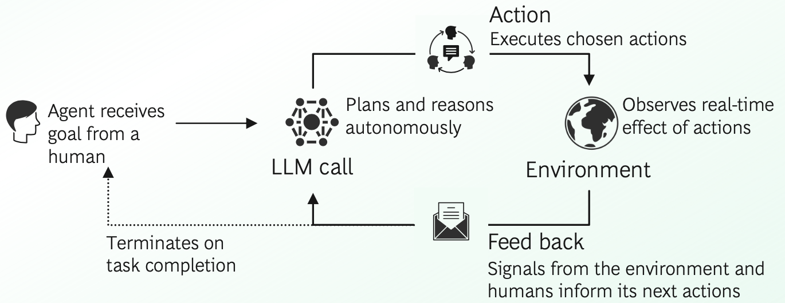
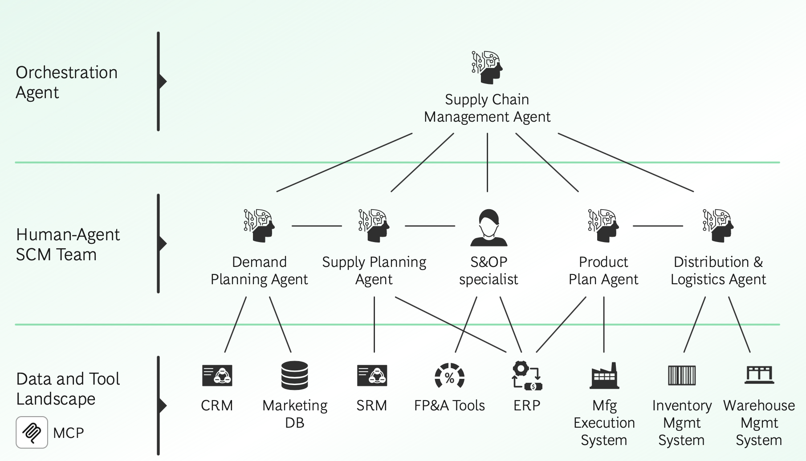
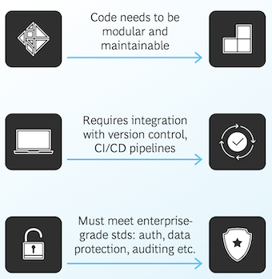
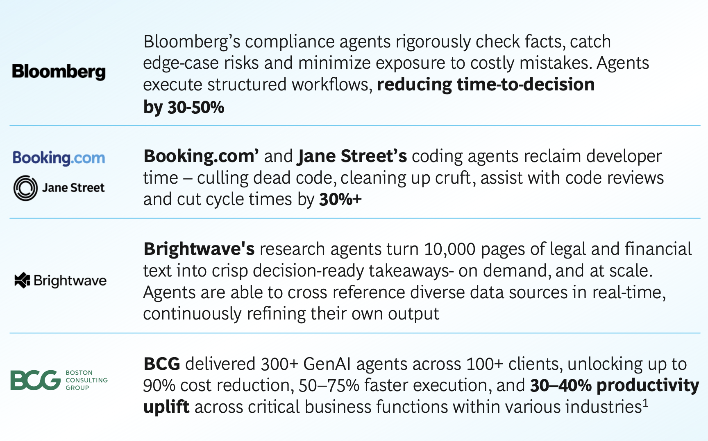

# AI Agents, and the Model Context Protocol

The open-source **Model Context Protocol (MCP)**launched by Anthropic is growing in popularity. Infour short months it has been adopted byOpenAI, Microsoft, Google, Amazon, and others marking a shift in how AI Agents observe, plan,
and act with their environments.

But how does it make AI Agents more reliable, safe and enterprise-ready? This short brief unpacks how AI Agents are evolving, MCPs role, and why it’s a meaningful step towards agentic abundance

* How are Agents evolving
* Where do they have product-market-fit?
* Can they be reliable and effective?
* MCP’s role and building at scale

### How are Agents evolving?

We are moving beyond ‘agentic if-statements’, towards autonomous agents

* Token predictors 
* Chat-bots
* Agentic Workflows
* Autonomous Agents 
* Multi-Agent Systems

### Techniques, frameworks and proof-points are maturing rapidly …

#### **As techniques are shared, community grows**

Industry-wide knowledge and training on how to build agents is growing, and being
shared, leading to fast feedback cycles. With Anthropic, Pydantic, Langchain, 

Hugging face and others publishing detailed guides and training, and AI Engineering growing as a community

#### **Agentic Frameworks lift the tide for all**

It is getting faster and easier to build, deploy, and monitor agents. Established players are evolving (e.g. OAI Assistants, Copilot, Agentspace, Bedrock agents),
new players entering the game (e.g. Cloudflare, Pydantic), and low-code platforms growing (e.g. Lindy, Dust.tt)

#### Proof-points are visible, compelling, and growing

The first commercial agents are here, and generating meaningful revenue.

From vibe-coders (v0, Cursor, Loveable, Bolt, Replit, Claude code), to consumer
agents (e.g. Operator, Manus, and the many deep research’s), to vertical B2B players (e.g. Intercom)

### This maturity is driving a shift from predefined workflows to self-directed agents

#### Agentic Workflows

A common type of workflow, **prompt chaining **involves decomposing a task into a sequence of steps, where each LLM call processes the output of the previous one

* Are helpful when process consistency matters
* Good for problems where domain intelligence is valuable
* Are more predictable, but less adaptable to new inputs

#### Autonomous Agents

A common type of agent, involves **autonomous reasoning**, acting, and learning from feedback, where each LLM call is informed by real-time signals from its environment and previous actions

* Are helpful when process flexibility matters
* Good for problems where general intelligence is valuable
* Are less predictable, but can adapt to user needs

### Are we headed for a multi-agent future?

Agents can work together in networks and with humans to accomplish complex tasks or automate multi-step processes

**EXAMPLE**

Advanced E2E Supply Chain Management

A human-agent team that coordinates input from multiple agents to manage the supply chain process end-to-end. MCP helps expose data and tools

> Avoid ‘microservices’ thinking, focus on collaboration and networks

## 2 Where do they have product-market-fit?

### Coding agents among the first to reach product-market-fit

Vibe-coding players are moving fast and capturing the software development market, accelerating software time to market

**To move from prototyping to production, vibe coding must mature**

### Organizations are already gaining significant value from agentic workflows

**Future outlook**

Only as **reasoning and evaluation **systems mature, will fully autonomous agents be able to handle complex, open-ended tasks

**Assistive agents** will thrive in high-risk domains, blending agent support with human judgement

**Rule-based agents** will remain as reliable guardrails, anchoring dynamic systems with predictability

**Adaptive agents** will lead enterprise adoption, balancing automation with real-time feedback and control