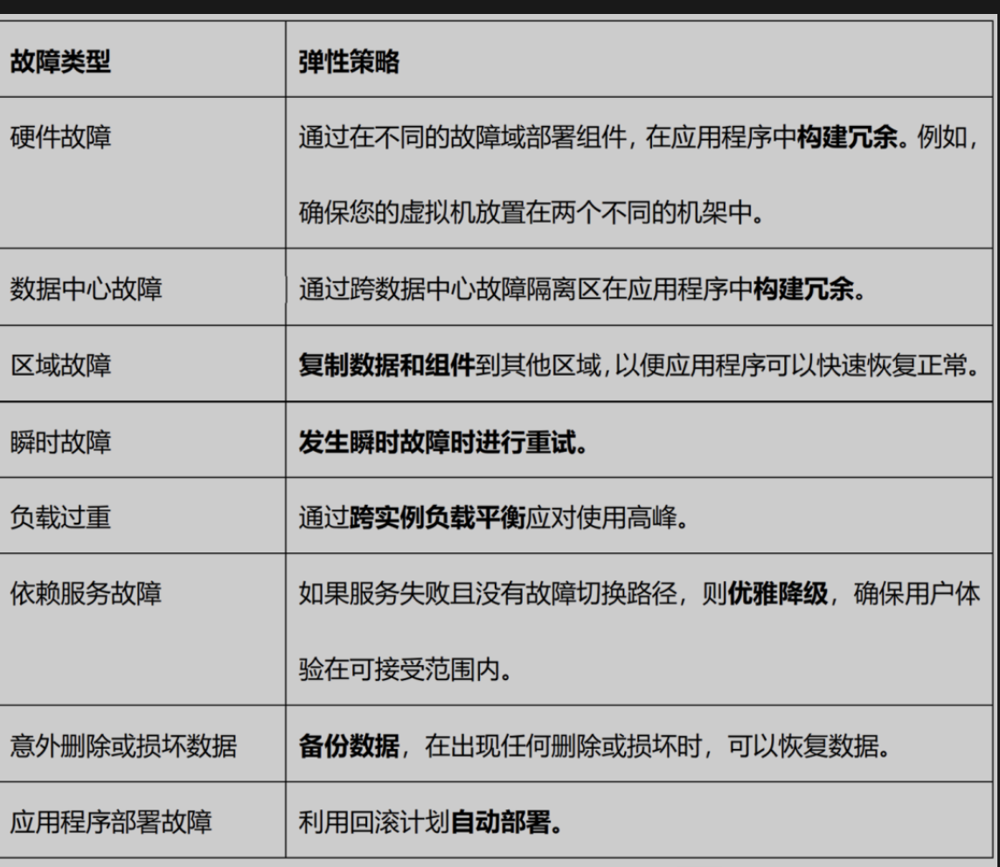

# 8 爆火的Model Context Protocol是什么？

随着我们深入人工智能体时代，AI代理能够自主采取行动、与工具交互并获取数据，人们逐渐意识到：**大型语言模型（LLMs）虽然强大，但它们并非孤立存在。它们需要访问外部知识、工具和系统API才能真正发挥作用**。

但问题在于——将数据和工具提供给LLMs比看起来要困难得多。这就是Model Context Protocol（模型上下文协议,MCP）发挥作用的地方，也是它为何如此受关注的原因。让我用简单的语言来解释一下。

## 1 LLM存在的问题

想象一下，你向一个强大的大语言模型提问：“苹果公司的最新股价是多少？”或者“你能帮我预订下周的航班吗？” LLM可以理解上述问题，但它无法获取实时股价或预订航班，除非它连接到外部系统。

到目前为止，为了弥补这一差距，开发者主要依赖以下方法：

- **定制化集成（编写访问数据库的函数、APIs或Tools）**
- **RAG（检索增强生成）模型，用于引入外部知识**。
- **用特定数据微调模型（成本高昂且通常是静态的）**。

但这些方法零散、维护复杂且难以扩展

## 什么是MCP?

过去，每个家庭、工厂和企业都需要通过定制化解决方案：燃煤、水轮机、燃气发电机等来自行发电。这种方式成本高昂、效率低下且维护困难。

**直到电网的出现：这套通用基础设施让任何人都能轻松接入电力网络。无需自建发电设施——即插即用。MCP为AI智能体提供了完全相同的运作范式**

简单来说，**模型上下文协议（Model Context Protocol，简称MCP）是一项开放标准**，**旨在将AI助手与真实存储数据的各类系统相连接——从内容仓库、商业工具到开发环境。本质上，MCP在大型语言模型（LLM）应用与外部数据/功能之间建立了一个通用接口**。

Anthropic（开发Claude AI助手的团队）于2024年末推出MCP，旨在解决AI领域日益严峻的系统集成难题。开发者无需为每个数据库、API或知识库单独开发一次性插件或定制连接器，而是可以采用MCP作为通用协议——任何AI应用（客户端）与数据源（服务端）都能理解这套标准。这从根本上简化了AI系统获取上下文（相关信息）并代表用户执行操作的技术路径。

## MCP为什么重要？

MCP的重要性可以总结如下：

* ***标准化AI互接**

MCP并没有让每个项目重复造轮子，而是提供了一种通用协议，将LLM连接到数据库、网络服务等工具。

带来的好处：开发速度更快，漏洞更少，开发者可以更专注于业务逻辑，而不是底层对接问题。

* ***激活AI代理的自主性**

当前多数AI系统仅能被动响应用户请求，却无法代替人类采取行动——除非经过深度定制开发。MCP赋予AI代理能够动态调用现实世界的工具进行交互。

设想这样一个AI助理：它能借助MCP协议自主完成日程查询、邮件发送、报表生成等任务，真正成为用户的数字分身。

* ***终结繁琐的定制集成**

任何尝试过"将LLM接入X系统"的开发者都深谙其痛——过程复杂脆弱。MCP彻底终结了这种重复劳动，开发人员无需每次都重新定制解决方案。

通过建立可复用的模块化组件库（想象AI工具领域的乐高积木），开发者只需按需组合即可完成系统对接，大幅提升开发效率与系统健壮性。

* ***安全且可控的访问**

MCP并非毫无限制地开放所有权限，而是以安全为核心——提供细粒度的权限控制，以决定AI代理可以访问哪些数据和工具。这一点对于AI处理敏感业务逻辑和私有数据场景至关重要。

* **开源社区驱动**

作为开源项目，MCP 促进了创新与协作。开发者可以贡献新的连接器，改进现有的连接器，并根据新兴需求调整 MCP，从而创建一个共享的工具生态系统

## MCP的意义

我们正迈向一个未来，在这个未来中，AI代理不仅仅是聊天——它们将思考、行动并解决问题。但为了实现这一点，它们需要：

- 上下文：来自外部系统的最新信息。
- 工具：采取行动的能力（例如，预订会议、分析数据）。
- 安全性：受控的访问权限，确保信任与安全。
