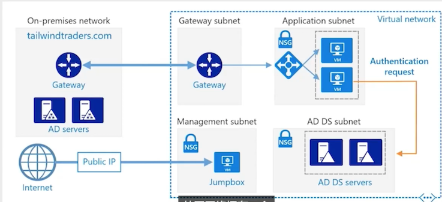
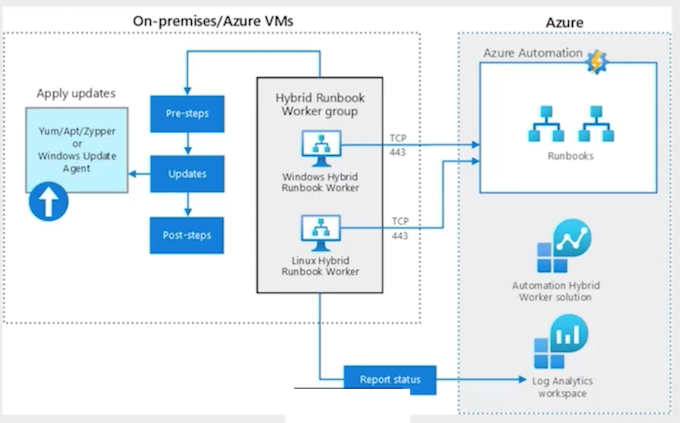
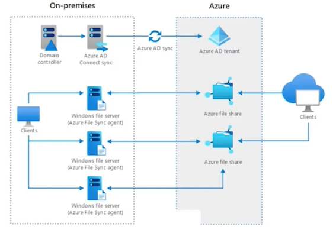
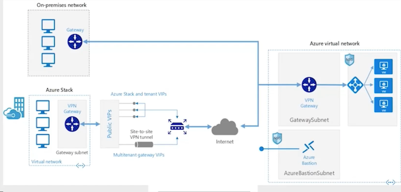
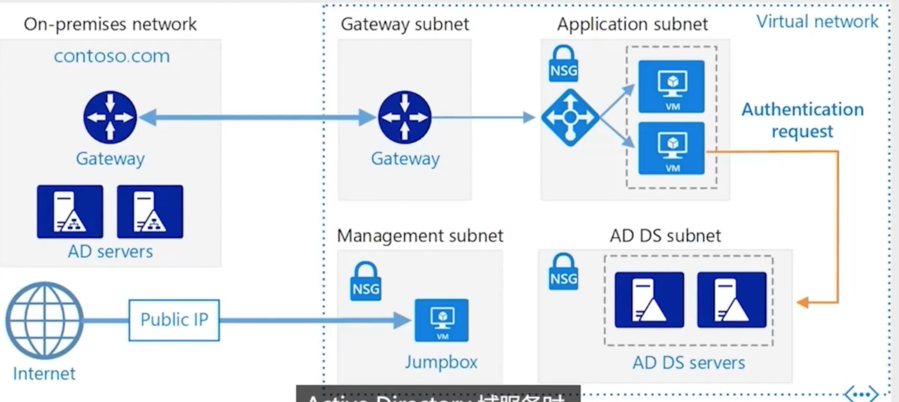
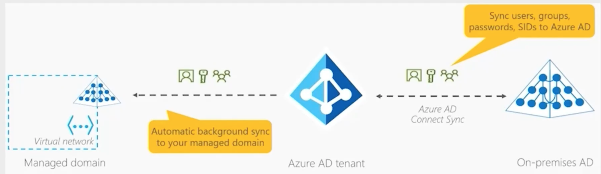

# **1 Microsoft Azure Virtual: Implementing Hybrid Infrastructure**

## **1 Overview of Hybrid Cloud**

### Tailwind Traders Hybrid Strategy

Tailwind Traders currently has a multi-national on-premises deployment with aging infrastructure that is running close to capacity.

Tailwind Traders is slowly and steadily growing. Rather than expand on-premises capacity, they wish to extend their infrastructure into 
Azure

Tailwind Traders wants to enhance their on-premises deployment with  appropriate cloud technologies

Tailwind Traders is looking to achieve optimal balance between workloads hosted on-premises and cloud

### What is Hybrid Cloud?

Hybrid cloud is a stable state **where some workloads are hosted on-premises and other workloads are hosted in the Azure cloud**

**Resources on-premises communicate securely and seamlessly with resources in the Azure cloud**

A consistent identity infrastructure is used for authentication and authorization for on-premises and cloud workloads and infrastructure

A consistent set of tools is used to manage on-premises and cloud workloads and infrastructures

**A consistent set of technologies is used to secure on-premises and cloud resources**


### Challenge:

Tailwind Traders currently has Windows Server VM workloads that are dependent on Active Directory Domain Services and custom schema extensions at a number of branch offices

These workloads are running alongside virtualized AD DS domain controllers 
on aging virtualization host hardware that is getting close to end of life

### Hybrid Solution:

Connect TWT branch offices to Azure using **VPN or ExpressRoute**

Deploy Windows Server laS VMs as domain controllers and configure as a new AD DS site in the existing domain

Migrate the Windows Server VM workloads from the aging virtualization hardware to the Azure subnets with Windows Server laaS domain controllers.

Workers in these branch offices in multiple countries still require secure access to these workloads

Migrating the workloads to the head office datacenters doesn’t make sense when the branch offices are half a world away

### Hybrid Solution:

* Connect TWT branch offices to Azure using VPN or ExpressRoute
* Deploy Windows Server IaaS VMs as domain controllers and configure as a new AD DS site in the existing domain
* Migrate the Windows Server VM workloads from the aging virtualization hardware to the Azure subnets with Windows Server IaaS domain controllers

### Example Hybrid Deployment




### Hybrid Cloud Architectures


Shows how to implement a variety of hybrid solution including:

* Managing configurations for Azure Arc enabled servers
* Azure Automation in a hybrid environment
* Using Azure file shares in a hybrid environment
* Azure Automation Update Management
* Hvbrid file services
* **Hybrid Security Monitoring using Azure Security Center and Azure Sentinel**
* Run containers in a hybrid environment
* Extend on-premises AD FS to Azure
* Manage hybrid Azure workloads using Windows Admin Center
* Implement a hub-spoke network topology
* Azure Arc hybrid management and deployment for Kubernetes clusters
* Connect an on-premises network to Azure
* Cross cloud scaling
* Integrate on-premises AD domains with Azure AD
* AD DS resource forests in Azure

### Challenge:

Tailwind Traders has branch office perimeter networks that host web applications in multiple countries that they wish to decommission

Several weeks a year during online retail campaigns, the applications are overwhelmed with traffic and fail. Tailwind Traders wants to ensure that in future this demand can be 
met

TWT want to implement OSASP filtering and DDOS protection on their web apps without having to manage complex perimeter network firewall configuration

### **Hybrid Solution:**

Tailwind Traders can decommission their branch office perimeter networks after moving all externally facing web applications hosted on these networks to Azure

Protecting web applications from attacks on the OWASP top 10 list as well as implementing DDoS protection is straightforward.

The web applications can also scale up and down as required as traffic fluctuates

### Elements of Hybrid Cloud Solution

**Management**

Use a consistent set of management tools to manage on-premises and cloud workloads

**Identity**

Use a single identity provider for authorization and authentication

**Networking**

Ensure secure and reliable communication between on-premises and cloud resources

**Security**

Ensure that a single set of tools can be used to monitor and respond to suspicious activity in on-premises and cloud assets

**Fabric**

Ensure that on-premises fabric is managed and maintained as consistently as cloud fabric

### Azure Elements of a Hybrid Cloud Solution

* **Management**

Azure Portal, Azure Arc, Azure CLI, Windows Admin Center

* **Identity**

Azure AD, Azure AD DS, Azure AD Connect

* **Security**

Azure Sentinel, Azure Security Center

* **Fabric**

Azure Stack HCI, Azure Stack Edge

### Challenge

Tailwind Traders needs to keep a large number of VMs on-premises, but has noted that maintaining the virtualization fabric that hosts those virtual machines is increasingly challenging.

Downtime occasionally occurs because the process of applying operating system updates, device driver updates, and firmware updates is a complicated task for a hyperconverged virtualization infrastructure.

### Hybrid Example:

Tailwind Traders needs to keep a large number of VMs on-premises, but has noted that maintaining the virtualization fabric that hosts those virtual machines is increasingly 
challenging

Azure Stack HCI provides TWT with an option of a fully managed virtualization infrastructure where TWT IT operations only has to worry about the virtual machine workloads and doesn’t have to worry about managing and maintaining the 
infrastructure that supports those workloads


### Evolving to a Hybrid Posture

* Hybrid cloud technologies **enhance on-premises deployments**
* Many organizations already have hybrid cloud. **They run on-premises workloads while using M365 technologies such as Exchange Online, Teams and Azure web applications**
* **Choose cloud technologies that make your organization successful whilst keeping the parts of on-premises that still do what you need**

### Hybrid Solution: Azure Automation Update Management



### **Challenge:**

In the past, Tailwind Traders spent a substantive amount of time auditing the configuration of their Windows Server and Linux workloads to determine if they had drifted from a baseline that ensured compliance with various standards such as ISO 
27001 and PCI DSS 3.2.1

### **Hybrid Solution**

**By using Azure Arc, Azure Policy, and Azure Security Center,** Tailwind Traders will be able to identify non-compliant workloads, remediate those workloads, and then verify that those workloads are now compliant with third party standards.


### Hybrid Cloud Management and Governance

**Azure Arc and Azure Policy** can be **used to ensure that hybrid workloads are configured in a specific manner**

**Role Based Access Control** can be **implemented in hybrid environments to ensure that only authorized users can perform specific administrative actions**

Tagging can be implemented so that workloads related to specific projects can be identified whether they reside on-premises or in Azure

### **Tailwind Challenge**

An ongoing challenge for Tailwind Traders is that they were constantly running out of disk space on their file servers.

This meant that every few months, an administrator would need to make an assessment of which files could be safely removed and transferred to long term storage on tape

Occasionally it also meant that administrators might have to retrieve a file from long term tape storage when it was required

**File share replication using DFS worked most of the time, but not all of the time**



### **Tailwind Hybrid Solution**

* Tailwind Traders **implemented Azure File Sync on each file server and turned on cloud tiering**.
* They configured Azure File Sync to automatically tier all files that haven't been accessed in 30 days up to an Azure File Share.
* **Tiered files appear to the user to be still present on the file share**. If a user accesses a tiered file, it is automatically replicated down to the file share and opens normally for the user
* **Additional file servers can be added to the sync group. These additional servers can host replicas of the Azure File Share**
* **This file share can automatically be backed each day**

### **Data in the Hybrid Cloud**

Hybrid cloud allows the cheap and functionally limitless storage
capacity of the cloud to act as storage for cold data

Cold data can be placed on less performant, but much cheaper,
storage tiers

**Azure File Sync can be configured to automatically tier cold data to an Azure File Share**

### **Hybrid Cloud Best Practices**

* **Use a consistent set of management tools for on-premises and cloud workloads**
* **Ensure that consistent security policies are applied to hybrid workloads**
* Backup and Disaster Recovery is critical for on-premises and cloud
workloads
* Track workload costs on-premises and in cloud
* **Understand a workload's lifecycle**

### **Challenges with Hybrid Cloud**

* When adopting hybrid cloud, ensure that the environment doesn't become so complicated that it becomes unmanageable
* Ensure that workloads are hosted in the appropriate location from the
perspective of cost, governance and compliance
* **Migrating a VM is only the first step in migrating that workload to the cloud.** It is eventually necessary to migrate the application to a Paas service to take full advantage of what the cloud offers


## **2 Hybrid Cloud Identity and Networking**

**Hybrid**

* Keep some workloads on-premises
* Move some workloads to Azure

**Communication**

* Between on-prem & Azure
* Secure & reliable

### Tailwind Traders Requirements

How does TWT connect branch offices to resources and workloads in Azure datacenters without making those resources available to the public internet?

How does TWT ensure that network traffic from specific offices to specific workloads and resources in Azure doesn't cross the public internet?

How can TWT simplify its network topology when routing traffic between branch offices?

How can TWT restrict access to resources and workloads in Azure datacenters 
using on-premises identity?

### Azure VPN

* **On-premises gateway device required**
* MSFT guarantees 99.9% availability for only the VPN gateway
* **No guarantee on reliability of the connection to the gateway across the internet**
* Maximum bandwidth per VPN connection is up to 1 Gbps
* May be necessary to have multiple connections
* Encrypted traffic passes across public internet

### Azure VPN Architecture



### Azure VPN Gateways

Includes the following elements:

* **Virtual network gateway.** A virtual VPN appliance for the Vet. Routes encrypted traffic from the on-premises network to the VNet.
* **Local network gateway.** Represents the on-premises VPN appliance. Routes traffic from the on-premises network to Azure.
* **Connection**. The properties that determine the connection type (IPsec) and the key shared with on-premises VPN appliance to encrypt traffic
* **Gateway subnet.** A special subnet that hosts the virtual network gateway

### Azure VPN Gateway Subnets

Hosts the IP addresses that the virtual network gateway VMs and services use

Hints:

* Do not deploy workloads to the gateway subnet
* Must be named GatewaySubnet to function
* Recommended that it be created as a `/26`, `/27` or `/28`
* Don't apply an NSG to the gateway subnet

```
Add-AzVirtualNetworkSubnetConfig-Name
'GatewaySubnet'
-AddressPrefix172.16.3.0/27
```

### Can the connection traverse the internet?

* Compliance
* Requlation

### Azure ExpressRoute (Benefits)

* Up to 10 Gbps*
* **Supports dynamic scaling of bandwidth to reduce costs***
* Allows direct access to national cloud*
* Traffic does not pass across public internet
* 99.9% availability SLA of entire connection

### Azure ExpressRoute (Challenges)

* Not available all locations
* Can be complex to configure
* Third party connectivity provider is responsible for provisioning network
* Requires high bandwidth network equipment on-premises

### Azure ExpressRoute Architecture


## **3 Azure Virtual WAN**

* **Provides** branch to branch connectivity **through Azure**
* **Automatic Site-to-Site configuration and connectivity between on-premises sites and an Azure Hub**
* Automated **spoke setup and configuration**
* **Built in Azure dashboard to provide troubleshooting insights and view large scale connectivity**

### **Azure Virtual WAN**

* **Up to 1000 connections are supported per virtual hub**
* **Each connection has two tunnels** in an **active-active configuration**
* **On premises VPN devices can connect to multiple Azure Virtual WAN hubs**

### Azure Virtual WAN architecture


## **4 Hybrid Identity Options**

**AD DS in Azure**

* Deploy AD DS domain controllers in Azure as separate site, forest or domain
* Connect to on-premises environment using a VPN

**Azure AD Connect**

* Synchronize on-premises identities to Azure AD
* Azure resources use Azure AD for authentication and authorization

**Azure AD DS**

* AD DS domain controllers "as a service"
* Provides domain join and login with Azure AD accounts without requiring AD DS DC VMs

### AD DS in Azure Architecture



### Azure AD DS Architecture



### Demo

Sign on to Azure VM with On-Premises Credentials

### Summary

* **TWT can use Azure VPN and ExpressRoute to connect branch offices** to resources and workloads in Azure datacenters without making those resources available to the public internet
* TWT can use Azure ExpressRoute to ensure that network traffic from specific offices to specific workloads and resources in Azure doesn't cross the public internet
* TWT can use Azure Virtual WAN to simplify its network topology when routing traffic between branch offices


## **5 Hybrid Cloud Compute Workloads**

### **Tailwind Traders Requirements**

What tools can TWT use to consistently manage Windows Server workloads in a hybrid cloud environment?

How does TWT apply policy to compute workloads in a hybrid cloud environment?

How can TWT simplify the management and maintenance of its on-premises virtualization fabric?

How can TWT make file servers more efficient in a hybrid cloud environment?

How can TWT simplify its disaster recovery strategy for Windows Server workloads in hybrid environments?

## **6 Hybrid Cloud Admin Management**

### Windows Admin Center

* Web based console
* Gateway server on-premises and in cloud
* Remote Desktop and PowerShell sessions to managed computers
* Available in Azure Portal (Preview)

### Windows Admin Center Architectures


### Tailwind Traders hybrid environment is increasingly complex


### Azure Management

> Single Control Plane for Azure resources


> Single Control Plane for resources everywhere


### Azure Arc Enabled Servers Architecture


### Key takeaways for Azure Arc enabled Servers

**Inventory**

* Windows and Linux servers
* Physical and virtual machines
* Private datacenter and other hosted cloud
* Domain agnostic

**Governance and security**

* Available built-in policies
* manage Azure and Azure Arc servers
* Security baseline policy
* One place to view compliance

**Role based access**

* Central IT at scale operations
* Workload owners manage based on their access
* Lighthouse for MSPs
* Resource centric log access

**One central place to manage at-scale**

* Searchable inventory
* Consistent experience through the Portal
* Organize resources using Tag


## Azure Stack

### Expanding the Azure Stack portfolio

* **Azure Stack Edge**  Cloud-managed appliance
* **Azure Stack HCI**  Hyperconverged infrastructure
* **Azure Stack Hub**  Cloud-native integrated system

### What's new for Azure Stack HCI

**Hyperconverged infrastructure stack**

* Specialized host operating system
* Native disaster recovery
* Faster Storage Spaces resync
* Full-stack updates


**Delivered as an Azure hybrid service**

* Native integration, no agent
* Manage in Azure Portal
* Dedicated team in Azure Support
* Modern subscription billing

**Familiar for IT to manage and operate**

* Choose and customize hardware
* Familiar edge-local tools
* PowerShell, SC VMM, Altaro Backup
* Full administrator control

## **Tailwind Traders using Hybrid file shares via Azure File Sync**

* Cloud Tiering
* Cloud Access
* Multi-site Sync
* Cloud Backup
* Rapid File Server DR


### Azure File Sync Architecture


## **7 Azure Backup**

* Backup and restore data in hybrid environments to Azure
* **Azure Backup automatically allocates and manages backup storage**
* Unlimited scale and highly available (LRS or GRS)
* No charge (by backup) for regular backup data transfer
* Pay-as-you-use model

### Azure Backup Encryption

* On-premises, data in transit is encrypted on the on-premises machine using AES256

* For on-premises to Azure backup, data in Azure is encrypted at-rest using the passphrase you provide when you set up backup

* For Azure VMs, data is encrypted at-reset using Storage Service Encryption

### Backup Properties

* Application consistent backup
* No limit on amount of time data is stored in a recovery vault
* A limit of 9999 recovery points per protected instance
* Azure Backup Options
	* Azure Backup Agent
	* Azure Backup Server
	* Azure laaS VM Backup (including SQL on Windows laS VM)
	* Azure File Share Backup 

### Azure Backup Server

* **Back up and restore VMware VMs**

Windows & Linux

* **Backs Up**

Files, Folders, volumes, VMs, Applications, System State

* **Backs up to**

* Recovery Services vault,
* Locally attached disk

* **Application-aware snapshots (VSS)**
* **Full flexibility for when to take backups**
* **Recovery granularity (all)**


### Azure Backup Architecture


## **8 On-premises to Microsoft Azure protection with Azure Site Recovery**


### Azure Site Recovery Architecture


### Summary

TWT can use **Windows Admin Center** to consistently **manage Windows Server** workloads in a hybrid cloud environment

TWT can use **Azure Arc** to provide a **single control plane** to compute workloads in a hybrid cloud environment?

TWT can deploy **Azure Stack HCI** to simplify the management and maintenance of its on-premises **virtualization fabric**

TWT can use **Azure File Sync** to make file servers more efficient in a hybrid cloud environment

TWT can simplify its disaster recovery strategy for Windows Server workloads in hybrid environments using **Azure Backup and Azure Site Recovery**

### Additional resources

* **Windows Admin Center**： [https://www.aka.ms/OPS-WAC](https://www.aka.ms/OPS-WAC)
* **Azure Arc**： [https://www.aka.ms/OPS-ARC](https://www.aka.ms/OPS-ARC)
* **Azure Stack HCI** [https://www.aka.ms/OPS-HCI](https://www.aka.ms/OPS-HCI) 
* **Azure File Sync** [https://www.aka.ms/OPS-FILESYNC](https://www.aka.ms/OPS-FILESYNC)
* **Azure Backup** [https://www.aka.ms/OPS-BACKUP](https://www.aka.ms/OPS-BACKUP)
* **Azure Site Recovery** [https://www.aka.ms/OPS-ASR](https://www.aka.ms/OPS-ASR)

## **9 Hybrid Cloud Applications**

### **Tailwind Traders Requirements**

How can TWT make internal applications available to internet 
without opening inbound port on perimeter firewall

How can TWT retire current perimeter network and reverse proxy

How does TWT allow Azure Web App to use on-premises data 
source

How can TWT simplify management of on-premises Kubernetes 
clusters

How can TWT simplify management of on-premises SQL and 
PostgreSQL instances

### Hybrid Cloud Applications

Applications that have one tier in the cloud and another on-premises

Allows organizations to retire perimeter network whilst keeping 
some applications in on-premises datacenters

**Allow application access to application hosted on on-premises  internal network without requiring a VPN**

## **10 Azure Relay**

* **Allows you to securely expose workloads running on internal  network to public cloud**
* **Does not require opening inbound port on perimeter network  firewall**
* **Allows applications to be published to internet clients without configuring VPN connection**
* Use instead of Azure AD Application Proxy when application doesn’t require Azure AD authentication

Supports the following scenarios between on-premises services and  applications running in Azure:

* Traditional one-way, request/response, and peer-to-peer communication.
* Event distribution to enable publish/subscribe scenarios.
* Bidirectional and unbuffered socket communication across network boundaries.

### **Hybrid Connections**

Hybrid Connections uses the open-standard web sockets and can be used in multiplatform architectures

Supports `.NET` Core, `.NET` Framework, Java script/Node.JS, standards-based open protocols, and  remote procedure call (RPC) programming models.

### **WCF Relays**

WCF Relays uses Windows Communication Foundation (WCF) to enable remote procedure calls. 

This is an existing option that many customers use with their WCF programs. It also supports WCF Relay and `.NET ` Framework.


## **10 Azure App Service Hybrid Connection**

### Azure App Service Hybrid Connection

Allows you to connect an Azure Web App to an application resource on any network that is able to send outbound requests to Azure on  port 443

Can communicate with any resource provided it can function as a  TCP endpoint

Use a relay agent that is able to connect to internal network as well as establish connection to Azure

Not necessary to open inbound port on perimeter network firewall

Doesn’t require VPN or ExpressRoute connection

### Azure App Service Hybrid Connection


## **11 Azure AD Application Proxy**

* Provide secure remote access to web application running on onpremises network through an external URL
* Can be used as a replacement for reverse proxies or VPNs
* Can be configured to allow remote access and single sign-on to:

### Azure AD Application Proxy functions with:

Web applications that use Integrated Windows Authentication

Web applications that use header-based or form-based 
authentication

Applications hosted through Remote Desktop Gateway

On premises SharePoint

### **Azure AD Application Proxy**


## 12 Azure Arc Enabled Kubernetes

Allows management of Kubernetes clusters through Azure Portal

Connect Kubernetes clusters outside of Azure for inventory, grouping, and tagging tasks

Deploy applications and apply configurations to Kubernetes clusters using GitOps-based configuration management

Use Azure Monitor for Containers to review and monitor hybrid Kubernetes clusters

Apply Azure Policy for Kubernetes Policies to hybrid Kubernetes clusters

### **Azure Arc Enabled Kubernetes Architecture**


## **13 Azure Arc Enabled Data Services**

* Allows organizations to run Azure Database for PostgreSQL Servers 
and SQL Managed Instances on premises

* Managed through Azure Data Studio, Azure Portal, or Azure CLI

* Automates the patching and update processes for these onpremises database instances

* Applies database advanced threat protection functionality in Azure 
Security Center for managed SQL instances on-premises

* Uses container and Kubernetes services to host managed database 
instances

### Summary

* Azure Relay makes internal applications available to internet without 
opening inbound port on perimeter firewall

* Azure AD Application proxy allows TWT to retire reverse proxy

* Azure App Service Hybrid Connection allows Azure Web App to use 
on-premises data source

* Azure Arc enabled Kubernetes simplifies management of onpremises Kubernetes clusters

* Azure Arc enabled data services simplify management of onpremises SQL and PostgreSQL instances

### **Additional resources**

* **Azure Relay** [https://learn.microsoft.com/en-us/azure/azure-relay/relay-what-is-it](https://learn.microsoft.com/en-us/azure/azure-relay/relay-what-is-it)
* **Azure App Service Hybrid Connections**  [https://learn.microsoft.com/en-us/azure/app-service/app-service-hybrid-connections](https://learn.microsoft.com/en-us/azure/app-service/app-service-hybrid-connections)
*  **Azure AD Application Proxy**  [https://docs.microsoft.com/en-us/azure/active-directory/manage-apps/application-proxy](https://docs.microsoft.com/en-us/azure/active-directory/manage-apps/application-proxy)
*  **Azure ARC enabled Kubernetes** [https://learn.microsoft.com/en-us/azure/azure-arc/kubernetes/overview](https://learn.microsoft.com/en-us/azure/azure-arc/kubernetes/overview)
*  **Azure ARC enabled data services** [https://learn.microsoft.com/en-us/azure/azure-arc/data/overview](https://learn.microsoft.com/en-us/azure/azure-arc/data/overview)

## **12 Hybrid Cloud Security**

### Tailwind Traders Requirements

* How can TWT ensure that all hybrid cloud compute workloads have the **most recent software updates** installed?
* How can TWT be alerted if hybrid cloud compute workloads have **non-compliant configurations**?
* How can TWT know if important files on hybrid cloud compute workloads **have been altered**?
* How can TWT **be alerted if suspicious security events** are written to event logs on hybrid cloud operating system workloads?


### Cloud security is a shared responsibility


### Update Management Challenges

Both **physical and virtual machines**, both **on-prem and Cloud**, running Windows or Linux remain current with software updates

Ability to **determine update compliancy**

Centralize deployment of software updates

### Azure Update Management

Checks update compliance of their Windows and Linux computers, both on-prem and in Azure IaaS

Can deploy and install software updates to Windows and Linux computers, both on-prem and in Azure IaaS

Avoids having to use different products depending on operating system or location

### Update Management Architecture


### Azure Update Management

**Assess update status of servers across your environment**

* Windows, Linux
* Azure, other cloud, on-prem Deploy updates
* Custom approval criteria
* Single pane of glass
* Automated periodic deployment

### Azure Arc enabled Servers

* **Inventory**
	* Windows and Linux servers
	* Physical and virtual  machines
	* Private datacenter and other hosted cloud
	* Domain agnostic

* **Governance and security**
	* Available built-in policies manage Azure and Azure Arc servers
	* Security baseline policy One place to view compliance

* Role based access
	* Central IT at scale operations	
	* Workload owners manage based on their access Lighthouse for MSPs
	* Resource centric log access

* **One central place to manage at-scale**
	* Searchable inventory
	* Consistent experience through the Portal
	* Organize resources using Tag

### **Azure Arc Configuration**


## **14 What Azure Security Center Report On?**


### **Monitoring Hybrid Security**

**Agents are deployed on hybrid operating system workloads**

Windows Security Events Connector stream Windows security events to Azure Sentinel

Connector for Microsoft Defender for Identity can stream on premises AD DS telemetry to Azure 
Sentinel

Connector for Microsoft Defender for Endpoint can stream alerts for Microsoft Defender for 
Endpoint into Azure Sentinel

Connectors for Linux operating systems can forward Syslog and CEF data to Azure Sentinel

**Azure Sentinel analyzes telemetry to detect, hunt, prevent, and respond to threats against hybrid operating system workloads**

### **Monitoring Hybrid Security**


### Summary

TWT can use **Azure Update Management** to ensure that all hybrid cloud compute workloads have the most recent software updates installed

TWT can use **Azure Arc enabled Servers** to be alerted if hybrid cloud compute workloads have non-compliant configurations?

TWT can use **Azure Security Center** to be notified if modifications are made to important files on hybrid cloud operating system workloads

TWT can use **Azure Sentinel** to be alerted if suspicious security events are written to event logs on hybrid cloud operating system workloads

### Additional resources

* [**Azure Automation Update Management**](https://learn.microsoft.com/en-us/azure/architecture/hybrid/azure-update-mgmt?WT.mc_id=modinfra-11034-thmaure) 
* [**Azure Security Center**](https://learn.microsoft.com/en-us/azure/defender-for-cloud/supported-machines-endpoint-solutions-clouds-containers?WT.mc_id=modinfra-11034-thmaure&tabs=azure-aks)
* [**Monitoring Hybrid Security**](https://learn.microsoft.com/en-us/azure/architecture/hybrid/hybrid-security-monitoring?WT.mc_id=modinfra-11034-thmaure)
* [**Azure Arc Configuration Management**](https://learn.microsoft.com/en-us/azure/architecture/hybrid/azure-arc-hybrid-config)

