# **L3 Hybrid Connectivity**

## Azure VPN Gateways

**Azure VPN Gateways provide secure, cross-premises connectivity to Azure Virtual Networks over the public internet from customer networks or devices**

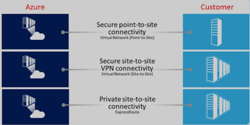

**Site-to-Site**

* Provides Site-to-Site (52S) VPN connections to on-premises networks using IPsec/IKE (IKEv1 or IKEv2)
* Usually requires a **VPN device located on-premises that has a public IP address associated directly or behind NAT**
* Support Border Gateway Protocol (BGP) for dynamic routing and custom IPsec/IKE policy

**Point-to-Site**

* Provides a secure connection to your virtual network from individual client computers or devices
* Useful for telecommuters who want to connect to Azure Vets from a remote location
* Does not require an on-premises public-facing IP address or a VPN device
* Support multiple protocols and authentication methods

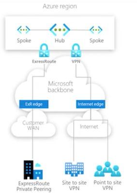

### Multiple Authentication Types for Point-to-Site VPN

**Configure multiple authentication types on the same gateway for OpenVPN protocol**

* Certificate based
* RADIUS
* Azure Active Directory

**Useful to support different platforms with different authentication requirement scenarios**

* Windows client - Azure AD authentication
* Linux clients - Certificate-based authentication

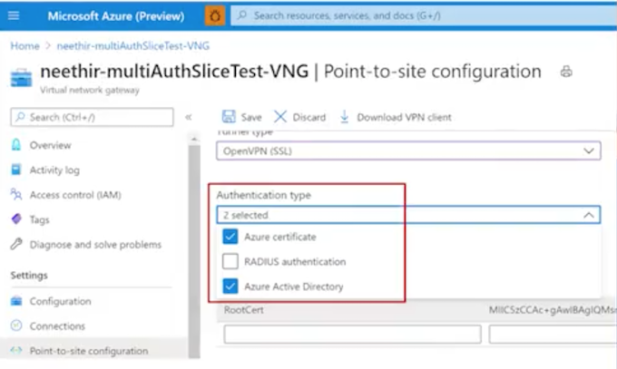

### NAT For Site-to-site VPN

**NAT**

* Overlapping IP address ranges
* Preserve branch address allocations
* Business-to-business connectivity

**NAT policy types**

* **1:1 Static NAT**
	* Bidirectional connections
* **Many-to-1 Dynamic NAT**
	* 	Preserve or masquerade address ranges
	* Uni-directional connections

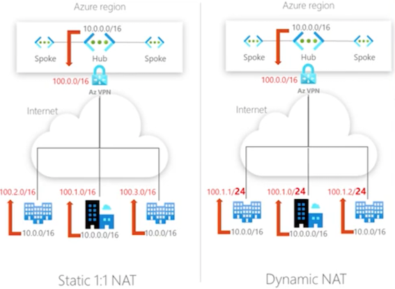

### Monitoring & Diagnostics for VPN

* **BGP Dashboard**

	* Session status
	* Advertised routes
	* Learnt routes

* **Portal support for VPN packet capture**
	* With advanced filtering support

* **VPN connection management**

	* Reset individual connection
	* Show connection SA
	* IKE responder-only mode

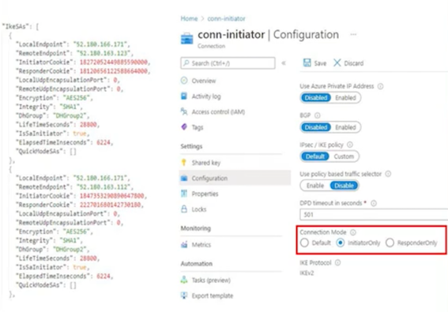

### Point-to-site VPN

Point-to-site VPN 指的是：在云下的单点计算机上安装 VPN 软件，然后拨入 VPN 连接云上 Azure 的 VNet 网络。比较典型的使用场景是，员工在家办公，笔记本通过 VPN 拨入可以访问公司的云上资源。

**Point-to-site VPN 配置步骤如下——**

1.在Azure上首先创建 virtual network gateway，然后在 virtual network gateway 中选择 Point-to-site VPN，我们可以看到隧道类型支持多种协议，如下图所示：

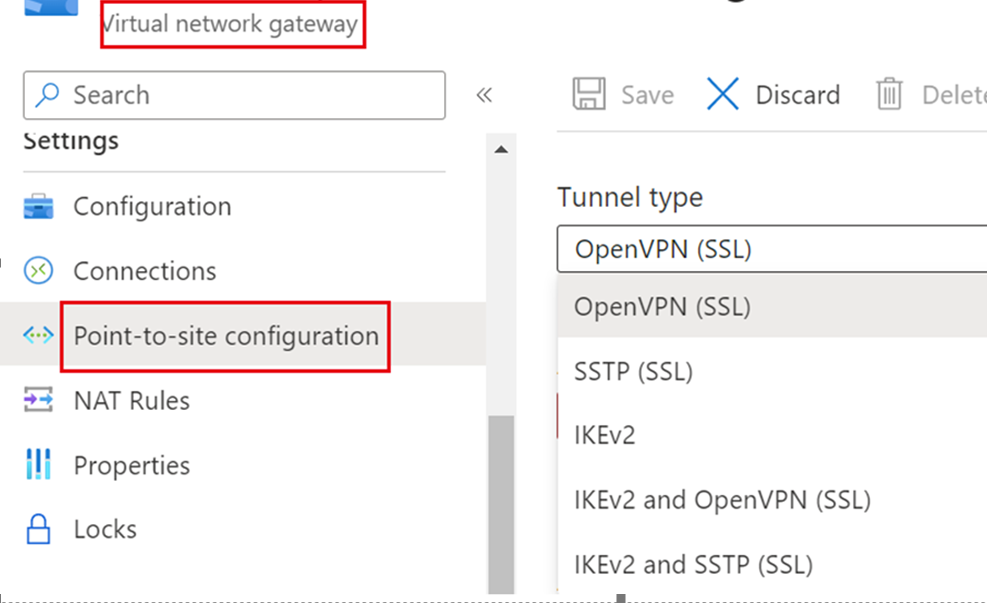

2.与此同时，Point-to-site VPN 的认证类型 Azure Active Directory、基于证书（针对 Linux 客户端）和基于 RADIUS，如下图所示 :

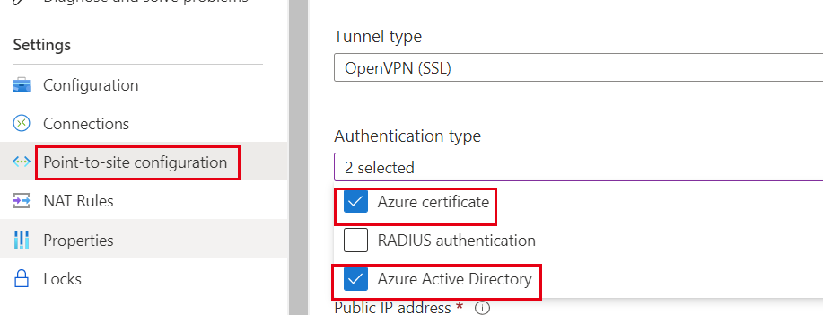

那么，客户不同操作系统类型的笔记本，通过什么方式连接云上资源呢？

3.我们参照下图展示的 Point-to-site VPN 中，身份认证方式、隧道类型、操作系统类型三者的对应关系。

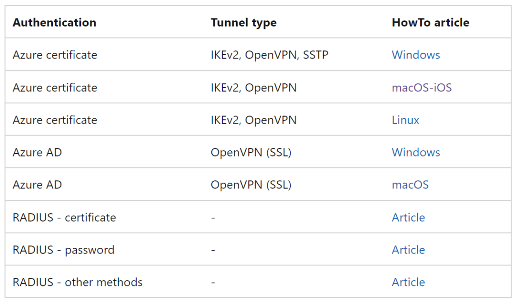

以 macOS 笔记本通过 OpenVPN 以 Azure AD 方式为例，我们首先在 Azure Portal 下载VPN client（配置文件）：

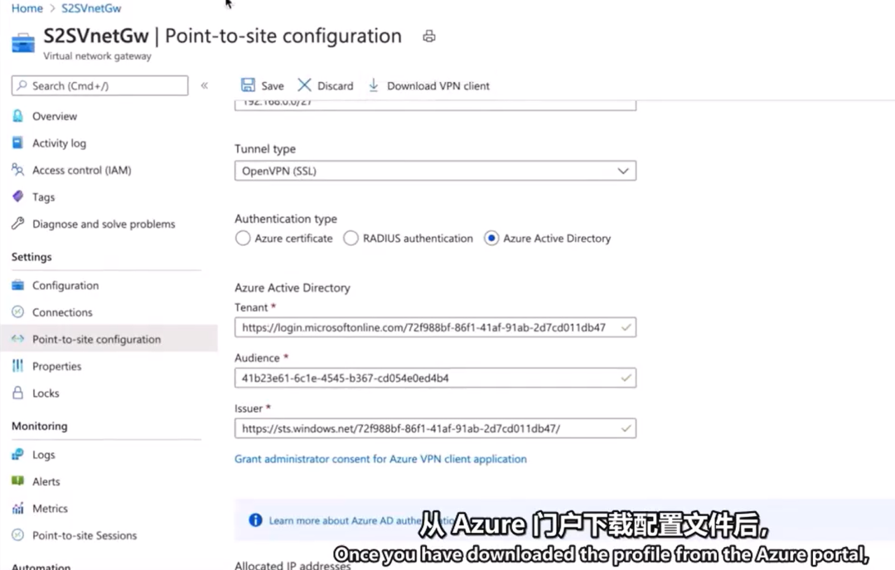

然后将配置文件导入到 macOS 客户端 VPN，并拨入 VPN 后，macOS 客户端就可以连通云上网络了。利用 Wireshark capture 抓包，可以看到通讯使用 OpenVPN 协议。

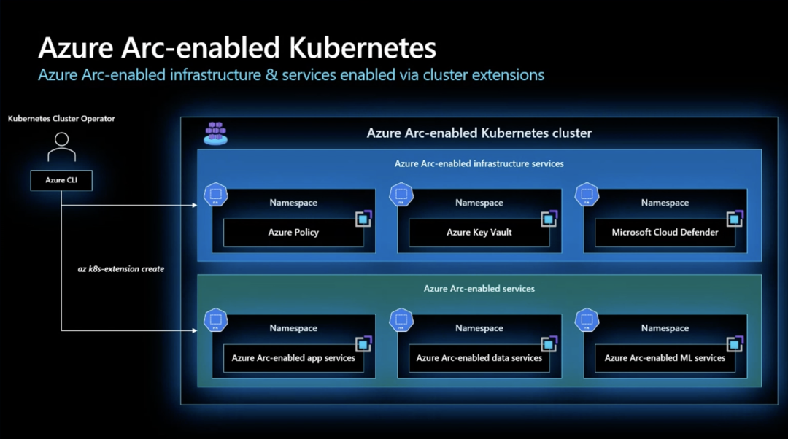

### Site-to-site VPN

顾名思义，Site-to-site VPN 指的是：云下客户站点和云上 Azure 虚拟网络之间创建的安全连接。

在这种方式下，**计算机在接入云下网络后无须任何操作，就可以连接云上资源。比较典型的应用场景是 Branch office 与云上资源的互联**。

Site-to-site VPN 的安全连接创建后，员工将笔记本接入到办公室网络，就可以访问公司云上资源。

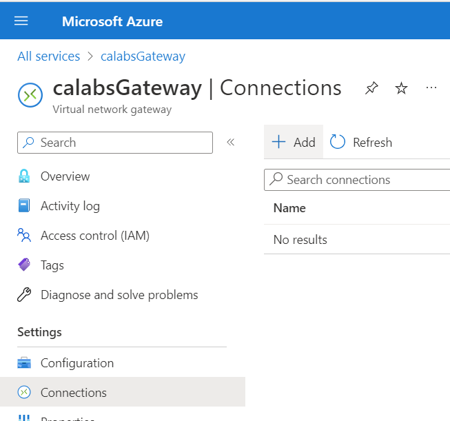

**在 Connection Type 中选择 Site-to-site：**

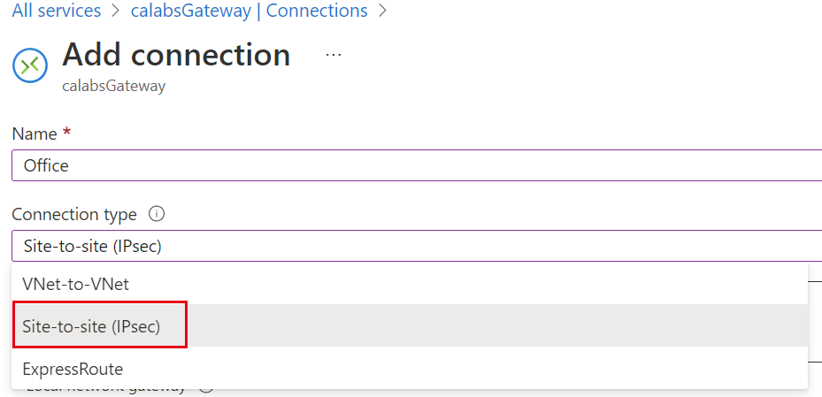

**选择或新建 Local network gateway :**

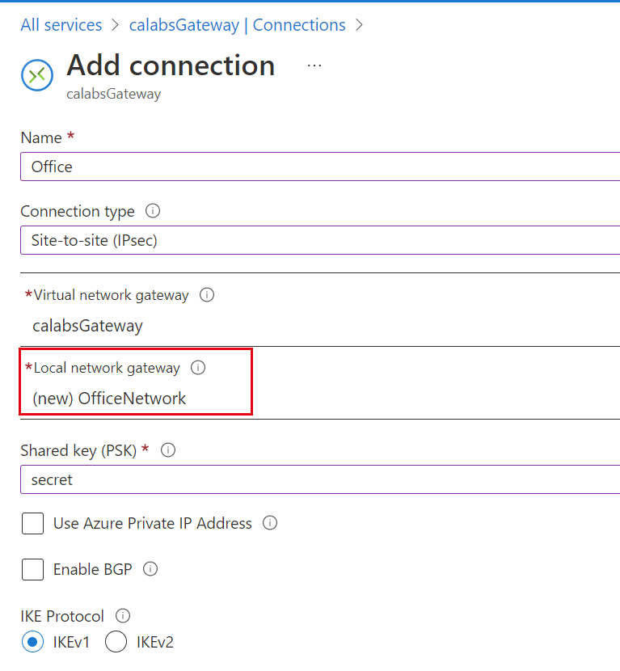

**Site-to-site VPN 创建成功，如下图所示**：

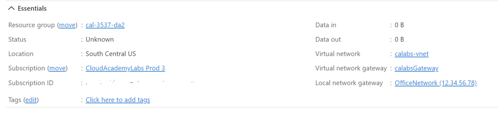

为了避免云下云上网段重叠所带来的困扰，Site-to-site VPN 支持 NAT。

NAT 定义了在 IP 数据包中将一个 IP 地址转换为另一个 IP 地址的机制。它通常用于连接具有重叠 IP 地址范围的网络。连接网络的网关设备上的 NAT 规则或策略指定网络上地址转换的地址映射，具体配置步骤参照如下链接：

https://learn.microsoft.com/zh-cn/azure/vpn-gateway/nat-howto

**Site-to-site VPN 支持两种不同的 NAT 策略：**

* 一对一的静态 NAT，这种方式提供了双向连接。
* 多对一动态 NAT，这种方式仅支持单向连接，并可用于伪装地址范围

## ExpressRoute 

与两种 VPN 方式不同，ExpressRoute 是在云上和云下创建专用连接。它不通过公共 Internet，并且提供比 Internet 连接更高的可靠性、更快的速度、更低的延迟和更高的安全性。

**ExpressRoute 配置步骤如下——**

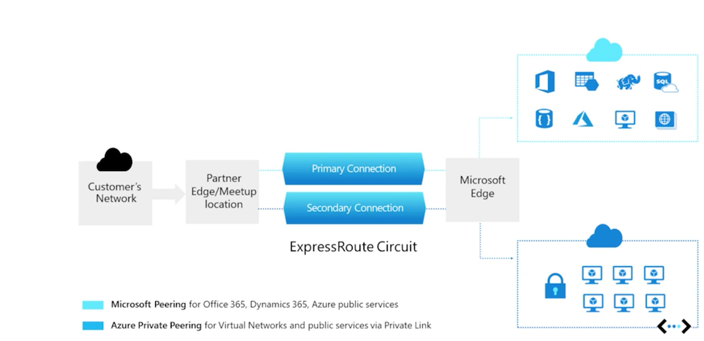

### **ExpressRoute Connectivity Models**

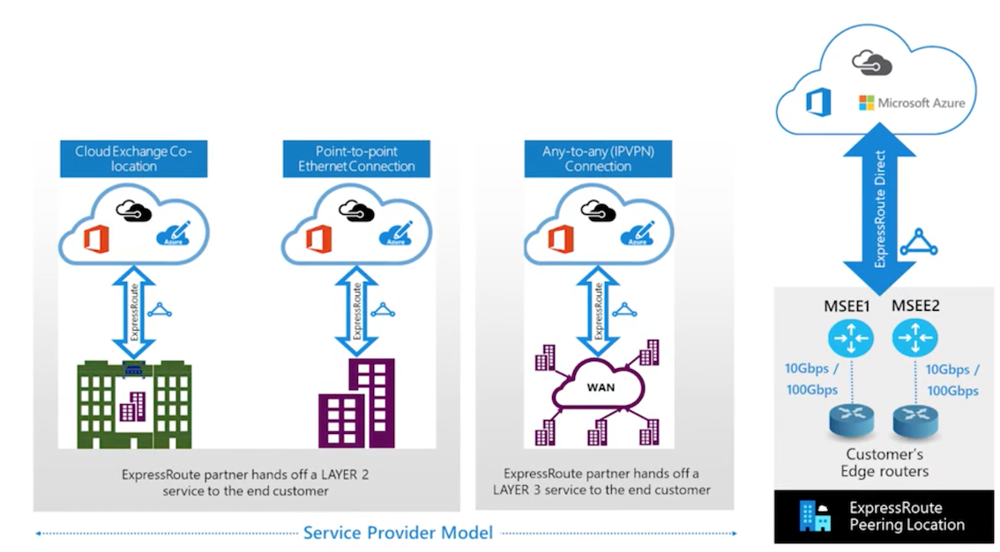

### **Standard ExpressRoute in colocation model**

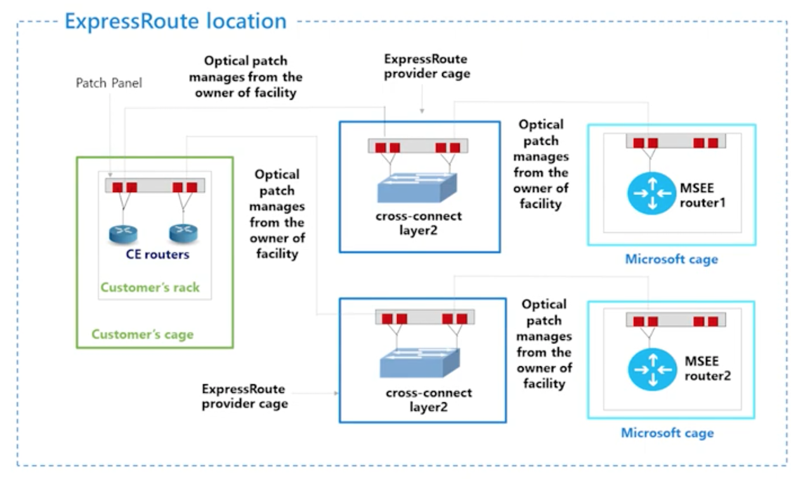

### **ExpressRoute Direct**

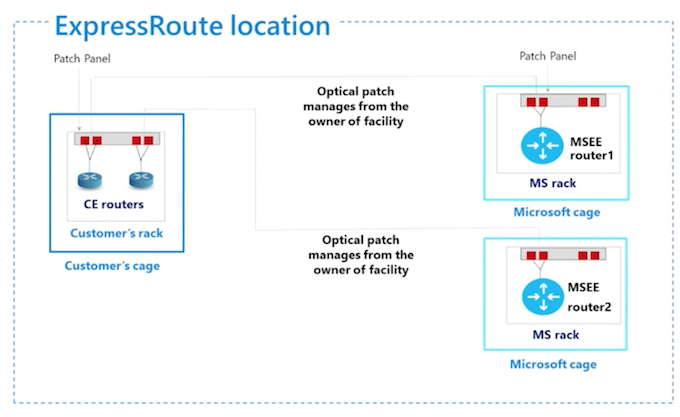

### ExpressRoute design patterns

**1 One flat VNET**

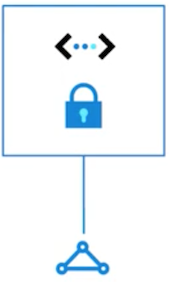

Quick to deploy, easy to manage; "common denominator" acrossClouds.

* Subscription-level resource limits;
* fewer choices for security & compliance setup.

**2 VNETs all on ER circuit**

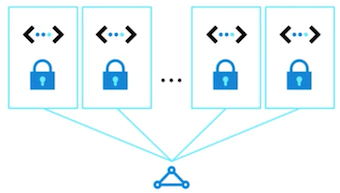

Each BU, each workload in its own security & compliance boundary; NETs in same or different subscriptions (e.g., separate accounting and billing).

Limited NET connections per circuit; cross-VNET performance limited by gateway and higher latency.

**3 Hub and spoke**

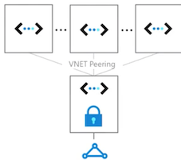

* Hub-to-host common services and enforcecommon policies; virtually unlimited throughput between VNETs; 
* VETs in same or different subscriptions.

* Management overhead; bottleneck in hub;
* no native transit between Spoke VNETs..

### Designing for disaster recovery

> Use **your own WAN or Microsoft's network** to achieve connectivity

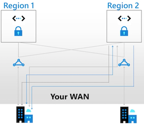

> Make sure you have **symmetrical routing**

### IPsec encryption over ExpressRoute

**Overview**

* IPsec is end-to-end encryption
* ExpressRoute is the underlay network and IPsec VPN is the overlay network.
* IPsec can be deployed over Microsoft and Azure Private Peering

**Best practices**

* Only VPN gateway IPs should be exchanged in the underlay.
* On-prem and Azure VET routes should be exchanged in the  overlay
* If ER GW receives all on-prem routes, ER will be selected as the preferred path for traffic from Azure to on-prem

**ExpressRoute FastPath should be enabled (requires ER ultra perfgateways)**

**On-prem traffic will be sent from the MSEE directly to the VPN gateway; removing software component from the data path**

### ExpressRoute IPv6 Private Peering public preview

* End-to-End IPv6 experience from on-premises to Azure
* Private Peering support with your own defined IPv6 address spaces in your Virtual Networks
* Requires ErGwAz1-3 currently; standard, high, and ultra-performance SKUs at GA
* Support for non-Az region will be coming soon

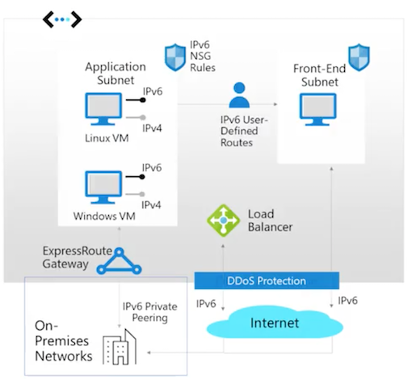

### Additional new features

**1000 max prefix from Azure to on prem (increased from 200) (GA)**

**New gateway metrics: (GA)**

* CPU
* PPS

>  of route advertised and

* received
* Frequency of route changes

> of VMs in a VNET

**MACsec SCI and new Cipher support**

### Azure Route Server

* Provide BGP* endpoints for network virtual appliance to connect
* Enable dynamic routing between VA and Azure virtual network
* Simplify NVA deployment on Azure
* Support any NVA**
* Network topology agnostic (e.g., single Vet, hub-and-spoke, full-mesh)
* **Integrated with ExpressRoute and VPN gateway**

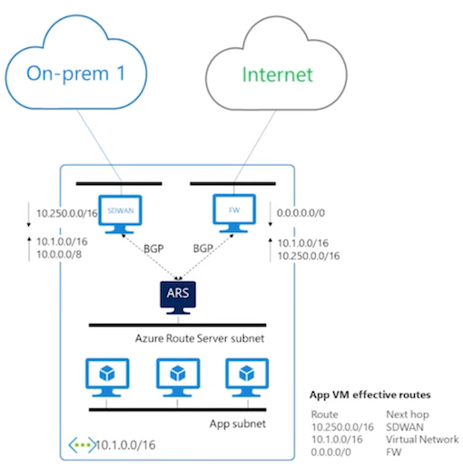

如下图所示，每个 ExpressRoute Circuit 有两个 Connection，Connection 之间是双活的。每个 Connect 中包含两个逻辑连接服务，提供两种类型的对等互连服务：

* Microsoft Peering （下图红色线）：用于将云下资源连接到 Office 365、Dynamics 365 或 Azure 公共服务。

* Azure Private Peering （下图蓝色线）：用于将云下资源通过专用链接连接到 Azure 虚拟网络，即客户的云上资源。

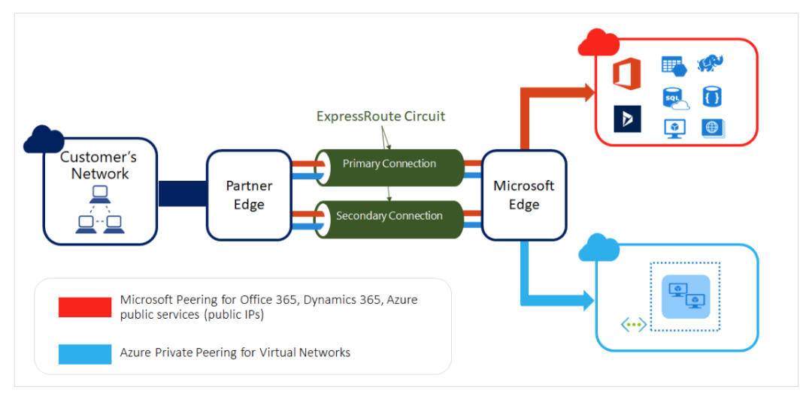

如上文所述，ExpressRoute 通过专线连接，因此使用 ExpressRoute Circuit 需要从网络运营商购买服务。

首先在 Azure China 上选择创建 ExpressRoute circuits，如下图所示：

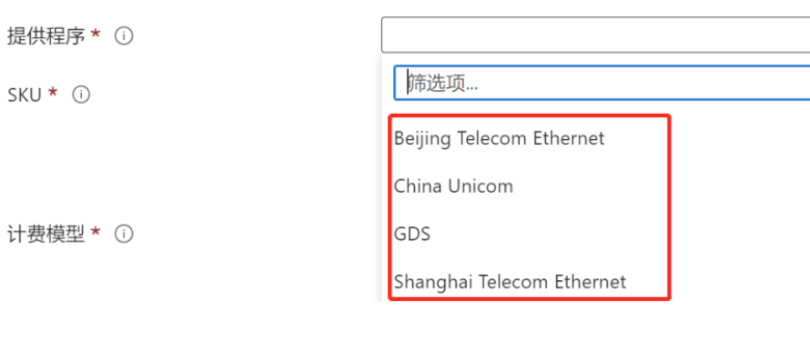

然后，**我们需要将 ExpressRoute Circuit 的服务秘钥告知对应的运营商**，如下图所示：

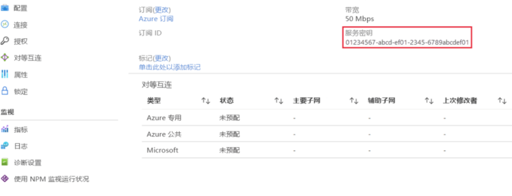

**当运营商拿到服务秘钥开通专网后，线路状态变为“已预配”**。

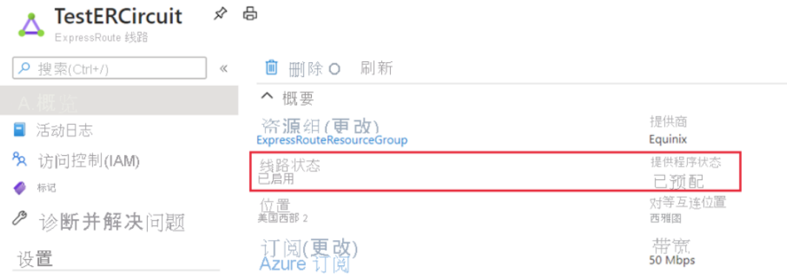

在使用选择运营商的服务时，还需要注意的是 ExpressRoute 的连接模式主要有两类：

* Cloud Exchange Colocation 以及 Point to-point 互联，需要使用运营商的二层专网。
* Any-to-any，需要使用运营商的三层专网。

在将 ExpressRoute 用于生产环境时，还需要考虑 ExpressRoute 网络的设计模式，如下图所示，主要有三种：

**第一种设计模式是 One flat VNET。**

在这种模式下，客户云上部署单个 VNET，然后通过 Express Route 实现云下云上互联。这是一个非常常见的场景，但这种模式有一定的局限性，例如客户需要在云上通过不同 VNet 实现负载隔离，这种方式就无法适配。

**第二种设计模式是 VNets all on ER circuit。**

在此设计模式中，客户在 Azure 云上部署了多个 VNET，并将这些 VNET 连接到一个Express Route circuit。这种模式在企业客户中很常见：客户有多个业务部门的场景，每个部门都需要自己的 VNET，以进行工作负载彼此分离，以实现自己的安全性和合规性边界。VNets all on ER circuit 这种设计模式很好地满足了这个需求。这种设计模式的局限性有两点：

* 连接到一个 Express Route circuit 的 VNET 的数量是有上限的。
* 跨 VNET 流量会受到 ExpressRoute gateway 的限制。

**第三种模式设计模式是 hub-spoke 模型。**

在这个模型中，客户部署 Hub 托管公共服务。Hub 中的虚拟网络通过 VNET peering 连接到 Spoke VNet。这种模式的好处是，我们可以将所有安全策略合并到 Hub VNet，所有入栈流量都通过 Hub VNet。这种设计模式是客户较为重要和复杂的生产环境中，我们优先推荐的方案。

## Azure Route Server

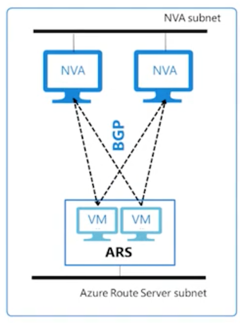

* Fully managed with built-in high availability
* Control plane only - data traffic flows directly from the NVA to the VM and vice versa
* Two or more VAs should be deployed for redundancy
* Set up BGP mesh between the NVAs and the Route Server
* Multiple NVAs can be set up as active-active or active-passive
* For active-passive, use "AS Path Prepending" to signal the Route Server which NVA should be active and which should be passive
* For active-active, Equal-cost multi-path (ECMP) routing is enabled between the NVAs and the VMs

### **SWAN use case**

If ExpressRoute connection goes down, traffic from on-prem will dynamically failover to the SWAN connection.

**SWAN may even select the connection, public or private, per application.**

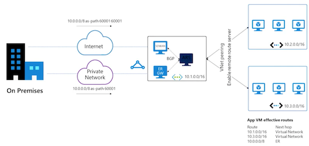

### ExpressRoute and VPN use case

* ER gateway and VPN gateway peer with Azure Route Server automatically.
* Once route exchange is enabled, the two on-premises can talk to each other.

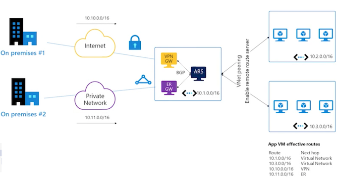

## Azure Bastion

Secure and seamless RDP and SSH access to your virtual machines without public IP address

**Feature announcements**

* Azure Key Vault Integration (GA)
* RDP/SSH access to AKS nodes (GA)
* Bastion Health metrics (Public preview)  (Session | CPU | Memory)
* Bastion Scalable Gateway (Coming mid 2021)
	* Support as many as 500 concurrent sessions
	* Ability to decrease the gateway size

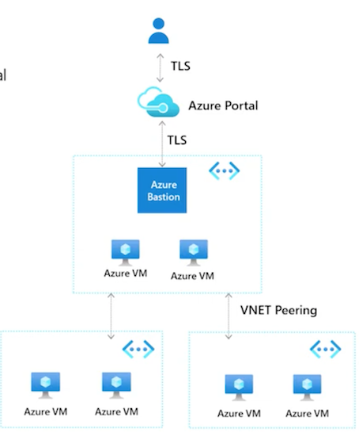

**Azure Bastion Key Vault Integration (GA)**

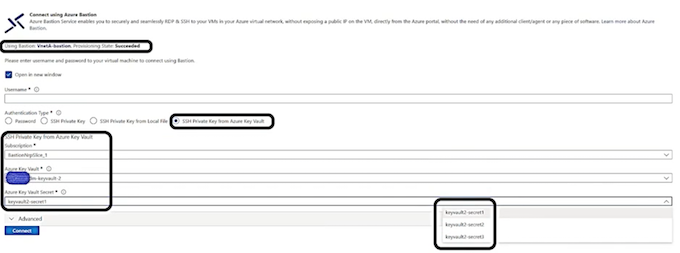
