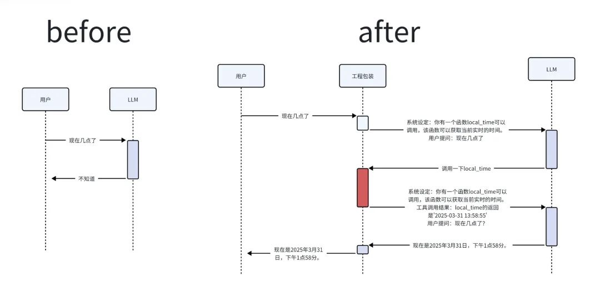
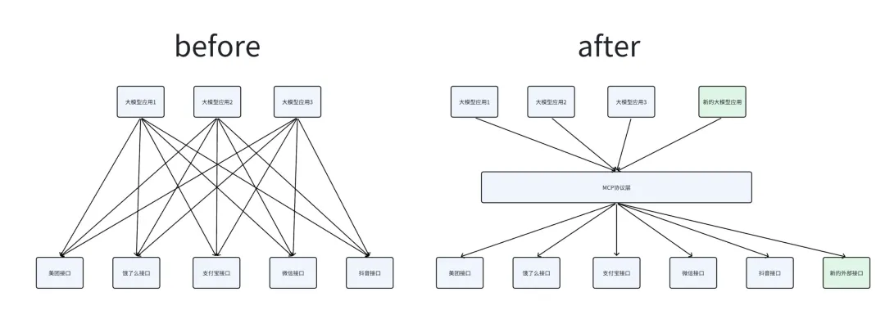
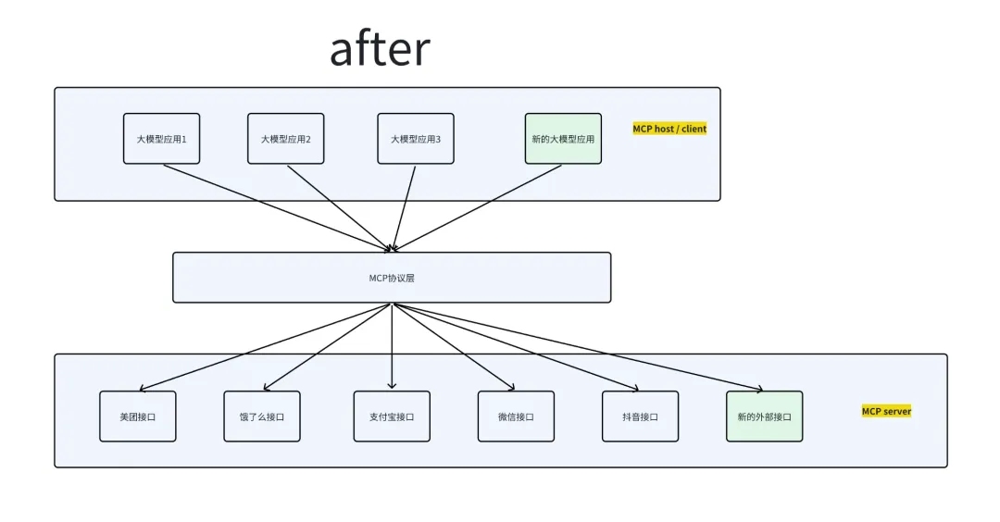
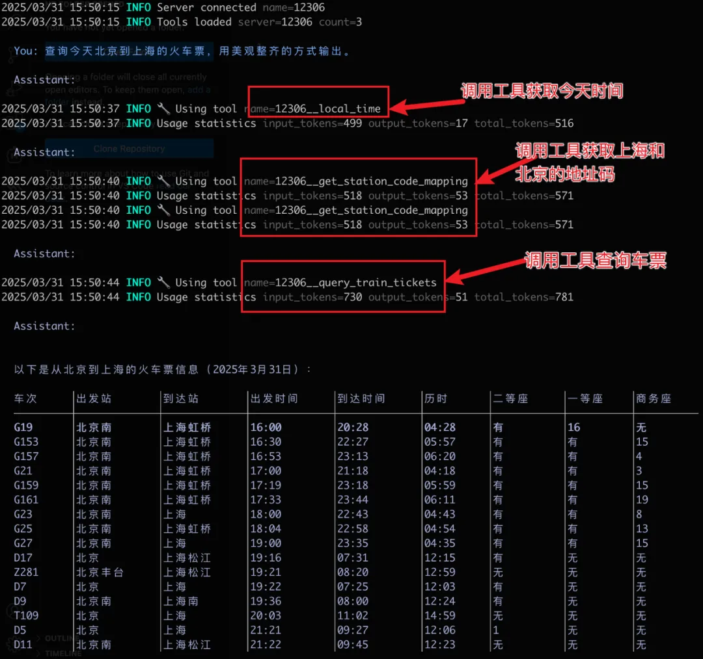
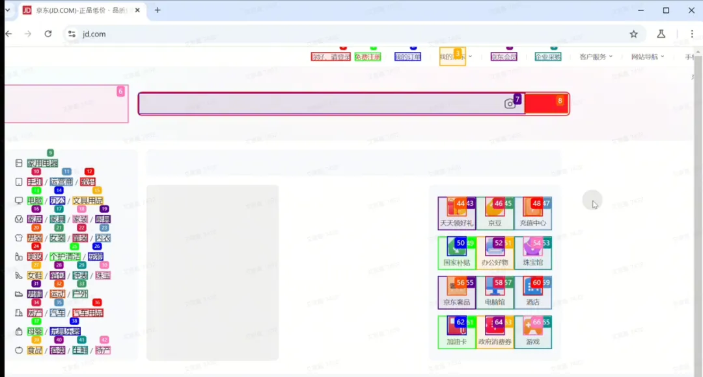

# 1 MCP 介绍

## 1 What


1. 大模型的能力边界是什么？
2. 在 MCP 之前，大模型应用是什么样的？
3. MCP 解决了什么问题？


**模型上下文协议（Model Context Protocol，简称 MCP） 是一种全新的开放协议，专门用于标准化地为大语言模型（LLMs）提供应用场景和数据背景。**

> 你可以把 MCP 想象成 AI 领域的“USB-C 接口”，它能让不同的 AI 模型与外部工具和数据源轻松连接。

### MCP 是干啥的

**大模型的能力**

我们都知道，大模型能做很多事：

- 最基础的是给你解答问题、做 oncall 机器人。
- 现在大模型已经可以联网搜索并给你最新的答案了。
- 大家用过的 Trae 还可以帮大家写代码，只需要说句话，就能帮你把代码写好，同时还能应用到文件中，不需要你自己复制粘贴。
- 前一阵子很火的 Manus，可以帮大家搭建网站，可以当场写代码 debug、运行代码爬取网上信息

前一阵子很火的 Manus，可以帮大家搭建网站，可以当场写代码 debug、运行代码爬取网上信息

> 模型本质上只是一个输入输出流，你给他输入，他给你输出。我们接触最多的就是文字输入输出了。其他也有多模态的输入输出，比如图像、语音、视频。

所以最原始的大模型是不知道周围环境的，也无法知道最新发生的新闻。比如问问 DeepSeek：现在几点了？他很可能无法给出正确的回答。


看起来很傻，我都知道答案了，还用问大模型吗？

那如果前半句话是程序员帮你加上去的，你只需要问后半句呢？**对于不知情的黑盒用户来说，是不是感觉大模型具备了实时获取最新时间的能力了**。

至此，我们对大模型的能力边界有了个简单的认识：大模型是个无状态的大模型，是个无状态的参数集合体。他所有的输出，都来自于自身训练的信息（老数据），以及输入时提供的信息（临时数据）。

为了让大模型能感知到环境，我们需要在临时信息中加入足够多的环境信息，不管这个环境信息是由程序员在黑盒里加上的，还是由用户自己加上的。总之，大模型不是神仙，没给到的信息，他就是不知道。

**让大模型自己探索环境**

上文用一个看起来很傻的例子说明了：必须让大模型知道环境信息，才能根据环境信息得出真实答案。

那么，我们是否可以让大模型自己探索环境。比如我们编写一个 Python 函数，用于获取本地时间：

```
async def local_time() -> str:
    """Get the local time of the machine."""
    import datetime
    return datetime.datetime.now().strftime("%Y-%m-%d %H:%M:%S")
```

再将大模型包装一层，将信息流改进一下：



在改进后的工作流中，工程包装帮用户完善了环境信息，甚至在用户不知情的情况下，与大模型多进行了一次调用。其中红色块，是工程包装层调用了 `local_time` 函数，并将输出拼贴为输入。上述均为简化版。

经过上述的改造，大模型看起来似乎已经有了自己探索环境的能力了。当然没有，这句话应该说：大模型应用有了自己探索环境的能力了。大模型与大模型应用是有区别的，大模型就是指算法模型，大模型应用才是用户端接触到的东西。

**拓展一下**

那么大模型应用的联网是如何实现的？类似的，也是由上述过程实现的，由一个工程包装层，将用户请求包装起来，有一个联网的函数，允许大模型进行调用。对于复杂的函数，由大模型生成结构化的入参。

上述就是大模型的 `function_call` 能力，大模型会根据上下文给出调用外界函数的入参。对于那些复杂的大模型应用，无非是它们工程嵌入的外界函数比较丰富，能做更多的事。

### 这与 MCP 什么关系

MCP 全程 Model Context Protocol，模型上下文协议，其实就是提供了一个通用的工程包装方案。

比如上文中的这个部分，不同大模型应用的 prompt 不同：

```
系统设定：你有一个函数local_time可以调用，该函数可以获取当前实时的时间。用户提问：现在几点了
```

有些可能长这样：

```
系统设定：你有一个函数local_time可以调用，该函数可以获取当前实时的时间，该函数没有入参，出参是字符串。用户提问：现在几点了
```

**或者这样：**

```
系统设定：你有一个以下函数可以调用：
- local_time该函数可以获取当前实时的时间，该函数没有入参，出参是字符串。
- xxxxx
用户提问：现在几点了
```

这些包装的 prompt 都不一样，如果涉及更多的外界函数，比如预定火车票等复杂函数，入参格式必须非常精准。各家的大模型应用都有各家自己的工程包装。

### **在 MCP 之前与之后**

而 MCP 就是这样的一个协议，它提出一个比较通用的方案，将工程包装这个过程规范化，透明化。大家不用关注怎么包装 prompt，只需要关注大模型自身的能力和外界的函数。



在 MCP 推出之前，各厂商处于各自为政的状态，分别对自身的大模型应用进行优化，例如 Trae 和 Manus。这些应用在未运用 MCP 的情况下，已完成对外界函数的整合。不过，它们均是独立实现外部接口的接入，若要扩展功能，就必须重新实现新的接口接入。这种方式极为复杂，缺乏高效性与简洁性。

在 MCP 推出之后，由于各厂商均遵循 MCP 协议，大模型应用厂商仅需依照 MCP 的调用方式，即可使用所有符合该协议的接口。此外，鉴于 MCP 协议具有开放性，会不断有人开发新的外部接口，从而使大模型应用的功能扩展变得极为便捷，如同使用插件一般。此时再回顾本章开头的内容，是否能够理解“MCP 协议是 AI 领域的‘USB - C 接口’”这一表述了呢？


## 2 How

1. MCP 是怎么使用的？
2. MCP 是怎么做到的？

### MCP 是怎么使用的

至此我们已经对 MCP 的应用场景有了一个大概了解。那么 MCP 如何使用呢？

MCP 只是一个协议，如 TCP/IP 一样，无法直接使用，必须先实现它。本章主要介绍一些 MCP 的概念。

MCP 主要由三个部分组成：

* MCP host
* MCP client
* MCP server

下图展示了它们的位置，调用方是 host，host 使用 client 对 server 进行调用。

**MCP server 是 MCP 架构中的关键组件**，它可以提供 3 种主要类型的功能：

* **资源（Resources）：类似文件的数据，可以被客户端读取，如 API 响应或文件内容。**
* **工具（Tools）：可以被 LLM 调用的函数（需要用户批准）**。
* **提示（Prompts）：预先编写的模板，帮助用户完成特定任务**。

其中的工具功能，是我们的重点。



**SDK**

MCP 是依赖实现再使用的，官方提供了多种语言的 SDK，帮助开发者快速实现 server层，而普通的用户不需要开发 server 层，不需要关注这些


### **从实战中了解 MCP**

新手通常使用 Claude Desktop 进行配置，网络上相关教程众多，在此不逐一列举。以下提供一个官方教程链接：https://modelcontextprotocol.io/quickstart/user

我所使用的是一个开源库，链接为 https://github.com/mark3labs/mcphost。

该库为 MCP host，能够调用大模型和 MCP server，以完成用户的部分指令。具体使用方法可查看介绍文档，在此仅作简要介绍。

**安装必要环境**

参考：https://github.com/mark3labs/mcphost

**写一个 MCP server**

我们写一个查询 12306 车票的 MCP server。代码如下

```
from typing import Any
import httpx
from mcp.server.fastmcp import FastMCP
from typing import List  # 导入 List
from mcp_agent.agents.agent import Agent

# Initialize FastMCP server
mcp = FastMCP("12306")

@mcp.tool()
async def get_station_code_mapping(station_name: str) -> str:
    """
    根据输入的地名获取 12306 的车站代码。
    :param station_name: 车站地名
    :return: 对应的车站代码，如果未找到则返回空字符串
    """
    # hardcode
    code = {
        "北京": "BJP",
        "上海": "SHH",
        "上海虹桥": "SHH",
        "广州": "GZY",
        "苏州": "SZH",
    }
    return code

def optimize_train_ticket_info(response):
    """
    优化火车票查询结果，输出简洁明了的信息
    :param response: 火车票查询的 HTTP 返回数据
    :return: 优化后的火车票信息列表
    """
    if response.get("status") and response.get("httpstatus") == 200:
        data = response["data"]
        result = data["result"]
        station_map = data["map"]
        optimized_info = []
        for train in result:
            parts = train.split("|")
            train_number = parts[3]
            start_station_code = parts[6]
            end_station_code = parts[7]
            from_station_code = parts[6]
            to_station_code = parts[7]
            from_station = station_map.get(from_station_code, from_station_code)
            to_station = station_map.get(to_station_code, to_station_code)
            departure_time = parts[8]
            arrival_time = parts[9]
            duration = parts[10]
            seat_info = {
                "二等座": parts[30],
                "一等座": parts[31],
                "商务座": parts[32]
            }
            info = {
                "车次": train_number,
                "出发站": from_station,
                "到达站": to_station,
                "出发时间": departure_time,
                "到达时间": arrival_time,
                "历时": duration,
                "座位信息": seat_info
            }
            optimized_info.append(info)
        return optimized_info
    return []

# 在 query_train_tickets 函数中调用优化函数
@mcp.tool()
async def query_train_tickets(train_date: str, from_station: str, to_station: str, purpose_codes: str) -> Any:
    """
    查询指定日期、出发站、到达站和乘客类型的火车票信息。
    :param train_date: 乘车日期，格式为 YYYY-MM-DD
    :param from_station: 出发站代码
    :param to_station: 到达站代码
    :param purpose_codes: 乘客类型代码，例如 "ADULT"
    :return: 请求的响应数据，如果请求失败则返回 None
    """
    if purpose_codes == "":
        purpose_codes = "ADULT"
    import httpx
    url = "https://kyfw.12306.cn/otn/leftTicket/queryR"
    params = {
        "leftTicketDTO.train_date": train_date,
        "leftTicketDTO.from_station": from_station,
        "leftTicketDTO.to_station": to_station,
        "purpose_codes": purpose_codes
    }
    # 添加 cookie 信息
    cookies = {
        "_uab_collina": "174296998906932728134402",
        "JSESSIONID": "A059735A6E230BFE0E6C4E4282CD2137",
        "route": "c5c62a339e7744272a54643b3be5bf64",
        "BIGipServerotn": "1307574794.38945.0000",
        "BIGipServerpool_passport": "283378186.50215.0000",
        "guidesStatus": "off",
        "highContrastMode": "defaltMode",
        "cursorStatus": "off",
        "BIGipServerportal": "3168010506.17695.0000",
        "_jc_save_fromStation": "%u5317%u4EAC%2CBJP",
        "_jc_save_toStation": "%u5929%u6D25%2CTJP",
        "_jc_save_fromDate": "2025-03-26",
        "_jc_save_toDate": "2025-03-26",
        "_jc_save_wfdc_flag": "dc"
    }
    try:
        async with httpx.AsyncClient(cookies=cookies) as client:
            response = await client.get(url, params=params)
            response.raise_for_status()
            json_response = response.json()
            optimized_info = optimize_train_ticket_info(json_response)
            return optimized_info
    except httpx.HTTPError as e:
        print(f"Error: {e}")
        return None

@mcp.tool()
async def local_time() -> str:
    """Get the local time of the machine."""
    import datetime
    return datetime.datetime.now().strftime("%Y-%m-%d %H:%M:%S")

if __name__ == "__main__":
    # Initialize and run the server
    mcp.run(transport='stdio')
```

配置 MCP host

```
{
    "mcpServers": {
        "12306": {
            "command": "uv",
            "args": [
                "--directory",
                "<mcp server代码的绝对路径>",
                "run",
                "12306.py"
            ]
        }
    }
}
```

输出结果



**结论**

使用 MCP 后，开发大模型应用更为简便。开发者无需手动包装 prompt，仅需关注买车票接口的实现函数，并进行相应配置，即可完成开发。

进一步而言，若 MCP server 有官方实现，上述配置采用固定格式，通过鼠标点击即可完成设置。例如，若 12306 官方提供实现，普通用户无需付出过多精力，便可创建出个性化的智能代理

**MCP 是怎么做到的**

MCP 仅提出了一种协议式的解决方案，同时提供了多语言的软件开发工具包（SDK）及丰富的文档。大量开发者已完成众多 MCP 服务器的开发并将其开源，此网站（https://mcp.so/）已收集了 5000 个 MCP 服务器。实际上，MCP 在数据流和调用链方面与普通的 API 调用实现并无差异。

## Why：为什么要使用 MCP?

1. 它的 trade-off 是什么？
2. 为什么这里考虑这样的 trade-off？

MCP 是一种提效方式。我认为 MCP 这样的协议是未来的大趋势。即使 MCP 失败了，也会有一个更通用的协议来替代它。

因为 MCP 将大模型的算法能力与外部环境信息解耦，开发者只需要关注自己的一小部分，即可完成一个 agent 的开发，而普通用户，完全可以做到用已开源的插件定制化自己的 agent。

**复杂性不会凭空消失，那么 MCP 将复杂性隐藏到哪儿了呢？**

MCP 将原本 agent 开发工作分为两块：**调用外部接口和实现外部接口**。

**调用外部接口让 MCP host/client 完成，也许每个 agent 的 host 实现方式都不一样。而实现外部接口让 MCP server 实现，大部分厂商会实现自己的开源 MCP server，这样就减少了 agent 开发者的工作量了。**

当市面上基于 MCP 的 agent 客户端越来越多，各大厂商一定会蜂拥实现自己的官方 MCP server，甚至要推广自己的 server。

比如，美团实现了自己的 MCP server，让用户在手机上说句话就可以点外卖，饿了么必然会跟进实现。

这里的 trade-off 就是，将实现外部接口这一任务分发给各大厂商，相比较原来的方式，是一种优化。

如果不用 MCP，那未来的大模型应用想做到“AI 管家”的角色，要怎么做呢？下图是另一种尝试思路。哪一种更优雅，更高效？



### Where：它来自哪儿，去向哪儿？

MCP 协议本身解决的问题就是连接大模型与外部环境。

所以其前置工作有：

* 大模型的 Function Call，函数调用；
* OpenAI 插件计划（限制：只能在 OpenAI 的 ChatGPT Web 使用，不能再其他地方复用）；
* LSP（语言服务器协议）。

**MCP 的未来（个人猜测）**：

* 普通用户只需要关注 MCP server，如同下载 App 一样，下载 MCP server 插件，加强自己的 agent。
* 各大厂商优化自己的 MCP server，这是 AI 时代的 App。
* agent 开发者优化 host 的调用链路，如何合理利用 MCP server 才是 agent 的主要关注点。

LSP（语言服务器协议）：在 LSP 中，当用户在编辑器中输入时，客户端查询语言服务器以自动完成建议或诊断。

## Who：谁创造的它？

MCP 最早由 Anthropic 公司开发，目的是帮助 AI 模型（如 Claude）更容易地连接工具和数据源。

但现在，MCP 已经成为一个开放协议，越来越多的企业和开发者开始采用它，这也让它逐渐成为 AI 与工具互动的新标准。