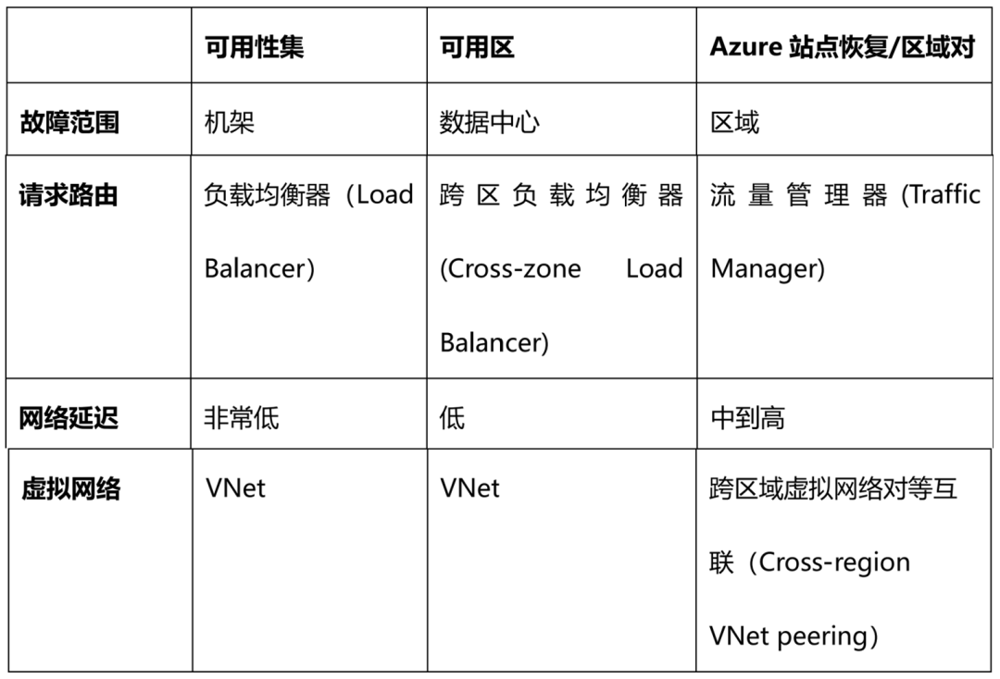

# 2 一文讲透MCP的原理及实践

> MCP (Model Context Protocol) 代表了 AI 与外部工具和数据交互的标准建立。通过本文，我们可以了解到MCP的本质、价值、使用与开发

## MCP是什么

> **MCP 是 Anthropic (Claude) 主导发布的一个开放的、通用的、有共识的协议标准。**

**MCP 是一个标准协议，就像给 AI 大模型装了一个 “万能接口”**，让 AI 模型能够与不同的数据源和工具进行无缝交互。它就像 USB-C 接口一样，提供了一种标准化的方法，将 AI 模型连接到各种数据源和工具。

**MCP 旨在替换碎片化的 Agent 代码集成**，从而使 AI 系统更可靠，更有效。通过建立通用标准，服务商可以基于协议来推出它们自己服务的 AI 能力，从而支持开发者更快的构建更强大的 AI 应用。开发者也不需要重复造轮子，通过开源项目可以建立强大的 AI Agent 生态。

MCP 可以在不同的应用 / 服务之间保持上下文，增强整体自主执行任务的能力。

### MCP 架构

MCP遵循客户端 - 服务器架构，包含以下几个核心部分：

**MCP 主机（MCP Hosts）**：发起请求的 AI 应用程序，比如聊天机器人、AI 驱动的 IDE 等。

**MCP 客户端（MCP Clients）**：在主机程序内部，与 MCP 服务器保持 1:1 的连接。

**MCP 服务器（MCP Servers）**：为 MCP 客户端提供上下文、工具和提示信息

**本地资源（Local Resources）**：本地计算机中可供 MCP 服务器安全访问的资源，如文件、数据库。

**远程资源（Remote Resources）**：MCP 服务器可以连接到的远程资源，如通过 API 提供的数据。

### **为什么需要 MCP 呢？**

举个例子，例如我们目前还不能同时通过某个 AI 应用来做到联网搜索、发送邮件、发布自己的博客等等，这些功能单个实现都不是很难，但是如果要全部集成到一个系统里面，就会变得遥不可及。可以想象一下日常开发中，有一个IDE ，我们可以通过 IDE 的 AI 来完成下面这些工作。

* 询问 AI 来查询本地数据库已有的数据来辅助开发
* 询问 AI 搜索 Github Issue 来判断某问题是不是已知的 bug
* 通过 AI 将某个 PR 的意见发送给同事的即时通讯软件 (例如 Slack) 来 Code Review
* 通过 AI 查询甚至修改当前 AWS、Azure 的配置来完成部署

那有了 MCP 呢？其他服务都遵循 MCP 标准的话，就像万能接口一样，让我们开发更高效了。

**假设你正在使用一个 AI 编程助手来帮助你写代码。这个 AI 助手就是一个 MCP 主机**。

**它需要访问一些外部资源，比如代码库、文档或者调试工具**。MCP 服务器就像是一个中介，它连接了这些资源和 AI 助手。

* **当你需要查找某个函数的用法时，AI 助手通过 MCP 客户端向 MCP 服务器发送请求**。
* MCP 服务器接收到请求后，去代码库或文档中查找相关信息。
* **找到信息后，MCP 服务器将结果返回给 AI 助手**。
* AI 助手根据返回的信息，生成一段代码或解释，展示给你

使用 MCP 后，你直接对 AI 说：“帮我查一下最近数学考试的平均分，把不及格的同学名单整理到值日表里，并在微信群提醒他们补考。”AI 会自动完成：用 “万能插头” MCP 连接你的电脑，读取 Excel 成绩。用 MCP 连接微信，找到相关聊天记录。用 MCP 修改在线文档，更新值日表。整个过程不需要你手动操作，数据也不会离开你的设备，安全又高效。

所以，MCP 厉害的地方在于，不用重复造轮子。过去每个软件（比如微信、Excel）都要单独给 AI 做接口，现在 MCP 统一了标准，就像所有电器都用 USB-C 充电口，AI 一个接口就能连接所有工具。而且，数据不用上传到云端，AI 直接在本地处理。比如你的成绩单只存在自己电脑里，AI 通过 MCP 读取分析，但数据不会外泄。

MCP 会让 AI 更 “懂” 上下文，比如你让 AI “总结上周班会的重点”，它能自动调取会议录音、聊天记录、笔记文档，综合这些信息给你答案，而不是凭空编造。所以，MCP 为 AI 应用提供了一个强大的工具，使其能够更灵活、更安全地与外部世界交互