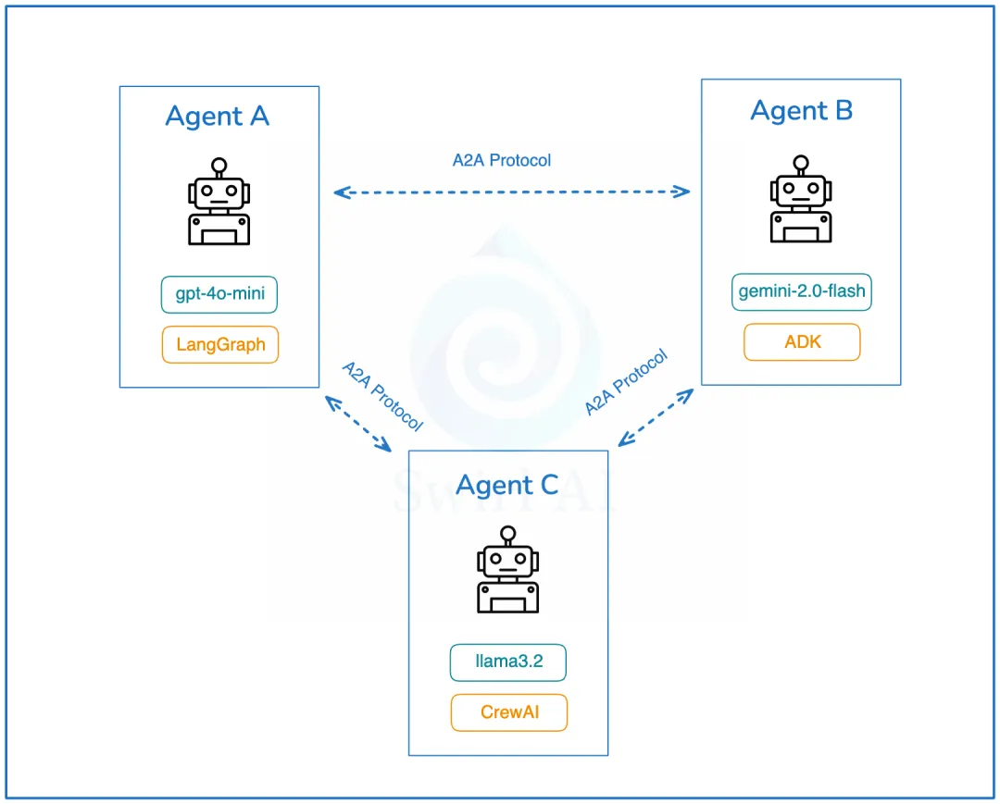
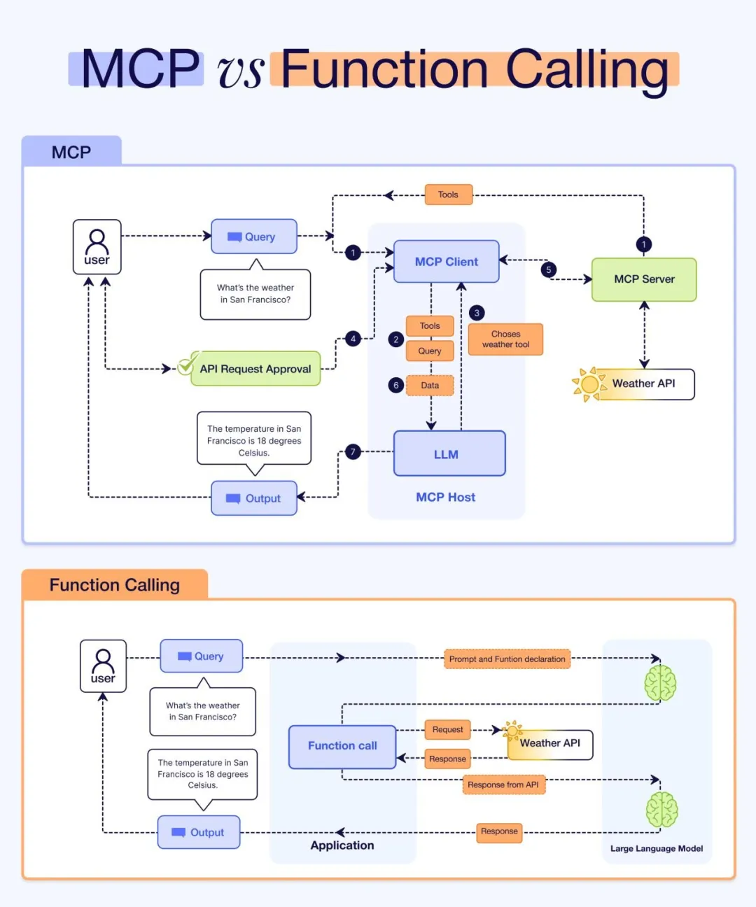

# 1 谷歌 A2A （Agent2Agent）架构设计深度剖析



2025年4月9日，Google正式推出Agent2Agent Protocol（以下简称“A2A”）。

这一协议为各类 AI Agent 之间的高效沟通与协作搭建了桥梁，无论是独立 Agent 与独立 Agent、独立 Agent与企业 Agent，还是企业 Agent与企业 Agent，都可以通过该协议实现通信交互和事务协作。




## 1 A2A 介绍

A2A 是一个开放协议，它为 AI Agent 之间提供了一种标准方式，无论底层开发框架或供应商如何，都可以进行协作，A2A 充分考虑了 Agent 在与用户和企业交互过程中所面临的挑战，具备以下四大核心功能特性：


第一、能力发现：所有实现 A2A 的 AI Agent 都通过“Agent Card”公开其能力目录。这有助于其他 AI Agent 发现给定 AI Agent 实现的潜在有用功能。谷歌建议使用统一的位置来存储组织的“Agent Card”。

比如：

```
https://<DOMAIN>/<agreed-path>/agent.json
```

**第二、任务管理：通信协议，时代短期和长期任务变得更容易**。它帮助通信中的 AI Agent 保持同步，直到请求的任务完成并返回答案。这很重要，因为有些 AI Agent 可能需要很长时间来执行工作，而且目前没有统一标准如何等待这种情况发生。

第三、协作：AI Agent 可以相互发送消息以传达上下文、回复、工件或用户指令。

第四、用户体验协商：这是一个很有趣的功能。它允许协商数据返回的格式，以符合用户界面的期望（比如：图像、视频、文本等）。

通过 A2A 公开的 AI Agent 的发现是一个重要话题。谷歌建议使用统一的位置来存储组织的“Agent Card”

另外，A2A 并没有重新发明轮子，建立在现有标准之上：

1、该协议建立在现有、流行的标准之上，包括：HTTP、SSE、JSON-RPC，这意味着它更容易与企业日常使用的现有 IT 堆栈集成。

2、默认安全 - A2A 旨在支持企业级身份验证和授权，与 OpenAPI 的身份验证方案相当。

## 2 A2A 架构设计剖析

在 A2A 协议中，涉及三个核心角色：

User：用户是协议中的关键主体，主要负责进行认证和授权操作，确保交互的安全性和合法性。

Client Agent：客户端 Agent 是任务的发起者，它代表用户提出需求或请求。

Server Agent：服务端 Agent 是任务的执行者，它接收来自客户端 Agent 的请求，并执行相应的操作。

客户端 Client 与服务端 Client 之间的通信，本质上是基于任务的请求与响应机制。每个请求都对应一个具体任务，服务端 Agent 处理任务后返回结果。

**值得注意的是，一个 Agent 既可以作为客户端 Agent 发起任务，也可以作为服务端 Agent 执行任务，具有双重角色的灵活性。**


Client Agent 和 Server Agent 交互的过程中，会涉及到一些 Entity：AgentCard、Task 、Artifact 、Message、Part，下面做个介绍

**第一、AgentCard 是 Server Agent 的“名片”**，它详细描述了 Server Agent 的能力、认证机制等关键信息。通过获取不同 Server Agent 的 AgentCard，Client Agent 能够全面了解各个 Server Agent 的功能特点，从而精准地选择最适合执行具体任务的 Server Agent。

```
#AgentCard 内容示例

interface AgentCard {
  name: string;
  description: string;
  url: string;
  provider?: {
    organization: string;
    url: string;
  };
  version: string;
  documentationUrl?: string;
  capabilities: {
    streaming?: boolean; 
    pushNotifications?: boolean;
    stateTransitionHistory?: boolean;
  };
  authentication: {
    schemes: string[]; 
    credentials?: string;
  };
  defaultInputModes: string[];
  defaultOutputModes: string[];
  skills: {
    id: string; 
    name: string;
    description: string;
    tags: string[];
    examples?: string[]; 
    inputModes?: string[];
    outputModes?: string[];
  }[];
}
```

**第二、Task 是一个具有明确状态的实体，由 Client Agent 创建并发起，其状态由 Server Agent 负责维护和更新**。

每个 Task 都旨在实现一个特定的目标或结果。

**在 Task 的执行过程中，Client Agent 和 Server Agent 通过交换 Message 进行通信，而 Server Agent 执行任务后生成的输出结果被称为 Artifact。**

**此外，每个 Task 都拥有一个唯一的 sessionId。多个 Task 可以共享同一个 sessionId，这表明这些 Task 属于同一个会话（Session）的一部分，便于管理和跟踪相关任务的执行流程**。

以下是 Task 的示例：

```

interface Task {
  id: string;
  sessionId: string;
  status: TaskStatus;
  history?: Message[];
  artifacts?: Artifact[]; 
  metadata?: Record<string, any>; 
}
interface TaskStatus {
  state: TaskState;
  message?: Message;
  timestamp?: string; 
}
interface TaskStatusUpdateEvent {
  id: string;
  status: TaskStatus;
  final: boolean; //indicates the end of the event stream
  metadata?: Record<string, any>;
}
interface TaskArtifactUpdateEvent {
  id: string;
  artifact: Artifact;
  metadata?: Record<string, any>;
}
interface TaskSendParams {
  id: string;
  sessionId?: string; 
  message: Message;
  historyLength?: number; 
  pushNotification?: PushNotificationConfig;
  metadata?: Record<string, any>; // extension metadata
}
type TaskState =
  | "submitted"
  | "working"
  | "input-required"
  | "completed"
  | "canceled"
  | "failed"
  | "unknown";
```

**第三、Artifact 是 Server Agent 在执行任务后生成的目标结果。一个 Task 可能产生一个或多个 Artifact。**

* **不可变性**：一旦生成，其内容不可更改，保证了结果的稳定性和可靠性。
* **可命名**：可以为其指定名称，便于识别和引用。
* **多部分结构**：一个 Artifact 可以包含多个部分，以支持复杂的结果结构。
* **流式响应支持**：对于需要分批次处理的任务，可以将结果逐步附加到已有的 Artifact 上，实现流式响应

这些特性使得 Artifact 成为任务执行结果的有效载体，既保证了数据的完整性，又提供了灵活性。

以下是 Artifact 的示例：

```

interface Artifact {
  name?: string;
  description?: string;
  parts: Part[];
  metadata?: Record<string, any>;
  index: number;
  append?: boolean;
  lastChunk?: boolean;
}
```

第四、Message 在 Task 执行过程中，Server Agent 和 Client Agent 通过 Message 进行交互，但不涉及 Artifact。Message 可以包含以下内容：

* Agent 的思考过程
* 用户上下文信息
* 执行指令
* 错误信息
* 任务状态
* 元数据等

```

interface Message {
  role: "user" | "agent";
  parts: Part[];
  metadata?: Record<string, any>;
}
```

**第五、Part 是 Message 和 Artifact 的基本构成单元，承载着它们的核心内容。每个 Part 都明确标识了其内容类型以及具体内容本身。**

以下是 Part 的示例：

```
interface TextPart {
  type: "text";
  text: string;
}
interface FilePart {
  type: "file";
  file: {
    name?: string;
    mimeType?: string;
    // oneof {
    bytes?: string; //base64 encoded content
    uri?: string;
    //}
  };
}
interface DataPart {
  type: "data";
  data: Record<string, any>;
}
type Part = (TextPart | FilePart | DataPart) & {
  metadata: Record<string, any>;
};
```

## 2、A2A 架构设计核心流程

ClientAgent 和 ServerAgent 之间通过 HTTP协议 进行通信，采用经典的 C/S（客户端/服务器）模式。通信支持 SSE（Server-Sent Events）流式数据传输，并且数据格式遵循 JSON-RPC 2.0 标准。

**在身份验证方面，A2A 遵循 Open API 规范。值得注意的是，A2A 协议本身并不直接交换身份信息。相反，身份验证所需的材料（比如：令牌）是在协议之外（带外）获取的，并通过 HTTP 头部 进行传输。**

Client Agent 和 Server Agent 之间的协同工作流程主要包括以下6个关键步骤：

第一、Server Agent 在指定站点上托管自己的 AgentCard，公开其能力和服务信息。

第二、Client Agent 主动发现并获取 Server Agent 的 AgentCard，了解其功能和认证要求。

第三、Client Agent 根据需求发起一个 Task，明确任务目标和要求。

第四、Client Agent 设置任务通知监听，以便及时接收任务执行状态和结果。

第五、Server Agent 接收任务后执行，并生成 Artifact 作为任务结果返回。

第六、Client Agent 获取 Artifact，完成任务的最终交付和处理。


### 2.1、AgentCard 托管与发现

官方建议将 AgentCard 找在以下路径：https://${host}/.well-known/agent.json

这种方式被称为 Open Discovery。除此之外，还有另外两种发现方式：Curated Discovery 和 Private Discovery。

Agent Client 可以通过向 https://${host}/.well-known/agent.json 发起请求，获取指定的 AgentCard，并将其集成到自己的提示词或工具集中。

```

//agent card 示例
{
  "name": "Google Maps Agent",
  "description": "Plan routes, remember places, and generate directions",
  "url": "https://maps-agent.google.com",
  "provider": {
    "organization": "Google",
    "url": "https://google.com"
  },
  "version": "1.0.0",
  "authentication": {
    "schemes": "OAuth2"
  },
  "defaultInputModes": ["text/plain"],
  "defaultOutputModes": ["text/plain", "application/html"],
  "capabilities": {
    "streaming": true,
    "pushNotifications": false
  },
  "skills": [
    {
      "id": "route-planner",
      "name": "Route planning",
      "description": "Helps plan routing between two locations",
      "tags": ["maps", "routing", "navigation"],
      "examples": [
        "plan my route from Sunnyvale to Mountain View",
        "what's the commute time from Sunnyvale to San Francisco at 9AM",
        "create turn by turn directions from Sunnyvale to Mountain View"
      ],
      // can return a video of the route
      "outputModes": ["application/html", "video/mp4"]
    },
    {
      "id": "custom-map",
      "name": "My Map",
      "description": "Manage a custom map with your own saved places",
      "tags": ["custom-map", "saved-places"],
      "examples": [
        "show me my favorite restaurants on the map",
        "create a visual of all places I've visited in the past year"
      ],
      "outputModes": ["application/html"]
    }
  ]
}
```

### 2.2、Client Agent 发起 Task

Client Agent 可以向 Server Agent 发送内容，用于启动新任务、恢复中断的任务或重新打开已完成的任务。

```

{
  "jsonrpc": "2.0",
  "id": 1,
  "method":"tasks/send",
  "params": {
    "id": "de38c76d-d54c-436c-8b9f-4c2703648d64",
    "message": {
      "role":"user",
      "data": [{
        "type":"text",
        "text": "tell me a joke"
      }]
    },
    "metadata": {}
  }
}
```

### 2.3、Client Agent 设置回调监听

Client Agent 可以配置一个回调方法并提供给 Server Agent。一旦 Server Agent 修改了 Task 的状态，它将自动调用 Client Agent 的回调方法，从而实现状态的实时同步。

```
//Request
{
  "jsonrpc": "2.0",
  "id": 1,
  "method":"tasks/pushNotification/set",
  "params": {
    "id": "de38c76d-d54c-436c-8b9f-4c2703648d64",
    "pushNotificationConfig": {
      "url": "https://example.com/callback",
      "authentication": {
        "schemes": ["jwt"]
      }
    }
  }
}
//Response
{
  "jsonrpc": "2.0",
  "id": 1,
  "result": {
    "id": "de38c76d-d54c-436c-8b9f-4c2703648d64",
    "pushNotificationConfig": {
      "url": "https://example.com/callback",
      "authentication": {
        "schemes": ["jwt"]
      }
    }
  }
}
```

### 2.4、执行 Task，返回结果

Server Agent 执行任务后，会将执行结果以 Artifact 的形式返回给 Client Agent。

```

{
  "jsonrpc": "2.0",
  "id": 1,
  "result": {
    "id": "de38c76d-d54c-436c-8b9f-4c2703648d64",
    "sessionId": "c295ea44-7543-4f78-b524-7a38915ad6e4",
    "status": {
      "state": "completed",
    },
    "artifacts": [{
      "name":"joke",
      "parts": [{
          "type":"text",
          "text":"Why did the chicken cross the road? To get to the other side!"
        }]
      }],
    "metadata": {}
  }
```

### 2.5、获取 Artifact 结果数据

需要注意的是，Client Agent 需要通过查询 Task 的方式来获取对应的 Artifact。

```

//Request
{
  "jsonrpc": "2.0",
  "id": 1,
  "method":"tasks/get",
  "params": {
    "id": "de38c76d-d54c-436c-8b9f-4c2703648d64",
    "historyLength": 10,
    "metadata": {}
  }
}
//Response
{
  "jsonrpc": "2.0",
  "id": 1,
  "result": {
    "id": "de38c76d-d54c-436c-8b9f-4c2703648d64",
    "sessionId": "c295ea44-7543-4f78-b524-7a38915ad6e4",
    "status": {
      "state": "completed"
    },
    "artifacts": [{
      "parts": [{
        "type":"text",
        "text":"Why did the chicken cross the road? To get to the other side!"
      }]
    }],
    "history":[
      {
        "role": "user",
        "parts": [
          {
            "type": "text",
            "text": "tell me a joke"
          }
        ]
      }
    ],
    "metadata": {}
  }
}
```

总之，AI Agent 之间的相互发现、了解以及交互调用正逐渐成为一种重要的发展趋势，这主要体现在以下两个方面：

**第一、企业内部领域 Agent 的沟通协作需求**

在企业内部，随着业务的不断发展，各种各样的领域 Agent 正在被探索和建立，以满足特定业务场景的需求。这些领域 Agent 之间需要进行高效的沟通与协作，以实现业务流程的自动化和优化。因此，解决内部领域 Agent 之间的交互问题，已成为企业数字化转型过程中必须面对的关键挑战之一


**第二、 对外提供 Agent 服务的发现性问题**


对于那些对外提供 Agent 服务的供应商来说，如何让其他 Agent 主动发现并使用自己的服务，类似于搜索引擎优化（SEO）吸引流量，也是一个亟待解决的问题。通过提高 Agent 的可见性和吸引力，可以更好地促进 Agent 之间的互操作性和生态系统的健康发展。