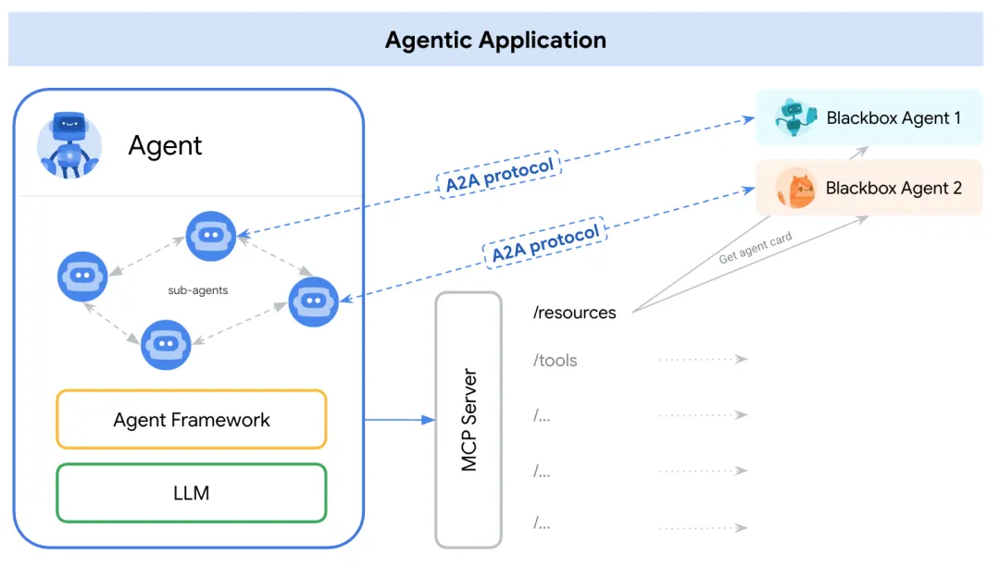
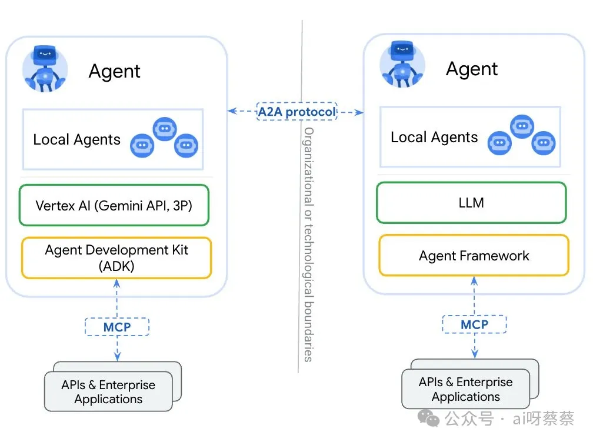
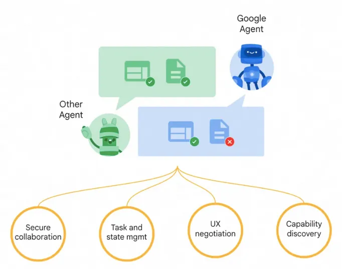
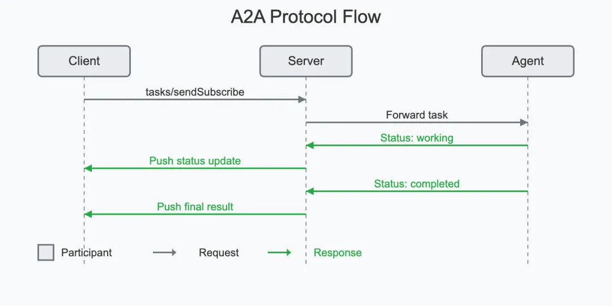

# 3 谷歌 A2A 与 Anthropic MCP 协议深度解析

**当今人工智能领域正从单一模型走向多智能体系统（Multi-agent Systems）**。
    
**简单来说，智能体（Agent）指能够自主感知、决策并行动的 AI 实体，例如能帮你预订行程的助手、自动分析数据的机器人等。**

随着各种专长的 AI 智能体不断出现，不同智能体间如何交流协作，成为新的挑战。就好比各国大使馆挤在同一栋楼里，却缺乏统一外交规范：每个智能体“各说各话”、接口各异，合作成本居高不下。

**为解决这一痛点，业界提出两个备受瞩目的开放协议：谷歌家的Agent-to-Agent (A2A) 协议，以及 Anthropic 公司的 MCP 协议（即 Model Context Protocol，模型上下文协议）。**

这两个协议旨在为 AI 智能体建立一种通用沟通方式，被视作 AI 生态中未来“通用语言”或“通信协定”的有力候选。

### Agent2Agent vs MCP

Agent2Agent（A2A）协议由谷歌主导开发，定位为跨平台、跨厂商的 AI 智能体对话标准。它让不同来源的智能体彼此“加好友”，实现安全通信、信息交换与协同行动。

MCP 协议则由 Anthropic（Claude 模型的开发公司）提出，被称为 AI 行业的“USB-C 接口”——旨在统一大型语言模型（LLM）与外部工具/数据源连接的标准，让模型方便地调用各种资源。

简单说，MCP 更关注“模型与工具的对接”，而 A2A 聚焦“智能体与智能体的对话”。

这两种协议为多智能体协作提供了互补的机制：

* A2A 如同让 AI 智能体拥有了外交会谈的直连专线，解决Agent 间直接对话的问题；
* MCP 则像实时翻译和资源共享系统，解决智能体与外部信息源对接的问题。

二者结合起来，相当于为 AI 世界打造了一个“联合国级”的沟通协定，让智能体之间既能无障碍交流，又能方便地获取所需工具和数据。

下来，我们将深入剖析 A2A 和 MCP 各自的技术标准、底层原理、设计理念，以及它们如何在多智能体系统中促进协作通信机制。文章也将比较两者在 AI 智能体生态中的地位与影响，并通过一个实际应用案例说明它们在智能体分工通信方面的差异。

## 谷歌 Agent-to-Agent (A2A) 协议详解

> 设计理念：打破智能体“信息孤岛”

谷歌的 A2A 协议诞生背景在于，多智能体生态下各代理各自为政，缺乏互通标准。A2A试图成为智能体之间的中间件，让不同开发者、不同架构的 AI 代理可以无缝对接。

其设计哲学强调开放互操作性（Interoperability）：无论智能体底层使用何种框架或模型，只要遵循 A2A 协议，即可彼此通信协作。谷歌希望通过这个开放标准，促进一个多智能体协同工作的生态系统，充分释放 AI 协作带来的生产力提升。

  为达成这一愿景，A2A从一开始就联合了广泛的产业伙伴制定标准。2025年4月协议发布时，已有包括Atlassian、Salesforce、SAP、MongoDB、LangChain等50多家技术公司参与共建。这种多方共识为A2A打下了成为行业标准的基础，也表明各界对统一协议的需求之殷切。

A2A 名称直观地表明了目的：Agent-to-Agent，即智能体直接对话协作。它力求让 AI 代理能像人类团队那样分工合作，共同完成复杂任务，而不是各自为战，A2A 相当于为 AI 智能体提供了一个安全通信的“网络层”，赋予它们共享语言和安全信道，藉由协作变得更聪明。其核心理念包括：

- 通用性：为所有智能体提供统一沟通方式，不局限于任何厂商或平台。
- 自治性：允许智能体在各自内部仍保持自主决策过程（Opaque Execution），只通过协议分享必要的信息，不暴露内部机密。
- 增强协作：通过共享上下文和结果，多个智能体协同工作可以比单个智能体更高效，解决单个模型难以处理的复杂问题。
- A2A 的设计初衷在于打破智能体的“信息孤岛”，让 AI 代理之间真正形成一个互联互通的网络，实现“1+1>2”的协作效应

### **协议架构与结构：客户端/远程端模型与 Agent Card**

A2A 协议采用典型的客户端-服务端架构（Client-Server Model）。 

在一次 A2A 交互中，一方扮演客户端智能体（Client Agent），负责发起任务请求；另一方扮演远程智能体（Remote Agent），负责接收任务并执行。

* **需要注意的是，这里的“客户端/服务端”只是一种角色划分，同一智能体在不同情境下都可以动态地担当请求发起者或任务执行者**。
* 例如，在一个多步工作流中，智能体 A 可能向智能体 B 请求信息（此时 A 为客户端，B 为远程端），而随后 B 又可能将处理结果交由 A 再做进一步分析（此时 A/B 角色对调）。

### Agent Card

**为了让智能体彼此发现对方并了解对方能力，A2A 引入了Agent Card智能体卡片的概念**。

**Agent Card 是一个公开的元数据文件，通常托管在智能体服务端的固定 URL（如 `/.well-known/agent.json`）**，里面以 JSON 描述了该智能体的标识、版本、提供的技能/功能、端点地址以及认证要求等信息。当一个智能体需要寻找可以帮忙完成某任务的伙伴时，**它会先访问候选智能体的 Agent Card，了解对方是否具备所需能力**。

例如，一个需要翻译功能的智能体可以检索 Agent Card 列表，找到注明提供“翻译技能”的远程智能体，然后通过 A2A 与之建立联系。Agent Card机制类似于服务注册表，方便智能体在茫茫“Agent 海”中发现彼此，并作为沟通的第一步。正如 A2A 规范所述，Agent Card 扮演了能力发现（Capability Discovery）的关键角色。

A2A 协议的消息结构围绕任务（Task）展开。每一次智能体间的交互本质上被建模为一个Task，对应某个需要完成的工作单元。任务由客户端智能体发起，通过调用远程智能体的接口发送初始请求消息。协议定义了 Task 对象应包含的信息以及其状态生命周期。

- 典型情况下，一个任务会有唯一的 Task ID，以及当前状态（如提交中、进行中、等待输入、已完成等）。
- 在任务上下文中，智能体双方通过交换消息（Message）来交互：客户端智能体的消息通常代表用户的请求（角色标记为“user”），远程智能体的消息则代表智能体回复或行动结果（角色标记为“agent”）。
- 每条消息可以包含一个或多个部件（Part），部件是消息的基本内容单元，比如一段文本、一个文件、或一段结构化数据。
- 此外，远程智能体在完成任务后，会生成工件（Artifact）作为最终输出结果，也包含若干部件。例如，在一个文档处理任务中，Artifact 可能是远程智能体提取出的表格数据（以文件形式附在部件中）。

**通过上述架构，A2A 将智能体对话抽象成“发现能力 -> 发起任务 -> 双方对话 -> 完成任务”的过程。**

这种结构设计使协议具备很高的通用性。例如，它并不限定任务内容必须是文本，对二进制文件、结构化数据等同样兼容；也不限定某种任务流程，可支持单轮问答或多轮交互。总而言之，A2A 架构提供了一个灵活的框架，让各种异构智能体能以统一的方式互相调用彼此的能力，协同完成任务。

### 通信方式与语义层：基于 Web 标准的多模态消息传递

A2A 协议的通信方式构建在成熟的 Web 技术之上，最大程度复用了现有标准，这也是其设计原则之一，A2A 通信主要采用HTTP作为传输协议，消息编码为JSON格式，并结合JSON-RPC风格进行远程过程调用语义 。
 
 此外，为了支持实时更新和事件推送，**A2A 还使用SSE（Server-Sent Events）和可选的 Webhook 推送机制，实现服务器到客户端的异步消息流**。通过使用 HTTP/JSON 这些广泛支持的标准，A2A 很容易集成到现有 IT 系统中，无需特殊中间件，大大降低了部署门槛。

请求-响应模式是 A2A 最基础的通信模式。客户端智能体通过 HTTP 请求向远程智能体的 API 发送 Task 请求，远程智能体处理后返回结果。

**这种模式适用于短任务或同步交互。当任务可能较长或需要持续交互时，A2A 提供了轮询（Polling）和事件流（Streaming）两种方案来跟踪任务状态**

- 轮询模式：客户端定期调用远程端提供的查询接口，检查任务状态是否完成并获取结果。这是标准的 HTTP 短连接用法，实现简单，但实时性略有不足（取决于轮询频率）。
- SSE模式：远程智能体在初始请求时保持连接不关闭，通过 Server-Sent Events 向客户端连续推送任务进展更新消息。客户端可即时收到状态变更或阶段性产出。这种模式适合持续几秒到几分钟的中短期任务，提供了准实时反馈机制。例如，远程智能体在执行一个复杂查询时，可以不断发送“进度 30%…50%…”的更新，让客户端知晓任务尚在进行。
- 推送模式：对于更长时间运行的任务，A2A支持Push Notification。客户端预先提供一个回调 URL（Webhook），远程智能体在任务完成或状态变化时，主动向该 URL 发送通知。这样客户端无需一直保持连接或轮询，适合需要数小时甚至数天、且可能有人类参与中间环节的任务。例如，一个涉及人工审核的任务，远程智能体可以在需要人工输入时发送通知给客户端，再由客户端协调用户提供额外信息。

通过上述组合，A2A 既覆盖了短周期、高互动的对话，也支持长周期、松耦合的协作，兼顾实时性与可靠性。正如谷歌所强调的，A2A 从设计上考虑了对长时间运行任务的支持，可以处理从几毫秒的快速请求到跨越数天的人机协同任务。在整个过程中，协议允许持续的状态同步与反馈，让双方智能体始终了解任务的最新进展。

### A2A在通信内容上也是模态无关（Modality Agnostic）的。

消息的部件（Part）机制使其能够传输多种类型的数据：文本、图像、音频、视频流甚至富交互界面等。
 
每个 Part 都有一个内容类型标识（content type），远程与客户端可以据此协商所需的格式，确保对方能正确呈现。这一特性被称为用户体验协商（User Experience Negotiation）。例如，如果远程智能体生成了一张图片作为结果，而客户端界面支持渲染图像，那么远程智能体会将该结果作为 `image/png` 类型的部件发送。客户端收到后可直接展示图片给用户。如果客户端不支持富媒体，它也可以要求远程智能体改发文字描述。通过在消息中明确协商交互形式，A2A 保证了不同能力前端之间的良好兼容。这对于支持语音对话、视频输出等多模态人机交互非常关键。

A2A 并未定义新的消息语义层次，而是充分利用了 JSON-RPC 的请求/响应格式来封装任务调用。每个任务请求本质上可以看作一次 RPC 调用：指定调用的方法（例如 `tasks/send`）和参数（包含用户消息、任务ID等）。远程智能体处理后返回结果或错误码。

这种语义设计简单直观，同时通过在 JSON 中嵌入丰富字段，实现了高层次的语义表达。例如消息的角色（user/agent）、任务状态、错误信息等，都在 JSON 结构里有明确标记。这种清晰的语义层定义确保各智能体实现者对协议含义有一致理解，不会“各说各话”。A2A 包含了一个共享语义理解层，确保不同代理能够无歧义地解析彼此的意图、上下文和中间结果。

    综上，A2A 在通信方式上充分借鉴了现有 Web 标准，提供了灵活的同步/异步机制和丰富的数据类型支持。在语义层上，它定义了任务、消息、部件等抽象和状态机，使智能体间交流有章可循。这些共同构成了 A2A 协议强大的通信基础，使其能够适应各种复杂场景下的智能体协作需求。

### 任务管理与状态同步：生命周期机制确保协作有序

在 A2A 协议中，任务（Task）概念贯穿始终，协议围绕任务的创建、执行、完成构建了一套完善的生命周期管理机制。这种机制类似于流程管理或会话管理，确保多智能体协作过程井然有序，并且双方对当前进展和下一步都有一致认知。

当客户端智能体发起一个任务时（调用 `tasks/send` 接口），远程智能体会为该任务分配一个唯一的Task ID，并将任务状态标记为 `submitted`（已提交）。随后远程智能体开始处理，将状态更新为 `working`（进行中）。如果任务需要进一步的输入（例如远程智能体需要澄清问题或索取额外数据），则可以把状态置为 `input-required`（等待输入），并通过消息请求客户端提供更多信息。客户端收到此状态后，可据此发送追加的消息（通过同一个 Task ID 调用 `tasks/send`），相当于在同一任务上下文中继续对话。

  一旦远程智能体完成任务或遇到无法完成的情况，就会将状态标记为终结态：`completed`（已完成）、`failed`（失败）或 `canceled`（取消）之一。同时，远程智能体会返回最终的Artifact（工件）结果或错误信息。客户端智能体则在感知到任务进入终态后，结束后续交互或采取相应动作（如向用户展示结果）。

整个过程中，A2A 协议规定了明确的状态同步流程，使得客户端和远程智能体对任务的当前阶段保持同步认知。配合前文所述的 SSE 和推送机制，客户端可以随时获取任务状态的变化通知。例如，在长任务场景下，远程智能体可以周期性地发送 `TaskStatusUpdateEvent`（任务状态更新事件）给客户端，告知目前进展到了何种状态。又或者，当远程智能体产出一个阶段性 Artifact（如部分结果文件）时，可以通过 `TaskArtifactUpdateEvent` 事件发送给客户端，实现流式输出。这样，哪怕是执行数小时的大型任务，用户（通过客户端代理）也能实时了解到任务在做什么、进度如何，不至于“黑箱等待”

 任务生命周期机制还确保了多轮交互的有序进行。在 `input-required` 状态下，多次消息往返都归属于同一Task，而且必须遵循请求-响应的时序。远程代理不会同时处理多个并行输入，客户端也知道何时该提供附加信息。这避免了在复杂对话中出现混乱。例如，一个问诊类任务中，医生代理（远程）可能多次问症状，患者代理（客户端）多次回答，都在一个 Task 会话内逐步推进，直到诊断完成标记 `completed`。生命周期的存在让这样的对话协作上下文连贯且易于管理。

可以将 A2A 的任务管理类比为项目协作中的工单系统：每个 Task 就是一张工单，从创建、处理中、待反馈到关闭有全流程状态。所有相关交流都记录在线程（消息序列）中。这不仅使计算机程序易于处理，也方便将来审计和追踪。例如，对于企业级应用，IT 管理员可以查看某次任务执行记录，看到哪个代理发起了请求、哪个代理完成了任务、中途交换了哪些信息、结果如何。这对于可靠性和责任归属也很重要——在高度自治的多智能体系统中，有了任务生命周期日志，才能追溯问题、调优系统。

A2A 的任务与状态管理机制确保了智能体协作“有人负责，每步可查”。它提供了对协作过程的结构化描述和控制，使多个异构智能体能够在同一任务上下文中同步工作、不偏不倚地朝着共同目标推进。这种井井有条的协同方式大大提高了复杂工作流的自动化可行性，也为多智能体系统在真实场景的大规模部署打下基础。

### 安全与开放性：企业级安全设计与开源生态

由于定位于跨组织、跨平台的智能体交互，A2A 协议非常重视安全性。谷歌在设计时采用了“默认安全（Secure by default）”原则，将企业级身份验证和授权机制融入协议。A2A 支持的认证方式与 OpenAPI 等现有接口标准看齐，例如支持 OAuth 2.0、API Key、JWT 等方案来验证调用者身份。这意味着，如果一个智能体服务只希望被授权的客户端访问，可以要求对方在 HTTP 请求头携带特定的认证令牌，未认证的请求将被拒绝。通过这种设计，A2A 能够在开放互通和安全控制间取得平衡，让企业放心地开放自家 AI Agent 的能力给合作伙伴，而不担心数据泄露或滥用。

另外，A2A 通信可以结合双向 TLS（Mutual TLS）来确保通信信道安全加密、防窃听篡改。这对跨云环境、跨公司网络的 Agent 对话尤为重要。比如一个公司内部的财务AI代理与外部供应商的物流AI代理通过A2A协作下单，启用 mTLS 可防止中间人攻击，保障交流内容保密。A2A 强调智能体仅共享任务相关的输入输出，不暴露各自内部机密算法或完整数据。这一点确保了不同组织部署的 Agent 可以合作，但不会泄漏商业敏感信息，从而消除企业在采用开放代理协作时的后顾之忧

在开放性方面，A2A完全开源，并鼓励社区共建。谷歌已将协议的草案规范、参考实现代码等发布在 GitHub 上。开发者可以自由查看 A2A 的技术细节，实现自己的兼容版本，或向官方贡献改进建议。A2A 项目采用 Apache 2.0 开源许可证，对商业友好，无版权顾虑。谷歌还提供了Agent Developer Kit (ADK)开发套件，以及多种语言的示例代码（如 Python 和 JavaScript）来帮助开发者快速上手。例如，ADK 可以将现有的对话式 AI 框架封装为 A2A 兼容 Agent，无需从零开始。目前开源社区已经出现了一些集成尝试，如 CrewAI、LangGraph、GenKit 等代理框架都推出了与 A2A 对接的模块。这些工具降低了开发门槛，让更多人能把自己的 AI Agent 接入 A2A 网络。

A2A 并不与 Anthropic 的 MCP“争夺地盘”，相反谷歌明确将其定位为对 MCP 的补充（Complementary）。谷歌在官方博客中特别指出，“A2A 是开放协议，补充了 Anthropic 的 MCP 协议（MCP 为智能体提供有用的工具和上下文）”。这体现出 A2A 项目在生态合作上的开放态度。实际上，A2A 网站的文档甚至专门有一节介绍 A2A 与 MCP 如何协同工作。可以预见，未来 A2A 和 MCP 将经常被组合使用，形成从 Agent-Agent 沟通到 Agent-Tool 使用的全套解决方案。因此，A2A 团队也非常重视与 MCP 的兼容和协作示范（下文我们将详细讨论二者关系）。

  A2A 协议在安全和开放两方面都下了足功夫。一方面提供企业级的安全机制保证通信和权限，另一方面以开源和协同的方式推动协议成为行业通用标准。这种开放但安全的设计平衡，为 A2A 在严肃商用场景中落地奠定了基础，也为其迅速普及创造了条件。正因如此，业内称 A2A 有望成为“Agent 时代的 HTTP”——既安全可靠，又无所不在的通信底层。

   综合而言，Agent2Agent (A2A) 协议为 AI 智能体之间的协作提供了完整而强健的解决方案。在结构上，它采用客户端-远程端模型和 Agent Card 机制，实现智能体能力曝光与动态发现；在通信上，基于 HTTP/JSON-RPC/SSE 等标准，支持多模态的数据交换和实时/长时并存的交互模式；在过程管理上，引入任务生命周期和状态同步，让多轮对话与长流程执行都有据可循；在安全上，则内建认证加密措施确保跨主体合作的信任。A2A 的设计注重兼容性与实用性，让各类 AI Agent 能像人类团队一样“发现同事”并协同完成任务。这标志着 AI 代理从各自为政走向互联协作的关键一步，被视作开启Agent 互操作新时代的重要里程碑。

## Anthropic 模型上下文协议 (MCP) 详解

