# **1 Introduction to Release Management**

## 1 Outline

* Release management in the context of continuous delivery
* Steps of a release
* Release management concepts
* Release management infrastructure

### Release Management in the Context of Continuous Delivery

* This provides better stability to the deployment, better validation of the deployment and makes releasing a feature a functional operation, preferably done by the 
“business” at the moment they prefer

1. **Importance of Separating Build and Release Processes**:
   - Need to separate build and release processes, suggesting that it is better **to have distinct phases for build and release management.**

2. **Adoption of Automated Build Pipeline and Release Management Pipelines:**
   - It advocates using automated build pipelines for the **<mark>build phase and release management pipelines</mark>** for the release phase to effectively separate these processes.

3. Separation of Deployment and Release:
   - The separation of **deployment (the process of getting artifacts on production servers) and release (delivering new features to end users**)

 
4. **Goals of the Separation:**
   - Specifies the objectives of achieving **<mark>smoother deployment processes without disrupting services</mark>**, 
   - **performing easy validation of deployment outcomes**, 
   - **gradually releasing new features to end users**.

5. Benefits of the New Approach:
   - The article outlines the benefits of separating build and release processes, 
   - **<mark>Including enhanced deployment stability, improved validation of deployment quality</mark>**,
   - **<mark>Itransforming feature release into a business-focused practicey</mark>**.

### In continuous delivery we strive to separate a deployment from a release

This provides better stability to the deployment, better 
validation of the deployment and makes releasing a 
feature a functional operation, preferably done by the 
“business” at the moment they prefer

≈

* Deploy your product
* See if it operates in a stable fashion
* Enable your feature for
	* Segment of users
	* Random selected percentage
	* All in one

* Watch how the system behaves

1. **Separation of Release and Deployment**:
   - Emphasizes the need to separate deployment and release of software to **<mark>facilitate rapid and stable movement of software into production environments</mark>**.

2. Importance of Separation:
   - Points out that the common industry practice of teams needing overtime to install and release software is due to the coupling of deployment and release processes, advocating for the separation of these concerns.

3. New Deployment Sequence:
   - Explains the **sequence of deployment**, where software is installed without exposing new or changed functionality to end users, allowing for observation of system behavior to ensure stability.

4. Feature Toggles:
   - Discusses the use of feature toggles to **reveal new features or change routines within the system, offering flexibility in choosing the strategy for releasing features to end users.**

5. Collaboration with Business Owners:
   - Highlights the importance of deciding on feature release strategies in collaboration with the business owner of the system, as there are many options for revealing features to end users.

6. Benefits of Separation:
   - Outlines the benefits of separating feature deployment from feature unveiling, 
   - **including more stable releases,** 
   - **improved rollback capabilities**, 
   - **the ability to release software at any time without affecting the system**.

   
## 3 Steps of a Release

* **First you build the software**	* And validate product quality
* **Then you deploy the software**
	* And validate runtime stability
* **Then you release the feature**
	* And validate feature usage

Clean separation in the different stages of delivery	

1. **Build Process**:
   - Emphasizes the importance of utilizing a build pipeline, **which can be implemented using various build engines such as Jenkins, TeamCity, Bamboo, or Azure DevOps build pipelines**. 
   - The build process provides artifacts required for software deployment, including provisioning scripts and information about product quality from a static perspective.

2. **Deployment and Validation:**
   - After building the software, the next step involves deploying the new software to a freshly provisioned environment and validating its stability. 
   - This phase offers **insights into the runtime stability of the software and determines whether it is ready for the final phase of releasing the feature**.

3. Feature Release:
   - The feature release is performed using a suitable feature toggling mechanism, and usage of the new feature is validated.

4. Separation of Concerns:
   - **Focusing on product quality**
   - **Product stability **
   - **Feature usage**, 
   - **Combined with technical characteristics such as performance**.

## 4 Azure DevOps Release Pipelines

* **Distinction between build and release**
* **Build produces artifacts**
	* Mix and match with other build software
* **A release pipeline picks these up and deploys them in an environment**
* **End-to-end traceable process**

1. **Azure DevOps Pipelines:**
   - Azure DevOps Pipelines enables the separation of **<mark>building and releasing products by providing distinct features for building (Azure DevOps build pipelines) and releasing (Azure DevOps release pipelines)</mark>**.

2. **Utilizing Release Pipelines**:
   - Azure DevOps release pipelines facilitate the provisioning of environments for deploying software by picking up artifacts from the **build pipeline, enabling the release of features, and monitoring system behavior post-release**.

3. Flexibility in Tools:
   - The flexibility of Azure DevOps release pipelines allows for **integration with other open-source tools such as Jenkins, Bamboo, or TeamCity builds, providing the freedom to mix and match according to preferences**.

4. **Capabilities of Release Pipelines:**
   - Azure DevOps release pipelines offer capabilities for defining stages for deploying, validating software, defining deployment steps, associating deployment agents, and specifying approvals to move to the next stage.

5. Integration and Traceability:
   - The benefit of using Azure build pipelines together with Azure release pipelines is the **automatic flow of information from the build to the release, providing traceability of changes in Azure DevOps agile boards without additional effort**.

## 5 Release Management Concepts

**How a Release Is Set Up**

* Release Pipeline Definition
* Release Agent

1. **Terms Used in Azure DevOps Release Pipelines**:
   - Azure DevOps release pipelines to facilitate understanding and enable the building of customized releases.

2. Release Pipeline Definition:
   - The concept of a release pipeline definition refers to the **set of steps and actions required to obtain artifacts, install and validate software, and move it between different stages. This serves as a repeatable template for running releases**.

3. Release Agent:
   - **The release agent, identical to the one used for builds, is responsible for executing tasks defined in the release definition, carrying out the actual work, and producing the end results**.

4. Implementation of a Release Pipeline:
  

## 6 Artifacts, Stages, and Gates

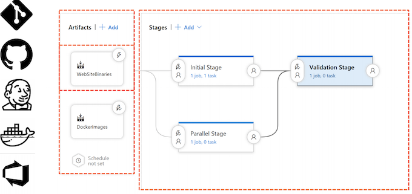

Key points and knowledge from the article:

1. Artifacts in Release Pipeline:
   - Artifacts used in a release can originate from various sources, such as Git repositories (including Azure DevOps Git Repository and GitHub), Jenkins, Azure Container Registry, Docker Hub, or the Azure DevOps build pipeline associated with the project. Artifacts are utilized to pull results from a known location, serving as triggers for the release upon changes in the artifacts.

2. Understanding Stages:
   - **Stages are depicted as logical steps for deploying and validating software within the release pipeline.** 
   - They can represent traditional environments like desk, test, acceptance, or production,
   - Set of steps to provision required resources using a cloud provider, followed by software deployment and validation of expected functionality through integration tests and performance tests. 
   - **Each stage acts as a quality gate before moving towards a production status.**

3. Parallel Executing Stages:
   - **Release pipeline definitions can include multiple stages that execute in parallel, enabling faster validation of the software before transitioning to production status.**

## 7 Agent Jobs and Tasks

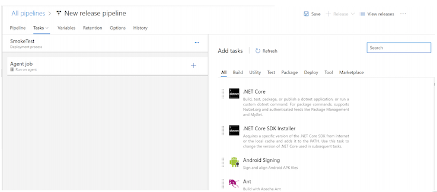

1. Tasks and Jobs in a Stage:
   - **Within a stage, tasks are defined to be executed, which are organized into one or more jobs**. 
   - <mark>Each job can execute a set of tasks and runs on a designated agent selected from agent pools, **including Microsoft-managed hosted pools or custom-defined pools running on-premises or in a cloud subscription**.

2. Deployment Job Group:
   - Deployment job group enables running a task on a **preselected deployment group**, which consists of predefined machines within a network segment, **typically on-premises or in a chosen cloud subscription**.

3. Agentless Job:
   - An agentless job contains tasks that do not require a running agent and can be handled by the Azure DevOps service itself, such as manual intervention tasks that require human approval.

4. Selection of Tasks:
   - Upon selecting a job, users can choose from a list of tasks to execute. 
   - These tasks cover a range of actions including creating required machines or cloud resources, configuring infrastructure or software, and testing parts of the deployment process.

5. **Extending Functionality with Marketplace Tasks**:
   - If a required task is not available, **users can explore the marketplace to obtain additional tasks built by the community. Alternatively, users can create their own tasks using the downloadable SDK**.

## 8 Release Variables

* Custom Variables
* $(variablename)
* Build In Variables
* Secrets
* Environment Variable

1. Configuration and Task Execution:
   - When defining a release, a set of tasks is executed within a stage through an agent job. **Each task needs to be configured, involving the provision of specific data for different settings**.

2. Use of Variables:
   - Variables can be defined to avoid repeating configurations, with values assigned to the variables and then referenced within the tasks using a specific syntax ($[variableName]). 

   
3. Predefined Variables:
   - Predefined variables, **such as information on the current agent and artifacts used during the release, are available for use**. These variables are well-documented within the product, offering flexibility and efficiency in release configuration.

4. Secret Variables:
   - It is possible to mark variables as secrets, **ensuring that their actual values are not displayed in the web UI or logs**. T
   - his feature enhances the security of sensitive information within the release environment.

5. Environment Variables:
   - Variables defined and used within the release become available as environment variables during the release, which can be crucial for ensuring the proper operation of software that requires specific environment variables.

## 9 Continuous Deployment Trigger  
   
* Build, (Azure DevOps) Git,
* Team Foundation Version Control
* GitHub 
* Jenkins
* Azure DevOps Artifact Management
* Container Registry
* Docker Hub

1. Artifact Sources and Continuous Deployment Triggers:
   - **Various artifact sources, including Build, Git, Team Foundation Server Version Control, GitHub, Jenkins, package management systems (such as NuGet and Node package), and container registries (e.g., Azure Container Registry, Amazon container registry, Docker Hub) are supported as triggers for a new release**. When changes occur in any of these artifact sources, a new release can be automatically triggered.

2. Supported Artifact Sources:
   - The built-in artifact sources provided by Azure DevOps, such as Build, Git, and Team Foundation Server Version Control, are supported for triggering new releases. Additionally, external sources like Git repositories, GitHub, Jenkins, package management systems, and container repositories can also serve as triggers for new releases.

3. Flexibility in Release Triggers:
   - By supporting a wide variety of artifact sources, Azure DevOps offers flexibility in triggering new releases based on any changes that are essential for an application to generate a fresh release automatically.

   
## 10 Create a release for an ASP.NET web application

1. Show the Azure DevOps project and the MvcMusicStore repository in the repos section.
	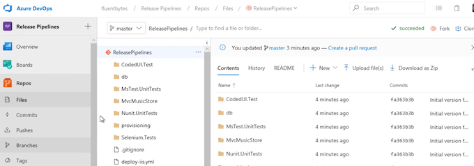
2. Display the existing ASP.NET -CI build pipeline and its successful build details, **including the associated changes and published artifacts in the drop folder**.
	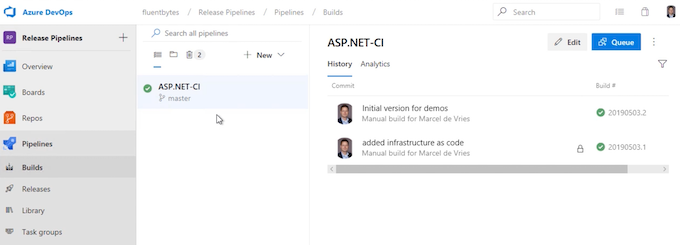
	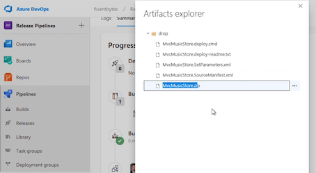
3. Create a new release pipeline and select the "Azure App Service deployment" template.
		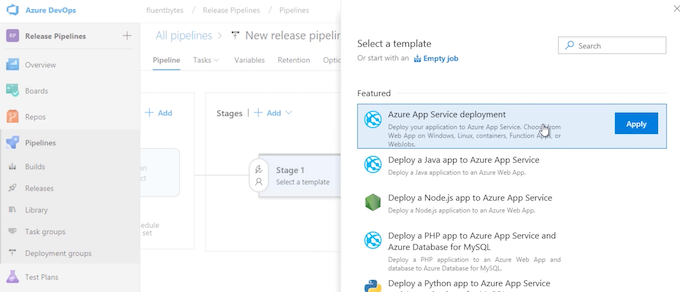 
4. Name the stage "DeploytoAzure" and add the ASP.NET -CI build as the artifact source, specifying it as the drop alias to use.
	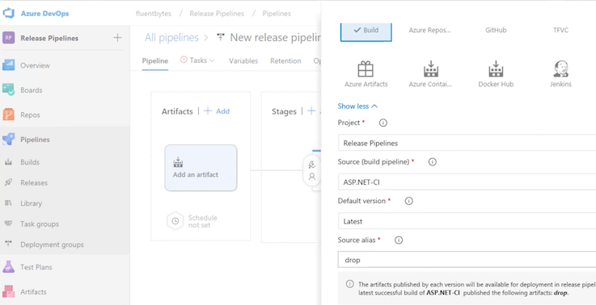 
5. **Set the trigger for continuous deployment to automatically start deployment** to the Azure web application after a successful build. 
	 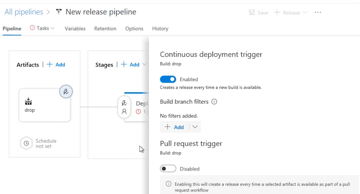 
6. Configure the tasks for the agents, including managing the Azure subscription and selecting the web application and Azure subscription for deployment.
7. Select the type of application service (e.g., web application on Windows), specify the application service name "musicstore-ps," and authenticate with the Azure account.
	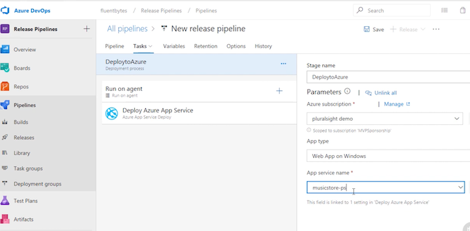 
8. Save the release pipeline and create a release, associating it with the build and specifying any additional release description if necessary.
	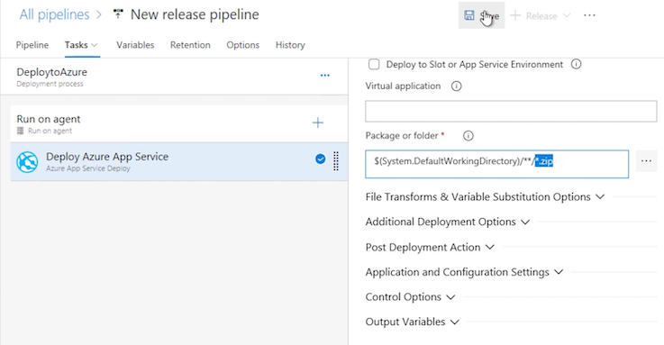 
9. Monitor the deployment progress, validating the successful deployment of the web application to the Azure web app.
	 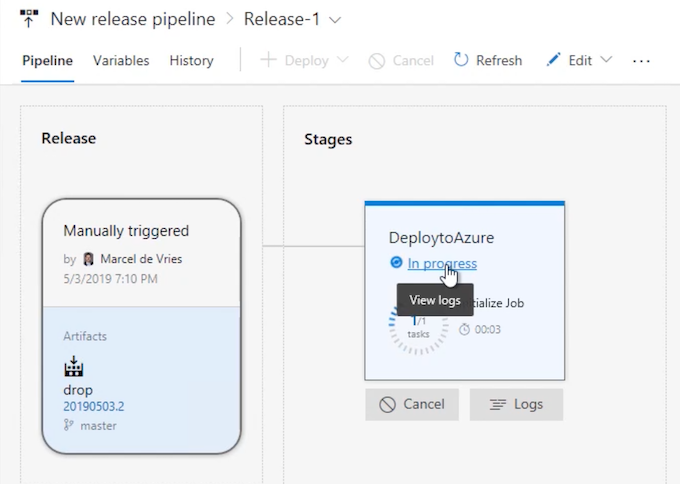 
10. Access the deployed Azure web app to ensure the successful deployment of the MvcMusicStore web application.

## 11 Release Management Infrastructure

**Agents and Pipelines**

* Hosted Agent
* Pipelines
* Custom Agent

1. **Hosted Agents in Azure DevOps**:
   - Microsoft provides hosted agents for which users pay based on usage minutes. **Each Azure DevOps account receives a set of free minutes, and additional minutes can be purchased through the Azure portal**.
   - There are two options for purchasing additional capacity: **buying additional build or release minutes, or investing in hosted pipelines to gain unlimited build or release minutes for one concurrent build or release**.
   - Hosted pipelines offer unlimited minutes and are used for build and release pipelines, collectively forming a container's delivery pipeline.

2. Custom Build Agents:
   - Users can choose to host the build and release agent on their own infrastructure, referred to as a custom build agent. 
   - Each custom build agent registered with Azure DevOps counts as a custom pipeline, with one free custom pipeline by default. 
   - **Additional custom pipelines need to be purchased for hosting multiple custom build agents**.

3. **Interactive Custom Build Agent and Release Agent:**
   - Interactive custom agents are configured to run interactively and are necessary for executing automated UI tests as a part of build or release processes. 
   - They are essential for starting a browser and interacting with the website, especially when running UI tests for UWP or other client applications like Windows Forms.
   - **Interactive agents are always custom agents and cannot be purchased as a hosted option.**

## 12 Hybrid Release Management

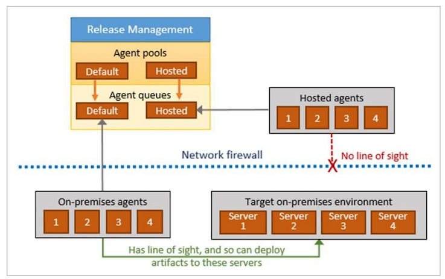 
 
 
## 13 Set up a Custom Agent

1. Open Azure DevOps and navigate to Project settings.
2. Select Agent pools and choose the default pool for installing a new agent.
3. **Download the agent installer and save it to a local drive, then extract the contents of the ZIP file**.

 	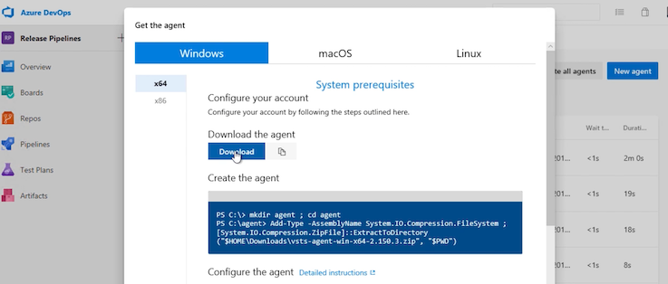 

4. Open a console window and configure the agent by running the config command, **specifying the server URL and creating a personal access token**.
	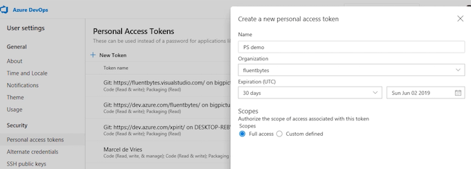 
5. Register the custom agent with Azure DevOps, specifying the agent name and working folder location.
	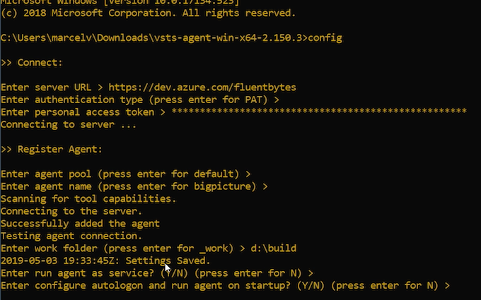 
6. Run the agent as an interactive process and wait for the agent to become available in the pool.
7. Modify a source code file in the Views section and commit the changes to the Azure DevOps repo, triggering a build and subsequent release.
	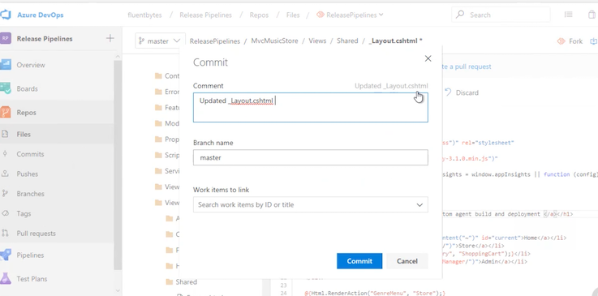 
8. Verify the triggered build and monitor the progress of the release, ensuring the completion of the deployment.
9. Access the web application to confirm the deployment of the changes made in the source code.

## 14 Deploying to On-premise or Cloud

**Deployment Groups**

* Provisioned per project or for multiple teams

	* Deployment Pool
	* Deployment Group

Requires Agent install per machine that is part of the pool/group

**Agent runs as system service**

**Primarily used for on-premises hosting**

1. **Hybrid Solutions:**
   - Many organizations adopt hybrid solutions that combine **on-premises and cloud-based resources for software deployment.**
   - Deployment of software may involve running applications in specific test environments, often targeting virtual machines and utilizing cloud-based resources.

2. **Deployment Groups:**
   - Microsoft's introduction of the deployment group concept addresses the need for efficient and consistent deployment across multiple environments.
   - A deployment group comprises pre-provisioned machines on which the deployment group agent is installed, tailored for use by one or multiple teams. These machines are added to the deployment pool.

3. **Pre-Provisioning and Defined Deployment Group**:
   - The pre-provisioned machines are designated for specific teams and are added to the deployment pool.
   - On each machine, the deployment group agent is installed and configured to belong to a specific deployment group.

4. Agent Configuration and Service Usage:
   - **The deployment group agent is configured to run as a system service, enabling it to perform tasks on the machines within the deployment group while restricting operations on the network.**

5. Purpose of Deployment Group:
   - Deployment groups are primarily utilized for the installation of software or applications on a defined set of pre-provisioned machines, typically available within the organization's network or a cloud subscription.

## 15 Deploy to a deployment group  

1. In Azure DevOps, navigate to the Deployment groups tab and initiate the creation of a deployment group named "MusicstoreOnPrem."

	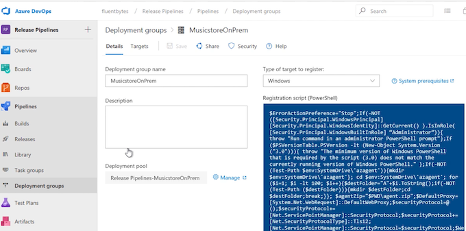 

2. Copy the script for installing a custom agent provided on the right-hand side of the creation page and paste it into a text file for use in setting up the custom agent on a virtual machine.
3. On the virtual machine, with IIS running, open a command prompt and execute the PowerShell script obtained from Azure DevOps to download, install, and configure the Azure Pipelines Agent for the deployment group automatically.
4. Confirm the installation and configuration of the agent by checking the Services Manager to ensure that the Azure Pipelines Agent is running as a service in the background.
5. Return to Azure DevOps and modify the release pipeline to add a new stage for deploying to the on-premises environment within the newly created deployment group.
6. Configure the release pipeline for the on-premises deployment stage, specifying details such as the website, port, application pool, and the associated deployment group "MusicstoreOnPrem."
7. Save the configuration changes, create a new release, and select the latest build to trigger the deployment to both Azure and on-premises environments.
8. Monitor the progress of the release, verify the successful deployment to the on-premises virtual machine, and confirm the availability of the application on the virtual machine's localhost.

