# 2 Infrastructure as Code

## Infrastructure as Code

* Infrastructure defined in text files checked 
in your version control system
* Provision on demand
* From environments to quality gates
* **Improves traceability of changes**
* **Improves repeatability**
* **Improves cost efficiency**

Key Knowledge from the Article:

* Infrastructure as code involves creating infrastructure through self-service provisioning in a cloud environment.
* **Necessary components such as network, compute, storage, and connectivity are defined and stored in a file for source control**.
* Tools like PowerShell, Bash, Ansible, ARM, and Terraform can be used for infrastructure provisioning.
* Systems are provisioned on demand, including connectivity, and cleaned up after use, as opposed to maintaining separate classical environments.
* **By checking infrastructure definitions into a source control repository, changes can be tracked, providing visibility and an audit trail for compliance**.
* This method improves repeatability by running software on clean machines and ensuring any missing configurations are added to the scripts.
* It enhances cost efficiency by only requiring environments when running tests, thereby avoiding idle systems and excessive charges.

## 2 Configuration and Secrets

* Have admin define secrets in variables
* Use the release to replace secrets
* Use transform tasks

1. Azure DevOps can be used to **manage secrets and add them to configurations just in time**, allowing for easy provisioning and execution of software on any environment while keeping secrets out of the source control system.
2. **Define a set of variables containing secrets that should not be stored in source control and provide these to the administrator**.
3. **The administrator can log into Azure DevOps to define the variables with their correct values**, marking them as secrets to prevent others from reading the actual values and to prevent data leakage into log files and reports.
4. Use a "replace tokens" task in the release pipeline to replace placeholders with the actual values needed to successfully roll out or configure the system.
5. Consider using the "replace tokens" task from the marketplace, as it picks up system-defined variables out of the box, providing additional flexibility and convenience during the release step.

## 3 Provisioning on Demand

Provisioning on Demand

* Prepare the environment on which we can deploy our new version of the software
* Azure ARM
* Template
* Parameters

* Provisioning an environment on demand can be achieved using cloud services such as Azure, but the principles can be applied to any **cloud vendor or on-premises system**.
* In Azure, the environment preparation involves deploying necessary resources, **such as an Azure web app for running an ASP.NET web application**.
* ARM (Azure Resource Manager) templates are used to define infrastructure as a service in Azure. These templates use a templating language to express the resources needed, **such as IP addresses, network cards, security groups, virtual machines, disks, and storage.**
* The **ARM template expresses the end state of the required compute resources, and it is fed to the Azure provisioning infrastructure, which analyzes the template and determines the sequence for creating and tying together the resources**.
* **Template parameters allow for variation in each environment, enabling flexibility in provisioning.**
* ARM templates are not exclusive to Azure cloud services; 
	* Microsoft also offers the same technology for on-premises environments through Azure Stack, which combines software with specific hardware to enable running an Azure datacenter on custom racks.

	
## 4 Create New appservice as Part of the Release

* Create a new release definition in Azure DevOps by clicking "new" and then "new release pipeline."

	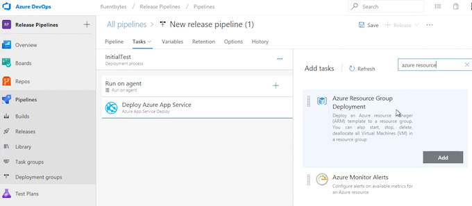 

* Select a template for app service deployment as the foundation to get started with the release.
* **Give the new release definition a name, for example, "InitialTest."**
* Select the Azure subscription and deploy a web app, giving it a name such as "AppTest01."
* **Add a task to deploy a resource** on Azure using "Azure Resource Group Deployment," specifying the subscription, resource group, and location (e.g., West Europe).
* **Obtain the template for deployment by creating a new Azure web app in the Azure portal**, but instead of creating it, save the template.
	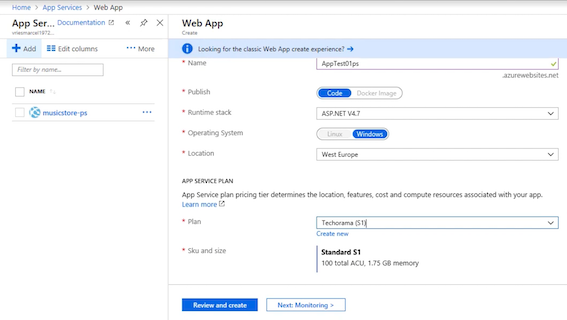 
* Save the template to disk, extract the files, and add them to a local Git repository.
		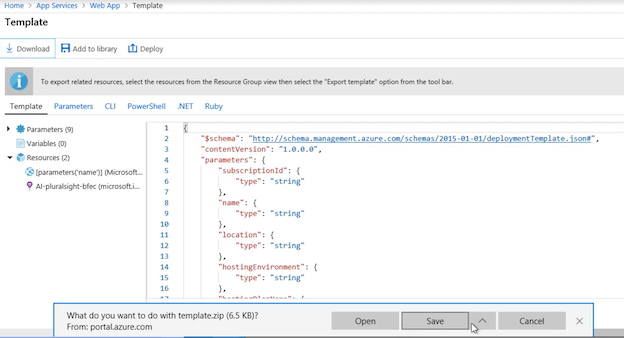 

* Add the template files to the Git repository, commit the changes, and push them to Azure DevOps.
* Define the build to copy the template to an output folder for use in the release by adding a **"Copy Files" task**.
	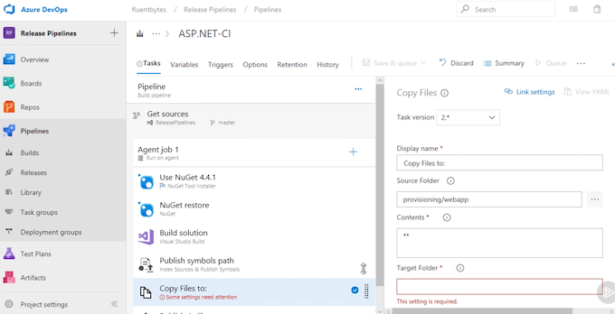 

* Select the template from the drop location, add an artifact, and specify the template file (template.json) and the parameters file (parameters.json).
* **Make any necessary parameter overrides and save the release definition**.
	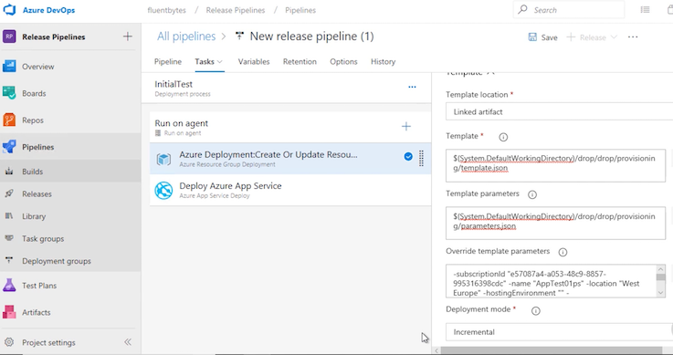 

* Create a new release and follow its progress.
		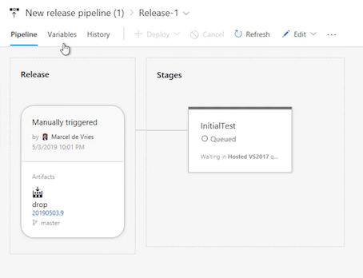 
* Once the release is completed, verify the deployment in the Azure portal, and confirm that the app service resource has been deployed.
	 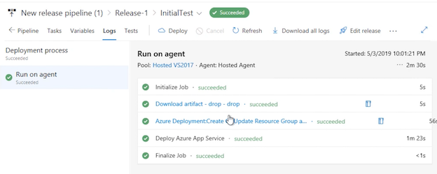 

## 5. Test, Validation, and Approval

* We deploy to the new provisioned resource
* We run various tests
* We report the results
* We de-provision resources
* We wait on approval

### Deploy to the Provisioned appservice and Test the Product Using UI Tests

1. Add Selenium tests to the Musicstore application:
	* Specify the home page URL and ensure that it points to the location where the application is running on your local machine.

2. Create simple UI tests:

	* The first test navigates to the home page and validates the presence of listed products.
	* The second test interacts with the first product, adds it to the cart, and checks out, then validates the checkout page.

3. Run the UI tests in Visual Studio:

	* Use the test explorer to run the tests and ensure they function as expected.

4. Add the tests to the repository:
	* Include the Selenium tests in the Azure DevOps repository for version control.

5. Modify the build pipeline:
	* Add a step to copy the tests to a location for running on a production environment.

	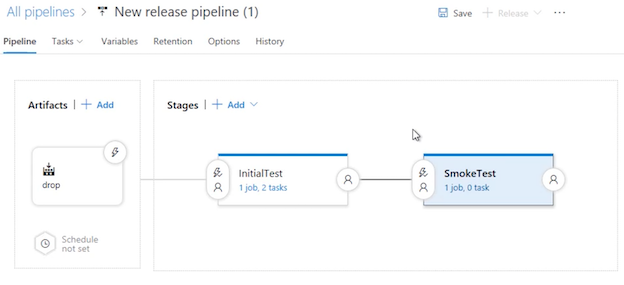 

6. Edit the release pipeline:
	* Add an additional stage for running the UI tests.

7. Configure the test task in the release pipeline:
	* Use the Visual Studio Test task to run the UI tests with Selenium on any available agent.

8. Set up variables:
	* Define a variable, such as MVCHomePageUrl, to specify the location where the web application is running.

	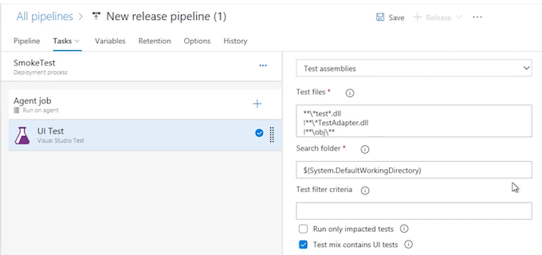 
	
	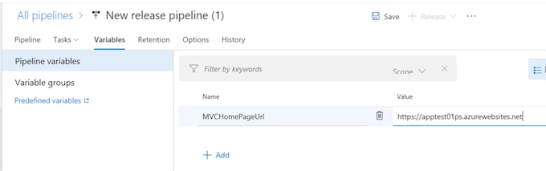 

9. Create and trigger the release:
	* Create a new release and trigger the deployment, ensuring that the tests are included in the process.

		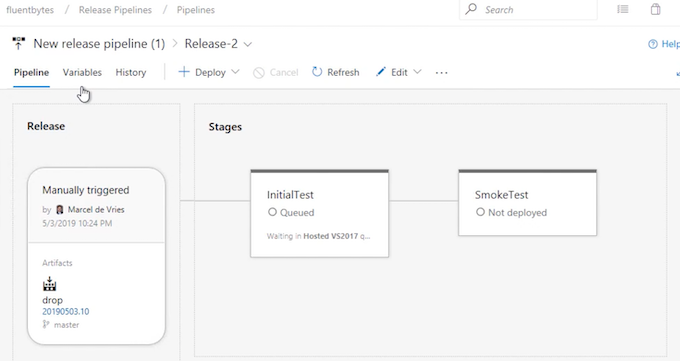 
		
		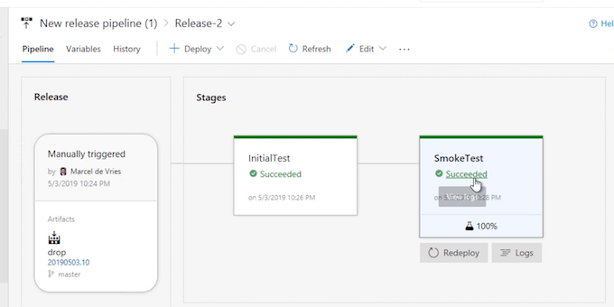 

10. Review test results in Azure DevOps:
	* Upon completion, check the test results in Azure DevOps to verify that all tests have passed.

11. Associate tests with work items:
	* Associate the passed tests with relevant work items in Azure Boards to track functional test coverage.

## Using Containers

Container Workflow

* Build “bakes” the container(s)
* Deployment involves only command to target machine
* Target machine takes care of the work
* Often a cluster, e.g. Kubernetes

### Deploy Website to a Kubernetes Cluster

1. **Add Docker Support to the Project:**

	* Modify the music store application to add Docker support and container support, specifically Docker Compose.
	* This will add a Docker file to the project, enabling the packaging of the web application in a Docker container.

2. **Create Docker Compose File:**

	* The Compose file created will enable deployment to the local machine.

3. Create Deployment File for Kubernetes:

	* **Create an additional file, the deployment file, to be used for deploying to the Kubernetes cluster**.
	* 	Define service endpoints and specify the container registry where the container is hosted.

4. **Create Container Registry in Azure**:

	* Go to the Azure portal and create a new container registry.
	* Specify a name, resource group, region, and enable admin use.

	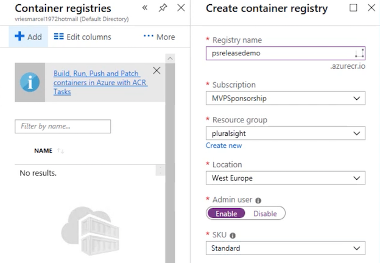
	
	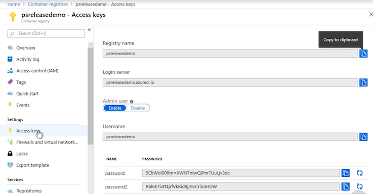

5. **Build and Run Docker Container Locally:**

	* Build the Docker container on the local machine using Visual Studio.
	* Verify the container is running on a specific port with the message "Hello from containers."

6. **Commit Changes to Version Control:**
	* Add container support and deployment information to the Git repository.
	* Stage and commit the files to the local repository.

7. **Sync Changes to Azure DevOps:**
	* Push the changes to Azure DevOps using the sync function.

	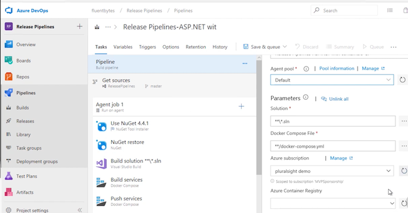

8. **Create Build Template**:
	* **Define a container build using the Git repo and a standard template for ASP.NET with containers**.
	* Specify the agent pool, solution, Azure subscription, and container registry.

	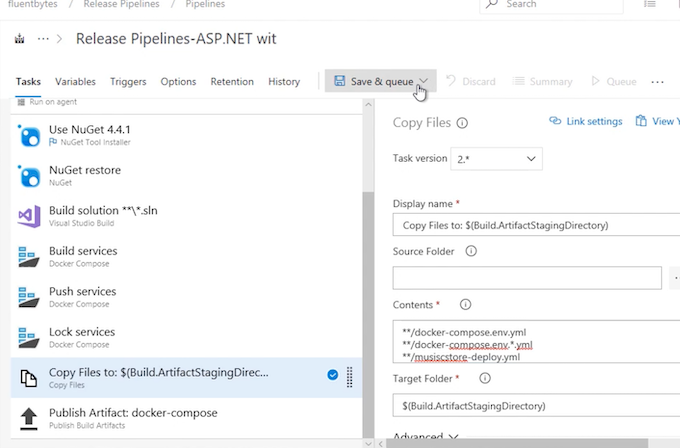
	
	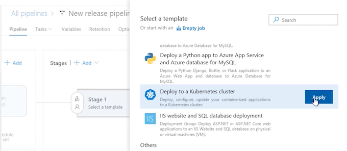
	
	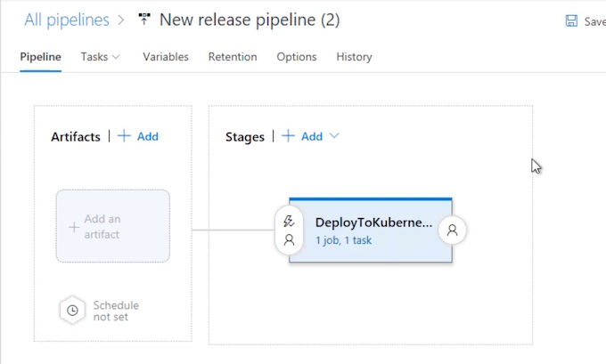

9. **Create Release Pipeline:**

	* Use the "Deploy to Kubernetes cluster" template for the new release.
	* Specify tasks, such as kubectl apply, and define a connection to the Kubernetes cluster.

	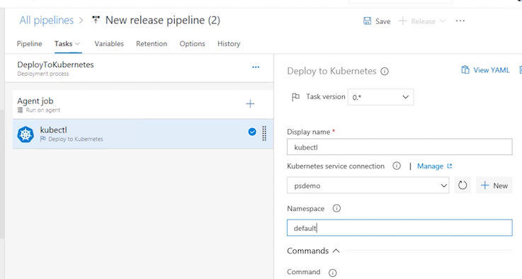
	
	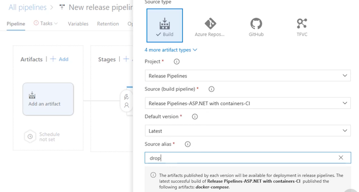
	
	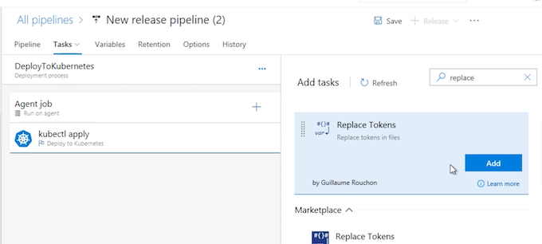
	
	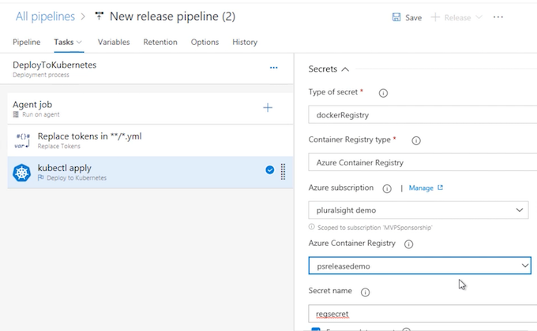

10. **Configure Secrets and Artifact**:

	* Configure secrets for the Kubernetes cluster to connect to the custom registry.
	* Add the artifact from the build to the release pipeline and make necessary file changes using the "Replace tokens" task.

	
11. **Create and Monitor Release**:
	* Create a new release and monitor the deployment process.
	* Verify the deployment to the Kubernetes cluster and check the status of the deployed web application.

	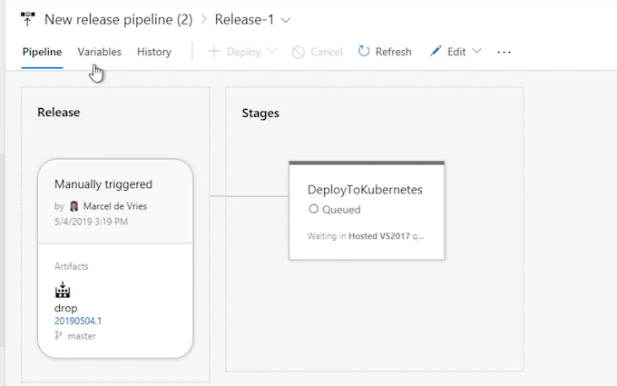

12. **Verify Deployment on Kubernetes Cluster:**
	* Use kubectl proxy command to access the Kubernetes dashboard and verify the deployment of the web application.

## YAML-based Pipelines

* Build pipeline
* Release pipeline
* Combined pipeline experience
* Improved traceability
* Environments

### Integrated YAML Pipelines and Environments

**1. Create a New Environment:**

* Navigate to Azure DevOps Pipelines and Environments.
* Click on "Create environment" and specify a name for the environment, such as "Production."
* Add a Kubernetes cluster as a resource for the environment, selecting the provider as AKS (Azure Kubernetes Service).
* Authenticate against the selected cluster using a Microsoft account.

**2. Create a New Pipeline:**

* Navigate to Pipelines and create a new pipeline.
* Select the Git repo and specify deployment to an Azure Kubernetes service.
* Provide necessary information such as subscriptions, authentication, cluster, namespace, and container registry details.
* Select the image to be used and specify the port for exposure.
* Generate a YAML file containing the full definition of both the build and release steps.

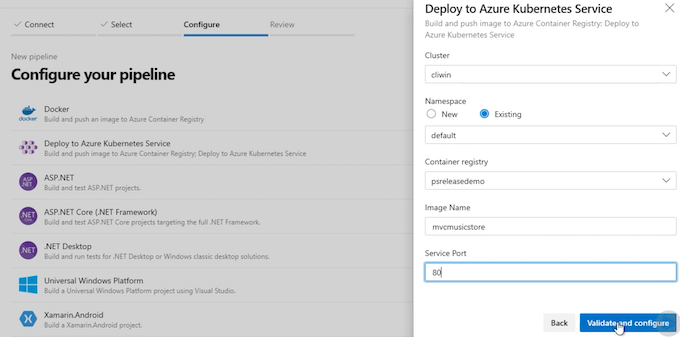

**3. Edit the YAML File:**

* Use the task editor to add a new task, such as the Kubernetes task, for deploying to Kubernetes.
* Specify the connection, namespace, command, arguments, pull secrets, and other necessary details in the YAML file.

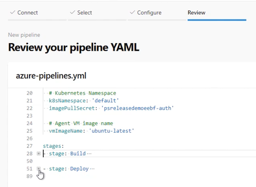

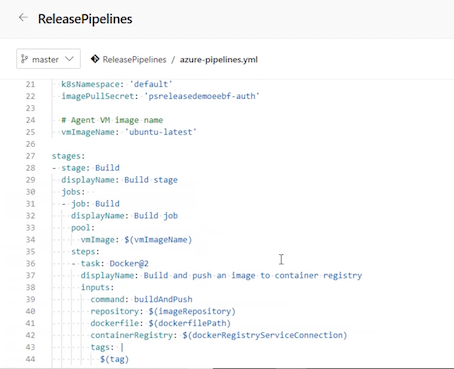

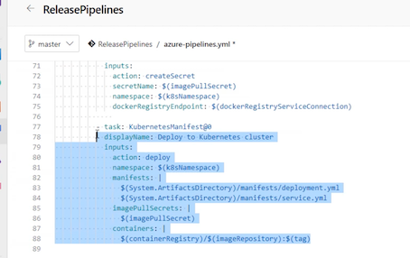

**4. Paste Pipeline Definitions from Build:**

* Copy the YAML file from an existing build definition and paste it into the new combined YAML file for the build and release pipeline.

**5. Save and Commit the Pipeline:**

* Save and close the pipeline, leaving a comment for the commit message.
* Optionally use pull requests for version control.

**6. Monitor the Release:**

* Check the status of the release and build stages to ensure success.
* Verify the deployment in the Kubernetes cluster and check the exposed application on the load balancer.