# 3 Security, Approval, and Audit Trails

* Release pipeline security
* Audit trails and logs
* Four eyes principle

## Release Pipeline Security

### Securable Parts of a Release

* Release Definition
* Release Stages
* Agents & Queues
* Logs & Audit Trails

1. **Release Pipelines Security Management:**

* Understanding how release pipelines support managing rights for creating release definitions, managing releases, and approving releases.
* Knowing that security can be managed at different levels within release pipelines.

2. **Securing Release Definitions:**

* Understanding the process of securing a release definition and controlling who can create a release definition.
* Knowing the role requirements, such as being part of the release administrator's group in Azure DevOps, before creating a release definition.

**3. Managing Stage Permissions:**

* Understanding how to secure specific stages within a release pipeline and control who can make changes to each stage.
* Knowing that permissions for specific stages are managed per stage by setting the appropriate permissions.

**4. Agent Permissions and Access Control:**

* Understanding the importance of agents in running the actual release and the need for agents to have permissions to access certain resources.
* Knowing examples of access requirements, such as needing WinRM access to install a website on a virtual machine, or requiring agents to run on accounts with sufficient credentials to make changes.
* Understanding how to control access to the agents and define administrator, contributor, or reader roles for specific agents.

**5 Change Tracking and Traceability:**

* Understanding the ability to track changes made to the deployment pipeline for traceability purposes.
* Knowing that this feature provides traceability and allows tracking of who made changes and when, providing a means to identify and address incorrect changes.

## Set up Release Security

**1. Accessing Security Options:**

* Open one of the release pipelines in Azure DevOps and navigate to the "..." menu.
* Click on the "Security" option to access the security settings for the release pipeline.

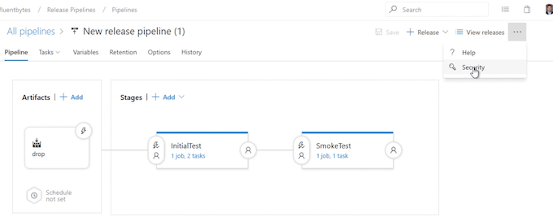 

**2 Setting Permissions for Groups:**

* Within the security settings, view the different groups on the left-hand side, **each with specific permissions such as creating a release, deleting a pipeline, editing a stage, etc**.

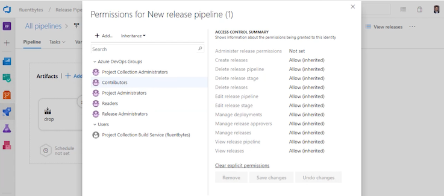 

* Manage permissions for individual users by placing them in the appropriate groups within the team project.

**3 Managing Stage Security:**

* Access the security menu within a specific stage of the release pipeline by clicking on the "..." menu for that stage.

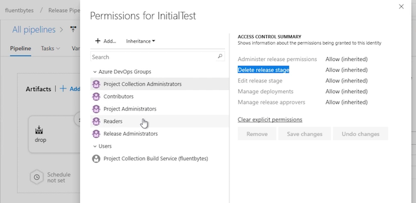 

* Set specific permissions for the stage, such as creating the release stage, allowing or denying permissions as needed.

**4 Audit Trail and History:**

* Explore the history section to view an audit trail of who made what changes in the release pipeline.

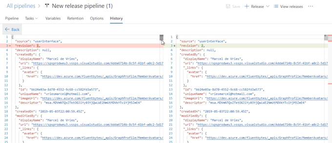 

* Use the diff view to see what actually changed in the pipeline definition created by someone, providing traceability for audit purposes.

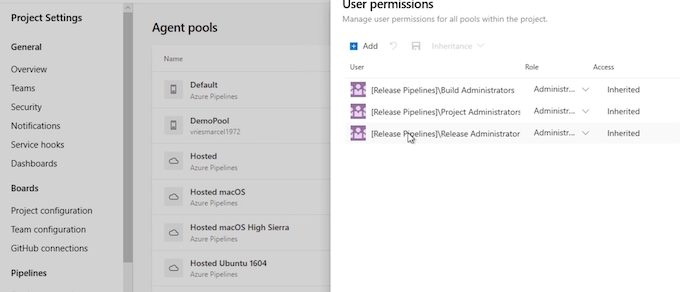 

**5 Managing Security for Agent Pools:**

* Navigate to the options within the pipeline and access the agent pools, where every release runs on an agent.
* Set security permissions for an agent pool, adding users as creators or administrators to manage access to the pool.

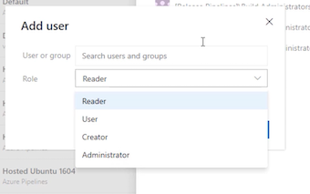 

**6 Creating and Managing Custom Pools:**

* Create a new custom pool and grant permissions specifically for that pool, adding users as readers, users, or administrators as needed.

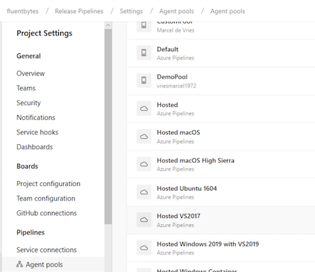 

## Audit Trails and Logs

* Release runs
* Every step in a release is logged
* Every approval is logged
* Changes to release definition
* Access to the Azure DevOps services

## Four Eyes Principle

**The four eyes principle is a requirement that two individuals approve some action before it can be taken**

## Implement Four Eyes Principle

**1. Work Item and Branch Creation:**

* Access Azure DevOps boards and review the work items.
* Log in with a different account in an InPrivate window to demonstrate using an alter ego.
* Review and assign work items to the alter ego account.
* Create a feature branch to begin making changes.

**2. Making Changes and Committing to Feature Branch:**

* Make changes to the code within the feature branch, such as specifying new text in a layout file.
* Save and commit the changes to the feature branch, linking the work items to the committed changes.

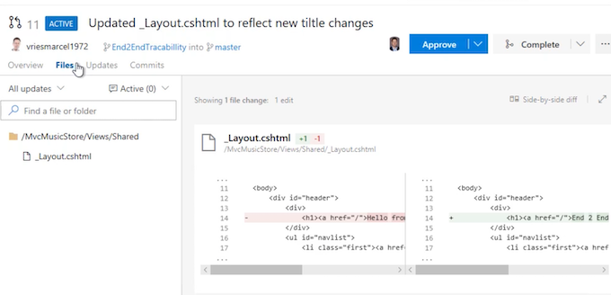 

**3. Pull Request and Code Review:**

* Initiate a pull request to merge the feature branch into the master branch.
* Provide information for the pull request and specify who should review the code changes.
* Review the pull request from the perspective of another user, adding comments and either approving or rejecting the changes.

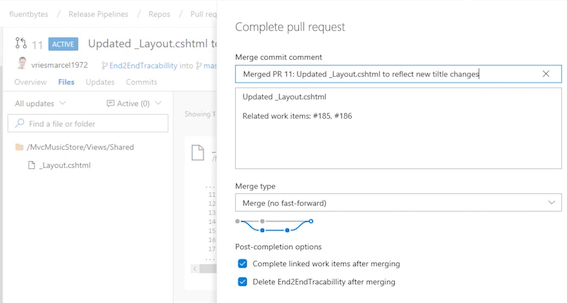 

**4. Release Pipeline and Approval:**

* Create a new release for the successful build.
* Follow the release process, including pending approvals and moving to the next stage after approval.

**5. Smoke Test and End-to-End Traceability:**

* Run UI tests and observe the test pass rate.
* Review the associated changes with the builds, stages, and work items to demonstrate end-to-end traceability in Azure DevOps.

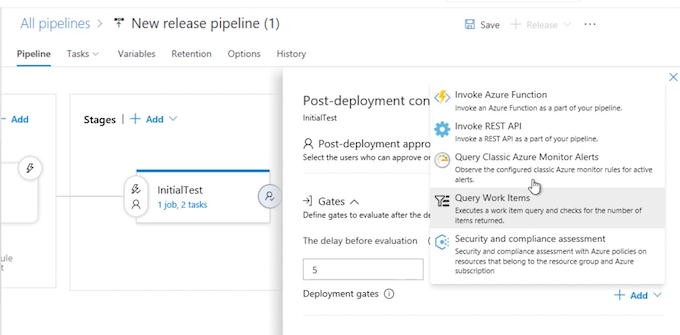 

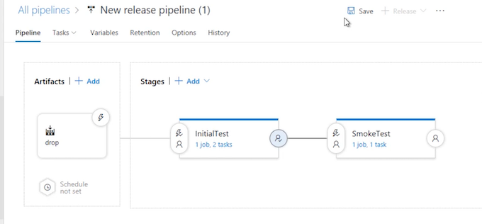 

**6. Tracking Work Items and Deployments:**

* Track the associated changes with work items, deployments, and approvals.
* Review the details of the changes made, the deployment process, and the traceability of work items.

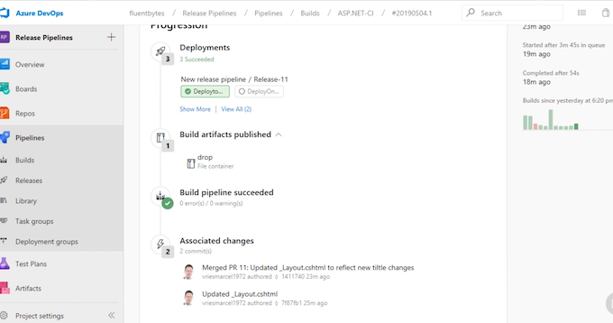 

**7. Demonstrating Four Eyes Principle and Traceability:**

* Emphasize the use of a four eyes principle in Azure DevOps and the ability to maintain end-to-end traceability.

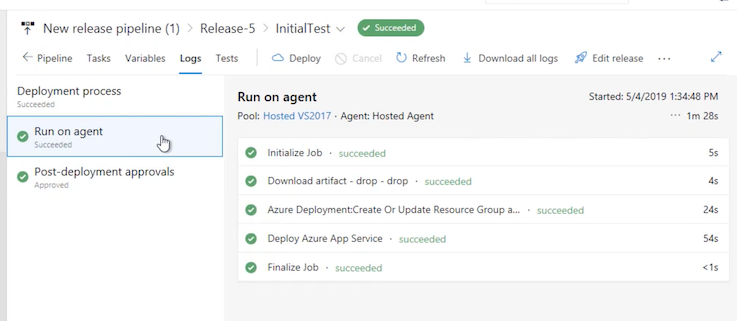
