# Azure DevOps的Azure资源IaC编排实战

## 摘要

Azure DevOps和Terraform来编排和管理Azure云平台上的资源。

Azure DevOps是微软提供的一套持续交付和协作工具，而Terraform是一种基础设施即代码工具，可以帮助我们定义和管理基础架构资源。通过结合使用这两个工具，我们可以实现自动化的资源创建、更新和销毁，提高开发和部署的效率。

**将详细介绍如何配置Azure DevOps和Terraform，以及如何使用它们来编排Azure资源。**


* **Checkov扫描，这个阶段运行Checkov，这是bridgeecrew的一个工具，它可以扫描Terraform配置，在部署之前发现常见的错误配置**。扫描的结果被上传到Pipeline运行中，并作为报告提供。
* Terraform Validate，此阶段运行Terraform Validate命令检查Terraform文件是否有效，如果有问题则管道错误。**规划，这个阶段运行规划命令。根据资源的状态，它会设置变量，这些变量用于确定执行的下一个阶段。地形计划命令的输出也上传到Azure DevOps。**
* Terraform Apply (Auto Approval)，如果计划阶段确定对状态的唯一更改是添加，则运行此阶段，它执行地形应用并影响更改
* **Terraform Apply(手动审批)，如果Terraform Plan阶段确定对状态的更改包括任何被破坏的资源，则运行此阶段，它将触发手动审批任务，提示某人在执行Terraform Apply命令之前进行检查**。

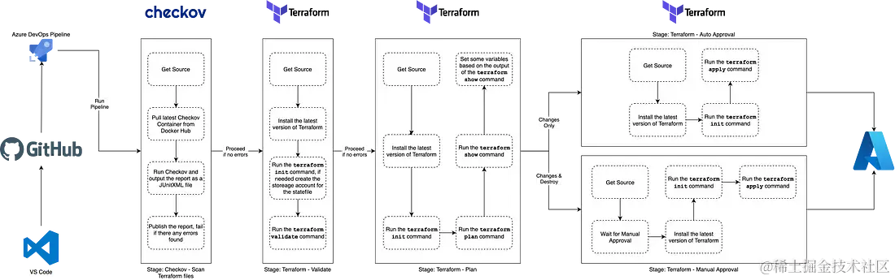 

## 实战

创建仓库

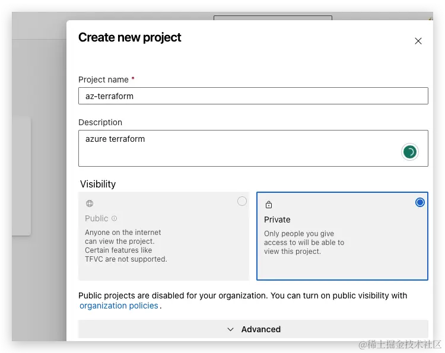 

生成仓库密钥信息

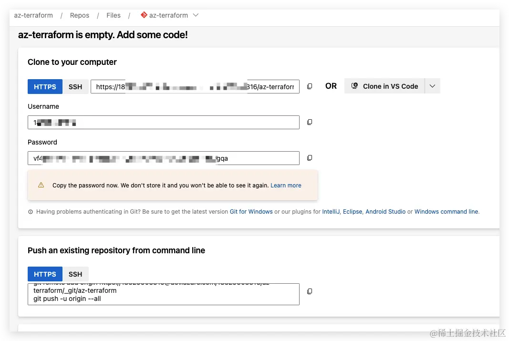 

上传代码

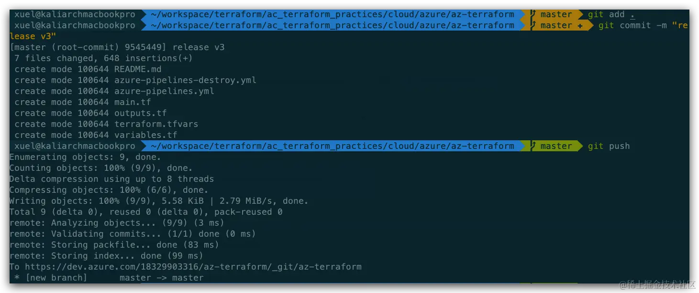 

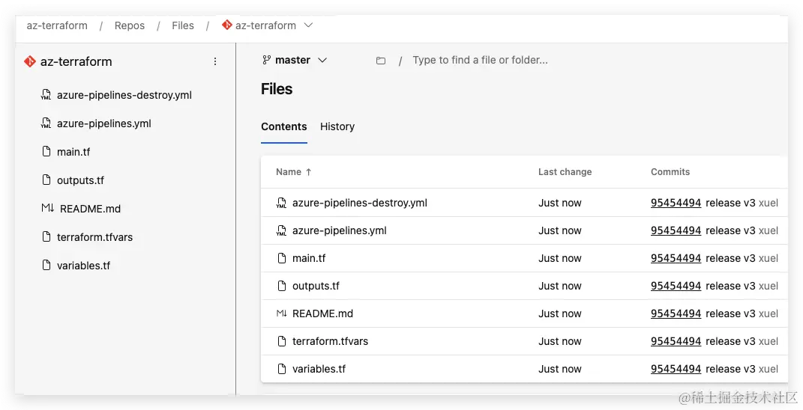 

配置azure pipeline

代码仓库选择Azure Repos Git

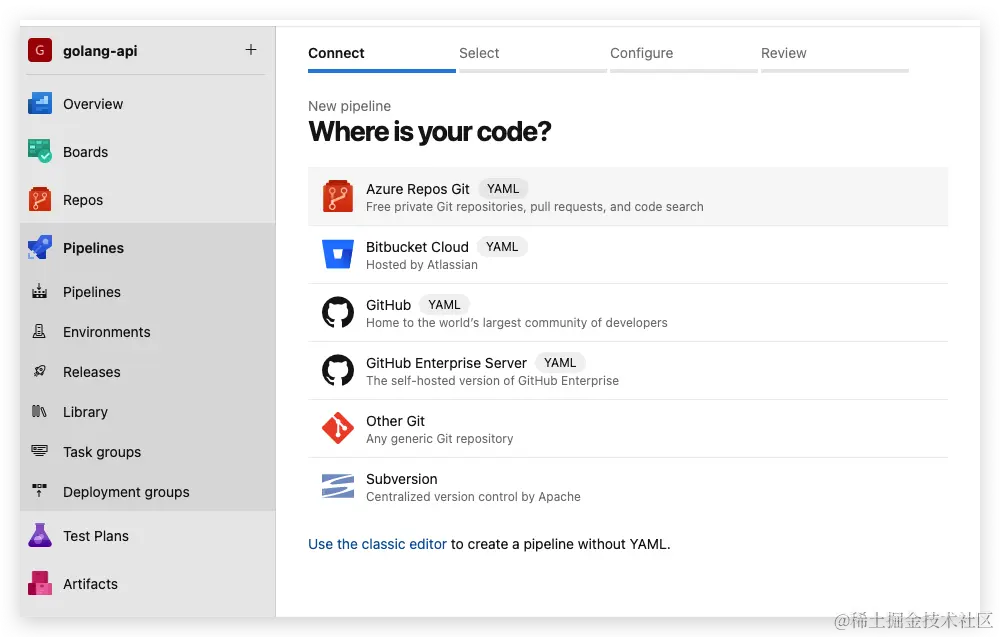 

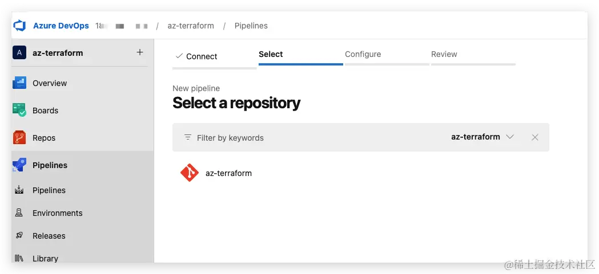 

插件安装，确保仅安装一个插件

[Terraform Azure DevOps extension by Charles Zipp.](https://marketplace.visualstudio.com/items?itemName=charleszipp.azure-pipelines-tasks-terraform)

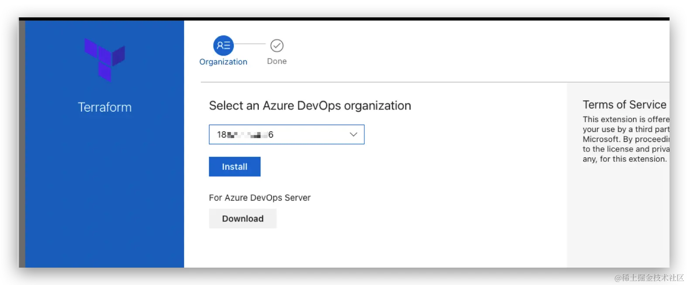 

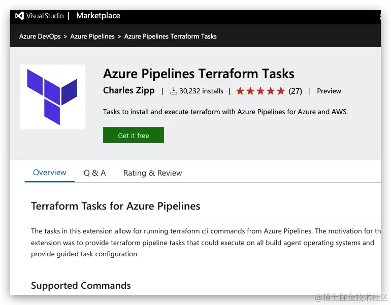 

创建azure devops与azure的链接

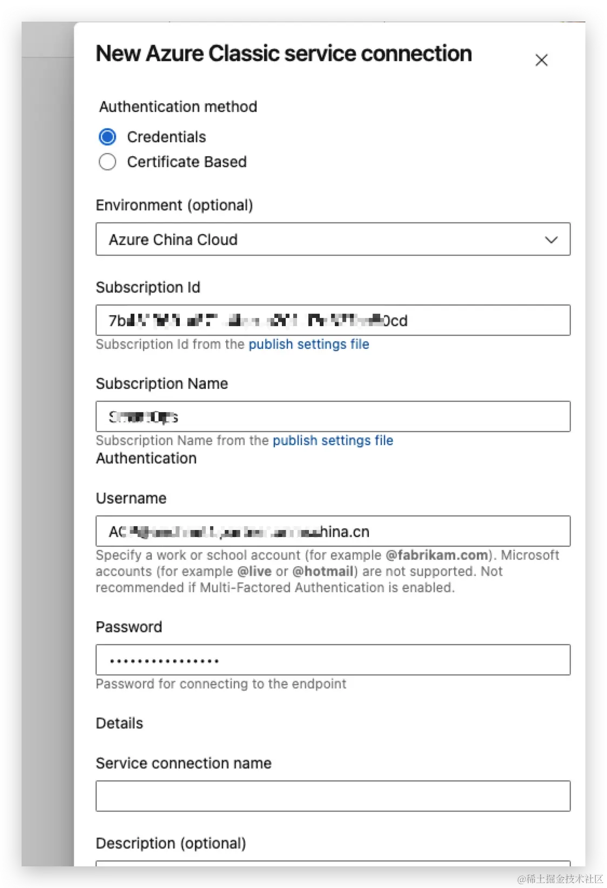 

## 创建敏感信息

由于使用azurerm，针对敏感信息，Library用于存储。

```
export ARM_CLIENT_ID="8a68xxxxxxxxxxxxxx700"
export ARM_CLIENT_SECRET="oEBAyo-xxxxxxxxxxxxxxRhRY"
export ARM_SUBSCRIPTION_ID="7b431969xxxxxxxxxxxxxx27cc80cd"
export ARM_TENANT_ID="ea640xxxxxxxxxxxxxxf0909ddf9a"
```

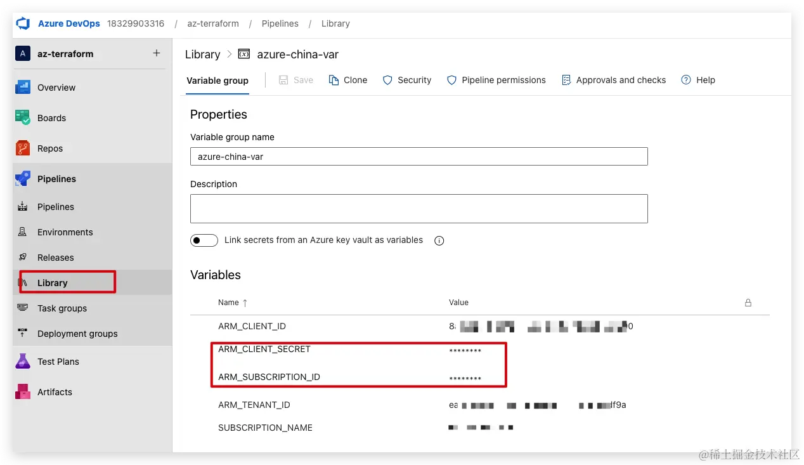 

后期变量引用可以使用 `$(ARM_CLIENT_ID)`使用变量

### 为terraform创建backend

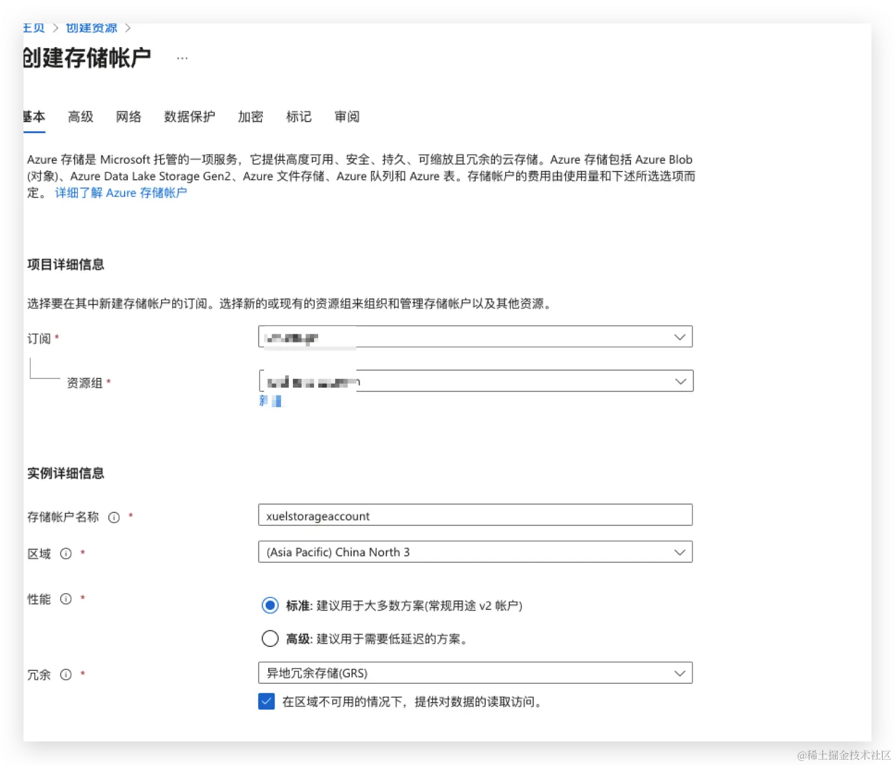 

创建容器

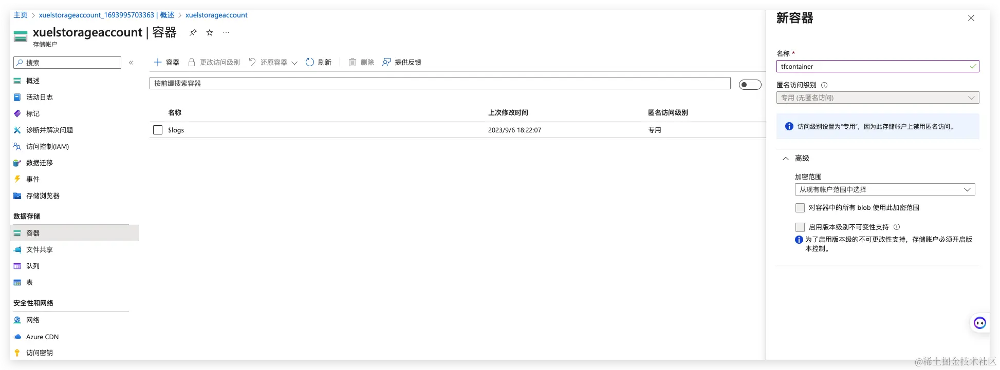 

## Pipeline Stages

### Stage: Checkov Scan

运行的第一阶段是下载并使用[Checkov](https://www.checkov.io/)执行Terraform文件的扫描，您将注意到下面的YAML，我们正在从C[heckov container from Dockerhub](https://hub.docker.com/r/bridgecrew/checkov)拉出Checkov容器并运行它;

```
- stage: "runCheckov"
    displayName: "Checkov - Scan Terraform files"
    jobs:
      - job: "runCheckov"
        displayName: "Checkov > Pull, run and publish results of Checkov scan"
        steps:
          - bash: |
              docker pull bridgecrew/checkov
            workingDirectory: $(System.DefaultWorkingDirectory)
            displayName: "Pull > bridgecrew/checkov"
          - bash: |
              docker run --volume $(pwd):/tf bridgecrew/checkov --directory /tf --output junitxml --soft-fail > $(pwd)/CheckovReport.xml
            workingDirectory: $(System.DefaultWorkingDirectory)
            displayName: "Run > checkov"
          - task: PublishTestResults@2
            inputs:
              testRunTitle: "Checkov Results"
              failTaskOnFailedTests: true
              testResultsFormat: "JUnit"
              testResultsFiles: "CheckovReport.xml"
              searchFolder: "$(System.DefaultWorkingDirectory)"
            displayName: "Publish > Checkov scan results"
```

在你自己的机器上使用Docker本地运行Checkov扫描的命令如下，只要确保它和你的Terraform代码在同一个文件夹中运行即可;

```
docker run \
    --volume $(pwd):/tf \
    bridgecrew/checkov \
    --directory /tf \
    --output junitxml \
    --soft-fail \
    > $(pwd)/CheckovReport.xml
```

正如您所看到的，我们正在挂载当前**文件夹`((pwd)变量)`**，**因为我们已经使用(pwd)变量)，因为我们已经使用(pwd)变量)，因为我们已经使用`(System.DefaultWorkingDirectory)`变量将工作目录设置为代码签出的位置**。

我们还将——**`output`设置为`junitxml`，然后将输出管道输出到一个名为`CheckovReport.xml`的文件**。

使用——`soft-fail`标志的原因是，如果我们不这样做，并且Checkov要发现任何问题，则容器将以导致此任务失败的状态退出。相反，一旦发布了扫描结果，如果报告中有任何错误，我们希望使任务失败。

我们使用内置的[PublishTestResult任务发布测试结果](https://learn.microsoft.com/en-us/azure/devops/pipelines/tasks/reference/publish-test-results-v2?view=azure-pipelines&viewFallbackFrom=azure-devops&tabs=trx%2Ctrxattachments%2Cyaml)，**并将failTaskOnFailedTests选项设置为true**。 我们将在稍后的帖子中设置当或如果此阶段失败时会发生什么。

### Stage: Terraform Validate

这个阶段运行`terraform validate`命令，如果有任何问题，它将失败。正如你从下面的YAML中看到的，这个阶段依赖于runCheckov阶段，我们也在安装Terraform并在执行Terraform validate命令之前运行`Terraform init`;

```
- stage: "validateTerraform"
    displayName: "Terraform - Validate"
    dependsOn:
      - "runCheckov"
    jobs:
      - job: "TerraformJobs"
        displayName: "Terraform > install, init and validate"
        continueOnError: false
        steps:
          - task: TerraformInstaller@0
            inputs:
              terraformVersion: "$(tf_version)"
            displayName: "Install > terraform"

          - task: TerraformCLI@0
            inputs:
              command: "init"
              backendType: "azurerm"
              backendServiceArm: "$(SUBSCRIPTION_NAME)"
              ensureBackend: true
              backendAzureRmResourceGroupName: "$(tf_environment)-$(tf_state_rg)"
              backendAzureRmResourceGroupLocation: "$(tz_state_location)"
              backendAzureRmStorageAccountName: "$(tf_state_sa_name)"
              backendAzureRmStorageAccountSku: "$(tf_state_sku)"
              backendAzureRmContainerName: $(tf_state_container_name)
              backendAzureRmKey: "$(tf_environment).terraform.tstate"
            displayName: "Run > terraform init"

          - task: TerraformCLI@0
            inputs:
              command: "validate"
              environmentServiceName: "$(SUBSCRIPTION_NAME)"
            displayName: "Run > terraform validate"
```

This YAML code snippet defines a pipeline stage for validating Terraform configurations. Here's an analysis of the code:

**1. Stage Definition:**

* Name: validateTerraform
* Display Name: Terraform - Validate
* Dependencies: It depends on the completion of the "runCheckov" job before it can run.

**2. Jobs within the Stage:**

* Job Name: TerraformJobs
* Display Name: Terraform > install, init and validate
* Continue On Error: If set to false, the job will stop the pipeline if any step fails.

**3. Steps within the Job:**

* **Step 1: Install Terraform**

	* Task: **TerraformInstaller@0**
	* Input: terraformVersion is set to `"$(tf_version)"`
	* Display Name: Install > terraform

* **Step 2: Initialize Terraform Backend**

	* Task: TerraformCLI@0
	* Input:
		* Command: "init"
		* Backend Type: "azurerm"
		* Backend Configuration:
		* Resource Group: `"$(tf_environment)-$(tf_state_rg)"`
		* Location: "`$(tz_state_location)`"
		* Storage Account Name: "`$(tf_state_sa_name)`"
		* Storage Account SKU: "`$(tf_state_sku)`"
		* Container Name: `$(tf_state_container_name)`
		* Key: "`$(tf_environment).terraform.tstate`"
	* Display Name: Run > terraform init

* **Step 3: Validate Terraform Configuration**

	* Task: TerraformCLI@0
	* Input:
		* Command: "validate"
		* Environment Service Name: `"$(SUBSCRIPTION_NAME)"`
		* Display Name: Run > terraform validate

当这个阶段执行时，会发生的另一件事是作为terraform init任务的一部分，因为我们将ensureBackend设置为true，任务将检查我们希望用于存储terraform状态文件的Azure存储帐户是否存在，如果不存在，那么任务将帮助我们创建它。

一旦你的代码被验证，我们就可以进入下一个阶段。

### Stage: Terraform Plan

这个阶段是事情变得更有趣的地方，因为我们的环境不会在各个阶段之间持续存在，我们需要安装Terraform并再次运行`Terraform init`。

一旦完成了这些，我们就可以运行terraform plan命令，由于Charles Zipp的`terraform Azure DevOps`扩展中的一些特性，我们可以通过设置`publishPlanResults`选项将运行terraform plan的结果发布到我们的管道运行中。

在我们看这个阶段的最后一个任务之前，让我们看一下整个阶段的代码;

```
- stage: "planTerraform"
    displayName: "Terraform - Plan"
    dependsOn:
      - "validateTerraform"
    jobs:
      - job: "TerraformJobs"
        displayName: "Terraform > install, init & plan"
        steps:
          - task: TerraformInstaller@0
            inputs:
              terraformVersion: "$(tf_version)"
            displayName: "Install > terraform"

          - task: TerraformCLI@0
            inputs:
              command: "init"
              backendType: "azurerm"
              backendServiceArm: "$(SUBSCRIPTION_NAME)"
              ensureBackend: true
              backendAzureRmResourceGroupName: "$(tf_environment)-$(tf_state_rg)"
              backendAzureRmResourceGroupLocation: "$(tz_state_location)"
              backendAzureRmStorageAccountName: "$(tf_state_sa_name)"
              backendAzureRmStorageAccountSku: "$(tf_state_sku)"
              backendAzureRmContainerName: $(tf_state_container_name)
              backendAzureRmKey: "$(tf_environment).terraform.tstate"
            displayName: "Run > terraform init"

          - task: TerraformCLI@0
            inputs:
              command: "plan"
              environmentServiceName: "$(SUBSCRIPTION_NAME)"
              publishPlanResults: "PlanResults"
              commandOptions: "-out=$(System.DefaultWorkingDirectory)/terraform.tfplan -detailed-exitcode"
            name: "plan"
            displayName: "Run > terraform plan"

          - task: TerraformCLI@0
            inputs:
              command: "show"
              environmentServiceName: "$(SUBSCRIPTION_NAME)"
              inputTargetPlanOrStateFilePath: "$(System.DefaultWorkingDirectory)/terraform.tfplan"
            displayName: "Run > terraform show"

          - bash: |
              if [ "$TERRAFORM_PLAN_HAS_CHANGES" = true ] && [ "$TERRAFORM_PLAN_HAS_DESTROY_CHANGES" = false ] ; then
                echo "##vso[task.setvariable variable=HAS_CHANGES_ONLY;isOutput=true]true"
                echo "##vso[task.logissue type=warning]Changes with no destroys detected, it is safe for the pipeline to proceed automatically"
                fi
              if [ "$TERRAFORM_PLAN_HAS_CHANGES" = true ] && [ "$TERRAFORM_PLAN_HAS_DESTROY_CHANGES" = true ] ; then
                echo "##vso[task.setvariable variable=HAS_DESTROY_CHANGES;isOutput=true]true"
                echo "##vso[task.logissue type=warning]Changes with Destroy detected, pipeline will require a manual approval to proceed"
                fi
              if [ "$TERRAFORM_PLAN_HAS_CHANGES" != true ] ; then
                echo "##vso[task.logissue type=warning]No changes detected, terraform apply will not run"
              fi
            name: "setvar"
            displayName: "Vars > Set Variables for next stage"
```

Here is an analysis of the provided YAML code snippet:

1. **Stage Definition:**
   - Name: planTerraform
   - Display Name: Terraform - Plan
   - Dependencies: It depends on the completion of the "validateTerraform" stage before it can run.

2. **Jobs within the Stage:**
   - Job Name: TerraformJobs
   - Display Name: Terraform > install, init & plan

3. **Steps within the Job:**
   - **Step 1: Install Terraform**
     - Task: TerraformInstaller@0
     - Input: terraformVersion is set to "$(tf_version)"
     - Display Name: Install > terraform

   - **Step 2: Initialize Terraform Backend**
     - Task: TerraformCLI@0
     - Input:
       - Command: "init"
       - Backend Type: "azurerm"
       - Backend Configuration:
         - Resource Group: "$(tf_environment)-$(tf_state_rg)"
         - Location: "$(tz_state_location)"
         - Storage Account Name: "$(tf_state_sa_name)"
         - Storage Account SKU: "$(tf_state_sku)"
         - Container Name: $(tf_state_container_name)
         - Key: "`$(tf_environment).terraform.tstate`"
       - Display Name: Run > terraform init

   - **Step 3: Generate Terraform Plan**
     - Task: TerraformCLI@0
     - Input:
       - Command: "plan"
       - Environment Service Name: "$(SUBSCRIPTION_NAME)"
       - Publish Plan Results: "PlanResults"
       - Command Options: "-out=$(System.DefaultWorkingDirectory)/terraform.tfplan -detailed-exitcode"
       - Name: plan
       - Display Name: Run > terraform plan

   - **Step 4: Show Terraform Plan**
     - Task: TerraformCLI@0
     - Input:
       - Command: "show"
       - Environment Service Name: "`$(SUBSCRIPTION_NAME)`"
       - Input Target Plan or State File Path: "`$(System.DefaultWorkingDirectory)/terraform.tfplan`"
       - Display Name: Run > terraform show

   - **Step 5: Set Variables for Next Stage**
     - Bash Script:
       - The script checks the Terraform plan for changes and sets variables accordingly.
       - If changes are detected without destroy changes, it sets a variable and logs a warning.
       - If changes with destroy changes are detected, it sets a different variable and logs a warning.
       - If no changes are detected, it logs a warning that Terraform apply will not run.
       - Name: setvar
       - Display Name: Vars > Set Variables for next stage

This pipeline stage sets up Terraform by installing it, initializing the backend configuration for Azure, generating a Terraform plan, showing the plan, and then setting variables based on the changes detected in the plan for use in the next stage of the pipeline.

在我们运行了terraform计划之后，我们立即使用terraform运行terraform显示。我们刚刚生成的Tfplan文件。

当使用Charles Zipp的Terraform Azure DevOps扩展时，它实际上设置了一些非常有用的变量。

首先，如果由于`TERRAFORM_PLAN_HAS_CHANGES`命令而有任何更改，则将名为`TERRAFORM_PLAN_HAS_CHANGES`的变量设置为true。

当对.tfplan执行`terraform show`命令时，如果.tfplan包含任何正在被销毁的资源，则第二个变量名为`terraform_plan_has_destroy_changes`将被设置为true。

在该阶段的最后一个任务中，我们将使用bash设置一些变量，这些变量将帮助决定执行下面哪个阶段(如果有的话)。

因此，如果一下配置设置


* `TERRAFORM_PLAN_HAS_CHANGES = true`
* `TERRAFORM_PLAN_HAS_DESTROY_CHANGES = false`

然后安全地继续自动执行下一阶段，所以我们可以在下一阶段中选择它，我们将名为`HAS_CHANGES_ONLY`的变量设置为true。

### Stage: Terraform Apply (Auto Approval)

只有在满足以下条件时才执行此阶段;

```
condition: |
and
(
succeeded(),
eq(dependencies.planTerraform.outputs['TerraformJobs.setvar.HAS_CHANGES_ONLY'], 'true')
)
```

正如您所看到的，我们正在引用在前一阶段使用以下echo命令设置的变量;

```
echo "##vso[task.setvariable variable=HAS_CHANGES_ONLY;isOutput=true]true"
```

然后通过添加阶段、作业、任务和变量本身的名称来引用变量，因此类似于;

```
dependencies.STAGE_NAME.outputs['JOB_NAME.TASK_NAME.VARIABLE_NAME']
```

整个阶段是这样的:

```
  - stage: "autoTerraform"
    displayName: "Terraform - Auto Approval"
    dependsOn:
      - "planTerraform"
    condition: |
      and
        (
          succeeded(),
          eq(dependencies.planTerraform.outputs['TerraformJobs.setvar.HAS_CHANGES_ONLY'], 'true')
        )
    jobs:
      - job: "TerraformAuto"
        displayName: "Terraform > install, init & apply"
        steps:
          - task: TerraformInstaller@0
            inputs:
              terraformVersion: "$(tf_version)"
            displayName: "Install > terraform"

          - task: TerraformCLI@0
            inputs:
              command: "init"
              backendType: "azurerm"
              backendServiceArm: "$(SUBSCRIPTION_NAME)"
              ensureBackend: true
              backendAzureRmResourceGroupName: "$(tf_environment)-$(tf_state_rg)"
              backendAzureRmResourceGroupLocation: "$(tz_state_location)"
              backendAzureRmStorageAccountName: "$(tf_state_sa_name)"
              backendAzureRmStorageAccountSku: "$(tf_state_sku)"
              backendAzureRmContainerName: $(tf_state_container_name)
              backendAzureRmKey: "$(tf_environment).terraform.tstate"
            displayName: "Run > terraform init"

          - task: TerraformCLI@0
            inputs:
              command: "apply"
              environmentServiceName: "$(SUBSCRIPTION_NAME)"
            displayName: "Run > terraform apply"
```

在最后运行Terraform apply之前，我们再次安装了Terraform并运行了Terraform init

### Stage: Terraform Apply (Manual Approval)


除了包含一个在Terraform作业之前运行的作业之外，这个阶段几乎与自动审批完全相同;

```
 - stage: "approveTerraform"
    displayName: "Terraform - Manual Approval"
    dependsOn:
      - "planTerraform"
    condition: |
      and
        (
          succeeded(),
          eq(dependencies.planTerraform.outputs['TerraformJobs.setvar.HAS_DESTROY_CHANGES'], 'true')
        )
    jobs:
      - job: "waitForValidation"
        displayName: "Wait > Wait for manual appoval"
        pool: "server"
        timeoutInMinutes: "4320" # job times out in 3 days
        steps:
          - task: ManualValidation@0
            timeoutInMinutes: "1440" # task times out in 1 day
            inputs:
              notifyUsers: |
                azure@mckendrick.io
              instructions: "There are resources being destroyed as part of this deployment, please review the output of Terraform plan before approving."
              onTimeout: "reject"

      - job: "TerraformApprove"
        displayName: "Terraform > install, init & apply"
        dependsOn: "waitForValidation"
        steps:
          - task: TerraformInstaller@0
            inputs:
              terraformVersion: "$(tf_version)"
            displayName: "Install > terraform"

          - task: TerraformCLI@0
            inputs:
              command: "init"
              backendType: "azurerm"
              backendServiceArm: "$(SUBSCRIPTION_NAME)"
              ensureBackend: true
              backendAzureRmResourceGroupName: "$(tf_environment)-$(tf_state_rg)"
              backendAzureRmResourceGroupLocation: "$(tz_state_location)"
              backendAzureRmStorageAccountName: "$(tf_state_sa_name)"
              backendAzureRmStorageAccountSku: "$(tf_state_sku)"
              backendAzureRmContainerName: $(tf_state_container_name)
              backendAzureRmKey: "$(tf_environment).terraform.tstate"
            displayName: "Run > terraform init"

          - task: TerraformCLI@0
            inputs:
              command: "apply"
              environmentServiceName: "$(SUBSCRIPTION_NAME)"
            displayName: "Run > terraform apply"
```

该作业基本上会使管道执行暂停24小时，在此之后，如果没有人批准运行，则作业将失败。该作业使用ManualValidation@0任务，有关该任务的更多详细信息，请参见

[https://learn.microsoft.com/en-us/azure/devops/pipelines/tasks/reference/manual-validation-v0?view=azure-pipelines&viewFallbackFrom=azure-devops&tabs=yaml](https://learn.microsoft.com/en-us/azure/devops/pipelines/tasks/reference/manual-validation-v0?view=azure-pipelines&viewFallbackFrom=azure-devops&tabs=yaml)

一旦批准，将执行Terraform作业，这将最终运行Terraform应用程序，这将导致您的Terraform状态文件中至少有一个资源被销毁。

### 运行Pipeline


现在让我们看看如何运行管道，首先让我们签入一些添加基本资源组的代码。 为此，Terraform代码如下所示;

```
resource "azurecaf_name" "rg_example" {
  name          = "demogroup"
  resource_type = "azurerm_resource_group"
  prefixes      = ["dev"]
  clean_input   = true
}

resource "azurerm_resource_group" "resource_group" {
  name     = azurecaf_name.rg_example.result
  location = "uksouth"
  tags     = merge(var.default_tags, tomap({ "type" = "resource" }))
}
```

我使用[Azure CAF Name provider](https://registry.terraform.io/providers/aztfmod/azurecaf/latest/docs/resources/azurecaf_name) 提供程序来生成资源组的名称，然后使用[AzureRM provider](https://registry.terraform.io/providers/hashicorp/azurerm/latest/docs) 提供程序来创建它。

[https://github.com/russmckendrick/DevOpsTerraformPipeline/blob/main/azure-pipelines-destroy.yml](https://github.com/russmckendrick/DevOpsTerraformPipeline/blob/main/azure-pipelines-destroy.yml)