# 5 基于Azure Devops的Golang 项目云主机CI/CD实战

## 一 背景

Azure DevOps是一个支持协作文化的软件开发平台，它集成了多个功能模块，包括Azure Boards、Azure Repos、Azure Pipelines、Azure Test Plans和Azure Artifacts。

**Azure DevOps可以在云中使用Azure DevOps Services，也可以在本地使用Azure DevOps Server。**

Azure DevOps Services提供了快速设置、免维护操作、跨域协作、弹性缩放和坚实的安全性等优势，同时支持与GitHub.com和GitHub Enterprise Server集成。**Azure DevOps Server适用于需要将数据保留在本地网络中或对工作跟踪自定义有特殊要求的情况。无论选择哪种方式，使用Azure DevOps可以加速软件开发过程，提高团队的协作效率**。

## 二 前言

随着DevOps的发展，各大主流云厂商都开始推出了自家的产品，例如：AWS 的codepipeline，微软的Azure Devops，阿里的云效，腾讯的Coding，Teambition的飞流，等，各家厂商产品的形态各有千秋。


本文将展开介绍Azure 的DevOps平台，Azure DevOps提供了一整套工具来支持项目中各个人员之间的协作。微软作为世界顶尖的科技公司，在软件设计理念上具有独到之处。选择Azure DevOps的原因之一是它的全球面向目标，可以从中吸收到与国内不同的思维模式，以改进自己的思维。通过研究Azure DevOps并编写相关文章，可以深入了解其使用方法和优势，从而帮助团队提升协作效率和软件开发速度。

## 三 Azure DevOps简介

Azure DevOps是一个全面的软件开发平台，为团队提供了一系列工具和功能来支持协作和持续交付。下面是对Azure DevOps核心组件的更详细介绍：


1. Azure Boards：Azure Boards提供了一个灵活的工作管理系统，支持敏捷、Scrum和看板等项目管理方法。团队可以创建用户故事、任务和缺陷，并将其组织成迭代和工作区。Azure Boards还提供了可自定义的仪表板和报告，以跟踪工作进度和团队绩效。
2. Azure Pipelines：Azure Pipelines是一个持续集成和持续交付 (CI/CD) 平台，支持在多个平台和语言上构建、测试和部署应用程序。它提供了可配置的构建和发布管道，可以自动化构建、测试和部署过程，并支持与各种开发工具和云平台的集成。
3. Azure Test Plans：Azure Test Plans提供了全面的测试管理功能，包括计划、跟踪和执行测试用例、收集和分析测试结果，以及管理缺陷。它支持手动测试、自动化测试和探索式测试，并提供了丰富的报告和分析工具，帮助团队监控和改进应用程序的质量。
4. Azure Repos：Azure Repos是一个代码版本控制系统，支持Git和Team Foundation Version Control (TFVC)。团队可以使用Azure Repos托管和管理代码库，进行版本控制、代码合并和分支管理。它还提供了代码审查和集成工具，帮助团队确保代码质量和一致性。
5. Azure Artifacts：Azure Artifacts是一个包管理工具，用于存储和共享软件包和依赖项。它支持多种包类型，如NuGet、npm、Maven和Python。开发团队可以使用Azure Artifacts创建、发布和管理自己的包，以及访问和使用公共包注册表。


通过使用这些Azure DevOps组件，团队可以实现更高效的协作、持续集成和交付，以及更好的测试和版本控制管理。这些工具的集成和功能丰富性使得Azure DevOps成为一个强大的选择，能够满足各种规模和类型的软件开发项目的需求。

## 四 构建阶段

### 4.1 代码托管

在此利用gin编写一个简单的web服务器，监听8000端口，发送get请求返回API 版本，代码结构及内容如下：

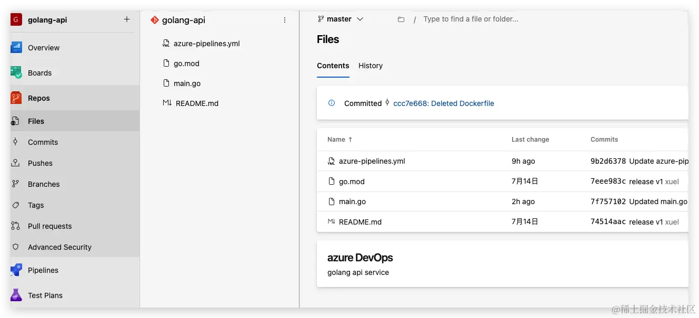 

```
# main.go
package main

import (
    "encoding/json"
    "fmt"
    "net/http"
)

type User struct {
    Name string `json:"name"`
    Age  int    `json:"age"`
}

func handler(w http.ResponseWriter, r *http.Request) {
    if r.Method == "GET" {
        w.Write([]byte("API v9.0"))
    } else if r.Method == "POST" {
        // Decode request body into user struct
        dec := json.NewDecoder(r.Body)
        var u User
        err := dec.Decode(&u)
        if err != nil {
            http.Error(w, err.Error(), http.StatusBadRequest)
            return
        }

        // Encode and write user struct as JSON response
        w.Header().Set("Content-Type", "application/json")
        enc := json.NewEncoder(w)
        enc.Encode(u)
    }
}

func main() {
    http.HandleFunc("/", handler)
    fmt.Printf("Starting server at port 8000\n")
    http.ListenAndServe(":8000", nil)
}
```

完成之后有一个注意事项，我们的流水线默认是没有配额的，我们需要申请一个免费的配额，申请的网址如下：[https://forms.office.com/pages/responsepage.aspx?id=v4j5cvGGr0GRqy180BHbR5zsR558741CrNi6q8iTpANURUhKMVA3WE4wMFhHRExTVlpET1BEMlZSTCQlQCN0PWcu](https://forms.office.com/pages/responsepage.aspx?id=v4j5cvGGr0GRqy180BHbR5zsR558741CrNi6q8iTpANURUhKMVA3WE4wMFhHRExTVlpET1BEMlZSTCQlQCN0PWcu)


申请的过程需要2-3个工作日，所以需要提前把这个事儿给干了，当你申请成功之后，azure会给你发这个邮件,有了构建agent才可以后续执行pipelines和release操作。

### 4.2 创建Pipeline

完成Golang项目托管后，配置CI步骤，配置Golang项目的构建并发布到构建仓库。

只需要在代码仓库中存在azure-pipelines.yml文件，该文件描述了具体的step过程，在此是利用go build构建golangapi 二进制可执行文件，其次将其发不到Artifacts中。

go build使用的Go tasks

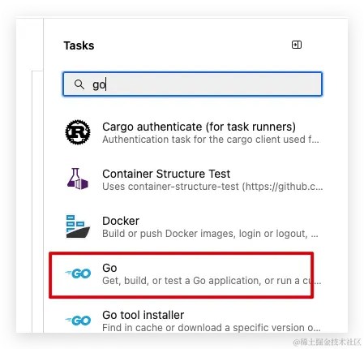 

发布制品使用Publish Pipeline Artifacts 的tasks

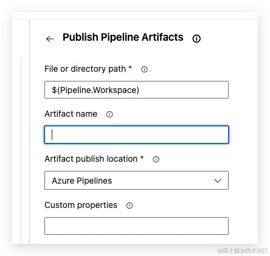 

```
trigger: 
 - master

pool:
   vmImage: 'ubuntu-latest'

steps: 
- task: Go@0
  env:
    CGO_ENABLED: 0
  inputs:
    command: build
    arguments: -ldflags="-s -w" -o golangapi ./main.go


- script: 
   pwd;
   ls;
   mkdir target;
   cp golangapi target;

- task: PublishBuildArtifacts@1
  inputs:
    PathtoPublish: '/home/vsts/work/1/s/target'
    ArtifactName: 'golang'
    publishLocation: 'Container'
```

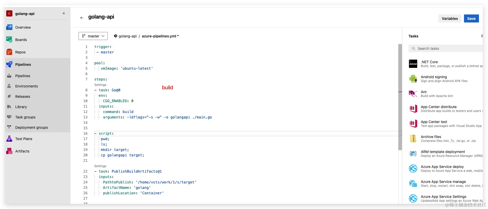 

完成构建后，可以查看构建job

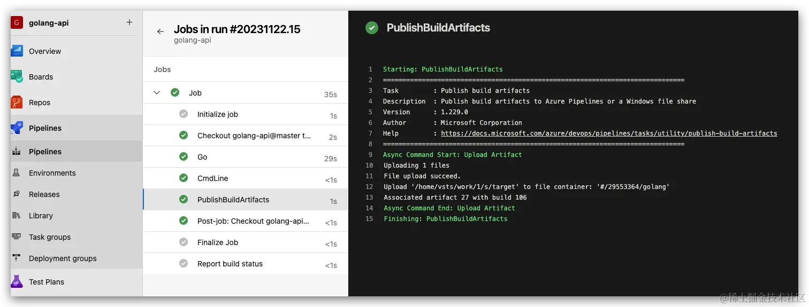 

查看编译出来的golangapi 二进制文件。

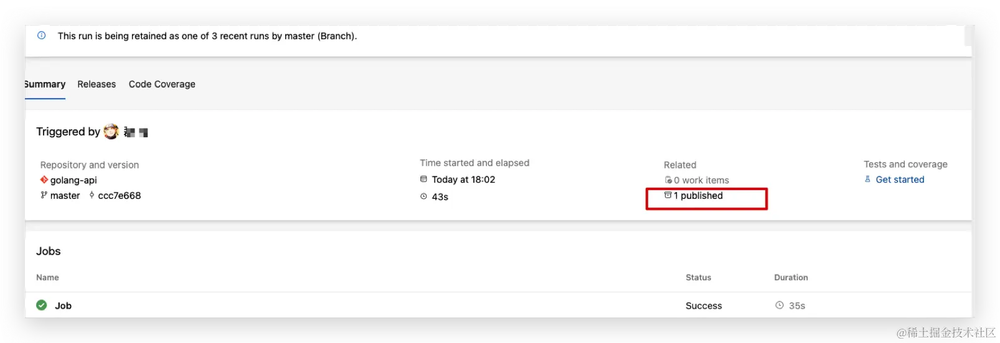 

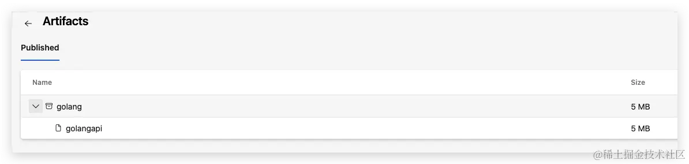 

至此就完成了构建工程。

## 五 部署阶段

以及完成了Pipelines中的将源码构建出二进制文件，在此案例中将其利用FTP发不到腾讯云轻量服务器中，完成服务部署。

### 5.1 目标主机准备

* 腾讯云轻量服务器准备

在腾讯云开通轻量云服务器，针对主机可以任意具备公网IP的主机，阿里/华为/aws也都可以。

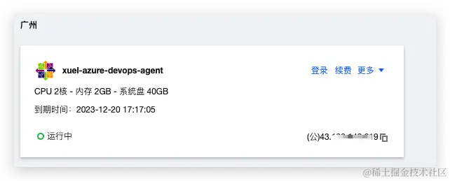 

* 在主机中部署FTP

```
#!/bin/bash

#------------------------------------------------------------------------------------
# Install vsFTPd
#------------------------------------------------------------------------------------

yum install -y vsftpd
systemctl enable vsftpd.service
mkdir -p /etc/vsftpd/vconf

#------------------------------------------------------------------------------------
# Configure vsFTPd data directory and user
#------------------------------------------------------------------------------------

mkdir -p /data/ftp
useradd -s /sbin/nologin -d /data/ftp vsftpd
chown -R vsftpd:vsftpd /data/ftp

#------------------------------------------------------------------------------------
# Configure vsFTPd (/etc/vsftpd/vsftpd.conf)
#------------------------------------------------------------------------------------

cp /etc/vsftpd/vsftpd.conf{,.original}

sed -i "s/^.*anonymous_enable.*/anonymous_enable=NO/g" /etc/vsftpd/vsftpd.conf
sed -i "/^xferlog_std_format*a*/ s/^/#/" /etc/vsftpd/vsftpd.conf
sed -i "s/#idle_session_timeout=600/idle_session_timeout=900/" /etc/vsftpd/vsftpd.conf
sed -i "s/#nopriv_user=ftpsecure/nopriv_user=vsftpd/" /etc/vsftpd/vsftpd.conf
sed -i "/#chroot_list_enable=YES/i\chroot_local_user=YES" /etc/vsftpd/vsftpd.conf
sed -i 's/listen=NO/listen=YES/' /etc/vsftpd/vsftpd.conf
sed -i 's/listen_ipv6=YES/listen_ipv6=NO/' /etc/vsftpd/vsftpd.conf

echo 'allow_writeable_chroot=YES
guest_enable=YES
guest_username=vsftpd
local_root=/data/ftp/$USER
user_sub_token=$USER
virtual_use_local_privs=YES
user_config_dir=/etc/vsftpd/vconf' >> /etc/vsftpd/vsftpd.conf

systemctl start vsftpd.service

#------------------------------------------------------------------------------------
# Configure pam (/etc/pam.d/vsftpd)
#------------------------------------------------------------------------------------

cp /etc/pam.d/vsftpd{,.original}

echo '#%PAM-1.0
auth required pam_userdb.so db=/etc/vsftpd/password crypt=crypt
account required pam_userdb.so db=/etc/vsftpd/password crypt=crypt
session required pam_loginuid.so' > /etc/pam.d/vsftpd

#------------------------------------------------------------------------------------
# Configure firewalld
#------------------------------------------------------------------------------------

yum install -y firewalld
systemctl start firewalld.service
systemctl enable firewalld.service
firewall-cmd --permanent --add-service=ftp
firewall-cmd --reload

#------------------------------------------------------------------------------------
# Configure selinux
#------------------------------------------------------------------------------------

setsebool -P ftpd_full_access 1

# 配置新增用户。
mkdir -p /data/ftp/testuser1
chown -R vsftpd:vsftpd /data/ftp

# /etc/vsftpd/vconf/testuser1
echo 'dirlist_enable=YES
download_enable=YES
local_root=/data/ftp/testuser1
write_enable=YES' > /etc/vsftpd/vconf/testuser1

echo 'testuser1xxxzx' | tee /etc/vsftpd/password{,-nocrypt} > /dev/null

myval=$(openssl rand -base64 6)
echo $myval >> /etc/vsftpd/password-nocrypt
echo $(openssl passwd -crypt $myval) >> /etc/vsftpd/password

# /etc/vsftpd/password.db
db_load -T -t hash -f /etc/vsftpd/password /etc/vsftpd/password.db
```

利用该脚本可以完成ftp部署，可以在目标服务器的 `/etc/vsftpd/password-nocrypt` 中查看ftp的用户名及密码，可以查看 `/data/ftp/testuser1` 位ftp用户的家目录，后续golangapi 二进制文件将上传至该目录下，需要后续在ftp链接中配置。至此完成目标主机准备及ftp配置，

### 5.2 配置releases

#### 选择Artifacts

选取Artifact，为pipelines中构建出来的golangapi 二进制文件。

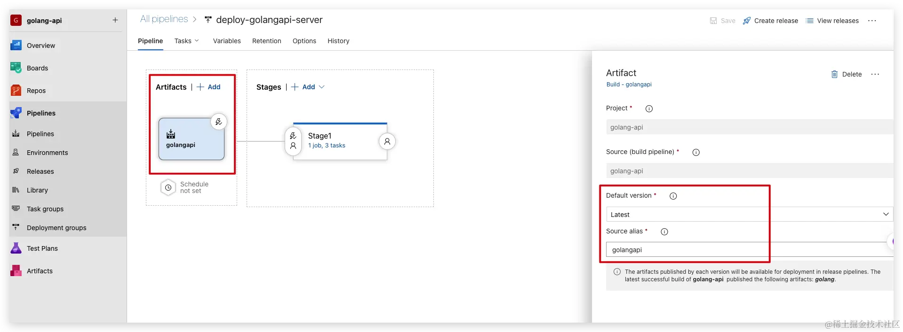 

#### 配置release stages

* 配置FTP上传步骤

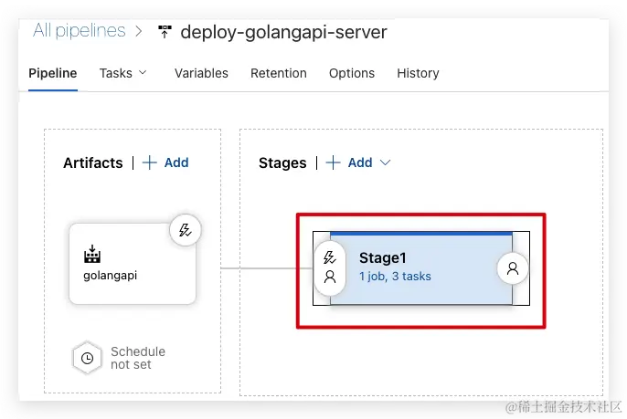 

添加FTP Upload Agent Job，将二进制文件上传到FTP的家目录app目录下，也就是`/data/ftp/testuser1/app` 目录下

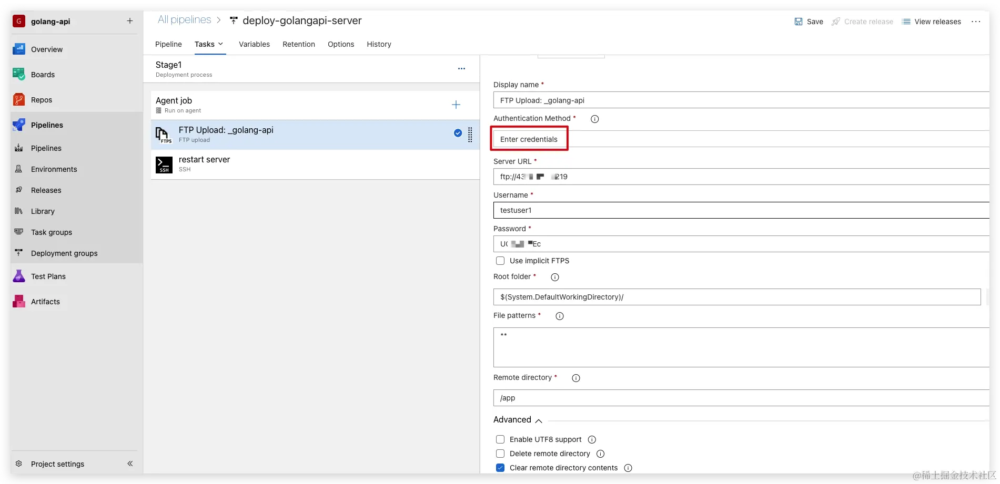 

认证方式利用ftp选择用户名密码，Advanced中选择Clear remote directory contents。


* 配置重新服务器

为了更快捷操作目标服务器中部署的服务，为应用编写服务，先将服务文件添加到目标服务器中，

```
# cat > /usr/lib/systemd/system/golangapi.service <<EOF
[Unit]
Description=Example java App running on centos

[Service]
WorkingDirectory=/data/ftp/testuser1/app
ExecStart=/data/ftp/testuser1/app/golangapi
Restart=always
# Restart service after 10 seconds if the dotnet service crashes:
RestartSec=4
#KillSignal=SIGINT
User=root


[Install]
WantedBy=multi-user.target
EOF

# 重载服务
# systemctl daemon-reload
```

* 添加remote ssh 重启服务

添加ssh Manage

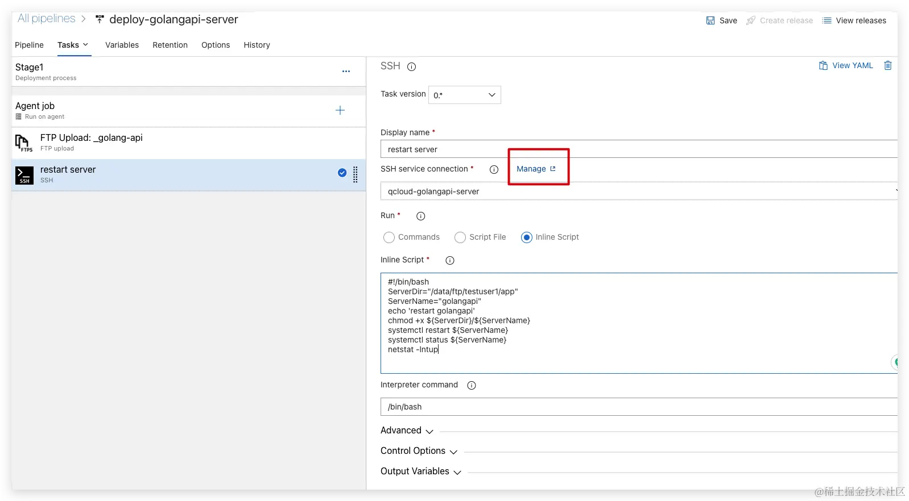 

配置服务链接

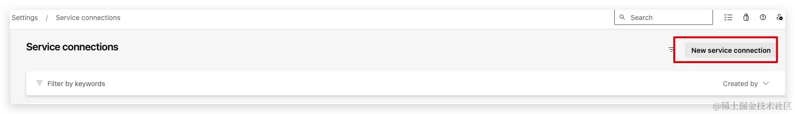 

选择ssh方式

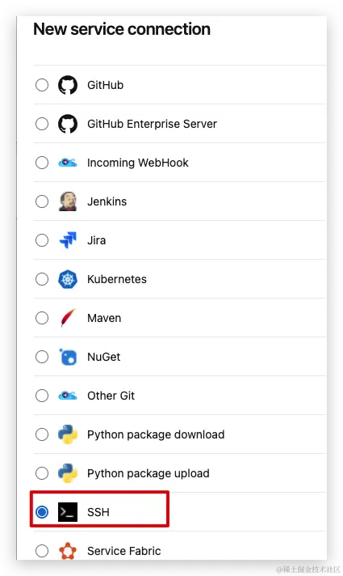 

配置服务链接

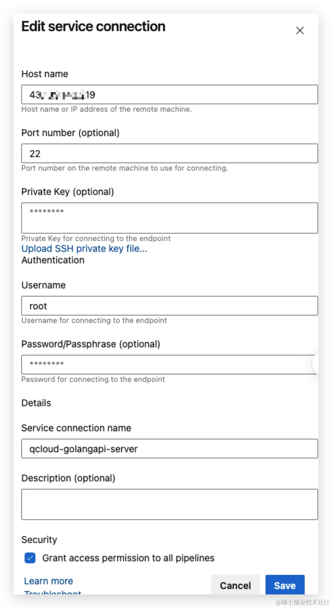 

完成服务链接

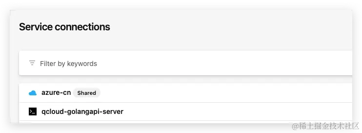 

至此完成了release的配置。

## 六 配置pipeline与release联动

关联Pipeline和Release

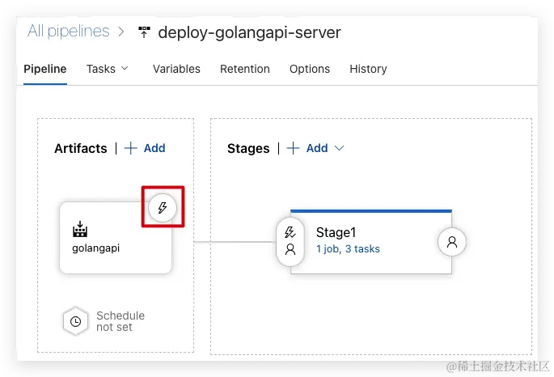 

配置Continuous deployment trigger 启用，当pipeline完成后出发release方式。

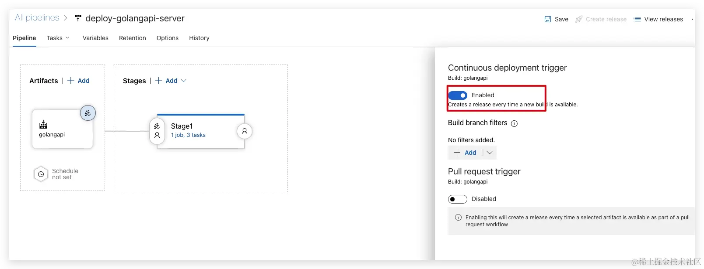 

## 七 触发测试

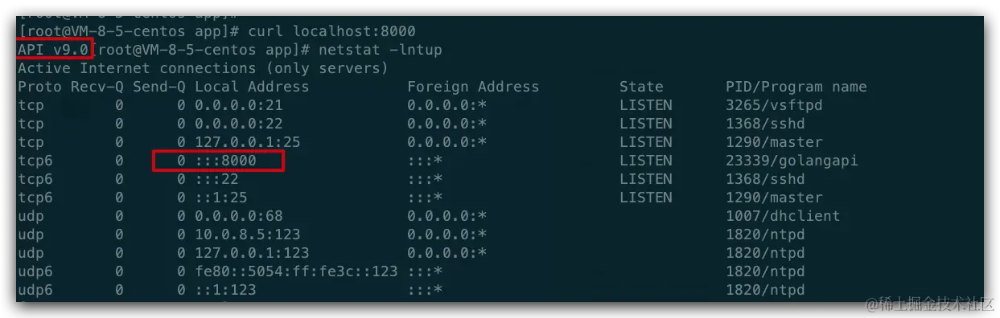 

手动修改main.go 文件中版本号

进行触发pipeline和release流程。

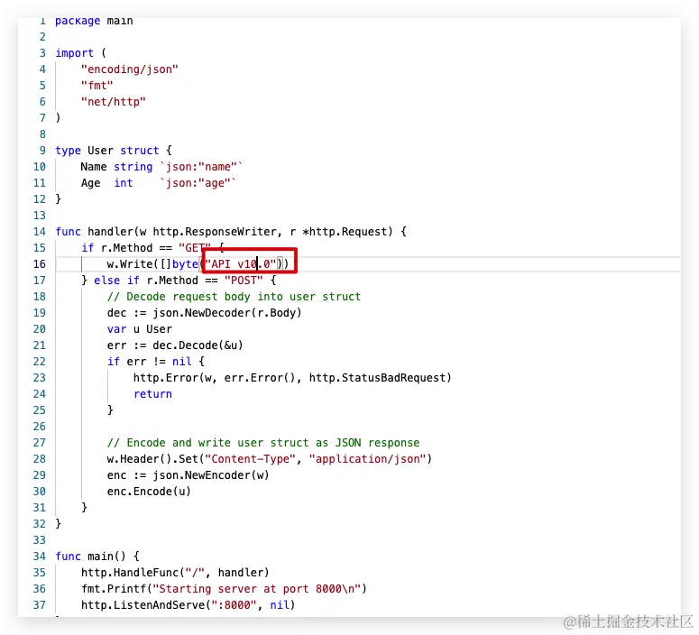 

查看pipeline流程

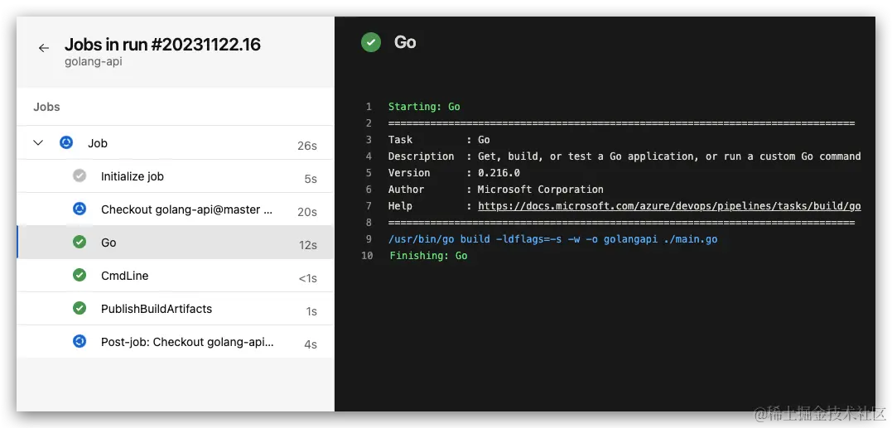 

完成pipeline后，自动触发release流程

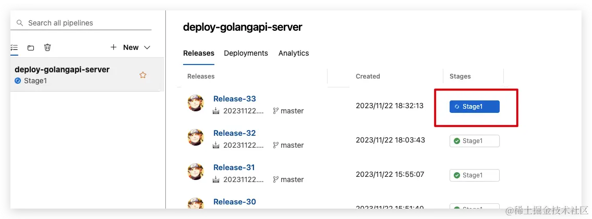 

查看日志

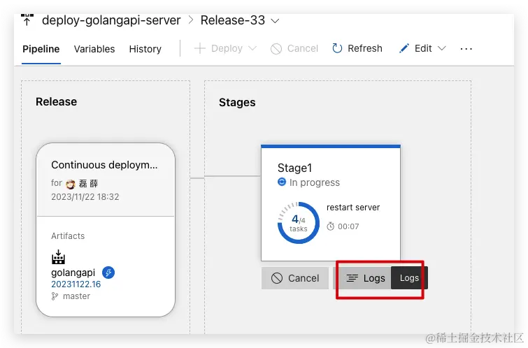 

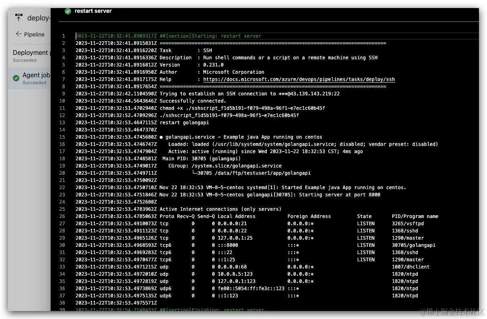 

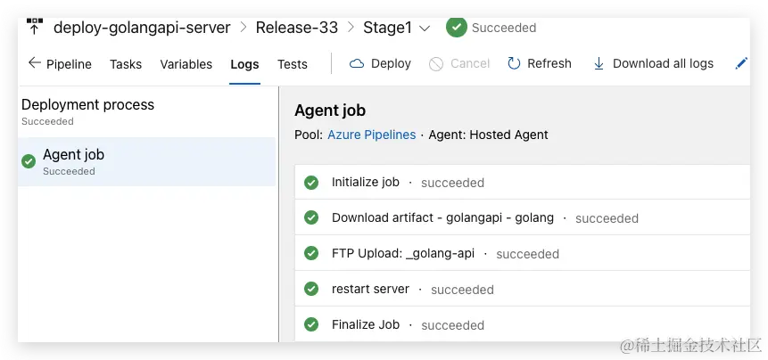 

验证服务

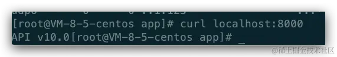 


至此完成了利用Azure Repos进行代码托管，Azure Repos类似github/gitlab等源码托管平台，利用Pipelines进行代码构建，利用Release进行发布，联动功能实现出发代码修改，自动完成CI/CD整套流程。

## 注意事项

* 免费的流水线制品仓库，我们的仓库是有限的，大小默认是是2GB，所以大家要及时去删除自己的制品，避免仓库被占满，当然，如果你是商业用户的话不需要考虑这个问题。
* 安全性设置：确保适当地配置和管理Azure DevOps的安全设置。这包括访问控制、权限管理和身份验证等方面。使用强密码和多因素身份验证来保护账户的安全。组织和项目结构：在开始项目之前，合理规划和组织Azure DevOps中的组织和项目结构。考虑团队和项目的层次结构，以便更好地管理团队成员、工作项和代码库。
