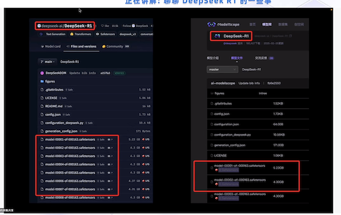
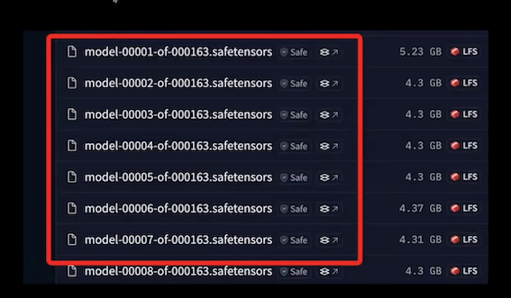
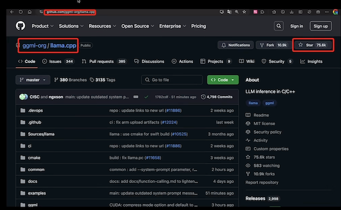
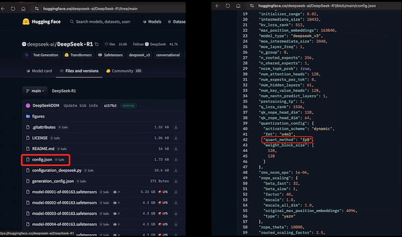

# 1 DeepSeek 模型介绍

## Distill Model

**DeepSeek-R1-Distill**

1. DeepSeek-R1-Distill-Qwen-1.5B: 15亿参数
2. DeepSeek-R1-Distill-Qwen-7B: 70亿参数
3. DeepSeek-R1-Distill-Qwen-8B: 80亿参数
4. DeepSeek-R1-Distill-Qwen-14B: 140亿参数
5. DeepSeek-R1-Distill-Qwen-32B: 320亿参数
6. DeepSeek-R1-Distill-Qwen-70B: 700亿参数

## safetensors

1. 分块存储与并行加载
2. 按需加载
3. 容错性与恢复能力
4. 简化更新过程

* 权重（张量）
* safetensors (张量)

### safetensors 设计目标

1. 安全性
2. 跨桩架兼容
3. 保留模型原始精度

## GGUF 格式 / 4-bit 量化格式

GGUF 格式

* DeepSeek-R1-GGUF
* DeepSeek-R1-Distill-Llama-8B-GGUF
* DeepSeek-R1-Distill-Qwen-1.5B-GGUF
* DeepSeek-R1-Distill-Qwen-7B-GGUF
* DeepSeek-R1-Distill-Qwen-14B-GGUF
* DeepSeek-R1-Distill-Qwen-32B-GGUF.
* DeepSeek-R1-Distill-Llama-70B-GGUF

**DeepSeek-R1-GGUF -> DeepSeek-R1**

**DeepSeek-R1-Distill-XX-GGUF -> DeepSeek-R1-Distill**

### 4-bit 量化格式：

* DeepSeek-R1-Distill-Llama-8B-unsloth-bnb-4bit
* DeepSeek-R1-Distill-Qwen-1.5B-unsloth-bnb-4bit
* DeepSeek-R1-Distill-Qwen-7B-unsloth-bnb-4bit
* DeepSeek-R1-Distill-Qwen-14B-unsloth-bnb-Abit
* DeepSeek-R1-Distill-Qwen-32B-unsloth-bnb-4bit
* DeepSeek-R1-Distill-Llama-70B-unsloth-bnb-4bit

**DeepSeek-R1-Distill-XX-unsloth-bnb-4bit -> DeepSeek-R1-Distill**

### GGUF - GPT-Generated Unified Format

**跨平台兼容**

**量化方法**

* 训练后量化(PTQ）
* 量化感知训练(QAT)

**训练后量化 (PTQ)**

* 静态量化
* 动态量化

**量化算法**

* 对称与非对称
* 线性与非线性

**GGUF 格式天然支持量化技术**

* `Q4_K_M` 
* `Q5_K_M`

> **safetensors 文件原生不支持量化** bitsandbytes

* safetensors -> Pytorch & Tensorflow
* GGUF -> llama.cpp

### `Q4_K_M` 

* Q4 -> 4-bit 量化
* K -> K-means 聚类算法
* M一＞混合精度量化 

