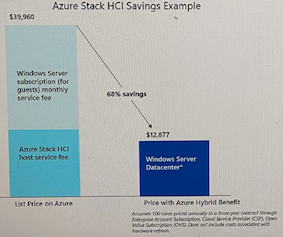

# **4 Azure Stack HCI 面向混合云和数据中心现代化的最佳基础设施**

* 微软混合云概览
* 混合设计的超融合基础设施
* Azure Arc混合云
* 许可模式

### **客户环境和应用程序需求是不断发展**

通过`Azure Arc`获得统一的控制平面

* 如何跨不同的环境进行管理和操作？
* 如何确保整个组织的安全性？
* 如何最好地实现创新和开发人员的敏捷性？
* 如何满足临管要求，克服技障碍？

**多样化的基础设施**

**多云**

### Azure Migrate Support for Azure Stack HCI

**Existing Solutions**

* Migrate manually
* Migrate with SCVMM
* Migrate with 3rd party tools

**Azure Migrate to Azure Stack HCI**

* Unified migration tooling
* On-prem to on-prem
* No guest agent
* Minimal downtime
* Replication
* Test migration

### Azure Arc 提供单一控制平面

* 将 **Azure 服务**运行到任何基础架构上
* 使用 **Azure stack** 进行数据中心的现代化革新
* 借助**Azure loT**扩展到边缘位置

**Azure Stack HCI**

> 现代化订阅服务，灵活的、熟悉的超融合基础设施

**Azure 混合设计**

* 与 Azure 原生集成，从 Azure 门户集中管理
* 统一的 Azure 订阅计费，获得 Azure 权益，定期获得功能和安全更新
* 免费获取 Windows Server和SQL Server 2008/2012 扩展安全更新

**软件定义的基础架构**

* 基于 Hyper-V、存储空间直通和网络控制器的高性能超融合基础架构
* Windows和Linux的安全虚拟化平台，及云原生的容器化平台
* 内置高可用和灾难恢复技术

**经过验证的解決方案**

* 经过验证的基于标准化参考架构的节点，可支持GPU
* 群集支持1节点到16节点，最小支持单节点部署
* OEM可提供硬件及服务的交付

https://azurestackhcisolutions.azure.microsoft.com

### 何时使用Azure Stack HCI

当客户需要灵活地满足监管和连接需求时，需要多个用例

* 现代化和安全你的基础设施
* 合理运行智能边缘和远程分支解决方案
* 业界最佳性能的SQL Server数据库
* 通过与Azure Arc支持的 AKS紧密集成，都署云原生应用和Azure Arc支持的服务
* 使用Azure StacK HCK 的Azure 虚拟桌面提供一流的虚拟桌面体验（公开预览2）

### Azure Stack HCI 和 Azure Arc 混合云架构

> 链接到现有的AD服务器, **Windows Admin Center可部署在本地VM (4Core/16G) 或 Azure

### **通过本机 Azure 集成简化混合**

* Azure 资源管理器 (ARM） 资源代表每个本地 Azure Stack HCl 群集
* Azure 门户中的可见性和混合管理的基础
* 本地可通过Windows Admin Center管理

基于延伸群集实现本地灾难恢复

* 建立跨房间、跨建筑甚至跨城市的Azure Stack HCl群集
* **同步或异步存储复制、可选加密方案、站点本地弹性**

### Azure Stack HCI的安全性

**确保连接 Azure Arc 工作负载的安全**

* Azure Stack HCI 拥有最好的
* Azure 云安全性能，可确保
* 连接到 Azure Arc 的本地工作的安全性。
	* Azure Defender - 用于 HCI 上的 Azure Kubernetes Service (AKS)
	* 软件定义网络
	* 利用弹性工作负载平台

**为您的安全环境提供可靠补充**

客户可以添加 Azure Stack HCI 节点和更新，对运营安全的影响为零。

**为受严格监管的客户提供赋能**

客户可以将 Azure Stack HCl 作为认证平台，并为客户提供申计材料（例如，FedRAMP 和 PCI 审计)

* 安全的内核：基于硬件的安全性
* 强化和弹性的平台
* 静志数据和传输中的数据加密
* Azure Defender: 检测/相应

* FIPS
* CNSSP-15
* LOA-按需

### 降低Windows Server安全风险和使用成本

评估2012工作负载的选择：Azure Stack HC提供与Azure同样的免费扩展安全更新

## Azure Arc 将Azure创新带到本地基础架构

### Azure Arc 提供的单一控制平面

> 管理本地、多云和边缘环境

* 跨环境管理和治理

* 大规模 Kubernetes 应用管理

* 随处运行Azure Paas服务

### 为混合云和多云打造的 一致的Azure 平台

**数据不出境 但同时拥有 Azure 优势**

* 在云端运行 Azure 运算服务
* 将Azure 扩展到整个环境连结Azure中上百种服务
* HCI+Arc 在本地端符合客户各式需求
* 在任何地方实施 **Azure 安全性及资安服务**

**启用了 Arc 的 Azure 服务器**

* 组织、清点和监控
* 治理与安全
* 简化的基于角色的操作
* 物理，虚拟 Windows, Linux

**启用了 Azure Arc 的 SQL Server**

* 组织、清点和监控
* 治理与安全
* 与现有 SQL 服务器一起使用
* 免费 SQL评估

**启用了 Azure Arc 的 Kubernetes**

* 组织、清点和监控
* 治理与安全
* 监控和政策
* 基于 GitOps 的零接触部署

### 启用Azure Hybrid Cloud的四个步骤

* 部署 Azure Stack HCl， 它会立即在门户中显示为已启用 Azure Arc的资源
* 在门户中的 Arc 中，可以部署容器、虛拟机和服务
* 已部署的资源也会通过 Arc 显示在门户中，因此您可以管理、保护、治理它们
* 通过 Arc提供的 Azure Stack HCI 的支持、可观测性和更新

**Azure Stack HCI 计算**

**Azure Stack HCI 灵活的计费模式**

**每月63元人民币 每个物理处理器的核心**

* 获益：
* 简单： 无需计算内存 存储或网关入口/出口

### Stack HCl 具有始终最新的订阅

* 每月安全和质量更新，在与 Windows 相同的"星期二补丁“时间线上
* 有时，每年一次或两次，每月更新将是具有新功能的所谓"功能更新”
* OEM 固件 驱动程序包通常每季度提供一次

### 降低客户采用AZS HCI和AKS成本

**面相Windows Server+ SA客户新的Azure Hybrid Benefit**

**Azure Stack HCI**

* 使现有数据中心和边缘基础结构现代化，以运行其 VM 和基于容器的工作负荷
* Windows Server Datacenter A Azure Stack HCI.

**AKS**

* 在数据中心使用 AKS 部署和管理容器化应用程序
* Windows Server 软件保障(SA)和云解决方案提供商(CSP)的订阅客户无需额外的费用. 既可以将AKS扩展到Windows Server 和 Azure Stack HCI.

