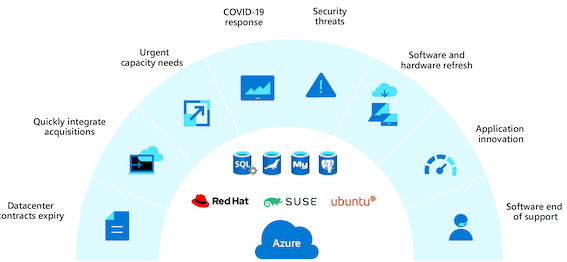
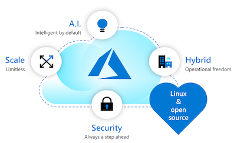
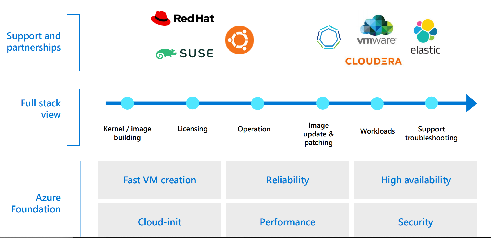
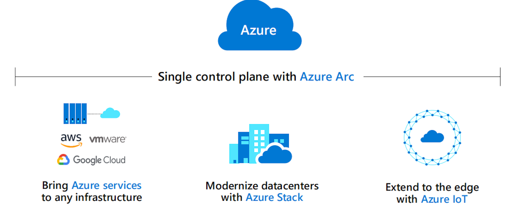
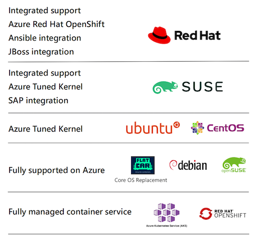
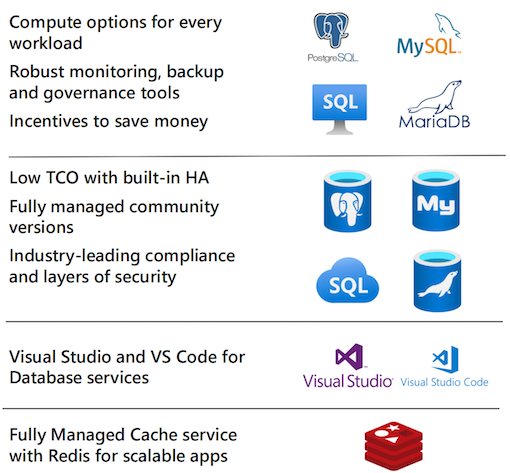

# **2 Linux OSS Database Migration**

## **Linux on Azure and Open Source Databases**

**Migration triggers**

**Get more from open source on Azure**

* Seamless migration of Linux workloads
* Support for modern development including Azure Kubernetes Service
* Choice of fully managed open source databases including MySQL, PostgreSQL and MariaDB
* Compatibility with latest open sourc extensions and tools
* Enjoy community-driven quality with a large developer network

> 90% of enterprises deploy open source in some form

**A wide open-source ecosystem for every workload**

**Best-in-class Linux & container infrastructure**

* Seamless migration to Linux and container offerings
* Native Linux on Azure experience with Linux ecosvstem partner support

**Choice of open source databases**

* Fully managed databases services for MySQL, PostgreSQL & MariaDB
* Linux infrastructure for SQL and open source databases

**Hybrid anywhere**

* Innovatn anvwhere with Azure for your hybrid architecture
* 60+ Azure regions around the world and 700+ VM size options

**Built for existing Linux investments**

* Built-in tools and support for existing software and hardware
* Familiar tools tor smooth onboarding

> Enterprise-grade security and compliance

### **Best-in-class Linux & container infrastructure**

**Linux ecosystem partnership and support**

Ongoing support and solutions jointly developed with Azure partners

**Native Linux experience with enhanced capabilities**

Managed container offerings and Linux enhancements like built-in Azure Tuned Kernel with tooling of your choice at every step

**Cost-effective options**

Flexible payment options for your business including pay as you go and bring your own license

**Built-in security, manageability, and governance**

Automatic patching, updates, and high availability built-in

> All in the Azure ecosystem： Backed by the flexibility and hybrid connectivity of Azure

**Seamless end-to-end Linux on Azure experience**

## Choice of open source databases

Azure open source database services

* Fully managed community databases
	* **Minimal admin of MySQL, PostgreSQL, and MariaDB**
* Best total cost of ownership
	* Built-in high availability for lower operating costs
* Built-in intelligence
	* Intelligence for optimized performance and security
* **Enterprise scalability with Hyperscale**
	* Scaling of PostgreSQL across hundreds of nodes

* Secure and compliant： Advanced Threat Protection and
Azure IP Advantage
* Integrated with Azure services： Streamlined experience for open source frameworks and languages

**Lowest TCO with built-in high availability**

* Take advantage of Azure to maintain business continuity at 50% cost savings compared to AWS RDS
* Get 99.99% SLA guarantees without the need to create a replica, compared to AWS' 99.95% HA with multi-availability zones
* Optimize your infrastructure cost by right-sizing your instances based on workload demands
* Reduce development and BA costs associated with performance troubleshooting and alerting

**SQL Server for Linux on Azure Virtual Machines**

* **Best total cost of ownership**: Pay up to 84% less than AWS
* **Industry-leading database**: An enterprise-grade unified data platform
* **High performance on any OS**: Leading performance on Linux or Windows
* **Built-in security and manageability**: Automatic security updates and built-in availability

All in the Azure ecosystem: Backed by the flexibility and hybrid connectivity of Azure

### Migrating your database to Azure

Azure provides wide database options for your workloads

#### **On-premises**

> SQL Server, MySQL, PostgreSQL and  MariaDB

* **Intelligent Features**

Intelligent security and performance features

* **Managed by Microsoft**

	* Virtualization
	* Hardware
	* Datacenter management
	
		* High availability/DR/Backups
		* Database provision/Patch/Scaling
		* OS provision/patching
		* Virtualization
		* Hardware
		* Datacenter management
	
* **Managed by customer**

	* Applications
	* Data
	* High availability /DR/Backups
	* Database provision/ Patch/Scaling
	* OS provision/patching
	* Virtualization
	* Hardware
	* Datacenter management

#### IaaS

> SQL Server on Azure VMs, MySQL, PostgreSQL and MariaDB

* **Managed by Microsoft**

	* Virtualization
	* Hardware
	* Datacenter management

* **Managed by customer**
	
	* Applications
	* Data
	* High availability/DR/Backups
	* Database provision/Patch/Scaling
	* OS provision

#### PaaS

> SQL Server on Azure VMs, MySQL, PostgreSQL and MariaDB

* **Intelligent Features**
	* 	Intelligent security and performance features
* **Managed by Microsoft**
	* High availability/DR/Backups
	* Database provision/Patch/Scaling
	* OS provision/patching
	* Virtualization
	* Hardware
	* Datacenter management
* **Managed by customer**
	* Applications
	* Data

## Hybrid anywhere

### Innovation anywhere with Azure Hybrid

**Data, AI and App services on any cloud, any Kubernetes**

Azure Arc supports SUSE Linux Enterprise Server, Red Hat Enterprise Linux and OpenShift And other Linux distributions and Kuberetes environments

**Bring Azure services to any infrastructure**

* Access the latest cloud capabilities
* Enable scalability and rapid deployment
* Take advantage of cloud billing

### Azure VMware solution

* A comprehensive VMware environment on dedicated Azure infrastructure, built by Microsoft and VMware
* It runs your VMware workloads natively on Azure, supported and operated by Microsoft
* It allows you to manage, and secure applications across VMware environments and Microsoft Azure with a a consistent operating framework

### **Linux and open source databases offerings on Azure**

**Unique Azure offerings for Linux and containers**

**Unique Azure offerings for SQL Server and open source databases**

